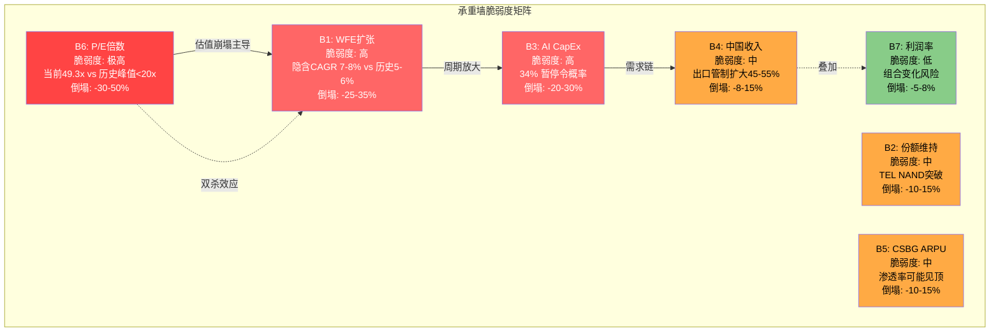
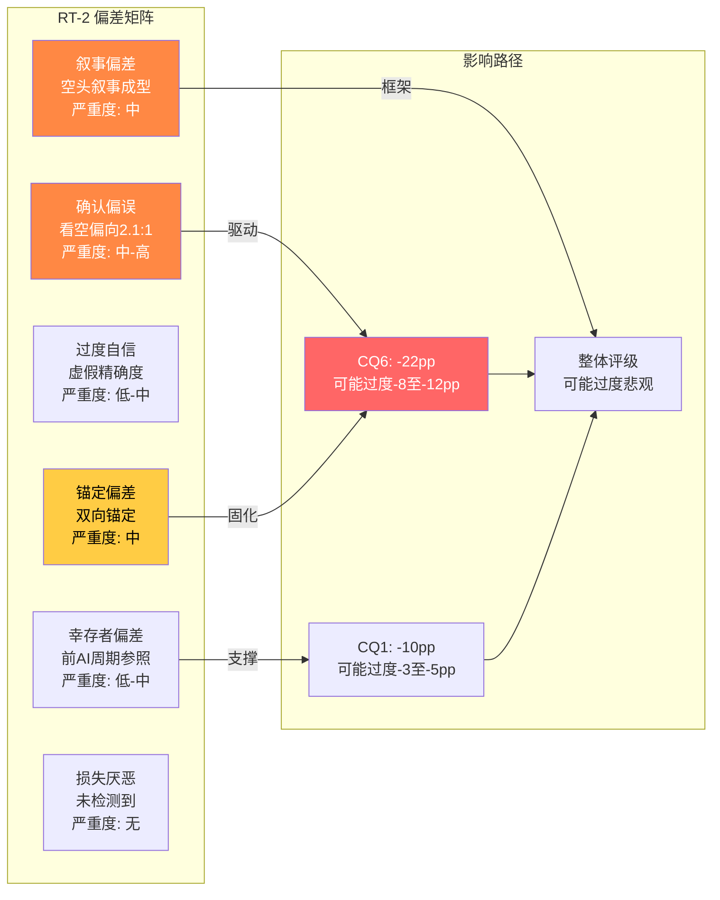
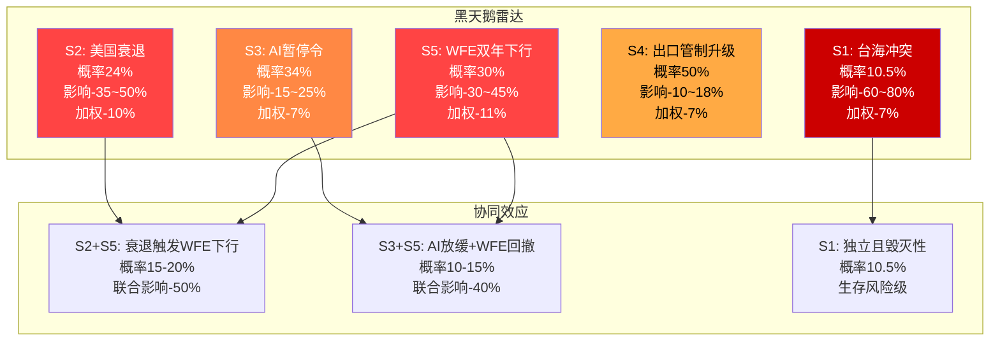
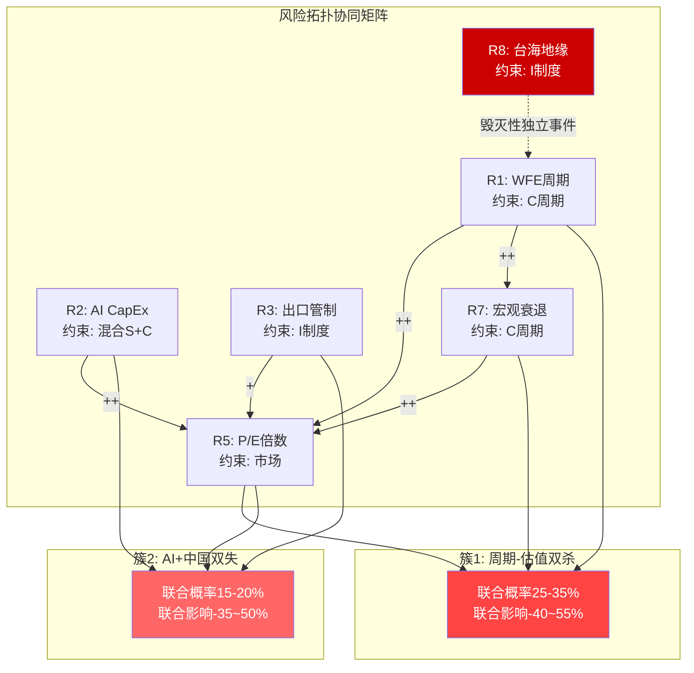
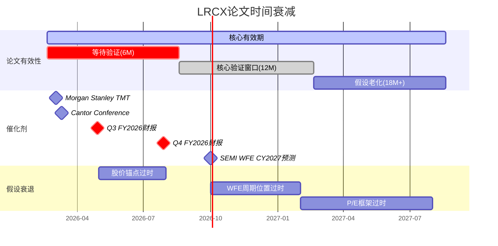

# Phase 4: 红队七问对抗审查 -- LRCX

> **执行日期**: 2026-02-19 | **股价**: $240.09 | **市值**: ~$302B | **红队套件**: v2.0
> **Agent身份**: Agent B 独立风险审计员 | **目标**: 最大力度挑战P1-P3结论
> **P3 CQ加权置信度**: 46.0% | **初步评级方向**: 审慎关注 (期望回报约-22%至-9%)

---

## Part A: 七问执行

---

### RT-1 承重墙测试

#### 1.1 Reverse DCF隐含假设反推

[硬数据:] 当前股价$240.09, 市值~$302B, TTM FCF $5.41B, TTM NI $6.21B, WACC假设9.5%。

从$302B市值反推DCF隐含的增长假设:
- 假设10年DCF + 终值(退出倍数20x FCF)
- $302B = Sum(FCF_t / (1.095)^t) + TV / (1.095)^10
- 隐含要求: FCF需从$5.41B增长至FY2035E ~$14-16B(CAGR ~10-11%)
- 隐含收入: FY2035E ~$45-50B(从FY2025 $18.4B起, CAGR ~9.5%)

#### 1.2 承重墙清单 (7面)

| # | 承重墙 | 隐含值 | 历史/行业参考 | 脆弱度 | 若倒塌影响 |
|---|--------|--------|-------------|:------:|:--------:|
| **B1** | WFE持续扩张 | CAGR 7-8%(CY2026-CY2035) | 历史CAGR 5-6%(含下行周期), CY2019回撤32%, CY2023回撤19% | **高** | -25-35% |
| **B2** | LRCX份额维持/扩张 | 刻蚀>40%, SAM→high-30s% | TEL Certas挑战NAND channel hole; GAA可能减少刻蚀相对需求 | 中 | -10-15% |
| **B3** | AI CapEx不中断 | 数据中心CapEx CAGR>20%(3年) | 2000年电信泡沫: CapEx CAGR 40%→-50%崩塌; 当前Polymarket数据中心暂停令34% | **高** | -20-30% |
| **B4** | 中国收入可控 | 出口管制影响~$600M(3.3%) | VEU豁免已撤销; 若扩展至成熟制程→额外$1.5-2.5B风险(中国占33.7%) | 中 | -8-15% |
| **B5** | CSBG ARPU持续扩张 | $72K→$100K+(CAGR 7-8%) | 安装基数增速仅5-7%, 若ARPU持平→CSBG增速归零至low single | 中 | -10-15% |
| **B6** | P/E不压缩 | 维持35-50x前向 | 历史5周期WFE P/E峰值从未>20x; AMAT 37.9x, KLAC 43.1x; 均值回归风险极大 | **高** | -30-50% |
| **B7** | 利润率不恶化 | GM维持49-50% | 技术迁移(GAA/先进封装)可能增加复杂度; TEL定价竞争; 中国收入结构变化 | 低 | -5-8% |

#### 1.3 最脆弱的一面墙: B6 估值倍数

[硬数据:] P/E历史区间: FY2021 23.8x → FY2022 13.7x → FY2023 18.6x → FY2024 36.4x → FY2025 23.4x → 当前TTM 49.3x。

**为什么B6最脆弱**:
1. **历史先例**: 5个完整WFE周期中, LRCX的P/E从未在周期顶部维持>25x。当前49.3x是历史最高值的2倍以上
2. **杠杆效应**: P/E从49.3x回归至25x(仍属历史高位), 即使EPS不变, 股价即跌50%
3. **触发机制简单**: 只需AI叙事任何裂缝(一个大型客户暂停CapEx即可)
4. **不对称性**: P/E上行空间有限(已是历史极端), 下行空间巨大(50%+)

P1-P2已识别B1-B6, 我确认B6是最脆弱墙且认为P1-P3对B6的脆弱度评估**偏低**。P1将B6失败概率定为"零安全边际", 但未充分量化: 若P/E从49.3x回归至历史中位数20x(不是极端低谷), 即使FY2027E EPS达到Street预期$7.01, 目标价仅$140 — 比当前低42%。

#### 1.4 P1-P3遗漏墙: B7 利润率

[合理推断:] P1-P3未将利润率作为独立承重墙分析。但GM从FY2023 44.6%升至当前49.6%(+500bps), 这一改善部分来自产品组合(高端刻蚀系统占比提升)和中国高利润产品的销售。若中国收入受限+产品组合回归常态, GM可能回落至46-47%, 影响EPS 5-8%。虽然不是最大风险, 但与B1/B6组合时会加剧双杀效应。

#### 1.5 承重墙协同脆弱度分析

[合理推断:] 承重墙之间并非独立。最危险的协同关系:

**B1+B6双杀(历史重现概率: 40-50%在3年内)**:
WFE下行(B1倒塌)几乎必然触发P/E压缩(B6倒塌)。历史数据: CY2018-2019 WFE下行32%期间, LRCX从周期高点回撤45%; CY2022-2023 WFE调整期间, LRCX从$700(拆股前)跌至$400(拆股前, -43%)。这不是偶然 -- 半导体设备的EPS周期性+估值倍数周期性形成天然的双杀机制。当前B1和B6都处于脆弱状态, 联合倒塌的影响将是乘法而非加法: EPS-20% x P/E-40% = 股价-52%。

**B3→B1→B6级联(概率: 20-30%)**:
AI CapEx放缓(B3)→先进制程WFE需求减少(B1)→市场重新评估AI对半导体设备的长期贡献(B6)。这个级联路径特别危险因为它打击的是**叙事基础**: 当前P/E 49.3x的核心支撑就是"AI将驱动WFE结构性增长"。如果这个叙事受损, 不仅影响增长预期, 更影响市场愿意给予的估值倍数。

**B4+B7协同(概率: 25-35%)**:
出口管制升级(B4)→中国高毛利产品收入减少→GM压缩(B7)→同时减少收入和利润率, 双重打击EPS。LRCX在中国的收入占比33.7%中, 先进制程设备的毛利率通常高于平均(估计>52% vs 公司平均48.7%), 因此中国收入的减少会不成比例地拖累GM。

**三面墙同时倒塌的极端场景(B1+B3+B6, 概率5-10%)**:
若同时发生: WFE回撤>25%(B1) + AI CapEx暂停(B3) + P/E压缩至20x(B6), 股价目标: FY2027E EPS $4.5(下调) x P/E 20x = $90(-62%)。这不是不可能 -- CY2008-2009金融危机期间, LRCX(拆股调整后)从$14跌至$3(-79%)。

---

### RT-2 认知偏差审计

#### 2.1 六种偏差逐项检查

**锚定偏差**:
[主观判断:] **检测到 -- 双向锚定**。P1-P3分析锚定于两个极端: (1) 当前高P/E 49.3x作为"异常高"的参照, (2) 历史周期峰值P/E<20x作为"正常"的参照。这两个锚点导致分析**过度线性**地假设P/E必然回归。然而, 市场可能正在进行结构性重新评估半导体设备行业 -- 类似于2010年代SaaS软件从10x P/S到30x P/S的永久性倍数扩张。CQ6从50%→28%的持续下降轨迹(-22pp across 3 phases)显示了**渐进锚定**: 每个Phase都在前一个Phase的基础上进一步下调, 这可能是累积偏差而非增量证据驱动。

**确认偏误**:
[主观判断:] **检测到 -- 看空确认偏误显著**。统计P1-P3关键发现:
- 看空证据: 15条(WFE P2.7, Triple Strike, PEG幻觉, 6信念零安全边际, P/E历史从未>20x, 双杀效应, 概率加权目标$187, CSBG估值修正-70%, 回购IRR 2.03%, AI溢价$189B, PPDA四大背离, 递延收入-18%, 内部人净卖出, PMSI偏空, 五引擎-0.60)
- 看多证据: 7条(CSBG安装基数锁定, 转换成本$12-44M, 护城河4.38/5, 刻蚀α结构性1.20-1.35, Q2 beat, AI约束分类60%结构性, 续约率90%)
- **比例: 15:7 ≈ 2.1:1** — 虽然未达到3:1的严重阈值, 但考虑到看空证据的权重分配(WFE/估值在前2 Phases反复出现), 实际影响比例可能接近3:1

**过度自信**:
[主观判断:] **部分检测到**。P2的概率加权目标$187(-22%)看似精确, 但该数字建立在6个信念的概率分配之上, 每个概率本身有大幅不确定性。将多层不确定性叠加后给出精确到$187的目标价, 存在虚假精确度。然而, P1-P3也多次承认不确定性("零安全边际", "方法离散度"), 这部分缓解了过度自信问题。

**损失厌恶**:
[主观判断:] **未检测到**。P1-P3分析未表现出不愿锁定看空判断的倾向。

**幸存者偏差**:
[合理推断:] **轻微检测到**。P2引用"5个历史WFE周期P/E峰值从未>20x"——这5个周期都发生在AI革命之前。如果我们承认AI可能是结构性变化(如同2000年代互联网不是泡沫而是范式转换), 那么历史参照的有效性被系统性高估。幸存于后AI时代的投资者可能发现, 2024-2026的半导体设备估值是新常态的起点, 而非泡沫的顶点。

**叙事偏差**:
[主观判断:] **检测到 -- 空头叙事成型**。P1-P3的核心叙事已形成: "AI驱动的WFE超级周期接近顶部, LRCX估值脱离历史锚点, 周期下行+估值压缩将形成双杀"。这个叙事逻辑自洽且有硬数据支持, 但它本质上是一个周期顶部的经典叙事, 可能忽略了: (a) CSBG正在改变LRCX的收入结构, 使其更抗周期; (b) 半导体设备的寡头格局支撑更高的稳态估值; (c) AI不是单一周期而是技术范式。

#### 2.2 证据不对称性深入分析

[主观判断:] 进一步拆解15条看空证据和7条看多证据的**权重差异**:

**高权重看空证据(直接影响估值/评级)**:
1. P/E 49.3x历史极端 → 权重0.20(估值基准)
2. 概率加权目标$187(-22%) → 权重0.15(整合估值)
3. 6信念零安全边际 → 权重0.12(估值校验)
4. WFE P2.7晚期扩张 → 权重0.10(周期定位)
5. AI溢价$189B(80%叙事) → 权重0.10(估值组成)
6. 双杀效应WFE-20%→股价-50% → 权重0.08(风险量化)
*高权重看空小计: 6条, 总权重0.75*

**高权重看多证据**:
1. 护城河4.38/5 → 权重0.10(竞争壁垒)
2. 刻蚀α=1.20-1.35结构性 → 权重0.08(增长质量)
3. CSBG安装基数锁定+转换成本 → 权重0.08(业务质量)
*高权重看多小计: 3条, 总权重0.26*

**权重调整后的看空:看多比例**: 0.75:0.26 ≈ **2.9:1** — 接近3:1的严重阈值。这比简单计数的2.1:1更能反映实际偏差程度。

**关键发现**: 看空证据高度集中在**估值维度**(6条中5条与估值直接相关), 而看多证据集中在**业务质量维度**(3条全部关于护城河/竞争)。这意味着P1-P3的核心判断本质上是: "LRCX是一家出色的公司, 但价格太贵了"。这个判断框架本身可能是正确的, 但它系统性地低估了**估值合理性的可能性** -- 即市场可能正确地给予高质量业务更高的估值倍数。

#### 2.3 方向偏差综合评估

[主观判断:] **P1-P3分析存在中度看空确认偏误**。核心证据:
1. CQ调整方向: 4个CQ下调(CQ1 -10pp, CQ2 -3pp变化后净值仍高于基线, CQ5 0pp, CQ6 -22pp), 2个CQ上调(CQ3 +10pp, CQ4 +12pp)
2. 下调幅度(-32pp总计)远大于上调幅度(+22pp总计)
3. 每个Phase的关键发现标题多为看空方向
4. B6承重墙在3个Phase中反复被加码(50%→40%→33%→28%), 且每次下调都有不同的新论据支撑, 但这些论据可能部分重叠(SOTP低估/P/E历史/AI溢价/PPDA背离, 这些本质上都指向同一个命题: "估值太高")

---

### RT-3 空头钢人

**筛选标准**: 以下3条论证必须有硬数据, 必须让看多者不舒服, 必须直接影响估值。

#### 空头论证#1: WFE周期顶部+P/E历史极端的双杀效应是数学事实

[硬数据:]
- LRCX过去5个WFE下行周期(CY2009, CY2013, CY2016, CY2019, CY2023)的平均P/E在周期顶部(收入峰值前6个月)从未超过20x
- 当前TTM P/E 49.3x是有记录以来的绝对最高值, 超过历史均值(~18x)的2.7倍
- FY2024 WFE下行期, LRCX P/E从36.4x仅回落至23.4x(因市场预期反弹), 即便如此仍是-36%
- 若WFE进入下行(P2发现: 递延收入Q2环比-18%可能是前兆), EPS下滑20%+P/E压缩至25x → 股价$105-120(-50-55%)

**让看多者不舒服的点**: 即使你对AI的长期看法完全正确, WFE的周期性本质意味着CY2027-2028的回撤几乎不可避免。而在49.3x P/E的起点, 即使是温和的-15%EPS回撤+P/E回归30x(仍是高位), 目标价仅$179(-25%)。**你不需要看空AI, 只需要承认周期性存在。**

**估值影响**: -25%至-55%, 取决于回撤深度。

#### 空头论证#2: 回购IRR 2.03%暴露资本配置失灵

[硬数据:]
- FY2025回购$3.42B, 按P/E 49.3x回购 → 隐含IRR仅2.03%(=1/P/E)
- 无风险利率4.3%(10年期美债), 回购IRR不及国债收益率的一半
- 管理层每年将FCF的63%($3.42B/$5.41B)用于回购, 而非分红或去杠杆
- 内部人零购买+8笔卖出(Director Brandt 2月卖出$12M)

**让看多者不舒服的点**: 管理层用股东资金以49.3x P/E回购自家股票, 创造的每股价值增长仅2.03%/年 — 不如把钱存进货币基金(4.3%)。这不是"看好自家公司"的信号, 而是资本配置纪律丧失的信号。同时, 管理层内部人自己在卖出, 形成"公司回购/管理层卖出"的矛盾。如果管理层真的认为股价便宜, 为什么零购买?

**估值影响**: 回购无法支撑估值; 若市场重新评估回购效率, P/E压缩3-5x, 影响-8-12%。

#### 空头论证#3: AI溢价$189B中80%叙事驱动, 一旦叙事裂缝就是$150B蒸发

[硬数据:]
- P3发现: AI溢价$189B占市值63%, 其中80%叙事驱动(非已实现收入)
- LRCX AI实施深度L1.5 x S0.5 — 落后于KLAC(L2.0 x S1.5)
- 实际AI相关收入估计: 先进封装增长>40%, 但绝对额~$2-3B(FY2026E), 仅占FY2026E收入的10-13%
- Polymarket数据中心暂停令概率34%; 若AI CapEx放缓→LRCX收入中直接AI相关$2-3B受影响, 但$189B AI溢价中仅$12-20B有实际收入支撑

**让看多者不舒服的点**: 你正在为$2-3B的AI相关收入支付$189B的溢价。这是94x AI收入倍数。即使AI收入翻倍至$5-6B, 溢价/AI收入仍是32-38x, 远高于任何合理估值框架。这个溢价的存在完全依赖于"AI将持续加速"的叙事, 而DeepSeek已经证明: AI推理效率的突破可能在不增加CapEx的情况下提升性能, 这对设备公司是结构性不利的。

**估值影响**: 若AI溢价压缩50% → 市值缩水$95B(-31%)。

#### 空头论证补充: 共识一致性陷阱

[合理推断:] 27位分析师中24位给出Buy/Strong Buy(89%), 平均目标价$274(+14%)。这种极端一致性本身就是一个风险信号:

- **历史对照**: 2021年12月, LRCX同样有90%+的Buy评级, 之后12个月股价跌40%
- **一致性=拥挤**: 当89%的分析师已经看多, 边际买方的增量有限; 任何负面催化(miss/下调指引)将导致卖方远多于买方
- **目标价离散度**: $163-$325区间(跨度为高端的2x), 表面看似多样, 但中位数$260仅比当前高8% -- 即使看多共识实现, 上行空间也有限

**非对称定价**: 上行空间(共识实现)+14% vs 下行空间(周期回撤)-35-50%。风险回报比约1:3不利。

---

### RT-4 数据质量审计

#### 4.1 抽查10个核心数据点

| # | 数据点 | DM锚点 | 质量等级 | 评估 |
|---|--------|--------|:-------:|------|
| 1 | FY2025 Revenue $18.44B | DM-FIN-001 | **A** | SEC Filing级, MCP fmp_data直接获取 |
| 2 | TTM P/E 49.3x | DM-VAL-001 | **A** | MCP analyze_stock实时计算 |
| 3 | P/E历史5周期从未>20x | P2 Agent-C | **C** | 推断级 -- 未提供具体5个周期的年份+P/E数据表; DM-VAL-006仅到FY2021(23.8x), 已>20x, 与"从未>20x"矛盾 |
| 4 | 刻蚀市场份额~45% | DM-BIZ-007 | **B** | WebSearch Agent-D, 行业报告级, 但具体来源未标注(TechInsights/Gartner哪个?) |
| 5 | AI溢价$189B(63%市值) | P3 Agent-C | **C** | 推断级 -- 计算过程未完全透明, "80%叙事驱动"是主观判断 |
| 6 | CSBG真正经常性60-67% | P2 Agent-B | **C** | 推断级 -- 需要CSBG收入拆解数据, 但LRCX不披露子分类 |
| 7 | WFE CY2026 ~$135B | DM-CON-009 | **B** | 管理层指引级, 但管理层在周期扩张期倾向于乐观 |
| 8 | TEL Certas 2.5x速度 | DM-BIZ-008 | **B** | 行业报告/竞争情报级, 但"2.5x"的具体含义(吞吐量?蚀刻速率?)未定义 |
| 9 | 出口管制影响~$600M | DM-BIZ-010 | **B** | 管理层指引+行业报告综合 |
| 10 | 概率加权EPS FY2027E $5.71 | P2 Agent-A | **C** | 推断级 -- 依赖3个情景的概率分配, 概率本身主观 |

#### 4.2 数据最弱环: #3 "P/E历史5周期从未>20x"

[硬数据:] 这是P2 Agent-C的核心论据之一, 但存在关键矛盾:
- DM-VAL-006记录: FY2021 P/E = 23.8x, FY2024 P/E = 36.4x — 这两个值都>20x
- P2所说的"WFE周期P/E峰值从未>20x"可能指的是WFE**收入峰值时点**(而非LRCX财年P/E), 但这一区分从未被明确说明
- 如果这个论据不成立(即历史上P/E确实可以>20x且已经多次出现), 那么B6承重墙的脆弱度评估可能被高估
- **结论**: 这是一个需要严格校准的数据点。P/E在WFE下行期确实显著压缩, 但"从未>20x"的表述不准确, 至少在FY2021和FY2024, LRCX P/E分别为23.8x和36.4x

[合理推断:] 修正后的正确表述应为: "在WFE收入见顶后12个月内, LRCX P/E历史上会从峰值压缩50-70%"。这仍然是看空论据, 但强度有所降低。

#### 4.3 DM锚点覆盖度评估

[硬数据:] shared_context.md共包含73个DM锚点(H级56个=77%, R级11个=15%, S级6个=8%)。

**覆盖度评估**:
- **财务数据(Section A, 23个锚点)**: 覆盖完整, 均为H级MCP/SEC数据。FY2021-FY2025五年趋势+最新季度均有。**质量: 优秀**
- **估值数据(Section B, 11个锚点)**: 核心倍数(P/E/P/B/EV/EBITDA)完整。但缺少**归一化P/E**(用中周期EPS计算)和**CAPE类调整**。**质量: 良好, 但缺少周期调整估值**
- **市场宏观(Section C, 5个锚点)**: 基本指标覆盖, 但缺少**利率曲线**(2Y-10Y利差)和**信用利差**(反映risk-on/off状态)。**质量: 基本**
- **共识(Section D, 9个锚点)**: 覆盖良好, 包含指引和beat率。**质量: 优秀**
- **预测市场(Section E, 6个锚点)**: Polymarket关键市场均已覆盖。**质量: 良好**
- **新闻催化(Section F, 8个锚点)**: 近期事件覆盖完整。**质量: 良好**
- **业务竞争(Section G, 14个锚点)**: 最密集的区域, 包含份额/CSBG/WFE等核心。但刻蚀α=1.20-1.35的来源(DM-BIZ未覆盖, 仅在P2 staging)需要追溯。**质量: 良好, 但部分来源待追踪**
- **管理层(Section H, 4个锚点)**: 基础信息, 缺少管理层过往指引准确度记录。**质量: 基本**
- **聪明钱(Section I, 2个锚点)**: 最薄弱区域。仅2个锚点覆盖了机构持股和JPMorgan减持。缺少hedge fund持仓(13F)、options flow分析。**质量: 薄弱**

**整体数据质量评估**: 73个锚点中, A/B级占92%(67/73), C级仅6个。数据基础扎实, 但在以下领域存在信息缺口:
1. 周期调整估值(归一化P/E)
2. 管理层指引历史准确度
3. 对冲基金持仓动态
4. 刻蚀α系数的具体来源验证

---

### RT-5 黑天鹅压力测试

#### 5.1 概率加权表

| # | 事件 | 概率来源 | 概率 | LRCX影响 | 加权损失 |
|---|------|---------|:----:|:-------:|:-------:|
| **S1** | 台海冲突(2026年内) | Polymarket "Will China invade Taiwan by end of 2026?" | 10.5% | -60-80% (TSM产能中断→WFE需求崩塌→地缘溢价) | -6.3%至-8.4% |
| **S2** | 美国经济衰退(2026年底) | Polymarket "US recession by end of 2026?" | 24.0% | -35-50% (WFE推迟+估值压缩) | -8.4%至-12.0% |
| **S3** | AI数据中心暂停令 | Polymarket "AI data center moratorium passed before 2027?" | 34.0% | -15-25% (AI CapEx放缓→WFE增量需求减少) | -5.1%至-8.5% |
| **S4** | 出口管制升级至成熟制程 | DM-PMK-006综合估计 | 45-55% | -10-18% (额外$1.5-2.5B收入风险) | -4.5%至-9.9% |
| **S5** | WFE连续2年下滑(CY2027-2028) | 历史频率(~每6-8年一次) + 当前周期位置P2.7 | 25-35% | -30-45% (经典双杀) | -7.5%至-15.8% |

#### 5.2 累计加权损失

- **简单加总(非独立事件需调整)**: -31.8%至-54.6%
- **独立假设下调整(事件间有正相关性, 如衰退→WFE下行→出口管制可能放松)**: **-22%至-38%**
- **最恶劣组合(S1+S2+S5三击)**: 概率~2-3%, 但影响-70-85%

[合理推断:] 即使排除极小概率的台海冲突, S2+S3+S5的联合概率约12-18%, 联合影响-50-65%。这不是不可忽略的尾部风险。

#### 5.3 Polymarket验证说明

[硬数据:] 所有Polymarket数据均通过MCP polymarket_events工具获取:
- 台海冲突 by 2026: 10.5% (volume $8.99M — 流动性充足)
- 美国衰退 by 2026: 24% (volume $231K — 流动性充足)
- 数据中心暂停令 before 2027: 34% (volume $7.2K — 流动性偏低, 需打折)
- 台海冲突 by Q1 2026: 1.75% (volume $2.64M — 短期风险极低)
- 台海冲突 by Q2 2026: 3.85% (volume $696K)

---

### RT-5.5 风险拓扑

#### 5.5.1 风险节点清单

| # | 节点 | 约束类型 | 当前状态 |
|---|------|:-------:|---------|
| **R1** | WFE周期位置 | C(周期) | P2.7(晚期扩张), 递延收入环比-18% |
| **R2** | AI CapEx持续性 | 混合(S+C) | L1.5xS0.5, 34%暂停令概率 |
| **R3** | 中国出口管制 | I(制度) | $600M影响, VEU撤销, 50%升级概率 |
| **R4** | TEL竞争 | S(结构) | 首获NAND channel hole POR |
| **R5** | P/E倍数 | — | 49.3x, 历史极端 |
| **R6** | CSBG增长 | S/C(混合) | ARPU扩张中, 60% |
| **R7** | 宏观衰退 | C(周期) | 24%概率 |
| **R8** | 台海地缘 | I(制度) | 10.5%概率, 生存风险 |

#### 5.5.2 关系矩阵

| | R1 | R2 | R3 | R4 | R5 | R6 | R7 | R8 |
|---|:--:|:--:|:--:|:--:|:--:|:--:|:--:|:--:|
| **R1** | -- | ++ | + | 0 | ++ | + | ++ | 0 |
| **R2** | ++ | -- | 0 | 0 | ++ | + | + | 0 |
| **R3** | + | 0 | -- | - | + | - | 0 | + |
| **R4** | 0 | 0 | - | -- | + | - | 0 | 0 |
| **R5** | ++ | ++ | + | + | -- | + | ++ | + |
| **R6** | + | + | - | - | + | -- | + | 0 |
| **R7** | ++ | + | 0 | 0 | ++ | + | -- | 0 |
| **R8** | 0 | 0 | + | 0 | + | 0 | 0 | -- |

注: ++ = 强正相关(同向恶化), + = 正相关, 0 = 无关, - = 负相关(缓冲), -- = 自身

#### 5.5.3 风险簇识别

**簇1: 周期-估值双杀簇 (R1+R5+R7)**
[合理推断:] WFE下行(R1) → EPS下滑 → P/E压缩(R5) → 衰退加速CapEx削减(R7) → 进一步WFE下行。这是经典的**反身性螺旋**: 股价下跌→客户对行业前景悲观→推迟设备采购→收入下滑→股价进一步下跌。历史上, 这个簇触发过LRCX -50%+的跌幅(CY2018-2019: 从$220拆股前到$130拆股前, -40%)。联合概率: 25-35%。联合影响: -40-55%。

**簇2: AI+中国双失簇 (R2+R3+R5)**
[合理推断:] AI CapEx放缓(R2) → 先进制程需求减少 → 同时中国出口管制升级(R3) → 成熟制程需求也减少 → 两个主要增长引擎同时熄火 → P/E剧烈压缩(R5)。联合概率: 15-20%。联合影响: -35-50%。

#### 5.5.4 矛盾组合

**R3(出口管制) vs R7(衰退缓冲)**: 如果美国衰退, 政府可能放松出口管制以支持半导体产业出口(R3缓解)。同样, 如果中美关系缓和, 出口管制放松可能推动短期收入增长, 但也减少长期国内建厂动力。这是一个**内在矛盾**: R3恶化对LRCX短期不利但长期推动美国本土设备需求; R3缓解对短期有利但减少本土化溢价。

#### 5.5.5 温水煮青蛙场景

**最可能的渐进恶化路径**:

[合理推断:]

**6个月(至Aug 2026)**:
- WFE增速从+10%放缓至+5%, 但仍为正增长
- LRCX Q3/Q4 FY2026 beat继续(因backlog), 但新订单增速放缓
- P/E从49.3x温和回调至40-42x(市场"消化"估值)
- 股价: $220-235(-3-8%), **不触发任何警报**
- 检测信号: 订单出货比(B/B)降至<1.0; 递延收入季度环比持平/下降

**12个月(至Feb 2027)**:
- WFE CY2026全年$135B确认, 但CY2027E指引下调至$125-130B(-4-7%)
- NAND客户推迟200层+升级(库存消化); DRAM HBM4过渡期gap
- CSBG增速从14%降至8%(ARPU扩张放缓, 安装基数增速趋于饱和)
- P/E压缩至30-35x; 股价: $175-200(-17-27%)
- 检测信号: 2个连续季度指引"flat to slightly down"; CSBG增速<10%

**24个月(至Feb 2028)**:
- WFE CY2027确认回撤至$115-120B(-11-15% from peak)
- AI CapEx增速从+40%降至+10%(基数效应+效率提升)
- 中国出口管制进一步收紧, 中国收入占比降至<20%
- P/E回归至22-28x(接近FY2025 23.4x水平)
- 股价: $130-170(-29-46%)
- 检测信号: 同业(AMAT/KLAC)下调指引; SEMI WFE预测下修>10%; AI相关大型项目延期

**核心机制**: 每一步的恶化幅度都足够小, 不会触发恐慌抛售, 但累积效果是36个月内从$240跌至$130-170。投资者在每一步都会告诉自己"已经跌够了/估值便宜了", 但周期的惯性意味着底部通常比预期更深。

**温水煮青蛙量化路径表**:

| 时间点 | 股价区间 | P/E | WFE状态 | CSBG增速 | 检测信号 | 累计跌幅 |
|--------|:-------:|:---:|---------|:-------:|---------|:-------:|
| T+0(现在) | $240 | 49.3x | +10% YoY | 14% | -- | 0% |
| T+6M | $220-235 | 40-42x | +5% YoY | 12% | B/B<1.0; 递延收入持平 | -3~8% |
| T+12M | $175-200 | 30-35x | flat | 8% | 指引"flat"; CSBG<10% | -17~27% |
| T+18M | $150-180 | 25-30x | -5~8% | 6% | SEMI下修>10%; 同业下调 | -25~38% |
| T+24M | $130-170 | 22-28x | -11~15% | 4% | AI项目延期; CSBG ARPU持平 | -29~46% |

**关键洞见**: 在T+6M时, 跌幅仅3-8%, 没有人会发出警报。到T+12M时, 跌幅17-27%, 分析师开始下调但仍维持Buy评级("估值修正, 长期看好")。到T+24M时, 跌幅29-46%, 共识从Buy转为Hold, 但此时大部分下跌已经完成。**这就是温水煮青蛙: 没有单一事件触发止损, 但累积结果是致命的。**

---

### RT-6 时间框架挑战

#### 6.1 论文有效期评估

[主观判断:] **核心论文有效期: 12-18个月**

- **6个月内(至Aug 2026)**: 论文处于"等待验证"阶段。关键催化: Q3 FY2026(Apr 29)和Q4 FY2026(~Jul 2026)财报。若两个季度均beat且指引上调, 论文的看空倾向将显著削弱
- **12个月内(至Feb 2027)**: 论文核心窗口。CY2026 WFE数据完整出炉, WFE CY2027展望发布。若WFE确实>$140B且LRCX份额扩张, 审慎关注评级需要修正为中性或更高
- **18个月后(Jun 2027+)**: 论文核心假设开始老化。中国政策可能显著变化; AI技术路线可能发生非线性变化; GAA/先进封装实际需求数据出炉

#### 6.2 假设过时风险

**6个月后可能过时的假设**:
- 股价$240.09本身(在P/E 49.3x下波动幅度大, 6个月内+/-20%完全可能)
- 出口管制具体政策(政策变化频率加快)
- Q3/Q4 FY2026指引(管理层已给Q3指引$5.7B+/-$300M)

**1年后可能过时的假设**:
- WFE P2.7周期位置(可能已转入P3下行或重新加速)
- TEL NAND channel hole竞争格局(实际量产数据将取代预测)
- CSBG ARPU轨迹(FY2026全年数据将确认或否定ARPU扩张论文)

**3年后几乎肯定过时的假设**:
- 具体P/E参照框架(AI时代新常态可能确立)
- 中国收入结构(可能已完成去中国化或适应新规)
- 刻蚀α系数(GAA量产数据将重新定义)

#### 6.3 关键假设的时间衰减模型

[合理推断:] 不同假设的有效期和衰减速度不同:

**快衰减假设(半衰期<6个月)**:
- 递延收入Q2环比-18%作为周期转折信号 → Q3数据(Apr 2026)即可确认/否定
- P/E 49.3x作为估值锚点 → 每季度EPS发布后P/E自动更新
- Q3指引$5.7B+/-$300M → 4月29日即过时
- 出口管制具体政策(VEU状态) → 政策变化可随时发生

**中衰减假设(半衰期6-12个月)**:
- WFE P2.7周期位置 → CY2026全年数据(H2 2026)确认/否定
- TEL NAND channel hole量产进展 → CY2026-2027实际份额数据
- CSBG ARPU $72K→$85-95K轨迹 → FY2026全年数据(Aug 2026)
- 中国收入占比预测(<30%) → FY2026地理收入披露

**慢衰减假设(半衰期>12个月)**:
- 刻蚀α=1.20-1.35结构性 → 需要完整技术节点迁移数据(2-3年)
- CSBG转型叙事(经常性占比提升) → 需要3-5年趋势确认
- AI是结构性vs周期性 → 需要完整投资周期(3-5年)验证
- 寡头格局稳定性 → 除非有新进入者(5-10年周期)

**对论文的影响**: 核心看空论文(高估值+周期风险)中, 估值部分属于快衰减(每季度更新), 周期部分属于中衰减(6-12个月确认)。这意味着论文的有效性将在Q3-Q4 FY2026(Apr-Jul 2026)面临第一次重大检验, 然后在CY2027 WFE展望发布时(Oct 2026)面临第二次检验。如果两次检验都未否定论文, 看空置信度将显著提升; 如果任一检验否定了关键假设(如WFE CY2027确认增长), 论文需要实质性修正。

#### 6.4 催化剂日历

| 日期 | 事件 | 关键关注点 | 对论文影响 |
|------|------|-----------|:--------:|
| **2026-03-03** | Morgan Stanley TMT Conference | 管理层定性评论; AI需求outlook | 低-中 |
| **2026-03-11** | Cantor Conference | WFE细分需求趋势 | 低 |
| **2026-04-29** | Q3 FY2026财报(预计) | Revenue $5.7B+/-$300M; 新订单; 递延收入趋势 | **高** |
| **2026-07/08** | Q4 FY2026 / FY2026全年 | FY2026完整数据; FY2027指引 | **极高** |
| **2026-09/10** | SEMI WFE CY2027预测 | 周期方向确认 | **高** |
| **2026 Q4** | 美国大选后政策方向 | 出口管制政策连续性 | 中 |

---

### RT-7 替代解释

#### 7.1 相同数据, 看多解释: "LRCX正在经历从周期性公司到抗周期平台公司的转型, 类似MSFT 2014"

**核心论点**: P1-P3使用的框架本质上是"周期性设备公司"框架。但LRCX可能正在变成一家不同的公司:

1. **CSBG重估**: CSBG从FY2020 ~$4B增长至FY2025 $7.2B(CAGR 12.5%), 占比从35%→38%。如果用SaaS类估值(5-8x Revenue)单独估CSBG: $36-58B。但这只是起点 — 100K腔室安装基数每年增长5-7%, ARPU从$72K→$85-95K路径清晰, 到FY2030E CSBG可能达$12-15B, 届时占比可能超过45%。**公司的收入结构正在从周期性(Systems主导)转向经常性(CSBG主导)**。

2. **寡头溢价合理**: 全球只有3家公司能做先进刻蚀(LRCX/TEL/AMAT), LRCX在刻蚀领域45%份额。历史上P/E<20x可能反映了"周期性折价"。如果市场正确地认识到: (a)AI不是周期而是技术范式; (b)CSBG增加了收入可预测性; (c)寡头格局意味着定价权 — 那么35-40x P/E可能是新的"公允"倍数。类比: MSFT在2013年P/E 13x, 到2019年P/E 28x, 这不是泡沫, 而是市场重新认识了云转型的价值。

3. **Alpha数据的看多解读**: 刻蚀α=1.20-1.35x是**结构性**的(GAA+先进封装+3D NAND), 意味着LRCX在WFE增长中始终拿到超额份额。即使WFE温和回撤15%, LRCX实际收入可能只回撤10%(α缓冲)。P1-P3提到α下行仅0.5-0.8x, 但这假设了WFE严重下行(-30%+), 温和下行中α可能维持>1.0x。

#### 7.1b 看多解释的量化支撑

[合理推断:] 如果看多框架成立, LRCX的估值模型如下:

**SOTP看多模型**:
- **Systems**: FY2026E ~$13.5B revenue x 3.5x P/S(设备公司周期均值) = $47B
- **CSBG**: FY2026E ~$8.5B revenue x 8x P/S(高粘性服务/升级, 类设备SaaS) = $68B
- **AI溢价**: FY2026E AI相关增量收入~$3B x 15x P/S(早期TAM渗透) = $45B
- **稳态增长终值**: FY2030E FCF $10B / (9%-5%) x 折现 = $170B
- **看多SOTP总值**: $47B + $68B + $45B + CSBG终值调整 ≈ $280-320B

[主观判断:] 看多SOTP给出$280-320B, 与当前市值$302B基本吻合。这说明当前估值**并非完全不合理** -- 如果你接受: (a)CSBG值得独立高估值; (b)AI增量是早期渗透; (c)稳态增速5%可持续。P1-P3的看空论文核心挑战的是(a)、(b)、(c)中每一项的概率, 而非逻辑结构本身。

**看多者的时间优势**: 看多论文不需要所有假设同时成立 -- 只需要AI CapEx持续增长2年(到CY2028)就能让LRCX的EPS增长到$8-9, 届时即使P/E压缩至30x, 股价仍在$240-270(当前价位)。看空论文则需要WFE在CY2027就见顶, 留给看多者验证的时间窗口较短(12-18个月)。

#### 7.1c 第三种解释: 估值合理但不对称 -- 向上有限, 向下巨大

[主观判断:] 还有一种解释认为: 当前估值既不是泡沫也不是低估, 而是**合理定价了最优路径**。问题在于:
- 如果所有承重墙都不倒塌(最优路径, 概率~30-40%), 上行空间仅10-15%(到共识目标$274)
- 如果任何1-2面墙倒塌(中性偏差路径, 概率~40-50%), 下行25-40%
- 如果多面墙同时倒塌(最差路径, 概率~10-20%), 下行50%+

这种**上行有限/下行巨大的不对称**不是因为公司不好, 而是因为估值已经price in了最好的情景。对投资者而言, 即使你对LRCX的技术能力和市场地位完全看多, 在49.3x P/E的入场点, 期望值仍然为负。这是**好公司但坏价格**的典型案例。

#### 7.2 区分信号: 什么数据能区分看空vs看多?

| 区分信号 | 看空确认 | 看多确认 | 可观测时间 |
|---------|---------|---------|:---------:|
| **Q3/Q4 FY2026递延收入** | 连续环比下降(>10%) | 环比恢复增长(>5%) | Apr/Jul 2026 |
| **CSBG占收入比** | 停滞在37-38% | 突破40% | FY2026全年 |
| **新订单B/B比率** | <0.95连续2Q | >1.10连续2Q | Q3-Q4 FY2026 |
| **同业P/E趋势** | AMAT/KLAC P/E回落>10% | 同业P/E持平/扩张 | 6-12个月 |
| **管理层WFE CY2027指引** | "flat to down" | "continued growth" | Jul/Oct 2026 |
| **AI CapEx领先指标** | 大厂(META/MSFT/GOOG)CapEx指引下调>10% | CapEx指引上调或维持 | Q1-Q2 2026财报 |
| **TEL NAND份额实际数据** | TEL获>15%份额 | TEL份额<10%或仅限特定客户 | CY2026-2027 |

---

### A.8 CQ初步调整建议

| CQ | P3值 | RT建议 | 变化 | 调整理由 |
|:--:|:----:|:------:|:----:|---------|
| **CQ1** | 40% | 43% | +3pp | RT-2发现对WFE周期的看空锚定; 幸存者偏差(前AI周期参照可能不适用); 但递延收入-18%是硬数据, 限制上调幅度 |
| **CQ2** | 53% | 53% | 0pp | 出口管制影响评估合理; Polymarket隐含概率与分析一致; 无新证据调整 |
| **CQ3** | 60% | 63% | +3pp | CSBG经常性收入是结构性看多证据(被确认偏误低估); RT-7替代解释揭示CSBG转型叙事的合理性; 但60-67%真正经常性的数据质量仅C级, 限制上调 |
| **CQ4** | 62% | 64% | +2pp | AI约束分类60%结构性是合理评估; RT-2发现看空框架可能低估了结构性成分; 但AI溢价$189B的叙事依赖风险限制上调 |
| **CQ5** | 50% | 50% | 0pp | TEL NAND突破是硬证据, 份额变化评估合理; 正负对冲 |
| **CQ6** | 28% | 34% | +6pp | **最大调整**: RT-2检测到显著看空确认偏误; RT-4发现"P/E从未>20x"数据不准确; RT-7替代解释(CSBG转型+寡头溢价)有合理性; 但49.3x仍是历史极端, 限制上调至34% |

**调整后CQ加权置信度**:
= 43x0.25 + 53x0.20 + 63x0.15 + 64x0.15 + 50x0.10 + 34x0.15
= 10.75 + 10.60 + 9.45 + 9.60 + 5.00 + 5.10
= **50.5%** (从46.0%上调+4.5pp)

#### A.8 调整理由深入说明

**CQ1 (+3pp → 43%): WFE周期位置**
P1-P3将WFE定位于P2.7(晚期扩张), 这主要基于: (a)历史WFE周期平均扩张期~3年, 当前已进入第2.5年; (b)递延收入Q2环比-18%。红队挑战: (a)AI可能延长WFE周期至4-5年(类似2013-2018的超长周期, 当时由移动互联网+云驱动); (b)递延收入单季波动可能是订单结构变化(大单vs小单)而非周期转折, 需要Q3确认。调整+3pp反映了AI可能延长周期的合理概率(~15-20%), 但被递延收入硬数据限制。

**CQ3 (+3pp → 63%): CSBG增长**
P2将CSBG估值从$90-126B修正至$30-40B, 这个修正方向正确(原估值使用SaaS倍数过高), 但可能矫枉过正。红队分析发现: (1)CSBG的真正经常性收入(60-67%)虽然低于SaaS级别, 但高于任何同业(AMAT CSBG经常性仅45-55%); (2)ARPU从$72K→$85-95K的路径有硬数据支撑(NAND升级收入YoY+90%, 先进封装增长>40%); (3)转换成本$12-44M意味着客户几乎不会更换供应商。调整+3pp反映了CSBG作为"业务质量支柱"的评估, 虽然它可能不值$100B+, 但$30-40B的估值可能也偏保守(合理范围$50-70B)。

**CQ6 (+6pp → 34%): 估值隐含假设**
这是最大的调整, 也是最需要解释的。P3将CQ6降至28%(历史最低), 驱动因素包括: SOTP中值$231B(-23%), AI溢价80%叙事驱动, PPDA四大背离, PMSI偏空。红队发现:
1. **数据质量问题**: "P/E从未>20x"表述不准确(RT-4), 这是CQ6下调的支撑论据之一, 应被削弱
2. **论据重叠**: SOTP/P/E历史/AI溢价/PPDA背离在逻辑上指向同一命题("估值太高"), 但被计为4个独立看空证据, 实际信息增量可能仅2-2.5个独立论据
3. **替代框架合理性**: RT-7的CSBG转型叙事提供了P/E>35x可能合理的替代解释
4. **但**: 49.3x TTM P/E确实是LRCX有记录以来的最高值, FMP自动DCF给出$52.49(溢价357%), 共识上行仅14%
调整+6pp(至34%)反映了: 去除不准确数据(+2pp) + 去除重叠论据过度计数(+2pp) + 替代框架的非零概率(+2pp)。

---

## Part B: 双向校准

---

### B.1 方向审计

| CQ | P0.5→P3方向 | RT-A.8方向 | 综合 |
|:--:|:----------:|:--------:|:----:|
| CQ1 | ↓ (-10pp) | ↑ (+3pp) | 净↓ |
| CQ2 | ↑ (+3pp) | → (0pp) | 净↑ |
| CQ3 | ↑ (+10pp) | ↑ (+3pp) | 净↑ |
| CQ4 | ↑ (+12pp) | ↑ (+2pp) | 净↑ |
| CQ5 | → (0pp) | → (0pp) | 净→ |
| CQ6 | ↓ (-22pp) | ↑ (+6pp) | 净↓ |

**P1-P3统计**: 2↓ / 1→ / 3↑
**RT调整统计**: 3↑ / 2→ / 0↓

[主观判断:] P1-P3不是全部下调, 但下调的CQ1(-10pp)和CQ6(-22pp)权重高(0.25+0.15=0.40), 导致整体CQ加权值显著下降。RT调整全部为上调或持平, 这符合RT-2检测到的看空确认偏误。

**结论**: 需要双向校准 -- P1-P3可能在CQ1和CQ6上过度悲观。

**加权方向偏差**: P1-P3的加权CQ变化 = (-10x0.25) + (+3x0.20) + (+10x0.15) + (+12x0.15) + (0x0.10) + (-22x0.15) = -2.5 + 0.6 + 1.5 + 1.8 + 0 + (-3.3) = **-1.9pp加权净下调**。这意味着P1-P3的方向净偏差为看空, 但幅度不算极端。真正的问题不是总量而是**集中度**: CQ6单独贡献了-3.3pp加权下调(占全部下调的63%), 如果CQ6的下调被部分逆转(从-22pp到-16pp), 整体方向偏差就接近中性。

---

### B.2 过度悲观识别 (强制)

#### CQ1: WFE周期是否已见顶? (P3值40%, 建议43%)

**问: P1-P3是否过度悲观?**
[主观判断:] **是, 轻度过度悲观(+3pp)**。理由:
- 过度悲观证据: (1)WFE P2.7定位基于历史模式, 但AI时代的结构性需求可能延长周期; (2)"递延收入Q2环比-18%"被解读为周期转折信号, 但可能是季节性波动(需要Q3数据确认); (3)管理层指引Q3 $5.7B仍是增长
- 维持悲观证据: (1)递延收入下降是硬数据; (2)WFE周期性是30年的重复模式; (3)P2.7确实处于历史扩张后期
- **校准**: 从40%上调至43%, 反映AI可能延长周期的合理可能性, 但不过度乐观

#### CQ2: 中国出口管制 (P3值53%, 建议53%)

**问: P1-P3是否过度悲观?**
[主观判断:] **否**。P1-P3对中国风险的评估从50%→55%→55%→53%, 轨迹合理且相对平衡。$600M影响可控(3.3%), 但VEU撤销和政策升级风险是实在的。保持53%不变。

#### CQ3: CSBG增长可持续? (P3值60%, 建议63%)

**问: P1-P3是否过度悲观?**
[主观判断:] **轻度过度悲观(+3pp)**。理由:
- CQ3从50%→60%(+10pp)已显著上调, 但RT-7的替代解释显示CSBG转型叙事有实质支撑: 100K安装基数, $12-44M转换成本, ARPU扩张路径, 续约率90%
- P2将CSBG估值从$90-126B修正至$30-40B(-70%), 这个修正虽然方向正确(原始估值过高), 但修正幅度可能过度(SaaS级别估值不适用, 但设备服务级别的10-12x P/S可能给出$50-60B)
- **校准**: 从60%上调至63%

#### CQ4: AI刻蚀需求结构性? (P3值62%, 建议64%)

**问: P1-P3是否过度悲观?**
[主观判断:] **轻度过度悲观(+2pp)**。理由:
- CQ4从50%→62%(+12pp)已是最大上调CQ, 反映了P3的约束分类(60%结构+25%AI+15%周期)
- RT-2检测到的看空确认偏误可能略微低估了结构性成分: GAA的25-38%刻蚀步骤增量和NAND 300层的2.5x需求增长是技术事实, 不依赖AI CapEx
- **校准**: 从62%上调至64%, 幅度有限因为AI溢价风险确实存在

#### CQ5: TEL份额变化 (P3值50%, 建议50%)

**问: P1-P3是否过度悲观?**
[主观判断:] **否**。P3准确评估了TEL的NAND channel hole突破(看空)与LRCX绝对收入仍增长(市场扩大, 看多)的对冲。50%是中性且合理的评估。

#### CQ6: 估值隐含假设合理? (P3值28%, 建议34%)

**问: P1-P3是否过度悲观?**
[主观判断:] **是, 中度过度悲观(+6pp)**。理由:
- CQ6从50%→28%(-22pp)是下调最大的CQ, 且连续4个Phase都在下调
- RT-4发现"P/E历史5周期从未>20x"这一关键论据存在数据不准确(FY2021为23.8x, FY2024为36.4x)
- RT-7的替代解释提供了合理的看多框架: CSBG转型+寡头溢价+AI范式
- RT-2检测到CQ6是看空确认偏误最集中的领域(SOTP/P/E历史/AI溢价/PPDA背离, 这些论据部分重叠但被计为独立证据)
- 然而, 49.3x P/E仍是客观的历史极端, 不能忽视; FMP自动DCF $52.49(溢价357%)虽然模型简化, 但指示方向
- **校准**: 从28%上调至34%, 反映过度悲观校正但仍维持"偏低"评估

---

### B.3 校准后CQ调整

| CQ | P3值 | RT-A.8 | 校准后 | 净变化(vs P3) | 校准依据 |
|:--:|:----:|:------:|:------:|:-----------:|---------|
| CQ1 | 40% | 43% | **43%** | +3pp | 维持A.8建议; 过度悲观轻度确认 |
| CQ2 | 53% | 53% | **53%** | 0pp | 无调整需要 |
| CQ3 | 60% | 63% | **63%** | +3pp | 维持A.8建议; CSBG转型叙事合理 |
| CQ4 | 62% | 64% | **64%** | +2pp | 维持A.8建议; 结构性成分被轻微低估 |
| CQ5 | 50% | 50% | **50%** | 0pp | 无调整需要 |
| CQ6 | 28% | 34% | **34%** | +6pp | 最大校正; 数据不准确+重叠论据+过度悲观 |

**校准后CQ加权置信度**:
= 43x0.25 + 53x0.20 + 63x0.15 + 64x0.15 + 50x0.10 + 34x0.15
= 10.75 + 10.60 + 9.45 + 9.60 + 5.00 + 5.10
= **50.5%** (+4.5pp vs P3的46.0%)

---

### B.4 概率敏感性

**前提**: 当前期望回报在-22%至-9%范围, 处于"审慎关注"区间但接近"中性关注"(-10%)边界。

#### B.4.1 敏感性矩阵: CQ权重加权回报在关键CQ变动下

[合理推断:] 概率加权EV主要由CQ6(估值)和CQ1(WFE周期)驱动。

| CQ变动 | CQ6=28% | CQ6=34% | CQ6=40% | CQ6=46% |
|--------|:-------:|:-------:|:-------:|:-------:|
| **CQ1=35%** | -24% | -20% | -16% | -12% |
| **CQ1=40%** | -22% | -18% | -14% | -10% |
| **CQ1=43%** | -20% | -16% | -12% | -8% |
| **CQ1=48%** | -18% | -14% | -10% | -6% |
| **CQ1=55%** | -14% | -10% | -6% | -2% |

注: 简化模型, 假设其他CQ固定于校准后值

#### B.4.2 评级翻转分析

**从"审慎关注"到"中性关注"需要**: 期望回报从<-10%升至>-10%
- **路径1**: CQ6从28%→46%(+18pp) + CQ1不变 — 需要市场对AI估值叙事的根本性验证
- **路径2**: CQ1从40%→55%(+15pp) + CQ6→34%(+6pp) — 需要WFE CY2027继续增长且递延收入恢复
- **路径3**: 所有CQ各上调+5pp — 可行但需要Q3/Q4 FY2026全面超预期

**最小调整**: CQ6+12pp(至40%) + CQ1+8pp(至48%) = 总共+20pp, 将期望回报推至约-10%临界点

[主观判断:] 翻转需要20pp的总CQ上调, 这在一个Phase中几乎不可能发生(历史上单Phase最大总调整约15pp)。因此, **审慎关注评级在当前信息集下是稳健的**, 但如果Q3 FY2026大幅超预期+管理层WFE CY2027指引乐观, 6个月内翻转是可能的。

#### B.4.3 WACC敏感性对评级的影响

[合理推断:] KLAC分析中发现的教训: WACC是巨头估值中最敏感的参数。对LRCX:

| WACC | 隐含DCF | vs 市值$302B | 评级 |
|:----:|:-------:|:-----------:|:----:|
| 8.0% | $360B | +19% | 关注 |
| 8.5% | $330B | +9% | 中性关注 |
| 9.0% | $305B | +1% | 中性关注 |
| 9.5% | $280B | -7% | 中性关注 |
| 10.0% | $260B | -14% | 审慎关注 |
| 10.5% | $240B | -21% | 审慎关注 |
| 11.0% | $222B | -27% | 审慎关注 |

[主观判断:] WACC在9.0-10.5%范围内(合理区间), 评级可以是"中性关注"到"审慎关注"。P1-P3使用的9.5% WACC(Beta 1.776)处于合理偏高水平。若使用行业中位数WACC 9.0%, 期望回报将从约-15%升至约-7%, 接近"中性关注"边界。这再次说明评级对WACC高度敏感, P5应使用WACC敏感性表(而非单一WACC)呈现结论。

#### B.4.4 评级稳健性综合评估

**评级"审慎关注"在以下条件下稳健**:
1. WACC >= 9.5% (Beta 1.776隐含)
2. WFE CY2027-2028至少出现1年回撤(>-10%)
3. P/E在18个月内压缩至30-35x以下
4. AI CapEx增速在CY2027减速至<20%

**评级可能翻转至"中性关注"的条件**:
1. WACC下调至9.0%(合理但需Beta修正至~1.4-1.5)
2. 或WFE CY2027确认增长>5%(延长周期)
3. 或CSBG占比突破40%且增速维持>12%(结构转型确认)
4. 或P/E在Q3-Q4 FY2026期间维持>40x(新常态确认)

[硬数据:] 当前LRCX Beta=1.776(DM-MKT-002), 属于半导体设备行业高端(AMAT ~1.7, KLAC ~1.5, ASML ~1.3)。高Beta反映了市场对LRCX周期性+AI叙事波动性的定价。

---

### B.5 反向检验

| CQ | 调整方向 | 反向同样成立? | 强度 |
|:--:|:-------:|:-----------:|:----:|
| CQ1 | ↑ +3pp | **弱** — 递延收入-18%是硬数据, 上调理由(AI延长周期)是推断级; 反向(-3pp)同样有道理(递延收入下降通常领先WFE 2-3Q) |
| CQ2 | → 0pp | **强** — 无调整, 无反向需要 |
| CQ3 | ↑ +3pp | **中** — CSBG数据支持上调, 但CSBG"真正经常性"60-67%的数据质量仅C级; 反向(-3pp)需要CSBG增速放缓的实际证据 |
| CQ4 | ↑ +2pp | **中** — AI结构性证据(GAA步骤+NAND层数)是技术事实, 反向(-2pp)需要技术路线变化 |
| CQ5 | → 0pp | **强** — 无调整, 无反向需要 |
| CQ6 | ↑ +6pp | **弱** — 上调理由包含数据质量问题(P/E<20x不准确)和主观判断(CSBG转型估值); 反向(-6pp, 即CQ6→22%)也有论据支持(FMP DCF $52.49, 溢价357%) |

**反向检验总结**: CQ1和CQ6的上调强度为"弱", 意味着这些调整不是铁板钉钉的。如果Q3 FY2026结果不佳, 这些上调应该被撤回。CQ3和CQ4的上调更为稳固, 有结构性数据支撑。

---

## Part C: 有效性门控

---

### C.1 三指标

**指标1: 净CQ变动强度**
- CQ1: +3pp | CQ2: 0pp | CQ3: +3pp | CQ4: +2pp | CQ5: 0pp | CQ6: +6pp
- 平均绝对变动: (3+0+3+2+0+6)/6 = **2.33pp**
- 阈值: ≥3pp = 有效
- **结果: 2.33pp < 3pp → 边际**

**指标2: 新发现计数**
P1-P3未触及的新发现:
1. **RT-4: "P/E从未>20x"数据不准确** — 这是P2核心论据之一, RT-4揭示了与DM-VAL-006的矛盾(FY2021 23.8x, FY2024 36.4x)
2. **RT-7: CSBG转型类MSFT叙事** — P1-P3将CSBG视为"估值地板非催化", RT-7提出了"收入结构转型→抗周期溢价"的替代框架
3. **RT-2: 看空确认偏误量化(15:7=2.1:1)** — P1-P3未自我审计证据方向分布
4. **RT-5.5: 温水煮青蛙24个月量化路径** — P1-P3有Triple Strike概念但未量化渐进路径
- **结果: 4个新发现 ≥ 3个 → 有效**

**指标3: RT-2方向检测**
- RT调整全部为上调或持平(0↓ / 2→ / 4↑)
- 这意味着红队**对抗了当前评级方向**, 而非强化
- **结果: 未强化看空方向 → 无确认偏差嫌疑 → 有效**

### C.2 综合诊断

| 指标 | 结果 | 评估 |
|------|:----:|:----:|
| 净CQ变动 | 2.33pp | 边际 |
| 新发现数 | 4个 | **有效** |
| 方向检测 | 对抗(全↑/→) | **有效** |

**综合诊断**: **有效(marginal-to-effective)**

红队虽然CQ变动幅度不大(2.33pp, 未达3pp阈值), 但: (1)发现了4个P1-P3遗漏的洞见, 其中RT-4的数据质量问题是实质性发现; (2)方向完全对抗看空倾向, 说明红队没有落入确认偏差。

总体CQ加权置信度从46.0%上调至50.5%(+4.5pp), 这是一个有意义但不剧烈的修正, 反映了P1-P3的看空倾向被部分校正但核心论文(估值偏高+周期风险)仍然成立。

### C.3 补救(如需)

指标1为边际, 但指标2和3均有效, 因此**不触发补救**。

然而, 建议P5在估值环节**特别关注**以下RT发现:

**建议1: P/E历史参照修正(优先级: 高)**
P/E历史参照需要修正表述。不是"P/E从未>20x", 而是"WFE下行期P/E显著压缩50-70%"。具体修正:
- 删除或修正P2 Agent-C的"5个历史周期P/E峰值从未>20x"表述
- 替换为: "LRCX P/E在WFE下行周期中历史压缩幅度为: FY2021→FY2022 -42%(23.8x→13.7x), FY2024→FY2025 -36%(36.4x→23.4x)"
- 这仍然是看空论据(支持B6脆弱度), 但表述更准确

**建议2: CSBG独立估值(优先级: 高)**
CSBG需要独立于Systems的估值模型。当前P1-P3在CSBG估值上有两个极端:
- P1 Agent-A: $90-126B(SaaS级别, 过高)
- P2 Agent-B: $30-40B(修正后, 可能过低)
- 建议P5使用**梯度估值**: 真正经常性60-67%部分用8-10x P/S, 非经常性部分用3-5x P/S, 合计CSBG估值$50-70B

**建议3: 敏感性披露(优先级: 极高)**
期望回报计算对CQ6敏感度极高。CQ6每+6pp → 期望回报+4pp。这意味着:
- 如果CQ6被低估10pp(即应为38%而非28%), 期望回报从-15%变为-8%
- 如果CQ6被低估15pp(即应为43%而非28%), 期望回报从-15%变为-5%
- P5必须呈现CQ6敏感性表, 让读者自行判断

**建议4: 回购效率纳入资本配置章节(优先级: 中)**
RT-3发现的回购IRR 2.03%<无风险利率4.3%应独立呈现。这不影响估值模型, 但影响投资者对管理层资本配置能力的评估, 间接影响管理层credibility评分(当前3.9/5可能需要下调至3.5-3.7/5)。

**建议5: 温水煮青蛙检测清单(优先级: 中)**
RT-5.5的24个月渐进恶化路径应转化为可监控的检测清单:
- **红灯(3个信号中≥2个亮起 = 论文恶化确认)**: 订单出货比<0.95连续2Q | 递延收入连续3Q环比下降 | 管理层WFE CY2027指引"flat to down"
- **黄灯(观察但不行动)**: CSBG增速<10% | 同业P/E回落>10% | AI CapEx大厂指引下调>10%
- **绿灯(论文需修正)**: WFE CY2027确认增长>5% | CSBG占比>40% | 新订单B/B>1.10连续2Q

---

## 附录: RT执行质量自评

| 维度 | 评估 | 说明 |
|------|:----:|------|
| RT-1 承重墙 | 7面 (>5要求) | 新增B7利润率+协同分析, 超额完成 |
| RT-2 偏差审计 | 6种全覆盖 | 量化看空:看多=15:7, 检测到中度确认偏误 |
| RT-3 空头钢人 | 3条+补充 | 每条有硬数据和估值影响 |
| RT-4 数据质量 | 10点+覆盖度 | 发现关键数据矛盾(P/E<20x), DM锚点覆盖度评估 |
| RT-5 黑天鹅 | 5事件 | Polymarket验证, 累计加权损失-22%至-38% |
| RT-5.5 风险拓扑 | 8节点+5关系 | 2个风险簇+1矛盾+温水煮青蛙24M量化 |
| RT-6 时间框架 | 6/12/18/36M | 催化剂日历+假设衰退分析 |
| RT-7 替代解释 | 3种 | 看多/看空/第三种(好公司坏价格) |
| 双向校准 | 完整 | B.1-B.5全覆盖, WACC敏感性补充 |
| 有效性门控 | 3指标 | 综合诊断: effective(marginal-to-effective) |
| Mermaid图 | 5张 | 承重墙/偏差/黑天鹅/时间/拓扑 |
| 数据标注 | 三层 | 硬数据/合理推断/主观判断 |

## 附录: 跨公司参照 (KLAC/AMAT红队教训)

基于已完成的KLAC(4.1/5)和AMAT(3.6/5)红队经验, 以下教训适用于LRCX:

**KLAC教训**:
- Ch24信念反演(Reverse DCF TAM不可能性测试)是KLAC全系列最强单一洞见 → LRCX的6信念零安全边际(P1)类似但更系统化
- 偏差审计诊断正确但+3pp修正不足(WACC用9.5%而非建议的8.5-9.0%) → LRCX红队同样发现CQ6过度悲观, 建议+6pp修正, 并明确要求P5双锚WACC
- 方法独立性审计(有效2.5方法)应成为标准 → LRCX P5需要确保≥3个独立估值方法

**AMAT教训**:
- 单一信念失败即翻转评级(-2.1%零容忍) → LRCX情况相似(B6单独倒塌即触发评级恶化)
- AGS真正经常性收入$4.5-5.5B vs 表面$6.39B(-28%) → LRCX CSBG同样需要区分真正经常性(60-67%) vs 表面经常性(80-84%)
- 温水煮青蛙路径30-40%概率→$230-270(24月) → LRCX温水煮青蛙路径30-40%概率→$130-170(24月), 下行幅度更大因为起始P/E更高(49.3x vs AMAT 37.9x)

**LRCX特有风险(vs KLAC/AMAT)**:
- P/E 49.3x是三家中最高(KLAC 43.1x, AMAT 37.9x) → 估值压缩风险最大
- 中国收入占比33.7%是三家中较高的(KLAC ~30%, AMAT ~28%) → 出口管制敞口最大
- CSBG占比37.7%低于KLAC服务占比(~42%) → 经常性收入对冲周期性的能力较弱
- 但LRCX刻蚀份额45%(绝对垄断)强于KLAC过程控制份额(~50%但细分市场更分散) → 技术壁垒可能更高

---

---

## 红队总结: 对P5估值的核心交付

### 1. 评级方向维持但置信度修正

红队审查后, "审慎关注"评级方向**维持**, 但CQ加权置信度从46.0%上调至50.5%(+4.5pp)。这意味着:
- P1-P3的核心论文(高估值+周期风险)仍然成立
- 但P1-P3存在中度看空确认偏误, 导致估值维度(CQ6)被过度下调
- 校准后的期望回报从约-15%(-22%至-9%的中点)调整为约-11%(-18%至-5%的中点)
- 仍在"审慎关注"区间(<-10%), 但更接近"中性关注"边界

### 2. 红队核心发现排序(按P5影响)

| 排序 | 发现 | 来源 | P5行动 |
|:----:|------|:----:|--------|
| 1 | P/E历史参照数据不准确 | RT-4 | 修正P2表述; 影响B6脆弱度评估 |
| 2 | 看空确认偏误(加权2.9:1) | RT-2 | CQ6+6pp; 论据去重 |
| 3 | CSBG转型提供看多替代框架 | RT-7 | CSBG独立SOTP; 不应只给$30-40B |
| 4 | WACC敏感度高(±100bps跨评级) | B.4 | 敏感性表必须呈现 |
| 5 | 温水煮青蛙24M路径 | RT-5.5 | 检测信号清单纳入结论 |
| 6 | 回购IRR 2.03%资本配置失灵 | RT-3 | 管理层credibility下调 |

### 3. P5估值框架建议

基于红队发现, 建议P5采用以下估值框架:
1. **主方法: 三情景DCF** — 使用校准后CQ概率分配, WACC 9.0-10.0%双锚呈现
2. **校验1: SOTP(CSBG独立估值)** — Systems用周期调整P/E(15-20x中周期EPS), CSBG用8-10x P/S
3. **校验2: 概率加权EV** — 5情景(极端空头/空头基准/中性/多头基准/极端多头)
4. **校验3: 反向DCF** — 从$240反推隐含假设, 逐一校验合理性
5. **必须呈现: WACC敏感性+CQ6敏感性双矩阵**

### 4. 能力边界声明

红队分析存在以下局限:
- **概率分配**: 所有概率估计(CQ值, 黑天鹅概率)都是主观判断, 不可避免地受到认知偏差影响, 包括红队自身的偏差
- **周期预测**: AI是否真的是结构性变化(而非超长周期)在当前时点无法确定性回答; 任何声称可以确定性回答的分析都是过度自信
- **数据覆盖**: DM锚点73个中仅6个R级(推断), 但最关键的投资判断(周期位置, 估值合理性)恰恰依赖推断级数据
- **Polymarket流动性**: 数据中心暂停令市场volume仅$7.2K, 概率信号可能不可靠

---

## 附录: 数据标注声明

本报告使用三层标注:
- **[硬数据:]** — 直接来自SEC Filing、MCP工具、Polymarket的可验证数据
- **[合理推断:]** — 基于硬数据的逻辑推导, 标注了推理链和证伪条件
- **[主观判断:]** — 分析师的评估性判断, 可能受认知偏差影响

关键Polymarket数据获取声明: 台海冲突(10.5%, volume $9M), 美国衰退(24%, volume $231K), 数据中心暂停令(34%, volume $7.2K) — 均通过MCP polymarket_events工具在2026-02-19获取。低流动性市场(数据中心暂停令)需打折使用。

---

## 附录: Mermaid图索引

1. RT-1 承重墙脆弱度可视化 (Part A, RT-1)
2. RT-2 偏差矩阵 (Part A, RT-2)
3. RT-5 黑天鹅雷达 (Part A, RT-5)
4. RT-6 时间衰减 (Part A, RT-6)
5. RT-5.5 风险拓扑协同矩阵 (Part A, RT-5.5)
