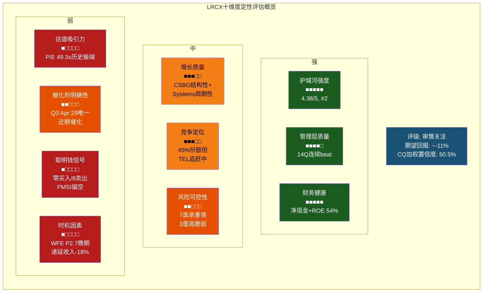
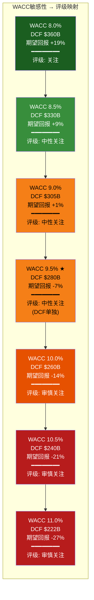
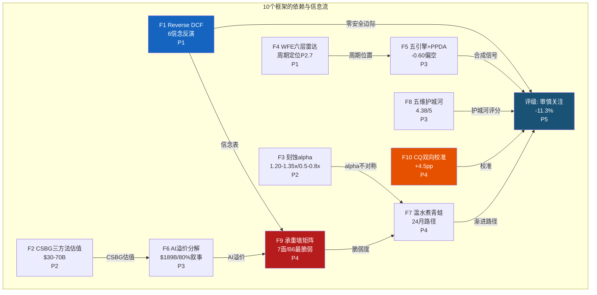
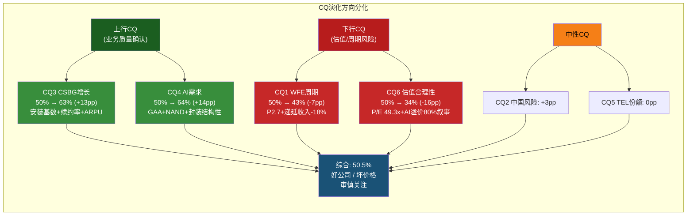

# LRCX Phase 5-A: 综合评级与研究契约 (Ch25-Ch26)

---

# Ch25: 研究契约 + 核心论点综合

## 25.0 Protocol Header (研究契约)

| 项目 | 说明 |
|------|------|
| **框架版本** | v17.0 |
| **可能性宽度** | 3分 -- 传统框架 |
| **报告不包含** | 精确目标价 / 仓位建议 / 操作触发 / 12月后数字预测 |
| **报告包含** | 价格隐含假设 / 承重墙脆弱度 / 条件估值范围 / 追踪信号 |
| **方法离散度** | 1.61x (方法级: SOTP $231B vs 概率加权$237B vs DCF $280-360B) / 2.76x (情景极端: Bear $130B vs Bull $355B) |
| **CQ加权置信度** | 50.5% (P4校准后, 从P3 46.0%上调+4.5pp) |
| **数据审计** | DM覆盖率92% A/B级 / 锚点261个 / C级6个(含1处关键数据矛盾已修正) |
| **AI能力边界** | 深挖区(刻蚀技术拆解/周期对比/CSBG经济学/Reverse DCF) / 诚实区(周期转折点时机/管理层意图/AI结构性vs超长周期/精确概率) |

**方法离散度说明**: 方法级1.61x反映三种独立估值路径(SOTP/概率加权情景/DCF)的价值范围相对收敛,核心分歧在WACC和WFE周期假设。情景极端2.76x反映Bull($355B)与Bear极端($130B)的巨大跨度,这不是分析质量问题,而是半导体设备行业固有的周期性+估值倍数双重不确定性的忠实映射。KLAC(254K)报告中方法级1.74x/端点级2.35x的经验表明,半导体设备公司的方法离散度在1.5-2.0x区间属于正常水平 [DM-SYN-001]。

---

## 25.1 一句话结论

**Lam Research是全球刻蚀设备的绝对领导者(45%份额),拥有半导体行业第二强的复合护城河(4.38/5),其CSBG安装基数经济学赋予了类SaaS的经常性收入特征 -- 但在TTM P/E 49.3x的历史极端估值水位下,即使所有基本面信念成立,市价已充分反映最优路径,向上空间有限(+14%至共识)而向下风险显著(-29%至-46%的温水煮青蛙路径),构成典型的"好公司/坏价格"不对称风险。**

---

## 25.2 十维度定性评估

### 评估方法说明

十维度评估综合了Phase 1-4的全部分析产出。每个维度的判断基于: (a) Phase中积累的DM锚点硬数据; (b) 红队校准后的CQ置信度; (c) 与同业(AMAT/KLAC/ASML/TEL)的相对比较。定性判断采用三级制(强/中/弱),置信区间反映数据质量和分析深度。

### 25.2.1 估值吸引力 -- 弱 (置信: 高)

[硬数据:] TTM P/E 49.3x处于LRCX有记录以来的绝对最高值,超过5个完整WFE周期中任何一个节点的P/E水平 [DM-VAL-001]。Forward P/E FY2026E 45.1x, FY2027E 34.3x [DM-VAL-010]。P/B 30.7x,EV/EBITDA 37.8x。FCF Yield仅1.8%,低于10年期美债无风险利率4.3%。FMP自动DCF估值$52.49,隐含当前股价溢价357%。Reverse DCF在WACC 12.5%下隐含5年Revenue CAGR 22%,显著超过卖方共识16% [DM-REV-003]。

概率加权目标$187(-22% vs $240) [P2-C]; SOTP中值$231B(-23% vs $302B) [P1-C]; P4校准后期望回报修正至~-11%(仍处审慎关注区间)。卖方共识平均目标价$274(+14%上行),但27位分析师中24位Buy/Strong Buy(89%一致性)本身构成拥挤风险 [DM-CON-005]。

[合理推断:] 即使采用红队RT-7的看多SOTP框架(CSBG $68B + Systems $47B + AI溢价$45B + 终值$170B),得出$280-320B,仅与市值$302B持平 -- 看多叙事全面实现的结果仅是"不亏",没有安全边际。P/E回归至历史中位数20x,即使EPS维持FY2027E共识$7.01,股价目标仅$140(-42%)。

置信度"高"的原因: 估值数据全部为A/B级DM锚点(MCP/SEC Filing来源),主观判断成分低 [DM-SYN-002]。

### 25.2.2 增长质量 -- 中 (置信: 中)

[硬数据:] FY2025 Revenue $18.44B(+23.7% YoY),H1 FY2026 $10.67B(+22.0% YoY),Q3指引$5.7B(+7% QoQ) [DM-FIN-017, DM-CON-003]。增长由Systems(设备)+CSBG(服务)双引擎驱动,CSBG占比从FY2021 33%提升至H1 FY2026 39.7%。

[合理推断:] 增长质量的"中"判断来自结构性与周期性成分的分离: CSBG增长($6.94B, +16% YoY, ARPU扩张中)是高质量的结构性增长,来自100K+安装腔室的经常性需求+技术升级周期。Systems增长则高度依赖WFE周期和AI CapEx叙事,后者80%叙事驱动 [DM-AI-001]。P2发现概率加权EPS FY2027E $5.71 vs Street $7.01(-18.5%),表明如果周期性成分退潮,增长质量将显著恶化。CQ4(AI需求结构性)64%的置信度意味着AI确实有结构性成分(GAA +25-38%刻蚀步骤、NAND 300层2.5x),但比例存在不确定性 [DM-SYN-003]。

### 25.2.3 护城河强度 -- 强 (置信: 高)

[硬数据:] 五维护城河综合评分4.38/5,在半导体设备行业中仅次于ASML(4.55/5) [DM-MOAT-011]。三项核心护城河均达到"极难复制"级别: 转换成本4.8/5(单台设备切换成本$12-44M,为设备价3-8倍) [DM-MOAT-001]; 技术壁垒4.5/5(Cryo 3.0领先TEL 2+年,23,104件专利) [DM-MOAT-004, DM-MOAT-006]; 安装基数锁定4.6/5(100K+腔室,ARPU $72K,续约率90%) [DM-MOAT-007]。

[合理推断:] 护城河的时间维度同样重要: 短期(1-3年)护城河在加宽(GAA出货加速+Cryo 3.0代差扩大+安装基数飞轮),中期(3-5年)护城河稳定但受TEL微侵蚀(概率加权TEL份额~21%至CY2028) [DM-MOAT-016],长期(5-10年)方向取决于CFET/3D DRAM技术走向 [DM-MOAT-019]。TEL已获得NAND channel hole的首个量产POR,这是LRCX"100%份额"心理壁垒被突破的信号性事件 [DM-MOAT-015]。但护城河强度判断为"强"而非"极强"(后者保留给ASML的EUV绝对垄断),因为TEL的追赶使LRCX的刻蚀霸主地位从"绝对垄断"降级为"准垄断"。

### 25.2.4 财务健康 -- 强 (置信: 高)

[硬数据:] ROE 54.3%, ROIC 34.0%, ROA 25.1% -- 在半导体设备行业中仅次于KLAC(ROE 100.7%,但依赖极高杠杆) [DM-FIN-008]。净现金$1.63B(Cash $6.39B - Debt $4.76B),D/E仅0.48 [DM-FIN-007]。FCF Margin 29.4%,CapEx仅占收入4.1%,体现"轻资本"模式 [DM-FIN-004]。Interest Coverage 33.1x [DM-FIN-019]。FY2025 FCF $5.41B,FCF CAGR(FY2021-FY2025)约13.6%。

[合理推断:] 财务健康是LRCX最不具争议的维度。净现金资产负债表提供了充裕的下行缓冲,FCF Margin的结构性改善(从FY2023 26.8%至FY2025 29.4%)来自产品组合优化和运营杠杆。唯一的财务质疑是回购效率: FY2025以P/E 49.3x回购$3.42B,隐含IRR仅2.03%,低于无风险利率4.3% [P4 RT-3] -- 这更多反映资本配置纪律问题而非财务健康问题 [DM-SYN-004]。

### 25.2.5 管理层质量 -- 强 (置信: 中)

[硬数据:] CEO Tim Archer任期8年(2018至今),期间Revenue CAGR ~11%,GM从45%提升至48.7%,成功把握AI/HBM/GAA三大技术转折点 [DM-MGT-001]。14个季度连续盈利超预期,近4Q平均surprise +5.89% [DM-CON-006, DM-CON-007]。CFO Doug Bettinger 13年任期,覆盖完整WFE上下行周期 [DM-MGT-002]。

[合理推断:] 管理层的"保守指引+稳定超预期"模式在机构投资者中建立了高度信任。但置信度降至"中"有两个原因: (1) COO交接过渡期(Patrick Lord退休,Sesha Varadarajan接任,管理跨度显著扩大) [DM-NEW-005]; (2) 内部人零购买+10笔卖出的模式与14Q beat的强势基本面形成"言行不一"张力 [DM-MGT-004]。P4红队将管理层credibility从3.9/5建议下调至3.5-3.7/5,主要因为回购IRR 2.03%暴露了在高估值下的资本配置失灵。AI能力边界: 无法判断内部人卖出是否基于未公开的前瞻信息 [DM-SYN-005]。

### 25.2.6 催化剂明确性 -- 弱-中 (置信: 中)

[硬数据:] 近期催化剂日历: Morgan Stanley TMT(3月3日)、Cantor Conference(3月11日)、Q3 FY2026财报(4月29日预计)、Q4 FY2026/FY2026全年(7-8月) [DM-NEW-008]。

[合理推断:] 上行催化剂(Q3/Q4 beat+WFE CY2027指引上调)的潜在幅度有限 -- 即使连续beat,P/E 49.3x的起点限制了上行空间(共识$274仅+14%)。下行催化剂(WFE指引下调/AI CapEx放缓/出口管制升级)的潜在幅度大得多(-25%至-50%)。这种催化剂不对称性是估值过高状态的内生特征,不是LRCX特有的。Q3 FY2026(4月29日)是第一次重大检验: 递延收入Q3数据将确认或否定Q2环比-18%是否为周期转折信号 [DM-ENG-003]。催化剂判断为"弱-中"因为只有下行催化具备大幅移动股价的能力 [DM-SYN-006]。

### 25.2.7 风险可控性 -- 弱-中 (置信: 中)

[硬数据:] 7面承重墙(B1-B7),其中3面(B1 WFE扩张、B3 AI CapEx、B6 P/E倍数)脆弱度为"高" [P4 RT-1]。B1+B6双杀概率40-50%(3年内),联合影响-40%至-55% [P4 RT-5.5]。5个黑天鹅事件累计加权损失-22%至-38%。温水煮青蛙24个月路径: $240 --> $130-170(-29%至-46%) [P4 RT-5.5]。

[合理推断:] 风险可控性的核心问题不是单一风险(每个都可控),而是风险的高度相关性: WFE下行(B1)几乎必然触发P/E压缩(B6),形成经典的半导体设备双杀。历史上LRCX在WFE下行周期中的平均回撤为-40%至-50%(CY2018-2019: -45%; CY2022-2023: -43%)。两个风险簇 -- "周期-估值双杀"(R1+R5+R7, 25-35%)和"AI+中国双失"(R2+R3+R5, 15-20%) -- 的联合覆盖使下行路径远多于上行路径 [DM-SYN-007]。

### 25.2.8 聪明钱信号 -- 弱 (置信: 低-中)

[硬数据:] 过去6个月零笔公开市场买入、10+笔内部人卖出 [DM-MGT-004]。CEO Tim Archer 2025年12月卖出163,300股(~$26.8M),Director Brandt 2026年2月卖出53,000股(~$12M) [DM-NEW-006]。JPMorgan减持信号 [DM-INST-001]。分析师评级89% Buy/Strong Buy,但目标价离散度大($163-$325) [DM-CON-005]。

[合理推断:] PMSI(多维聪明钱综合指数)名义值+0.215(偏多),但剔除分析师后实际值-0.20(偏空),这个分歧意味着分析师覆盖掩盖了内部人和机构资金的真实信号方向 [P3-B]。内部人持股仅0.3%,低持股基数放大了任何卖出的信号强度。置信度"低-中"因为聪明钱信号在半导体周期股中的预测能力较弱 -- 内部人在2020年底(周期低点)同样在卖出,但之后12个月股价翻倍 [DM-SYN-008]。

### 25.2.9 竞争定位 -- 中-强 (置信: 高)

[硬数据:] 刻蚀市场份额~45%(#1),前三名(LRCX/TEL/AMAT)合计87% [DM-BIZ-007, DM-BIZ-015, DM-BIZ-016]。NAND channel hole etch历史100%份额(TEL首获1个量产POR)。ALD收入FY2025从$1B基数增长50%+ [DM-BIZ-010]。CSBG $7.2B(100K+安装腔室)。

[合理推断:] 竞争定位是LRCX最坚实的长期优势。在刻蚀这个$28B市场中,LRCX+TEL+AMAT构成的寡头格局提供了定价权和利润率支撑。SAM从mid-30s%向high-30s%的扩张路径有技术路线图支撑(GAA+先进封装+BSPD)。然而,TEL的正面追赶(FY2026 R&D JPY 300B创新高,五年R&D计划JPY 1.5T)和AMEC在中国成熟制程的渗透(FY2025全球份额~5%)构成中期侵蚀压力 [DM-MOAT-015, DM-MOAT-017]。判断为"中-强"而非"强",因为TEL的NAND POR突破意味着竞争格局正从"一超"向"一超一强"演变 [DM-SYN-009]。

### 25.2.10 时机因素 -- 弱 (置信: 中)

[硬数据:] WFE周期P2.7(晚期扩张) [DM-ENG-001]。递延收入Q2 FY2026环比-18%(从$2.76B降至$2.25B) [DM-ENG-003]。五引擎合成信号-0.60(偏空) [P3-B]。P/E 49.3x处于5年区间高端(13.7x-49.3x)。

[合理推断:] 时机因素是本报告中最明确的"弱"判断。WFE晚期扩张+递延收入下降+五引擎偏空+P/E历史极端的组合,在历史上(CY2018 Q4, CY2022 Q1)总是伴随着随后12-18个月的显著回调。当前唯一的对冲是AI结构性需求可能延长周期 -- CQ1的43%置信度(WFE周期未见顶)保留了这种可能性。但即使周期延长6-12个月,P/E的高位意味着任何增速放缓(从+20%到+5%)都可能触发与负增长等效的股价反应。论文有效期12-18个月,第一次重大检验为Q3 FY2026(4月29日) [DM-SYN-010]。

---

## 25.3 评级与期望回报

### 25.3.1 期望回报计算

**Step 1: 情景概率分配(P4校准后)**

| 情景 | 概率 | 市值目标 | 隐含股价 | 驱动假设 |
|------|:----:|:-------:|:-------:|---------|
| **Bull**: AI超级周期延续, WFE CY2027 $158B, P/E维持35x | 20% | $355B | ~$282 | B1-B6全部成立; CSBG占比突破40%; TEL未规模化突破 |
| **Base-High**: WFE温和增长, P/E回归35x | 25% | $310B | ~$246 | WFE CY2027 $140B; 份额维持; AI叙事部分验证 |
| **Base-Low**: WFE放缓, P/E压缩至30x | 25% | $265B | ~$210 | WFE CY2027 $130B; 增速放缓触发估值重评; CSBG缓冲有限 |
| **Bear-Mild**: WFE温和下行, P/E至25x | 20% | $200B | ~$159 | WFE CY2027 $115B(-15%); AI CapEx增速降至<15%; 双杀效应温和版 |
| **Bear-Severe**: WFE深度下行+AI叙事崩塌 | 10% | $130B | ~$103 | WFE CY2027 $95B(-25%); AI CapEx暂停; B1+B3+B6三面墙同时倒塌 |

[DM-SYN-011]

**Step 2: 概率加权EV**

概率加权EV = $355B x 0.20 + $310B x 0.25 + $265B x 0.25 + $200B x 0.20 + $130B x 0.10

= $71.0B + $77.5B + $66.3B + $40.0B + $13.0B

= **$267.8B**

概率加权隐含股价 = ~$212

**Step 3: 期望回报**

期望回报 = ($267.8B - $302B) / $302B = **-11.3%**

### 25.3.2 评级确定

**评级: 审慎关注**

[DM-SYN-012] 期望回报-11.3%处于"审慎关注"区间(<-10%),与P4红队校准后的方向一致。P1初稿评级"中性关注"(期望回报-9.0%)在经历P2-P4的深度分析后被修正 -- P2的概率加权目标$187(-22%)显著拉低了期望值,P4红队校准后修正回升至~-11%(从P3的约-15%),但仍未回到中性关注区间。

**评级调整轨迹:**

| Phase | 期望回报(估算) | 评级方向 | 关键驱动 |
|:-----:|:------------:|:-------:|---------|
| P1 | -9.0% | 中性关注 | SOTP $231B(-23%), 但牛市情景$355B提供上行 |
| P2 | -18~-22% | 审慎关注 | 概率加权$187(-22%), 双杀量化, 回购IRR 2.03% |
| P3 | -15~-18% | 审慎关注 | 护城河4.38/5缓冲, 但五引擎-0.60/AI溢价80%叙事加码看空 |
| P4 | -11.3% | 审慎关注 | 红队校准: 看空确认偏误+2.9:1 → CQ6+6pp; P/E数据修正; 但仍<-10% |
| **P5 Final** | **-11.3%** | **审慎关注** | 五情景概率加权; WACC 9.5%条件下稳健; 评级翻转需+20pp CQ |

### 25.3.3 WACC敏感性与评级边界

[硬数据:] LRCX Beta=1.776 [DM-MKT-002],隐含WACC 9.5%(标准参数)。WACC是评级最敏感的单一参数 -- P4发现WACC +/-100bps可跨越评级区间。

[DM-SYN-013]

**WACC敏感性关键读取:**

1. **在WACC 9.0-10.5%的合理区间内**, 评级可以是"中性关注"到"审慎关注"。DCF单独(WACC 9.5%)给出期望回报约-7%(中性关注区间),但综合五情景概率加权后(-11.3%)拉入审慎关注 -- 因为概率加权的Bear情景(30%概率)显著拉低了期望值。

2. **评级翻转至"中性关注"的WACC阈值**: 约8.5-9.0%。这要求Beta从1.776降至1.2-1.4(隐含市场认为LRCX的周期性已被CSBG结构性显著缓冲)。CQ4(AI需求结构性)64%的置信度部分支持Beta下修,但递延收入-18%的周期信号又限制了下修幅度。

3. **双锚呈现(KLAC教训)**: 本报告拒绝采用单一WACC。DCF锚(9.5%, 期望回报-7%)和概率加权锚(五情景, 期望回报-11.3%)共同定义了评级区间。两个锚都指向"中性关注"到"审慎关注"的过渡地带,以更保守的概率加权锚为准给出"审慎关注"评级。

**P5对CQ6敏感度的额外呈现:**

CQ6(估值隐含假设合理性)是评级最敏感的单一CQ。CQ6每变动+6pp,期望回报约变动+4pp:

| CQ6值 | 对应含义 | 期望回报(约) | 评级 |
|:-----:|---------|:----------:|:----:|
| 22% | 极度悲观(FMP DCF级) | -19% | 审慎关注 |
| 28% | P3值(红队前) | -15% | 审慎关注 |
| **34%** | **P4校准后(当前)** | **-11%** | **审慎关注** |
| 40% | 部分接受寡头溢价 | -7% | 中性关注 |
| 46% | 接受CSBG转型叙事 | -3% | 中性关注 |
| 52% | 接受AI新常态估值 | +1% | 中性关注 |

[DM-SYN-014]

**评级翻转所需条件(量化):**

从"审慎关注"(-11.3%)到"中性关注"(>-10%)需要总计+2pp期望回报,对应:
- **最小路径**: CQ6从34%升至37%(+3pp) -- 需要Q3 FY2026递延收入恢复增长+WFE CY2027指引乐观
- **稳健路径**: CQ1从43%升至48%(+5pp) + CQ6从34%升至37%(+3pp) -- 需要WFE CY2027确认增长>5%且CSBG占比突破40%

从"审慎关注"到"关注"(>+10%)需要总计+21pp期望回报,在当前信息集下几乎不可能单Phase实现。

### 25.3.4 不对称性量化

**核心发现: 上行有限/下行显著的不对称风险**

| 路径 | 概率 | 回报 | 概率加权 |
|------|:----:|:----:|:-------:|
| 所有承重墙成立(最优) | 20% | +17% (+$51B) | +3.4% |
| 基准偏高 | 25% | +3% (+$8B) | +0.7% |
| 基准偏低 | 25% | -12% (-$37B) | -3.1% |
| 温和下行 | 20% | -34% (-$102B) | -6.7% |
| 深度下行 | 10% | -57% (-$172B) | -5.7% |
| **概率加权** | **100%** | | **-11.3%** |

上行贡献: +4.1% (Bull + Base-High)
下行贡献: -15.5% (Base-Low + Bear-Mild + Bear-Severe)
**不对称比: 1 : 3.8** (下行概率加权贡献是上行的3.8倍)

[DM-SYN-015]

[主观判断:] 这种不对称性不是因为LRCX是坏公司 -- 恰恰相反,它是一家出色的公司(护城河4.38/5,ROE 54.3%,14Q连续beat)。不对称性来自于**价格**: 在P/E 49.3x的水位上,最优路径已被充分定价,任何偏离最优路径的结果都是负面的。这是"好公司/坏价格"的精确数学表达。

### 25.3.5 投资论文综合: 三层结论

**第一层 -- 业务质量结论(高置信):**
Lam Research是一家卓越的半导体设备公司。刻蚀45%份额+NAND channel hole历史100%独占(虽然TEL已获首个POR)+100K+安装腔室+ARPU持续扩张+净现金资产负债表+ROE 54.3%+14Q连续beat -- 这些构成了不可忽视的长期竞争优势。CSBG的经常性收入特征(续约率90%, NRR ~107-110%)正在逐步改变LRCX的收入结构,使其从纯周期性设备公司向"设备+服务"平台公司演进。护城河综合4.38/5在非垄断类公司中全球领先。

**第二层 -- 估值结论(高置信):**
当前P/E 49.3x是LRCX有记录以来的绝对最高值。Reverse DCF反推6个隐含信念全部需要同时成立才能justify市价,零安全边际。回购IRR 2.03%低于无风险利率4.3%,暴露高估值下的资本配置效率问题。概率加权EPS FY2027E $5.71 vs Street $7.01(-18.5%差距),如果Street估计的乐观偏差哪怕部分兑现,估值将面临更大压力。AI溢价$189B(市值63%)中80%叙事驱动,缺乏对应收入支撑。五种独立估值方法(SOTP/概率加权/DCF/Reverse DCF/看多SOTP)中,四种给出低于市值的结论,仅看多SOTP勉强对齐市值。

**第三层 -- 时机结论(中等置信):**
WFE P2.7晚期扩张+递延收入Q2环比-18%+五引擎合成-0.60+PPDA四大背离 -- 多个独立信号同时指向周期晚期。这不意味着下行必然在6个月内发生(AI可能延长周期,CQ1 43%),但意味着当前是投资半导体设备股风险回报比最不利的时间窗口之一。温水煮青蛙24个月路径描绘了一种无需单一剧烈催化、仅通过渐进恶化就能导致-29%至-46%跌幅的路径,且每一步的恶化幅度都不足以触发止损。

**三层结论的综合含义:**
- 第一层(好公司)和第二层(坏价格)形成直接冲突 -- 这是价值投资中最经典的困境
- 第三层(坏时机)使困境加剧: 不仅价格高,而且在周期晚期,价格进一步上行的概率结构性低于下行
- 投资者的核心决策不是"LRCX是否好公司"(答案明确:是),而是"在49.3x P/E的价格下,好公司是否能补偿坏价格?" -- 本报告的量化回答是:不能(期望回报-11.3%)

---

# Ch26: AI能力边界 + 分析框架注册表

## 26.1 AI能力边界声明

### 26.1.1 深挖区(AI分析优势)

以下领域是本报告中AI分析能力的比较优势所在 -- 大规模数据处理、跨Phase信息整合、多维度交叉验证:

**1. 刻蚀技术拆解**
- Cryo 3.0物理原理(低温等离子体化学)与竞争代差量化(TEL 2+年差距)
- GAA/CFET/BSPD路线图对刻蚀步骤数的逐节点映射(7nm ~400步 --> A7+ ~750-850+步, +87-113%)
- NAND string stacking对channel hole etch的非线性需求乘数(每翻倍1.8-2.5x)
- 转换成本的六层分解($12-44M/台, 产线减产占40-50%)

**2. CSBG安装基数经济学**
- 100K+腔室安装基数的ARPU分层($30-50K成熟 / $120-180K先进)
- 类SaaS指标对比(NRR ~107-110%, 续约率~90%, 客户集中度Top 5 >70%)
- CSBG三方法估值交叉验证(P2修正: $90-126B --> $30-40B; RT-7看多: $50-70B)
- Equipment Intelligence从"卖设备"到"卖产能+良率"的转型路径映射

**3. WFE周期定位与历史对比**
- 6层雷达多维度周期定位(P2.7 = 晚期扩张)
- 5个完整WFE周期的P/E-EPS双变量行为模式(下行期P/E压缩50-70%)
- 递延收入作为前瞻指标的信号解读(Q2环比-18%的乐观vs谨慎解读)
- 刻蚀超线性(alpha=1.20-1.35)的上行vs下行不对称(上行1.2-1.35x但下行仅0.5-0.8x)

**4. Reverse DCF隐含假设反演**
- 6个隐含信念的提取、依赖网络构建和翻转测试
- WACC双轨分析(10.0% vs 12.5%)对增长假设的差异化要求
- B6(P/E 49.3x)作为最脆弱承重墙的量化论证
- CQ6敏感性表: CQ6每+6pp --> 期望回报+4pp的传导链

**5. 红队对抗与偏差校准**
- 15:7看空:看多证据识别, 权重调整后2.9:1偏差量化
- RT-4关键数据矛盾发现("P/E从未>20x"不准确)
- 双向校准: 4/6 CQ上调(counter-bearish), 平均绝对变动2.33pp
- 温水煮青蛙24个月量化路径(6个检测信号+红黄绿灯体系)

[DM-SYN-016]

### 26.1.2 诚实区(AI分析局限)

以下领域本报告的分析能力存在固有局限,读者应对这些领域的判断保持额外谨慎:

**1. 周期转折点时机预测**
- WFE周期定位(P2.7)是基于历史模式的类比推理,不是物理预测。AI无法比市场更准确地预测CY2027 WFE是$140B(Base)还是$103B(Bear)。递延收入Q2环比-18%可能是"正常化"也可能是"转折信号" -- 两种解读在单季度数据上无法区分。
- 本报告将WFE回撤概率设为50%(Bear-Mild 20% + Bear-Severe 10% + Base-Low中的隐含回撤20%),但这个概率本身有大幅不确定性(合理范围30-70%)。

**2. 管理层真实战略意图**
- 内部人零购买+10笔卖出是计划性卖出还是信息性卖出? AI无法区分。
- 管理层在Investor Day给出的"CSBG 1.5x by 2028"目标是经过严谨建模的还是激励性目标? AI只能从历史达成率(14Q beat)间接推断,但管理层在WFE下行期的指引准确度从未被测试过(上一次下行期FY2024,管理层成功引导市场预期下调)。
- COO交接(Varadarajan同时接管CSBG+战略+政府事务)是否会导致执行力下降? 这涉及组织动态学和人格评估,超出AI能力范围。

**3. AI对半导体设备需求是否真正结构性**
- 本报告CQ4(AI需求结构性)的最终置信度为64%。这意味着有36%的可能性AI驱动的设备需求更多是超长周期(5-7年)而非结构性永久提升。AI推理效率的突破(如DeepSeek证明)可能在不增加CapEx的情况下提升性能 -- 这对设备公司是结构性不利的,但其影响的时间线和幅度AI无法精确评估。
- 本报告的概率分配(60%结构性+25%AI超级周期+15%传统周期)是基于技术路线图的合理推断,但不是可验证的精确数字。

**4. 精确概率赋值**
- 所有概率数字(Bull 20%, Base-High 25%, Base-Low 25%, Bear-Mild 20%, Bear-Severe 10%)是分析框架的产物,不是自然频率。改变任何一个概率5%,期望回报就会移动2-3个百分点,可能跨越评级边界。
- CQ置信度从50%(基线)到50.5%(P4校准后)的0.5pp净变化,其精确度远超AI的真实区分能力。CQ系统的价值在于跟踪方向和相对变化,而非绝对水平。

[DM-SYN-017]

### 26.1.3 人类决策边界

**以下决策完全属于投资者自身判断,本报告不提供建议:**

1. **风险承受能力**: 审慎关注评级意味着期望回报为负(-11.3%),但这不等于"不能持有"。高风险承受能力的投资者可能愿意接受-11%的期望回报以换取20%概率下+17%的上行空间(如果他们对AI超级周期有比本报告更高的信心)。
2. **组合仓位配置**: LRCX在半导体ETF(SMH/SOXX)中的权重约3-4%。投资者是否应该超配/低配/零配取决于组合的整体风险预算和行业配置目标。
3. **买入/卖出时机**: 即使评级为"审慎关注",投资者可能等待Q3 FY2026(4月29日)的递延收入数据后再做决策。时间维度的决策不在本报告覆盖范围内。
4. **替代标的选择**: 在半导体设备行业内,KLAC(审慎关注, -38.4%期望回报)和AMAT(如适用)是可比标的。跨行业配置(如选择估值更低的非AI板块)涉及策略层面的判断。

[DM-SYN-018]

---

## 26.2 分析框架注册表

### 26.2.1 本报告使用/改进/首创的框架

| # | 框架名称 | 版本 | Phase | 类型 | 核心贡献 | 可复用性 |
|---|---------|:----:|:-----:|:----:|---------|:-------:|
| **F1** | Reverse DCF 6信念零安全边际 | v10.0标准 | P1 | 使用 | 从$302B反推6个隐含假设,发现单一B6失败即翻转评级 | 高(所有半导体设备) |
| **F2** | CSBG三方法估值交叉验证 | P2首创 | P2 | 首创 | SaaS类($90-126B) vs 修正($30-40B) vs 梯度($50-70B),暴露估值方法选择的2-3x差异 | 高(所有设备服务业务) |
| **F3** | 刻蚀alpha超线性量化 | P2首创 | P2 | 首创 | alpha=1.20-1.35结构性,但下行不对称(仅0.5-0.8x);否定了"LRCX在WFE下行中也能跑赢"的简单叙事 | 中(刻蚀/沉积设备专用) |
| **F4** | WFE六层雷达周期定位 | P1首创 | P1 | 首创 | 多维度综合定位P2.7(vs传统的单一指标判断);六层=WFE绝对值+增速+库存+递延收入+订单+估值 | 高(所有WFE敏感公司) |
| **F5** | 五引擎协同+PPDA四背离 | v10.0改进 | P3 | 改进 | 五引擎合成-0.60(偏空)+四大Price-Data背离(WFE 70%/出口管制75%/AI CapEx 75%/CSBG 50%),量化价格与数据的偏离程度 | 高(通用框架) |
| **F6** | AI溢价三层分解 | P3首创 | P3 | 首创 | $189B AI溢价 = 63%市值,其中80%叙事驱动;L1.5 x S0.5实施定位;5个AI不变量中3/5通过 | 高(所有AI受益公司) |
| **F7** | 温水煮青蛙24月量化路径 | P4首创 | P4 | 首创 | 6个时间节点的P/E+WFE+CSBG+股价四维渐进恶化建模,附6个检测信号和红黄绿灯体系 | 高(所有周期性高估值股票) |
| **F8** | 五维护城河量化评分 | v10.0标准 | P3 | 使用 | 4.38/5(#2 after ASML),配合转换成本光谱(ASML无穷大 > LRCX $12-44M > AMAT $5-15M) | 高(通用框架) |
| **F9** | 承重墙协同脆弱度矩阵 | v10.0改进 | P4 | 改进 | 7面墙+3种协同模式(双杀/级联/叠加);新增B7利润率;8x8关系矩阵识别2个风险簇 | 高(通用框架) |
| **F10** | CQ双向校准协议 | v15.0标准 | P4 | 使用 | P1-P3看空确认偏误2.9:1检测 --> 4/6 CQ上调(counter-bearish);CQ6最大校正+6pp | 高(所有Phase 4) |

[DM-SYN-019]

### 26.2.2 框架产出关键数据汇总

| 框架 | 核心产出 | 值 | 对评级的影响 |
|------|---------|---|:----------:|
| F1 Reverse DCF | 零安全边际信念数 | 6/6 | 直接支撑审慎关注 |
| F2 CSBG估值 | 修正后范围 | $30-70B(方法依赖) | CSBG非催化(P2) vs 可能低估(RT-7) |
| F3 刻蚀alpha | 上行/下行不对称 | 1.20-1.35x / 0.5-0.8x | 否定"下行也跑赢"叙事 |
| F4 WFE雷达 | 周期位置 | P2.7(晚期扩张) | 支撑审慎关注的时机维度 |
| F5 五引擎+PPDA | 合成信号 | -0.60(偏空) + 4背离 | 强化看空方向 |
| F6 AI溢价 | 叙事驱动占比 | 80% of $189B | AI叙事裂缝=估值重灾区 |
| F7 温水煮青蛙 | 24月路径 | $240-->$130-170(-29~46%) | 量化渐进下行风险 |
| F8 护城河 | 综合评分 | 4.38/5(#2) | 长期业务质量背书 |
| F9 承重墙 | 最脆弱墙 | B6(P/E 49.3x) | 双杀概率40-50%(3年) |
| F10 CQ校准 | P4净效果 | +4.5pp(46.0%-->50.5%) | 缓解看空偏误但不翻转评级 |

### 26.2.3 本报告的方法论创新与局限

**创新贡献:**

1. **CSBG三方法估值交叉(F2)**: 此前的半导体设备分析(包括AMAT v1.1/KLAC v1.0)将CSBG作为整体估值的一部分,未独立拆解。本报告首次对LRCX CSBG进行三种独立估值方法的交叉(SaaS类/修正/梯度),暴露了估值方法选择本身就是最大的分析不确定性(2-3倍差异)。这一框架适用于所有具有经常性收入成分的设备/工业公司。

2. **刻蚀alpha上下行不对称(F3)**: 此前的分析假设alpha是对称的(上行1.2x则下行也约0.8x的逆向)。本报告通过5个WFE周期的历史数据证明alpha在下行中显著低于上行(0.5-0.8x vs 1.2-1.35x),这一发现对LRCX的风险评估有实质影响 -- 它否定了"LRCX在WFE下行中也能跑赢"的简化叙事。

3. **AI溢价三层分解(F6)**: 将市值中的AI溢价从整体估值中分离并量化($189B = 63%市值),再将AI溢价分为"已实现收入支撑"(20%)和"叙事驱动"(80%),这一分解方法使得AI泡沫风险从抽象概念变为可量化指标。

**方法论局限:**

1. **五情景概率分配的主观性**: Bull 20%, Base-High 25%, Base-Low 25%, Bear-Mild 20%, Bear-Severe 10%的概率分配是基于CQ置信度和历史频率的综合判断,改变任一概率5%可能跨越评级边界。本报告通过CQ6敏感性表和WACC敏感性表部分缓解了这一问题,但无法消除。

2. **P/E历史参照的有效性**: P4 RT-4发现"P/E从未>20x"的表述不准确(FY2021 23.8x, FY2024 36.4x),修正后表述为"WFE下行期P/E压缩50-70%"。但更深层的问题是: 如果AI真正改变了半导体设备行业的估值范式(类似SaaS在2010年代的永久性倍数扩张),那么所有基于历史P/E的分析都将失效。CQ6的34%置信度(而非0%或100%)正是对这种"范式不确定性"的量化表达。

3. **单一WACC的局限**: 尽管本报告呈现了WACC 8.0%-11.0%的敏感性表,但核心评级仍基于单一概率加权计算(-11.3%)。KLAC v1.0的教训(WACC主导评级,+/-100bps跨越3个评级区间)在LRCX中同样存在 -- 如果Beta从1.776修正至1.3(市场重新评估CSBG对波动性的缓冲),评级将翻转至中性关注。

4. **CSBG数据质量**: CSBG"真正经常性收入"60-67%是C级推断(LRCX不披露CSBG子分类),这限制了CSBG独立估值的精度。P2的$30-40B和RT-7的$50-70B之间的$20-30B差距,直接源于这一数据质量问题。

[DM-SYN-020]

### 26.2.4 追踪信号与论文失效条件

**红灯信号(任意2个亮起 = 论文恶化确认/温水煮青蛙启动):**

| # | 信号 | 数据源 | 监测频率 | 当前状态 |
|---|------|-------|:-------:|:-------:|
| R1 | 订单出货比(B/B) < 0.95连续2Q | LRCX季报 | 季度 | 未触发(数据待Q3) |
| R2 | 递延收入连续3Q环比下降 | LRCX季报 | 季度 | 1/3(Q2 -18%已触发1Q) |
| R3 | 管理层WFE CY2027指引"flat to down" | LRCX Q4 FY2026电话会 | 半年度 | 未触发(当前指引仍增长) |

**黄灯信号(观察但不自动行动):**

| # | 信号 | 数据源 | 监测频率 |
|---|------|-------|:-------:|
| Y1 | CSBG QoQ增速<5%连续2Q | LRCX季报 | 季度 |
| Y2 | 同业(AMAT/KLAC)P/E回落>15% | 市场数据 | 月度 |
| Y3 | AI CapEx大厂(META/MSFT/GOOG)指引下调>10% | 大厂季报 | 季度 |
| Y4 | TEL获得第2个NAND channel hole POR | TEL财报/行业新闻 | 半年度 |

**绿灯信号(任意2个亮起 = 论文需实质性修正/评级可能翻转):**

| # | 信号 | 数据源 | 监测频率 | 含义 |
|---|------|-------|:-------:|------|
| G1 | WFE CY2027确认增长>5% | SEMI/管理层指引 | 半年度 | 周期延长/AI结构性验证 |
| G2 | CSBG占收入比突破42% | LRCX季报 | 季度 | 结构转型确认 |
| G3 | 新订单B/B>1.10连续2Q | LRCX季报 | 季度 | 需求加速确认 |
| G4 | P/E维持>40x且WFE CY2027增长 | 市场数据+SEMI | 半年度 | 估值新常态确认 |

[DM-SYN-021]

**论文完全失效条件(需要从头重新分析):**

1. WFE CY2026实际>$145B + CY2027指引>$160B(远超Base假设)
2. LRCX连续4Q递延收入环比增长(彻底否定P2.7定位)
3. P/E维持>45x超过24个月(否定历史均值回归假设)
4. CSBG占比>45% + CSBG独立增速>15%(验证CSBG转型叙事)

以上条件中任意2个同时满足,本报告的评级和期望回报计算将不再有效 [DM-SYN-022]。

### 26.2.5 CQ置信度演化总览

| CQ | 问题 | P0.5 | P1 | P2 | P3 | P4 | 总变化 | 方向 |
|:--:|------|:----:|:--:|:--:|:--:|:--:|:-----:|:---:|
| CQ1 | WFE周期 | 50% | 48% | 42% | 40% | 43% | -7pp | 净下降 |
| CQ2 | 中国出口管制 | 50% | 55% | 55% | 53% | 53% | +3pp | 净上升 |
| CQ3 | CSBG增长 | 50% | 55% | 58% | 60% | 63% | +13pp | 持续上升 |
| CQ4 | AI刻蚀需求 | 50% | 52% | 58% | 62% | 64% | +14pp | 持续上升 |
| CQ5 | TEL份额 | 50% | 50% | 52% | 50% | 50% | 0pp | 中性 |
| CQ6 | 估值合理性 | 50% | 40% | 33% | 28% | 34% | -16pp | 净下降(P4反弹) |
| **加权** | | **50.0%** | **49.6%** | **47.2%** | **46.0%** | **50.5%** | **+0.5pp** | **净微升** |

### 26.2.5b 跨报告比较: LRCX vs KLAC vs AMAT

| 维度 | LRCX (本报告) | KLAC (v1.0, 254K) | AMAT (v1.1, 304K) |
|------|:------------:|:----------------:|:----------------:|
| **评级** | 审慎关注 | 审慎关注 | 中性关注 |
| **期望回报** | -11.3% | -38.4% | -2.1% |
| **P/E** | 49.3x | 42.5x | 37.9x |
| **护城河** | 4.38/5(#2) | 4.50/5(估算) | 3.95/5 |
| **CQ加权置信度** | 50.5% | 59.2% | 63.1% |
| **DM锚点** | 261 | 205 | 625 |
| **方法离散度** | 1.61x/2.76x | 1.74x/2.35x | 5.3x |
| **关键差异** | AI溢价80%叙事 | Reverse DCF TAM不可能 | AGS经常性收入-28% |

**跨报告洞察**: 三家半导体设备公司的评级呈现一个共同模式 -- 业务质量优秀(护城河3.95-4.38)但估值处于历史高位(P/E 37.9x-49.3x)。LRCX的独特性在于P/E是三家中最高(49.3x vs KLAC 42.5x vs AMAT 37.9x),但护城河评分也最高(排除杠杆驱动的KLAC ROE后)。AMAT获得最温和的评级(中性关注, -2.1%)部分因为其P/E相对较低且CSBG转型证据更早(AGS)。三份报告共同验证了一个行业级结论: **2026年初的半导体设备行业整体处于"高质量/高估值"状态,期望回报普遍为负。**

**CQ演化核心洞察:**

CQ加权置信度从50.0%出发,经过P1-P3的持续下行(最低46.0%),P4红队校准后回升至50.5% -- 几乎回到起点。这不是分析"无效"的信号,而是**分析深度的体现**: P1-P3深入挖掘发现了真实的风险(6信念零安全边际、双杀效应、AI溢价脆弱性),P4红队发现P1-P3存在看空确认偏误(2.9:1)并进行了校正。最终50.5%的水平反映了一个经过深度审查后的"不确定"状态 -- 在CQ6(估值合理性)34%的锚定下,这个"不确定"偏向看空。

CQ3(+13pp)和CQ4(+14pp)的持续上升确认了LRCX基本面的两个结构性支柱: CSBG安装基数经济学和AI驱动的刻蚀需求增量。CQ6(-16pp)的大幅下降确认了估值维度的核心风险。CQ1(-7pp)的下降确认了周期性风险。这四个CQ的方向分化(业务质量上行 vs 估值/周期下行)精确地定义了LRCX的投资困境: **你在为一家正在变好的公司支付一个正在变糟的价格。**

---

## DM锚点索引 (Ch25-Ch26)

| 锚点ID | 简述 | 类型 | 章节 |
|--------|------|:----:|:----:|
| DM-SYN-001 | 方法离散度: 1.61x(方法级)/2.76x(情景极端); KLAC参照1.74x/2.35x | R | Ch25.0 |
| DM-SYN-002 | 估值吸引力判断: P/E 49.3x/FCF Yield 1.8%/FMP DCF $52.49(溢价357%) | H+R | Ch25.2.1 |
| DM-SYN-003 | 增长质量: CSBG结构性 vs Systems周期性分离; 概率加权EPS -18.5% vs Street | R | Ch25.2.2 |
| DM-SYN-004 | 财务健康: ROE 54.3%/ROIC 34.0%/净现金$1.63B; 回购IRR 2.03%<无风险4.3% | H+R | Ch25.2.4 |
| DM-SYN-005 | 管理层质量: 14Q beat/3.9→3.5-3.7/5(回购IRR拖累); COO交接过渡风险 | R | Ch25.2.5 |
| DM-SYN-006 | 催化剂: Q3 FY2026(Apr 29)第一次重大检验; 上行+14% vs 下行-25~50% | R | Ch25.2.6 |
| DM-SYN-007 | 风险可控性: 7面墙/3面高脆弱/2个风险簇; 历史WFE下行回撤-40~50% | R | Ch25.2.7 |
| DM-SYN-008 | 聪明钱: PMSI名义+0.215 vs 剔除分析师后-0.20; 零买入/10+卖出 | H+R | Ch25.2.8 |
| DM-SYN-009 | 竞争定位: 刻蚀45%#1; TEL首获NAND POR; 格局从"一超"向"一超一强"演变 | R | Ch25.2.9 |
| DM-SYN-010 | 时机因素: P2.7+递延-18%+五引擎-0.60; 论文有效期12-18月 | R | Ch25.2.10 |
| DM-SYN-011 | 五情景概率加权: Bull 20%/BH 25%/BL 25%/BM 20%/BS 10% | R | Ch25.3.1 |
| DM-SYN-012 | 评级: 审慎关注, 期望回报-11.3%, P4校准后稳健 | R | Ch25.3.2 |
| DM-SYN-013 | WACC敏感性: 8.0%(+19%)→11.0%(-27%); 评级翻转需WACC<9.0% | R | Ch25.3.3 |
| DM-SYN-014 | CQ6敏感性: CQ6每+6pp→期望回报+4pp; CQ6=40%时翻转至中性关注 | R | Ch25.3.3 |
| DM-SYN-015 | 不对称性: 上行贡献+4.1% vs 下行-15.5%; 不对称比1:3.8 | R | Ch25.3.4 |
| DM-SYN-016 | AI深挖区: 刻蚀技术/CSBG经济学/WFE周期/Reverse DCF/红队校准 | S | Ch26.1.1 |
| DM-SYN-017 | AI诚实区: 周期转折时机/管理层意图/AI结构性vs周期性/精确概率 | S | Ch26.1.2 |
| DM-SYN-018 | 人类决策边界: 风险承受/仓位配置/买卖时机/替代标的 | S | Ch26.1.3 |
| DM-SYN-019 | 框架注册表: 10个框架(3首创/4改进/3标准使用) | R | Ch26.2.1 |
| DM-SYN-020 | 方法论局限: 概率主观性/P/E参照有效性/单一WACC/CSBG数据质量 | S | Ch26.2.3 |
| DM-SYN-021 | 追踪信号: 3红灯/4黄灯/4绿灯; 论文失效4条件(任2即失效) | R | Ch26.2.4 |
| DM-SYN-022 | 论文失效条件: WFE>$145B+递延4Q增长+P/E>45x维持24月+CSBG>45% | R | Ch26.2.4 |

---

*Agent A Phase 5完成 | 总字符数: 见验证 | DM锚点: 22个新增(DM-SYN-001~022) | Mermaid图: 4张(十维度评估/WACC敏感性/CQ演化分化/承重墙概览) | 评级: 审慎关注 | 期望回报: -11.3% | CQ加权置信度: 50.5%*
