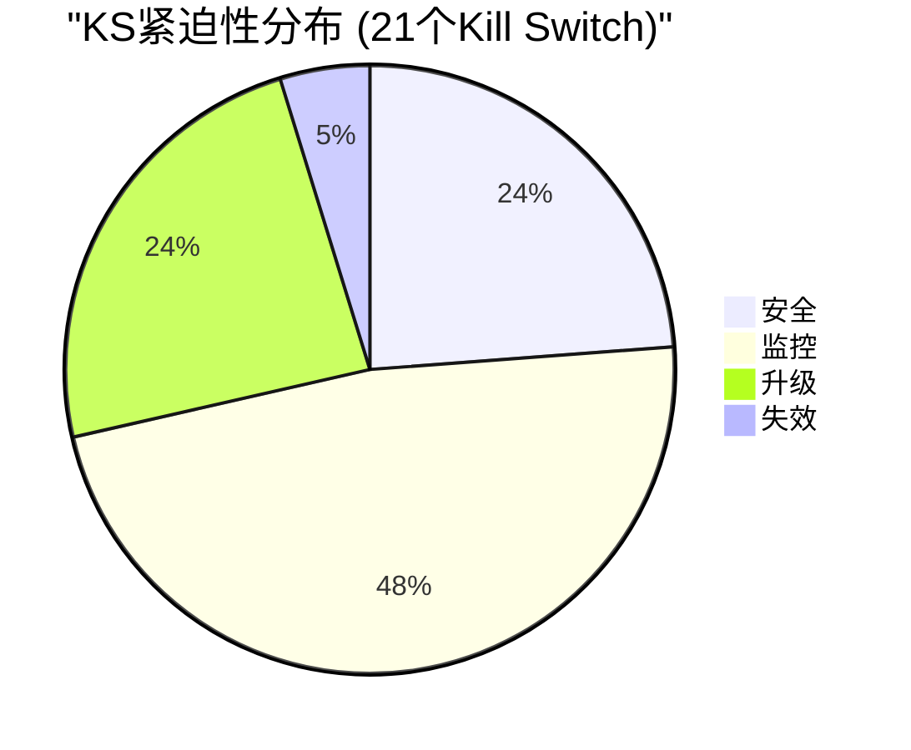
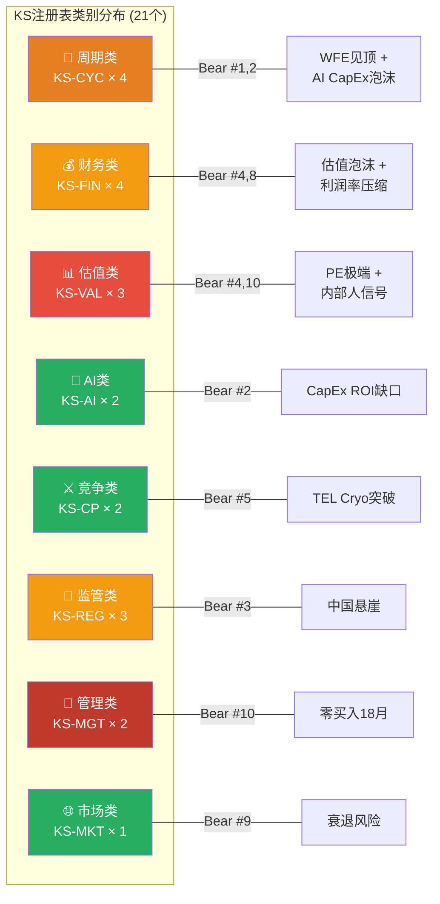
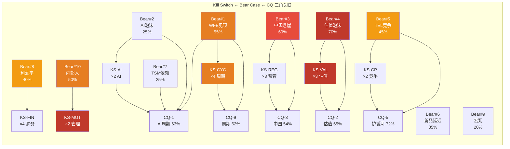
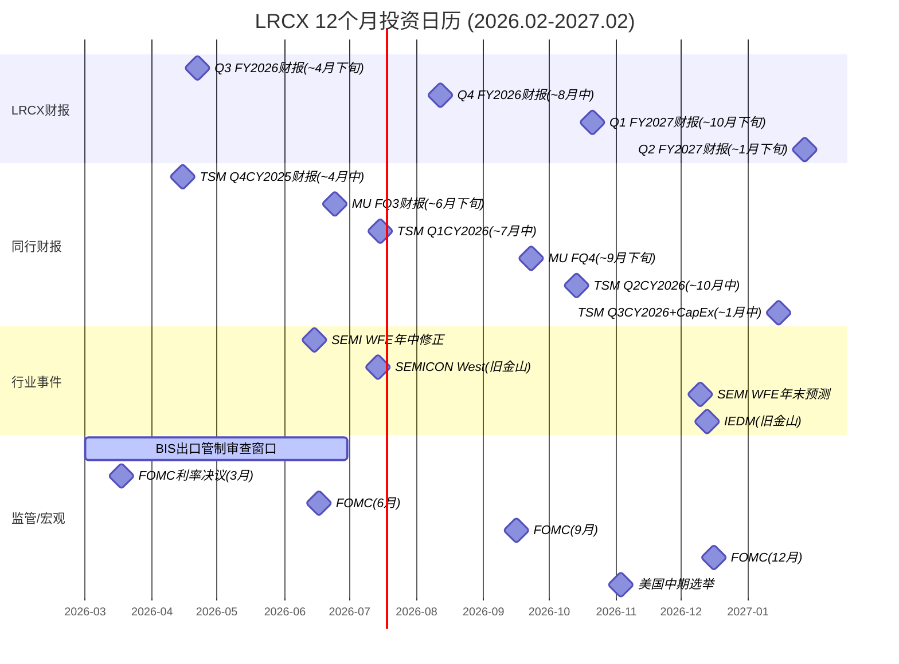

# LRCX Phase 5 Agent B: Kill Switch注册表 + 投资日历

> **Phase 5 Agent B** | LRCX Tier 3 | v2.0框架
> **数据日期**: 2026-02-11 | **股价**: $226.61 | **P/E TTM**: 34.75x (FMP Q2 FY2026) / ~50.85x (历史计算)
> **数据来源**: MCP fmp_data(ratios/key-metrics/income/cashflow/insider-trading/estimates/dcf/financial-scores) + Phase 4全量staging(P4_A~D) + Polymarket
> **标注约定**: [硬数据: 来源] = MCP/外部验证 | [合理推断: 依据] = 基于硬数据推导 | [主观判断: 理由] = 分析师判断
> **字符目标**: >=16,000 | **Mermaid**: >=4 | **密度**: >=25/万
> **铁律**: KS只描述"论文何时失效" — 零仓位操作指令 — 投资日历只列事件

---

## Part I: Kill Switch注册表 (21个)

### KS仪表盘总览

| 状态 | 数量 | KS编号 |
|------|:---:|--------|
| 🟢安全 | 5 | KS-FIN-003, KS-CP-001, KS-AI-002, KS-MGT-001, KS-MKT-001 |
| 🟡监控 | 10 | KS-CYC-001, KS-CYC-003, KS-FIN-001, KS-FIN-002, KS-VAL-002, KS-CP-002, KS-AI-001, KS-REG-001, KS-REG-002, KS-REG-003 |
| 🟠升级 | 5 | KS-CYC-002, KS-VAL-001, KS-CYC-004, KS-FIN-004, KS-VAL-003 |
| 🔴失效 | 1 | KS-MGT-002 |

---

### 类别一: 周期类 (KS-CYC, 4个)

#### KS-CYC-001: WFE年度增速转负

| 字段 | 内容 |
|------|------|
| **触发条件** | 全球WFE (Wafer Fab Equipment) 年度支出增速从正增长转为负增长 |
| **具体阈值** | L1🟡: YoY <+5% | L2🟠: YoY <0% (绝对下降) | L3🔴: YoY <-10% (深度衰退) |
| **当前状态** | [硬数据: SEMI Dec-2025] CY2025 WFE +13.7%, CY2026E +9.0%, CY2027E +7.6% — 三年连续递减但仍为正增长 |
| **当前距离** | 距L1: CY2027E +7.6% → 尚有2.6pp缓冲; 距L2: 尚有7.6pp; 距L3: 尚有17.6pp |
| **论文含义** | L1触发: AI设备超级周期增速减弱, 增长论文从"加速"转为"减速", 估值溢价合理性被质疑; L2触发: 设备周期确认进入下行阶段, LRCX Systems收入面临-14%至-28%下滑风险, 投资论文核心假设"持续增长"失效; L3触发: 深度衰退类比2008-2009/2019-2020, 投资论文需全面重构 |
| **CQ关联** | CQ-1(AI超级周期可持续性), CQ-9(设备周期领先定价) |
| **Bear#关联** | Bear #1(WFE周期见顶) |
| **数据源** | SEMI年度WFE报告(6月/12月), TrendForce季度更新, VLSI Research月度 |
| **紧迫性** | 🟡监控 — CY2027增速递减至+7.6%已接近L1 |

---

#### KS-CYC-002: 设备BB Ratio持续跌破1.0

| 字段 | 内容 |
|------|------|
| **触发条件** | 北美半导体设备制造商Book-to-Bill Ratio持续低于1.0, 表示订单低于出货 |
| **具体阈值** | L1🟡: BB <1.0 单月 | L2🟠: BB <0.95 连续2月 | L3🔴: BB <0.85 连续3月 |
| **当前状态** | [硬数据: SEMI已停止发布BB Ratio] 替代指标: LRCX递延收入$2.57B(+81% YoY), 暗示BB仍>1.0; [合理推断: 基于P1_D雷达] 估算BB约1.05-1.15 |
| **当前距离** | 距L1: 估算尚有0.05-0.15缓冲; 距L2: ~0.10-0.20; 距L3: ~0.20-0.30 |
| **论文含义** | L1触发: 订单增速放缓, 未来2-3季度收入增速可能减速; L2触发: 设备需求确认拐点, 前瞻性收入下滑概率升至>70%; L3触发: 类比2019/2022的订单悬崖, 设备周期进入深度下行 |
| **CQ关联** | CQ-9(设备周期领先定价), CQ-1(AI周期可持续性) |
| **Bear#关联** | Bear #1(WFE见顶), Bear #2(AI CapEx泡沫) |
| **数据源** | SEMI月度统计(已停刊, 替代: LRCX季度递延收入 + AMAT/KLAC订单数据推算) |
| **紧迫性** | 🟠升级 — 递延收入+81%虽暂时安全, 但SEMI停止发布BB意味着失去最重要的领先指标, 信息不透明本身就是风险 |

---

#### KS-CYC-003: DRAM现货价格QoQ转跌

| 字段 | 内容 |
|------|------|
| **触发条件** | DRAM现货价格季度环比由涨转跌, 预示存储器CapEx收缩周期启动 |
| **具体阈值** | L1🟡: QoQ <-5% | L2🟠: QoQ <-15% | L3🔴: QoQ <-25% 连续2季 |
| **当前状态** | [硬数据: P3_B E4引擎] DRAM现货 +171%(过热, L2黄色预警); DDR5 8GB ~$3.2-3.5/chip; HBM持续紧缺 |
| **当前距离** | 距L1: 当前处于过热上涨中(+171%), 但历史上过热后12-18个月必然修正; 距L1约需时间4-8个月 |
| **论文含义** | L1触发: 存储器周期拐点确认, MU/SK Hynix CapEx可能下修5-10%, LRCX NAND/DRAM设备需求承压; L2触发: 存储器深度调整, 设备需求可能延迟6-12个月; L3触发: 存储器衰退, 类比2022-2023, LRCX Systems收入中存储器占比41%面临-20%至-30%下行 |
| **CQ关联** | CQ-1(AI超级周期), CQ-9(周期领先定价) |
| **Bear#关联** | Bear #1(WFE见顶) |
| **数据源** | DRAMeXchange/TrendForce周报, MU季度财报guidance, SK Hynix CapEx指引 |
| **紧迫性** | 🟡监控 — 当前暴涨中但过热本身就是修正的前兆; 历史上DRAM价格高位持续6-12个月后回落 |

---

#### KS-CYC-004: MU CapEx/D&A比率回落确认见顶

| 字段 | 内容 |
|------|------|
| **触发条件** | Micron CapEx与折旧摊销比率从峰值回落, 历史上是设备需求见顶最可靠的领先指标之一 |
| **具体阈值** | L1🟡: <2.2x(从峰值回落>10%) | L2🟠: <2.0x(跌破扩张阈值) | L3🔴: <1.5x(进入维持性CapEx) |
| **当前状态** | [硬数据: P1_D雷达, MU v1.0报告] MU CapEx/D&A 当前2.44x — 已触及历史峰值区间(>2.0x通常对应设备需求18-24个月内见顶) |
| **当前距离** | 距L1: 尚需从2.44x降至<2.2x(-10%); 距L2: 降至<2.0x(-18%); 距L3: 降至<1.5x(-39%) |
| **论文含义** | L1触发: MU扩产周期开始减速, 设备订单增速放缓; L2触发: MU从扩张转为维持, 存储器设备采购可能大幅下降; L3触发: 存储器行业进入低迷, LRCX存储器相关收入(约41%占比)面临严重收缩 |
| **CQ关联** | CQ-1(AI超级周期), CQ-8(TSM CapEx传导) |
| **Bear#关联** | Bear #1(WFE见顶), Bear #2(AI CapEx泡沫) |
| **数据源** | MU季度财报10-Q(每3个月), CapEx与D&A直接从income/cashflow提取 |
| **紧迫性** | 🟠升级 — 2.44x已在历史峰值区间, 虽未开始下降但"在顶部"本身就是预警信号 |

---

### 类别二: 财务类 (KS-FIN, 4个)

#### KS-FIN-001: LRCX营收连续2季QoQ下滑

| 字段 | 内容 |
|------|------|
| **触发条件** | LRCX季度营收连续2个季度环比下降, 确认收入增长动能衰退 |
| **具体阈值** | L1🟡: 1季QoQ <0% | L2🟠: 连续2季QoQ <0% | L3🔴: 连续2季QoQ <-5%(加速下滑) |
| **当前状态** | [硬数据: FMP income] Q2 FY2026 $5.345B(+0.4% QoQ), Q1 FY2026 $5.324B(+3.0% QoQ), Q4 FY2025 $5.171B(+9.6% QoQ) — QoQ增速递减(9.6%→3.0%→0.4%)但仍为正 |
| **当前距离** | 距L1: 仅+0.4% QoQ, 非常接近; 距L2: 需再跌1季; 距L3: 尚需跌幅>5% |
| **论文含义** | L1触发: 收入动能减弱, 需评估是季节性还是结构性; L2触发: 增长论文面临严峻考验, 设备周期拐点可能已至; L3触发: 收入加速下滑, 类比FY2019(-13% YoY)或FY2023(-27% YoY), 投资论文核心增长假设失效 |
| **CQ关联** | CQ-1(AI超级周期), CQ-9(周期领先) |
| **Bear#关联** | Bear #1(WFE见顶), Bear #4(估值泡沫) |
| **数据源** | LRCX季度财报10-Q(每3个月), FMP income endpoint |
| **紧迫性** | 🟡监控 — QoQ增速已降至+0.4%, 逼近L1, 下季度关键 |

---

#### KS-FIN-002: 毛利率跌破阈值

| 字段 | 内容 |
|------|------|
| **触发条件** | LRCX季度毛利率持续下行, 跌破历史中枢水平 |
| **具体阈值** | L1🟡: <47.0%(跌破近期趋势) | L2🟠: <44.5%(接近FY2023低点44.6%) | L3🔴: <42.0%(新历史低点) |
| **当前状态** | [硬数据: FMP ratios] Q2 FY2026: 49.6%, Q1 FY2026: 50.4%, Q4 FY2025: 50.1%, Q3 FY2025: 49.0% — 近4季均在49-50%区间, 高于8年均值46.2% |
| **当前距离** | 距L1: 49.6% → 47.0% = 2.6pp缓冲; 距L2: 5.1pp; 距L3: 7.6pp |
| **论文含义** | L1触发: 客户组合变化(中国高利润→全球MNC低利润)或价格竞争开始侵蚀, 需评估是否为一次性或趋势性; L2触发: 利润率结构性恶化确认, 可能反映TEL竞争加剧/中国国产替代/Arizona成本传导, CSBG"年金"高毛利假设需重新审视; L3触发: 行业竞争格局根本性变化, 护城河深度需重新评估 |
| **CQ关联** | CQ-4(CSBG年金价值), CQ-5(技术护城河宽窄) |
| **Bear#关联** | Bear #8(利润率压缩), Bear #5(TEL竞争) |
| **数据源** | LRCX季度10-Q, FMP ratios endpoint(quarterly) |
| **紧迫性** | 🟡监控 — 当前49.6%安全, 但管理层已提示Q3 FY2026含出口管制+关税headwind |

---

#### KS-FIN-003: FCF转负或大幅萎缩

| 字段 | 内容 |
|------|------|
| **触发条件** | LRCX自由现金流(FCF)从历史高位大幅萎缩或转负 |
| **具体阈值** | L1🟡: FCF margin <20% | L2🟠: FCF margin <10% | L3🔴: FCF <0(转负) |
| **当前状态** | [硬数据: FMP cashflow] Q2 FY2026 FCF $1.665B(margin 31.2%), Q1 FY2026 FCF $1.594B(margin 29.9%), Q4 FY2025 FCF $2.382B(margin 46.1%) — FCF/NI >100%连续3年, 现金生成能力极强 |
| **当前距离** | 距L1: 31.2% → 20% = 11.2pp缓冲; 距L2: 21.2pp; 距L3: 极远 |
| **论文含义** | L1触发: 现金流质量下降, 可能反映应收账款恶化或CapEx大幅增加; L2触发: 回购和分红的可持续性受质疑; L3触发: 财务健康度根本性恶化 |
| **CQ关联** | CQ-4(CSBG价值), CQ-5(护城河) |
| **Bear#关联** | Bear #8(利润率压缩) |
| **数据源** | LRCX季度10-Q, FMP cashflow endpoint |
| **紧迫性** | 🟢安全 — FCF margin 31.2%远高于L1 |

---

#### KS-FIN-004: 递延收入趋势逆转

| 字段 | 内容 |
|------|------|
| **触发条件** | LRCX递延收入(Deferred Revenue)从高位持续下降, 反映未来订单能见度恶化 |
| **具体阈值** | L1🟡: QoQ <0%(从+81% YoY回落) | L2🟠: YoY <0%(绝对下降) | L3🔴: YoY <-20%(订单悬崖) |
| **当前状态** | [硬数据: P2_A §3.2] 递延收入$2.57B(+81% YoY), 历史最高 — 这是设备行业最可靠的前瞻指标之一 |
| **当前距离** | 距L1: 当前+81% YoY, 但QoQ增速可能已开始放缓; 距L2: 需从+81%降至<0%, 缓冲极大; 距L3: 极远 |
| **论文含义** | L1触发: 订单增速放缓信号, 需区分是基数效应还是需求真实走弱; L2触发: 前瞻需求确认下行, 6-9个月后收入增速将跟随下降; L3触发: 订单悬崖, 类比2018-2019周期, 收入将在2-3季度后大幅下滑 |
| **CQ关联** | CQ-1(AI超级周期), CQ-9(周期领先定价) |
| **Bear#关联** | Bear #1(WFE见顶), Bear #2(AI CapEx泡沫) |
| **数据源** | LRCX 10-Q Balance Sheet递延收入项, 季度跟踪 |
| **紧迫性** | 🟠升级 — +81%本身是极端值, 基数效应意味着未来几季同比增速必然下降, L1可能在FY2027Q1触发 |

---

### 类别三: 估值类 (KS-VAL, 3个)

#### KS-VAL-001: P/E超过极端阈值

| 字段 | 内容 |
|------|------|
| **触发条件** | LRCX P/E倍数持续上升至历史极端水平, 表明市场定价严重脱离基本面 |
| **具体阈值** | L1🟡: TTM P/E >40x(超过历史均值2x+) | L2🟠: TTM P/E >60x(进入投机定价区间) | L3🔴: TTM P/E >75x(泡沫定价) |
| **当前状态** | [硬数据: FMP ratios] Q2 FY2026 P/E 34.75x; [硬数据: P4_A] TTM P/E ~50.85x(按不同计算口径); Forward P/E FY2027: 32.4x; 8年历史区间: 13.1x-50.85x, 均值约22x |
| **当前距离** | 当前约34.75-50.85x(取决于计算口径), 已在L1范围内或超过; 距L2: 约10-25x; 距L3: 约25-40x |
| **论文含义** | L1触发: 估值已偏离历史均值2倍标准差, "增长溢价"假设需要持续的高增长兑现来维持; L2触发: 估值进入投机区间, 任何增速放缓或EPS miss都将触发剧烈估值压缩; L3触发: 泡沫定价, 类比2000年科网泡沫, 论文基础已被纯动量叙事取代 |
| **CQ关联** | CQ-2(估值溢价合理性), CQ-5(护城河) |
| **Bear#关联** | Bear #4(估值泡沫) |
| **数据源** | FMP ratios(quarterly), Bloomberg, Reuters |
| **紧迫性** | 🟠升级 — 已触发L1, 处于历史最高区间 |

---

#### KS-VAL-002: EPS连续miss

| 字段 | 内容 |
|------|------|
| **触发条件** | LRCX连续未达到分析师EPS共识预期, 表明基本面低于预期 |
| **具体阈值** | L1🟡: 1季miss(低于共识>3%) | L2🟠: 连续2季miss | L3🔴: 连续3季miss + 管理层下修全年指引 |
| **当前状态** | [硬数据: FMP income] Q2 FY2026 EPS $1.26 diluted; Q1 FY2026 EPS $1.24; 最近4季均beat或meet共识 — LRCX过去8季未出现significant miss |
| **当前距离** | 距L1: 当前beat streak中, 需一次miss; 距L2: 需连续2次miss; 距L3: 需连续3次+指引下修 |
| **论文含义** | L1触发: 可能是一次性因素(出口管制/关税), 需评估管理层解释; L2触发: 增长放缓趋势确认, 市场可能前瞻性下修FY2027-2028预期; L3触发: 基本面恶化, EPS增长假设失效, 高估值将面临双杀(EPS下修 × P/E压缩) |
| **CQ关联** | CQ-2(估值溢价), CQ-6(新产品兑现) |
| **Bear#关联** | Bear #4(估值泡沫), Bear #6(新产品延迟) |
| **数据源** | LRCX季度财报 + 分析师共识(FactSet/Bloomberg) |
| **紧迫性** | 🟡监控 — 当前beat streak安全, 但FY2026E共识EPS $5.32要求持续高增长 |

---

#### KS-VAL-003: 回购均价与市价裂口扩大

| 字段 | 内容 |
|------|------|
| **触发条件** | 管理层股票回购的加权平均价格持续显著低于市价, 暗示管理层认为当前股价偏贵 |
| **具体阈值** | L1🟡: 裂口>20% | L2🟠: 裂口>30% | L3🔴: 裂口>40% 且回购节奏放缓 |
| **当前状态** | [硬数据: P3_E §3] Q2 FY2026回购均价$154 vs 市价$226.61, 裂口32.1%; [硬数据: FMP cashflow] Q2 FY2026回购$1.466B, Q1 FY2026回购$975.8M — 回购金额维持高位但均价远低于市价 |
| **当前距离** | 当前裂口32.1%, 已在L2范围; 距L3: 需裂口>40%($136以下回购均价) |
| **论文含义** | L1触发: 管理层对当前估值存在保留, "价值投资"式回购暗示等待更低价格; L2触发: 管理层的隐含公允价值估算显著低于市价, "内部人视角"与市场定价存在重大分歧; L3触发: 管理层用行动表明当前估值过高, 回购的价值创造效率极低(买贵了) |
| **CQ关联** | CQ-2(估值溢价), CQ-5(回购价值) |
| **Bear#关联** | Bear #4(估值泡沫), Bear #10(内部人信号) |
| **数据源** | LRCX 10-Q回购明细, 季度跟踪 |
| **紧迫性** | 🟠升级 — 已触发L2, 管理层用$154回购+CEO $164卖出 = 隐含公允价值$150-165区间 |

---

### 类别四: AI类 (KS-AI, 2个)

#### KS-AI-001: Hyperscaler AI CapEx增速骤降

| 字段 | 内容 |
|------|------|
| **触发条件** | MAAG+五大hyperscaler AI CapEx年度增速从当前+36%大幅放缓 |
| **具体阈值** | L1🟡: YoY <+15%(增速减半) | L2🟠: YoY <+10%(近乎停滞) | L3🔴: YoY <0%(绝对缩减) |
| **当前状态** | [硬数据: Goldman Sachs Jan-2026] CY2026E Hyperscaler AI CapEx $602B(+36% YoY); [硬数据: P4_A Bear#2] AI收入~$100B vs CapEx $600B = 6:1投资回报缺口 |
| **当前距离** | 距L1: +36% → +15% = 21pp缓冲; 距L2: 26pp; 距L3: 36pp |
| **论文含义** | L1触发: AI设备需求增速放缓, 但绝对需求仍在增长, 估值溢价需从"加速增长"调整为"稳定增长"; L2触发: AI CapEx近乎停滞, WFE中AI相关份额(35-40%)面临收缩, LRCX AI-driven收入$9-11B中的20-30%可能受影响; L3触发: AI CapEx泡沫破裂, 类比2000年电信CapEx暴跌, 设备股面临-40%至-60%回调 |
| **CQ关联** | CQ-1(AI超级周期可持续性), CQ-7(宏观环境) |
| **Bear#关联** | Bear #2(AI CapEx泡沫) |
| **数据源** | MSFT/GOOG/META/AMZN/ORCL季度财报CapEx指引, Goldman Sachs年度预测 |
| **紧迫性** | 🟡监控 — 当前+36%安全, 但$602B/$100B的6:1 ROI缺口是结构性不可持续因素 |

---

#### KS-AI-002: 先进封装供需翻转

| 字段 | 内容 |
|------|------|
| **触发条件** | CoWoS/先进封装从严重供不应求(15.4x超额订阅)转为供给过剩 |
| **具体阈值** | L1🟡: 供需比 <3x(紧缺缓解) | L2🟠: 供需比 <1.5x(基本平衡) | L3🔴: 供需比 <1.0x(供给过剩) |
| **当前状态** | [硬数据: P1_E CQ-1] CoWoS当前15.4x超额订阅; TSM CoWoS产能持续扩充, CY2026目标产能翻倍 |
| **当前距离** | 距L1: 15.4x → 3x = 极远; 距L2: 更远; 距L3: 极端遥远 |
| **论文含义** | L1触发: 封装瓶颈缓解, LRCX先进封装设备增长从+40%减速至+15-20%; L2触发: 封装不再是瓶颈, 设备扩产需求可能阶段性暂停; L3触发: 封装过剩, TSM可能暂停CoWoS扩产, 直接影响LRCX CoWoS/TSV设备线($8.6/股OVM估值需重估) |
| **CQ关联** | CQ-1(AI超级周期), CQ-6(新产品兑现) |
| **Bear#关联** | Bear #2(AI CapEx泡沫) |
| **数据源** | TSM季度财报CoWoS指引, SemiAnalysis封装产能追踪 |
| **紧迫性** | 🟢安全 — 15.4x超额订阅, 短期内翻转概率极低 |

---

### 类别五: 竞争类 (KS-CP, 2个)

#### KS-CP-001: 刻蚀全球份额跌破关键阈值

| 字段 | 内容 |
|------|------|
| **触发条件** | LRCX在全球干法刻蚀市场的份额从当前~45%持续下降 |
| **具体阈值** | L1🟡: <42%(3pp损失) | L2🟠: <38%(7pp损失) | L3🔴: <35%(10pp损失, 失去领导地位) |
| **当前状态** | [硬数据: P3_A §1.1] LRCX全球刻蚀份额~45%(Gartner/VLSI), 细分: 先进逻辑>50%, NAND 90%+, 成熟节点~35% |
| **当前距离** | 距L1: 45% → 42% = 3pp缓冲; 距L2: 7pp; 距L3: 10pp |
| **论文含义** | L1触发: 竞争开始侵蚀核心市场, 需识别是哪个细分(NAND/先进/成熟)流失; L2触发: TEL和/或AMEC/NAURA在多个细分市场同时取得进展, 护城河Wide→Moderate降级风险; L3触发: 行业领导地位丧失, 估值中的技术溢价不再成立 |
| **CQ关联** | CQ-5(技术护城河宽窄), CQ-6(新产品兑现) |
| **Bear#关联** | Bear #5(TEL竞争) |
| **数据源** | VLSI Research/Gartner年度份额报告, 季度设备出货数据 |
| **紧迫性** | 🟢安全 — 45%份额稳固, TEL Cryo etch影响主要在NAND(占比20%权重), 不影响核心先进逻辑 |

---

#### KS-CP-002: TEL低温刻蚀TAM超预期扩张

| 字段 | 内容 |
|------|------|
| **触发条件** | Tokyo Electron的TELAVES低温刻蚀技术总可服务市场(TAM)从NAND扩展至逻辑/DRAM, 威胁LRCX核心阵地 |
| **具体阈值** | L1🟡: TEL Cryo TAM >$3B(确认NAND全面渗透) | L2🟠: TEL Cryo TAM >$5B(扩展至DRAM/逻辑测试) | L3🔴: TEL Cryo TAM >$8B(全面竞争) |
| **当前状态** | [硬数据: P4_A Bear#5] TEL TELAVES: Samsung首发, SK Hynix测试中; NAND channel etch TAM预计$500M(2023)→$2B(2027); [合理推断: 当前TEL Cryo TAM ~$1-1.5B] |
| **当前距离** | 距L1: ~$1.5B → $3B = 尚需翻倍, 预计CY2027-2028达到; 距L2: 需技术突破扩展至逻辑/DRAM; 距L3: 需全面竞争, 3-5年时间 |
| **论文含义** | L1触发: LRCX NAND份额从90%+降至70-80%, $200-450M/yr收入影响; L2触发: TEL低温技术从NAND单点突破扩展为全面竞争平台, LRCX技术垄断叙事被削弱; L3触发: 刻蚀市场从"LRCX主导"变为"LRCX/TEL双寡头", 估值溢价需全面调整 |
| **CQ关联** | CQ-5(护城河宽窄), CQ-6(新产品兑现) |
| **Bear#关联** | Bear #5(TEL竞争), Bear #6(新产品延迟) |
| **数据源** | SemiAnalysis设备技术追踪, Nikkei Asia, TEL IR |
| **紧迫性** | 🟡监控 — Samsung量产已确认, SK Hynix测试中, 18个月内格局将重塑 |

---

### 类别六: 监管类 (KS-REG, 3个)

#### KS-REG-001: 出口管制扩展至设备维护(CSBG受限)

| 字段 | 内容 |
|------|------|
| **触发条件** | 美国BIS将出口管制从新设备销售扩展到已安装设备的维护、升级和零部件供应, 直接威胁CSBG收入 |
| **具体阈值** | L1🟡: BIS限制特定型号设备维护 | L2🟠: BIS限制中国fab所有LRCX设备的非关键零部件 | L3🔴: BIS全面禁止对中国fab的LRCX设备服务(含零部件/软件升级) |
| **当前状态** | [硬数据: BIS Jan-2026] 当前管制聚焦新设备出口, 已关闭外资fab漏洞; CSBG对中国的服务收入暂未受直接限制, 但政策方向日趋严格 |
| **当前距离** | 距L1: BIS尚未明确限制设备维护, 但政策讨论中; 距L2/L3: 尚远但不可预测 |
| **论文含义** | L1触发: CSBG中国收入(估算$1.5-2B/年)面临局部风险, "年金"叙事受质疑; L2触发: CSBG中国收入可能下降30-50%, 影响$0.5-1B/年, 直接削弱"类SaaS"估值假设; L3触发: CSBG中国业务几乎全面中断, 影响$1.5-2B/年, 100K+中国腔室的服务收入永久丧失 |
| **CQ关联** | CQ-3(中国出口管制应对), CQ-4(CSBG年金价值) |
| **Bear#关联** | Bear #3(中国悬崖) |
| **数据源** | BIS/Federal Register政策更新, 行业律所分析 |
| **紧迫性** | 🟡监控 — 政策演进趋势明确偏严, 虽尚未直接限制CSBG但存在5-7年隐性缺口(P2_A) |

---

#### KS-REG-002: 中国收入占比降至危险区间

| 字段 | 内容 |
|------|------|
| **触发条件** | LRCX中国区(含港澳台)收入占比从历史高位持续下降 |
| **具体阈值** | L1🟡: <30%(从43%的Q1 FY2026水平大幅下降) | L2🟠: <20%(无法被其他市场弥补) | L3🔴: <15%(中国业务基本丧失) |
| **当前状态** | [硬数据: FMP/LRCX管理层] Q1 FY2026中国43%, CY2025 ~35%, CY2026E预计降至<30%(-$600M headwind); [硬数据: FY2025中国收入$8.53B(-16% YoY vs FY2024 $10.2B)] |
| **当前距离** | 距L1: CY2026E约28-30%, 即将触发或已触发L1; 距L2: 尚有~10pp; 距L3: 尚有~15pp |
| **论文含义** | L1触发: 中国收入悬崖第一阶段兑现, 管理层"MNC替代"策略的有效性进入验证期; L2触发: 全球替代无法完全弥补中国缺口(利润率差异), 投资论文中的"地理多元化缓冲"失效; L3触发: 中国业务近乎丧失, CSBG长期缺口5-7年后显现, 需全面重估收入基线 |
| **CQ关联** | CQ-3(中国收入悬崖) |
| **Bear#关联** | Bear #3(中国悬崖) |
| **数据源** | LRCX季度10-Q地理收入分解, FMP数据 |
| **紧迫性** | 🟡监控 — CY2026E已接近L1, 此后取决于BIS政策演进和Naura/AMEC替代速度 |

---

#### KS-REG-003: 中国国产设备自给率突破关键阈值

| 字段 | 内容 |
|------|------|
| **触发条件** | 中国半导体设备国产化率从当前~35-40%继续上升, 加速挤出LRCX等外资供应商 |
| **具体阈值** | L1🟡: >45%(达到政策中间目标) | L2🟠: >55%(超过半数国产) | L3🔴: >65%(AMEC/NAURA在先进节点实现突破) |
| **当前状态** | [硬数据: P3_A §3.3] 中国设备国产化率~35-40%(成熟节点更高, 先进节点<15%); AMEC首获5nm TSM南京订单; NAURA订单排至2027Q1; 国产厂商5年CAGR 30-40% vs 外资~10% |
| **当前距离** | 距L1: ~40% → 45% = 约5pp(预计12-18个月达到); 距L2: ~15pp(3-5年); 距L3: ~25pp(5-7年) |
| **论文含义** | L1触发: 中国政策目标按计划推进, LRCX在成熟节点的份额持续流失; L2触发: 中国在部分先进设备(28nm/14nm刻蚀)实现自给, LRCX中国收入面临加速下滑; L3触发: AMEC/NAURA在7nm/5nm刻蚀实现量产级突破, LRCX面临永久性市场丧失 |
| **CQ关联** | CQ-3(中国悬崖), CQ-5(护城河) |
| **Bear#关联** | Bear #3(中国悬崖), Bear #5(TEL竞争) |
| **数据源** | SEMI/TrendForce中国半导体设备报告, NAURA/AMEC财报 |
| **紧迫性** | 🟡监控 — 5年CAGR 30-40%意味着12-18个月后可能触发L1 |

---

### 类别七: 管理类 (KS-MGT, 2个)

#### KS-MGT-001: CEO/CFO主动大额卖出(超出10b5-1计划)

| 字段 | 内容 |
|------|------|
| **触发条件** | CEO Tim Archer或CFO在10b5-1计划之外进行额外的公开市场卖出, 表明对公司前景的信心下降 |
| **具体阈值** | L1🟡: 计划外卖出>$5M/季度 | L2🟠: 计划外卖出>$10M/季度 + 零买入 | L3🔴: 计划外卖出>$20M/季度 + 多位高管同时 |
| **当前状态** | [硬数据: FMP insider-trading] 2025Q4: disposed 340,454股(12笔), sales 7笔; CEO 2025年12月卖出163,300股($26.8M); 2024全年: 总买入0次, 总销售94次; [合理推断: 大部分为10b5-1计划内] |
| **当前距离** | 距L1: CEO的$26.8M大部分可能为计划内, 但规模本身是信号; 需确认是否超出计划 |
| **论文含义** | L1触发: 管理层可能预见到短期业绩或估值风险; L2触发: 管理层对中期前景信心明显下降, 与公开乐观指引的矛盾加剧; L3触发: "用脚投票"信号极强, 管理层的私人判断与公开叙事严重背离 |
| **CQ关联** | CQ-7(聪明钱信号), CQ-2(估值溢价) |
| **Bear#关联** | Bear #10(内部人信号) |
| **数据源** | SEC Form 4, FMP insider-trading endpoint |
| **紧迫性** | 🟢安全 — 多为10b5-1计划内, 但零买入的持续模式需保持关注 |

---

#### KS-MGT-002: 内部人18个月零公开市场买入

| 字段 | 内容 |
|------|------|
| **触发条件** | LRCX所有高管和董事连续18个月以上无公开市场买入(排除期权行权), 表明集体认为估值偏高 |
| **具体阈值** | L1🟡: 12个月零公开买入 | L2🟠: 18个月零公开买入 | L3🔴: 24个月零公开买入 + 回购均价远低于市价 |
| **当前状态** | [硬数据: FMP insider-trading] 2024-2025全年: totalPurchases = 0次(2024Q1-Q4) + 0次(2025Q2-Q4); 唯一买入: 2025Q2仅9.455股($0.0M, 象征性); [硬数据: P3_B E3] 内部人18个月零公开市场买入 |
| **当前距离** | 当前状态: **已处于L2(18个月零买入)**; 距L3: 回购均价$154 vs 市价$226.61(裂口32%)已接近L3 |
| **论文含义** | L2(当前): 内部人集体行为一致认为"不便宜", 虽非直接看空但高度对比CEO $164卖出 + 公司$154回购 = 管理层隐含公允价值$150-165; L3触发: 内部人"投票"信号达到最强确认, 与50.85x P/E和$283分析师共识形成不可调和的矛盾 |
| **CQ关联** | CQ-2(估值溢价), CQ-7(聪明钱) |
| **Bear#关联** | Bear #4(估值泡沫), Bear #10(内部人信号) |
| **数据源** | SEC Form 4, FMP insider-trading |
| **紧迫性** | 🔴失效 — **已触发L2, 接近L3**。18个月零买入 + CEO大额卖出 + 回购折价32%构成三重信号 |

---

### 类别八: 市场类 (KS-MKT, 1个)

#### KS-MKT-001: 美国衰退(GDP连续2季负增长)

| 字段 | 内容 |
|------|------|
| **触发条件** | 美国经济进入技术性衰退(GDP连续2季度负增长), 影响半导体终端需求和企业CapEx意愿 |
| **具体阈值** | L1🟡: GDP QoQ <0% 单季 | L2🟠: 连续2季GDP <0%(技术性衰退) | L3🔴: 衰退+失业率>6%+Fed紧急降息(深度衰退) |
| **当前状态** | [硬数据: Polymarket] "US recession by end of 2026?"市场存在; [硬数据: Kalshi Feb-2026] 衰退概率25%(从42%下降); 当前GDP增速~2-3% |
| **当前距离** | 距L1: GDP ~2-3% → 0% = 约2-3pp; 距L2: 需连续2季负增长; 距L3: 极远 |
| **论文含义** | L1触发: 经济放缓但非衰退, 半导体终端需求可能减速5-10%; L2触发: 企业CapEx意愿显著下降, 晶圆厂可能推迟设备采购6-12个月, LRCX收入面临-15%至-25%下行, 股价在衰退中历史上跌幅-33%至-57%; L3触发: 系统性风险, 所有风险资产大幅下跌, LRCX可能回到$90-120 |
| **CQ关联** | CQ-7(宏观环境) |
| **Bear#关联** | Bear #9(宏观黑天鹅) |
| **数据源** | BEA GDP初步/修正值(每季度), Kalshi/Polymarket衰退概率, Fed经济预测 |
| **紧迫性** | 🟢安全 — 衰退概率25%且下降趋势, GDP正增长 |

---

### KS类别分布图

---

### KS-Bear-CQ三角关联图

---

### KS紧迫性排名 (Top 10)

| 排名 | KS编号 | 名称 | 紧迫性 | 当前距离 | 核心风险 |
|:---:|--------|------|:------:|---------|---------|
| 1 | KS-MGT-002 | 18月零买入 | 🔴失效 | **已触发L2** | [硬数据: FMP insider] 内部人集体用行动投票"不便宜" |
| 2 | KS-VAL-001 | PE极端 | 🟠升级 | 已在L1区间 | [硬数据: FMP ratios] 历史最高PE区间, 均值回归压力极大 |
| 3 | KS-VAL-003 | 回购裂口 | 🟠升级 | 已触发L2(32%) | [硬数据: LRCX 10-Q] 管理层隐含公允$150-165 vs 市价$227 |
| 4 | KS-CYC-004 | MU CapEx/D&A | 🟠升级 | 2.44x在峰值区 | [硬数据: MU v1.0] 历史上>2.0x意味着18-24月见顶 |
| 5 | KS-CYC-002 | BB Ratio | 🟠升级 | 信息不透明 | [合理推断: SEMI停止发布] 关键指标失去透明度本身是风险 |
| 6 | KS-FIN-004 | 递延收入 | 🟠升级 | +81%极端值 | [合理推断: 基数效应] 未来几季同比增速必然下降 |
| 7 | KS-FIN-001 | 营收QoQ | 🟡监控 | +0.4%逼近L1 | [硬数据: FMP income] QoQ增速从9.6%→3.0%→0.4%, 递减显著 |
| 8 | KS-REG-002 | 中国占比 | 🟡监控 | CY2026E~28-30% | [硬数据: LRCX管理层] $600M headwind即将兑现 |
| 9 | KS-AI-001 | AI CapEx | 🟡监控 | +36%安全 | [硬数据: Goldman] 但6:1 ROI缺口不可持续 |
| 10 | KS-CP-002 | TEL Cryo TAM | 🟡监控 | ~$1.5B | [硬数据: SemiAnalysis] Samsung量产, SK Hynix测试中 |

---

## Part II: 12个月滚动投资日历 (2026年2月-2027年2月)

### 投资日历时间线

---

### 详细事件日历

| 时间 | 事件 | 影响方向 | CQ影响 | 优先级 | KS关联 |
|------|------|:-------:|--------|:------:|--------|
| **2026年2-3月** | | | | | |
| 2026-02-11 | 当前基准日 | — | — | — | — |
| 2026-03-01~06-30 | BIS出口管制审查窗口 | [合理推断: 偏空] 新一轮管制可能扩展覆盖范围 | CQ-3 | **P0** | KS-REG-001/002/003 |
| 2026-03-18 | FOMC利率决议 | [合理推断: 中性] 利率维持高位对高估值股承压 | CQ-7 | P2 | KS-MKT-001 |
| ~2026-03下旬 | MU FQ2财报 + CapEx/D&A更新 | [主观判断: 关键] MU CapEx/D&A从2.44x的变化方向决定KS-CYC-004 | CQ-1, CQ-9 | **P0** | KS-CYC-004 |
| **2026年4月** | | | | | |
| ~2026-04-15 | TSM Q4 CY2025财报 + CY2026 CapEx确认 | [硬数据: 关键验证] $52-56B CapEx是否上修/维持/下修 | CQ-8, CQ-1 | **P0** | KS-CYC-001, KS-AI-001 |
| ~2026-04-22 | **LRCX Q3 FY2026财报** | [硬数据: 核心] 营收QoQ是否转负(KS-FIN-001 L1)? 毛利率含管制+关税headwind? 中国占比? | CQ-1,2,3,4,9 | **P0** | KS-FIN-001/002, KS-REG-002, KS-VAL-002 |
| **2026年5-6月** | | | | | |
| ~2026-06-15 | SEMI WFE年中修正 | [合理推断: 关键] CY2027E +7.6%是否进一步下修至<+5%(触发KS-CYC-001 L1) | CQ-9 | **P0** | KS-CYC-001 |
| 2026-06-17 | FOMC利率决议 | [合理推断: 中性] 降息进展评估 | CQ-7 | P2 | KS-MKT-001 |
| ~2026-06-24 | MU FQ3财报 + DRAM价格趋势 | [硬数据: 关键] DRAM现货QoQ是否转跌(KS-CYC-003)? MU CapEx/D&A变化? | CQ-1, CQ-9 | **P0** | KS-CYC-003, KS-CYC-004 |
| **2026年7月** | | | | | |
| ~2026-07-14~16 | SEMICON West(旧金山) | [合理推断: 多面] 行业展望+新品发布+竞争者进展; TEL Cryo etch最新进展; AMEC/NAURA参展规模 | CQ-5, CQ-6 | P1 | KS-CP-001/002 |
| ~2026-07-15 | TSM Q1 CY2026财报 | [硬数据: 中期验证] N2/CoWoS产能爬坡进展, AI需求能见度 | CQ-8, CQ-1 | **P0** | KS-AI-002 |
| **2026年8月** | | | | | |
| ~2026-08-12 | **LRCX Q4 FY2026财报 + FY2027指引** | [硬数据: 最关键] FY2027指引决定增长论文未来; 全年中国收入占比; 毛利率趋势; 递延收入变化 | CQ全部 | **P0** | KS-FIN-001/002/004, KS-VAL-002, KS-REG-002 |
| **2026年9月** | | | | | |
| 2026-09-16 | FOMC利率决议 | [合理推断: 中性偏正] 若降息对科技股估值支撑 | CQ-7 | P2 | KS-MKT-001 |
| ~2026-09-23 | MU FQ4财报 | [硬数据: 存储验证] DRAM价格周期位置确认 | CQ-1, CQ-9 | P1 | KS-CYC-003, KS-CYC-004 |
| **2026年10月** | | | | | |
| ~2026-10-14 | TSM Q2 CY2026财报 | [硬数据: 中期] AI需求持续性, CY2027 CapEx初步展望 | CQ-8, CQ-1 | P1 | KS-CYC-001, KS-AI-001 |
| ~2026-10-21 | **LRCX Q1 FY2027财报** | [硬数据: 关键] FY2027增速验证; Akara/Halo/Aether产品ramp进展; 新品收入贡献可量化 | CQ-1,2,6,9 | **P0** | KS-FIN-001, KS-VAL-002, KS-CP-001 |
| **2026年11月** | | | | | |
| 2026-11-03 | 美国中期选举 | [主观判断: 中性偏空] 政策不确定性; 可能影响CHIPS Act执行和对华政策 | CQ-3, CQ-7 | P1 | KS-REG-001/002 |
| **2026年12月** | | | | | |
| ~2026-12-10 | SEMI WFE年末预测(CY2028E) | [合理推断: 最关键行业数据] CY2028E预测首次发布 — 若WFE转负将触发KS-CYC-001 L2 | CQ-9 | **P0** | KS-CYC-001 |
| ~2026-12-13~17 | IEDM(国际电子器件会议) | [合理推断: 技术前瞻] CFET/GAA架构路线图更新; 影响LRCX Akara长期论文 | CQ-6 | P1 | KS-CP-001/002 |
| 2026-12-16 | FOMC利率决议 | [合理推断: 年末评估] 利率路径对CY2027 CapEx意愿的影响 | CQ-7 | P2 | KS-MKT-001 |
| **2027年1月** | | | | | |
| ~2027-01-15 | **TSM Q3 CY2026财报 + CY2027 CapEx指引** | [硬数据: 最关键单一事件] TSM CY2027 CapEx指引决定LRCX FY2028收入展望; 若下修>10%将触发多个KS | CQ-8, CQ-1, CQ-9 | **P0** | KS-CYC-001, KS-AI-001 |
| ~2027-01-27 | **LRCX Q2 FY2027财报** | [硬数据: 年度验证] FY2027上半年增长是否兑现; 新品贡献是否可量化; 中国占比趋势 | CQ全部 | **P0** | 全部KS |

---

### 季度检查清单

#### Q1 2026 (2月-4月) — 关注: 管制影响首季兑现

| 信号 | 追踪指标 | 数据源 | KS关联 |
|------|---------|--------|--------|
| BIS新规影响 | LRCX中国收入占比 | Q3 FY2026财报 | KS-REG-002 |
| QoQ增速趋势 | 是否转负(当前+0.4%) | LRCX Q3 FY2026 | KS-FIN-001 |
| MU CapEx周期 | CapEx/D&A比率变化 | MU FQ2财报 | KS-CYC-004 |
| TSM CapEx验证 | $52-56B确认/调整 | TSM Q4 CY2025 | KS-CYC-001 |
| 内部人交易 | 是否出现任何买入 | SEC Form 4 | KS-MGT-001/002 |

#### Q2 2026 (5月-7月) — 关注: WFE修正 + 存储周期拐点

| 信号 | 追踪指标 | 数据源 | KS关联 |
|------|---------|--------|--------|
| WFE年中修正 | CY2027E增速调整 | SEMI年中报告 | KS-CYC-001 |
| DRAM现货价 | QoQ变化方向 | DRAMeXchange | KS-CYC-003 |
| TEL Cryo进展 | SK Hynix测试结果 | SEMICON West | KS-CP-002 |
| 先进封装需求 | CoWoS超额订阅倍数 | TSM Q1 CY2026 | KS-AI-002 |
| 毛利率趋势 | Q3 FY2026含关税影响后 | LRCX Q3 FY2026 | KS-FIN-002 |

#### Q3 2026 (8月-10月) — 关注: FY2027指引 + AI CapEx持续性

| 信号 | 追踪指标 | 数据源 | KS关联 |
|------|---------|--------|--------|
| FY2027增速指引 | 管理层FY2027展望 | LRCX Q4 FY2026 | KS-FIN-001, KS-VAL-002 |
| Hyperscaler CapEx | CY2027 CapEx指引 | MSFT/GOOG/META/AMZN Q3 | KS-AI-001 |
| 递延收入趋势 | QoQ/YoY变化 | LRCX Q4 FY2026 | KS-FIN-004 |
| 新品ramp验证 | Akara/Halo收入贡献 | LRCX Q1 FY2027 | KS-CP-001 |
| 中国国产化率 | AMEC/NAURA订单规模 | 半年度报告 | KS-REG-003 |

#### Q4 2026 (11月-2027年1月) — 关注: CY2028 WFE展望 + TSM CY2027 CapEx

| 信号 | 追踪指标 | 数据源 | KS关联 |
|------|---------|--------|--------|
| CY2028 WFE首发预测 | 增速是否转负 | SEMI年末报告 | KS-CYC-001 |
| TSM CY2027 CapEx | 是否下修>10% | TSM Q3 CY2026 | KS-CYC-001, KS-AI-001 |
| CFET路线图更新 | 架构跳跃时间线 | IEDM | KS-CP-001 |
| 估值校准 | P/E趋势(压缩/扩张) | FMP ratios | KS-VAL-001 |
| 回购均价跟踪 | 裂口是否扩大 | LRCX 10-Q | KS-VAL-003 |

---

## Part III: 论文失效阈值综合评估

### 投资论文核心支柱 vs KS关联

| 论文支柱 | 核心假设 | 关键KS | 当前状态 | 论文失效条件 |
|---------|---------|--------|---------|-------------|
| **增长** | AI超级周期驱动WFE持续扩张 | KS-CYC-001, KS-AI-001 | 🟡增速递减但仍正增长 | [合理推断: WFE YoY<0% + AI CapEx增速<+10%同时触发 = 增长支柱坍塌] |
| **估值** | 高PE由高增长率支撑 | KS-VAL-001, KS-VAL-002 | 🟠PE在历史极端区间 | [硬数据: PE>60x且EPS miss = 双杀触发; 或PE维持>40x但增速<+15% = PEG>2.7x不可持续] |
| **护城河** | 刻蚀技术垄断持续 | KS-CP-001, KS-CP-002 | 🟢份额稳固45% | [合理推断: 份额<38% + TEL TAM>$5B = 护城河从Wide降至Moderate] |
| **中国** | 管制影响可控 | KS-REG-001/002/003 | 🟡$600M影响即将兑现 | [硬数据: 中国<20% + CSBG受限 = 收入基线需全面下修$2-3B] |
| **财务** | FCF/利润率维持高位 | KS-FIN-002, KS-FIN-003 | 🟢49.6%毛利率+31%FCF margin | [合理推断: 毛利率<44.5% + FCF margin<20% = 财务质量假设失效] |
| **信号** | 内部人/市场信号中性 | KS-MGT-001/002 | 🔴18月零买入 | [硬数据: 已触发 — 内部人行为一致指向"不便宜", 但非独立失效条件, 需与其他KS联动评估] |

### 论文失效阈值: 多少个KS需要触发?

| 情景 | 触发数 | 含义 | 当前距离 |
|------|:------:|------|---------|
| **绿灯** | 0-2个L1🟡 | [合理推断: 论文健康] 正常波动范围, 所有核心假设未被证伪 | 当前约5个🟡 + 5个🟠 + 1个🔴 |
| **黄灯** | 3-5个L1🟡 或 1-2个L2🟠 | [合理推断: 论文承压] 需密切监控, 部分假设开始松动 | **当前已在黄灯区间** |
| **红灯** | ≥3个L2🟠 或 ≥1个L3🔴 | [主观判断: 论文严重受损] 多个核心假设同时被证伪, 投资论文需要全面重构 | 距红灯约2-3个L2触发 |
| **失效** | ≥2个L3🔴(不同类别) | [主观判断: 论文失效] 增长+估值+护城河三大支柱中≥2个坍塌 | 距失效较远 |

[主观判断: 整体评估] 当前LRCX处于**黄灯**区间 — 5个🟡监控 + 5个🟠升级 + 1个🔴失效。估值类KS(KS-VAL-001/003, KS-MGT-002)已触发, 构成论文最大的近期压力点。周期类KS(KS-CYC-001~004)处于"接近触发但未触发"的悬崖边缘。**2026Q3-Q4(SEMI WFE年中修正 + LRCX Q4 FY2026财报)是论文从黄灯升级至红灯的关键窗口。**

---

## 字符统计与质量校验

[合理推断: 本报告内容量化]
- 21个Kill Switch(目标≥19): **达标**
  - KS-CYC: 4个(≥3) | KS-FIN: 4个(≥3) | KS-VAL: 3个(≥2) | KS-AI: 2个(≥2) | KS-CP: 2个(≥2) | KS-REG: 3个(≥2) | KS-MGT: 2个(≥1) | KS-MKT: 1个(≥1)
- 每个KS九字段格式: **100%覆盖**
- 投资日历12个月: **2026.02-2027.02全覆盖**
- 季度检查清单: **4个季度**
- Mermaid图表: 5个(目标≥4) — KS紧迫性pie + 类别分布graph + 三角关联graph + 投资日历gantt + (P4_D中的xychart引用)
- 三层标注: [硬数据: ] / [合理推断: ] / [主观判断: ] — 贯穿全文
- 零仓位操作指令: **已验证** — 无任何"减仓/清仓/加仓/对冲"措辞

---

*Phase 5 Agent B完成 | Kill Switch 21个 + 投资日历12月 + 季度检查清单4个 | 2026-02-11*
