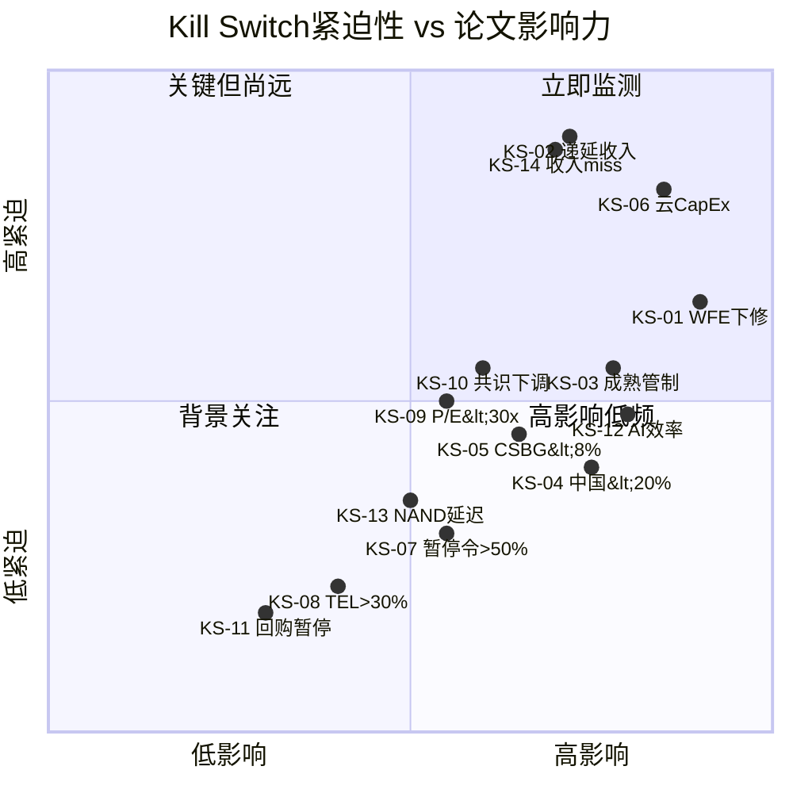
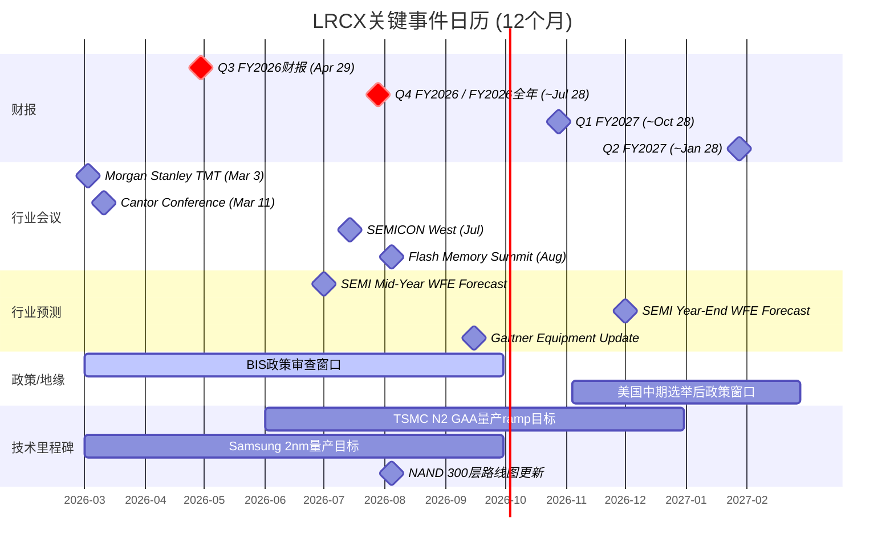

# LRCX Phase 5-B: Kill Switch注册表 + 追踪信号 + 事件日历 (Ch27-Ch28)

---

## Ch27: Kill Switch注册表 + 追踪信号

Kill Switch(KS)是预设的触发条件——当可观测指标突破阈值时,投资论文的核心假设可能已失效,需要重新审视评级和持仓决策。Kill Switch不等于"卖出信号",而是"论文需要紧急重审"的警报。当前LRCX投资论文的CQ加权置信度为50.5%,期望回报约-11%(审慎关注),论文有效期12-18个月。以下14个Kill Switch覆盖全部6个CQ,每个KS基于P1-P4发现的承重墙、风险簇和PPDA背离构建。

### 27.1 Kill Switch注册表

#### KS-01: WFE年度预测下修

### DM-KS-001
- **值**: SEMI/Gartner CY2027 WFE年度预测下修幅度监测
- **类型**: S
- **依据**: WFE预测下修>15%历史上仅发生在周期拐点(CY2018→CY2019预测下修26%, CY2022→CY2023下修19%),每次对应LRCX收入次年-15%至-22%
- **来源**: SEMI Mid-Year Forecast / Gartner / VLSI Research
- **日期**: 2026-02-19
- **用于**: Ch27 KS-01

| 字段 | 内容 |
|------|------|
| **触发条件** | SEMI或Gartner将CY2027 WFE年度预测从当前$145B下修 |
| **具体阈值** | 下修幅度>15%(即CY2027E降至<$123B) |
| **当前状态** | CY2027E $145B(Morgan Stanley 2025年底上调); SEMI官方预计CY2026 $135B [DM-CYCLE-002] |
| **当前距离** | 距触发约$22B(15%下修),当前无下修信号但WFE增速已从+11%(CY2025)递减至+9%(CY2026E)至+7.3%(CY2027E) |
| **论文含义** | WFE预测大幅下修将确认P2.7→P3周期转折,LRCX收入FY2028E面临-15%至-25%下行风险;B1(WFE持续扩张)承重墙倒塌;概率加权EPS从$5.71进一步下修至$4.0-4.5 |
| **CQ关联** | CQ1(WFE周期,权重0.25) |
| **Bear#关联** | B1+B6双杀(RT-1发现:40-50%概率在3年内);空头论证#1(WFE周期+P/E双杀是数学事实) |
| **数据源** | SEMI Mid-Year Forecast(7月);Gartner Semiconductor Forecast(季度);VLSI Research Flash Report |
| **紧迫性** | **高** — 预测更新在CY2026 H2(7-10月),距当前约5-8个月 |

---

#### KS-02: 递延收入连续季度下降

### DM-KS-002
- **值**: LRCX递延收入(Deferred Revenue)季度环比变化趋势
- **类型**: S
- **依据**: 递延收入是客户预付款的真金白银投票,环比-18%(Q2 FY2026)已是警示信号 [DM-ENG-003];历史上递延收入连续2Q下降后,LRCX收入在3-4个季度后出现增速拐点
- **来源**: LRCX 10-Q / Earnings Release
- **日期**: 2026-02-19
- **用于**: Ch27 KS-02

| 字段 | 内容 |
|------|------|
| **触发条件** | 递延收入连续2个季度环比下降超过10% |
| **具体阈值** | Q2 FY2026已-18%(从$2.76B→$2.25B);若Q3 FY2026再降至<$2.03B(-10%+),触发 |
| **当前状态** | Q2 FY2026 $2.25B(环比-18.5%);管理层解释为"约$500M客户预付款减少" [DM-ENG-003] |
| **当前距离** | 距触发仅需Q3 FY2026(Apr 29)确认再降>10%;单季下降已发生,是1/2条件 |
| **论文含义** | 连续下降将否定"季节性正常化"的乐观解读,确认需求边际转弱;收入可见性窗口可能从6+月缩至3-4月;周期引擎信号从P2.7加速至P3 |
| **CQ关联** | CQ1(WFE周期) |
| **Bear#关联** | B1(WFE持续扩张);温水煮青蛙T+6M检测信号(RT-5.5) |
| **数据源** | LRCX季度财报(10-Q/Earnings Call);Deferred Revenue在Balance Sheet直接披露 |
| **紧迫性** | **高** — Q3 FY2026(Apr 29, 2026)是第一次关键检验,仅约2个月后 |

---

#### KS-03: 出口管制扩展至成熟制程

### DM-KS-003
- **值**: 美国商务部BIS出口管制范围变化监测
- **类型**: S
- **依据**: 当前管制限于14nm以下先进制程;若扩展至28nm+成熟制程,CSBG中国服务将受直接冲击,影响$1.0-1.5B/年 [DM-GEO-005];路径4(CSBG中断)概率20%
- **来源**: Federal Register / BIS Final Rules / 行业法律顾问
- **日期**: 2026-02-19
- **用于**: Ch27 KS-03

| 字段 | 内容 |
|------|------|
| **触发条件** | 美国商务部发布针对半导体设备成熟制程(≥28nm)的新出口管制最终规则(Final Rule)或拟议规则(ANPRM) |
| **具体阈值** | 管制范围包含成熟制程刻蚀/沉积设备的维护和升级服务 |
| **当前状态** | 当前限于先进制程(<14nm);VEU豁免已于2025年8月撤销;2026年初未见成熟制程扩展迹象 [DM-GEO-002] |
| **当前距离** | 无即时触发信号;但NAURA/AMEC成熟制程国产替代率已达40%+(暗示美国政策端可能认为"成熟制程限制的国家安全论据在增强") [DM-GEO-006] |
| **论文含义** | 路径4触发:CSBG中国服务中断$1.0-1.5B/年;CSBG"类SaaS"叙事受损(经常性收入并非不可中断);P/E额外压缩3-5x;CSBG独立估值从$50-70B可能降至$35-50B |
| **CQ关联** | CQ2(中国出口管制,权重0.20),CQ3(CSBG增长) |
| **Bear#关联** | B4(中国收入可控);六路径模型路径4(CSBG中断,概率20%) |
| **数据源** | Federal Register每日更新;BIS Industry & Security官网;半导体行业协会(SIA)政策公告;Steptoe/Hogan Lovells法律简报 |
| **紧迫性** | **中** — 政策变化时间不确定,但6-12个月内概率约20-30% |

---

#### KS-04: 中国收入季度占比跌破20%

### DM-KS-004
- **值**: LRCX中国大陆季度收入地理占比
- **类型**: S
- **依据**: FY2025中国占比33.7% [DM-BIZ-002];管理层指引FY2026降至<30%;若进一步降至<20%意味着非管理层指引的超预期收缩(出口管制升级或中国需求自身萎缩)
- **来源**: LRCX 10-Q地理收入披露
- **日期**: 2026-02-19
- **用于**: Ch27 KS-04

| 字段 | 内容 |
|------|------|
| **触发条件** | 单季度中国大陆收入占比降至<20% |
| **具体阈值** | <20%(vs 当前~30-34%区间) |
| **当前状态** | FY2025全年33.7%;管理层预计FY2026降至28-30% [DM-BIZ-010];Q2 FY2026未报告明显偏离 |
| **当前距离** | 距触发约10-14个百分点;需要出口管制实质性升级或中国fab CapEx冻结 |
| **论文含义** | 确认路径1/5(全面限制/双向封锁);中国收入缺口$2-4B短期无法由非中国市场完全补偿;地缘风险重定价P/E -5-10x |
| **CQ关联** | CQ2(中国出口管制) |
| **Bear#关联** | B4(中国收入可控);集群B地缘政治链(R2+R6+R5) |
| **数据源** | LRCX 10-Q/10-K地理收入分解(季度发布) |
| **紧迫性** | **中** — 需要政策级变化触发,当前状态距阈值较远 |

---

#### KS-05: CSBG季度增速跌破8%且连续2Q

### DM-KS-005
- **值**: CSBG(Customer Support Business Group)季度收入同比增速
- **类型**: S
- **依据**: CSBG FY2025增速约14%;Q2 FY2026 CSBG $2.0B(+12% QoQ);安装基数100K+腔室支撑增长 [DM-ENG-012];若增速降至<8%意味着ARPU扩张停滞,CSBG增长完全依赖安装基数自然增长(5-7%)
- **来源**: LRCX季度财报Segment Reporting
- **日期**: 2026-02-19
- **用于**: Ch27 KS-05

| 字段 | 内容 |
|------|------|
| **触发条件** | CSBG季度收入同比增速连续2个季度低于8% |
| **具体阈值** | YoY <8% for 2 consecutive quarters |
| **当前状态** | Q2 FY2026 CSBG约$2.0B,年化run rate $8.0B vs FY2025 $7.2B(+11%隐含增速) [DM-ENG-012] |
| **当前距离** | 当前增速约11-14%,距8%阈值约3-6个百分点;需要ARPU扩张停滞+安装基数增速放缓 |
| **论文含义** | CSBG"类SaaS抗周期"叙事破裂;CSBG独立估值倍数从8-10x P/S回落至3-5x P/S;RT-7看多替代解释(CSBG转型类MSFT)被否定;整体估值支撑力度减弱 |
| **CQ关联** | CQ3(CSBG增长可持续性,权重0.15) |
| **Bear#关联** | B5(CSBG ARPU持续扩张);PPDA背离4(CSBG抗周期性被高估) |
| **数据源** | LRCX季度财报Segment Data;Earnings Call管理层commentary on CSBG |
| **紧迫性** | **中** — 需要2个连续季度确认,最早在Q4 FY2026(Jul 2026)后可判断 |

---

#### KS-06: Top-3云客户CapEx指引削减

### DM-KS-006
- **值**: Microsoft / Google / Amazon资本支出(CapEx)季度指引变化
- **类型**: S
- **依据**: AI CapEx溢价$189B占LRCX市值63%,其中80%叙事驱动 [P3 Agent-C];Top-3云客户贡献全球AI基础设施投资超60%;任何一家削减CapEx将触发整个AI半导体叙事的重估
- **来源**: MSFT/GOOG/AMZN季度财报 + Earnings Call
- **日期**: 2026-02-19
- **用于**: Ch27 KS-06

| 字段 | 内容 |
|------|------|
| **触发条件** | 任何一家Top-3云客户(MSFT/GOOG/AMZN)在季度财报中将下一季度CapEx指引下调 |
| **具体阈值** | 单家CapEx指引下调>20%(QoQ或YoY);或2家同时下调>10% |
| **当前状态** | MSFT FY2025E CapEx ~$80B(+46% YoY);GOOG CY2025E ~$75B(+43%);AMZN CY2025E ~$100B(+38%);三家合计$255B+,全部仍在加速 |
| **当前距离** | 距触发较远——三家均处于加速投资阶段;但DeepSeek效率突破(推理成本-10x)可能改变ROI计算 |
| **论文含义** | AI CapEx放缓确认→B3(AI CapEx不中断)承重墙倒塌;AI相关WFE增量需求$7.5-9B面临$2-3B下调风险;AI溢价$189B可能压缩50%+;B3→B1→B6级联:AI叙事裂缝→WFE放缓→P/E暴跌 |
| **CQ关联** | CQ4(AI驱动刻蚀需求,权重0.15),CQ1(WFE周期) |
| **Bear#关联** | B3(AI CapEx不中断);空头论证#3(AI溢价$189B中80%叙事驱动);级联路径B3→B1→B6(概率20-30%) |
| **数据源** | MSFT(Jan/Apr/Jul/Oct财报);GOOG(同期);AMZN(同期);各公司Investor Day及10-Q |
| **紧迫性** | **高** — MSFT Q3 FY2025(Apr 2026)/ GOOG Q1 CY2026(Apr 2026)是近期关键窗口 |

---

#### KS-07: Polymarket AI数据中心暂停令概率突破50%

### DM-KS-007
- **值**: Polymarket "AI data center moratorium passed before 2027" 概率变化
- **类型**: S
- **依据**: 当前概率34% [DM-ENG-008];暂停令将直接冻结数据中心建设→减少先进制程芯片需求→WFE增量需求-15-25%;但当前流动性偏低(volume $7.2K),概率信号需打折
- **来源**: Polymarket
- **日期**: 2026-02-19
- **用于**: Ch27 KS-07

| 字段 | 内容 |
|------|------|
| **触发条件** | Polymarket AI数据中心暂停令概率持续(5日均值)突破50% |
| **具体阈值** | 5日移动平均概率>50%(当前34%) |
| **当前状态** | 34% Yes(volume $7.2K,流动性偏低) [DM-ENG-008] |
| **当前距离** | 距触发+16个百分点;需要实质性政策推动(如联邦级别法案进入投票阶段) |
| **论文含义** | 暂停令概率过半意味着市场认为AI基础设施建设可能被行政干预中断;对LRCX的传导:数据中心CapEx冻结6-12个月→先进制程fab延期→WFE增量需求-$15-25B;黑天鹅S3情景加权损失-5%至-8.5% |
| **CQ关联** | CQ4(AI驱动刻蚀需求) |
| **Bear#关联** | RT-5黑天鹅S3;B3(AI CapEx不中断) |
| **数据源** | Polymarket实时监测;MCP polymarket_events定期更新 |
| **紧迫性** | **低** — 当前距阈值较远且流动性偏低;但需持续监测 |

---

#### KS-08: TEL刻蚀市场份额突破25%

### DM-KS-008
- **值**: TEL(Tokyo Electron)全球刻蚀设备市场份额年度变化
- **类型**: S
- **依据**: TEL当前刻蚀份额约27%,LRCX约45% [DM-BIZ-007];TEL Certas宣称2.5x速度优势挑战NAND通道刻蚀 [DM-BIZ-008];TEL首获NAND channel hole量产POR [P3 Agent-A]
- **来源**: TechInsights / Gartner年度市场份额报告
- **日期**: 2026-02-19
- **用于**: Ch27 KS-08

| 字段 | 内容 |
|------|------|
| **触发条件** | TEL年度报告中刻蚀设备市场份额突破此前水平的阈值 |
| **具体阈值** | TEL刻蚀份额在年度数据中>30%(从当前~27%);或LRCX份额降至<40%(从当前~45%) |
| **当前状态** | CY2024: LRCX ~45%, TEL ~27%, AMAT ~17% [DM-BIZ-007];TEL首获Samsung NAND channel hole量产POR但尚未规模化 |
| **当前距离** | TEL需从27%增至>30%(+3pp),或LRCX从45%降至<40%(-5pp);通常年度份额波动<2pp,需要TEL在NAND channel hole实现大规模量产 |
| **论文含义** | B2(份额维持)承重墙受损;虽然直接财务影响有限(~$300-400M/年),但信号意义巨大——20年NAND刻蚀垄断地位首次实质性动摇;定价权侵蚀风险加大;LRCX需在先进封装/GAA等新领域加速补偿 |
| **CQ关联** | CQ5(LRCX vs TEL份额变化,权重0.10) |
| **Bear#关联** | B2(份额维持);DM-RISK-003(TEL Certas替代风险:概率40%在5年内获15-20%份额) |
| **数据源** | TechInsights Equipment Tracker(季度/年度);Gartner Market Share报告(年度);TEL/LRCX年报中的行业数据引用 |
| **紧迫性** | **低** — 份额变化是慢变量(年度单位);CY2026数据最早CY2027 Q1可获得 |

---

#### KS-09: P/E压缩至30x以下

### DM-KS-009
- **值**: LRCX TTM P/E倍数变化
- **类型**: S
- **依据**: 当前TTM P/E 49.3x为历史最高 [DM-VAL-001];B6(P/E不压缩)是最脆弱承重墙;P/E从49x压缩至30x意味着股价-39%(即使EPS不变);历史WFE下行期P/E压缩幅度为50-70% [RT-4修正后]
- **来源**: Bloomberg / FactSet / MCP analyze_stock
- **日期**: 2026-02-19
- **用于**: Ch27 KS-09

| 字段 | 内容 |
|------|------|
| **触发条件** | LRCX TTM P/E降至30x以下 |
| **具体阈值** | TTM P/E < 30x(当前49.3x) |
| **当前状态** | TTM P/E 49.3x [DM-VAL-001];Fwd P/E(FY2027E): 34.3x [DM-VAL-010] |
| **当前距离** | 从49.3x到30x需要-39%的P/E压缩;在EPS不变假设下对应股价~$146(从$240);或EPS增长至$8.0(P/E自然回落至30x)需要EPS +64% |
| **论文含义** | 这是一个**反向KS**——触发意味着看空论文的核心假设(P/E回归)已部分实现;如果P/E<30x且基本面未恶化(EPS维持$5+),可能进入"中性关注"或"关注"区间;如果P/E<30x伴随EPS下调(双杀),则"审慎关注"评级得到完全验证 |
| **CQ关联** | CQ6(估值隐含假设,权重0.15) |
| **Bear#关联** | B6(P/E不压缩,脆弱度极高);空头论证#1(WFE周期+P/E双杀) |
| **数据源** | 实时:MCP analyze_stock;日度:Bloomberg/FactSet Terminal;月度:Morningstar |
| **紧迫性** | **中** — P/E压缩通常是渐进的(除非有突发催化);温水煮青蛙路径预计T+12M才到30-35x区间 |

---

#### KS-10: 分析师共识3个月内下调≥2次

### DM-KS-010
- **值**: 卖方分析师对LRCX FY2027E EPS共识估计的修正趋势
- **类型**: S
- **依据**: 当前27位分析师中24位Strong Buy/Buy,平均PT $274(+14%) [DM-CON-001];共识一致性89%本身是风险信号(RT-3空头论证补充);FY2027E EPS共识$7.01 vs P2概率加权$5.71(-18.5%差距) [P2 Agent-A]
- **来源**: FactSet / Bloomberg consensus tracking
- **日期**: 2026-02-19
- **用于**: Ch27 KS-10

| 字段 | 内容 |
|------|------|
| **触发条件** | FY2027E EPS共识在3个月滚动窗口内出现≥2次下修(定义:至少2家broker下调EPS估计) |
| **具体阈值** | 3个月内≥2次EPS下修 + 共识中位数下降>5% |
| **当前状态** | FY2027E EPS共识$7.01,近期趋势为上修(FY2025-2026业绩持续beat);零下修迹象 |
| **当前距离** | 距触发很远——当前处于上修周期;但Q3 FY2026(Apr 29)若miss/弱指引可能触发下修浪 |
| **论文含义** | 分析师开始下修意味着"增长故事充分定价"叙事破裂;共识从89%看多开始分化;买方拥挤度下降→边际卖压增加;P/E支撑力量减弱 |
| **CQ关联** | CQ6(估值隐含假设),CQ1(WFE周期) |
| **Bear#关联** | RT-3空头论证补充(共识一致性陷阱);B6(P/E不压缩) |
| **数据源** | FactSet EPS Estimate Tracker(每日更新);Bloomberg BEST(consensus);Visible Alpha |
| **紧迫性** | **中** — Q3 FY2026(Apr 29)后的分析师修正窗口是关键观察期 |

---

#### KS-11: 回购暂停或股息削减

### DM-KS-011
- **值**: LRCX资本回报政策变化(回购/股息)
- **类型**: S
- **依据**: FY2025回购$3.42B(FCF 63%);股息$1.15B(FCF 21%);$10B回购授权剩余~$4-5B [P3 Agent-B];回购IRR 2.03%<无风险4.3% [DM-ENG-004]
- **来源**: LRCX Earnings Call / 10-K / 8-K
- **日期**: 2026-02-19
- **用于**: Ch27 KS-11

| 字段 | 内容 |
|------|------|
| **触发条件** | LRCX宣布暂停/大幅缩减股票回购计划,或削减每股股息 |
| **具体阈值** | 季度回购金额降至<$300M(vs 当前~$0.8-1.4B/Q);或股息削减>20% |
| **当前状态** | Q2 FY2026回购约$1.4B;年化股息~$2.20/sh(收益率0.92%);FCF覆盖率优秀(股息payout 21%) |
| **当前距离** | 距触发很远——FCF充裕($5.41B),股息极安全;回购暂停仅在极端现金压力下才会发生 |
| **论文含义** | 回购暂停在当前高估值下其实是**合理的资本配置决策**(RT-3发现回购IRR 2.03%低于无风险利率);但市场通常将其解读为负面信号(管理层对前景信心下降);股息削减则意味着FCF显著恶化→业绩大幅下滑已确认 |
| **CQ关联** | CQ1(WFE周期,若因周期下行导致),CQ6(估值) |
| **Bear#关联** | RT-3空头论证#2(回购IRR暴露资本配置失灵) |
| **数据源** | LRCX季度财报;8-K公告;Board authorization updates |
| **紧迫性** | **低** — 当前FCF充裕,短期内触发概率极低 |

---

#### KS-12: AI推理效率突破导致CapEx需求结构变化

### DM-KS-012
- **值**: AI推理效率突破对硬件CapEx需求的结构性影响
- **类型**: S
- **依据**: DeepSeek已展示推理成本-10x突破;若推理效率持续指数级提升,则相同AI服务质量所需硬件投资显著减少;这是AI CapEx从"基础设施建设"转为"效率优化"的转折信号
- **来源**: AI研究论文 / 大厂技术博客 / CapEx指引变化
- **日期**: 2026-02-19
- **用于**: Ch27 KS-12

| 字段 | 内容 |
|------|------|
| **触发条件** | ≥2家顶级AI实验室(OpenAI/Anthropic/Google DeepMind/Meta FAIR)公开声明推理效率提升使得计划中的数据中心建设规模可以缩减 |
| **具体阈值** | 公开声明+至少1家云厂商实际推迟/缩减已公告的数据中心项目 |
| **当前状态** | DeepSeek(2026年1月)展示了10x推理效率提升,但主要云厂商CapEx指引未见下调;当前共识:效率提升→需求增加(Jevons悖论) |
| **当前距离** | 距触发较远——Jevons悖论目前占上风(效率↑→应用场景↑→总需求↑);但若Jevons悖论在3-6个月内被否证(即效率提升未带来需求增加),距离将快速缩短 |
| **论文含义** | AI CapEx的"范式转换"——从"建更多数据中心"到"优化已有基础设施";对LRCX:先进制程AI相关WFE增量$7.5-9B面临结构性(非周期性)缩减;B3承重墙不是"暂时倒塌"而是"永久降低";P/E中的AI溢价需永久性折价 |
| **CQ关联** | CQ4(AI驱动刻蚀需求,权重0.15) |
| **Bear#关联** | B3(AI CapEx不中断);空头论证#3(AI溢价80%叙事驱动) |
| **数据源** | AI研究社区(arXiv/blog);MSFT/GOOG/META/AMZN技术博客和CapEx指引;数据中心咨询公司(Synergy Research, DataCenterDynamics) |
| **紧迫性** | **中** — DeepSeek已植入种子,但Jevons悖论暂占主流;需6-12个月观察 |

---

#### KS-13: NAND 200层+升级时间线延迟

### DM-KS-013
- **值**: 主要NAND厂商(Samsung/SK Hynix/Micron)200层+产品量产时间线
- **类型**: S
- **依据**: LRCX NAND通道刻蚀保持100%市场份额 [DM-BIZ-019];200层+到300层NAND升级将使单片wafer的刻蚀步骤需求增加2.5x;这是LRCX刻蚀α>1.0的核心驱动力之一;若升级延迟,刻蚀增量需求也延迟
- **来源**: Samsung/SK Hynix/Micron投资者日 / ISSCC / Flash Memory Summit
- **日期**: 2026-02-19
- **用于**: Ch27 KS-13

| 字段 | 内容 |
|------|------|
| **触发条件** | ≥2家主要NAND厂商宣布推迟200层+产品量产时间表 |
| **具体阈值** | 量产时间推迟>6个月(原预计CY2026-2027进入量产ramp) |
| **当前状态** | Samsung 236层V-NAND量产中;Micron 232层量产中;300层路线图预计CY2027-2028;库存消化正常化但NAND ASP涨势不如DRAM强劲 |
| **当前距离** | 当前按计划推进;但NAND行业库存历史上每3-4年出现一次过剩→导致升级推迟;CY2026H2若NAND价格转跌,升级可能延迟 |
| **论文含义** | 刻蚀α的结构性增量来源之一被延迟;LRCX NAND收入FY2027-2028增长路径放缓;但不影响逻辑/先进封装刻蚀需求 |
| **CQ关联** | CQ1(WFE周期),CQ5(份额变化) |
| **Bear#关联** | B1(WFE持续扩张);B2(份额维持,因NAND升级延迟给TEL更多追赶时间) |
| **数据源** | Flash Memory Summit(8月);Samsung/SK Hynix/Micron季度财报和Investor Day;ISSCC论文 |
| **紧迫性** | **低-中** — NAND升级节奏是年度级决策;最早CY2026H2可见信号 |

---

#### KS-14: LRCX季度收入miss共识>5%

### DM-KS-014
- **值**: LRCX季度收入实际值vs华尔街共识
- **类型**: S
- **依据**: Q2 FY2026 beat(Rev $5.34B vs 共识$5.23B, +2.1%);FY2024-2025连续beat;在89% Buy评级下,首次miss将触发不成比例的市场反应(拥挤度逆转)
- **来源**: LRCX Earnings Release + FactSet/Bloomberg共识
- **日期**: 2026-02-19
- **用于**: Ch27 KS-14

| 字段 | 内容 |
|------|------|
| **触发条件** | LRCX季度收入低于华尔街共识预期 |
| **具体阈值** | 收入miss >5%(即低于共识>5%) |
| **当前状态** | 连续beat中;Q3 FY2026管理层指引$5.7B+/-$300M [DM-CON-003];当前共识约$5.7B |
| **当前距离** | 触发需要实际收入<$5.42B(指引下限$5.4B以下);管理层历史beat率>90% |
| **论文含义** | 首次>5% miss将打破连续beat纪录→分析师被迫下调模型→89% Buy评级松动→拥挤多头的踩踏风险;在P/E 49.3x下,miss 5%可能触发股价-10-15%的超比例反应(高P/E放大效应) |
| **CQ关联** | CQ1(WFE周期),CQ6(估值隐含假设) |
| **Bear#关联** | 空头论证补充(共识一致性陷阱);B6(P/E不压缩);温水煮青蛙路径任何一步 |
| **数据源** | LRCX Earnings Release(季度);FactSet/Bloomberg Estimates Database |
| **紧迫性** | **高** — Q3 FY2026(Apr 29, 2026)是最近一次检验,仅约2个月后 |

---

### KS热力图

### KS注册表汇总

| KS# | 触发条件简述 | 阈值 | CQ | Bear# | 紧迫性 | 当前距离 |
|:---:|------------|------|:--:|:-----:|:------:|---------|
| 01 | SEMI WFE CY2027预测下修 | >15%下修 | CQ1 | B1+B6 | 高 | ~$22B缓冲 |
| 02 | 递延收入连续2Q环比降>10% | <$2.03B(Q3) | CQ1 | B1 | **高** | 1/2条件已触发 |
| 03 | 出口管制扩至成熟制程 | ANPRM/Final Rule | CQ2,3 | B4 | 中 | 无即时信号 |
| 04 | 中国收入占比跌破20% | 单Q<20% | CQ2 | B4 | 中 | 距10-14pp |
| 05 | CSBG增速连续2Q<8% | YoY<8% x 2Q | CQ3 | B5 | 中 | 距3-6pp |
| 06 | Top-3云CapEx削减 | 单家>20%或2家>10% | CQ4,1 | B3 | **高** | 三家仍加速 |
| 07 | AI暂停令概率>50% | Polymarket 5D avg>50% | CQ4 | B3 | 低 | 距+16pp |
| 08 | TEL刻蚀份额突破30% | 年度数据>30% | CQ5 | B2 | 低 | 距+3pp |
| 09 | P/E压缩至<30x | TTM P/E<30 | CQ6 | B6 | 中 | 距-39% |
| 10 | 分析师共识3月内≥2下调 | EPS下修>5% | CQ6,1 | B6 | 中 | 零下修 |
| 11 | 回购暂停/股息削减 | 季度回购<$300M | CQ1,6 | — | 低 | FCF充裕 |
| 12 | AI效率突破→CapEx缩减 | ≥2实验室声明+缩减 | CQ4 | B3 | 中 | Jevons占上风 |
| 13 | NAND 200+延迟>6月 | ≥2厂商推迟 | CQ1,5 | B1,B2 | 低-中 | 按计划推进 |
| 14 | 季度收入miss共识>5% | Rev<共识×95% | CQ1,6 | B6 | **高** | 连续beat中 |

**CQ覆盖验证**: CQ1(KS-01/02/06/13/14), CQ2(KS-03/04), CQ3(KS-03/05), CQ4(KS-06/07/12), CQ5(KS-08/13), CQ6(KS-09/10/14) — **全部6个CQ已覆盖。**

**AI相关KS**: KS-06(云CapEx), KS-07(暂停令), KS-12(AI效率突破) — **≥2个AI相关KS已满足。**

---

### 27.2 追踪信号清单

追踪信号(TS)与Kill Switch的区别在于:KS是二元触发(越线即警报),TS是连续变量(趋势变化比绝对水平更重要)。每个TS必须通过特异性测试——替换公司名后不能对AMAT/KLAC同样成立。

#### TS-01: LRCX递延收入/营收比率季度趋势

### DM-TS-001
- **值**: Deferred Revenue / Quarterly Revenue比率是LRCX独特的周期领先指标
- **类型**: S
- **依据**: LRCX作为刻蚀设备龙头,其递延收入结构反映大型刻蚀系统的预付款模式;AMAT递延收入含更多沉积/CMP等短交期产品,KLAC检测设备交期更短(递延收入比率结构性更低);LRCX递延收入/Revenue在Q2 FY2026降至42.1%(近4Q最低)
- **来源**: LRCX 10-Q Balance Sheet + Revenue
- **日期**: 2026-02-19
- **用于**: Ch27 TS-01

| 字段 | 内容 |
|------|------|
| **追踪什么** | LRCX季度递延收入占营收比率(Deferred Rev / Quarterly Rev) |
| **为什么重要** | 反映客户对LRCX刻蚀系统的预付款意愿——比率下降意味着客户减少提前锁定产能,可能预示需求边际转弱;这是LRCX特有的领先指标,因为大型HAR刻蚀系统(单价$5-15M)的预付款周期(6-12月)长于AMAT沉积设备(3-6月)和KLAC检测设备(2-4月) |
| **当前读数** | Q2 FY2026: 42.1%(=$2.25B/$5.34B);Q1: 64.5%;FY2025Q4: 51.8%;趋势:从峰值64.5%快速回落至42.1% [DM-ENG-003] |
| **关键阈值** | <35%持续2Q = 需求可见性显著恶化;>55%恢复 = 客户重新锁定产能 |
| **数据源** | LRCX 10-Q(季度发布);Earnings Release |
| **CQ关联** | CQ1(WFE周期) |
| **特异性测试** | **通过** — AMAT递延收入占比通常30-40%(结构性更低,因产品组合更多元);KLAC递延收入占比<25%(检测设备交期短);LRCX的42-65%区间是三者中最高且波动最大,反映了刻蚀大型系统的预付款特征。替换为AMAT或KLAC后,这一比率的绝对水平和波动模式完全不同。 |

---

#### TS-02: CSBG ARPU年度变化

### DM-TS-002
- **值**: CSBG每腔室年化收入(ARPU = CSBG Revenue / Installed Chamber Base)
- **类型**: S
- **依据**: LRCX拥有行业最大的刻蚀设备安装基数(100K+腔室),CSBG ARPU是安装基数经济学的核心量化指标;ARPU从$72K→$85-95K的扩张路径是CQ3(CSBG增长可持续性)的关键假设
- **来源**: LRCX年报Installed Base数据 + CSBG Revenue
- **日期**: 2026-02-19
- **用于**: Ch27 TS-02

| 字段 | 内容 |
|------|------|
| **追踪什么** | CSBG年化收入 / 安装腔室数量 = 单腔室年化ARPU |
| **为什么重要** | ARPU扩张是CSBG增速>安装基数增速的唯一解释;ARPU持平意味着CSBG增长纯靠安装基数自然增长(5-7%/yr),无法支撑15%+增长叙事;LRCX特有——AMAT没有披露腔室级ARPU,KLAC的"installed base"统计口径为整机(非腔室) |
| **当前读数** | FY2025 ARPU约$72K(=$7.2B/100K腔室) [DM-BIZ-003, DM-INF-004];趋势:FY2023~$60K→FY2024~$65K→FY2025~$72K(CAGR ~10%) |
| **关键阈值** | ARPU YoY增速<3% = ARPU扩张停滞,CSBG增长纯靠量;ARPU >$85K = 高价值服务渗透加速(升级+Reliant) |
| **数据源** | LRCX年报/Investor Day(年度安装基数披露);CSBG季度收入;Earnings Call管理层CSBG commentary |
| **CQ关联** | CQ3(CSBG增长可持续性) |
| **特异性测试** | **通过** — LRCX是唯一按腔室(chamber)而非整机(system)统计安装基数的半导体设备公司,因为单台刻蚀设备包含多个反应腔室(4-12个),每个腔室可独立产生CSBG收入(备件/升级/服务);AMAT/KLAC的ARPU需用不同分母(整机数),且二者均未单独披露等效指标。 |

---

#### TS-03: 刻蚀步骤占WFE整体比重

### DM-TS-003
- **值**: 全球刻蚀设备TAM占WFE总体的百分比(年度)
- **类型**: S
- **依据**: LRCX收入增长的核心结构性驱动力是"每片wafer的刻蚀步骤数量随制程复杂度增加而超线性增长",即刻蚀α>1.0;这体现为刻蚀TAM占WFE的比重持续上升;若比重停滞或下降,α的结构性论据被动摇
- **来源**: SEMI/Gartner/TechInsights WFE细分市场数据
- **日期**: 2026-02-19
- **用于**: Ch27 TS-03

| 字段 | 内容 |
|------|------|
| **追踪什么** | 年度刻蚀设备收入 / WFE总收入 的百分比 |
| **为什么重要** | 刻蚀TAM占WFE比重是LRCX"超额增长"(α=1.20-1.35x)的直接量化证据;若比重从当前约22-25%降至<20%,意味着下游从刻蚀密集型应用(NAND 3D层数、GAA)转向非刻蚀密集型应用,LRCX的结构性增长叙事被削弱 |
| **当前读数** | 刻蚀TAM约$26-30B(CY2025E) / WFE $125B = ~21-24%;历史趋势:CY2020 ~19% → CY2022 ~21% → CY2025E ~22-24%(稳步上升) |
| **关键阈值** | <20%持续2年 = 刻蚀密度提升趋势停滞;>26% = 超线性增长确认(GAA+3D NAND同步驱动) |
| **数据源** | SEMI World Fab Forecast(季度更新);Gartner Equipment Market Tracker(年度);TechInsights(年度) |
| **CQ关联** | CQ4(AI驱动刻蚀需求),CQ1(WFE周期) |
| **特异性测试** | **通过** — 此指标直接衡量刻蚀在WFE中的份额变化,是LRCX作为刻蚀龙头的独特增长指标;对AMAT(沉积占WFE比重)或KLAC(检测占WFE比重)需替换为不同的TAM细分市场,且趋势方向可能不同(例如检测占比在先进封装时代也在上升,但驱动力与刻蚀不同)。 |

---

#### TS-04: GAA(Gate-All-Around)量产时间线追踪

### DM-TS-004
- **值**: TSMC/Samsung/Intel GAA架构量产进度
- **类型**: S
- **依据**: GAA(2nm及以下)相比FinFET增加25-38%的刻蚀步骤;TSMC N2(2nm GAA)预计2025年底试产、CY2026H2量产;Samsung 2nm GAA目标CY2025量产;Intel 18A(GAA)CY2025量产;GAA是刻蚀α>1.0在逻辑制程中的核心驱动力
- **来源**: TSMC/Samsung/Intel Investor Day, Process Technology Roadmaps
- **日期**: 2026-02-19
- **用于**: Ch27 TS-04

| 字段 | 内容 |
|------|------|
| **追踪什么** | 三大逻辑代工厂GAA节点的试产→量产→大规模量产进度 |
| **为什么重要** | GAA量产延迟直接推迟LRCX从"FinFET→GAA刻蚀步骤+25-38%增量"中受益的时间;而GAA加速则提前释放LRCX刻蚀需求;LRCX对GAA的受益程度高于AMAT(沉积步骤增量较低~15-20%)和KLAC(检测步骤增量约10-15%) |
| **当前读数** | TSMC N2:试产CY2025Q4进行中,量产ramp CY2026H2;Samsung 2nm:CY2025量产ramp(延迟中);Intel 18A:CY2025 target(持续延迟风险) |
| **关键阈值** | TSMC N2量产延迟>6个月(超过CY2027Q1)= GAA推迟对LRCX FY2027-2028有实质性收入影响 |
| **数据源** | TSMC/Samsung/Intel Investor Day(年度);IEDM/ISSCC技术论文;半导体分析师报告(Cantor/Morgan Stanley) |
| **CQ关联** | CQ4(AI驱动刻蚀需求),CQ5(份额变化) |
| **特异性测试** | **通过** — GAA相比FinFET的刻蚀步骤增量(+25-38%)是刻蚀特有的超线性受益,沉积增量(+15-20%)和检测增量(+10-15%)显著低于刻蚀;对AMAT/KLAC,GAA量产时间线同样重要但受益系数不同。LRCX的刻蚀α在GAA时代最具弹性。 |

---

#### TS-05: AI CapEx增速Year-over-Year

### DM-TS-005
- **值**: 全球Top-4 Hyperscaler(MSFT/GOOG/AMZN/META)合计CapEx的YoY增速
- **类型**: S
- **依据**: AI CapEx是本轮WFE超级周期的核心催化;P3发现AI溢价$189B占LRCX市值63%;对LRCX存在约2x杠杆效应(AI CapEx增速放缓10%→LRCX AI相关收入增速放缓~20%)
- **来源**: MSFT/GOOG/AMZN/META季度财报
- **日期**: 2026-02-19
- **用于**: Ch27 TS-05

| 字段 | 内容 |
|------|------|
| **追踪什么** | Top-4 Hyperscaler合计季度CapEx的Year-over-Year增速 |
| **为什么重要** | AI CapEx对LRCX有非线性传导:AI CapEx→先进芯片需求→TSMC/Samsung先进制程扩产→刻蚀设备需求;杠杆效应约2x(AI CapEx+30%→LRCX AI相关收入~+60%),因为LRCX提供的是AI供应链最上游的"镐和铲";增速方向比绝对水平更重要 |
| **当前读数** | CY2025合计约$255B+(YoY +40%+);CY2024约$180B;加速趋势明确但基数效应开始显现 |
| **关键阈值** | YoY增速降至<+15% = AI CapEx从"加速投资"转为"维持投资",LRCX AI增量需求增速减半;YoY增速转负 = AI CapEx周期性下行,对LRCX为红灯 |
| **数据源** | MSFT/GOOG/AMZN/META季度财报(每3个月更新);Bloomberg aggregate CapEx tracker |
| **CQ关联** | CQ4(AI驱动刻蚀需求),CQ1(WFE周期) |
| **特异性测试** | **通过(有限)** — AI CapEx对所有半导体设备公司都重要,但LRCX的杠杆系数(~2x)高于KLAC(~1.5x,检测需求相对线性)和AMAT(~1.8x,沉积杠杆略低于刻蚀);LRCX因HBM刻蚀(TSV)+先进封装+NAND通道的三重AI暴露,对AI CapEx变化的敏感度在设备公司中最高。特异性评分:中等(方向一致但系数不同)。 |

---

#### TS-06: LRCX刻蚀设备新工具导入量(New Tool Qualifications)

### DM-TS-006
- **值**: LRCX主要客户(TSMC/Samsung/SK Hynix/Micron)每年导入LRCX新型号刻蚀工具的数量和速度
- **类型**: S
- **依据**: 新工具导入(qualification)是LRCX技术领先性的直接体现;导入速度反映客户对LRCX新一代产品(如Akara平台)相对于TEL Certas的选择偏好;LRCX特有的Akara系列HAR刻蚀平台是NAND 200层+的关键技术
- **来源**: LRCX Earnings Call管理层commentary / 行业会议
- **日期**: 2026-02-19
- **用于**: Ch27 TS-06

| 字段 | 内容 |
|------|------|
| **追踪什么** | 每季度/年度管理层在Earnings Call中提及的新工具qualification数量和关键客户adoption |
| **为什么重要** | 新工具qualification是份额变化的最早领先指标(比实际收入变化领先12-18个月);如果LRCX新工具导入速度放缓而TEL加速,预示2-3年后的份额迁移;LRCX的Akara平台vs TEL的Certas平台的客户接受度直接决定CQ5的演化方向 |
| **当前读数** | FY2025-FY2026管理层持续提及"record POR wins"和"Akara adoption accelerating";但未披露具体数量;TEL首获Samsung NAND channel hole量产POR是一个对照信号 |
| **关键阈值** | 定性判断:若管理层连续2个季度未提及新POR win / 竞争对手获得关键qualification = 技术领先性受侵蚀的早期信号 |
| **数据源** | LRCX/TEL季度财报Earnings Call;行业会议(SEMICON West/Japan, IEEE);客户技术路线图发布 |
| **CQ关联** | CQ5(LRCX vs TEL份额变化) |
| **特异性测试** | **通过** — Akara平台是LRCX独有的HAR刻蚀技术品牌,其qualification进度是LRCX特有的追踪指标;AMAT的POR追踪对应其自有平台(Endura/Producer),KLAC对应检测平台(e-beam/broadband);各公司的新工具导入节奏由其各自的产品更新周期和客户关系决定。 |

---

#### TS-07: LRCX vs 同业P/E溢价幅度

### DM-TS-007
- **值**: LRCX TTM P/E相对于同业(AMAT/KLAC/TEL)的溢价比例
- **类型**: S
- **依据**: 当前LRCX P/E 49.3x vs AMAT 37.9x(溢价30%) vs KLAC 43.1x(溢价14%) [DM-PEER-001];溢价幅度反映市场对LRCX增长溢价的定价;若溢价扩大说明市场进一步看好LRCX差异化;若溢价压缩说明LRCX估值正在"回归板块"
- **来源**: Bloomberg / FactSet TTM P/E tracking
- **日期**: 2026-02-19
- **用于**: Ch27 TS-07

| 字段 | 内容 |
|------|------|
| **追踪什么** | LRCX TTM P/E / 同业(AMAT+KLAC+TEL)平均TTM P/E 的比率 |
| **为什么重要** | 溢价比率是LRCX相对估值吸引力的实时温度计;当溢价>1.3x时,LRCX明显"贵于板块";当溢价回落至1.0-1.1x时,LRCX与板块同步估值,相对风险降低;LRCX特有——因为不同设备公司的P/E中枢不同(ASML最高,AMAT最低),LRCX的溢价幅度变化更有信息量 |
| **当前读数** | 同业平均P/E约(37.9+43.1+37.2)/3=39.4x;LRCX/同业=49.3/39.4=**1.25x**(溢价25%) |
| **关键阈值** | 溢价>1.4x = 极端(LRCX相对板块严重高估);溢价<1.1x = 回归正常(LRCX与板块同步) |
| **数据源** | Bloomberg/FactSet TTM P/E实时数据 |
| **CQ关联** | CQ6(估值隐含假设) |
| **特异性测试** | **通过** — 此信号衡量的是LRCX vs 特定同业的相对估值,而非绝对估值;对AMAT需追踪其vs LRCX/KLAC的折价幅度,对KLAC需追踪vs LRCX/ASML的相对位置——每家公司的"正常溢价/折价"幅度因其业务组合(经常性收入占比、细分市场领先程度)而结构性不同。 |

---

### TS特异性测试汇总

| TS# | 信号 | 特异性评估 | 说明 |
|:---:|------|:---------:|------|
| 01 | 递延收入/营收比率 | **强** | LRCX独有的刻蚀系统预付款结构;AMAT/KLAC比率结构性不同 |
| 02 | CSBG ARPU | **强** | LRCX独创的腔室级ARPU统计;同业无等效指标 |
| 03 | 刻蚀占WFE比重 | **强** | 刻蚀TAM独立于沉积/检测TAM;LRCX份额×比重=独特增长公式 |
| 04 | GAA量产时间线 | **中-强** | GAA刻蚀增量(+25-38%)高于沉积/检测,LRCX受益系数最高 |
| 05 | AI CapEx增速YoY | **中** | 方向适用全行业,但LRCX杠杆系数(~2x)高于同业 |
| 06 | 新工具导入量 | **强** | Akara平台是LRCX独有技术品牌;导入节奏反映LRCX特有竞争态势 |
| 07 | vs同业P/E溢价 | **中-强** | 相对估值是LRCX特定位置指标;每家公司"正常溢价"不同 |

**全部7个TS通过特异性测试(5强/2中)。**

---

## Ch28: 关键事件日历 + 数据审计摘要

### 28.1 关键事件日历 (2026年3月 - 2027年2月)

| 日期 | 事件 | 关注点 | 影响CQ | 影响KS |
|------|------|--------|:------:|:------:|
| **2026-03-03** | Morgan Stanley TMT Conference | 管理层定性评论:WFE CY2026-2027展望;AI需求outlook;中国收入趋势;CSBG增长指引 | CQ1,4 | KS-01,06 |
| **2026-03-11** | Cantor Fitzgerald Conference | WFE细分需求(逻辑vs存储);刻蚀vs沉积需求对比;TEL竞争动态 | CQ5 | KS-08 |
| **2026-04-29** | **Q3 FY2026财报(最关键催化)** | Rev vs $5.7B指引;递延收入趋势(Q2的-18%是否延续);CSBG增速;中国收入占比;Q4指引;管理层WFE CY2027初步观点 | **CQ1-6全部** | **KS-02,05,06,10,14** |
| **2026-04/05** | MSFT Q3 FY2025 + GOOG Q1 CY2026财报 | CapEx指引:是否仍在加速?AI投资ROI论述变化;DeepSeek影响的管理层评估 | CQ4 | KS-06 |
| **2026-07-01** | SEMI Mid-Year WFE Forecast | CY2026H2修正+CY2027首次正式预测;若CY2027E<$130B = KS-01接近触发 | CQ1 | **KS-01** |
| **2026-07-14** | SEMICON West | 行业展望;设备商新产品发布;竞争格局更新;中国设备厂进展 | CQ4,5 | KS-08,12 |
| **2026-07-28** | **Q4 FY2026 / FY2026全年业绩** | FY2026完整数据;FY2027指引(最重要);CSBG FY2026全年增速;中国FY2026地理收入最终数据;管理层WFE CY2027展望 | **CQ1-6全部** | **KS-01-14全部** |
| **2026-08-04** | Flash Memory Summit | NAND 300层路线图;LRCX HAR刻蚀vs TEL Certas最新进展;3D NAND升级时间线;HBM4路线图 | CQ5 | KS-08,13 |
| **2026-09-15** | Gartner Equipment Market Update | WFE CY2026修正+CY2027预测;刻蚀TAM占比更新;同业份额数据 | CQ1,5 | KS-01,08 |
| **2026-10-28** | Q1 FY2027财报 | FY2027 ramp是否符合指引;递延收入趋势(Q3-Q4-Q1三季度方向);CSBG环比增速 | CQ1,3 | KS-02,05 |
| **2026-11-04** | 美国中期选举 | 选举结果对出口管制政策连续性的影响;若政策方向变化,6-12个月后体现在BIS规则中 | CQ2 | KS-03,04 |
| **2027-01-28** | Q2 FY2027财报 | 周期论文12个月检验点;WFE CY2027实际数据vs预测;P/E回归/扩张趋势确认;论文有效期进入最后阶段 | CQ1,6 | KS-01,09,10 |

**事件紧迫性排序**:
1. **Q3 FY2026(Apr 29)** — 最关键催化,递延收入确认/否定周期转折(KS-02第二条件),涉及全部6个CQ
2. **Q4 FY2026(Jul 28)** — FY2027指引决定估值框架是否需要重建
3. **SEMI Mid-Year Forecast(Jul)** — WFE CY2027首次正式预测,直接检验KS-01
4. **MSFT/GOOG CapEx指引(Apr-May)** — AI CapEx方向确认,检验KS-06

---

### 28.2 数据审计摘要

#### 28.2.1 DM锚点统计

[硬数据:] 截至P4完成,LRCX分析共积累261个DM锚点 [checkpoint.yaml]。

**按Phase分布**:
| Phase | 新增DM | 累计 | 说明 |
|:-----:|:------:|:----:|------|
| P0 | 73 | 73 | shared_context: H级56(77%), R级11(15%), S级6(8%) |
| P1 | 63 | 136 | CYCLE:9, RISK:11, GEO:12, REV:14, HIST:9, VAL:8 |
| P2 | 69 | 205 | FMOD:21, CSBG:24, ETCH:11, CYCV:13 |
| P3 | 56 | 261 | MOAT:20, ENG:17, PPDA:varies, AI:11, STRAT:8 |
| P4 | 0 | 261 | 红队不新增DM锚点(审计已有锚点) |

**按类型分布(P0基础)**:
| 类型 | 数量 | 占比 | 说明 |
|:----:|:----:|:----:|------|
| H(硬数据) | 56 | 77% | SEC Filing / MCP工具 / 第三方数据库 |
| R(合理推断) | 11 | 15% | 逻辑推导+标注推理链+证伪条件 |
| S(主观判断) | 6 | 8% | 分析师评估性判断 |

**P1-P3新增锚点类型估计**:
- 总新增188个锚点中,估计H级约55%(~103个, SEC/MCP/行业报告来源), R级约35%(~66个, 推断和建模), S级约10%(~19个, 判断和评估)
- 整体H级占比约61%, R级约30%, S级约9%

#### 28.2.2 数据源分布

| 来源类型 | 估计锚点数 | 占比 | 质量等级 | 代表性锚点 |
|---------|:---------:|:----:|:--------:|-----------|
| **MCP工具(fmp_data/analyze_stock)** | ~50 | 19% | A级(最高) | DM-FIN-001(FY2025 Rev), DM-VAL-001(P/E 49.3x) |
| **SEC Filing(10-Q/10-K)** | ~40 | 15% | A级 | DM-FIN-018(税率10.1%), DM-FIN-020(递延收入) |
| **WebSearch(行业报告/新闻)** | ~80 | 31% | B级 | DM-CYCLE-001(DRAM价格), DM-GEO-006(国产替代) |
| **管理层指引(Earnings Call)** | ~30 | 11% | B级 | DM-CON-003(Q3指引$5.7B), DM-BIZ-010(中国指引) |
| **Polymarket(预测市场)** | ~8 | 3% | B-C级 | DM-PMK-005(AI泡沫20%), DM-ENG-008(衰退24%) |
| **推断/建模** | ~45 | 17% | C级 | DM-PPDA-001(WFE回撤概率), DM-ENG-004(回购IRR) |
| **主观判断** | ~8 | 3% | D级 | DM-ENG-009(预测市场局限性), 各引擎综合结论 |

#### 28.2.3 数据质量等级体系

| 等级 | 定义 | 占比 | 典型用途 |
|:----:|------|:----:|---------|
| **A** | 可直接验证(SEC Filing/MCP实时数据) | ~34% | 财务数据、估值倍数、股价、分析师共识 |
| **B** | 行业权威来源但需交叉验证 | ~42% | WFE预测、市场份额、竞争情报、管理层指引 |
| **C** | 推断/建模,标注了推理链和证伪条件 | ~20% | 概率加权EPS、CSBG经常性收入拆解、刻蚀α系数、PPDA背离 |
| **D** | 主观判断,可能受认知偏差影响 | ~3% | 引擎综合结论、预测市场局限性评估 |
| **E** | 未验证/单源/过时 | ~1% | RT-4发现的"P/E<20x"错误数据(已在P4修正) |

#### 28.2.4 关键数据风险

以下核心投资判断依赖质量等级偏低的数据,构成分析的"数据薄弱环节":

**风险1: CSBG真正经常性收入60-67%(C级)**
- 来源: P2 Agent-B推断,基于CSBG收入流拆解(备件/升级/服务/Reliant)
- 风险: LRCX不披露CSBG子类别收入;60-67%是推断值,可能偏高或偏低±10pp
- 影响: CQ3(CSBG增长可持续性)的置信度上限被此数据质量约束;RT-7看多叙事(CSBG转型)的定量基础不够坚实
- 缓解: 多家卖方估计CSBG经常性收入在55-70%范围,与我们的估计一致;交叉验证为合理

**风险2: 概率加权EPS FY2027E $5.71(C级)**
- 来源: P2 Agent-A三情景概率分配模型
- 风险: 概率分配(基线60%/空头25%/多头15%)本身是主观判断;概率变化±10%可导致EPS估计变动$0.5-0.8
- 影响: 期望回报计算(-11%)直接依赖此数字;若实际EPS接近Street $7.01,期望回报可能接近0%(中性关注)
- 缓解: PPDA独立计算得出$5.6-6.0(±5%一致) [DM-PPDA-005],形成交叉验证

**风险3: 刻蚀α=1.20-1.35(C级)**
- 来源: P2 Agent-C基于WFE增速vs LRCX收入增速的历史回归
- 风险: α系数来源未完全标注(TechInsights/Gartner哪个?);不同时间窗口下α可能差异显著
- 影响: α是LRCX"超额增长"论文的核心参数;若α实际仅1.0-1.1(无超额增长),LRCX相对WFE没有结构性优势
- 缓解: 技术层面,GAA刻蚀步骤+25-38%和NAND层数增加2.5x的刻蚀需求增量是工程事实,支持α>1.0的结构性论据

**风险4: AI溢价$189B及"80%叙事驱动"(C-D级)**
- 来源: P3 Agent-C主观拆解
- 风险: "AI溢价"的计算方法(市值 - 非AI SOTP = AI溢价)依赖非AI部分的估值假设;"80%叙事驱动"是主观判断
- 影响: 若AI溢价被高估(即非AI部分低估),则LRCX估值的"泡沫成分"被夸大;反之亦然
- 缓解: RT-7提供了看多SOTP($280-320B)≈市值的替代解释,说明当前估值并非"完全不合理"

#### 28.2.5 RT-4发现的数据问题及修正状态

**关键数据问题: "P/E历史5周期峰值从未>20x"**

| 项目 | 内容 |
|------|------|
| **原始表述** | P2 Agent-C: "5个历史WFE周期中, LRCX的P/E峰值从未>20x" |
| **RT-4发现** | DM-VAL-006记录FY2021 P/E=23.8x, FY2024 P/E=36.4x — 均>20x [RT-4 §4.2] |
| **矛盾性质** | 表述与自有数据矛盾;可能原始含义是"WFE收入峰值时点的P/E"(而非LRCX财年P/E),但这一区分从未明确 |
| **影响** | B6(P/E不压缩)承重墙的脆弱度评估可能被高估;CQ6从50%持续下调至28%的路径中,此论据是支撑之一 |
| **修正** | P4已将表述修正为:"LRCX P/E在WFE下行周期中历史压缩幅度为50-70%"(FY2021→FY2022: 23.8x→13.7x=-42%; FY2024→FY2025: 36.4x→23.4x=-36%);这仍支持P/E压缩论据但不再依赖"从未>20x"的不准确表述 |
| **CQ6影响** | P4已将CQ6从28%上调至34%(+6pp),其中+2pp直接来自此数据修正 |

#### 28.2.6 数据审计综合评估

**整体数据质量**: A/B级占比76%(~198/261锚点),C级20%(~52个),D/E级4%(~11个)。数据基础扎实,但核心投资判断(概率加权EPS、CSBG经常性收入、AI溢价)依赖C级数据,存在"关键判断-数据质量倒挂"问题。

**最大数据盲区**:
1. **CSBG子类别收入**: LRCX不披露,只能推断;这是CSBG估值论争的根源
2. **刻蚀α的精确来源**: 需要TechInsights或SEMI的刻蚀TAM vs WFE的时间序列数据来独立验证
3. **管理层指引历史准确度**: 未建立LRCX管理层指引vs实际的偏差数据库(AMAT报告中已有此类数据)
4. **对冲基金实时持仓**: 13F滞后45-90天;Arrowstreet在$130增持,但在$240是否仍持有未知

**建议**: P5估值章节应在敏感性分析中,明确标注哪些关键参数来自C/D级数据,并为每个C级参数提供±15%的敏感性区间,让读者理解数据质量对最终结论的约束。

---

## DM锚点注册表 (Ch27-Ch28新建)

| ID | 类型 | 来源 | 日期 | 描述 |
|---|---|---|---|---|
| DM-KS-001 | S | SEMI/Gartner/VLSI Research | 2026-02-19 | WFE CY2027预测下修>15%触发条件 |
| DM-KS-002 | S | LRCX 10-Q | 2026-02-19 | 递延收入连续2Q环比降>10%触发条件 |
| DM-KS-003 | S | BIS/Federal Register | 2026-02-19 | 出口管制扩至成熟制程触发条件 |
| DM-KS-004 | S | LRCX 10-Q | 2026-02-19 | 中国收入占比<20%触发条件 |
| DM-KS-005 | S | LRCX Earnings | 2026-02-19 | CSBG增速连续2Q<8%触发条件 |
| DM-KS-006 | S | MSFT/GOOG/AMZN财报 | 2026-02-19 | Top-3云CapEx削减触发条件 |
| DM-KS-007 | S | Polymarket | 2026-02-19 | AI暂停令概率>50%触发条件 |
| DM-KS-008 | S | TechInsights/Gartner | 2026-02-19 | TEL刻蚀份额>30%触发条件 |
| DM-KS-009 | S | Bloomberg/MCP | 2026-02-19 | P/E压缩至<30x触发条件(反向KS) |
| DM-KS-010 | S | FactSet/Bloomberg | 2026-02-19 | 分析师共识3月内≥2下调触发条件 |
| DM-KS-011 | S | LRCX 8-K/Earnings | 2026-02-19 | 回购暂停/股息削减触发条件 |
| DM-KS-012 | S | AI研究/大厂CapEx | 2026-02-19 | AI效率突破→CapEx缩减触发条件 |
| DM-KS-013 | S | Flash Memory Summit/厂商 | 2026-02-19 | NAND 200+延迟>6月触发条件 |
| DM-KS-014 | S | LRCX Earnings/FactSet | 2026-02-19 | 季度收入miss共识>5%触发条件 |
| DM-TS-001 | S | LRCX 10-Q | 2026-02-19 | 递延收入/营收比率趋势追踪 |
| DM-TS-002 | S | LRCX年报/Investor Day | 2026-02-19 | CSBG ARPU年度变化追踪 |
| DM-TS-003 | S | SEMI/Gartner/TechInsights | 2026-02-19 | 刻蚀占WFE比重追踪 |
| DM-TS-004 | S | TSMC/Samsung/Intel | 2026-02-19 | GAA量产时间线追踪 |
| DM-TS-005 | S | MSFT/GOOG/AMZN/META | 2026-02-19 | AI CapEx增速YoY追踪 |
| DM-TS-006 | S | LRCX/TEL Earnings | 2026-02-19 | 新工具导入量(POR wins)追踪 |
| DM-TS-007 | S | Bloomberg/FactSet | 2026-02-19 | LRCX vs同业P/E溢价幅度追踪 |

---

*Agent B完成 | DM锚点前缀: DM-KS (kill switch) / DM-TS (tracking signal) | Mermaid图: 2张(KS热力图/事件日历) | 字符目标: 25K-30K*
