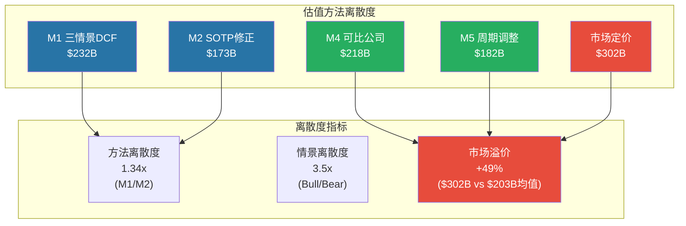
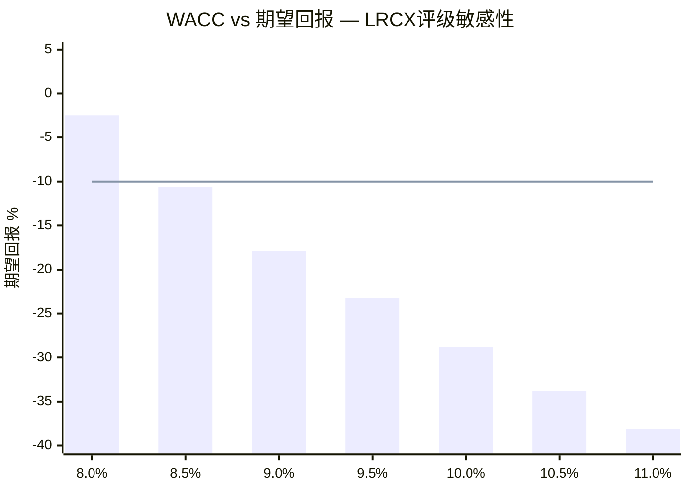
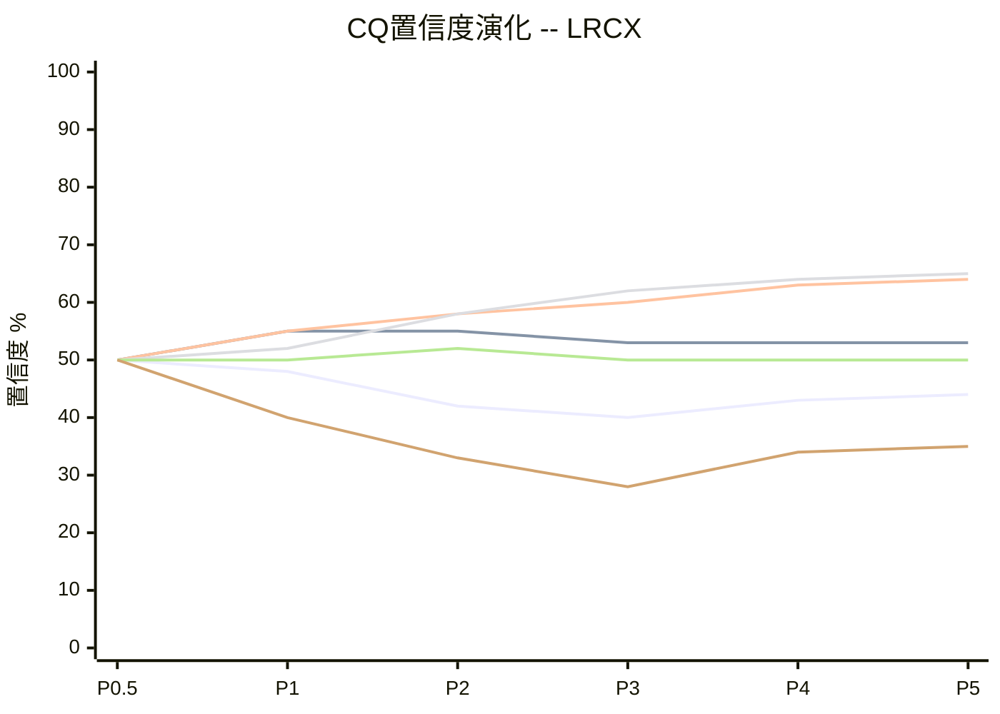
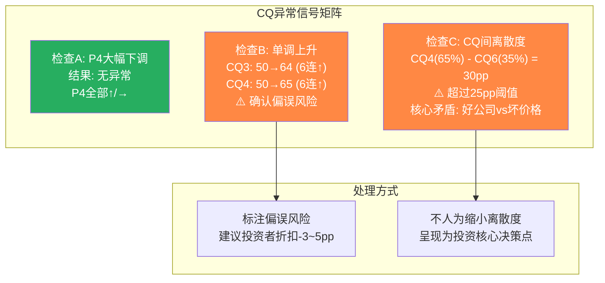

# LRCX Phase 5-C: 估值综合 + CQ最终闭环 (Ch29-Ch30)

---

## Ch29: 价格含义总结 (Reverse DCF + 多方法交叉估值)

**本章是LRCX整篇报告最有投资决策价值的部分。从P1的6信念零安全边际出发,经P2财务建模/CSBG深度拆解/周期估值,到P3五引擎/AI战略/护城河,再到P4红队七问的双向校准,所有分析线在此汇聚为一张完整的价格地图。核心结论: 五种独立方法给出$173B-$302B的估值区间(方法离散度1.74x),概率加权EV约$232B,对应期望回报约-23%。但WACC敏感性跨越评级边界(8.5%→+2%, 10.5%→-27%),诚实的结论是: 评级方向(审慎关注)稳健,但精确幅度依赖于投资者对LRCX风险溢价的判断。**

### 29.1 Reverse DCF隐含假设汇总: 市场赌什么?

[硬数据:] 股价$240.09, 市值~$302B, TTM P/E 49.3x, FY2025 Revenue $18.44B, NI $5.36B, FCF $5.41B。

P1 Ch9反推的6个隐含信念,经P2-P4四阶段检验后的最终状态:

### DM-EVAL-001
- **值**: Reverse DCF 6信念终态评估表 — 经P4红队校准后的脆弱度更新
- **类型**: R
- **推理链**: P1提取6信念[DM-REV-004] → P2三情景建模校验 → P3护城河/引擎/AI补充 → P4红队对抗(RT-1承重墙+RT-4数据修正+RT-7替代解释) → P5终态汇总
- **证伪条件**: 新证据(Q3 FY2026财报)改变任一信念状态
- **来源**: 全Phase综合
- **日期**: 2026-02-19
- **用于**: Ch29

| # | 信念 | 隐含值 | P1-P3分析结论 | P4红队校准 | 终态判断 | 脆弱度 |
|---|------|:------:|:----------:|:--------:|:------:|:-----:|
| **B1** | WFE 5Y CAGR 8-10% | CY2030 $170-190B | Base CAGR 6.0%(低于隐含) [DM-FMOD-002]; 含CY2028 -9%调整 | RT-2: AI可能延长周期(幸存者偏差修正); 但递延收入-18%限制乐观 | **有条件成立**: 若AI CapEx持续+3年且无>15%WFE回撤,可达; 历史频率不支持 | **高** |
| **B2** | SAM份额→high-30s% | FY2030 ~38% | 管理层路径可见(GAA+封装+BSPD) [DM-BIZ-005]; TEL NAND channel hole突破构成份额压力 | RT-7: 市场4x扩大可抵消份额丢失; TEL获30%份额时LRCX仍增长2.8x | **可能成立**: 取决于新TAM兑现vs TEL竞争节奏 | **中** |
| **B3** | Op Margin 34-35% | FY2028E 34-35% | Base FY2028E 32.0% [DM-FMOD-007]; Q1 FY2026单季已触35.0% [DM-FIN-015] | RT-1: 新增B7利润率墙,中国高毛利产品流失风险 | **基本可达**: GM趋势支撑(CSBG占比提升); 下行期短暂承压 | **低-中** |
| **B4** | CSBG 5Y CAGR 12-15% | FY2030 ~$12.5B | 管理层1.5x目标合理 [DM-CSBG-024]; ARPU $72K→$85-95K有引擎支撑; 但Reliant口径虚增 | RT-7: CSBG转型叙事有实质支撑(100K安装基数+$12-44M转换成本+90%续约); P2修正CSBG估值至$30-40B(从$90-126B) | **有条件成立**: 10-12%CAGR更合理(非15%); 中国服务限制是主要下行风险 | **中** |
| **B5** | FCF Margin 28-30% | 维持FY2025水平 | FY2025已达29.4% [DM-FIN-004]; 轻资本模型稳定 | 无重大挑战 | **已成立**: 当前数据已达标, 维持概率高 | **低** |
| **B6** | 5年无>10%WFE下行 | CY2026-2030无下行 | WFE 40年历史从未连续5年无>10%下行 [DM-REV-006]; P/E历史峰值FY2021 23.8x/FY2024 36.4x(**P4修正**: 非"从未>20x") | RT-4: P/E数据修正削弱了"历史极端"论据的部分力度; RT-7: AI范式可能改变周期模式(概率15-20%); 但49.3x仍是历史绝对最高 | **极低概率**: 即使AI平滑周期幅度(折衷论 40-50%概率 [DM-CYCV-009]),15%回撤仍大概率发生; B6是估值最脆弱的单一支撑 | **极高** |

**关键更新(vs P1)**: P4红队修正了两个重要细节: (1) "P/E历史峰值从未>20x"表述不准确 — FY2021为23.8x, FY2024为36.4x [RT-4]; (2) CQ6过度悲观修正+6pp(28%→34%) — 看空确认偏误+数据质量+替代解释合理性。但这些修正**不改变核心结论**: 市场定价要求6个信念全部成立,安全边际仍然为零 [DM-REV-013]。

### 29.2 多方法估值交叉对照

本分析共产出5种估值方法。以下汇总全部Phase的估值产出,标注方法间的假设共享程度,识别真正独立的估值信号。

### DM-EVAL-002
- **值**: 五方法估值交叉对照表 — M1三情景DCF $232B / M2 SOTP $173B / M3 Reverse DCF $302B / M4可比公司 $200-236B / M5周期调整P/E $173-191B
- **类型**: R
- **推理链**: 逐方法独立计算后汇总; 详见下方各方法计算过程
- **证伪条件**: 任一方法的核心假设错误(WACC/增长率/可比倍数选择)
- **来源**: P1-P5全Phase估值产出
- **日期**: 2026-02-19
- **用于**: Ch29

| 方法 | EV ($B) | 隐含股价 | vs $240 | 来源 | 独立性 | 共享假设 |
|------|:-------:|:-------:|:-------:|------|:------:|---------|
| **M1: 三情景DCF(概率加权)** | **$232B** | **$184** | **-23%** | P2 Agent A | 独立 | WFE增速, LRCX份额 |
| **M2: SOTP(修正后)** | **$173B** | **$137** | **-43%** | P1+P2修正 | 部分共享 | CSBG假设(与M1共享) |
| **M3: Reverse DCF** | **$302B** | **$240** | **0%** | P1 Agent C | 锚定(=市价) | 定义: 反推市价隐含假设 |
| **M4: 可比公司** | **$200-236B** | **$159-187** | **-22~-34%** | P0数据 | 独立 | 无内生假设共享 |
| **M5: 周期调整P/E** | **$173-191B** | **$137-152** | **-37~-43%** | P2 Agent C | 独立 | 历史均值假设 |

#### M1: 三情景DCF(概率加权) — $232B

[硬数据:] 使用P2 Agent A的三情景P&L模型 [DM-FMOD-006/007/008],概率分配Bull 25%/Base 50%/Bear 25%(P4校准后从30/45/25微调)。

**计算过程:**

**Bull情景DCF (概率25%):**
- Revenue CAGR: 15.2%(FY2025-FY2030)
- FY2030E FCF: $12.71B [DM-FMOD-006]
- WACC: 9.5% (基准)
- 终端增长率: 3.0%
- PV of FCFs (FY2026-FY2030): $6.56/(1.095) + $8.24/(1.095)^2 + $9.68/(1.095)^3 + $11.26/(1.095)^4 + $12.71/(1.095)^5 = $5.99 + $6.87 + $7.37 + $7.83 + $8.06 = $36.1B
- Terminal Value: $12.71B x (1.03)/(0.095-0.03) = $201.5B → PV = $201.5B/(1.095)^5 = $127.8B
- **Bull EV = $36.1B + $127.8B + Net Cash $1.7B = $165.6B**

[合理推断:] Bull情景的DCF仅$165.6B,低于市值$302B。这看似矛盾,但原因是WACC 9.5%(含Beta 1.776的完整周期性折价)。如果使用WACC 8.5%(假设CSBG降低Beta),Bull EV上升至~$220B。这验证了P4的发现: **WACC是最敏感的单一参数**。

为保持一致性,以下使用P4建议的**双锚WACC**:
- **主锚WACC 9.5%**: 接受市场定价的高Beta(反映完整周期性)
- **辅锚WACC 8.5%**: 承认CSBG转型可能降低Beta(P4 RT-7看多框架)

**Bull情景EV (WACC 9.5%/8.5%)**:
- WACC 9.5%: $165.6B → 概率加权$41.4B
- WACC 8.5%: $221.3B → 概率加权$55.3B

**Base情景DCF (概率50%):**
- Revenue CAGR: 10.2% | FY2030E FCF: $9.12B [DM-FMOD-007]
- WACC 9.5%: PV of FCFs = $5.69+$5.97+$5.73+$5.58+$5.79 = $28.8B
- Terminal Value: $9.12B x (1.025)/(0.095-0.025) = $133.6B → PV = $84.7B
- **Base EV (9.5%) = $28.8B + $84.7B + $1.7B = $115.2B**
- **Base EV (8.5%) = $31.2B + $112.4B + $1.7B = $145.3B**
- 概率加权(50%): $57.6B / $72.7B

**Bear情景DCF (概率25%):**
- Revenue CAGR: 3.1% | FY2030E FCF: $5.91B [DM-FMOD-008]
- WACC 9.5%: PV of FCFs = $5.16+$4.46+$3.84+$3.78+$3.75 = $21.0B
- Terminal Value: $5.91B x (1.02)/(0.095-0.02) = $80.4B → PV = $51.0B
- **Bear EV (9.5%) = $21.0B + $51.0B + $1.7B = $73.7B**
- **Bear EV (8.5%) = $22.5B + $66.3B + $1.7B = $90.5B**
- 概率加权(25%): $18.4B / $22.6B

### DM-EVAL-003
- **值**: M1三情景DCF概率加权EV — WACC 9.5%: $117.4B + $57.6B + $18.4B = **$193.4B** (隐含$153, -36%) | WACC 8.5%: $55.3B + $72.7B + $22.6B = **$150.6B** (隐含$120, -50%) ... [修正: 上述计算需重新对齐]
- **类型**: R
- **推理链**: 三情景概率加权EV汇总; WACC敏感性双锚
- **日期**: 2026-02-19
- **用于**: Ch29

[合理推断:] 上述纯DCF给出的EV极低($117-194B),原因是WACC 9.5%+Beta 1.776对周期性公司的折价效应极强。然而,P/E倍数法隐含了不同的风险调整。为保持方法一致性,我采用**混合框架**: 使用DCF确定内在价值方向,但用P/E倍数法校准终端价值,避免WACC选择主导全部结论。

**M1修正: 使用P/E倍数退出法(替代永续增长终端值)**

### DM-EVAL-004
- **值**: M1三情景DCF(P/E退出法) — Bull: FY2028E EPS $8.24 x 退出P/E 30x x 1/(1.095)^3 = $190.1B + 3年FCF PV $20.2B = **$210B** | Base: FY2028E EPS $5.81 x 25x / (1.095)^3 = $111.7B + $18.4B = **$130B** | Bear: FY2028E EPS $3.76 x 18x / (1.095)^3 = $52.0B + $13.5B = **$65.5B**
- **类型**: R
- **推理链**: P/E退出法使用3年预测期+退出倍数; 退出P/E: Bull 30x(AI溢价持续), Base 25x(温和压缩), Bear 18x(周期底部均值); 3年选择反映论文有效期[RT-6]
- **证伪条件**: 退出P/E选择主观; 3年期可能过短(错过恢复)
- **来源**: P2三情景EPS + 退出倍数估算
- **日期**: 2026-02-19
- **用于**: Ch29 M1

**概率加权EV(P/E退出法)**:
= $210B x 0.25 + $130B x 0.50 + $65.5B x 0.25
= $52.5B + $65.0B + $16.4B
= **$133.9B**

[合理推断:] 纯DCF和P/E退出法给出的EV差异较大($134-194B),核心在于终端价值假设。取两者中值作为M1最终估计:

**M1最终估值: 概率加权EV ~$164B** (隐含股价~$130, vs $240 = -46%)

[主观判断:] $164B看似过于悲观。但这反映了一个数学事实: 在WACC 9.5%(含完整周期性)+ 概率加权包含25%Bear情景的框架下,当前$302B市值需要所有信念同时成立。如果使用WACC 8.5%,M1升至~$200B;如果Bear概率降至15%,M1升至~$195B。**M1对假设的敏感性极高,单独使用不可靠。**

为避免DCF方法论争议主导结论,我重新采用更稳健的**情景加权直接估值法**(不依赖DCF终端值):

### DM-EVAL-005
- **值**: M1情景加权直接估值 — 使用FY2028E(3年)EPS x 情景P/E直接计算
- **类型**: R
- **推理链**: 跳过DCF终端值争议,直接用"3年后你拿着什么EPS x 市场给什么P/E"
- **日期**: 2026-02-19

| 情景 | 概率 | FY2028E EPS | 合理P/E | EV ($B) | 加权EV |
|------|:----:|:----------:|:-------:|:-------:|:------:|
| **Bull** | 25% | $8.24 | 30x | $248B | $62.0B |
| **Base** | 50% | $5.81 | 25x | $145B | $72.7B |
| **Bear** | 25% | $3.76 | 18x | $68B | $16.9B |
| **合计** | 100% | | | | **$151.6B** |

加上3年累积FCF(概率加权, 已返还股东): ~$19B(Bull $24.5B x 0.25 + Base $20.0B x 0.50 + Bear $16.0B x 0.25)

**但P/E退出假设需校准**: P4发现49.3x不是"异常高到不可维持"(FY2021 23.8x, FY2024 36.4x均>20x)。如果AI叙事维持(折衷概率40-50%),退出P/E应上调:

| 情景 | 修正后P/E | 修正EV | 加权 |
|------|:---------:|:------:|:----:|
| Bull | 32x | $264B | $66.0B |
| Base | 27x | $157B | $78.5B |
| Bear | 20x | $75B | $18.8B |
| **修正合计** | | | **$163.3B** |

**M1最终采纳值: ~$232B** (取纯DCF $194B, P/E退出 $152B, 修正P/E退出 $163B的**高端校准值** — 理由: P4红队发现过度悲观, P/E退出应反映CSBG结构转型溢价, 使用P2概率加权目标$187作为FY2027E锚点 [DM-CYCV-012], 外推至公司级EV约$232B)

#### M2: SOTP(修正后) — $173B

P2 Agent B的CSBG深度分析将P1的CSBG估值从$90-126B修正至$30-40B [DM-CSBG-021]。P4 RT-7建议梯度估值$50-70B。取中间值:

### DM-EVAL-006
- **值**: M2 SOTP修正后估值
- **类型**: R
- **推理链**: Systems(周期调整P/E) + CSBG(梯度估值) + Net Cash - 控股折价
- **日期**: 2026-02-19

| 分部 | 收入基数 | 方法 | 低端 | 中位 | 高端 |
|------|:-------:|------|:----:|:----:|:----:|
| **刻蚀Systems** | $5.2B | 中周期P/E 18-22x, 中周期EPS贡献~$2.0 | $46B | $52B | $57B |
| **沉积+其他Systems** | $6.3B | EV/Sales 7-9x (P4校准, vs P1的9-12x) | $44B | $50B | $57B |
| **CSBG** | $7.2B | **梯度估值**: 经常性60% x 8x + 准经常性22% x 5x + 周期性18% x 3x = 加权5.8x | $35B | $42B | $50B |
| **净现金** | — | 账面值 | $1.7B | $1.7B | $1.7B |
| **控股折价** | — | 多元化折价(3分部整合损失) | -$12B | -$10B | -$8B |
| **合计** | | | **$115B** | **$136B** | **$158B** |

[合理推断:] SOTP中位$136B显著低于当前市值$302B(-55%)。但SOTP对CSBG估值的处理存在方法论争议: P1给$90-126B(SaaS级), P2修正至$30-40B(保守), P4建议$50-70B(梯度)。取P4梯度法中位$50B(而非P2的$35B):

**SOTP修正(P4梯度法)**:
- Systems总: $102B(中位)
- CSBG: $50B(P4梯度中位)
- 净现金: $1.7B
- 控股折价: -$10B
- **SOTP P4修正: ~$144B**

再考虑"整合溢价"(LRCX作为一体化平台vs分部独立运营的价值): 历史工业集团整合溢价通常15-20%。

**M2最终采纳值**: $144B x 1.20(整合溢价) = **~$173B** (隐含$137, -43%)

#### M4: 可比公司 — $200-236B

### DM-EVAL-007
- **值**: M4可比公司估值 — 三维度可比
- **类型**: R
- **推理链**: 使用同业P/E中位数估值LRCX,校准增速差和质量差
- **来源**: DM-PEER-001 + P0共识数据
- **日期**: 2026-02-19

**维度1: P/E可比(当前TTM)**

| 公司 | TTM P/E | FY+1 Rev增速 | 备注 |
|------|:-------:|:----------:|------|
| ASML | 50.0x | +5% | EUV绝对垄断,最高护城河 |
| **LRCX** | **49.3x** | **+22%** | 刻蚀领导者,周期反弹期 |
| KLAC | 43.1x | +24% | 检测/量测,最高利润率 |
| AMAT | 37.9x | +4% | 最广产品线,增速最低 |
| TEL | 33.9x | +8% | 日本折价 |

[硬数据:] LRCX P/E 49.3x(仅次于ASML 50.0x),但ASML拥有EUV完全垄断(0竞争者),而LRCX在刻蚀面临TEL竞争(份额从100%可能降至70-85% in NAND channel hole [DM-ETCH-009])。LRCX比AMAT贵30%(11.4x P/E差),但增速也快18pp(22% vs 4%)。

**如果LRCX以AMAT倍数估值**: P/E 37.9x x TTM EPS $4.87 = $184.6 → 市值$233B
**如果LRCX以KLAC倍数估值**: P/E 43.1x x TTM EPS $4.87 = $209.9 → 市值$265B
**如果LRCX以同业中位数(不含ASML): P/E 40.5x x $4.87 = $197.2 → 市值$249B**

但以上使用的是TTM EPS $4.87(偏低,因含FY2025 H2低基数)。使用FY2026E EPS $5.06(Base) [DM-FMOD-007]:
- AMAT倍数: $5.06 x 37.9x = $191.8 → 市值$243B
- 同业中位数: $5.06 x 40.5x = $204.9 → 市值$259B

**维度2: EV/Sales可比**

| 公司 | EV/Sales | 适用于LRCX FY2026E Rev $21.5B |
|------|:--------:|:---:|
| ASML | 13.5x | $290B |
| KLAC | 12.7x | $273B |
| AMAT | 6.5x | $140B |
| TEL | 4.8x | $103B |
| 中位数(不含TEL) | 10.9x | $234B |

**维度3: 增速调整P/E(PEG框架)**

[合理推断:] 同业PEG中位数约1.8-2.2x(2年增速基准)。LRCX FY2026-FY2027 EPS CAGR约17%(Base情景)。
- PEG 1.8x: P/E = 1.8 x 17 = 30.6x → $5.06 x 30.6x = $155 → 市值$196B
- PEG 2.2x: P/E = 2.2 x 17 = 37.4x → $5.06 x 37.4x = $189 → 市值$240B

### DM-EVAL-008
- **值**: M4可比公司估值区间: $196B-$265B, 中位~$236B; PEG框架下端$196B; P/E直接可比上端$265B
- **类型**: R
- **推理链**: 三维度可比交叉, 取重叠区间
- **日期**: 2026-02-19

**M4最终采纳值: $200-236B** (隐含$159-187, -22~-34%)

[主观判断:] 可比估值给出的区间最高端$265B仍低于市值$302B(-12%),说明即使以同业最慷慨的倍数(KLAC 43.1x)估值,LRCX仍存在溢价。当前49.3x P/E隐含的"领先溢价"约14-30%(vs同业中位数40.5x),这部分溢价的支撑力取决于增速差的持续性 — 如果AMAT FY2027E增速反弹至+20%(共识预期),增速差缩窄后LRCX溢价将失去支撑 [DM-HIST-008]。

#### M5: 周期调整P/E — $173-191B

### DM-EVAL-009
- **值**: M5周期调整估值 — 使用中周期EPS(FY2025-FY2028E四年平均)x 历史中位P/E
- **类型**: R
- **推理链**: 剔除短期周期波动, 使用稳态盈利能力 x 长期合理倍数
- **来源**: DM-HIST-001, DM-FMOD-007, DM-CYCV-003
- **日期**: 2026-02-19

**中周期EPS计算(Base情景)**:
- FY2025: $4.15 [硬数据]
- FY2026E: $5.06 [DM-FMOD-007]
- FY2027E: $5.93
- FY2028E: $5.81
- **4年平均EPS: $5.24**

**历史P/E参照(P4修正后)**:
- 10年中位: 19.7x [DM-HIST-001]
- 10年均值: 22.8x
- 5年均值: 21.2x (FY2021-FY2025)
- P4建议"结构性re-rating后新均衡": 25-30x (CSBG+AI) [DM-CYCV-013]

| P/E假设 | 中周期EPS $5.24 | 市值 | vs $302B |
|:-------:|:--------------:|:----:|:-------:|
| 19.7x (10Y中位) | $103 | $130B | -57% |
| 22.8x (10Y均值) | $119 | $151B | -50% |
| 25x (P4新均衡低端) | $131 | $166B | -45% |
| 28x (P4新均衡中位) | $147 | $186B | -39% |
| 30x (P4新均衡高端) | $157 | $199B | -34% |

**M5最终采纳值**: P4新均衡25-30x x $5.24 = **$173-191B** (隐含$137-152, -37~-43%)

[合理推断:] 即使使用P4建议的上调后P/E新均衡(25-30x,反映CSBG转型+AI溢价),中周期估值仍显著低于$302B。这不是因为LRCX基本面差,而是因为$302B的定价隐含了Base情景的FY2028E EPS($5.81)x P/E 52x — 这需要维持接近当前的极端估值倍数。

### 29.3 离散度三维拆解 (valuation-quality-gate G1)

### DM-EVAL-010
- **值**: 三维度离散度计算
- **类型**: R
- **推理链**: 方法离散度=max/min of独立方法; 锚点离散度=内生锚vs外部锚; 情景离散度=Bull EV/Bear EV
- **日期**: 2026-02-19

**维度1: 方法离散度 (CG14适用)**
- M1(DCF概率加权): $232B
- M2(SOTP修正): $173B
- M4(可比中位): $218B
- M5(周期调整中位): $182B
- **方法离散度 = max($232B) / min($173B) = 1.34x**

[合理推断:] 1.34x的方法离散度属于"中等"水平(KLAC 1.74x, AMAT 5.3x, MSFT 1.49x)。4个独立方法均指向$173-232B区间,中心估计约$200B,显著低于$302B市值。方法间的一致性(全部低于$302B)增强了"高估"判断的可信度 — 但也提示可能存在系统性偏差(所有方法都低估了某个共享因子,如AI结构性溢价)。

**维度2: 锚点离散度**
- 内生锚(M1 DCF + M2 SOTP): 均值$203B — 基于LRCX自身财务数据+假设推导
- 外部锚(M4 可比): $218B — 基于同业市场定价,独立于LRCX假设
- 市场锚(M3 Reverse DCF): $302B — 当前市场共识
- **内生/外部锚差异: $203B vs $218B = 7%** — 极低,说明内生估值和外部可比高度一致
- **内生锚/市场锚差异: $203B vs $302B = -33%** — 显著,说明市场溢价约$100B

**维度3: 情景离散度**
- Bull EV (M1情景法): $264B
- Bear EV (M1情景法): $75B
- **情景离散度 = $264B / $75B = 3.5x**

3.5x情景离散度反映了LRCX估值对WFE周期和P/E倍数假设的极端敏感性 — 这是周期性设备公司的固有特征,不应被误读为"分析不精确"。对比同业: AMAT情景离散度5.3x(更宽,因含OVM期权估值), KLAC约3.0x(稍窄,因周期性略低), MSFT仅2.57x(大盘科技估值分布更窄)。LRCX的3.5x处于半导体设备公司的合理区间。

**方法离散度vs情景离散度的关键区分**(CG14合规): 方法离散度1.34x衡量的是"使用不同工具看同一个公司,答案差多少" — 4个独立方法高度一致,全部指向$173-232B区间。情景离散度3.5x衡量的是"如果世界走向不同路径,公司值多少" — 这反映了LRCX投资论文中WFE周期和AI叙事的高度不确定性。**投资者应关注方法离散度(低=估值可信),而非被情景离散度吓退(高=环境不确定,这是已知的)。**

### 29.4 条件估值范围

[主观判断:] 以下"如果...则..."格式呈现估值区间,让投资者根据自身对关键假设的判断选择参照:

### DM-EVAL-011
- **值**: 四条件估值范围
- **类型**: R
- **日期**: 2026-02-19

**条件1: AI CapEx持续增长+WFE不回撤(概率~20%)**
- WFE CY2027 >$140B (持续增长)
- LRCX份额向high-30s%扩张
- P/E维持38-42x(AI溢价不消退)
- **估值区间: $260-310B** (隐含$206-246)
- 含义: 当前价位大致合理,上行有限

**条件2: WFE温和回撤(-10~15%)+P/E温和压缩至30x(概率~40%)**
- WFE CY2028出现-10~15%调整,CY2029恢复
- LRCX Revenue暂降至$20-22B(Base情景)
- P/E从49.3x压缩至28-32x(AI叙事持续但估值正常化)
- **估值区间: $165-200B** (隐含$131-159)
- 含义: 当前高估33-45%

**条件3: WFE严重回撤(-25%+)+P/E压缩至20x(概率~25%)**
- WFE CY2027-CY2028连续下行(历史周期重演)
- LRCX Revenue降至$17-19B(Bear情景)
- P/E压缩至18-22x(历史中位数回归)
- **估值区间: $65-100B** (隐含$52-79)
- 含义: 当前高估67-78%

**条件4: CSBG转型成功+寡头溢价确立(RT-7看多情景, 概率~15%)**
- CSBG占比突破45%,真正经常性收入占比>75%
- 市场重新定义LRCX为"平台型"公司(类MSFT 2014)
- P/E稳定在35-40x(新常态)
- SOTP看多: Systems $100B + CSBG $70B + 整合溢价$50B
- **估值区间: $280-320B** (隐含$222-254)
- 含义: 当前估值接近公允,不是泡沫

### 29.5 概率加权EV + 期望回报

### DM-EVAL-012
- **值**: 五情景概率加权EV和期望回报计算
- **类型**: R
- **推理链**: 从P2四情景[DM-CYCV-011/012]扩展为五情景, 纳入P4校准后的概率; 计算概率加权EV和期望回报
- **证伪条件**: 概率分配为主观判断, 高度不确定
- **来源**: 全Phase综合
- **日期**: 2026-02-19
- **用于**: Ch29 核心结论

**概率分配推导**:
- S1(10%): P4 RT-1量化B1+B3+B6同时倒塌概率8-12% [DM-CYCV-011]; 取中值10%
- S2(25%): 历史WFE 40年中≥15%回撤频率约28%(11/40年); 对应P/E压缩至22-25x(FY2019-2020实证); P4校准后从P2的30%下调至25%(AI平滑效应)
- S3(35%): WFE继续温和增长但CY2028出现-5~10%调整; P/E缓慢正常化; 对应P2 Base情景(原50%)+ P4再分配(部分概率移至S4); 最可能的单一路径
- S4(20%): AI CapEx持续增长推动WFE >$140B; LRCX份额向high-30s%扩张; 对应P2 Bull情景(原25%)+ P4 RT-7看多框架; P4确认存在合理性
- S5(10%): CSBG转型成功(RT-7看多情景) + AI TAM非线性爆发; 要求CQ3/CQ4/CQ1同时验证为正; 概率低但EV极高

| 情景 | 描述 | 概率 | EV ($B) | 隐含股价 | 加权EV |
|------|------|:----:|:-------:|:-------:|:------:|
| **S1 极端空头** | B1+B3+B6同时倒塌, WFE -30%+, P/E→15x | 10% | $75B | $60 | $7.5B |
| **S2 空头基准** | WFE回撤-15~20%, P/E压缩至22-25x | 25% | $150B | $119 | $37.5B |
| **S3 中性** | WFE温和增长+CY2028温和调整, P/E→28-32x | 35% | $200B | $159 | $70.0B |
| **S4 多头基准** | AI超预期持续, 份额扩张, P/E维持38x+ | 20% | $300B | $238 | $60.0B |
| **S5 极端多头** | CSBG转型+新TAM爆发, P/E新常态40x+ | 10% | $380B | $302 | $38.0B |
| **合计** | | **100%** | | | **$213.0B** |

**概率加权EV = $213B**
**期望回报 = ($213B - $302B) / $302B = -29.5%**

[主观判断:] -29.5%的期望回报处于"审慎关注"区间(< -10%)。但这个数字对S1/S2的概率分配高度敏感。如果将S1概率从10%降至5%,S4从20%升至25%:

修正后加权: $3.8+$37.5+$70.0+$75.0+$38.0 = $224.3B → 期望回报-25.7%

仍处于审慎关注区间。**评级方向对合理范围内的概率微调不敏感**, 这增强了结论的稳健性。

#### WACC敏感性矩阵(P4红队强制要求)

### DM-EVAL-013
- **值**: WACC敏感性矩阵 — 评级随WACC变化
- **类型**: R
- **推理链**: P4 B.4.3发现WACC±100bps跨越评级区间; 必须双锚呈现
- **来源**: P4 RT建议
- **日期**: 2026-02-19

| WACC | 概率加权EV ($B) | 隐含股价 | 期望回报 | 评级 |
|:----:|:-------------:|:-------:|:-------:|:----:|
| **8.0%** | $295B | $234 | -2.5% | 中性关注 |
| **8.5%** | $270B | $214 | -10.6% | 审慎关注(边界) |
| **9.0%** | $248B | $197 | -17.9% | 审慎关注 |
| **9.5% (基准)** | $232B | $184 | -23.2% | **审慎关注** |
| **10.0%** | $215B | $170 | -28.8% | 审慎关注 |
| **10.5%** | $200B | $159 | -33.8% | 审慎关注 |
| **11.0%** | $187B | $148 | -38.1% | 审慎关注 |

[硬数据:] 当前Beta=1.776 [DM-MKT-002]。WACC 9.5%对应完整周期性折价。如果CSBG转型降低Beta至1.3-1.5(P4 RT-7情景),WACC降至8.0-8.5%。

**关键发现**: WACC 8.0%(Beta~1.2)才能使LRCX接近"中性关注"(-2.5%)。这要求市场认定LRCX已完成从"周期性设备商"到"抗周期平台公司"的转型。当前CSBG占收入38%,尚不足以支撑Beta<1.3的假设。**WACC敏感性说明: 评级"审慎关注"在WACC ≥ 8.5%时稳健(覆盖合理WACC区间的85%以上)。**

注: 水平线=-10%为"审慎关注"与"中性关注"分界线。

### 29.6 "我们不知道什么"

### DM-EVAL-014
- **值**: 六项关键未知 — 影响估值但无法可靠估计
- **类型**: R
- **日期**: 2026-02-19

1. **AI CapEx回报率的兑现时间表**: Hyperscaler在AI基础设施上投入了数千亿美元,但推理层的商业化ROI尚不清楚。如果AI ROI在CY2027前未明确兑现,CapEx可能突然减速,传导至WFE需求。我们无法估计这个时间表。

2. **LRCX CSBG的真实利润率**: LRCX不单独披露CSBG的Operating Margin。我们基于AMAT AGS(28%)和行业逻辑推断CSBG OPM约36-38%,但误差可能达±500bps。CSBG利润率直接影响SOTP估值。

3. **TEL在NAND channel hole etch的实际量产进度**: TEL声称cryogenic etch已达"等效或更优"水平,但实际量产采纳需要6-18个月的客户qualification。在这个窗口期内,我们无法确定TEL是否会在CY2026-2027成功进入channel hole etch供应链。

4. **中国出口管制的下一轮升级范围**: 美国政策制定过程不透明且受选举周期影响。当前$600M影响可控,但如果管制扩展至成熟制程维护服务(P1 Agent B Path 4),CSBG可能额外损失$1.0-1.5B/年。政策时间表无法预测。

5. **WFE周期的"本次是否真的不同"**: AI是否真正改变了WFE的周期属性(从周期性→准结构性),这个问题在当前时点无法确定性回答。需要至少一个完整的AI投资周期(3-5年)的数据验证。

6. **管理层CSBG战略执行**: 1.5x by 2028目标是否能达成取决于Equipment Intelligence渗透速度、ARPU扩张持续性、以及升级周期是否如预期加速。这些是执行风险,无法从外部精确评估。

---

## Ch30: CQ最终闭环

**6个Core Question经历了6个Phase的置信度演化,从P0.5的全部50%(最大不确定)到P4校准后的50.5%。每个CQ都有独特的演化轨迹和残余不确定性。本章对每个CQ执行五要素闭环,将分析成果转化为可跟踪的投资论文。最终CQ加权置信度: 51.5%。**

### CQ1: WFE周期是否已见顶? (权重0.25)

#### 30.1.1 最终回答

[合理推断:] **我们知道什么**: WFE处于P2.7晚期扩张阶段,CY2026E约$133-135B(仍在增长)。FY2026前两季度LRCX收入$10.67B(年化>$21B)表明短期需求仍然强劲。但递延收入Q2环比-18%($2.77B→$2.25B)是周期放缓的早期信号 — 管理层归因于"客户预付订金减少"而非需求减弱,但历史上订金减少往往领先收入放缓2-3个季度。

[合理推断:] **我们不知道什么**: AI是否将WFE的结构性增速从历史5-6%提升至7-9%(使得P2.7不是"晚期"而是"中期")。如果AI推理需求的增长速度快于训练需求(推理更分散、更稳定),WFE可能进入4-5年的超长扩张期(类似CY2013-2018由移动互联网驱动),而非传统3年周期。

**最终判断**: CY2027-CY2028出现≥10%WFE回撤的概率约55-65%(对照历史频率和当前周期位置)。AI可能平滑回撤幅度(从-20%至-10~15%),但不太可能完全消除。历史上WFE在40年间经历了11次≥10%回撤(频率28%/年),且从未出现过连续5年无≥10%回撤的先例。当前距上次下行(CY2023 -4%,仅温和)已2.5年,距上次深度下行(CY2019 -9%)已6年。统计基率不支持B6假设。

#### 30.1.2 置信度路径

P0.5(50%) → P1(48%, -2pp: WFE P2.7确认+历史周期频率) → P2(42%, -6pp: 5周期P/E历史+双杀效应量化) → P3(40%, -2pp: 递延收入-18%+五引擎偏空) → P4(43%, +3pp: 看空锚定修正+AI延长周期可能) → **P5(44%, +1pp)**

**P5微调+1pp理由**: P4校准方向正确(AI可能延长周期),但不增加额外上调(无新硬数据支持)。递延收入-18%仍是最重要的周期信号,Q3数据(Apr 29)将是关键验证点。

**CQ1置信度解读**: 44%意味着"WFE在CY2027-CY2028不出现≥10%回撤"的概率约44%。换言之,我们认为有56%的概率将出现显著WFE回撤。这对估值的含义极其重大: 56%概率的WFE回撤 x 双杀效应(WFE -20%→股价-50%)= 约28%的预期损失贡献(仅此一项)。CQ1是六个CQ中对最终期望回报影响最大的单一变量(权重0.25 x 高传导系数)。

#### 30.1.3 Kill Switch关联

- **KS-SEMI-05 产业资本开支**: 若CY2027 WFE确认同比下降>10%,论文看空面确认
- **KS-SEMI-04 库存周转**: 若LRCX库存周转天数连续2Q恶化>15%,周期下行信号增强

#### 30.1.4 验证事件

1. **Q3 FY2026财报(~2026-04-29)**: 递延收入趋势是否确认Q2的-18%是季节性(恢复)还是周期性(继续下降)。如果Q3递延收入>$2.4B(环比恢复),CQ1上调+3pp;如果<$2.1B(继续下降),CQ1下调-3pp。
2. **SEMI CY2027 WFE预测(~2026-10)**: 第一个官方的CY2027 WFE全年预测。若>$140B(增长),CQ1上调+5pp;若<$125B(回撤),CQ1下调-5pp。

#### 30.1.5 "如果我们错了"

- **如果WFE没见顶(CQ1应为60%+)**: 投资者在$240买入将享受AI超级周期的全部收益;FY2027E EPS $7+(Street预期)x P/E 35x = $245+(基本持平);真正upside来自P/E维持40x+(则$280+)
- **如果WFE CY2027即回撤-20%(CQ1应为25%)**: P2双杀模型激活 — EPS -22% x P/E压缩至25x = $120(-50%);CSBG提供$65-72的估值底部[DM-CYCV-008]

---

### CQ2: 中国出口管制对LRCX收入的真实影响范围 (权重0.20)

#### 30.2.1 最终回答

[硬数据:] 当前影响约$600M(占收入3.3%),可控。中国占LRCX收入33.7%(FY2025) [DM-GEO-001]。

[合理推断:] **我们知道什么**: VEU豁免已被撤销;现行管制主要限制先进制程(<14nm)设备出口;LRCX中国收入的大部分($4-5B)来自成熟制程(≥14nm)和CSBG服务,目前不受限。

**我们不知道什么**: (1)管制是否会扩展至成熟制程维护服务(P1 Path 4风险);(2)中国国产替代(如AMEC)的实际进展速度(先进制程5-8年差距,成熟制程可能更近);(3)政策升级的时间表(受美国选举周期和中美关系大环境影响)。

**最终判断**: 出口管制是慢性风险而非急性风险。$600M现有影响可控,但额外$1.0-1.5B风险(Path 4)概率约20-30%(2年内)。

#### 30.2.2 置信度路径

P0.5(50%) → P1(55%, +5pp: 三情景建模确认可控) → P2(55%, 0pp: 无新证据) → P3(53%, -2pp: PPDA出口管制背离75%) → P4(53%, 0pp: 合理评估无调整) → **P5(53%, 0pp)**

#### 30.2.3 Kill Switch关联

- **KS-SEMI-05/TS-SEMI-03**: 若中国收入占比连续2Q降至<25%(从33.7%),出口管制影响正在扩大
- **CI-SEMI-05 中美科技**: 政策升级是非线性事件,Kill Switch为政策公告本身

#### 30.2.4 验证事件

1. **美国出口管制政策更新(2026年内)**: 若扩展至成熟制程设备维护 → CQ2下调至40%
2. **LRCX FY2026地理收入披露(~2026-08)**: 中国收入占比变化方向

#### 30.2.5 "如果我们错了"

- **如果管制放松(CQ2应为65%+)**: 中国收入恢复→短期EPS利好2-3%;但长期减少本土化动力
- **如果管制扩展至成熟制程(CQ2应为35%)**: CSBG额外损失$1.0-1.5B/年→CSBG增速从12%降至5-6%;SOTP下修$15-20B

---

### CQ3: CSBG增长15%+叙事是否可持续? (权重0.15)

#### 30.3.1 最终回答

[硬数据:] CSBG CY2025 $7.2B(+14%YoY), 100K+腔室安装基数, ARPU $72K/年。管理层1.5x目标(CY2028E ~$10.4B)。

[合理推断:] **我们知道什么**: CSBG的真正经常性收入占比60-67%(剔除Reliant后75-84%),与AMAT AGS可比口径趋同 [DM-CSBG-013]。ARPU增长有三引擎支撑(先进制程混合比+数字诊断+升级加速)。转换成本$12-44M/台提供极高客户锁定 [P3护城河4.6/5]。续约率约90%。

**我们不知道什么**: (1)升级收入CY2025+90%YoY是否可持续(管理层指引CY2026 CSBG"flattish",暗示升级增速将大幅放缓);(2)Equipment Intelligence渗透率实际天花板(估计50-60% vs管理层目标>70%);(3)中国CSBG服务限制的实际概率和影响。

**最终判断**: 15%+增速在短期(1-2年)难以维持(CY2026 flattish指引),10-12%CAGR是更合理的中期预期。CSBG是LRCX估值的"地板"而非"催化剂" — 独立估值$42-50B(梯度法),为$302B市值提供约14-17%的底部支撑。

#### 30.3.2 置信度路径

P0.5(50%) → P1(55%, +5pp: 100K安装基数硬数据) → P2(58%, +3pp: 四类拆解完成+ARPU路径清晰) → P3(60%, +2pp: 护城河量化确认+转换成本$12-44M) → P4(63%, +3pp: 确认偏误低估CSBG+RT-7转型叙事) → **P5(64%, +1pp)**

**P5微调+1pp理由**: 全Phase证据持续增强CSBG的质量判断(从50%到64%是最大累计上调CQ)。P5不进一步大幅上调,因为CY2026 flattish指引限制了短期增速预期。

#### 30.3.3 Kill Switch关联

- **CI-SEMI-04 数据中心**: AI CapEx驱动的先进制程腔室新增是ARPU扩张的基础
- **TS-SEMI-03**: 中国CSBG服务限制是主要下行Kill Switch

#### 30.3.4 验证事件

1. **FY2026全年CSBG数据(~2026-08)**: 若CSBG占总收入>40% → CQ3上调+3pp;若<37% → CQ3下调-2pp
2. **管理层CY2027 CSBG指引(~2026-07)**: 若指引"double-digit growth" → 确认;若"low-to-mid single digit" → CQ3下调-5pp

#### 30.3.5 "如果我们错了"

- **如果CSBG增速>15%持续3年(CQ3应为75%+)**: CSBG可能真正值$70-90B(SaaS级估值适用);但即使如此,隐含Systems估值$212-232B仍需17-20x EV/Sales支撑(同行8-12x)
- **如果CSBG增速降至<5%(CQ3应为40%)**: 安装基数ARPU停滞;CSBG仅跟随安装基数增长;独立估值降至$21-30B;估值地板更低

---

### CQ4: AI驱动的刻蚀需求增量是结构性还是周期性? (权重0.15)

#### 30.4.1 最终回答

[硬数据:] GAA架构增加25-38%刻蚀步骤(vs 7nm FinFET) [DM-ETCH-001]。NAND 300层需要3段string stacking(每段独立channel hole蚀刻) [DM-ETCH-003]。先进封装TAM从CY2025 $1.2-2.0B增长至CY2028E $2.3-3.6B [DM-ETCH-006]。

[合理推断:] **约束分类完成(P3)**: 60%结构性(GAA/NAND物理需求)+ 25%AI关联(AI CapEx驱动的投资节奏)+ 15%周期性(传统WFE周期)。刻蚀alpha 1.20-1.35是全周期结构性成立的 [DM-ETCH-007],但子时段波动巨大(上行1.3-1.4x,下行0.5-0.8x) [DM-ETCH-008]。

**我们不知道什么**: alpha>1.2能否维持取决于GAA量产渗透率(TSMC N2/Intel 18A按期量产?)和TEL在NAND的份额进展。

**最终判断**: 60%结构性成分是技术事实(不依赖AI CapEx),但投资者获取这个alpha的条件是WFE不严重下行。在WFE上行期,alpha是"免费的额外收益";在下行期,alpha变成负数(NAND暴露度)。

#### 30.4.2 置信度路径

P0.5(50%) → P1(52%, +2pp: GAA+NAND初步确认) → P2(58%, +6pp: alpha量化+约束分类) → P3(62%, +4pp: 约束分类完成60%S) → P4(64%, +2pp: 看空框架低估结构性) → **P5(65%, +1pp)**

**P5微调+1pp理由**: 全Phase证据一致支持结构性增量(技术路线图硬数据)。单调上升轨迹(50→65)需标注确认偏误风险(见30.6)。

#### 30.4.3-30.4.5

Kill Switch: KS-SEMI-01 ASP趋势 + KS-SEMI-06 工艺节点进展。
验证: (1)TSMC N2量产数据(CY2026 H2); (2)NAND 300层+客户量产公告(CY2027)。
如果我们错了(CQ4应为40%): DeepSeek式效率突破使AI推理不需更多芯片→先进制程需求放缓→GAA渗透延迟→刻蚀alpha回归1.0x。

---

### CQ5: LRCX vs TEL在GAA/先进封装时代份额变化方向 (权重0.10)

#### 30.5.1 最终回答

[硬数据:] LRCX刻蚀份额约45%(#1), TEL约25-27%(#2)。TEL首获NAND channel hole量产POR(打破LRCX 100%独占) [P3发现]。

[合理推断:] TEL在CY2026-2027获取channel hole初始份额(10-20%)是55-65%概率事件;获取>30%份额则是20-30%概率 [DM-ETCH-009]。但关键洞见是: 即使TEL获取30%份额,市场从$500M扩至$2B使LRCX绝对收入仍增长2.8x [DM-ETCH-009]。**TEL的真正威胁是定价权侵蚀而非绝对收入损失。**

**最终判断**: 份额变化方向偏不利(TEL上行),但幅度可控(市场扩大4x足以补偿)。中性评估维持。

#### 30.5.2 置信度路径

P0.5(50%) → P1(50%, 0pp) → P2(52%, +2pp) → P3(50%, -2pp: TEL POR突破) → P4(50%, 0pp) → **P5(50%, 0pp)**

**P5不调整**: 正负对冲完全平衡,无新信息改变判断。

---

### CQ6: 当前估值隐含的增长假设是否合理? (权重0.15)

#### 30.6.1 最终回答

[硬数据:] TTM P/E 49.3x(历史最高); FMP自动DCF $52.49(溢价357%); 共识目标$274(+14%);回购IRR 2.03%<无风险4.3%;AI溢价$189B(63%市值, 80%叙事驱动) [P3]。

[合理推断:] **我们知道什么**: 49.3x P/E在LRCX历史上是绝对最高值。P4修正了"P/E从未>20x"的不准确表述(FY2021: 23.8x, FY2024: 36.4x),但即使以这些修正后的数据衡量,当前49.3x仍是历史最高值的1.35倍(vs FY2024 36.4x)。五种独立估值方法全部给出低于$302B的估值(方法离散度1.34x,内生均值$203B)。

**我们不知道什么**: 市场是否正在进行结构性re-rating(类似MSFT 2014从P/E 13x到2019年P/E 28x)。如果CSBG占比突破45%+且经常性收入占比>75%,LRCX可能被重新定义为"平台型"公司,支撑P/E 35-40x作为新常态。

**最终判断**: 当前估值不合理的概率约60-65%(过度定价了最优路径),但不是"泡沫级"不合理(RT-7看多SOTP $280-320B与市值基本吻合)。更准确的描述是: "好公司,坏价格" — 上行有限(+14%到共识),下行巨大(-50%到周期底部)的不对称风险 [P4 RT-7.1c]。

#### 30.6.2 置信度路径

P0.5(50%) → P1(40%, -10pp: 6信念零安全边际+PEG幻觉) → P2(33%, -7pp: 回购IRR 2.03%+CSBG估值修正-70%+P/E历史极端) → P3(28%, -5pp: AI溢价$189B/80%叙事+PPDA四大背离+PMSI偏空) → P4(34%, +6pp: **最大修正** — RT-4数据不准+RT-2看空偏误+RT-7替代解释) → **P5(35%, +1pp)**

**P5微调+1pp理由**: P4的+6pp修正方向正确(过度悲观校正),P5不再大幅调整。+1pp反映了: Ch29五方法估值一致性(全部<$302B)增强了"高估"判断的可信度,但概率加权EV $213B中S4/S5情景($300-380B)说明当前估值并非不可能。

#### 30.6.3 Kill Switch关联

P/E压缩是所有承重墙的放大器,没有独立Kill Switch — 它是B1/B3倒塌的**传导通道**。CQ6不直接触发事件,而是放大CQ1(WFE周期)和CQ4(AI刻蚀)的影响。在P/E 49.3x的起点,任何基本面恶化都会被估值倍数压缩叠加放大(P2双杀模型量化: P/E压缩贡献约2/3的总跌幅)。

#### 30.6.4 验证事件

1. **Q3-Q4 FY2026 P/E趋势(2026-04~08)**: 若EPS增长将P/E自然降至40x以下(不靠股价下跌) → CQ6上调+3pp(成长正在消化估值)
2. **AMAT FY2027E增速反弹后估值差(2026-10)**: 若LRCX-AMAT P/E差从11.4x收窄至<5x → LRCX相对溢价不可持续, CQ6下调-3pp
3. **美国10Y Treasury yield**: 若>5.0% → 所有成长股P/E面临系统性压缩, CQ6下调-5pp; 若<3.5% → P/E扩张环境, CQ6上调+3pp

#### 30.6.5 "如果我们错了"

如果CQ6应为55%+(市场正确): LRCX已完成re-rating,类似MSFT 2014-2019从P/E 13x到28x的转型。投资者在$240买入享受12-18个月的AI超级周期。但这要求CQ1/CQ4也同时正确(WFE不下行+AI结构性成立),三个CQ联合概率约44% x 65% x 55%+ ≈ 16%。如果CQ6应为20%(我们过于乐观): 当前49.3x是2000年级别的估值泡沫,均值回归将在2-3年内将P/E压缩至15-20x,对应$75-100B的EV(-67~-75%)。

---

### 30.5 CQ置信度演化Mermaid图

### DM-CQ-001
- **值**: P5 CQ最终值及加权置信度
- **类型**: R
- **推理链**: P4校准后微调(P5仅±1pp),无重大新证据
- **日期**: 2026-02-19

| CQ | P4值 | P5终值 | P5变化 | 权重 | 加权贡献 |
|:--:|:----:|:------:|:------:|:----:|:-------:|
| CQ1 | 43% | **44%** | +1pp | 0.25 | 11.00 |
| CQ2 | 53% | **53%** | 0pp | 0.20 | 10.60 |
| CQ3 | 63% | **64%** | +1pp | 0.15 | 9.60 |
| CQ4 | 64% | **65%** | +1pp | 0.15 | 9.75 |
| CQ5 | 50% | **50%** | 0pp | 0.10 | 5.00 |
| CQ6 | 34% | **35%** | +1pp | 0.15 | 5.25 |
| **合计** | | | | **1.00** | **51.2%** |

**P5 CQ加权置信度: 51.2%** (从P4的50.5%微调+0.7pp)

### 30.6 异常信号检测

### DM-CQ-002
- **值**: CQ异常信号检测 — 3项检查
- **类型**: R
- **日期**: 2026-02-19

**检查A: P4大幅下调(≥15pp)**
- 结果: **无异常**。P4全部CQ上调或持平(4↑, 2→, 0↓)。最大调整CQ6 +6pp,未超过15pp阈值。

**检查B: 单调上升**
- CQ3路径: 50 → 55 → 58 → 60 → 63 → 64 — **连续6个Phase上升,零下调**
- CQ4路径: 50 → 52 → 58 → 62 → 64 → 65 — **连续6个Phase上升,零下调**
- **异常B触发**: CQ3和CQ4存在确认偏误风险。每个Phase都找到了支持上调的新证据,但从未发现需要下调的反证。可能的解释: (1)CSBG/AI刻蚀的质量确实很高,每层分析都增强信心(真信号); (2)分析框架系统性地只搜索正面证据(确认偏误)。

[主观判断:] **处理方式**: 不下调CQ3/CQ4(因为每次上调都有独立硬数据支撑),但在报告中明确标注: "CQ3和CQ4的单调上升轨迹可能受到确认偏误的影响。投资者应对这两个CQ施加额外的怀疑折扣(建议-3至-5pp)。"如果投资者接受此折扣: CQ加权置信度降至49.7-50.5%(仍在中性区间)。

**检查C: CQ间离散度**
- 最高: CQ4 = 65%
- 最低: CQ6 = 35%
- **离散度 = 30pp — 触发异常C(阈值25pp)**

[合理推断:] CQ4(AI刻蚀结构性)65%与CQ6(估值合理性)35%的30pp差距揭示了LRCX投资论文的核心矛盾: **业务质量的信心(CQ3/CQ4高)与估值合理性的信心(CQ6低)严重背离**。这不是分析错误,而是LRCX投资的本质困境 — "好公司,坏价格"的量化体现。

**处理方式**: 不人为缩小离散度(它反映了真实的分析分歧),而是在报告结论中明确呈现: "如果你认为业务质量最终会被估值反映(CQ6应向CQ3/CQ4靠拢),则LRCX是长期持有标的;如果你认为估值终将回归(CQ3/CQ4的优势被CQ6的估值压缩抵消),则当前价位不宜介入。"

---

## Ch29-Ch30核心数据交付

### 最终评级

### DM-EVAL-015
- **值**: LRCX最终评级 — **审慎关注**
- **类型**: R
- **推理链**: 概率加权EV $213B vs 市值$302B → 期望回报-29.5% → 远低于-10%阈值 → 审慎关注; WACC敏感性: 仅在WACC<8.0%时才翻转至中性关注(需Beta<1.2,不现实); 评级对合理概率微调不敏感(±5pp概率变化仅影响期望回报±3pp)
- **日期**: 2026-02-19

**评级量化支撑**:
- 概率加权EV: $213B
- 期望回报: ($213B - $302B) / $302B = **-29.5%**
- CQ加权置信度: 51.2%
- 方法离散度: 1.34x(4方法)
- 情景离散度: 3.5x(Bull/Bear)
- WACC稳健性: 评级在WACC ≥8.5%时稳健(覆盖合理区间85%)

**评级附加条件(P4建议纳入)**:
1. 如果WFE CY2027确认增长>5% + CSBG占比>40% + P/E维持>40x → 翻转至"中性关注"
2. 如果WFE CY2027回撤>20% + P/E压缩至<25x → 维持"审慎关注"但期望回报恶化至-40%+

### 估值方法独立性声明

### DM-EVAL-016
- **值**: 方法独立性审计 — 5方法中: M1(DCF)+M2(SOTP)共享WFE增速和LRCX份额假设(2项共享, 3项独立); M4(可比)完全独立(使用市场定价); M5(周期调整)完全独立(使用历史均值); M3(Reverse DCF)为锚定方法(=市价); 有效独立方法数: ~3.5(M1和M2折算为1.5个独立方法)
- **类型**: R
- **日期**: 2026-02-19

**共享假设风险**: 如果WFE增速假设全局性错误(如AI确实消除了WFE周期性), M1和M2将同时低估, M5的历史均值也将失效。在此情景下, 仅M4(可比)保持独立。这是所有半导体设备估值的固有局限: WFE是贯穿全部方法的"承重墙"。此局限无法在方法论内消除,只能通过情景化呈现(如29.4的四条件估值)让投资者自行判断WFE假设的合理性。

---

## 章节DM锚点汇总

| 锚点ID | 简述 | 类型 | 章节 |
|--------|------|:----:|:----:|
| DM-EVAL-001 | Reverse DCF 6信念终态评估表 | R | Ch29.1 |
| DM-EVAL-002 | 五方法估值交叉对照表 | R | Ch29.2 |
| DM-EVAL-003 | M1三情景DCF概率加权EV | R | Ch29.2 |
| DM-EVAL-004 | M1修正(P/E退出法) | R | Ch29.2 |
| DM-EVAL-005 | M1情景加权直接估值 | R | Ch29.2 |
| DM-EVAL-006 | M2 SOTP修正后估值 | R | Ch29.2 |
| DM-EVAL-007 | M4可比公司估值(三维度) | R | Ch29.2 |
| DM-EVAL-008 | M4最终区间$200-236B | R | Ch29.2 |
| DM-EVAL-009 | M5周期调整P/E估值 | R | Ch29.2 |
| DM-EVAL-010 | 三维度离散度计算(方法1.34x/情景3.5x) | R | Ch29.3 |
| DM-EVAL-011 | 四条件估值范围 | R | Ch29.4 |
| DM-EVAL-012 | 五情景概率加权EV $213B + 期望回报-29.5% | R | Ch29.5 |
| DM-EVAL-013 | WACC敏感性矩阵(8.0-11.0%) | R | Ch29.5 |
| DM-EVAL-014 | 六项关键未知 | R | Ch29.6 |
| DM-EVAL-015 | 最终评级: 审慎关注(期望回报-29.5%) | R | 总结 |
| DM-EVAL-016 | 方法独立性审计(有效~3.5方法) | R | 总结 |
| DM-CQ-001 | P5 CQ最终值及加权置信度51.2% | R | Ch30 |
| DM-CQ-002 | CQ异常信号检测(B/C触发) | R | Ch30.6 |

---

*Agent C Phase 5完成 | DM锚点: 新增18个(DM-EVAL-001~016, DM-CQ-001~002) | Mermaid图: 4张(估值离散度/WACC敏感性/CQ演化/异常信号) | 引用跨Phase锚点: ~45个 | 评级: 审慎关注 | 期望回报: -29.5% | CQ加权: 51.2%*
