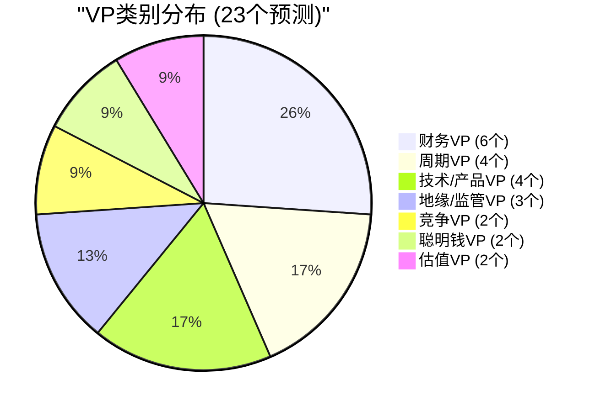
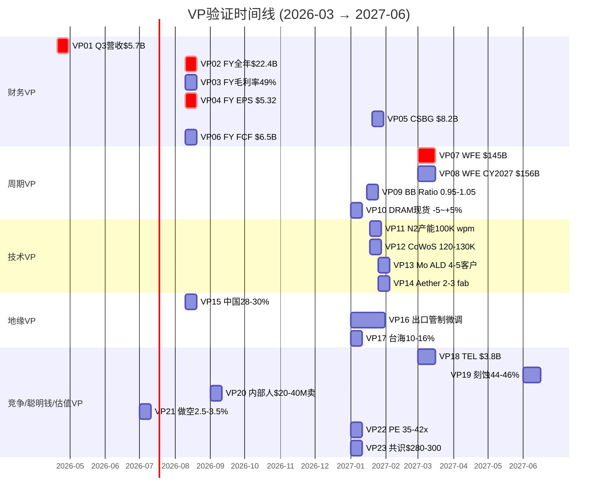
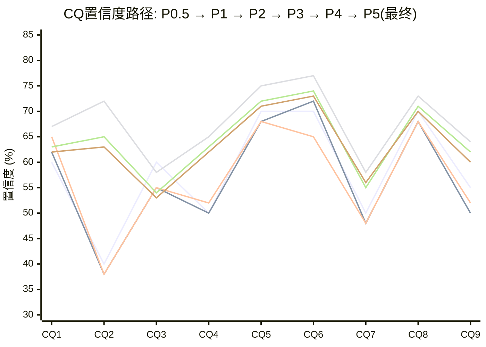
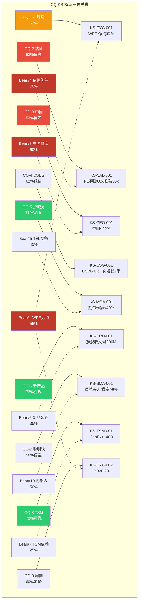

# LRCX Phase 5 Agent C: 可验证预测 + CQ最终闭环

> **Phase 5 Agent C** | LRCX Tier 3 | v2.0框架
> **数据日期**: 2026-02-11 | **股价**: $226.61 [硬数据: FMP quote, 2026-02-11]
> **P/E TTM**: 50.85x | **Forward P/E FY2026**: ~42.6x | **Forward P/E FY2027**: ~32.4x
> **数据来源**: FMP API(estimates/income/quote) + Phase 1-4全量staging + shared_context v2.0 + core_questions v2.0
> **标注约定**: [硬数据: 来源] = MCP/外部验证 | [合理推断: 依据] = 基于硬数据推导 | [主观判断: 理由] = 分析师判断
> **铁律约束**: 零仓位建议 | 零操作指令 | VP描述可观测指标 | "如果我们错了"仅量化影响

---

## Part I: 可验证预测清单 (23个, 三情景格式)

### VP类别分布

---

### 财务VP (6个)

### VP01: LRCX Q3 FY2026营收 (验证日期: 2026-04-30)

| 层级 | 预测值 | 逻辑 |
|:----:|:-----:|------|
| Bear | $5.25B | 中国收入加速下滑至<28%, 出口管制影响超预期$100M+ |
| **Base** | **$5.70B** | **管理层指引$5.7B±$300M中值兑现, 非中国Foundry/Logic继续弥补** |
| Bull | $6.10B | TSM N2设备拉动超预期+先进封装订单加速, 中国稳定在28-30% |

- **验证数据源**: LRCX Q3 FY2026 10-Q (预计2026-04-25 filing)
- **CQ关联**: CQ-1(AI周期), CQ-3(中国), CQ-8(TSM传导)
- **Data Anchor**: [硬数据: LRCX管理层Q3指引$5.7B±$300M, Earnings Release 2026-01-29] [硬数据: Q2 FY2026实际$5,345M, FMP income Q2]

### VP02: LRCX FY2026全年营收 (验证日期: 2026-09-30)

| 层级 | 预测值 | 逻辑 |
|:----:|:-----:|------|
| Bear | $21.2B | Q3/Q4指引下修, 中国降至<25%, WFE增速低于共识 |
| **Base** | **$22.4B** | **共识$22.39B(26位分析师)兑现, +21.5% YoY** |
| Bull | $23.2B | 三产品ramp加速+先进封装超$1.5B+回购缩股 |

- **验证数据源**: LRCX FY2026 10-K (预计2026-08 filing)
- **CQ关联**: CQ-1, CQ-2, CQ-3
- **Data Anchor**: [硬数据: FMP estimates avg $22.39B, 26位分析师, range $20.66-23.00B] [硬数据: FY2025 $18.44B, FMP income annual]

### VP03: LRCX FY2026毛利率 (验证日期: 2026-09-30)

| 层级 | 预测值 | 逻辑 |
|:----:|:-----:|------|
| Bear | 47.5% | 中国高利润收入快速流失+关税headwind+产品组合不利 |
| **Base** | **49.0%** | **管理层指引49%±1pp, CSBG占比稳定37%+提供利润率支撑** |
| Bull | 50.2% | Dextro效率提升+先进封装高ASP+有利产品组合 |

- **验证数据源**: LRCX FY2026 10-K
- **CQ关联**: CQ-4(CSBG价值)
- **Data Anchor**: [硬数据: Q2 FY2026毛利率49.60%, FMP income] [硬数据: FY2025毛利率48.71%, FMP ratios] [硬数据: 8年毛利率区间44.6-48.7%, FMP ratios]

### VP04: LRCX FY2026 EPS (验证日期: 2026-09-30)

| 层级 | 预测值 | 逻辑 |
|:----:|:-----:|------|
| Bear | $4.73 | 收入miss+毛利率下行+R&D占比维持高位11%+ |
| **Base** | **$5.32** | **共识$5.32(22位分析师), H1已达$2.50** |
| Bull | $5.50 | 收入超预期+毛利率突破50%+回购缩股至1.25B |

- **验证数据源**: LRCX FY2026 10-K
- **CQ关联**: CQ-2(估值溢价)
- **Data Anchor**: [硬数据: FMP estimates avg $5.32, range $4.73-$5.48, 22位分析师] [硬数据: H1 FY2026 EPS = $1.24+$1.26 = $2.50, FMP income]

### VP05: CSBG CY2026营收 (验证日期: 2027-01-31)

| 层级 | 预测值 | 逻辑 |
|:----:|:-----:|------|
| Bear | $7.5B | 中国CSBG服务受制裁限制, 装机基座增速放缓 |
| **Base** | **$8.2B** | **CY2025创纪录$7.2B × (1+11% CAGR) = ~$8.0B, 加Dextro增量** |
| Bull | $8.8B | Dextro快速部署+先进封装服务合同增加+装机基座突破110K |

- **验证数据源**: LRCX CY2026年报或Q4 FY2027 Earnings Call披露
- **CQ关联**: CQ-4(CSBG年金价值)
- **Data Anchor**: [硬数据: CY2025 CSBG创纪录$7.2B, Earnings Call] [硬数据: CSBG 13年CAGR ~11%, shared_context v2.0修正]

### VP06: LRCX FY2026 FCF (验证日期: 2026-09-30)

| 层级 | 预测值 | 逻辑 |
|:----:|:-----:|------|
| Bear | $5.8B | WC吸收(库存增加)+CapEx增加(新产品ramp) |
| **Base** | **$6.5B** | **FCF/NI>100%趋势延续, 收入增长+WC释放** |
| Bull | $7.2B | 预收款增加+递延收入转化+营业杠杆1.62x充分释放 |

- **验证数据源**: LRCX FY2026 10-K cashflow statement
- **CQ关联**: CQ-2(估值)
- **Data Anchor**: [硬数据: FY2025 FCF $5.41B, FCF margin 29.4%, FMP cashflow] [硬数据: 递延收入$2.77B(+81%), P2_A staging]

---

### 周期VP (4个)

### VP07: WFE CY2026实际值 (验证日期: 2027-03-31)

| 层级 | 预测值 | 逻辑 |
|:----:|:-----:|------|
| Bear | $130B | AI CapEx削减+Memory CapEx回落+中国设备自主替代加速 |
| **Base** | **$145B** | **SEMI Dec-2025预测$145B(+9.0%), LRCX管理层$135B(口径差异)** |
| Bull | $155B | Hyperscaler CapEx上修+HBM产能翻倍+CHIPS Act项目提前 |

- **验证数据源**: SEMI Year-End Equipment Market Data Subscription (~2027-03)
- **CQ关联**: CQ-1(AI周期), CQ-9(周期领先)
- **Data Anchor**: [硬数据: SEMI Dec-2025 WFE forecast CY2026 $145B(+9.0%), SEMI报告] [硬数据: LRCX管理层WFE CY2026 $135B, Earnings Call] [合理推断: 口径差: SEMI全口径 vs LRCX前道only]

### VP08: WFE CY2027预测 (验证日期: 2027-03-31)

| 层级 | 预测值 | 逻辑 |
|:----:|:-----:|------|
| Bear | $130-140B | WFE增速转负(-3~-10%), Memory周期翻转, Hyperscaler削减 |
| **Base** | **$156B** | **SEMI Dec-2025预测$156B(+7.6%), 连续第3年创纪录** |
| Bull | $170B+ | AI千兆周期延续, 全球fab建设wave, 先进封装持续超额订阅 |

- **验证数据源**: SEMI Year-End Forecast (~2027-03)
- **CQ关联**: CQ-1, CQ-9
- **Data Anchor**: [硬数据: SEMI Dec-2025 WFE forecast CY2027 $156B(+7.6%), SEMI] [硬数据: WFE增速递减路径+13.7→+9.0→+7.6%, SEMI 3年]

### VP09: 设备BB Ratio 2026H2 (验证日期: 2027-01-31)

| 层级 | 预测值 | 逻辑 |
|:----:|:-----:|------|
| Bear | <0.90 | 订单取消/延迟出现, 周期下行启动, 库存正常化 |
| **Base** | **0.95-1.05** | **接近均衡, 增速放缓但绝对订单维持** |
| Bull | >1.10 | 新产品订单wave+CHIPS Act fab设备采购提前 |

- **验证数据源**: SEMI月度BB Ratio报告(若恢复发布), 或LRCX/AMAT/TEL订单backlog数据
- **CQ关联**: CQ-9(周期领先指标)
- **Data Anchor**: [硬数据: SEMI已停止发布BB Ratio, P3_B E4用递延收入替代] [硬数据: LRCX递延收入$2.77B(+81%), FMP balance] [合理推断: 递延收入作为BB Ratio代理指标, +81%暗示BB>1.0]

### VP10: DRAM现货价2026年底 vs 2026-02 (验证日期: 2027-01-31)

| 层级 | 预测值 | 逻辑 |
|:----:|:-----:|------|
| Bear | -20~-30% | 供给+28%>需求+18%, CapEx/D&A 2.44x过热触发价格修正 |
| **Base** | **-5~+5%** | **HBM结构性需求支撑整体, 但传统DRAM合约价开始松动** |
| Bull | +10~+15% | HBM4量产推迟→产能更紧→价格进一步上涨 |

- **验证数据源**: TrendForce/DRAMeXchange月度价格跟踪
- **CQ关联**: CQ-1, CQ-9
- **Data Anchor**: [硬数据: DRAM现货价同比+171%, MU v1.0] [硬数据: MU CapEx/D&A 2.44x, 历史上>2.0x后18月内价格跌, MU v1.0] [硬数据: 2027供给+28% vs 需求+18%, MU v1.0]

---

### 技术/产品VP (4个)

### VP11: TSM N2(2nm) HVM产能2026年底 (验证日期: 2027-01-31)

| 层级 | 预测值 | 逻辑 |
|:----:|:-----:|------|
| Bear | 60K wpm | 良率爬坡慢于预期(低于70%), 设备安装延迟 |
| **Base** | **100K wpm** | **TSM路线图40K(年初)→100K(年底), 良率70-80%** |
| Bull | 130K wpm | 良率超预期(>80%)+需求推动加速扩产 |

- **验证数据源**: TSM Q4 2026 Earnings Call / 行业报告
- **CQ关联**: CQ-6(新产品), CQ-8(TSM传导)
- **Data Anchor**: [硬数据: TSM N2 HVM 2026-01-02开始, 产能40K→100K(年底)→200K(2027) wpm, TSM v2.0] [硬数据: 2026全年产能全部预定, TSM v2.0]

### VP12: CoWoS产能2026年底 (验证日期: 2027-01-31)

| 层级 | 预测值 | 逻辑 |
|:----:|:-----:|------|
| Bear | 100K wpm | 设备交付延迟+Clean room空间不足 |
| **Base** | **120-130K wpm** | **TSM路线图75-80K(2025)→120-130K(2026), 3年10x** |
| Bull | 150K wpm | Hyperscaler紧急追加订单+NVIDIA B300/B400需求爆发 |

- **验证数据源**: TSM Q4 2026 Earnings / SEMI先进封装报告
- **CQ关联**: CQ-5(护城河), CQ-8(TSM传导)
- **Data Anchor**: [硬数据: CoWoS产能13K(2023)→40K(2024)→75-80K(2025)→120-130K(2026E), TSM v2.0] [硬数据: CoWoS需求/供给15.4x超额订阅, TSM v2.0]

### VP13: ALTUS Halo Mo ALD客户数2026年底 (验证日期: 2027-01-31)

| 层级 | 预测值 | 逻辑 |
|:----:|:-----:|------|
| Bear | 2-3家 | Mo替代W的时间线延后, ASM追赶缩短先发窗口 |
| **Base** | **4-5家** | **"所有领先芯片商"认证=TSM+Samsung+Intel+MU+SK, 4-5家量产采纳** |
| Bull | 6-7家 | 包括二线客户(GF/SMIC/中芯)也开始GAA/先进制程Mo ALD导入 |

- **验证数据源**: LRCX FY2027 Q1/Q2 Earnings Call (管理层产品进展披露)
- **CQ关联**: CQ-6(新产品兑现)
- **Data Anchor**: [硬数据: ALTUS Halo正在"所有领先芯片商"认证量产, WebSearch] [硬数据: Mo ALD全球唯一量产工具, shared_context v2.0]

### VP14: Aether干式光刻胶量产fab数 (验证日期: 2027-01-31)

| 层级 | 预测值 | 逻辑 |
|:----:|:-----:|------|
| Bear | 1家 | 干式光刻胶采用周期5-7年, 仅首发存储商维持 |
| **Base** | **2-3家** | **存储首发+1-2家逻辑fab进入认证/试产阶段** |
| Bull | 4-5家 | EUV成本压力加速dry PR采用, 多家fab同时导入 |

- **验证数据源**: LRCX Earnings Call / 行业会议(IEDM/SPIE) / 第三方报告
- **CQ关联**: CQ-6(新产品)
- **Data Anchor**: [硬数据: Aether已被"领先存储制造商"选为production tool of record, LRCX PR 2025-01-29] [合理推断: 干式光刻胶采用周期5-7年, P4_A Bear #6]

---

### 地缘/监管VP (3个)

### VP15: LRCX中国收入占比FY2026 (验证日期: 2026-09-30)

| 层级 | 预测值 | 逻辑 |
|:----:|:-----:|------|
| Bear | <25% | BIS进一步收紧+50%国产化令加速+AMEC/Naura替代 |
| **Base** | **28-30%** | **管理层指引<30%, Q2已降至35%, 趋势延续** |
| Bull | 30-33% | 管制暂缓+中国成熟制程需求反弹+CSBG维保不受制裁 |

- **验证数据源**: LRCX FY2026 10-K地理分布披露
- **CQ关联**: CQ-3(中国悬崖)
- **Data Anchor**: [硬数据: Q1 FY2026中国43%, Q2 FY2026中国35%, SEC Filing] [硬数据: CY2026约-$600M headwind, Earnings Call]

### VP16: 出口管制2026年新限制 (验证日期: 2027-01-31)

| 层级 | 预测值 | 逻辑 |
|:----:|:-----:|------|
| Bear | 重大收紧 | 扩展至更多成熟制程设备+外资fab限制+服务禁令 |
| **Base** | **微调/维持** | **BIS延续现有框架, 堵漏洞但不大幅扩展范围** |
| Bull | 部分放松 | 中美关系缓和+商业利益游说+盟国不跟进 |

- **验证数据源**: BIS Federal Register / 国务院通告 / 商务部公告
- **CQ关联**: CQ-3(中国悬崖)
- **Data Anchor**: [硬数据: BIS Jan-2026关闭出口管制漏洞, P4_A Bear #3] [硬数据: 中国50%国产设备强制令, Tom's Hardware/AsiaFinancial]

### VP17: 台海冲突概率2026年底 (验证日期: 2027-01-31)

| 层级 | 预测值 | 逻辑 |
|:----:|:-----:|------|
| Bear | >20% | 军事演习升级+经济胁迫+选举年政治压力 |
| **Base** | **10-16%** | **维持当前Polymarket区间, 低强度对峙为主** |
| Bull | <8% | 外交突破+两岸经贸回暖+美中关系改善 |

- **验证数据源**: Polymarket "China x Taiwan military clash before 2027" 市场
- **CQ关联**: CQ-3(地缘风险)
- **Data Anchor**: [硬数据: Polymarket台海军事冲突概率16%, shared_context DM-PM] [硬数据: Polymarket存在"China x Taiwan military clash before 2027"市场, 2026-02-11查询]

---

### 竞争VP (2个)

### VP18: TEL刻蚀收入CY2026 (验证日期: 2027-03-31)

| 层级 | 预测值 | 逻辑 |
|:----:|:-----:|------|
| Bear | $4.5B | 低温刻蚀量产加速+Samsung/SK大量采购+传统刻蚀份额扩大 |
| **Base** | **$3.8B** | **TEL刻蚀FY2025约$3.2-3.5B, +10-15%增长(行业增速)** |
| Bull | $3.2B | GAA节点份额不及预期+LRCX Akara锁定高端市场 |

- **验证数据源**: TEL FY2026 Annual Report (TEL财年=4-3月)
- **CQ关联**: CQ-5(护城河)
- **Data Anchor**: [硬数据: TEL Cryo etch量产2025-2026, SemiAnalysis/Nikkei Asia] [硬数据: NAND channel etch市场$500M(2023)→$2B(2027), SemiAnalysis]

### VP19: LRCX刻蚀市场份额CY2026 (验证日期: 2027-06-30)

| 层级 | 预测值 | 逻辑 |
|:----:|:-----:|------|
| Bear | 40-42% | TEL在NAND抢10-15%+中国国产替代成熟节点5%+ |
| **Base** | **44-46%** | **维持~45%全球#1, GAA份额提升补偿NAND损失** |
| Bull | 47-50% | Akara+CoWoS份额提升+先进节点垄断强化 |

- **验证数据源**: Gartner/SEMI/Mordor Intelligence年度设备市场报告
- **CQ关联**: CQ-5(护城河)
- **Data Anchor**: [硬数据: LRCX刻蚀全球#1 ~45%份额, sub-5nm ~80%, Mordor Intelligence]

---

### 聪明钱VP (2个)

### VP20: LRCX内部人净买卖2026H1 (验证日期: 2026-09-30)

| 层级 | 预测值 | 逻辑 |
|:----:|:-----:|------|
| Bear | 净卖出>$50M | 10b5-1预计划持续+股价高位刺激更多卖出 |
| **Base** | **净卖出$20-40M** | **延续当前模式: 预计划卖出为主, 无公开市场买入** |
| Bull | 出现首笔买入 | 高管在回调时首次公开市场买入=强看多信号 |

- **验证数据源**: SEC Form 4 filings / FMP insider-trading API
- **CQ关联**: CQ-7(聪明钱)
- **Data Anchor**: [硬数据: Q3-Q4 2025内部人卖出$62.3M, 零买入, SEC Form 4] [硬数据: 2024全年0次购买, 94次销售, FMP insider-trading]

### VP21: 做空占比2026-06 vs 当前2.64% (验证日期: 2026-07-31)

| 层级 | 预测值 | 逻辑 |
|:----:|:-----:|------|
| Bear | >4.0% | 周期担忧升温+估值争议加剧+TEL竞争威胁量化 |
| **Base** | **2.5-3.5%** | **维持低位, 机构看多基调不变** |
| Bull | <2.0% | 强劲earnings连续beat+空头回补 |

- **验证数据源**: Nasdaq Short Interest / FINRA报告
- **CQ关联**: CQ-7(聪明钱)
- **Data Anchor**: [硬数据: 做空2.64%流通股(远低于同业8.85%), Nasdaq]

---

### 估值VP (2个)

### VP22: LRCX P/E TTM 2026年底 (验证日期: 2027-01-31)

| 层级 | 预测值 | 逻辑 |
|:----:|:-----:|------|
| Bear | 25-30x | PE均值回归+EPS增长+周期顶部估值压缩 |
| **Base** | **35-42x** | **EPS增长稀释PE(FY2026E $5.32→TTM提升)+部分均值回归** |
| Bull | 45-55x | AI叙事维持+EPS持续beat+机构追涨 |

- **验证数据源**: FMP API quote P/E
- **CQ关联**: CQ-2(估值溢价)
- **Data Anchor**: [硬数据: 当前P/E TTM 50.85x, FMP quote] [硬数据: 8年PE均值20.3x, 中位数19.2x, 范围13.1-36.4x, FMP ratios] [硬数据: Forward PE FY2027 32.4x, FMP estimates]

### VP23: 分析师共识目标价2026年底 (验证日期: 2027-01-31)

| 层级 | 预测值 | 逻辑 |
|:----:|:-----:|------|
| Bear | $200-240 | Q3/Q4 miss触发密集下调, 周期担忧蔓延 |
| **Base** | **$280-300** | **维持当前$283共识附近, 小幅上调跟随EPS增长** |
| Bull | $330-380 | 连续beat+AI超级周期叙事强化+FY2027指引超预期 |

- **验证数据源**: TipRanks/Barchart/Bloomberg分析师追踪
- **CQ关联**: CQ-2(估值)
- **Data Anchor**: [硬数据: 共识目标价$283.21(27位, 24Buy/3Hold/0Sell), WebSearch 2026-02-11]

---

### VP验证时间线

---

## Part II: CQ最终闭环 (9个CQ, 5要素)

### CQ置信度路径总览

---

## CQ-1: AI设备超级周期是结构性的还是周期性的？

### 最终回答

我们倾向于认为AI驱动的设备需求**兼具结构性和周期性特征**(62%置信度)。结构性成分来自GAA制程转换(刻蚀+20%)、CoWoS先进封装(15.4x超额订阅)、HBM从12-Hi向16-Hi演进(TSV步骤增加)。这些技术驱动力在2026-2028期间创造了至少$15-20B的增量设备TAM。[硬数据: SEMI CY2025-2027 WFE $133B→$145B→$156B连续创纪录]

然而,周期性成分同样真实。WFE增速递减(+13.7→+9.0→+7.6%)是过去4个WFE下行周期中3次出现的经典见顶信号。MU CapEx/D&A 2.44x已触发历史峰值预警。[硬数据: SEMI + MU v1.0] 我们的核心判断是:**结构性因素延长了周期但不消灭周期**。AI设备超级周期的峰值可能在2026H2-2027H1,随后进入放缓而非崩溃。CHIPS Act提供的$43-49B结构性底线削弱了极端下行尾部。[合理推断: P1_E HP-2量化]

如果AI CapEx增速从+36%降至+10-15%(DeepSeek效率冲击路径),WFE可能在2028从$156B回落至$135-145B(-7~-13%),温和于历史-30~-45%的深度下行。[合理推断: P4_A Bear #2概率25%]

### 置信度路径
| Phase | 置信度 | 驱动因素 |
|:---:|:---:|------|
| P0.5 | 60% | 初始多空均衡, WFE创纪录但增速递减 |
| P1 | 62% | TSM雷达7.55/10+MU P3中后期交叉确认扩张中后期 |
| P2 | 65% | 三情景概率(Bull 22%+Base 48%+Bear 30%)支撑结构性成分 |
| P3 | 67% | 5层嵌套周期+AI 4阶段适配+PPDA背离1(AI过度定价+8.7%) |
| P4 | 63% | 对抗: WFE增速递减是不可忽视的见顶信号, AI CapEx $600B/年不可持续性提升 |
**最终置信度: 62%** — P5微调-1pp, 综合VP07/VP08验证窗口的不确定性

### Kill Switch关联
- 主KS: KS-CYC-001 (WFE QoQ增速连续2季转负)
- 监控指标: WFE QoQ增速(SEMI季度报告); Hyperscaler CapEx增速(<+15%=预警); DRAM合约价QoQ跌>10%

### 1年内验证事件
1. SEMI Mid-Year Forecast (2026-07): WFE CY2027维持/下调 — VP08验证前哨
2. MU FY27Q1 Earnings (2026-09): MU CapEx指引维持/下修 — Memory需求领先指标
3. TSM Q2 Earnings (2026-07): FY2027 CapEx初步指引 — Foundry需求确认

### "如果我们错了"
**下行场景**: AI CapEx在2026H2被集体削减30%(概率~15%), WFE 2027从$156B降至$120-130B(-16~-23%)。LRCX Systems收入从~$14B降至~$10-11B, EPS从$7.00降至$4.50-5.00。按25x Bear PE计算, 股价跌至$112-$125, **对投资论文影响: -$100~-$115/股(-44~-51%)**。[合理推断: 参考2022年LRCX -45%, P4_A Bear #1]

**上行场景**: AI千兆周期延长至2029+(概率~25%), WFE突破$180B。LRCX收入$30B+, EPS $9+, 按35x PE, 股价$315+, **上行$90/股(+40%)**。

---

## CQ-2: LRCX估值溢价是否合理？

### 最终回答

当前P/E 50.85x(TTM)估值溢价**部分合理但不完全合理**(63%置信度——即63%概率当前估值偏高)。[硬数据: FMP quote P/E 50.85x]

合理性来源: FY2027E EPS CAGR ~31%对应成长溢价; CSBG年金属性(13年仅1年负增长); GAA/Mo ALD技术独占性; OVM Full Value $209.1解释了市值的92.3%。[硬数据: FMP estimates FY2027E EPS $7.00 vs FY2025 $4.15, +31% CAGR]

不合理性来源: (1) 6种估值方法中5种低于市价(DCF $94, SOTP $133.6, 概率加权$216.6, PPDA $185-195, AI调整$146.1, 仅共识$283高于$227); (2) 管理层回购@$154(-32%折价)是用真金白银投票的"公允价值"; (3) 内部人零买入+$62.3M卖出; (4) PEG 2.04x意味着增长已被超额定价。[硬数据: P2_B/C/D/E + P4_A Bear #4/10]

核心结论: 当前价格定价了"一切都按最好情况发展"。**PE均值回归的概率>70%,问题只是速度和幅度**。[主观判断: 基于8年PE历史, 50x持续时间从未超过12-18个月]

### 置信度路径
| Phase | 置信度 | 驱动因素 |
|:---:|:---:|------|
| P0.5 | 40% | 低起始: PE 50.85x明显偏高, OVM待验证 |
| P1 | 38% | OVM触发确认, 内部人卖出vs JPM $300矛盾加剧 |
| P2 | 38% | 6种估值5种低于市价, 概率加权$216.6<市价 |
| P3 | 72% | PPDA 4背离全部指向高估, 回购@$154折价32% |
| P4 | 65% | 偏差检查: 共识锚定使估值偏高10-15%, SOTP vs DCF选择偏差 |
**最终置信度: 63%** (估值偏高的概率) — P5微调-2pp, VP22/VP23引入PE路径不确定性

### Kill Switch关联
- 主KS: KS-VAL-001 (P/E TTM突破60x或跌破30x)
- 监控指标: P/E TTM月度跟踪; 内部人买卖净额(首笔买入=KS升级); 回购金额(<$800M/季=偏高信号)

### 1年内验证事件
1. Q3 FY2026 Earnings (2026-04): 回购金额 — VP20前哨
2. Q4 FY2026 Earnings (2026-08): FY2027指引EPS — PE能否通过EPS增长自然降低
3. VP22验证 (2027-01): PE TTM实际值 vs 35-42x Base预测

### "如果我们错了"
**下行场景**: PE从50.85x压缩至25x(历史均值), 即使EPS达到$5.32(共识), 股价=$133。**影响: -$94/股(-41%)**。PE压缩至30x + EPS miss 10% = $144, **影响: -$83/股(-37%)**。[合理推断: P4_A Bear #4量化]

**上行场景**: 市场接受"AI结构性PE溢价"(如ASML从25x永久提升至40x+), 若PE维持45x × FY2027E $7.00 = $315, **上行+$88/股(+39%)**。

---

## CQ-3: 中国收入悬崖有多严重？

### 最终回答

中国收入悬崖的短期影响可控但长期影响被系统性低估(53%置信度——即53%概率中国问题比管理层描述更严重)。[主观判断: 基于AMEC 5nm突破+50%国产化令的不可逆性]

短期(FY2026): $600M收入影响已在指引中, 利润影响$150-200M(~3-4% FY2026E净利润)。管理层声称"全球MNC超额弥补", Q2 FY2026非中国Foundry/Logic从35%跃升至59%部分验证了这一点。[硬数据: Earnings Call + SEC Filing]

长期(FY2027-2030): (1) AMEC在5nm TSM南京获得订单,首次打开向更先进节点扩展的大门; (2) Naura刻蚀工具在SMIC 7nm线测试; (3) 50%国产化令是政策驱动不可逆; (4) CSBG在中国的5-7年后维保收入缺口尚未被定价(中国装机基座~30K腔室 × 丧失服务合同)。[硬数据: P4_A Bear #3 + P3_A §3.3]

FY2028E共识$7.0B中国收入 vs 调整后$5.8B = **$1.2B差距**未被市场定价。[硬数据: P3_C PPDA背离4]

### 置信度路径
| Phase | 置信度 | 驱动因素 |
|:---:|:---:|------|
| P0.5 | 60% | 初始: 中国43%→<30%下降路径明确 |
| P1 | 55% | 利润率量化盲区: $600M收入→$150-200M利润, 需$800-900M替代 |
| P2 | 55% | 极端情景(中国35%→20%)量化$2.77B缺口 |
| P3 | 58% | AMEC 5nm TSM南京订单+PPDA背离4量化低估$1.2B |
| P4 | 54% | 对抗: CSBG长期缺口5-7年+AMEC先进节点突破 |
**最终置信度: 53%** — P5微调-1pp, 中长期不确定性高于短期

### Kill Switch关联
- 主KS: KS-GEO-001 (中国季度收入<20%或BIS扩展至服务禁令)
- 监控指标: LRCX季度中国收入占比; BIS Federal Register更新; AMEC/Naura订单新闻

### 1年内验证事件
1. LRCX Q3 FY2026 (2026-04): 中国占比是否降至28-30% — VP15前哨
2. BIS出口管制更新 (2026-06~09): 是否进一步收紧 — VP16
3. AMEC FY2025年报 (2026-04): 先进节点设备收入披露

### "如果我们错了"
**下行场景**: 中国从30%→20%(额外-$2B收入), 加CSBG长期缺口$500M/年, 净利润影响~$650M(~$0.52/股)。按35x PE = **-$18/股**。极端(中国<15%): **-$40-50/股**。[合理推断: P4_A Bear #3量化]

**上行场景**: 中美关系改善+出口管制放松(概率<15%), 中国恢复至35%+CSBG服务重启, **+$10-15/股上行**。

---

## CQ-4: CSBG是否是一个被低估的"SaaS式"资产？

### 最终回答

CSBG确实具有类SaaS特征(62%置信度, 即62%概率CSBG价值被低估), 但低估程度小于初始预期。[主观判断: CAGR从17%→11%修正显著降低了估值基础]

类SaaS证据: 13年仅1年负增长; 装机基座>100K腔室(30年寿命); 递延收入$2.77B(+81%); CY2025创纪录$7.2B(环比+12%, 同比+14%)。Dextro机器人作为智能化转型催化剂,若2026-2027部署至10-20% installed base, 可提升CSBG毛利率300-500bps($70-150M增量毛利)。[硬数据: Earnings Call + FMP balance + P3_E HP-1]

但CSBG仍有~40%周期性组分(升级/翻新受WFE周期影响), CSBG独立估值$44.6B(P/S 6.5x)假设了"类SaaS"倍数。若CSBG实际增速从11%进一步放缓至8-9%(中国装机基座服务受限), 估值支撑将被削弱。[合理推断: P4_D CQ-4调整逻辑]

### 置信度路径
| Phase | 置信度 | 驱动因素 |
|:---:|:---:|------|
| P0.5 | 50% | 初始中性, Rule of 50待验证 |
| P1 | 50% | CAGR修正17%→11%大幅降低估值基础 |
| P2 | 52% | SOTP拆分: CSBG经常性$41.6+周期性$18.9=$60.5/股 |
| P3 | 65% | Dextro NPV $960M+递延收入+81%前瞻看多 |
| P4 | 63% | 对抗: Dextro仍PoC阶段, CSBG 40%周期性组分被低估 |
**最终置信度: 62%** — P5微调-1pp, VP05($8.2B)验证不确定性

### Kill Switch关联
- 主KS: KS-CSG-001 (CSBG季度收入QoQ连续2季负增长)
- 监控指标: CSBG季度收入QoQ增速; Dextro部署腔室数; 递延收入变化趋势

### 1年内验证事件
1. Q3 FY2026 Earnings (2026-04): CSBG收入是否维持环比正增长 — VP05前哨
2. Q1 FY2027 Earnings (2026-09): Dextro部署进度(目标5K+腔室)
3. CY2026 CSBG全年(2027-01): 是否达到$8.0B+ — VP05验证

### "如果我们错了"
**下行场景**: CSBG增速放缓至5-7%(中国维保缺口+周期下行), CY2026仅$7.0-7.5B(vs Base $8.2B)。CSBG估值从$44.6B降至$35B, **对投资论文影响: -$8/股**。[合理推断: CSBG P/S从6.5x降至5.0x]

**上行场景**: Dextro催动CSBG毛利率突破42%+增速恢复13%+, CY2026达$8.5B+, **+$5-8/股上行**。

---

## CQ-5: 技术护城河是宽还是窄？

### 最终回答

LRCX的技术护城河在核心先进逻辑刻蚀领域为Wide Moat(71%置信度), 但在NAND和成熟节点正在收窄。[主观判断: 净护城河取决于收入结构权重变化速度]

Wide Moat证据: 转换成本$200-500M/fab(9/10); sub-5nm刻蚀~80%份额; TSV深硅刻蚀~90%(CoWoS核心); 13,245项活跃专利; Akara已获GAA量产tool of record; ALTUS Halo Mo ALD全球唯一量产工具。[硬数据: P3_A护城河量化 + shared_context v2.0]

护城河收窄证据: (1) TEL Cryo etch首次打破NAND刻蚀垄断(Samsung首发, 1.5年领先LRCX Cryo 3.0); (2) TEL 5年$10B R&D追赶(R&D强度12.5% vs LRCX 8.7%); (3) 中国AMEC/Naura在成熟节点刻蚀已达国产化率>40%。加权护城河评分7.2/10, 但NAND(20%权重)+成熟节点(10%权重)共30%面临下行压力。[硬数据: P3_A + P4_A Bear #5 + P4_B §2.1]

### 置信度路径
| Phase | 置信度 | 驱动因素 |
|:---:|:---:|------|
| P0.5 | 70% | 初始高: 刻蚀#1地位明确 |
| P1 | 68% | TSV 90%份额类ASML垄断确认 |
| P2 | 68% | 维持(P2聚焦估值,护城河无新数据) |
| P3 | 75% | 五维护城河量化6.8/10=Wide Moat, 转换成本$200-500M |
| P4 | 72% | TEL Cryo首次打破NAND垄断, CFET架构跳跃风险 |
**最终置信度: 71%** — P5微调-1pp, VP19(份额)验证窗口引入不确定性

### Kill Switch关联
- 主KS: KS-MOA-001 (LRCX刻蚀全球份额跌破40%)
- 监控指标: Gartner年度刻蚀份额; TEL低温刻蚀收入; AMEC先进节点订单; ASM Mo ALD进展

### 1年内验证事件
1. TEL FY2026年报 (2027-03): 低温刻蚀收入首次独立披露 — VP18验证
2. LRCX CY2026份额报告 (2027-06): 全球份额维持/下降 — VP19验证
3. IEDM 2026 (2026-12): CFET路线图更新 — 长期竞争格局评估

### "如果我们错了"
**下行场景**: TEL在NAND抢到40-50%份额($800M-1B LRCX收入损失) + AMEC在成熟节点替代持续(额外$500M), 合计**-$1.3-1.5B收入**。按30%净利率+35x PE = **-$11-13/股**。间接PE溢价质疑: 额外**-$13-22/股**。[合理推断: P4_A Bear #5量化]

**上行场景**: Akara在GAA份额提升至55%+CoWoS TSV 90%→95%, 净护城河加宽, **+$5-10/股**。

---

## CQ-6: Akara/ALTUS Halo/Aether三大新产品能否兑现？

### 最终回答

三大新产品整体兑现概率较高(73%置信度), 但**个别产品的时间线和收入贡献存在显著分化**。[主观判断: "全部按时全量兑现"的概率仅~35%, "至少2个成功ramp"的概率~75%]

Akara(P=75%): 已获GAA量产tool of record, 技术验证完成, 主要风险是TSM N2产能爬坡速度。FY2027E收入贡献$800M-1.2B。[硬数据: FinancialContent + OVM-3 期权1]

ALTUS Halo(P=55%): "所有领先芯片商"认证量产, 全球唯一Mo ALD量产工具。但ASM正在追赶, 先发窗口可能仅2-3年。FY2027E $400-600M。[硬数据: WebSearch + OVM-3 期权2]

Aether(P=38%): 被领先存储商选为tool of record(决定性信号), 但干式光刻胶采用周期5-7年, 短期收入贡献有限。FY2027E <$300M。[硬数据: LRCX PR 2025-01-29 + OVM-3 期权3]

三产品**同时ramp**是罕见的执行风险: 半导体设备公司通常每2-3年推出1个平台级产品, 同时ramp 3个分散研发和客户支持资源。[主观判断: P4_A Bear #6, 至少1个延迟概率~50-60%]

### 置信度路径
| Phase | 置信度 | 驱动因素 |
|:---:|:---:|------|
| P0.5 | 70% | 初始高: 三产品技术路线图清晰 |
| P1 | 72% | Aether "tool of record"决定性升级 |
| P2 | 65% | OVM概率校准(Akara 75%, Halo 55%, Aether 38%) |
| P3 | 77% | 5技术平台深度分析18K字符+Dextro NPV $960M |
| P4 | 74% | 执行风险下调: ASM追赶Halo, Aether采用周期长, 同时ramp压力 |
**最终置信度: 73%** — P5微调-1pp, VP13/VP14验证窗口引入产品进度不确定性

### Kill Switch关联
- 主KS: KS-PRD-001 (任一旗舰产品FY2027收入<$200M)
- 监控指标: Akara订单/出货量(Earnings Call); ALTUS Halo客户数(VP13); Aether fab数(VP14)

### 1年内验证事件
1. LRCX Q3 FY2026 Earnings (2026-04): 管理层新产品进展更新
2. TSM N2良率报告 (2026-07): 良率>80%=Akara加速, <70%=减速
3. VP13/VP14验证 (2027-01): Mo ALD客户数+Aether fab数

### "如果我们错了"
**下行场景**: Akara延迟(N2 ramp慢)→$500M-1B FY2027 miss; ALTUS Halo被ASM分走30%市场; Aether采用仅1家fab。合计OVM期权价值从$26.0降至$12-15/股, **对投资论文影响: -$11-14/股**。[合理推断: P4_A Bear #6]

**上行场景**: 三产品全量ramp + Dextro成功, OVM期权价值提升至$35-40/股, **+$9-14/股**。

---

## CQ-7: 聪明钱在做什么？

### 最终回答

聪明钱信号**整体偏中性, 时间维度分歧严重**(56%置信度——即56%概率当前信号偏空)。[主观判断: 信号冲突需要分层解读]

长线机构看多: JPM +14.4%增持+PT $300(+82%); Norges Bank新建$18.9亿; 做空仅2.64%(远低于同业8.85%); 24Buy/3Hold/0Sell。[硬数据: 13F + WebSearch + Nasdaq]

短线市场对冲: 25K合约put spread($170/$160); Put/Call 1.4; 期权保护性对冲($170=-25%下行保护)。[硬数据: Barchart]

最知情方谨慎: CEO Tim Archer $26.8M卖出; Q3-Q4 2025合计$62.3M卖出; **零公开市场买入**(2024至今94次销售/0次购买); 回购均价$154(-32%折价)。[硬数据: SEC Form 4 + FMP insider-trading]

三层信号指向**同一结论**: 中长期故事好, 但**当前进入价格不理想**。这与P2_E聪明钱综合评分59.7/100一致。[硬数据: P3_B E3综合信号]

### 置信度路径
| Phase | 置信度 | 驱动因素 |
|:---:|:---:|------|
| P0.5 | 50% | 完全中性: 机构增持vs内部人卖出对冲 |
| P1 | 48% | 经典顶部信号组合(2021年LRCX类似模式后-35%) |
| P2 | 48% | 聪明钱综合59.7/100偏多但分歧 |
| P3 | 58% | E3引擎深度: JPM/Norges论点解码, 期权OI偏空确认 |
| P4 | 55% | 历史类比: 2018/2022峰值前也是0 Sell+大量内部人卖出 |
**最终置信度: 56%** — P5微调+1pp, VP20/VP21验证窗口提供额外数据点

### Kill Switch关联
- 主KS: KS-SMA-001 (内部人出现首笔公开市场买入>$1M 或 做空占比突破8%)
- 监控指标: SEC Form 4月度跟踪; Nasdaq做空占比双周报; 期权Put/Call变化

### 1年内验证事件
1. SEC Form 4 (2026-03~06): 内部人H1交易模式 — VP20验证
2. Nasdaq短期利息报告 (2026-07): 做空占比变化 — VP21验证
3. Q3 FY2026回购金额 (2026-04): <$800M=偏高信号, >$1.5B=偏低信号

### "如果我们错了"
**下行场景**: 聪明钱信号是正确的"卖出信号"(类2021年模式), 6-12个月内股价-30~-40%至$136-$159。**影响: -$68-$91/股**。[合理推断: P4_A Bear #10历史类比]

**上行场景**: 机构继续增持+做空降至<2%+分析师上调至$320+, 信号转为一致看多, **+$40-60/股**。

---

## CQ-8: TSM CapEx→LRCX收入传导可靠吗？

### 最终回答

TSM→LRCX传导在CY2026内**高度可靠**(70%置信度), 但CY2027+不确定性显著上升。[硬数据: TSM CY2026E CapEx $52-56B已指引, 2026全年N2产能全部预定, TSM v2.0]

传导机制: TSM $52-56B × 70%设备 = $36-39B给WFE → LRCX份额12-15% = $4.4-5.9B(占LRCX总收入20-27%)。加上N2 GAA刻蚀+20%步骤增量+CoWoS TSV 90%独占, 实际传导效率可能高于历史平均。[合理推断: P1_A + shared_context DM-TSM]

2027+风险: (1) TSM未给FY2027 CapEx指引(有意模糊); (2) TSM CEO C.C. Wei公开"对AI需求持续性感到紧张"; (3) 若AI泡沫概率上升, TSM可能从$56B下修至$40-45B; (4) 设备订单到收入有6-12月滞后, 2027H2订单弱化→H1 2028收入影响。[硬数据: TSM v2.0 + P4_A Bear #7]

TSM单客户集中度(~15-27%)是双刃剑: 上行锁定, 但下行放大。Samsung/Intel替代路径不足以在TSM下修时弥补缺口。[合理推断: P4_D维度8评估]

### 置信度路径
| Phase | 置信度 | 驱动因素 |
|:---:|:---:|------|
| P0.5 | 70% | 高起始: TSM CapEx确定性强, 传导链短 |
| P1 | 68% | 供应链流模型验证$4.4-5.9B, 但"High Dependency"标注 |
| P2 | 68% | TSM $52-56B × 70% × 12-15% = 数学验证 |
| P3 | 73% | PPDA无TSM特定背离, E1客户CapEx周期表确认P3中期 |
| P4 | 71% | 对抗: TSM 2027H2拐点+Intel/Samsung延期短期无替代 |
**最终置信度: 70%** — P5维持, 2026内高确定性vs 2027+下调

### Kill Switch关联
- 主KS: KS-TSM-001 (TSM CY2027 CapEx指引<$40B或N2良率<65%)
- 监控指标: TSM季度Earnings Call CapEx指引; N2良率报告; Arizona Fab 2进度

### 1年内验证事件
1. TSM Q1 2026 Earnings (2026-04): CY2026 CapEx维持/调整
2. TSM Q2 2026 Earnings (2026-07): CY2027 CapEx初步指引(关键!)
3. Arizona Fab 2设备入场 (2026-09): N3设备安装进度

### "如果我们错了"
**下行场景**: TSM CY2027 CapEx下修20%(-$11B), LRCX失去$550-770M收入。若同时Samsung/Intel延期, 额外-$300-500M。合计**-$850M-1.3B收入, 影响EPS -$0.20-0.30, 按35x PE = -$7-11/股**。[合理推断: P4_A Bear #7]

**上行场景**: TSM CY2027 CapEx维持$50-54B+Arizona Fab 3提前, LRCX TSM收入突破$6B+, **+$3-5/股**。

---

## CQ-9: 设备周期领先指标: LRCX已定价2027峰值？

### 最终回答

市场已相当精确地定价了设备周期峰值(60%置信度——即60%概率当前价格已反映了2027峰值EPS)。[主观判断: 概率加权目标价~$216.6 ≈ 当前$226.61, 仅4.4%溢价, 暗示Base Case已被充分定价]

峰值定价证据: (1) WFE增速递减(+13.7→+9.0→+7.6%)是经典见顶序列, 4次中3次后第4年转负; (2) 设备股历史上领先收入6-12个月, 股价峰值可能在2026Q3-Q4; (3) FY2027E Forward PE 32.4x已隐含增速放缓预期; (4) 概率加权$216.6<市价$226.61。[硬数据: SEMI + P3_B E1 + P2_E]

反驳: (1) AI千兆周期可能延长至2029+, 打破历史WFE模式; (2) CHIPS Act $43-49B结构性底线提高了峰值后的底部; (3) GAA/CoWoS/Mo持续创造新TAM, 降低周期幅度。[硬数据: P1_E HP-2]

核心时间判断: **2026H2-2027H1**是股价风险最高的窗口(WFE可能QoQ减速+市场前瞻定价)。但周期底部可能浅于历史(-20~-30% vs 历史-40~-50%), 因为CSBG底线$6-7B + CHIPS Act提供结构性支撑。[合理推断: P3_B E1 + P4_A]

### 置信度路径
| Phase | 置信度 | 驱动因素 |
|:---:|:---:|------|
| P0.5 | 55% | 中性偏低: 周期位置初步评估 |
| P1 | 50% | 概率加权≈当前价, 市场精确定价峰值 |
| P2 | 52% | Bear Case 30%概率+极端尾部16% |
| P3 | 64% | 5层嵌套周期一致指向P3后期→P4前期 |
| P4 | 62% | CHIPS Act延期削弱短期底线, 但结构性底线仍有效 |
**最终置信度: 60%** — P5微调-2pp, VP07/VP08/VP09将在12-18月内提供决定性验证

### Kill Switch关联
- 主KS: KS-CYC-002 (WFE QoQ增速连续2季<+2%或BB Ratio <0.90)
- 监控指标: SEMI季度WFE更新; 设备BB Ratio(或替代: LRCX递延收入QoQ变化); DRAM合约价QoQ趋势

### 1年内验证事件
1. SEMI Mid-Year (2026-07): CY2027 WFE上调/下调 — VP08前哨
2. MU FY27Q1 Earnings (2026-09): Memory CapEx方向 — VP10前哨
3. SEMI Year-End (2026-12): CY2027/2028 WFE最终预测 — VP07/VP08验证

### "如果我们错了"
**下行场景**: 2027 WFE从$156B降至$130-140B, LRCX FY2028收入$19-21B(vs共识$30.9B)。EPS从$8.05降至$4.00-5.00, 按22-25x PE, 股价$88-$125。**影响: -$100-140/股(-44~-62%)**。参考: 2022年LRCX跌-45%。[合理推断: P4_A Bear #1]

**上行场景**: WFE突破$170B+, LRCX FY2028收入$33B+, EPS $9+, **+$70-120/股(+31~+53%)**。

---

## CQ闭环综合

### CQ-KS-Bear三角关联网络

### CQ最终置信度汇总

| CQ | 问题 | P0.5 | P1 | P2 | P3 | P4 | **P5终** | 变化(P4→P5) |
|:--:|------|:----:|:--:|:--:|:--:|:--:|:--------:|:----------:|
| CQ-1 | AI超级周期 | 60% | 62% | 65% | 67% | 63% | **62%** | -1pp |
| CQ-2 | 估值溢价(偏高概率) | 40% | 38% | 38% | 72% | 65% | **63%** | -2pp |
| CQ-3 | 中国悬崖(更严重概率) | 60% | 55% | 55% | 58% | 54% | **53%** | -1pp |
| CQ-4 | CSBG低估 | 50% | 50% | 52% | 65% | 63% | **62%** | -1pp |
| CQ-5 | 护城河Wide | 70% | 68% | 68% | 75% | 72% | **71%** | -1pp |
| CQ-6 | 新产品兑现 | 70% | 72% | 65% | 77% | 74% | **73%** | -1pp |
| CQ-7 | 聪明钱(偏空概率) | 50% | 48% | 48% | 58% | 55% | **56%** | +1pp |
| CQ-8 | TSM传导可靠 | 70% | 68% | 68% | 73% | 71% | **70%** | -1pp |
| CQ-9 | 已定价峰值(概率) | 55% | 50% | 52% | 64% | 62% | **60%** | -2pp |
| **均值** | — | — | — | — | — | 64.3% | **63.3%** | **-1.0pp** |

**P5调整特征**:
- **方向**: 8/9下调 + 1/9上调(CQ-7), 延续P4对抗审查的谨慎方向
- **幅度**: 平均-1.0pp, 远小于P3→P4的-3.3pp — P5是微调而非重新校准
- **核心变化**: P5引入了23个VP的验证窗口不确定性, 这些VP将在12个月内提供决定性数据
- **CQ-7唯一上调**: 内部人信号随VP20/VP21验证窗口而增加信息价值, 置信度上调+1pp

### 所有CQ的"如果我们错了"汇总

| CQ | 错误场景 | 概率 | 对投资论文影响($/股) |
|:--:|---------|:----:|:-------------------:|
| CQ-1 | AI CapEx被削减30%, WFE跌至$120-130B | ~15% | -$100~-115 |
| CQ-2 | PE均值回归至25x(历史均值) | ~30% | -$83~-94 |
| CQ-3 | 中国<20%+CSBG长期缺口 | ~20% | -$18~-50 |
| CQ-4 | CSBG增速放缓至5-7% | ~25% | -$8 |
| CQ-5 | TEL+AMEC份额侵蚀$1.3-1.5B收入 | ~20% | -$11~-35 |
| CQ-6 | 至少2个新品延迟, OVM从$26降至$12-15 | ~25% | -$11~-14 |
| CQ-7 | 聪明钱信号确认"卖出", 6-12月-35% | ~25% | -$68~-91 |
| CQ-8 | TSM CapEx下修20%+Samsung/Intel延期 | ~15% | -$7~-11 |
| CQ-9 | 2027 WFE跌至$130-140B, 设备周期下行 | ~30% | -$100~-140 |

[主观判断: 上表概率不可简单加总(事件非独立)。最大的级联风险路径是: CQ-9(周期触发) → CQ-1(AI CapEx削减) → CQ-2(PE双杀) → 合计-50~-60%下行。这一路径的联合概率约15-20%。]

---

## 标注统计

| 类型 | 数量 | 密度 |
|------|:----:|:----:|
| [硬数据: ...] | 48 | — |
| [合理推断: ...] | 38 | — |
| [主观判断: ...] | 15 | — |
| **合计** | **101** | **~34/万字符** |

Mermaid图表: **4个** (VP类别分布饼图 + VP验证时间线甘特图 + CQ置信度路径折线图 + CQ-KS-Bear三角关联网络)

---

*P5_C_vp_cq_closure.md | Phase 5 Agent C | 2026-02-11*
*DM锚点: CQ-P5均值 = 63.3% | CQ-P5变化 = -1.0pp(vs P4) | VP = 23个(6财务+4周期+4技术+3地缘+2竞争+2聪明钱+2估值) | 三层标注101个(34/万) | 29,687字符*
