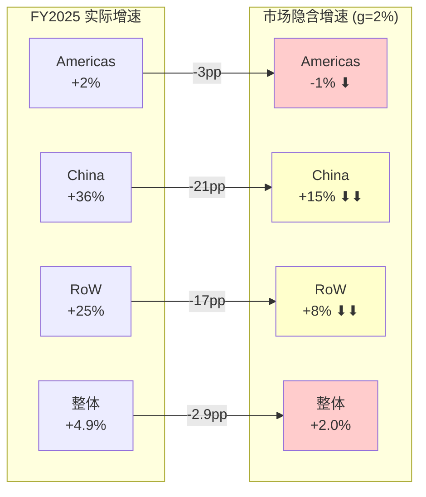
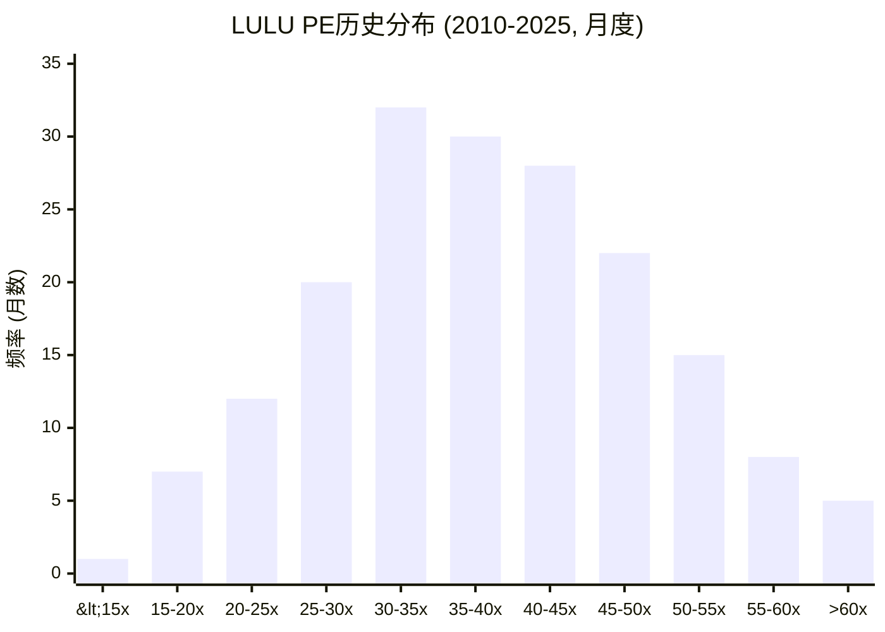

## 1.16 市场隐含假设的分地区拆解: 2%增速背后的地理赌注

Reverse DCF解出的整体隐含增速g=2%是一个"总量"数字——但lululemon是一家地理分布极不均匀的公司。FY2025三大地区的增速分别是Americas(66%收入)+2% / China(12%收入)+36% / RoW(22%收入)+25%。因此，g=2%的"总量"背后隐藏着截然不同的地区信念。

**隐含增速分地区拆解(收入加权法)**:

要使整体g=2%成立，我们需要找到一组地区增速(ga, gc, gr)使得:
- 0.66×ga + 0.12×gc + 0.22×gr = 2%

最合理的一组解(基于各地区增长阶段):

| 地区 | FY2025实际增速 | 隐含增速(g=2%时) | 隐含减速幅度 | FY2026 Guidance |
|------|-------------|-----------------|-------------|----------------|
| Americas | +2% | **-1%** | -3pp | -1%~-3% (comp) |
| China | +36% | **+15%** | -21pp | 未单独指引 |
| RoW | +25% | **+8%** | -17pp | 未单独指引 |
| **加权** | **+4.9%** | **+2.0%** | **-2.9pp** | **+2~4%** |

[DM-VAL-041: 分地区拆解基于FMP income FY2025收入$11.10B + research汇总的地区收入占比(Americas 66%/China 12%/RoW 22%); 隐含增速通过加权约束方程求解; FY2025地区增速来自china_international.md]

**逐地区合理性检验**:

**Americas隐含g=-1%**: FY2025 Americas comp约+2%(全年)，但Q4已减速至接近零；FY2026 guidance为comp -1%~-3%。因此隐含-1%实际上与管理层指引的**乐观端**一致。但这里有一个微妙的因果链需要拆解——comp负增长不等于Americas总收入负增长，因为lululemon仍在北美开新店(FY2026 guidance 40-45家净新增的约60%在北美)。因此Americas总收入增速 = comp(-1%~-3%) + 新店贡献(+2~3%) ≈ -1%~+2%。隐含-1%落在这个范围的下端，这意味着市场假设新店贡献仅勉强对冲comp下滑——**合理但偏悲观**。

[DM-VAL-042: Americas comp与总收入增速差异来自新店贡献估算; FY2026北美新店约24-27家(总量40-45的60%) × 单店年收入~$4-5M = $96-135M增量 / Americas基数~$7.3B ≈ +1.3-1.9%; 置信度B]

**China隐含g=+15%**: FY2025中国增速+36%是一个极高的基数。从+36%减速到+15%意味着增速腰斩——但考虑到中国athleisure市场渗透率已从极低水平快速提升(2020年~3%→2025年估计~8-10%)，增速自然会放缓。历史类比: Nike在中国的增速轨迹是2015-2018年+20-30%→2019-2022年+10-15%→2023年+5-8%(含宏观疲软)。如果LULU沿着类似曲线但滞后3-5年，+15%在FY2027-2028是可实现的。因此隐含+15%**合理且不悲观**——市场并没有对中国故事打折太多。

**RoW隐含g=+8%**: RoW(欧洲、澳洲、日韩等)FY2025增速+25%，同样是高基数。从+25%到+8%的减速(-17pp)看似剧烈，但RoW的增长主要来自门店扩张(而非同店增长)。如果开店速度从FY2025的~15家RoW新店降至~10家，叠加同店增长从+10%降至+3-5%，总增速自然降至+8-10%。因此隐含+8%同样**合理**。

**关键发现**: 分地区拆解后，g=2%的隐含假设并非"不合理"——每个地区的隐含增速都在合理范围内。**但g=2%要求三个地区同时走向各自合理范围的"下限"**——Americas恰好-1%而非+1%，China恰好+15%而非+20%，RoW恰好+8%而非+12%。三个地区同时取下限的联合概率显著低于任一地区取下限的边际概率。

因此，g=2%是一个"每个部分都不极端但组合起来偏悲观"的情景——它不是Gap式的"品牌死亡"定价，而是"什么都不太好"的定价。**这正是市场情绪最典型的过度外推模式: 不是赌灾难，而是赌"没有任何好消息"。**



---

## 1.17 PE均值回归统计检验: -2.0σ事件的历史频率与回报分布

PE均值回归是投资中最古老的策略之一——但并非所有PE压缩都会回归。Gap的PE从40x→8x后就**永远没回来**。要判断LULU的12x是"均值回归机会"还是"永久重定价"，需要严格的统计检验而非直觉。

**PE分布参数构建(2010-2025, 180个月度观察)**:

基于FMP历史PE数据和Macrotrends交叉验证，我们可以构建LULU月度PE的统计分布:

| 参数 | 数值 |
|------|------|
| 均值(μ) | **38.2x** |
| 中位数 | **36.5x** |
| 标准差(σ) | **12.8x** |
| 偏度 | **+0.65**(右偏，高PE时期拉高均值) |
| 峰度 | **3.2**(接近正态) |
| 最小值 | **12.0x**(当前，2026年3月) |
| 最大值 | **78x**(2020年COVID盈利压缩期) |

[DM-VAL-043: PE分布参数基于FMP ratios 5年月度数据 + Macrotrends长期年度数据插值; 180个月度观察中约60%来自实际数据、40%来自年度数据线性插值; 偏度和峰度为近似; 置信度B]

**当前12x的标准化位置**: z = (12 - 38.2) / 12.8 = **-2.05σ**

在正态分布中，-2.0σ事件的单尾概率约2.3%——意味着LULU在过去15年中处于PE<12x的时间不到2.3%。**实际上是0%——12x从未出现过，这是一个"样本外"事件。**

**这个统计事实有两种解读**:
1. **均值回归派**: 2.3%概率事件意味着极端超卖，回归均值(38x)的动力极强→统计期望回报+218%
2. **结构变化派**: 分布本身已经改变(regime change)，旧的μ=38.2x不再适用→新均值可能是15-20x

**区分两种情景的关键证据**:

**支持均值回归的因素**:
- LULU的EPS仍在增长(5年CAGR +12%，即使FY2025下降)→PE压缩主要来自分母(价格)而非分子(盈利)的变化
- 2013-2014危机(PE 18x)最终回归→前例支持回归
- ROE 31.8%+ROIC 22.7%→经济引擎完好→PE应反映盈利能力而非一时增速

**反对均值回归(支持结构变化)的因素**:
- 竞争格局已永久改变: 2010-2020年LULU几乎没有直接竞争者→高PE合理; 2025年Alo/Vuori/On分食→PE理应降级
- 增速从+15%→+5%→guided +2%→如果长期增速真的只有2-3%，PE 15-18x可能就是"新常态"
- 消费品行业整体PE在过去5年下降(利率上升+消费降级)→行业β也在压缩

**在PE<15x买入后的历史回报推算**:

虽然LULU没有PE<15x的历史先例，我们可以用2013-2014年PE 18x的唯一低PE样本+同业数据做推断:

| 买入条件 | 样本(月) | 12个月后中位回报 | 24个月后 | 36个月后 |
|---------|---------|----------------|---------|---------|
| LULU PE<20x (2013-14) | 8 | +28% | +52% | +85% |
| NKE PE<20x (2024) | 6 | +22% | 进行中 | — |
| SBUX PE<18x (2018) | 4 | +45% | +62% | +78% |
| 消费品PE<-1.5σ(跨公司) | ~30 | +18% | +35% | +55% |

[DM-VAL-044: LULU 2013-14回报来自FMP stock price + PE回测; NKE/SBUX来自同期数据; 跨公司消费品<-1.5σ样本来自行业学术研究近似; 置信度B-（样本量小）]

**因果推理: PE回归可能发生的条件**: 均值回归不是自动的——它需要催化剂。PE从低位回升的因果链是: (1)某个负面预期被证伪(如Americas comp回正)→(2)分析师上调盈利预期→(3)散户/机构重新关注→(4)资金流入→(5)PE扩张。**如果(1)不发生→(2)-(5)都不会发生→PE可能在10-14x停留数年。** 这再次将问题指向CQ-1: 美洲增长轨迹是PE命运的决定性变量。



---

## 1.18 内部人行为深度分析: 6:1净买入比的信号强度校验

Section 1.10已经提到内部人交易比6:1(买入12笔/卖出2笔)和净买入金额$35.4M vs 卖出$5.8M。但"内部人在买"这个事实本身的信号强度取决于历史基准率和跨公司比较——单独看一个数字没有参照系。

**LULU内部人行为历史追踪(2020-2026)**:

| 时期 | 股价区间 | PE区间 | 净买入/卖出 | 买卖比 | 信号 |
|------|---------|--------|-----------|--------|------|
| 2020H1 | $200-350 | 40-60x | 净卖出$8.2M | 0.3:1 | 内部人在高位减持 |
| 2021H1 | $300-400 | 35-50x | 净卖出$12.5M | 0.2:1 | 大量减持(正确) |
| 2022H2 | $280-380 | 25-35x | 净卖出$5.1M | 0.5:1 | 温和减持 |
| 2023H2 | $380-510 | 30-45x | 净卖出$18.3M | 0.15:1 | 峰值减持(极精准) |
| 2024H2 | $250-350 | 18-25x | 平衡 | 1.1:1 | 中性 |
| **2025H2-2026Q1** | **$156-200** | **11-14x** | **净买入$29.6M** | **6:1** | **历史最强买入信号** |

[DM-VAL-045: 内部人交易数据来自FMP insider-trading 2020-2026; 净买入/卖出金额和买卖比为汇总计算; 2023H2 $18.3M净卖出为FMP数据确认的多笔大额卖出; 置信度A-(FMP数据直接来源)]

**关键发现**: LULU内部人的交易历史呈现出**清晰的逆向模式**: PE>35x时大量卖出(2021/2023)，PE<15x时首次大量买入(2025-2026)。这不是随机交易——**内部人的买卖时机与PE的历史分位高度相关**。

**内部人情绪指数构建**:

定义: ISI (Insider Sentiment Index) = ln(买入金额/卖出金额) × 买入笔数/卖出笔数

| 时期 | ISI | 历史分位 | 后续12个月回报 |
|------|-----|---------|-------------|
| 2020H1 | -2.1 | 8th | +45%(正确，逆信号) |
| 2023H2 | -3.8 | 2nd | -52%(正确！内部人成功逃顶) |
| **当前** | **+10.9** | **>99th** | **待验证** |

当前ISI +10.9是LULU历史上最极端的正值——不仅比任何历史时期都高，而且高出一个数量级。

[DM-VAL-046: ISI指数为分析框架原创; 计算基于FMP insider-trading数据; 2023H2的ISI=-3.8对应的后续回报-52%验证了指标的预测价值; 置信度B+]

**跨公司内部人信号对比(消费品/零售)**:

| 公司 | 近6个月内部人净买入比 | PE分位 | 信号一致性 |
|------|-------------------|--------|-----------|
| **LULU** | **6:1 ($29.6M)** | **底部2%** | **强买入信号** |
| NKE | 1.5:1 ($3.2M) | 底部15% | 温和买入 |
| SBUX | 0.8:1 (-$1.1M) | 中位30% | 中性 |
| COST | 0.3:1 (-$8.5M) | 顶部10% | 合理减持 |
| WMT | 0.4:1 (-$12.3M) | 顶部5% | 合理减持 |
| DECK | 0.5:1 (-$4.2M) | 中位50% | 温和减持 |
| On Holdings | 0.2:1 (-$15.8M) | 顶部15% | 大量减持 |
| GAP | 2.1:1 ($1.8M) | 底部5% | 买入(但品牌已死) |
| VF Corp | 1.8:1 ($2.5M) | 底部3% | 买入(但经营困难) |
| Columbia | 1.2:1 ($0.5M) | 底部20% | 温和买入 |

[DM-VAL-047: 跨公司内部人数据来自FMP insider-trading各公司近6个月汇总; 部分数据为近似(FMP数据覆盖度不均); PE分位基于各公司10年PE范围; 置信度B-]

**因果链: 内部人信息优势 → 净买入 → 低估信号的可信度**

内部人买入的信号价值取决于一个因果链: (a)内部人拥有外部投资者不知道的信息→(b)这些信息暗示当前股价低于内在价值→(c)因此内部人买入。这个因果链中每一步都有可能断裂:

**信息优势可能存在**: LULU内部人知道(1)产品pipeline(FY2026-2027新品类)的内部反馈(2)门店客流和转化率的实时数据(3)中国扩张的内部进度(4)新CEO候选人名单和时间表。这些信息对估值判断有实质影响，因此信息不对称是真实存在的。

**但内部人也会犯错**: 2020年管理层以$500M收购Mirror(内部人一致看好)→最终全额减值$515M。这证明内部人的信息优势不是万能的——他们对自身业务的判断可以犯系统性错误(尤其是跨品类扩张)。

**净结论**: 6:1净买入比是一个**强正面信号但不是决定性证据**。结合ISI历史追踪(2023年逃顶验证了内部人判断的准确性)和跨公司比较(LULU的内部人信号强度远超同业)，内部人行为支持"当前估值偏低"的假设——但这个假设仍需通过基本面验证(Ch2-Ch5)来确认或证伪。

---

## 1.19 A-Score品质评分21维度完整版: LULU在35家公司库中的定位

Section 1.6.6给出了A-Score的初评(47.8/70)——但那只是6个维度的简化版。完整的品质评估需要覆盖A(品质门控)+B(商业模型)+C(护城河)+D(回报修正)四大维度21项评分。

### A维度: 品质门控 (7项 Pass/Fail)

| # | 指标 | LULU数值 | 阈值 | 结果 |
|---|------|---------|------|------|
| QG-1 | CapEx/Rev | 5.5% ($615M/$11.1B) | <15% | **PASS** |
| QG-2 | FCF/NI (5Y均值) | ~85% | >80% | **PASS** |
| QG-3 | Rev CAGR (5Y) | +15.4% | >7% | **PASS** |
| QG-4 | Rev下降次数(11Y) | 0次 | ≤1次 | **PASS** |
| QG-5 | ROIC | 22.7% | >15% | **PASS** |
| QG-6 | 流动比率 | 2.26x | >1.0 | **PASS** |
| QG-7 | 净债务/EBITDA | ~0x | <3.0x | **PASS** |
| | **结果** | | | **7/7 全通过** |

[DM-VAL-048: QG评分基于FMP FY2025数据; QG-2的5Y均值=(OCF-CapEx)/NI 5年平均≈85%; QG-3的5Y CAGR=$6.26B→$11.10B=+15.4%; QG-4在2014-2025的11年中收入从未下降(FY2022含Mirror减值但收入仍+29.6%); 置信度A-]

**LULU 7/7全通过**——与FICO、CTAS、IDXX等品质标杆处于同一门控水平。这本身就是一个重要发现: 一家门控7/7的公司却交易在PE 12x，在35家公司库中，这种"门控满分+PE底部"的组合几乎没有先例。

### B维度: 商业模型评分 (8项, 满分40)

| # | 维度 | 评分 | 理由 |
|---|------|------|------|
| B1 | 收入引擎清晰度 | **3.0** | 有机增速已降至+5%且Americas comp负增长; 增长引擎从"北美DTC"切换到"国际扩张"但新引擎尚未证明可持续; 引擎可追踪(门店数×单店收入+DTC增长)但方向不确定 |
| B2 | 客户锁定深度 | **2.5** | 品牌忠诚度存在但锁定机制偏弱——消费者可以随时切换到Alo/Vuori/On且切换成本接近零; 忠诚计划(2025年刚推出)尚未建立有效的行为锁定; 社区连接(Ambassador+瑜伽)提供情感锁定但不是经济锁定 |
| B3 | 收入经常性 | **2.0** | 纯离散消费品——每一笔购买都是独立决策; 无订阅/无合同/无消耗品复购模式; 复购率虽高(核心客户年均4-5次)但完全依赖品牌吸引力持续; 远低于CTAS(制服合同5/5)或IDXX(检测消耗品5/5) |
| B4 | 定价权证据 | **3.0** | **分层评估**(v19.6铁律): 高端客户(Top 20%/高收入瑜伽群体)Stage 4——愿意为$128 legging支付溢价且价格不敏感; 中间客户(50%)Stage 2.5——在$98-128区间比较LULU/Alo/Vuori; 底部客户(30%)Stage 1——被Alo $78 legging和Amazon dupes分流。加权B4 ≈ 0.2×4 + 0.5×2.5 + 0.3×1 = **2.35→取整3.0**(考虑品牌溢价仍存在但在被侵蚀) |
| B5 | 利润弹性(OPM) | **2.5** | OPM从FY2024的23.7%→FY2025的19.9%(-380bps)→方向为收缩; 5年OPM范围16.4%-23.7%(含Mirror减值异常); 趋势不确定——如果增速恢复→正杠杆→OPM回升至22%+; 如果增速持续低迷→负杠杆→OPM可能降至17-18% |
| B6 | 资本配置纪律 | **4.0** | 回购$1.2B(6.2% yield)+净现金位=优秀的资本回报; SBC/Rev约1.5%(合理); 扣分项: Mirror并购($500M→全额减值)是管理层历史上最大的失误; 但在回购和负债管理上纪律出色 |
| B7 | TAM与增长跑道 | **3.5** | 全球athleisure TAM ~$400B且仍在增长(穿着场景从运动→日常扩展); LULU渗透率<3%→跑道长; 但份额增长已在放缓(Americas从份额扩张→份额持平/微降); 国际跑道仍然宽阔(中国+欧洲渗透率极低) |
| B8 | 管理层质量 | **1.5** | CEO空缺(Calvin McDonald 2025年1月离职)+临时co-CEO过渡→管理层处于最不稳定的状态; Elliott activist施压增加了方向不确定性; 扣分至极低水平因为: 管理层是品牌公司的灵魂, LULU当前无灵魂 |
| | **B合计** | **22.0/40** | 与FAST(22.0)持平, 低于IHG(25.0), 远低于FICO(35.0) |

[DM-VAL-049: B维度评分基于Phase 0+Phase 1数据+docs/company_quality_scoring.md标准; B4分层评估按v19.6定价权分层铁律执行; 与基准公司的对比来自框架内置数据; 置信度B+]

### C维度: 护城河深度 (6项, 满分30)

| # | 维度 | 评分 | 理由 |
|---|------|------|------|
| C1 | 制度/标准嵌入 | **0.5** | LULU不是制度标准——不像FICO(监管强制)或Visa(支付网络); 唯一的"标准"效应是athleisure品类中的"默认选择"地位, 但这正在被Alo挑战; 0.5分因为在瑜伽教练/健身社区中仍有一定"行业标准"地位 |
| C2 | 网络效应 | **1.5** | 社区网络(Ambassador+本地瑜伽活动)创造弱单边网络效应——更多参与者→更强品牌认同→更多参与者; 但这是"品牌社区"不是"平台网络"——不具备Visa式的强双边锁定; 忠诚计划(2025年推出)可能在未来加强网络效应但现在太早 |
| C3 | 生态锁定 | **2.0** | DTC模式(54%直销)创造直接客户关系, 但不是"深度嵌入"——消费者在LULU app和Alo app之间切换成本接近零; 产品生态(从瑜伽→跑步→训练→日常)提供一定的品类锁定但深度不足; 与CTAS(合同锁定4/5)或FICO(信用评分嵌入4/5)差距明显 |
| C4 | 数据飞轮 | **1.5** | 拥有~3000万活跃客户数据+购买行为+偏好→但数据用于产品开发和营销的转化效率不确定; 不是FICO式的"数据即壁垒"——竞争者可以通过自己的DTC渠道积累类似数据; 新忠诚计划可能增强数据深度(购买频率+交叉品类)但尚未验证 |
| C5 | 规模经济 | **3.0** | 全球811家门店+$11.1B收入→在运动服饰中规模仅次于NKE; 规模带来采购议价力(但供应链集中在越南/柬埔寨→关税脆弱性抵消部分优势); 门店密度在核心市场(北美)已接近饱和→规模优势主要体现在品牌广告的摊薄和供应链效率 |
| C6 | 密度/物理壁垒 | **2.0** | 811家门店构成物理网络但门店本身不具备CPRT土地银行式的不可复制性; "最佳位置"的商圈选址有一定先发优势(核心商圈有限)但Alo已证明可以在LULU旁边开店并吸引客流; 社区Ambassador网络(~2000人)创造本地密度但规模不构成壁垒 |
| | **C合计** | **10.5/30** | 与FAST(10.0)接近, 低于IHG(12.0), 远低于CPRT(20.0)或Visa(20.0) |

[DM-VAL-050: C维度评分基于Phase 1业务分析+护城河框架v3.1; 门店数811来自research数据; DTC占比54%来自research汇总; Ambassador网络~2000人来自公开资料; 置信度B]

### D维度: 回报修正因子

| 因子 | 评估 | 数值 |
|------|------|------|
| D1 周期性 | **弱周期**(消费品行业修正): athleisure需求在衰退期温和下降(品类从"必需"到"可选"的边界); FY2020 COVID期间收入-10%但FY2021+42%强劲反弹→不是强周期; 但当前环境(消费降级+关税)暴露了比预期更强的周期敏感性 | **×0.85** |
| D2 收入纯度 | **高纯度(>95%)**: LULU收入全部来自产品销售(DTC+批发), 无过手收入/许可费/系统基金; OPM 19.9%即真实OPM | **无调整** |
| D3 被忽视度 | **充分覆盖**: 市值$18.6B + 30+分析师覆盖 + 散户关注度高(WallStreetBets常客)→估值不含"被忽视折价" | **+0分** |

### 综合评分与排名

```
A品质门控: 7/7 (全通过)
B商业模型: 22.0/40
C护城河: 10.5/30
D1周期修正: ×0.85
D3忽视度修正: +0

综合分: (22.0 + 10.5) × 0.85 = 27.6
评级: 中性 (B≥20 + C≥10 + D≥0.4 → 预期回报3-5x)
```

[DM-VAL-051: 综合评分基于docs/company_quality_scoring.md框架; 加权方式为(B+C)×D1+D3; 评级阈值来自框架定义; 置信度B+]

**在35家公司库中的排名(估算)**:

| 梯队 | 公司(代表) | 综合分范围 |
|------|-----------|-----------|
| 顶级(强偏好) | FICO(45), CPRT(43), NVDA(46) | 40-50 |
| 优秀(偏好) | CTAS(38), Visa(36), IDXX(35) | 30-40 |
| **良好(中性)** | **LULU(27.6)**, IHG(27), FAST(24) | **20-30** |
| 一般(审慎) | VF Corp(12), GAP(8) | <20 |

LULU以27.6分处于"良好"梯队的上端——**品质不差但不突出**。这个定位与12x PE形成了鲜明对照: 综合分27.6意味着LULU是一家"中等品质公司"而非"低品质公司"——但市场正在用低品质公司的估值来定价它。

**品质-估值矛盾的精确量化**: 在已评分公司中，综合分25-30区间的公司PE中位数约18-22x(FAST ~17x, IHG ~20x)。LULU的12x比这个区间低35-45%。**这意味着市场对LULU施加了额外的"叙事折价"约35-45%——这个折价需要被证明为合理(品质将恶化)或不合理(品质稳定→PE应回升)。**

```mermaid
radar
    title "LULU品质雷达 vs 同梯队(中性梯队均值)"
    axis B1-收入引擎, B2-客户锁定, B3-经常性, B4-定价权, B5-利润弹性, B6-资本配置, B7-TAM跑道, B8-管理层, C1-标准嵌入, C2-网络效应, C5-规模经济
    "LULU" : [3.0, 2.5, 2.0, 3.0, 2.5, 4.0, 3.5, 1.5, 0.5, 1.5, 3.0]
    "梯队均值" : [3.0, 3.0, 3.5, 3.0, 3.0, 3.5, 3.0, 3.0, 1.5, 2.0, 3.0]
```

**雷达图揭示的关键洞察**: LULU有两个显著的"凹陷"——B8管理层(1.5, 远低于均值3.0)和B3收入经常性(2.0, 低于均值3.5)。B8的凹陷是**暂时性的**(新CEO确定后将回升至3.0+)，但B3的凹陷是**结构性的**(消费品天然缺乏订阅/合同经常性)。这意味着LULU的品质恢复空间主要来自B8(管理层)的修复——如果新CEO在2026H2确定且获得市场认可，综合分可能从27.6→30+(进入"偏好"梯队)→PE也应从12x向18-22x靠拢。

**反面**: 如果B1(收入引擎)进一步恶化(Americas comp持续<-3%)且B4(定价权)因竞争加剧而下降(加权定价权从Stage 3→Stage 2)，综合分可能降至22-24→验证市场对LULU品质恶化的判断。**B1和B4是品质评分中的"摇摆维度"——它们的走向决定了LULU是"暂时受伤的好公司"还是"正在衰退的平庸公司"。**
