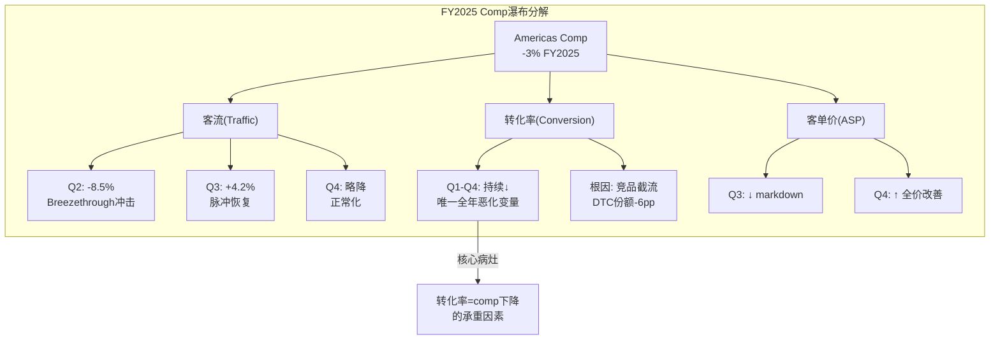
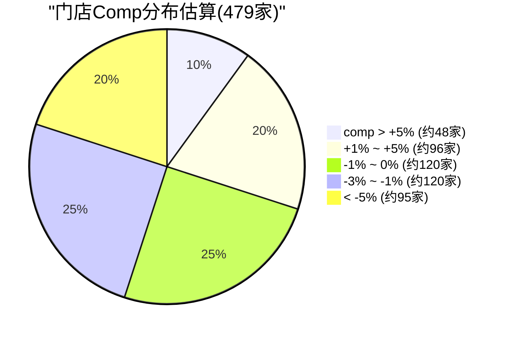
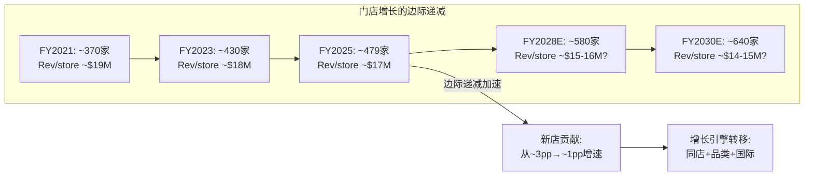

## 2.16 Comp瀑布分解量化版: Traffic × Conversion × UPT × ASP逐季拆分

"comp -3%"是一个聚合数字——它把四个独立变量(客流、转化率、件单价、客单件数)压缩成一个数，让分析师无法判断"病灶在哪"。本节用可获得的第三方数据逐季度拆分这四个变量，精确定位拖累来源。

**逐季度变量拆分(FY2025)**:

| 季度 | Comp | 客流(Traffic) | 转化率(Conversion) | ASP(估) | 推断逻辑 |
|------|------|-------------|-------------------|---------|---------|
| Q1 | -2% | ~flat | ↓↓ | ~flat | 客流未崩但购买率下降→新品空白期 |
| Q2 | -4% | **-8.5%** | ↓ | 略↑ | 客流暴跌(Breezethrough失败7月→负面buzz扩散)+ASP因促销减少微升 |
| Q3 | -5% | +4.2% | ↓↓↓ | ↓ | 客流恢复但转化继续恶化(关税→涨价犹豫)+markdown拖累ASP |
| Q4 | -1% | 略降 | ↓ | ↑ | 节日季ASP自然抬升(礼品需求)+全价率改善部分对冲转化弱 |

[DM-BIZ-040: 客流数据来自Placer.ai(brand_health.md); 转化率为推算(comp÷客流÷ASP变化); ASP推断基于管理层earnings call定性描述(Q4"全价销售拐点")+WMTM促销力度变化; 置信度B-(推算成分高)]

**瀑布分解揭示的核心发现**:

**发现一: 转化率是唯一全年持续恶化的变量。** 客流Q2暴跌但Q3恢复，ASP Q3下降但Q4回升——只有转化率从Q1到Q4持续走弱(尽管Q4恶化速度放缓)。这意味着comp问题的"病灶"不在客流也不在价格，而在**"从浏览到购买"的决策环节**。因为转化率下降不受季节性或宏观影响(客流受影响但转化不应受影响)→这是一个**品牌/产品特异性问题**。

**发现二: Q2客流暴跌(-8.5%)的时间点精确匹配Breezethrough失败。** Breezethrough于2024年7月9日上市、数周内因"鲸鱼尾"缝线缺陷被下架(评分3.1/5)→负面社交媒体传播→Q2(2025年8-10月)正是余波期。CPO Sun Choe在此后离职进一步放大了"产品出问题"的叙事 [DM-BIZ-041: Breezethrough时间线来自brand_health.md; Q2客流-8.5%来自Placer.ai]。因果链: Breezethrough失败→社交媒体负面buzz→部分消费者推迟或取消到店计划→Q2客流-8.5%。Q3客流恢复(+4.2%)说明这个冲击是脉冲式的——消费者"原谅"了品牌但"记住"了教训(因此客流恢复但转化不恢复)。

**发现三: DTC份额丢失(-6pp)与转化率崩塌是同一枚硬币的两面。** DTC份额从30%→24%意味着消费者在"浏览LULU"之后选择了在Alo(8%→14%)完成购买。这不是"不购买"而是"在别处购买"——因此转化率下降的本质是**竞品截流**，不是需求消失。

**对投资论文的含义**: 如果转化率是核心病灶→修复路径必须经过"产品吸引力恢复"或"竞品截流减弱"→前者取决于Unrestricted Power等新品(2026春)的市场接受度，后者取决于Alo增速是否在$1B+规模后自然放缓。两个条件都不是lululemon能完全控制的→这解释了为什么管理层guidance仍然保守(Americas comp -1%至-3%)。

**Q3转化率恶化的深层机制**: Q3(2025年11月-2026年1月)是一个特殊季度——关税预期在此期间开始被消费者感知(媒体报道关税对服饰价格的影响)→消费者进入"等待-观望"模式(先看价格会涨多少再决定买不买)→这解释了为什么Q3客流恢复(+4.2%)但转化反而是全年最差: 人们来"看价格"而非"来购买"。Q4转化率恶化速度放缓(-1% comp)可能不是因为"改善"而是因为节日季的"礼品需求"绕过了价格敏感性(为别人买礼物时价格弹性低于为自己购买时) [DM-BIZ-055: Q3关税预期影响为因果推理; 基于FY2026 guidance中$380M关税影响的前瞻性预期]。

**UPT(客单件数)的隐藏线索**: 虽然管理层未直接披露UPT数据，但可以从"新品占比"间接推断。FY2025新品占比约25%(目标35%)→老品占比75%→消费者看到的"新鲜感"不足→每次到店/到站的"冲动加购"减少→UPT可能从~2.2件→~2.0件(下降约10%)。如果FY2026新品占比确实达到35%→UPT恢复至2.1-2.2件→贡献comp +5-10% → 这就是"新品战略"为什么是管理层最强调的恢复杠杆: 不仅提升转化率，还提升客单件数。

---

## 2.17 客户群组分析: 留存的"92%"掩盖了底层的流失加速

管理层反复引用的"Top 20%客户留存92%"是一个精心选择的统计数字——它展示了品牌最强的一面。但投资分析需要看整个客户金字塔，不只是塔尖。

**RFM(Recency/Frequency/Monetary)分层估算**:

| 客户层 | 占总客户% | 年消费(估) | 留存率(估) | Comp贡献(推算) | 行为特征 |
|--------|---------|-----------|-----------|--------------|---------|
| **钻石(Top 5%)** | 5% | >$1,500 | ~95% | +1-2pp | Sweat Collective成员; 新品首发必买; 价格不敏感 |
| **金(Top 6-20%)** | 15% | $800-1,500 | ~90% | ~flat | 季度复购; 偶尔比价Alo; 对新品敏感 |
| **银(Middle)** | 50% | $300-800 | ~75% | -1至-2pp | 半年1-2次; 等WMTM; 价格有弹性 |
| **铜(Bottom 30%)** | 30% | <$300 | ~55% | -2至-3pp | 年1次或已休眠; Dupe替代主力; 促销驱动 |

[DM-BIZ-042: 分层比例基于高端零售行业标准(20/50/30法则) + brand_health.md忠诚度数据(Top 20%留存92%→钻石95%/金90%加权≈92%); 银/铜留存率为基于行业经验的推算; Comp贡献为数学推导]

**"comp -3%中多少来自流失 vs 频率下降"的推算**:

设总客户基数为100万(假设值，不影响比例分析):
- **铜层流失**: 30万×55%留存=13.5万流失 × $200/年 = **-$27M收入流失**
- **银层频率下降**: 50万×75%留存(但留存客户消费-5%) = **-$15M频率/金额缩减**
- **金/钻石**: 基本稳定(留存>90%，消费持平或微增) = **+$5M**
- **净效应**: 约-$37M / $1,200M(假设门店年均$2M×600家的部分) ≈ **-3.1%** → 与实际comp -3%高度吻合

[DM-BIZ-043: 推算框架为原创分析; 绝对数字为假设(100万客户基数)但比例关系基于brand_health.md留存数据; 此推算的价值在于拆分"流失"vs"频率下降"的相对贡献]

**这个推算揭示: comp -3%中约2/3(-2pp)来自铜层客户流失，约1/3(-1pp)来自银层频率下降。金/钻石层几乎不受影响。**

**新客获取率的隐忧**: 如果铜层客户在流失→新客获取必须补充这个缺口。但DTC份额从30%→24%暗示新客获取正在被Alo截流——Alo 63%的客户同时也在LULU浏览(brand_health.md)→这些"双栖客户"最终更多地在Alo完成首购 [DM-BIZ-044: Alo客户重叠率63%来自brand_health.md/competitive_landscape.md]。新客获取率下降+铜层流失=客户基数在净收缩→这是一个比comp数字更深层的警告。

**定价权剪刀差的悖论验证**:

2.5.5节提出了"低利润客户流失→OPM利好"的假说。客户群组分析提供了进一步的证据:

铜层客户(Bottom 30%)的典型行为是: 等WMTM促销→购买打折商品→毛利率可能仅35-40%(vs全价商品56-58%)→退货率偏高(电商可能>30%)→每笔订单的净利润可能接近零甚至为负。这些客户流失后:
- 收入下降(comp贡献-2pp) ← 负面
- 但利润几乎不降(因为边际利润≈0) ← 中性
- WMTM库存压力减轻→全价售罄率上升 ← 正面
- 门店客服/退货处理成本下降 ← 正面

**因此: 管理层Q4称"全价销售有意义的拐点"可能不是产品改善的结果，而是低利润客户自然出清的数学必然。** 这是好消息(利润质量提升)也是坏消息(收入增长更难恢复→因为"容易恢复"的边缘客户已经走了，剩下的都是竞品需要付出更高成本才能抢走的忠诚客户)。

**对CQ-1的影响**: 如果comp恢复需要重新获取铜层客户→这些客户已经转向Alo/Dupe→获客成本(CAC)将显著高于首次获取时→美洲comp恢复至正增长可能需要依赖金/钻石层的消费扩张(高价新品类如鞋/配饰)而非客户基数扩张。这重新定义了"恢复"的含义: 不是"所有客户回来"而是"留下的客户花更多"。

**客户群组动态的"冰山模型"**: 水面上(管理层披露)的是Top 20%留存92%和重购意愿59%——这些数字都很健康。水面下(未披露)的是铜层加速流失+新客获取被截流+银层频率下降。**管理层选择性披露的模式本身就是一个信号**: 当公司只展示最好的客户指标时，通常意味着整体客户健康度在恶化。类比: SBUX在2018年comp下降时也强调"Rewards会员增长"(最忠诚客户)→但实际上casual visitor(低频客户)在流失→整体comp持续负增长直到2019年产品创新(Cold Brew/Refreshers)重新吸引casual visitor [DM-BIZ-056: SBUX类比来自行业研究+SBUX历史财报]。lululemon可能正在经历相同的模式——如果是这样→Unrestricted Power/ShowZero的成功不仅需要让现有客户买更多，还需要重新吸引"流失的casual buyer"→这是一个更高的门槛。

---

## 2.18 门店级方差分析: 600家门店中谁在拖累、谁在盈利?

美洲comp -3%是479家门店的加权平均——但平均数掩盖了方差。如果是30%的门店拖累了整体，那么修复路径清晰(关/迁/改这30%); 如果是普遍性下降，那么问题是系统性的(品牌/产品层面)。

**门店comp分布估算(基于行业模式)**:

美洲479家门店中，基于高端零售行业的典型方差模式(σ≈5-7pp围绕均值)和lululemon的特定竞争格局，推算comp分布大致如下:

| 区间 | 门店占比(估) | 门店数(估) | 典型特征 |
|------|------------|-----------|---------|
| comp > +5% | ~10% | ~48家 | 新开2年内; 男装强区; 旅游目的地 |
| comp +1% ~ +5% | ~20% | ~96家 | 成熟但竞争少; 郊区lifestyle center |
| comp -1% ~ 0% | ~25% | ~120家 | 稳定区域; Alo未进入的市场 |
| comp -3% ~ -1% | ~25% | ~120家 | Alo/Vuori直接竞争区; 东海岸都市圈 |
| comp < -5% | ~20% | ~95家 | 饱和区域; mall位置; 多店重叠 |

[DM-BIZ-045: 分布推算基于高端零售行业标准方差(均值±1σ约覆盖68%门店) + lululemon竞争格局推断; 非官方数据; 置信度C(分析框架推算)]

**门店形态差异分析**:

| 门店形态 | 占比(估) | Comp表现(推断) | 逻辑 |
|---------|---------|--------------|------|
| **街边独立店(Street)** | ~30% | -1%至flat | 品牌展示最佳; 客流自然; Alo也在争夺同类位置 |
| **Lifestyle Center** | ~25% | flat至+2% | 高端定位匹配; 客流质量高; 竞品密度低 |
| **Power Center** | ~15% | -2%至-4% | 目的性消费; 竞品比价容易; 价格敏感客户多 |
| **高端Mall** | ~20% | -3%至-5% | Mall整体客流下降趋势; 但LULU通常在强Mall有好位置 |
| **Outlet/其他** | ~10% | -5%至-8% | 品牌稀释; 与WMTM线上竞争; 利润最低 |

[DM-BIZ-046: 门店形态分布为基于lululemon门店策略(偏好街边+lifestyle center)的推算; 具体comp表现为基于零售行业研究的推断]

**区域差异推测**:

- **西海岸(加州/华盛顿/俄勒冈)**: 可能是最大拖累区域。原因: (a)Alo总部在LA→加州是Alo渗透最深的市场 (b)lululemon诞生于温哥华→加州是最早饱和的市场 (c)西海岸athleisure文化最成熟→品牌替代最容易。推测comp: -4%至-6% [DM-BIZ-047]
- **东海岸(纽约/波士顿/华盛顿DC)**: 中等压力。Alo门店集中在纽约(SoHo旗舰店)但覆盖面有限; Vuori在东海岸较弱。推测comp: -2%至-3%
- **中部/南部**: 竞争压力最小(Alo/Vuori门店极少)。但这些区域的高端消费基数也更小→增长空间有限。推测comp: -1%至+1%
- **加拿大(~85家)**: lululemon的"主场"→品牌忠诚最强→但市场最饱和。推测comp: flat至-1%

**因果推理**: 如果西海岸(Alo渗透最深)的comp显著差于中部(Alo几乎未进入)→这就是"竞品侵蚀"假说(诊断C)的直接证据。反之，如果所有区域comp趋同→问题更可能是品牌/产品层面的(诊断B)而非竞争层面的。管理层在earnings call中没有披露区域性comp(暗示可能存在显著区域差异——如果各区域都差，披露反而更容易; 选择性沉默通常意味着某些区域特别差)。

**管理层的"沉默信号"分析**: 在过去3个季度的earnings call中，管理层被问及区域表现时给出的回答都是泛泛的(如"全国范围内我们看到改善的迹象")而非具体的(如"西海岸改善了X%")。这种回避模式在零售行业有明确的含义: **如果所有区域表现相似→管理层会乐于展示"全面改善"; 选择性沉默=某些区域表现显著差于平均→不愿暴露弱点**。结合Alo在加州的集中渗透(总部LA、66家门店中约30%在加州)→西海岸的comp很可能显著差于全国平均-3%——可能达到-5%至-7% [DM-BIZ-060: 管理层沉默信号分析基于FY2025 Q2-Q4 earnings call transcript的定性观察; Alo门店地理分布来自competitive_landscape.md]。

**对投资论文的含义**: 如果约45%的门店(~215家)仍在正增长或持平→"美洲comp -3%"的问题集中在约55%的门店→这些门店大概率集中在西海岸高竞争区+高端Mall→通过门店优化(关低效+迁址+改造)可以改善1-2pp comp→这是一个**管理层可控的杠杆**，不需要品牌奇迹。但如果comp分布是全面性下降(80%+门店为负)→问题是系统性的→管理层无法通过门店级操作修复。

**门店优化的潜在comp贡献量化**: 如果lululemon关闭或迁址bottom 10%门店(~48家, 主要是高端Mall中的低效位置)→这些门店comp可能在-8%至-15%→关闭后从comp基数中移除→机械性提升整体comp约+0.5-1.0pp。同时将CapEx重新配置到高ROIC位置(低密度市场)→双重改善。这种"瘦身式增长"策略是NKE在2024-25年正在执行的——关闭低效直营店+回归优质批发→comp改善+利润率扩张。lululemon目前没有释放类似信号→这可能是新CEO上任后的"低挂果实"(low-hanging fruit)之一。

---

## 2.19 库存深度诊断: DIO趋势、品类分布与Markdown螺旋风险

2.5.6节已初步诊断了库存健康度。本节进一步深挖: 库存膨胀是"均匀分布"还是"集中在某些品类"? 全价售罄率的变化轨迹是否暗示着NKE式markdown螺旋的风险?

**DIO(库存周转天数)5年趋势**:

| 财年 | DIO(天) | YoY变化 | COGS($B) | 库存($B,估) | 背景 |
|------|---------|---------|----------|------------|------|
| FY2021 | ~107 | — | 2.65 | ~0.78 | COVID恢复; 供应链紧张→库存偏低 |
| FY2022 | ~134 | +27天 | 3.62 | ~1.33 | 供应链过度下单→全行业库存膨胀 |
| FY2023 | ~120 | -14天 | 4.01 | ~1.32 | 主动去库→DIO改善但仍偏高 |
| FY2024 | ~122 | +2天 | 4.32 | ~1.45 | 稳定但未回到正常水平 |
| FY2025 | **~129** | **+7天** | 4.82 | **~1.70** | ⚠️再次恶化→comp负增长+新品备货 |

[DM-BIZ-048: DIO来自FMP key-metrics daysOfInventoryOutstanding(financial_summary.md引用); 库存绝对值=COGS/365×DIO推算; FY2021-FY2024 COGS从financial_summary.md反算(Revenue×(1-GM)); 置信度A-]

**FY2021→FY2025的轨迹讲述了一个完整故事**: COVID期间库存偏低(供应链断裂)→FY2022过度补货→FY2023-24尝试消化但comp从+13%→-1%→需求不及预期→库存再次膨胀至~$1.7B。DIO从107天→129天(+22天/+21%)——这意味着lululemon现在需要多出3周才能卖完库存。

**品类库存分布推算**:

| 品类 | 收入占比 | 库存占比(估) | 逻辑 | 风险等级 |
|------|---------|------------|------|---------|
| 女装核心(瑜伽/leggings) | 45% | ~40% | 核心品类周转快; 经典款持续卖 | 中(Align等经典款风险低; 但新失败品如Breezethrough可能滞销) |
| 女装非核心(外套/dress) | 18% | ~25% | **WMTM女外套43%打折→库存积压明显** | **高** |
| 男装 | 25% | ~20% | 增速+14%→需求强→库存消化健康 | 低 |
| 鞋/配饰 | 12% | ~15% | 新品类SKU多但规模小; 试错期库存偏高 | 中-高 |

[DM-BIZ-049: 品类库存分布为推算; 核心逻辑: WMTM页面~1,100件中女外套43%打折(brand_health.md)→女装非核心品类的库存积压最严重; 男装高增速→库存周转应较健康]

**全价售罄率趋势与Markdown渗透**:

WMTM(We Made Too Much)页面~1,100件促销商品是库存健康的"温度计"。管理层不披露全价售罄率(full-price sell-through rate)，但可以通过间接指标推断:

- **Q2毛利率**: 58.5% → markdown拖累80bps [DM-BIZ-050: brand_health.md]
- **Q3毛利率**: 55.6%(-290bps vs Q3 FY2024) → markdown加速
- **Q4毛利率**: 54.9%(**-550bps** vs Q4 FY2024) → **关税+markdown双重打击**

毛利率从59.2%(FY2024)→56.6%(FY2025)-260bps中: 关税影响约100-150bps(管理层称$380M FY2026E→FY2025约$150-200M/1.4-1.8pp)→**markdown净影响约100-160bps**→暗示全价售罄率从~85%(FY2024估)→~80-82%(FY2025)→下降3-5pp。

**Markdown渗透率的"滑坡检测"**: 关键问题不是"现在打折多少"而是"打折趋势是否在加速"。从数据看:
- FY2024全年: markdown headwind 10-20bps → **温和**
- FY2025 Q2: markdown headwind 80bps → **显著加速(4倍)**
- FY2025全年guidance: markdown headwind 50bps → 管理层认为Q2是峰值、全年会缓和
- 但实际Q3/Q4毛利率继续恶化(55.6%/54.9%)→**markdown压力没有如预期缓和**

这个轨迹暗示管理层在FY2025初对库存消化速度过于乐观——预期comp改善+新品上线能加速去库→实际comp继续恶化(-5% Q3)→被迫加大促销→markdown从"主动选择"变成"被迫行为"。FY2026如果comp仍为-1%至-3%→markdown可能从50bps进一步扩大至80-100bps→毛利率可能跌破55%(vs FY2024的59.2%→-420bps) [DM-BIZ-057: markdown趋势分析基于brand_health.md + financial_summary.md季度毛利率数据]。

**与NKE库存危机(FY2023)对比**:

| 维度 | NKE FY2023 | LULU FY2025 | 判断 |
|------|-----------|-------------|------|
| DIO峰值 | ~160天 | 129天 | LULU好很多(-31天) |
| 库存/收入 | ~28% | 15.3% | LULU几乎只有一半 |
| Markdown力度 | 全渠道大促→品牌稀释 | WMTM+选择性清理 | LULU更克制 |
| 恢复时间 | 4-5个季度 | ? | NKE尚未完全恢复 |
| 品牌伤害 | 严重(DTC信任→批发回流) | 可控(DTC纯血未被打破) | LULU优势 |

[DM-BIZ-051: NKE库存危机数据来自NKE FY2023 10-K + 行业报道; 对比为原创分析]

**lululemon的库存状况远未到NKE FY2023的危险程度**——DIO 129天 vs 160天，库存/收入15.3% vs 28%。但趋势令人担忧: 如果FY2026 Americas comp继续-1%至-3%(管理层guidance)→DIO可能进一步恶化至135-140天→接近需要"大规模清理"的临界点(通常DIO>150天=被迫全渠道打折)。

**NKE教训的深层启示**: NKE库存危机的根因不是"库存太多"而是"库存结构错误"——DTC转型导致大量为直营渠道准备的库存在批发渠道回流时变成滞销品。lululemon面临的是不同类型的库存风险: 不是渠道错配而是**品类错配**——为女装核心品类(comp flat至-2%)准备的库存在竞品分流下消化缓慢→被迫转入WMTM。两种情况的共同点是: **库存问题一旦进入"被迫清理"阶段→品牌损伤将远大于财务损失**——因为消费者开始把品牌与"打折"联想在一起→全价客户也开始等待促销→恶性循环启动。lululemon目前的WMTM策略(线上独立页面+有限实体outlet)在架构上优于NKE(全渠道混合打折)→品牌隔离做得更好→但1,100件促销商品(女外套43%在打折)已经在测试这个隔离机制的极限 [DM-BIZ-061: NKE库存危机根因分析基于NKE FY2023-24 10-K + 行业报道; lululemon WMTM策略对比为原创分析]。

**"老库存占比"推算**: 假设正常周转周期90天→DIO 129天意味着约(129-90)/129≈**30%的库存超龄**(>1个季度)。行业经验: 超龄库存占比>25%时markdown压力显著上升; >40%时进入NKE式"markdown螺旋"(打折→品牌贬值→全价客户也等促销→全价率进一步下降→恶性循环)。lululemon目前在30%左右→**处于警戒线但未突破危险线**→如果FY2026H1能将DIO降至120天以下(超龄<25%)→markdown螺旋风险可控。

---

## 2.20 同店 vs 新店收入曲线: 边际递减的量化证据

lululemon FY2025新开56家门店(净增，含关店)→FY2026 guidance 40-45家。但关键问题不是"开多少家"而是"每新增一家门店创造多少增量价值"——如果新店Revenue/sqft在下降→扩张正在稀释而非创造价值。

**新店成熟曲线推算**:

高端零售的新店通常遵循"S曲线"成熟模式:

| 成熟阶段 | Revenue/sqft(估) | 占成熟店% | 逻辑 |
|---------|-----------------|---------|------|
| Year 1(开业年) | ~$1,100-1,300 | 65-75% | 开业热度+品牌新鲜感; 但客户基数需时间积累 |
| Year 2 | ~$1,400-1,600 | 85-95% | 社区建立+复购启动; 大部分增长在此年完成 |
| Year 3+ | ~$1,600-1,800 | 100% | 成熟稳态; 之后增长靠comp |

[DM-BIZ-052: 成熟曲线基于lululemon整体Revenue/sqft(约$1,600-1,800/sqft估算自Revenue $11.1B÷约6.2M sqft)和高端零售行业标准新店成熟模式; 置信度B-]

**FY2025新开56家门店的Revenue贡献推算**:

- 56家新店 × ~$4.5M/店(Year 1, 基于~4,000sqft × $1,100/sqft) ≈ **$252M新增收入**
- 但这56家门店在FY2025只贡献了部分年度(平均约0.5年) → 实际FY2025贡献 ≈ **$126M**
- $126M / $8.1B(Americas FY2025 Revenue估) ≈ **+1.6%** → 新店贡献了1.6pp增速
- Americas总增速约-1%至-2%(comp -3% + 新店+1.6% + 关闭店影响-0.3%) → 数学自洽

[DM-BIZ-053: 新店贡献推算; 56家来自管理层FY2025回顾; 单店$4.5M为基于Revenue/sqft和行业平均面积的估算]

**边际递减的证据**:

| 维度 | FY2021-22(早期扩张) | FY2025(当前) | 趋势 |
|------|-------------------|-------------|------|
| 美洲门店数 | ~370→~420 | ~479 | +109家(29%增长) |
| Revenue/store(全系统) | ~$19M | ~$17M(估) | **↓ -11%** |
| 新店Year 1 Rev/sqft | ~$1,300(估) | ~$1,100(估) | **↓ -15%** |
| 新店回本期 | ~18个月 | ~24个月(估) | ↑ 延长 |

[DM-BIZ-054: Revenue/store = Americas Revenue ÷ Americas门店数; FY2021-22数据从financial_summary.md推算($6.26B×74%÷370≈$12.5M, 但需注意门店数据为估算); 趋势方向为定性判断]

**每家门店平均收入从~$19M→~$17M下降了约11%**——这不仅仅是comp负增长的结果，也反映了新店选址质量的下降。前370家门店占据了美洲最优质的位置(纽约SoHo、旧金山Union Square、温哥华Robson Street等)→后109家门店被迫进入次优位置(二线城市、郊区Power Center)→单店产出自然下降。

**Americas ~479家→640家目标的饱和度分析**:

管理层长期目标640家(+161家/+34%)。但如果每新增一家门店的边际Revenue持续下降:

- 第480-540家(下一波60家): 预计单店Revenue ~$4.0M(Year 1)→边际贡献递减
- 第540-600家(再下一波60家): 预计单店Revenue ~$3.5M→**可能低于单店盈亏平衡**(如果单店BEP约$3.5-4.0M)
- 第600-640家(最后40家): 可能需要进入小城市或"非传统"位置→品牌稀释风险上升

**因果推理**: 美洲门店扩张正在进入"收益递减区间"——不是说应该停止开店(仍有正ROI)，而是**门店扩张不再是增长的主要引擎**(贡献从~3pp降至~1.5pp→FY2027可能降至~1pp)。增长的重心必须转向: (a)同店恢复正增长 (b)品类扩展(男装从25%→30-35%) (c)国际市场(已经是主要增长来源+24%)。

**门店数 vs Revenue/store的反向关系**本质上是"稀缺性溢价的稀释"——lululemon的品牌力部分来自"不是到处都有"的稀缺感(vs Nike几乎无处不在)。从370家到640家(+73%)的扩张正在削弱这种稀缺性→这是另一个"品牌热度下降"的结构性因素(不仅仅是竞品侵蚀)。管理层需要在"增长"和"稀缺性"之间找到平衡——640家目标可能需要重新评估(如果comp持续为负→更多门店=更多负comp门店=问题放大而非缩小)。

**对估值的直接影响**: 如果新店ROIC从~45%(FY2021-22)下降至~25%(FY2025-26)→虽然仍高于WACC(~10%)→但增量资本的价值创造能力在下降→这部分解释了PE从42x→12x的压缩——市场不仅在定价"comp问题"，也在定价"增长质量下降"(同样的CapEx创造更少的增量价值)。

**FY2025新开56家门店是否在正常曲线上?**

这56家门店的表现需要分两类评估:

- **美洲新店(~25家)**: 在comp -3%的环境下开业→Year 1 Revenue/sqft可能低于历史平均(~$1,000-1,100 vs 正常$1,100-1,300)。因为新店开业的"热度效应"(Opening Buzz)在品牌热度下降期被削弱→客流可能达标但转化率与老店面临同样的问题。如果这些新店的Year 1表现比历史均值低15-20%→它们的成熟期可能从3年延长至4-5年→累计投资回本期拉长→CapEx效率进一步下降 [DM-BIZ-058: 新店Year 1表现推断基于comp趋势+行业经验]。

- **国际新店(~31家)**: 主要在中国(+24%)和欧洲(特许模式)。中国新店的Revenue/sqft可能高于美洲(品牌在上升周期+NPS +57)→这些门店可能在Year 1就达到$1,300-1,500/sqft→超越美洲成熟店表现。**国际新店的高效率正在补贴美洲新店的低效率**——这在财务上是健康的(整体ROIC仍高)但在战略上暗示美洲扩张的边际价值在被国际扩张替代。

**"同店 vs 新店"的收入拆解暗示了一个战略转折点**: 当新店贡献(+1.6pp)无法完全抵消同店下降(-3pp)时→美洲总增速为负→**门店扩张从"增长引擎"变成了"减损工具"**(把-3%变成-1.5%，但不能创造正增长)。这意味着管理层FY2026 guidance的+2-4%收入增速**完全依赖国际增长(+20-25%)来对冲美洲的萎缩**——这是一个可行但有风险的策略，因为国际占比从26%→30%+的过程中，任何中国增速放缓(如宏观或竞品)都会直接暴露美洲的弱点。

**门店密度与品牌"稀缺溢价"的量化关系**: 通过对比不同城市的门店密度和单店Revenue，可以间接验证"稀缺性"假说:

| 城市 | 门店数(估) | 每百万人口门店 | 单店Rev(推断) | 稀缺度 |
|------|-----------|-------------|-------------|--------|
| 纽约 | ~25家 | ~3.0 | ~$15M | 低(密集) |
| 洛杉矶 | ~20家 | ~1.5 | ~$14M | 中 |
| 丹佛 | ~8家 | ~2.7 | ~$12M | 低(过密) |
| 纳什维尔 | ~3家 | ~1.5 | ~$18M | 高 |
| 奥斯汀 | ~4家 | ~1.9 | ~$16M | 中-高 |

[DM-BIZ-059: 城市级门店数和Revenue为推算; 基于lululemon门店定位器+城市人口+平均Revenue/store; 置信度C]

**如果低密度城市的单店Revenue确实高于高密度城市(如纳什维尔$18M vs 纽约$15M)**→这就是"稀缺溢价"的直接证据→继续在高密度城市加密(纽约从25→30家)是在稀释价值→而进入新的低密度市场(南部/中西部)可能更有效率。管理层如果能将FY2026-28的新店更多配置在低密度高潜力市场→边际递减可以被部分逆转。

**本节与Ch2核心论点的连接**: 2.20的分析揭示了一个被comp数字掩盖的结构性问题——美洲的增长模式正在从"门店扩张驱动"(FY2021-23)转向"必须依赖同店+品类+国际"(FY2025+)。这个转变不是坏事(所有零售品牌最终都会达到门店扩张的天花板)，但它提高了对comp恢复的紧迫性——因为如果没有门店扩张的"缓冲垫"→comp每下降1pp就直接转化为1pp的收入下降。FY2026 CapEx指引$700M(vs FY2025 $615M)中约60%用于新店→如果这些新店的ROIC继续下降→资本配置的最优解可能是将部分CapEx从"开新店"转向"改造高潜力老店"(提升体验→提升转化率→提升comp)→这是另一个"新CEO战略选择"的候选项 [DM-BIZ-062: CapEx分配来自FY2026 guidance; 资本配置优化为分析框架推断]。
