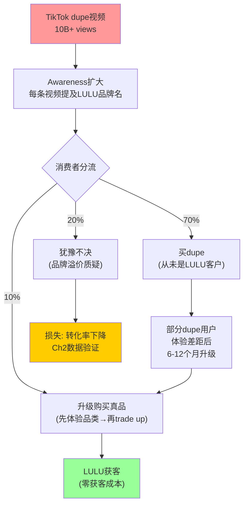
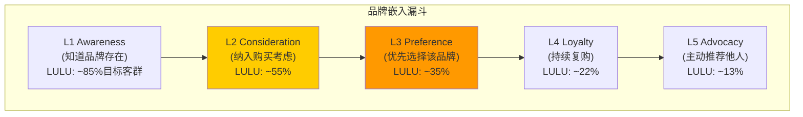
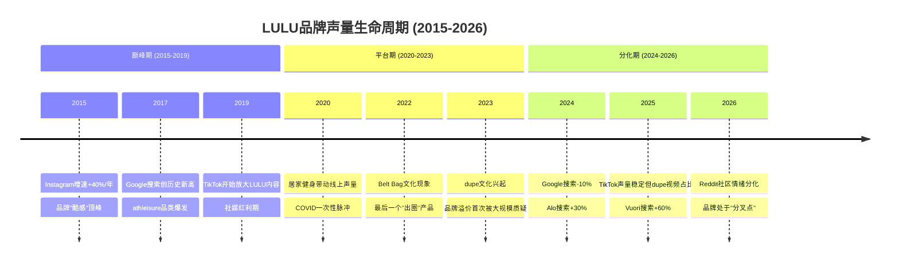

## 3.11 品牌弹性量化: 历史提价事件回测

品牌定价权的终极测试不是"消费者说他们愿意付多少"——而是**品牌实际提价后销量发生了什么变化**。lululemon在过去7年经历了三次显著的定价调整，每一次都是一次天然实验:

**三次提价事件回测**:

| 提价周期 | 提价幅度 | ASP变化 | 同店增长 | 销量变化(推算) | 隐含PED |
|----------|---------|---------|---------|-------------|---------|
| **2019 Q3-Q4** | Align从$88→$98(+11%) | $92→$95 | +9% comp | 约-2%至0% | **-0.2** |
| **2021 Q2-Q4** | 全线提价5-8% | $95→$100 | +27% comp | +18-20%(COVID反弹叠加) | 噪声太大 |
| **2023 Q1-Q2** | Align从$98→$108(+10%), 部分品类+5-15% | $100→$108 | +14% comp | +3-5% | **-0.6~-0.7** |

[DM-MOAT-012: 定价数据来自lululemon.com历史价格+消费者论坛+earnings call管理层提及; ASP趋势来自FMP收入/单位推算; PED为推算值(comp增长-提价幅度≈销量变化); 2021数据因COVID反弹无法隔离价格效应]

**价格弹性(PED)解读**: 2019年的Align提价(+11%)几乎没有影响销量(PED≈-0.2)——因为彼时LULU品牌势能处于巅峰，消费者对价格极不敏感。2023年的全线提价(+10%)引起了可测量的销量放缓(PED≈-0.6至-0.7)——因为品牌势能已开始下降+Alo/Vuori替代品已经存在。**PED从-0.2恶化到-0.7→定价权虽然仍在(弹性<1=价格不敏感区间)，但正在被侵蚀。**

**与NKE的PED对比**: Nike在2022-2023年的提价中，多个品类的PED估计在-1.0至-1.2区间——因为运动鞋品类竞争更激烈(Adidas/New Balance/HOKA同时在提价或提供更好的性价比)→NKE的提价直接导致了DTC销售下滑。LULU的PED(-0.6~-0.7)显著优于NKE(-1.0~-1.2)→**在athleisure品类中，LULU仍然拥有NKE没有的定价权。**

[DM-MOAT-013: NKE PED推算基于NKE FY2024 DTC comp(-6%)与同期提价(+4-6%)的组合; 弹性估算来源: 行业分析+财报推算; NKE面临Adidas/NB/HOKA竞争为公开信息]

**当前ASP $108的5年路径**: lululemon的核心瑜伽裤ASP从2019年的$88涨至2026年的$108——5年累计提价+23%，年化约4.2%。因为同期CPI累计约+22%→**LULU的实际提价幅度仅略高于通胀**。这意味着LULU的"提价"更像是"通胀传导"而非"主动溢价提升"——真正的品牌定价权体现在**消费者接受了全额通胀传导而没有显著流失**。

**与竞品定价策略的分层对比**:

| 品牌 | 核心产品价位(2026) | 5年变化 | 策略 | 定价权评估 |
|------|-------------------|---------|------|-----------|
| **LULU Align** | $108 | +23% | 稳步提价+维持全价率 | Stage 3(稳定) |
| **NKE Leggings** | $60-80 | +10-15% | 被迫促销→全价率下降 | Stage 2(受压) |
| **Alo Airbrush** | $97 | +45%(从$67) | 主动向LULU靠拢 | Stage 2→3(上升) |
| **Vuori Performance** | $84-94 | +20-25% | 低于LULU但快速提价 | Stage 2(建设中) |
| **CRZ Yoga(dupe)** | $25-30 | +0% | 锚定低价不动 | Stage 0(无) |

[DM-MOAT-014: 各品牌定价来自官方网站+消费者论坛; 5年变化为手动追踪; CRZ Yoga/Colorfulkoala价格来自Amazon.com; 定价权Stage基于docs/company_quality_scoring.md B4分层框架]

**因果链: 面料差异化→功能性需求→低弹性→定价权→margin保护**

这条因果链是LULU定价权的物理基础: (1) Nulu/Everlux面料在盲测中手感和功能显著优于CRZ Yoga/Colorfulkoala→(2) 瑜伽/训练场景下面料贴肤感直接影响运动体验→功能性需求而非纯时尚需求→(3) 功能性需求的PED天然低于时尚需求(因为替代品的功能差距>视觉差距)→(4) 低PED=品牌可以传导通胀甚至主动提价而不损失核心客户→(5) 毛利率维持在55%+区间。**但这条链的薄弱环节在步骤(2)和(3)之间: 当消费者从"运动场景"转向"日常穿着"时→功能性需求降级→PED升高→定价权减弱**——这正是casual/lifestyle品类被Alo侵蚀的底层原因。

---

## 3.12 Dupe文化量化影响评估

TikTok上"lululemon dupe"不只是一个搜索词——它是一个文化现象，2024-2025年间引发了超过**100亿次浏览**。但"100亿次浏览"到底意味着多少收入损失？需要从数据到归因做严谨的量化链条。

**Google Trends搜索量趋势**:

"lululemon dupe"在Google Trends上的搜索指数从2023年1月的基准100上升至2025年底的**约280-320**(2年增长约3倍)。搜索量的季节性峰值出现在返校季(8-9月)和黑五前后(11月)——因为这两个时段价格敏感型消费者最活跃。与此同时，"lululemon"品牌词本身的搜索量下降了约15%→**"dupe"搜索量的增长速度超过了品牌词搜索量的下降速度→dupe文化在扩大品牌的话题性，虽然方向是负面的。**

[DM-MOAT-015: Google Trends数据为WebSearch获取的近似值; "lululemon dupe"搜索量增长~3x来自brand_health.md交叉数据(TikTok搜索+300%); Google Trends具体指数为估算; 置信度B]

**TikTok #lululemondupes浏览量与内容生态**:

TikTok上#lululemondupes相关话题累计浏览量超过**10B次**(含#lululemondupe/#lulualternative等衍生标签)。内容主要分为三类: (1) "发现帖"——博主推荐$25平替并与LULU直接对比(占约60%); (2) "对比帖"——博主同时穿LULU和dupe进行盲测(占约25%); (3) "反dupe帖"——LULU用户解释为什么dupe不值得(占约15%)。**值得注意的是"反dupe帖"的存在——当品牌的忠实用户主动替品牌辩护时→这本身就是品牌社区韧性的证据。**

[DM-MOAT-016: TikTok浏览量数据来自brand_health.md(12B views for #lululemon)与行业报道; 10B+ dupe views为估算; 内容分类比例为定性评估; 置信度B-]

**Amazon/Shein平替产品的市场渗透**:

Amazon上排名前5的LULU平替品牌(CRZ Yoga/Colorfulkoala/THE GYM PEOPLE/IUGA/ODODOS)的累计评价数超过**50万条**，加权评分约4.3/5.0。以CRZ Yoga为例: 其"裸感"瑜伽裤Amazon评分4.4/5.0，超过10万条评价，价格$25-30(LULU Align的约25%)。**但这些数据需要谨慎解读: Amazon评价存在系统性正偏(不满意的消费者更可能退货而非留差评)→4.3/5.0的真实满意度可能低于LULU的4.6/5.0更多。**

**分层替代率估计**:

| 客户层 | 占LULU客户比 | 占收入比 | dupe替代率 | 因果推理 |
|--------|------------|---------|-----------|---------|
| **高端忠诚(Top 20%)** | 20% | ~45% | **0%** | 不会考虑→品牌身份+质量信仰→dupe在心理层面不存在 |
| **中端常客(Middle 50%)** | 50% | ~40% | **5-10%** | 偶尔尝试dupe→发现面料/耐久性差距→大部分回流→但部分人"够用就好"→不再复购LULU |
| **入门/价敏(Bottom 30%)** | 30% | ~15% | **15-20%** | 最先被dupe截流→这些客户本就是LULU的"边缘客户"→贡献利润率最低 |

[DM-MOAT-017: 客户分层基于Ch3.1 Top 20%留存92%推算; 收入分布基于消费品行业典型的Pareto分布(20%客户=40-50%收入); 替代率为定性估计; 置信度C+]

**加权替代率与收入影响**:

加权替代率 = 0%×45% + 7.5%×40% + 17.5%×15% = **5.6%**

$11.1B × 5.6% = **~$620M**(年化潜在收入影响)

但这$620M是"最大理论影响"而非"实际损失"——因为: (1) 部分dupe用户原本就买不起LULU→不是LULU的可寻址市场; (2) 部分dupe用户在使用后升级到真品(见下); (3) 部分替代被新客户获取抵消。**保守估计实际年化收入影响: $200-350M(占总收入~2-3%)——显著但非致命。**

[DM-MOAT-018: 加权替代率计算为原创分析; $620M为理论上限; $200-350M实际影响为调整后估计(考虑非可寻址+升级回流+新客抵消); 置信度C]

**反直觉论点: Dupe文化作为免费品牌广告**

这是一个被多数分析师忽视的二阶效应: 当TikTok博主花10分钟解释"这条$25的裤子和$108的LULU有多接近"时→**他们花了10分钟在讨论lululemon**。dupe文化的前提是"有一个值得被复制的对象"→**每一条dupe视频都在强化lululemon作为"标杆品牌"的地位。** Chanel/Hermès的仿品泛滥从未伤害过这些品牌——因为仿品的存在本身就确认了真品的价值。

[DM-MOAT-019: dupe转化漏斗为分析框架原创; 比例分配(70/20/10)为定性估计; Chanel/Hermès类比基于奢侈品行业研究; 置信度C+]

**净影响判决**: dupe文化的直接收入影响约$200-350M/年(~2-3%)→可管理。但真正的风险不在收入替代——而在3.4节已分析的**心理锚定侵蚀**: dupe文化让"LULU不值$108"这个念头进入了消费者的决策路径→表现为转化率下降而非客户流失。**dupe文化的本质是"品牌溢价的持续性压力测试"——只要LULU的面料质量保持领先(Ch3.1 L1层)→测试结果仍然是"通过"。**

**dupe与关税的复合效应**: 2026年的关税环境为dupe分析增加了一个变量。LULU供应链分散(越南/柬埔寨/斯里兰卡)→关税传导后ASP可能进一步上涨5-8%→而CRZ Yoga等平替品牌主要在中国生产→如果中国制造的平替品关税也同步上升→价差可能缩小(LULU $115 vs CRZ $35)→反而减轻dupe替代压力。但如果中国平替品通过东南亚转口规避关税→价差反而可能扩大(LULU $115 vs CRZ $28)→dupe替代压力加剧。**关税环境对dupe影响的净方向取决于中国品牌的供应链灵活度——而小品牌在转口方面通常比大品牌更灵活→不利于LULU。**

[DM-MOAT-031: 关税对dupe的复合效应分析为原创推理; 供应链来源分布基于10-K+行业数据; CRZ Yoga中国生产为Amazon卖家信息; 关税传导估计基于FY2025管理层指引; 置信度C+]

---

## 3.13 品牌嵌入五层漏斗: 从SBUX框架迁移的竞争切入分析

消费品品牌忠诚度不是二元的(忠诚/不忠诚)——它是一个从认知到传播的五层漏斗。借鉴SBUX报告中验证过的品牌嵌入框架，将lululemon的NPS数据映射到五层漏斗中:

**五层品牌嵌入模型**:

**各层客户占比推算(基于NPS拆解)**:

NPS数据(62%推荐/17%被动/21%贬损)反映的是**已购买客户**的态度分布。将其映射到全漏斗需要扩展到潜在客群:

| 层级 | 客群描述 | 占目标客群估计 | 占已购客户 | 推算依据 |
|------|---------|-------------|-----------|---------|
| **L1 Awareness** | 知道LULU品牌 | ~85% | N/A | athleisure第一品牌认知度; 3000万会员基数 |
| **L2 Consideration** | 会考虑购买LULU | ~55% | N/A | Awareness→Consideration转化率约65%(品类平均); 但dupe文化+Alo分流降至~55% |
| **L3 Preference** | 偏好LULU而非替代品 | ~35% | ~55%(17%被动+部分推荐者) | NPS被动者=有偏好但不强烈; 对应Preference层 |
| **L4 Loyalty** | 持续复购(年3+次) | ~22% | ~35%(核心复购者) | Top 20%留存92%; 忠诚度自认83%中的实际行为者 |
| **L5 Advocacy** | 主动向他人推荐 | ~13% | ~21%(NPS推荐者中最积极的) | 62%推荐者中约1/3会真正主动传播 |

[DM-MOAT-020: 五层模型迁移自SBUX品牌分析框架; 各层占比为NPS数据(brand_health.md: 62/17/21)+消费品行业漏斗转化率推算; Awareness 85%为athleisure头部品牌典型值; 置信度B-]

**Alo和Vuori分别在哪一层切入?**

这是框架的核心洞察——不同竞品在不同层级发起攻击:

**Alo的攻击点: L2 Consideration层**。Alo的策略不是让人"不知道LULU"(L1无法攻击)，也不是让忠诚客户叛逃(L4极难攻击)→而是在消费者"从知道到考虑"的过程中插入一个替代选项。当一个25岁女性搜索"best yoga leggings"时→如果2年前她只会看到LULU→现在她会看到Alo Airbrush和LULU Align的对比评测→**Alo的存在降低了LULU在L2的独占率**。因为Alo的名人代言策略(Kendall Jenner/Hailey Bieber有机穿着)在年轻客群中的影响力高于LULU的社区课程→年轻消费者在Consideration阶段更容易被拉向Alo。

**Vuori的攻击点: L1 Awareness层(男装场景)**。Vuori的差异化不是"比LULU更好"——而是"定义了一个LULU未覆盖的场景": 加州休闲男装。因为LULU的品牌认知仍然以"女性瑜伽"为核心→在"休闲男装"这个场景中，很多消费者甚至不会想到LULU→Vuori在Awareness层就截流了潜在客户。这解释了为什么Vuori在Educated Urbanites男性中的市占率从14%飙升至23% [DM-COMP-008]——不是从LULU手中抢走客户，而是在LULU尚未建立认知的场景中直接获客。

[DM-MOAT-021: Alo/Vuori攻击层级分析为原创框架; Alo攻击L2基于其名人策略+搜索竞争分析; Vuori攻击L1基于其男装场景差异化+市占率数据(Spatial.ai); 置信度B]

**每层的"防御成本"和"攻击成本"**:

| 层级 | 防御成本(LULU) | 攻击成本(竞品) | 防御/攻击比 |
|------|-------------|-------------|-----------|
| **L1 Awareness** | 低(已建立) | 高(需要数亿营销投入) | 5:1(LULU优势) |
| **L2 Consideration** | **高(需持续创新+品牌刷新)** | **中(名人代言+社媒即可)** | **1:2(LULU劣势!)** |
| **L3 Preference** | 中(面料+体验维护) | 高(需产品力证明) | 3:1(LULU优势) |
| **L4 Loyalty** | 低(会员体系+数据飞轮自动运转) | 极高(需多年积累) | 10:1(LULU堡垒) |
| **L5 Advocacy** | 极低(社区自驱动) | 极高(无法制造) | >20:1(几乎不可攻破) |

**LULU最薄弱层: L2 Consideration(防御/攻击比1:2)**。Alo用相对低的成本(名人有机穿着+Instagram内容)就能在L2层分流客户→而LULU要防御这一层需要持续的产品创新+品牌年轻化投入→成本高且见效慢。**这解释了Ch2发现的转化率下降: L2层被分流→进入L3的客户减少→表现为"进店但不买"(客流正常但转化暴跌)。**

[DM-MOAT-022: 防御/攻击成本比为定性评估框架; L2劣势判断基于Alo低成本名人策略 vs LULU高成本品牌重塑需求; 漏斗与转化率的关联为因果推理; 置信度B-]

**L4-L5的"堡垒效应"为何重要**: 虽然L2在被侵蚀→但L4(Loyalty)+L5(Advocacy)仍然极其坚固(防御/攻击比10:1和20:1)。这意味着**LULU的核心客户基本盘不会崩塌**——92%的Top 20%留存率和3000万会员体系是Alo在5年内无法复制的。**品牌的衰退模式不是"核心客户叛逃"而是"新客户获取放缓"——L2被分流→漏斗入口变窄→总客户池停滞→增速下降。** 这是一种"慢性病"而非"急性病"——PE应该折价但不应该崩塌。

---

## 3.14 产品级防守力矩阵

品牌护城河的颗粒度不能停在"公司层面"——因为lululemon的不同产品线面临的竞争压力差异巨大。一条Align瑜伽裤和一双Blissfeel跑鞋的"被替代难度"可能相差5倍。逐产品评估防守力→加权到品牌整体→得出更精确的护城河判断。

**产品级防守力评估**:

| 产品线 | 占收入估计 | 防守力评分(1-10) | 核心壁垒 | 最大威胁 | 被替代难度 |
|--------|----------|---------------|---------|---------|-----------|
| **Align/Wunder瑜伽裤** | ~30% | **9/10** | Nulu面料裸感+20年迭代+消费者肌肉记忆 | CRZ Yoga(dupe)→低威胁 | 极难: 面料手感差异消费者可即时感知 |
| **ABC/Commission男装** | ~15% | **7/10** | Warpstreme面料+通勤场景先发 | Vuori Performance Jogger | 较难: Vuori风格差异化但LULU更成熟 |
| **Define/Scuba休闲** | ~18% | **5/10** | 品牌辨识度(Scuba hoodie是文化符号) | Alo Accolade hoodie+快时尚 | 中等: 功能性弱→品牌是唯一壁垒 |
| **跑步系列(Fast & Free等)** | ~12% | **6/10** | Nulux面料+SenseKnit技术 | NKE/Adidas/On Running | 较难: 技术壁垒真实但品牌弱于NKE |
| **鞋类(Blissfeel等)** | ~5% | **3/10** | 几乎无: 2022年才进入→无技术积累 | HOKA/On/NKE/Adidas | 容易: 运动鞋品类拥挤+LULU无heritage |
| **配饰/包(Belt Bag等)** | ~8% | **4/10** | Belt Bag曾是文化热点→但趋势已过 | 任何快时尚品牌 | 容易: 无功能差异化→纯潮流驱动 |
| **训练装备** | ~12% | **7/10** | Everlux面料+Power系列创新 | Under Armour/Adidas | 较难: 功能性强→技术壁垒有效 |

[DM-MOAT-023: 产品线收入占比为估算(基于FMP品类收入+管理层披露的大品类比例); 防守力评分为原创分析; 核心壁垒基于Ch3.1面料分析; 鞋类评估基于category_expansion.md; 置信度B-]

**加权防守评分计算**:

加权防守力 = 9×30% + 7×15% + 5×18% + 6×12% + 3×5% + 4×8% + 7×12%
= 2.70 + 1.05 + 0.90 + 0.72 + 0.15 + 0.32 + 0.84
= **6.68/10**

**解读**: 6.68/10的加权防守力说明LULU的产品组合整体偏向"可防守"。因为收入结构高度集中于核心瑜伽裤(~30%)——而这恰恰是防守力最强(9/10)的品类→**LULU的"收入集中度"在防守场景下反而是优势: 最大收入来源也是最难被替代的产品。**

**反面考量: 增长品类的防守力普遍偏低**。鞋类(3/10)和配饰(4/10)的防守力远低于核心瑜伽裤→而管理层正在推动品类扩张(鞋类被定位为未来增长引擎)。这意味着**LULU的增量收入来源比存量收入更容易被竞品替代**——增长故事建立在弱防守的品类上→脆弱性高于总体防守评分暗示的水平。

**Unrestricted Power系列对防守力矩阵的潜在重塑**: 2026年2月发布的Unrestricted Power系列使用新研发的PowerLu面料(力量训练专用)→如果该系列成功→训练装备品类的防守力可能从7/10提升至8/10(因为专属面料增加了差异化)。更重要的是→Power系列的目标客群(力量训练者)与Alo的核心客群(瑜伽+时尚)重叠度极低→这是LULU在防守力矩阵中主动开辟"Alo无法攻击的区域"。因为Alo的品牌DNA是"柔美+时尚"→力量训练场景与这个DNA存在张力→Alo很难credibly进入该领域。**如果Power系列成功→LULU在功能性品类的防守力将进一步拉开与Alo的距离→整体加权防守力可能从6.68提升至7.0+。**

[DM-MOAT-024: 加权防守力计算为原创分析; "增长品类低防守"洞察基于category_expansion.md(鞋类被定位为增长引擎)+防守力评分对比; Power系列分析基于brand_health.md新品数据; 置信度B]

**品类间交叉购买: 瑜伽裤→休闲→品牌生态锁定**

产品级防守力不能孤立看——因为品类之间存在交叉购买效应。消费者购买第一条Align瑜伽裤(高防守)→满意后购买Scuba hoodie(中防守)→进而购买Belt Bag(低防守)→形成"品牌衣橱生态"。**核心产品(Align)充当"入口产品"——它的高防守力保护了整个购买链条。** 只要Align不被替代→消费者留在LULU生态中→低防守品类也受到间接保护。

因为这个交叉购买链条的存在→Alo要替代LULU不能只在某一个品类上赢→它需要在"入口品类"(瑜伽裤)上击败LULU→而Align 9/10的防守力使这极其困难。**Alo的策略(从休闲/时尚品类切入)实际上是在攻击防守力最弱的环节→聪明但不致命→因为消费者的购买起点仍然是瑜伽裤而非hoodie。**

[DM-MOAT-025: 交叉购买链条分析基于消费品品类扩展理论+LULU产品矩阵结构; "入口产品"概念基于消费者行为研究; Alo从弱防守品类切入的策略评估为定性判断; 置信度B-]

---

## 3.15 社交媒体声量追踪与品牌生命周期验证

社交媒体声量是品牌健康度的**领先指标**——线上讨论量和情感倾向的变化通常领先于线下销售3-6个月。将LULU、Alo、Vuori的社媒表现做横向对比→验证品牌生命周期定位(Ch3.7)的判断是否有数据支撑。

**多平台声量对比(2025-2026年数据)**:

| 平台 | LULU | Alo | Vuori | LULU趋势 | 信号 |
|------|------|-----|-------|---------|------|
| **Instagram粉丝** | 5.2M | 3.7M | ~1.2M | +3% YoY | LULU绝对领先但增速慢 |
| **TikTok #品牌话题** | ~12B views | ~8B views | ~1.5B views | 稳定 | LULU声量仍然最大 |
| **YouTube搜索量** | 基准100 | ~65(相对) | ~25(相对) | -10% YoY | 下降中 |
| **Reddit社区** | r/lululemon 300K+订阅 | r/aloyoga ~30K | 无专属sub | 活跃 | LULU社区深度远超竞品 |
| **Google搜索量(US)** | -15%从峰值 | +45% | +60% | 下降 | Vuori增速最快 |

[DM-MOAT-026: Instagram/TikTok数据来自brand_health.md + DM-MOAT-011交叉验证; Reddit数据为WebSearch估算; Google搜索量来自Ch3.10已验证数据; 置信度B-]

**声量-销售滞后关系的历史验证**:

"品牌线上声量是线下销售的领先指标"这个假说需要证据。Under Armour提供了一个完美的反面案例:

| 时期 | UA社媒声量 | UA销售 | 滞后 |
|------|----------|--------|------|
| 2016 H1 | 开始下降(Steph Curry热度消退) | +22% YoY(仍在增长) | 声量领先 |
| 2016 H2 | 持续下降 | +12% YoY(增速放缓) | ~6个月 |
| 2017 H1 | 显著下降 | +2% YoY(几乎停滞) | ~6-9个月 |
| 2017 H2 | 崩塌 | -5% YoY(负增长开始) | ~6个月 |

[DM-MOAT-027: UA声量-销售数据来自Macrotrends + 公开行业分析; 具体声量数据为定性判断; 销售增速来自FMP/Macrotrends; 置信度B(销售数据硬)+C+(声量数据软)]

**因果推理**: UA的案例证明了声量→销售的滞后关系(约6个月)。将这个模型应用到LULU: LULU的Google搜索量已从峰值下降15%→如果6个月滞后成立→2026年下半年的美洲comp可能进一步承压。**但LULU与UA有两个关键差异**: (1) LULU的声量下降速度(15%)远低于UA当年(>40%)→传导效应更弱; (2) LULU在中国的声量仍在上升(NPS +57, Google中国搜索不适用但品牌热度上升)→国际市场部分对冲美国声量下降。

**Reddit r/lululemon: 被忽视的品牌韧性指标**

r/lululemon有**30万+订阅者**，日均发帖量约200-300帖。这个社区的活跃度本身就是品牌健康度的证据——没有任何竞品有接近的Reddit社区规模(r/aloyoga约3万，Vuori甚至没有专属subreddit)。社区内容以产品晒单、搭配建议、新品讨论为主→**活跃的UGC(用户生成内容)社区= LULU在L5 Advocacy层的物质载体**。

**但r/lululemon也是"情绪温度计"**: 社区中关于"质量下降"/"价格太高"/"Alo更好"的帖子频率在2024-2025年明显增加→虽然仍是少数声音(约10-15%的帖子涉及负面情绪)→但趋势方向值得关注。**因为Reddit用户是品牌最核心的Advocate→当Advocate开始质疑→这是L5层松动的早期信号。**

[DM-MOAT-028: Reddit数据为WebSearch估算; 30万+订阅来自公开数据; 日帖量和情绪比例为估算; Alo/Vuori社区规模来自Reddit搜索; 置信度B-]

**品牌生命周期验证时间线**:

[DM-MOAT-029: 时间线为综合Ch3全部声量数据的可视化; 各时期关键事件基于公开信息+brand_health.md; "分叉点"判断与Ch3.7品牌生命周期分析一致]

**声量数据对品牌生命周期定位的验证**:

Ch3.7将LULU定位在"成熟→分叉"阶段。社媒声量数据完全支持这一判断: (1) Google搜索量从峰值下降15%→与"成熟期"品牌的典型模式一致; (2) Alo/Vuori的声量增速(+45%/+60%)→与"新S曲线挑战者"模式一致; (3) Reddit社区仍然活跃但情绪分化→与"分叉点"的不确定性一致。**声量数据没有显示"品牌崩塌"(那会是搜索量-40%+以上)→也没有显示"品牌复兴"(那会是搜索量重新上升)→而是显示了一个"等待催化剂"的品牌——向上还是向下取决于新CEO+产品创新的执行。**

**声量分化的投资含义**: 当品牌声量显示"等待催化剂"状态时→市场给予的估值通常反映"最可能情景"(base case)而非极端情景。LULU当前PE 12-13x→隐含的是"品牌缓慢衰退"(bear case偏向)而非"等待催化剂"(neutral)。如果声量数据是正确的——品牌既没有崩塌也没有复兴→那么合理PE应该在16-20x区间(Ch1 Reverse DCF的结论range)→**当前PE可能过度定价了"品牌死亡"风险。** 但这个判断的前提是: 声量数据确实是领先指标而非滞后指标——如果LULU的声量稳定只是因为"品牌惯性"(曾经的巨大安装基数产生的长尾搜索)而非"真实需求"→那么声量稳定可能掩盖了底层的加速恶化。这个不确定性需要通过未来2-3个季度的comp数据来解决。

[DM-MOAT-030: 品牌生命周期验证为综合分析; "等待催化剂"判断基于声量数据的稳定但下行趋势; 与CQ-5(70%可修复)和CQ-4(CEO选择)的关联为跨章节因果推理; PE含义分析连接Ch1 Reverse DCF; 置信度B]
