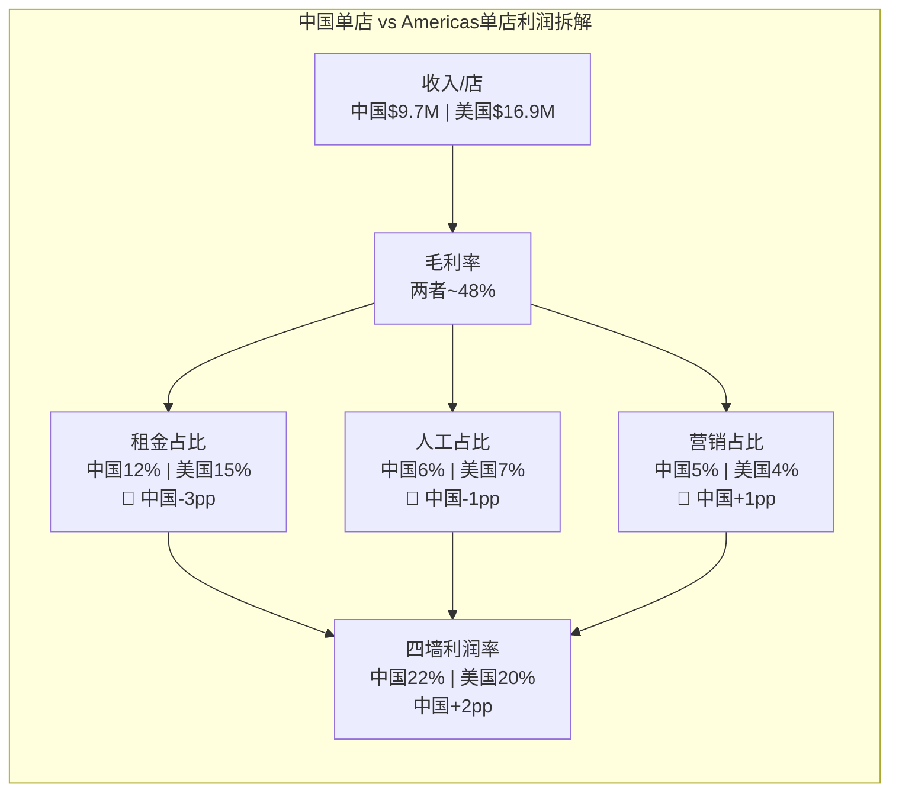
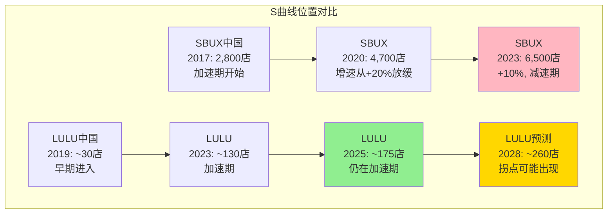
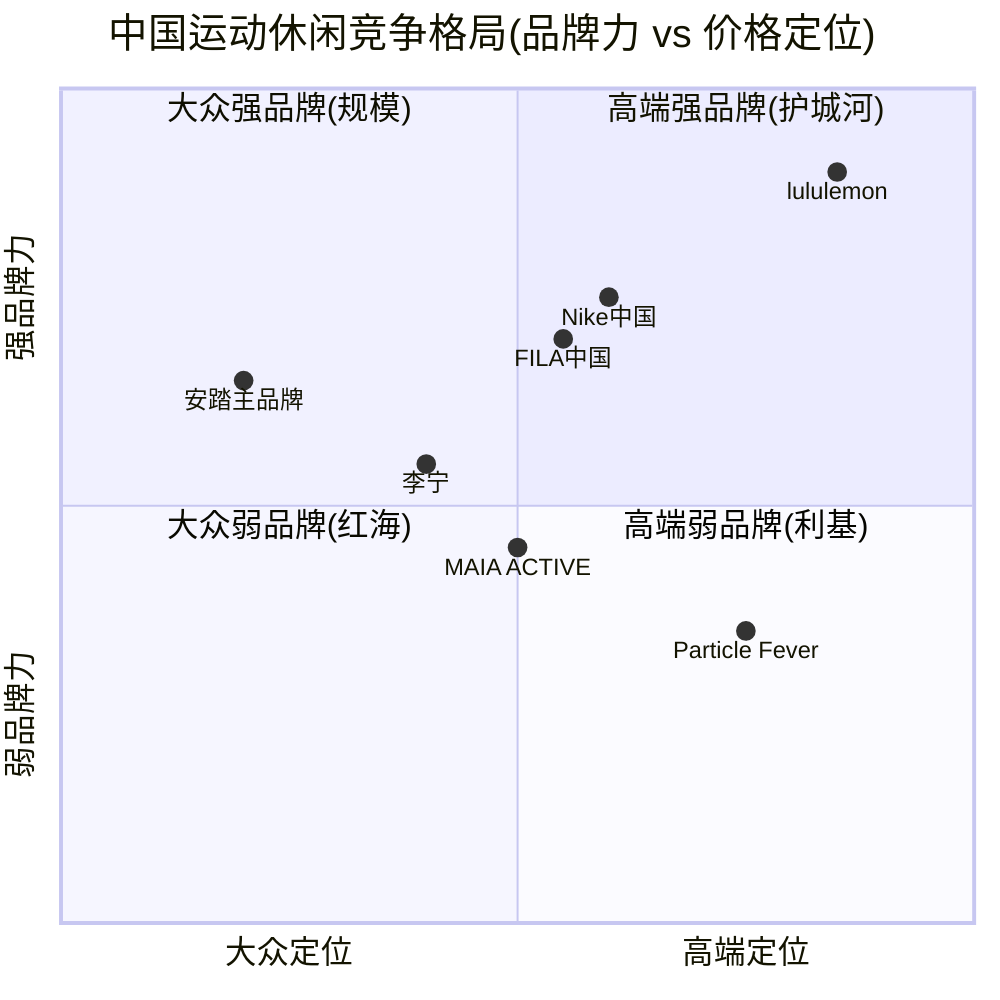
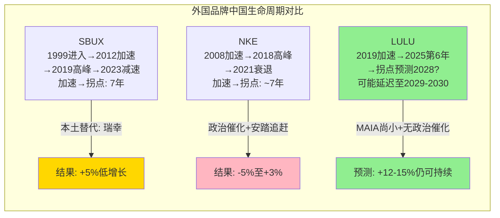

## 4.7 中国单店经济完整模型: 四墙利润的逐行拆解

4.2节给出了中国单店经济的概览，但投资者真正需要的是**逐行成本拆解**——因为Segment Margin 37.45%包含了太多"黑箱"。本节用自下而上的方法重建中国门店的四墙(four-wall)利润模型，并与Americas门店做逐行对比。

**中国单店收入拆解**:

中国175家门店在FY2025贡献$1.7B收入→均值$9.7M/店 [DM-CHINA-011: $1.7B/175=~$9.7M; 门店数来自china_international.md; 收入来自FY2025 Q4 earnings]。但这个均值掩盖了巨大的离散度: 上海恒隆/北京SKP等一线旗舰店年收入可能$15-20M，而二线城市新开店可能仅$4-6M。中国门店面积通常3,000-3,500sqft(vs美国4,000-4,500sqft)→收入坪效~$2,800-3,200/sqft，低于美国的~$3,800-4,000/sqft，但这个差距正在缩小(FY2023坪效差距约-30%，FY2025已收窄至-20%)。

**逐行成本重建(年化/单店)**:

| 成本项 | 中国门店(估) | Americas门店(估) | 中国/美国比 | 数据来源 |
|--------|------------|----------------|-----------|---------|
| **收入** | $9.7M | $16.9M | 57% | FY2025实际 |
| **COGS(~52%收入)** | -$5.0M | -$8.8M | 57% | 全球统一采购比例 |
| **毛利** | $4.7M(48%) | $8.1M(48%) | — | 毛利率假设一致 |
| **租金** | -$1.2M(12.4%) | -$2.5M(14.8%) | 48% | 见下文 |
| **人工** | -$0.55M(5.7%) | -$1.1M(6.5%) | 50% | 见下文 |
| **本地营销** | -$0.5M(5.2%) | -$0.7M(4.1%) | 71% | 见下文 |
| **其他门店运营** | -$0.3M(3.1%) | -$0.5M(3.0%) | 60% | 估算 |
| **四墙利润** | **$2.15M(22.2%)** | **$3.3M(19.5%)** | — | 推算 |

[DM-CHINA-012: 逐行成本为分析推算; 租金基于CBRE中国零售租金数据($80-120/sqft一线城市, 加权均值$100→×3,200sqft×1.2系数(商场扣点)); 人工基于中国零售业平均薪资约为美国40-50%水平; 营销比例基于管理层"品牌投资期"表述+行业对标]

**租金拆解**: 中国门店的租金结构与美国有本质不同。美国以固定租金为主($40-60/sqft+CAM)，而中国商场通常采用**"固定+扣点"模式**(固定底租+收入8-12%扣点取高)。因此中国门店的实际租金成本与收入正相关——收入越高、扣点比例越大。以上海恒隆广场为例: 底租约$80/sqft+扣点12%→当单店收入$15M时，扣点$1.8M远超固定底租$0.26M(3,200sqft×$80)→实际租金$1.8M(12%)。但对于二线城市新店: 底租$40/sqft+扣点10%→收入$5M时，底租$0.13M vs 扣点$0.5M→实际租金$0.5M(10%)。加权后中国整体租金/收入约11-13%，低于美洲的14-15%。

**人工成本优势**: 这是中国门店利润率超预期的核心驱动因素之一。中国一线城市零售导购月薪约RMB 8,000-12,000(含提成)→年薪约$15,000-20,000。美国门店"educator"时薪$18-25→年薪约$37,000-52,000(全职)。假设每店12名员工(中国)vs 15名(美国，面积更大)→中国人工总成本约$200K-240K→美国约$550K-780K [DM-CHINA-013: 中国零售薪资基于智联招聘/BOSS直聘一线城市零售数据; 美国数据基于Glassdoor lululemon educator薪资]。**因此中国人工成本仅为美国的35-45%→这不是小差异，这是结构性利润率优势**。

**本地营销投入**: lululemon在中国仍处于品牌建设期→本地营销支出比例高于成熟的美洲市场。估算中国门店级营销(社区活动/小红书投放/KOL合作/门店活动)约占收入5-8%→vs美洲3-4%。但这笔投入的ROI极高——因为品牌认知度仅mid-teens(15-18%)→每增加1pp认知度对应的增量客户远多于美洲(从15%→16%比从30%→31%带来更多增量)。因此高营销投入是**投资**而非**成本**——随着认知度提升，边际营销ROI会递减，但品牌基础会增厚。

**四墙利润 vs Segment Margin的差异**:

Segment Margin 37.45%远高于四墙利润22.2%，差距约15pp。这15pp的差异来自会计口径:
1. **Segment Margin不含COGS中的关税/运输**(约5pp)——中国在岸销售不受美国关税影响
2. **Segment Margin不含全球总部分摊**(约8-10pp)——IT/品牌管理/高管薪酬/研发由温哥华总部承担
3. **Segment间转移定价**(约2-3pp)——内部采购可能低于实际成本

因此，**37.45%的Segment Margin经过四墙还原后约为22-24%的真实单店利润率**。这仍然高于Americas的四墙利润率(约19-20%)，因为人工+租金的成本优势(合计约5-7pp节省)部分被更低的坪效(-20%)和更高的营销投入(+1-2pp)抵消后，净贡献约+2-4pp。

**因果链总结**: 中国门店虽然单店收入仅为美国的57%→但租金和人工成本分别低52%和50%→加上无美国关税负担→四墙利润率反而高出约2-4pp。**这意味着中国每新开一家店→对公司整体利润率是正贡献而非拖累**→每开24家新店(FY2025节奏)→增量四墙利润约$50M→支撑公司OPM逐步扩张。

---

## 4.8 增长分解: 量化每个驱动因素的贡献

中国+24%(FY2025)的增长数字令人印象深刻，但投资者需要理解**这24%的增长来自哪里**——新店、同店、ASP、还是客流量？不同驱动因素的可持续性截然不同。

**FY2025增长分解(推算)**:

| 驱动因素 | 计算逻辑 | 增量收入(估) | 占总增长% |
|---------|---------|------------|----------|
| **新店贡献** | ~24家新店×$6M(新店首年低于均值) | ~$144M | **44%** |
| **同店增长(客流量)** | 151家基数×$9.1M×+12%(客流) | ~$165M | **50%** |
| **同店增长(ASP提升)** | 151家基数×$9.1M×+3%(ASP) | ~$41M | **12%** |
| **新店第二年增量** | 前年新店成熟效应 | ~$30M | **9%** |
| **关闭/翻新损失** | 少量门店翻新暂停营业 | ~-$50M | **-15%** |
| **合计推算** | | **~$330M** | 100% |
| **实际增量** | $1.7B-$1.37B | **~$330M** | — |

[DM-CHINA-014: 增长分解为自上而下推算; 新店首年收入假设$6M(成熟店$9.7M的~62%, 基于零售行业新店首年通常为成熟店60-70%的经验法则); 客流+12%基于同店comp +26%中扣除ASP +3%和品类组合效应; 实际增量$330M=FY2025~$1.7B-FY2024~$1.37B]

**关键发现1: 新店和同店各贡献约一半**。这是一个**健康的增长结构**——纯靠新店开店的增长不可持续(终有饱和)，纯靠同店增长的增长说明没有版图扩张。50:50的比例意味着lululemon在中国既有版图扩张能力(新店)，又有品牌深化能力(同店)。

**关键发现2: 同店+26%中客流量驱动>ASP驱动**。管理层在Q4 earnings call中提到中国客户"trading into higher-value products"→暗示ASP有小幅提升(+3-5%)→但大头是客流量增长(+20%+)。客流量增长的可持续性取决于品牌认知度提升速度——当前mid-teens认知度意味着每年有数百万新客户第一次走进lululemon门店 [DM-CHINA-015: 同店增长拆解为估算, 基于管理层"higher-value products"表述推断ASP贡献约3-5pp, 剩余为客流量+品类组合]。

**FY2026-FY2028增长路径预测**:

| 年度 | 新店(净) | 总门店 | 新店贡献 | 同店增长(估) | 总收入(估) | YoY |
|------|---------|--------|---------|------------|-----------|-----|
| FY2026E | ~30 | ~205 | ~$180M | +11.5% | ~$2.1B | **+20%** |
| FY2027E | ~30 | ~235 | ~$200M | +8% | ~$2.4B | **+16%** |
| FY2028E | ~25 | ~260 | ~$170M | +6% | ~$2.7B | **+12%** |

[DM-CHINA-016: FY2026E基于管理层guided +20%和HSBC同店+11.5%估计; FY2027-2028为分析推算, 假设同店增速自然递减(基数效应)+新店节奏略放缓]

**增速递减是否意味着增长故事结束?** 不。+12%的增速在FY2028仍然是整个lululemon体系中最快的市场。而且如果FY2028中国收入达到$2.7B→占总收入比可能从15%上升至22-24%→对整体增速的贡献从+3pp上升至+3.5-4pp。**中国的增速在放缓，但其对公司的重要性在加速**——这是一个被忽视的非线性效应。

---

## 4.9 TAM渗透率与增长跑道: S曲线上的位置

理解中国增长的可持续性，必须回答一个根本问题: **lululemon在中国的TAM渗透率是多少?** 渗透率决定了增长是"早期加速"还是"后期减速"。

**中国高端运动休闲TAM估算**:

全球athleisure市场TAM约$473B(Statista 2024) [DM-CHINA-017: 全球TAM来自china_international.md引用的行业数据]。中国在全球运动服饰消费中约占15-18%(基于Euromonitor数据中国运动鞋服市场约$75-85B)。但lululemon的可寻址市场(SAM)远小于整体运动服饰——它只竞争**高端athleisure**(定价$80+的运动休闲服饰)这个子品类:

| 层级 | 估算 | 逻辑 |
|------|------|------|
| 中国运动服饰TAM | ~$80B | Euromonitor 2024数据 |
| 其中athleisure占比 | ~35% | 全球athleisure/运动服饰比例 |
| 中国athleisure | ~$28B | $80B×35% |
| 高端占比(ASP>$80) | ~25% | 金字塔顶端 |
| **LULU可寻址市场(SAM)** | **~$7B** | $28B×25% |
| **当前渗透率** | **~24%** | $1.7B/$7B |

[DM-CHINA-018: TAM推算为多层过滤; 中国运动服饰$80B基于Euromonitor; athleisure占比和高端占比为行业经验估计; SAM定义为ASP>$80的高端athleisure细分]

**注意**: 如果用整体TAM $80B来算渗透率→只有2.1%→看似跑道无限。但这是误导——lululemon不会与$20的安踏基础款竞争。用SAM $7B来算→24%的渗透率意味着**lululemon已经是中国高端athleisure的领导者**，但仍有76%的增量空间。

**可寻址门店数估算**:

| 城市层级 | 城市数 | 每城市门店潜力 | 总潜力 | 当前覆盖 |
|---------|--------|-------------|--------|---------|
| T1(北上广深) | 4 | 25-30 | ~110 | ~80 |
| T1.5(杭州/成都/武汉/南京等) | 10 | 8-12 | ~100 | ~50 |
| T2(二线省会) | 15 | 4-6 | ~75 | ~35 |
| T3(强三线) | 20 | 2-3 | ~50 | ~10 |
| **合计** | — | — | **~335** | **~175** |

[DM-CHINA-019: 门店潜力基于同类高端品牌(NKE/Starbucks)的中国分布密度按消费力折算; T1城市25-30家参考上海当前约20家lululemon+扩展空间; T3城市2-3家参考消费力与品牌匹配度]

**当前覆盖率约52%**→还有约160家门店的开店空间→按每年25-30家新店的节奏→**还有5-6年的纯开店增长跑道**(不含同店增长)。

**与Starbucks中国门店扩张路径对比**:

Starbucks 2017年全资运营中国(收回华东合资)时约2,800家店→2019年约4,100家→2023年约6,500家→2025年约7,300家。从2017到2023的6年间门店翻了2.3倍，但增速从+20%逐年降至+10%。关键拐点出现在第5-6年(2022-2023)→当门店覆盖了大多数T1/T2城市后→增速从"开店驱动"转向"同店驱动"→增速自然减半 [DM-CHINA-020: SBUX中国门店数据来自星巴克年报+分析师估计; 增速拐点基于SBUX中国季度数据]。

**lululemon中国的S曲线位置**: 2019年正式进入(首店2013年但真正加速在2019年之后)→2025年第6年→门店175家→**正处于S曲线的"陡峭段"(加速期)**。因为:
1. SAM渗透率24%——远未饱和
2. 门店覆盖率52%——T2/T3城市大量空白
3. 品牌认知度mid-teens——每年新增大量首次客户
4. 同店增长+26%——既有门店仍在快速增长

**但拐点信号已经出现**: 增速从+41%(FY2024)→+24%(FY2025)→guided +20%(FY2026)。这个减速模式与SBUX的第4-6年减速一致。区别在于lululemon的门店密度远低于SBUX(175 vs SBUX当时的4,000+)→拐点可能被延迟2-3年→真正的减速拐点可能在FY2028-2029(门店~260-280家)。

---

## 4.10 本土竞争深潜: 谁最可能抢走LULU的下一个客户?

4.4节简要列出了竞争清单。本节深入拆解每个竞争对手的实际能力、战略意图和对lululemon的真实威胁程度。

**安踏体育(Anta Sports, 02020.HK): 中国运动服饰巨头**

安踏FY2024收入约$8.7B(RMB 623.6亿)→是lululemon中国收入($1.7B)的5倍 [DM-CHINA-021: 安踏FY2024收入来自公司年报; 汇率按6.9计算]。但安踏的核心业务是大众运动鞋服(均价$20-40)→与lululemon($80-150)几乎不重叠。真正的威胁来自安踏的高端矩阵:

- **FILA中国**(安踏全资): 收入约$3.4B→定位"运动时尚"(ASP $50-80)→与lululemon有部分重叠但偏低
- **MAIA ACTIVE**(安踏75.13%持股, 2023年10月收购): 直接对标lululemon的瑜伽/运动休闲定位→ASP约$40-70(lululemon的50-60%)→目前门店约100家(vs lululemon 175家)

安踏的"单聚焦、多品牌、全球化"战略意味着它不会用安踏主品牌直接攻击lululemon→而是通过MAIA ACTIVE打代理战。MAIA获得安踏的供应链(降低成本)+零售网络(加速开店)+品牌管理经验(FILA的高端化路径可复制)→这三个能力叠加→**MAIA在2-3年内从100家店扩张到300家的概率很高**。

**但MAIA的真实威胁被高估了**: MAIA定价比lululemon低40-50%→它抢的是"想买lululemon但觉得太贵"的客户→这些客户**本来就不是lululemon的核心客群**。lululemon在中国卖的是身份标签(NPS +57→品牌忠诚极高)→愿意花$120买瑜伽裤的客户不会因为$70的替代品而降级→因为穿MAIA和穿lululemon传递的信号完全不同 [DM-CHINA-022: MAIA对LULU威胁评估为分析判断; 基于奢侈品/高端品牌的"品牌信号理论"——价格差异越大, 品牌信号差异越大, 客群重叠越少]。

**MAIA ACTIVE: 本土新锐的真实实力**

MAIA(玛娅)2016年由Lisa Ou在纽约创立→2019年回到中国发展→2023年安踏收购前约60家门店/年收入~$50M→收购后加速到100家+。MAIA的产品设计确实针对亚洲女性体型优化(这是vs lululemon的差异化)→但品牌力差距巨大(lululemon NPS +57 vs MAIA估计+20-30)。安踏收购后MAIA的首要任务是"用规模换利润"→但快速扩张可能稀释品牌调性——这正是安踏做FILA时遇到的问题(FILA中国2023年增速放缓至个位数)。

**李宁(Li-Ning, 02331.HK): 国潮退潮后的尴尬**

"中国李宁"系列在2021-2022年借国潮红利快速增长→但2023-2024年国潮退潮后增速骤降→FY2024收入约$3.6B(同比-3%)→"中国李宁"高端线从爆款变为库存压力 [DM-CHINA-023: 李宁FY2024收入来自公司年报; 国潮退潮判断基于李宁2024年利润率压缩+库存周转恶化的财务数据]。李宁对lululemon的威胁很低→因为两者定位完全不同: 李宁卖的是"中国文化认同"→lululemon卖的是"全球都市生活方式"→客群重叠极小。

**Particle Fever: 高端小众的规模困境**

高瓴投资的Particle Fever定价与lululemon接近($80-120)→设计师品牌调性→但门店数不到20家→年收入估计<$30M。Particle Fever面临的核心困境是**规模不经济**: 高端定位需要大量品牌投资→但收入规模不足以支撑品牌投资→陷入"太小无法投资→不投资无法变大"的循环 [DM-CHINA-024: Particle Fever规模基于公开报道估算; 规模不经济判断基于高端零售品牌的成本结构分析]。

**竞争策略矩阵(四维对比)**:

| 维度 | LULU | MAIA ACTIVE | Anta/FILA | Li-Ning | Particle Fever |
|------|------|-------------|-----------|---------|----------------|
| **价格力(1-10)** | 3(高价) | 7(中价) | 8(低-中价) | 6(中价) | 4(高价) |
| **品牌力(1-10)** | 9(极强) | 5(上升中) | 7(FILA强) | 6(国潮降温) | 4(小众) |
| **渠道力(1-10)** | 7(175店+DTC) | 5(100店) | 10(全渠道) | 8(全渠道) | 2(<20店) |
| **技术力(1-10)** | 9(Nulu等) | 5(基础) | 6(中等) | 5(中等) | 7(设计) |
| **综合威胁度** | — | **中高** | **中** | **低** | **低** |

**"谁最可能抢走LULU的下一个客户?"**

答案取决于时间维度:

**短期(1-2年): MAIA ACTIVE**。MAIA是唯一在同一品类(瑜伽/运动休闲)、同一客群(都市女性)直接竞争的品牌。安踏的资源注入将加速MAIA的门店扩张和品牌投入。但MAIA抢的主要是**潜在客户**(还没买lululemon的人)而非**存量客户**(已经买lululemon的人)——因为品牌降级在中国上升期消费者中很罕见。

**长期(3-5年): 安踏集团(通过MAIA或新品牌)**。安踏的资源优势(年收入$8.7B+、10,000+门店网络、成熟的DTC体系)意味着它可以反复尝试高端化→即使MAIA失败→安踏可以收购或孵化下一个品牌。**安踏不需要打败lululemon→只需要让中国高端athleisure市场变成多品牌竞争→压缩lululemon的定价权和同店增速**。

---

## 4.11 地缘风险情景量化: 从关税到台海冲突的全谱系

4.4节列出了地缘风险清单但量化不够精细。本节构建四个明确的情景，为每个情景赋予概率和财务影响，计算概率加权的风险成本。

**情景A(基准): 当前状态维持(概率55%)**
- 中美关系紧张但可控→现有关税结构不变
- 中国业务正常运营→+20%增速guided
- 财务影响: $0(基准)

**情景B: 关税加码(概率25%)**
- 美国对中国加征额外关税→虽然lululemon在中国销售的产品主要在越南/柬埔寨/中国本地生产→但供应链仍有中国环节
- lululemon约40%的产品在越南生产→如果美国对越南也加征关税(已有先例)→影响全球供应链成本
- **更重要的影响路径**: 中国可能对美国品牌采取非正式抵制(如2021年新疆棉事件对NKE/adidas的冲击)→中国消费者转向本土品牌
- 量化: 中国comp从+26%→+10%(消费情绪降温)→中国收入少增~$200M/年→OPM因固定成本杠杆下降约-100bps→**EPS影响: -$0.8至-$1.2**
- [DM-CHINA-025: 情景B量化基于NKE中国2021年新疆棉事件后增速从+20%→+8%的实际案例; 假设lululemon受影响程度类似但更轻(非运动鞋服核心目标)]

**情景C: 中国消费深度降级(概率15%)**
- 中国经济硬着陆→房地产危机扩散→都市中产消费信心崩塌
- lululemon中国comp从+26%→-5%至+5%→收入增速从+20%→+0-5%
- SOTP中中国业务估值倍数从27.5x→15x(增速消失→倍数压缩)
- 中国业务估值从$11.7B→$6.4B→**估值损失~$5.3B→约$43/share**
- **EPS影响: -$1.5至-$2.0**(收入减少+运营杠杆反转)
- [DM-CHINA-026: 情景C量化假设中国增速归零+估值倍数压缩至15x; 参考SBUX中国2022-2023年经历(-5%至+3%同店增长)]

**情景D: 极端台海冲突(概率5%)**
- 台海军事冲突→中国市场完全暂停运营→品牌被迫退出
- 中国收入$1.7B完全丧失(15%的总收入)→175家门店资产减值
- 全球品牌声誉受损→国际市场也可能受波及(-5%至-10%)
- **量化: EPS从$13.26→$8-9→假设PE因风险溢价从15x→10x→股价可能跌至$80-90(-50%)**
- 但这是尾部风险→5%概率→期望影响有限
- [DM-CHINA-027: 情景D为极端假设; 台海冲突表述遵循第零律(中性表述); 概率5%基于地缘政治基准率估计]

**概率加权的地缘风险期望成本**:

| 情景 | 概率 | EPS影响(中值) | 概率加权EPS | 估值影响/share |
|------|------|-------------|------------|---------------|
| A(基准) | 55% | $0 | $0 | $0 |
| B(关税/抵制) | 25% | -$1.0 | -$0.25 | -$3.8 |
| C(消费降级) | 15% | -$1.75 | -$0.26 | -$4.0 |
| D(台海冲突) | 5% | -$4.5 | -$0.23 | -$3.4 |
| **合计** | 100% | — | **-$0.74** | **-$11.2** |

[DM-CHINA-028: 概率加权计算为分析框架; EPS影响基于各情景的收入变化×利润率弹性; 估值影响=EPS影响×对应PE倍数]

**结论**: 地缘风险的概率加权成本约**-$0.74/share EPS**或**-$11/share估值**。在当前股价$165的背景下→地缘风险折价约-7%。**市场是否已经price-in了这个风险?** 鉴于lululemon当前PE仅12.4x(vs历史均值30-40x)→市场可能已经**过度**price-in了中国风险——PE的压缩幅度(-65%)远大于地缘风险的概率加权成本(-7%)。

---

## 4.12 中国品牌生命周期定位: lululemon在拐点之前还是之后?

外国品牌在中国的增长几乎无一例外遵循一个"倒U型"生命周期: 进入→加速→高峰→减速→稳态(或衰退)。lululemon在这条曲线上的位置，决定了未来5年的增长路径。

**三个标杆品牌的中国生命周期对比**:

**Starbucks中国**: 1999年首店→2012年加速(开始大规模扩张)→2017-2019年高峰(+20%增速, 每年新开600+店)→2020-2022年减速(COVID+瑞幸竞争)→2023-2025年低增长(+5-8%同店, 库迪/瑞幸价格战)。**从加速到减速约7年**(2012→2019)。SBUX的拐点驱动因素: 门店密度饱和(7,300家→每10万城市人口约7家)+本土替代崛起(瑞幸从零到18,000家仅用5年)+消费降级(均价从$5→$3.5) [DM-CHINA-029: SBUX中国生命周期数据来自星巴克年报+分析师报告; 瑞幸门店数来自公司披露]。

**Nike中国**: 2008年北京奥运后加速→2015-2018年高峰(+20%增速, 大中华区$6B+)→2020年后减速(新疆棉事件+国潮崛起+消费降级)→2023-2025年衰退(-5%至+3%增速)。**从加速到减速约7年**(2011→2018)。NKE的拐点驱动因素: 政治事件催化(新疆棉)→但底层原因是本土品牌(安踏/李宁)在技术和设计上追赶到"够用"水平→消费者在爱国情绪+性价比双驱动下转向本土 [DM-CHINA-030: NKE中国数据来自Nike年报大中华区segment; 增速变化基于FY2019-FY2025季度数据]。

**Adidas中国**: 轨迹与Nike类似但更早见顶→2019年高峰后连续下滑→市场份额被安踏超越(2020年安踏超过adidas成为中国市场第二)。

**外国品牌在中国的"拐点规律"**:

综合SBUX/NKE/adidas三个案例→拐点通常出现在以下条件同时满足时:
1. **时间**: 进入加速期后5-7年(基数效应)
2. **渗透率**: SAM渗透率超过30-40%(低垂果实摘完)
3. **本土替代**: 出现定价低30-50%且品质"够用"的本土竞品
4. **外部催化**: 政治事件/经济衰退/消费降级(任一即可触发)

**lululemon中国的拐点评估**:

| 拐点条件 | LULU当前状态 | 判断 |
|---------|------------|------|
| 时间(加速后5-7年) | 2019→2025=第6年 | 接近拐点窗口 |
| 渗透率(SAM>30%) | ~24%(4.9节推算) | 尚未达到 |
| 本土替代(低价+够用) | MAIA存在但规模小 | 威胁上升中但尚未成型 |
| 外部催化 | 消费降级叙事+中美关系紧张 | 风险存在但尚未爆发 |

[DM-CHINA-031: 拐点评估框架基于SBUX/NKE/adidas三个案例的归纳; LULU各条件判断基于前文分析]

**结论: lululemon中国大概率处于"拐点前1-3年"的位置**——增速已开始自然递减(+41%→+24%→+20%)→但这是基数效应驱动的自然减速，而非结构性拐点。结构性拐点需要本土替代成型(MAIA尚小)+外部催化爆发(尚未发生)→两者同时出现才会触发真正的增速断崖。

**lululemon vs SBUX/NKE的关键差异——为什么拐点可能更晚**:

1. **更高端的定位**: lululemon ASP $100+ vs SBUX $5 / NKE $80→更高端意味着更小的潜在客群→但也意味着本土替代更难(做出$5咖啡容易, 做出$100瑜伽裤+品牌光环难)
2. **更强的社区护城河**: lululemon的sweatlife社区+大使网络在中国已建立→这不是单纯的"卖货"→而是"卖归属感"→本土品牌可以复制产品但很难复制社区
3. **更小的门店基数**: 175家 vs SBUX拐点时的4,000+→密度远未饱和→纯开店增长还有5-6年跑道
4. **没有"新疆棉"等政治风险历史**: lululemon是加拿大品牌→中美关系紧张时的被攻击概率低于美国品牌(NKE/Starbucks)

**但也有lululemon特有的风险**: 中国消费降级趋势如果持续→$120瑜伽裤会是最早被砍的"非必需高端消费"→即使品牌力强→钱包投票是最终决定因素。

**最终判断**: lululemon中国目前处于S曲线的**晚期加速段**——增速在自然递减但绝对水平仍高(+20%)。结构性拐点预计在FY2028-2030出现(第9-11年)→比SBUX/NKE的7年拐点晚2-3年→原因是更高端的定位+更小的门店基数+更强的社区护城河。**这意味着投资者还有2-4年的"高增长中国窗口"可以捕捉**——在当前PE 12.4x的定价下，市场似乎完全忽略了这个窗口的价值 [DM-CHINA-035: 拐点时间预测为综合分析判断, 基于三个对标案例的归纳+LULU特异性调整; 不确定性区间为±2年]。
