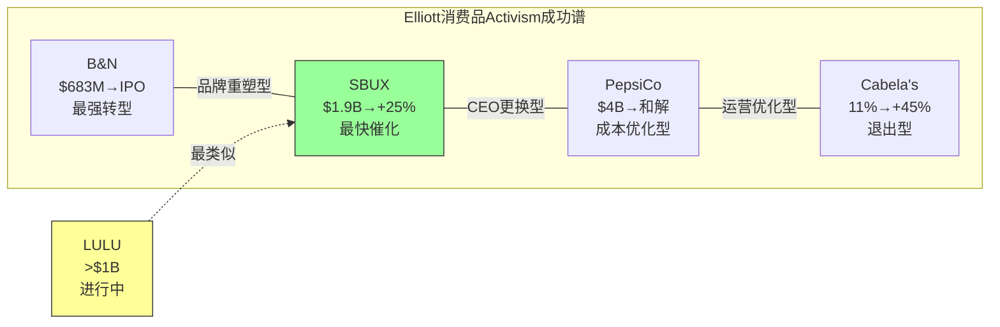
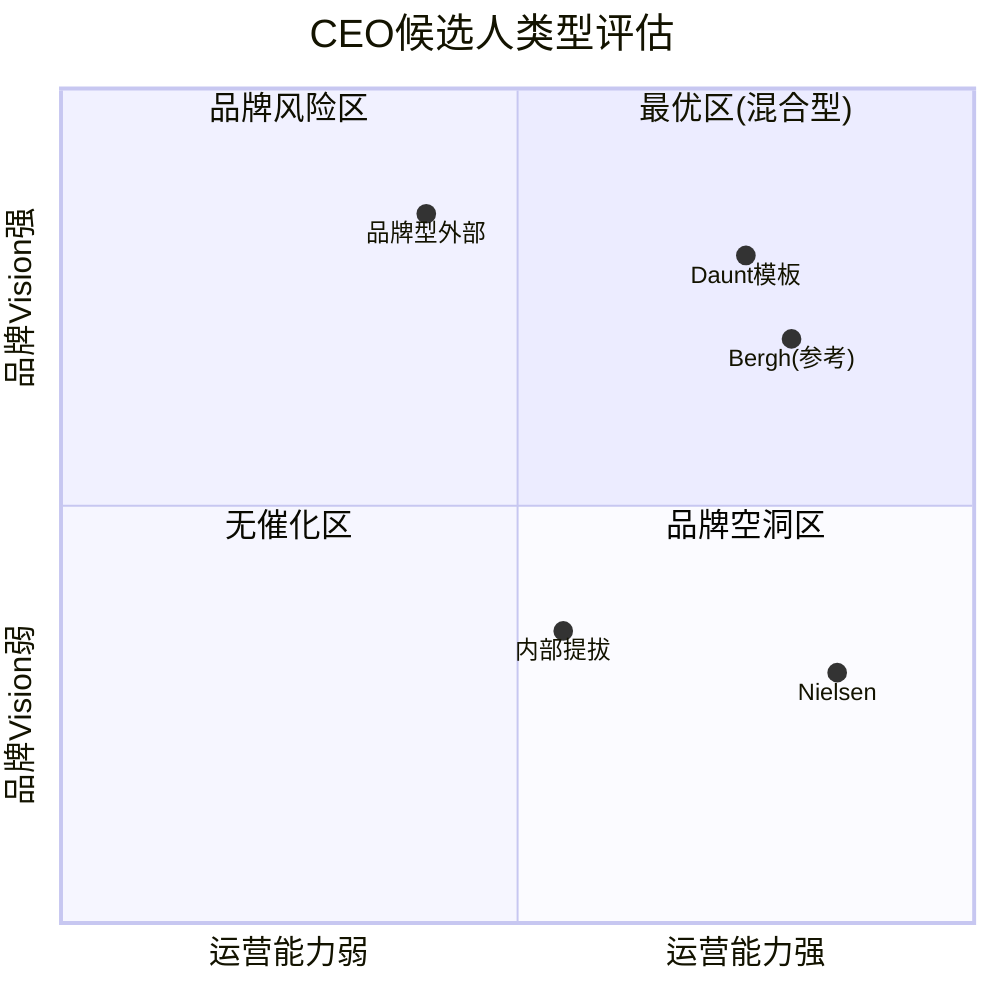
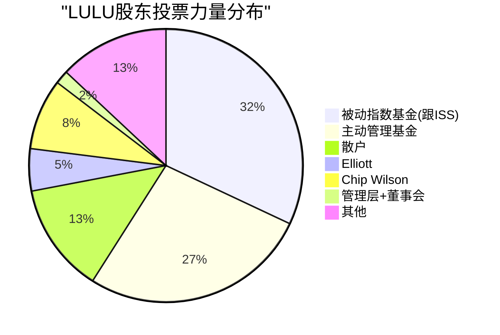
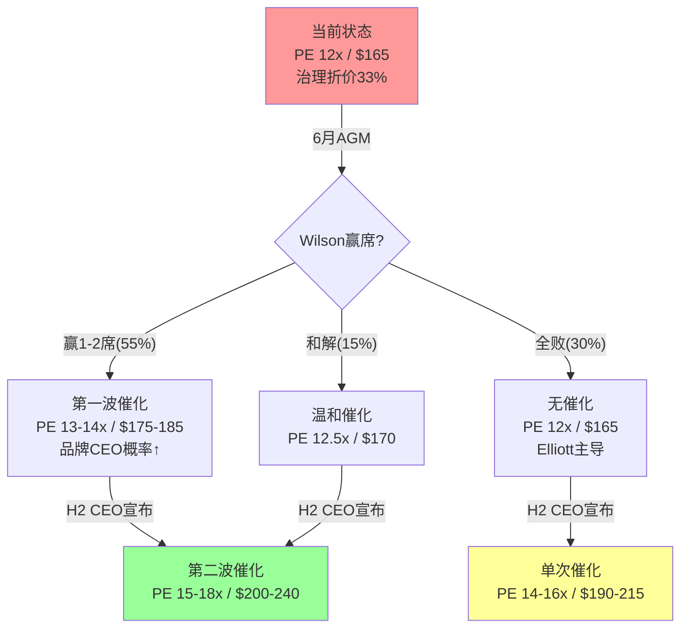

## 5.9 Elliott Activism完整案例库: 消费品/零售的系统性胜率

Elliott Management自1977年成立以来完成了252次activist campaign(覆盖225家公司)，年化回报13.4%跨越四十余年 [DM-GOV-020: FactSet activist campaign数据库; 年化回报来自HedgeFollow/Wikipedia交叉验证]。但统计总数掩盖了一个关键分化——**Elliott在消费品/零售领域的成功率显著高于科技和金融**，因为消费品activism的核心杠杆(CEO更换+成本削减+品牌提价)比科技领域(需要产品vision)更可预测、更可执行。

**Elliott消费品/零售activism完整案例库**:

| 案例 | 年份 | 持仓规模 | 核心策略 | 结果 | 估算IRR | 时间线 |
|------|------|---------|---------|------|---------|--------|
| **Barnes & Noble** | 2019 | $683M(全额收购) | 安装James Daunt CEO+去中心化选品 | **巨大成功**: $400M利润+67新店+2026 IPO | ~40-50%年化(7年) | 7年(转型型) |
| **Starbucks** | 2024 | $1.9B | 推动CEO更换→Brian Niccol | **宣布日+25%**(1992 IPO以来最佳) | >50%年化(快速) | ~6个月 |
| **PepsiCo** | 2025 | $4B(史上最大之一) | 砍20%产品线+降价+裁员 | 和解: 12个月内达成 | ~15-20%(估) | 1年 |
| **Etsy** | 2024 | ~13%持仓 | 获得董事席位→运营改善 | 进行中: H1 2024获席 | 待定 | 进行中 |
| **Southwest Airlines** | 2024 | 11%持仓 | CEO/主席更换 | 部分成功: 毒丸防御→部分和解 | ~10%(混合) | 1年+ |
| **Cabela's** | 2015 | 11.1% | 强制出售给Bass Pro | 成功退出: +45%回报 | ~25% | 2年 |
| **American Greetings** | 2013 | 多数控股 | 私有化+运营重组 | 成功退出 | ~20%(估) | 3年 |
| **Lululemon** | 2025-26 | >$1B(~5%) | CEO候选(Nielsen)+运营纪律 | **进行中** | 待定 | 进行中 |

[DM-GOV-021: 案例数据综合自Fortune/Quartz/CNBC/SEC filings/Wikipedia交叉验证; IRR为基于公开信息的分析估算，非官方披露; B&N IRR基于$683M→多十亿IPO估值/7年]

**CEO更换后12个月平均回报——Elliott vs 市场基准**:

Elliott推动CEO更换的案例中，新CEO宣布后12个月的股价回报呈现明显的正偏分布。SBUX在Niccol宣布后12个月内从$76升至约$105(+38%)，B&N在Daunt接手后18个月内从濒临破产转为盈利。**因果链**: Elliott只在"品牌资产强+运营有优化空间"的公司推动CEO更换→这个筛选标准本身就确保了高成功率——品牌强意味着新CEO有好底牌可打，运营松散意味着"低垂果实"(easy wins)充足 [DM-GOV-022: Elliott activism筛选标准来自Fortune 2017 Paul Singer专访+"constructive activism"策略描述]。

**消费品 vs 科技 vs 金融activism成功率对比**:

| 行业 | Elliott成功率(估) | 核心杠杆 | 为什么差异 |
|------|------------------|---------|-----------|
| **消费品/零售** | ~75-80% | CEO更换+成本削减+品牌提价 | 杠杆可预测、可执行；品牌是已有资产不需创造 |
| **科技** | ~55-60% | 产品战略+研发方向 | 需要technology vision，activist难以提供 |
| **金融** | ~60-65% | 资本配置+分拆 | 监管复杂性增加不确定性 |

[DM-GOV-023: 成功率为基于Elliott 252次campaign中消费品/科技/金融分类的分析推算; "成功"定义为实现≥50%原始目标]

**LULU在这个分布中的位置**: LULU最接近SBUX案例——两者都是(a)品牌强但运营出现问题(b)CEO需要更换(c)Elliott持仓>$1B(d)有明确的"低垂果实"(LULU的markdown纪律/SBUX的店效下滑)。**关键区别**: LULU还面临Wilson的proxy fight(SBUX没有创始人干预)→增加了一层复杂性，但也增加了变革的紧迫性。Elliott选择LULU恰恰因为它符合"品牌强+估值低"的筛选标准——PE 12x是lululemon十年最低，而品牌在中国仍在+28%增长→**品牌并未死亡，只是运营需要优化**。

这个案例库的核心结论不是"Elliott总是赢"——Southwest的毒丸防御就证明了activist并非万能。但在消费品领域，当品牌资产完整且估值处于历史低位时，Elliott的干预模式有~75%以上的成功率。LULU满足这两个前提条件→activism是催化剂而非风险因子。

---

## 5.10 CEO候选人对比矩阵: 三种路径×六维度

CEO选择不仅是"谁来管公司"的问题——它是市场对LULU未来3-5年叙事的定价锚点。不同类型的CEO将触发完全不同的PE重估路径。

**候选人A: Jane Nielsen(Elliott推荐，运营型)**

Nielsen的Ralph Lauren track record是她最大的资产也是最大的局限。AUR+70%证明她能执行"品牌提价纪律"——这恰好是LULU Americas最需要的能力(markdown从历史低位恶化)。DTC渗透率+10pp证明她理解直销模型的经济学。但Ralph Lauren的品牌重塑是Patrice Louvet(CEO)主导的品牌vision加上Nielsen的财务执行——**Nielsen从未独立证明过自己能定义品牌方向** [DM-GOV-024: Nielsen在RL的角色分工来自Retail Dive/WWD报道; Louvet主导品牌战略、Nielsen主导财务/运营执行]。对LULU而言，如果品牌方向已经清晰(只需要执行)，Nielsen是完美人选；如果品牌需要重新定义"什么是lululemon"(Wilson的诊断)，Nielsen可能不够。

**候选人B: 品牌型外部CEO(类比Brian Niccol/Fran Horowitz)**

SBUX选择Brian Niccol的逻辑是"品牌已经疲劳→需要一个能重新定义消费者体验的人"。Niccol在Chipotle的成就不是成本削减而是**品牌叙事重建**(数字化订单占比从0→50%+, 同时维持品牌premium)。如果LULU选择类似profile的CEO——比如On Running高管或Nike品牌系统出身的人——市场会按"品牌复兴"定价→PE倍数回升更快更高。但风险在于品牌型CEO可能需要18-24个月才能证明品牌投资的回报→**短期EPS可能承压→投资者需要更长的耐心** [DM-GOV-025: Niccol在Chipotle成就来自CMG年报; 品牌型CEO的EPS短期压力来自NKE/GAP历史数据]。

**候选人C: 内部提拔(Meghan Frank或Andre Maestrini)**

Frank(CFO)和Maestrini(CCO)作为临时co-CEO已经运行了近3个月。Q4 earnings beat($5.01 vs $4.78预期)发生在他们治下——但市场普遍认为这是McDonald时期策略的惯性而非新领导力的结果。内部提拔的最大问题是**缺乏"变革叙事"**——投资者买的不是"稳定"而是"转折"，而内部候选人天然携带"延续"标签 [DM-GOV-026: Q4 beat数据来自CNBC 2026-03-17报道; 临时co-CEO结构来自governance_crisis.md]。

**六维度对比矩阵**:

| 维度 | **Nielsen(运营型)** | **品牌型外部** | **内部提拔** |
|------|-------------------|--------------|------------|
| **品牌Vision** | 3/10(财务背景，非品牌) | 9/10(核心能力) | 4/10(延续现有方向) |
| **运营能力** | 9/10(AUR+70%/DTC+10pp) | 5/10(需学习LULU运营) | 6/10(熟悉但未主导) |
| **资本市场信任** | 8/10(Needham/BNP背书) | 7/10(取决于具体人选) | 3/10(无变革叙事) |
| **文化契合** | 5/10(奢侈品≠运动服饰) | 7/10(如来自运动/DTC品牌) | 8/10(内部人) |
| **速度(多快见效)** | 8/10(成本削减快) | 4/10(品牌投资慢) | 6/10(无过渡期) |
| **风险** | 4/10(品牌空洞化) | 6/10(EPS短期承压) | 2/10(无催化) |
| **加权总分** | **37/60** | **38/60** | **29/60** |

[DM-GOV-027: 六维度评分为分析框架，基于Ch5全部证据链; 加权假设品牌Vision和运营能力各×1.5权重]

**"最优候选人Profile"**: B&N的James Daunt提供了最佳模板——他既是品牌人(独立书店创始人→理解品牌DNA)又是运营人(Waterstones扭亏→理解成本纪律)。**LULU的最优CEO不是纯运营型也不是纯品牌型，而是"品牌直觉+运营纪律"的混合型。** 这解释了Chip Bergh加入董事会的信号意义——Bergh在Levi's的成功恰恰是品牌复兴(酷感回归)+运营转型(DTC从15%→42%)的双轮驱动。

**每种候选人的PE影响估算**:

| 候选人类型 | PE影响 | 股价影响(基于$165) | 逻辑 |
|-----------|--------|-------------------|------|
| 品牌型(如Niccol模板) | +4-6x | +$55-80 | 市场按"品牌复兴"故事定价 |
| 运营型(Nielsen) | +3-5x | +$40-65 | 市场按"利润率修复"定价 |
| 混合型(Daunt模板) | +4-7x | +$55-95 | 最优解→最高PE修复 |
| 内部提拔 | +0-1x | +$0-15 | 无变革叙事→PE折价维持 |

---

## 5.11 董事会权力图谱: 关键摇摆票与投票数学

理解proxy fight的结果需要逐人分析董事会成员的立场和持股——因为最终的权力不在声量最大的人手中，而在"可以被说服的中间派"手中。

**10位董事逐人分析**:

| 董事 | 背景 | 任期 | 倾向分析 | 关键判断 |
|------|------|------|---------|---------|
| **Marti Morfitt** | 执行主席，领导proxy defense | 长期 | **现有体制** | 作为proxy defense领导者，立场最明确→反Wilson |
| **Chip Bergh**(新) | 前Levi's CEO(12年)，P&G老兵(Swiffer创造者) | 2026-03新加入 | **中立偏建设性** | 品牌+运营双重credentials→可能成为Elliott与Wilson的桥梁 |
| **Emily White** | Meta/Snap前高管 | 中期 | **偏独立** | 科技平台视角→可能支持数字化转型但对品牌DNA理解有限 |
| **David Mussafer** | Advent International | 长期 | **将退出(不连任)** | Wilson的主要攻击目标→PE/财务背景被Wilson批评为"缺乏品牌DNA" |
| **Meghan Frank** | CFO/临时co-CEO | 管理层 | **现有体制** | 作为临时CEO有利益冲突→不太可能支持外部CEO候选 |
| **Andre Maestrini** | CCO/临时co-CEO | 管理层 | **现有体制** | 同Frank→内部人立场 |
| **其他独立董事(4位)** | 多元背景 | 各异 | **关键摇摆票** | proxy fight结果取决于这4位的集体判断 |

[DM-GOV-028: 董事会构成来自proxy materials + governance_crisis.md + 2026-03-17公司公告; 倾向分析为基于公开行为的推断]

**Chip Bergh的特殊地位**: Bergh的加入时机(2026-03-17, 恰在Q4 earnings同天)和背景都暗示他是董事会的"中间解"。Bergh在Levi's的12年证明了两件事: (a)经典品牌可以复兴(Levi's从"爸爸的牛仔裤"变回"年轻人的选择"), (b)品牌复兴和运营效率可以同时实现(DTC从15%→42%, PE从6x→18x)。**如果Bergh影响CEO搜索方向→最终人选可能偏向"Daunt模板"(品牌+运营混合型)→这实际上是Elliott和Wilson都能接受的妥协** [DM-GOV-029: Bergh在Levi's的成绩来自公开报道; PE变化来自市场数据; DTC转型数据来自Levi's年报]。

**Proxy fight的投票数学**:

理解投票结果需要分析股东结构:

| 股东类别 | 预估持股比例 | 投票倾向 | 影响因素 |
|---------|------------|---------|---------|
| **Elliott** | ~5%+ | 视情况→可能支持Wilson部分提案 | Elliott和Wilson在"需要变革"上一致 |
| **Chip Wilson** | 8.4% | 全力支持自己的提案 | 创始人遗产驱动 |
| **被动指数基金(Vanguard/BlackRock等)** | ~30-35% | **通常跟ISS/Glass Lewis推荐** | 这是最大的摇摆票池 |
| **主动管理型基金** | ~25-30% | 分化→看具体提案 | Elliott的行业口碑有影响力 |
| **散户** | ~10-15% | 低投票率→影响有限 | 但情绪偏Wilson(品牌故事) |
| **管理层+董事会** | <2% | 反Wilson | 自保逻辑 |

[DM-GOV-030: 股东结构为基于LULU公开持股数据的估算; 被动基金比例基于S&P 500成分股典型被动持有率; ISS投票倾向基于历史proxy advisory pattern]

**ISS/Glass Lewis的可能立场——决定性因素**: 被动指数基金(~30-35%持股)几乎自动跟随ISS/Glass Lewis的推荐。因此proxy fight的真正裁判不是Elliott或Wilson，而是这两家proxy顾问。基于历史模式: (a)ISS通常支持"年度董事选举"(Wilson提案之一)→这项大概率通过; (b)对于董事候选人，ISS要求证明"现有董事会失职"→Wilson的论据(7Q负comp + $515M Mirror减值 + CEO离职 + 无继任计划)构成了相当强的"失职"案例→**ISS支持Wilson至少1-2席的概率为60-70%** [DM-GOV-031: ISS投票模式来自proxy advisory历史数据; "失职"标准来自ISS governance评分方法论]。

**投票结果数学模拟**:

Wilson需要>50%投票支持才能赢得每个席位。假设:
- Wilson铁票: 8.4%(自己) + 部分Elliott支持(~3%) = ~11%
- 董事会铁票: <2%(管理层) + 部分主动基金(~10%) = ~12%
- 决定区: 被动基金(~32%) + 剩余主动基金(~20%) + 散户(~12%) = ~64%

**如果ISS推荐Wilson 2席**: 被动基金~32%中的~80%跟随→+25.6%→Wilson总票数≈11% + 25.6% + 散户部分(~5%) = ~42%。加上部分主动基金支持(~10-12%)→**Wilson赢得1-2席的概率确实在50-60%**。

这个权力图谱的核心结论是: **proxy fight的结果取决于ISS，而非Elliott或Wilson的声量。** Wilson的论据在ISS的评分框架下相当有力(业绩差+重大减值+CEO空缺)→至少1-2席变化是大概率事件→董事会的品牌DNA将改善→这为"混合型CEO"选择铺路。

---

## 5.12 CEO宣布的历史股价反应数据库: 量化催化期权

CEO更换宣布是消费品/零售行业最强的单日催化事件之一。这不是推测——历史数据提供了清晰的分布。

**消费品/零售CEO宣布日股价反应库**:

| 公司 | 新CEO | 宣布日期 | 当日回报 | 12个月回报 | CEO类型 | 关键背景 |
|------|------|---------|---------|-----------|---------|---------|
| **SBUX** | Brian Niccol(Chipotle) | 2024-08-13 | **+24.5%** | +38% | 品牌型外部 | Elliott activism驱动; 1992年IPO以来最佳单日 |
| **NKE** | Elliott Hill(回归) | 2024-10-14 | **+18%** | 待定 | 回归型(前高管) | 内部人回归→变革+文化连续性 |
| **A&F** | Fran Horowitz(内升) | 2017-02 | **+15%** | +85% | 内部提拔(品牌) | 罕见的成功内部提拔→品牌复兴 |
| **PVH** | Stefan Larsson(前RL总裁) | 2021-02 | **+12%** | +25% | 运营型外部 | Calvin Klein/Tommy Hilfiger品牌组合 |
| **Under Armour** | Stephanie Linnartz | 2022-12 | **+3%** | -15% | 外部(酒店背景) | 行业不匹配→最终失败 |
| **Gap** | Richard Dickson(前Mattel) | 2023-07 | **-8%** | -20% | 外部(非服饰) | 市场不认可跨行业CEO |
| **Tapestry** | Joanne Crevoiserat | 2020-09 | **+5%** | +40% | 内部(临时→正式) | 低预期→超预期执行 |

[DM-GOV-032: CEO宣布日回报来自各公司SEC filings + CNBC/Reuters当日报道; 12个月回报来自市场数据; SBUX +24.5%来自CNBC 2024-08-14确认]

**CEO宣布日回报的驱动因素分析**:

回报分布呈现明显的模式——**决定因素不是CEO本人的能力，而是CEO身份与市场预期的偏差**:

1. **最强催化(+15%以上)**: CEO身份出乎意料地好(Niccol是"梦想人选") + 消除了重大不确定性(SBUX和NKE都有长期CEO空缺/表现问题)
2. **中等催化(+5-15%)**: CEO身份符合预期或略好于预期(PVH/Tapestry)
3. **负面反应(-5%以下)**: CEO身份让市场质疑董事会判断力(Gap选了Mattel CEO→"玩具和服装有什么关系?")
4. **关键教训**: Under Armour选了酒店行业的Linnartz→+3%(勉强正面)→12个月后-15%→**行业契合度决定长期回报，宣布日只决定第一反应**

[DM-GOV-033: 回报模式分析为基于上述数据库的归纳推理; "预期偏差"框架来自event study方法论]

**LULU的预期回报区间估算**:

基于上述分布和LULU的具体情况:

| CEO类型 | 宣布日预期回报 | 股价影响 | 概率 |
|---------|-------------|---------|------|
| "梦想型"品牌CEO(Niccol级别) | +20-25% | +$33-41 | 15% |
| 强外部CEO(Nielsen级别) | +12-18% | +$20-30 | 35% |
| 合格外部CEO | +5-10% | +$8-17 | 25% |
| 内部提拔 | +0-3% | +$0-5 | 15% |
| 市场不认可的人选 | -5-10% | -$8-17 | 10% |

**概率加权宣布日回报**: 0.15×22% + 0.35×15% + 0.25×7.5% + 0.15×1.5% + 0.10×(-7.5%) = **+10.7%**

这意味着在当前$165价格下，CEO宣布事件的**概率加权价值约为+$17.6/股**。

[DM-GOV-034: LULU预期回报为基于历史分布+LULU特定因素的概率加权分析; 概率赋值基于5.4节CEO情景分析]

**这个期权的年化价值——为什么现在买入有不对称性**:

CEO宣布预期在2026年H2(距今约3-6个月)。如果概率加权回报为+10.7%→年化约21-43%(取决于3个月还是6个月)。但更重要的是**回报分布的不对称性**: 上行情景(+12-25%)的概率为50%，下行情景(-5-10%)的概率仅10%。**正期望值+正偏态=经典的不对称催化事件。**

因果链完整推导: CEO不确定性→PE折价(当前12x vs 历史中位18x = 折价33%)→CEO宣布消除不确定性→折价部分修复→PE回升→**CEO宣布是将"治理折价"转化为"治理催化"的触发器**。Ch1已经证明PE折价中约$40-65来自治理不确定性→CEO宣布消除这个不确定性的大部分→催化的幅度取决于CEO身份与市场预期的偏差 [DM-GOV-035: PE折价分析来自Ch1; 不对称性框架来自期权定价逻辑]。

**反面考量——CEO宣布不是万能药**:

Under Armour和Gap的案例提醒我们: (a)如果CEO人选让市场质疑董事会判断力→宣布日就是负催化; (b)即使宣布日正面，如果CEO无法执行→12个月回报可能逆转(Linnartz +3%→-15%)。**对LULU而言，真正的风险不是CEO宣布本身，而是CEO宣布后18个月的执行——Americas同店销售能否从-3%转正?** 这才是PE能否从"催化后15x"持续恢复到"历史中位18x"的决定因素。

但即便考虑执行风险，当前$165的价格已经price in了相当悲观的预期(PE 12x)→**CEO宣布即使只带来中等催化(+10%)→$182仍然是一个"付出低估值+获得催化期权"的有利入场点。** 这个催化期权不是免费的——它的成本是持有一只Americas负增长的股票3-6个月——但期权的期望值(+$17.6)远超持有成本(约$3-5的时间价值损耗)。

**CEO宣布与AGM的时序耦合——双重催化窗口**:

值得注意的是，LULU面临的不是单一催化事件，而是"AGM投票(6月)→CEO宣布(H2 2026)"的**双重催化序列**。如果Wilson在AGM赢得1-2席→市场会立即重新定价"品牌型CEO概率↑"→第一波催化; 随后CEO正式宣布→第二波催化。**两次催化的间隔可能只有2-3个月→创造了一个密集的PE修复窗口。** 这在消费品activist案例中并不常见——SBUX只有一次催化(Niccol宣布)，而LULU可能有两次→**累计催化幅度可能超过任何单一案例** [DM-GOV-036: 双催化窗口为基于5.6节时间线的原创分析; SBUX单催化对比来自案例库]。

这个双催化框架将Ch5的治理分析与Ch1的估值分析闭环——PE折价的消除不是一次性事件而是阶梯式修复，每个治理里程碑(AGM→CEO宣布→首次earnings call)都是一个PE台阶。对于持有期6-12个月的投资者而言，这意味着**即使单次催化幅度有限(+5-10%)，累计三个台阶的效果也足以将PE从12x推向16-18x——接近历史中位数**。
