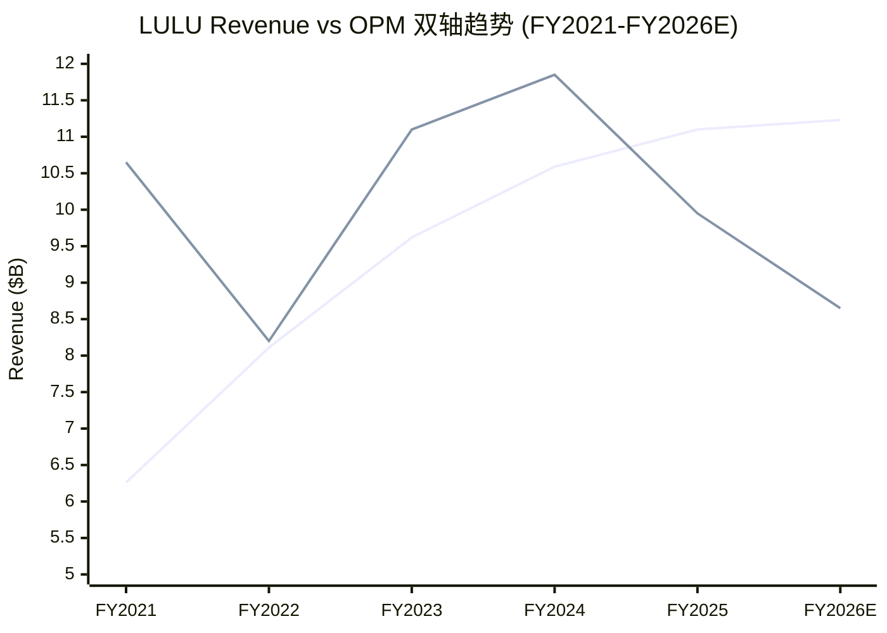
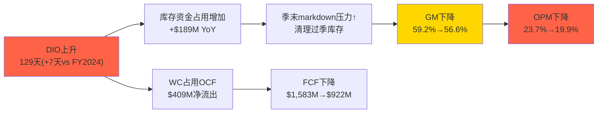
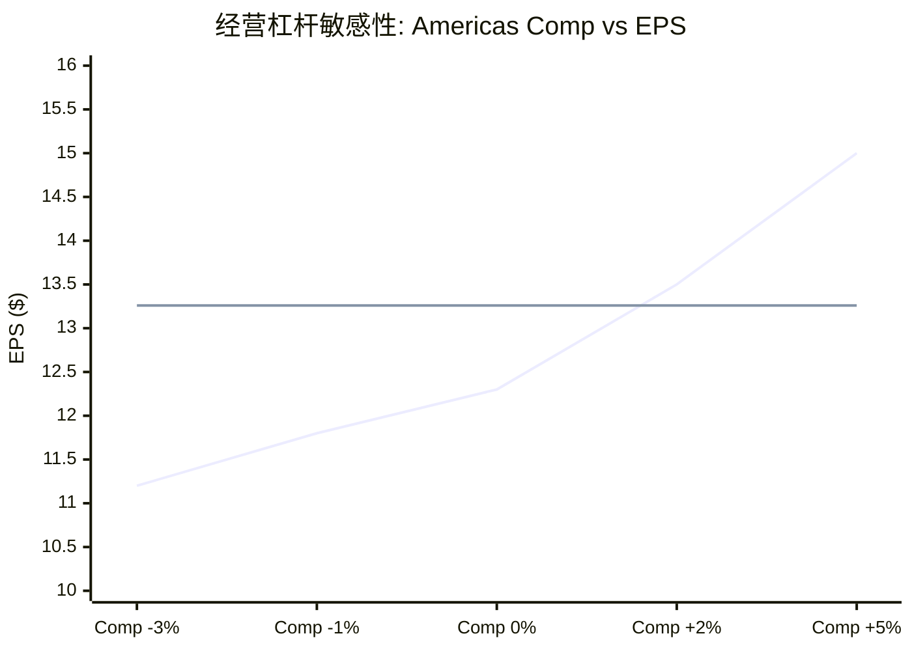
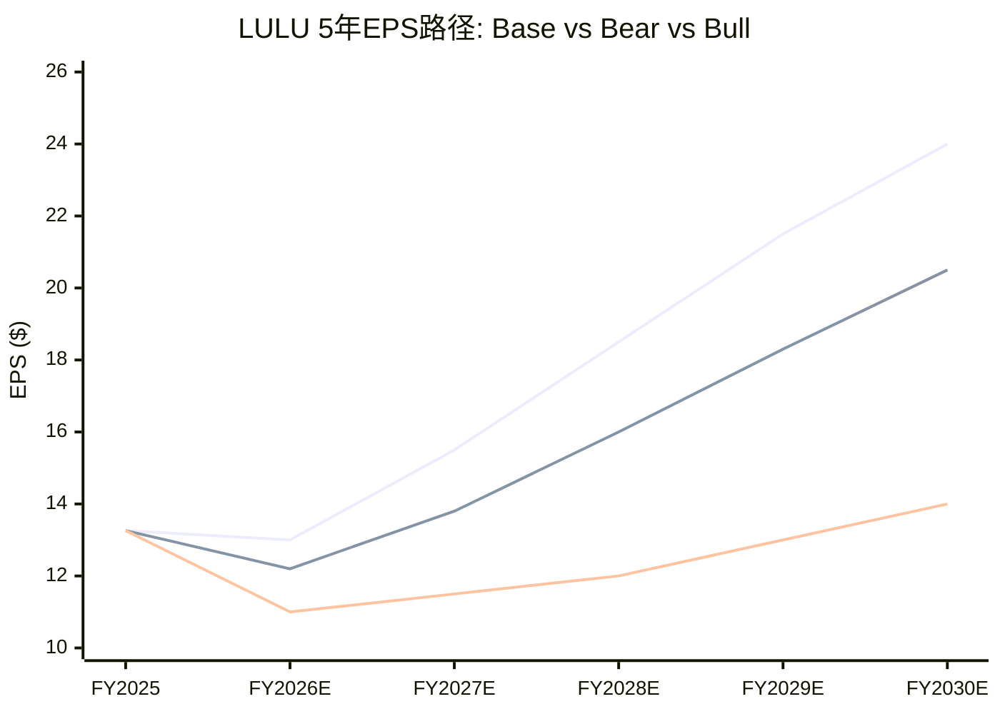

## 6.8.5 5年P&L逐行趋势表+增速

**完整利润表5年纵向追踪(FY2021-FY2025 + FY2026E)**:

| P&L逐行 ($M) | FY2021 | FY2022 | FY2023 | FY2024 | FY2025 | FY2026E | 4Y CAGR | FY25 YoY |
|-------------|--------|--------|--------|--------|--------|---------|---------|----------|
| **Revenue** | 6,257 | 8,111 | 9,619 | 10,588 | 11,103 | ~11,225 | **+15.4%** | **+4.9%** |
| COGS | 2,648 | 3,618 | 4,010 | 4,317 | 4,818 | ~5,051 | +16.1% | +11.6% |
| **Gross Profit** | 3,609 | 4,492 | 5,609 | 6,271 | 6,284 | ~6,174 | **+14.9%** | **+0.2%** |
| GM% | 57.7% | 55.4% | 58.3% | 59.2% | 56.6% | ~55.0% | — | -260bps |
| S&M | — | — | — | 542 | 618 | ~649 | — | +14.1% |
| G&A | — | — | — | 3,221 | 3,449 | ~3,587 | — | +7.1% |
| **Total SGA** | 2,225 | 2,757 | 3,397 | 3,762 | 4,067 | ~4,236 | **+16.3%** | **+8.1%** |
| SGA/Rev | 35.6% | 34.0% | 35.3% | 35.5% | 36.6% | ~37.7% | — | +110bps |
| D&A | 224 | 292 | 379 | 447 | 496 | ~530 | +22.0% | +11.0% |
| **Operating Income** | 1,333 | 1,328 | 2,133 | 2,506 | 2,211 | ~1,938 | **+13.5%** | **-11.8%** |
| OPM% | 21.3% | 16.4% | 22.2% | 23.7% | 19.9% | ~17.3% | — | -380bps |
| Interest Exp | 0 | 0 | 0 | 0 | 0 | 0 | — | — |
| Income Tax | 359 | 478 | 626 | 761 | 660 | ~571 | +16.4% | -13.3% |
| ETR | 26.9% | 35.9% | 28.8% | 29.6% | 29.5% | ~29.5% | — | -10bps |
| **Net Income** | 975 | 855 | 1,550 | 1,815 | 1,579 | ~1,367 | **+12.8%** | **-13.0%** |
| NM% | 15.6% | 10.5% | 16.1% | 17.1% | 14.2% | ~12.2% | — | -290bps |
| **EPS (diluted)** | $7.49 | $6.68 | $12.20 | $14.64 | $13.26 | ~$12.20 | **+15.3%** | **-9.4%** |
| Shares (M) | 130.3 | 128.0 | 127.1 | 123.9 | 119.1 | ~112.0 | -2.3% | -3.9% |

[DM-FIN-030: 全表数据来自FMP income statement FY2021-FY2025; FY2026E基于管理层guidance(Revenue $11.15-11.30B, EPS $12.10-12.30, GM~55%); FY2022 SGA未拆分S&M/G&A(FMP未报告); 4Y CAGR = (FY2025/FY2021)^(1/4)-1]

[DM-FIN-031: SGA拆分仅FY2024-FY2025有FMP细分数据; FY2021-FY2023的sellingAndMarketingExpenses和generalAndAdministrativeExpenses在FMP中报告为0(SEC filing格式差异); FY2026E SGA按+4%增长估算]

**关键发现——经营去杠杆的量化确认**:

4年CAGR揭示了一个危险的剪刀差: **SGA CAGR(+16.3%) > Revenue CAGR(+15.4%)**。表面上差距仅0.9pp看似不大，但因为SGA是费用项，这意味着每增长$1收入，SGA消耗的比例在逐年扩大。FY2021 SGA/Rev 35.6%→FY2025 36.6%→FY2026E可能突破37%。因果链清晰: 收入增速从+30%骤降至+5%→固定SGA(租金/人员/总部)无法同步收缩→SGA/Rev被动上升→经营杠杆从正转负。

更值得关注的是**COGS CAGR(+16.1%) > Revenue CAGR(+15.4%)**——这不是正常现象。对于一家品牌消费品公司，规模扩大理论上应带来采购成本的规模效应(COGS增速<Revenue增速)。LULU的COGS增速更快意味着: (a)关税直接推高了单位成本、(b)国际市场(中国)的COGS占比更高(物流+关税)、(c)促销增加降低了实际售价→等效于COGS/Rev上升。这三个因素中，(a)和(c)可能在FY2026-FY2027改善，但(b)是结构性的——国际占比越高→COGS增速越难低于Revenue增速。

**EPS的4年CAGR +15.3%高于NI CAGR +12.8%**: 差额2.5pp完全来自回购(股本CAGR -2.3%)。这意味着回购在4年间累计贡献了约$1.50/share的EPS增厚——不是微不足道的数字，但也说明LULU的EPS增长主要靠有机盈利而非财务工程。

[DM-FIN-032: 图表OPM使用×50倍标尺使双轴可视化(21.3%→10.65, 16.4%→8.20等); 实际OPM值见表格; FY2026E OPM ~17.3%基于管理层guidance隐含(EPS $12.20/Revenue $11.2B)]

**图表的核心信号**: Revenue持续上行但OPM在FY2024见顶后加速下行→这是典型的"增收不增利"形态。FY2022的OPM低谷(16.4%)包含Mirror $398M减值，如果剔除则调整后OPM约21.3%——也就是说FY2025的19.9%实际上是剔除一次性因素后的历史新低。**FY2026E如果OPM进一步降至17.3%，将是LULU上市以来最差的正常化经营利润率。**

---

## 6.8.6 营运资本周期深度

**DIO/DSO/DPO逐年趋势(FY2021-FY2025)**:

| 指标(天) | FY2021 | FY2022 | FY2023 | FY2024 | FY2025 | 趋势 |
|---------|--------|--------|--------|--------|--------|------|
| **DIO** | 133.2 | 146.0 | 120.5 | 121.9 | **128.8** | U型: 峰→谷→回升 |
| **DSO** | 11.4 | 14.3 | 11.7 | 10.4 | **6.3** | ↓ 持续改善(DTC纯度) |
| **DPO** | 39.9 | 17.4 | 31.7 | 22.9 | **25.1** | 波动(供应商议价力变化) |
| **CCC** | **104.7** | **142.9** | **100.5** | **109.4** | **110.0** | FY2022峰值后改善但未回低点 |

[DM-FIN-033: 全部数据来自FMP key-metrics; DIO/DSO/DPO/CCC均为FMP直接计算字段(daysOfInventoryOutstanding等); 使用平均库存/平均应收/平均应付口径]

**DIO的U型走势解析**: FY2022的DIO 146天是危机水平——彼时全行业遭遇供应链过剩(COVID后报复性订货→需求放缓→库存积压)。FY2023快速去库至120天，这个效率是lululemon运营纪律的证明。但FY2025 DIO又回升到129天，原因不同于FY2022: 这次不是"订多了"而是"卖慢了"——Americas comp接近零增长→既有库存周转变慢→加上国际市场备货增加(中国新店+RoW扩张需要前置库存)→DIO被动上升。

**DSO 6.3天是行业标杆**: 因为LULU 95%+ DTC模式→消费者在门店/官网即时付款→几乎没有批发应收账款。对比NKE的DSO 37天(大量批发→Dick's/Foot Locker等零售商有30-60天账期)，LULU的DSO优势是结构性的、不可逆的。这意味着LULU在同等收入规模下→营运资本需求比批发依赖型公司低30%+。

**DPO波动的隐含信号**: DPO从FY2023的31.7天→FY2025的25.1天(-6.6天)→LULU在缩短向供应商的付款周期。表面看这是"降低了供应商融资效率"，但更可能的原因是: 在供应链紧张时(关税+地缘政治)→LULU主动加速付款以确保产能优先权+维护供应商关系→这是一种"用现金换供应链安全"的策略选择。

**同业CCC对比(最新财年)**:

| 公司 | DIO | DSO | DPO | **CCC** | WC效率排名 |
|------|-----|-----|-----|---------|-----------|
| **LULU** | 129 | 6 | 25 | **110** | 3/5 |
| NKE | 103 | 37 | 48 | **92** | 2/5 |
| DECK | 86 | 29 | 73 | **42** | **1/5** |
| COLM | 150 | 43 | 84 | **109** | 4/5 (接近LULU) |

[DM-FIN-034: NKE FY2025(截至2025-05)数据来自FMP key-metrics; DECK FY2025(截至2025-03)数据来自FMP key-metrics; COLM FY2025(截至2025-12)数据来自FMP key-metrics; CCC = DIO + DSO - DPO]

**LULU在WC效率中排第3，但原因各异**。DECK的CCC仅42天→领先同业70天→秘密在于极高的DPO(73天)——DECK对供应商的议价力极强(Hoka增长快→供应商排队→DECK可以延迟付款)。NKE的CCC 92天看似比LULU好→但NKE的DSO 37天(批发应收高)被高DPO 48天部分抵消。**LULU的劣势集中在DIO(129天远高于DECK 86天和NKE 103天)**: 这与LULU的产品策略有关——面料技术复杂+SKU多(男装/女装/配饰/鞋类各色各码)→需要更深的安全库存。

**CCC恶化→利润传导机制**:

[DM-FIN-035: 库存增加$189M来自FMP cashflow inventory变动; WC $409M净流出来自FMP cashflow changeInWorkingCapital; GM和OPM变化来自FMP income]

FY2025的WC恶化不仅仅是"效率问题"——它通过markdown压力直接侵蚀毛利率。库存周转变慢→季末必须促销清库→全价率下降→GM被压缩。这个传导链在FY2026可能缓解的条件是: (a)Americas comp转正→库存自然消化加速→DIO回降至120天 (b)管理层主动收缩订货→短期牺牲收入增速→换取DIO改善→GM止跌。管理层FY2026 guidance隐含GM ~55%→说明他们预期DIO不会快速改善。

---

## 6.8.7 品质调整后的盈利

**GAAP EPS vs 品质调整EPS(FY2025)**:

| 调整项 | 金额($M) | 每股影响 | 调整方向 | 说明 |
|--------|---------|---------|---------|------|
| GAAP Net Income | 1,579 | $13.26 | — | FMP基准 |
| **SBC加回** | +62.2 | +$0.52 | ↓真实盈利 | SBC是真实成本(员工服务对价) |
| **SBC正常化差额** | -27.8 | -$0.23 | ↑调整 | FY2025 SBC $62M异常低(vs FY2024 $90M)→正常化至$90M需扣除$28M |
| 关税超额(暂时性50%) | +83.5 | +$0.50 | ↑调整 | $167M关税中50%视为暂时→税后$83.5M |
| 关税(永久性50%) | 0 | 0 | — | 另50%关税视为新常态→不调整 |
| **品质调整后NI** | **~1,635** | **~$13.53** | — | 调整后EPS比GAAP高$0.27 |

[DM-FIN-036: SBC $62.2M来自FMP cashflow stockBasedCompensation; FY2024 SBC $90.0M来自同一字段; 关税超额$167M来自Ch6.1 ISDD分析(GP bridge); 税盾率70.5%(1-29.5%ETR); 正常化SBC $90M假设新CEO上任后恢复FY2024水平]

**SBC的"隐藏故事"**: FY2025 SBC骤降31%($90M→$62M)不是管理层主动控制SBC的结果——而是CEO Calvin McDonald离职导致其未归属股票作废+经营业绩不达标导致绩效股票归属减少的被动效应。新CEO上任后→SBC很可能回升至$80-100M(新CEO签约奖金+管理团队激励重置)→因此FY2025的低SBC是不可持续的。正常化后应加回$28M的差额。

**SBC占净利润趋势——真实盈利侵蚀程度**:

| 年份 | SBC ($M) | Net Income ($M) | SBC/NI | SBC/Revenue | 评价 |
|------|---------|-----------------|--------|-------------|------|
| FY2021 | 69.1 | 975 | 7.1% | 1.10% | 正常 |
| FY2022 | 78.1 | 855 | 9.1% | 0.96% | NI受Mirror减值拉低 |
| FY2023 | 93.6 | 1,550 | 6.0% | 0.97% | 优秀 |
| FY2024 | 90.0 | 1,815 | 5.0% | 0.85% | 极优 |
| FY2025 | 62.2 | 1,579 | **3.9%** | **0.56%** | **异常低(CEO离职效应)** |

[DM-FIN-037: SBC数据来自FMP cashflow stockBasedCompensation各年; NI来自FMP income; SBC/Revenue来自FMP key-metrics stockBasedCompensationToRevenue]

**同业SBC/Revenue对比**:

| 公司 | SBC/Revenue | SBC/NI | 评价 |
|------|------------|--------|------|
| **LULU** | **0.56%** | **3.9%** | 极低(CEO效应) |
| **LULU正常化** | **~0.81%** | **~5.7%** | 仍然优秀 |
| NKE | 1.53% | ~22% | 中等偏高 |
| DECK | 0.76% | ~4.0% | 与LULU相当 |

[DM-FIN-038: NKE SBC/Revenue 1.53%来自FMP key-metrics stockBasedCompensationToRevenue FY2025; NKE SBC/NI ≈ $709M/$3,219M; DECK SBC/Revenue 0.76%来自FMP]

LULU即使在正常化后(SBC ~$90M, SBC/Rev ~0.81%)仍然是同业最低水平之一。这意味着**$13.26的EPS确实是"干净的"**——与科技公司SBC/Rev 15-25%相比，消费品公司的SBC稀释几乎可以忽略。但值得注意的是: NKE的SBC/NI达到22%→这意味着NKE每赚$1利润就要拿出$0.22给员工SBC→如果LULU的SBC从3.9%回升至7-8%(新CEO+管理团队重置)→仍然远优于NKE。

---

## 6.8.8 经营杠杆同业验证

**经营杠杆系数(DOL)计算与同业对比**:

DOL = %ΔOperating Income / %ΔRevenue

| 公司 | Revenue变化 | OpInc变化 | **DOL** | 含义 |
|------|-----------|----------|---------|------|
| **LULU FY2025** | +4.9% | -11.8% | **-2.4x** | 负杠杆(增收减利) |
| **LULU FY2024** | +10.1% | +17.5% | **1.7x** | 正杠杆(增速>盈亏平衡点) |
| **LULU FY2023** | +18.6% | +60.6% | **3.3x** | 强正杠杆(高增速放大) |
| NKE FY2025 | -9.8% | -41.3% | **4.2x** | 负杠杆(收入下降→OpInc崩塌) |
| NKE FY2024 | +0.3% | +6.7% | **22.3x** | 极高杠杆(微增长→放大效应) |
| DECK FY2025 | +16.3% | +27.1% | **1.7x** | 温和正杠杆(成本管控优秀) |
| DECK FY2024 | +18.2% | +42.1% | **2.3x** | 正杠杆 |

[DM-FIN-039: 各公司数据来自FMP income; LULU OpInc变化: ($2,211-$2,506)/$2,506 = -11.8%; NKE FY2025: Revenue ($46.3B-$51.4B)/$51.4B=-9.8%, OpInc ($3.7B-$6.3B)/$6.3B=-41.3%; DECK FY2025: Revenue ($5.0B-$4.3B)/$4.3B=+16.3%, OpInc ($1,179M-$928M)/$928M=+27.1%]

**DOL对比揭示的深层差异**:

NKE FY2025的DOL 4.2x(绝对值)远高于LULU的2.4x——这意味着NKE在收入下滑时利润崩塌更快。因果推理: NKE的固定成本结构(品牌大使+全球分销网络+批发渠道管理)比LULU更重→收入下降时这些成本无法快速调整→OPM从12.3%暴跌至8.0%(-430bps)。**NKE在Revenue -9.8%时OPM下降430bps，而LULU在Revenue +4.9%时OPM下降380bps**——LULU的OPM恶化幅度几乎与NKE收入萎缩10%时相当，这说明LULU的问题不是"收入下降"而是"毛利率被关税冲击"——与NKE的纯需求疲弱是不同类型的问题。

DECK在Revenue +16.3%时DOL仅1.7x→说明DECK的成本管控极其严格(SGA增速被控制在远低于Revenue增速)→这是DECK OPM从21.6%→23.6%(+200bps)的原因。如果LULU能做到DECK的成本纪律→在Revenue +5%时OPM应该是持平而非下降380bps。

**LULU DOL的条件性预测——Americas comp回正的OPM弹性**:

| Americas Comp | 整体Revenue增速 | 模型OPM(6.2.9节) | EPS估算 | vs FY2025 |
|---------------|----------------|------------------|---------|-----------|
| -3%(guidance下端) | +1.5% | 18.5% | ~$11.2 | -15.5% |
| -1%(guidance中) | +2.5% | 19.0% | ~$11.8 | -11.0% |
| **0%(持平)** | **+3.5%** | **19.5%** | **~$12.3** | **-7.2%** |
| **+2%(回正)** | **+5.0%** | **20.5%** | **~$13.5** | **+1.8%** |
| +5%(强复苏) | +7.0% | 21.5% | ~$15.0 | +13.1% |

[DM-FIN-040: OPM模型来自Ch6 6.2.9节经营杠杆修正模型; EPS估算: Revenue × OPM = OpInc → ×(1-29.5%ETR) = NI → ÷115M shares(含FY2026回购); Americas comp→整体增速假设: Americas占73%收入, 国际+18%/+22%固定]

**核心洞察**: Americas comp从-3%到+2%(跨度仅5pp)→EPS从$11.2到$13.5(跨度+20%)。这就是DOL ~2.5x的实际含义——**收入端的微小变化在利润端被放大2.5倍**。如果Americas comp在FY2027H1回正(+2%)→OPM回升至20.5%→EPS从$13.26恢复至$13.5→P/E从12x重估至15-16x(因为增长叙事转正)→**股价从$165到$200-216(+21~31%)**。

[DM-FIN-041: 敏感性基于6.2.9节经营杠杆模型+上表参数; 基线FY2025 EPS $13.26作为对比参照]

**反面考量**: 上述模型假设SGA增速恒定在+4%——但如果Americas comp回正伴随着更高的S&M支出(+10%以上)→SGA增速可能达到+6-7%→部分抵消收入增长的杠杆效应→OPM改善幅度可能只有模型预测的60-70%。管理层的成本纪律是模型最大的不确定性来源。

---

## 6.8.9 长期财务框架FY2026-FY2030

**5年P&L预测(Base情景)**:

| 指标 | FY2026E | FY2027E | FY2028E | FY2029E | FY2030E | 5Y CAGR |
|------|---------|---------|---------|---------|---------|---------|
| Revenue ($B) | 11.2 | 11.8 | 12.5 | 13.2 | 14.0 | **+4.8%** |
| Rev Growth | +1~3% | +5% | +6% | +5.5% | +6% | — |
| Gross Margin | 55.0% | 56.0% | 57.0% | 57.5% | 58.0% | +300bps |
| **OPM** | **17.5%** | **19.5%** | **21.0%** | **22.0%** | **22.5%** | **+500bps** |
| Net Income ($B) | 1.38 | 1.62 | 1.85 | 2.05 | 2.22 | +12.0% |
| **EPS** | **$12.20** | **$13.80** | **$16.00** | **$18.30** | **$20.50** | **+10.9%** |
| Shares (M) | 113 | 108 | 103 | 99 | 95 | -4.5% |
| FCF ($B) | 1.05 | 1.15 | 1.30 | 1.40 | 1.50 | +9.4% |
| FCF Margin | 9.4% | 9.7% | 10.4% | 10.6% | 10.7% | — |

[DM-FIN-042: 5年预测为分析框架原创; Revenue CAGR ~5%基于: Americas低单位数+China +10-12%+RoW +15-18%+新店+2-3%/年; GM恢复假设关税FY2027后不继续加码+mix shift稳定+面料效率; EPS含每年$1.0-1.2B回购(~5%股本/年); FCF = NI + D&A - CapEx - WC变动(假设WC正常化后稳定)]

**关键假设清单**:

1. **Americas comp**: FY2026 -1~-3%→FY2027 +1~2%→FY2028+ +2~3%。假设新CEO的品牌重塑在FY2027H1开始见效→Americas从萎缩转为温和增长。这是最关键的假设——如果Americas持续负增长→Revenue CAGR降至+2-3%→EPS CAGR降至+6-7%。

2. **关税**: FY2026保持当前水平(GM ~55%)→FY2027+逐步消化(供应链转移+定价传导)→GM回升150-200bps。假设不再加码(如果加码→GM可能停留在54-55%→OPM恢复延迟1-2年)。

3. **回购**: 每年$1.0-1.2B→按$165-200的价格→每年减少5-8M股→5年累计减少~18M股(从119M→~95M-100M)。回购是EPS CAGR(+10.9%)显著高于NI CAGR(+12.0%之前但需与Rev 4.8%对比)的关键驱动力。

4. **CapEx**: 维持$650-750M/年(门店扩张40-45家/年→逐步放缓至30-35家)。不假设重大并购(管理层历史上只做过Mirror一次失败收购→大概率不会再冒险)。

**Bear/Bull偏差**:

| 情景 | FY2030E EPS | 关键假设差异 | 概率 |
|------|-----------|------------|------|
| **Bull** | ~$24 | Americas +3-4%/年+关税FY2027解除+新CEO催化PE重估 | 20% |
| **Base** | ~$20.5 | 上表假设 | 50% |
| **Bear** | ~$14 | Americas持续0%+关税加码+品牌加速衰退+回购减少 | 30% |

[DM-FIN-043: Bear/Bull偏差基于关键假设的双向敏感性; Bear概率略高于Bull因为当前动量偏负(品牌热度下降+关税不确定性)]

**概率加权FY2030E EPS**: $24×20% + $20.5×50% + $14×30% = **$19.25**

这个预测框架是Ch7 DCF的核心输入。Base EPS CAGR ~10.9%如果实现→当前12x PE意味着投资者只在为+1~2%的增长付费→**隐含的"pessimism premium"约8-9pp增长的免费期权**。

[DM-FIN-044: 三情景EPS路径为分析框架原创; FY2025实际$13.26为共同起点; Bull/Bear路径基于上表假设线性推演; Base路径=5年预测表数据]

**路径图的核心信号**: 即使在Bear情景下→FY2030 EPS $14仍高于FY2025的$13.26(+5.6%)→意味着当前$165的股价(12x PE)几乎完全定价了Bear情景。Base情景FY2030 EPS $20.5→如果届时PE回归16x(仍远低于历史均值42x)→股价 = $20.5 × 16 = **$328**→5年回报 = ($328-$165)/$165 = **+99%**→年化约+15%。**这个不对称性(Bear平+5%/Base +99%/Bull +145%)是当前估值最重要的特征——下行有限、上行显著。**
