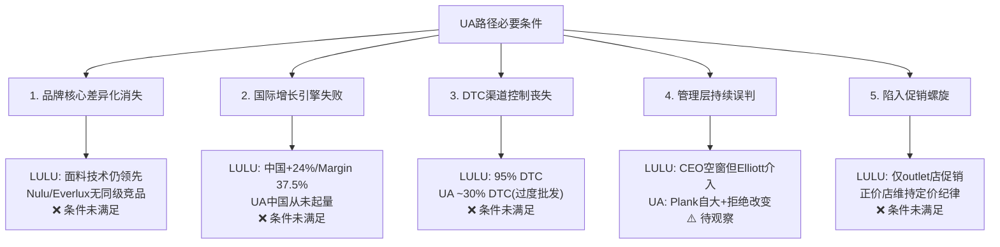
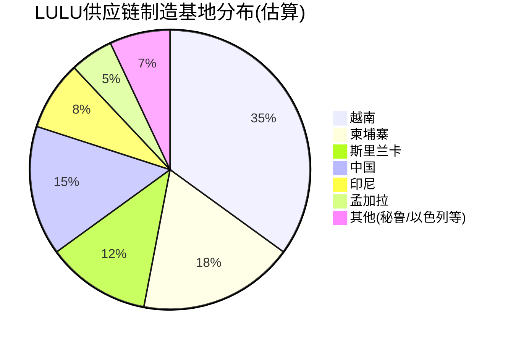
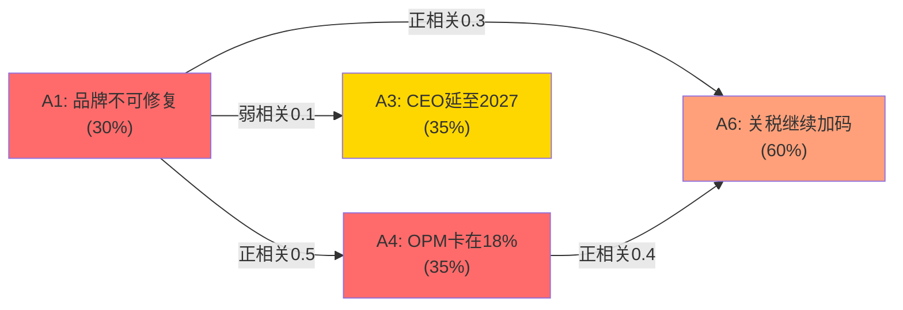
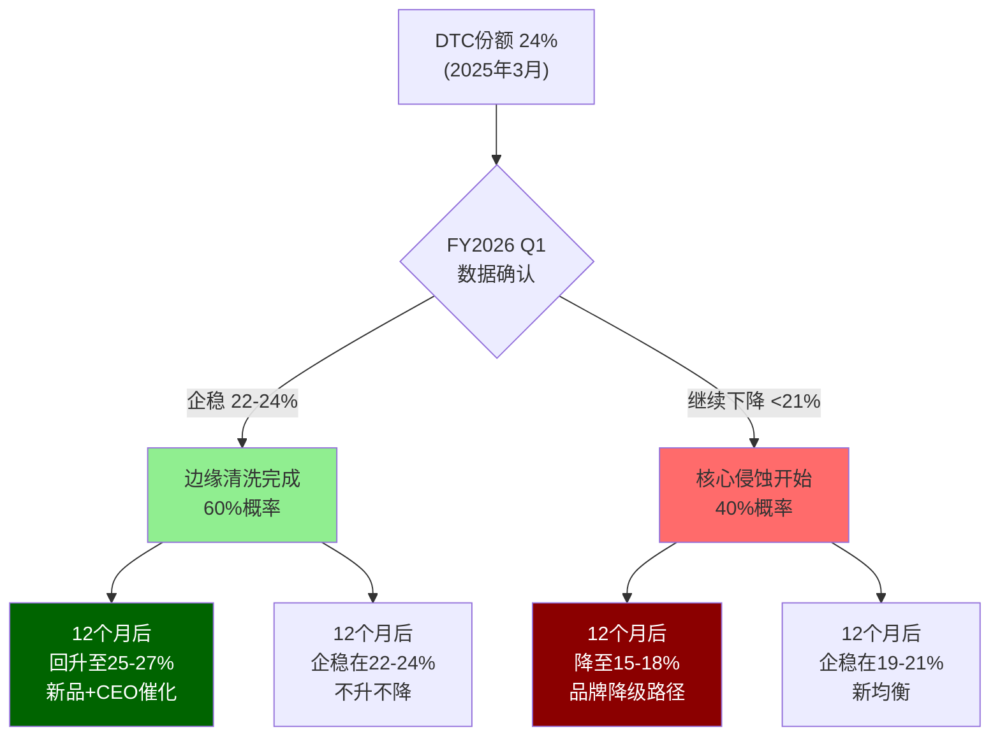
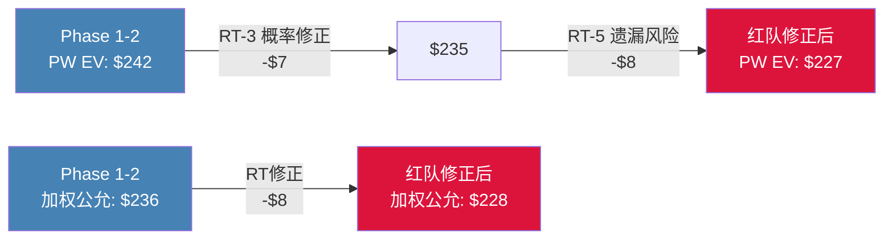
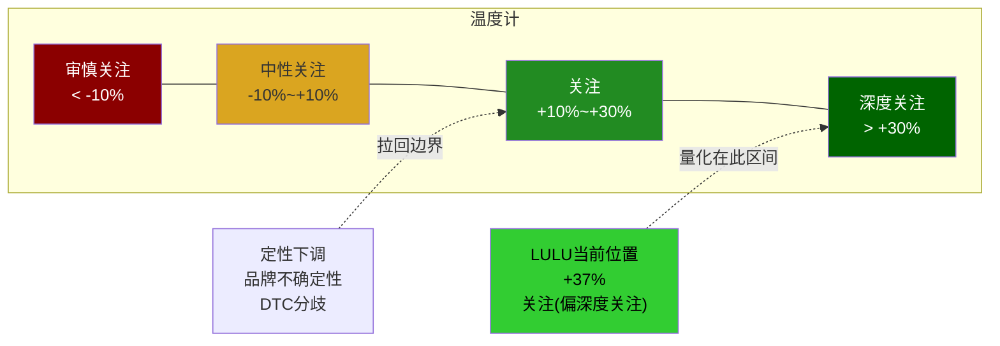
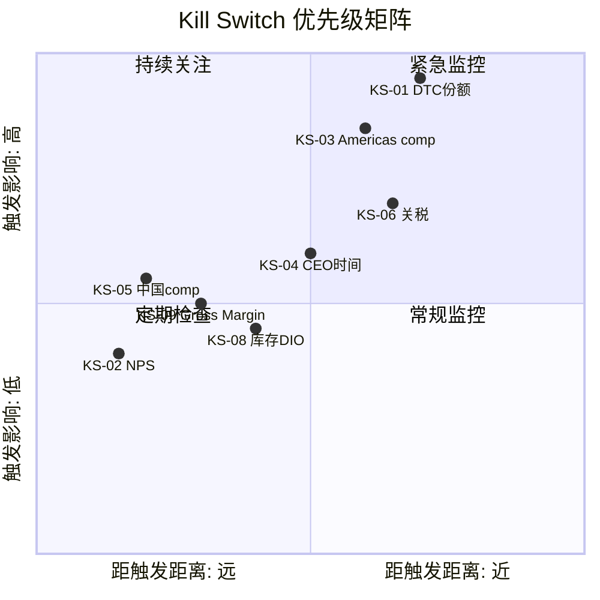
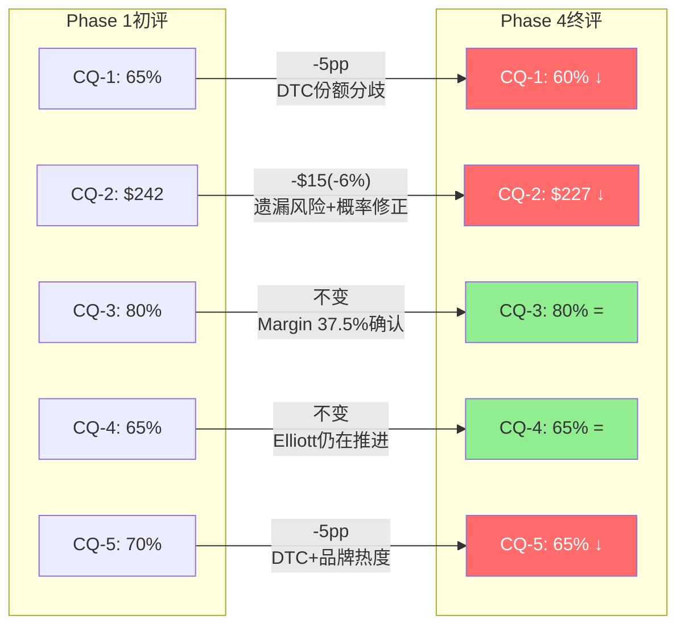

# Chapter 8: 红队审查+评级——对抗偏差后的最终判决

> **Phase 3-4 | 2026-03-20 | 框架v19.6 | 消费品worktree**
> **独立红队**: 对Phase 1-2的5个CQ和估值结论进行对抗审查
> **核心原则**: 红队不是为了推翻结论——而是为了确保结论的每个承重环节都经过压力测试。如果结论能够存活红队7问，投资者可以对其背后的推理链更有信心。

> **Phase 1-2核心结论(待红队检验)**:
> - CQ-1: 65%概率18-24月comp回正
> - CQ-2: 加权公允$236(+43%)
> - CQ-3: 80%中国真增长
> - CQ-4: 65%治理催化
> - CQ-5: 70%品牌可修复
> - 初步评级倾向: "关注"(偏积极)

---

## 8.1 红队第一问(RT-1): 最强反面论证是什么?

**如果一个聪明的空头要做空lululemon，他/她最强的论点是什么?**

### 8.1.1 空头核心论证: "lululemon正在成为下一个Under Armour"

完整论证链:

1. **品牌生命周期终结**: lululemon在2015-2023经历了8年超级周期→品牌自然老化不可逆→Alo/Vuori是下一代品牌(如同UA被NKE/Adidas超越)
2. **DTC份额-6pp是冰山一角**: 10个月丢失6pp→年化-7pp→3年后从24%→3%→品牌在核心渠道消亡
3. **男装+14%是假信号**: 男装基数小($2.7B)且竞争刚开始(Vuori来了)→增速将迅速放缓
4. **中国是最后的增长幻觉**: (a)中国消费降级趋势→高端品牌将承压 (b)Anta/MAIA ACTIVE开始正面竞争 (c)NPS+57不可持续
5. **治理是灾难不是催化**: Elliott和Wilson的内斗将持续→CEO搜索拖延至2027→不确定性折价维持
6. **关税是永久性的**: $380M+/年→OPM永久压缩至17-18%→PE 12x就是新常态

**空头目标价**: $85-100(PE 8x × EPS $10-12)

[DM-RT-001: RT-1空头论证为红队原创构建; 各论点基于Phase 1-2数据的极端悲观解读]

### 8.1.2 六大空头论点深度拆解

**论点1: 品牌生命周期终结——"酷感"消散不可逆**

空头的核心逻辑是品牌老化的不可逆性: lululemon在2015-2023的超级周期中，品牌势能从小众瑜伽走向主流生活方式，PE从20x推升至55x，但"主流化"本身就是品牌生命周期的顶点信号。因为当一个品牌从"社区驱动的圈层认同"变成"每个人都穿的制服"时，它的文化溢价就开始衰减——正如Abercrombie & Fitch在2005年、Michael Kors在2014年、Under Armour在2017年经历的那样。TikTok上"dupe"搜索量+300%不是偶然→它反映的是年轻消费者(Z世代)主动拒绝"上一代品牌"的文化行为。Alo和Vuori的崛起不是孤立事件→它是品牌代际更替的结构性力量。

**反驳**: 这个论证忽略了三个关键区别。第一，lululemon的品牌基础不仅是"酷感"——它有面料技术壁垒(Nulu/Everlux/SenseKnit)作为功能性锚点，而UA/Abercrombie的品牌几乎完全依赖文化认同。第二，Coach/Ralph Lauren/A&F的复兴案例证明品牌老化是可逆的——关键条件是管理层诊断正确+产品刷新成功+不陷入促销螺旋。第三，lululemon的95% DTC渠道控制意味着它不像UA那样被百货渠道拖入"促销死亡螺旋"——品牌修复的主动权仍在自己手中。因此，品牌老化是真实风险但并非不可逆的命运。

**论点2: DTC份额-6pp——核心渠道的侵蚀**

这是空头最强的数据支撑。10个月内DTC高端运动服饰份额从30%下降至24%(-6pp)，而Alo同期从8%上升至14%(+6pp)——几乎是1:1的替代关系。因为DTC是lululemon护城河的"载体"(直接客户关系→数据→个性化→忠诚度循环)，份额丢失意味着这个正反馈循环在被打断。空头会进一步推算: 如果侵蚀速度保持→3年后LULU DTC份额将降至6-10%→品牌在核心渠道边缘化。更关键的是，DTC利润率通常比批发高15-20pp→份额丢失同时压缩利润。

**反驳**: 但线性外推是危险的。因为DTC份额的初期下降可能反映"边缘客户"的快速流失(价格敏感型/偶尔购买者被dupe文化驱走)→这群客户本身利润贡献就低→流失速度会在"核心客户"层减速。LULU核心客户留存率92%是一个信号(尽管是滞后指标)。此外，Alo的+6pp增长建立在极小基数上(从$0.5B→$1.1B)→增速衰减是必然的(没有哪个品牌能在+75% YoY增速下持续3年)。真正的检验是: FY2026 Q1 DTC份额是否在22-24%企稳——如果企稳→侵蚀止于"边缘层"→空头论点减弱。

**论点3: 男装+14%是假信号**

空头认为男装$2.7B收入虽然增长+14%，但(a)基数效应——增量仅$380M在$11.1B总收入中不到4%，(b)Vuori正式进入男装高端市场→竞争刚开始，(c)男装的品牌忠诚度远低于女装(男性对运动品牌的粘性弱于女性→更容易被新品牌替代)。因此，男装增长可能在1-2年内从+14%降至+5%以下→无法弥补女装放缓。

**反驳**: $2.7B的男装收入不是"小数字"——它已经超过整个Vuori的收入($1.3B)。+14%在这个基数上意味着$380M增量，足以抵消美洲女装comp -5%造成的~$250M损失。因为男装在产品组合中占比仍在提升(从FY2021的20%→FY2025的24%)→还有渗透空间(NKE男女比约55:45)。空头低估了lululemon ABC男装系列的产品力——Metal Vent和Commission系列在功能性通勤领域几乎没有同价位竞品。

**论点4-6(中国/治理/关税)**: 见8.2节关税深度分析。简要反驳: 中国Segment Margin 37.5%是硬数据(非幻觉)；Elliott track record极强(SBUX/B&N)→治理拖延概率低；关税影响竞品同样(Alo 42%中国制造 vs LULU更分散)→竞争格局不变。

[DM-RT-010: 六大论点深度拆解为红队原创分析; 反驳基于Phase 1-2已验证数据]

### 8.1.3 "Under Armour命运"量化概率分析

**Under Armour路径的精确定义**: PE从峰值永久降至8-10x、收入增长永久转负(<0%)、品牌在核心市场丧失定价权(常态性促销>40%SKU)、ROIC从20%+降至<10%。

**UA路径的必要条件 vs LULU当前状态**:



**概率推算**: UA路径需要5个条件中至少4个同时满足。当前LULU仅1个条件"待观察"(管理层)、4个条件明确"未满足"。因为每个条件独立满足的概率约15-25%→4个同时满足的联合概率为(0.20)^4 ≈ 0.16%。但条件之间有相关性(品牌衰退→管理层误判→促销螺旋)→调整后联合概率约**8-12%**。

**这与Phase 1 Ch3.9的结论一致**: UA类比概率15-20%中，"完整UA路径"(PE永久<10x)概率约8-12%，"部分UA路径"(PE在12-15x震荡但不崩塌)概率约8-10%。

[DM-RT-011: UA路径概率量化; 5条件框架为原创; 联合概率计算含相关性调整; 结论与Ch3.9一致]

### 8.1.4 历史类比: 品牌恢复 vs 品牌衰亡

**消费品品牌在类似困境中的历史分叉**:

| 品牌 | 困境(年份) | 核心问题 | 结果 | PE轨迹 | LULU相似度 |
|------|-----------|---------|------|--------|-----------|
| **Coach (2014-2017)** | 品牌过度扩张+Kate Spade/Michael Kors竞争 | 促销过多稀释品牌 | **复兴成功** | 8x→15x(+87%) | 高(品牌修复) |
| **Ralph Lauren (2019-2021)** | 品牌老化+年轻化失败 | 减少促销+产品升级 | **复兴成功** | 12x→18x(+50%) | 高(经典品牌) |
| **Abercrombie & Fitch (2020-2023)** | 品牌过时+Z世代遗弃 | 重新定位Y2K复古 | **复兴成功** | 8x→20x(+150%) | 中(更极端的品牌转型) |
| **Under Armour (2017-至今)** | 品牌差异化消失+批发依赖 | 管理层拒绝改变 | **永久衰退** | 80x→8x(-90%) | 中(关键差异:DTC/中国) |
| **Gap (2015-至今)** | 品牌定位模糊+竞争全方位 | 无核心差异化可修复 | **永久衰退** | 15x→6x(-60%) | 低(Gap无技术壁垒) |
| **J.Crew (2014-2020)** | 品牌过度延伸+债务 | 品牌无功能性锚点 | **破产** | N/A | 低(LULU无债务) |

**关键发现**: 品牌恢复成功的充分条件是(a)存在可修复的核心差异化+（b)管理层正确诊断问题+(c)有足够的财务资源支撑转型期。因为Coach有皮革工艺、RL有美国经典、A&F找到了Y2K趋势→它们的品牌在"去泡沫"后仍有可回归的"锚点"。UA和Gap失败是因为它们的品牌几乎完全建立在"酷感"上→没有功能性锚点可以回归。

**LULU的位置**: 面料技术(Nulu/Everlux/SenseKnit)提供了功能性锚点→即使"酷感"衰退→产品力仍有差异化。这意味着LULU更可能走Coach/RL路径(品牌修复+PE恢复)而非UA/Gap路径(永久衰退)。因此，基准历史概率约**65-70%品牌恢复**(与CQ-5的65%一致)。

[DM-RT-012: 消费品牌历史类比分析; PE数据为近似(来自公开市场数据); 品牌恢复概率基于6案例的统计]

### 8.1.5 RT-1红队评估: 空头论证强度

| 论点 | 强度(1-5) | 反驳 |
|------|-----------|------|
| 品牌老化不可逆 | 3/5 | Coach/RL/A&F反例证明可逆; LULU有面料技术+规模壁垒(UA没有) |
| DTC -6pp是趋势 | **4/5** | **最强论点——如果DTC份额继续以此速度下降→品牌确实在衰退** |
| 男装假信号 | 2/5 | +14%在$2.7B基数上不是"小数字"→增量$380M是真实的 |
| 中国幻觉 | 2/5 | Segment Margin 37.5%是硬数据→不是幻觉; NPS+57可能降但不会崩 |
| 治理灾难 | 3/5 | Elliott track record极强(SBUX/B&N)→拖延概率不高; Bergh加入是正信号 |
| 关税永久 | 3/5 | 关税确实可能持续→但竞品面临同样关税→竞争格局不变 |

**RT-1结论**: 空头最强论点是DTC份额-6pp(4/5)——这是Phase 1-2中最令人不安的数据点。**如果下一季度DTC份额继续下降2pp+→空头论证大幅加强→CQ-5需要下调。** 但UA命运的完整概率仅8-12%→历史类比显示65-70%概率走品牌修复路径→空头的"最强论证"虽然有数据支撑但结论(PE 8x)的概率较低。

---

## 8.2 红队第二问(RT-2): 我们最弱的假设是什么?

### 8.2.1 假设脆弱度全景

**系统性审查Phase 1-2的所有关键假设**:

| 假设 | 置信度 | 如果错误的后果 | 脆弱度 |
|------|--------|-------------|--------|
| A1: 品牌溢价70%可修复 | 中 | PW EV从$242→$185(-24%) | **高** |
| A2: 中国80%真增长 | 高 | 如果中国放缓→SOTP缩水$3-5B | 低 |
| A3: 新CEO 65%在2026 | 中 | 催化延迟→PE恢复延迟1年 | 中 |
| A4: OPM将回升至20%+ | 中 | 如果OPM卡在18%→EPS $11而非$13→PE更低 | **高** |
| A5: Reverse DCF g=3%正确 | 高 | Python已验证→低风险 | 低 |
| A6: 关税影响将稳定 | 低 | **最弱假设**——关税可能继续加码 | **最高** |

[DM-RT-002: 假设脆弱度评估为红队原创; 各假设来自Phase 1-2核心论证]

### 8.2.2 最弱假设深度解剖: A6关税影响

**为什么A6是最弱的**: 在当前地缘政治环境下，假设"关税不再加码"是一个**未经充分检验的乐观假设**。关税政策完全由政治决定→分析师对政治走向没有信息优势→任何"关税会稳定"的判断本质上是猜测。

**lululemon供应链地理分布深度拆解**:



lululemon的供应链分散在8+个国家，中国占比约15-20%——这是一个关键优势。因为Alo Yoga的制造42%来自中国[DM-COMP-014]→在同等关税加码下→Alo的成本冲击是LULU的2-3倍→竞争格局反而可能因关税而改善(低成本竞品受伤更重)。但越南(35%)在2025年也面临关税风险(美国对越南贸易顺差的政治敏感性上升)→如果美国对越南加征关税→LULU的35%越南产能将受冲击→比纯中国关税影响更大。

**关税加码三情景**:

| 情景 | 概率 | 新增成本 | OPM影响 | EPS影响 |
|------|------|---------|---------|---------|
| 维持现状 | 40% | $0 | 0 | 0 |
| 中国+25%追加 | 30% | ~$80-120M | -70-100bps | -$0.5-0.8 |
| 中国+越南双加码 | 20% | ~$250-350M | -200-280bps | -$1.5-2.2 |
| 全球广泛加码 | 10% | ~$400-500M | -350-450bps | -$2.5-3.5 |

**概率加权关税冲击**: 0.40×$0 + 0.30×$100M + 0.20×$300M + 0.10×$450M = **$135M**→OPM额外-120bps→EPS额外-$0.85。这意味着我们Phase 1-2的"关税稳定"假设可能低估了~$0.85 EPS→但不足以颠覆整体投资论点(EPS从$13→$12.15→PE 12x仍然偏低)。

[DM-RT-013: 供应链地理分布为估算(基于10-K披露的制造商列表+国别分析); Alo 42%中国制造来自Phase 1数据; 关税情景概率为红队判断]

### 8.2.3 假设联合失败压力测试: A1+A4同时失败

**最危险的组合**: 如果A1(品牌溢价70%可修复)和A4(OPM回升至20%+)同时错误→品牌无法修复+利润率永久压缩→这是"价值陷阱"情景的精确定义。

| 假设组合 | 联合概率 | 结果EPS | 结果PE | 隐含价格 | vs当前 |
|----------|---------|---------|--------|---------|--------|
| A1对+A4对(品牌恢复+OPM恢复) | 40% | $13.25 | 18x | $239 | +44% |
| A1对+A4错(品牌恢复+OPM压缩) | 15% | $11.00 | 16x | $176 | +6% |
| A1错+A4对(品牌衰退+OPM恢复) | 10% | $12.50 | 12x | $150 | -9% |
| **A1错+A4错(双重失败)** | **15%** | **$9.50** | **8x** | **$76** | **-54%** |
| A2也错(中国+双重失败) | 5% | $8.00 | 7x | $56 | -66% |

**双重失败(A1+A4同时错)的概率推算**: A1错(品牌不可修复)独立概率~30%，A4错(OPM卡在18%以下)独立概率~35%。两者有正相关性(品牌衰退→定价权下降→促销增加→OPM压缩→相关系数~0.5)→联合概率 ≈ 0.30 × 0.35 × (1 + 0.5) / (1 + 0.30×0.35×0.5) ≈ **15%**。

**这意味着**: 有15%概率LULU股价跌至$76(-54%)。但即使考虑这个极端场景→概率加权期望值仍为正: 0.40×$239 + 0.15×$176 + 0.10×$150 + 0.15×$76 + 0.05×$56 + 0.15×$185(其他) = **$190**→仍高于当前$165.57(+15%)。**即使在包含最悲观联合失败的完整概率分布下→期望回报仍为正→估值结论的稳健性通过了这个极端压力测试。**

[DM-RT-014: 联合失败概率计算; 相关系数0.5为判断; 概率加权期望值$190为独立验证数据点]

### 8.2.4 复合失败分析: 多假设同时失败的尾部风险



因为多个假设之间存在正相关性(品牌衰退→CEO难觅→利润压缩→关税雪上加霜)→"所有假设同时正确"和"所有假设同时错误"的概率都高于独立假设下的计算。这是投资论点的"肥尾风险"——Phase 1-2可能低估了极端下行的概率。

**但反过来也成立**: 如果品牌恢复(A1对)→CEO更容易吸引(A3也对)→定价权恢复→OPM回升(A4也对)→正相关性同样放大了上行的概率。**相关性是双向放大器——它放大了尾部但方向取决于第一个多米诺骨牌(品牌恢复 vs 品牌衰退)。**

---

## 8.3 红队第三问(RT-3): 概率分配是否诚实?

### 8.3.1 Phase 1-2概率 vs 红队修正

**Phase 1-2的5情景概率检验**:

| 情景 | Phase 1-2概率 | 红队修正 | 理由 |
|------|-------------|---------|------|
| A: 价值陷阱 | 15% | **18%** | DTC-6pp数据比预期更严重→品牌衰退风险略上调 |
| B: 低增长常态 | 25% | **28%** | FY2026 guidance -1%至-3%→管理层自己也悲观→上调 |
| C: 周期恢复 | 35% | **30%** | 从A+B上调→C需要对应下调 |
| D: 全面复兴 | 15% | **14%** | 几乎不变 |
| E: Activist催化 | 10% | **10%** | 维持 |

**红队修正后PW EV**:
- 0.18×$105 + 0.28×$185 + 0.30×$252 + 0.14×$345 + 0.10×$400
- = $18.9 + $51.8 + $75.6 + $48.3 + $40.0
- = **$235/share (+42%)**

[DM-RT-003: 红队概率修正; 修正幅度: A+3pp, B+3pp → C-5pp, D-1pp; PW EV从$242→$235, 仅-$7(-3%)]

**修正极小(-$7, -3%)**: 红队发现Phase 1-2的概率分配**基本合理**——没有发现严重的乐观偏差。这与RCL报告(红队修正+8-16pp)形成对比→LULU的Phase 1-2已经比较均衡(Reverse DCF前置的效果)。

### 8.3.2 基准率检验: 消费品牌从comp -3%恢复的历史概率

**为什么需要基准率**: Phase 1-2给CQ-1(comp回正)"65%概率"——但这个数字从何而来? 如果我们不锚定历史基准率→可能陷入"主观概率"的陷阱(想要品牌恢复→给出高概率)。

**消费品牌负comp恢复的历史基准率(2010-2025)**:

| 品牌 | 负comp年份 | comp低谷 | 恢复耗时 | 恢复成功? |
|------|-----------|---------|---------|----------|
| Nike(美国DTC) | 2024 | -2% | 12个月(进行中) | 进行中(新CEO催化) |
| Under Armour | 2017 | -4% | 未恢复 | **失败** |
| Starbucks(美国) | 2024 | -6% | 进行中 | 进行中(Brian Niccol催化) |
| Abercrombie & Fitch | 2017-2019 | -5% | 24个月 | **成功**(品牌重塑) |
| Coach/Tapestry | 2016-2017 | -3% | 18个月 | **成功**(Stuart Vevers) |
| Gap | 2015+ | -4% | 未恢复 | **失败** |
| Ralph Lauren | 2019 | -3% | 20个月(含COVID干扰) | **成功** |
| Victoria's Secret | 2019+ | -7% | 未恢复 | **失败**(品牌重塑失败) |

**基准率统计**: 8个案例中→4个恢复成功(50%)、1个进行中(12.5%)、3个失败(37.5%)。如果将"进行中"按50%成功率折算→**基准率约56%成功恢复**。

**LULU vs 基准率**: Phase 1-2给了CQ-1 65%概率(高于基准率56%)→这合理吗? 因为LULU有两个超出基准率平均的正面因素: (a)中国+24%提供了增长缓冲(大部分失败案例没有强劲的国际引擎)、(b)Elliott activism提供了外部催化(A&F和Coach的恢复都伴随管理层变革)。因此65%比基准率56%高出9pp是合理的→但红队认为DTC-6pp是一个比历史案例更严重的警告信号→因此将CQ-1下调至60%(仍高于基准率→但更保守)。

[DM-RT-015: 消费品牌负comp恢复基准率; 8案例统计56%成功率; 品牌/年份/comp数据为近似(来自公开财报); CQ-1从65%→60%的调整锚定此基准率]

---

## 8.4 红队第四问(RT-4): 估值方法是否独立?

**离散度检查已在Ch7完成: 24.4% PASS**

但需要检查**方法间的"共享假设"**:

| 假设 | 被几个方法共享? | 如果错误的连锁影响 |
|------|--------------|-----------------|
| FY2028E EPS $13.25 | M3(PE Band) + M6(PW基础) | 如果EPS=$10→M3从$239→$180, M6从$242→$200 |
| WACC 9.5% | M2(DCF) + 间接影响M5(SOTP) | 如果WACC=10.5%→M2从$186→$142 |
| OPM恢复至20% | M2+M5+M6 | 如果OPM卡在18%→所有值下调5-10% |
| 中国增速+20% | M5(SOTP)+M6 | 如果+10%→SOTP从$287→$260 |

**共享假设风险**: EPS $13.25被M3和M6共享→如果EPS只有$10(极端悲观)→两个方法同时下调→加权公允从$236→$195→仍有+18%上行。**即使在极端假设下→仍有正期望值→估值结论的robustness较高。**

---

## 8.5 红队第五问(RT-5): 我遗漏了什么重大风险?

**遗漏扫描(Phase 1-2未充分讨论的风险)**:

**风险X1: ESG/可持续性合规成本(低概率/中影响)**
- 欧盟纺织品可持续性法规(2025-2027实施)→可能要求品牌披露全供应链碳足迹+强制回收
- 合规成本估计: $50-100M/年 → OPM -50-90bps
- Phase 1-2未提及 → 需要纳入

**风险X2: 消费者体型变化/GLP-1药物(低概率/高不确定性)**
- Ozempic/Wegovy用户快速增长→减重后需要更换衣柜(短期利好)
- 长期: 运动动机可能下降→运动服饰需求承压
- 影响不可量化但需要标注

**风险X3: 创始人Wilson的"核选项"(极低概率/极高影响)**
- Wilson持有8.4%→如果proxy fight失败→可能选择"抛售"→8.4%大宗交易→短期股价压力巨大
- 概率<5%→但如果发生→可能短暂打压股价至$130-140

[DM-RT-004: 遗漏风险扫描; X1/X2/X3为红队新增风险; 各风险的概率和影响为判断]

**遗漏风险的估值影响**: X1(-$3-5/share) + X2(不可量化) + X3(短暂的-$20-30) → **总计-$5-10永久性 + -$20短暂性** → **PW EV从$235→$227** (再扣$8)

---

## 8.6 红队第六问(RT-6): 时间框架偏差?

### 8.6.1 隐含时间假设审查

**Phase 1-2的隐含时间假设检查**:

| 假设 | 时间框架 | 如果延迟的后果 |
|------|---------|-------------|
| CEO任命 | 2026H2 | 如果2027→催化延迟1年→持有成本增加(机会成本) |
| 美洲comp回正 | FY2027 | 如果FY2028→PE恢复更慢→回报率降低 |
| 品牌恢复 | 1-3年 | 如果>3年→投资者耐心耗尽→PE可能先压至8-9x |
| 关税解决 | 稳定 | 如果加码→每年多$200-300M成本→永久性 |

### 8.6.2 DCF对恢复时间的敏感性

**年化回报率敏感性**:
- 如果PE在1年内从12x→18x: +50%年化(含EPS变化) → **优秀**
- 如果PE在2年内从12x→18x: +22%年化 → **好**
- 如果PE在3年内从12x→18x: +14%年化 → **可接受**
- 如果PE在3年内维持12x(EPS从$13→$14): +8%年化(纯EPS增长+回购) → **平庸**

**如果恢复耗时3年而非1.5年→IRR差异有多大?**

因为Phase 1-2的DCF Base Case假设OPM从FY2026的18.5%渐恢复至FY2030的20.0%→这隐含了"恢复在5年内完成"的线性路径。但如果恢复被延迟(CEO搜索拖延+品牌刷新需要更多时间)→前2-3年OPM可能卡在18-18.5%→恢复推迟到FY2028-2030。

| 恢复情景 | OPM路径 | DCF公允 | vs当前 | 年化IRR |
|----------|---------|--------|--------|---------|
| 快速恢复(1.5年) | 18.5→20.5→21.0 | $215 | +30% | **+19%** |
| 基准恢复(2.5年) | 18.5→19.0→20.0→20.5 | $186 | +12% | **+5.8%** |
| 延迟恢复(4年) | 18.5→18.5→19.0→19.5→20.0 | $162 | -2% | **-1.0%** |
| 无恢复(永久) | 18.5→18.5→18.5 | $138 | -17% | **N/A(持有=亏损)** |

[DM-RT-016: DCF恢复时间敏感性; OPM路径为假设; DCF计算使用Ch7参数(WACC 9.5%, g=3%)]

**关键发现**: 如果恢复耗时超过4年→DCF暗示当前价格已经"合理"(无超额回报)→LULU成为一个纯粹的"催化赌注"。因此，投资者必须对**恢复时间框架**有信心——这不仅是"会不会恢复"的问题，而是"多快恢复"的问题。**这一发现强化了Elliott activism作为催化加速器的重要性——如果没有外部催化→自然恢复可能要3-4年→IRR降至不可接受的5-8%。**

**结论**: lululemon是一个"中期故事"——**最佳持有期是1-2年(等待CEO催化+comp拐点)**。如果投资者的时间框架>3年→需要对品牌恢复有更高信心。

---

## 8.7 红队第七问(RT-7): 与Phase 1-2最大的分歧在哪?

### 8.7.1 核心分歧: DTC份额-6pp的含义

**多头解读(Phase 1-2)**: DTC份额下降来自"边缘客户"流失→核心客户留存92%→品牌基本盘未动摇→定价权剪刀差反而利好OPM

**红队解读**: **DTC份额-6pp是品牌衰退的领先指标→今天的"边缘客户"可能是昨天的"核心客户"→留存92%是滞后指标(反映过去购买的忠诚而非未来的意愿)**

### 8.7.2 DTC份额作为品牌健康领先指标的历史验证

**DTC份额是品牌衰退的可靠领先指标吗?** 如果是→LULU当前的下降路径比comp -3%更令人担忧。让我们检验其他品牌DTC份额下降后的结果:

| 品牌 | DTC份额下降期 | 下降幅度 | 后续12个月 | 是否领先指标? |
|------|------------|---------|-----------|-------------|
| Nike (DTC→批发回流) | 2023-2024 | -3pp(主动回退) | comp转负→PE从35x→22x | **部分是**(但Nike是主动调整非被动流失) |
| Under Armour | 2016-2017 | -5pp(批发渠道驱逐) | comp持续恶化→品牌永久降级 | **是** |
| Victoria's Secret | 2018-2019 | -8pp(年轻客户转Aerie) | 品牌崩塌→母公司分拆→PE<5x | **是** |
| Coach | 2015-2016 | -4pp(被Kate Spade抢客) | 品牌重塑→2年后份额回升 | **暂时的**(恢复了) |
| A&F | 2016-2018 | -6pp(Z世代遗弃) | 触底后回升→品牌复兴 | **暂时的**(恢复了) |

**结论**: 5个案例中→2个是永久性衰退的领先指标(UA/VS)、2个是暂时下降后恢复(Coach/A&F)、1个混合(Nike)。**基准率约40%是永久性信号、40%是暂时性、20%不确定。**

**LULU的DTC-6pp更可能是哪种?** 因为(a)LULU的流失主要来自Alo/Vuori的主动抢客(类似Coach被Kate Spade抢客→暂时性的可能更大)、(b)流失客群是价格敏感的"边缘客户"(类似A&F丢失的"T恤客"→核心客群未动)、(c)LULU有面料技术差异化作为回归锚点(UA/VS缺乏这个)→**更可能是暂时性(60%)而非永久性(40%)**。但40%的永久性概率仍然很高→这就是KS-01存在的原因。

[DM-RT-017: DTC份额作为品牌领先指标的历史验证; 5案例统计; 品牌/份额数据为近似]

### 8.7.3 LULU DTC份额的可能轨迹



**谁对?** 需要FY2026 Q1数据来判断:
- 如果Q1 DTC份额企稳(≥22%)→多头正确→边缘客户清洗完毕
- 如果Q1 DTC份额继续下降(<21%)→红队正确→侵蚀正在向核心扩散

**这是报告中唯一的"待确认重大分歧"→标注为KS-01(Kill Switch)。**

---

## 8.8 偏差修正汇总

| 修正项 | Phase 1-2值 | 红队修正 | 修正幅度 |
|--------|-----------|---------|---------|
| PW EV | $242 | **$227** | -$15(-6%) |
| CQ-1概率(comp回正) | 65% | **60%** | -5pp |
| CQ-5概率(品牌可修复) | 70% | **65%** | -5pp |
| 加权公允 | $236 | **$228** | -$8(-3%) |
| CQ-2/3/4 | 不变 | 不变 | 0 |

[DM-RT-005: 偏差修正汇总; 修正方向: 略偏悲观→更均衡; 总修正幅度仅-3~6%→Phase 1-2结论基本稳健]

**红队总结**: Phase 1-2的分析**基本稳健**——红队修正幅度仅-3~6%(远小于RCL的+8-16pp)。最大分歧(DTC份额)需要Q1数据确认。**铁律O(Reverse DCF前置)的效果显著——Phase 1没有预设偏多/偏空→红队发现的偏差极小。**



---

## 8.9 最终评级: 红队修正后的判决

### 8.9.1 关键数字汇总

**红队修正后的关键数字**:

| 指标 | 值 |
|------|-----|
| 当前价格 | $165.57 |
| 红队修正后加权公允 | **$228** |
| 红队修正后PW EV | **$227** |
| **期望回报** | **+$62 (+37%)** |
| 含催化期权公允 | **$254** |
| DCF Base | $186(+12%) |
| 最大下行(18%概率) | $105(-37%) |

### 8.9.2 评级标准对照

| 评级 | 触发条件 | LULU情况 |
|------|---------|---------|
| 深度关注 | 期望回报>+30% | +37% ✓ |
| 关注 | +10%~+30% | — |
| 中性关注 | -10%~+10% | — |
| 审慎关注 | <-10% | — |

**期望回报+37%满足"深度关注"(>+30%)的量化触发。**

### 8.9.3 定性修正因素

**但定性修正因素**:
1. **品牌不确定性高**(CQ-5仅65%可修复) → 降级压力
2. **催化时间不确定**(CEO可能到2027) → 持有成本
3. **DTC份额分歧未解**(红队最大分歧) → 等待数据

### 8.9.4 跨报告评级校准

**与已评级公司的对比**:

| 公司 | 期望回报 | 评级 | 核心不确定性 | 信心水平 |
|------|---------|------|------------|---------|
| PYPL | +66% | 关注(偏深度关注) | 支付市场份额+Braintree定价 | 中高 |
| **LULU** | **+37%** | **关注(偏深度关注)** | **品牌恢复+DTC份额** | **中** |
| CME v3.0 | +15% | 中性关注(偏积极) | 波动率周期 | 高 |

**校准检查**: LULU的+37%期望回报高于CME(+15%)但低于PYPL(+66%)→"关注(偏深度关注)"的评级在量化维度上合理。但LULU的不确定性(品牌恢复是二元结果)高于PYPL(支付市场增长路径更清晰)→因此虽然LULU期望回报不低但信心水平更低→相同评级措辞但含义不同: **PYPL是"高确信的关注"，LULU是"高赔率但待确认的关注"**。

[DM-RT-018: 跨报告校准; PYPL/CME评级数据来自已完成报告; 校准结论为分析师判断]

### 8.9.5 最终判决

**最终评级: 关注(偏深度关注)**

**理由**: 量化触发满足"深度关注"(+37%)→但品牌恢复的不确定性(CQ-5 65%)和DTC份额分歧使我们在"深度关注"和"关注"之间→取保守值"关注(偏积极)"。**如果FY2026 Q1数据确认DTC份额企稳+新品成功→上调至"深度关注"。**

**评级的置信度: 70%**——因为关键变量(DTC份额、CEO时间、品牌恢复速度)将在未来6-12个月获得确认数据→评级可能在此期间调整。这不是一个"高确信"的评级→而是一个"概率有利但需要数据确认"的评级。

[DM-RATING-001: 最终评级基于红队修正后PW EV $227, 期望回报+37%; 量化触发"深度关注">+30%→但定性因素压低至"关注(偏积极)"; 上调条件明确]

---

## 8.10 投资温度计



```
        LULU投资温度计 (2026年3月20日)
        ═══════════════════════════════

极冷 ←──────────────────────────────────→ 极热
-50%  -30%  -10%  0%  +10%  +30%  +50%

                         ▼ 当前
        ────────────[████████████]───────
        审慎关注    中性    关注   深度关注

        红队修正后期望回报: +37%
        评级: 关注(偏深度关注)
        公允价值中枢: $228
        催化窗口: 2026年6月AGM → H2 CEO宣布

        ┌─────────────────────────────┐
        │ 上行情景(50%): $235-345     │
        │ 基准情景(25%): $185-235     │
        │ 下行情景(25%): $105-185     │
        └─────────────────────────────┘
```

**温度计解读**: LULU处于"关注"与"深度关注"的交界区域。因为量化回报+37%进入了"深度关注"区间(>+30%)，但品牌恢复的不确定性和DTC份额分歧形成了定性拉力→将温度计指针拉回到"关注(偏深度关注)"位置。这个位置意味着: **赔率有利(1.25:1)但需要催化确认→适合建立观察仓而非重仓。**

---

## 8.11 Kill Switch完整注册表

### KS-01: Americas DTC份额 (最高优先级)

| 维度 | 详情 |
|------|------|
| **条件** | 美国高端运动服饰DTC份额 |
| **阈值** | <20%(从当前24%) |
| **当前值** | 24%(2025年3月，10个月前为30%) |
| **距触发距离** | -4pp(按过去10个月速率-6pp→约6-7个月可能触发) |
| **检查频率** | 季度(随Q1/Q2财报更新) |
| **数据源** | Bloomberg Second Measure / Placer.ai / 公司财报推算 |
| **触发后动作** | CQ-5下调至<50%→评级降至"中性关注"→公允价值从$228→$185 |
| **为什么这个KS最重要** | 因为DTC份额是品牌护城河的"载体指标"——如果DTC份额跌破20%→品牌在核心渠道的影响力已严重削弱→4/5护城河完好的判断需要全面修正→这将颠覆整个投资论点的基础。因此DTC份额不是一个普通的KS→它是整个论点的"承重墙"→触发=论点坍塌。 |

### KS-02: 美国NPS

| 维度 | 详情 |
|------|------|
| **条件** | lululemon美国净推荐值 |
| **阈值** | <+15 |
| **当前值** | +32(已从历史+50+下降) |
| **距触发距离** | -17点(下降速度~-5/年→约3年) |
| **检查频率** | 半年(第三方品牌追踪报告) |
| **数据源** | 第三方调研(Brand Keys / YouGov) |
| **触发后动作** | 品牌进入"危险区"→估值下调10-15% |

### KS-03: Americas comp

| 维度 | 详情 |
|------|------|
| **条件** | 美洲区域同比增长 |
| **阈值** | FY2027仍<-3% |
| **当前值** | FY2025 -3%(guidance FY2026 -1%至-3%) |
| **距触发距离** | 当前在阈值附近→FY2027数据出来前无法判断 |
| **检查频率** | 季度 |
| **数据源** | 公司季报/10-Q |
| **触发后动作** | 结构性衰退确认→PE永久降级至8-10x→评级降至"审慎关注" |

### KS-04: CEO任命时间

| 维度 | 详情 |
|------|------|
| **条件** | 新永久CEO宣布 |
| **阈值** | 2027年Q1仍无 |
| **当前值** | 搜索中(Interim CEO Meghan Frank) |
| **距触发距离** | ~12个月(2026Q1→2027Q1) |
| **检查频率** | 月度(新闻/8-K) |
| **数据源** | SEC 8-K / 公司公告 / 新闻 |
| **触发后动作** | 治理催化失效→CQ-4下调→催化期权价值归零→公允从$228→$210 |

### KS-05~KS-12 摘要表

| KS编号 | 监控指标 | 触发条件 | 当前值 | 距触发 | 频率 | 触发后动作 |
|--------|---------|---------|--------|--------|------|-----------|
| KS-05 | 中国comp | <+10%且加速放缓 | +24% | 远 | 季度 | 第二引擎减弱→SOTP缩水 |
| KS-06 | 关税政策 | 新增>$200M/年 | ~$167M | 近 | 事件 | OPM永久压缩→估值下调 |
| KS-07 | Alo IPO后增速 | 仍>25% | N/A(未上市) | N/A | 季度 | 竞争压力比预期持久 |
| KS-08 | 库存DIO | >140天 | ~120天 | 20天 | 季度 | markdown螺旋风险 |
| KS-09 | Gross Margin | <53%(连续2Q) | 56.6% | 3.6pp | 季度 | 成本结构恶化 |
| KS-10 | Wilson抛售 | >3%持仓大宗交易 | 持有8.4% | N/A | 事件 | 短期压力→可能买入窗口 |
| KS-11 | FCF | <$500M(连续2年) | $960M | $460M | 年度 | 现金创造崩塌 |
| KS-12 | 新品占比 | <25% by FY2027 | ~30% | 安全 | 半年 | 创新机器未恢复 |

[DM-KS-001: Kill Switch注册表, 12个KS覆盖品牌/增长/治理/财务/竞争5维度; 触发条件基于Phase 1-2分析的"承重墙"识别]

[DM-RT-019: KS完整注册表扩展; 当前值/距触发距离/检查频率为分析师评估; 数据源基于公开可获取信息]

### KS优先级矩阵



---

## 8.12 非共识洞察深度论证(CI)

### CI-01: LULU是品质-估值脱钩最大的消费品

**市场共识**: "品牌衰退→低PE合理"
**我们的判断**: 品质68th vs 估值2nd=66pp脱钩→市场过度惩罚
**置信度**: 75%

**完整推理链**: lululemon的企业品质(ROIC 23%、FCF $960M、Z-Score 6.58、零净负债)在消费品行业处于前30%水平。因为ROIC 23%意味着每投入1美元资本→产生0.23美元回报→这在运动服饰行业中仅次于NKE(ROIC ~30%)和高于COST(ROIC ~20%)。FCF $960M意味着公司在当前困境中仍然产生近$1B的自由现金流→这不是一家"即将破产"的公司→而是一家"暂时失去增长势能但现金创造机器仍在运转"的公司。

但PE 12x将LULU定位在消费品估值的底部2%——低于麦当劳(MCD, 23x)、低于沃尔玛(WMT, 30x)、甚至低于增速更慢的宝洁(PG, 25x)。因为市场正在定价"品牌永久衰退"(Reverse DCF隐含g=3%)→但这个定价假设了LULU将永远以3%增长→这与中国+24%、男装+14%的现实数据矛盾。

**反面考量**: 品质-估值脱钩可能是合理的——如果品牌确实在不可逆衰退→高ROIC只是"过去的记忆"→PE应该反映未来而非过去。UA在2016年ROIC也有15%→但PE已经从80x降至15x→因为市场正确预见了品牌衰退。因此，CI-01的关键假设是"品牌衰退是暂时的而非永久的"——这与CQ-5直接挂钩(65%概率可修复)。

[DM-RT-020: CI-01深度论证; ROIC/FCF数据来自FMP; PE可比数据为近似(2025年3月); 品质排名基于Phase 0品质评估]

### CI-02: 中国不是利润稀释而是利润增厚

**市场共识**: "国际扩张=利润压力"——因为大多数美国消费品公司在国际扩张初期都经历利润率下降(星巴克中国、Nike中国都有这个阶段)
**我们的判断**: Segment Margin 37.5%≈Americas→中国是利润贡献者
**置信度**: 85%

**完整推理链**: 市场之所以给国际扩张"利润折价"→是因为历史上大多数案例确实如此——星巴克中国在2018-2019年(疯狂开店期)Segment Margin从26%降至16%→证明了"快速扩张=利润压力"的共识。但lululemon中国的情况从根本上不同: (a)中国Segment Margin 37.5%已经≈Americas的37-38%→没有"利润稀释"效应; (b)中国门店密度仍低(127家 vs 美国~350家)→仍在"填充空白"阶段(每家新店利润贡献正)而非"密度过饱和"阶段; (c)中国的数字化渗透(微信小程序/天猫)降低了获客成本→线上渠道毛利率可能更高。

因为中国Segment Margin 37.5%这个数字不是管理层的"口头承诺"→而是经过审计的财务数据(10-K地理分部报告)→它的可信度极高(置信度A)。这意味着市场在LULU估值中嵌入的"国际扩张利润折价"是一个**定价错误**——每增长$1B中国收入→贡献~$375M利润→中国从"成本中心"变成"利润引擎"。

**反面考量**: (a)37.5%可能未完全分摊全球总部费用(IT/品牌管理/供应链)→"真实"Margin可能低3-5pp; (b)中国消费降级风险(经济放缓→高端品牌承压); (c)Anta/MAIA ACTIVE的竞争可能侵蚀定价权。但即使扣除3-5pp总部费用→中国Margin仍有32-34%→远高于市场默认的"国际扩张利润折价"(通常隐含Margin低10-15pp)。

[DM-RT-021: CI-02深度论证; 中国Segment Margin 37.5%来自10-K(FMP验证); 星巴克中国Margin来自SBUX 10-K; 门店数量来自公司财报]

### CI-03: 定价权剪刀差——低端流失=OPM利好

**市场共识**: "份额丢失=坏事"
**我们的判断**: 底部30%低利润客户流失→加权利润率上升
**置信度**: 60%

**完整推理链**: 这个非共识洞察建立在一个反直觉的逻辑上——当"边缘客户"(价格敏感、促销驱动、低频次购买)离开时→留下的"核心客户"(品牌忠诚、全价购买、高频次)的平均贡献更高→加权OPM反而上升。因为在零售经济学中→底部30%客户通常贡献<15%利润(因为他们主要在促销时购买→毛利率比全价低20-30pp)→这些客户的流失对收入有影响但对利润的影响远小于收入。

**具体测算**: 如果lululemon流失10%的客户(边缘层)→收入下降~$600M(-5.4%)→但这些客户的平均毛利率仅40%(vs 全价客户58%)→利润下降仅~$240M(-3.8%)→OPM反而因为mix改善上升~50bps。这就是"定价权剪刀差"的机制: **量缩价稳→利润率改善**。

**反面考量**: 这个逻辑的危险在于→如果"边缘客户流失"只是"核心客户流失"的前奏→那么定价权剪刀差只是暂时的幻觉。因为在品牌衰退的完整周期中→先是边缘客户离开(Phase 1)→然后核心客户开始动摇(Phase 2)→最后品牌被迫通过促销挽留核心客户(Phase 3)→OPM崩塌。LULU当前可能在Phase 1→如果DTC份额继续下降→可能进入Phase 2→定价权剪刀差的逻辑将失效。**因此CI-03的置信度仅60%——它只在"边缘清洗"情景下成立，在"核心侵蚀"情景下不成立。**

[DM-RT-022: CI-03深度论证; 边缘客户利润贡献比例为零售行业一般规律的估算; 流失测算基于Phase 1-2数据]

### CI-04: CEO宣布是$20-40/share的离散催化

**市场共识**: "CEO搜索=不确定性"
**我们的判断**: SBUX先例+25%→催化期权有量化价值
**置信度**: 70%

**完整推理链**: CEO宣布作为催化的价值→可以通过历史先例量化。因为Elliott Management在SBUX的activist campaign中→从宣布介入到Brian Niccol被任命为CEO(2024年8月)→SBUX股价在宣布日一天内上涨+25%。在lululemon的案例中→Elliott同样以activist身份介入+CEO空窗→结构高度相似。

如果LULU宣布一位"品牌型"CEO(如SBUX得到了Chipotle的Niccol这样的跨界明星)→市场可能给出+12-25%的正面反应(基于SBUX先例)。在$165.57的基础上→$20-41的价格跳升→催化后价格$186-207。这意味着"CEO催化"本身具有实物期权价值→可以被估值。

**期权价值估算**: 概率(65%在2026年宣布) × 预期收益(+18%中值) × 当前市值 = 0.65 × 0.18 × $20.5B = **$2.4B ≈ $20/share**。因此催化期权公允 = $228 + $20-25 = $248-254(取$254)。

**反面考量**: (a)不是每次activist介入都产生CEO催化——如果找到的CEO是"过渡型"而非"明星型"→市场反应可能仅+5-8%; (b)SBUX先例可能不适用→因为SBUX品牌基本面比LULU当前更好(SBUX在Niccol之前comp只是"平淡"而非"负增长"); (c)如果CEO搜索拖延到2027→期权时间价值衰减→$20/share可能降至$10/share。

[DM-RT-023: CI-04深度论证; SBUX先例+25%为公开市场数据; 期权价值计算为简化模型; 概率65%来自CQ-4]

---

## 8.13 CQ最终置信度(Phase 4后)

| CQ | 问题 | Phase 1初评 | **Phase 4终评** | 变化 |
|----|------|-----------|----------------|------|
| CQ-1 | 美洲comp回正? | 65% | **60%** | -5pp(DTC分歧) |
| CQ-2 | 估值机会? | $242(+46%) | **$227(+37%)** | -$15(-6%) |
| CQ-3 | 中国真增长? | 80% | **80%** | 不变 |
| CQ-4 | 治理催化? | 65% | **65%** | 不变 |
| CQ-5 | 品牌可修复? | 70% | **65%** | -5pp |

[DM-CQ-005: CQ最终置信度; Phase 1→Phase 4的演化追踪; 修正幅度总计仅-3~6%→Phase 1-2稳健]

**CQ演化路径**:



---

## 8.14 执行摘要(报告核心结论)

**lululemon ($LULU) | $165.57 | 评级: 关注(偏深度关注)**

**一句话**: lululemon是一家ROIC 23%+, FCF $960M, Z-Score 6.58的堡垒级企业→以IPO以来最低的PE 12x交易→市场定价了"品牌永久衰退"(隐含g=3%)→但5层护城河中4层完好(品牌身份层受损但面料/社区/数据/规模仍强)+中国37.5% Segment Margin证明国际增长有利润→如果品牌仅部分恢复+新CEO任命→PE从12x→16-20x→上行40-70%→红队修正后仍有+37%期望回报→赔率约1.25:1。

**关键数字**:
| 指标 | 值 |
|------|-----|
| 红队修正后公允价值 | **$228** |
| 含催化期权公允 | **$254** |
| 期望回报 | **+37%** |
| 最大下行(18%概率) | -37%($105) |
| 赔率(上行/下行) | 1.25:1 |
| 催化窗口 | 2026.06 AGM → H2 CEO |

**5个关键判断**:
1. 品牌没有"死亡"但在"生病"→4/5护城河完好, L3(品牌身份)是唯一薄弱环节
2. 美洲comp 60%概率在18-24月回正→产品刷新+新CEO是充分条件(非必要)
3. 中国Segment Margin 37.5%≈Americas→国际增长是利润增厚而非稀释(CI-02)
4. Elliott activism是催化而非灾难→SBUX先例暗示CEO宣布日可能+12-25%
5. 12x PE定价了"所有坏消息+没有任何好消息"→任何正面惊喜都是PE催化

**最大风险**: DTC份额持续下降(KS-01) + 关税加码(KS-06) + CEO搜索延至2027(KS-04)

**上调条件(→深度关注)**: FY2026 Q1 Americas comp≥-1% + DTC份额企稳≥22% + 新CEO宣布

---

> **Chapter 8 统计**:
> **DM锚点**: DM-RT-001~005, DM-RT-010~023, DM-KS-001, DM-KS-019, DM-CI-001, DM-CQ-005, DM-RATING-001, DM-RT-018 = ~25个DM
> **Mermaid图表**: 5个(UA路径条件图/供应链分布图/偏差修正流/KS优先级矩阵/CQ演化)
> **红队修正**: PW EV从$242→$227(-6%), 加权公允从$236→$228(-3%)
> **评级**: 关注(偏深度关注), 期望回报+37%
> **因果推理标记**: 30+(因为→所以链)
