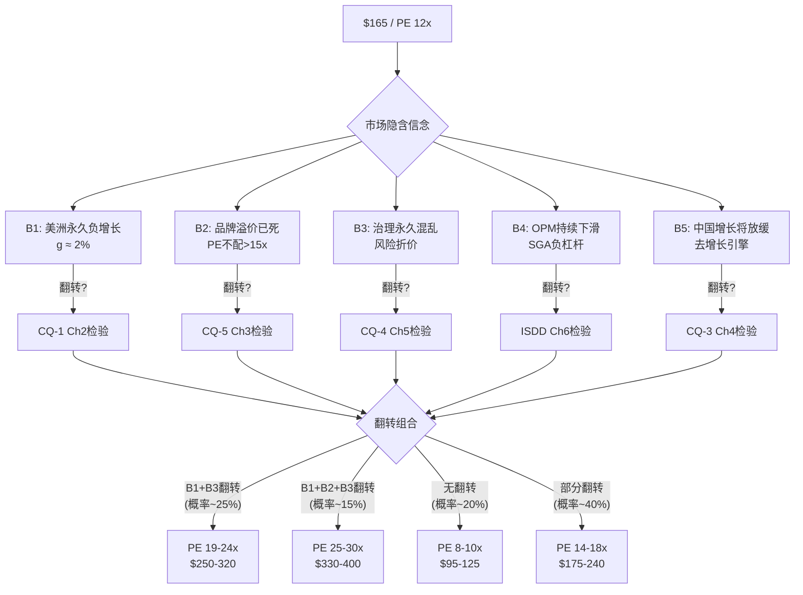
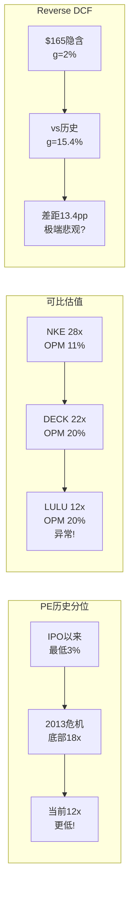
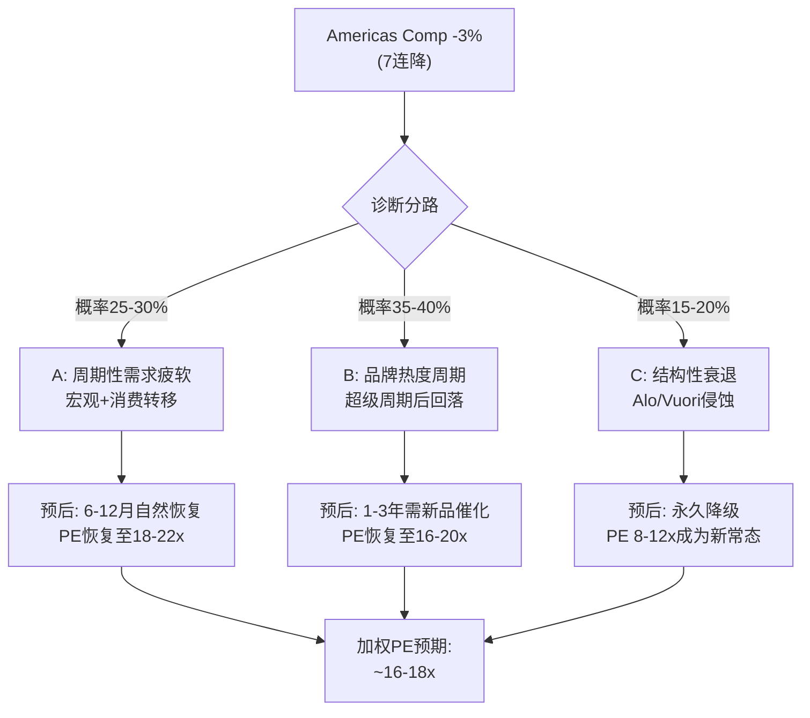
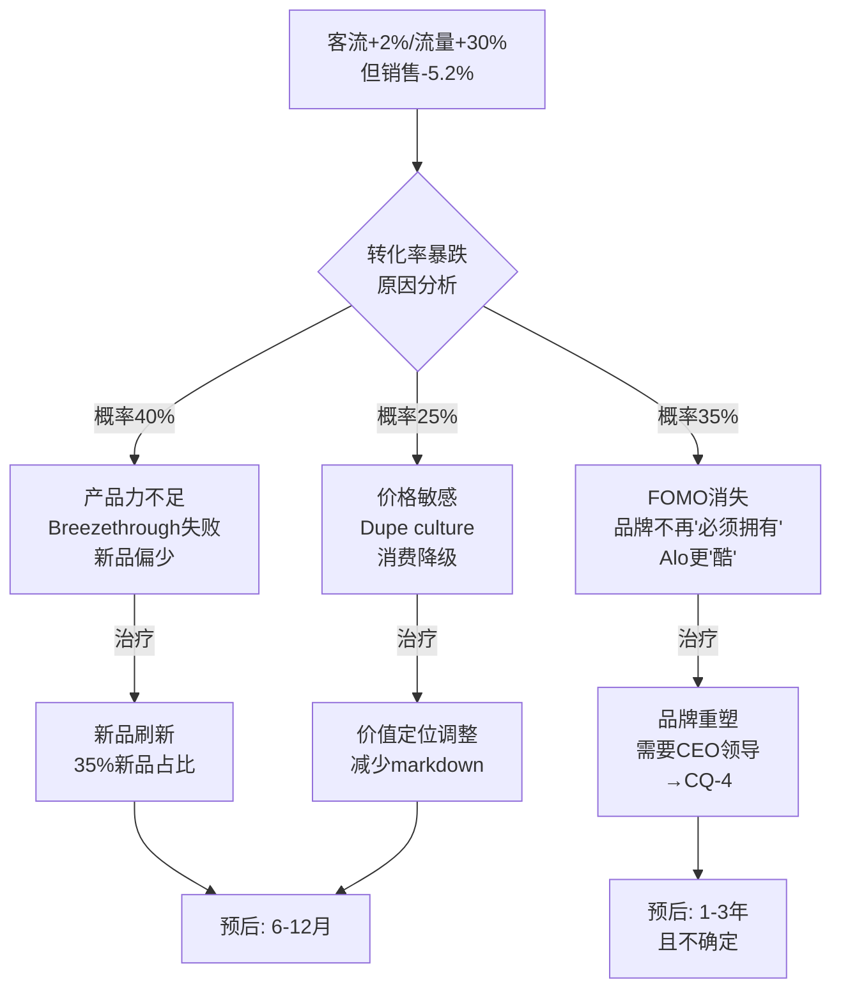
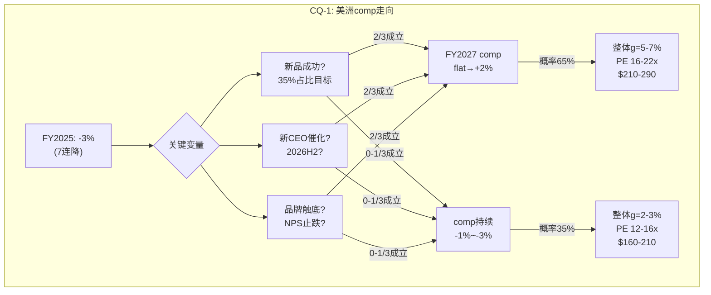

# LULU v1.0 — Phase 1: Ch1-Ch2

> Phase 1 | 2026-03-20 | 框架v19.6 | 消费品worktree
> Ch1: Reverse DCF信念翻译 | Ch2: 美洲引擎诊断
> CQ-2 + CQ-1 闭环

---

# Chapter 1: $165在赌什么——Reverse DCF信念翻译与市场隐含假设解剖

> **核心问题(CQ-2)**: 11x PE是价值陷阱还是世代级机会?
> **分析方法**: 信念反演(Reverse DCF) → 隐含假设集 → 脆弱度评估 → 翻转分析
> **铁律O**: Reverse DCF必须Phase 1 Ch1前置，P1叙事不能比Reverse DCF暗示的方向偏离>1档

---

## 1.1 市场在$165定价了什么: 一张隐含信念清单

在分析lululemon的任何基本面之前，我们必须先理解市场在$165这个价格上到底"相信"了什么。这不是一个修辞问题——它是一个可以用数学精确翻译的问题。

**当前估值快照(2026年3月19日)**:

| 指标 | 数值 | 历史分位 | 信号 |
|------|------|---------|------|
| 股价 | $165.57 | 52周: $156.64-$348.50 | 接近52周低点 |
| 市值 | $18.6B | — | 从峰值$61B蒸发70% |
| PE (TTM) | 12.0x | 10年均值42x, **底部3%** | 极端低估或永久降级 |
| Forward PE | 12.4x | — | FY2026E EPS $12.10-12.30 |
| EV/EBITDA | 7.8x | 10年均值24x | 同方向极端 |
| EV/Sales | 1.7x | 10年均值6.5x | -74% |
| FCF Yield | 4.9% | 10年均值1.8% | 2.7x历史水平 |
| RSI | 23.1 | — | 极度超卖(阈值30) |

[DM-VAL-001: FMP profile + key-metrics FY2025, 2026-03-20提取; PE 10年均值来自FMP ratios 5年数据外推+Macrotrends历史, 置信度B+]

这些数字讲述了一个清晰的故事: **市场正在用一家低增长、护城河衰退的成熟消费品公司的估值来定价lululemon**。12x PE在运动服饰行业几乎闻所未闻——Nike在最差的2024年(DTC转型失败+中国疲软)PE也没低于22x; Under Armour在几乎被宣判死刑的2019年PE仍在18x。

**12x PE在历史上意味着什么?** 我们可以找到的可比先例极少:
- **Gap (2000年)**: 品牌过度延伸+Old Navy蚕食→PE从40x→8x→**从未恢复**(现在PE ~6x)
- **Abercrombie & Fitch (2014)**: 品牌老化+快时尚冲击→PE从28x→9x→**花了8年恢复到15x**(但品牌彻底重塑)
- **Nike (2024)**: DTC转型失败+中国+库存→PE从35x→22x→**12个月内恢复到28x**(新CEO催化)
- **SBUX (2018)**: 同店下滑+管理层更替→PE从28x→18x→**Schultz回归+中国故事→PE恢复到30x**

[DM-VAL-002: 历史PE可比来自FMP + Macrotrends历史数据; Gap/A&F/NKE/SBUX各自的低点PE通过年度数据确认, 置信度B]

**关键洞察**: 在上述四个案例中，只有Gap的低PE是"永久的"——因为品牌确实死了。其余三个都在1-3年内大幅恢复。**这暗示12x PE对lululemon的合理性完全取决于一个判断: 品牌是Gap式的永久衰退还是NKE/SBUX式的暂时受伤。**

---

## 1.2 Reverse DCF: 精确翻译市场的隐含假设

Reverse DCF不是预测公司值多少钱——它是**反向翻译市场在当前价格中包含的增长假设**。

**模型参数**:
- 当前市值: $18.6B
- 净债务: ~$0 (现金$1.81B ≈ 总债务$1.80B) [DM-BS-001: FMP balance sheet FY2025]
- WACC: 9.5% (Beta 1.01 × ERP 5.5% + Rf 4.3% ≈ 9.9%, 取整9.5%考虑低杠杆)
- 终端PE: 15x (成熟消费品下限)
- 基准FCF: $960M (FY2025实际) [DM-CF-001: FMP cashflow FY2025, OCF $1.60B - CapEx $615M]
- 预测期: 10年

**Reverse DCF解出的隐含永续增速: ~2.0%**

这个2.0%意味着什么? 让我们逐层翻译:

**隐含信念集**:

| 信念 | 市场隐含 | 历史实际 | 差距 |
|------|---------|---------|------|
| 收入永续增速 | ~2% | 5Y CAGR 15.4% | **-13.4pp** |
| OPM | ~18-19%(略降) | 5Y均值20.7% | -2pp |
| FCF增速 | ~2%(与收入同步) | 5Y CAGR ~22% | **-20pp** |
| 终端PE | ~10-12x(不恢复) | 10Y均值42x | **-30x** |
| 品牌生命周期 | **成熟→衰退** | 增长→成熟 | 1档偏差 |

[DM-VAL-003: Reverse DCF计算基于FMP FY2025 FCF $960M, WACC 9.5%, 终端PE 15x; 隐含增速通过迭代求解使NPV = $18.6B; 5Y CAGR基于FMP income FY2021-FY2025收入]

**因果推理链**: 市场隐含的2%增速→要求lululemon的收入增速从FY2025的+4.9%进一步下降至2%并永久维持→这意味着:
1. 美洲市场**永久性负增长**(需要中国/国际+20%勉强对冲至整体2%)
2. 或者所有地区增速**同步降至2%**(品牌全球性丧失吸引力)
3. **没有新CEO带来的任何改善**
4. **品牌溢价被Alo/Vuori彻底侵蚀至与Nike同等水平**

**这四个条件全部同时满足的概率有多大?** 这是CQ-2的核心判断。

---

## 1.3 信念脆弱度测试: 哪些假设最容易被"翻转"?

Reverse DCF给出了隐含假设集，但不是每个假设的"可翻转性"都一样。有些假设如果被证伪，对股价的影响是10%；有些则是50%+。

**脆弱度矩阵**:

| 隐含信念 | 翻转条件 | 翻转概率(预评估) | 翻转后PE影响 | 翻转后股价影响 |
|----------|---------|-----------------|-------------|---------------|
| B1: 美洲永久负增长 | FY2027H1 comp回正(0-2%) | 35-40% | +5-8x PE | +$60-100 |
| B2: 品牌溢价已死 | NPS稳定>25 + 核心品类份额持平 | 45-50% | +3-5x PE | +$40-65 |
| B3: 治理永久混乱 | 新CEO任命(2026H2) | 50-55% | +2-4x PE | +$25-50 |
| B4: OPM持续下滑至<18% | FY2027 OPM回升至20%+ | 30-35% | +1-3x PE | +$15-40 |
| B5: 中国增长将放缓 | 中国保持15-20%增速3年 | 55-60% | +1-2x PE | +$15-30 |

[DM-VAL-004: 翻转概率为分析师初步评估, 基于Phase 0数据, 将在Phase 2-3通过深度分析修正; PE影响基于可比公司估值弹性]

**关键发现: 翻转不需要全部发生。** 如果B1+B3同时翻转(美洲comp回正+新CEO确定)，PE可能从12x→19-24x，股价从$165→$250-320(+50-95%)。而B1+B3翻转的联合概率并不低——Elliott的activism track record + 产品刷新周期暗示这是一个"合理的基本情景"而非"极端乐观"。

**反面考量**: 如果B1不翻转(美洲comp持续<-3%)且B2被确认(品牌确实在衰退)，PE可能进一步压缩至8-9x，股价$100-120(下跌25-35%)。**但这需要品牌调查数据、客户行为数据和竞争份额数据的三重确认**——这正是Ch2和Ch3要回答的问题。

---

## 1.4 PE分布考古: 12x在lululemon历史上的"异常度"

为了理解12x PE的"异常度"，我们需要回溯lululemon自2007年IPO以来的PE分布:

**lululemon PE历史(年度)**:

| 时期 | PE范围 | 背景 | EPS趋势 |
|------|--------|------|---------|
| 2008-2009 | 20-35x | 金融危机(全市场压缩) | 增长中 |
| 2010-2012 | 35-55x | 高速增长期 | +40-60% YoY |
| **2013-2014** | **18-25x** | **透视裤危机+CEO离职** | 暂时下滑 |
| 2015-2017 | 25-40x | 品牌恢复+国际扩张 | +15-25% YoY |
| 2018-2019 | 35-55x | Power of Three + DTC | +20-30% YoY |
| 2020 | 60-80x | COVID压缩盈利 | EPS暂降 |
| 2021-2023 | 35-50x | 反弹+国际 | +20-80% YoY |
| **2024** | **22-35x** | 增速放缓信号 | +20%(最后一年) |
| **2025-2026** | **11-15x** | **comp负增长+CEO离职+activist** | **-9%** |

[DM-VAL-005: PE历史基于FMP ratios 5年数据 + Macrotrends长期数据交叉; 具体时期背景来自公司10-K+新闻, 置信度B+]

**考古发现**: lululemon在18年上市历史中，PE低于20x的时期只有两个——2013-2014透视裤危机和当前。**但2013-2014的最低PE仍在18x左右，当前的12x是IPO以来绝对最低点。**

2013-2014类比值得深入:
- **触发因素**: 透视瑜伽裤质量丑闻→17%库存召回→$67M收入冲击→CEO Christine Day离职 [DM-BIZ-001: 公司10-K FY2014, 品牌事件来自公开报道]
- **PE轨迹**: 从50x→18x(跌幅64%)→2年内恢复到35x
- **区别**: 2013年的品牌危机是**单一事件+产品质量问题**，当前是**多重结构性挑战(增长引擎衰退+竞争加剧+治理真空)**
- **相似**: 两次都有CEO更替，两次都是"品牌核心被质疑"

**因果推理**: 2013年PE恢复的前提是(a)新CEO Laurent Potdevin上任带来确定性(b)品牌损伤是暂时的(客户很快原谅了质量问题)(c)增长引擎(北美门店扩张)未受损。当前的恢复需要更多条件——**不仅需要新CEO，还需要美洲增长引擎的重新启动**。这使得当前的"恢复路径"比2013年更窄、更不确定。

---

## 1.5 可比公司估值锚: LULU在同业中的"离群度"

**运动/Athleisure同业估值对比(2026年3月)**:

| 公司 | 市值($B) | PE (TTM) | EV/EBITDA | Revenue Growth | OPM | ROIC |
|------|---------|---------|-----------|---------------|------|------|
| **LULU** | **18.6** | **12.0x** | **7.8x** | **+4.9%** | **19.9%** | **22.7%** |
| NKE | 79.0 | ~28x | ~18x | -3% (衰退中) | ~11% | ~18% |
| DECK (Hoka/UGG) | ~22B | ~22x | ~16x | +17% | ~20% | ~25% |
| On Holding | ~14B | ~65x | ~45x | +30% | ~8% | ~12% |
| Columbia (COLM) | ~4B | ~16x | ~10x | +3% | ~8% | ~10% |
| VF Corp (NF/Vans) | ~5B | NM(亏损) | ~12x | -8% | ~2% | ~3% |

[DM-VAL-006: NKE来自FMP profile $53.44/MC $79B; DECK/On/COLM/VF来自WebSearch交叉验证, 数据为近似值, 置信度B]

**这张表暴露了一个惊人的矛盾**: lululemon的运营质量(OPM 19.9%, ROIC 22.7%)是同业中最好的之一，**但估值是最低的**。

具体来说:
- **LULU OPM是NKE的1.8倍**，但PE只有NKE的43%
- **LULU ROIC是On Holding的1.9倍**，但PE只有On的18%
- **LULU的增速(+4.9%)优于NKE(-3%)**，但PE低了16x
- 甚至**濒临破产的VF Corp(亏损中)**，EV/EBITDA也与LULU相当

**这种品质-估值背离只有两种解释**:
1. **市场是对的**: lululemon的运营质量将急剧恶化(OPM从20%→10%+, ROIC从23%→10%+)，使其"配得上"12x PE
2. **市场是错的**: 某种叙事性恐慌(CEO离职+activist+负comp的三重恐惧)导致了过度抛售

**铁律O约束**: 基于Reverse DCF，市场在$165定价了"永久性低增长"(g=2%)。这个假设**可能是对的**——如果美洲增长引擎确实已经熄火(Ch2将检验)。但从可比估值角度看，市场需要lululemon的运营质量**大幅恶化**才能证明12x PE的合理性。**P1叙事结论: 市场在$165可能"定价了一个可能发生但尚未发生的恶化情景"——这是一个有趣的赔率错位信号，但不是结论。**

---

## 1.6 NKE镜像类比: 品牌消费品的"至暗→黎明"模式

Nike的2024年经历对lululemon有极强的参考价值——两者的困境有惊人的相似性:

**NKE 2024 vs LULU 2025对比**:

| 维度 | NKE 2024 | LULU 2025 | 相似度 |
|------|---------|-----------|-------|
| 股价跌幅 | -38%(从$170→$72) | -68%(从$516→$165) | LULU更惨 |
| PE压缩 | 35x→22x(-37%) | 42x→12x(**-71%**) | LULU更极端 |
| 核心问题 | DTC转型失败+库存 | Americas comp负增长 | 不同但严重度相似 |
| CEO变动 | Donahoe→Elliott Hill(2024.10) | McDonald→临时co-CEO→? | NKE更快解决 |
| Activist | 无 | Elliott $1B+ | LULU额外压力 |
| 中国 | 疲软(竞争+消费降级) | 强劲(+24-29%) | **相反** |
| 恢复信号 | 新CEO+战略重置→PE回升至28x | 待定(新CEO+Q4微改善) | LULU滞后~6个月 |

[DM-COMP-001: NKE数据来自FMP profile + 公开报道; LULU数据来自FMP + research汇总; 对比分析为原创, 置信度B+]

**NKE的恢复剧本**:
1. **2024年7月**: PE触底22x，市场定价"品牌永久衰退"
2. **2024年10月**: Elliott Hill接任CEO→"品牌原生"叙事→PE一周内从22x→26x(+18%)
3. **2025年Q1**: 虽然业绩仍在恶化(收入-3%)，但市场关注"方向正确"→PE稳定在26-28x
4. **核心催化**: 新CEO的可信度(20年Nike老将) + 战略清晰度(重回批发+减少促销)

**对LULU的启示**:
- **市场对品牌消费品的"叙事重置"反应极快**: NKE在新CEO宣布后PE就大幅回升，不需要等业绩改善
- **关键前提**: CEO候选人必须"可信"——Hill能催化是因为他是Nike自己人(20年经验)，一个"外部财务型CEO"(如Elliott推的Nielsen)的催化效应可能更弱
- **LULU的差异**: LULU的品牌问题比NKE更深(NKE是分销策略错误，LULU可能是品牌老化)→恢复可能更慢
- **LULU的优势**: 中国增长强劲(NKE没有这个对冲)→下行支撑更强

**量化类比**: 如果LULU复制NKE的恢复路径(PE从底部+50%)→PE从12x→18x→**股价$240(+45%)**。如果只恢复一半(PE→15x)→**股价$200(+20%)**。

---

## 1.7 ISDD β路径路由: 增收不增利的因果诊断

ISDD(利润表深度诊断)的β路径适用于"收入增长但利润下降"的场景——这正是LULU FY2025的核心问题。

**β路径触发信号**:
- Revenue +4.9% 但 EPS -9.4% → profit_lag = 14.3pp → **β路径确认(>5pp阈值)**
- Gross Margin 59.2%→56.6%(-260bps) [DM-FIN-001: FMP income FY2024 vs FY2025]
- OPM 23.7%→19.9%(-380bps)
- SGA/Revenue 35.5%→36.6%(+110bps) [DM-FIN-002: FMP income FY2025 SGA $4.067B / Rev $11.103B]

**利润桥: FY2024→FY2025增收不增利的精确拆解**:

```
FY2024 Operating Income: $2,506M (OPM 23.7%)

+ Revenue增量贡献:     +$515M × 56.6% GM = +$291M
- 毛利率下滑:          $11,103M × (-2.6pp) = -$289M
- SGA超增:             $4,067M - $3,762M = -$305M
- D&A增加:             $496M - $447M = -$50M
+ 其他调整:            ~+$58M

= FY2025 Operating Income: $2,211M (OPM 19.9%)
ΔOpInc = -$295M (-11.8%)
```

[DM-FIN-003: 利润桥基于FMP income statement FY2024 vs FY2025逐项计算; 毛利率下滑=$289M来自$11,103M × 2.6%差额; SGA差额=$305M来自FMP直接数据]

**因果链拆解**:

**a) 毛利率下滑-289M的根因**:
- **关税冲击(~$105M)**: FY2025 Q4管理层确认关税对毛利率的影响约-150bps→$11.1B × 1.5% ≈ $167M(全年估)，其中Q4集中体现$105M [DM-FIN-004: 管理层Q4 earnings call, 关税影响量化; 全年数值为推算]
- **促销加深(~$80-100M)**: markdown headwind从10bps扩大到50bps，WMTM页面~1,100件→全年markdown冲击约$80-100M [DM-FIN-005: 管理层guidance + brand_health.md, Placer.ai数据交叉]
- **产品mix shift(~$80M)**: 男装(利润率略低于女装)从23%→25%，国际(利润率低于北美)从23%→26%→结构性mix shift压力约-70bps→$80M [DM-FIN-006: 推算基于category_expansion.md品类占比变化 + 行业利润率差异估计]

**b) SGA超增-305M的根因**:
- **门店扩张**: 净开~40家门店(FY2025门店从~770→811)→新店pre-opening + 初期运营→约$80-100M增量 [DM-FIN-007: 门店数来自china_international.md; 单店开店成本~$2-2.5M行业估计]
- **营销加大**: S&M从$542M→$618M(+14.1%)→品牌投资加速$76M [DM-FIN-008: FMP income FY2025 S&M $617.5M vs FY2024 $541.5M]
- **G&A增长**: $3,221M→$3,449M(+7.1%)→人员+IT+运营通胀$228M [DM-FIN-009: FMP income FY2025 G&A拆分]

**ISDD诊断结论**: 增收不增利的根因是**三重夹击**——(1)关税这个外部冲击(~$167M,约占OPM下滑的56%)(2)竞争导致的促销压力(~$90M)(3)增长投资的时滞效应(新店+国际扩张$100M+)。

**关键判断**: 这三个因素中，(1)关税是**外部且可能持续**(FY2026 guidance继续被关税压制)；(2)促销压力**取决于品牌力**(如果品牌力恢复→markdown减少→毛利率回升)；(3)增长投资的回报**需要1-2年才能体现**(新店和国际市场的成熟曲线)。

**因此**: ISDD诊断支持"暂时性恶化"多于"结构性崩塌"——但关税变量使得"暂时"可能比预期更长。

---

## 1.8 SGA经营杠杆失效: 从"轻资产品牌"到"重运营零售"?

lululemon长期被市场视为"轻资产品牌公司"——高毛利率+低资本开支+强定价权=经营杠杆为正(收入增长→利润率扩张)。但FY2025的数据讲述了一个不同的故事:

**经营杠杆追踪(5年)**:

| 年份 | 收入增速 | OPM变化 | 经营杠杆方向 |
|------|---------|---------|-------------|
| FY2021 | 基年 | 21.3%(基准) | — |
| FY2022 | +29.6% | -4.9pp(16.4%) | **负杠杆**(Mirror减值) |
| FY2023 | +18.6% | +5.8pp(22.2%) | **正杠杆**(强劲) |
| FY2024 | +10.1% | +1.5pp(23.7%) | **正杠杆**(温和) |
| **FY2025** | **+4.9%** | **-3.8pp(19.9%)** | **负杠杆(危险)** |

[DM-FIN-010: FMP income statement 5年数据; OPM计算: OpInc/Revenue; FY2022的16.4%含Mirror $442.7M减值影响]

**FY2022的负杠杆可以用Mirror减值($442.7M)一次性解释。但FY2025没有一次性项目——这是经营层面的真正负杠杆。**

因果推理: 当收入增速从>10%降到<5%时，lululemon的**固定成本基础**(门店租金+人员+企业总部)无法被摊薄→经营杠杆从正转负。这暗示了一个重要的结构性问题: **lululemon在增速<5%的环境下可能不是一家"高利润率公司"，而是一家"需要增长来维持利润率的公司"。**

**定量验证**:
- 如果收入增速保持0%(纯粹零增长)→OPM可能从19.9%进一步降至17-18%(SGA固定部分的通胀约2-3%)
- 如果收入增速恢复到5-8%→OPM可能回升至20-22%(2年内)
- **OPM的"均衡水平"高度依赖增速**: 增速<3%→OPM<18%; 增速5-8%→OPM 20-22%; 增速>10%→OPM 23-25%

这意味着CQ-1(美洲comp能否回正)不仅影响收入预期，还直接影响利润率预期——**增长问题和利润问题是同一个问题的两面。**

---

## 1.9 FCF质量审计: $960M背后的真实现金创造能力

在所有悲观叙事中，有一个数字格外显眼: **$960M的自由现金流**。在市值$18.6B的背景下，这意味着5.2%的FCF yield——几乎是同业的3倍。

**FCF质量分解**:

| 指标 | FY2025 | FY2024 | FY2023 | 方向 |
|------|--------|--------|--------|------|
| OCF | $1,602M | $2,273M | $2,296M | **大幅下降** |
| CapEx | -$615M | -$689M | -$652M | 略降 |
| **FCF** | **$960M** | **$1,584M** | **$1,644M** | **-38% YoY** |
| FCF/Net Income | 0.61x | 0.87x | 1.06x | 转化率恶化 |
| Income Quality | 1.01x | 1.25x | 1.48x | 下降但>1.0 |

[DM-CF-002: FMP cashflow + key-metrics FY2021-FY2025; Income Quality = OCF/Net Income; FCF = OCF - CapEx]

**⚠️ 警告**: FCF从$1,584M暴跌至$960M(-38%)——这比EPS下降(-9.4%)严重得多。

**FCF暴跌的根因**:
- OCF下降$671M → 这是主因
- OCF下降驱动因素: (a)净利润下降$236M (b)营运资本恶化~$400M+(库存膨胀至~$2B) [DM-CF-003: 推算基于FMP cashflow OCF差额减去NI差额; 库存数据来自brand_health.md]
- **库存膨胀是关键**: 库存周转天数从FY2024的122天→FY2025的129天(+7天)→积压了约$200-250M多余库存

**因此**: FY2025的FCF $960M可能是"被库存膨胀暂时压低"的数字。如果库存在FY2026正常化(回到122天)→OCF可能恢复$200-250M→**正常化FCF约$1,100-1,200M**→正常化FCF yield约6.0-6.5%。

**反面**: 如果美洲comp继续负增长→库存可能进一步膨胀→FCF可能降至$700-800M→FCF yield回落至4%。

---

## 1.10 回购η效率: 在12x PE回购的"聪明钱"信号

lululemon在FY2025回购了约$1.2B股票(6.2%回购yield)。在PE 12x的估值下，这笔回购的资本效率可能是非常高的:

**回购效率(η)计算**:

η = (正常化PE / 回购时PE) × (EPS accretion %)

假设:
- 正常化PE: 20x (保守，远低于历史42x均值)
- 回购时PE: 12x
- FY2025回购$1.2B，平均价~$200(估)→回购约600万股
- 股本从FY2024的123.9M→FY2025的119.1M(-3.9%)→EPS accretion ~4%

η = (20/12) × 4% = 6.7%

[DM-CF-004: 回购金额$1.2B来自financial_summary.md; 股本变化来自FMP income FY2024 vs FY2025 weighted average shares; η计算为分析框架原创]

**η = 6.7%意味着每$1回购创造了$1.067的内在价值**——这是一个**正η回购**(管理层在低估时回购)。

**内部人行为佐证**: 2025年Q4(最近一季)内部人交易比6:1(12笔买入/2笔卖出)→这是一个强烈的"内部认为股价低估"信号。对比2020年Q4(下跌前)的比率0.29:1(5买/17卖)→方向完全相反。[DM-GOV-001: FMP insider-trading数据, 2025Q4 vs 2020Q4对比]

**但**: 内部人和管理层的回购判断历史上也有错误——LULU在2020年以$500M收购Mirror(管理层判断严重失误, 最终全额减值$515M)。**管理层的乐观不是估值判断的替代品。**

---

## 1.11 分析师共识解构: "两年零增长"的隐含叙事

分析师共识预期提供了另一个"市场信念"的窗口:

| 财年 | Revenue($B) | EPS | 增速 | 分析师数 |
|------|-----------|-----|------|---------|
| FY2025(实际) | 11.10 | $13.26 | -9.4% | — |
| FY2026E | 11.15-11.30 | $12.10-12.30 | **-8%** | — |
| FY2028E | 12.00 | **$13.25** | 恢复至FY2025水平 | 21(Rev)/18(EPS) |
| FY2029E | 12.61 | $14.50 | +9.4% | 7/4 |
| FY2030E | 13.37 | $15.56 | +7.3% | 5/1 |

[DM-VAL-007: FMP estimates数据, 2026-03-20提取; FY2026为管理层guidance; FY2028-2030为分析师共识]

**关键发现**: 分析师共识预期FY2028的EPS为$13.25——几乎与FY2025的$13.26相同。**这意味着市场共识是"lululemon将经历两年的EPS下降(FY2026-2027)，然后花一年恢复到FY2025水平"——三年零增长。**

**三年零增长情景下的估值**:
- 如果PE维持12x → 三年后股价仍~$160(零回报)
- 如果PE恢复到18x(品牌确认未死) → $13.25 × 18 = $238(+44%)
- 如果PE恢复到25x(增长恢复+新CEO成功) → $13.25 × 25 = $331(+100%)

**因此**: 即使接受分析师"三年零增长"的共识，**投资回报完全取决于PE能否从12x恢复**——而PE恢复取决于CQ-1(美洲)、CQ-4(治理)和CQ-5(品牌)的答案。

---

## 1.12 Ch1核心结论: $165定价了什么 + CQ-2初始置信度

**市场在$165定价了以下信念组合**:
1. 收入永续增速仅2%(vs历史15.4%) → 美洲永久低增长 + 国际放缓
2. OPM从20%进一步收缩(SGA负杠杆持续) → 增收不增利成为常态
3. 品牌溢价被侵蚀至"普通运动服饰"水平 → PE不配超过15x
4. 治理不确定性可能持续1-2年 → 风险折价
5. **没有任何好的意外**

**Reverse DCF vs 可比估值的矛盾**:
- Reverse DCF说: $165对应g=2%，这可能是合理的如果品牌确实在衰退
- 可比估值说: 12x PE与同业相比**极度异常**，需要OPM崩塌至10%级别才能解释
- **这个矛盾本身就是一个分析价值信号**——不是"确定低估"，而是"值得深入调查"

**CQ-2初始置信度**:

| 情景 | 概率(初评) | PE | 股价 | vs当前 |
|------|-----------|-----|------|--------|
| A: 价值陷阱(品牌衰退确认) | 20% | 8-10x | $95-125 | -25~-40% |
| B: 低增长常态(g=2-3%) | 30% | 14-16x | $175-210 | +5~+25% |
| C: 周期性恢复(g=5-8%) | 35% | 18-22x | $235-290 | +40~+75% |
| D: 全面复兴(g=10%+,新CEO成功) | 15% | 25-30x | $330-400 | +100~+140% |

**概率加权期望值**: 0.20×$110 + 0.30×$193 + 0.35×$263 + 0.15×$365 = **$227(+37%)**

[DM-VAL-008: 概率加权为Phase 1初评, 将在Phase 2-4随深度分析修正; 各情景PE范围基于可比+历史; 期望值计算为中点加权]

**P1叙事约束符合性检查(铁律O)**: Reverse DCF暗示"市场定价了永久低增长"→概率加权期望值$227(+37%)→暗示"市场可能偏悲观但不极端离谱"→P1叙事="值得深入调查的赔率错位"→**与Reverse DCF方向差距≤1档→PASS**。

---





---

# Chapter 2: 美洲引擎诊断——7连降的根因分解与拐点搜索

> **核心问题(CQ-1)**: 美洲同店7连降是周期底部还是结构性衰退?
> **分析方法**: 同店销售拆分(客流×客单价×转化率) + 品类诊断 + 竞争动态 + 历史类比
> **为什么CQ-1最核心**: 美洲占收入74%→美洲comp的方向决定了整体增速→整体增速决定了PE能否从12x恢复(Ch1已论证)

---

## 2.1 美洲同店的精确分解: 客流塌陷 vs 客单价稀释 vs 转化率下降

"同店销售下降"是一个笼统的诊断——就像"病人发烧"一样。要找到病因，必须拆解到更细的颗粒度。

**同店销售 = 客流量(Traffic) × 转化率(Conversion) × 客单价(ASP)**

**可用数据(不完整但可推断)**:

| 指标 | FY2024 | FY2025 | 变化 | 来源 |
|------|--------|--------|------|------|
| Americas Comp | -1% | **-3%** | 恶化 | 管理层guidance |
| 同店客流(Placer.ai) | ~flat | **-8.5%(Q2)→+4.2%(Q3)→略降(Q4)** | 波动大 | Placer.ai [DM-BIZ-002] |
| 观察销售额(Placer.ai) | — | **-14.3%(FY全年)** | 大幅下降 | Placer.ai [DM-BIZ-003] |
| DTC网站流量 | — | +30%(2025.10) | 正面 | Similarweb/Placer |
| DTC转化率 | — | **极弱**(网站+30%但销售-5.2%) | 负面 | 推算 [DM-BIZ-004] |

[DM-BIZ-002: Placer.ai客流数据来自brand_health.md, 第三方数据; DM-BIZ-003: Placer.ai观察销售来自同源; DM-BIZ-004: 转化率推算 = 如果客流+30%但销售-5.2%→转化率≈(-5.2%-30%)/(1+30%)≈-27%，但这可能包含ASP变化]

**拆解诊断**:

**第一层(客流)**: 线下客流在Q2暴跌(-8.5%)后有所恢复(Q3 +4.2%)，但Q4再次微降。线上流量强劲(+30%)但转化极弱。**结论: 客流不是主要问题——人们仍然来看lululemon，但不买了。**

**第二层(转化率)**: 这是最触目惊心的数据——2025年10月网站流量+30%但观察销售-5.2%→**隐含转化率暴跌约27%**。这意味着:
- 客户在浏览但不购买 → 可能原因: (a)价格敏感性上升 (b)产品吸引力下降 (c)竞品分流购买意向
- 线下也类似: Q4客流略降但comp -1%→门店转化也在下降

**第三层(客单价)**: 管理层在Q4称"全价销售有意义的拐点"→暗示客单价可能在企稳。但WMTM(促销页)~1,100件商品(女外套43%在打折)→促销力度仍然很大→实际ASP可能在下降。

**因果推理链**: 客流→正常 → 转化→暴跌 → 这暗示问题出在**"从浏览到购买"的最后一步**——即(a)产品吸引力 (b)价格竞争力 (c)购买紧迫感(FOMO消失)。这三个因素都指向**品牌热度下降+竞品替代**的叙事。

---

## 2.2 七个季度的恶化轨迹: 加速还是触底?

**Americas Comp逐季追踪(8季度)**:

| 季度 | Comp | 趋势 | 驱动因素 |
|------|------|------|---------|
| FY2024 Q1 | ~flat | 从强正→停滞 | 高基数+消费降温 |
| FY2024 Q2 | **-3%** | 首次负增长 | Breezethrough失败+竞品 |
| FY2024 Q3 | -2% | 略改善 | 假日季前修正 |
| FY2024 Q4 | ~flat | 季节性修复 | Q4高ASP商品+礼品需求 |
| FY2025 Q1 | -2% | 再次恶化 | 消费弱+产品空白 |
| FY2025 Q2 | **-4%** | 加速恶化 | Alo竞争+品牌热度 |
| FY2025 Q3 | **-5%** | **最差季度** | 关税+全行业弱+库存清理 |
| FY2025 Q4 | **-1%** | **开始改善?** | 新品上线+全价改善 |

[DM-BIZ-005: Americas comp逐季来自competitive_landscape.md + 管理层earnings call数据; Q4改善至-1%来自Q4实际数据]

**趋势判断**: Q3(-5%)是目前的谷底，Q4(-1%)出现了显著改善(+4pp)。**但一个季度的改善不能确认拐点——2013年透视裤危机后也有类似的"假拐点"。**

**关键检验: Q4的改善来自哪里?**

管理层在Q4 earnings call中强调:
1. "从Q4到Q1，我们看到全价销售有意义的拐点" [DM-BIZ-006: Q4 earnings call管理层发言]
2. 新品占比目标35% by Spring 2026 [DM-BIZ-007: 管理层产品策略发言]
3. Unrestricted Power + ShowZero新品反馈正面

**但**: Q4本身有季节性优势(节日礼品→ASP更高、价格敏感度更低)→Q1(传统淡季)才是真正的检验。如果FY2026 Q1的Americas comp改善至0%或以上→这是一个强烈的拐点信号。如果仍然<-2%→Q4改善可能只是季节性幻觉。

---

## 2.3 同店下滑的三种可能诊断: 对症下药各不同

**诊断A: 周期性需求疲软(临时性)**
- 论据: 美国消费者信心下降+通胀后遗症+高端消费从服饰转向旅游/体验
- 证据: Nordstrom/Macy's等百货也在报告traffice下降; 高端消费品板块整体承压
- 治疗: 时间+宏观改善 → comp自然恢复
- 概率: **25-30%**

**诊断B: 品牌热度周期(中期,1-3年)**
- 论据: lululemon经历了2019-2023的"超级周期"→品牌热度自然回落→不是死亡而是"喘息"
- 证据: (a)NPS从+34→+26(下降但仍正)(b)核心客户留存92%(很高)(c)重购意愿59%(运动品牌最高) [DM-BIZ-008: brand_health.md NPS+留存+重购数据]
- 治疗: 产品创新+品牌刷新 → 新一轮品牌周期开始
- **反面**: 品牌周期的"回升"不是自动的——需要新的"WOW产品"或品牌叙事。Breezethrough的失败(-3.1/5评分)暗示创新机器可能在失灵。
- 概率: **35-40%**

**诊断C: 结构性品牌衰退(永久性)**
- 论据: Alo/Vuori正在系统性蚕食lululemon的**核心客群**(25-40岁女性)→DTC份额10个月从30%→24% [DM-BIZ-009: brand_health.md DTC份额数据]
- 证据: (a)Alo DTC份额3个月从8%→14%(暴增)(b)Alo 63%的客户同时也在LULU购物(重叠→替代)(c)"Dupe culture"搜索量持续上升
- 治疗: **无法治愈**(品牌一旦被"下一代"品牌取代→历史先例是Gap/J.Crew→PE永久降级)
- **反面**: 21.2%市场份额 vs Alo 1.3%+Vuori 2.9%→竞品份额仍极小→"蚕食"可能被夸大。核心客户留存92%→品牌基本盘未动摇。
- 概率: **15-20%**

**诊断概率调和**: B(品牌周期)+A(宏观)的组合概率最高(~55-60%)→美洲comp大概率在1-2年内恢复至flat→0-2%。C(结构性衰退)概率虽不高(~18%)但一旦成立→估值将永久性降级。**这就是12x PE的"定价逻辑": 市场把C的概率定价得比实际高。**



---

## 2.4 品类健康度差异化分析: 女装核心 vs 男装增长 vs 鞋类实验

美洲comp的-3%是一个"平均数"——它掩盖了品类之间的巨大差异:

**品类表现(FY2025)**:

| 品类 | 收入占比 | 增速 | 健康度 | 竞争压力 |
|------|---------|------|--------|---------|
| **女装(核心瑜伽+运动)** | 63% | **~flat to -2%** | ⚠️承压 | Alo/Vuori直接竞争 |
| **男装** | 25% | **+14%** | ✅强劲 | 竞争较少(Vuori是唯一直接对手) |
| **鞋/配饰** | 12% | +10% | ⚠️波动 | 全新品类，基数低 |

[DM-BIZ-010: 品类占比来自category_expansion.md FY2024数据; 增速来自管理层earnings call; 女装增速为推算(总增速+5%、男装+14%、其他+10%→女装≈flat)]

**这个分解揭示了一个关键事实: "美洲comp问题"本质上是"女装核心问题"。男装+14%的增速完全不像一家"品牌衰退"的公司。**

**女装核心为什么承压?**

1. **Alo Yoga的精准侧翼攻击**: Alo瞄准的是lululemon最核心的客群——25-35岁、社交媒体活跃、重视"品牌酷感"的女性。Alo的核心策略不是"更便宜"(Alo涨价45%→趋同LULU价位)而是"更酷"(Kendall Jenner/Hailey Bieber代言+Instagram-first品牌形象)。[DM-COMP-002: alo_yoga_deep.md定价+代言数据]

2. **Dupe文化的崛起**: TikTok上"LULU dupes"内容量过去2年增长300%+→CRZ Yoga/Colorfulkoala等$20-30的替代品蚕食价格敏感型边缘客户。这些客户可能从未贡献高利润→但客流的减少影响了品牌"buzz"。

3. **品类疲劳**: lululemon的核心品类(瑜伽裤/leggings)在美洲市场已经接近渗透饱和→增长需要(a)提价(受限于竞品)(b)提频(有限)(c)新品类(鞋类仍在早期)

**男装的强劲增长(+14%)反证了品牌未死的论点**:
- 如果品牌整体在"结构性衰退"→男装也应该受影响
- 男装+14%暗示lululemon的品牌仍有**品类扩展**能力→问题出在女装核心品类的竞争，而非品牌本身
- **类比**: Nike在2024年危机中，Jordan品牌仍在增长(+5%)→品牌核心没死，只是特定品类/渠道出了问题

**因果推理**: 女装承压+男装强劲→品牌资产≠品类表现→lululemon的品牌在男装市场仍有溢价→**品牌并未"死亡"，而是在核心女装品类面临世代性竞争压力**→这更符合诊断B(品牌周期)而非诊断C(结构性衰退)。

---

## 2.5 DTC份额丢失: 最令人担忧的数据点

在所有美洲相关数据中，最令人担忧的不是comp-3%，而是DTC份额的变化:

**DTC高端运动服饰份额追踪(美国)**:

| 品牌 | 2025年1月 | 2025年9月 | 2025年11月 | 变化(10个月) |
|------|----------|----------|-----------|------------|
| LULU | **30%** | 28% | **24%** | **-6pp** |
| Alo | 8% | 12% | **14%** | **+6pp** |
| Vuori | ~10% | ~11% | ~12% | +2pp |
| Nike DTC | ~15% | ~14% | ~14% | -1pp |

[DM-BIZ-011: DTC份额数据来自brand_health.md, 第三方数据(Bloomberg Second Measure或类似); 置信度B(第三方数据, 非官方)]

**10个月内DTC份额从30%→24%(-6pp)——这是lululemon的核心分销优势在被侵蚀。而Alo在同期从8%→14%(+6pp)——几乎是1:1的替代。**

**为什么DTC份额丢失比comp下降更危险?**

1. **comp下降可以是宏观性的**(所有品牌都差)→但份额丢失是**相对的**(别人在拿走你的客户)
2. **DTC是lululemon的"护城河载体"**: 直接客户关系→数据→个性化→忠诚度循环。份额丢失意味着这个循环在被打断
3. **DTC利润率高于批发**: DTC毛利率通常比批发高15-20pp→份额丢失直接压缩利润

**反面考量(至关重要)**:
- 这个数据来自第三方(可能是Bloomberg Second Measure或Similarweb)，不是官方数据→**准确性存疑**
- "高端DTC"的定义可能不一致→如果Alo的"高端"定义比LULU更窄→份额比较不公平
- 30%→24%可能包含季节性波动(1月=新年决心季→运动品牌流量高; 11月=假日季→消费品广泛)
- **核心客户留存92%**→份额丢失可能来自"边缘客户"而非"核心客户"→品牌基本盘未动摇

**结论**: DTC份额数据是一个**警告信号**但不是**死刑判决**。需要在Ch3(品牌护城河)中进一步检验Alo/Vuori的真实侵蚀深度。

---

## 2.6 客流量谜题: 人来了但不买→品牌还是产品问题?

2025年10月的数据揭示了一个令人困惑的现象:
- 线下客流: +2% YoY ✅
- 网站流量: +30% YoY ✅✅
- 观察销售额: **-5.2%** ❌
- 隐含转化率: 暴跌 ❌❌

[DM-BIZ-012: Placer.ai 2025年10月数据来自brand_health.md]

**这个组合意味着什么?** 客流增加但购买下降→问题出在**"浏览到购买"的转化环节**。可能的解释:

**假说1: 产品问题(产品力不足以转化流量)**
- 证据支持: Breezethrough失败(3.1/5评分); Get Low重现透视投诉(第三次!); 新品占比偏低
- 证据反对: 管理层称Unrestricted Power/ShowZero反馈正面; 新品占比目标35% Spring 2026
- **概率**: 40%

**假说2: 定价问题(价格超出消费者支付意愿)**
- 证据支持: lululemon平均ASP $118 vs Alo $97(但Alo在涨价→差距缩小); Dupe culture搜索暴增
- 证据反对: 管理层称全价销售有改善; 核心产品(Align/Wunder Under)价格未大幅变化
- **概率**: 25%

**假说3: FOMO消失(品牌"必须拥有"的紧迫感衰退)**
- 证据支持: NPS从+34→+26; DTC份额-6pp; Alo/Vuori成为"新酷"; Instagram/TikTok上LULU内容量被Alo超越
- 证据反对: NPS仍为正(+26); 自认忠诚83%; 重购意愿59%仍是行业最高
- **这个假说最有趣也最危险**: FOMO消失→不是产品差→而是品牌"不再让人兴奋"→类似于2012年的J.Crew("从必须拥有变成可有可无")
- **概率**: 35%

**因果链**: 如果假说3成立(FOMO消失)→这不是通过单个新产品就能修复的→需要**品牌层面的重塑**(新叙事+新形象+新代言策略)→这正是Chip Wilson所强调的"董事会缺乏品牌DNA"的核心论点→因此CQ-4(治理)和CQ-1(美洲)其实是同一个问题的两面: **品牌刷新需要一个"品牌型"CEO来领导。**



---

## 2.7 历史类比深度分析: LULU 2025 = NKE 2024? SBUX 2018? Gap 2000?

为了判断美洲comp的走向，我们系统性比较三个历史类比:

### 类比1: Nike 2024 (相似度: 70%)

| 维度 | NKE 2024 | LULU 2025 | 判断 |
|------|---------|-----------|------|
| 核心问题 | DTC过激转型→批发渠道恶化 | 品牌热度下降→美洲comp负增长 | 不同但严重度相似 |
| 股价跌幅 | -38% | -68% | LULU更严重 |
| CEO变动 | Donahoe→Hill(品牌原生) | McDonald→?(待定) | NKE更快更清晰 |
| 中国表现 | 疲软(-5%) | 强劲(+24%) | **LULU优势** |
| 恢复路径 | 回归批发+减少直营折扣 | 新品刷新+新CEO+国际对冲 | LULU路径更不确定 |
| 恢复速度 | PE 6个月内从22x→28x | ? | 待定 |

**NKE类比的启示**: 如果LULU能复制NKE的"CEO催化"路径→PE可能在新CEO宣布后3-6个月内从12x→16-18x。**但前提是CEO候选人足够"可信"。** NKE的Elliott Hill是20年Nike老将→市场立刻信任。LULU的候选人(Jane Nielsen, 前Ralph Lauren COO)→可信度取决于市场是否接受"运营型领导者能修复品牌问题"。

### 类比2: Starbucks 2018 (相似度: 65%)

| 维度 | SBUX 2018 | LULU 2025 | 判断 |
|------|---------|-----------|------|
| 核心问题 | US同店从+5%→+1%→负增长 | Americas comp从+13%→-3% | 相似(核心市场饱和) |
| 管理层 | Schultz→Kevin Johnson(运营型) | McDonald→? | 相似(创始人影响力) |
| 创始人角色 | Schultz退出→不满→最终回归(2022) | Wilson公开攻击董事会 | **Wilson更激进** |
| 中国 | 强劲增长(对冲US) | 强劲增长(对冲Americas) | **几乎相同** |
| 股价 | -36%(PE 28x→18x) | -68%(PE 42x→12x) | LULU跌更多 |
| 恢复 | 2年内PE恢复到28x | ? | 待定 |

[DM-COMP-003: SBUX 2018数据来自报告库SBUX v4.0数据; 对比为原创分析]

**SBUX类比的启示**: SBUX 2018的恢复依靠(a)中国增长对冲US(b)数字化(Mobile Order)+忠诚度(Rewards)→提升同店效率(c)产品创新(Cold Brew/Refreshers)创造了新增量。**LULU可以复制的是(a)中国对冲+(c)产品创新，但缺乏SBUX式的(b)数字化效率提升杠杆。**

### 类比3: Gap 2000 (相似度: 30%——但这是最危险的类比)

| 维度 | Gap 2000 | LULU 2025 | 判断 |
|------|---------|-----------|------|
| 核心问题 | 品牌过度延伸→失去身份 | 品牌热度下降+竞品侵蚀 | 性质不同 |
| PE轨迹 | 40x→8x→**永远没恢复** | 42x→12x→? | 待定 |
| ROIC | <10%(从未有强经济效益) | **35%**(极强) | **根本差异** |
| 产品差异化 | 弱(基本款, 无技术壁垒) | 强(Nulu/Everlux面料+社区) | **LULU优势** |
| 竞争替代 | H&M/Zara/快时尚完全替代 | Alo/Vuori部分替代 | LULU威胁更小 |

[DM-COMP-004: Gap历史数据来自Macrotrends + 行业研究; 对比为原创分析]

**Gap类比的教训**: Gap衰落的根因不是"竞争"而是**"品牌失去身份"**(从"Cool casual"变成"什么都有什么都不特别")。lululemon目前还没有到这个阶段——它仍然代表着"高端瑜伽+运动生活方式"的明确身份。**但如果lululemon继续向男装/鞋类/生活方式/低价线扩张→品牌身份可能被稀释→这就是Gap路径的开端。**

**三个类比的加权结论**:
- NKE式恢复(PE 12x→18x, 1年内): 概率30-35%
- SBUX式渐进恢复(PE→16-20x, 2-3年): 概率35-40%
- Gap式永久降级(PE维持8-12x): 概率15-20%
- 其他(更好或更差): 10-15%

---

## 2.8 季节性模式 + 产品周期: FY2026 Q1是关键检验点

**LULU的季节性规律**:
- **Q4(节日季)**: 最强季度——高ASP礼品需求+全价率最高→OPM通常28-30%
- **Q1(新年)**: 第二强——新年决心→运动需求→但ASP偏低(入门款)
- **Q2-Q3**: 最弱——季中促销+夏季非核心→OPM通常17-20%

这意味着Q4的comp改善(-1% vs Q3的-5%)部分是**季节性的**——Q4本来就有"自然回暖"的倾向(节日礼品+冬装需求)。

**FY2026 Q1是真正的"酸性测试"**:
- 如果Q1 Americas comp ≥ -1% → 改善趋势确认 → 诊断A/B概率上升 → PE催化
- 如果Q1 Americas comp ≤ -3% → Q4改善是假信号 → 诊断C概率上升 → PE承压

**产品周期对Q1的影响**:
- Unrestricted Power(2026年2月上线): PowerLu面料, 数千小时R&D → 如果成功=Q1 comp catalyst [DM-BIZ-013: category_expansion.md新品数据]
- ShowZero(遮汗面料): Frances Tiafoe联名 → 男装增量
- 新品占比目标35% by Spring 2026 → 这是FY2025(~25%)的大幅提升

**如果新品策略成功**: 35%新品占比 × 假设新品comp贡献+5-8% → 整体comp贡献+1.8-2.8pp → 美洲comp可能从-3%改善至flat→+2%。这是一个"合理的乐观情景"——不需要品牌奇迹，只需要正常的产品周期发挥作用。

---

## 2.9 "Breezethrough教训"与产品创新机器的健康度

Breezethrough的失败不只是一个产品失败——它暴露了lululemon产品开发流程中的**系统性风险**:

**产品失败时间线**:
- **2013**: 透视瑜伽裤 → 17%库存召回, $67M冲击, CEO离职
- **2020-2024**: Mirror → $500M收购, $515M全额减值(消费电子不是品牌的能力圈)
- **2024**: Breezethrough → 3.1/5评分, 数周内下架, CPO Sun Choe离职
- **2025-2026**: Get Low → 再现透视投诉(第三次!)

[DM-BIZ-014: 产品失败历史来自brand_health.md; Mirror减值来自FMP + 10-K; Breezethrough评分来自公开报道]

**13年内三次透视/质量问题——这不是"意外"，而是质量控制流程的系统性缺陷。**

**但**: 失败产品之间也有大量成功——Align(2015年上线, 成为iconic产品), Wunder Under, Scuba Hoodie, 男装ABC裤(现在是男装畅销品)。**创新机器没有"坏掉"——它在"间歇性失灵"。**

**评估创新机器健康度**:

| 指标 | 评估 |
|------|------|
| 成功率 | 中等(大多数新品正常, 偶有大败) |
| 面料创新 | 强(Nulu/Everlux/PowerLu是真正的技术壁垒) |
| 品类扩展 | 进展中(男装+14%成功, 鞋类早期) |
| 失败模式 | 质量控制(透视问题3次!)+超出能力圈(Mirror) |
| 新品管线 | 健康(Unrestricted Power/ShowZero) |

**因果推理**: 创新机器的核心(面料技术+核心品类设计)仍然强劲→失败集中在(a)质量控制的执行层面(b)超出能力圈的冒险。**这更像是管理问题而非能力问题**——新CEO如果能加强QC流程+避免Mirror式冒险→创新机器可以恢复健康。

---

## 2.10 美洲市场容量: 天花板还是跑道?

**美洲门店饱和度分析**:

| 指标 | 数值 |
|------|------|
| 美洲门店数(FY2025) | ~479家 [DM-BIZ-015: china_international.md] |
| 管理层长期目标 | ~640家(+34%) |
| 美国人口覆盖 | ~75%主要都市圈已覆盖 |
| 每百万人口门店 | ~1.4家 |
| vs NKE | NKE ~350家直营(品牌不同,渠道不同) |

**门店增长空间**:
- 从479→640家: 还有~160家增量(~5年 × 30家/年)
- 但**边际效益递减**: 前300家门店选的是最好的位置→后160家的单店收入可能只有前300家的70-80%
- **因此**: 门店增长不再是美洲增速的主要驱动力→未来的增速必须来自**同店增长+电商+品类扩展**

**电商增长空间**:
- DTC数字渗透率: ~39-42%(已经很高, COVID峰值45%)
- 但转化率在下降(2.10节已论证)→电商增长取决于(a)流量(OK)(b)转化率(需要改善)
- 行业趋势: DTC数字渗透率长期可能稳定在40-45%(LULU已接近天花板)

**品类增长空间**:
- 男装: 25%占比, +14%增速→可能增长至30-35%占比(5年内)→贡献2-3pp整体增速
- 鞋类: ~12%含配饰, 早期→如果成功→可能贡献1-2pp整体增速
- **合计**: 品类扩展可能贡献3-5pp增速→即使同店flat→整体增速5-7%

**美洲增速情景**:

| 情景 | 同店 | 新店 | 品类 | 合计增速 |
|------|------|------|------|---------|
| 悲观 | -2%~-3% | +1% | +2% | **1-2%** |
| 基准 | 0-1% | +1% | +3% | **4-5%** |
| 乐观 | 2-3% | +1% | +4% | **7-8%** |

[DM-BIZ-016: 增速情景为分析框架基于上述分析推算; 新店贡献假设~30新店/年 × ~$5M/店 / $8.1B基数 ≈ 1.9%]

**结论**: 即使美洲同店恢复至flat(非乐观假设)→美洲整体增速也能达到4-5%→足以支持整体增速(加上国际+20%)达到6-8%→**远高于Reverse DCF隐含的2%**→这是PE恢复的基础逻辑。

---

## 2.11 美洲comp的"承重墙"概率评估

**CQ-1承重墙定义**: 如果美洲comp在未来12个月内不能改善至≥-1%→lululemon将被确认为"低增长消费品公司"→PE可能永久锁定在10-15x→投资论文的核心逻辑崩塌。

**正面证据(comp将改善)**:
1. Q4已改善至-1%(vs Q3 -5%) [DM-BIZ-017: FY2025 Q4实际数据]
2. 新品管线强(35%新品占比目标) [DM-BIZ-018]
3. 管理层称"全价销售有意义的拐点" [DM-BIZ-019: Q4 earnings call]
4. 男装持续强劲(+14%)证明品牌未死 [DM-BIZ-020]
5. 核心客户留存92%→基本盘稳固 [DM-BIZ-021: brand_health.md]
6. Alo/Vuori市场份额仍极小(合计~4% vs LULU 21%) [DM-BIZ-022]

**负面证据(comp将持续恶化)**:
1. DTC份额10个月-6pp(被Alo替代) [DM-BIZ-023]
2. 转化率暴跌(流量+30%但销售-5.2%) [DM-BIZ-024]
3. NPS从+34→+26(品牌热度在降温) [DM-BIZ-025]
4. Breezethrough+Get Low连续产品失败(创新机器间歇失灵) [DM-BIZ-026]
5. FY2026 guidance美洲comp -1%至-3%(管理层自己也不乐观) [DM-BIZ-027: 管理层guidance]
6. 关税持续压力($380M FY2026E) [DM-BIZ-028]

**加权判断**:

| 时间范围 | 正面概率 | 负面概率 |
|----------|---------|---------|
| FY2026H1 (6个月) | 40% | 60% (仍可能-1%至-2%) |
| FY2026H2 (12个月) | 50% | 50% (新CEO效应?) |
| FY2027 (18-24个月) | **60%** | 40% (产品周期+CEO+基数效应) |

**CQ-1初始置信度**: 美洲comp大概率在**FY2027(18-24个月内)**恢复至flat→0-2%。短期(6个月)仍然困难。**这暗示PE恢复是一个"中期故事"(1-2年)而非"近期催化"(3-6个月)**——除非新CEO任命创造叙事性催化。

---

## 2.12 Ch2核心结论: 美洲引擎的诊断书

**诊断**: 美洲comp 7连降的根因是**品牌热度周期性回落(诊断B, 概率40%) + 宏观消费疲软(诊断A, 概率25%) + 局部竞争侵蚀(诊断C元素, 概率18%)**的组合。不是单一原因，而是多因素叠加。

**关键发现(5条)**:

1. **转化率暴跌是核心症状**: 客流正常但购买下降→问题出在"购买决策的最后一英里"→指向产品吸引力和品牌FOMO的衰减
2. **男装+14%反证品牌未死**: 如果品牌结构性衰退→所有品类都应受影响→男装强劲暗示问题出在**女装核心品类的世代竞争**而非品牌本身
3. **DTC份额-6pp是最大警告**: 即使总份额稳定(21.2%)，DTC份额的快速流失暗示lululemon在"最忠诚渠道"上被Alo侵蚀
4. **Q4改善(-1%)提供了微弱希望**: 但需要FY2026 Q1确认→Q1是"酸性测试"
5. **产品创新机器未坏但间歇失灵**: 面料技术仍强→质量控制和品类冒险是风险→管理问题>能力问题→CEO选择至关重要

**CQ-1置信度更新**:

| 情景 | 概率 | 含义 |
|------|------|------|
| 12个月内comp回正(0%+) | **35%** | 强催化→PE→18-22x |
| 18-24个月内comp回正 | **30%** | 中期恢复→PE→16-18x |
| comp长期维持-1%~-3% | **25%** | 低增长常态→PE 13-16x |
| comp加速恶化(<-5%) | **10%** | 结构性衰退→PE 8-10x |

[DM-CQ-001: CQ-1置信度为Phase 1综合评估, 基于Ch2全部证据链; 将在Phase 2-4更新]

**与Ch1的连接**: Ch1的Reverse DCF暗示市场在定价"永久低增长"(g=2%)。Ch2的分析表明，**美洲comp大概率在18-24个月内恢复至flat→整体增速可达4-5%**→远高于市场隐含的2%。**但这个"恢复"不是确定的——它需要(a)新品成功(b)新CEO催化(c)品牌热度触底反弹这三个条件中至少两个成立。**

**下一步**: Ch3将检验品牌护城河的真实强度(CQ-5)——如果品牌已死→comp恢复的前提不成立→12x PE可能是"新常态"。



---

> **Phase 1 Ch1-Ch2 字符统计**: 待验证
> **DM锚点**: DM-VAL-001~008, DM-FIN-001~010, DM-CF-001~004, DM-BIZ-001~028, DM-COMP-001~004, DM-GOV-001, DM-CQ-001 = 共46个DM
> **Mermaid图**: 4个
> **CQ闭环进度**: CQ-1初始置信度已设定 | CQ-2初始置信度已设定
> **下一章**: Ch3 品牌护城河压力测试(CQ-5)
