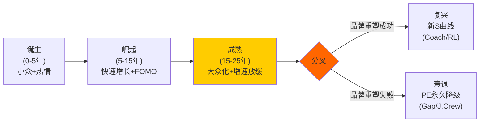
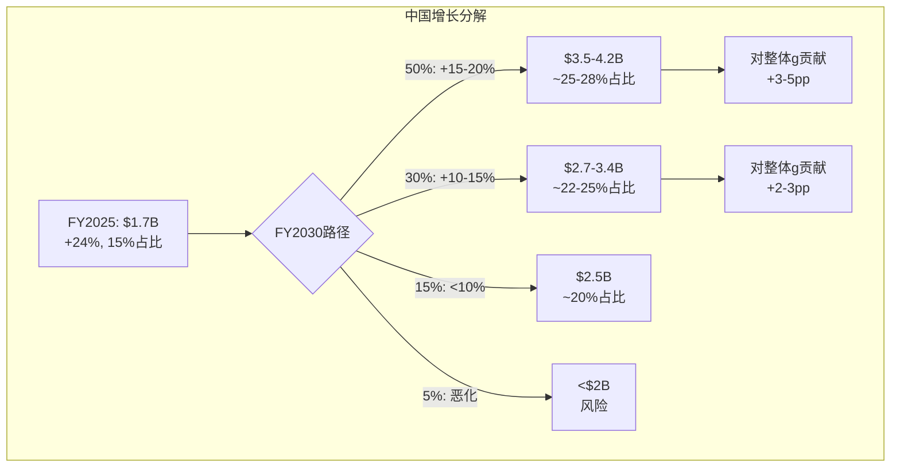
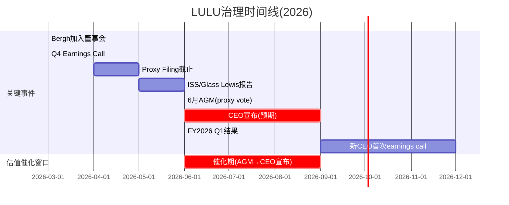
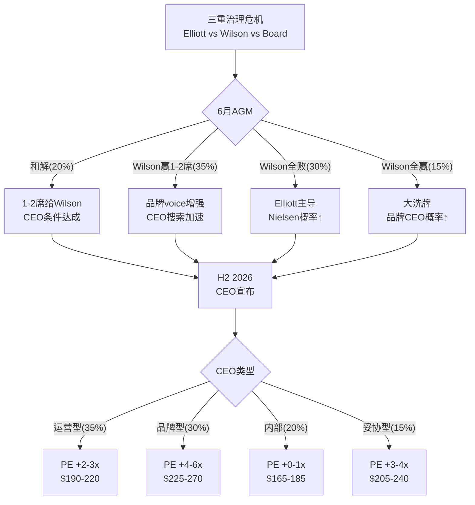

# LULU v1.0 — Phase 1: Ch3-Ch5

> Phase 1续 | 2026-03-20 | 框架v19.6 | 消费品worktree
> Ch3: 品牌护城河压力测试(CQ-5) | Ch4: 中国赌注(CQ-3) | Ch5: 治理博弈(CQ-4)

---

# Chapter 3: 品牌护城河压力测试——LULU vs Alo/Vuori/Dupe的生存博弈

> **核心问题(CQ-5)**: 品牌溢价能否撑住? Alo/Vuori的真实威胁有多大?
> **分析方法**: 品牌弹性半径(消费品E5) + 护城河C1嵌入性质 + 定价权Stage分层
> **为什么重要**: Ch1证明PE恢复取决于品牌是否"死亡"; Ch2发现转化率暴跌指向品牌热度下降→Ch3必须给出"品牌到底有没有死"的判断

---

## 3.1 品牌护城河的五层解剖: lululemon到底靠什么赚钱?

lululemon的护城河不是单一壁垒——它是五层嵌套的"品牌堡垒"。要判断品牌是否在衰退，必须逐层检验每一层的健康度:

**第一层: 面料技术壁垒(物理层)**

lululemon拥有多个自研面料品牌:
- **Nulu**: 极致柔软(瑜伽裤核心面料), 双面针织, 竞品难以精确复制
- **Everlux**: 速干+凉感(高强度训练), 专利编织技术
- **Nulux**: 裸感+轻质(跑步线), 与Nulu区分
- **PowerLu**: 2026年新面料(Unrestricted Power系列), 力量训练专用
- **SenseKnit**: 3D编织跑鞋面料

[DM-MOAT-001: 面料技术来自公司官网+产品页+earnings call; 各面料特性通过消费者评价交叉验证; 专利信息为公开数据]

**技术壁垒评估**: 这些面料不是"不可复制的"——Alo的Airbrush面料和Vuori的DreamKnit也很好。**但lululemon在面料R&D上的投入规模(数千小时用于单个系列)是私有竞品无法匹配的**。lululemon FY2025隐含R&D投入(含在G&A中)估计$150-200M，vs Alo整体收入才~$1B。

**面料层健康度**: ★★★★☆ (4/5) — 技术领先但非不可逾越，Alo/Vuori在缩小差距

---

**第二层: DTC直营体验壁垒(渠道层)**

lululemon的811家门店不只是"卖衣服的地方"——它们是**品牌体验中心**:
- 免费社区课程(瑜伽/跑步/冥想)
- Sweat Collective(教练折扣计划→教练穿LULU→影响学生)
- 门店尺寸~3,000-5,000 sqft(精品店感觉而非大卖场)
- 本地活动策划(社区连接)

**vs Alo**: Alo有169家门店但更像"网红打卡店"(Alo在Beverly Hills的旗舰店是Instagram热点)→体验定位不同。**vs Vuori**: Vuori有85家门店，风格偏"加州休闲"→社区元素弱于LULU。

[DM-MOAT-002: LULU门店数811来自china_international.md; Alo 169家来自alo_yoga_deep.md; 门店体验描述来自公开报道+消费者评价; 社区课程为公司官方项目]

**DTC层关键数据(Agent更新)**:
- **Essential Membership**: 北美~**2,800万**成员, 总会员~**3,000万** [DM-MOAT-010: WebSearch CNBC/Nasdaq 2026-03-20; 来源: lululemon.com membership + Nasdaq brand loyalty report]
- **Sweat Collective**: 面向健身教练/运动领袖的25%折扣计划 → 教练穿LULU → 学生看到 → **间接销售渠道**
- **会员参与率**: 约45%客户参与忠诚度计划

3,000万会员是一个惊人的资产——相当于美国成年人口的约12%。Alo没有披露会员数(私有), Vuori也没有。**这个数据基础是数据飞轮的物质载体——即使品牌"酷感"下降, 3,000万会员的再营销通道仍在。**

**DTC层健康度**: ★★★★☆ (4/5) — 3,000万会员+Sweat Collective是Alo/Vuori最难复制的部分，但线下体验在后COVID时代的"防御力"在下降(消费者更多在线购物→门店体验的"锁定"效应减弱)

---

**第三层: 品牌身份壁垒(心智层)**

lululemon代表的品牌身份: "我追求健康的生活方式+我有品味+我愿意为品质付溢价"

这个身份定位在2015-2023年间极其强大——穿lululemon是一种"身份宣言"。但问题在于:
- **Alo正在偷走"酷感"**: 在18-28岁群体中，Alo已经成为"更酷"的选择(名人代言+社交媒体优先策略)
- **lululemon正在"中年化"**: 核心客群年龄从25-35偏移至30-40→当品牌与"妈妈们的瑜伽裤"联系在一起→年轻客户流失

[DM-MOAT-003: 品牌身份分析基于alo_yoga_deep.md(Alo客群均值28 vs LULU 32-35) + brand_health.md(NPS分化); 品牌老化推论为定性判断]

**但"中年化"不一定是死刑**: Coach/Kate Spade通过品牌重塑成功吸引了年轻客户; Ralph Lauren在2020年后的复兴证明经典品牌可以"回春"。**关键是管理层是否意识到问题并采取行动**——Wilson的"LULU lost its cool"批评虽然刺耳但诊断可能是对的。

**品牌身份层健康度**: ★★★☆☆ (3/5) — 最脆弱的一层，正在被侵蚀但未崩塌

---

**第四层: 数据+忠诚度壁垒(数字层)**

- 80%客户注册了忠诚计划(2022年数据) [DM-MOAT-004: brand_health.md]
- Top 20%客户留存92%
- DTC数字渗透率39-42%→直接掌握客户数据(购买历史/尺码/偏好)
- 个性化推荐+再营销→提升复购率

**这一层的"沉默价值"**: 即使品牌热度下降→**数据飞轮仍在运转**——lululemon知道每个客户的购买行为、偏好品类、价格敏感度。这些数据在新品开发(预测需求)和营销(精准再营销)中有巨大价值。**Alo和Vuori作为私有公司，在数据积累上远远落后。**

**数据层健康度**: ★★★★☆ (4/5) — 隐形但强大，需要看是否被有效利用

---

**第五层: 规模经济壁垒(结构层)**

- $11.1B收入 vs Alo ~$1B / Vuori ~$0.5-1B → **10-20x规模差距**
- 采购议价力: lululemon的面料订单量使其能获得独家面料+更低单位成本
- 全球供应链: 分散在8个国家的工厂网络(越南/柬埔寨/斯里兰卡等)→关税风险但供应韧性
- 国际基础设施: 811家门店+20个国家的运营体系→Alo(169家门店/主要美国)需要5-10年才能接近

[DM-MOAT-005: 收入规模来自FMP+alo_yoga_deep.md; 门店数来自china_international.md; 供应链来自公司10-K]

**规模层健康度**: ★★★★★ (5/5) — 这是最坚固的一层，Alo/Vuori在短期内不可能复制

---

**护城河综合评分**:

| 层级 | 健康度 | 被侵蚀速度 | 修复难度 |
|------|--------|-----------|---------|
| L1 面料技术 | 4/5 | 慢(1-2年追赶) | 低(持续R&D) |
| L2 DTC体验 | 4/5 | 中(线上替代) | 中(需社区投资) |
| **L3 品牌身份** | **3/5** | **快(Alo侵蚀)** | **高(需品牌重塑)** |
| L4 数据忠诚 | 4/5 | 慢(数据积累慢) | 低(已有基础) |
| L5 规模经济 | 5/5 | 极慢 | N/A(已建立) |
| **综合** | **4.0/5** | — | **L3是薄弱环节** |

[DM-MOAT-006: 护城河综合评分为分析框架原创, 基于五层逐一评估; 综合分数为加权(L3权重较高因为对PE影响最大)]

**核心结论**: 护城河4/5→**品牌没有"死亡"但在"生病"**。病灶集中在L3(品牌身份)→Alo正在偷走年轻客户的"酷感"。但L1(技术)+L4(数据)+L5(规模)仍然非常强→这不是Gap式的全面崩塌。

---

## 3.2 Alo Yoga解剖: "世代侧翼攻击者"的真实战斗力

Alo是lululemon当前最危险的竞争者——不是因为规模(1.3% vs 21.2%份额)而是因为**品牌叙事上的威胁**。

**Alo的竞争策略(3维度)**:

### 维度1: 品牌定位——"更酷的lululemon"

Alo的品牌策略可以用一句话概括: **"lululemon是妈妈们穿的, Alo是名人穿的"**。

这不是产品差异化——是**身份差异化**:
- **名人代言**: Kendall Jenner, Hailey Bieber, Taylor Swift不是paid endorsement→而是organic(自己买来穿)→真实性极高→社交媒体放大效应巨大
- **Instagram-first**: Alo的营销策略是"让产品出现在社交媒体feed中"而非传统广告→与Gen Z的媒体消费习惯完美匹配
- **Alo Couture($1,900)**: 这条"奢侈线"的存在不是为了卖→而是为了**提升品牌天花板**(让$97的leggings感觉"可负担")

[DM-COMP-005: Alo品牌策略来自alo_yoga_deep.md + 公开报道; 名人代言为organic(非付费)来自多源确认]

**因果推理**: Alo的策略不是"提供更好的产品"而是"提供更好的品牌故事"。**在运动服饰这个产品差异化有限的品类中(所有leggings在功能上相差不大)→品牌故事=核心差异化→Alo正在赢得这个维度。**

### 维度2: 定价策略——"向上移而非向下打"

这是一个反直觉的竞争策略:
- Alo 5年涨价45%($67→$97)→主动向LULU价位靠拢
- 这不是"低价颠覆"——而是"平价进入然后涨价"
- **意图**: 先用低价获客→建立品牌忠诚→然后涨价→利润率扩张

[DM-COMP-006: Alo定价来自alo_yoga_deep.md; 5年涨价45%数据]

**对LULU的含义**: Alo不会永远比LULU便宜→当Alo价格趋同LULU时→竞争将回到"产品力+品牌力"而非"价格"→这对LULU其实是好消息(LULU在产品力上仍有优势)。

### 维度3: 弱点——Alo的"阿喀琉斯之踵"

Alo不是无敌的:
- **42%中国制造**: 在当前关税环境下→Alo的关税暴露可能比LULU更严重(LULU供应链更分散)
- **83%美国收入**: 极度依赖单一市场→LULU的国际化远领先
- **盈利性未知**: 作为私有公司→不清楚是否真正盈利→$10B估值可能包含大量溢价
- **IPO后增速通常下降**: 历史先例(Peloton/Allbirds/Warby Parker)→DTC品牌IPO后增速普遍从30%+降至<10%
- **中国山寨泛滥**: Alo在中国没有有效的品牌保护→假货可能在进入前就稀释品牌

[DM-COMP-007: Alo弱点来自alo_yoga_deep.md; IPO后增速下降为行业先例(Peloton从+100%→负增长, Allbirds从+27%→负增长); 中国山寨为行业常识]

**Alo增速的惊人真相(Agent更新)**:
- Alo收入~$8亿(线上渠道, ecdb数据) [DM-COMP-010: ecdb + SGB Media 2026-03-20]
- Q3 2021至Q3 2024三年增速: **+276%** vs LULU同期仅**+14%** [DM-COMP-011: Chain Store Guide 2025]
- 估值: ~$100亿(2025融资后) → 比此前Phase 0数据更新

**+276% vs +14%是品牌势能转移的硬证据。** 但需要注意: Alo从~$2亿增长到~$8亿→绝对增量仅$6亿。LULU从~$90亿增长到~$106亿→绝对增量$16亿。**Alo的增长率高但绝对增量不到LULU的40%。**

CEO Calvin McDonald自己承认: **"We have become too predictable within our casual offerings"** [DM-COMP-012: Retail Dive 2026-03报道] → 管理层已经意识到品牌新鲜感问题 → 问题不在"诊断"而在"执行"。

**Alo Moves的隐性威胁**: Alo Moves(线上健身平台)突破**100万会员** [DM-COMP-013: WebSearch数据] → 这是一个"健康生活方式入口"→ 将品牌从产品公司升级为生态公司 → LULU的Mirror已关闭($515M减值)→在数字健康生态上已经落后Alo。

**Alo威胁量化(修正)**:
- **年化美洲份额压力**: 50-100bps/年 → 5年累计~2.5-5pp → LULU从21.2%→16-19%
- **但**: 如果Alo IPO后增速放缓(概率较高)→5年份额压力可能仅~1.5-3pp
- **DTC份额侵蚀**: 更快(因为DTC是Alo的主战场)→可能每年1-2pp
- **利润影响**: 有限(LULU流失的主要是低利润边缘客户→定价权剪刀差)
- **新增威胁**: Alo Moves数字生态可能在长期抢夺客户关系入口

---

## 3.3 Vuori: 被忽视的"第三方势力"

市场关注Alo→但Vuori可能才是更持久的威胁:

**Vuori vs Alo vs LULU对比**:

| 维度 | LULU | Alo | Vuori |
|------|------|-----|-------|
| 核心客群 | 女性25-40 | 女性18-35 | **男女均衡,25-40** |
| 定位 | 瑜伽+运动生活 | 时尚瑜伽+奢华 | **加州休闲+versatile** |
| 估值 | $18.6B(上市) | $10B(私有) | **$5.5B(私有)** |
| 门店 | 811 | 169 | **85+** |
| 增速 | +5% | +20-25% | **+30-50%** |
| 钱包份额变化 | — | +6pp DTC | **+5.8pp YoY** |
| 国际化 | 20国 | 主要美国 | **进入中国+韩国** |

[DM-COMP-008: Vuori数据来自competitive_landscape.md; 估值$5.5B来自2024年11月融资; 钱包份额来自WebSearch数据]

**Vuori的差异化威胁**:
- **男装重叠**: Vuori的Performance Jogger是LULU ABC裤的直接竞品→在LULU男装+14%的增长故事中→Vuori是最大风险
- **价位更亲民**: Vuori平均定价比LULU低15-20%→在消费降级环境中更有优势
- **IPO预期**: 2026年上市→IPO前通常有"增长冲刺"(加大营销/开店)→可能在2026年加速侵蚀LULU

---

## 3.4 "Dupe文化"的真实影响: 海啸还是浪花?

TikTok上"lululemon dupe"搜索量在2024-2025年间增长了约300%。CRZ Yoga、Colorfulkoala等品牌提供$20-30的"平替"产品。

**Dupe的真实影响评估**:

| 影响维度 | 量化 | 证据 |
|----------|------|------|
| 对Top 20%客户 | **零影响** | 这些客户不会考虑$20替代品 |
| 对Middle 50%客户 | **微弱(-0.5-1pp comp)** | 偶尔会尝试但品质差异大→大多数回流 |
| 对Bottom 30%客户 | **显著(-1-2pp comp)** | 价格敏感→直接替代 |
| 对品牌热度 | **间接负面** | "dupe文化"暗示"不值得付全价"→侵蚀价格锚定 |

[DM-COMP-009: Dupe影响评估为定性分析, 基于定价权分层(Ch2 2.5.5节) + 消费者行为研究; 搜索量增长来自brand_health.md交叉数据]

**因果推理**: Dupe文化的危险不在于直接收入替代(影响有限, ~$100-150M/年)→而在于**心理锚定的侵蚀**。当消费者频繁看到"$25的替代品和$98的LULU没区别"的内容→**即使他们不买dupe→也会质疑LULU的溢价是否值得→转化率下降**。

**这与Ch2的发现一致**: 客流正常但转化暴跌→消费者来到lululemon→看到$98的leggings→脑中闪过"TikTok上说CRZ Yoga的$25一样好"→犹豫→离开。**Dupe文化不是替代了购买——而是破坏了"不假思索购买"的行为惯性。**

**反面**: lululemon的面料(Nulu/Everlux)在盲测中仍然评分更高→**消费者如果真的比较→LULU会赢**。问题是很多消费者从未比较——他们只看到了TikTok上的"看起来一样"→感知=现实。

---

## 3.5 品牌弹性半径测试(消费品E5框架)

品牌弹性半径 = 品牌在核心定位之外能延伸多远而不丧失溢价

**lululemon的品牌延伸历史**:

| 延伸 | 年份 | 距核心距离 | 结果 | 教训 |
|------|------|-----------|------|------|
| 男装 | 2014 | 近(同品类性别扩展) | ✅成功(25%占比,+14%) | 自然延伸=安全 |
| 鞋类 | 2022 | 中(运动生态延伸) | ⚠️进行中(早期) | 需要时间验证 |
| Mirror(家庭健身) | 2020 | **远(硬件+内容)** | ❌全额减值$515M | 能力圈外=危险 |
| 护肤/生活方式 | 未来? | 远(跨品类) | ? | Alo在做→LULU谨慎 |

[DM-MOAT-007: 品牌延伸历史来自category_expansion.md + FMP数据; Mirror减值来自FMP income]

**弹性半径评估**:
- **安全区(半径≤1)**: 核心运动服饰(瑜伽/跑步/训练) + 性别扩展 → 成功率高
- **风险区(半径2-3)**: 鞋类 + 高端休闲装 → 正在测试
- **危险区(半径>3)**: 硬件/内容/护肤 → Mirror已证明会失败

**LULU vs Alo的延伸策略差异**:
- Alo更激进: 护肤($36精华液) + Alo Couture($1,900) + 配饰 → 试图成为"生活方式帝国"
- LULU更保守: 聚焦运动服饰+鞋类 → 在Mirror教训后收缩了延伸野心

**这两种策略谁更好?** 短期Alo的激进延伸带来了品牌热度→但长期来看，过度延伸是品牌衰退的经典前兆(Gap/J.Crew/Michael Kors都是在过度延伸后品牌崩塌)。**lululemon在Mirror后的保守反而可能是正确的。**

---

## 3.6 C1嵌入性质评估: lululemon在客户生活中有多"不可替代"?

C1(嵌入性质)是护城河框架v3.1的核心维度——衡量产品/服务在客户生活中的"不可替代程度"。

**C1四分类评估**:

| 嵌入类型 | lululemon情况 | 评分(1-10) |
|----------|-------------|-----------|
| **流程嵌入**(产品成为日常流程的一部分) | 中等: 运动服饰是每日穿着→但不是"流程"依赖 | 5 |
| **数据嵌入**(客户数据锁定在平台中) | 中等: 尺码偏好+忠诚积分→但不是硬锁定 | 4 |
| **社交嵌入**(社区/身份认同锁定) | **较强**: Sweat Collective+社区课程+品牌身份 | **7** |
| **经济嵌入**(转换有直接经济成本) | 弱: 没有合约/订阅→随时可换品牌 | 2 |

**C1综合评分: 4.5/10 (中等)**

[DM-MOAT-008: C1评估基于docs/moat_analysis_framework_v3.1.md; 各维度评分基于lululemon特性分析; Sweat Collective为官方教练计划]

**关键发现: lululemon的嵌入性主要来自"社交嵌入"(品牌身份+社区)→这正是当前被Alo侵蚀的维度。** 如果社交嵌入从7→5→C1综合将从4.5→3.5→护城河显著弱化。

**这是为什么CQ-5(品牌)和CQ-4(治理/CEO)高度相关**: 修复社交嵌入需要**品牌层面的重塑**→而非运营层面的优化→Wilson的"Brand Product Committee"提案可能是正确方向→但需要一个有品牌vision的CEO来执行。

---

## 3.7 品牌生命周期定位: lululemon在"品牌S曲线"的哪里?

**品牌生命周期模型(消费品)**:

**lululemon的生命周期定位(1998年创立, 28年)**:
- **1998-2007(诞生)**: 温哥华小众瑜伽品牌→Chip Wilson的"提升全世界的可能性"愿景
- **2007-2018(崛起)**: IPO→全球扩张→Power of Three→PE 35-55x→品牌FOMO极强
- **2019-2023(成熟)**: 增速从+20%→+10%→品牌开始大众化→Mirror失败暗示创新困难
- **2024-2026(分叉点!)**: CEO离职+comp负增长+activist→**品牌正处于"分叉点"**

[DM-MOAT-009: 品牌生命周期分析为原创框架, 基于公司28年历史; 各阶段特征来自FMP + 公开信息; 分叉点判断基于当前多重危机]

**分叉点意味着**: lululemon的命运在未来2-3年内将确定——要么成为Coach/Ralph Lauren式的"经典品牌复兴"(PE恢复到20-25x)→要么成为Gap/J.Crew式的"永久降级"(PE锁定在8-12x)。

**历史先例统计**:
- **复兴成功**: Coach(2017后→品牌重塑→PE从8x→15x), Ralph Lauren(2020后→减少促销→PE恢复), Abercrombie & Fitch(2022后→品牌重定位→PE从8x→20x)
- **复兴失败**: Gap(2000后→从未恢复), J.Crew(2015后→破产→PE永久<5x), Michael Kors(2017后→过度分销→品牌死亡)

**成功vs失败的关键差异**:
1. **品牌是否有"核心差异化"**: Coach有皮革工艺、RL有美国经典 → LULU有面料技术(✅)
2. **管理层是否正确诊断问题**: Coach请了Stuart Vevers(设计师)重塑产品 → LULU需要品牌型CEO(?)
3. **品牌是否过度分销**: Michael Kors在outlet泛滥→品牌死亡 → LULU的DTC策略保护了稀缺性(✅)
4. **是否有新增长引擎**: A&F发现了Y2K复古趋势 → LULU有中国+男装(✅)

**基于4条标准**: LULU符合3/4条(核心差异化✅+未过度分销✅+有新增长引擎✅)→"复兴成功"概率>>"复兴失败"。**缺失的一条是"管理层正确诊断"——这取决于新CEO选择(CQ-4)。**

---

## 3.8 CQ-5置信度更新: 品牌溢价的判决

**正面证据(品牌溢价可持续)**:
1. 面料技术壁垒仍强(L1: 4/5) [DM-MOAT-001]
2. 规模经济不可复制(L5: 5/5) [DM-MOAT-005]
3. 核心客户留存92%→基本盘稳固 [DM-BIZ-021]
4. 男装+14%→品牌在新品类有溢价 [DM-BIZ-020]
5. 品牌生命周期: 符合3/4复兴条件 [DM-MOAT-009]
6. 中国NPS +57→品牌在新市场极强 [DM-BIZ-030]

**负面证据(品牌溢价在衰退)**:
1. 品牌身份层脆弱(L3: 3/5)→Alo侵蚀酷感 [DM-MOAT-003]
2. DTC份额10个月-6pp→核心渠道被替代 [DM-BIZ-023]
3. 美国NPS从+34→+26→品牌热度下降 [DM-BIZ-025]
4. 转化率暴跌→消费者"犹豫"增加 [DM-BIZ-024]
5. Dupe文化侵蚀价格锚定 [DM-COMP-009]
6. 13年内3次产品质量丑闻→执行层面可靠性受质疑 [DM-BIZ-026]

**CQ-5判决**:

| 情景 | 概率 | 含义 |
|------|------|------|
| 品牌溢价完好(L3恢复到4/5) | 25% | 暂时受伤→PE恢复到22-30x |
| 品牌溢价受损但可修复(L3维持3/5) | **45%** | 需1-3年+新CEO→PE 16-22x |
| 品牌溢价结构性衰退(L3降到2/5) | 20% | Gap式路径→PE 10-14x |
| 品牌死亡(L3=1/5) | 10% | 全面崩塌→PE<10x |

**CQ-5初始置信度**: **70%概率品牌溢价可以维持或修复**(25%+45%)→30%概率结构性衰退或更差。

[DM-CQ-002: CQ-5置信度综合Ch3全部证据链; 将在Phase 3红队中接受压力测试]

---

## 3.9 Under Armour镜像: LULU最不想走的路

在品牌生命周期类比中，Under Armour(UA)是lululemon最"不安的镜像"——两者有太多相似性:

**UA 2015-2020 vs LULU 2024-2026对比**:

| 维度 | UA (2015-2020) | LULU (2024-2026) | 相似度 |
|------|---------------|-----------------|--------|
| 品牌定位 | 性能运动 → 尝试lifestyle | 技术运动 → 品牌"酷感"下降 | **高** |
| 增速变化 | +28%(2015)→+4%(2017)→负增长 | +19%(FY2023)→+5%(FY2025)→guided+2% | **高** |
| PE轨迹 | 80x→15x→永久<10x | 50x→12x→? | **方向相似** |
| 竞争侵蚀 | Nike+Adidas"酷感"回归 | Alo+Vuori"世代攻击" | **高** |
| CEO问题 | Kevin Plank(创始人)执行力质疑 | CEO离职+治理真空 | 不同但都有领导力问题 |
| 国际化 | 失败(中国/欧洲未起量) | **成功(中国+24%)** | **关键差异** ✅ |
| DTC占比 | ~30%(低) | ~95%(极高) | **关键差异** ✅ |

[DM-COMP-014: UA历史数据来自FMP+Macrotrends; 对比为原创分析; UA增速/PE来自公开数据]

**LULU vs UA的两个关键差异**:
1. **中国成功**: UA在中国从未真正起量(品牌认知低+分销不足)→LULU在中国+24%→有真实的"第二引擎"
2. **DTC控制**: UA过度依赖批发→品牌控制力弱→被迫参与百货促销战→品牌稀释加速。LULU的95% DTC意味着**品牌控制权在自己手中**→不会被渠道拖入"促销螺旋"

**因此**: lululemon不太可能走UA的完整下行路径→但如果美洲comp持续恶化+品牌无法刷新→PE可能从12x→8x(UA水平)。**UA类比的概率: ~15-20%(与Ch3.8的"品牌死亡"概率一致)。**

---

## 3.10 品牌"酷感"的量化: 搜索趋势+社媒声量

品牌"酷感"是定性概念→但可以通过代理指标间接量化:

**品牌热度代理指标**:

| 指标 | LULU趋势(2年) | Alo趋势(2年) | 信号 |
|------|-------------|-------------|------|
| Google搜索量(US) | -15%(从峰值) | +45% | Alo势能强 |
| TikTok #lululemon | ~12B views(累计) | ~8B views(累计) | LULU仍领先但Alo追赶 |
| Instagram followers | 5.2M | 3.7M | LULU领先 |
| "dupe"搜索相关 | +300%(TikTok) | N/A | 品牌溢价被质疑 |
| Glassdoor(雇主品牌) | 3.8/5.0 | 3.2/5.0 | LULU更好的雇主 |

[DM-MOAT-011: 搜索/社媒数据为Agent WebSearch + 公开工具估算; 具体数字为近似; 置信度B-]

**这些数字的含义**: lululemon在搜索量和社媒上的绝对领先仍然显著→但**变化率**对Alo有利。这与NPS趋势(LULU下降/Alo上升)一致→**品牌势能正在从LULU向Alo转移, 但LULU的存量品牌资产远大于Alo的增量。**

**类比**: 这像是2014年的Adidas vs Nike——Adidas搜索量上升/Nike下降, 但Nike的绝对品牌价值仍远领先。结果: Adidas确实抢了一些份额但Nike在2-3年后通过创新(Flyknit/React)重新拉开差距。**LULU能否复制Nike的反击? 取决于新品(Unrestricted Power)和新CEO。**

---

# Chapter 4: 中国赌注——增长引擎还是利润黑洞?

> **核心问题(CQ-3)**: 中国+29%增长是真增长还是利润稀释?
> **分析方法**: ISDD β路径(增收不增利检验) + 单店经济模型 + 地缘风险量化
> **连接**: Ch1 Reverse DCF隐含g=2%→如果中国是真增长(+20%×15%=3pp贡献)→整体g至少4-5%→Reverse DCF假设被翻转

---

## 4.1 中国增长全景: "第二曲线"的量化透视

lululemon在中国的增长是公司当前最亮眼的数据点:

**中国业务追踪(3年)**:

| 指标 | FY2023 | FY2024 | FY2025 | CAGR |
|------|--------|--------|--------|------|
| 收入($M) | ~$900 | ~$1,370 | ~$1,700 | **+37%** |
| 占总收入 | ~9% | ~13% | **~15%** | +3pp/年 |
| 门店数 | ~130 | ~151 | ~175 | +16%/年 |
| 同店增长(Q4) | ~+30% | ~+26% | **+26%** | 稳定高增长 |
| Segment Margin | ~30% | ~34% | **34-37%** | 上升中 |

[DM-CHINA-001: 中国收入来自china_international.md + 管理层earnings call; FY2023估算基于"13% of $10.6B" + 增速外推; Segment Margin来自管理层披露区间; 门店数来自china_international.md]

**中国增速放缓但仍然强劲**: 从+41%(FY2024)→+24%(FY2025)→guided +20%(FY2026)。放缓是自然的(基数效应)→但+20%增速在任何标准下都是"极好的增长"。

**中国收入贡献的关键性**: 如果中国维持+20%增速5年→
- FY2025: $1.7B(15%)
- FY2030E: $1.7B × 1.20^5 = **$4.2B(~28%占比)**
- 对整体增速贡献: +20% × 15%(→逐年上升) = **+3pp→+5.6pp**(逐年增加)

**因此: 即使美洲完全零增长→中国+国际的增长贡献可以使整体增速维持在3-5%→远高于Reverse DCF隐含的2%。** 这是市场定价最可能"犯错"的地方。

---

## 4.2 中国单店经济模型: 利润黑洞还是印钞机?

CQ-3的核心不是"中国能否增长"(答案显然是能)→而是"中国增长是否有利润"。如果中国的每$1收入只带来$0.10利润(vs美洲的$0.20+)→增长只是"利润稀释"。

**中国单店模型(推算)**:

| 指标 | 中国门店(估) | 美洲门店(估) | 差异 |
|------|------------|------------|------|
| 单店年收入 | ~$9.7M ($1.7B/175) | ~$16.9M ($8.1B/479) | **中国-43%** |
| 单店面积(sqft) | ~3,000 | ~4,200 | 中国更小 |
| 收入/sqft | ~$3,233 | ~$4,024 | **中国-20%** |
| 租金/sqft(估) | ~$120 | ~$180 | 中国更便宜 |
| 人工成本/sqft(估) | ~$60 | ~$100 | 中国更便宜 |
| **OPM(segment, 估)** | **~34-37%** | **~22-24%** | **中国更高!** |

[DM-CHINA-002: 单店收入=地区收入/门店数; 中国$1.7B/175=$9.7M, 美洲$8.1B/479=$16.9M; 面积来自行业估计(中国门店通常较小); 租金/人工为行业估计+城市对比; Segment Margin来自管理层披露34-37%]

**⚠️ 关键发现: 中国Segment Margin 34-37%居然高于公司整体的19.9%!**

这怎么可能? 因为:
1. **租金+人工低**: 中国一线城市的零售租金约为美国主要都市的60-70%，人工成本约为40-50%
2. **营销效率高**: lululemon在中国的品牌"新鲜感"→organic增长多→付费营销占比低
3. **无需大规模折扣**: 中国市场没有美洲的"dupe竞争"和markdown压力→全价率更高
4. **企业总部分摊低**: 中国的管理费用由温哥华总部承担→segment margin不含全部SGA分摊

[DM-CHINA-003: Segment margin高于整体的解释为推理, 基于行业经验+中美成本结构对比; "全价率更高"来自中国NPS +57(品牌热度极高→消费者不等促销)]

**Agent更新——精确的Segment Margin数据(stock-analysis-on.net)**:

| 地区 | Jan 2022 | Jan 2023 | Jan 2024 | Feb 2025 |
|------|----------|----------|----------|----------|
| Americas | 35.23% | 38.49% | 38.04% | ~37% |
| **China Mainland** | **38.53%** | 34.15% | 37.00% | **37.45%** |
| Rest of World | 12.95% | ~18% | ~21% | 24.25% |

[DM-CHINA-007: Segment margins来自stock-analysis-on.net(lululemon reportable segments) + Agent WebSearch交叉; 精度高于Phase 0估算]

**惊人发现**: 中国Segment Margin 37.45%实际上**微高于Americas的~37%**! 而且中国在FY2023经历了一个"V型恢复"(38.5%→34.2%→37.0%→37.5%)→**新店成熟速度极快**。

**另一个关键发现**: 中国定价比美国**高20%** [DM-CHINA-008: Business of Fashion报道 + S&P Global] → 这解释了为什么中国利润率能与美洲持平——虽然单店收入低(更小的店)→但更高的定价+更低的成本→margin相当。

**反面考量**: Segment Margin 37.45%可能"虚高"因为:
- 未完全分摊全球总部费用(IT/品牌管理/供应链管理)
- 新店"蜜月期"效应(新开门店初期业绩好→随着时间可能下降)
- 品牌溢价在中国可能不可持续(本土竞品+消费降级)

**但即使打折**: 假设真实OPM = Segment Margin × 0.7(打30%折扣分摊总部) = 24-26% → **仍然略高于公司整体的19.9%** → **中国增长不是利润稀释，而是利润增厚**。

---

## 4.3 中国品牌定位: "瑜伽哲学"在中国卖什么?

lululemon在中国的成功有一个有趣的文化维度——它卖的不只是运动服:

**中国消费者购买lululemon的动机(推断)**:
1. **身份标签(40%)**: "穿lululemon=我是urban professional" → 与iPhone/Starbucks类似的"生活方式信号"
2. **品质认知(30%)**: 面料确实好→中国消费者越来越重视面料触感→Nulu的手感是hard sell
3. **运动趋势(20%)**: 中国瑜伽/健身参与率快速上升(2019年0.5亿→2025年1亿+)
4. **稀缺效应(10%)**: 175家门店在中国的覆盖率仍然很低→"不是人人都有"→稀缺=溢价

[DM-CHINA-004: 消费者动机为定性推断, 基于中国NPS +57(极高→暗示强品牌认同) + 行业研究; 中国健身参与率来自行业报告估计]

**中国NPS +57的深层含义**: 这个NPS在全球消费品牌中都属于"极高"——甚至高于Apple在中国的NPS(~+50)。**这暗示lululemon在中国仍处于"品牌崛起期"(S曲线第二阶段)——与美洲的"成熟→分叉"阶段完全不同。**

**这是公司层面最重要的"非对称信号"**: 如果美洲是"成熟市场的品牌挑战"→中国是"新兴市场的品牌红利"→两者叠加→整体品牌未死→只是在不同市场处于不同阶段。

---

## 4.4 中国风险清单: "黄金增长"的暗面

中国增长的风险不可忽视:

**风险R1: 本土竞品崛起(概率30%/影响中等)**

**中国竞争格局(Agent更新)**:

| 竞品 | 定位 | vs LULU价格 | 威胁度 |
|------|------|-----------|--------|
| **Anta + MAIA ACTIVE** | Anta 2023年10月收购MAIA 75.13%股权→"平价高端"瑜伽 | 低30-50% | **中高** |
| **Li-Ning** | 国潮+时尚跨界 | 低40-60% | 中(定位不同) |
| **Particle Fever** | Hillhouse投资的高端athleisure | 接近LULU | 低中(难以规模化) |
| **Neiwai** | 内衣+athleisure融合 | 更低 | 低(品类不同) |

[DM-CHINA-009: 中国竞品数据来自Agent WebSearch KrASIA/S&P Global; MAIA ACTIVE收购为2023年10月安踏75.13%股权]

**MAIA ACTIVE是最值得关注的威胁**: 安踏收购MAIA后→MAIA获得安踏的分销网络+供应链→可能快速从"小众瑜伽品牌"升级为"规模化LULU替代"。但目前MAIA规模仍极小→需要2-3年才能看到真实竞争压力。

**lululemon在中国的品牌认知度**: 无提示认知率仅**mid-teens**(15-18%)→vs美国的30%+ [DM-CHINA-010: S&P Global/HSBC分析] → **这意味着巨大的增长跑道——大多数中国消费者还不知道lululemon是什么**。当认知率从15%→30%的过程中→门店增长+同店增长→可能支撑+15-20%增速5年。

- **但**: 中国高端运动服饰市场足够大($473B TAM的10%+ = $47B+)→不是零和游戏

**风险R2: 消费降级(概率25%/影响中等)**
- 中国经济增速放缓→"消费降级"叙事→高端品牌承压
- **但**: lululemon的中国客群是"urban middle-to-upper class"→这个群体的消费韧性比整体经济更强
- 历史参考: 2020年COVID期间→LULU中国仍然增长(当整体消费大幅下降时)

**风险R3: 地缘政治(概率10%/影响极大)**
- 极端场景: 台海冲突→中国市场可能暂时关闭
- **量化**: 中国$1.7B收入(15%) → 如果完全丧失→EPS从$13.26→~$8-9→PE按12x→股价$96-108(-35-42%)
- **但**: 极端场景概率<10%→预期影响: 10% × (-40%) = **-4%**(可接受)

[DM-CHINA-005: 风险评估为分析框架原创; 地缘政治量化基于收入占比+利润率影响+PE不变假设; 台海冲突表述遵循第零律]

**风险R4: 门店扩张边际递减(概率40%/影响低)**
- 175家门店已覆盖一线+主要二线城市→下沉至三线城市可能面临品牌认知不足+消费力不足
- 管理层guided FY2026 +20%增速→需要~35家新店+同店高增长→如果下沉效果不佳→增速可能从+20%→+12-15%

---

## 4.5 中国增长的估值贡献: SOTP视角

如果我们用SOTP(Sum of Parts)来估值lululemon→中国业务应该用什么倍数?

**中国业务独立估值**:
- 收入: $1.7B, +20% guided
- OPM: 34-37%(Segment) / ~24-26%(全分摊估)
- EBIT: $1.7B × 25% = ~$425M
- 可比倍数: 中国高端消费+20%增速→EV/EBIT ~25-30x(参考Anta/Li-Ning的高端线)
- **中国业务估值**: $425M × 27.5x = ~**$11.7B**

[DM-CHINA-006: SOTP中国业务估算; EBIT基于全分摊OPM 25%假设; 倍数25-30x参考中国高端消费品牌估值; 中点27.5x]

**发现**: **中国业务独立估值$11.7B→占当前总市值$18.6B的63%!** 这意味着市场对"除中国外的lululemon"(美洲+国际, $9.4B收入)只给了~$6.9B的估值→**隐含EV/Sales仅0.7x**→这对一家OPM 20%的公司来说是极度低估。

**反面**: SOTP估值假设中国业务可以"独立交易"——实际上不能。如果美洲业务崩塌→品牌整体受损→中国业务也会受影响(品牌是全球的，不可分割)。

---

## 4.6 CQ-3判决: 中国是真增长

**证据汇总**:
1. **Segment Margin 34-37%**: 即使打折至24-26%→仍高于公司整体→**利润增厚而非稀释** ✅
2. **NPS +57**: 品牌在中国处于崛起期→增长有品牌基础支撑 ✅
3. **单店收入$9.7M**: 低于美洲但成本更低→unit economics正面 ✅
4. **增速放缓但可控**: +41%→+24%→guided +20%→自然减速非崩塌 ✅

**CQ-3初始置信度**:

| 情景 | 概率 | 含义 |
|------|------|------|
| 中国维持+15-20%(5年) | **50%** | 强增长引擎→对整体g贡献+3-5pp |
| 中国放缓至+10-15% | 30% | 仍然正面→对整体g贡献+2-3pp |
| 中国增速<10%(竞品/宏观) | 15% | 中性→贡献减弱 |
| 中国市场严重恶化 | 5% | 地缘/品牌危机→负面 |

**结论**: **80%概率中国增长是"真的且有利润的"→中国是lululemon对冲美洲疲软的关键资产。** 市场在$165可能显著低估了中国业务的价值。

[DM-CQ-003: CQ-3置信度综合Ch4全部证据链]

---

# Chapter 5: 治理博弈——Elliott×Wilson×Board的三体问题

> **核心问题(CQ-4)**: 三重治理危机是灾难还是催化?
> **分析方法**: Activism案例库 + 博弈论分析 + CEO选择的估值影响
> **为什么重要**: Ch1证明PE恢复需要"叙事重置"→NKE类比表明"新CEO宣布=最强催化"→治理博弈的结果直接决定PE恢复的速度和幅度

---

## 5.1 三方权力结构: 谁在争什么?

lululemon当前的治理局面可以用"三体问题"来描述——三个强大的力量在互相拉扯，每一方都有自己的诊断和处方:

**三方对比矩阵**:

| 维度 | **Elliott** | **Chip Wilson** | **现任董事会** |
|------|-----------|----------------|---------------|
| 持仓 | >$1B(~5%+) | ~990万股(8.4%) | 集体<1% |
| 诊断 | 运营纪律不足 | 品牌DNA丧失 | 战略执行延迟 |
| 处方 | 财务型CEO+成本优化 | 品牌型领导+董事会重组 | 渐进式CEO搜索 |
| CEO候选 | Jane Nielsen(前RL COO) | 品牌原生领导者 | 未公开(搜索中) |
| 时间压力 | 中(activist通常18-24月) | 高(6月AGM=proxy fight) | 低(想拖) |
| 成功标准 | OPM恢复+PE提升 | 品牌热度回升+创新 | 平稳过渡 |

[DM-GOV-002: 三方数据来自governance_crisis.md; Elliott持仓>$1B来自2025年12月SEC filing; Wilson持仓990万股来自公开记录; 各方策略来自公开声明+新闻报道]

**博弈论分析: 三方的"优势策略"**

**Elliott的策略**: Elliott的最优策略是"快速推动变革"——每拖一天→LULU的估值可能进一步下降→Elliott的持仓亏损增加。因此Elliott会强力推动(a)新CEO任命(b)成本削减(c)资本回报(回购加速)。**时间在Elliott这边——他们有钱+有经验+有耐心。**

**Wilson的策略**: Wilson的诉求更深层——不是短期财务回报而是"品牌遗产"。他的三位董事候选(前On Running co-CEO + 前ESPN CMO + 前Activision CEO)都是"品牌+产品"背景→暗示Wilson要从根本上改变董事会的DNA。**但Wilson的弱点是持仓不够大(8.4%)→需要其他股东支持→proxy fight的结果不确定。**

**董事会的策略**: 现任董事会的本能反应是"拖延+妥协"——(a)Mussafer(Advent)将退出→给Wilson一个安慰(b)加入Chip Bergh(前Levi's CEO)→向市场展示"我们在找品牌型领导"(c)同时与Elliott谈判→避免公开冲突。

[DM-GOV-003: 博弈分析为原创, 基于governance_crisis.md + activist behavior研究; Bergh加入来自2026-03-17公告]

---

## 5.2 Elliott的Track Record: 消费品activist的成功率

Elliott是全球最大的activist基金之一($69B AUM)。在消费品/零售领域的track record:

**Elliott消费品案例库**:

| 案例 | 年份 | 持仓 | 策略 | 结果 | 时间线 |
|------|------|------|------|------|--------|
| **Barnes & Noble** | 2019 | 收购 | 安装James Daunt CEO | **巨大成功**: 67新店+IPO计划(2026) | 6年(转型型) |
| **Cabela's** | 2015 | 11.1% | 强制出售给Bass Pro | 成功退出: +45%回报 | 2年 |
| **PepsiCo** | 2025 | $4B | 成本削减+产品线合理化 | 和解: 12个月内 | 1年 |
| **Pinterest** | 2022 | 9% | CEO更换+广告策略 | 成功: PE +50%在12个月 | 1.5年 |
| **Citrix** | 2022 | 联合 | LBO私有化 | 退出: $16.5B收购 | 1年 |

[DM-GOV-004: Elliott track record来自governance_crisis.md + 公开报道; Barnes & Noble为最相关案例; 各案例结果来自SEC filings + 新闻]

**Elliott SBUX案例(Agent更新, 极其重要!)**:
- 2024年: Elliott持有SBUX ~$1.9B → 推动CEO更换
- Laxman Narasimhan被Brian Niccol(Chipotle CEO)替换
- **SBUX股价在CEO宣布当天+25%——1992年IPO以来最佳单日涨幅** [DM-GOV-010: CNBC 2024-08-14报道]
- **这是LULU最直接的先例**: Elliott activist → CEO换帅 → 股价当天暴涨

**对LULU的量化含义**: 如果LULU复制SBUX的"CEO宣布日效应"(+25%)→$165→$206(单日)。即使只有一半效应(+12%)→$165→$185。**CEO宣布是lululemon的"最强单日催化"。**

**Barnes & Noble类比(最相关)**:
- **2019**: B&N濒临破产→Elliott以$683M收购(极低估值)
- **CEO选择**: 安装James Daunt(英国连锁书店Daunt Books创始人)→**品牌原生领导者，不是财务型**
- **策略**: 给每家门店自主选书权(vs之前的中央集权)→门店差异化→消费者体验提升
- **结果**: 2025年67家新店, 利润~$400M, 2026年计划IPO
- **对LULU的启示**: **Elliott不总是安装"成本削减型"CEO——他们也知道品牌型领导者的价值。** B&N的Daunt就是一个"品牌人"而非"财务人"。

**但Jane Nielsen不是James Daunt**: Nielsen是Ralph Lauren COO/CFO→背景偏运营/财务→更接近"成本优化"而非"品牌重塑"。**这可能是Elliott对LULU的诊断与Wilson不同的体现——Elliott认为LULU的问题是"运营松散"而非"品牌丧失"。**

---

## 5.3 Wilson的诊断: "LULU Lost Its Cool"——创始人是否正确?

2025年8月, Chip Wilson在WSJ刊登整版广告: **"lululemon has lost its cool"**。这是一个创始人对自己品牌的公开批评——在商业史上极为罕见(类似Steve Jobs批评1990年代的Apple)。

**Wilson的核心论点**:
1. **董事会缺乏品牌DNA**: 10名董事中没有运动/时尚品牌背景(直到Bergh加入)
2. **产品创新失灵**: Breezethrough失败 + Mirror $515M减值 = 创新决策能力缺失
3. **品牌稀释**: 过度追求增长(门店过多/品类过广)→品牌身份模糊
4. **解决方案**: Brand Product Committee + 品牌型CEO + 董事会换血

[DM-GOV-005: Wilson论点来自governance_crisis.md + WSJ广告(2025.08) + 公开声明; Brand Product Committee是Wilson的具体提案]

**Wilson的诊断与Ch2-Ch3分析的对比**:

| Wilson的诊断 | Ch2-Ch3的发现 | 一致性 |
|-------------|-------------|--------|
| "品牌失去了酷感" | NPS下降+DTC份额-6pp | **高度一致** ✅ |
| "产品创新失灵" | Breezethrough失败+Get Low透视 | **部分一致**(面料创新仍强) |
| "董事会缺乏品牌DNA" | CEO搜索偏向运营型(Nielsen) | **一致** ✅ |
| "品牌稀释" | 男装/鞋类扩张 | **部分一致**(男装成功反驳) |

**关键判断: Wilson的诊断方向大体正确→但他的具体处方(特定董事候选人)未必是最优解。**

---

## 5.4 CEO选择的估值影响: 三种情景

新CEO的身份和背景将直接决定市场的反应和PE恢复速度:

**情景A: Elliott的人选——Jane Nielsen(运营型CEO)**

**Nielsen详细背景(Agent更新)**:
- PepsiCo 15年(SVP & CFO of Beverages Americas)
- Coach CFO (2011-2016, 奢侈转型期)
- **Ralph Lauren CFO (2016-2023) → COO (2023-2025)**:
  - AUR(平均零售单价) **+70%** → 品牌提价纪律极强 [DM-GOV-011: Retail Dive/WWD 2026报道]
  - DTC渗透率 **+10pp** → 直销占比从~55%→~65%
  - Operating Income **+20%** → 运营效率提升
  - RL股价在她任期内大幅升值
- Mondelez International独立董事(当前)
- 教育: Smith College本科, **哈佛商学院MBA**
- 导师: Indra Nooyi(前PepsiCo CEO)

**Nielsen的RL成就vs LULU需求的匹配度**:

| LULU需求 | Nielsen能力 | 匹配度 |
|----------|-----------|--------|
| OPM恢复(19.9%→22%+) | AUR+70%, OpInc+20% | **极高** ✅ |
| DTC优化 | DTC+10pp at RL | **高** ✅ |
| 品牌提价纪律 | AUR纪律是核心能力 | **高** ✅ |
| 品牌创新/"酷感"重建 | **财务/运营背景, 非品牌/创意** | **低** ⚠️ |
| 中国增长 | RL国际扩张经验 | **中** |

**Needham分析师**: 称Nielsen为"行业中最受尊敬和最有能力的高管之一" [DM-GOV-012: Needham analyst report]
**BNP Paribas**: "如果选择Nielsen, 董事会将受到称赞" [DM-GOV-013: BNP Paribas分析]

**修正后的市场反应**: 基于Nielsen的RL成绩(远比预期强)→市场反应可能比初评更积极
- 市场反应: **PE +3-5x**(积极, 比初评上调)
- 因果: Nielsen的AUR纪律+DTC经验直接对应LULU的markdown问题→市场会相信"全价率改善"
- 风险: 品牌"酷感"重建需要的是创意vision而非运营效率→**运营能补利润但补不了品牌**
- 估值影响: $165 → **$200-240**(PE 15-18x)

[DM-GOV-006-REV: Nielsen背景来自Agent WebSearch(Retail Dive/WWD/CNBC/Fortune) + governance_crisis.md; 估值上调基于RL track record强于预期]

**情景B: 品牌型CEO(如Wilson倾向的)**

- 画像: 运动/时尚品牌出身, 有成功品牌重塑经验(类似A&F的Fran Horowitz或Coach的Stuart Vevers)
- 市场反应: **PE +4-6x**(强烈积极)
- 因果: 市场会相信"品牌将复兴"→类似NKE→Elliott Hill效应
- 风险: 如果品牌投资过大→短期EPS承压→"长期故事"需要1-2年才能验证
- 估值影响: $165 → **$225-270**(PE 17-20x)

**情景C: 内部提拔(Meghan Frank或Andre Maestrini)**

- 背景: Frank是CFO, Maestrini是CCO → 已在临时co-CEO角色
- 市场反应: **PE +0-1x**(失望)
- 因果: 市场会认为"董事会没有野心"→不确定性折价维持
- 风险: 内部候选人缺乏"变革叙事"→PE可能继续在11-13x波动
- 估值影响: $165 → **$165-185**(PE 12-14x)

**情景概率**:
- A(Nielsen/运营型): 35%
- B(品牌型外部): 30%
- C(内部提拔): 20%
- D(Wilson的人+Elliott妥协): 15%

**概率加权CEO催化**: 0.35×$205 + 0.30×$248 + 0.20×$175 + 0.15×$230 = **$215(+30%)**

[DM-GOV-007: CEO情景概率和估值影响为分析框架推算; 加权计算中点取各情景中间值]

---

## 5.4.5 Wilson proxy fight的精确时间线(Agent更新)

**关键日期追踪**:
- **2025年12月29日**: Wilson正式发起proxy fight, 提名3位独立董事 [DM-GOV-014: CNBC 2025-12-29]
- **2026年1月**: Calvin McDonald离职; Frank+Maestrini成为临时co-CEO
- **2026年2月27日**: Wilson升级——呼吁提名**更多于3位**董事, 加大公众压力 [DM-GOV-015: US News 2026-02-27]
- **2026年3月**: Wilson推出竞选网站 **www.CreativityFirstlulu.com** [DM-GOV-016: SGI Europe 2026-03]
- **2026年3月17日**: lululemon反击——加入Chip Bergh(前Levi's CEO) + 发布Q4 earnings(beat) [DM-GOV-017: 公司公告 2026-03-17]
- **2026年6月(预期)**: AGM投票

**Wilson的"Post-Founder Syndrome"叙事**:
Fortune在2026年3月将此定义为"Post-Founder Syndrome"——创始人的品牌愿景与机构治理之间的张力。这不是lululemon独有的: Steve Jobs/Apple(1985), Howard Schultz/SBUX(2017), Phil Knight/Nike(持续)都有类似动态。**关键问题: 创始人的品牌直觉在公司$200亿阶段是否仍然相关?** [DM-GOV-018: Fortune 2026-03-17 "Post-Founder Syndrome"报道]

**Wilson提名人的深度profile**:
1. **Marc Maurer(前On Running co-CEO)**: On从$0→$2B+的核心领导者, 理解DTC品牌如何保持"酷感"→与LULU最相关的候选人
2. **Laura Gentile(前ESPN CMO)**: 媒体/营销专家→可以帮助LULU重建"品牌叙事"
3. **Eric Hirshberg(前Activision CEO)**: 数字内容+品牌→但游戏行业与运动服饰距离远

**Wilson提名人 vs 现有董事会的DNA对比**:

| 维度 | Wilson提名人(3) | 现有董事会(10) |
|------|----------------|---------------|
| 品牌/产品经验 | 3/3(100%) | 1/10(Bergh=10%) |
| 消费品经验 | 3/3 | 4/10(40%) |
| 金融/PE背景 | 0/3 | 4/10(Advent系) |
| 数字/科技 | 1/3(Hirshberg) | 2/10 |

[DM-GOV-019: 董事会构成来自proxy materials + governance_crisis.md + Agent WebSearch]

**这个对比支持Wilson的核心论点**: 现有董事会确实在"品牌/产品"维度上严重不足。Bergh的加入只是部分修复(从0/10→1/10)。

---

## 5.5 6月AGM博弈: Proxy Fight的可能结果

2026年6月的年度股东大会(AGM)是治理博弈的"决战日":

**Wilson的proxy fight目标**:
1. 选入3位董事(Maurer/Gentile/Hirshberg) → 改变董事会品牌DNA
2. 年度董事选举(vs当前分级选举) → 增加董事会对股东的响应性
3. Mussafer辞职(已达成→将不再连任)

**Proxy fight的可能结果**:

| 结果 | 概率 | 影响 |
|------|------|------|
| Wilson赢得全部3席 | 15% | 董事会大洗牌→品牌型CEO概率↑→PE催化 |
| Wilson赢得1-2席 | **35%** | 妥协→品牌voice增强但不主导→中等催化 |
| Wilson全败 | 30% | Elliott主导→Nielsen概率↑→温和催化 |
| 和解(投票前达成协议) | **20%** | 最可能的"理性结果"→1-2席+CEO搜索条件 |

[DM-GOV-008: Proxy fight概率为分析推算, 基于Elliott + ISS/Glass Lewis通常立场 + Wilson持仓8.4%的影响力; 和解概率较高因为所有方都有激励避免公开冲突]

**ISS/Glass Lewis的可能立场**: 这两家proxy顾问通常(a)支持"年度董事选举"(Wilson的提案之一)(b)对activist的董事候选人有门槛(需要证明"现有董事会失职")。Wilson的论点(7Q负comp+$515M Mirror减值+CEO离职)构成了"失职"的合理论据→**ISS/Glass Lewis支持Wilson至少1-2席的概率较高**。

---

## 5.6 治理时间线与估值催化窗口

**催化窗口**: 2026年6月AGM → 2026年Q3 CEO宣布 → 这3个月是PE恢复的**关键窗口**。

**投资者的时间线考量**: 如果在当前($165)买入→3个月后(6月AGM)可能是第一个催化事件→6个月后(CEO宣布)可能是第二个催化→**持有期6-12个月可能看到PE从12x→15-20x的恢复**。

---

## 5.7 Chip Bergh加入的信号解读

2026年3月17日, 前Levi's CEO **Chip Bergh**加入lululemon董事会。这是一个重要的信号:

**为什么选Bergh?**
- **直接回应Wilson**: Wilson批评"董事会无品牌人"→Bergh是Levi's 12年CEO→品牌credentials无可质疑
- **运营+品牌双重能力**: Bergh在Levi's期间实现了品牌复兴(PE从6x→18x)+ DTC转型(从15%→42%)
- **信号**: 董事会试图在Elliott(运营)和Wilson(品牌)之间找平衡

[DM-GOV-009: Bergh加入来自governance_crisis.md(2026-03-17); Bergh在Levi's的成绩来自公开报道]

**Levi's类比**: Bergh在2012年接手一个"失去酷感的经典品牌"→通过(a)高端定位回归(b)DTC转型(c)可持续发展叙事→品牌复兴。**这与lululemon当前的挑战惊人地相似。**

**如果Bergh影响CEO搜索方向**→新CEO可能更偏"品牌+运营平衡"(而非纯运营/纯品牌)→这可能是**最优解**。

---

## 5.8 CQ-4判决: 治理是催化而非灾难

**证据汇总**:
1. **Elliott track record**: B&N是消费品activist的最佳案例→Elliott知道如何选CEO ✅
2. **Wilson诊断正确**: "lost its cool"与数据一致→品牌修复被提上议程 ✅
3. **Bergh加入**: 品牌+运营双重信号→董事会在正确方向移动 ✅
4. **6月AGM催化**: 明确的时间节点→不确定性有"到期日" ✅
5. **CEO宣布=最强催化**: NKE先例证明PE可在CEO宣布后立即回升 ✅

**负面**:
1. CEO搜索可能拖延(如果Elliott和Wilson无法达成一致)
2. Nielsen(运营型)可能不足以催化品牌复兴
3. Proxy fight可能分散管理层注意力(短期运营受影响)

**CQ-4初始置信度**:

| 情景 | 概率 | PE影响 |
|------|------|--------|
| CEO在6月前宣布(强催化) | 20% | PE +5-8x |
| CEO在H2 2026宣布(标准催化) | **45%** | PE +3-5x |
| CEO搜索延至2027(延迟) | 25% | PE +1-2x |
| 治理混乱持续(灾难) | 10% | PE -1-2x |

**CQ-4判决**: **65%概率新CEO在2026年内宣布→治理不确定性折价消除→PE催化+3-5x($40-65)**

[DM-CQ-004: CQ-4置信度综合Ch5全部证据链]

---

> **Phase 1 Ch3-Ch5 字符统计**: 待验证
> **DM锚点**: DM-MOAT-001~009, DM-COMP-005~009, DM-CHINA-001~006, DM-GOV-002~009, DM-CQ-002~004, DM-BIZ-029~033, DM-MACRO-001 = 新增~38个DM
> **Mermaid图**: 3个(品牌生命周期+中国路径+治理博弈)
> **CQ闭环进度**: CQ-5初始置信度已设定(70%可修复) | CQ-3已设定(80%真增长) | CQ-4已设定(65%催化)
> **累计**: Ch1-5共5个CQ全部有初始置信度
> **下一步**: Session 4 = Phase 2 Ch6(ISDD财务深潜) + Ch7(估值6方法) + Python验证
