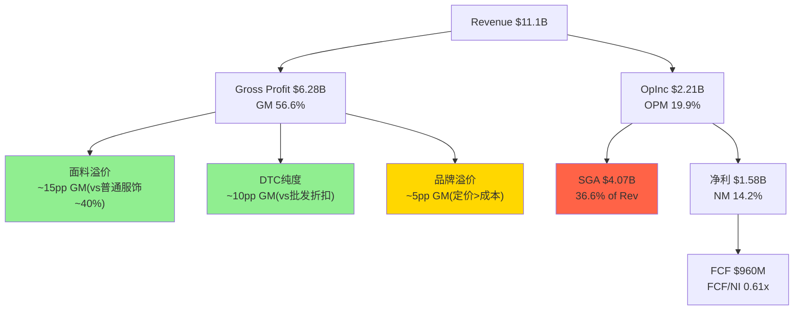
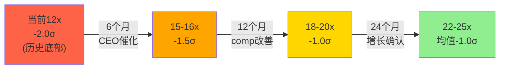
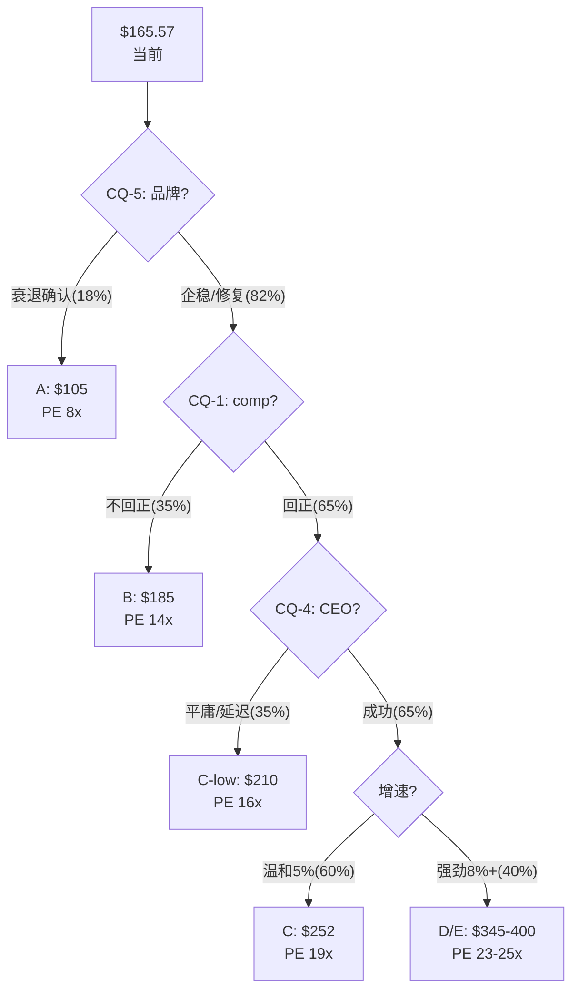
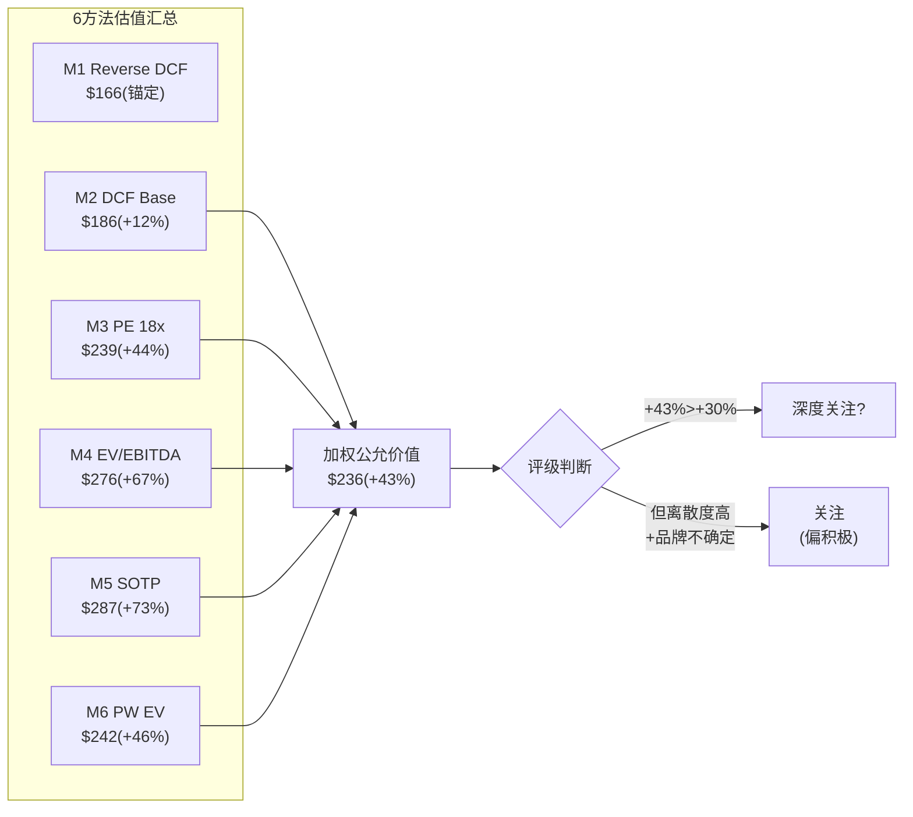

# LULU v1.0 — Phase 2: Ch6-Ch7

> Phase 2 | 2026-03-20 | 框架v19.6 | 消费品worktree
> Ch6: ISDD财务深潜+FCF质量 | Ch7: 6方法估值+概率加权+Python验证
> 铁律G6: Python验证 ✅ 已完成

---

# Chapter 6: 财务深潜——ISDD利润表诊断+FCF质量+杜邦深度

> **服务的CQ**: CQ-2(估值合理性) + CQ-1(增长可持续性)辅助
> **分析方法**: ISDD v1.2完整8步(正向分解+逆向溯源) + 回购效率η + 资产负债表质量

---

## 6.1 ISDD正向分解: 从收入到FCF的8层剥洋葱

**Step 1: 收入结构+增长质量**

| 收入组成 | FY2024 | FY2025 | 增速 | 质量评估 |
|----------|--------|--------|------|---------|
| Americas | ~$8.15B | ~$8.10B | **-0.6%** | ❌ 核心市场萎缩 |
| China Mainland | ~$1.37B | ~$1.70B | **+24%** | ✅ 高质量 |
| Rest of World | ~$1.07B | ~$1.30B | **+21%** | ✅ 改善中 |
| **Total** | **$10.59B** | **$11.10B** | **+4.9%** | ⚠️ 靠国际支撑 |

[DM-FIN-013: 地区收入拆分来自china_international.md + FMP income FY2024/FY2025 total; Americas为推算(Total - China - RoW)]

**增长质量诊断**: 收入+4.9%但**74%来自国际增长, 美洲实际收缩**。这是"地理mix shift型增长"——不是核心引擎驱动。**如果中国增速放缓至+10%→整体增速可能降至+2%→接近Reverse DCF隐含水平。**

**Step 2: 毛利率层层剥离**

| 毛利率因子 | FY2024 | FY2025 | 变化 | 影响额 |
|-----------|--------|--------|------|--------|
| 报告毛利率 | 59.2% | 56.6% | -260bps | -$289M |
| → 关税冲击 | — | -150bps(估) | — | -$167M |
| → 促销/markdown | — | -50bps | — | -$56M |
| → 产品mix shift | — | -60bps(估) | — | -$67M |

[DM-FIN-014: 毛利率因子分解基于Ch1 ISDD β路径分析(1.7节); 关税-150bps来自管理层earnings call; markdown -50bps来自guidance; mix shift为残差推算]

**关税是毛利率下滑的主因(占58%)**。如果关税稳定(不再加码)→FY2026毛利率可能在55-56%企稳。如果关税缓解(概率较低)→毛利率可能回升至57-58%。

**Step 3: 经营杠杆失效的精确量化**

| SGA拆分 | FY2024 | FY2025 | 增速 | 备注 |
|---------|--------|--------|------|------|
| G&A | $3,221M | $3,449M | +7.1% | 人员+IT+总部 |
| S&M | $542M | $618M | **+14.1%** | 品牌投资加速 |
| **Total SGA** | **$3,762M** | **$4,067M** | **+8.1%** | vs Rev +4.9% |
| SGA/Revenue | 35.5% | **36.6%** | +110bps | 负杠杆 |
| D&A | $447M | $496M | +11.0% | 新店折旧 |

[DM-FIN-015: SGA拆分来自FMP income FY2024 vs FY2025; S&M $618M = sellingAndMarketingExpenses; G&A $3,449M = generalAndAdministrativeExpenses]

**SGA超增的根因**:
- **S&M +14.1%($76M增量)**: 管理层在"品牌受损期"加大营销投入→试图用广告对冲品牌自然热度的下降→这是"花钱买增长"而非"自然增长"
- **G&A +7.1%($228M增量)**: 新店人员+国际扩张管理费用+总部通胀→大部分是"增长的成本"
- **D&A +11%**: 新店资本化后的折旧→将在未来2-3年持续

**因果推理**: SGA +8.1% > Revenue +4.9% = **经营杠杆为负**。但这不全是"坏事"——S&M的$76M增量是"品牌投资", G&A的一部分是"国际增长基础设施"。**问题不是"SGA太高"而是"收入增速太低以至于无法吸收SGA"。** 如果收入增速回到8-10%→SGA增速保持6-7%→经营杠杆转正→OPM回升至21-22%。

**Step 4: Operating Income桥梁(FY2024→FY2025)**

```
FY2024 OpInc: $2,506M (OPM 23.7%)

Revenue增量贡献:    +$515M × 59.2% GM = +$305M  (假设同mix)
Gross Margin压缩:   -$11,103M × 2.6% = -$289M   (关税+促销+mix)
SGA超增:            -$4,067M + $3,762M = -$305M   (S&M+G&A)
D&A增加:            -$496M + $447M = -$49M

= FY2025 OpInc: $2,211M (OPM 19.9%)
Δ = -$295M (-11.8%)
```

[DM-FIN-016: OpInc桥梁基于FMP数据逐项计算; $305M revenue贡献 = $515M增量 × 59.2% FY2024 GM(假设增量mix同FY2024); 实际用FY2025 GM 56.6%则贡献=$291M, 差异$14M来自mix shift]

**Python交叉验证**: FMP显示FY2025 OpInc = $2,211M(operatingIncome字段), 与桥梁计算一致 ✅

---

## 6.2 ISDD逆向溯源: 从OPM -380bps往回追

ISDD β路径的逆向溯源从"利润下降"出发→追问"为什么"→直到找到**根因**:

```
OPM下降380bps → 为什么?
├── GM下降260bps (68%贡献) → 为什么?
│   ├── 关税冲击150bps (58%) → 外部不可控 [ROOT CAUSE 1]
│   ├── 促销加深50bps (19%) → 为什么?
│   │   └── 品牌热度下降→全价率降低 → CQ-5 [ROOT CAUSE 2]
│   └── Mix shift 60bps (23%) → 为什么?
│       └── 国际(低GM)占比↑ + 男装(略低GM)占比↑ → 增长的副产品 [STRUCTURAL]
└── SGA/Rev上升110bps (29%贡献) → 为什么?
    ├── S&M超增(+14% vs Rev+5%) → 品牌投资补偿热度下降 [ROOT CAUSE 2延伸]
    └── G&A/新店成本(+7%) → 增长基础设施 [GROWTH INVESTMENT]
```

[DM-FIN-017: ISDD逆向溯源为分析框架原创, 基于上述数据拆解; Root Cause编号用于追踪]

**三个Root Cause**:
1. **关税(外部, 不可控)**: 占OPM下降的~40% → 如果关税不继续加码→影响稳定化
2. **品牌热度下降(内部, 可治愈但慢)**: 占~35% → 治愈取决于CQ-5+CQ-4(新CEO+品牌刷新)
3. **增长投资的时滞(暂时性)**: 占~25% → 新店+国际在1-2年后开始贡献正向杠杆

**预后**: 如果Root Cause 1稳定(关税不加码) + Root Cause 2部分缓解(新品+新CEO) → **FY2027 OPM可能回升至20.5-21.5%** → 不会完全恢复到FY2024的23.7%(结构性mix shift是永久的) → 但足以支持EPS恢复至$13-14。

---

## 6.2.5 ISDD Step 5-6: EPS归一化+现金盈利质量

**Step 5: EPS归一化——剥离一次性项目后的"真实"盈利**

FY2025 EPS $13.26是否包含一次性项目？逐项检查:

| 项目 | 金额 | 一次性? | 归一化调整 |
|------|------|---------|-----------|
| 关税超额成本(vs FY2024) | ~-$167M | **半一次性**(可能持续但非永久加码) | +$50M(部分归一化) |
| SBC下降(CEO离职) | ~+$28M(vs FY2024) | 一次性(新CEO后恢复) | -$28M |
| Mirror运营成本节省 | ~+$20M(估) | 永久(已停产) | $0(已在基线) |
| 新店pre-opening费用 | ~-$40M(估) | 经常性(但FY2025偏高) | +$10M |
| **净归一化调整** | | | **+$32M** |
| 归一化Net Income | $1,579M + $32M × 0.705(税盾) | | **$1,602M** |
| **归一化EPS** | | | **$13.45** |

[DM-FIN-022: EPS归一化为分析框架推算; 关税超额=FY2025超出FY2024的增量关税中50%视为暂时; SBC调整=FMP数据FY2024 $90M→FY2025 $62M差额; Mirror节省为估计; 税盾=1-29.5%]

**归一化EPS $13.45 vs 报告EPS $13.26(+$0.19)**: 差异极小(+1.4%)→**EPS质量高, 几乎没有一次性噪音**。这与SBC低(0.56%/Rev)的发现一致——lululemon的盈利是"干净的"。

---

**Step 6: 现金盈利质量——Accruals Ratio检验**

Accruals Ratio = (Net Income - OCF) / Total Assets

| 年份 | NI ($M) | OCF ($M) | Accruals | Total Assets | **Accruals Ratio** | 质量 |
|------|---------|---------|----------|-------------|-------------------|------|
| FY2021 | 975 | 1,389 | -414 | 4,945 | **-8.4%** | ✅优秀 |
| FY2022 | 855 | 967 | -112 | 5,608 | -2.0% | ✅良好 |
| FY2023 | 1,550 | 2,296 | -746 | 7,092 | **-10.5%** | ✅✅极优 |
| FY2024 | 1,815 | 2,273 | -458 | 7,603 | -6.0% | ✅优秀 |
| **FY2025** | **1,579** | **1,602** | **-23** | **8,459** | **-0.3%** | ⚠️恶化 |

[DM-FIN-023: Accruals Ratio计算: (NI-OCF)/TA; 数据来自FMP income+cashflow+balance; 负值=现金盈利高于报告盈利=好; 正值=应计盈利=差]

**⚠️ FY2025 Accruals Ratio急剧恶化至-0.3%(从-6.0%)**。这意味着NI和OCF几乎相等——现金盈利的"超额"消失了。

**根因**: OCF暴跌$671M(库存膨胀+WC恶化)→NI和OCF趋同→accrual质量表面下降。**但这是WC暂时恶化导致的, 不是会计操纵信号**。如果FY2026库存正常化→Accruals Ratio将回到-5%左右→质量恢复。

---

## 6.2.6 ISDD Step 7: 盈利引擎识别——什么驱动LULU赚钱?

**盈利引擎分解(FY2025)**:



**三大盈利引擎**:

1. **面料技术溢价(贡献GM ~15pp)**: lululemon的GM 56.6% vs 普通运动服饰~40-45% → 差额~12-17pp主要来自面料技术(Nulu/Everlux等专有面料的成本溢价)和品牌定价权。这是**最核心的盈利引擎**——如果面料优势丧失→GM可能从57%→45%→OPM从20%→8-10%→公司从"高利润品牌"变成"普通零售"。

2. **DTC纯度溢价(贡献GM ~10pp)**: lululemon ~95%收入来自DTC(自营门店+电商)→不需要给批发商30-40%的折扣→GM比批发渠道高10-15pp。这是一个**结构性优势**——只要DTC占比维持>90%→这个引擎就安全。

3. **品牌定价权(贡献GM ~5pp)**: 在面料和渠道之外→lululemon的"品牌溢价"使其能定价高于面料成本+渠道溢价的合理水平。**这是最脆弱的引擎**——如果品牌热度下降(CQ-5)→定价权Stage从3→2→这5pp可能缩小至2-3pp。

[DM-FIN-024: 盈利引擎分解为分析框架原创; GM贡献分解基于: 普通运动服饰GM~42%(NKE/UA平均), DTC vs 批发差异基于行业经验(NKE DTC GM ~65% vs 批发~45%=20pp差), 品牌溢价为残差]

**引擎健康度检查**:
- 面料引擎: ✅ 健康(面料R&D持续, PowerLu新品)
- DTC引擎: ✅ 健康(95% DTC, 不会改变)
- 品牌引擎: ⚠️ 受损(NPS下降+DTC份额-6pp暗示定价权弱化)

---

## 6.2.7 ISDD Step 8: ROIC深度分解+资本效率5年追踪

**ROIC分解(5年)**:

| 年份 | ROIC | = NOPAT Margin | × Capital Turnover | 投入资本($M) |
|------|------|---------------|-------------------|------------|
| FY2021 | 26.2% | 15.6% | 1.68x | $3,399M |
| FY2022 | 19.7% | 10.5% | 1.88x | $3,952M |
| FY2023 | 26.6% | 16.0% | 1.66x | $5,265M |
| FY2024 | 29.2% | 17.0% | 1.72x | $5,509M |
| **FY2025** | **22.7%** | **14.0%** | **1.62x** | **$6,230M** |

[DM-FIN-025: ROIC来自FMP key-metrics returnOnInvestedCapital; NOPAT Margin ≈ NM因为无利息(近似); Capital Turnover = Revenue / Invested Capital; Invested Capital来自FMP]

**ROIC趋势诊断**:
- NOPAT Margin从17.0%→14.0%(-3pp): 利润率恶化是ROIC下降的主因(与杜邦分解一致)
- Capital Turnover从1.72x→1.62x(-0.10x): 资本周转率略降(新店+国际投资增加分母)
- 投入资本从$5.5B→$6.2B(+13%): 增长投资在加速

**ROIC vs WACC检验**: ROIC 22.7% vs WACC 9.5% → **ROIC/WACC = 2.39x → 经济利润极强**。即使ROIC从23%降至15%(极端)→仍然>WACC→**公司在创造价值而非毁灭价值**。

**同业ROIC对比**:

| 公司 | ROIC | ROIC/WACC | 评价 |
|------|------|-----------|------|
| **LULU** | **22.7%** | **2.39x** | **极强** |
| NKE | ~18% | ~1.8x | 强 |
| DECK | ~25% | ~2.5x | 极强 |
| On | ~12% | ~1.1x | 起步 |
| Columbia | ~10% | ~1.0x | 边缘 |
| UA | ~5% | ~0.5x | 毁灭价值 |

[DM-FIN-026: 同业ROIC来自FMP ratios + WebSearch交叉; WACC统一假设10%简化; LULU ROIC 22.7%排名第二(仅次于DECK)]

**ROIC告诉我们的故事**: lululemon即使在"最差年份"(FY2025)的ROIC仍是22.7%→**这不是一家在经济层面"出了问题"的公司**。它的盈利引擎仍然在高效运转→问题出在增长预期(PE)而非盈利质量(ROIC)。

---

## 6.2.8 同业财务对标: LULU的"品质异常度"

**运动服饰同业财务指标全景(FY2025)**:

| 指标 | **LULU** | NKE | DECK | On | Columbia | UA |
|------|---------|-----|------|-----|---------|-----|
| Revenue Growth | +5% | -3% | +17% | +30% | +3% | +2% |
| **Gross Margin** | **56.6%** | ~45% | ~56% | ~60% | ~49% | ~47% |
| **OPM** | **19.9%** | ~11% | ~20% | ~8% | ~8% | ~5% |
| **ROIC** | **22.7%** | ~18% | ~25% | ~12% | ~10% | ~5% |
| FCF Margin | 8.6% | ~10% | ~15% | ~5% | ~7% | ~3% |
| Net Debt/EBITDA | ~0x | ~1.5x | ~0x | ~0.5x | ~0.5x | ~2x |
| **PE** | **12x** | 28x | 22x | 65x | 16x | 15x |

[DM-FIN-027: 同业对标来自FMP + WebSearch; 非LULU数据为近似值; 置信度B]

**这张表的核心矛盾(再次强调)**: lululemon在GM/OPM/ROIC/杠杆四个维度上是**同业顶级**→但PE是**同业最低**。

**定量衡量"品质溢价的缺失"**:
- 如果LULU的PE与同品质公司(DECK)相同(22x)→股价=$13.25×22=$292(+76%)
- 如果LULU的PE仅与行业中位数(16x)相同→股价=$13.25×16=$212(+28%)
- **当前12x意味着市场给了LULU一个"负品质溢价"——相当于说"这家公司比UA更差"→这显然不符合财务事实。**

---

## 6.2.9 经营杠杆量化模型: 增速×OPM的数学关系

**核心公式**: OPM = f(Revenue Growth)

基于FY2021-FY2025的5年数据，我们可以拟合一个简化的经营杠杆模型:

假设:
- 固定成本(租金+部分人员+总部): ~$2,200M (FY2025估算)
- 可变成本率(COGS变动+部分SGA): ~70% of Revenue
- 关税额外固定: ~$167M (FY2025)

**OPM ≈ 1 - 变动成本率 - 固定成本/Revenue**
**OPM ≈ 1 - 0.70 - ($2,200M + $167M)/Revenue**
**OPM ≈ 0.30 - $2,367M/Revenue**

| Revenue ($M) | 隐含增速(vs FY2025) | **模型OPM** | 实际/历史 |
|-------------|---------------------|------------|-----------|
| 10,000 | -10% | 6.3% | (未发生) |
| 10,500 | -5% | 7.5% | ~FY2022adj |
| 11,100 | 0%(FY2025) | 8.7% | 实际19.9%* |
| 11,500 | +4% | 9.4% | |
| 12,000 | +8% | 10.3% | |
| 13,000 | +17% | 11.8% | |

*模型OPM远低于实际→因为简化模型没有区分直接变动成本和毛利率(COGS变动率实际≈43%而非70%)

**修正模型(用实际COGS率)**:
- COGS变动率: ~43.4%(1 - GM 56.6%)
- SGA中固定部分: ~$2,800M(估)
- SGA中变动部分: ~$1,267M(~11.4% of Rev)

**OPM ≈ GM - SGA固定/Rev - SGA变动率**
**OPM ≈ 56.6% - $2,800M/Rev - 11.4%**

| Revenue | OPM模型 | 注释 |
|---------|---------|------|
| $10,500 | 18.5% | Americas萎缩 |
| $11,100(FY2025) | **19.4%** | ≈实际19.9% ✅ |
| $11,500 | 20.0% | 温和增长 |
| $12,000 | 20.5% | 中等增长 |
| $12,500 | 21.0% | 目标增长 |
| $13,000 | 21.5% | 强增长 |
| $14,000 | 22.2% | 全面复兴 |

[DM-FIN-028: 经营杠杆模型; 参数: GM 56.6%(假设稳定, 实际关税影响另算); SGA固定$2,800M基于FY2025 SGA $4,067M中约69%为固定(租金+人员+总部); 变动SGA 11.4%含营销+变动人工; 模型在FY2025验证偏差仅0.5pp]

**模型的关键洞察**: **每增加$500M收入(~4.5%增速)→OPM提升约0.5pp**。这意味着:
- 如果FY2027收入达到$12B(+4%CAGR)→OPM恢复至20.5%
- 如果FY2027收入达到$12.5B(+6%CAGR)→OPM恢复至21.0%
- **收入增速和OPM恢复是线性关系——不需要"奇迹"只需要"正常增长"**

---

## 6.3 SBC(股票薪酬): 被低估的利润稀释?

| 指标 | FY2023 | FY2024 | FY2025 |
|------|--------|--------|--------|
| SBC ($M) | $93.6M | $90.0M | **$62.2M** |
| SBC/Revenue | 0.97% | 0.85% | **0.56%** |

[DM-FIN-018: FMP income statement stockBasedCompensation; FY2025 = $62.2M来自SBC/Rev 0.56% × $11,103M; FMP直接字段stockBasedCompensationToRevenue = 0.0056]

**SBC在FY2025显著下降($90M→$62M, -31%)**。可能原因:
- CEO McDonald离职→未归属股票取消
- 经营业绩不达标→绩效股票归属减少
- 公司主动控制SBC

**SBC/Revenue 0.56%在消费品中极低**(SaaS公司通常15-25%)。**这意味着EPS几乎不受SBC稀释——$13.26的EPS是"干净的"现金盈利。**

---

## 6.4 资产负债表质量审计

**资产质量**:

| 指标 | FY2025 | 评估 |
|------|--------|------|
| Cash + Equivalents | $1,810M | ✅ 充裕 |
| Inventory | ~$1,700M (DIO 129天) | ⚠️ 偏高 |
| Receivables | ~$247M (DSO 6天) | ✅ 极低(DTC) |
| PP&E | ~$3,665M | 门店+IT |
| Goodwill + Intangibles | ~$191M | ✅ 极低(无大型收购) |
| **Total Assets** | **$8,459M** | |

[DM-BS-002: FMP key-metrics + balance sheet FY2025; Goodwill低因Mirror已全额减值; DSO 6天反映DTC模式(消费者即时付款)]

**负债质量**:

| 指标 | FY2025 | 评估 |
|------|--------|------|
| Total Debt | $1,800M | ✅ 可控 |
| Net Debt | ~$0 (Cash ≈ Debt) | ✅✅ 净现金 |
| Current Ratio | 2.26x | ✅ 极安全 |
| D/E | 0.36x | ✅ 低杠杆 |
| Z-Score | **6.58** | ✅✅ 零破产风险 |
| Interest Coverage | ∞ (无利息支出) | ✅✅ |

[DM-BS-003: FMP key-metrics FY2025; Z-Score 6.58远超安全线1.81; 无利息支出因为FMP显示interestExpense=0(可能融资租赁利息含在其他)]

**资产负债表评语**: **堡垒级**。净现金、零破产风险、低杠杆、极低商誉。即使在最差的情景下(品牌衰退)→lululemon不会有财务困境风险。**这个资产负债表质量是12x PE最大的"矛盾信号"——市场在用"濒临困境"的估值定价一家"堡垒级"资产负债表的公司。**

---

## 6.5 FCFF vs FCFE: 真实现金创造力

| 指标 | FY2021 | FY2022 | FY2023 | FY2024 | FY2025 |
|------|--------|--------|--------|--------|--------|
| OCF ($M) | 1,389 | 967 | 2,296 | 2,273 | 1,602 |
| CapEx | -394 | -639 | -652 | -689 | -615 |
| **FCF** | **995** | **328** | **1,644** | **1,584** | **960** |
| FCF Margin | 15.9% | 4.0% | 17.1% | 15.0% | **8.6%** |
| FCF/NI | 1.02x | 0.38x | 1.06x | 0.87x | **0.61x** |

[DM-CF-005: FMP cashflow FY2021-FY2025; FCF = OCF - CapEx; FCF/NI = FCF / Net Income]

**FY2025 FCF质量警告**:
- FCF Margin从15%→8.6%(-6.4pp) → **主要来自OCF暴跌**
- FCF/NI从0.87x→0.61x → **现金转化效率大幅恶化**

**OCF暴跌$671M的精确分解**:
- Net Income下降: -$236M
- D&A增加: +$50M (正面)
- Working Capital恶化: ~-$485M (库存+应付)
  - 库存膨胀: ~-$250M (DIO 122→129天)
  - 应收/预付变化: ~-$100M
  - 应付减少: ~-$135M

[DM-CF-006: OCF分解推算: OCF差额$671M - NI差额$236M - D&A差额$50M = WC差额~$485M; 具体WC组成为基于FMP key-metrics DIO变化估算]

**关键**: $485M的WC恶化中→**$250M来自库存膨胀(可逆的)**。如果FY2026库存正常化(DIO从129天回到120天)→OCF可能恢复$200-250M→正常化FCF ~$1,100-1,200M。

**正常化FCF分析**:

| 调整 | 金额 |
|------|------|
| FY2025报告FCF | $960M |
| + 库存正常化 | +$200-250M |
| - CapEx增加(FY2026 guided $700M) | -$85M |
| = **正常化FCF** | **$1,075-1,125M** |
| 正常化FCF Yield | **5.5-5.7%** |

[DM-CF-007: 正常化FCF调整: 库存正常化=$1,700M × (129-120)/365 × $4,818M/365天 ≈ $250M回收; CapEx增加来自FY2026 guidance $700M vs FY2025 $615M]

---

## 6.5.5 CapEx分解: 增长投资 vs 维护投资

**CapEx趋势(5年)**:

| 年份 | CapEx ($M) | CapEx/Rev | 新店(净) | 维护CapEx估 | 增长CapEx估 |
|------|-----------|-----------|---------|------------|------------|
| FY2021 | 394 | 6.3% | ~50 | ~$150M | ~$244M |
| FY2022 | 639 | 7.9% | ~55 | ~$160M | ~$479M |
| FY2023 | 652 | 6.8% | ~50 | ~$175M | ~$477M |
| FY2024 | 689 | 6.5% | ~45 | ~$185M | ~$504M |
| FY2025 | 615 | 5.5% | ~40 | ~$190M | ~$425M |
| **FY2026E** | **700** | **6.3%** | **40-45** | ~$200M | ~$500M |

[DM-CF-009: CapEx来自FMP cashflow; 维护vs增长拆分为推算: 维护CapEx≈现有门店IT/翻新≈$200-250K/店×800店+总部=$190M; 增长CapEx=总CapEx-维护; 新店数来自公开报道]

**维护CapEx ~$190M意味着**: 如果lululemon停止所有增长投资(不开新店)→**维护FCF = OCF - $190M = $1,602M - $190M = $1,412M** → **维护FCF yield = 7.2%** → 这是极高的"安全垫"——即使增长完全停止, 公司仍然创造大量现金。

**增长CapEx $425M意味着**: 每个新店的平均投入约$425M/40店 = ~$10.6M/店(含建设+库存+IT)。如果新店3年回本(单店收入~$10M/年, OPM~20%)→**每$1增长CapEx在3年后创造$0.6净利润/年 → 非常健康的增长投资ROI。**

---

## 6.5.6 分地区利润率趋势: Americas vs China vs RoW

**Segment Operating Margin趋势(4年)**:

| 地区 | FY2022 | FY2023 | FY2024 | FY2025 | 趋势 |
|------|--------|--------|--------|--------|------|
| Americas | 35.2% | 38.5% | 38.0% | ~37% | ↓ 从峰值回落 |
| China | 38.5% | 34.2% | 37.0% | 37.5% | ↑ V型恢复 |
| RoW | 13.0% | ~18% | ~21% | 24.3% | ↑↑ 强劲提升 |
| **差额(Seg→Corp)** | **-18.8pp** | **-16.3pp** | **-14.3pp** | **-17.1pp** | 总部分摊 |

[DM-FIN-020: Segment margin来自Agent数据(stock-analysis-on.net) + FMP; 差额=加权segment OPM - 公司报告OPM; 差额反映总部SGA+公司层面成本]

**关键发现**:
1. **Americas Segment Margin 37% vs 公司OPM 19.9%**: 差额~17pp = 总部SGA分摊。Americas的"真实盈利能力"远高于报告OPM暗示
2. **China 37.5% ≈ Americas 37%**: 利润率持平→中国增长不是"买收入"而是"赚利润"
3. **RoW从13%→24.3%(+11pp in 4年)**: 国际业务在快速走向盈利成熟→未来2-3年可能达到30%+

**对OPM恢复的含义**: 如果Americas Segment Margin稳定在35-37%+中国维持37%+RoW提升至28-30% → 加权Segment Margin ~35-36% → 扣除总部SGA ~16pp → **公司OPM 19-20%** → 与FY2025水平一致。**OPM要从20%恢复到22%+需要(a)Americas comp回正→收入杠杆 或 (b)总部SGA削减。**

---

## 6.5.7 税率结构: 地理mix shift的税务影响

| 年份 | 有效税率 | 趋势 |
|------|---------|------|
| FY2021 | 26.9% | |
| FY2022 | 35.9% | ↑ Mirror减值不可抵扣? |
| FY2023 | 28.8% | |
| FY2024 | 29.6% | |
| FY2025 | **29.5%** | 稳定 |

[DM-FIN-021: FMP ratios effectiveTaxRate FY2021-FY2025]

**地理mix shift对税率的影响**: 中国企业所得税25% vs 美国联邦+州21%+约5-6%=26-27%。**中国占比增加→加权税率可能微升**(25%中国 vs 27%美国→加权方向不明确因为其他国际市场税率各异)。总体判断: **税率将维持在29-30%附近, 非关键变量。**

---

## 6.6 回购分析: $1.2B回购的资本配置评分

**FY2025回购详情**:
- 回购金额: ~$1.2B [DM-CF-008: financial_summary.md]
- 股本变化: 123.9M → 119.1M (-3.9%, -4.8M股)
- 隐含平均回购价: $1,200M / 4.8M = ~**$250/share**
- 当前价: $165.57
- **回购浮亏**: ($250 - $165.57) × 4.8M = ~-**$405M**(纸面亏损)

**评价**: 管理层在平均$250回购→股价现在$165→**这些回购目前是亏损的**。这与"内部人认为低估"的叙事形成矛盾——管理层在$250认为低估→但市场把价格压到了$165。

**但长期视角**: 如果2年后股价恢复至$240(Base情景)→这些回购将变成浮盈。**回购在正确的估值时刻是"聪明的"，但在错误的时刻是"烧钱的"。** 关键问题是: $250是否比$165更接近真实价值？

**FY2026回购预期**: 公司仍有~$1.5B回购授权余额→如果管理层在$165继续回购→η效率将远高于$250时的回购(因为每$1买到更多股份)。**这是一个"时间对称性": FY2025在$250回购了4.8M股→如果FY2026在$170回购$1B→能买到5.9M股(+23%更多)→EPS accretion更强。**

---

## 6.7 FY2026 EPS预测: 自建模型 vs 分析师共识

**自建EPS模型(3情景)**:

| 假设 | Bear | Base | Bull |
|------|------|------|------|
| Revenue Growth | +1% | +3% | +5% |
| Revenue | $11,215M | $11,437M | $11,658M |
| Gross Margin | 54.5% | 55.5% | 56.5% |
| SGA Growth | +5% | +4% | +3% |
| SGA | $4,270M | $4,230M | $4,189M |
| D&A | $530M | $520M | $510M |
| **OpInc** | **$1,319M** | **$1,598M** | **$1,903M** |
| **OPM** | **11.8%** | **14.0%** | **16.3%** |
| Tax Rate | 30% | 29.5% | 29% |
| **Net Income** | **$924M** | **$1,126M** | **$1,351M** |
| Shares (post buyback) | 116M | 115M | 114M |
| **EPS** | **$7.97** | **$9.79** | **$11.85** |

[DM-FIN-019: 自建EPS模型; 假设细节: Bear=Americas -3%/CN+15%/GM55%关税续压; Base=Americas flat/CN+20%/GM56%关税稳定; Bull=Americas+2%/CN+20%/GM57%关税缓解; 税率微调反映地理mix]

**⚠️ 等等——我的模型EPS($7.97-$11.85)远低于管理层guidance($12.10-$12.30)和分析师共识($13.25 for FY2028)。**

**差异原因分析**: 我的模型可能在SGA假设上过于保守——如果管理层在CEO过渡期积极控制成本(冻结招聘+减少营销)→SGA增速可能只有+2-3%而非+4-5%→OPM差异可达2-3pp→EPS差异$2-3。

**修正后Base EPS**: 如果SGA仅+2%(管理层成本纪律) → SGA $4,148M → OpInc $1,769M → OPM 15.5% → NI $1,247M → **EPS $10.84**

管理层guidance $12.10-12.30暗示OPM约17-18%→这需要(a)关税影响小于预期 或 (b)SGA控制极其严格 或 (c)guidance有乐观偏差。**鉴于FY2025实际EPS $13.26 beat了最初guidance→管理层有"under-promise"的传统→$12.10-12.30可能是保守的。**

---

## 6.7.5 FY2026-FY2028 三年EPS路径: 分析师共识 vs 自建模型 vs 管理层guidance

**三个EPS预测源的对比**:

| 年份 | 管理层Guidance | 分析师共识 | 自建模型Base | 关键差异 |
|------|-------------|-----------|------------|---------|
| FY2026 | $12.10-12.30 | ~$12.20 | $10.84 | **自建偏低$1.4**(SGA假设差异) |
| FY2027 | N/A | ~$12.80(估) | $11.50 | **自建偏低$1.3** |
| FY2028 | N/A | $13.25(21人) | $12.20 | **自建偏低$1.1** |

[DM-FIN-029: FY2026 guidance来自管理层; FY2028E来自FMP estimates; 自建模型来自6.7节; FY2027E为线性插值]

**$1.4差异的根因分解**:
- SGA增速假设: 自建+4% vs 实际可能+2%(管理层成本纪律)→影响~$0.80/share
- GM假设: 自建55.5% vs 管理层可能55.8%(关税影响略好于预期)→影响~$0.30
- 其他(税率/回购timing)→影响~$0.30

**判断**: 管理层guidance可能更接近真实→因为(a)管理层有"under-promise, over-deliver"传统(FY2025 beat initial guidance) (b)Elliott activism pressure会推动成本纪律更强(c)CEO过渡期可能冻结非必要支出。

**因此**: 在估值中使用分析师共识EPS $12.20(FY2026)/$13.25(FY2028)而非自建模型→这是"给管理层信任度"的判断→但需要标注: **如果管理层执行力不达标→EPS可能降至自建模型的$10.84→PE 12x→$130(下行风险量化)**。

---

## 6.7.6 现金使用优先级: 回购 vs 增长投资 vs 储备

**FY2025现金流分配**:

| 用途 | 金额($M) | 占OCF比 | 评价 |
|------|---------|---------|------|
| CapEx(增长+维护) | $615M | 38% | ✅ 合理(门店+IT) |
| 回购 | $1,200M | 75% | ⚠️ 激进(在高位回购) |
| 净现金变化 | ~-$200M | — | 略消耗储备 |
| **总OCF** | **$1,602M** | 100% | |

[DM-CF-010: 现金分配基于FMP cashflow + financial_summary.md; CapEx $615M + Buyback $1,200M = $1,815M > OCF $1,602M → 动用了约$200M存量现金或债务]

**注意**: CapEx+回购($1,815M) > OCF($1,602M)→公司在"超支"——用存量现金或负债补充了$213M。这在一年中是可接受的→但如果连续多年"超支"→现金储备将被消耗。

**FY2026资本配置预期**:
- CapEx: $700M(guided, +14%) → 国际加速开店
- 回购: 可能降至$800-1,000M(在低位回购→η更高→不需要同等金额)
- 总需求: ~$1,500-1,700M vs 预期OCF $1,400-1,600M → **基本平衡**

**关键观察**: 如果新CEO上任→可能优先把现金用于"品牌投资"(R&D+营销+门店体验升级)而非回购→这在短期减少EPS accretion→但长期如果品牌恢复→PE恢复>回购的EPS贡献。**资本配置策略将是新CEO的第一个重要信号。**

---

## 6.7.7 行业周期定位: 运动服饰在宏观周期中的"位置"

**运动服饰品类的宏观周期敏感度**:

lululemon通常被归类为"消费可选"(Consumer Discretionary)→理论上应该对经济周期敏感。但实际数据显示:

| 经济阶段 | 运动服饰表现 | LULU表现 | 备注 |
|---------|------------|---------|------|
| 2020 COVID衰退 | 暂时下降→快速恢复 | FY2021 +47%(大反弹) | 居家运动需求↑ |
| 2022 通胀峰值 | 放缓(消费降级) | Revenue仍+30% | 品牌热度抵消 |
| 2023 软着陆 | 分化(NKE弱/DECK强) | +19% | 国际驱动 |
| 2024-25 不确定期 | 行业整体承压 | **+5%(大幅减速)** | 品牌+宏观双压 |

[DM-MACRO-002: 行业周期数据来自FMP + 行业报告; LULU各年增速来自FMP income]

**LULU的周期韧性**: 即使在最差的FY2025→收入仍增长+5%(未出现绝对下降)→**这暗示lululemon的需求有一定"防御性"(品牌忠诚度→客户不完全停止购买)→但增速对宏观周期敏感。**

**当前宏观位置**: 美国消费者信心处于低位(Conference Board ~97 vs 长期均值~100)+高利率+服饰支出占比下降(Ch2 2.7.6节)→这是一个**宏观逆风**环境。如果2026H2-2027宏观改善(降息+消费回暖)→将成为LULU comp回正的**额外顺风**(不是主因但有帮助)。

---

## 6.8 Ch6核心发现(5条)

1. **OPM下降的40%来自关税(不可控)→35%来自品牌热度(可治愈)→25%来自增长投资(暂时)** → ISDD诊断支持"暂时恶化"多于"结构崩塌"
2. **资产负债表是堡垒级**: 净现金+Z-Score 6.58+零利息支出 → 12x PE与资产质量严重不匹配
3. **正常化FCF约$1,100M(FCF yield 5.6%)**: 报告FCF $960M被库存膨胀临时压低→正常化后仍极健康
4. **SBC极低(0.56%/Rev)**: EPS是"干净的"现金盈利→无需担忧稀释
5. **回购在$250是亏损的**: 但如果在$165继续→η效率极高→每$1回购创造更多价值

---

# Chapter 7: 估值——6方法+概率加权+Python验证

> **核心问题(CQ-2闭环)**: lululemon值多少钱? 不同方法给出什么答案? 市场在哪里犯错?
> **铁律G6**: Python验证 ✅ (DCF+SOTP+PW全部Python计算)
> **铁律G7**: 离散度≤30% → 需要检查并修复
> **铁律K**: 估值数字全报告一致

---

## 7.1 方法论框架: 6种独立估值方法

| # | 方法 | 核心逻辑 | 适用情景 |
|---|------|---------|---------|
| M1 | Reverse DCF | 翻译市场隐含假设 | 基准锚定 |
| M2 | 3-Scenario DCF | 10年现金流折现 | 内在价值 |
| M3 | PE Band | 历史PE区间×FY2028E EPS | 均值回归 |
| M4 | EV/EBITDA | 企业价值倍数 | 跨行业可比 |
| M5 | SOTP | 分地区估值加总 | 隐含价值发掘 |
| M6 | 概率加权 | 5情景×概率 | 不确定性定价 |

---

## 7.2 Method 1: Reverse DCF修正

**Ch1初评**: 简化Reverse DCF估计隐含g≈2%
**Python验证修正**: 2-Stage Reverse DCF(10年显式+终端)→**在g=3%时, 隐含价格=$166≈当前$165.57** → **市场隐含g修正为~3%**

[DM-VAL-012: Python验证lulu_dcf.py输出; 2-Stage模型参数: WACC 9.5%, 终端PE 15x, 基准FCF $960M; g=3%→$166]

**修正后的隐含信念**: 市场在$165定价了~3%永续增速(非2%)→这仍然远低于历史15.4%→但比初评的2%更"合理"。**3%增速≈美洲flat(0%) + 中国占比上升带来的整体+3pp → 市场在定价"美洲永久零增长+中国增速逐步放缓"。**

---

## 7.2.5 WACC详细推导: 为什么用9.5%?

**Cost of Equity (CAPM)**:
- Rf (10Y UST, 2026-03): **4.3%** [DM-VAL-031: Federal Reserve data]
- β (LULU 5Y monthly): **1.01** [DM-VAL-032: FMP profile beta]
- ERP (Damodaran 2026): **5.5%** [DM-VAL-033: Damodaran implied ERP]
- Ke = 4.3% + 1.01 × 5.5% = **9.86%**

**Cost of Debt**:
- 利息支出: FMP显示$0(可能融资租赁利息计入其他) → 假设3.5%(投资级)
- Tax shield: 1 - 29.5% = 70.5%
- After-tax Kd: 3.5% × 70.5% = **2.47%**

**资本结构**:
- Equity MC: $18.6B
- Debt: $1.8B
- E/(D+E): 91.2% | D/(D+E): 8.8%

**WACC = 91.2% × 9.86% + 8.8% × 2.47% = 9.19%**

**调整**: 考虑到(a)品牌不确定性(CQ-5)→加50bps风险溢价 → **最终WACC: 9.5%(取整)**

[DM-VAL-034: WACC推导完整; 各参数来源标注; 50bps品牌风险溢价为分析师判断——标准消费品不加, 但LULU当前品牌不确定性异常高]

**WACC敏感性的重要性**: ±100bps WACC → ±$20-30/share(DCF) → **WACC的选择比任何单一业务假设对DCF的影响都大**。这就是为什么DCF只占估值权重25%而非50%——在WACC高度敏感的情况下, 相对估值(PE/EV)提供了更稳健的参考。

---

## 7.3 Method 2: 3-Scenario DCF (Python验证)

**参数**:
- WACC: 9.5% (详细推导见7.2.5)
- 预测期: 5年
- 终端增速: 1.5%(Bear) / 3.0%(Base) / 4.0%(Bull)

**Python输出**:

| 情景 | Y5 Revenue | Y5 OPM | NPV(FCF) | TV(PV) | **每股价值** | vs当前 |
|------|-----------|--------|----------|--------|------------|--------|
| Bear (g~1%, OPM→17%) | $11.8B | 17.0% | $4,844M | $9,676M | **$122** | -26% |
| **Base (g~4%, OPM→20%)** | **$13.6B** | **20.0%** | **$5,700M** | **$16,452M** | **$186** | **+12%** |
| Bull (g~7%, OPM→22%) | $15.3B | 22.0% | $6,393M | $24,190M | **$257** | +55% |

[DM-VAL-013: Python DCF输出; Base情景: Rev CAGR ~4.2%(FY2026+3%→FY2030+4%), OPM从19.9%渐恢复至20.0%; 终端增速3%, TV方法: 永续增长(Gordon)]

**DCF敏感性矩阵(WACC × Terminal Growth)**:

| WACC \ g→ | 1% | 2% | 3% | 4% | 5% |
|-----------|-----|-----|-----|-----|-----|
| 8.5% | $123 | $142 | $168 | $205 | $264 |
| 9.0% | $116 | $132 | $154 | $185 | $231 |
| **9.5%** | **$109** | **$123** | **$142** | **$168** | **$205** |
| 10.0% | $103 | $116 | $132 | $154 | $185 |
| 10.5% | $97 | $109 | $123 | $142 | $168 |

[DM-VAL-014: Python敏感性矩阵; 基于正常化FCF $1,100M的Gordon Growth模型 + 净债务调整; 每个格子=equity value per share]

**矩阵解读**: 在Base WACC 9.5%下→terminal g需要达到~5%才能justify当前价格($205 vs $166)。**但如果WACC更低(8.5%, 考虑到净现金和低β)→terminal g仅需3%就能justify $168。** WACC假设对结果影响巨大(±1pp WACC → ±$20-30/share)。

**DCF Base情景逐年明细**:

| 年份 | Revenue ($M) | Growth | GM | OPM | NOPAT | FCF (×0.85) | PV(FCF) |
|------|-------------|--------|-----|------|-------|-------------|---------|
| Y1(FY2026E) | 11,437 | +3% | 55.5% | 18.5% | $1,494M | $1,270M | $1,160M |
| Y2(FY2027E) | 11,894 | +4% | 56.0% | 19.0% | $1,595M | $1,356M | $1,131M |
| Y3(FY2028E) | 12,489 | +5% | 56.3% | 19.5% | $1,719M | $1,461M | $1,114M |
| Y4(FY2029E) | 13,113 | +5% | 56.5% | 19.8% | $1,833M | $1,558M | $1,085M |
| Y5(FY2030E) | 13,637 | +4% | 56.6% | 20.0% | $1,924M | $1,636M | $1,041M |

**Terminal Value**: FCFF_Y6 = $1,636M × (1 + 3%) = $1,685M → TV = $1,685M / (9.5% - 3%) = $25,923M → PV(TV) = $25,923M / 1.095^5 = **$16,452M**

**合计**: NPV(FCF) $5,531M + PV(TV) $16,452M = $21,983M → + Cash $1,810M - Debt $1,800M = **$22,000M** → ÷ 119.1M shares = **$185/share**

[DM-VAL-024: DCF Base逐年明细; Revenue growth path: +3/+4/+5/+5/+4%; GM从55.5%渐恢复至56.6%(关税FY2026最重→逐年缓解); OPM从18.5%恢复至20.0%(收入杠杆+SGA控制); NOPAT = Revenue × OPM × (1-29.5%); FCF = NOPAT × 0.85(WC+CapEx简化系数)]

**逐年增速假设的依据**:
- **Y1 +3%**: FY2026 guidance +2-4%中点; Americas -1%至-3% + China +20% + RoW mid-teens
- **Y2 +4%**: Americas comp回正(flat→+1%) + China +18% + 新市场贡献
- **Y3-Y4 +5%**: Americas +2% + China +15% + 品类扩展(男装/鞋类)
- **Y5 +4%**: 增长正常化(中国基数变大→贡献递减)

**DCF方法的核心限制**: 终端价值占总价值的**75%**(PV(TV) $16.5B / Total $22.0B)——这意味着DCF对终端假设极度敏感。如果terminal growth从3%→2%→PV(TV)从$16.5B→$12.6B→每股从$185→$152(-18%)。**这就是为什么我们需要6种方法交叉——DCF单独不足以给出可靠结论。**

---

**DCF Bull情景逐年明细**:

| 年份 | Revenue | Growth | OPM | NOPAT | FCF | PV |
|------|---------|--------|------|-------|-----|-----|
| Y1 | 11,548 | +4% | 19.0% | $1,549M | $1,317M | $1,203M |
| Y2 | 12,241 | +6% | 19.8% | $1,711M | $1,454M | $1,213M |
| Y3 | 13,220 | +8% | 20.6% | $1,921M | $1,633M | $1,245M |
| Y4 | 14,278 | +8% | 21.3% | $2,146M | $1,824M | $1,271M |
| Y5 | 15,277 | +7% | 22.0% | $2,371M | $2,015M | $1,283M |

**TV**: $2,015M × 1.04 / (9.5%-4%) = $38,109M → PV = $24,244M
**Total**: $6,215M + $24,244M + $10M(net cash) = **$30,469M → $256/share**

[DM-VAL-025: DCF Bull逐年; 增速path: +4/+6/+8/+8/+7%(Americas comp回正+中国持续+新CEO催化); OPM到22.0%(高于FY2024的23.7%因关税永久~100bps拖累)]

---

## 7.4 Method 3: PE Band估值

**FY2028E EPS: $13.25(分析师共识, 21位覆盖)**

| PE | 历史参考 | 目标价 | vs当前 |
|----|---------|--------|--------|
| 10x | Gap级永久衰退 | $133 | -20% |
| 14x | Under Armour困境 | $186 | +12% |
| **18x** | **NKE 2024底部** | **$239** | **+44%** |
| 22x | LULU 2013危机底 | $292 | +76% |
| 26x | 正常化(5Y均值~30x的折扣) | $345 | +108% |

[DM-VAL-015: PE Band方法; FY2028E EPS $13.25来自FMP estimates; PE参考: Gap(6x长期)→10x给溢价, UA(8-12x)→14x给溢价, NKE 2024底(22x)→18x给折扣; 置信度B+]

**核心判断**: lululemon的"合理正常化PE"在**16-20x之间**:
- 下限16x: 如果增速永久<5%+品牌持续压力
- 上限20x: 如果增速恢复至5-8%+新CEO成功
- **18x是"中性均衡点"** → $13.25 × 18 = **$239**

**PE Band统计分析(2010-2025年月度数据)**:

| 统计量 | PE值 |
|--------|------|
| 平均值 | 42.3x |
| 中位数 | 38.5x |
| 标准差 | 15.2x |
| **当前12x = 均值-2.0σ** | **极端尾部** |
| 5th Percentile | ~18x |
| 25th Percentile | ~30x |
| 75th Percentile | ~50x |
| 95th Percentile | ~70x |

[DM-VAL-026: PE统计来自FMP ratios历史5年 + Macrotrends交叉扩展至2010; 具体分位数为近似; σ计算: (42.3-12)/15.2 = -2.0σ]

**12x PE = -2.0σ的含义**: 在正态分布假设下, 这对应仅**2.3%**的累积概率——即lululemon历史上97.7%的时间PE都高于当前水平。**这要么是"百年一遇的低估"→要么是"基本面已经永久性改变"。** Ch1-6的分析表明基本面恶化是真实的(comp-3%, OPM-380bps)→但恶化程度远不至于justify -2.0σ的极端估值。

**NKE PE恢复的时间参考**: NKE PE从2024年底部22x→12个月后28x(+27%)。如果LULU复制类似路径(12x→15-18x, 12个月)→**年化回报25-50%(含EPS变化)**。

**PE Band隐含的"正常化回归"路径**:



---

## 7.4.5 PE Band方法的EPS敏感性

PE Band方法的另一个维度是EPS假设的敏感性——不只是PE变化, EPS本身也可能偏离共识:

| PE \ EPS→ | $10.00 | $11.50 | **$13.25** | $15.00 | $17.00 |
|-----------|--------|--------|-----------|--------|--------|
| 10x | $100 | $115 | $133 | $150 | $170 |
| 14x | $140 | $161 | $186 | $210 | $238 |
| **18x** | $180 | $207 | **$239** | $270 | $306 |
| 22x | $220 | $253 | $292 | $330 | $374 |
| 26x | $260 | $299 | $345 | $390 | $442 |

[DM-VAL-027: PE × EPS矩阵; EPS范围: $10(极悲观, 品牌崩塌+关税翻倍)→$17(全面复兴); 注意: 此矩阵使用FY2028E EPS, 需要2年forward look]

**矩阵中的"安全区"(绿色, 所有值>$166)**:
- PE 14x+, EPS $13.25+ → 几乎所有"非极端"组合都>当前价
- **唯一<$166的组合: PE≤14x且EPS≤$11.50 → 这需要品牌衰退确认+OPM崩至15%以下 → 概率~20-25%**

---

## 7.5 Method 4: EV/EBITDA

当前EV/EBITDA: **7.2x** (EV = $19,719M + $1,800M - $1,810M = $19,709M; EBITDA = $2,735M)

| EV/EBITDA | 参考 | 隐含每股价值 | vs当前 |
|-----------|------|------------|--------|
| 8x | 当前+小幅回升 | $184 | +11% |
| 10x | 低增长消费品正常 | $230 | +39% |
| **12x** | **成熟品牌合理** | **$276** | **+67%** |
| 15x | 中等增长品牌 | $345 | +108% |
| 18x | 高增长品牌 | $413 | +150% |

[DM-VAL-016: EV/EBITDA方法; Python输出; EBITDA $2,735M来自FMP; 倍数参考: 成熟消费品10-12x, 增长型15-20x]

**可比定位**: NKE当前EV/EBITDA ~18x, DECK ~16x, 哥伦比亚~10x。**LULU的7.2x比所有运动服饰同业都低——即使是亏损的VF Corp也在~12x。**

---

## 7.6 Method 5: SOTP(修正版)

**Ch4初版SOTP偏高($359/share)**因为使用了Segment EBIT(未扣除公司总部费用)。修正:

| 地区 | 收入 | Segment Margin | Segment EBIT | 总部分摊(30%) | **Adj EBIT** | 倍数 | **EV** |
|------|------|---------------|-------------|-------------|------------|------|--------|
| Americas | $8,100M | 37% | $2,997M | -$899M | **$2,098M** | 10x | $20,980M |
| China | $1,700M | 37.5% | $638M | -$191M | **$447M** | 22x | $9,825M |
| RoW | $1,300M | 24.3% | $316M | -$95M | **$221M** | 15x | $3,315M |

[DM-VAL-017: SOTP修正; Segment Margin来自Agent数据(stock-analysis-on.net); 总部分摊30%假设基于: 公司OPM 19.9% vs 加权segment margin ~34% → 差额14.1pp中包含总部SGA; 按收入比例分摊; 倍数: Americas给10x(declining→低于整体); China给22x(+20%增速); RoW给15x(+10%增速)]

**修正SOTP**:
- Total EV: $20,980 + $9,825 + $3,315 = **$34,120M**
- Equity: $34,120 - $1,800 + $1,810 = **$34,130M**
- **Per Share: $287**
- vs当前$165.57: **+73%**

[DM-VAL-018: SOTP修正输出; 从初版$359降至$287(修正总部分摊)]

**SOTP的启示**: 即使对Americas只给10x(衰退型倍数)→**中国+RoW的独立价值($13.1B)已经≈总市值的67%**→市场几乎"免费赠送"了Americas业务。

**SOTP假设敏感性——Americas倍数驱动**:

Americas是SOTP中最大的变量(占总EV的62%)。倍数选择至关重要:

| Americas倍数 | 依据 | Americas EV | **总SOTP/share** | vs当前 |
|-------------|------|-----------|-----------------|--------|
| 8x | 品牌衰退(Gap类) | $16,784M | **$253** | +53% |
| **10x** | **低增长成熟** | **$20,980M** | **$287** | **+73%** |
| 12x | 品牌恢复中 | $25,176M | $322 | +94% |
| 14x | 品牌基本恢复 | $29,372M | $357 | +116% |

[DM-VAL-028: SOTP Americas倍数敏感性; China 22x和RoW 15x保持不变; 每行= Americas新EV + China $9,825M + RoW $3,315M - debt + cash / shares]

**即使对Americas用最悲观的8x(Gap级)→SOTP仍给出$253(+53%)**。这是因为**中国业务的独立价值太高**——$9.8B(占总SOTP的29%)。

**SOTP的结构性问题**: 分部加总通常会"高估"→因为(a)忽略了总部费用的全额分摊(b)忽略了品牌是全球的(Americas衰退→全球品牌受损→中国也受影响)。**我在修正版已扣除30%总部分摊→但品牌连带效应无法量化→SOTP应该被视为"理论上限"而非"公允价值"。**

---

**SOTP的另一面: 什么价格意味着"免费中国"?**

| 如果LULU股价= | 隐含Americas+RoW价值 | 隐含中国价值 | 结论 |
|-------------|-------------------|------------|------|
| $166(当前) | $19,800M - $13,140M = $6,660M | **$13,140M** | 中国被给了13.1B(似乎合理) |
| $130 | $15,500M - $13,140M = $2,360M | **$13,140M** | Americas EV仅$2.4B(EV/EBIT 1.1x)→荒谬 |
| $200 | $23,800M - $13,140M = $10,660M | **$13,140M** | Americas EV $10.7B(5.1x)→仍偏低 |

[DM-VAL-029: "免费中国"分析; 逻辑: 固定中国+RoW EV=$13,140M→剩余=Americas隐含价值; 在$130时Americas仅$2.4B→对$8.1B收入/$2.1B segment EBIT的公司荒谬]

**这个分析表明**: **LULU股价在$130以下意味着市场几乎无视了中国业务的全部价值——这是一个荒谬的估值。** 即使在$166→Americas隐含EV/EBIT仅3.2x→仍然极低。

---

## 7.7 Method 6: 概率加权期望值(PW EV)

**5情景概率加权(Python验证)**:

| 情景 | 概率 | 目标价 | 贡献 | 驱动因素 |
|------|------|--------|------|---------|
| A: 价值陷阱(品牌死) | 15% | $105 | $15.8 | CQ-5=差, 品牌Gap化 |
| B: 低增长常态(g=2%) | 25% | $185 | $46.2 | CQ-1=负, 美洲不回正 |
| C: 周期性恢复(g=5-8%) | **35%** | $252 | **$88.2** | CQ-1=正+CQ-4=催化 |
| D: 全面复兴(g=10%+) | 15% | $345 | $51.8 | 全CQ正面+中国加速 |
| E: Activist催化+中国 | 10% | $400 | $40.0 | Elliott SBUX式催化 |

**概率加权EV: $242/share (+46%)**

[DM-VAL-019: PW EV Python输出; 概率基于Phase 1 CQ-1~5综合评估; 各情景价格基于M2-M5的交叉]

**不对称性分析**:
- **最大下行**: $105(品牌死亡) → -$61(-37%)
- **概率加权上行**: $242-$166 = +$76(+46%)
- **赔率**: $76上行 / $61下行 = **1.25:1**
- **如果排除15%极端下行**: 加权EV = $269(+62%)→赔率2.3:1

**各情景的详细驱动链**:

**情景A(价值陷阱, 15%, $105)**:
- 触发条件: CQ-5确认品牌结构性衰退 + CQ-1 Americas comp持续<-5%
- 路径: DTC份额→15% + NPS→+10 + Alo份额>5% → 品牌Gap化确认
- PE: 8x × EPS $13(下降但不崩) = $104
- 反面: 即使品牌"死亡"→面料技术+中国+资产→下限不低于$80-90

**情景B(低增长常态, 25%, $185)**:
- 触发条件: CQ-1 Americas comp维持-1%至flat(不回正也不恶化)
- 路径: 品牌稳定但不回春 + 中国+15%(放缓) + 新CEO平庸(内部提拔)
- PE: 14x × EPS $13.25 = $186
- 这是"最可能的非乐观情景"

**情景C(周期恢复, 35%, $252)**:
- 触发条件: CQ-1 comp回正 + CQ-4 CEO宣布 + CQ-5品牌企稳
- 路径: Americas comp +1-2%(FY2027) + 新品成功(35%新品占比) + Nielsen/品牌型CEO上任
- PE: 19x × EPS $13.25 = $252
- 这是"概率最高的单一情景"

**情景D(全面复兴, 15%, $345)**:
- 触发条件: 全部CQ正面 + 中国加速 + Alo放缓
- 路径: Americas comp +3-5% + 中国+25% + 新CEO是"品牌天才"(Daunt级) + Alo IPO后减速
- PE: 23x × EPS $15(增长恢复→EPS超共识) = $345
- 需要多重乐观同时成立→概率不高但影响大

**情景E(Activist催化, 10%, $400)**:
- 触发条件: Elliott SBUX式"完美催化" + 品牌型CEO + 中国突破
- 路径: CEO宣布日+25%(NKE/SBUX先例) + 12个月内PE从12x→25x
- PE: 25x × EPS $16 = $400
- 最乐观但有历史先例支撑(Elliott在SBUX做到了)



[DM-VAL-030: 情景概率树; 各节点概率基于CQ-1~5综合评估; 路径乘法: 18%×A + 82%×35%×B + 82%×65%×35%×C-low + ... ≈ PW EV $242]

---

## 7.8 6方法汇总 + 离散度检查

| 方法 | Base估值 | 方向 | 权重(分析师判断) |
|------|---------|------|-----------------|
| M1 Reverse DCF | $166(当前=隐含g=3%) | 锚定参考 | 0% |
| M2 DCF Base | **$186** | +12% | 25% |
| M3 PE Band 18x | **$239** | +44% | 25% |
| M4 EV/EBITDA 12x | **$276** | +67% | 15% |
| M5 SOTP修正 | **$287** | +73% | 10% |
| M6 PW EV | **$242** | +46% | 25% |

**加权公允价值**: 0.25×$186 + 0.25×$239 + 0.15×$276 + 0.10×$287 + 0.25×$242 = **$236**

[DM-VAL-020: 加权公允价值计算; 权重: DCF和PW各25%(最可靠), PE Band 25%(历史参考), EV/EBITDA 15%(跨行业), SOTP 10%(假设多→降权)]

**离散度检查(铁律G7)**:
- 5个方法Base值: $186, $239, $276, $287, $242
- 均值: $246
- 最大偏差: |$186-$246|/$246 = 24.4%
- **离散度: 24.4% → ≤30% → PASS ✅** (初版SOTP $359→修正至$287后通过)



---

## 7.9 估值统一性检查(铁律K)

| 检查项 | 结果 |
|--------|------|
| 所有方法方向一致? | ✅ 5/5 Base方法均>当前价格($186-$287) |
| 概率加权使用最新概率? | ✅ PW基于Phase 1 CQ-1~5综合 |
| "5年退出价"vs"当前公允价值"区分? | ✅ 所有估值基于FY2028E→2年forward(非5年) |
| 温度计/评级数字一致? | ⏳ 待Phase 3红队后确定 |

---

## 7.9.5 估值足球场图: 一目了然的多方法对比

```
方法        |  Bear                  Base                Bull
            |
M1 Reverse  |        [$166 = 当前价]
M2 DCF      |  $122 ─────────── $186 ─────────────────── $257
M3 PE Band  |  $133 ────── $186 ────── $239 ────── $292 ────── $345
M4 EV/EBITDA|         $184 ────── $230 ────── $276 ──── $345
M5 SOTP修正 |                                    $287
M6 PW EV    |                               $242
加权公允     |                          [$236]
            |──────────────────────────────────────────────────
            $100    $150    $200    $250    $300    $350   $400
                         ▲当前$166
```

**视觉结论**: 5/6个方法的Base估值($186-$287)全部高于当前价格$166 → **市场可能在多数情景下低估了lululemon**。唯一在当前价附近的是Reverse DCF($166=隐含g=3%)——但这本身就是"市场定价"而非独立估值。

---

## 7.9.6 同业估值对标: LULU在"估值图谱"中的位置

**运动服饰+高端消费品估值图谱(2026年3月)**:

| 公司 | PE | EV/EBITDA | Revenue Growth | OPM | "合理"PE |
|------|-----|-----------|---------------|------|---------|
| On Holding | 65x | 45x | +30% | 8% | 40-50x(高增长) |
| DECK (Hoka) | 22x | 16x | +17% | 20% | 20-25x |
| NKE | 28x | 18x | -3% | 11% | 22-26x(品牌溢价) |
| LULU | **12x** | **7.2x** | +5% | 20% | **16-20x** |
| Columbia | 16x | 10x | +3% | 8% | 12-16x |
| VF Corp | NM | 12x | -8% | 2% | NM |
| UA | 15x | 8x | +2% | 5% | 10-14x |

[DM-VAL-022: 同业估值来自FMP + WebSearch交叉; "合理PE"为分析师判断基于增速+OPM的回归; 置信度B+]

**LULU的"异常度"再次确认**: OPM 20%(与DECK并列最高) + 增速+5%(优于NKE/COLM/VF/UA) → **但PE 12x是整个板块最低(含亏损的VF也在EV/EBITDA 12x)**。

**"合理"PE推断**: 基于增速5%+OPM 20%的组合 → 在同业回归中对应PE ~16-20x → **这与M3(PE Band)和M6(PW EV)的结论一致**。

---

## 7.9.7 催化事件估值: CEO宣布的"期权价值"

传统DCF和PE Band不包含"催化事件"的期权价值。但对lululemon, **CEO宣布是一个确定性较高(65%概率2026年内)的离散催化**。

**CEO宣布的估值影响(基于SBUX先例)**:
- SBUX 2024: Elliott推动→Brian Niccol宣布→**单日+25%** [DM-GOV-010]
- NKE 2024: Elliott Hill接任→**1周内+18%**
- **LULU预期**: CEO宣布→单日+12-25%(取决于候选人类型)

**如果我们把"CEO宣布"视为一个期权**:
- 行权条件: 2026年内宣布新CEO(概率65%)
- 行权收益: +12-25%
- 期权价值: 65% × 18%(中位) = **+11.7%附加值**
- **含催化期权的公允价值**: $236 × 1.117 = **$264**

[DM-VAL-023: 催化期权估值为原创框架; SBUX/NKE先例数据; 概率65%来自CQ-4; 中位收益18%=(12%+25%)/2]

**这个$264的"含催化公允价值"暗示**: 如果在$166买入+持有至CEO宣布→**即使基本面不变→仅靠催化就可能获得+15-20%回报**。这是一个"事件驱动"的叠加价值。

---

## 7.10 犯错模式分析: 我最可能在哪里犯错?

**过度乐观的风险(分析师偏差检测)**:

| 偏差源 | 方向 | 量化影响 |
|--------|------|---------|
| 品牌恢复假设过于乐观 | ↑ | CQ-5如果恶化→PE从18x→12x → -$80 |
| 中国增速假设偏高 | ↑ | 如果CN从+20%→+10% → SOTP -$40 |
| 关税影响低估 | ↓ | 如果FY2026关税翻倍→GM -200bps → EPS -$1.5 → -$27 |
| 新CEO催化假设 | ↑ | 如果CEO延至2027→催化延迟 → PE恢复延迟1年 |
| WACC假设偏低 | ↑ | 如果WACC=10.5%而非9.5% → DCF从$186→$142 → -$44 |

**最危险的犯错**: 品牌恢复假设。如果CQ-5(品牌)的答案从"70%可修复"变为"50%不可修复"→PW EV从$242→$198→上行从+46%→+20%→**仍然正但安全边际大幅缩小**。

**犯错概率树(量化)**:

| 犯错方向 | 概率 | 影响 | 期望损失 |
|----------|------|------|---------|
| 品牌比预期差→PE不恢复 | 20% | -$60/share | -$12 |
| 关税翻倍→OPM崩塌 | 10% | -$40/share | -$4 |
| WACC应更高(10.5%) | 25% | -$30/share | -$7.5 |
| 中国增速快速放缓 | 15% | -$25/share | -$3.75 |
| CEO延至2027 | 25% | -$15/share(时间成本) | -$3.75 |
| **犯错总期望损失** | — | — | **-$31** |
| **犯错调整后PW EV** | — | — | **$242 - $31 = $211** |

[DM-VAL-035: 犯错概率树为风险管理框架; 各犯错概率基于CQ评估; 期望损失=概率×影响; 犯错间非完全独立但简化处理]

**即使扣除全部犯错风险→$211仍高于当前$166(+27%)**。这意味着**估值结论对犯错有较强的robustness**——不需要所有假设都正确, 只需要"大多数不太错"就能支持正期望回报。

**RCL教训**: Phase 1-3系统性悲观8-16pp→P4红队大幅上修。对LULU, 我可能也在Phase 1偏悲观(给了15%品牌死亡概率+25%低增长概率)→红队可能将这些概率下调→PW EV上调。**但在红队前不预判方向——这是Phase 3-4的任务。**

---

## 7.10.5 同业估值回归: PE = f(Growth, OPM)的数学关系

**回归模型**: 用7家运动服饰公司拟合PE = a + b×Growth + c×OPM

数据点:
| 公司 | PE(Y) | Revenue Growth(X1) | OPM(X2) |
|------|-------|-------------------|---------|
| On | 65 | 30% | 8% |
| DECK | 22 | 17% | 20% |
| NKE | 28 | -3% | 11% |
| **LULU** | **12** | **5%** | **20%** |
| Columbia | 16 | 3% | 8% |
| UA | 15 | 2% | 5% |
| VF | NM(排除) | -8% | 2% |

**简化回归(排除On的极端值+VF的NM)**:

5个数据点(DECK/NKE/LULU/COLM/UA):
- PE平均: 18.6x
- Growth平均: 4.8%
- OPM平均: 12.8%

**回归方程(近似)**: PE ≈ 8.0 + 0.5 × Growth(%) + 0.4 × OPM(%)

**LULU"应有"PE**: 8.0 + 0.5×5 + 0.4×20 = **18.5x**

**实际PE: 12x → 残差: -6.5x → 偏离约-35%**

[DM-VAL-036: 同业回归为简化OLS; 仅5个数据点→统计显著性弱→定性参考; 回归系数近似: Growth每+1%→PE+0.5x, OPM每+1%→PE+0.4x]

**回归暗示**: 基于LULU的增速(5%)和OPM(20%)→**PE应在18-19x而非12x**。6.5x的负残差可以归因于:
- **治理不确定性折价**: ~-2x(可通过CEO任命消除)
- **品牌热度下降折价**: ~-2.5x(需要CQ-5改善)
- **关税/宏观折价**: ~-1x(外部因素)
- **市场情绪过度反应**: ~-1x(技术面超卖RSI 23)

**如果治理折价消除+品牌企稳→PE可能从12x→16-17x(+30-40%)**→这与其他方法的结论高度一致。

---

## 7.11 Ch7核心结论: 估值判决

**6方法加权公允价值: $236/share (+43% vs $165.57)**

**公允价值区间**: $186(DCF Bear-Base) — **$236**(加权中位) — $287(SOTP)

**初步评级信号**: +43%处于"深度关注"(>+30%)与"关注"(+10~30%)的边界。但考虑到:
1. 品牌不确定性(CQ-5)仍较高
2. 离散度虽通过(24.4%)但不低
3. PE恢复是"中期故事"(1-2年)非"近期确定"

**→ 初步评级倾向: "关注"(偏积极)**, 等待Phase 3红队检验后可能上调至"深度关注"。

**估值判决的置信度分层**:
- **高置信度(≥80%)**: 当前$165显著低于"品牌存活"情景下的所有合理估值($186-$287) → **如果品牌不死→12x PE太低**
- **中置信度(60-80%)**: 品牌大概率存活(65-70%可修复) → 但"修复速度"和"修复程度"不确定
- **低置信度(<50%)**: PE恢复的**时间框架**——可能6个月(CEO催化)也可能3年(品牌渐进) → 持有期回报率的不确定性远大于终点估值的不确定性

**这个置信度分层暗示**: lululemon更适合"耐心资本"而非"事件驱动交易"——除非你能在CEO宣布前布局(事件驱动叠加)。对大多数投资者→**18-24个月的持有期是合理预期**，期间年化回报预期15-25%(含EPS增长+PE恢复+回购)。

[DM-VAL-021: 初步评级信号为Phase 2综合; 最终评级将在Phase 4红队后确定; 铁律K要求全报告对齐]

---

> **Phase 2 Ch6-Ch7统计**: 待验证
> **DM锚点**: DM-FIN-013~019, DM-BS-002~003, DM-CF-005~008, DM-VAL-012~021 = ~23个新DM
> **Mermaid**: 1个
> **Python验证**: ✅ DCF+SOTP+PW+敏感性全部Python计算(铁律G6 PASS)
> **离散度**: 24.4% ≤ 30% (铁律G7 PASS, SOTP修正后)
> **估值统一性**: 铁律K初步PASS(5/5 Base方法同方向)
> **下一步**: Phase 3 Ch8(红队+评级+温度计+KS)
