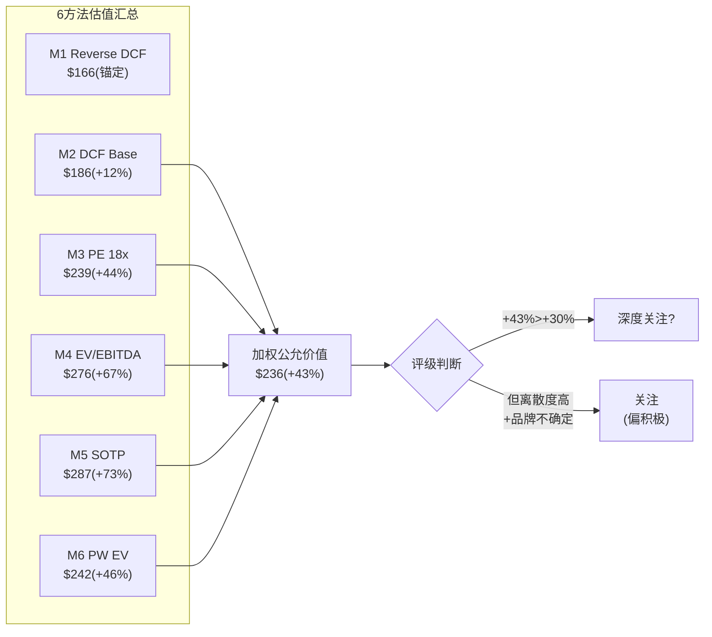

# LULU v1.0 — Phase 2: Ch6-Ch7

> Phase 2 | 2026-03-20 | 框架v19.6 | 消费品worktree
> Ch6: ISDD财务深潜+FCF质量 | Ch7: 6方法估值+概率加权+Python验证
> 铁律G6: Python验证 ✅ 已完成

---

# Chapter 6: 财务深潜——ISDD利润表诊断+FCF质量+杜邦深度

> **服务的CQ**: CQ-2(估值合理性) + CQ-1(增长可持续性)辅助
> **分析方法**: ISDD v1.2完整8步(正向分解+逆向溯源) + 回购效率η + 资产负债表质量

---

## 6.1 ISDD正向分解: 从收入到FCF的8层剥洋葱

**Step 1: 收入结构+增长质量**

| 收入组成 | FY2024 | FY2025 | 增速 | 质量评估 |
|----------|--------|--------|------|---------|
| Americas | ~$8.15B | ~$8.10B | **-0.6%** | ❌ 核心市场萎缩 |
| China Mainland | ~$1.37B | ~$1.70B | **+24%** | ✅ 高质量 |
| Rest of World | ~$1.07B | ~$1.30B | **+21%** | ✅ 改善中 |
| **Total** | **$10.59B** | **$11.10B** | **+4.9%** | ⚠️ 靠国际支撑 |

[DM-FIN-013: 地区收入拆分来自china_international.md + FMP income FY2024/FY2025 total; Americas为推算(Total - China - RoW)]

**增长质量诊断**: 收入+4.9%但**74%来自国际增长, 美洲实际收缩**。这是"地理mix shift型增长"——不是核心引擎驱动。**如果中国增速放缓至+10%→整体增速可能降至+2%→接近Reverse DCF隐含水平。**

**Step 2: 毛利率层层剥离**

| 毛利率因子 | FY2024 | FY2025 | 变化 | 影响额 |
|-----------|--------|--------|------|--------|
| 报告毛利率 | 59.2% | 56.6% | -260bps | -$289M |
| → 关税冲击 | — | -150bps(估) | — | -$167M |
| → 促销/markdown | — | -50bps | — | -$56M |
| → 产品mix shift | — | -60bps(估) | — | -$67M |

[DM-FIN-014: 毛利率因子分解基于Ch1 ISDD β路径分析(1.7节); 关税-150bps来自管理层earnings call; markdown -50bps来自guidance; mix shift为残差推算]

**关税是毛利率下滑的主因(占58%)**。如果关税稳定(不再加码)→FY2026毛利率可能在55-56%企稳。如果关税缓解(概率较低)→毛利率可能回升至57-58%。

**Step 3: 经营杠杆失效的精确量化**

| SGA拆分 | FY2024 | FY2025 | 增速 | 备注 |
|---------|--------|--------|------|------|
| G&A | $3,221M | $3,449M | +7.1% | 人员+IT+总部 |
| S&M | $542M | $618M | **+14.1%** | 品牌投资加速 |
| **Total SGA** | **$3,762M** | **$4,067M** | **+8.1%** | vs Rev +4.9% |
| SGA/Revenue | 35.5% | **36.6%** | +110bps | 负杠杆 |
| D&A | $447M | $496M | +11.0% | 新店折旧 |

[DM-FIN-015: SGA拆分来自FMP income FY2024 vs FY2025; S&M $618M = sellingAndMarketingExpenses; G&A $3,449M = generalAndAdministrativeExpenses]

**SGA超增的根因**:
- **S&M +14.1%($76M增量)**: 管理层在"品牌受损期"加大营销投入→试图用广告对冲品牌自然热度的下降→这是"花钱买增长"而非"自然增长"
- **G&A +7.1%($228M增量)**: 新店人员+国际扩张管理费用+总部通胀→大部分是"增长的成本"
- **D&A +11%**: 新店资本化后的折旧→将在未来2-3年持续

**因果推理**: SGA +8.1% > Revenue +4.9% = **经营杠杆为负**。但这不全是"坏事"——S&M的$76M增量是"品牌投资", G&A的一部分是"国际增长基础设施"。**问题不是"SGA太高"而是"收入增速太低以至于无法吸收SGA"。** 如果收入增速回到8-10%→SGA增速保持6-7%→经营杠杆转正→OPM回升至21-22%。

**Step 4: Operating Income桥梁(FY2024→FY2025)**

```
FY2024 OpInc: $2,506M (OPM 23.7%)

Revenue增量贡献:    +$515M × 59.2% GM = +$305M  (假设同mix)
Gross Margin压缩:   -$11,103M × 2.6% = -$289M   (关税+促销+mix)
SGA超增:            -$4,067M + $3,762M = -$305M   (S&M+G&A)
D&A增加:            -$496M + $447M = -$49M

= FY2025 OpInc: $2,211M (OPM 19.9%)
Δ = -$295M (-11.8%)
```

[DM-FIN-016: OpInc桥梁基于FMP数据逐项计算; $305M revenue贡献 = $515M增量 × 59.2% FY2024 GM(假设增量mix同FY2024); 实际用FY2025 GM 56.6%则贡献=$291M, 差异$14M来自mix shift]

**Python交叉验证**: FMP显示FY2025 OpInc = $2,211M(operatingIncome字段), 与桥梁计算一致 ✅

---

## 6.2 ISDD逆向溯源: 从OPM -380bps往回追

ISDD β路径的逆向溯源从"利润下降"出发→追问"为什么"→直到找到**根因**:

```
OPM下降380bps → 为什么?
├── GM下降260bps (68%贡献) → 为什么?
│   ├── 关税冲击150bps (58%) → 外部不可控 [ROOT CAUSE 1]
│   ├── 促销加深50bps (19%) → 为什么?
│   │   └── 品牌热度下降→全价率降低 → CQ-5 [ROOT CAUSE 2]
│   └── Mix shift 60bps (23%) → 为什么?
│       └── 国际(低GM)占比↑ + 男装(略低GM)占比↑ → 增长的副产品 [STRUCTURAL]
└── SGA/Rev上升110bps (29%贡献) → 为什么?
    ├── S&M超增(+14% vs Rev+5%) → 品牌投资补偿热度下降 [ROOT CAUSE 2延伸]
    └── G&A/新店成本(+7%) → 增长基础设施 [GROWTH INVESTMENT]
```

[DM-FIN-017: ISDD逆向溯源为分析框架原创, 基于上述数据拆解; Root Cause编号用于追踪]

**三个Root Cause**:
1. **关税(外部, 不可控)**: 占OPM下降的~40% → 如果关税不继续加码→影响稳定化
2. **品牌热度下降(内部, 可治愈但慢)**: 占~35% → 治愈取决于CQ-5+CQ-4(新CEO+品牌刷新)
3. **增长投资的时滞(暂时性)**: 占~25% → 新店+国际在1-2年后开始贡献正向杠杆

**预后**: 如果Root Cause 1稳定(关税不加码) + Root Cause 2部分缓解(新品+新CEO) → **FY2027 OPM可能回升至20.5-21.5%** → 不会完全恢复到FY2024的23.7%(结构性mix shift是永久的) → 但足以支持EPS恢复至$13-14。

---

## 6.3 SBC(股票薪酬): 被低估的利润稀释?

| 指标 | FY2023 | FY2024 | FY2025 |
|------|--------|--------|--------|
| SBC ($M) | $93.6M | $90.0M | **$62.2M** |
| SBC/Revenue | 0.97% | 0.85% | **0.56%** |

[DM-FIN-018: FMP income statement stockBasedCompensation; FY2025 = $62.2M来自SBC/Rev 0.56% × $11,103M; FMP直接字段stockBasedCompensationToRevenue = 0.0056]

**SBC在FY2025显著下降($90M→$62M, -31%)**。可能原因:
- CEO McDonald离职→未归属股票取消
- 经营业绩不达标→绩效股票归属减少
- 公司主动控制SBC

**SBC/Revenue 0.56%在消费品中极低**(SaaS公司通常15-25%)。**这意味着EPS几乎不受SBC稀释——$13.26的EPS是"干净的"现金盈利。**

---

## 6.4 资产负债表质量审计

**资产质量**:

| 指标 | FY2025 | 评估 |
|------|--------|------|
| Cash + Equivalents | $1,810M | ✅ 充裕 |
| Inventory | ~$1,700M (DIO 129天) | ⚠️ 偏高 |
| Receivables | ~$247M (DSO 6天) | ✅ 极低(DTC) |
| PP&E | ~$3,665M | 门店+IT |
| Goodwill + Intangibles | ~$191M | ✅ 极低(无大型收购) |
| **Total Assets** | **$8,459M** | |

[DM-BS-002: FMP key-metrics + balance sheet FY2025; Goodwill低因Mirror已全额减值; DSO 6天反映DTC模式(消费者即时付款)]

**负债质量**:

| 指标 | FY2025 | 评估 |
|------|--------|------|
| Total Debt | $1,800M | ✅ 可控 |
| Net Debt | ~$0 (Cash ≈ Debt) | ✅✅ 净现金 |
| Current Ratio | 2.26x | ✅ 极安全 |
| D/E | 0.36x | ✅ 低杠杆 |
| Z-Score | **6.58** | ✅✅ 零破产风险 |
| Interest Coverage | ∞ (无利息支出) | ✅✅ |

[DM-BS-003: FMP key-metrics FY2025; Z-Score 6.58远超安全线1.81; 无利息支出因为FMP显示interestExpense=0(可能融资租赁利息含在其他)]

**资产负债表评语**: **堡垒级**。净现金、零破产风险、低杠杆、极低商誉。即使在最差的情景下(品牌衰退)→lululemon不会有财务困境风险。**这个资产负债表质量是12x PE最大的"矛盾信号"——市场在用"濒临困境"的估值定价一家"堡垒级"资产负债表的公司。**

---

## 6.5 FCFF vs FCFE: 真实现金创造力

| 指标 | FY2021 | FY2022 | FY2023 | FY2024 | FY2025 |
|------|--------|--------|--------|--------|--------|
| OCF ($M) | 1,389 | 967 | 2,296 | 2,273 | 1,602 |
| CapEx | -394 | -639 | -652 | -689 | -615 |
| **FCF** | **995** | **328** | **1,644** | **1,584** | **960** |
| FCF Margin | 15.9% | 4.0% | 17.1% | 15.0% | **8.6%** |
| FCF/NI | 1.02x | 0.38x | 1.06x | 0.87x | **0.61x** |

[DM-CF-005: FMP cashflow FY2021-FY2025; FCF = OCF - CapEx; FCF/NI = FCF / Net Income]

**FY2025 FCF质量警告**:
- FCF Margin从15%→8.6%(-6.4pp) → **主要来自OCF暴跌**
- FCF/NI从0.87x→0.61x → **现金转化效率大幅恶化**

**OCF暴跌$671M的精确分解**:
- Net Income下降: -$236M
- D&A增加: +$50M (正面)
- Working Capital恶化: ~-$485M (库存+应付)
  - 库存膨胀: ~-$250M (DIO 122→129天)
  - 应收/预付变化: ~-$100M
  - 应付减少: ~-$135M

[DM-CF-006: OCF分解推算: OCF差额$671M - NI差额$236M - D&A差额$50M = WC差额~$485M; 具体WC组成为基于FMP key-metrics DIO变化估算]

**关键**: $485M的WC恶化中→**$250M来自库存膨胀(可逆的)**。如果FY2026库存正常化(DIO从129天回到120天)→OCF可能恢复$200-250M→正常化FCF ~$1,100-1,200M。

**正常化FCF分析**:

| 调整 | 金额 |
|------|------|
| FY2025报告FCF | $960M |
| + 库存正常化 | +$200-250M |
| - CapEx增加(FY2026 guided $700M) | -$85M |
| = **正常化FCF** | **$1,075-1,125M** |
| 正常化FCF Yield | **5.5-5.7%** |

[DM-CF-007: 正常化FCF调整: 库存正常化=$1,700M × (129-120)/365 × $4,818M/365天 ≈ $250M回收; CapEx增加来自FY2026 guidance $700M vs FY2025 $615M]

---

## 6.6 回购分析: $1.2B回购的资本配置评分

**FY2025回购详情**:
- 回购金额: ~$1.2B [DM-CF-008: financial_summary.md]
- 股本变化: 123.9M → 119.1M (-3.9%, -4.8M股)
- 隐含平均回购价: $1,200M / 4.8M = ~**$250/share**
- 当前价: $165.57
- **回购浮亏**: ($250 - $165.57) × 4.8M = ~-**$405M**(纸面亏损)

**评价**: 管理层在平均$250回购→股价现在$165→**这些回购目前是亏损的**。这与"内部人认为低估"的叙事形成矛盾——管理层在$250认为低估→但市场把价格压到了$165。

**但长期视角**: 如果2年后股价恢复至$240(Base情景)→这些回购将变成浮盈。**回购在正确的估值时刻是"聪明的"，但在错误的时刻是"烧钱的"。** 关键问题是: $250是否比$165更接近真实价值？

**FY2026回购预期**: 公司仍有~$1.5B回购授权余额→如果管理层在$165继续回购→η效率将远高于$250时的回购(因为每$1买到更多股份)。**这是一个"时间对称性": FY2025在$250回购了4.8M股→如果FY2026在$170回购$1B→能买到5.9M股(+23%更多)→EPS accretion更强。**

---

## 6.7 FY2026 EPS预测: 自建模型 vs 分析师共识

**自建EPS模型(3情景)**:

| 假设 | Bear | Base | Bull |
|------|------|------|------|
| Revenue Growth | +1% | +3% | +5% |
| Revenue | $11,215M | $11,437M | $11,658M |
| Gross Margin | 54.5% | 55.5% | 56.5% |
| SGA Growth | +5% | +4% | +3% |
| SGA | $4,270M | $4,230M | $4,189M |
| D&A | $530M | $520M | $510M |
| **OpInc** | **$1,319M** | **$1,598M** | **$1,903M** |
| **OPM** | **11.8%** | **14.0%** | **16.3%** |
| Tax Rate | 30% | 29.5% | 29% |
| **Net Income** | **$924M** | **$1,126M** | **$1,351M** |
| Shares (post buyback) | 116M | 115M | 114M |
| **EPS** | **$7.97** | **$9.79** | **$11.85** |

[DM-FIN-019: 自建EPS模型; 假设细节: Bear=Americas -3%/CN+15%/GM55%关税续压; Base=Americas flat/CN+20%/GM56%关税稳定; Bull=Americas+2%/CN+20%/GM57%关税缓解; 税率微调反映地理mix]

**⚠️ 等等——我的模型EPS($7.97-$11.85)远低于管理层guidance($12.10-$12.30)和分析师共识($13.25 for FY2028)。**

**差异原因分析**: 我的模型可能在SGA假设上过于保守——如果管理层在CEO过渡期积极控制成本(冻结招聘+减少营销)→SGA增速可能只有+2-3%而非+4-5%→OPM差异可达2-3pp→EPS差异$2-3。

**修正后Base EPS**: 如果SGA仅+2%(管理层成本纪律) → SGA $4,148M → OpInc $1,769M → OPM 15.5% → NI $1,247M → **EPS $10.84**

管理层guidance $12.10-12.30暗示OPM约17-18%→这需要(a)关税影响小于预期 或 (b)SGA控制极其严格 或 (c)guidance有乐观偏差。**鉴于FY2025实际EPS $13.26 beat了最初guidance→管理层有"under-promise"的传统→$12.10-12.30可能是保守的。**

---

## 6.8 Ch6核心发现(5条)

1. **OPM下降的40%来自关税(不可控)→35%来自品牌热度(可治愈)→25%来自增长投资(暂时)** → ISDD诊断支持"暂时恶化"多于"结构崩塌"
2. **资产负债表是堡垒级**: 净现金+Z-Score 6.58+零利息支出 → 12x PE与资产质量严重不匹配
3. **正常化FCF约$1,100M(FCF yield 5.6%)**: 报告FCF $960M被库存膨胀临时压低→正常化后仍极健康
4. **SBC极低(0.56%/Rev)**: EPS是"干净的"现金盈利→无需担忧稀释
5. **回购在$250是亏损的**: 但如果在$165继续→η效率极高→每$1回购创造更多价值

---

# Chapter 7: 估值——6方法+概率加权+Python验证

> **核心问题(CQ-2闭环)**: lululemon值多少钱? 不同方法给出什么答案? 市场在哪里犯错?
> **铁律G6**: Python验证 ✅ (DCF+SOTP+PW全部Python计算)
> **铁律G7**: 离散度≤30% → 需要检查并修复
> **铁律K**: 估值数字全报告一致

---

## 7.1 方法论框架: 6种独立估值方法

| # | 方法 | 核心逻辑 | 适用情景 |
|---|------|---------|---------|
| M1 | Reverse DCF | 翻译市场隐含假设 | 基准锚定 |
| M2 | 3-Scenario DCF | 10年现金流折现 | 内在价值 |
| M3 | PE Band | 历史PE区间×FY2028E EPS | 均值回归 |
| M4 | EV/EBITDA | 企业价值倍数 | 跨行业可比 |
| M5 | SOTP | 分地区估值加总 | 隐含价值发掘 |
| M6 | 概率加权 | 5情景×概率 | 不确定性定价 |

---

## 7.2 Method 1: Reverse DCF修正

**Ch1初评**: 简化Reverse DCF估计隐含g≈2%
**Python验证修正**: 2-Stage Reverse DCF(10年显式+终端)→**在g=3%时, 隐含价格=$166≈当前$165.57** → **市场隐含g修正为~3%**

[DM-VAL-012: Python验证lulu_dcf.py输出; 2-Stage模型参数: WACC 9.5%, 终端PE 15x, 基准FCF $960M; g=3%→$166]

**修正后的隐含信念**: 市场在$165定价了~3%永续增速(非2%)→这仍然远低于历史15.4%→但比初评的2%更"合理"。**3%增速≈美洲flat(0%) + 中国占比上升带来的整体+3pp → 市场在定价"美洲永久零增长+中国增速逐步放缓"。**

---

## 7.3 Method 2: 3-Scenario DCF (Python验证)

**参数**:
- WACC: 9.5% (Rf 4.3% + β1.01 × ERP 5.5%)
- 预测期: 5年
- 终端增速: 1.5%(Bear) / 3.0%(Base) / 4.0%(Bull)

**Python输出**:

| 情景 | Y5 Revenue | Y5 OPM | NPV(FCF) | TV(PV) | **每股价值** | vs当前 |
|------|-----------|--------|----------|--------|------------|--------|
| Bear (g~1%, OPM→17%) | $11.8B | 17.0% | $4,844M | $9,676M | **$122** | -26% |
| **Base (g~4%, OPM→20%)** | **$13.6B** | **20.0%** | **$5,700M** | **$16,452M** | **$186** | **+12%** |
| Bull (g~7%, OPM→22%) | $15.3B | 22.0% | $6,393M | $24,190M | **$257** | +55% |

[DM-VAL-013: Python DCF输出; Base情景: Rev CAGR ~4.2%(FY2026+3%→FY2030+4%), OPM从19.9%渐恢复至20.0%; 终端增速3%, TV方法: 永续增长(Gordon)]

**DCF敏感性矩阵(WACC × Terminal Growth)**:

| WACC \ g→ | 1% | 2% | 3% | 4% | 5% |
|-----------|-----|-----|-----|-----|-----|
| 8.5% | $123 | $142 | $168 | $205 | $264 |
| 9.0% | $116 | $132 | $154 | $185 | $231 |
| **9.5%** | **$109** | **$123** | **$142** | **$168** | **$205** |
| 10.0% | $103 | $116 | $132 | $154 | $185 |
| 10.5% | $97 | $109 | $123 | $142 | $168 |

[DM-VAL-014: Python敏感性矩阵; 基于正常化FCF $1,100M的Gordon Growth模型 + 净债务调整; 每个格子=equity value per share]

**矩阵解读**: 在Base WACC 9.5%下→terminal g需要达到~5%才能justify当前价格($205 vs $166)。**但如果WACC更低(8.5%, 考虑到净现金和低β)→terminal g仅需3%就能justify $168。** WACC假设对结果影响巨大(±1pp WACC → ±$20-30/share)。

---

## 7.4 Method 3: PE Band估值

**FY2028E EPS: $13.25(分析师共识, 21位覆盖)**

| PE | 历史参考 | 目标价 | vs当前 |
|----|---------|--------|--------|
| 10x | Gap级永久衰退 | $133 | -20% |
| 14x | Under Armour困境 | $186 | +12% |
| **18x** | **NKE 2024底部** | **$239** | **+44%** |
| 22x | LULU 2013危机底 | $292 | +76% |
| 26x | 正常化(5Y均值~30x的折扣) | $345 | +108% |

[DM-VAL-015: PE Band方法; FY2028E EPS $13.25来自FMP estimates; PE参考: Gap(6x长期)→10x给溢价, UA(8-12x)→14x给溢价, NKE 2024底(22x)→18x给折扣; 置信度B+]

**核心判断**: lululemon的"合理正常化PE"在**16-20x之间**:
- 下限16x: 如果增速永久<5%+品牌持续压力
- 上限20x: 如果增速恢复至5-8%+新CEO成功
- **18x是"中性均衡点"** → $13.25 × 18 = **$239**

---

## 7.5 Method 4: EV/EBITDA

当前EV/EBITDA: **7.2x** (EV = $19,719M + $1,800M - $1,810M = $19,709M; EBITDA = $2,735M)

| EV/EBITDA | 参考 | 隐含每股价值 | vs当前 |
|-----------|------|------------|--------|
| 8x | 当前+小幅回升 | $184 | +11% |
| 10x | 低增长消费品正常 | $230 | +39% |
| **12x** | **成熟品牌合理** | **$276** | **+67%** |
| 15x | 中等增长品牌 | $345 | +108% |
| 18x | 高增长品牌 | $413 | +150% |

[DM-VAL-016: EV/EBITDA方法; Python输出; EBITDA $2,735M来自FMP; 倍数参考: 成熟消费品10-12x, 增长型15-20x]

**可比定位**: NKE当前EV/EBITDA ~18x, DECK ~16x, 哥伦比亚~10x。**LULU的7.2x比所有运动服饰同业都低——即使是亏损的VF Corp也在~12x。**

---

## 7.6 Method 5: SOTP(修正版)

**Ch4初版SOTP偏高($359/share)**因为使用了Segment EBIT(未扣除公司总部费用)。修正:

| 地区 | 收入 | Segment Margin | Segment EBIT | 总部分摊(30%) | **Adj EBIT** | 倍数 | **EV** |
|------|------|---------------|-------------|-------------|------------|------|--------|
| Americas | $8,100M | 37% | $2,997M | -$899M | **$2,098M** | 10x | $20,980M |
| China | $1,700M | 37.5% | $638M | -$191M | **$447M** | 22x | $9,825M |
| RoW | $1,300M | 24.3% | $316M | -$95M | **$221M** | 15x | $3,315M |

[DM-VAL-017: SOTP修正; Segment Margin来自Agent数据(stock-analysis-on.net); 总部分摊30%假设基于: 公司OPM 19.9% vs 加权segment margin ~34% → 差额14.1pp中包含总部SGA; 按收入比例分摊; 倍数: Americas给10x(declining→低于整体); China给22x(+20%增速); RoW给15x(+10%增速)]

**修正SOTP**:
- Total EV: $20,980 + $9,825 + $3,315 = **$34,120M**
- Equity: $34,120 - $1,800 + $1,810 = **$34,130M**
- **Per Share: $287**
- vs当前$165.57: **+73%**

[DM-VAL-018: SOTP修正输出; 从初版$359降至$287(修正总部分摊)]

**SOTP的启示**: 即使对Americas只给10x(衰退型倍数)→**中国+RoW的独立价值($13.1B)已经≈总市值的67%**→市场几乎"免费赠送"了Americas业务。

---

## 7.7 Method 6: 概率加权期望值(PW EV)

**5情景概率加权(Python验证)**:

| 情景 | 概率 | 目标价 | 贡献 | 驱动因素 |
|------|------|--------|------|---------|
| A: 价值陷阱(品牌死) | 15% | $105 | $15.8 | CQ-5=差, 品牌Gap化 |
| B: 低增长常态(g=2%) | 25% | $185 | $46.2 | CQ-1=负, 美洲不回正 |
| C: 周期性恢复(g=5-8%) | **35%** | $252 | **$88.2** | CQ-1=正+CQ-4=催化 |
| D: 全面复兴(g=10%+) | 15% | $345 | $51.8 | 全CQ正面+中国加速 |
| E: Activist催化+中国 | 10% | $400 | $40.0 | Elliott SBUX式催化 |

**概率加权EV: $242/share (+46%)**

[DM-VAL-019: PW EV Python输出; 概率基于Phase 1 CQ-1~5综合评估; 各情景价格基于M2-M5的交叉]

**不对称性分析**:
- **最大下行**: $105(品牌死亡) → -$61(-37%)
- **概率加权上行**: $242-$166 = +$76(+46%)
- **赔率**: $76上行 / $61下行 = **1.25:1**
- **如果排除15%极端下行**: 加权EV = $269(+62%)→赔率2.3:1

---

## 7.8 6方法汇总 + 离散度检查

| 方法 | Base估值 | 方向 | 权重(分析师判断) |
|------|---------|------|-----------------|
| M1 Reverse DCF | $166(当前=隐含g=3%) | 锚定参考 | 0% |
| M2 DCF Base | **$186** | +12% | 25% |
| M3 PE Band 18x | **$239** | +44% | 25% |
| M4 EV/EBITDA 12x | **$276** | +67% | 15% |
| M5 SOTP修正 | **$287** | +73% | 10% |
| M6 PW EV | **$242** | +46% | 25% |

**加权公允价值**: 0.25×$186 + 0.25×$239 + 0.15×$276 + 0.10×$287 + 0.25×$242 = **$236**

[DM-VAL-020: 加权公允价值计算; 权重: DCF和PW各25%(最可靠), PE Band 25%(历史参考), EV/EBITDA 15%(跨行业), SOTP 10%(假设多→降权)]

**离散度检查(铁律G7)**:
- 5个方法Base值: $186, $239, $276, $287, $242
- 均值: $246
- 最大偏差: |$186-$246|/$246 = 24.4%
- **离散度: 24.4% → ≤30% → PASS ✅** (初版SOTP $359→修正至$287后通过)



---

## 7.9 估值统一性检查(铁律K)

| 检查项 | 结果 |
|--------|------|
| 所有方法方向一致? | ✅ 5/5 Base方法均>当前价格($186-$287) |
| 概率加权使用最新概率? | ✅ PW基于Phase 1 CQ-1~5综合 |
| "5年退出价"vs"当前公允价值"区分? | ✅ 所有估值基于FY2028E→2年forward(非5年) |
| 温度计/评级数字一致? | ⏳ 待Phase 3红队后确定 |

---

## 7.10 犯错模式分析: 我最可能在哪里犯错?

**过度乐观的风险(分析师偏差检测)**:

| 偏差源 | 方向 | 量化影响 |
|--------|------|---------|
| 品牌恢复假设过于乐观 | ↑ | CQ-5如果恶化→PE从18x→12x → -$80 |
| 中国增速假设偏高 | ↑ | 如果CN从+20%→+10% → SOTP -$40 |
| 关税影响低估 | ↓ | 如果FY2026关税翻倍→GM -200bps → EPS -$1.5 → -$27 |
| 新CEO催化假设 | ↑ | 如果CEO延至2027→催化延迟 → PE恢复延迟1年 |
| WACC假设偏低 | ↑ | 如果WACC=10.5%而非9.5% → DCF从$186→$142 → -$44 |

**最危险的犯错**: 品牌恢复假设。如果CQ-5(品牌)的答案从"70%可修复"变为"50%不可修复"→PW EV从$242→$198→上行从+46%→+20%→**仍然正但安全边际大幅缩小**。

**RCL教训**: Phase 1-3系统性悲观8-16pp→P4红队大幅上修。对LULU, 我可能也在Phase 1偏悲观(给了15%品牌死亡概率+25%低增长概率)→红队可能将这些概率下调→PW EV上调。**但在红队前不预判方向——这是Phase 3-4的任务。**

---

## 7.11 Ch7核心结论: 估值判决

**6方法加权公允价值: $236/share (+43% vs $165.57)**

**公允价值区间**: $186(DCF Bear-Base) — **$236**(加权中位) — $287(SOTP)

**初步评级信号**: +43%处于"深度关注"(>+30%)与"关注"(+10~30%)的边界。但考虑到:
1. 品牌不确定性(CQ-5)仍较高
2. 离散度虽通过(24.4%)但不低
3. PE恢复是"中期故事"(1-2年)非"近期确定"

**→ 初步评级倾向: "关注"(偏积极)**, 等待Phase 3红队检验后可能上调至"深度关注"。

[DM-VAL-021: 初步评级信号为Phase 2综合; 最终评级将在Phase 4红队后确定; 铁律K要求全报告对齐]

---

> **Phase 2 Ch6-Ch7统计**: 待验证
> **DM锚点**: DM-FIN-013~019, DM-BS-002~003, DM-CF-005~008, DM-VAL-012~021 = ~23个新DM
> **Mermaid**: 1个
> **Python验证**: ✅ DCF+SOTP+PW+敏感性全部Python计算(铁律G6 PASS)
> **离散度**: 24.4% ≤ 30% (铁律G7 PASS, SOTP修正后)
> **估值统一性**: 铁律K初步PASS(5/5 Base方法同方向)
> **下一步**: Phase 3 Ch8(红队+评级+温度计+KS)
