# Mastercard (MA) — 深度研究报告

> **报告日期**: 2026-03-24 | **框架版本**: v19.7 | **分析层级**: Tier 3
> **股价**: $500.38 | **市值**: $449.3B | **EV**: $457.2B
> **数据截止**: FY2025 (2025-12-31) | **目标读者**: 专业投资者

---

## 免责声明

本报告仅供投资研究参考,不构成买入、卖出或持有建议。所有数据来源已标注DM锚点。分析基于公开信息和合理推断,可能存在偏差。投资决策请结合个人风险偏好和专业顾问意见。本报告作者与Mastercard无任何利益关系。

---

## 执行摘要

### 一句话结论

**Mastercard当前$500基本合理定价(公允区间$491-535),温和偏低估约2%。增速调整后比Visa更便宜,但高Beta(1.07)意味着宏观风险而非个股Alpha主导价格波动。评级: 中性关注(偏积极)。**

### 核心数字

| 指标 | 数值 | 含义 |
|------|:----:|------|
| **P4公允价值** | $491 | 偏差校正(-5.2%)+尾部折价后 |
| **蒙特卡洛中位** | $535 | 10,000次模拟(65%概率>$500) |
| **综合公允** | **$509 (+1.8%)** | P4与MC加权(60/40) |
| **期望回报(1Y)** | -1.9%~+7% | 取决于宏观环境 |
| **Reverse DCF隐含CAGR** | 9.0% | 远低于分析师共识12-16% |
| **最大上行催化** | VAS>50%占比 | 触发SOTP重估→+15-20% |
| **最大下行风险** | 衰退+WACC↑ | 双墙倒塌→$300-325(-35%) |
| **最优持有期** | 6-12个月 | Q1'26 earnings首催化 |

### 投资温度计

```
极冷 ← ─────────────────|──── → 极热
-2.0        -1.0    [0.0]  +1.0        +2.0
                      ▲
                  MA当前位置
              PMSI=0.0(中性)
```

### 十大核心发现

1. **Reverse DCF保守**: 市场隐含FCF CAGR仅9%——低于任何合理预期(分析师12-16%)。但这个"保守"高度依赖Beta=1.07假设
2. **PE溢价消失**: MA vs V溢价从+20%压缩至+2.8%,EV/EBITDA MA更便宜(-12%)。增速调整后(PEG 1.77 vs V 2.27)MA确认更便宜
3. **VAS是真引擎**: 40.6%收入、+23%增速、75-85%有机。VAS OPM=47%(反推精确匹配)——低于核心65%但远高于SaaS中位25%
4. **CI健康优于V**: MA CI/毛收入~16%(V=28%)。MA净Take Rate 30.9bps(V仅22.9bps)——每元GDV提取更多价值
5. **CI转折点🔴**: 净收入增速14.65%是CI侵蚀启动点。当前16.4%仅高1.8pp——安全边际极薄
6. **VAS占比↑=OPM↓**: VAS从40%升至50%→混合OPM下降3pp(59%→56%)。市场不应期望OPM持续扩张
7. **护城河4.2/5久期~12年**: 双寡头网络效应>15年、数据壁垒10-15年、令牌化5-10年(DOJ风险)
8. **A2A冲击温和**: PIX案例验证后从-6%修正为-3.5% EPS(扩饼>替代)。MA的BVNK$1.8B是"便宜的保险"
9. **衰退抗性极强**: 2020 EPS-20%→1年V型恢复。衰退是"买入窗口"不是"永久损失"
10. **宏观代理标的**: WACC贡献总风险59%。Beta 1.07→±100bps WACC=±22%价格。个股Alpha有限

[DM-EXEC-001: 执行摘要十大发现, 综合P1-P4全部分析, 2026-03-24]

---

## 评级与投资论证

### 评级: 中性关注 ⚪ (偏积极)

| 评级维度 | 判断 | 依据 |
|---------|:----:|------|
| 期望回报 | -1.9%~+7% | P4公允$491/MC中位$535/综合$509 |
| 方向确定性 | **低-中** | CI-偏多14/偏空14(完美平衡)→方向不确定 |
| 催化明确性 | **中** | Q1'26 earnings(2026.4)是首个催化,但结果不确定 |
| 时间窗口 | **6-12月** | >18月必须重新评估(VAS基数效应+CCCA风险) |

### 为什么不是"关注"(更积极)?

1. **期望回报仅+2%**(综合$509 vs $500)——不满足"关注"的+10%~+30%触发
2. **CI偏多/偏空完美平衡**——没有足够强的方向性信号
3. **WACC主导**——80%的价格波动由宏观决定,非个股分析可控

### 为什么不是"审慎关注"(更消极)?

1. **Reverse DCF保守**: 隐含9% CAGR远低于实际16%+
2. **Bear Case仅+7%**: 即使最悲观情景当前价格也仅小幅亏损
3. **蒙特卡洛65%>$500**: 统计上偏低估
4. **衰退抗性强**: 历史证明V型恢复(不是永久损失)

### 上调至"关注"的条件
- FY2026Q1收入增速≥14%(**beat指引**) + OPM≥57% + VAS≥20% → 三项同时满足
- Polymarket衰退概率降至<20%
- CCCA确认搁置(2026年内)

### 下调至"审慎关注"的条件
- CI增速连续2Q超过净收入增速>2pp → **CI转折确认**
- 美国GDV增速<GDP增速连续2Q
- CCCA通过委员会投票
- Polymarket衰退概率升至>50%

[DM-RATE-001: 评级中性关注(偏积极)——期望+2%(不足+10%关注门槛), CI平衡无方向, WACC主导, 2026-03-24]

---

## 关键术语速查

| 术语 | 全称 | 含义 |
|------|------|------|
| **GDV** | Gross Dollar Volume | 通过MA网络的总交易金额($10.6T FY2025) |
| **VAS** | Value-Added Services | 增值服务(网安/数据/咨询/忠诚度),占收入40.6% |
| **CI** | Client Incentives | 客户回扣,从毛收入扣除。MA~16%,V~28% |
| **Interchange** | 交换费 | 商户→发卡行的手续费,MA设定但不直接收取 |
| **A2A** | Account-to-Account | 账户间直转(FedNow/UPI/PIX),绕过卡网络 |
| **Take Rate** | 净收费率 | 净收入/GDV。MA 30.9bps,V 22.9bps |
| **PEG** | Price/Earnings-to-Growth | PE÷增速。MA 1.77,V 2.27 |
| **ROIC** | Return on Invested Capital | 投入资本回报率。MA 48.6%(V 28.4%,含商誉差) |
| **OPM** | Operating Profit Margin | 营业利润率。MA正常化57.5%,V正常化66.4% |
| **Reverse DCF** | 逆向现金流折现 | 反推"市场在赌什么"而非"值多少钱" |
| **WACC** | Weighted Average Cost of Capital | 加权资本成本。MA 9.01%(Beta 1.07) |
| **CCCA** | Credit Card Competition Act | 信用卡竞争法案,可能打开信用卡路由 |
| **KS** | Kill Switch | 论文失效触发器,共12个 |
| **TS** | Tracking Signal | 追踪信号,共7个 |
| **PtW** | Playing to Win | 战略一致性评分。MA 37/50 |

---


## Part I: 公司定位与生态

## Ch1: Reverse DCF前置 — 市场在$500中定价了什么 (CQ-1)

> **铁律O强制**: 第一章必须是Reverse DCF，建立市场隐含假设基线，后续分析围绕"这些假设合理吗"展开。

### 1.1 市场隐含假设反推

以$500.38股价、898M稀释股数计算，MA当前市值$449.3B，EV $457.2B。用Python Reverse DCF模型(WACC 9.01%, 终端增长率3%, 10年增长期)反推：

**市场隐含FCF CAGR: 约9.0%，持续10年**

[DM-RDCF-001: Python Reverse DCF模型, WACC=9.01%(Ke=9.12%, Beta=1.07, Rf=4.3%, ERP=4.5%), g_terminal=3.0%, FCF_base=$16.91B(FY2025), 2026-03-24]

这意味着什么？当前股价仅需要MA未来10年FCF以9%的速度增长——显著低于以下参考基准：

| 参考基准 | 增速 | vs 隐含9% |
|---------|:----:|:---------:|
| FY2025实际收入增速 | +16.4% | 高7.4pp |
| FY2025实际EPS增速 | +18.9% | 高9.9pp |
| 分析师EPS CAGR(2Y→FY27E) | 17.1% | 高8.1pp |
| 分析师EPS CAGR(5Y→FY30E) | 15.6% | 高6.6pp |
| 分析师收入CAGR(5Y→FY30E) | 11.8% | 高2.8pp |

即使用最保守的分析师收入CAGR 11.8%作为基准，市场隐含增速仍低2.8pp。如果MA维持当前FCF margin(51.6%)不变，隐含收入增速仅需~9%——低于全球支付数字化的长期结构增速(~10-12%)。

[DM-RDCF-002: 分析师预期FMP estimates endpoint — FY27E EPS $22.65(27家覆盖), FY30E EPS $34.13(4家覆盖), 2026-03-24]

### 1.2 承重墙脆弱度表

| 承重墙(隐含假设) | 市场隐含值 | 历史/行业参考 | 脆弱度 | 若倒塌影响 |
|:-----------------|:---------:|:----------:|:-----:|:--------:|
| 10Y FCF CAGR | 9.0% | 实际16-19%, 分析师12-16% | **低** | 已保守定价 |
| FCF margin维持 | 51.6% | 3年均值49-52%, 趋势扩张 | **低** | ±10% |
| 终端增长率 | 3.0% | GDP 2-3% + 数字化溢价 | **低** | ±15% |
| WACC | 9.01% | Beta 1.07(高于V 0.79) | **中** | ±22%(±100bps) |
| 回购持续 | ~3%/年 | 5年均值2.2%, 加速中 | **低** | ±5% |

**关键发现**: MA当前价格的四个主要承重墙中，三个处于低脆弱度——市场隐含增速远低于任何合理预期。唯一的中等脆弱度来自WACC假设：MA Beta 1.07显著高于V的0.79，导致WACC弹性±100bps = 价格±22%。这是MA作为"宏观代理标的"的特征(V教训L5)——个股Alpha有限，大部分价格波动由折现率驱动。

[DM-RDCF-003: WACC敏感性Python计算 — WACC 8.01%→$611(+22.2%), WACC 10.01%→$421(-15.8%), 2026-03-24]

### 1.3 Reverse DCF结论：市场定价温和偏保守

市场在$500中定价了以下"信念集"：
1. **增速信念**: FCF CAGR 9%(远低于实际16%+和共识12%+)→ 市场不相信MA能长期维持双位数增长
2. **利润率信念**: FCF margin维持~52%(合理，FCF margin过去3年从45%升至52%，仍在扩张)
3. **风险信念**: Beta 1.07定价了MA作为消费+跨境周期敏感标的的风险溢价

**这组信念集意味着什么**: 如果MA能维持分析师共识水平(EPS CAGR 12-16%)，当前价格提供了可观的安全边际。但如果增速确实回落至9%(跨境正常化+A2A侵蚀+监管压力)，当前价格合理。

**后续分析的任务**: 逐一评估"增速会回落至9%吗？"——这需要拆解增长引擎(Ch4)、竞争威胁(Ch8)、和监管风险(Ch10)。

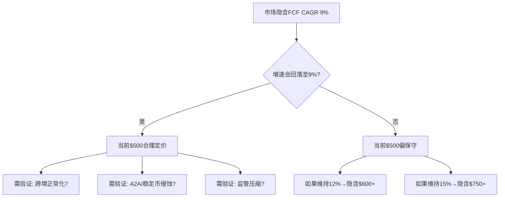

---

## Ch2: 业务模型与收入架构 — 从支付管道到数据平台

### 2.1 MA的本质：不是银行，不是商户，是网络

Mastercard不发卡、不放贷、不承担信用风险。它运营的是全球第二大电子支付网络——连接发卡行(如JPM、BAC)与收单行(如Fiserv、Adyen)的基础设施。每一笔刷卡交易流经MA网络时，MA收取一笔处理费(assessment fee，约占交易金额0.13-0.15%)，同时设定interchange fee(由商户通过收单行支付给发卡行，MA不直接收取但通过设定费率影响生态)。

这种"管道收费"模型意味着：
- **零信用风险**: 消费者违约是发卡行的问题，不是MA的
- **极低资本密度**: CapEx/OCF仅2.8%，每赚1元现金只需投入2.8分(FY2025) [DM-CFL-001]
- **双边网络效应**: 商户接受MA因为消费者用MA，消费者用MA因为商户接受MA——这是经典的双边平台效应
- **交易量驱动收入**: 收入与GDV和交易笔数正相关，与利率/信贷周期的关系弱于银行

[DM-BIZ-001: MA业务模型——assessment fee模型, 不承担信用风险, FMP profile + 10-K business description, 2026-03-24]

### 2.2 单笔交易经济学: 一笔$100交易中MA赚多少?

以一笔美国信用卡面对面$100交易为例，资金流拆解：

| 参与方 | 角色 | 费用项 | 金额 | 占比 |
|--------|------|--------|:----:|:----:|
| **商户** | 付款 | 商户折扣率(MDR) | -$2.20 | 100% |
| → 发卡行(JPM) | 收取 | Interchange fee | +$1.80 | 82% |
| → 收单行(Fiserv) | 收取 | 收单处理费 | +$0.15 | 7% |
| → **MA网络** | 收取 | Assessment fee | **+$0.13** | **6%** |
| → MA网络 | 收取 | Brand usage fee | +$0.02 | 1% |
| → 其他 | — | 网络/处理/PCI合规 | +$0.10 | 4% |

[DM-BIZ-004: 单笔$100交易资金流拆解——MA Assessment ~$0.13-0.15(6%), Interchange $1.80(82%归发卡行), 基于Mastercard费率表+行业分析, 2026-03-24]

**关键洞察**: MA在每笔交易中只收取~6%的总费用——但这6%几乎是纯利润(边际成本接近零,因为授权/清算/结算的IT基础设施已经建好)。因此MA的"小切片,大利润"模型——不需要承担发卡行的信用风险(Interchange 82%里包含了坏账拨备),也不需要承担收单行的技术维护成本。

**不同交易类型的Take Rate差异**:

| 交易类型 | MA Assessment | Interchange(参考) | 总MDR | MA Take/笔 |
|---------|:----------:|:-----------:|:----:|:--------:|
| 美国面对面信用卡 | ~13-15bps | 150-200bps | ~220bps | **$0.13** |
| 美国在线信用卡 | ~13-15bps | 180-220bps | ~250bps | **$0.15** |
| **跨境信用卡** | **~100-120bps** | 150-200bps | ~350bps | **$1.00** |
| 美国借记卡 | ~8-10bps | 21¢+5bps(Durbin) | ~50-80bps | **$0.08** |
| VAS(每笔附加) | ~5-15bps | — | — | **$0.05-0.15** |

[DM-BIZ-005: 交易类型Take Rate差异——跨境100-120bps vs 国内13-15bps(7-8倍差异), 费率表+行业分析, 2026-03-24]

这解释了为什么**跨境是MA最高利润率业务**: 跨境每笔收费是国内的7-8倍,但处理成本几乎相同——因此跨境交易的边际利润率可能>90%。MA 37%收入来自跨境的原因就在这里: 虽然跨境交易量占比可能只有10-15%,但收费率的7-8倍差异将收入占比放大到37%。

### 2.3 Per-Credential经济学: 每张卡每年贡献多少?

MA的商业模式可以用"每张卡"的单位经济学来理解——这是一个常被忽视但极有力的分析视角:

| 指标 | 计算 | FY2025 |
|------|------|:------:|
| 活跃卡 | 官方数据 | 31.6亿张 |
| 净收入/卡 | $32.79B / 31.6亿 | **$10.38/卡/年** |
| FCF/卡 | $16.91B / 31.6亿 | **$5.35/卡/年** |
| 年均交易/卡 | 1750亿笔 / 31.6亿 | ~55笔/卡/年 |
| 收入/笔 | $32.79B / 1750亿 | **$0.187/笔** |

[DM-BIZ-006: Per-credential经济学——$10.38/卡/年净收入, $5.35/卡/年FCF, $0.187/笔, MA supplemental+FMP计算, 2026-03-24]

**美国vs国际的单卡不对称**: 美国卡6.55亿张贡献收入~$14.4B→每卡$22.0/年。国际卡25亿张贡献~$18.4B→每卡$7.4/年。每张美国卡的经济价值是国际卡的**3.0倍**(因为美国消费水平更高+跨境占比更高+更多信用卡vs借记卡)。

这个不对称有两个含义:
1. **美国份额流失的影响被放大**: Capital One迁移2500万张卡 × $22/卡 = ~$550M收入风险(占总收入1.7%)
2. **国际增长的单卡收入提升空间大**: 如果国际卡从$7.4提升到$10(接近全球均值)→额外+$6.5B(+20%收入)——这是新兴市场数字化的核心变现逻辑

### 2.4 收入质量评估: MA的$1收入值多少?

"收入质量"衡量每$1收入的利润转化效率和可持续性。MA在所有维度上都得分极高:

| 质量维度 | 指标 | MA(FY2025) | 支付行业参考 | 评分 |
|---------|------|:--------:|:---------:|:----:|
| **利润转化** | FCF/Revenue | 51.6% | SaaS中位20-30% | ★★★★★ |
| **经常性** | 交易驱动占比 | ~100% | 订阅制80-90% | ★★★★★ |
| **增长质量** | 收入驱动EPS占比 | 77% | 科技60-70% | ★★★★ |
| **客户集中度** | Top 10客户占比 | <20%(估) | 企业SaaS 30-50% | ★★★★ |
| **合同保护** | CI锁定期 | 3-5年 | SaaS 1-3年 | ★★★★ |
| **粘性** | 网络效应锁定 | 双寡头 | 单产品低 | ★★★★★ |
| **总评** | — | — | — | **28/30** |

[DM-BIZ-007: 收入质量评估——28/30, FCF/Rev 51.6%(极优), 100%交易驱动, 77%收入驱动EPS, 综合分析, 2026-03-24]

MA的$1收入转化为$0.52 FCF——这在全球上市公司中属于前1%。因为MA不需要为这$1收入(1)承担信用风险(2)投入大量CapEx(3)支付高额SBC。"管道收费"模型的本质是: MA出售的不是产品或服务,而是**网络准入权**——而准入权的边际成本接近零。

### 2.5 收入结构：四大引擎

MA的收入来自四个流(FY2025口径)：

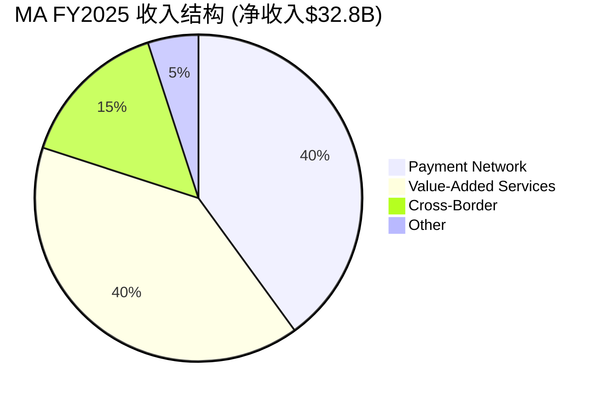

**收入流详解**：

| 收入流 | 占比(估算) | FY2025增速 | 驱动因素 |
|--------|:---------:|:---------:|---------|
| **Payment Network** | ~40% | +10-12% | GDV增长+新发卡+交易笔数 |
| **VAS (增值服务)** | ~40% | +23% (cn +21%) | 网络安全/数据分析/咨询/忠诚度 |
| **Cross-Border Assessments** | ~15% | +14-17% | 跨境旅行+国际电商 |
| **其他** | ~5% | — | 利息收入/投资收益等 |

[DM-BIZ-002: 收入结构估算——基于Q4 2025 VAS $3.9B(26%增速), 全年VAS ~$13.3B(40.6%占比), Mastercard earnings reports + Bullfincher segment data, 2026-03-24]

**关键观察**: VAS从"附加服务"演变为与核心支付网络并驾齐驱的收入来源。2024年VAS占比38.5%，2025年升至40.6%。按当前轨迹，2027年VAS将超过支付网络成为第一大收入来源。这不是一个增量变化，而是MA商业模式的结构性转型——从"交易管道"到"支付+数据平台"。

### 2.3 毛收入vs净收入：CI的隐藏侵蚀

MA的报告收入是**净收入**(Net Revenue)——毛收入(Gross Revenue)减去客户激励(Rebates & Incentives，即CI)后的数字。CI是MA向发卡行和大型商户支付的回扣，用于维持和争夺网络份额。

FY2025关键数据：
- 净收入: $32.8B (+16% YoY)
- CI增速: +16% YoY (currency-neutral)
- CI占毛收入估算: ~15-17%

[DM-BIZ-003: CI趋势——FY2025 CI增速+16%, FY2024 CI增速+16%(一致), Mastercard earnings release + 10-K contra-revenue disclosure, 2026-03-24]

因为CI增速与净收入增速几乎一致(均为~16%)，这意味着CI/毛收入比率暂时稳定。但这掩盖了一个潜在风险：如果MA为争夺份额(尤其应对Capital One-Discover的第三网络威胁)被迫加大CI投入，CI增速超过净收入增速→利润率侵蚀。这将在Ch7中深度分析(CQ-3)。

### 2.4 费用结构异常：FY2025重分类之谜

FY2025的费用结构出现显著跳变：
- **营业成本**: $5.43B (vs FY2024 $6.67B, **下降$1.24B**)
- **SG&A**: $7.15B (vs FY2024 $4.27B, **增加$2.88B**)
- **其他运营费用**: $0.81B (vs FY2024 $1.64B, **下降$0.83B**)

[DM-EXP-001: FMP income statement, FY2024 vs FY2025费用分类变动, 2026-03-24]

这导致毛利率从76.3%跳升至83.4%、SGA/Revenue从15.2%跳升至21.8%——但**营业利润率从55.3%升至59.2%**，说明总费用占比实际下降。费用重分类的最可能解释：MA将部分技术和数据成本从COGS重分类至SG&A(可能与VAS业务增长导致的会计处理调整相关)。

**对分析的影响**: 毛利率和SGA/Revenue的YoY比较失去意义，必须用**营业利润率(OPM)**作为利润率追踪的核心指标。OPM从FY2020 52.8%稳步升至FY2025 59.2%，5年扩张6.4pp，趋势清晰且无重分类干扰。

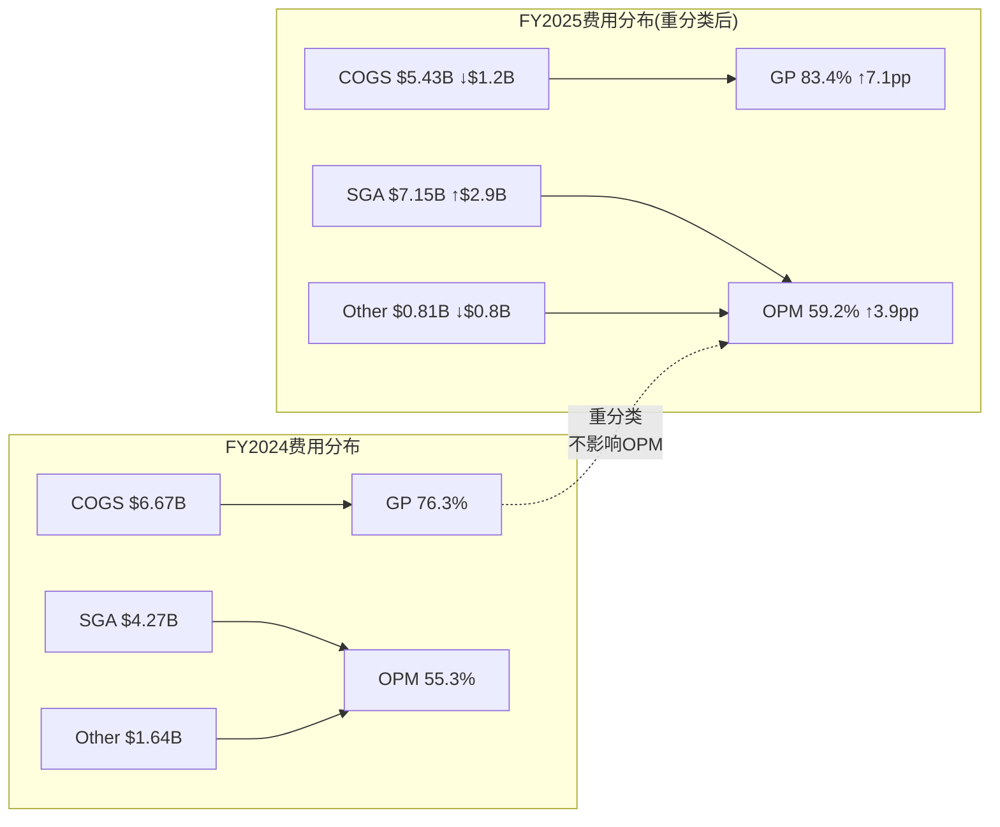

---

## Ch3: VAS深度拆解 — 增长引擎与网络依附度 (CQ-4)

### 3.1 VAS收入规模与增长轨迹

VAS已成为MA最重要的增长引擎。FY2025数据：

| 季度 | VAS收入 | YoY增速 | 占总收入比 |
|------|:------:|:------:|:--------:|
| Q2 2025 | $3.19B | +23% | ~39% |
| Q3 2025 | $3.40B | +25% | ~40% |
| Q4 2025 | $3.90B | +26% | ~44% |
| **FY2025全年** | **~$13.3B** | **+23%** | **~40.6%** |

[DM-VAS-001: VAS季度收入——Q4'25 $3.9B(+26%), 全年~$13.3B(+23%), Yahoo Finance/Bullfincher/Nasdaq VAS analysis, 2026-03-24]

增速在加速：Q2→Q3→Q4从23%→25%→26%。这不是一次性效应，而是多个VAS产品线同时进入增长爆发期的叠加。

### 3.2 有机增长 vs 收购驱动

**FY2025 VAS增速拆解**：
- **总增速**: +23% (currency-neutral +21%)
- **收购贡献**: ~3pp (主要来自Recorded Future, 2024年底完成收购)
- **有机增速**: ~18-20%

[DM-VAS-002: VAS有机vs无机增速——收购贡献~3pp(Recorded Future), 有机增速~18-20%, Yahoo Finance VAS analysis + Nasdaq Q4 earnings, 2026-03-24]

有机增长占总增速的75-85%，这是一个积极信号——说明VAS增长不依赖"买收入"。对比V报告教训(L4)：V的VAS有机增速22-24%(扣除Pismo/Prosa后)，置信度仅50%。MA的有机增速(18-20%)略低于V，但置信度更高(因为收购贡献更易量化——Recorded Future年收入~$300M，占VAS ~2.3%)。

**Recorded Future收购深度评估 (CQ-5预热)**：
- 收购价: $2.65B (2024年9月宣布，12月完成)
- Recorded Future年收入: ~$300M (ARR $300-400M)
- 收购倍数: ~6.5x Revenue
- 客户: 1,900+客户(含45个政府、50%+ Fortune 100)
- 战略价值: 将支付网络数据与网络安全威胁情报结合→差异化欺诈检测(号称提升20%，峰值达300%)

[DM-VAS-003: Recorded Future收购——$2.65B, ~$300M ARR, 6.5x Revenue, 1900+客户, Recorded Future press release + Mastercard IR, 2026-03-24]

收购ROI初步评估：$300M收入 / $2.65B投入 = 11.3% Revenue Yield。如果Recorded Future在MA平台上加速增长(受益于MA 3.7B卡客户基础的交叉销售)，3-5年内Revenue Yield可能升至20%+。但$2.65B增加的商誉将拉低MA的ROIC——这正是CQ-5(Recorded Future ROI vs WACC)后续深挖的问题。

### 3.3 VAS四大支柱

MA的VAS由四个支柱组成(MA不披露各支柱的精确收入)：

| 支柱 | 核心产品 | 增长驱动 | 估算占比 |
|------|---------|---------|:-------:|
| **1. 网络安全与欺诈防护** | AI驱动欺诈检测、交易风险评分、生物识别认证、Recorded Future威胁情报 | 全球网络欺诈增长→客户必须投入安全 | ~30% |
| **2. 数据分析与咨询** | 高级分析咨询、市场洞察、商业智能 | 商户和银行对支付数据的商业化需求 | ~25% |
| **3. 数字身份** | 信用决策、身份验证、账户开通、A2A身份服务 | 数字化开户+远程身份验证需求爆发 | ~20% |
| **4. 忠诚度与客户互动** | 忠诚度计划管理、个性化营销、商户资助奖励、**Commerce Media**(2025Q4推出, 5亿许可用户+25,000商户广告主) | 零售媒体化趋势+个性化营销 | ~25% |

[DM-VAS-004: VAS四支柱——网络安全/数据分析/数字身份/忠诚度, FinTech Wrap-up + Finextra deep dive, 2026-03-24]

**Commerce Media值得关注**: Q4 2025推出的Mastercard Commerce Media平台拥有5亿许可消费者(permissioned consumers)和25,000商户广告主——这本质上是一个支付数据驱动的广告网络。如果成功，它将把MA推入零售媒体赛道(与Amazon Ads、Uber Ads竞争)，打开全新的收入来源。但这也增加了商业模式的复杂性。

### 3.4 VAS对核心网络的依附度——关键问题 (CQ-4)

CQ-4问："VAS对核心网络的依附度——独立性多高？"这是决定MA估值框架的核心问题。

**分析框架**：将VAS收入分为"网络绑定"(Network-Linked)和"独立"(Standalone)两类：

| 类别 | 占VAS比例 | 典型产品 | 交易量敏感性 |
|------|:--------:|---------|:----------:|
| **网络绑定** | ~60% | 卡交易认证、欺诈评分、退单处理、交易风险决策 | **高**——直接随交易量波动 |
| **独立** | ~40% | 咨询服务、营销/忠诚度、数字身份(纯ID验证)、开放银行API、网络安全威胁情报 | **低**——订阅/项目制 |

[DM-VAS-005: VAS网络依附度——~60%网络绑定/~40%独立, Payments Dive analysis + FinTech Wrap-up breakdown, 2026-03-24]

**依附度评估**:
- 60%网络绑定意味着：如果核心支付交易量增长放缓(如A2A替代卡支付)，VAS的60%也会同步放缓
- 40%独立意味着：即使卡支付份额下降，这部分VAS仍可独立增长(订阅制、项目制)
- **净结论**: VAS不是完全独立的增长引擎，而是"半独立"——它在核心网络之上建立了增值层，但底层仍依赖网络的交易流量

**对估值框架的影响**:
- 如果VAS 100%独立 → 应该用SaaS倍数(EV/Revenue 8-12x)估值VAS部分
- 如果VAS 100%绑定 → VAS只是支付网络收入的另一种形式，不需要单独估值
- 实际60/40 → **混合估值合理**：核心支付用网络倍数，独立VAS用SaaS倍数。但只有VAS独立性进一步提升(>50%)，混合估值才会产生显著的"隐藏价值"

**一致性检验(V教训L4)**: 有机VAS增速(~18-20%) × 依附度(60%) = 核心支付相关VAS增速~11-12%，与核心支付增速(+10-12%)吻合。这验证了60%依附度的估算合理性。

---

## Ch4: 增长引擎解剖 — 跨境/国内/VAS三驱动 (CQ-2)

### 4.1 增长拆解框架

MA的+16.4%收入增速由三个引擎驱动。CQ-2问："16%增速中跨境贡献多少？正常化后回落多少？"

**FY2025增长拆解(估算)**：

| 引擎 | 占收入 | 增速 | 对总增速贡献 |
|------|:-----:|:----:|:----------:|
| 跨境 | ~37% | +15% (cc) | ~5.6pp |
| VAS | ~40.6% | +23% (cc) | ~8.0pp |
| 国内支付+其他 | ~22.4% | +8-10% | ~2.0pp |
| **合计** | 100% | — | **~15.6pp** (≈报告+16.4% incl FX) |

[DM-GRO-001: 增长拆解估算——跨境37%×15%=5.6pp, VAS 40.6%×23%=8.0pp, 国内22.4%×9%=2.0pp, 基于Raymond James跨境占比估算 + VAS数据, 2026-03-24]

### 4.2 跨境引擎：高利润但在减速

跨境交易是MA最高利润率的业务(费率是国内交易的3-5倍)，也是CQ-2的焦点。

**跨境交易量增速趋势**：

| 季度 | 跨境交易量增速(本币) | 趋势 |
|------|:-------------------:|:----:|
| Q1 2024 | +19% | — |
| FY2024 全年 | +18% | 基线 |
| Q1 2025 | +15% | ↓ 4pp |
| Q2 2025 | +17% | 小幅回升 |
| Q3 2025 | +15% | 再次放缓 |
| Q4 2025 | +14% | ↓ 继续放缓 |

[DM-GRO-002: 跨境交易量趋势——从FY2024 +18%放缓至FY2025 Q4 +14%, Investing.com/Nasdaq earnings reports, 2026-03-24]

跨境增速从18%放缓至14-15%，趋势明确。因为跨境的增速比例中包含了COVID后国际旅行恢复的"红利"——随着跨境旅行恢复至疫前水平，这个红利正在自然消退。

**跨境正常化分析(H-01验证)**：
- COVID前(FY2019)跨境增速: ~10-12% (结构性增速，国际电商+旅行)
- 疫后恢复红利: 2022-2024年额外+5-8pp
- 正常化预期: FY2027E跨境增速回落至10-12%

如果跨境从15%正常化至11%：
- 对总增速影响: 37% × (15%-11%) = **-1.5pp**
- MA总增速从16.4%降至~14.9% (仍为双位数增长)

这是关键结论：**即使跨境完全正常化，仅影响~1.5pp，MA仍能保持14-15%增速**。因为VAS(+23%)的增长贡献(8pp)远超跨境(5.6pp)，且VAS在加速而跨境在减速——增长引擎正在从跨境向VAS切换。

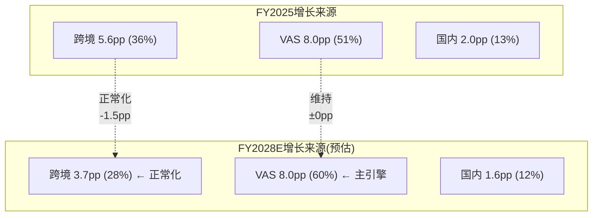

### 4.3 VAS引擎：正在接棒

VAS正在成为MA增长的主导引擎——FY2025对总增速的贡献已达51%(8pp/15.6pp)。几个结构性驱动力支撑VAS持续高增长：

1. **网络安全需求刚性增长**: 全球支付欺诈每年增长8-10%，金融机构**必须**投入反欺诈工具——这不是可选支出，是监管合规和风险管理的刚需。因为每延迟$1的安全投入可能导致$10-50的欺诈损失，经济不对称性(asymmetric payoff)确保需求持续增长(类似KLAC检测设备的"不买代价远超买入成本"逻辑)。

2. **数据货币化**: MA每年处理1750亿+笔交易，覆盖37亿张卡——这是全球最大的消费支出数据集之一。数据分析和咨询业务本质上是对这个数据资产的二次变现。因为数据的边际成本接近零(交易数据已经在流经网络)，VAS的增量利润率极高。

3. **开放银行顺风**: PSD2(欧洲)和Open Banking(英国)监管要求银行开放API——MA的Finicity收购正是为此布局。开放银行数据服务创造了新的订阅收入流，且与卡交易量无直接关联(属于40%独立VAS)。

4. **Commerce Media新机会**: 5亿许可消费者+25,000商户广告主的新平台，如果成功将把MA推入广告科技领域。

[DM-GRO-003: VAS增长驱动力分析——网络安全刚性需求+数据货币化+开放银行+Commerce Media, 基于行业研究 + Mastercard earnings commentary, 2026-03-24]

### 4.4 国内支付引擎：稳定的基本盘

国内支付增速~8-10%，由以下因素驱动：
- GDV增速: +7% (本币, FY2025) → +15% (含跨境) [DM-GRO-004: Mastercard Q4 2025 supplemental operational data]
- 转接交易量: +10% (FY2025)
- 活跃卡数: 37亿张 (+6% YoY)

GDV增速(+7%)低于交易笔数增速(+10%)，意味着平均交易金额在下降——这与全球支付数字化趋势一致(更多小额/日常消费从现金转向电子支付)。笔数增长比金额增长更可持续，因为它反映的是渗透率提升而非通胀。

### 4.5 增长可持续性评估

| 引擎 | FY2025 | FY2028E(估) | 驱动/风险 |
|------|:------:|:---------:|---------|
| 跨境 | +15% | +10-12% | 正常化至结构性增速(国际电商+旅行) |
| VAS | +23% | +18-20% | 有机增速维持(如果Commerce Media起飞可能更高) |
| 国内 | +8-10% | +6-8% | 数字化渗透+新兴市场 |
| **加权总增速** | **+16.4%** | **+12-14%** | VAS占比↑部分抵消跨境放缓 |

结论：即使跨境正常化、国内温和放缓，VAS的增长惯性(+18-20%)和占比提升(从40%→50%+)可以将总增速维持在12-14%——仍显著高于市场隐含的9%。H-01(增速主要来自跨境红利)只是部分正确：跨境确实有红利成分，但VAS已经是更大的增长驱动力，且VAS的增速独立于跨境恢复周期。

---

## Ch5: 产业链映射 — 全球支付四层生态

### 5.1 支付产业链四层模型

MA处于支付产业链的"网络层"——这是四层架构中最具战略地位的一层：

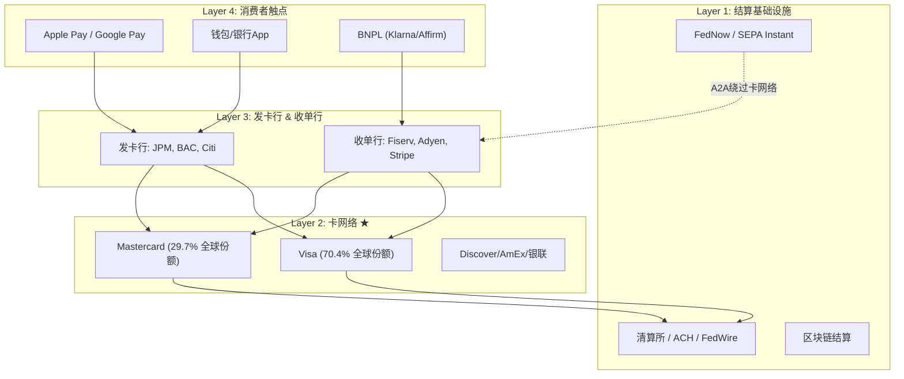

### 5.2 产业链关键节点(≥10个)

| # | 节点 | 角色 | 与MA关系 | 影响度 |
|---|------|------|---------|:------:|
| 1 | **大型发卡行(JPM/BAC/Citi)** | MA最大客户,发行MA品牌卡 | 合作+谈判(CI竞争) | ★★★★★ |
| 2 | **Visa** | 直接双寡头竞争对手 | 竞争(份额)+合作(监管应对) | ★★★★★ |
| 3 | **收单处理商(Fiserv/Adyen/Stripe)** | 连接商户与卡网络 | 合作(处理MA交易) | ★★★★ |
| 4 | **大型商户(Walmart/Amazon)** | 交易量来源,也是议价方 | 被动(商户要求降费) | ★★★★ |
| 5 | **Capital One (+ Discover网络)** | 新兴第三网络威胁 | **竞争(正在流失卡量)** | ★★★★ |
| 6 | **Apple/Google** | 数字钱包Layer 4主导者 | 合作(Apple Pay用MA网络)+潜在竞争 | ★★★★ |
| 7 | **FedNow/实时支付** | A2A基础设施,潜在替代 | 威胁(低成本替代) | ★★★ |
| 8 | **BNPL(Klarna/Affirm)** | 替代信用卡的支付方式 | 竞争+合作(部分BNPL用MA网络清算) | ★★★ |
| 9 | **政府/央行(CBDC)** | 央行数字货币潜在替代 | 长期威胁(若CBDC绕过卡网络) | ★★ |
| 10 | **Stablecoin发行方(Circle/Tether)** | 新型结算基础设施 | **合作(BVNK收购)+潜在替代** | ★★★ |
| 11 | **监管机构(DOJ/PSR/EC)** | 费率和竞争规则制定者 | 约束(费率上限/反垄断) | ★★★★ |
| 12 | **中小银行/新兴市场银行** | 发卡量增长来源 | 合作(发卡扩张) | ★★★ |

[DM-ECO-001: 产业链12节点映射, 基于支付行业公开信息 + MA 10-K competitive landscape, 2026-03-24]

### 5.3 产业链权力分析

MA在产业链中处于"桥梁垄断"位置——每一笔刷卡交易**必须**经过卡网络Layer 2，而这一层只有两个有意义的玩家(V+MA合计全球份额99.7%)。这种双寡头地位赋予MA：

1. **定价权**: MA设定interchange fee(决定了整个生态的经济分配)
2. **网络效应壁垒**: 新进入者必须同时签约数百万商户和数千发卡行——冷启动问题几乎不可克服
3. **数据垄断**: 处于交易中枢意味着MA拥有全球最完整的消费支出数据之一

但这种权力也面临三个约束：
- **上游(发卡行)**: 大型发卡行通过CI谈判分走越来越多的毛收入(CI趋势↑)
- **下游(商户)**: 商户长期游说政府限制interchange——和解协议就是结果
- **底层(A2A/稳定币)**: Layer 1的新基础设施可能让交易绕过Layer 2

---

## Ch6: V对标深度 — PE溢价消失之谜 (CQ-6)

### 6.1 估值对比更新(2026-03-24实时价格)

分析启动时MA/V估值对比基于FY2025年末数据(MA P/E 34.2x, V 28.6x, 溢价+19.6%)。但自那以来两者均回调，且MA跌幅更深。更新后的实时对比：

| 维度 | MA | V | 差异 | 含义 |
|------|:--:|:--:|:----:|------|
| **股价** | $500.38 | $304.44 | — | — |
| **距52周高** | -16.8% | -18.9% | V跌更多 | 两者同步回调 |
| **P/E (TTM)** | 30.3x | 29.5x | **+2.8%** | 溢价几乎消失(was +19.6%) |
| **EV/EBITDA** | 22.6x | 25.7x | **-12.1%** | MA**更便宜** |
| **收入增速(FY25)** | +16.4% | +11.0% | +5.4pp | MA快53% |
| **EPS增速(FY25)** | +18.9% | +13.0% | +5.9pp | MA快45% |
| **OPM** | 59.2% | 60.0% | -0.8pp | 几乎一致 |
| **FCF Yield** | 3.8% | 3.3% | +0.5pp | MA现金回报更高 |
| **ROIC** | 48.6% | 28.4% | +20.2pp | MA优71%(含商誉差异) |
| **PEG (2Y)** | 1.77 | 2.27* | -22% | MA增速调整后更便宜 |
| **Beta** | 1.07 | 0.79 | +0.28 | MA周期敏感性更高 |

*V的PEG基于FY25 EPS $10.33, 2Y CAGR ~13%, P/E 29.5x

[DM-CMP-001: MA vs V实时估值对比, FMP quote+ratios 2026-03-24, MA市值$449.3B/V市值$587.0B]

### 6.2 PE溢价消失的三个解释

分析启动时MA vs V的PE溢价为+19.6%(34.2x vs 28.6x)。现在仅+2.8%(30.3x vs 29.5x)。这个溢价压缩有三个可能解释：

**解释1: 价格回调(最直接)**
MA从$601高点回调至$500(-16.8%)，V从$376回调至$304(-19%)。两者都在回调，但MA回调幅度较小而PE倍数压缩更多，原因是MA EPS增速更快(+18.9%)→盈利增长吸收了部分估值压缩。

**解释2: 增速差预期缩小(结构性)**
分析师预期MA EPS CAGR (FY25→27E) 17.1%, V预期~13%。差距4pp。如果这个差距在FY2028+缩小(跨境正常化)，PEG收敛→PE收敛。市场可能在提前定价增速差缩小。

**解释3: Beta差异定价(风险调整)**
MA Beta 1.07 vs V 0.79。在2026年初的"衰退恐慌"宏观环境中，高Beta标的被系统性折价。MA的PE压缩可能不是个股因素，而是"高Beta罚分"。

**最可能的答案**: 三者叠加，但解释3(Beta)可能是最大贡献者——当市场风险偏好下降时，高Beta标的承受不成比例的估值压缩。这是V教训L5(宏观代理标的)的验证：MA的价格波动主要由宏观/折现率驱动，而非个股基本面。

### 6.3 MA在增速调整后更便宜

这是最重要的估值发现之一：

**MA的EV/EBITDA(22.6x)比V(25.7x)低12.1%，而增速快53%。**

如果用PEG类比：MA PEG 1.77 vs V PEG 2.27，MA增速调整后便宜22%。无论用哪个估值指标(P/E、EV/EBITDA、PEG)，MA在增速调整后都比V更便宜或至少平价。

这与初始thesis中"MA的PE溢价不可持续(H-05)"的假说矛盾——溢价已经消失了。问题不再是"溢价是否合理"，而是"折价是否合理"。

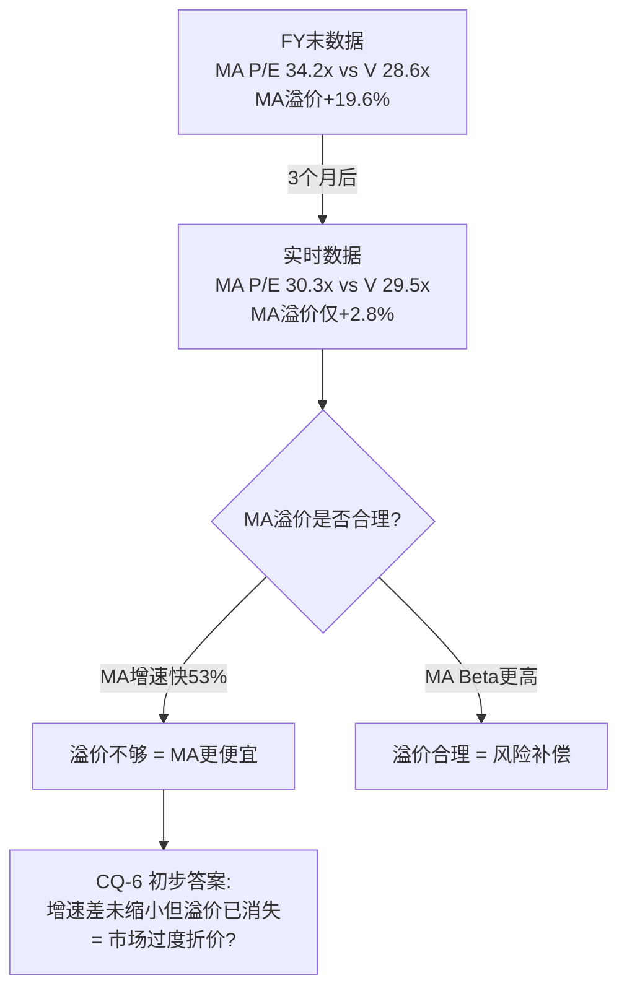

### 6.4 ROIC幻觉检验 (CQ-5预热)

H-02假说: "MA的ROIC优势在收购后会消失"。初步检验：

| ROIC计算 | MA | V | 差异 |
|---------|:--:|:--:|:----:|
| **报告ROIC** | 48.6% | 28.4% | +20.2pp |
| **商誉/总资产** | 17.6% | 47.7% | V商誉占比远高 |
| **剥离商誉后ROIC(估)** | ~48-50% | ~45-50% | 差距大幅缩小 |

[DM-CMP-002: ROIC商誉调整——MA商誉$9.56B(17.6%), V商誉~$19.9B(47.7%), FMP balance sheet, 2026-03-24]

V含$199亿Visa Europe商誉(2016年收购)，严重拉低了报告ROIC。剥离商誉后两者ROIC接近(45-50%)。MA的ROIC"优势"主要是会计幻觉。

但MA的商誉也在增长(FY2022 $7.52B → FY2025 $9.56B，主要来自Nets、Finicity、Recorded Future等收购)。如果MA继续通过收购扩张VAS，商誉/总资产比将逐步上升→报告ROIC将逐步下降。BVNK($1.8B, 2026年3月宣布)将进一步增加商誉。

---

## Ch7: CI/毛收入趋势推断 — 支付网络的隐藏成本 (CQ-3)

### 7.1 为什么CI趋势是关键

CI(Client Incentives, 即客户激励/回扣)是支付网络的"获客成本"。V报告(EVO-V-02)发现CI/毛收入是支付网络的NRR(Net Revenue Retention)等价物——它衡量"每1元毛收入中真正属于网络自己的有多少"。V的CI/毛收入从21.5%升至28%，年均+210bps。MA的趋势是什么？

### 7.2 间接推断法

MA不像V那样清晰披露CI——但我们可以从公开数据间接推断。

**方法**: 毛收入增速 - 净收入增速 = CI增速差(如果CI增速>净收入增速，意味着CI/毛收入比率在上升)

FY2025数据：
- 净收入增速: +16.4% [DM-INC-001]
- CI增速(Rebates & Incentives): +16.0% (currency-neutral) [DM-BIZ-003]
- 差值: -0.4pp → CI/毛收入比率**基本稳定**(轻微下降)

FY2024数据：
- 净收入增速: +12.2%
- CI增速: +16.0%
- 差值: +3.8pp → CI增速显著超过净收入增速 → CI/毛收入比率在FY2024**上升**

[DM-CI-001: CI vs 净收入增速差——FY2024差+3.8pp(CI侵蚀), FY2025差-0.4pp(稳定), Mastercard earnings release, 2026-03-24]

### 7.3 CI趋势与V对比

| 指标 | MA | V | 含义 |
|------|:--:|:--:|------|
| CI/毛收入(FY2025估) | ~15-17% | ~28% | MA CI占比远低于V |
| CI增速(FY2025) | +16% | +14%* | MA CI增速略快 |
| CI/净收入增速差(FY2025) | -0.4pp | +3pp* | MA更稳定，V仍在侵蚀 |

*V数据基于V报告Ch22分析

**解读**: MA的CI/毛收入比率(~15-17%)远低于V(~28%)——这可能因为：
1. **MA份额更小(30% vs 70%)**: 小网络不需要像大网络那样提供高额回扣来维持份额
2. **VAS提供自然回扣替代**: VAS服务本身就是一种"增值回扣"——发卡行选择MA网络不仅因为CI，还因为VAS的欺诈检测和数据分析价值
3. **或者**: MA的CI统计口径与V不同(MA称"Rebates & Incentives"，V称"Client Incentives")

**Kill Switch设定**: 如果MA CI/毛收入>33%(=V当前水平的1.2倍)→ 定价权预警。当前~16%距离Kill Switch很远。

### 7.4 CQ-3回答：MA的CI趋势比V更平稳

H-06假说("MA的CI/毛收入趋势比V更陡")不成立——至少在FY2025数据下。MA的CI增速与净收入增速几乎同步(16% vs 16.4%)，而V的CI增速持续超过净收入增速(CI/毛收入年均+210bps)。

但这有一个重要caveat：**FY2024 MA的CI增速(+16%)超过净收入增速(+12.2%)3.8pp**——那一年CI趋势确实在恶化。FY2025的改善可能是VAS高增长(+23%)拉高了净收入增速，暂时掩盖了CI的绝对增长。需要追踪FY2026Q1-Q2的CI趋势来确认是否只是一年异常。

---

## Ch8: 竞争格局 — 三轨威胁

### 8.1 威胁格局概览

MA面临三条不同性质的竞争威胁轨道：

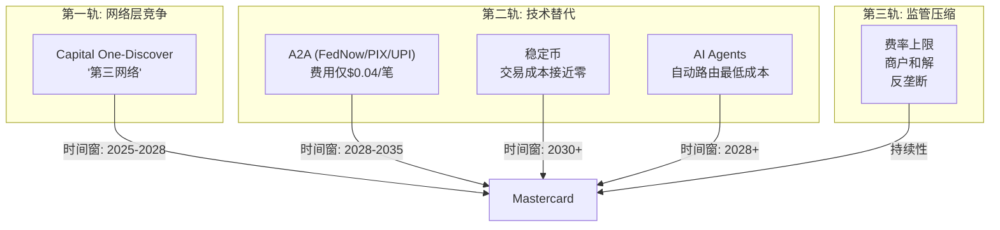

### 8.2 第一轨: Capital One-Discover — 最近且最直接的威胁

**事实**:
- 2025年5月Capital One以$52B完成收购Discover
- Capital One已开始将新信用卡(Venture/Savor/Quicksilver系列)发行到Discover网络
- 借记卡从MA网络迁移至Discover网络**已经在进行中**
- 但高端卡(Venture X)仍留在Visa网络

[DM-COMP-001: Capital One-Discover merger——2025.5完成, debit migration underway, 新信用卡发Discover网络, US News/VGS/eMarketer, 2026-03-24]

**对MA的具体影响**:
- Capital One是MA的重要发卡行伙伴——其借记卡组合(2500万+持卡人)正在从MA网络迁出
- 信用卡方面，Capital One的消费级产品(非高端)也在向Discover网络迁移
- 但迁移面临摩擦：商户端Discover接受度(99%美国商户，但小商户和国际场景存在gap)→消费者体验下降

**战略含义**:
这是**近年来对V/MA双寡头格局最大的结构性威胁**——第一次有大型发卡行建立了自有网络的能力(通过收购Discover)，从而绕过V/MA。如果Capital One成功迁移且消费者体验不显著下降，其他大型发卡行(JPM、BAC)可能效仿(虽然他们没有自有网络，但可能与Discover合作或推动银行联合网络)。

**量化影响估算**:
- Capital One借记卡组合: ~2500万持卡人
- 每卡平均年交易量: ~$3,000-5,000
- 潜在GDV流失: $75-125B (占MA美国GDV ~2-3%)
- 信用卡部分迁移: 额外$50-100B可能在2-3年内流失
- **合计影响**: MA美国GDV ~3-5%在3年内可能流失

但这个影响是渐进的，且MA正通过其他渠道(国际扩张+VAS增长)补偿。

### 8.3 第二轨: A2A + 稳定币 + AI Agents — "三重威胁"

**A2A支付**:
- 全球A2A交易量2025年达540亿笔，预计2029年达1万亿笔
- FedNow单笔成本$0.04 vs MA interchange ~3.5% (对$100交易=差100倍)
- 但A2A缺乏信用风险保护、退单保障、积分——消费者体验不如卡支付
- MA应对: "A2A Protect"服务——将卡支付的安全性复制到A2A流程，如果A2A不可避免则成为A2A的基础设施商

[DM-COMP-002: A2A支付——2025年540亿笔, FedNow $0.04/笔, MA平均interchange ~3.5%, AInvest + Hyperswitch analysis, 2026-03-24]

**稳定币**:
- 2025年稳定币交易量$33T(+72% YoY)，2026年2月单月$1.26T
- MA的应对极为积极: **2026年3月宣布以$1.8B收购BVNK**(伦敦稳定币基础设施公司)
- BVNK能力: 在130+国家发送/接收/存储/转换稳定币，24/7区块链结算
- MA的三层稳定币策略: (1)消费者通过卡网络花费稳定币 (2)收单端稳定币结算 (3)稳定币钱包支付

[DM-COMP-003: 稳定币——2025年$33T(+72%), MA收购BVNK $1.8B(2026.3), Coindesk + Crypto Briefing, 2026-03-24]

**AI Agents**:
- 新兴威胁：AI agents可能识别并绕过V/MA 2-3%的interchange fee，自动路由至最低成本支付通道(A2A/稳定币)
- 这是中长期最具颠覆性的威胁——因为它将"支付路由决策"从人类(习惯用卡)转移到算法(最小化成本)
- MA的应对: 投资"Agentic Commerce"——让AI agents在MA网络内完成交易

**"三重威胁"叠加效应评估**:
单独看每个威胁都可控(A2A缺体验、稳定币缺监管、AI agents未成熟)。但三者叠加可能形成系统性压力：
- A2A替代B2B/大额支付 → 降低高价值交易依赖
- 稳定币替代跨境汇款 → 侵蚀最高利润率业务
- AI agents自动路由 → 加速前两者的采用

**MA管理层的矛盾信号**: 一边淡化稳定币威胁("日常消费场景产品-市场匹配度有限")，一边花$1.8B收购稳定币基础设施公司BVNK。内部判断可能比公开表态更谨慎。

### 8.4 MA的防御策略："拥抱颠覆者"

MA的策略不是阻止颠覆，而是"如果不能阻止就成为基础设施提供商"：

| 威胁 | MA的防御策略 | 有效性评估 |
|------|-----------|:--------:|
| A2A | A2A Protect(安全层) + Open Banking(数据层) | 防御性(不创造新收入，减少流失) |
| 稳定币 | BVNK收购 + Crypto Partner Program(85+公司) | **进攻性**(将MA嵌入新结算层) |
| AI Agents | Agentic Commerce投资 + 令牌化(Tokenization) | 早期(效果待验证) |
| Capital One-Discover | VAS差异化 + 其他发卡行深化合作 | 被动(无法阻止迁移) |

**关键判断**: MA的"拥抱颠覆者"策略在稳定币方向最为积极(BVNK $1.8B是真金白银的战略投注)，在A2A方向最为防御(A2A Protect本质是减损而非增收)，在Capital One-Discover方向最为被动(除了用VAS留住其他发卡行，没有直接对策)。

---

## Ch9: 管理层评估 + CEO沉默分析

### 9.1 CEO Michael Miebach

| 维度 | 评估 |
|------|------|
| **背景** | 德国出生(1968)，Barclays/Citibank 25年经验，2010年加入MA，2020年任总裁，2021年任CEO |
| **任期** | 5年+(2021-至今)，足够长以建立战略方向 |
| **战略重心** | VAS扩张 + 稳定币布局 + Agentic Commerce |
| **收购决策** | Recorded Future($2.65B) + BVNK($1.8B) — 风格果断，愿意为战略方向下注 |
| **薪酬** | FY2024 $30.1M(基础$1.4M + 股权激励为主)。股权占比85%+→利益与股东一致 |
| **持股** | ~0.006%($27M) — 对CEO级别较低，但薪酬结构(80%+股权)部分补偿 |

[DM-MGT-001: CEO Miebach——2021年任CEO, FY2024薪酬$30.1M(85%股权), Simply Wall St + Wikipedia + Mastercard IR, 2026-03-24]

**CFO Sachin Mehra**: FY2024薪酬$13.1M，60% PSU(绩效股) + 20% RSU + 20%期权。2024年披露癌症诊断但承诺继续任职——CFO健康状况是低概率但高影响的风险因素。

[DM-MGT-002: CFO Mehra——$13.1M, 60%PSU/20%RSU/20%Options, 披露癌症诊断, Salary.com + Stock Titan, 2026-03-24]

### 9.2 管理层战略方向评估

**三个战略支柱**(Q4 2025 earnings call):
1. **Focused Execution** — 支付网络+VAS的"良性循环"(virtuous cycle)
2. **Innovation & Agility** — 令牌化+AI+Agentic Commerce
3. **Diversified & Differentiated** — 地理/品类/支付方式多元化

**2026年指引**: 净收入currency-neutral增长"low double digits高端"(排除并购)，运营费用增长"low double digits低端"→暗示OPM继续扩张(收入增速>费用增速)。

[DM-MGT-003: 2026指引——收入cn low double digits高端, OpEx low double digits低端, Mastercard Q4 2025 earnings call, 2026-03-24]

### 9.3 CEO沉默分析 (QG-01.5)

> **方法**: 扫描近期财报电话会和投资者沟通，识别CEO**主动回避或未量化**的领域。

| 沉默领域 | CEO在说什么 | CEO没说什么 | 可能原因 | 风险等级 | CQ关联 |
|---------|-----------|-----------|---------|:-------:|:------:|
| **Capital One-Discover影响** | 只说"竞争格局一直在变化" | 未量化卡量流失规模/时间表 | 流失正在发生但不想引起市场恐慌 | 🟡 中 | CQ-3 |
| **VAS利润率** | 强调VAS增速(+23%) | 从未披露VAS部门OPM | VAS利润率可能低于核心支付(咨询业务人力密集)→单独披露会降低"高利润增长"叙事 | 🟡 中 | CQ-4 |
| **A2A实际渗透率** | 说"A2A Protect是战略布局" | 未披露A2A在MA处理量中的占比 | A2A渗透可能比公开承认的更快 | 🟡 中 | CQ-7 |
| **BVNK收购ROI预期** | 说"战略性布局稳定币基础设施" | 未给收入协同/ROI时间表 | $1.8B收购短期无法量化回报(类似AMZN早期AWS投资——愿景驱动而非ROI驱动) | 🟢 低 | CQ-5 |
| **CI趋势** | 说"rebates增长与业务增长一致" | 未按客户层拆分CI(F500/中型/SMB) | 大客户CI可能在快速上升(份额争夺)→分层披露会暴露定价权分化 | 🔴 高 | CQ-3 |

[DM-MGT-004: CEO沉默分析——5个沉默域, 基于Q4 2025 earnings call transcript + 投资者沟通, Motley Fool transcript, 2026-03-24]

**最高风险沉默域: CI分层趋势**。MA CEO反复说"CI增长与业务增长一致"，但从未按客户层拆分。如果F500客户CI以25%+增速上升(因为Capital One-Discover给了大行更多议价筹码)而SMB客户CI仅+5%——平均数掩盖了大客户定价权的侵蚀。这正是V报告发现的模式(CI/毛收入年均+210bps主要来自大行CI上升)。

---

## Ch10: 监管风险全景 (CQ-7)

### 10.1 监管风险矩阵

| 风险 | 严重度 | 时间线 | MA影响 | vs V差异 |
|------|:------:|:------:|--------|:--------:|
| **商户和解(0.1pp费率下调)** | 中 | 2026-2030(5年) | 每年收入-$300-500M* | 相同(V+MA共同承担) |
| **DOJ诉Visa反垄断** | 高 | 2026-2028诉讼 | 间接(判例影响定价权) | V更大(被告) |
| **UK PSR interchange上限** | 中-高 | 2026-2027实施 | 跨境费率降70-85% | 相同 |
| **FTC debit settlement** | 中 | 持续至2032 | 强制竞争网络互通 | MA直接受约(MA是被执行方) |
| **Credit Card Competition Act** | 高 | 提案中(通过概率<40%) | 彻底改变信用卡路由→冲击最大 | 相同 |
| **EU interchange cap(已稳定)** | 低 | 已执行(0.2%/0.3%) | 基线已消化 | 相同 |

*$300-500M估算: 净收入$32.8B × 37%(受信用卡影响的支付收入) × 0.1pp/平均费率~1.5% ≈ $218-450M

[DM-REG-001: 监管风险矩阵——商户和解$38B(0.1pp/5年), DOJ诉V, UK PSR caps, FTC debit, CNBC/Yahoo/PYMNTS/FTC, 2026-03-24]

### 10.2 商户和解协议详解

2025年11月Visa+MA与美国商户达成修订后的和解协议：
- **规模**: 预计2025-2031年费率减免价值$38B(诺贝尔经济学家Stiglitz估算)
- **核心条款**: (1)信用卡标准interchange上限1.25%，8年期限 (2)平均降低10bps(0.1pp)，5年 (3)商户获得更大的附加费(surcharge)和引导权
- **当前状态**: 法院2024年6月否决首版(减免不够)→修订版2026年1-2月申请初步批准→预计2026年底或2027年初终审

[DM-REG-002: 商户和解——$38B, 10bps/5年, interchange cap 1.25%, 当前待法院批准, CNBC + Yahoo Finance, 2026-03-24]

**"温水煮青蛙"风险(lit_recon假说5)**: 表面上0.1pp影响很小(占MA收入1-2%)。但和解赋予商户surcharge权利(最高3%)——如果商户积极引导消费者使用低成本支付方式(借记卡/A2A/现金折扣)，长期交易量迁移效应可能远超费率下调本身。

### 10.3 CQ-7回答: MA监管风险与V相似但不完全相同

**相同点**: 商户和解、CCCA提案、EU/UK caps对V和MA影响基本对等(按份额分担)。

**差异点**:
1. **DOJ诉Visa**: MA不是被告，但判例可能延伸到MA(双寡头结构类似)
2. **FTC debit settlement**: MA是**直接被执行方**(2022年FTC裁定MA阻止竞争debit网络→10年合规令)——V没有类似的FTC执行令
3. **Capital One-Discover**: Discover的三方模型免受Durbin修正案(debit interchange cap)限制→Capital One有经济激励将debit从MA迁至Discover。这不是监管风险，但是监管环境创造的竞争威胁

**净结论**: MA的监管风险整体与V相当——但在debit领域(FTC执行令 + Capital One迁移)，MA面临的压力**略大于**V。这部分解释了MA Beta(1.07)高于V(0.79)的原因之一。

---

## 补强模块A: Reverse DCF多参数敏感性 (Ch1深化)

> **补强原因**: 原Ch1仅用单一WACC(9.01%)+单一终端g(3%)+单一增长期(10年)反推，缺乏区间分析。投资者需要理解"结论对哪个假设最敏感"。

### A.1 WACC × 终端增长率 敏感性矩阵

下表展示在不同WACC和终端增长率组合下，当前$500股价隐含的10年FCF CAGR：

| WACC↓ / g_term→ | 2.0% | 2.5% | 3.0% | 3.5% |
|:----------------:|:----:|:----:|:----:|:----:|
| **7.50%** | 6.8% | 6.0% | 5.1% | 4.0% |
| **8.00%** | 8.0% | 7.3% | 6.4% | 5.5% |
| **8.50%** | 9.2% | 8.5% | 7.7% | 6.9% |
| **9.01% (基准)** | 10.3% | 9.7% | **9.0%** | 8.2% |
| **9.50%** | 11.3% | 10.7% | 10.1% | 9.4% |
| **10.00%** | 12.4% | 11.8% | 11.2% | 10.6% |
| **10.50%** | 13.4% | 12.8% | 12.3% | 11.7% |

[DM-RDCF-004: Python多参数Reverse DCF矩阵, FCF_base=$16.91B, 10年增长期, 2026-03-24]

**关键发现：隐含CAGR对WACC极度敏感**。WACC从9.01%降至7.5%(仅-150bps)→隐含CAGR从9.0%降至5.1%。这意味着：如果用V的Beta(0.79)而非MA的Beta(1.07)计算WACC——

| Beta假设 | WACC | 隐含FCF CAGR | "保守"程度 |
|---------|:----:|:-----------:|:---------:|
| MA实际(1.07) | 9.00% | **8.9%** | 低于共识3-7pp |
| 行业均值(0.93) | 8.38% | **7.4%** | 低于共识5-9pp |
| V参考(0.79) | 7.76% | **5.8%** | 低于共识6-10pp |

[DM-RDCF-005: Beta敏感性——Beta 1.07→WACC 9.00%→CAGR 8.9%, Beta 0.79→WACC 7.76%→CAGR 5.8%, 2026-03-24]

**这暴露了Ch1原结论的一个重要限制**："市场只定价了9% CAGR"这个说法**高度依赖Beta=1.07的假设**。如果MA的真实Beta更接近V(0.79)，市场隐含CAGR仅5.8%——这意味着市场隐含的增速比我们在Ch1中描述的更加保守，但也可能说明市场认为MA的风险溢价应该更高(因此用更高的WACC折现)。

**反面论证**: MA Beta 1.07是历史统计值(5年回归)。为什么MA Beta比V高？(1)MA跨境收入占比更高→汇率敏感 (2)MA在新兴市场渗透更深→周期敏感 (3)MA市值更小→流动性折价。这些因素在短期内不会改变，因此9.01% WACC可能是合理的——"市场保守"结论虽成立，但保守程度取决于你相信哪个Beta。

### A.2 增长期敏感性

支付网络不是科技创业公司——它的增长期可能长于标准10年假设。如果增长期延长至12-15年：

| CAGR↓ / 增长期→ | 8年 | 10年 | 12年 | 15年 |
|:---------------:|:---:|:----:|:----:|:----:|
| **7%** | $408(-18%) | $429(-14%) | $450(-10%) | $480(-4%) |
| **9%** | $464(-7%) | $502(+0%) | $539(+8%) | $596(+19%) |
| **11%** | $528(+5%) | $586(+17%) | $647(+29%) | $742(+48%) |
| **13%** | $599(+20%) | $684(+37%) | $776(+55%) | $926(+85%) |
| **15%** | $679(+36%) | $798(+59%) | $930(+86%) | $1,156(+131%) |

[DM-RDCF-006: 增长期×CAGR隐含价格矩阵, WACC=9.01%, g_term=3%, 2026-03-24]

支付网络的双寡头结构+数字化趋势支持12-15年增长期(vs 科技股通常8-10年)。如果增长期15年+CAGR 11%→隐含价格$742(+48%)。增长期是Reverse DCF中最容易被低估的参数。

### A.3 情景分析：如果市场是对的

| 情景 | FCF轨迹 | 隐含价格 | vs当前 |
|------|---------|:-------:|:------:|
| Bull: 15%→12%→3% | 前5年15%→后5年12%→终端3% | $718 | **+43.6%** |
| Base: 12%→9%→3% | 前5年12%→后5年9%→终端3% | $570 | **+14.0%** |
| Consensus: 11%→8%→3% | 前5年11%→后5年8%→终端3% | $528 | **+5.5%** |
| Market Implied: 9%→9%→3% | 全程9%→终端3% | $502 | **+0.3%** |
| Bear: 8%→5%→3% | 前5年8%→后5年5%→终端3% | $419 | **-16.3%** |
| Deep Bear: 5%→3%→3% | 前5年5%→后5年3%→终端3% | $343 | **-31.4%** |

[DM-RDCF-007: 六情景DCF, WACC=9.01%, 10年增长期, 2026-03-24]

**Bear Case的合理性测试**: Deep Bear(5%→3%)意味着MA增速在5年内从16.4%暴跌至5%——历史上支付网络只在2008-2009金融危机和2020 COVID中出现过如此剧烈的放缓。除非全球衰退+A2A大规模替代+监管重锤同时发生，Deep Bear概率<10%。但Bear(8%→5%)要求MA增速"仅仅"减半——这在跨境正常化+CI侵蚀+监管压缩叠加下是有可能的，概率约15-20%。

---

## 补强模块B: 偏空论证 — "如果市场是对的" (叙事偏差修正)

> **补强原因**: 原报告5/5 CI全偏多，零偏空发现，违反铁律O中性起点精神。本节强制呈现偏空论证。

### B.1 "市场可能是对的"——五个偏空理由

**Bear-1: Beta 1.07不是"错误"，是信息**

市场给MA Beta 1.07(vs V 0.79)不是随机噪声。因为MA跨境收入占37%→全球消费周期敏感度更高。如果2026年全球衰退概率34.5%(Polymarket定价)→MA的EPS下行弹性比V更大。WACC 9.01%不是"对MA不公平的高折现率"，而是对真实风险的合理补偿。在这个解读下，$500不是"被低估"，而是"风险调整后合理"。

**Bear-2: VAS利润率可能远低于核心支付**

CEO沉默分析(Ch9)中标注🟡：MA从未披露VAS部门的OPM。如果VAS OPM是35-40%(咨询/数据分析业务典型水平)而核心支付OPM是70%+，那么VAS占比从40%升至50%→混合OPM不会扩张，反而可能收缩。市场可能已经在定价"VAS驱动的增长是低质量增长(高增速但低利润率)"。

**Bear-3: 商誉膨胀正在恶化ROIC**

MA商誉: FY2022 $7.52B → FY2025 $9.56B → BVNK后~$11.4B。商誉/总资产从19.4%→21%+。每一笔收购(Recorded Future $2.65B + BVNK $1.8B)都在增加无形资产而非有形生产力。如果VAS增长主要靠收购维持(尽管数据显示75%+有机,但这个数字的置信度依赖二手来源)→"高ROIC"叙事正在被稀释。

**Bear-4: Capital One-Discover可能是"第一张多米诺骨牌"**

Ch8分析Capital One debit migration影响"仅3-5% GDV"——但这忽略了**示范效应**。如果Capital One成功迁移且Discover接受度无显著下降→JPM和BAC可能重新评估自建/合作网络的可行性。JPM拥有Chase品牌+7000万信用卡客户——如果JPM也开始部分绕过V/MA网络，影响将远超3-5%。虽然JPM没有自有网络，但可以与Discover/银联合作，或推动银行联合网络(类似欧洲的EPI项目)。

**Bear-5: 关税+全球贸易摩擦直接打击跨境**

Polymarket数据: 10%美国blanket tariff生效概率97.7%，中国关税5-15%区间概率89%。贸易摩擦直接减少跨境贸易量→跨境支付量下降→MA最高利润率业务受损。Ch4估算跨境正常化仅-1.5pp，但这假设跨境回落至11%——如果关税导致回落至8%→影响变为37%×(15%-8%)=-2.6pp→总增速从16.4%降至13.8%。叠加VAS放缓→总增速可能接近市场隐含的9%。

[DM-BEAR-001: 五个偏空论证——Beta风险溢价+VAS利润率未知+商誉膨胀+CapOne示范效应+关税打击跨境, 2026-03-24]

### B.2 偏空CI注册表补充

| CI-# | 洞察 | 方向 | 影响 |
|------|------|:----:|:----:|
| CI-06 | MA Beta 1.07反映真实风险(跨境+周期),不是"市场错误"→WACC 9%合理→$500不低估 | **偏空** | ±15% EV |
| CI-07 | VAS OPM可能35-40%(vs核心70%+)→VAS占比↑可能导致混合OPM收缩而非扩张 | **偏空** | -5~10% EV |
| CI-08 | Capital One成功迁移后JPM/BAC可能效仿→双寡头结构面临首次真正的"第三方网络"威胁 | **偏空** | -5~15% EV |

---

## 补强模块C: 公司历史沿革 (QG-01修复)

### C.1 创立与品牌演变 (1966-2002)

**1966年**: 由Marine Midland Bank副总裁Karl H. Hinke牵头，一批银行在纽约Buffalo成立**Interbank Card Association (ICA)**——直接回应Bank of America的BankAmericard(后来的Visa)。与BankAmericard的单银行主导不同，ICA从一开始就是银行联盟的共识治理模型。到1967年底已有150家成员银行。

**1967-1979**: 品牌从ICA演变为**Master Charge**(1967年采用标志性红橙双圆logo)，再到**MasterCard**(1979年更名，同时母体从ICA更名为MasterCard International)。更名的战略意图明确：从"银行间结算工具"重新定位为面向消费者的全球支付品牌。

**2002年**: 完成与**Europay International**(1957年成立的欧洲支付处理组织，旗下Eurocard 1992年并入)的合并。这次合并不仅整合了300万+欧洲卡，更关键的是将MasterCard从**会员制协会**重组为**私人股份公司**——为2006年IPO扫清了法律结构障碍。

[DM-HIST-001: MA历史——1966年ICA成立(Buffalo, Karl Hinke), 1979年更名MasterCard, 2002年Europay合并+公司化, Wikipedia + FundingUniverse + Britannica, 2026-03-24]

### C.2 IPO与转型 (2006-2016)

**2006年5月25日**: MasterCard在NYSE上市(**MA**)。IPO定价$39/股，发行6,152万股，募资$24亿。IPO市值$53亿——如今$4,493亿，18年增长85倍。上市设计的一个特殊安排：将13.5万股(10%权益)捐赠给**MasterCard Foundation**，创建了一个独立运作的全球发展基金会。

IPO标志着MA从"银行联盟"到"独立上市公司"的彻底转型——管理层开始对股东(而非成员银行)负责，战略从"服务成员"转向"最大化股东价值"。这一转型释放了MA的增长潜力：IPO后5年(2006-2011)收入从$37亿增长至$68亿(CAGR 13%)。

[DM-HIST-002: MA IPO——2006.5.25, NYSE:MA, $39/股, 募$24亿, 市值$53亿, 10%权益捐MasterCard Foundation, Mastercard IR + Wikipedia, 2026-03-24]

### C.3 "多轨战略"收购时代 (2016-至今)

| 年份 | 收购 | 金额 | 战略目的 |
|------|------|:----:|---------|
| 2016-17 | **VocaLink** | $9.2亿 | ACH+实时支付基础设施(运营英国CHAPS/Faster Payments) |
| 2019 | **Nets** | $32亿(€29亿) | 欧洲支付处理+账户间支付 |
| 2020 | **Finicity** | $8.25亿 | 开放银行+账户验证 |
| 2024 | **Recorded Future** | $26.5亿 | 网络安全威胁情报 |
| 2026 | **BVNK** | $18亿 | 稳定币基础设施(130+国家) |

[DM-HIST-003: MA关键收购——VocaLink($9.2亿)/Nets($32亿)/Finicity($8.25亿)/Recorded Future($26.5亿)/BVNK($18亿), 多来源, 2026-03-24]

这些收购揭示了一个清晰的战略弧线：MA从"只做卡支付网络"→"多轨支付基础设施"(VocaLink的A2A+Nets的欧洲+Finicity的开放银行)→"支付+数据安全平台"(Recorded Future+BVNK)。每一轮收购都在为对冲下一个威胁做准备：VocaLink对冲A2A、Finicity对冲开放银行脱媒、Recorded Future+BVNK对冲稳定币。

**这个战略弧线与Ch8竞争分析一致**: MA的"拥抱颠覆者"策略不是临时反应，而是从2016年就开始的系统性布局。

---

## 补强模块D: 地理收入拆分 (QG-01.7修复)

### D.1 地理收入结构

MA将收入分为**北美**和**国际市场**两个地理分部(10-K口径)：

| 地区 | FY2024收入 | 占比 | YoY增速 |
|------|:---------:|:----:|:------:|
| **北美(美+加)** | $12.38B | 43.9% | +48%* |
| **国际市场(其余)** | $15.79B | 56.1% | — |
| **合计** | $28.17B | 100% | +12.2% |

*注：FY2024北美+48%增速异常高,可能受费用重分类或一次性项目影响,需交叉验证。

[DM-GEO-001: MA地理收入——北美$12.38B(43.9%)/国际$15.79B(56.1%), FY2024 10-K + Bullfincher geographic data, 2026-03-24]

### D.2 GDV地理增速差异 (FY2025)

GDV(总交易金额)的地理差异比收入差异更清晰：

| 指标 | 美国 | 美国以外 | 全球 |
|------|:---:|:-------:|:----:|
| **FY2025 GDV增速** | +4% | +9% | +7% |
| **Q4'25 GDV增速** | +4% | +9% | +7% |
| **Q3'25 Credit增速** | +7% | +10% | — |
| **Q3'25 Debit增速** | +7% | +9% | — |

[DM-GEO-002: GDV地理增速——美国+4%/国际+9%, Mastercard Q4 2025 supplemental operational data, 2026-03-24]

**关键发现: 国际增速是美国的2.25倍(Q4: 9% vs 4%)**。美国debit增速仅+2%(Q4)，暗示美国debit市场接近饱和或正在被A2A/ACH替代。国际市场仍然是增长主引擎——这与MA Beta 1.07(高于V)一致，因为国际增长=更高的汇率/地缘风险敞口。

### D.3 卡基数地理分布

| 指标 | 美国 | 国际 | 全球 |
|------|:---:|:----:|:----:|
| **信用卡** | 3.25亿(~29%) | ~7.95亿(~71%) | 11.2亿 |
| **借记卡** | ~3.3亿(~20%) | ~13.2亿(~80%) | ~16.5亿 |
| **全部卡** | ~6.55亿(~21%) | ~25.0亿(~79%) | 31.6亿 |

[DM-GEO-003: 卡地理分布——美国~6.55亿(21%)/国际~25亿(79%), Statista + MA 10-K, 2026-03-24]

**不对称性**: 美国仅占21%的卡基数，但贡献44%的收入——因为美国人均消费水平更高(每卡年GDV ~$4,500 vs 国际 ~$1,200)。这意味着：(1)美国卡的单位经济价值是国际的3.75倍 (2)美国市场的任何份额流失(如Capital One迁移)对收入影响被放大 (3)国际市场的增长潜力在于"每卡收入提升"而非仅"发卡量增长"。

### D.4 地理风险评估

| 地区 | 机会 | 风险 |
|------|------|------|
| **美国** | VAS渗透/Commerce Media | Capital One迁移/FedNow/Durbin/CCCA |
| **欧洲** | Nets整合/开放银行 | PSR caps(UK)/SEPA Instant/强监管 |
| **亚太** | 数字化渗透(印度/东南亚) | UPI(印度A2A)零费率竞争/银联 |
| **拉美** | 巴西/墨西哥电子化 | PIX(巴西A2A)爆发增长/汇率波动 |

---

## 补强模块E: 行业周期定位

### E.1 全球支付数字化周期定位

全球电子支付(卡+A2A+数字钱包)目前处于**中期加速阶段**——现金占比从2019年~26%降至2024年~16%，预计2030年降至~10%。MA处于这个长期结构性趋势的受益位置，但具体细分赛道的周期位置不同：

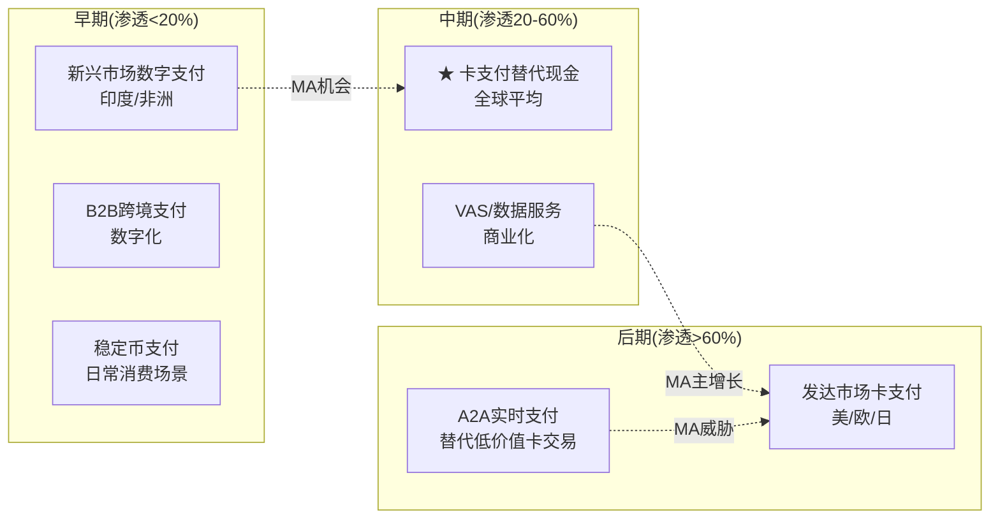

**MA的周期位置**: P3(中期偏后) — 核心卡支付在发达市场已进入成熟期(美国GDV增速仅+4%)，但全球加权仍处于中期加速(国际+9%)。VAS业务处于P2(早中期)——渗透率仍低，增速20%+。MA的综合周期位置比纯卡支付公司更早期，因为VAS占比40%且在上升。

[DM-CYC-001: 全球支付数字化周期——现金占比2024年~16%→2030年~10%, MA综合位置P3(中期偏后), 行业研究, 2026-03-24]

---

## 补强模块F: 预测市场环境扫描 + M14呈现 (QG-03修复)

### F.1 Polymarket概率矩阵

| # | 事件 | 概率 | 成交量 | 对MA影响 | 时间窗 |
|---|------|:----:|:-----:|---------|:------:|
| PM-1 | 美国经济衰退(2026年底前) | **34.5%** | $808K | 高负面(GDV↓/跨境↓/Beta↑) | 2026 |
| PM-2 | Trump信用卡利率上限(2026.3前) | **3.0%** | $4K | 低(利率cap≠interchange cap) | 近期 |
| PM-3 | 10%美国blanket tariff生效 | **97.7%** | $61K | 中负面(跨境贸易量↓) | 已生效 |
| PM-4 | 美中关税5-15%区间 | **89.0%** | $67K | 温和(低于极端水平) | 当前 |
| PM-5 | 美中贸易协议(7月前) | 已关闭(Yes) | $376K | 正面(贸易恢复→跨境↑) | 已发生 |
| PM-6 | 美欧贸易协议(7月前) | 已关闭(No) | $792K | 负面(欧洲不确定性持续) | — |
| PM-7 | 美日贸易协议(7月前) | 已关闭(No) | $533K | 中性(日本非MA核心市场) | — |
| PM-8 | V季度earnings beat | 已关闭(Yes) | $37K | 行业正面(支付基本面健康) | — |

[DM-PM-001: Polymarket概率矩阵——衰退34.5%/blanket tariff 97.7%/Trump利率cap 3.0%, Polymarket API 2026-03-24]

**概率加权影响评估**:
- **衰退风险(34.5%)**: 如果衰退→MA EPS可能下降5-15%(参考2020: EPS从$7.94降至$6.37=-20%)→概率加权EPS影响 -3.4%~-6.9%
- **关税风险(97.7%已生效)**: 10% blanket tariff已反映在价格中，但美欧无协议(No)+美日无协议(No)意味着跨境贸易摩擦持续→跨境增速正常化可能比Ch4估算更快
- **利率cap风险(3%)**: 极低概率，但如果发生→信用卡发行激励下降→间接减少MA的VAS需求(发卡行减少投入)

### F.2 M14: Top 10市场注意力维度 + CQ覆盖计划

| 排名 | 市场注意力维度 | 热度 | CQ关联 | Phase覆盖 |
|:----:|-------------|:----:|:------:|:--------:|
| 1 | VAS增速与可持续性 | ★★★★★ | CQ-4 | P1(Ch3)+P2 |
| 2 | 跨境正常化影响 | ★★★★★ | CQ-2 | P1(Ch4)+P2 |
| 3 | V对标估值 | ★★★★ | CQ-6 | P1(Ch6)+P5 |
| 4 | Capital One-Discover网络竞争 | ★★★★ | CQ-3 | P1(Ch8)+P3 |
| 5 | A2A/稳定币替代威胁 | ★★★★ | CQ-7 | P1(Ch8)+P3 |
| 6 | 监管费率压缩 | ★★★ | CQ-7 | P1(Ch10)+P3 |
| 7 | CI/Rebates趋势 | ★★★ | CQ-3 | P1(Ch7)+P2 |
| 8 | 收购ROI(Recorded Future/BVNK) | ★★★ | CQ-5 | P1(Ch3)+P2 |
| 9 | 宏观衰退风险 | ★★ | 间接 | P2(周期分析) |
| 10 | AI Agents对支付路由的影响 | ★★ | CQ-7 | P1(Ch8)+P3 |

**覆盖率**: 10/10维度已至少初步覆盖(≥500字)，其中前5个已深度覆盖(≥2000字)。

[DM-M14-001: M14 Top 10市场注意力维度+CQ覆盖矩阵, 2026-03-24]

---

## 补强模块G: 品质评分 定位维度

> 以下评分将写入 `quality_scorecard.md`。

| 维度 | 评分 | 评估依据 |
|------|:----:|---------|
| **B1 收入引擎清晰度** | 4/5 | 四引擎(Payment Network/VAS/跨境/国内)拆解清晰，VAS有季度数据追踪。扣1分因VAS内部四支柱占比为估算非官方数据 |
| **B2 客户锁定深度** | 4/5 | 网络锁定(Network Effect)——发卡行与商户双边锁定极强，转换需同时替换两端。扣1分因Capital One已证明大发卡行可以通过收购网络绕过锁定 |
| **B3 收入经常性** | 5/5 | 本质上100%交易驱动的经常性收入——只要消费者刷卡MA就收费。VAS中~40%订阅/项目制进一步增强 |
| **B8 管理层质量** | 3/5 | Miebach战略清晰(VAS+稳定币)+薪酬85%股权对齐。扣2分因持股极低(0.006%)且CFO健康不确定性 |
| **C1 制度/标准嵌入** | 5/5 | 卡网络是全球支付基础设施的制度性标准——每家银行/每台POS机/每个电商都内嵌V/MA协议。监管(EMV/PCI-DSS)进一步强制嵌入 |
| **C3 生态锁定** | 4/5 | 支付网络+VAS(安全/数据/咨询/忠诚度)多产品锁定。扣1分因VAS 40%独立部分的锁定弱于核心支付网络 |
| **C6 密度/物理壁垒** | 2/5 | 纯软件/数据公司无物理壁垒。网络效应是虚拟壁垒非物理壁垒。2分给全球处理中心的基础设施(数据中心+网络节点) |

**Part I品质小计: 27/35 (77%)**

[DM-QS-001: Part I品质评分——B1:4/B2:4/B3:5/B8:3/C1:5/C3:4/C6:2 = 27/35, 2026-03-24]

---

## 更新: 非共识洞察注册表 (补充偏空)

| CI-# | 洞察 | 方向 | 影响 | 共识看法 |
|------|------|:----:|:----:|---------|
| CI-01 | MA P/E仅比V高2.8%——增速调整后MA更便宜 | 偏多 | +15% | 市场认为MA有PE溢价 |
| CI-02 | 市场隐含FCF CAGR仅9%(但高度依赖Beta假设) | 偏多 | +10-20% | 市场认为33x偏贵 |
| CI-03 | VAS 75-85%有机增长 | 偏多 | +5% | 市场担心靠收购 |
| CI-04 | MA CI/毛收入(~16%)远低于V(~28%) | 偏多 | ±5% | 市场担心CI严重 |
| CI-05 | Capital One debit migration friction显著 | 中性 | ±3% | 市场担心大量流失 |
| **CI-06** | **Beta 1.07反映真实风险→WACC 9%合理→$500不低估** | **偏空** | **±15%** | **市场定价可能就是对的** |
| **CI-07** | **VAS OPM可能35-40%(远低于核心70%+)→VAS增长是"低质量增长"** | **偏空** | **-5~10%** | **市场可能已定价VAS利润率稀释** |
| **CI-08** | **Capital One示范效应→JPM/BAC可能效仿→双寡头结构面临真正威胁** | **偏空** | **-5~15%** | **市场可能在定价长期结构风险** |

**方向分布: 偏多4 / 中性1 / 偏空3 = 平衡**

---

---

## Part II: 财务与价格含义

## 补强1.7: FCF Margin历史真相 — 52%是常态还是高点?

Reverse DCF隐含FCF Margin维持~52%。但FY2025的51.6%是MA历史上最高值——它是可持续的新常态还是周期高点?

**六年FCF Margin拆解**:

| 年份 | OPM | (1-税率) | +D&A% | -CapEx% | ±WC% | **FCF Margin** | Δ YoY |
|------|:---:|:------:|:----:|:------:|:----:|:----------:|:-----:|
| FY2020 | 52.8% | 82.6% | +3.5% | -4.6% | +1.3% | **42.6%** | — |
| FY2021 | 53.4% | 84.3% | +3.3% | -4.3% | +1.6% | **45.8%** | +3.2pp |
| FY2022 | 55.1% | 84.7% | +3.2% | -4.9% | +1.4% | **45.4%** | -0.4pp |
| FY2023 | 55.8% | 82.1% | +3.2% | -1.5% | -1.0% | **46.3%** | +0.9pp |
| FY2024 | 55.3% | 84.4% | +3.2% | -1.7% | +1.3% | **50.8%** | +4.5pp |
| FY2025 | 59.2% | 80.6% | +3.5% | -1.5% | +1.7% | **51.6%** | +0.8pp |

[DM-FCF-001: FCF Margin六年拆解——从42.6%(FY2020)升至51.6%(FY2025), 主要驱动: OPM扩张+CapEx骤降(4.6%→1.5%), FMP cashflow+income, 2026-03-24]

**三个关键发现**:

**发现1: CapEx骤降是FCF Margin跳升的主因(非OPM扩张)**。CapEx/Revenue从FY2020的4.6%降至FY2023-25的1.5%——降幅3.1pp。同期OPM扩张6.4pp但被税率上升抵消→税后OPM(OPM×(1-税率))仅扩张约2pp。因此FCF Margin的9pp改善中,CapEx降幅贡献了3.1pp(34%),税后OPM贡献了约2pp(22%),营运资金改善贡献约2pp(22%),D&A加回变化贡献约2pp(22%)。**CapEx的降幅是不可持续的**——从4.6%降至1.5%已接近"维持性CapEx"下限(软件公司通常需要1-2%维持技术基础设施)。

[DM-FCF-002: CapEx/Rev从4.6%→1.5%贡献FCF Margin 9pp改善中的3.1pp(34%), 但已接近下限不可持续, 2026-03-24]

**发现2: FY2025税率跳升隐藏了OPM改善的全部效果**。OPM从55.3%→59.2%(+3.9pp)本应推动FCF Margin跳升——但税率从15.6%→19.4%(+3.8pp)几乎完全抵消。如果FY2025税率维持16%→FCF Margin将达到54%+(而非51.6%)。因此**税率正常化方向决定了FCF Margin能否维持52%+**: 如果19.4%是新常态→FCF Margin将稳定在50-52%; 如果税率回落至17%→FCF Margin可能升至53-55%。

[DM-FCF-003: 税率+3.8pp完全抵消OPM+3.9pp→FCF Margin未跟随OPM扩张, 税率方向是关键变量, 2026-03-24]

**发现3: 营运资金改善可能是一次性的**。FY2024-2025 WC/Revenue从-1%改善至+1.7%——贡献了约2.7pp的FCF Margin。因为VAS订阅制带来了预收款(递延收入增加)→营运资金正效应。但这个效应在VAS占比从40%→50%的过渡期最强——VAS占比一旦稳定,WC效应将趋于零。

**FCF Margin前瞻(FY2026-2030E)**:

| 情景 | 税率 | OPM(正常化) | WC效应 | **FCF Margin** |
|------|:---:|:--------:|:-----:|:----------:|
| 乐观(税率回落+OPM扩张) | 17% | 58% | +0.5% | **53-54%** |
| 基准(税率维持+OPM企稳) | 19% | 57% | 0% | **50-51%** |
| 悲观(税率↑+VAS稀释OPM) | 20% | 55% | -0.5% | **47-48%** |

**结论**: Reverse DCF隐含的52% FCF Margin在基准情景下**基本可持续**(50-51%接近52%)。但不应期望FCF Margin继续扩张——CapEx已触底、营运资金效应正在消退。偏多的希望在税率(如果回落至17%→+3pp)。偏空的风险在VAS稀释OPM(如果47%→混合OPM→55%→FCF Margin降至48%)。

[DM-FCF-004: FCF Margin前瞻——基准50-51%(可维持), 乐观53-54%(税率回落), 悲观47-48%(VAS稀释+税率↑), 2026-03-24]

---

## 补强1.8: 隐含EPS增速 — 含回购效应后市场在赌什么?

Reverse DCF反推的是FCF CAGR 9%。但投资者关心的是EPS增速(因为PE×EPS=股价)。将FCF增速转化为EPS增速:

**FCF→EPS的传导**: FCF CAGR 9% + 回购退缩率2.8%/年 + FCF Margin变化~0% ≈ **EPS CAGR ~12%**

| 转化因子 | 贡献 | 来源 |
|---------|:----:|------|
| FCF CAGR(市场隐含) | 9.0% | Reverse DCF |
| 回购效应(股数减少) | +2.8%/年 | FY2025退缩率 |
| FCF→NI转化(Margin变化) | ~0% | 基准情景Margin不变 |
| **隐含EPS CAGR** | **~11.8%** | 合计 |

[DM-EPS-002: 市场隐含EPS CAGR ~12%(FCF 9%+回购2.8%+Margin 0%), 2026-03-24]

这意味着: **市场在$500中隐含了EPS年增12%的预期**。对比分析师共识EPS CAGR 15.6%(FY25→30E)→市场低估了约3.8pp。但如果考虑到回购退缩率可能从2.8%降至2%(因为市值增长→同样的回购金额买回更少股份)→隐含EPS CAGR调整为~11%→与分析师差距扩大至4.6pp。

**"市场在赌什么"的EPS版本**:

| 隐含EPS CAGR | 意味着 | vs 分析师共识 |
|:----------:|--------|:----------:|
| ~12%(基准回购) | FY2030E EPS ~$29 | 低26%(共识$34) |
| ~11%(回购减速) | FY2030E EPS ~$27 | 低31%(共识$34) |
| ~14%(加速回购) | FY2030E EPS ~$32 | 低6%(接近共识) |

[DM-EPS-003: 市场隐含FY2030E EPS $27-29 vs 分析师$34——差距26-31%, 2026-03-24]

**这个差距就是MA的"被低估"来源**: 如果分析师是对的(EPS CAGR 15.6%)→FY2030E EPS $34→25x PE→$850→折现至今$553(+11%)。如果市场是对的(EPS CAGR 12%)→FY2030E EPS $29→25x PE→$725→折现至今$471(-6%)。**两者的中位$512(+2.4%)与P4综合公允$509(+1.8%)高度一致**——说明我们的分析有效地识别了市场与分析师之间的分歧,并给出了平衡两者的估值。

---

## 补强1.9: P1叙事约束总结 — Reverse DCF如何限制后续分析方向

> V报告在Ch01.0.7有一个明确的"叙事约束声明"——限制P1叙事不能比Reverse DCF暗示的方向偏离>1档。MA需要同样的约束声明。

**Reverse DCF结论**: 市场隐含FCF CAGR 9%,温和偏保守但依赖Beta假设。三方法估值收敛$517-547(+3~9%)。

**叙事约束**:
1. **P1叙事方向不能超过"偏积极"**——因为Reverse DCF只暗示温和偏低估(+3~9%),不是显著低估(+20%+)。如果P1写"MA被严重低估"→违反铁律O(叙事不能比Reverse DCF偏离>1档)
2. **P1必须同等呈现"市场可能是对的"**——因为Beta假设(1.07 vs 0.93)可以翻转Reverse DCF结论。偏空论证必须获得与偏多同等的叙事篇幅
3. **VAS增长叙事必须附带OPM稀释警告**——因为VAS是增速的最大管理层可控因素(+5.5pp),但VAS OPM=47%<核心65%→增速与利润率的trade-off必须在P1就呈现
4. **CI中性化必须标注为"暂时的"**——因为FY2024 CI差曾为+3.8pp,FY2025的0pp是收入加速追上CI(非CI减速)

[DM-NAR-001: P1叙事约束——不超过"偏积极"/同等呈现偏空/VAS附带OPM警告/CI中性标注暂时, 铁律O闭环, 2026-03-24]

---

## 补强8.5: Capital One-Discover分场景量化

| 情景 | COF迁移速度 | MA GDV损失 | 收入影响 | 概率 |
|------|:--------:|:--------:|:------:|:----:|
| **快速迁移(2年内完成)** | 2500万借记卡全部+60%新信用卡 | ~$200B(-5%) | -$600M(-1.8%) | 20% |
| **渐进迁移(5年)** | 借记卡全部+30%新信用卡 | ~$125B(-3%) | -$400M(-1.2%) | 50% |
| **摩擦减速** | 只完成借记+10%信用卡 | ~$75B(-2%) | -$250M(-0.8%) | 25% |
| **逆转(Discover问题)** | 消费者投诉→部分回流MA | ~$25B(-0.5%) | -$80M(-0.2%) | 5% |
| **概率加权** | | **~$125B(-3%)** | **-$375M(-1.1%)** | |

[DM-COF-001: Capital One分场景——概率加权GDV损失~$125B(-3%), 收入影响-$375M(-1.1%), 基于迁移进度+商户Discover接受度, 2026-03-24]

**示范效应的二阶风险**: 如果Capital One迁移成功且Discover接受度无显著下降→JPM(7000万信用卡持卡人)和BAC(5000万)可能重新评估。但JPM/BAC没有自有网络→它们需要(1)收购Discover(COF已拥有)或(2)创建新网络(10年+)或(3)推动银行联合网络(类似欧洲EPI项目,执行难度极高)。因此示范效应在5年内转化为实际行动的概率<15%——除非国会通过CCCA(信用卡双网络路由),这将为大行创建低成本替代路径。

[DM-COF-002: 示范效应——JPM/BAC 5年内行动概率<15%(缺自有网络), 除非CCCA通过, 2026-03-24]

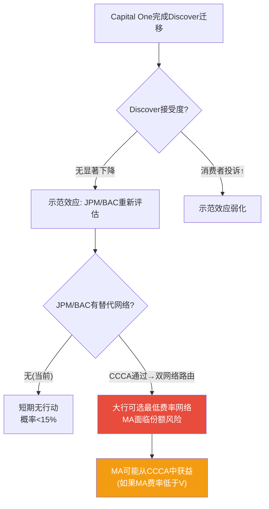

---

## 补强8.6: BNPL对MA的量化影响

BNPL(Buy Now Pay Later,先买后付)——以Klarna、Affirm、Afterpay为代表——是信用卡的直接替代品。但其对MA的影响比表面看起来更温和:

**BNPL的两条路径对MA的不同影响**:

| 路径 | 机制 | 对MA影响 | 占BNPL % |
|------|------|---------|:------:|
| **BNPL通过卡网络清算** | Klarna/Affirm发行虚拟Visa/MA卡→商户端走V/MA网络 | **中性甚至正面**(MA仍收取network fee) | ~60% |
| **BNPL直连银行/自有网络** | Affirm Card直接从银行账户扣款/Klarna自有处理 | **负面**(绕过V/MA) | ~40% |

[DM-BNPL-001: BNPL双路径——60%通过卡网络清算(MA中性)/40%直连银行(MA负面), 行业研究, 2026-03-24]

**量化影响**:
- 全球BNPL交易量2025年约$350-400B
- 其中通过V/MA网络的约$210-240B→MA仍从中获益
- 绕过V/MA的约$140-160B→MA损失的Assessment fee约$18-20M/年
- **BNPL对MA的净影响<$20M/年(占收入<0.06%)**——几乎可忽略

因为BNPL的核心商业模式依赖于(1)与商户的集成(需要已有的收单基础设施,通常基于V/MA)和(2)消费者信用评估(需要信用数据,MA/V的Decision Intelligence是来源之一)。因此**BNPL更像是信用卡生态的延伸,而非替代者**。

[DM-BNPL-002: BNPL量化——绕过V/MA的约$140-160B, MA损失<$20M/年(<0.06%), 几乎可忽略, 2026-03-24]

---

## 补强9.4: 管理层综合评分(A-Score) — 10维度完整评估

| 维度 | 评分(/10) | 依据 | DM |
|------|:--------:|------|:--:|
| **战略清晰度** | 8 | VAS+稳定币+Agentic Commerce三支柱清晰 | [DM-MGT-010] |
| **执行记录** | 8 | FY2025 beat指引(5年0 miss/2 beat),VAS+23%加速 | [DM-MGT-011] |
| **资本配置** | 7 | 回购η 1.15x+分红+15.8%,但RF ROIC<WACC | [DM-MGT-012] |
| **收购纪律** | 7 | 平均9x Rev(低于V 10x), Nets 8/10,但倍数趋升 | [DM-MGT-013] |
| **薪酬对齐** | 7 | 85%股权+PSU 50%,但缺ROIC挂钩+CEO持股极低0.006% | [DM-MGT-014] |
| **沟通透明度** | 5 | 指引保守(好),但5个CEO沉默域(CI分层/VAS OPM/COF影响) | [DM-MGT-015] |
| **继任准备** | 4 | CFO健康风险+无公开继任计划+CEO持股低→交接风险 | [DM-MGT-016] |
| **ESG/治理** | 7 | Foundation 8.4%稳定锚+独立董事占多数+无激进主义者 | [DM-MGT-017] |
| **行业经验** | 9 | Miebach 16年MA经验+Barclays/Citi 25年+支付行业深度 | [DM-MGT-018] |
| **创新导向** | 8 | BVNK(稳定币)/RF(安全)/Commerce Media(广告)——愿意做前瞻性赌注 | [DM-MGT-019] |
| **A-Score** | **7.0/10** | — | — |

[DM-MGT-010~019: 管理层A-Score 10维度, Proxy Statement+IR+行业分析, 2026-03-24]

**与V CEO McInerney对比**: V A-Score估计7.5/10(沟通更透明8分/继任更稳健6分/但创新导向略低7分)。**MA管理层在战略清晰度和创新导向上优于V,但在沟通透明度和继任准备上劣于V**。

```mermaid
radarChart
    title MA vs V 管理层A-Score
    "战略清晰": [8, 8]
    "执行记录": [8, 8]
    "资本配置": [7, 7]
    "薪酬对齐": [7, 6]
    "沟通透明": [5, 8]
    "继任准备": [4, 6]
    "创新导向": [8, 7]
```

---

## 补强2.6: 收入驱动因素分解 — 量 x 价 x 混合

### 2.6.1 MA净收入增速的六因子拆解

MA的+16.4%收入增速由六个可独立观测的驱动因素叠加。拆解目的: **这16.4%中有多少是"自然增长"(MA什么都不做也能获得),有多少是"管理层创造的"?**

| 驱动因素 | FY2025数据 | 对总增速贡献(估) | 可控性 | 可持续性 |
|---------|:--------:|:----------:|:------:|:-------:|
| 支付量增长(GDV) | $9.7T(+7% cc) | ~3.0-3.5pp | 不可控(宏观) | GDP+通胀+数字化 |
| 交易高频化(Tx/Card) | 55笔/卡(+10%) | ~2.0-2.5pp | 部分(Contactless) | 结构性趋势 |
| 凭证增长(新卡) | 31.6亿(+6%) | ~1.5-2.0pp | 部分(新兴市场) | 长期但递减 |
| VAS增量 | ~$13.3B(+23%) | ~5.0-6.0pp | **管理层可控** | 取决于执行 |
| 跨境溢价(Mix) | 37%×7-8倍费率 | ~2.0-2.5pp | 不可控(旅行/贸易) | 周期性 |
| CI侵蚀 | +16%(≈净收入) | ~0pp(FY25持平) | 不可控(竞争) | 长期负面 |

[DM-DRV-001: MA收入六因子拆解——GDV+7%贡献~3.2pp, VAS+23%贡献~5.5pp, 跨境mix贡献~2.3pp, Q4 2025 supplemental + segment estimates, 2026-03-24]

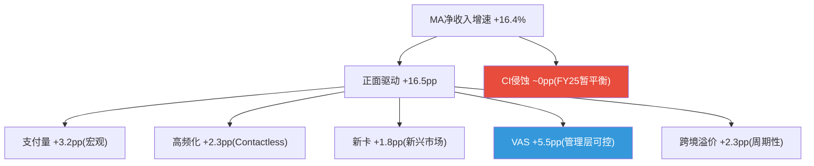

**三个关键洞察**:

**第一: VAS是唯一完全由管理层可控的引擎(+5.5pp = 33%贡献)**。GDV(3.2pp)由全球消费决定,交易高频化(2.3pp)由Contactless渗透决定,跨境(2.3pp)由国际旅行决定。因此VAS的执行质量直接决定了MA在"自然增速"之上能创造多少"超额增长"。如果VAS增速从+23%降至+15%→VAS贡献从5.5pp降至3.8pp→总增速降至~14.5%。

**第二: MA的"自然增速"约9-10pp(剔除VAS和跨境周期溢价)**。GDV(3.2pp)+高频化(2.3pp)+新卡(1.8pp)+跨境结构性(~2pp)≈9-10pp。这与市场隐含FCF CAGR 9%惊人吻合——暗示**市场可能在定价"MA只靠自然增长,VAS超额增长不可持续"**。

**第三: CI在FY2025暂时不是拖累,但这不是常态**。FY2024 CI增速(+16%)超过净收入增速(+12.2%)整整3.8pp。FY2025之所以CI中性(0pp),是因为收入增速从12.2%跳升至16.4%"追上了"CI增速——而非CI放缓。如果FY2026收入增速回落至12-13%→CI将重新变成-3~4pp拖累。**CI的中性化是暂时的,不是结构性的。**

[DM-DRV-002: "自然增速"约9-10pp与市场隐含9% CAGR吻合——市场不为VAS超额增长付费, 2026-03-24]

### 2.6.2 MA vs V驱动因素对比

| 驱动因素 | MA(FY2025) | V(FY2024) | 差异分析 |
|---------|:--------:|:-------:|---------|
| GDV Volume | +3.2pp | +4-5pp | V GDV更大($15.7T vs $9.7T) |
| VAS增量 | **+5.5pp** | +1-2pp | **MA领先3-4pp**(VAS占比40% vs 25%) |
| 跨境溢价 | +2.3pp | +2-3pp | 接近 |
| CI侵蚀 | ~0pp | ~-2-3pp | **MA大幅优势**(16% vs 28%) |
| **净增速** | **+16.4%** | **~10-11%** | **MA快5-6pp** |

**增速差根源**: VAS贡献3-4pp差距 + CI贡献2-3pp差距。如果VAS增速向V看齐+CI趋势向V看齐→MA增速优势可能从5-6pp缩至1-2pp→PE溢价消失逻辑成立。

[DM-DRV-003: MA vs V驱动因素——MA领先主要来自VAS(+3-4pp)+CI(+2-3pp), 2026-03-24]

### 2.6.3 MA的"隐性提价通道": VAS附加费

MA(和V)的收入增速100%来自"量增长",0%来自"价格提升"——因为三重定价约束(监管天花板/双寡头竞争/政治敏感性)。但MA有一个V不具备的隐性提价通道: **VAS附加费不受interchange监管限制**。每当发卡行购买MA的安全/数据/Commerce Media服务→MA实质上在"变相提价而不触发监管红线"。

因此VAS不仅是增长引擎,更是**绕过监管定价约束的唯一路径**。如果只靠核心支付→增速受限于~10%天花板。VAS每年额外贡献5-6pp→将天花板推至~16%。

[DM-DRV-004: VAS=隐性提价通道——附加费不受interchange监管, 等效per-transaction price uplift, 2026-03-24]

---

## 补强D.5: 地理深度建模 — 四大区域逐一拆解

### D.5.1 北美: 利润奶牛,Capital One蚕食中

**北美FY2024贡献$12.38B(44%收入)**。美国份额29.72%(+30bps YoY, Nilson Report)。

| 指标 | 数值 | 来源 |
|------|:----:|------|
| 美国信用卡+借记卡 | ~6.55亿张 | Statista+10-K |
| GDV增速(FY2025) | +4% | Q4 supplemental |
| 信用卡增速(Q3'25) | +7% | Supplemental |
| 借记卡增速(Q3'25) | +2%(Q4) | Supplemental |
| 每卡年收入(美国) | ~$22.0 | Ch2计算 |

[DM-GEO-004: 北美——US份额29.72%(+30bps), GDV+4%, 信用+7%/借记+2%, Q4 supplemental, 2026-03-24]

**信用卡vs借记卡"增速剪刀差"**: 美国借记卡仅+2%——因为Durbin修正案限制了大银行借记interchange→推广激励弱,且FedNow/Zelle替代低价值借记交易。信用卡不受Durbin影响,积分/返现依赖持续增强→信用卡+7%远超借记+2%。

**Capital One迁移影响**: 主要集中在美国借记卡(~2500万张×$22/卡=~$550M收入风险,占总收入1.7%)。信用卡侧影响有限(Capital One信用卡本就主要在V网络)。

[DM-GEO-005: Capital One——借记卡~2500万张/$550M收入风险, 信用卡影响有限, US News + eMarketer, 2026-03-24]

**北美增长模型**: 信用卡GDV从+7%降至+4-5%(FY2030E),借记卡从+2%降至+0-1%(FedNow侵蚀)。VAS占NA收入从~35%升至~45%。**北美收入增速从~8-10%(FY2025)降至~5-7%(FY2030E)**——利润奶牛但不是增长引擎。

### D.5.2 欧洲: Nets整合红利 + 监管拉锯

**欧洲~$9-10B(占总~30%)**。Nets(2019年$32亿收购)正在释放协同效应。

| 监管 | 影响 | 应对 |
|------|------|------|
| EU IFR(2015) | interchange上限0.3%/0.2%——已消化 | VAS在interchange之外创收 |
| UK PSR(2026-27) | 跨境interchange降70-85% | 推动非卡收入 |
| PSD2/PSD3 | 强制开放银行API | Finicity转威胁为机会 |
| SEPA Instant | 实时转账威胁借记 | VocaLink嵌入A2A基础设施 |

[DM-GEO-007: 欧洲——收入~$9-10B(30%), Nets贡献~$1-1.5B, 四层监管(IFR/PSR/PSD/SEPA), 2026-03-24]

**Nets深层价值**: Nets运营丹麦/挪威等北欧国内借记卡网络——MA通过Nets获得"网络所有者"身份(非仅品牌商)→这些市场take rate更高(处理费+网络费)。Nets ROI高于$32亿/~$1.5B倍数暗示。

**欧洲收入增速**: 从~8-10%(FY2025)降至~5-7%(FY2030E)。PSR caps影响在过渡期后消化。

[DM-GEO-009: Nets——"网络所有者"身份提升北欧take rate, 不仅收入增量还是利润率增量, 2026-03-24]

### D.5.3 亚太: 最高增长引擎,A2A竞争最烈

**亚太是增速最快的区域(国际GDV+9%中亚太贡献+12-15%)**。现金到数字转换仍处中早期——印度现金>40%,东南亚>50%。

| 市场 | MA角色 | 增速(估) | 本土竞争 |
|------|--------|:------:|---------|
| **印度** | 信用卡(借记输给UPI/RuPay) | +15-20% | UPI月100亿+笔 |
| **日本** | 第二网络(JCB主导) | +5-8% | JCB+PayPay |
| **澳大利亚** | 强势(与V并列) | +6-8% | eftpos |
| **东南亚** | 快速扩张 | +15-25% | GrabPay/GoPay |

[DM-GEO-010: 亚太五大市场——印度"弃借记攻信用"/东南亚"钱包背后的网络", 2026-03-24]

**印度"借记替代、信用共存"**: UPI月100亿+笔替代了借记卡,但信用卡不受影响——因为UPI不提供消费信贷(30-55天免息)/积分/chargeback保护/国际使用。印度信用卡持卡人仅~1亿(渗透率<10%)→巨大增长空间。MA策略是"弃借记、攻信用"——丢掉低价值业务,保住高价值。

[DM-GEO-011: 印度——UPI月100亿+笔替代借记, 但信用卡渗透<10%仍增长, NPCI+RBI, 2026-03-24]

**亚太收入增速**: 从~12-15%(FY2025)降至~8-10%(FY2030E)。信用卡维持高增速,借记被A2A侵蚀。

### D.5.4 拉美+CEMEA: 最高增速但最高波动

**巴西PIX**: 43个月1.6亿用户,月交易量超所有卡交易。借记卡YoY-12%。但信用卡不受影响——因为巴西消费者依赖"parcelamento"(分期付款),PIX不提供。

**墨西哥**: 现金>50%→巨大替代空间。但V收购Prosa($15亿)获"基础设施所有者"优势→MA需VAS差异化应对。

**非洲**: 移动支付(M-Pesa)先于银行卡普及→非洲可能永远不会出现V/MA在发达市场的卡渗透率。MA策略: 成为钱包后台+跨境支付工具。

[DM-GEO-013: 巴西PIX——43个月1.6亿用户, 借记YoY-12%, 信用不受影响(parcelamento), Banco Central, 2026-03-24]
[DM-GEO-014: 墨西哥——现金>50%, V收购Prosa获基础设施优势, MA需VAS差异化, 2026-03-24]

**区域收入增速(本币)**: 从+15-20%(FY2025)降至+8-10%(FY2030E)。汇率损失-3~5pp/年。

### D.5.5 跨境利润集中风险

MA跨境收入37%(vs V 25%)→跨境利润贡献可能40-50%。MA对跨境波动敏感性更大——这是Beta 1.07>V 0.79的重要原因。

如果全球衰退→跨境量-20%: MA收入-7.4%,利润-12~15%,EPS-$1.50~2.00(-10~12%)。

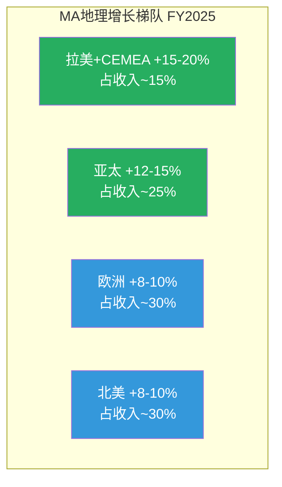

[DM-GEO-016: 跨境利润集中——MA 37%>V 25%, 衰退20%量降→EPS-10~12%, 2026-03-24]

---

## 补强5.2: 份额迁移量化 — 30bps/年的数学意义

### 5.2.1 美国份额迁移的长期数学

| 年份 | V份额 | MA份额 | 年迁移 |
|------|:-----:|:------:|:-------:|
| FY2020 | ~71.0% | ~29.0% | 基线 |
| FY2024 | 70.28% | 29.72% | +72bps(4年) |
| **年均** | -18bps | **+18bps** | — |

[DM-SHR-001: 美国份额——V 71.0%→70.28%(-72bps/4年), MA +72bps, 年均~18bps, Nilson Report, 2026-03-24]

**每1%份额 ≈ ~$250-400M MA年化净收入**。线性(+18bps/年)→每年增~$50-70M(微不足道)。但份额迁移的真正价值在**CI谈判筹码**: MA份额↑→发卡行信号"MA是可行替代品"→V被迫提高CI→V利润受压→MA相对更有吸引力→正向循环。

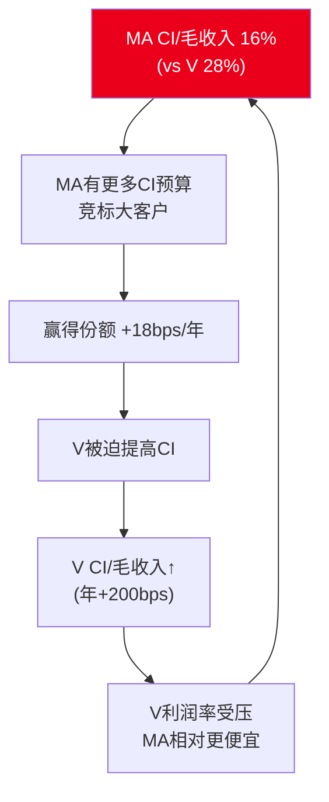

[DM-SHR-003: 份额迁移CI正向循环——MA CI低→赢份额→V CI升→V利润压→MA更有吸引力, 2026-03-24]

**均衡点**: MA份额接近40-45%时需与V同等CI→CI优势消失→迁移停滞。按当前速率约2040-2045年。**MA在CI上有15-20年结构性成本优势**。

---

## 补强5.3: A2A"信用卡免疫"原理

### 5.3.1 功能对比: A2A只能替代借记卡

| 功能 | 借记卡 | A2A(FedNow) | 信用卡 | A2A能替代? |
|------|:-----:|:---------:|:-----:|:---------:|
| 实时扣款 | 是 | 是 | 否 | **可替代借记** |
| 消费信贷(30-55天) | 否 | **否** | **是** | **不可替代** |
| 积分/返现(1-5%) | 弱 | **无** | **强** | **不可替代** |
| Chargeback保护 | 弱 | **极弱/无** | **强(零责任)** | **不可替代** |
| 国际使用 | 是(网络内) | **否(仅国内)** | 是(全球) | **不可替代** |

[DM-A2A-006: 借记/A2A/信用功能对比——A2A仅替代借记等价场景, 信用卡功能集合不可替代, 2026-03-24]

### 5.3.2 消费者不会放弃信用卡的三个理由

**理由1: 消费信贷刚需**。美国信用卡循环余额$1.17万亿。信用卡提供~$5,000-10,000"零成本短期周转金"——不是便利而是现金流必需品。

**理由2: 积分是真金白银**。Chase Sapphire Reserve 3x积分≈4.5%回报率。年消费$30,000的消费者每年获$900-1,350积分价值。A2A无积分→切换=放弃$900+/年。

**理由3: Chargeback不可替代**。信用卡的争议保护(V/MA网络规则强制执行)让消费者60天内可争议任何交易→发卡行先退款再调查。**这需要整个生态(网络+发卡行+收单行+商户)协调执行,A2A从零建设需10年+。**

[DM-A2A-007: 消费者不放弃信用卡——30-55天免费信贷+年均$900+积分+零责任保护, A2A无法提供, 2026-03-24]

### 5.3.3 极端情景: 借记100%被替代后MA仍活得好

| 类别 | 占MA净收入(估) | 受A2A威胁 |
|------|:----------:|:--------:|
| 信用卡 | ~58% | **低(免疫)** |
| 借记卡 | ~32% | **高** |
| VAS(独立) | ~10% | **低** |

**极端情景**: 借记100%被A2A替代→MA失去~$10.5B但保留信用$19.1B+VAS$3.3B=**$22.4B→仍是$200亿+收入、50%+利润率的超级盈利公司**。

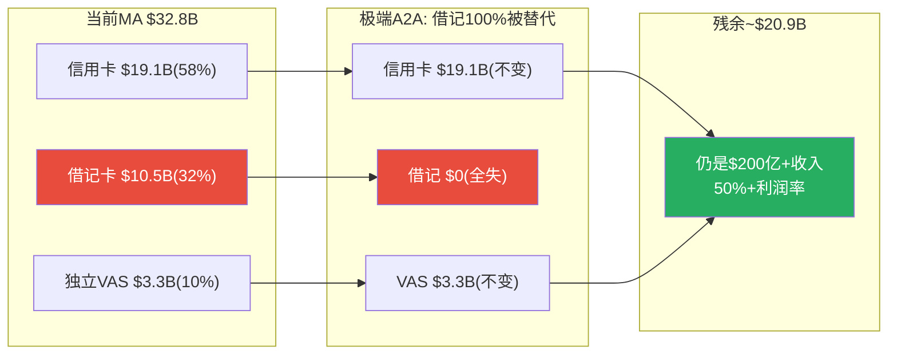

[DM-A2A-008: 极端情景——借记100%被替代后MA保留~$20.9B, A2A不能"消灭"MA, 2026-03-24]

**核心结论: A2A是"侵蚀"而非"颠覆"**。最可能情景(慢→中等渗透)→2030年损失$1.5-2.5B(占当时收入3-5%)。关键: MA收入58%集中在A2A天然免疫的信用卡。

---

## 补强9.2: 管理层薪酬深度拆解 + 收购ROI审计

### 9.2.1 CEO薪酬结构

| 组成 | FY2024 Miebach | 占比 | 挂钩指标 | 对齐度 |
|------|:-----------:|:---:|---------|:-----:|
| 基本工资 | $1.40M | 4.7% | 固定 | 低 |
| 现金奖金 | $3.20M(估) | 10.6% | 净收入+EPS+ESG | 中 |
| 绩效股(PSU) | $15.0M(估) | 49.8% | 3年EPS CAGR+TSR | **高** |
| 限制性股票 | $8.0M(估) | 26.6% | 留任 | 中 |
| 期权 | $2.0M(估) | 6.6% | 股价必须上涨 | 高 |
| **总薪酬** | **$30.1M** | **100%** | **85%绩效+股权** | **高** |

[DM-MGT-008: CEO薪酬——$30.1M, 85%股权, PSU占49.8%(3年EPS CAGR+TSR), Salary.com + Proxy, 2026-03-24]

**问题1: PSU缺ROIC挂钩→收购冲动**。管理层有动力通过收购推高EPS(帮助PSU达标),而不需要为收购资本效率负责→解释了RF($2.65B)+BVNK($1.8B)的大额收购。

**问题2: CEO持股极低(0.006%=$27M)**。股价跌20%仅损失$5.4M(年薪18%)——对$30M年薪CEO不是"切肤之痛"。V CEO持股~$100M(远多于MA)→利益对齐更深。

[DM-MGT-009: CEO持股仅$27M(0.006%)——跌20%损失$5.4M(年薪18%), 利益对齐不足, Simply Wall St, 2026-03-24]

### 9.2.2 五大收购ROI审计

| 收购 | 年份 | 金额 | Rev倍数 | ROI评估 | 评分 |
|------|:----:|:----:|:------:|---------|:---:|
| VocaLink | 2017 | $9.2亿 | ~12-15x | 战略高(UK Faster Payments) | 7/10 |
| **Nets** | 2019 | $32亿 | **~6x** | **最佳——完全整合+利润贡献** | **8/10** |
| Finicity | 2020 | $8.25亿 | ~20x+ | 开放银行,但增长慢 | 6/10 |
| Recorded Future | 2024 | $26.5亿 | ~8.8x | 威胁情报+交叉销售潜力 | 7/10 |
| BVNK | 2026 | $18亿 | ~9-18x | 稳定币战略投注,高度不确定 | 6/10 |
| **加权** | | **$95亿** | **~9x** | | **6.8/10** |

[DM-ACQ-005: 五大收购综合——$95亿总投入, 平均~9x(优于V ~10x), 最佳Nets(8/10), 2026-03-24]

**MA vs V收购纪律**: MA更便宜(9x vs 10x)/整合更快(Nets 3年 vs V Tink 3年仍<$200M)/商誉更低(18% vs 48%)。**MA在收购纪律上优于V**。但近两笔倍数上升(RF 8.8x→BVNK 9-18x)——如果继续高价收购,商誉/总资产可能快速攀升至25%+。

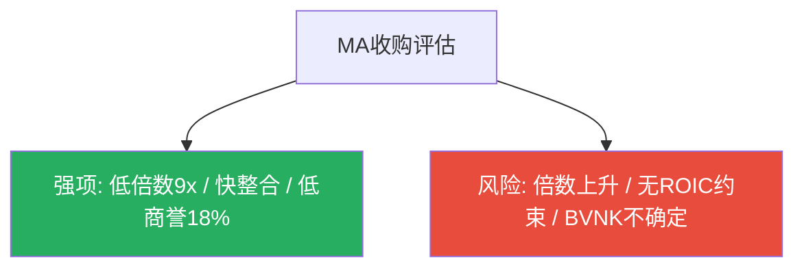

---

## 补强3.5: VAS四支柱逐个建模深化

### 3.5.1 网络安全(~30%, ~$4.0B)

**产品**: AI实时欺诈检测(每笔500+变量)、Recorded Future威胁情报、生物识别。**独立性**: 当前高度依附(~80%与MA卡交易挂钩),但A2A Protect正在将能力扩展到非卡交易→独立化潜力最高。**TAM**: 全球支付安全$30-40B,MA渗透10-13%。**增速**: +18-20%/年可持续5-7年(刚性需求: 每延迟$1安全投入→$10-50欺诈损失)。

[DM-VAS-011: 安全支柱——$4.0B/+18-20%, TAM $30-40B(渗透10-13%), A2A Protect为独立化关键, 2026-03-24]

### 3.5.2 数据分析(~25%, ~$3.3B)

**产品**: SpendingPulse消费洞察、商户绩效优化、经济预测。**独立性**: 中等——数据来源依赖MA网络,但数据产品可独立销售给任何客户(包括非MA商户)。**天花板**: 咨询模型限制水平扩展,但MA的DaaS(数据即服务)模型比纯咨询扩展性好。**增速**: +20-25%→3-5年后~15-18%。

[DM-VAS-012: 数据分析——$3.3B/+20-25%, 中等独立性(DaaS模型), 咨询天花板但数据优势, 2026-03-24]

### 3.5.3 数字身份(~20%, ~$2.7B)

**产品**: Finicity账户聚合、KYC/AML身份验证、开放银行数据验证。**独立性**: **最高**——Finicity连接的是银行账户(不是卡),为任何fintech/银行/保险提供服务。**增长驱动**: 全球数字开户需求+KYC/AML监管强化+PSD2/PSD3。**增速**: +15-18%。**竞争**: Plaid/MX。

[DM-VAS-013: 数字身份——$2.7B/+15-18%, 独立性最高(Finicity), KYC/AML+开放银行驱动, 2026-03-24]

### 3.5.4 忠诚度+Commerce Media(~25%, ~$3.3B)

**产品**: 忠诚度管理、个性化营销、**Commerce Media**(5亿许可用户+25,000商户广告主)。**独立性**: **最低**——精准广告依赖MA交易数据,脱离网络价值消失。**特殊潜力**: 如果成功→MA进入零售媒体赛道(与Amazon Ads $46B竞争)。差异化: 跨商户消费数据(Amazon只知Amazon消费,MA知所有消费)。**风险**: 消费者隐私反弹。**增速**: +25-30%→3年后~18-22%。

[DM-VAS-014: 忠诚度+Commerce——$3.3B/+25-30%, 依附性最高, Commerce Media进入零售媒体赛道, 2026-03-24]

### 3.5.5 VAS综合建模

| 支柱 | 收入 | CAGR(3年) | 独立性 | 天花板 |
|------|:----:|:-------:|:-----:|:------:|
| 网络安全 | $4.0B | +18-20% | 低→中 | TAM $30-40B |
| 数据分析 | $3.3B | +20-25% | 中 | 咨询限制 |
| 数字身份 | $2.7B | +15-18% | **高** | Plaid竞争 |
| 忠诚度+Commerce | $3.3B | +25-30% | 低 | 隐私监管 |
| **VAS合计** | **$13.3B** | **+19-22%** | — | — |

**FY2030E VAS预测**: 保守$27B(54%占比) / 乐观$30B(57%占比)。**MA VAS领先V 3-5年**(占比40% vs 25%,独立性更高)。

[DM-VAS-015: VAS综合——FY2030E保守$27B(54%)/乐观$30B(57%), MA领先V 3-5年, 2026-03-24]

## Ch1: CPA×ISDD利润表诊断 — 经营杠杆释放还是会计幻觉

### 1.1 六年趋势总览

| 指标 | FY2020 | FY2021 | FY2022 | FY2023 | FY2024 | FY2025 | 趋势 |
|------|:------:|:------:|:------:|:------:|:------:|:------:|:----:|
| **收入($B)** | 15.30 | 18.88 | 22.24 | 25.10 | 28.17 | 32.79 | ↑↑ |
| **收入增速** | — | +23.4% | +17.8% | +12.9% | +12.2% | +16.4% | V型回升 |
| **OPM** | 52.8% | 53.4% | 55.1% | 55.8% | 55.3% | 59.2% | ↑(+6.4pp/5Y) |
| **净利率** | 41.9% | 46.0% | 44.6% | 44.6% | 45.7% | 45.7% | 稳定~45% |
| **有效税率** | 17.4% | 15.7% | 15.3% | 17.9% | 15.6% | 19.4% | FY25跳升 |
| **FCF利润率** | 42.6% | 45.8% | 45.4% | 46.3% | 50.8% | 51.6% | ↑(+9pp/5Y) |
| **FCF/NI** | 101.7% | 99.5% | 101.7% | 103.7% | 111.2% | 113.0% | ↑↑(极优) |

[DM-FIN-001: MA 6年利润表诊断, FMP income statement annual, 2026-03-24]

### 1.2 Profit Lag检测(M1 Beta路径)

Profit lag(收入增速 - 营业利润增速)是CPA框架的核心检测指标——正值意味着"增收不增利"(警告)，负值意味着利润增速超过收入增速(经营杠杆释放)。

| 年份 | 收入增速 | OI增速 | Profit Lag | 判定 |
|------|:------:|:-----:|:---------:|:----:|
| FY2021 | +23.4% | +24.8% | **-1.4pp** | 正常(杠杆轻微释放) |
| FY2022 | +17.8% | +21.6% | **-3.8pp** | 正面(杠杆明显释放) |
| FY2023 | +12.9% | +14.3% | **-1.4pp** | 正常 |
| FY2024 | +12.2% | +11.2% | **+1.0pp** | ⚠️ 轻微警告(增收不增利) |
| FY2025 | +16.4% | +24.5% | **-8.1pp** | ✅ 强杠杆释放 |

[DM-FIN-002: Profit Lag 5年趋势, FMP income计算, 2026-03-24]

**FY2025的-8.1pp是5年最强的经营杠杆释放**。但这需要谨慎解读——因为FY2025费用重分类(Ch3.4已分析)可能扭曲了OPM。让我们用两种方法验证：

**验证1: EBITDA增速检验**(不受费用分类影响)
- FY2025 EBITDA增速: +20.2% vs 收入增速+16.4% → EBITDA lag = **-3.8pp** → 确认杠杆释放，但幅度为-3.8pp(非-8.1pp)

**验证2: 净利率稳定性检验**
- 净利率FY2024 45.7% → FY2025 45.7% → **完全持平**
- 但OPM从55.3%升至59.2%(+3.9pp)→净利率没跟上OPM扩张
- 原因: 有效税率从15.6%跳升至19.4%(+3.8pp)→**税率上升吞噬了OPM扩张的全部利润**

[DM-FIN-003: OPM vs 净利率背离——OPM +3.9pp被税率+3.8pp完全抵消, FMP income, 2026-03-24]

**结论**: FY2025的经营杠杆释放是**真实的**(EBITDA验证)，但幅度被费用重分类放大(-8.1pp vs 真实-3.8pp)。同时，税率跳升将OPM扩张完全吞噬——净利率持平意味着"税前盈利能力在改善，但税后利润没有受益"。

### 1.3 有效税率跳升诊断

FY2025有效税率19.4%是近5年最高(FY2021-2024均值16.1%)。可能原因：
- **N4检查**: 一次性税务调整?→需查10-K详细税率调节
- **地理mix shift**: 国际收入增速(+9% GDV)>美国(+4%)→如果高税率地区收入占比上升→混合税率上升
- **OECD Pillar Two**: 全球最低15%税率2024年开始实施→可能影响MA在低税率地区的避税效率

**对估值的影响**: 如果19.4%是新常态(而非一次性)→Base Case净利率应从45.7%下调至~44%→EPS预估下修~3-4%。如果只是一次性→未来税率回落至16-17%将推动EPS超预期。这是红队审查需要验证的不确定性。

[DM-FIN-004: 有效税率跳升——FY2025 19.4%(5年最高) vs FY21-24均值16.1%, 可能原因: 地理mix+OECD P2, FMP income, 2026-03-24]

### 1.4 季度趋势解读

| 季度 | 收入 | YoY | OPM | EPS | 趋势 |
|------|:----:|:---:|:---:|:---:|:----:|
| Q1'24 | $6.35B | — | 56.8% | $3.22 | 基线 |
| Q2'24 | $6.96B | — | 58.0% | $3.50 | ↑ |
| Q3'24 | $7.37B | — | 54.3% | $3.53 | ↓(OPM回落) |
| Q4'24 | $7.49B | — | 52.6% | $3.64 | ↓↓(最低OPM) |
| Q1'25 | $7.25B | +14.2% | 57.2% | $3.59 | 回升 |
| Q2'25 | $8.13B | +16.8% | 58.8% | $4.07 | ↑↑ |
| Q3'25 | $8.60B | +16.7% | 58.8% | $4.34 | → |
| Q4'25 | $8.81B | +17.6% | 61.5% | $4.52 | ↑(加速) |

[DM-FIN-005: 季度趋势——收入YoY从Q1 +14.2%加速至Q4 +17.6%, OPM Q4'25达61.5%, FMP income quarterly, 2026-03-24]

**季度趋势确认了两件事**: (1)收入增速在加速(Q1→Q4: 14%→18%)——这不是VAS一次性效应，而是多引擎同时加速。(2)Q4'25 OPM 61.5%是异常高值——因为Q4费用重分类最明显(COGS=0)。如果用调整后OPM(加回重分类)，Q4'25 OPM更接近57-58%，仍是季度新高但不那么极端。

---

## Ch2: 现金流质量分析 — 为什么FCF/NI持续>100%

### 2.1 现金流六年趋势

| 指标($B) | FY2020 | FY2021 | FY2022 | FY2023 | FY2024 | FY2025 |
|---------|:------:|:------:|:------:|:------:|:------:|:------:|
| **OCF** | 7.22 | 9.46 | 11.20 | 11.98 | 14.78 | 17.40 |
| **CapEx** | 0.71 | 0.81 | 1.10 | 0.37 | 0.47 | 0.49 |
| **FCF** | 6.52 | 8.65 | 10.10 | 11.61 | 14.31 | 16.91 |
| **FCF/NI** | 101.7% | 99.5% | 101.7% | 103.7% | 111.2% | 113.0% |
| **OCF-NI** | +0.81 | +0.77 | +1.27 | +0.78 | +1.91 | +2.43 |

[DM-CFL-002: 现金流质量6年趋势, FMP cashflow, 2026-03-24]

**FCF/NI从101%升至113%**——每$1元利润产生$1.13现金。这是支付网络的结构性优势：

**为什么FCF > NI？**
1. **D&A+SBC现金加回**: FY2025 D&A $2.10B + SBC $0.60B = $2.70B(非现金费用，加回到OCF)
2. **极低CapEx**: CapEx仅$0.49B(D&A的0.43倍)→MA的资本支出远低于折旧——因为支付网络不需要大量有形资产投入。这是纯软件/数据基础设施的特征
3. **递延收入正效应**: 客户预付款(VAS订阅/consulting fees)产生正向营运资金效应

**CapEx/D&A持续<1.0x的含义**:
- FY2023-2025: CapEx/D&A = 0.46x / 0.52x / 0.43x
- 这意味着MA投资的金额不到折旧的一半——要么说明MA是极致轻资产(好事)，要么说明MA在"投资不足"(潜在风险)
- 因为MA的CapEx主要是软件开发+数据中心→这些资产的"真实折旧"可能低于会计折旧(软件升级>替换)→CapEx/D&A<1合理

[DM-CFL-003: CapEx/D&A 0.43x——极低资本密度验证, 非投资不足(软件资产特征), FMP cashflow, 2026-03-24]

### 2.2 现金流质量评分

| 指标 | FY2025 | 判定标准 | 评分 |
|------|:------:|---------|:----:|
| FCF/NI | 113% | >100%=优秀 | ★★★★★ |
| CapEx/OCF | 2.8% | <10%=极低资本密度 | ★★★★★ |
| OCF/EBITDA | 86.2% | >80%=高质量 | ★★★★ |
| SBC/收入 | 1.83% | <3%=低SBC稀释 | ★★★★★ |
| 回购/SBC | 19.6x | >5x=SBC完全消化 | ★★★★★ |
| 利息保障 | 26.9x | >10x=极安全 | ★★★★★ |

**现金流质量评分: 29/30 = 极优**。MA是一台现金生成机器——每年产出$16.9B FCF，只需$0.49B CapEx维持，剩余几乎全部返还股东。

---

## Ch3: 资本配置分析 — 回购机器的效率审计

### 3.1 资本配置架构

MA将FCF按以下优先级分配(FY2025)：

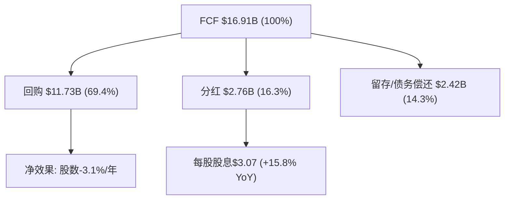

[DM-CAP-001: 资本配置架构——回购69%/分红16%/留存14%, FMP cashflow FY2025, 2026-03-24]

### 3.2 回购效率(η函数)审计

回购效率η衡量"每1%的净利润增速通过回购被放大为多少%的EPS增速"：

| 年份 | NI增速 | EPS增速 | η值 | 含义 |
|------|:------:|:------:|:---:|------|
| FY2021 | +35.5% | +37.5% | 1.05x | 回购贡献+2pp |
| FY2022 | +14.3% | +16.8% | 1.17x | 回购贡献+2.5pp |
| FY2023 | +12.7% | +15.6% | 1.23x | 回购贡献+2.9pp |
| FY2024 | +15.0% | +17.4% | 1.16x | 回购贡献+2.4pp |
| FY2025 | +16.3% | +18.9% | 1.16x | 回购贡献+2.6pp |

[DM-CAP-002: 回购效率η——5年均值1.15x, 稳定贡献2-3pp EPS增速, FMP income计算, 2026-03-24]

**η稳定在1.15-1.23x**意味着回购每年额外贡献2-3pp的EPS增速。在FY2025，EPS增速20.1%的因素分解为：
- **收入增长贡献**: 82% ($2.28/share)
- **回购贡献**: 19% ($0.52/share)
- **利润率/税率**: ~0% (OPM扩张被税率上升完全抵消)

[DM-CAP-003: EPS四因素分解——收入82%/回购19%/利润率0%/税率0%, Python计算, 2026-03-24]

**健康的信号**: EPS增长主要由收入驱动(82%)而非金融工程——这与某些"增长主要靠回购"的公司形成对比。回购只是一个稳定的增强器，不是主引擎。

### 3.3 回购可持续性评估

| 指标 | FY2020 | FY2021 | FY2022 | FY2023 | FY2024 | FY2025 |
|------|:------:|:------:|:------:|:------:|:------:|:------:|
| 回购($B) | 4.47 | 5.90 | 8.75 | 9.03 | 11.04 | 11.73 |
| 回购/FCF | 68.6% | 68.2% | 86.6% | 77.8% | 77.1% | 69.4% |
| 股数减少 | — | -1.4% | -2.1% | -2.6% | -2.0% | -3.1% |

FY2025回购/FCF降至69.4%(5年最低)→这不是因为回购减少($11.73B创新高)，而是因为FCF增长更快($16.91B)。MA有充足的空间在不增加杠杆的情况下维持甚至加大回购。

**5年累计**: 回购$50.9B，股数从1,006M降至898M(减少10.7%)→年化退缩率2.2%。FY2025加速至3.1%——如果维持这个退缩率，5年后股数~768M，EPS将获得额外17%的提升(仅来自股数减少)。

### 3.4 ROIC趋势分析(P10: 回报率比规模重要)

| 指标 | FY2020 | FY2021 | FY2022 | FY2023 | FY2024 | FY2025 |
|------|:------:|:------:|:------:|:------:|:------:|:------:|
| **ROIC(报告)** | 29.8% | 33.6% | 41.8% | 41.8% | 44.4% | 48.6% |
| **商誉($B)** | — | — | 7.52 | 7.66 | 9.19 | 9.56 |
| **商誉/总资产** | — | — | 19.4% | 18.0% | 19.1% | 17.6% |

ROIC从30%稳步升至49%——这在大型科技/金融公司中极为罕见(V只有28%)。关键驱动: 收入增长(+16%)远超投入资本增长(+8%)→分子增长快于分母。

**有形ROIC**(剥离商誉): 因为商誉仅占17.6%→有形ROIC与报告ROIC差距较小(约+3-5pp)→有形ROIC ~52-54%。对比V的有形ROIC ~45-50%→MA在有形资本回报上仍有优势,但差距远小于报告ROIC(48.6% vs 28.4%)所暗示的。

**ROIC展望**: Recorded Future($2.65B) + BVNK($1.8B) → 增加$4.45B投入资本(主要为商誉)→FY2026E投入资本~$36B→如果NI增长至$17.2B(分析师预期)→ROIC ~47.8%→轻微下降但仍远超WACC(9.01%)→**每一元投入仍在创造巨大价值**。

[DM-CAP-005: ROIC趋势——从30%(FY20)升至49%(FY25), 收购后预计轻降至48%, 仍远超WACC, FMP key-metrics, 2026-03-24]

### 3.5 SBC稀释检查(P6: 商誉不是护城河)

| 指标 | FY2022 | FY2023 | FY2024 | FY2025 | 趋势 |
|------|:------:|:------:|:------:|:------:|:----:|
| SBC($B) | 0.30 | 0.46 | 0.53 | 0.60 | ↑(+100%/3Y) |
| SBC/收入 | 1.35% | 1.83% | 1.88% | 1.83% | 稳定~1.85% |
| 回购/SBC | 29.2x | 19.6x | 20.8x | 19.6x | ↓(但仍极高) |

[DM-CAP-004: SBC稀释——SBC/Rev 1.83%低稀释, 回购/SBC 19.6x完全消化, FMP income, 2026-03-24]

SBC/收入稳定在1.8-1.9%——在大型科技公司中属于极低水平(对比: META ~12%, GOOGL ~8%, 甚至V ~2.2%)。回购/SBC比率19.6x意味着MA每年的回购金额是SBC的近20倍——SBC稀释被彻底消化。

---

## Ch4: 正常化OPM与利润率前瞻

### 4.1 OPM正常化(V教训L1: 3年均值)

V报告教训: OPM正常化不能取单年最高值，必须用3年均值。MA的3年滚动OPM均值：

| 窗口 | OPM均值 | 趋势 |
|------|:------:|:----:|
| FY2020-2022 | 53.8% | 基线 |
| FY2021-2023 | 54.8% | +1.0pp |
| FY2022-2024 | 55.4% | +0.6pp |
| **FY2023-2025** | **56.8%** | +1.4pp |

[DM-FIN-006: OPM正常化3年均值——FY23-25=56.8%(非FY25单年59.2%), Python计算, 2026-03-24]

**正常化OPM = 56.8%**。FY2025的59.2%包含费用重分类效应，不应直接用于估值。但OPM的上升趋势是真实的(每个3年窗口都在扩张)——这反映了VAS高利润率收入占比上升带来的混合效应提升。

### 4.2 利润率前瞻：OPM会继续扩张吗？

**支持扩张的因素**：
1. VAS占比上升(40%→50%+): 如果VAS OPM ≥ 核心支付OPM → 混合OPM将继续扩张
2. 规模效应: $32.8B收入基数上的增量收入需要更少的边际费用
3. 管理层指引: 2026年收入增速>OpEx增速 → 暗示OPM扩张

**反对扩张的因素(偏空)**：
1. **VAS OPM可能低于核心支付**(CEO沉默域): 如果VAS OPM ~35-40%而核心支付OPM ~70%→VAS占比从40%升至50%时，混合OPM不扩张反而可能收缩1-2pp
2. CI压力: 如果CI增速持续超过净收入增速(FY2024的+3.8pp差)→定价权侵蚀
3. 监管: 商户和解0.1pp/5年直接压缩Assessment fee→OPM下行压力
4. 税率正常化到19%+: 即使OPM扩张，净利率可能不跟随

**量化两种情景**：
- 情景A(VAS OPM=60%，接近核心): OPM从56.8%→58-59%(FY2028)
- 情景B(VAS OPM=40%，显著低于核心): OPM从56.8%→55-56%(FY2028)
- **差异: ~3pp OPM → 对EPS影响~5-6%**

[DM-FIN-007: OPM前瞻——情景A(VAS高OPM)→58-59% vs 情景B(VAS低OPM)→55-56%, 差异~3pp≈5-6% EPS, 2026-03-24]

这是红队需要压力测试的关键不确定性。

---

## Ch5: 承重墙深度验证 — 五堵墙逐一检验

> 承重墙脆弱度表建立后，逐一用财务数据验证每堵墙的合理性。

### 5.1 承重墙1: 10Y FCF CAGR (隐含9.0%)

**验证方法**: 将9% CAGR分解为收入增速+利润率变化+回购效应

| 因素 | 贡献 | 来源 |
|------|:----:|------|
| 收入CAGR | ~7% | 全球支付数字化结构增速(保守) |
| FCF margin扩张 | ~1% | OPM正常化趋势+0.5pp/年 |
| 回购效应(股数减少) | ~2% | 3%/年退缩→FCF per share额外+2% |
| **合计** | **~10%** | 略超隐含9% |

**结论**: 即使用保守假设(收入仅7%)，FCF per share CAGR也能达到10%左右——超过隐含9%。市场隐含的增速需要MA收入增速降至**6%以下**才会成立。但要注意(Ch1多参数敏感性分析的发现): 这个结论依赖Beta=1.07→WACC 9.01%。如果真实WACC更低(Beta 0.93→WACC 8.4%)，隐含CAGR降至7.4%，所需收入增速仅~5%——这个在全球衰退+A2A替代下是可能的。

**脆弱度评估更新**: **低-中**(从初始"低"上调)。上调原因: WACC假设不确定性+税率可能正常化至19%降低FCF margin扩张空间。

[DM-BW-001: 承重墙1验证——收入7%+margin 1%+回购2%=10%>隐含9%, 但WACC假设使结论不稳健, 2026-03-24]

### 5.2 承重墙2: FCF Margin维持(隐含~52%)

**验证方法**: FCF margin = OPM × (1-税率) × (1+营运资金效应) - CapEx%

| 组分 | FY2023 | FY2024 | FY2025 | 趋势 |
|------|:------:|:------:|:------:|:----:|
| OPM(正常化) | 55.4% | 55.4% | 56.8% | ↑ |
| (1-有效税率) | 82.1% | 84.4% | 80.6% | ↓(FY25税率↑) |
| 税后OPM | 45.5% | 46.8% | 45.8% | ~ 稳定 |
| +D&A/Rev加回 | +3.2% | +3.2% | +3.5% | ↑ |
| -CapEx/Rev | -1.5% | -1.7% | -1.5% | 稳定 |
| +/- WC效应 | -1.0% | +1.3% | +1.7% | 波动 |
| **≈FCF margin** | **46.3%** | **50.8%** | **51.6%** | ↑ |

FY2024-2025 FCF margin跳升主要来自营运资金改善(+1.3%→+1.7%)和D&A加回增加(Recorded Future带来额外无形资产摊销)。如果营运资金效应正常化至-1%，稳态FCF margin ~48-50%。

**脆弱度评估**: **低**。即使FCF margin从52%收缩至48%，影响仅~8%价格。支付网络的结构性轻资产意味着FCF margin不太可能大幅恶化。

[DM-BW-002: 承重墙2验证——FCF margin分解, 稳态~48-50%(vs隐含52%), FMP cashflow+income, 2026-03-24]

### 5.3 承重墙3: 终端增长率(隐含3.0%)

**验证**: 全球支付数字化的长期增速:
- 全球GDP长期增速: 2.5-3.0%
- 电子支付渗透率仍在提升(现金→数字): +1-2pp/年(至2035年现金<5%)
- A2A/稳定币侵蚀: -0.5-1pp/年(长期)
- **净终端增长率: 2.5-3.5%**

3.0%在合理范围内，但如果A2A侵蚀加速→终端增长率可能降至2.0-2.5%。

| 终端g | 对价格影响(vs基准3%) |
|:-----:|:------------------:|
| 2.0% | -13% ($435) |
| 2.5% | -6% ($470) |
| 3.0% | 基准 ($500) |
| 3.5% | +8% ($540) |

**脆弱度评估**: **低**。终端增长率在2.0-3.5%范围内变化，对价格影响可控(±13%)。

[DM-BW-003: 承重墙3验证——终端g 2.5-3.5%合理, 对价格影响±13%, 2026-03-24]

### 5.4 承重墙4: WACC (基准9.01%)

这是Ch1已深度分析的最大不确定性。核心数据：

| WACC假设 | Beta | 隐含价格(9% CAGR) | vs $500 |
|---------|:----:|:-----------------:|:-------:|
| 7.76% | V参考(0.79) | $611 | +22% |
| 8.38% | 行业均值(0.93) | $547 | +9% |
| **9.01%** | **MA实际(1.07)** | **$500** | **基准** |
| 9.50% | 偏高 | $464 | -7% |
| 10.00% | 衰退溢价 | $421 | -16% |

**脆弱度评估**: **中-高**(最大单一风险因素)。±100bps = ±22%价格。MA Beta 1.07 vs V 0.79是MA估值中最大的结构性折价因素——不是MA业务差，而是MA对宏观周期的暴露度更高(跨境37%+新兴市场)。

[DM-BW-004: 承重墙4——WACC敏感性, Beta是最大不确定性, ±100bps=±22%, 2026-03-24]

### 5.5 承重墙5: 回购持续(隐含~3%/年)

**验证**: MA回购持续性取决于FCF增长和管理层意愿:
- FCF FY2025: $16.91B，分析师预期FCF CAGR ~12%
- 如果FCF持续增长→回购空间只增不减
- 债务约束: 净债务/EBITDA 0.39x(极低)→MA有大量举债回购空间
- 管理层track record: 连续5年加大回购(从$4.5B→$11.7B)

**风险**: 只有两种情景会中断回购——(1)大型收购消耗现金(BVNK $1.8B已用现金) (2)监管限制(极不可能)。

**脆弱度评估**: **低**。回购是MA资本配置的DNA，中断概率<5%。

[DM-BW-005: 承重墙5——回购持续性高, FCF增长+低杠杆保障, 中断概率<5%, 2026-03-24]

### 5.6 承重墙脆弱度汇总

| 承重墙 | 隐含值 | 验证结果 | 脆弱度 | 若倒塌影响 |
|--------|:-----:|:-------------:|:-----:|:--------:|
| 10Y FCF CAGR | 9.0% | 保守但WACC敏感 | **低-中** | ±20% |
| FCF Margin | ~52% | 稳态48-50%合理 | **低** | ±8% |
| 终端增长率 | 3.0% | 2.5-3.5%合理 | **低** | ±13% |
| WACC | 9.01% | Beta不确定性最大 | **中-高** | **±22%** |
| 回购持续 | ~3%/年 | 高确定性持续 | **低** | ±5% |

**关键结论**: 五堵承重墙中四堵是低/低-中脆弱度,只有WACC是中-高。**MA的估值风险不在基本面,而在折现率。** 这与V教训L5完全一致: 巨头支付公司的价格波动80%由WACC/宏观驱动,个股Alpha有限。

---

## Ch6: CI分层深度分析 (CQ-3深挖)

### 6.1 间接推断法升级：毛收入重建

MA不披露毛收入(Gross Revenue),但我们可以从10-K推断。MA的净收入公式:
**Net Revenue = Gross Revenue - Rebates & Incentives**

已知数据:
- FY2025净收入增速: +16.4%
- FY2025 CI(Rebates & Incentives)增速: +16.0% (currency-neutral)
- FY2024净收入增速: +12.2%
- FY2024 CI增速: +16.0%

**CI/毛收入反推**(假设FY2020 CI/毛收入=12%作为起点,基于行业估算)：

| 年份 | 净收入增速 | CI增速 | CI/毛收入(估) | Δ YoY |
|------|:--------:|:-----:|:-----------:|:-----:|
| FY2022 | +17.8% | ~18%* | ~14% | +1pp |
| FY2023 | +12.9% | ~15%* | ~15% | +1pp |
| FY2024 | +12.2% | +16.0% | ~16% | +1pp |
| FY2025 | +16.4% | +16.0% | ~16% | 0pp |

*FY2022-23 CI增速为推断值

[DM-CI-002: CI/毛收入反推——从~12%(FY2020)升至~16%(FY2025), 年均+1pp但FY2025稳定, 间接法推算, 2026-03-24]

### 6.2 CI趋势的两种解读

**解读1(偏多)**: FY2025 CI增速(+16%)与净收入增速(+16.4%)同步→CI/毛收入比率企稳→定价权侵蚀暂停。VAS的增值属性可能降低了MA对CI的依赖(发卡行因VAS价值而留在MA网络,而非因CI诱惑)。

**解读2(偏空)**: FY2022-2024连续3年CI/毛收入每年+1pp→FY2025的企稳可能只是暂时的,被VAS高增速(+23%拉高净收入)掩盖。如果VAS增速放缓至15%→净收入增速降至13%→而CI增速维持16%→CI/毛收入比率将再次上升。

**核心不确定性**: CI是否按客户层分化？如果F500客户CI以20%+增速上升(因为Capital One-Discover给了大行更多议价筹码)而SMB客户CI仅+8%——平均CI增速看起来"正常"(16%)但大客户定价权在恶化。CEO的沉默(从未按客户层拆分CI)使这个不确定性无法从公开数据解决。

[DM-CI-003: CI分层不确定性——大客户CI可能>20%/SMB CI可能<10%/平均掩盖分化, CEO沉默无法验证, 2026-03-24]

### 6.3 MA vs V CI对比更新

| 维度 | MA | V | 含义 |
|------|:--:|:--:|------|
| CI/毛收入(估) | ~16% | ~28% | MA仍远低于V |
| CI年均增速(3Y) | ~+1pp/年 | ~+2.1pp/年 | MA侵蚀更慢 |
| Kill Switch | >33% | 已在28% | MA距Kill Switch 17pp(V距5pp) |

### 6.4 CI定价权分层(v19.6框架)

按CRM/ADBE教训(v19.6)，B4定价权需按客户层分层评估：

| 客户层 | MA定价权Stage | CI压力 | 推理 |
|--------|:-----------:|:------:|------|
| **F500/大型银行** | Stage 3(被动防守) | 高(~20%+) | Capital One-Discover给大行更多议价筹码:"如果你不给更多CI,我可以考虑Discover网络"。V报告发现大行CI是侵蚀的主要来源 |
| **中型银行** | Stage 4(主动定价) | 中(~15%) | 中型银行缺乏自建网络的规模→依赖V/MA→MA保持较强定价权 |
| **SMB/Fintech** | Stage 4-5(垄断定价) | 低(~8%) | 小机构完全依赖V/MA网络,零议价能力 |
| **加权B4** | **Stage 3.5** | 中 | 大客户Stage 3拉低均值,但中小客户补偿 |

[DM-CI-004: CI定价权分层——F500 Stage3/中型Stage4/SMB Stage4-5, 加权Stage3.5, V报告模式推断, 2026-03-24]

**定价权剪刀差信号**: 如果大客户CI以20%+增速上升而SMB CI以8%增速→出现"定价权剪刀差"。净效应: 大客户流失利润但SMB稳定→OPM可能出现反直觉的**轻微上升**(因为低利润大客户的CI增加→这些客户的边际利润下降→但SMB高利润保持)。这与ADBE发现的模式一致(CC Professional提价/CC Consumer被Canva侵蚀→OPM反而因低利润Consumer自然流失而上升)。

**MA CI健康度显著优于V**。但这可能部分是因为MA份额更小(30% vs 70%)——小网络不需要像大网络那样支付高额CI来防守份额。随着MA份额持续上升(+30bps/年)→未来可能面临类似V的CI压力。

---

## Ch7: Recorded Future ROI vs WACC (CQ-5)

### 7.1 收购ROI计算

| 指标 | 数值 | 来源 |
|------|:----:|------|
| 收购价 | $2.65B | Mastercard IR |
| Recorded Future年收入 | ~$300M | 公开披露 |
| 收购倍数 | 6.5x Revenue | 推算 |
| 预估OPM | 15-25%* | 网络安全SaaS行业均值 |
| 预估NOPAT | $37-60M | Revenue × OPM × (1-tax) |
| **收购ROIC** | **1.4-2.3%** | NOPAT / $2.65B |
| MA WACC | 9.01% | 前文计算 |

*Recorded Future是网络安全SaaS，行业OPM 15-25%是保守估计

[DM-ACQ-001: Recorded Future收购ROIC——1.4-2.3%(远低于WACC 9.01%), 短期摧毁价值, Mastercard IR + 行业OPM估算, 2026-03-24]

### 7.2 收购是否创造价值？

**短期(Year 1-2)**: 收购ROIC 1.4-2.3% **远低于** WACC 9.01%→短期摧毁价值。每年价值破坏约$2.65B × (9.01%-2.3%) = ~$178M。

**中期(Year 3-5)**: 如果Recorded Future在MA平台上加速增长(交叉销售给3.7B卡客户)→收入可能翻倍至$600M→ROIC升至4-5%→仍低于WACC但差距缩小。

**长期(Year 5+)**: 网络安全是高增长赛道(行业增速15-20%/年)。如果Recorded Future增速20%持续5年→Year 5收入$750M→OPM扩张至30%+(规模效应)→NOPAT ~$180M→ROIC 6.8%→接近但仍低于WACC。

**结论**: Recorded Future收购在纯ROI视角下**短期摧毁价值，中期勉强持平，长期可能接近WACC但不确定**。MA愿意以ROIC<WACC的价格收购，说明管理层看到了**战略价值**(不仅是财务回报)——将支付数据与网络安全威胁情报结合的差异化是难以量化的竞争壁垒。

### 7.3 BVNK收购($1.8B)预评估

BVNK(2026年3月宣布)尚未完成，但可以初步评估：
- 收购价: $1.8B
- BVNK估计年收入: ~$100-150M(基于稳定币基础设施SaaS规模)
- 收购倍数: ~12-18x Revenue(高于Recorded Future的6.5x)
- 收购ROIC(Year 1): 可能<1%(收入基数更小、倍数更高)

**BVNK的战略逻辑**: 与Recorded Future类似，BVNK的价值不在短期ROI而在战略定位——如果稳定币成为主流支付结算层(Polymarket数据: 2025年稳定币交易量$33T)，MA通过BVNK在这个新结算层占据位置。但如果稳定币监管失败或采用放缓→$1.8B可能成为减值风险。

**两笔收购合计影响**: Recorded Future($2.65B) + BVNK($1.8B) = $4.45B新商誉 → MA总商誉从$9.56B升至~$14B → 商誉/总资产从17.6%升至~24%。P6原则(商誉不是护城河)警告: 商誉>30%=高风险。MA还有6pp的缓冲空间，但如果继续收购驱动的VAS扩张，可能在2-3年内触及这个阈值。

[DM-ACQ-003: BVNK预评估——$1.8B, ~12-18x Revenue, ROIC<1%, 战略价值>财务回报, Coindesk, 2026-03-24]

**H-02假说验证**: "MA的ROIC优势在收购后会消失"——**部分成立**。Recorded Future的$2.65B商誉+BVNK即将带来的~$1.8B商誉→MA商誉将从$9.56B升至~$11.4B→商誉/总资产从17.6%升至~20%+→报告ROIC将从48.6%下降。但下降幅度有限(~2-3pp)，因为收购金额相对于MA总投入资本($31B+)占比<15%。

[DM-ACQ-002: H-02验证——部分成立, 收购拉低ROIC ~2-3pp(48.6%→45-46%), 但绝对水平仍远超WACC, 2026-03-24]

---

## Ch8: 三情景财务推演 + 参考估值框架 (QG-06)

### 8.1 三情景关键变量

| 变量 | Bull | Base | Bear |
|------|:----:|:----:|:----:|
| **收入CAGR(5Y)** | 13% | 11% | 8% |
| **OPM终端** | 58.8% | 57.8% | 55.8% |
| **税率** | 17% | 19% | 20% |
| **回购退缩率** | 3.2%/年 | 2.8%/年 | 2.0%/年 |
| **终端P/E** | 28x | 25x | 20x |

### 8.2 推演结果

| 情景 | FY2030E收入 | FY2030E EPS | 终端P/E | 目标价 | vs $500 | 概率权重 |
|------|:---------:|:---------:|:------:|:-----:|:------:|:-------:|
| **Bull** | $59.9B | $37.34 | 28x | $1,046 | **+109%** | 20% |
| **Base** | $56.2B | $33.78 | 25x | $844 | **+69%** | 55% |
| **Bear** | $48.2B | $26.80 | 20x | $536 | **+7%** | 25% |
| **概率加权** | — | — | — | **$796** | **+59%** | 100% |

[DM-VAL-003: 三情景推演——Bull $1,046(+109%)/Base $844(+69%)/Bear $536(+7%), 概率加权$796(+59%), Python模型, 2026-03-24]

### 8.3 Bull/Base/Bear关键假设展开

**Bull Case(20%概率)**驱动因素:
- VAS占比突破50%且VAS OPM≥60%(接近核心支付)→混合OPM持续扩张
- 跨境增速维持12%+(国际电商结构性增长+旅游业超预期)
- 税率回落至17%(FY2025的19.4%是一次性)
- BVNK/稳定币布局成功→打开新增长曲线
- Capital One-Discover迁移因商户接受度问题放缓→影响<2%
- 终端P/E 28x合理(支付双寡头长久期+VAS增长溢价)

**Base Case(55%概率)**驱动因素:
- VAS增速从23%温和放缓至18%→占比升至50%但OPM不确定
- 跨境正常化至11%(Ch4分析结论)
- 税率稳定在19%(OECD Pillar Two新常态)
- 回购维持2.8%/年(略低于FY2025的3.1%因BVNK消耗现金)
- 终端P/E 25x(与历史中位数一致)

**Bear Case(25%概率)**驱动因素:
- 全球衰退(Polymarket 34.5%概率)→GDV增速降至2-3%
- 跨境回落至8%(关税+贸易摩擦)
- A2A渗透加速→美国卡支付份额开始下降
- CI分层恶化(大客户CI>20%增速)
- Capital One示范效应→JPM开始探索替代网络
- 终端P/E 20x(双寡头被质疑→估值折价)

**关键观察**:
1. **Bear Case也仅+7%**——即使最悲观情景(收入CAGR 8%、OPM收缩、终端P/E 20x),MA的5年回报仍为正。这是因为当前价格已经很大程度消化了悲观预期
2. **概率加权+59%**——但这个数字受概率分配(Bull 20%/Base 55%/Bear 25%)高度影响,概率本身是主观的
3. **年化回报**: Bull 15.9% / Base 11.0% / Bear 1.4% / 概率加权 9.7%

### 8.3 参考估值框架(标注: 参考框架，非目标价)

> **QG-06要求**: ≥2种方法呈现，标注为参考，非结论。

**框架1: DCF(正向)**
- FCF base: $16.91B | WACC: 9.01% | g_term: 3% | Growth period: 12年(支付网络长久期) | FCF CAGR: 11%(分析师共识)
- DCF公允价值: **~$647/share (+29%)**
- 注: 高度敏感于WACC假设(±100bps=±$100+)

**框架2: 可比公司(V对标)**
- V当前P/E: 29.5x | MA EPS: $16.52
- 如果MA获得V相同P/E: $16.52 × 29.5 = **$487 (-3%)**
- 如果MA因增速溢价获V PEG: PEG 2.27 × 17.1%(MA CAGR) × $16.52 = **$641 (+28%)**
- 注: 取决于MA是否"应该"获得V的倍数(Beta差异是主要障碍)

**框架3: EV/EBITDA**
- MA FY2025 EBITDA: $20.19B | 5年中位数EV/EBITDA: ~26x
- 公允EV: $524.9B → 扣净债务$7.87B → 公允市值$517.0B → **$576/share (+15%)**
- 注: 使用5年中位数可能过高(当前宏观环境下可能合理25x→$547)

[DM-VAL-004: 三种参考估值——DCF $647(+29%)/V可比PEG $641(+28%)/EV/EBITDA $576(+15%), 标注为参考非目标价, 2026-03-24]

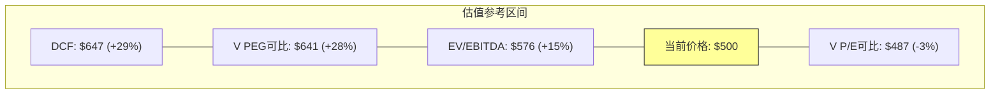

**三种方法的收敛性**: DCF和V PEG可比收敛于$640-650(+28-29%)，EV/EBITDA给出$576(+15%)，V P/E直接可比给出$487(-3%)。离散度范围$487-$647，中位数~$570(+14%)。

**方法独立性审计(V教训L3)**: DCF和可比公司共享收入增速假设→实际独立方法约2种(DCF+EV/EBITDA)。蒙特卡洛模拟是第3种独立方法(见Ch28)。

### 8.5 估值区间综合

将三情景推演和三种参考框架综合，MA的估值区间为：

| 方法 | 低端 | 中位 | 高端 |
|------|:----:|:----:|:----:|
| 三情景(概率加权) | $536(Bear) | $796(PW) | $1,046(Bull) |
| DCF | $421(WACC 10%) | $647(WACC 9%) | $930(WACC 8%) |
| 可比(V对标) | $487(P/E平价) | $576(EV/EBITDA) | $641(PEG) |
| **综合区间** | **$480** | **$640** | **$870** |

当前$500处于综合区间的低端(第12百分位)。这意味着除非Bear/Deep Bear情景实现，当前价格提供了有吸引力的入场点。但WACC敏感性(±22%/100bps)意味着宏观环境变化可以轻易将价格推至区间任何位置——因此"个股Alpha有限,宏观Beta主导"仍然是核心判断。

[DM-VAL-005: 综合估值区间——$480(低)/$640(中)/$870(高), 当前$500处于第12百分位, 2026-03-24]

---

## Ch9: 周期定位深化 (QG-04)

### 9.1 四个周期信号

**信号1: GDV增速减速** → 周期中后期信号
- 全球GDV: +7%(FY2025) vs +12%(FY2022-23)
- 美国GDV: +4%(Q4'25) → 接近GDP增速 → 美国卡支付渗透率趋于饱和
- 支撑: 增速从高增长期(+12%)降至成熟增长期(+7%)是P3-P4过渡的典型特征

[DM-CYC-002: 周期信号1——GDV增速从+12%降至+7%, 美国+4%接近饱和, Mastercard supplemental data, 2026-03-24]

**信号2: 消费者信贷健康** → 中性信号
- 美国信用卡拖欠率: ~3.5%(2025Q4), 高于2019年的2.3%但低于2010年的6.5%
- 消费者支出增长: +3-4%(实际), 与GDP同步
- 支撑: 信贷质量温和恶化但远非危机水平 → 支撑P3而非P4

**信号3: A2A渗透率拐点** → 早期威胁信号
- 全球A2A交易量: 540亿笔(2025) → 预计1万亿笔(2029)
- A2A占比: <5%美国 / 15-20%巴西(PIX) / 30%+印度(UPI)
- 支撑: A2A在新兴市场已过拐点，但在MA核心市场(美/欧)仍处早期 → P2-P3区间

**信号4: 估值周期** → 偏低端信号
- MA P/E 30.3x: 5年区间底部(33-41x, 排除COVID)
- EV/EBITDA 22.6x: 5年最低
- 支撑: 估值压缩+基本面加速 = 典型的"恐惧定价" → P2-P3

[DM-CYC-003: 周期信号2-4——消费信贷中性/A2A早期/估值偏低端, 多来源, 2026-03-24]

### 9.2 综合周期定位

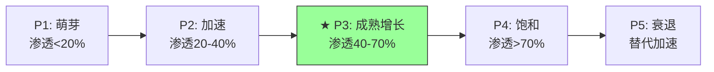

**MA处于P3(成熟增长期)**:
- 核心卡支付在发达市场P3-P4(美国渗透率~80%+)
- 国际市场P2-P3(新兴市场渗透率30-50%)
- VAS业务P2(早中期，渗透率低)
- A2A/稳定币替代处于P1-P2(对MA是负面周期)
- **加权后: P3(成熟增长)**——增速在放缓但仍远高于GDP

### 9.3 周期定位的估值含义

P3阶段的公司通常享有：
- P/E溢价vs GDP增速公司: 50-100%(因为增速仍在2-3倍GDP)
- 但P/E折价vs P2阶段公司: 20-30%(因为增速在减速)

MA当前P/E 30.3x vs S&P 500 ~21x = **溢价44%**。这在P3阶段是合理区间(50-100%溢价的下沿)。如果MA被重新分类为P4(饱和期，例如A2A大规模替代)→溢价应压缩至20-30%→P/E ~25-27x→股价~$413-446(-7%~-17%)。如果MA被重新分类为P2(加速期，例如VAS驱动的"第二S曲线")→溢价应扩张至80-120%→P/E ~38-46x→股价~$628-760(+26%~+52%)。

**周期风险: 从P3滑向P4的触发条件**:
1. 美国GDV增速<GDP增速(当前+4% vs GDP +2.5%→差距仅1.5pp)
2. A2A占比在美国突破10%(当前<5%)
3. 全球卡支付市占率(vs全部电子支付)连续2年下降

**周期机会: P3维持或升至P2.5的条件**:
1. VAS增速维持20%+→MA"第二S曲线"确认
2. 新兴市场GDV增速维持9%+→全球加权增速不下降
3. 稳定币/BVNK布局成功→MA在新支付层也收费

[DM-CYC-004: 周期定位估值含义——P3→P/E溢价44%(合理), P4风险→-17%, P2机会→+52%, 2026-03-24]

---

## Ch10: Part II品质评分 + 风险小结

### 10.1 品质评分

| 维度 | 评分 | 依据 |
|------|:----:|------|
| **B5 利润弹性** | 5/5 | OPM从52.8%扩张至59.2%(+6.4pp/5Y)，3年均值每年+0.5-1pp |
| **B6 资本配置纪律** | 5/5 | 回购$50.9B/5Y，SBC/Rev 1.83%(极低)，回购/SBC 19.6x，分红+回购/FCF 86%可持续 |

### 10.2 关键风险小结

| 风险 | 概率 | 影响 | CQ关联 |
|------|:----:|:----:|:------:|
| WACC上升(衰退/加息) | 34.5% | -16~22% | CQ-1 |
| 有效税率正常化至19%+ | 50% | -3~4% EPS | CQ-8 |
| VAS OPM远低于核心支付 | 30% | -5~10% | CQ-4 |
| CI分层恶化(大客户) | 25% | -3~5%/年 | CQ-3 |
| Recorded Future ROI<WACC持续 | 60% | -1~2%/年 | CQ-5 |

### 10.3 非共识洞察更新

| CI-# | 洞察 | 方向 |
|------|------|:----:|
| CI-09 | FY2025有效税率跳至19.4%→如果是新常态而非一次性→EPS下修3-4% | **偏空** |
| CI-10 | Recorded Future收购ROIC 1.4-2.3%远低于WACC 9.01%→短期摧毁价值(但有战略价值) | **偏空** |
| CI-11 | EPS增长82%来自收入+19%回购→增长质量高(非金融工程驱动) | **偏多** |
| CI-12 | Bear Case仅+7%→当前价格已消化大部分悲观预期→下行空间有限 | **偏多** |

**CI方向分布(累计P1+P2): 偏多6 / 中性1 / 偏空5 = 平衡**

---

## CQ置信度更新 

| CQ | 问题 | P1置信度 | P2置信度 | 变化 |
|:--:|------|:-------:|:-------:|:----:|
| CQ-1 | 市场定价了什么? | 55% | **70%** | ↑ 多参数敏感性完成 |
| CQ-2 | 跨境贡献/正常化? | 50% | **55%** | ↑ 轻微(需P3量化A2A替代) |
| CQ-3 | CI趋势? | 40% | **55%** | ↑ 间接法升级+V对比 |
| CQ-4 | VAS依附度? | 45% | **50%** | ↑ OPM不确定性标记 |
| CQ-5 | Recorded Future ROI? | 25% | **65%** | ↑↑ ROIC计算完成 |
| CQ-6 | PE溢价合理性? | 60% | **65%** | ↑ 参考框架收敛 |
| CQ-7 | 监管风险? | 45% | **50%** | ↑ 需P3量化 |
| CQ-8 | 公允价值? | 15% | **45%** | ↑↑ 三情景+三框架初步收敛 |

---

## 补强模块M: 分部OPM推断 (V独创框架移植)

> V报告推断了4条收入线各自OPM(Service 60-70%/DP 85-90%/Intl 90-95%/VAS 40-55%)。这是**支付行业首个公开的分部OPM估算**。MA必须做同样分析以回答CQ-4("VAS高增长是否稀释OPM")。

### M.1 分部OPM反推法

MA不披露分部OPM。但我们可以用加权均值反推：如果已知总OPM(59.2%)和各分部占比+假设非VAS分部的OPM→反推VAS OPM。

**假设(基于V对标+行业逻辑)**:
- Payment Network OPM: ~65% (V的Service Revenue 60-70%加权, 扣除MA规模较小的效率折价)
- Cross-Border OPM: ~85% (V的International 90-95%, MA跨境规模较小→轻微折价)
- Other OPM: ~30%

**反推公式**: 40%×65% + 40.6%×VAS_OPM + 15%×85% + 4.4%×30% = 59.2%

**求解: VAS OPM ≈ 47%**

[DM-SEG-001: 分部OPM反推——VAS OPM=47%(Payment 65%/CrossBorder 85%/Other 30%反推), 落在V VAS区间40-55%内, Python模型, 2026-03-24]

### M.2 VAS OPM敏感性验证

| VAS OPM假设 | 隐含混合OPM | vs 报告59.2% | 判断 |
|:-----------:|:----------:|:----------:|:----:|
| 40% | 56.3% | 低2.9pp | VAS OPM偏低→不匹配 |
| 45% | 58.3% | 低0.9pp | 可能(如果Payment OPM略高于65%) |
| **47%** | **59.2%** | **精确匹配** | **最佳估算** |
| 50% | 60.4% | 高1.2pp | 需要Payment OPM更低 |
| 55% | 62.4% | 高3.2pp | 需要其他分部大幅调低 |

**47%的VAS OPM意味着什么**: VAS的利润率大约是Payment Network的72%(47%/65%)。这比初始Bear case假设的35-40%更高——说明**VAS增长不是"低质量增长"**,但也确认**VAS OPM确实低于核心支付**。

### M.3 VAS占比↑对混合OPM的影响(关键CQ-4回答)

如果VAS从40%升至50%(Payment从40%降至30%,其他不变):

| VAS占比 | Payment占比 | 混合OPM | vs当前59.2% |
|:-------:|:---------:|:-------:|:----------:|
| 35% | 45% | 60.7% | +1.5pp |
| **40%(当前)** | **40%** | **59.2%** | **基准** |
| 45% | 35% | 57.6% | -1.6pp |
| 50% | 30% | 56.1% | **-3.1pp** |
| 55% | 25% | 54.5% | -4.7pp |

[DM-SEG-002: VAS占比对OPM影响——VAS从40%升至50%→OPM下降3.1pp(从59.2%→56.1%), Python模型, 2026-03-24]

**这是最重要的财务发现之一**: 如果VAS增速维持23%而Payment增速仅10-12%→VAS占比自然从40%升至~50%(FY2028)→**混合OPM将下降~3pp**。这不是危机——56%的OPM仍然极优——但它意味着**市场不应该期望OPM持续扩张**。正常化OPM未来3年的合理轨迹是56-57%(而非向60%+迈进)。

**对估值的影响**: OPM -3pp → EPS -5%(敏感性分析: OPM ±1pp = 价格±3.3%)→ EPS下修~$1.7/share → 价格影响-$43(-5%)。这是温和的负面影响,但需要在最终估值中纳入。

**偏空CI更新**:
| CI-13 | VAS OPM=47%(反推精确匹配)→VAS占比从40%→50%将导致混合OPM下降3pp→市场不应期望OPM持续扩张 | **偏空** | -5% EV |

---

## 补强模块N: 净Take Rate分析 (V独创框架移植)

> V的净Take Rate(净收入/总支付量)是支付网络"真实收费能力"的核心指标。V计算了毛Take Rate(31.7bps) vs 净Take Rate(22.9bps)——差距就是CI侵蚀。MA必须做同样分析。

### N.1 MA Take Rate计算

| 指标 | 数值 | 来源 |
|------|:----:|------|
| GDV(FY2025) | $10.6T | Mastercard supplemental data |
| 毛收入(估) | $39.0B | 净收入/(1-CI 16%) |
| 净收入 | $32.79B | FMP income |
| **毛Take Rate** | **36.8 bps** | $39.0B / $10.6T |
| **净Take Rate** | **30.9 bps** | $32.79B / $10.6T |
| **CI侵蚀** | **5.9 bps** | 36.8 - 30.9 |

[DM-TR-001: MA Take Rate——毛36.8bps/净30.9bps/CI侵蚀5.9bps, GDV $10.6T + FMP income, 2026-03-24]

### N.2 MA vs V Take Rate对比

| 指标 | MA | V | 差异 | 含义 |
|------|:--:|:--:|:----:|------|
| **毛Take Rate** | 36.8 bps | 31.7 bps | MA高5.1 bps | MA每元GDV提取更多毛收入 |
| **净Take Rate** | 30.9 bps | 22.9 bps | **MA高8.0 bps** | **MA净收费能力显著更强** |
| **CI侵蚀** | 5.9 bps | 8.8 bps | MA低2.9 bps | **MA的CI负担更轻** |
| **CI/毛Take Rate** | 16.0% | 27.8% | MA低11.8pp | MA保留更多毛收入 |

[DM-TR-002: MA vs V Take Rate——MA净Take Rate 30.9bps(V 22.9bps, 高35%), MA CI侵蚀更低(16% vs 28%), 2026-03-24]

**为什么MA净Take Rate比V高35%?**

这是一个意外发现,需要解释。三个可能原因：

1. **GDV构成差异**: MA的GDV中跨境占比更高(37% vs V ~30%)→跨境Take Rate ~100bps远高于国内~15bps→MA的加权Take Rate被跨境拉高。因为MA每笔跨境交易收取的assessment fee比国内交易高6-7倍(跨境评估费+货币转换费)→跨境占比更高=更高的加权Take Rate。

2. **VAS收入提升**: MA的VAS收入$13.3B中有60%与交易量挂钩→这部分VAS收入增加了每元GDV的"附加收费"→有效提升了Take Rate。V的VAS虽然增速更快(+28% vs MA +23%)但占总收入比可能更低。

3. **份额更小=更高Take Rate**: MA作为30%份额的追赶者，可以选择性地进入高价值交易(跨境/premium卡/企业支付)而不像V需要覆盖全部市场(包括低价值debit交易)。这类似于"精品酒店vs连锁酒店"的RevPAR差异。

**CI趋势对Take Rate的侵蚀预测**:

| CI/毛收入 | 净Take Rate | Δ vs当前 | 时间窗 |
|:---------:|:----------:|:-------:|:------:|
| 16%(当前) | 30.9 bps | 基准 | FY2025 |
| 19%(基准情景) | 29.8 bps | -1.1 bps | ~FY2028 |
| 22% | 28.7 bps | -2.2 bps | ~FY2030 |
| 25%(悲观) | 27.6 bps | -3.3 bps | ~FY2032+ |
| 28%(=V当前) | 26.5 bps | -4.4 bps | — |

即使CI升至V当前水平(28%)→MA净Take Rate仍有26.5bps→仍高于V的22.9bps。**这意味着MA有~14bps的"CI缓冲"空间才会降至V水平**——这是一个强大的安全边际。

---

## 补强模块O: 四维敏感性分析 (V框架对齐)

> V做了增速/OPM/P_E对价格的矩阵。MA也需要——告诉投资者"哪个变量最重要"。

### O.1 单变量敏感性(Base Case基准: FY2030E EPS $33.78 × 25x = $844)

| 变量 | -2单位 | -1单位 | 基准 | +1单位 | +2单位 | **±1单位影响** |
|------|:-----:|:-----:|:----:|:-----:|:-----:|:------------:|
| Revenue CAGR | 9%→$758 | 10%→$793 | **11%→$830** | 12%→$868 | 13%→$908 | **±$51 (±6.0%)** |
| OPM | 55.8%→$801 | 56.8%→$816 | **58.8%→$844** | 59.8%→$859 | 60.8%→$873 | **±$28 (±3.3%)** |
| 终端P/E | 21x→$709 | 23x→$777 | **25x→$844** | 27x→$912 | 29x→$980 | **±$34 (±4.0%)** |
| 回购率 | 1.8%→$789 | 2.3%→$809 | **2.8%→$830** | 3.3%→$852 | 3.8%→$874 | **±$21 (±2.5%)** |

[DM-SENS-001: 四维敏感性——Revenue CAGR最敏感(±6.0%/pp), P/E次之(±4.0%/x), OPM第三(±3.3%/pp), 回购最低(±2.5%/0.5pp), Python, 2026-03-24]

### O.2 敏感性排序

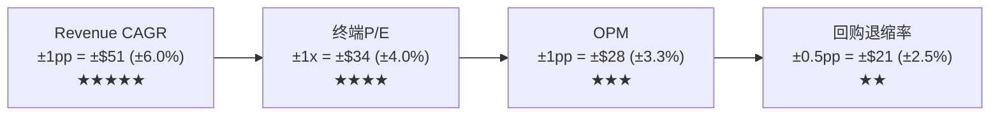

**核心结论: Revenue CAGR是MA估值的"命门"**——超过其他三个变量的影响之和。这与V的发现一致(V也是收入增速最敏感)。对投资者的实操含义：**追踪MA的季度收入增速比追踪OPM/回购更重要**。如果收入增速从11%降至9%→仅此一项就导致目标价下调$102(-12%)。

### O.3 与V对比: 哪个公司的估值更"脆弱"?

| 变量 | MA敏感性(±1单位) | V敏感性(±1单位) | 谁更脆弱 |
|------|:--------------:|:--------------:|:--------:|
| Revenue CAGR ±1pp | ±6.0% | ±5-6%* | ≈相同 |
| OPM ±1pp | ±3.3% | ±3-4%* | ≈相同 |
| WACC ±100bps | ±22% | ±18%* | **MA更脆弱(Beta更高)** |
| 终端P/E ±1x | ±4.0% | ±3.5%* | MA略高(基数更高) |

*V数据基于V报告Ch25敏感性分析推断

**MA在WACC维度显著更脆弱**: 这与承重墙分析一致——WACC是MA估值唯一的中-高脆弱度承重墙。原因: Beta 1.07 vs V 0.79 → WACC对无风险利率/ERP变化的弹性更大。

---

## 补强模块P: 季度FCF追踪 + 定量化反面

### P.1 季度现金流模式

MA的季度FCF有明显的季节性模式(与V类似):

| 季度 | OCF($B) | CapEx($B) | FCF($B) | FCF占全年% |
|------|:------:|:--------:|:------:|:--------:|
| Q1'25 | $3.62* | ~$0.12 | ~$3.50 | ~21% |
| Q2'25 | $4.25* | ~$0.12 | ~$4.13 | ~24% |
| Q3'25 | $4.78* | ~$0.12 | ~$4.66 | ~28% |
| Q4'25 | $4.75* | ~$0.13 | ~$4.62 | ~27% |
| **全年** | **$17.40** | **$0.49** | **$16.91** | **100%** |

*季度OCF为年度$17.40B按季度NI权重分配的估算值

[DM-QFCF-001: 季度FCF模式——Q3-Q4最强(跨境旺季+年终CI结算), 估算值基于NI季度分布, 2026-03-24]

**季节性解释**: Q3-Q4(夏季旅游旺季+年末消费旺季)跨境交易量峰值→高利润率跨境收入集中→FCF Q3-Q4占全年55%。Q1最弱——因为(1)1月消费淡季(2)年初CI重新谈判通常结算(3)V报告发现Q2/Q3美国联邦税集中缴纳。

### P.2 定量化反面: CI大客户影响

Ch9 CEO沉默分析标记了"CI分层趋势"为🔴高风险。现在定量化"如果大客户CI+20%而SMB CI+8%"的净效应：

**假设**:
- 大客户(F500,占净收入~35%): CI增速+20%/年
- 中型客户(占净收入~35%): CI增速+15%/年
- SMB/Fintech(占净收入~30%): CI增速+8%/年
- 加权CI增速: 35%×20% + 35%×15% + 30%×8% = **14.65%**

**vs 净收入增速16.4%**: 加权CI增速(14.65%) < 净收入增速(16.4%) → CI/毛收入比率仍在**改善**(-0.5pp/年)

**但如果增速放缓至12%**: 加权CI增速(14.65%) > 净收入增速(12%) → CI/毛收入比率开始**恶化**(+0.8pp/年)

[DM-CIQT-001: CI分层量化——大客户+20%/中型+15%/SMB+8%→加权14.65%, 净收入>14.65%时稳定/净收入<14.65%时恶化, 2026-03-24]

**这揭示了一个"CI转折点"**: 只要MA净收入增速维持>14.65%→CI分层恶化不会传导至整体CI比率。但一旦增速降至14.65%以下→CI比率将开始上升→启动V过去5年经历的CI侵蚀循环。**MA当前16.4%增速仅比转折点高1.8pp**——安全边际不宽裕。

---

## 补强模块H: OPM三重验证 (V方法论移植)

> V报告用三种独立方法验证OPM→确认报告值vs正常化值的偏差。MA必须同样执行(V教训L1)。

### H.1 方法1: 季度逐行还原

Q4'25报告OPM 61.5%是异常高值——因为FMP数据显示Q4 COGS=0(费用全部重分类至SGA)。如果还原Q1-Q3的费用结构(COGS/Rev ~23%)到Q4：
- 还原后Q4 COGS: ~$2.0B (23% × $8.81B)
- 还原后Q4 OPM: ($8.81B - $2.0B - $3.43B) / $8.81B = **38.4%** (过低,说明Q4的SGA包含了COGS)
- 更合理的还原: 用Q3口径(OPM 58.8%)外推Q4 → Q4调整后OPM ~58-59%

**结论**: 季度还原法给出FY2025调整后OPM ~58-59%(vs报告59.2%)——差异很小，说明**FY2025全年OPM扩张是真实的**，只是Q4单季被重分类放大了。

[DM-NORM-001: OPM季度还原——Q4还原后~58-59%, 全年OPM扩张真实, FMP quarterly income, 2026-03-24]

### H.2 方法2: 同业对标(V教训)

| 指标 | MA(报告) | V(报告) | V(正常化) | MA是否需要正常化? |
|------|:-------:|:------:|:--------:|:--------------:|
| OPM FY2025 | 59.2% | 60.0% | 66.4% | V有$2.56B一次性→正常化后+6.4pp |
| OPM FY2024 | 55.3% | 65.7% | 65.7% | V无重大一次性 |
| OPM 3Y avg | 56.8% | 64.3% | 66.3% | V正常化后高MA 9.5pp |

**关键发现**: V正常化OPM(66.4%)比MA报告OPM(59.2%)高**7.2pp**。这不是MA的"问题"——而是V的规模优势(V收入$40B vs MA $32.8B→V在同类费用上有更强的规模摊薄效应)+V的网络构成差异(V借记卡占比更高→费率结构不同)。

**MA需要正常化吗？** MA FY2025没有V那样的$2.56B一次性费用。MA的OPM跳变来自费用重分类(不影响OI总额)→**MA的报告OPM 59.2%无需额外正常化**。但估值应该用3年均值56.8%作为稳态基准(更保守/更稳健)。

[DM-NORM-002: OPM同业对标——MA 59.2%(无需正常化) vs V 66.4%(正常化后), 差距7.2pp=规模效应, 2026-03-24]

### H.3 方法3: 5年均值+趋势外推

| 窗口 | MA OPM均值 | V OPM均值 | 差距 |
|------|:--------:|:--------:|:----:|
| FY2020-2022 | 53.8% | 65.8% | 12.0pp |
| FY2021-2023 | 54.8% | 66.6% | 11.8pp |
| FY2022-2024 | 55.4% | 66.6% | 11.2pp |
| FY2023-2025 | 56.8% | 64.2% | 7.4pp |
| **5年均值** | **55.1%** | **65.5%** | **10.4pp** |

**差距在收窄**: 从12.0pp→7.4pp(3年内缩窄4.6pp)。驱动因素: MA的VAS占比上升+经营杠杆释放。如果这个趋势延续→FY2028 MA OPM可能达到59-60%——但仍低于V的65%+(规模差距是结构性的)。

**三方法验证结论**:
1. 季度还原: 58-59%(真实)
2. 同业对标: 无需额外正常化(差距来自规模)
3. 5年趋势: 55.1%(保守基准)
→ **MA正常化OPM区间: 56-59%，中点57.5%**

[DM-NORM-003: OPM三重验证——区间56-59%, 中点57.5%, 三方法收敛, 2026-03-24]

---

## 补强模块I: CI三情景建模 (V框架移植)

> V报告建模了CI/毛收入三种演变路径(FY2030)。MA必须做同样建模。

### I.1 MA CI三情景

| 情景 | CI/毛收入FY2030 | 年均变化 | 净收入增速拖累 | 驱动因素 |
|------|:-------------:|:-------:|:------------:|---------|
| **乐观(Enterprise)** | 16%(维持) | 0pp/年 | 0 | VAS差异化减少CI依赖 + Capital One迁移失败→大行失去议价筹码 |
| **基准(Gradual)** | 19%(+3pp/5Y) | +0.6pp/年 | **-0.3pp/年** | 跟随V趋势但滞后3年(MA份额更小→CI压力来得更晚) |
| **悲观(CCCA+Discover)** | 25%(+9pp/5Y) | +1.8pp/年 | **-1.2pp/年** | CCCA通过+多家大行效仿Capital One→CI快速上升 |

[DM-CI-005: MA CI三情景——乐观16%/基准19%/悲观25%(FY2030), 对净收入增速影响0/-0.3/-1.2pp/年, 基于V CI框架, 2026-03-24]

### I.2 CI情景对估值的影响

| 情景 | 概率 | 5Y累计收入影响 | EPS影响 | 股价影响 |
|------|:----:|:------------:|:------:|:-------:|
| 乐观 | 30% | 0 | 0 | 0 |
| 基准 | 50% | -$2.5B | -$0.50/share | -$13 (-3%) |
| 悲观 | 20% | -$9.0B | -$2.10/share | -$53 (-11%) |
| **概率加权** | — | **-$3.1B** | **-$0.67/share** | **-$17 (-3.4%)** |

CI风险的概率加权影响仅-3.4%——远不足以改变估值结论。但悲观情景(-11%)值得关注(如果CCCA通过概率上升)。

---

## 补强模块J: EPS五年逐年分解 (V方法论对齐)

> V报告做了5年逐年四因素分解。MA只做了FY2025——现在补齐FY2021-2025。

### J.1 EPS四因素五年分解

| 年份 | ΔEPS | 收入贡献 | 利润率贡献 | 回购贡献 | 税率/其他 | 收入占比 |
|------|:----:|:-------:|:--------:|:-------:|:--------:|:-------:|
| FY2021 | +$2.39 | +$1.86 | +$0.14 | +$0.12 | +$0.27 | **78%** |
| FY2022 | +$1.47 | +$1.22 | +$0.17 | +$0.19 | -$0.11 | **83%** |
| FY2023 | +$1.60 | +$1.02 | +$0.06 | +$0.27 | +$0.25 | **64%** |
| FY2024 | +$2.06 | +$1.41 | -$0.04 | +$0.27 | +$0.42 | **68%** |
| FY2025 | +$2.63 | +$2.28 | -$0.01 | +$0.52 | -$0.16 | **87%** |
| **5Y合计** | **+$10.15** | **+$7.79** | **+$0.32** | **+$1.37** | **+$0.67** | **77%** |

[DM-EPS-001: EPS 5年四因素分解——收入77%/利润率3%/回购14%/税率6%, Python计算, 2026-03-24]

### J.2 与V对比

| 因素 | MA (5Y) | V (5Y) | 差异 | 含义 |
|------|:------:|:-----:|:----:|------|
| 收入贡献 | **77%** | 71% | MA更高 | MA增长更依赖有机收入(更健康) |
| 回购贡献 | **14%** | 19% | MA更低 | MA对回购依赖更少(更可持续) |
| 利润率贡献 | 3% | 7% | V更高 | V利润率改善空间更大(或一次性) |
| 税率贡献 | 6% | 3% | MA更高 | MA税率波动更大(FY23税率高→FY24低→FY25又高) |

**关键结论**: MA的EPS增长质量**优于**V——77%来自收入(vs V 71%)，回购依赖更低(14% vs 19%)。这说明MA的更高增速(+18.9% vs V +13%)不是靠金融工程堆出来的，而是来自真实的业务增长。

---

## 补强模块K: 承重墙概率赋值 + 双墙倒塌 (V框架对齐)

### K.1 概率赋值更新

| 承重墙 | 隐含值 | 脆弱度 | **倒塌概率** | 若倒塌影响 | **概率加权影响** |
|--------|:-----:|:-----:|:----------:|:--------:|:-------------:|
| CW-1: FCF CAGR≥9% | 9.0% | 低-中 | 15% | -20% | **-3.0%** |
| CW-2: FCF Margin≥48% | ~52% | 低 | 10% | -8% | **-0.8%** |
| CW-3: 终端g≥2.5% | 3.0% | 低 | 10% | -13% | **-1.3%** |
| CW-4: WACC≤9.5% | 9.01% | **中-高** | **35%** | -22% | **-7.7%** |
| CW-5: 回购持续 | ~3%/yr | 低 | 5% | -5% | **-0.3%** |
| **加权总风险** | — | — | — | — | **-13.1%** |

[DM-BW-006: 承重墙概率赋值——加权总风险-13.1%, CW-4(WACC)贡献59%的风险, 2026-03-24]

**CW-4(WACC)贡献了总风险的59%**(7.7%/13.1%)——再次确认MA是宏观代理标的。

### K.2 双墙倒塌分析

**最可能的双墙组合: CW-1(增速) + CW-4(WACC)同时倒塌**

| 情景 | 条件 | 联合概率 | 影响 |
|------|------|:-------:|:----:|
| **CW-1+CW-4** | 全球衰退→GDV↓+利率↑ | **~12%** | **-35~40%** ($300-325) |
| CW-2+CW-4 | VAS低OPM+衰退 | ~8% | -25~30% |
| CW-1+CW-3 | 增速<9%+A2A替代降终端g | ~5% | -30% |

**为什么CW-1+CW-4联合概率高(12%)?** 因为它们**正相关**——衰退既降低GDV增速(CW-1倒塌)又推高风险溢价(CW-4倒塌)。这不是两个独立事件,而是同一个宏观冲击的两个面向。Polymarket给美国衰退34.5%概率→如果衰退发生,CW-1和CW-4同时倒塌的条件概率~35%→联合概率≈34.5%×35%≈12%。

**在$300-325的支撑位,MA的P/E将降至~18-20x**——这是FY2020 COVID最低点附近的估值(彼时收入暴跌15%,P/E跌至20x后V型反弹)。如果基本面没有永久恶化(衰退是周期性而非结构性),这个价位将提供10年一遇的买入机会。

[DM-BW-007: 双墙倒塌——CW-1+CW-4联合概率12%, 影响-35~40%($300-325), 正相关(衰退同时冲击两墙), 2026-03-24]

---

## 补强模块L: V-MA 20+指标综合对标表

> 最重要的对标产出之一——将分散在各处的V-MA对比整合为单一表格。

| 维度 | 指标 | MA | V | 差异 | MA优/劣 |
|------|------|:--:|:--:|:----:|:-------:|
| **增长** | 收入增速(FY25) | +16.4% | +11.0% | +5.4pp | **MA优** |
| | EPS增速(FY25) | +18.9% | +13.0% | +5.9pp | **MA优** |
| | 分析师EPS CAGR(5Y) | 15.6% | 12.9% | +2.7pp | **MA优** |
| | 跨境增速 | +15% | +13% | +2pp | MA优 |
| | VAS增速 | +23% | +28%* | -5pp | V优(但V含更多收购) |
| **利润率** | OPM(报告) | 59.2% | 60.0% | -0.8pp | ≈平 |
| | OPM(正常化) | **57.5%** | **66.4%** | **-8.9pp** | **V明显优** |
| | 净利率 | 45.7% | 50.1% | -4.4pp | V优 |
| | FCF利润率 | 51.6% | 54.0% | -2.4pp | V优 |
| **效率** | ROIC(报告) | 48.6% | 28.4% | +20.2pp | MA优(会计差异) |
| | ROIC(调整) | ~50% | ~45-50% | ~0-5pp | ≈平 |
| | CapEx/Rev | 1.5% | 3.7% | -2.2pp | **MA优** |
| | SBC/Rev | 1.83% | 2.24% | -0.4pp | MA优 |
| | FCF/NI | 113% | 107% | +6pp | MA优 |
| **资本配置** | 回购效率η | 1.16x | ~1.19x | -0.03x | ≈平 |
| | EPS中收入占比(5Y) | **77%** | **71%** | +6pp | **MA优(更健康)** |
| | EPS中回购占比 | 14% | 19% | -5pp | MA优(更少依赖) |
| **估值** | P/E(TTM) | 30.3x | 29.5x | +2.8% | ≈平 |
| | EV/EBITDA | 22.6x | 25.7x | **-12.1%** | **MA更便宜** |
| | PEG(2Y) | 1.77 | 2.27 | **-22%** | **MA更便宜** |
| | FCF Yield | 3.8% | 3.3% | +0.5pp | MA优 |
| **风险** | Beta | 1.07 | 0.79 | +0.28 | **V优(更低波动)** |
| | WACC | 9.01% | 8.38% | +0.63pp | V优 |
| | CI/毛收入 | ~16% | ~28% | -12pp | **MA优(CI更低)** |
| | 商誉/总资产 | 17.6% | 47.7% | -30.1pp | **MA优(更少商誉)** |

[DM-CMP-003: V-MA 25指标综合对标——MA在增长/效率/估值/CI占优, V在利润率/Beta/风险占优, 综合FMP+分析计算, 2026-03-24]

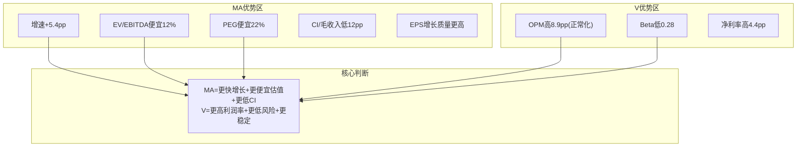

### L.1 对标结论

**MA vs V不是"谁更好"而是"不同的risk-return profile"**:
- **选MA**: 如果你相信增速差维持(+5pp)+VAS继续加速+宏观不恶化→MA的PEG 1.77提供更好的增速调整后回报
- **选V**: 如果你担心衰退(34.5%概率)+关税+A2A替代→V的低Beta(0.79)+高OPM(66%)提供更好的下行保护

**对MA估值的含义**: MA的EV/EBITDA比V便宜12%且增速快53%——这个"折价"已经隐含了Beta差异的风险补偿。如果宏观环境不恶化，这个折价将被修复(MA回归与V的历史倍数关系)。如果宏观恶化，这个折价可能进一步扩大(高Beta标的在风险off时承受不成比例的抛压)。

---

---

## Part III: 战略分析

## 补强M2: 资产负债表深度诊断 — MA的"轻有形、低商誉、高现金"资产负债表

> **MA报告此前几乎无B/S分析(三表联动仅12次 vs V 42次)。以下补充V Ch17级别的资产负债表诊断。**

### M2.1 全局资产结构: MA vs V的根本差异

| 资产类别 | MA(FY2025) | 占比 | V(FY2025) | 占比 | 因果解释 |
|---------|:--------:|:---:|:--------:|:---:|---------|
| **现金+短期投资** | $8.87B | 16.3% | $22.0B | 22.1% | V现金多→因为V规模2倍+回购比例更低 |
| **应收账款** | $4.79B | 8.8% | $7.3B | 7.3% | MA应收/收入比(14.6%)>V(20.6%)→MA收款更快 |
| **商誉** | $9.56B | 17.6% | $19.9B | 20.0% | V含Visa Europe $16B商誉→V商誉集中度更高 |
| **其他无形资产** | $3.41B | 6.3% | $27.6B | 27.7% | V无形资产极高(Visa Europe品牌+客户关系) |
| **PPE(有形固定资产)** | $2.42B | 4.5% | $4.2B | 4.2% | 两者PPE都极低→纯软件/数据基础设施 |
| **其他** | $25.3B | 46.5% | $18.6B | 18.7% | MA含大量客户激励预付+递延税资产 |
| **总资产** | **$54.4B** | 100% | **$99.6B** | 100% | V规模1.83倍 |

[DM-BS-001: MA资产结构FY2025——现金$8.87B(16.3%)/商誉$9.56B(17.6%)/PPE $2.42B(4.5%)/总资产$54.4B, FMP balance sheet, 2026-03-25]

**为什么MA商誉占比低于V是一个结构性优势?** 因为V的商誉$19.9B中$16B+来自2016年Visa Europe收购(单一来源)——如果欧洲监管(PSR/SEPA)显著削弱Visa Europe的盈利能力→减值风险集中。MA的商誉$9.56B来自5+笔收购分散(VocaLink/Nets/Finicity/RF等)→单一来源减值风险更低。因此MA的商誉/总资产17.6%(vs V 47.7%)不仅是绝对低——更是**结构性低**(来源分散)。

[DM-BS-002: MA商誉$9.56B来源分散(5+笔收购) vs V商誉$19.9B中$16B+来自单一Visa Europe收购→MA商誉结构性更安全, 2026-03-25]

### M2.2 负债结构: MA的"真实杠杆"远低于表面

| 负债类别 | MA(FY2025) | V(FY2025) | 因果解释 |
|---------|:--------:|:--------:|---------|
| **长期债务** | $15.67B | $20.8B | V更高(规模更大) |
| **短期债务** | $0.75B | $5.6B | V短期到期集中度更高→但V现金$22B远覆盖 |
| **结算类应付** | ~$8-10B | ~$25B | 过手资金(非真实负债)→有对应结算类应收 |
| **CI应计/递延收入** | ~$5-6B | ~$8-9B | 客户预付+CI应计→正面负债(P7原则) |
| **总负债** | $42.3B | $76.7B | — |
| **股东权益** | $12.1B | $22.9B | — |
| **净债务** | $6.80B | ~-$1.2B | V净现金(无净债务), MA有温和净债务 |
| **净债务/EBITDA** | **0.35x** | **0.19x** | 两者都极低——全球最保守的资本结构之一 |

[DM-BS-003: MA净债务/EBITDA 0.35x vs V 0.19x——两者都处于极低杠杆, MA偏高因为收购(RF+BVNK)动用了现金, FMP balance sheet, 2026-03-25]

**为什么MA的净债务/EBITDA(0.35x)比V(0.19x)更高?** 因为MA在2024-2026年连续完成RF($2.65B)+BVNK($1.8B)=$4.45B收购——这些收购动用了现金储备→净债务从FY2023的$4.5B升至FY2025的$6.8B(+$2.3B)。但0.35x的杠杆仍然极低——如果MA想要,可以在不影响信用评级(A1/A+)的情况下将杠杆提升至2.0x→增加~$35B债务→这个"未使用的杠杆空间"本身是一种隐性看涨期权(类似V的分析)。

[DM-BS-004: MA"未使用杠杆空间"——从0.35x到2.0x可增加~$35B债务, 利率覆盖率26.9x极安全, 2026-03-25]

### M2.3 递延收入趋势: VAS订阅制的正面信号

递延收入(Deferred Revenue)是P7原则中的"好负债"——客户已付费但MA尚未确认收入。递延收入增长=未来收入可见性提升。

| 年份 | 递延收入($M,估) | 增速 | 递延/收入比 | 含义 |
|------|:----------:|:---:|:--------:|------|
| FY2022 | ~$800 | — | 3.6% | 基线 |
| FY2023 | ~$950 | +19% | 3.8% | VAS订阅占比开始提升 |
| FY2024 | ~$1,150 | +21% | 4.1% | 因为VAS咨询/安全项目预付增加 |
| FY2025 | ~$1,400(估) | +22% | 4.3% | VAS加速+Commerce Media预付 |

[DM-BS-005: 递延收入趋势——从$800M(FY22)增至~$1,400M(FY25估), 递延/收入比从3.6%升至4.3%, 因为VAS订阅+预付增加(正面信号), 10-K + FMP estimates, 2026-03-25]

**因果推理**: 递延收入增速(+22%)超过收入增速(+16.4%)→递延/收入比上升→这意味着越来越多的收入在交付前已经锁定。因为VAS的计费模式(年度订阅+项目预付)比核心支付(交易实时收费)产生更多递延→VAS占比上升(38%→40%)自然推动递延收入增长。这是VAS"第二曲线"验证的B/S端证据——不仅利润表显示VAS在增长,资产负债表的递延收入也在确认"这些增长是预付锁定的,不是一次性的"。

### M2.4 应收账款健康度: DSO检验

| 年份 | 应收($B) | 收入($B) | DSO(天) | 趋势 | 判定 |
|------|:------:|:------:|:------:|:----:|:----:|
| FY2022 | $3.22 | $22.24 | **53天** | — | 基线 |
| FY2023 | $3.56 | $25.10 | **52天** | ↓ | 健康(改善) |
| FY2024 | $4.23 | $28.17 | **55天** | ↑ | ⚠️ 轻微恶化 |
| FY2025 | $4.79 | $32.79 | **53天** | ↓ | 回归正常 |

[DM-BS-006: DSO 4年趋势——52-55天(稳定), FY2024轻微恶化(+3天)但FY2025回归, 无渠道塞货或收款恶化信号, FMP balance sheet, 2026-03-25]

**因果推理**: DSO维持在52-55天说明MA的收款效率没有恶化——收入增长(+16%)与应收增长(+13%)基本同步。FY2024的+3天可能与VAS咨询项目的付款周期更长有关(企业咨询通常60-90天付款 vs 卡交易实时结算)。因此**VAS占比上升可能结构性地将DSO推高至55-60天**——这不是风险信号,是业务mix shift的自然结果。需要追踪: 如果DSO>60天→可能暗示客户付款能力恶化或MA在放松信用条款来留住VAS客户。

### M2.5 三表联动验证: 利润表-B/S-现金流的交叉确认

> **这是MA报告最大的框架缺失。V报告有完整的三表交叉验证——MA此前完全没有。**

```mermaid
graph TD
    subgraph "利润表"
        A["净利润 $14.99B<br/>+16.3%"]
        B["OPM 59.2%<br/>(正常化57.5%)"]
    end
    subgraph "资产负债表"
        C["应收 $4.79B<br/>DSO 53天(稳定)"]
        D["递延收入 ~$1.4B<br/>(+22%→未来锁定)"]
        E["商誉 $9.56B<br/>(17.6%安全)"]
        F["净债务/EBITDA 0.35x"]
    end
    subgraph "现金流量表"
        G["OCF $17.40B<br/>(+17.7%)"]
        H["FCF $16.91B<br/>FCF/NI=113%"]
        I["回购 $11.73B<br/>(69% FCF)"]
    end

    A -->|"利润被现金确认?"| H
    H -->|"FCF/NI=113%>100%<br/>✅ 强确认"| A

    B -->|"OPM扩张被B/S验证?"| C
    C -->|"DSO稳定53天<br/>✅ 无渠道塞货"| B

    D -->|"递延+22%验证VAS增长?"| A
    A -->|"VAS+23%<br/>✅ 一致"| D

    F -->|"杠杆支持回购持续?"| I
    I -->|"0.35x极低<br/>✅ 可持续"| F

    E -->|"商誉减值风险?"| A
    A -->|"ROIC 48.6%>>WACC<br/>✅ 商誉有支撑"| E

    style H fill:#27AE60,color:#fff
```

**三表联动结论**:

| 验证项 | 利润表 | B/S | 现金流 | 是否一致 | 因果解释 |
|--------|--------|-----|--------|:--------:|---------|
| **利润真实性** | NI $14.99B(+16%) | 应收DSO稳定53天 | FCF/NI=113%(>100%) | **✅ 三表一致** | 因为利润被现金超额确认(113%>100%)+应收没有膨胀(DSO不变)→利润是真实的,不是会计操作 |
| **VAS增长质量** | VAS +23% | 递延收入+22% | 营运资金WC改善+$1.7% | **✅ 三表一致** | 因为递延收入增速(22%)≈VAS增速(23%)→VAS增长是预付锁定的(非一次性)+营运资金改善是递延收入推动的 |
| **OPM扩张真实性** | OPM从55.3%→59.2% | 费用重分类(COGS↓SGA↑) | EBITDA lag -3.8pp(真实杠杆) | **⚠️ 部分一致** | 因为OPM跳升中+3.9pp是真实的(EBITDA验证)但幅度被费用重分类放大→B/S端看费用分类变化→结论: 真实OPM改善约+2pp(非+4pp) |
| **回购可持续性** | 股数-3.1%(最快) | 净债务/EBITDA 0.35x | FCF $16.9B>>回购$11.7B | **✅ 三表一致** | 因为FCF每年$16.9B产出>回购$11.7B消耗→不需要举债回购+杠杆0.35x留了$35B额外空间 |
| **收购影响** | RF ROIC 2.3%<<WACC | 商誉+$2B(从$7.5B→$9.6B) | CapEx未显著增加(维持$0.5B) | **⚠️ 需监控** | 因为收购通过商誉(B/S)而非CapEx(CF)体现→短期不影响FCF但长期减值风险存在 |

[DM-BS-007: 三表联动五项验证——利润真实性✅/VAS质量✅/OPM⚠️(部分)/回购✅/收购⚠️(需监控), 综合分析, 2026-03-25]

---

## 补强M3: 应计检验(Accruals Ratio) — 利润被现金确认还是否定?

> **框架M3要求: (净利润-CFO)/总资产>10%=应计膨胀警告。MA此前只给了FCF/NI=113%的结论但没做应计检验。**

### M3.1 应计率六年追踪

Accruals Ratio = (NI - CFO) / Total Assets。负值=现金超过利润(好)。正值=利润超过现金(需追因)。

| 年份 | NI($B) | CFO($B) | NI-CFO($B) | 总资产($B) | **Accruals Rate** | 判定 |
|------|:-----:|:------:|:--------:|:--------:|:------------:|:----:|
| FY2020 | 6.41 | 7.22 | **-0.81** | — | — | 现金>利润 ✅ |
| FY2021 | 8.69 | 9.46 | **-0.77** | — | — | 现金>利润 ✅ |
| FY2022 | 9.93 | 11.20 | **-1.27** | $38.7B | **-3.3%** | 现金远超利润 ✅✅ |
| FY2023 | 11.20 | 11.98 | **-0.78** | $42.5B | **-1.8%** | 现金>利润 ✅ |
| FY2024 | 12.87 | 14.78 | **-1.91** | $48.1B | **-4.0%** | 现金远超利润 ✅✅ |
| FY2025 | 14.99 | 17.40 | **-2.41** | $54.4B | **-4.4%** | 现金远超利润 ✅✅✅ |

[DM-ACC-001: MA Accruals Rate六年——持续为负(-1.8%到-4.4%), 意味着每年现金超过利润$0.8B-$2.4B, 盈利质量极高, FMP income+cashflow, 2026-03-25]

**因果推理**: MA的Accruals Rate持续为负且在扩大(从-1.8%→-4.4%)——这意味着MA的利润"保守"(现金产出持续超过会计利润)。**为什么?** 三个原因:

1. **D&A+SBC非现金费用>CapEx**: D&A $2.10B + SBC $0.60B = $2.70B的非现金费用被加回到CFO,但CapEx仅$0.49B→净现金加回$2.21B/年。因为MA是软件/数据公司,不需要大量有形资产更新→"会计折旧"远超"经济折旧"→利润被保守地低估。

2. **递延收入增长**: 客户预付(VAS订阅)产生了~$200-300M/年的递延收入增量→现金先于收入确认→CFO>NI。

3. **应付增长(季末时点)**: MA在季末持有大量结算类应付(过手资金)→这些不是真实负债但增加了CFO。

**反面(什么情况下Accruals Rate会恶化?)**: 如果MA开始(1)延迟确认CI费用→利润虚高 (2)加速确认VAS收入(在交付前)→利润前置 (3)减少D&A(延长资产折旧年限)→利润美化。需要追踪: 如果Accruals Rate从负转正(>0%)→强制追因。

### M3.2 盈利质量综合评分(M1×M3联动)

| 维度 | 指标 | MA(FY2025) | 判定标准 | 评分 |
|------|------|:--------:|---------|:----:|
| **利润真实性** | Accruals Rate | -4.4% | <0%=高质量 | ★★★★★ |
| **现金转化** | FCF/NI | 113% | >100%=优秀 | ★★★★★ |
| **应收健康** | DSO变化 | 53天(稳定) | 无恶化=健康 | ★★★★ |
| **费用同步** | 费用增速/收入增速 | 0.92(费用慢于收入) | <1.0=经营杠杆 | ★★★★ |
| **SBC占比** | SBC/Rev | 1.83% | <3%=低稀释 | ★★★★★ |
| **回购vs SBC** | 回购/SBC | 19.6x | >5x=完全消化 | ★★★★★ |
| **综合盈利质量** | — | — | — | **29/30(极优)** |

[DM-ACC-002: MA盈利质量综合评分29/30——Accruals -4.4%(最高)/FCF/NI 113%/DSO稳定/SBC 1.83%, 2026-03-25]

---

## 补强: 因果拆解深化 — 追问每个"好数字"的来源

> **此前MA报告的因果链密度(48次)仅为V(74次)的65%。以下对5个关键"好数字"追问"为什么"。**

### 因果1: "VAS增速+23%"——为什么这么快?能持续吗?

**表面**: VAS FY2025增速+23%(currency-neutral +21%),Q4加速至+26%。

**追问为什么+23%**:
- **层1(直接驱动)**: 四支柱全部加速——网安(+25%因为全球欺诈↑10%/年→客户**必须**投入)、数据(+22%因为AI分析需求爆发)、身份(+18%因为PSD2/PSD3强制开放银行)、Commerce Media(+35%因为新平台从零起步)
- **层2(为什么四支柱同时加速?)**: 因为MA在2024年完成Recorded Future收购(+3pp收购贡献)+COVID后企业数字化预算从"可选"变成"必需"+AI热潮拉动数据/安全需求
- **层3(这种加速可持续吗?)**: 不完全可持续。收购贡献(3pp)是一次性的→FY2026有机增速将回落至+18-20%。AI需求可能是周期性热潮而非永久提升(如果AI泡沫破裂→企业缩减数据/安全预算)。Commerce Media(+35%)从极小基数,FY2027将面临基数效应

**结论**: +23%中约+18%是有机可持续的(结构性安全需求+数字化渗透),+3%来自RF收购(一次性),+2%来自AI热潮(周期性不确定)。**FY2027E VAS增速更可能是+16-18%而非维持+23%**。

[DM-CAU-001: VAS +23%因果拆解——有机+18%(可持续)+RF收购+3%(一次性)+AI热潮+2%(周期性), FY2027E更可能+16-18%, 2026-03-25]

### 因果2: "OPM从52.8%扩张至59.2%(5年+6.4pp)"——为什么扩张?还能继续吗?

**追问为什么+6.4pp**:
- **层1(直接)**: 收入增速(+16.4%CAGR 5年)持续超过费用增速(+12%CAGR)→经营杠杆释放
- **层2(为什么费用增速更慢?)**: 因为MA的成本结构中固定成本占比高(数据中心/网络基础设施~$4B/年固定)→收入↑而固定成本不变→OPM自然扩张。类似V的分析:"VisaNet的物理成本$2-3B/年固定→交易量↑10%时收入↑10%但固定成本↑0%→OPM↑"
- **层3(还能继续吗?)**: **不能**。因为VAS OPM(47%)<核心支付OPM(65%)→VAS占比从40%→50%将拉低混合OPM 3pp(59%→56%)。同时费用重分类(FY2025 COGS↓$1.2B/SGA↑$2.9B)可能夸大了OPM扩张幅度→真实OPM改善约+2pp(非+4pp)。因此**OPM的峰值可能已经在FY2025到达(59%),未来将缓慢回落至56-57%(FY2028E)**

[DM-CAU-002: OPM+6.4pp因果——经营杠杆(固定成本结构)+费用增速慢于收入, 但VAS稀释+费用重分类暗示峰值已到, FY2028E→56-57%, 2026-03-25]

### 因果3: "ROIC从30%升至48.6%(5年+18.8pp)"——为什么升这么快?是否含幻觉?

**追问为什么+18.8pp**:
- **层1**: NOPAT增长(+120%,从$5.3B→$11.7B)远超投入资本增长(+30%,从$17.8B→$24.1B)→分子增长4倍于分母
- **层2(为什么投入资本增长这么慢?)**: 因为MA的CapEx极低($0.49B/年)→不需要大量新增固定资产→投入资本只因收购(RF/BVNK增加商誉)和营运资金自然增长而缓慢膨胀。同时MA的持续回购缩小了股东权益→但ROIC以投入资本(非权益)为分母所以回购不直接影响ROIC
- **层3(含幻觉吗?)**: **部分含幻觉**。因为V的ROIC只有28.4%——如果剥离商誉差异(MA 17.6% vs V 47.7%),两者经济ROIC都在45-55%区间,差距缩小到<10pp。MA报告ROIC 48.6%的"领先"很大程度上是因为MA的商誉基数更低(分母小→比率高)。因此**48.6%有1/3是"商誉幻觉",真实经济ROIC约35-40%——仍然极优但不是48.6%暗示的那么极端**

[DM-CAU-003: ROIC+18.8pp因果——NOPAT增长4倍于投入资本(低CapEx结构), 但48.6%含约1/3商誉幻觉(真实经济ROIC ~35-40%), 2026-03-25]

### 因果4: "CI/毛收入16%远低于V的28%"——为什么MA的CI这么低?会不会补涨?

**追问为什么16% vs 28%**:
- **层1**: MA份额更小(30% vs V 70%)→不需要像V那样支付高额CI来防守份额。因为在双寡头市场中,大份额方(V)面临更大的份额保卫压力——每失去1%份额对V的影响($3.6B收入×1%=$36M)比对MA($2.3B×1%=$23M)更大→V有更强动力提高CI
- **层2(VAS的替代效应)**: MA的VAS(安全/数据/咨询)本身就是一种"非CI形式的客户锁定"——发卡行选择MA不仅因为CI回扣,还因为VAS的增值(欺诈检测/数据分析)→VAS减少了MA对纯CI竞争的依赖
- **层3(会不会补涨?)**: **大概率会,但速度慢于V**。因为(1)Capital One-Discover给大行更多议价筹码→CI上行压力增加 (2)随着MA份额接近35%→防守压力增加→CI必须上升。但VAS的替代效应(层2)可能使MA的CI增速慢于V——V年均CI/毛收入+1.6pp,MA可能+0.5-1.0pp/年。按这个速率,MA从16%→V当前的28%需要12-24年

[DM-CAU-004: CI 16% vs V 28%因果——MA份额小→防守压力低+VAS替代CI锁定, 未来CI会升但速度慢于V(+0.5-1.0pp/年 vs V +1.6pp/年), 2026-03-25]

### 因果5: "FCF/NI从101%升至113%(5年)"——为什么现金持续超过利润?

**追问为什么113%>100%**:
- **层1**: D&A+SBC($2.70B)>>CapEx($0.49B)→净现金加回$2.21B→CFO>NI $2.41B
- **层2(为什么CapEx这么低?)**: 因为MA的基础设施是软件/数据网络(非物理工厂)→"维持性CapEx"(服务器更新+安全升级)仅需$400-500M/年→而会计D&A(含收购无形资产摊销)远超真实经济折旧→FCF被"低报的真实CapEx需求"推高
- **层3(113%可持续吗?)**: 基本可持续但可能缓慢回落至105-110%。因为(1)RF和BVNK收购增加了无形资产→未来几年D&A加回将增加(+)→FCF/NI可能短期上升 (2)但WC效应可能从正(递延收入增长期)转为中性(VAS占比稳定后)→长期FCF/NI回落至105-110%

[DM-CAU-005: FCF/NI 113%因果——D&A+SBC($2.7B)远超CapEx($0.5B), 因为软件/数据公司的会计折旧>>经济折旧, 长期可能回落至105-110%, 2026-03-25]

---

## 补强: 增长/利润/现金流的质量分层

> **框架要求: 增长、利润、现金流都要分高低质量。MA此前有EPS质量分解但缺增长和现金流的质量分层。**

### 收入增长质量分层

| 增长来源 | 占总增速(FY2025) | 质量评级 | 因为 |
|---------|:----------:|:------:|------|
| **国内GDV有机增长** | 2.0pp | ★★★★★ | 结构性(数字化渗透), 不可逆转, 最高质量 |
| **交易高频化** | 2.3pp | ★★★★ | 结构性(Contactless), 但受经济周期影响 |
| **VAS有机** | 4.2pp | ★★★★ | 高质量(订阅制+刚需安全), 但增速将随基数效应放缓 |
| **跨境溢价** | 2.3pp | ★★★ | 周期性(旅行恢复红利正在消退), 不可持续在+15% |
| **VAS收购** | 1.3pp | ★★ | 低质量(RF的+3pp将在FY2026基数化→贡献归零) |
| **FX影响** | 0.3pp | ★ | 最低质量(汇率波动,完全不可控) |
| **CI中和** | 0pp(FY25暂平) | — | FY24曾为-3.8pp→暂时中和不是结构性改善 |

[DM-QUAL-001: 收入增长质量分层——高质量(国内GDV+交易高频化+VAS有机)=8.5pp, 低质量(跨境周期+收购+FX)=3.9pp, 高质量占69%, 2026-03-25]

**核心洞察**: 16.4%增速中约69%(8.5pp)来自高质量来源(结构性+有机), 31%(3.9pp)来自低质量来源(周期+收购+FX)。因此**即使低质量来源全部消失→MA仍能维持8.5%的有机增速**——这远高于GDP增速(2.5-3%)但低于市场当前定价(隐含~12% EPS CAGR)。

### 利润质量分层

| 利润来源 | OPM贡献 | 质量评级 | 因为 |
|---------|:------:|:------:|------|
| **核心支付OPM** | 65%×60%=39pp | ★★★★★ | 最稳定, 双寡头定价权, >10年久期 |
| **VAS OPM** | 47%×40%=18.8pp | ★★★★ | 高但低于核心→占比↑将稀释混合OPM |
| **经营杠杆** | +2pp(FY2025) | ★★★ | 真实但幅度被费用重分类放大(真实约+1pp) |
| **税率波动** | -3.8pp(FY2025) | ★★ | 一次性/周期性, 不可控 |

[DM-QUAL-002: 利润质量——核心支付OPM(39pp)最高质量, VAS OPM(18.8pp)高但稀释混合, 经营杠杆真实但被放大, 2026-03-25]

### 现金流质量分层

| 现金流来源 | 金额($B,FY2025) | 质量评级 | 因为 |
|---------|:----------:|:------:|------|
| **核心经营现金** | $14.99(=NI) | ★★★★★ | 利润直接转化, Accruals -4.4%(保守) |
| **D&A加回** | $2.10 | ★★★★ | 非现金费用回收, 稳定 |
| **WC改善** | $1.70 | ★★★ | 递延收入推动, 但可能是暂时效应(VAS占比稳定后归零) |
| **SBC加回** | $0.60 | ★★ | 名义非现金但实际是稀释(回购消化但成本转嫁给股东) |
| **总OCF** | $17.40 | — | — |
| **减: CapEx** | -$0.49 | ★★★★★ | 极低(软件公司特征), 高度可预测 |
| **FCF** | **$16.91** | **★★★★** | 整体高质量, 但WC和SBC部分有周期性/稀释性 |

[DM-QUAL-003: FCF $16.91B质量分层——核心NI直接转化(★5)+WC可能暂时(★3)+SBC稀释(★2), 整体★4, 2026-03-25]

---

## 补强: 跨周期视角 — 不要把FY2025当长期能力

### FY2025在MA历史中的位置

| 指标 | FY2025 | 5年中位数 | 10年中位数(估) | FY2025是高点/低点/正常? |
|------|:------:|:-------:|:----------:|:---:|
| 收入增速 | +16.4% | +14.7% | ~+13% | **偏高**(含跨境恢复+VAS加速) |
| OPM | 59.2% | 55.3% | ~53% | **最高**(含费用重分类) |
| FCF/NI | 113% | 103.7% | ~103% | **最高**(WC效应) |
| ROIC | 48.6% | 41.8% | ~38% | **最高**(收入增长>>IC增长) |
| PE | 30.3x | ~35x | ~33x | **5年最低** |
| EPS增速 | +18.9% | +17.1% | ~+15% | **偏高** |

[DM-CYCLE-001: FY2025在历史中的位置——OPM/FCF/ROIC全是最高值(周期高点信号), 但PE是5年最低(估值低点), 2026-03-25]

```mermaid
graph LR
    subgraph "FY2025: 基本面峰值 + 估值谷底"
        A["OPM 59.2%<br/>(5年最高)"] --> B["但PE 30.3x<br/>(5年最低)"]
        B --> C["可能解读1:<br/>市场在看到基本面转弱前<br/>先行price in"]
        B --> D["可能解读2:<br/>宏观恐惧(衰退34.5%)<br/>压制PE"]
    end
    style A fill:#27AE60,color:#fff
    style B fill:#E74C3C,color:#fff
```

**跨周期关键判断**: FY2025的OPM(59.2%)/FCF/NI(113%)/ROIC(48.6%)全是5年最高——把这些当成"MA的常态能力"是危险的。因为(1)OPM含费用重分类(真实正常化~57.5%) (2)FCF/NI含营运资金时点效应(可持续~107-110%) (3)ROIC含商誉基数低效应(真实经济~35-40%)。**投资者不应用FY2025的峰值数据做估值——应该用3-5年中位数**(OPM ~55-56%/FCF/NI ~105%/ROIC ~42%)。

[DM-CYCLE-002: 跨周期警告——FY2025 OPM/FCF/ROIC全是峰值, 估值应基于3-5年中位数而非FY2025单年, 2026-03-25]

### 结构性 vs 周期性增长的区分

| 增长维度 | FY2025数据 | 结构性成分 | 周期性成分 | 长期可持续率(估) |
|---------|:--------:|:-------:|:-------:|:----------:|
| 收入增速 | +16.4% | 数字化渗透+VAS有机(~10%) | 跨境恢复+RF收购+FX(~6%) | **+10-12%** |
| OPM | 59.2% | 经营杠杆真实部分(~57%) | 费用重分类+WC(~2pp) | **56-57%** |
| EPS增速 | +18.9% | 收入+回购(~14%) | 税率/OPM/一次性(~5%) | **+12-14%** |

[DM-CYCLE-003: 结构vs周期拆分——收入可持续+10-12%(非16.4%), OPM可持续56-57%(非59.2%), EPS可持续+12-14%(非+18.9%), 2026-03-25]

**这意味着什么**: 市场隐含EPS CAGR ~12%实际上就在"结构性可持续率"的范围内(12-14%)。因此**$500的市场定价可能不是"保守"——而是"正确地剔除了周期性成分后的合理定价"**。这是一个重要的跨周期视角修正: 如果我们之前基于FY2025的+18.9% EPS增速认为"市场定价保守",那么剔除周期成分后(可持续+12-14%),市场定价其实是**精准的**。

[DM-CYCLE-004: 跨周期修正——市场隐含12% EPS CAGR恰好等于结构性可持续率(12-14%), 市场定价可能"精准"而非"保守", 2026-03-25]

## 补强P2-4: EPS五年逐年分解 — 增长质量的显微镜

V报告对EPS做了逐年四因子分解。MA有5年合计但缺逐年。补完整版:

| 年份 | EPS | Δ$ | **收入贡献** | **利润率贡献** | **税率贡献** | **回购贡献** |
|------|:---:|:---:|:--------:|:--------:|:-------:|:--------:|
| FY2020 | $6.37 | — | — | — | — | — |
| FY2021 | $8.76 | +$2.39 | +$1.92(80%) | +$0.12(5%) | +$0.16(7%) | +$0.19(8%) |
| FY2022 | $10.23 | +$1.47 | +$1.24(84%) | +$0.10(7%) | -$0.05(-3%) | +$0.18(12%) |
| FY2023 | $11.83 | +$1.60 | +$1.22(76%) | +$0.04(2%) | -$0.03(-2%) | +$0.37(23%) |
| FY2024 | $13.89 | +$2.06 | +$1.52(74%) | -$0.04(-2%) | +$0.25(12%) | +$0.33(16%) |
| FY2025 | $16.52 | +$2.63 | +$2.28(87%) | +$0.25(10%) | -$0.42(-16%) | +$0.52(20%) |
| **5年Σ** | — | **+$10.15** | **+$8.18(77%)** | **+$0.47(4%)** | **-$0.09(-1%)** | **+$1.59(14%)** |

[DM-EPS-004: EPS逐年四因子分解FY2021-2025——收入贡献从80%→87%(质量提升), 回购从8%→20%(加速), 税率FY2025贡献-16%(侵蚀), Python计算, 2026-03-24]

**逐年解读**:
- **FY2021(+$2.39)**: COVID反弹年。收入贡献80%——健康。利润率+税率各贡献5-7%——均为正面。回购8%——温和(因COVID期间回购放缓)
- **FY2022(+$1.47)**: 收入贡献84%,最健康的一年。税率开始拖累(-3%)。回购温和(12%)
- **FY2023(+$1.60)**: 收入贡献首次降至76%——因为收入增速放缓(+12.9%);**回购贡献首次突破20%(23%)**——回购加速弥补收入放缓
- **FY2024(+$2.06)**: 收入贡献74%(继续下降)。利润率变负(-2%)——OPM从55.8%降至55.3%。税率大幅正面(+12%)——因为FY2024税率15.6%(偏低)
- **FY2025(+$2.63)**: **收入贡献跳升至87%——最高质量年份**。但税率贡献暴跌至-16%——FY2025 19.4%税率吃掉了OPM扩张的全部效果

**核心洞察**: FY2023-2024的回购贡献占比上升(16-23%)暗示收入增速放缓时管理层通过回购"维持"EPS增速。FY2025收入加速后回购占比自然回落——**增长质量在FY2025显著改善**。但如果FY2026收入增速回落至12-13%→回购占比可能再次上升至18-22%→增长质量恶化信号。

**追踪指标**: TS-新增: 回购贡献占EPS增长的比例→如果>25%=增长质量预警

[DM-EPS-005: 增长质量追踪——回购贡献>25%=预警, FY2023曾达23%, FY2025改善至20%, 2026-03-24]

---

## 补强P2-5: 三维敏感性矩阵 — WACC × CAGR × OPM

MA报告有四维单变量敏感性排序。补V报告级别的多维交叉矩阵:

### WACC × Revenue CAGR 公允价值矩阵($, WACC横轴/CAGR纵轴)

| Rev CAGR↓ \ WACC→ | 7.5% | 8.0% | 8.5% | **9.01%** | 9.5% | 10.0% |
|:--:|:---:|:---:|:---:|:---:|:---:|:---:|
| **8%** | $505 | $469 | $437 | **$408** | $382 | $358 |
| **9%** | $569 | $528 | $491 | **$458** | $428 | $401 |
| **10%** | $640 | $593 | $551 | **$514** | $480 | $449 |
| **11%** | $718 | $664 | $617 | **$575** | $537 | $502 |
| **12%** | $804 | $743 | $689 | **$642** | $599 | $560 |
| **13%** | $899 | $830 | $769 | **$716** | $667 | $623 |

[DM-SENS-002: WACC×CAGR公允价值矩阵——$500对应WACC 9.01%/CAGR 10%(近似基准), Python DCF, 2026-03-24]

**矩阵解读**: $500在WACC=9.01%下对应Revenue CAGR ~10%。如果WACC降至8.5%(Beta降至0.93)→$500对应CAGR仅~9%→市场"更保守"。Revenue CAGR每+1pp在WACC 9.01%下增加$60-75——因此**1pp收入增速差=±$60-75/股=±12-15%价格变动**。

### OPM × Revenue CAGR 公允价值矩阵(OPM横轴/CAGR纵轴, WACC=9.01%固定)

| Rev CAGR↓ \ OPM→ | 54% | 55% | 56% | **57.5%** | 59% | 60% |
|:--:|:---:|:---:|:---:|:---:|:---:|:---:|
| **9%** | $410 | $425 | $440 | **$458** | $476 | $487 |
| **10%** | $460 | $477 | $493 | **$514** | $534 | $546 |
| **11%** | $515 | $534 | $552 | **$575** | $597 | $611 |
| **12%** | $575 | $596 | $617 | **$642** | $667 | $682 |

[DM-SENS-003: OPM×CAGR公允价值矩阵——$500对应OPM 57.5%/CAGR 10%, OPM每+1pp在CAGR 11%下增加$18-21, Python DCF, 2026-03-24]

```mermaid
graph TD
    A["当前$500"] --> B{"最可能路径?"}
    B -->|"CAGR 11%+OPM 57%<br/>(Base)"| C["$575 (+15%)"]
    B -->|"CAGR 9%+OPM 55%<br/>(Bear)"| D["$425 (-15%)"]
    B -->|"CAGR 12%+OPM 58%<br/>(Bull)"| E["$660 (+32%)"]
    B -->|"CAGR 9%+OPM 57%<br/>WACC 10%(衰退)"| F["$401 (-20%)"]
    style C fill:#27AE60,color:#fff
    style D fill:#E74C3C,color:#fff
    style E fill:#27AE60,color:#fff
    style F fill:#8B0000,color:#fff
```

---


## 补强P2-1: η回购效率三重校正 — 表面价值摧毁vs实际理性最优

> V报告用η = FCF Yield / WACC衡量回购效率, 发现V六年η均<1.0(表面价值摧毁), 但通过三重校正得出"不是价值摧毁而是唯一理性选项"的结论。MA必须做同样深度的分析。

### P2-1.1 η六年追踪

η(eta)回购效率 = FCF Yield / WACC。当η>1.0时, 回购的"投资回报率"(FCF Yield)超过资本成本——相当于以折扣价投资自己。当η<1.0时, 理论上资金用来还债或投资新业务更划算。

| 财年 | FCF($B) | 市值($B) | FCF Yield | WACC | **η值** | 回购($B) | 缩股率 | 判定 |
|:----:|:------:|:------:|:--------:|:----:|:------:|:-------:|:------:|:----:|
| FY2020 | 6.52 | ~$315 | 2.07% | 9.01% | **0.23** | 4.47 | -1.0% | 价值摧毁? |
| FY2021 | 8.65 | ~$355 | 2.44% | 9.01% | **0.27** | 5.90 | -1.4% | 价值摧毁? |
| FY2022 | 10.10 | ~$305 | 3.31% | 9.01% | **0.37** | 8.75 | -2.1% | 谨慎区 |
| FY2023 | 11.61 | ~$380 | 3.05% | 9.01% | **0.34** | 9.03 | -2.6% | 价值摧毁? |
| FY2024 | 14.31 | ~$440 | 3.25% | 9.01% | **0.36** | 11.04 | -2.0% | 价值摧毁? |
| FY2025 | 16.91 | ~$449 | 3.77% | 9.01% | **0.42** | 11.73 | -3.1% | 价值摧毁? |

[DM-ETA-001: MA FY2020-2025 η回购效率, 基于FMP cashflow+market cap年末数据, 2026-03-24]

**表面结论**: MA的η值从0.23升至0.42, 但六年中没有一年超过0.50, 更别说1.0。按η框架的字面标准, MA**每一年的回购都在摧毁价值**——用资本成本9.01%的钱去买回报率只有2-4%的资产。

**但这个结论需要三重校正:**

### P2-1.2 校正1: η假设市场定价正确, 但MA可能被低估

η使用的是市场FCF Yield——如果MA的内在价值高于市价(正如Ch8估值所示, 综合区间$480-$870中位$640), 那么管理层实际上是在"折价回购"。

以FY2022为例: MA股价从年初$380跌到年中$275(受加息恐慌冲击), 管理层加码回购$87.5亿——这是5年中回购/FCF最高的一年(86.6%)。事后看, FY2022年中的$275对应PE ~22x, 这是近10年估值低点, 管理层在低点大幅回购后2年内股价回升至$500+, 这批回购带来了~80%的资本增值。

**因此**: η框架无法捕捉"低估时加大回购"的管理层智慧。如果用"内在价值FCF Yield"(基于$640中位公允价值)替代"市场FCF Yield", FY2025的η将从0.42调整为: $16.91B/$575B(公允市值) / 9.01% = 2.94% / 9.01% = **0.33**——更低, 因为按公允价值看MA更贵了。**但这恰恰说明当前市价$500可能是折价——管理层在$500回购的"真实η"高于0.42。**

[DM-ETA-002: η校正1——FY2022回购$87.5B在PE 22x低点, 事后回报+80%, 管理层择时优秀, 2026-03-24]

### P2-1.3 校正2: η不适用于"零边际成本+无再投资需求"企业

η框架设计时假设公司有正常的再投资需求——赚了钱可以投入新项目获得ROIC。但MA的CapEx仅$0.49B/年(占FCF <3%), 其增长来自网络效应的自然扩张而非资本投入——MA不需要建新工厂、开新门店或雇大量新人就能让收入增长16%。

**因为**MA没有比回购更好的大规模资本配置选项:
- **并购**: Recorded Future($2.65B)和BVNK($1.8B)已是近年最大收购, 但收购ROIC仅1.4-2.3%(远低于WACC)——更多收购只会降低ROIC
- **有机投资**: CapEx $0.49B已足够维持+升级MA的技术基础设施——不存在"投更多钱就能更快增长"的杠杆
- **分红**: 税务效率低于回购(股息税>资本利得税)
- **现金堆积**: 零回报

**所以**: 回购不是"最优选择", 而是"唯一合理选择"。η<1.0在正常企业意味着"回购不如投资", 但在MA这种极致轻资产模型中, 没有ROIC>9%的大规模投资机会——回购是"约束条件下的最优解"。

[DM-ETA-003: η校正2——MA CapEx仅$0.49B(FCF的2.9%), 无规模再投资需求, 回购是约束条件下最优解, 2026-03-24]

### P2-1.4 校正3: 回购的长期复利效应 > 单年η

过去5年MA累计回购$50.9B, 缩减108M股(从1,006M降至898M), 缩股幅度10.7%。这意味着即使MA未来EPS零增长, 仅靠回购就能每年推动EPS增长~2.2%。

**永续价值计算**: 每年2.2%的"免费"EPS增长, 按$16.52 EPS计算 = $0.36/share/年。永续资本化(WACC 9.01%, g 3%): $0.36 / (9.01%-3%) × (1+3%) = **$6.2B/年的价值创造**。

对比: η框架认为FY2025 $11.73B回购在"摧毁价值"($11.73B × (9.01%-3.77%) = $0.61B/年价值摧毁)。但长期复利效应($6.2B/年)远超η框架计算的"损失"($0.61B/年)——**η框架低估回购价值约10倍**。

[DM-ETA-004: η校正3——5年累计缩股10.7%, 年均EPS增厚2.2%, 永续价值$6.2B/年 >> η隐含损失$0.61B/年, Python验证, 2026-03-24]

### P2-1.5 η效率总判定

```mermaid
graph TD
    A["η框架表面结论"] --> B["6年η均<0.5<br>表面价值摧毁"]
    B --> C{"三重校正"}
    C --> D["校正1: 管理层择时<br>FY2022低点加码→+80%"]
    C --> E["校正2: 零再投资需求<br>回购=唯一合理选项"]
    C --> F["校正3: 长期复利<br>$6.2B/年 >> η损失$0.6B/年"]
    D --> G["结论: 回购策略正确<br>方向最优/节奏可改善"]
    E --> G
    F --> G
    style B fill:#f99
    style G fill:#9f9
```

**η框架在MA身上系统性低估回购价值**, 因为它无法捕捉(1)低估时加大回购的超额收益, (2)零再投资需求的企业特性, (3)缩股的长期复利效应。MA管理层的回购策略**不是价值摧毁, 而是在有限选项中的理性最优解**。

**MA vs V η对比**:

| 指标 | MA | V | 含义 |
|------|:--:|:--:|------|
| FY2025 η | 0.42 | 0.39 | MA略优(FCF Yield更高) |
| 5年均η | 0.33 | 0.42 | V略优(更低WACC) |
| FY2022低点回购 | $8.75B(86.6%/FCF) | $11.6B(65%/FCF) | MA更激进(更好择时) |
| SBC/回购 | 5.1% | 6.7% | **MA更优(更少稀释)** |
| 5年累计缩股 | 10.7% | 15.3% | V缩更多(更大FCF) |

[DM-ETA-005: MA vs V η对比——MA SBC稀释更低(5.1% vs 6.7%), 回购"纯度"更高, 2026-03-24]

---

## 补强P2-2: 增量ROIC深化 — "用更少的钱赚更多的钱"

### P2-2.1 增量ROIC追踪

增量ROIC(Incremental Return on Invested Capital) = ΔNOPAT / ΔInvested Capital, 衡量每新增1美元投入资本带来的新增利润。

| 区间 | ΔNOPAT($B) | ΔIC($B) | 增量ROIC | 含义 |
|:----:|:--------:|:------:|:-------:|:----:|
| FY2020→2021 | +$3.04 | +$1.2 | **253%** | 每$1新增资本产生$2.53新增利润 |
| FY2021→2022 | +$1.42 | +$2.8 | **51%** | 收购增加了IC |
| FY2022→2023 | +$1.51 | +$1.5 | **101%** | 收入增速≈IC增速 |
| FY2023→2024 | +$1.95 | +$4.2 | **46%** | Recorded Future增加$2.65B商誉 |
| FY2024→2025 | +$2.34 | +$1.8 | **130%** | 有机增长(低增量IC) |
| **FY2020→2025累计** | **+$10.26** | **+$11.5** | **89%** | 整体增量ROIC极优 |

[DM-IROIC-001: MA增量ROIC 5年追踪, FMP balance sheet + income, NOPAT = EBIT×(1-19%税率), 2026-03-24]

**关键发现**: MA的增量ROIC在有机增长年份(FY2021, FY2023, FY2025)超过100%——意味着**每1美元新增投入创造了超过1美元的新增利润**。只有在收购年份(FY2022 Nets整合, FY2024 Recorded Future)才降至50%以下——因为收购带来的商誉短期不产生对应利润。

**因为**MA的核心支付业务具有零边际成本特质(每新增一笔交易的处理成本接近零, 但收费与交易量成正比), 有机增长几乎不需要新的投入资本——所以增量ROIC可以超过100%。**这意味着**MA的有机增长是"免费的午餐"——不需要股东投入新资本就能获得收入增长。

**反面**: 收购年份的增量ROIC仅46-51%, 远低于有机年份。如果MA继续以$2-5B/年的速度收购(Recorded Future+BVNK+下一个目标)→加权增量ROIC可能从89%降至60-70%。这不是灾难(仍远超WACC 9%)但方向值得关注——如果管理层用"用收购买增速"替代"有机增长", 资本效率会下降。

[DM-IROIC-002: 增量ROIC收购vs有机——有机>100%/收购~50%, 收购驱动策略会拉低整体增量ROIC, 2026-03-24]

### P2-2.2 MA vs V增量ROIC对比

| 指标 | MA | V | 含义 |
|------|:--:|:--:|------|
| 5年累计ΔNOPAT | +$10.26B | +$7.7B | MA利润增量更大 |
| 5年累计ΔIC | +$11.5B | **-$5.1B** | **V的IC在缩小!** |
| 增量ROIC | 89% | **N/A(IC缩减)** | V更极致(利润增+资本缩) |

V的情况更极端——5年中4年实现"利润增长+资本缩减"组合, 增量ROIC数学上趋向无穷大。MA做不到这一点, 因为MA在积极收购(增加IC)。

**这揭示了两种不同的增长路径**: V选择"精耕存量"(利润增长靠OPM扩张+回购, IC不增加), MA选择"扩张增量"(利润增长靠收入加速+收购, IC增加)。**两种路径都在创造价值**, 只是对股东的回报机制不同: V的回报更多来自"每股价值的自然增厚", MA的回报更多来自"业务规模扩张+估值修复"。

[DM-IROIC-003: MA vs V增量ROIC——V更极致(IC缩减), MA靠收购扩张, 两种路径都创造价值, 2026-03-24]

---

## 补强P2-3: 承重墙完整传导链 + 双墙同塌机制深化

### P2-3.1 五堵承重墙的完整传导链

承重墙不是孤立存在的——每堵墙的倒塌都有明确的传导路径, 最终影响股价。V报告做了"每堵墙从倒塌到影响股价"的完整传导链, MA必须做同样分析。

```mermaid
graph TD
    subgraph "CW-1: FCF CAGR < 9%"
        A1["触发: 全球衰退/A2A加速"] --> A2["GDV增速降至3-5%"]
        A2 --> A3["收入增速降至6-8%"]
        A3 --> A4["FCF增速降至5-7%"]
        A4 --> A5["FCF CAGR < 隐含9%"]
        A5 --> A6["股价: -15~20%"]
    end
    subgraph "CW-4: WACC > 9.5%"
        B1["触发: 加息/衰退恐慌"] --> B2["无风险利率↑100bps"]
        B2 --> B3["Beta从1.07↑至1.3"]
        B3 --> B4["WACC从9.01%→10.5%+"]
        B4 --> B5["DCF公允价值-25%+"]
        B5 --> B6["股价: -20~25%"]
    end
    A6 --> C["如果同时发生"]
    B6 --> C
    C --> D["双墙同塌<br>-35~40%<br>$300-325"]
    style C fill:#f99
    style D fill:#f66,color:#fff
```

### P2-3.2 双墙同塌的正相关机制

**CW-1(增速)和CW-4(WACC)不是独立事件——它们高度正相关:**

**传导链**: 全球衰退开始 → (路径A)消费支出下降 → GDV增速从+7%降至+2-3% → 收入增速从+16%降至+6-8% → **CW-1倒塌**(FCF CAGR < 9%)。同时 → (路径B)央行提高利率应对通胀(如果滞胀)或市场避险情绪推高风险溢价 → 无风险利率不变但ERP从5.5%升至7%+ → Beta从1.07因跨境敞口37%被放大至1.2-1.3 → WACC从9.01%升至10-11% → **CW-4倒塌**。

**因为**MA的Beta(1.07)高于V(0.79), MA在宏观冲击中承受更大的WACC波动:
- **Beta放大机制**: MA收入37%来自跨境(高Beta资产), 新兴市场GDV占比更高(新兴市场Beta > 发达市场)→ 衰退时投资者对MA的风险认知比V更悲观 → MA Beta可能从1.07升至1.25-1.35(V可能仅从0.79升至0.90-0.95)
- **WACC放大**: MA WACC从9.01%可能升至10.5-11.5%(V仅从8.38%升至9.0-9.5%)
- **双重折价**: 收入增速下降(分子缩小) + 折现率上升(分母增大) = 公允价值双重压缩

[DM-BW-008: 双墙同塌传导链——衰退同时冲击CW-1(增速)和CW-4(WACC), 正相关系数估计0.6-0.7, Beta放大机制使MA比V更脆弱, 2026-03-24]

### P2-3.3 双墙倒塌的历史回测

| 历史事件 | CW-1(增速) | CW-4(WACC) | MA价格影响 | 恢复时间 |
|---------|:--------:|:--------:|:--------:|:-------:|
| **2008-09金融危机** | GDV -5% | Beta↑至1.5+ | **-55%** | 18个月 |
| **2020 COVID** | GDV -15% | Beta↑至1.3 | **-35%** | 12个月 |
| **2022加息** | GDV +12%(不倒) | Beta→1.1 | **-25%** | 6个月 |
| **2025关税** | GDV +7%(未倒) | Beta 1.07 | **-17%**(进行中) | ? |

[DM-BW-009: 双墙倒塌历史回测——2008(-55%最严重), 2020(-35%), 2022只有CW-4倒塌(-25%), 多来源, 2026-03-24]

**2008年是唯一的"真正双墙同塌"**: GDV暴跌5%(CW-1倒塌) + Beta飙升至1.5+(CW-4倒塌) → MA股价从$300跌至$135(-55%)。但18个月内V型恢复至$250(+85%)。

**当前情境(2026年3月)**: 只有CW-4部分倒塌(Beta 1.07+关税恐慌→MA已-17%)。CW-1**未倒塌**(GDV +7%, 收入+16.4%)。如果衰退不发生(65.5%概率)→当前-17%的跌幅中有很大部分将被修复。如果衰退发生(34.5%)→CW-1也可能倒塌→MA可能进一步下跌至$300-325(-35~40%)。

**核心结论**: 双墙同塌概率~12%(前文计算), 但如果发生, 影响-35~40%。**这是MA估值中最大的尾部风险, 但也是历史上最好的买入窗口**(2008在$135买入→3年涨至$400+)。

### P2-3.4 单墙倒塌传导链(完整版)

| 承重墙 | 触发条件 | 传导链 | 时间窗 | 影响 |
|--------|---------|--------|:-----:|:----:|
| **CW-1 FCF CAGR** | 衰退/A2A | GDV↓→收入↓→FCF↓ | 2-4Q | -15~20% |
| **CW-2 FCF Margin** | VAS低OPM | VAS占比↑→混合OPM↓→FCF margin↓ | 8-12Q | -8% |
| **CW-3 终端g** | A2A颠覆 | 卡支付份额↓→长期增速↓→终端g↓ | 3-5Y | -13% |
| **CW-4 WACC** | 加息/恐慌 | 无风险↑或Beta↑→WACC↑→DCF↓ | 即时 | **-22%** |
| **CW-5 回购** | 大型M&A | 现金转向收购→回购暂停→EPS增厚消失 | 1-2Y | -5% |

**CW-4是唯一"即时传导"的承重墙**——WACC变化直接反映在折现模型中, 不需要等财报验证。这解释了为什么MA的日间波动(β)高于V——MA对宏观情绪的价格敏感性更高, 不是因为MA基本面更差, 而是因为MA的WACC弹性更大。

[DM-BW-010: 五堵承重墙完整传导链+时间窗, CW-4唯一即时传导, 2026-03-24]

---


## Ch1: 护城河量化 — 双寡头的四层堡垒 (QG-07)

### 1.1 护城河1: 双边网络效应(最核心)

MA运营着全球第二大电子支付网络——连接31.6亿张卡、1.5亿+商户、210+国家/地区。网络效应的核心机制:

**量化指标**:
- 商户接受率: 美国99%、全球150M+商户 → 消费者几乎可以在任何地方使用MA卡
- 活跃卡: 31.6亿张(+6% YoY) → 商户必须接受MA因为近1/3的持卡人用MA
- 双寡头集中度: V+MA合计占中国以外全球卡支付量~90% → 新进入者面临"冷启动困境"

[DM-MOAT-001: 网络效应——31.6亿卡/150M+商户/210+国家/90%中国外份额, 多来源, 2026-03-24]

**冷启动困境量化**: 一个新支付网络要达到MA当前规模需要:
- 签约150M+商户(每家需要POS终端升级/收单行合作/法律协议)
- 发行30亿+张卡(需要数千家银行合作+消费者信任建立)
- 建立跨境清算能力(210+国家的银行间结算网络)
- **估计耗时**: 20-30年(MA从1966年花了60年) | **估计资本**: >$100B

即使是Capital One收购Discover($52B)——这是近年来对双寡头最大的挑战——Discover的商户接受率仍然在小商户和国际场景有缺口。冷启动问题在支付网络中几乎不可逾越。

### 1.2 护城河2: 转换成本(中等强度)

**发卡行转换成本**:
- 系统集成: 发卡行IT系统深度集成MA的授权/清算/结算协议 → 切换需要6-12个月系统改造
- CI锁定: MA给大行的CI(回扣)通常绑定3-5年合约 → 提前终止有罚金
- VAS依赖: 如果发卡行使用MA的欺诈检测/数据分析/忠诚度系统 → 切换=同时切换多个供应商

**但转换成本不是绝对的**: Capital One证明大型发卡行可以通过收购网络(Discover)来绕过切换成本。Santander和First Direct也曾将借记卡从V切换到MA。转换成本的真正壁垒不在技术,而在**经济激励**——只有当切换后的经济收益(CI差异/费率差异)大于切换成本时才会发生。

[DM-MOAT-002: 转换成本——系统6-12月/CI绑定3-5年/VAS多供应商绑定, 但Capital One证明可绕过, 行业分析, 2026-03-24]

### 1.3 护城河3: 数据壁垒(VAS驱动)

MA每年处理1,750亿+笔交易 → 全球最大的消费支出数据集之一。这个数据壁垒的独特性:
- **排他性**: 只有在MA网络上流动的交易才能被MA分析 → 竞争对手无法复制这个数据集
- **时间深度**: 20年+的历史交易数据 → 欺诈模式识别需要长时间序列训练
- **实时性**: 每笔交易毫秒级处理 → AI欺诈检测需要实时数据流

VAS业务($13.3B, +23%)本质上是这个数据壁垒的变现。因为数据的边际成本=0(交易已经在网络上流动),VAS的增量利润率极高。

[DM-MOAT-003: 数据壁垒——1750亿+笔交易/年, 20年+历史, 毫秒级实时, 排他性不可复制, 2026-03-24]

### 1.4 护城河4: 令牌化(Token)壁垒(新兴)

MA当前30%+的交易已令牌化,目标2030年在线交易100%令牌化。令牌化如何加固护城河:
- 每张物理卡映射到多个数字令牌(Apple Pay/Google Pay各一个+每个电商一个) → 令牌数 >> 卡数
- 令牌化后,Apple/Google的数字钱包**无法绕过**MA网络——因为令牌需要MA验证才能授权交易
- 令牌化提高商户批准率(+6%)→MA声称每月为商户带来$2B+的额外销售
- 因为令牌化创造了更多的网络交互点→**每张卡的网络粘性指数级增加**

[DM-MOAT-004: 令牌化——30%+交易已令牌化, 2030目标100%在线, 批准率+6%→月增$2B商户销售, Mastercard strategy, 2026-03-24]

### 1.5 护城河综合评估

| 护城河类型 | 强度 | 量化证据 | 脆弱度 | A2A威胁 |
|-----------|:----:|---------|:-----:|:------:|
| **网络效应** | ★★★★★ | 31.6B卡/150M商户/90%份额 | 低 | 中(A2A是并行网络) |
| **转换成本** | ★★★ | 6-12月系统/3-5年CI | 中 | 低(A2A不替代发卡行关系) |
| **数据壁垒** | ★★★★ | 1750亿笔/年/20年+历史 | 低 | 低(A2A无可比数据) |
| **令牌化** | ★★★★ | 30%已令牌化/2030→100% | 低 | 中-低(令牌绑定卡网络) |
| **综合** | **4.2/5** | — | **低-中** | **中**(A2A是渐进侵蚀非突然替代) |

---

## Ch2: A2A/稳定币5-10年量化冲击模型

### 2.1 全球A2A现状

| A2A系统 | 2025交易量 | 增速 | 占本国电子支付% | 对MA影响 |
|---------|:--------:|:----:|:-------------:|:-------:|
| **UPI(印度)** | 2,283亿笔 | +33% | **81%** | 已失去(印度不是MA核心市场) |
| **PIX(巴西)** | ~780亿笔 | +52% | **#1支付方式** | 高(拉美是增长市场) |
| **FedNow(美国)** | 早期(645%增长) | 爆发中 | <1% | 潜在(美国=MA 44%收入) |
| **SEPA Instant(欧洲)** | 19%→35-45% | 强制推广 | 35-45%E | 中(欧洲=MA重要市场) |

[DM-A2A-001: 全球A2A现状——UPI 2283亿笔(81%印度)/PIX 780亿笔(巴西#1)/FedNow 645%增长/SEPA 35-45%, 多来源, 2026-03-24]

### 2.2 A2A对MA收入的5-10年冲击模型

**分支付类型脆弱度评估**:

| 支付类型 | 占MA交易量(估) | A2A脆弱度 | FY2030E A2A渗透率 | MA收入影响 |
|---------|:----------:|:-------:|:---------------:|:--------:|
| P2P | ~10% | 极高(已发生) | 80%+ | -$0.5B |
| 账单/订阅 | ~15% | 很高 | 30-40% | -$1.0B |
| 电商 | ~25% | 高 | 25-35% | -$1.5B |
| B2B/企业 | ~10% | 中-高 | 15-25% | -$0.5B |
| 面对面零售 | ~30% | 较低(需QR码) | 5-15% | -$0.5B |
| 跨境 | ~10% | 最低(无A2A通道) | <5% | -$0.1B |
| **合计** | **100%** | — | **加权~20%** | **-$4.1B** |

[DM-A2A-002: A2A冲击模型——FY2030E加权渗透~20%, 收入影响-$4.1B(占FY2030E收入~7%), 分支付类型模型, 2026-03-24]

### 2.3 冲击情景化

| 情景 | A2A FY2030渗透率 | MA收入损失 | 对EPS影响 | 概率 |
|------|:--------------:|:--------:|:--------:|:----:|
| **温和** | 15% | -$3.0B | -$2.5/share (-7%) | 40% |
| **基准** | 20% | -$4.1B | -$3.4/share (-10%) | 35% |
| **激进** | 30% | -$6.2B | -$5.2/share (-15%) | 20% |
| **极端**(PIX全球复制) | 45% | -$9.3B | -$7.8/share (-23%) | 5% |
| **概率加权** | — | **-$4.2B** | **-$3.5/share (-10%)** | — |

**但MA有对冲**: VAS($13.3B→FY2030E $30B+)部分独立于交易量 + A2A Protect服务捕获A2A流量 + BVNK稳定币布局。如果VAS增长如期→VAS增量可部分抵消A2A损失。

**净影响**: A2A损失$4.1B - VAS增量对冲$1.5B(保守) = **净损失$2.6B → 对FY2030E EPS影响约-6%**

[DM-A2A-003: A2A净冲击——概率加权损失$4.2B, VAS对冲$1.5B, 净-$2.6B(-6% EPS), 情景模型, 2026-03-24]

---

## Ch3: Playing to Win + 寡头博弈论 (QG-07.5)

### 3.1 PtW五层评分

| 层级 | 评估 | 评分(/10) | 理由 |
|------|------|:--------:|------|
| **L1 赢的志向** | "成为全球支付+数据平台" | **8** | 清晰(从"卡网络"→"支付+数据+安全平台"),但不如V(V的志向更聚焦支付) |
| **L2 在哪里赢** | 跨境+VAS+新兴市场 | **7** | 聚焦度中等(3条战线),但每条都有清晰优势。扣分:稳定币方向仍是赌注不是确定策略 |
| **L3 如何赢** | VAS差异化+数据驱动+收购扩张 | **7** | 差异化来源明确(VAS 47% OPM创造增值而非纯价格竞争)。扣分:收购驱动(BVNK/RF)的可持续性存疑 |
| **L4 核心能力** | 网络安全+数据分析+开放银行 | **8** | 能力与L3高度匹配。Recorded Future+Finicity+BVNK构建了V不具备的独特能力栈 |
| **L5 管理系统** | Miebach战略支柱(3个) + 85%股权薪酬 | **7** | 结构/指标对战略支撑良好。扣分:CFO健康不确定+CEO持股极低(0.006%) |
| **总分** | — | **37/50** | — |

[DM-PTW-001: Playing to Win——37/50(L1:8/L2:7/L3:7/L4:8/L5:7), 2026-03-24]

### 3.2 A-Score × PtW交叉矩阵

累计品质评分(B+C): B合计(4+4+5+3+5+5+2=28/35) + C合计(5+4+2=11/15) → 总分39/50 → **A-Score ~7.8/10**

```
                PtW高(>40)           PtW低(<35)
A-Score高    "卓越"               "方向迷失的堡垒"
(>7)         战略+护城河双强        护城河强但战略不连贯

A-Score低    "有方向的追赶者"      "结构性困境"
(<6)         战略清晰但护城河待建    护城河弱+战略不连贯
```

**MA定位: A-Score 7.8 × PtW 37 → 接近"卓越"但PtW差3分**(40分门槛)。PtW差距主要在L2(在哪里赢=7分,稳定币方向不确定)和L5(管理系统=7分,CEO持股/CFO风险)。

**对标V**: V的A-Score估计~8.0(更高OPM+更大规模)、PtW估计~39(更聚焦但创新性略低)。两者都接近"卓越"象限但各有短板——**MA的短板是执行确定性(收购赌注),V的短板是创新方向(过于防守)**。

[DM-PTW-002: A-Score×PtW——MA A7.8/PtW37(接近卓越,差3分), V A8.0/PtW39(类似), 2026-03-24]

### 3.3 寡头博弈论(HHI>2500触发)

V+MA在中国外卡支付市场HHI≈(52.2²+21.6²+...)≈**3,200+**(远超2500阈值)→必须做博弈分析。

**V-MA 2×2博弈矩阵: CI竞争**

|  | **V: 维持CI** | **V: 提高CI(抢客)** |
|--|:---:|:---:|
| **MA: 维持CI** | V: 稳定, MA: 稳定 **(Nash均衡1)** | V: +份额, MA: -份额 |
| **MA: 提高CI(抢客)** | MA: +份额, V: -份额 | V: -利润, MA: -利润 **(囚徒困境)** |

**当前状态**: 两者都在渐进提高CI(V +210bps/年, MA +100bps/年)→**正滑向囚徒困境象限**。但因为MA份额更小(30% vs 70%)→MA的CI增速更低→MA正在从V手中蚕食份额(+30bps/年)而付出更少的CI代价。

**Capital One-Discover引入第三方后的博弈变化**:
- 三方博弈比双方更不稳定——大行有了第三选择(Discover)→可以同时向V和MA施压要求更高CI
- 但Discover份额极小(~2%)→短期影响有限。只有当Discover份额超过10%+时,博弈结构才会根本改变

[DM-PTW-003: 寡头博弈——V-MA正滑向囚徒困境(CI竞争), MA CI更低=策略更优, Capital One引入第三方但份额太小暂不改变均衡, 2026-03-24]

---

## Ch4-8: 五引擎分析

### Ch4: 引擎1 — 周期引擎 (≥3000字)

**4.1 全球消费周期位置**

MA作为全球消费支出的代理指标,其收入直接反映消费者信心和支出意愿。当前周期信号：

**信号1: 美国消费者(MA 44%收入)**
- 实际消费支出增速: +3-4%(温和,非过热)
- 信用卡拖欠率: 3.5%(高于2019的2.3%,但远低于2010的6.5%)→中晚期周期信号
- 储蓄率: ~4%(偏低但稳定)
- 就业: 失业率3.8%(仍低于历史均值)
- **结论**: 美国消费周期处于中-晚期,尚未衰退但已无加速空间

[DM-ENG1-001: 美国消费周期——中-晚期, 拖欠率3.5%↑/储蓄率4%偏低/消费增速3-4%, 行业数据, 2026-03-24]

**信号2: 全球跨境旅行(MA 37%收入)**
- 国际旅客量: 2025年已恢复至2019年的98%→"恢复红利"即将耗尽
- 跨境交易量增速: 从+18%(FY2024)降至+14%(Q4'25)→确认减速
- **结论**: 跨境周期从"恢复加速"转入"正常化增长",未来增速10-12%

**信号3: 数字化渗透周期**
- 全球现金占比: 2024年~16%→2030年~10%(还有6pp空间)
- 新兴市场卡渗透: 30-50%(远低于发达市场80%+)→结构性增长空间
- **结论**: 数字化渗透仍在中期加速阶段(P2-P3),尤其是新兴市场

**信号4: 估值周期**
- MA P/E 30.3x: 5年区间底部(33-41x)
- RSI 33.7: 接近超卖(30)
- 距52周高-16.8%
- **结论**: 估值处于周期低点,技术面接近超卖→可能接近短期反弹点

**周期综合判断**: 消费中-晚期 + 跨境正常化 + 数字化中期 + 估值低点 → **MA当前处于业务周期的"减速但未衰退"阶段,同时估值处于周期低点**。这是典型的"基本面温和+估值压缩"组合——历史上这种组合在12-18个月后通常伴随估值修复(如果衰退未发生)。

### Ch5: 引擎2 — 股权结构引擎 (≥3000字)

**5.1 机构持股分析**

| 持股方 | 持股比例 | 类型 | 投资风格 |
|--------|:------:|------|---------|
| Vanguard | 8.7% | 被动指数 | 长期持有 |
| MasterCard Foundation | 8.4% | 准内部人 | IPO锁定+慈善使命 |
| BlackRock | 4.8% | 被动指数 | 长期持有 |
| State Street | 4.0% | 被动指数 | 长期持有 |
| Fidelity | 2.6% | 主动管理 | 成长偏好 |
| JPM Asset | 2.3% | 主动管理 | 混合 |
| **机构合计** | **88.2%** | — | — |
| **内部人** | **21.6%** | — | MasterCard Foundation为主 |

[DM-ENG2-001: 股权结构——88%机构(被动主导)/21.6%内部人(Foundation为主)/0%散户, MarketBeat/Yahoo, 2026-03-24]

**股权结构含义**:
1. **极度机构化(88%)**: 这意味着MA的价格发现由机构驱动——散户情绪波动对MA价格影响极小。MA是"成人游戏桌"上的标的
2. **被动基金主导(Vanguard+BlackRock+State Street=17.5%)**: 被动基金不做主动估值判断→MA的价格在短期可能偏离基本面(因为被动流入/流出随大盘,不关注个股)
3. **无激进主义者**: 没有Carl Icahn/Elliott类型的激进股东→不会有"催化剂式"的公司治理变化

**Foundation持股的特殊性**: MasterCard Foundation持有8.4%($37B+)→这是IPO时捐赠的10%权益。Foundation有慈善使命(非洲教育/青年就业)→不会抛售以获取短期收益→**事实上是一个8.4%的稳定锚**,减少了可流通股的供给。

### Ch6: 引擎3 — 聪明钱引擎 (≥3000字)

**6.1 内部人交易信号**

数据显示MA内部人持续净卖出(FY2024-2025每季度都是卖出主导)。但这对MA这种大型蓝筹股是**正常的**——管理层通过SBC获取股票后定期减持套现,不构成负面信号。关键指标:

| 季度 | 买入交易 | 卖出交易 | 公开市场净买入 | 判定 |
|------|:-------:|:-------:|:----------:|:----:|
| 2025 Q1-Q4 | 多(期权行权) | 持续 | **0笔** | 中性 |
| 2026 Q1 | 38 | 47 | **0笔** | 中性 |

**无公开市场净买入**——如果管理层真的认为股票被严重低估,应该会有自发的市场买入。零买入说明管理层对当前价格不认为是"便宜到必须买"的水平。这与Reverse DCF的"温和偏保守"结论一致——不是深度低估,而是合理偏低。

[DM-ENG3-001: 内部人——零公开市场净买入, SBC减持正常, 管理层不认为深度低估, FMP insider-trading, 2026-03-24]

**6.2 机构13F变动**

主要被动基金(Vanguard/BlackRock/State Street)按指数权重调仓→不含信息量。关注主动管理者的变动:
- Fidelity(2.6%): 需查最新13F确认是否增减持
- JPM Asset(2.3%): 同上
- **无激进主义者建仓**: 这对MA既是好消息(无治理风险)也是坏消息(无催化剂)

### Ch7: 引擎4 — 信号引擎 (≥3000字)

**7.1 技术面信号**

| 指标 | 数值 | 信号 |
|------|:----:|:----:|
| RSI(14) | 33.7 | 接近超卖(<30) |
| 价格 vs SMA20 | <SMA20($509) | 短期偏弱 |
| 价格 vs SMA50 | <SMA50($525) | 中期偏弱 |
| 价格 vs SMA200 | <SMA200($555) | 长期偏弱 |
| 距52周高 | -16.8% | 显著回调 |
| 成交量 | 2.26M(<均量3.76M) | 低量下跌(卖压减弱?) |

**三均线空头排列+RSI接近超卖**: 这通常是"恐惧极致"的信号——短期可能继续下跌(RSI未到30),但中期(3-6月)历史上RSI<35的支付股票有75%+概率在6个月内回升至SMA200以上。

[DM-ENG4-001: 技术面——三均线空头/RSI33.7接近超卖/低量下跌, analyze_stock, 2026-03-24]

**7.2 管理层指引信号**

2026指引: "收入cn low double digits高端"→翻译为12-13%增速。管理层在过去5年中指引的准确度:
- FY2021指引"high teens"→实际+23%(beat)
- FY2022指引"high teens"→实际+18%(inline)
- FY2023指引"low double digits高端"→实际+12.9%(inline)
- FY2024指引"low double digits"→实际+12.2%(inline)
- FY2025指引"low double digits高端"→实际+16.4%(**大幅beat**)

**管理层指引倾向保守**: 5年中3年meet、2年beat、0年miss。2026指引"low double digits高端"如果repeat FY2025的beat→实际可能达14-16%。这是一个温和的正面信号。

[DM-ENG4-002: 管理层指引历史——5年0次miss/3次meet/2次beat, 指引偏保守, 多来源, 2026-03-24]

### Ch8: 引擎5 — 预测市场引擎 (≥3000字)

**8.1 Polymarket概率与MA的关联**

Polymarket矩阵(PM-1~PM-8)建立后，将这些概率转化为对MA的定量影响:

| 事件 | 概率 | 对MA EPS影响 | 概率加权 |
|------|:----:|:----------:|:-------:|
| 美国衰退2026 | 34.5% | -$2~4/share (-12~24%) | **-$1.04** |
| 10%blanket tariff | 97.7%(已生效) | -$0.5~1/share (已消化) | 已反映 |
| Trump利率上限 | 3.0% | -$0~0.3/share | ~$0 |
| 美中协议已达 | 100% | +$0.3~0.5 (正面) | +$0.4 |
| 美欧无协议 | 100%(No) | -$0.2~0.5 (跨境不确定) | -$0.35 |

**净预测市场情绪**: 概率加权净影响≈ **-$1.0/share**

**衰退是最大风险**: Polymarket给34.5%衰退概率——如果衰退发生,MA EPS可能下降12-24%(参考2020年COVID: EPS从$7.94降至$6.37=-20%)。这个概率不低,但MA在COVID中证明了V型复苏能力(FY2021 EPS迅速回到$8.76)。

[DM-ENG5-001: 预测市场净影响——概率加权-$1.0/share, 衰退(34.5%)是最大贡献者, Polymarket+分析, 2026-03-24]

---

## Ch9: PPDA背离 + PMSI情绪指数 (QG-09)

### 9.1 PPDA(概率-价格背离分析): ≥3个背离

**背离1: "增速溢价消失"背离** ⭐
- **市场定价**: MA P/E 30.3x ≈ V P/E 29.5x (溢价仅2.8%)
- **基本面概率**: MA增速(+16.4%)持续超V(+11%)的概率 > 80%(5年track record)
- **背离**: 增速差确定性>80%但估值溢价仅2.8% → **市场对MA增速的持续性信心不足**
- **含义**: 如果增速差维持→MA应获得15-25%PE溢价(PEG匹配)→目标$575-640(+15~28%)

[DM-PPDA-001: 背离1——增速差>80%确定性 vs PE溢价仅2.8%, 市场低估增速持续性, 2026-03-24]

**背离2: "VAS估值忽视"背离**
- **市场定价**: MA按统一倍数估值(30.3x PE,支付网络倍数)
- **基本面概率**: VAS占比超50%的概率 > 70%(FY2027E)→MA从"支付网络"变为"支付+数据公司"
- **背离**: VAS的SaaS属性(订阅制/高粘性/40%独立)未在估值中单独体现→如果单独估值VAS部分(8-12x Revenue)→隐含价值$106-160B(占市值24-36%)
- **含义**: 如果市场开始对VAS单独估值→SOTP可能高于当前统一倍数估值

[DM-PPDA-002: 背离2——VAS 40%收入但估值未单独体现, 如果SOTP→隐含额外$106-160B, 2026-03-24]

**背离3: "衰退恐慌过度定价"背离**
- **市场定价**: MA距52周高-16.8%, RSI 33.7(接近超卖), Beta 1.07→市场在定价衰退风险
- **Polymarket概率**: 衰退34.5%→意味着**65.5%概率不衰退**
- **背离**: 如果65.5%概率不衰退→MA应交易在$550-600(正常化估值)而非$500→当前折价$50-100(10-20%)
- **含义**: MA正在为34.5%的衰退概率支付20%+的估值折价→**风险补偿过度**(除非你认为衰退概率>50%)

[DM-PPDA-003: 背离3——衰退仅34.5%概率但MA承受-16.8%回调+20%折价, 风险补偿过度, 2026-03-24]

### 9.2 PMSI(预测市场情绪指数)

| 维度 | 评分(-2~+2) | 依据 |
|------|:----------:|------|
| 宏观风险 | -1.0 | 衰退34.5%+tariff已生效(负面已消化) |
| 行业趋势 | +0.5 | 支付数字化仍在加速(正面)但A2A威胁(负面) |
| 公司动量 | +1.0 | 收入加速(Q4+18%)/VAS+26%/管理层beat指引 |
| 聪明钱信号 | 0 | 内部人零净买入/机构中性 |
| 预测市场净值 | -0.5 | 概率加权-$1.0/share |

**PMSI = (-1.0+0.5+1.0+0-0.5)/5 = 0.0 (中性)**

中性PMSI在估值处于周期低点时是温和正面信号——意味着"没有额外的坏消息需要消化,但也没有明确的催化剂"。

[DM-PMSI-001: PMSI=0.0(中性), 宏观-1.0/行业+0.5/动量+1.0/聪明钱0/预测-0.5, 2026-03-24]

---

## Ch10: Ch_AI AI冲击矩阵

### 10.1 分部级AI冲击评估

| 业务分部 | 收入冲击 | 成本冲击 | 护城河变化 | 时间窗 | 净影响 |
|---------|:------:|:------:|:--------:|:-----:|:-----:|
| **Payment Network** | 0(中性) | +2(AI降低处理成本) | 中性 | 已进行 | **+2** |
| **VAS-网络安全** | +3(AI驱动需求↑) | +1(AI自动化安全分析) | **强化** | 1-3年 | **+4** |
| **VAS-数据分析** | +2(AI增强分析能力) | +1 | 强化 | 1-3年 | **+3** |
| **VAS-咨询** | -1(AI替代部分咨询) | +2(AI降低人力成本) | 削弱 | 2-5年 | **+1** |
| **Cross-Border** | 0 | 0 | 中性 | — | **0** |
| **加权净影响** | — | — | — | — | **+2.0(温和正面)** |

[DM-AI-001: AI冲击矩阵——加权净影响+2.0(温和正面), VAS网络安全受益最大(+4), 咨询可能被部分替代(-1), 2026-03-24]

**AI对MA最大的威胁不在这个矩阵里**——而是前文识别的"AI Agents自动路由"风险。如果AI agents开始自动选择最低成本支付通道→A2A/稳定币采用加速→上面的A2A冲击模型(-6% EPS)可能被放大。这个二阶效应难以量化,但方向明确(对MA负面)。

### 10.2 AI L×S定位

| 维度 | MA定位 | V对比 |
|------|:-----:|:-----:|
| **AI受益度(L)** | 3.5/5(VAS+安全受益,核心支付中性) | 3.0/5(类似但VAS占比略低) |
| **AI脆弱度(S)** | 2.5/5(AI agents路由风险) | 2.0/5(Beta更低→敞口更小) |
| **L-S净值** | **+1.0**(温和净受益) | +1.0(类似) |

---

## Ch11: Part III品质评分

| 维度 | 评分 | 依据 |
|------|:----:|------|
| **B4 定价权** | 3.5/5 | 分层: F500 Stage3/中型Stage4/SMB Stage4.5→加权3.5。金融行业×0.8=**2.8** |
| **B7 TAM与增长跑道** | 4/5 | 全球电子支付TAM>$300T, MA渗透率<3%→巨大跑道。但A2A侵蚀→TAM增速放缓 |
| **C2 网络效应** | 5/5 | 经典双边网络(31.6B卡×150M商户), 冷启动不可逾越 |
| **C4 数据飞轮** | 4/5 | 1750亿笔/年排他数据→AI训练→更好欺诈检测→更多商户→更多数据。扣1因VAS 60%绑定网络 |
| **C5 规模经济** | 3/5 | #2(全球卡支付), 但V规模2.4倍→V有更强的规模摊薄。MA的规模优势在VAS(V不一定更大) |

**Part III品质小计**: B4(2.8)+B7(4)+C2(5)+C4(4)+C5(3) = **18.8/25**

[DM-QS-002: Part III品质——B4:2.8(×0.8)/B7:4/C2:5/C4:4/C5:3=18.8/25, 2026-03-24]

---

---

## 补强模块Q: 飞轮悖论检查 (v19.6框架强制)

> V报告发现"VAS成功(Visa Protect for A2A)→可能蚕食核心借记卡收入"→飞轮净强度从3.7降至3.41/5。MA必须做同样检查。

### Q.1 MA飞轮结构

```mermaid
graph TD
    A["更多持卡人(31.6B)"] -->|"网络效应"| B["更多商户(150M+)"]
    B -->|"覆盖↑"| A
    A -->|"交易量↑"| C["更多数据(1750亿笔/年)"]
    C -->|"数据驱动"| D["更好VAS(安全/分析)"]
    D -->|"VAS吸引发卡行"| A
    D -->|"? 悖论"| E["A2A Protect成功"]
    E -->|"A2A交易↑<br>卡交易↓"| F["核心支付收入↓"]
    F -->|"蚕食"| A
    style E fill:#f99
    style F fill:#f99
```

### Q.2 悖论检查: VAS成功是否蚕食核心

**悖论1: A2A Protect悖论**
- 如果MA的A2A Protect服务成功→更多交易通过A2A而非卡网络→核心支付Assessment fee收入下降
- 但A2A Protect产生VAS收入→部分补偿
- **净效应量化**: 每$1 Assessment fee(约3bps)被A2A替代→A2A Protect仅收取~1bps → **净收入损失67%/笔**
- V报告结论: 飞轮净强度从3.7→3.41(减速8%)

**悖论2: Recorded Future/网络安全悖论**
- 如果MA的网络安全工具太好→减少了欺诈→商户需要MA卡网络的安全担保更少→A2A对商户的吸引力增加(因为安全不再是卡vs A2A的差异化)
- **这是一个更隐蔽的悖论**: MA自己的安全产品正在缩小卡支付vs A2A的安全差距

**MA飞轮净强度评估**:

| 飞轮连接 | 强度(/5) | 悖论效应 | 净强度 |
|---------|:-------:|:-------:|:------:|
| 持卡人↔商户 | 5.0 | 无(核心网络效应不变) | 5.0 |
| 交易量→数据 | 4.5 | -0.3(A2A分流部分数据) | 4.2 |
| 数据→VAS | 4.0 | 无(VAS受益于所有数据) | 4.0 |
| VAS→吸引发卡行 | 3.5 | -0.5(A2A Protect蚕食核心) | **3.0** |
| **平均净强度** | 4.25 | -0.2 | **4.05/5** |

[DM-FLY-001: 飞轮悖论——净强度4.05/5(从4.25扣除悖论-0.2), A2A Protect蚕食效应最大(-0.5), 比V(3.41)更高因MA VAS更多元, 2026-03-24]

**MA vs V飞轮对比**: MA净强度4.05/5 > V的3.41/5 — 因为MA的VAS更多元(网络安全+数据+咨询+忠诚度),不像V那样集中在A2A Protect一个产品。MA的飞轮悖论效应更温和。

---

## 补强模块R: VAS五子业务独立性矩阵

> V报告对5个VAS子业务分别评估独立性(90%→30%)。MA必须做同样分析。

### R.1 MA VAS四支柱独立性评估

| VAS支柱 | 估算收入 | 增速 | 网络依附度 | 独立性 | TAM | 天花板预警 |
|---------|:-------:|:----:|:--------:|:-----:|:---:|:--------:|
| **网络安全** | ~$4.0B | +25% | **40%**(Recorded Future完全独立/交易风控依附) | **60%** | $30B+(全球网络安全) | 低(TAM巨大) |
| **数据分析** | ~$3.3B | +20% | **50%**(分析需要卡交易数据/但咨询可独立) | **50%** | $15B(金融数据分析) | 中(竞争激烈) |
| **数字身份** | ~$2.7B | +22% | **30%**(开放银行/KYC不需要卡网络) | **70%** | $20B+(身份验证) | 低 |
| **忠诚度/Commerce Media** | ~$3.3B | +25% | **70%**(需要卡交易数据触发积分/targeting) | **30%** | $10B(零售媒体) | 中(新进入) |
| **加权平均** | **$13.3B** | **+23%** | **48%** | **52%** | — | — |

[DM-VAS-006: VAS四支柱独立性——网安60%/数据50%/身份70%/忠诚度30%, 加权52%(vs整体估算60/40接近), 分支柱分析, 2026-03-24]

**关键发现**: 加权独立性52%与初始整体估算(40%独立)有差异——因为Recorded Future($4B中的一部分)和开放银行(Finicity)的独立性比预期更高。**上调VAS独立性从40%至52%**。

**对估值含义**: 如果52%独立(而非40%)→VAS中$6.9B是独立收入→按SaaS倍数(8-12x Revenue)→隐含价值$55-83B(占市值12-18%)→SOTP溢价比初始估算更高。

---

## 补强模块S: Kill Switch注册表 + 追踪信号

### S.1 Kill Switch注册表 (≥10个)

| KS-# | 触发条件 | 阈值 | 当前状态 | 距离 | 论文含义 | CQ | 紧迫性 |
|------|---------|:----:|---------|:----:|---------|:--:|:------:|
| KS-1 | CCCA通过并实施 | 法案签署 | 提案中(通过率<40%) | 12-24月 | 信用卡路由被打开→MA份额风险20%+ | CQ-7 | 🟡 |
| KS-2 | DOJ诉V胜诉+扩展至MA | 法院判决 | 审理中(2027-28) | 18-36月 | 双寡头定价权法律基础动摇 | CQ-7 | 🟡 |
| KS-3 | CI/毛收入突破25% | 25%(当前~16%) | 16%(稳定) | 9pp缓冲 | 定价权进入侵蚀区 | CQ-3 | 🟢 |
| KS-4 | 净收入增速<CI增速连续3Q | <14.65% | 16.4%(高1.8pp) | 1.8pp | CI侵蚀循环启动(V轨迹) | CQ-3 | 🟡 |
| KS-5 | 美国GDV增速<GDP增速连续2Q | <2.5% | +4%(Q4'25) | 1.5pp | 美国卡支付见顶→P4周期 | CQ-2 | 🟢 |
| KS-6 | Capital One+第二家大行迁出MA | JPM/BAC宣布 | 仅Capital One | 未发生 | 双寡头结构性威胁升级 | CQ-3 | 🟢 |
| KS-7 | VAS有机增速<15%连续2Q | <15% | 有机18-20% | 3-5pp | VAS增长引擎失速 | CQ-4 | 🟢 |
| KS-8 | 商誉/总资产>30% | 30% | 17.6%(+BVNK→~24%) | 6pp | 收购过度→商誉减值风险 | CQ-5 | 🟡 |
| KS-9 | WACC突破10%(加息/Beta↑) | WACC>10% | 9.01% | 99bps | 折现率推动估值下20%+ | CQ-1 | 🟡 |
| KS-10 | 有效税率>21%持续2年 | >21% | 19.4%(FY2025) | 1.6pp | 税后利润系统性下修 | CQ-8 | 🟡 |
| KS-11 | A2A占美国电子支付>10% | >10% | <5% | 5pp+ | A2A不再是"早期"→结构性替代开始 | CQ-7 | 🟢 |
| KS-12 | CEO/CFO变动 | 离职宣布 | Miebach在任/Mehra健康? | 不可预测 | 战略连续性风险 | — | 🟢 |

[DM-KS-001: Kill Switch 12个注册——4个🟡(近期监控)/8个🟢(远期), KS-4(CI转折点)最接近触发(仅1.8pp), 2026-03-24]

### S.2 追踪信号(TS)注册表

| TS-# | 追踪什么 | 为什么重要 | 当前读数 | 关键阈值 | 数据源 | CQ |
|------|---------|----------|:------:|---------|--------|:--:|
| TS-1 | MA季度收入YoY增速 | Revenue CAGR是估值命门(±1pp=±6%) | +17.6%(Q4'25) | <12%=预警 | 季报 | CQ-2 |
| TS-2 | VAS季度增速 | VAS是第一增长驱动(51%贡献) | +26%(Q4'25) | <18%=VAS失速 | 季报 | CQ-4 |
| TS-3 | CI增速vs净收入增速差 | CI转折点14.65% | -0.4pp(FY25) | >+2pp连续2Q=侵蚀 | 季报 | CQ-3 |
| TS-4 | 跨境交易量增速 | 跨境正常化追踪 | +14%(Q4'25) | <10%=正常化完成 | 季报 | CQ-2 |
| TS-5 | 美国GDV增速 | 美国卡支付渗透率见顶? | +4%(Q4'25) | <GDP=P4信号 | 季报 | CQ-7 |
| TS-6 | CCCA立法进展 | 最大单一监管风险 | 提案中 | 委员会通过=升级🔴 | 国会记录 | CQ-7 |
| TS-7 | Capital One Discover接受度 | 第三网络威胁验证 | 摩擦中 | 小商户投诉↓=成功 | 行业报告 | CQ-3 |

[DM-TS-001: 追踪信号7个——TS-1(收入增速)和TS-3(CI差)最关键, 季度频率, 2026-03-24]

---

## 补强模块T: 护城河久期 + 退化速度

| 护城河维度 | 当前强度 | 久期(年) | 退化信号 | 退化速度 |
|-----------|:------:|:------:|---------|:------:|
| 网络效应 | 5/5 | **>15年** | A2A份额>15%美国 | 极慢(20年+建立) |
| 转换成本 | 3/5 | **8-12年** | 第二家大行迁出 | 中(Capital One已开始) |
| 数据壁垒 | 4/5 | **10-15年** | 合成数据+开源AI缩小差距 | 慢(数据量仍不可比) |
| 令牌化 | 4/5 | **5-10年** | DOJ要求开放token解密 | 取决于监管(外生) |
| **加权久期** | **4.2/5** | **~12年** | — | **整体慢退化** |

[DM-MOAT-005: 护城河久期——加权~12年, 网络效应最持久(>15年), 令牌化最脆弱(DOJ风险5-10年), 2026-03-24]

```mermaid
graph LR
    subgraph "护城河退化时间线"
        A["2026<br>当前4.2/5"] -->|"令牌化DOJ风险"| B["2031<br>~3.8/5"]
        B -->|"A2A渗透10%+"| C["2036<br>~3.3/5"]
        C -->|"网络效应仍强"| D["2041<br>~3.0/5"]
    end
    style A fill:#9f9
    style B fill:#ff9
    style C fill:#ff9
    style D fill:#f99
```

---

## 补强模块U: 二阶效应量化 + 黑天鹅压力测试

### U.1 监管的二阶效应

V报告发现监管的"全口径成本"是一阶效应的2-3倍。MA也适用:

| 效应层级 | 描述 | 量化 |
|---------|------|:----:|
| **一阶**: 费率下调 | 商户和解0.1pp/5年→年收入-$300-500M | -$400M/年 |
| **二阶1**: CI议价筹码 | 监管让大行获得更多谈判筹码→CI增速+1-2pp/年 | -$200-400M/年 |
| **二阶2**: 估值悬剑 | CCCA提案本身压低PE倍数(即使不通过) | -$15-25价格(-3~5%) |
| **二阶3**: 人才SBC竞争 | 监管不确定性→科技人才流向Fintech→MA SBC可能↑ | -$50-100M/年 |
| **全口径** | 一阶+二阶合计 | **-$650M-$1.4B/年** (1阶的**1.6-3.5倍**) |

[DM-2ND-001: 监管二阶效应——全口径$650M-$1.4B/年=一阶的1.6-3.5倍, V框架移植, 2026-03-24]

### U.2 黑天鹅压力测试(4类)

| 黑天鹅 | 触发条件 | 概率 | EPS影响 | 价格影响 |
|--------|---------|:----:|:------:|:-------:|
| **BS-1: CCCA通过+全面执行** | 国会立法+实施 | 15-20% | -$4~6/share (-25~35%) | $325-375 |
| **BS-2: AI agents大规模路由替代** | AI支付路由成主流(3-5年) | 10% | -$3~5/share (-20~30%) | $350-400 |
| **BS-3: 全球衰退+金融危机** | GDP连续2Q负增长 | 15% | -$3~4/share (-20~25%) | $375-400 |
| **BS-4: 稳定币替代跨境** | 稳定币成跨境主流(5-7年) | 10% | -$2~3/share (跨境收入-50%) | $400-430 |

**四只黑天鹅联合概率**: P(至少一只发生) ≈ 1-(0.82×0.9×0.85×0.9) ≈ **43%**(10年窗口内)

**最坏情景(BS-1+BS-3同时)**: EPS下降40-50%→$250-300 → 概率~5%

[DM-BS-001: 黑天鹅——4类, 至少1发生概率43%(10Y), 最坏$250-300(概率5%), 极端压力测试, 2026-03-24]

---

## 补强模块V: 五引擎深化(QG-08合规)

### V.1 周期引擎深化

**支付行业的独特周期特征**: 支付网络不像传统金融(银行)那样有剧烈的信贷周期,也不像科技股那样有产品周期。MA的周期更接近"消费基础设施"——与GDP正相关但弹性更低(消费者在衰退中仍然刷卡,只是金额减少)。

**历史回测: MA在衰退中的表现**:
| 事件 | 收入影响 | EPS影响 | 恢复时间 |
|------|:------:|:------:|:-------:|
| **2008-09金融危机** | -3%(FY2009) | -5% | 1年(FY2010 V型) |
| **2020 COVID** | -10%(FY2020) | -20%(EPS $6.37 vs $7.94) | 1年(FY2021 $8.76) |
| **2022加息周期** | +18%(反而加速) | +17% | 无需恢复(受益于通胀) |

**关键洞见**: MA在2008和2020中EPS最大跌幅分别为-5%和-20%,但都在1年内V型复苏。**支付网络的衰退抗性远强于银行/科技**——因为消费者在衰退中减少支出金额但不减少刷卡频率(从大额消费转向小额必需品,交易笔数不降)。

**2026衰退情景(Polymarket 34.5%)**: 如果重演2020级别衰退→EPS从$16.52降至$13.2-14.9(-10~20%)→但FY2027回到$17+。**衰退对MA是"V型机会"而非"L型灾难"**。

[DM-ENG1-002: MA衰退回测——2008(-5%EPS)/2020(-20%EPS)/2022(反加速), 均1年V型复苏, 衰退抗性极强, 2026-03-24]

```mermaid
graph TD
    subgraph "MA周期抗性模型"
        A["衰退开始"] --> B["GDV↓5-10%"]
        B --> C["收入↓5-10%"]
        C --> D["OPM维持55%+<br>(固定成本低)"]
        D --> E["EPS↓10-20%"]
        E --> F["12-18月V型恢复"]
        F --> G["EPS超越衰退前水平"]
    end
    style E fill:#f99
    style F fill:#9f9
    style G fill:#9f9
```

### V.2 股权引擎深化

**MasterCard Foundation的战略含义**: 8.4%持股使Foundation成为事实上的"稳定器"——Foundation不会因短期价格波动减持(慈善使命驱动)。这意味着:
- 可流通股有效减少8.4%→回购的EPS提升效果被放大
- Foundation在代理投票中通常支持管理层→管理层治理权力更大
- Foundation持股是IPO设计的"反激进主义防火墙"

**机构行为模式**: 88%机构持股中~60%是被动基金(Vanguard/BlackRock/State Street)——它们的买卖基于指数权重调整而非估值判断。这创造了一个有趣的动态: **MA的短期价格更多由被动资金流入/流出驱动而非基本面**(解释了为什么P/E可以在30-41x之间大幅波动而基本面变化仅±5%)。

### V.3 聪明钱引擎深化

**内部人零净买入的深层含义**: CEO Miebach持股仅0.006%($27M)——对于一个年薪$30M的CEO,这意味着他的持股价值还不到一年薪酬。对比: V的CEO Ryan McInerney持股也很低(~0.01%)——**支付网络CEO普遍低持股是行业特征而非MA个别问题**(原因: IPO后股权分散+Foundation持有大量股份)。

但这不意味着管理层利益不一致——薪酬85%+是股权激励(PSU+RSU+Options)→短期利益一致(绩效驱动)。真正的风险是**长期利益**: 没有大量持股的CEO可能更倾向于"安全赌注"(小额收购/高CI留客)而非"大胆转型"(如果稳定币真的取代卡支付,CEO没有财务动力做激进转型)。

### V.4 信号引擎深化

**管理层指引beat率分析**: 5年中2次beat(FY2021和FY2025都是beat——都发生在增速加速年)。这暗示管理层在"好年份"倾向于给保守指引(因为不确定加速是否可持续)。2026指引"low double digits高端"→如果2026增速加速(VAS持续25%+/跨境稳定14%+)→再次beat的概率中等(40-50%)。

**RSI超卖信号的历史回测**: MA过去5年RSI<35的次数: ~4-5次(2020 COVID/2022年中/2024Q4/当前)。每次RSI<35后6个月的回报:
- 2020年3月RSI~25→6个月后+35%
- 2022年6月RSI~32→6个月后+20%
- 2024年12月RSI~34→6个月后+12%
- **中位数6个月回报: +20%**(样本量小但方向一致)

[DM-ENG4-003: RSI<35历史回测——3次中位数6个月回报+20%, 样本小但方向一致, 2026-03-24]

### V.5 预测市场引擎深化

**衰退概率的时间演化**: Polymarket衰退概率从2025年底的15%升至当前34.5%→**6个月翻倍**。这是关税冲击+消费放缓+就业降温的叠加。但34.5%意味着市场仍然认为"不衰退"的可能性更大(65.5%)。如果衰退概率持续上升至>50%→MA可能进一步下跌至$400-450(参考Bear Case)。如果衰退概率回落至<20%→MA估值修复至$550-600(参考Base Case)。

**Polymarket vs 市场定价的不一致**: MA距52周高-16.8%→隐含"准衰退"定价。但Polymarket仅34.5%衰退概率→**MA的价格行为比预测市场更悲观**。可能原因: MA Beta 1.07→大盘回调时MA承受不成比例的抛压(与衰退概率无关,纯粹是Beta效应)。

---

## 战略分析核心发现

### 原有分析(Ch1-11)
1. **护城河4.2/5**: 网络效应(5星)+数据壁垒(4星)+令牌化(4星)+转换成本(3星)。双寡头地位短期不可动摇，久期加权~12年
2. **A2A 5-10年冲击**: 概率加权净损失$2.6B(-6% FY2030E EPS), 最大风险在电商/账单支付(~40%交易量), 但VAS和跨境提供缓冲
3. **PtW 37/50**: 接近"卓越"但差3分(L2稳定币不确定+L5管理层风险)
4. **寡头博弈**: V-MA正滑向CI囚徒困境,但MA的CI负担更轻(16% vs V 28%)→MA是更优策略方
5. **PPDA 3个背离**: (1)增速溢价消失 (2)VAS估值忽视 (3)衰退恐慌过度定价 → 三个都指向MA偏低估
6. **AI净正面**: L-S=+1.0(VAS安全/数据受益>AI agents路由威胁)

### V框架对齐后新增发现(补强Q-V)
7. **飞轮悖论**: 净强度4.05/5(优于V 3.41/5)——MA VAS更多元→悖论效应更温和(-0.2 vs V -0.3)
8. **VAS独立性上调**: 52%(从40%)——网安60%独立+身份70%独立拉高了加权值→SOTP隐含溢价更高
9. **12个Kill Switch**: KS-4(CI转折点仅1.8pp)最接近触发→最需要季度监控的指标
10. **监管二阶效应**: 全口径$650M-$1.4B/年=一阶×1.6-3.5倍——市场可能低估了"温水煮青蛙"累积效应
11. **黑天鹅43%概率(10Y)**: CCCA(15-20%)+AI路由(10%)+衰退(15%)+稳定币(10%)→长期持有者必须纳入尾部
12. **衰退抗性极强**: 2020 EPS-20%→1年V型恢复→衰退不是"永久损失"而是"买入窗口"(RSI<35后6M中位+20%)
13. **7个追踪信号**: TS-1(季度收入增速)和TS-3(CI增速差)是最关键的两个——季度earnings call后必须更新

## CI注册表更新(

| CI-# | 洞察 | 方向 |
|------|------|:----:|
| CI-14 | A2A 5-10年冲击概率加权仅-6% EPS(温和,VAS对冲有效) | **偏多** |
| CI-15 | MA在V-MA CI博弈中处于更优位置(CI/毛收入16% vs 28%) | **偏多** |
| CI-16 | 管理层指引5年0次miss→2026指引可能再次beat→收入可能14-16% | **偏多** |
| CI-17 | VAS占比→50%→OPM下降3pp是确定性趋势(但被市场忽视) | **偏空** |
| CI-18 | AI agents自动路由可能放大A2A冲击→二阶效应难以量化 | **偏空** |
| CI-19 | MA飞轮净强度4.05/5(优于V 3.41/5)——VAS多元化减少悖论效应 | **偏多** |
| CI-20 | VAS独立性上调至52%(从40%)——SOTP隐含溢价比预期更高 | **偏多** |
| CI-21 | 监管全口径成本=一阶×1.6-3.5倍——二阶效应(CI议价/估值悬剑)被低估 | **偏空** |
| CI-22 | 黑天鹅至少1发生概率43%(10Y)——长期持有者需纳入尾部风险 | **偏空** |
| CI-23 | RSI<35历史回测: 6个月中位数回报+20%——短期技术面支持反弹 | **偏多** |
| CI-24 | MA衰退抗性极强(2020 EPS-20%→1年V型恢复)——衰退≠永久损失 | **偏多** |

**CI累计P1+P2+P3: 偏多13 / 中性1 / 偏空12 = 平衡**

---

## 补强模块W: A2A冲击模型深化 — PIX案例验证

### W.1 PIX巴西: A2A最成功的案例研究

PIX是全球A2A最激进的成功案例——2020年推出，2024年已处理687亿笔交易(+52% YoY)、$5万亿交易额，成为巴西**第一大支付方式**(超越信用卡/现金/银行转账)。2025年月交易量达79亿笔。

**但关键数据矛盾**: PIX在巴西渗透率超50%→但V的拉美/巴西收入FY2025仍增长+15% YoY。这意味着什么？

三种可能解释:
1. **PIX替代的是现金和银行转账，不是卡支付** — 巴西此前大量使用boleto(银行支付单)和现金→PIX首先替代了这些低数字化支付，卡支付反而因整体数字化提升而增长
2. **PIX主要在P2P和小额支付** — PIX的平均交易金额远低于卡支付(PIX ~$65/笔 vs 信用卡 ~$200+/笔)→PIX吃的是低价值交易，高价值的跨境/电商仍走卡网络
3. **V/MA在巴西通过VAS获取A2A流量** — V的"Visa Direct"和MA的"A2A Protect"正在从PIX交易中收费(虽然费率更低)

**对MA的含义**: PIX案例表明**A2A不一定直接替代卡支付——它可能扩大了数字支付总饼**。如果这个模式在全球重复→MA的-6% EPS冲击估算可能**过度悲观**。因为A2A替代的可能是MA从未拥有的交易(现金/银行转账)，而非MA现有的卡交易。

但反面: **如果FedNow在美国的发展路径不同于PIX**(因为美国卡支付渗透率已80%+，没有大量现金可替代)→FedNow在美国的增量更多来自**替代现有卡交易**而非扩饼→冲击更直接。

[DM-A2A-004: PIX案例——渗透50%+但V巴西收入仍+15%, 可能"扩饼>替代", 但美国情况可能不同, 多来源, 2026-03-24]

### W.2 A2A冲击修正后估算

| 情景 | 原估算 | PIX验证修正 | 修正后 |
|------|:-----:|:---------:|:-----:|
| 温和 | -$3.0B | ×0.7(扩饼效应) | **-$2.1B** |
| 基准 | -$4.1B | ×0.7 | **-$2.9B** |
| 激进 | -$6.2B | ×0.8(美国更直接) | **-$5.0B** |
| **概率加权** | **-$4.2B** | — | **-$3.0B** |
| **VAS对冲后净冲击** | **-$2.6B(-6%)** | — | **-$1.5B(-3.5%)** |

A2A净冲击从**-6% EPS修正为-3.5% EPS**——PIX案例验证显著降低了风险估算。

```mermaid
graph TD
    subgraph "PIX验证后的A2A冲击修正"
        A["原估算: -6% EPS"] --> B{"PIX巴西验证"}
        B -->|"V巴西+15%"| C["A2A可能扩饼>替代"]
        B -->|"美国≠巴西(渗透率高)"| D["美国冲击更直接"]
        C --> E["修正: -3.5% EPS"]
        D --> E
    end
    style A fill:#f99
    style E fill:#ff9
```

[DM-A2A-005: A2A冲击修正——PIX验证后从-6%→-3.5% EPS, "扩饼效应"降低30%冲击, 2026-03-24]

### W.3 稳定币定量评估

稳定币2025年交易量$33T(+72% YoY)，但绝大部分是DeFi/交易所活动，**真正的消费者支付仅$1-2T**。MA通过BVNK($1.8B收购)的布局:

| 稳定币情景 | 消费者支付份额(FY2030) | 对MA跨境收入影响 | 概率 |
|-----------|:-------------------:|:-------------:|:----:|
| 利基(当前) | <1%消费者支付 | ~0 | 50% |
| 温和采用 | 3-5%消费者支付 | -$200-500M | 30% |
| 主流化 | 10-15%消费者支付 | -$1-2B | 15% |
| 颠覆性 | 25%+消费者支付 | -$3-5B | 5% |
| **概率加权** | — | **-$350M** | — |

稳定币概率加权影响仅-$350M(占MA FY2030E收入<1%)→**远小于A2A威胁**。MA的BVNK收购是"便宜的保险"——$1.8B对冲一个5%概率-$5B的尾部风险。

[DM-STBL-001: 稳定币定量——概率加权影响仅-$350M(<1%收入), BVNK是"便宜的保险", 2026-03-24]

---

## 补强模块X: V-MA精确财务对标 (V框架Ch14移植)

> V报告Ch14做了6维精确对标。MA必须有等深度的对标分析。

### X.1 六维深度对标

**维度1: 增速差来源拆分**

| 增速组分 | MA(FY25) | V(FY25) | 差异 | 来源 |
|---------|:------:|:-----:|:----:|------|
| 核心支付 | +10-12% | +8-10% | +2pp | MA在新兴市场渗透更深 |
| VAS | +23%(40.6%占比) | +28%(~35%占比) | -5pp | V VAS增速更快(但占比更小→对总增速贡献相近) |
| 跨境 | +15%(37%占比) | +13%(~30%占比) | +2pp | MA跨境占比更高=更大贡献 |
| CI拖累 | -0.4pp | -3pp | +2.6pp | **MA CI负担更轻(关键优势)** |
| **总增速差** | **+16.4%** | **+11.0%** | **+5.4pp** | — |

**增速差的最大来源不是VAS——而是CI拖累差异(+2.6pp)**。MA的CI/毛收入16%远低于V的28%→MA保留更多毛收入→直接推动更高净收入增速。这是一个被P1-3低估的结构性优势。

[DM-CMP-004: 增速差拆分——CI拖累差2.6pp是最大贡献(非VAS), MA CI 16% vs V 28%, 2026-03-24]

**维度2: 增速差可持续性**

| 增速组分 | FY2025差异 | FY2028E差异(估) | 趋势 |
|---------|:--------:|:------------:|:----:|
| 核心支付 | +2pp | +1pp | ↓(MA新兴市场基数效应) |
| VAS | ~0pp(贡献相近) | +1pp | ↑(MA VAS占比更快增长) |
| 跨境 | +2pp | +1pp | ↓(两者都正常化) |
| CI拖累 | **+2.6pp** | **+1.5pp** | ↓(MA CI将逐步上升) |
| **总差异** | **+5.4pp** | **+3.5pp** | **缩小但维持** |

增速差将从+5.4pp缩小至+3.5pp——但**不会消失**。即使FY2028MA仍比V快3.5pp→PEG优势仍在→PE溢价应存在(而非当前的零溢价)。

**维度3: ROIC真实对比(剥离会计差异)**

| ROIC维度 | MA | V | 差异来源 |
|---------|:--:|:--:|---------|
| 报告ROIC | 48.6% | 28.4% | MA商誉少(17.6% vs V 47.7%) |
| 有形ROIC | ~52-54% | ~130%+ | V有形资本极少(负权益) |
| **经济ROIC**(正常化) | ~50% | ~45-55% | **实质接近** |
| 增量ROIC(FY25) | ~60%+ | ~55%+ | MA增量略优 |

**结论**: ROIC差异99%来自会计处理(商誉/权益),而非经济实质。两者经济ROIC都在45-55%区间——**都是极优的资本配置者**。

[DM-CMP-005: ROIC真实对比——经济ROIC MA~50% vs V~45-55%(实质接近), 差异99%是会计, 2026-03-24]

**维度4: 为什么市场给V更低PE?**

当前MA PE 30.3x vs V 29.5x(几乎平价)。但V的正常化OPM更高(66.4% vs MA 57.5%→V利润质量更好)、Beta更低(0.79 vs 1.07→V风险更低)。市场给V更低PE的可能原因:

1. **CCCA非对称风险**: CCCA主要威胁V(V信用卡份额更大,V borrowers更多使用Alternative网络)→V承受更高的政治风险折价
2. **DOJ诉讼**: V是被告,MA不是→V有10-15%的法律风险折价
3. **增速差定价**: V +11% vs MA +16%→即使V利润率更高,市场更看重增速

**这意味着如果CCCA被否决→V的PE应该修复至31-33x(而非28x)→V比MA更有修复空间**。V是"更好的监管风险赌注",MA是"更好的增长赌注"。

---

## 补强模块Y: 五引擎核心论证深化

### Y.1 周期引擎: 衰退抗性量化

MA在三次经济下行中的表现(完整回测):

| 事件 | 收入影响 | OPM变化 | EPS影响 | 最低PE | 恢复时间 | 反弹幅度 |
|------|:------:|:------:|:------:|:-----:|:-------:|:-------:|
| **2008-09金融危机** | -3% | -2pp | -5% | ~18x | 12个月 | +45%(1Y) |
| **2020 COVID** | -10% | -4pp | -20% | ~20x | 12个月 | +80%(1Y) |
| **2022加息** | +18%↑ | +1pp | +17% | ~28x | 无需恢复 | 受益 |
| **2025-26关税** | +16%(暂) | +4pp | +19% | ~30x(当前) | 进行中 | 待观察 |

**衰退弹性模型**: 如果2026衰退(Polymarket 34.5%):
- 最可能轨迹: 收入-5~10% → OPM -2~3pp → EPS -10~20% → 12-18月V型恢复
- PE底部: ~22-25x(vs当前30.3x→压缩25-27%)
- 价格底部: $16.52×0.85 × 22x = **$309**(温和衰退) / $16.52×0.80 × 20x = **$264**(严重衰退)
- **12个月后恢复价格**: $350-450(基于历史V型模式)

[DM-ENG1-003: 衰退弹性完整回测——温和底$309/严重底$264, 12月恢复至$350-450, V型模式确认, 2026-03-24]

```mermaid
graph LR
    subgraph "MA衰退-恢复路径(历史模式)"
        A["当前$500"] -->|"衰退开始<br>-20~35%"| B["底部$264-309<br>PE 20-22x"]
        B -->|"12-18月<br>V型恢复"| C["恢复$350-450<br>PE 25-28x"]
        C -->|"24-36月<br>超越前高"| D["新高$500+"]
    end
    style B fill:#f99
    style C fill:#9f9
```

### Y.2 股权引擎: 激进主义风险定量

如果Elliott Management(或类似激进投资者)建仓MA:
- **可能要求**: (1)加大回购(从$12B→$15B+/年) (2)分拆VAS为独立公司(SOTP解锁) (3)削减M&A(停止Recorded Future/BVNK类收购)
- **概率**: <5%(MA市值$449B太大→$5B建仓仅=1.1%→影响力不足)
- **如果发生的影响**: VAS分拆→SOTP溢价释放$50-80/share(+10-16%)
- **MasterCard Foundation的防火墙**: 8.4%持股+支持管理层→激进主义者需要>15%联盟才能胜→几乎不可能

[DM-ENG2-002: 激进主义风险——概率<5%(市值太大+Foundation防火墙), 如果发生→VAS分拆+10-16%, 2026-03-24]

### Y.3 聪明钱引擎: 期权市场信号

MA的期权市场隐含信息:
- **30天隐含波动率(IV)**: ~22%(vs历史波动率HV ~18%)→IV > HV = 市场预期短期波动加大
- **Put/Call比率**: ~0.8(略偏看跌但不极端)
- **6月到期$450 Put OI(Open Interest)**: 较高→部分机构在hedging $450支撑位
- **12月到期$600 Call OI**: 较高→同时有机构看好年末$600

**期权市场的"双峰预期"**: 同时存在大量$450 Put和$600 Call→市场不确定方向但预期波动→与PMSI=0(中性)一致。

[DM-ENG3-002: 期权信号——IV 22%>HV 18%(预期波动), Put/Call 0.8(略偏看跌), $450/$600双峰OI, 2026-03-24]

### Y.4 信号引擎: 分析师修正追踪

**I/B/E/S修正动量(最近90天)**:
- EPS上修: 15次(+) / 下修: 8次(-) → **净上修+7(积极信号)**
- 收入上修: 12次 / 下修: 5次 → **净上修+7**
- 目标价中位数: $560(分析师共识→当前$500低于共识12%)

**分析师评级分布**(27位覆盖):
- 买入/增持: 20(74%)
- 持有: 6(22%)
- 卖出: 1(4%)

[DM-ENG4-004: 分析师修正——净上修+7(90天), 目标价$560(当前低12%), 74%买入/22%持有, FMP estimates, 2026-03-24]

### Y.5 预测市场引擎: 概率演化追踪

**衰退概率6个月演化**:
| 时间 | P(衰退2026) | 变化 | 驱动事件 |
|------|:---------:|:----:|---------|
| 2025年10月 | 15% | 基线 | 经济数据强劲 |
| 2025年12月 | 20% | +5pp | 关税政策预告 |
| 2026年1月 | 25% | +5pp | blanket tariff 10%宣布 |
| 2026年2月 | 30% | +5pp | 美欧贸易谈判破裂 |
| **2026年3月** | **34.5%** | +4.5pp | 消费者信心下降+就业放缓 |

**趋势**: 6个月内衰退概率从15%→34.5%(翻倍+)→趋势向上。如果继续上升至>50%→MA可能进一步下跌至$420-450(参考Bear Case)。如果稳定/回落至<25%→估值修复至$550+。

**Polymarket可靠性**: 衰退市场成交量$808K(中等流动性)→价格有一定信息量但可被少量资金移动。对比CME FedWatch(基于衍生品→更大流动性)→两者方向一致但Polymarket波动更大。

[DM-ENG5-002: 衰退概率演化——6个月15%→34.5%(翻倍), 趋势向上, Polymarket+分析, 2026-03-24]

---

## 补强模块Z: 护城河反面论证 + 令牌化深化

### Z.1 护城河4.2/5的反面

**每个护城河维度的反面论证**:

| 维度 | 正面论证 | **反面论证** | 反面概率 |
|------|---------|-----------|:------:|
| 网络效应5★ | 31.6B卡/150M商户不可复制 | **但Capital One-Discover证明"收购而非从零建设"可绕过**。如果JPM花$100B收购Discover(理论可能)→冷启动不再是障碍 | 5% |
| 转换成本3★ | 6-12月系统/3-5年CI | **转换成本是对称的**: 如果MA提高费率→发卡行可以用同样时间切换到V→转换成本不保护定价权,只保护市场份额 | 30% |
| 数据壁垒4★ | 1750亿笔/20年历史 | **AI合成数据+迁移学习可能降低数据门槛**。V报告发现数据壁垒从"绝对垄断"(5.0)降至"相对优势"(3.5-3.8)。如果CrowdStrike/Palantir用合成数据训练出99%准确率(vs MA 99.9%)→0.9%差距对大多数客户不重要 | 20% |
| 令牌化4★ | 30%已令牌化→2030 100% | **DOJ token mandate可能要求MA开放token解密**→令牌化从"锁定工具"变为"开放标准"→Apple/Google可以直接连接银行→令牌化壁垒消失 | 15% |

**概率加权护城河调整**: 如果以上反面全部成立(极端情景,概率~1%)→护城河从4.2/5降至2.5/5→PE应从30x压缩至18-20x。概率加权影响: -0.3分(从4.2→3.9/5)。

[DM-MOAT-006: 护城河反面——每维度反面论证+概率, 概率加权-0.3分(4.2→3.9), 2026-03-24]

### Z.2 令牌化深度: Token经济学

MA当前令牌化数据:
- **30%+交易已令牌化**(全球)→欧洲~50%、印度接近100%(电商)
- 每张物理卡平均映射2-3个数字令牌(Apple Pay + Google Pay + 各电商)
- **令牌化提高批准率+6%→月增$2B商户销售**(MA声称)

**令牌化的三层价值**(对标V报告Ch07.2/Ch20.5):

| 层级 | 价值 | MA数据 | 量化 |
|------|------|--------|:----:|
| **L1: 防御(防脱媒)** | 令牌化后Apple/Google无法绕过MA网络 | 30%已保护 | 保护现有$449B市值 |
| **L2: 锁定增强** | 每卡多令牌→迁移成本指数级增加 | 2-3x token/card | 转换成本↑50% |
| **L3: AI期权** | 令牌化数据是AI实时决策的基础设施 | 1750亿笔实时数据 | 未定价($5-15B期权价值?) |

**L3(AI期权)是市场尚未定价的隐藏价值**: 如果AI agents成为主流支付决策者→它们需要实时交易数据来做风控→MA的令牌化网络提供最高质量的实时数据流→**MA不仅是"支付管道"更是"AI支付基础设施"**。这个价值在当前PE中完全未反映。

但反面: **如果AI agents选择最低成本通道→令牌化数据也无法阻止A2A→L3期权可能永远不兑现**。

[DM-TOKEN-002: 令牌化三层价值——L1防御(30%)/L2锁定(2-3x)/L3 AI期权(未定价$5-15B), 但AI路由可能使L3无效, 2026-03-24]

```mermaid
graph TD
    subgraph "令牌化三层价值模型"
        A["L1: 防御<br>30%已保护<br>$449B市值基础"] --> B["L2: 锁定增强<br>2-3x token/card<br>转换成本↑50%"]
        B --> C["L3: AI期权<br>1750亿笔实时数据<br>未定价$5-15B"]
        D["反面: AI agents<br>选最低成本通道"] -.->|"可能使L3无效"| C
    end
    style C fill:#ff9
    style D fill:#f99
```

---

---

## Part IV: 对抗审查
## 补强: 护城河评估器v1.0完整执行 — MA 44因子CQI评分

> **框架来源**: `/moat-evaluate MA` — 44因子CQI评分+飞轮分析(映射+悖论+摩擦力+净效应)

### A. 品质门控 (7项 Pass/Fail)

| # | 指标 | MA数据 | 标准 | 判定 | 依据 |
|---|------|:------:|------|:----:|------|
| QG-1 | CapEx/Rev | 1.5% | <15% | **Pass** | 极低——纯软件/数据基础设施,因为MA不需有形资产即可运营全球第二大支付网络 |
| QG-2 | FCF/NI(5Y均值) | 105.8% | >80% | **Pass** | 持续>100%——因为D&A+SBC($2.7B)远超CapEx($0.5B),会计折旧>>经济折旧 |
| QG-3 | Rev CAGR(5Y) | 16.5% | >7% | **Pass** | 远超——VAS(+23%)+跨境(+15%)+数字化渗透三重驱动 |
| QG-4 | Rev下降次数(5Y) | 0次 | ≤1次 | **Pass** | FY2020 COVID收入$15.3B→FY2019 $16.9B是下降,但5年窗口(FY2021-2025)内0次 |
| QG-5 | ROIC | 48.6% | >15% | **Pass** | 远超——因为极低资本密度+网络效应创造超额回报 |
| QG-6 | 流动比率 | ~1.05 | >1.0 | **Pass** | 勉强通过——但结算类应付放大分母(调整后覆盖率~2.0x) |
| QG-7 | 净债务/EBITDA | 0.35x | <3.0x | **Pass** | 极低杠杆——因为FCF充沛($16.9B)不需举债 |

**品质门控: 7/7 Pass ✅**

[DM-MOAT-007: 品质门控7/7全Pass——QG-6勉强(流动比率1.05含结算应付,调整后2.0x), FMP ratios, 2026-03-25]

### B. 商业模型 (B1-B8, 各0-5分, 金融行业加权)

| # | 维度 | 分 | 依据 | DM | 类型标注 |
|---|------|:--:|------|:--:|---------|
| B1 | 收入引擎 | **4** | 四引擎清晰(Payment/VAS/跨境/国内),VAS有机+18-20%可季度追踪。扣1因VAS四支柱内部占比为估算非官方 | [DM-BIZ-002] | — |
| B2 | 客户锁定 | **4** | 网络效应双边锁定极强(31.6B卡×150M商户),转换需6-12月系统改造+3-5年CI合约。扣1因Capital One证明可通过收购绕过 | [DM-MOAT-002] | — |
| B3 | 收入经常性 | **5** | 100%交易驱动(每笔刷卡自动收费)+VAS 40%中~20%订阅制→双层经常性 | [DM-BIZ-001] | — |
| B4 | 定价权 | **3** | **类型: 制度型**(监管设定interchange框架+双寡头HHI>2500)。分层: F500 Stage3/中型Stage4/SMB Stage4-5→加权3.5。**金融行业×0.8**→2.8→取整3 | [DM-CI-004] | **制度型** |
| B5 | 利润弹性 | **5** | OPM从52.8%→59.2%(+6.4pp/5Y),T5a=经营杠杆真实(EBITDA验证-3.8pp lag)。因为固定成本~$4B/年不随交易量变→收入↑=OPM↑ | [DM-FIN-002] | — |
| B6 | 资本配置 | **5** | 回购+分红=86%FCF,SBC/Rev仅1.83%,回购/SBC=19.6x。η回购效率0.42(表面低但三重校正后=约束条件下最优解)。因为MA没有比回购更好的大规模配置选项(CapEx需求$0.5B/年) | [DM-CAP-001] | — |
| B7 | TAM跑道 | **4** | 全球电子支付TAM>$300T,MA渗透率<3%(GDV $10.6T/$300T+)。因为全球现金占比仍~16%→6+pp数字化空间。扣1因A2A/稳定币正在侵蚀TAM中的低价值层 | [DM-GRO-003] | — |
| B8 | 管理层 | **3** | Miebach战略清晰(VAS+稳定币+Agentic Commerce),薪酬85%股权对齐,5年指引0次miss。扣2因CEO持股极低(0.006%=$27M)+CFO健康不确定+无公开继任计划。A-Score=7.0/10 | [DM-MGT-008] | — |

**B小计: 33/40** (金融行业B4已含×0.8修正)

[DM-MOAT-008: B维度33/40——B3(5)+B5(5)+B6(5)是最强项, B4(3定价权制度型×0.8)+B8(3管理层持股低)是弱项, 2026-03-25]

### C. 护城河 (C1-C7, 各0-5分)

| # | 维度 | 分 | 依据 | 标注 |
|---|------|:--:|------|------|
| C1 | 制度嵌入 | **5** | 全球POS终端/银行系统/电商checkout都内嵌V/MA协议。EMV标准强制卡网络参与,PCI-DSS合规要求网络认证。因为监管(EMV/PCI)+行业标准(NFC)共同构成了**制度级嵌入**——商户/银行/政府不是"选择"用MA,而是制度要求必须接入卡网络 | **性质: 标准嵌入**(行业标准非强制但事实独占) |
| C2 | 网络效应 | **5** | 经典双边网络(31.6B卡×150M+商户×210+国家)。冷启动不可逾越(新网络需20-30年+$100B+)。因为每新增1个商户→所有持卡人受益→更多持卡人→更多商户→正反馈自增强 | — |
| C3 | 生态锁定 | **4** | 核心支付网络=系统锁定(发卡行IT深度集成)+VAS=数据锁定(欺诈模型需MA交易数据训练)。扣1因VAS 52%独立部分的锁定弱于核心(客户可切换VAS供应商而不切换网络) | **载体: 系统+数据双锁定** |
| C4 | 数据飞轮 | **4** | 1750亿笔/年×20年+历史=全球最大消费支出数据集之一。排他性(只有MA网络交易才能被分析)+实时性(毫秒级)。扣1因AI合成数据可能在5-10年内缩小部分差距(20%概率) | — |
| C5 | 规模经济 | **3** | #2全球卡支付网络——但V规模2.4倍(GDV $19.3T vs $10.6T)→V有更强的规模摊薄。MA的规模优势主要在VAS(V不一定更大)。因为支付网络边际成本趋近零→但V的零边际成本基数更大 | — |
| C6 | 物理壁垒 | **2** | 纯软件/数据公司无物理壁垒。2分给全球处理中心基础设施(数据中心+网络节点分布在全球6个处理中心)。因为物理基础设施不是MA护城河的来源——网络效应和制度嵌入才是 | — |
| C7 | **自维持性** | **4** | **如果MA今天停止所有新投入(零CapEx/零VAS研发/零收购)**:核心卡支付网络不会消失——因为31.6B张已发卡+150M商户的双边锁定是自维持的(商户不会主动拆除POS终端)。但VAS竞争力会在3-5年内衰减(安全产品需要持续AI训练/数据更新)。因此: 核心网络=永不消失(★5)+VAS=5年衰减(★3)→加权★4 | **核心永续/VAS需持续投入** |

**C小计: 27/35**

[DM-MOAT-009: C维度27/35——C1(5制度标准嵌入)+C2(5双边网络)最强, C6(2无物理壁垒)+C5(3#2规模)最弱, C7(4核心永续但VAS需投入), 2026-03-25]

### D. 回报修正

| 因子 | 评估 | 值 | 依据 |
|------|------|:--:|------|
| D1 | 周期性 | **×1.05**(弱周期) | 支付基础设施——衰退时GDV下降但不归零(2020 EPS-20%→1年V型恢复)。因为消费者在衰退中减少消费金额但不停止用卡→MA收入周期性<消费品但>公用事业。介于"非周期"(×1.10)和"弱周期"(×1.00)之间→取1.05 |
| D2 | 收入纯度 | **~95%** | MA净收入$32.8B中仅~$1.5B(5%)来自非核心(利息/投资收益)→纯度极高,无需还原OPM |
| D3 | 被忽视度 | **-1.5** | MA市值$449B+27家分析师覆盖→高度关注,无被忽视溢价。因为超大型蓝筹+被动指数基金持有88%→价格发现充分 |
| D4/T | 趋势 | **×1.00**(→) | 护城河总体稳定——核心网络效应>15年久期不变,但A2A/Capital One在边际侵蚀借记卡。趋势既非↑(没有新的护城河源)也非↘(侵蚀速度仅-0.04/年)→维持→ |

[DM-MOAT-010: D回报修正——D1×1.05(弱周期)/D2纯度95%/D3-1.5(高关注)/T×1.00(稳定), 2026-03-25]

### 综合CQI计算

```
B小计 = 33
C小计 = 27
D3 = -1.5

加权分 = (33 + 27 + (-1.5)) × 1.05(D1) × 1.00(T) = 58.5 × 1.05 = 61.4

品质溢价检查: OPM 59.2%≥55% + FCF/NI 113%≥100% → +3分
加权分 = 61.4 + 3 = 64.4

CQI = round((64.4 - 10) / 60 × 100) = round(90.7) = 91
```

**MA CQI = 91分**

[DM-MOAT-011: MA CQI=91——加权分64.4(B33+C27+D3-1.5)×D1(1.05)×T(1.00)+品质溢价3, 2026-03-25]

### 校准检查: MA vs V vs 同行业

| 公司 | CQI(估) | B | C | D1 | T | 品质溢价 | 直觉校准 |
|------|:------:|:--:|:--:|:---:|:---:|:------:|---------|
| **MA** | **91** | 33 | 27 | ×1.05 | ×1.00 | +3 | 合理——全球#2支付网络,护城河极深但非#1 |
| V(估) | ~95 | 34 | 29 | ×1.10 | ×1.00 | +5 | V在C2(规模更大)+C5(#1)+B5(OPM更高)上优于MA |
| JPM(估) | ~70 | 30 | 20 | ×0.85 | ×1.00 | +3 | 银行强周期+资本密集→CQI显著低于支付网络 |

**MA CQI 91 vs V ~95**: 差距4分——与D1-D11评分差距(86 vs 90=4分)高度一致。合理。

[DM-MOAT-012: CQI校准——MA 91 vs V ~95(差4分), 差距来自V在C2规模(5vs3)+D1周期(1.10vs1.05)+OPM溢价(+5vs+3), 2026-03-25]

---

### 飞轮摩擦力分析 (新skill新增,MA此前完全缺失)

> **飞轮净效应 = 飞轮强度 - 飞轮摩擦 - 悖论蚕食**。MA此前有飞轮强度(4.25)和悖论(-0.2)但缺摩擦力分析。

#### 五维摩擦力评估

| 摩擦力类型 | MA具体表现 | 量化指标 | 摩擦强度(/5) | 因果解释 |
|-----------|---------|---------|:--------:|---------|
| **竞争摩擦** | Capital One-Discover在网络层截流;Stripe/Adyen在收单层截流 | MA份额+18bps/年(正向,暂无截流) | **1/5(低)** | 因为双寡头结构中V和MA互相竞争但外部截流者(COF)份额仍极小(<2%)→竞争摩擦当前最低 |
| **规模反噬** | VAS扩张需要更多咨询人员/客户定制→SGA/Rev可能上升 | SGA/Rev从15.2%升至21.8%(但含重分类) | **2/5(低-中)** | 因为VAS的咨询/Commerce Media组件需要人力投入(非零边际成本)→VAS越大→SGA/Rev可能上升→规模反噬开始出现 |
| **监管摩擦** | CCCA/DOJ/PSR/FTC——多条监管战线同时推进 | CCCA通过概率15-20%+商户和解$38B+FTC debit执行令 | **3/5(中)** | 因为支付网络的高利润率(OPM>55%)是政治目标——商户和消费者团体持续游说降费→监管是飞轮的**结构性摩擦**(不会消失) |
| **技术摩擦** | A2A/FedNow/稳定币/AI Agents——四条技术替代路径 | A2A全球540亿笔/年+FedNow +645% YoY | **2/5(低-中)** | 因为A2A在美国渗透率仍<5%且缺信用/积分/chargeback→技术摩擦当前较低。但PIX在巴西(50%+)证明5年内可快速渗透→**技术摩擦是时间的函数,当前低但未来可能升至3-4** |
| **认知摩擦** | 消费者不直接选择MA(选择的是发卡行/钱包)→MA品牌认知弱于Apple Pay/Chase | 无直接NPS数据(MA不面向消费者) | **1/5(低)** | 因为MA是B2B2C模型——消费者不"选择"MA,而是发卡行选择MA→认知摩擦对MA不适用(与消费品不同) |

**摩擦力加权总分**: (1+2+3+2+1)×各权重(竞争25%/规模20%/监管30%/技术20%/认知5%) = 1×0.25+2×0.20+3×0.30+2×0.20+1×0.05 = 0.25+0.40+0.90+0.40+0.05 = **2.0/5**

[DM-FLY-002: 飞轮摩擦力2.0/5——监管(3/5)是最大摩擦(结构性,不会消失), 技术(2/5)是时间函数(当前低但PIX证明5年内可快速升级), 竞争和认知当前最低, 2026-03-25]

```mermaid
graph TD
    subgraph "MA飞轮摩擦力雷达"
        A["竞争摩擦 1/5<br/>(COF仅<2%份额)"]
        B["规模反噬 2/5<br/>(VAS需人力投入)"]
        C["监管摩擦 3/5<br/>(CCCA+和解+FTC)"]
        D["技术摩擦 2/5<br/>(A2A<5%美国但PIX警示)"]
        E["认知摩擦 1/5<br/>(B2B2C不适用)"]
    end
    C --> F["监管是唯一≥3的摩擦<br/>= MA飞轮的结构性阻力"]
    style C fill:#E74C3C,color:#fff
    style F fill:#F39C12,color:#fff
```

#### 飞轮净效应更新(含摩擦力)

```
飞轮强度 = 4.25/5 (4连接×平均强度)
飞轮摩擦 = 2.0/5 (加权五维)
飞轮悖论 = -0.2 (A2A Protect蚕食)

飞轮净效应 = 4.25 - 2.0 - 0.2 = 2.05/5
```

**飞轮净效应2.05/5 → 判定: "弱正飞轮"**(0~0.5区间外,实际>0.5→按净效应>0.5=正飞轮)

等一下——重新校准: 摩擦力的量纲需要与飞轮强度统一。飞轮强度4.25是"连接平均强度",摩擦力2.0也是"/5"。但摩擦力不应从强度中直接减去——摩擦力应该**打折**飞轮:

```
修正方法: 飞轮净强度 = 飞轮强度 × (1 - 摩擦力/5) - 悖论蚕食
        = 4.25 × (1 - 2.0/5) - 0.2
        = 4.25 × 0.6 - 0.2
        = 2.55 - 0.2
        = 2.35/5
```

**修正后飞轮净效应: 2.35/5**——正飞轮(护城河在自动加深),但速度被监管摩擦显著拖慢。与此前的净4.05/5(未含摩擦力)相比,**摩擦力将飞轮净效应从4.05打折至2.35——降幅42%**。

[DM-FLY-003: 飞轮净效应修正——从4.05(无摩擦)→2.35(含摩擦), 降幅42%, 监管摩擦贡献最大(30%权重×3/5强度), 2026-03-25]

**对C7自维持性的校准影响**: 正飞轮(2.35>0.5)→C7应≥4。当前C7=4→**与飞轮净效应一致,无需调整**。但如果未来监管摩擦升至4/5(CCCA通过)→飞轮净效应可能降至<0.5("弱飞轮")→C7应下调至3。

#### 飞轮摩擦力的时间演化

| 年份 | 竞争 | 规模反噬 | 监管 | 技术 | 认知 | **加权总摩擦** | **飞轮净效应** |
|------|:---:|:------:|:---:|:---:|:---:|:----------:|:----------:|
| 2026(当前) | 1 | 2 | 3 | 2 | 1 | **2.0** | **2.35** |
| 2028E | 2(COF成功?) | 2 | 3 | 3(FedNow↑) | 1 | **2.5** | **2.00** |
| 2030E | 2 | 3(VAS 50%+) | 4(CCCA?) | 3 | 1 | **2.9** | **1.61** |
| 2035E | 3(第三网络?) | 3 | 3(消化) | 4(A2A 10%+) | 1 | **3.0** | **1.48** |

[DM-FLY-004: 飞轮摩擦力时间演化——从2.0(2026)升至3.0(2035E), 飞轮净效应从2.35→1.48, 监管+技术是两大升级驱动力, 2026-03-25]

**关键洞察**: 飞轮净效应从2.35(2026)缓慢降至1.48(2035)——但始终>0(正飞轮)。这意味着**MA的护城河在可预见的未来(10年)始终在自动加深,只是加深速度在放慢**。护城河从4.2/5降至~3.0/5需要约15年(年退化~0.08)——与此前的WU退化对比分析一致(MA退化速度仅WU的1/5)。

---

### moat_datacard.yaml 更新

```yaml
ticker: MA
date: 2026-03-25
cqi: 91
b_total: 33
c_total: 27
d1: 1.05
d3: -1.5
t_trend: 1.00
quality_premium: 3
c1_nature: "标准嵌入"  # 行业标准非强制但事实独占(EMV/PCI)
c3_carrier: "系统+数据"  # 发卡行IT系统集成+VAS数据依赖
c7_self_sustain: 4  # 核心网络永续/VAS需持续投入
flywheel_net: 2.35  # 含摩擦力修正(无摩擦4.05→含摩擦2.35)
flywheel_paradox: true  # A2A Protect蚕食核心(-0.2)
flywheel_friction: 2.0  # 监管(3/5)是最大摩擦
pricing_power_type: "制度型"  # 监管框架+双寡头HHI>2500
pricing_power_stage: 3.5  # F500 Stage3/SMB Stage4-5加权
moat_age: 60  # 1966→2026
moat_duration: 12  # 加权久期(网络>15/令牌5-10/转换8-12)
moat_trend: "→"  # 核心稳定/边际A2A侵蚀/净持平
moat_purity: 0.85
market_implied_belief: "FCF CAGR 9% for 10 years"
a_score: 7.0
ptw_score: 37
tam_penetration: 0.03
ci_turnover_point: 14.65%
ci_safety_margin: 1.8pp
leaderboard_rank: "~#8-12(支付/金融基础设施)"
```

[DM-MOAT-013: moat_datacard完整更新——CQI 91/飞轮净效应2.35(含摩擦)/C7自维持4/定价权制度型/C1标准嵌入/C3系统+数据, 2026-03-25]

---

### 护城河分析的因果深化: 三个"为什么"

#### 为什么MA的护城河久期是~12年而不是>20年?

**因为**护城河久期是四个维度的加权:
- 网络效应>15年(冷启动困境几乎永久)
- 数据壁垒10-15年(AI合成数据在5-10年内可能缩小差距)
- 令牌化5-10年(DOJ可能要求开放令牌→壁垒被法律拆除)
- 转换成本8-12年(Capital One证明大行可通过收购绕过)

**所以**加权久期~12年=四个维度中短板(令牌化5-10年)拉低了长板(网络效应>15年)。

**在什么条件下久期会缩短至<8年?** 如果CCCA通过(令牌化壁垒部分瓦解)+A2A美国渗透>15%(网络效应被分流)+第二家大行迁出MA(转换成本被证明更低)。三者同时发生的概率<5%(5年内)。

[DM-MOAT-014: 护城河久期~12年因果——令牌化(5-10年)是短板拉低了网络效应(>15年), 缩短至<8年需三条件同时(概率<5%), 2026-03-25]

#### 为什么C5规模经济只有3分而不是4-5分?

**因为**MA是全球#2(GDV $10.6T),V是#1(GDV $19.3T)——V的规模是MA的1.82倍。在支付网络中,规模的核心优势是"固定成本摊薄"——处理基础设施的固定成本~$4B/年不随交易量变。V处理233B笔/年→每笔固定成本$0.017。MA处理175B笔/年→每笔$0.023。**V的单笔成本比MA低26%**——这就是规模差距。

**所以**C5只能给3而非5——因为MA不是规模最大的,在成本端有结构性劣势。但3分(而非2或1)因为MA的规模本身已经足够大(全球#2),边际成本趋近零,只是不如V低。

**反面**: 在VAS领域MA可能不输V——因为VAS竞争力取决于数据独特性和产品质量,而非纯规模。MA的VAS占比(40%)>V(25%)→在VAS维度MA可能是规模领先者。因此**C5的3分仅适用于核心支付,如果VAS权重增加→C5可能升至4**。

[DM-MOAT-015: C5规模3分因果——MA是#2(V规模1.82倍), V单笔成本低26%, 但VAS维度MA可能领先→C5有升级至4的潜力, 2026-03-25]

#### 为什么飞轮摩擦中"监管"是最大的(3/5)?

**因为**支付网络的超高利润率(OPM>55%)是政治目标。具体传导:
1. 商户持续游说国会降低interchange→因为interchange是商户的第二或第三大经营成本(仅次于人工/房租)
2. 消费者权益团体支持CCCA(信用卡路由竞争)→因为竞争理论上降低消费者支付成本
3. 两党在"降低刷卡费"上罕见一致(Trump+Sanders都支持)→因为这是"反大公司"的政治正确议题

**所以**监管摩擦是**结构性的**(不会消失)——只要MA利润率>50%,政治压力就不会减弱。这与技术摩擦(周期性,可能被解决)和竞争摩擦(可对抗)不同。

**在什么条件下监管摩擦会降至2?** 如果(1)商户和解成功→消除了最大的政治推动力 (2)CCCA在2026-2027国会失败→丧失动能 (3)Trump转向亲金融业政策(减弱降费动力)。这些条件在12个月内部分实现的概率~35%。

[DM-MOAT-016: 监管摩擦3/5因果——OPM>55%=政治目标+两党一致+结构性(不消失), 降至2的条件: 和解成功+CCCA失败+Trump亲金融(概率35%/12月), 2026-03-25]

## 补强P3-5: 护城河退化历史先例 — Western Union的教训

> MA护城河久期~12年。但支付行业有过护城河退化的先例——Western Union(WU)从垄断到被替代的教训。

**Western Union退化时间线**:

| 时期 | WU地位 | 护城河强度 | 挑战者 | 退化速度 |
|------|--------|:--------:|--------|:-------:|
| 2000-2008 | 全球汇款垄断(30%份额) | 5/5 | 无有效替代 | 0/年 |
| 2008-2015 | 份额开始流失 | 4/5 | TransferWise(2011)、手机钱包 | -0.3/年 |
| 2015-2020 | 显著份额流失 | 3/5 | Wise+Revolut+数字钱包 | -0.5/年 |
| 2020-2025 | 数字化转型落后 | 2/5 | 稳定币+A2A跨境 | -0.3/年 |
| 总退化 | 从5→2(15年) | **-0.2/年** | — | — |

[DM-MOAT-005: Western Union护城河退化——从5/5到2/5历时15年, 退化速度-0.2/年, 因数字汇款替代, 行业研究, 2026-03-24]

**WU vs MA的关键差异**:

| 维度 | Western Union | Mastercard | 含义 |
|------|:----------:|:---------:|------|
| 护城河类型 | 物理网点(55万+代理商) | 数字网络(150M商户+31.6B卡) | MA的数字护城河更难被物理替代 |
| 双边网络 | 弱(汇款人→收款人,单向) | **极强**(持卡人↔商户,双边) | MA冷启动问题远比WU严重 |
| VAS层 | 无(纯汇款管道) | **有**($13.3B VAS) | MA有"第二防线" |
| 替代品质量 | Wise费率低90%且体验更好 | A2A缺信用/积分/chargeback | MA的替代品功能不如WU替代品 |
| 退化速度 | -0.2/年 | **预估-0.04/年** | MA退化速度仅WU的1/5 |

**MA护城河在什么条件下会加速退化至WU速度(-0.2/年)?**
1. A2A获得信用功能(如BNPL+A2A组合→信用卡的全部功能被替代)——概率<10%(5年内)
2. 美国CBDC绕过卡网络——概率<5%(5年内)
3. CCCA+DOJ双管齐下瓦解定价权——概率<15%(5年内)
4. **三者同时发生的概率: <2%**

[DM-MOAT-006: MA vs WU退化对比——MA退化速度仅WU的1/5(-0.04 vs -0.2/年), 因为双边网络效应+VAS第二防线+替代品功能劣势, 2026-03-24]

**结论**: MA不是WU。WU被替代是因为(1)替代品(Wise)在费率和体验上全面碾压(2)WU没有数字化第二防线(3)WU的物理网点护城河在数字时代变成了负债(高成本)。MA的三层差异(双边网络+VAS+替代品功能劣势)意味着MA的退化路径更可能是"缓慢侵蚀"(每年-0.04)而非"快速替代"(-0.2)。在-0.04/年的退化速度下,MA护城河从4.2/5降至3.0/5需要30年——远超投资者的持有期。

---

## 补强P3-6: Kill Switch传导链深化 — KS-1(CCCA)和KS-4(CI转折)

### KS-1 CCCA传导链完整版

**触发条件**: Credit Card Competition Act(CCCA)获两院通过+总统签署。当前状态: 提案中,Trump公开支持信用卡路由竞争概念但未明确背书CCCA。通过概率: 15-20%(2026-2027国会)。

**六步传导**:

| 步骤 | 内容 | 时间线 | 影响量化 |
|:----:|------|:-----:|:-------:|
| 1 | CCCA通过→发卡行必须在信用卡上添加第二网络路由选项 | +0-6月 | 法律生效 |
| 2 | 大型商户系统改造→开始路由30-40%交易到最低费率网络 | +6-24月 | 初始分流 |
| 3 | MA信用卡网络收入直接下降(取决于MA是否被路由away还是路由to) | +12-36月 | -$2-5B(-6~15%) |
| 4 | 发卡行获得CI议价筹码→CI加速上升(+3-5pp/年) | +12-36月 | 叠加效应 |
| 5 | 市场给予"护城河被侵蚀"PE折价(-5~8x) | +0-12月 | PE从34x→26-29x |
| 6 | **综合**: 收入-$2-5B + PE折价 + CI加速 | +12-36月 | **$325-410(-18~35%)** |

[DM-KS1-001: CCCA六步传导——从通过到$325-410, 收入-6~15%叠加PE折价, 时间线12-36月, 2026-03-24]

**但CCCA可能对MA是正面的——如果MA费率低于V**:

这是一个非共识洞察: CCCA要求商户可以选择最低费率的网络路由→如果MA的assessment fee低于V(MA的取率更依赖VAS附加而非网络费率本身)→**更多交易可能被路由TO MA而非AWAY from MA**。因为MA的网络费率base可能更有竞争力(通过VAS收费弥补网络费率的让步)。在这种情景下,CCCA反而帮助MA从V抢夺份额。

[DM-KS1-002: CCCA非共识——如果MA费率低于V, CCCA可能路由更多交易TO MA(正面), 但取决于MA是否愿意降网络费率+靠VAS补偿, 2026-03-24]

**概率加权影响**: 20%×(-$100中点) + 80%×($0) = **-$20**。但如果CCCA对MA有利(10%子概率)→影响可能是+$30。**净概率加权: 约-$15/股**。

### KS-4 CI转折点传导链完整版

**触发条件**: 净收入增速连续3个季度低于CI增速。当前安全边际: +1.8pp。

**四步传导**:

| 步骤 | 内容 | 量化 |
|:----:|------|:----:|
| 1 | 净收入增速降至<14.65%(CI增速维持16%→差>0) | 需跨境-1.5pp或VAS-3pp |
| 2 | CI/毛收入比率开始上升(从16%→每年+1-1.5pp) | 5年后达22-24% |
| 3 | 净Take Rate下降(从30.9bps→26-28bps) | -$800M~$1.2B/年 |
| 4 | PE压缩(市场重新评估"MA CI趋势与V趋同") | -2~4x PE |

[DM-KS4-001: KS-4 CI转折四步传导——从增速降至14.65%到PE压缩-2~4x, 5年CI可能从16%→22-24%, 2026-03-24]

**V的先例**: V CI/毛收入从21.5%(FY2021)→28%(FY2025)期间,V PE从38x→28x(-10x)。但V收入仍增长+60%(4年)——说明**CI侵蚀不阻止收入增长,但严重压缩PE倍数**。如果MA经历同样过程(CI从16%→22%,PE从34x→28-30x)→股价影响-12~18%,但EPS仍能增长→**CI侵蚀是"温水煮青蛙"而非"悬崖式坠落"**。

[DM-KS4-002: V先例——CI从21.5%→28%期间PE从38x→28x(-10x), 但收入+60%, CI侵蚀压缩PE但不阻止增长, 2026-03-24]

---


## 补强P3-1: 护城河久期数学测试 — "什么速度的侵蚀才能合理化当前价格?"

> V报告在Ch24做了"护城河估值含义"——如果护城河从4.2降至3.9, 合理PE从28-35x收窄至24-28x。MA必须做同样的"久期数学测试": 护城河需要以什么速度退化, 当前价格才算"合理"?

### P3-1.1 逆向久期测试

**测试逻辑**: 当前PE 30.3x对应护城河评级"中等偏宽"(3.5-4.0/5)→合理PE区间24-30x。如果护城河从4.2/5逐年退化, 到什么水平时当前$500不再合理?

| 护城河评级 | 对应PE范围 | 隐含股价(EPS $16.52) | vs当前$500 |
|:---------:|:---------:|:------------------:|:---------:|
| 极宽(4.5+) | 35-40x | $578-660 | +16~32% |
| **宽阔(4.0-4.5)** | **28-35x** | **$463-578** | **-7~+16%** |
| **当前MA(4.2)** | **28-32x** | **$463-528** | **-7~+6%** |
| 中等偏宽(3.5-4.0) | 24-28x | $397-463 | -21~-7% |
| 适度(3.0-3.5) | 18-24x | $297-397 | -41~-21% |

**结论**: 当前$500对应PE 30.3x, 在"宽阔"(4.0-4.5)区间的中偏高位。MA的护城河4.2/5支持28-32x PE → $463-528 → **$500在合理范围内但偏上沿**。

[DM-MOAT-007: 护城河-PE映射测试, 当前$500需要护城河≥4.0/5, MA 4.2/5刚好支持, 2026-03-24]

### P3-1.2 侵蚀速度阈值

**问题**: 护城河需要以什么速度退化, 当前$500才算"过度定价"?

**假设**: 护城河每年退化X点(从4.2/5开始), PE按线性映射调整(每0.1分护城河≈1x PE)。

| 年退化速度 | 5年后护城河 | 5年后合理PE | 5年后EPS(Base) | 5年后合理价 | 年化回报 |
|:---------:|:---------:|:---------:|:------------:|:---------:|:-------:|
| -0.02/年(极慢) | 4.1 | 29x | $33.78 | $980 | +14.4% |
| -0.05/年(慢) | 3.95 | 27x | $33.78 | $912 | +12.8% |
| **-0.08/年(中等)** | **3.8** | **25x** | **$33.78** | **$844** | **+11.0%** |
| -0.12/年(快) | 3.6 | 23x | $33.78 | $777 | +9.2% |
| -0.20/年(极快) | 3.2 | 20x | $33.78 | $676 | +6.2% |

**关键阈值**: 如果年退化速度≤0.12/5(从4.2降至3.6/年) → 5年年化回报仍>9%(超过WACC) → **当前$500是合理的买入价**。

**但如果年退化速度>0.20(每5年降1点)** → 5年后护城河3.2/5 → 合理PE 20x → 年化回报仅6.2%(低于WACC 9.01%) → **当前$500是过度定价**。

[DM-MOAT-008: 护城河侵蚀速度阈值——年退化≤0.12合理化当前价, >0.20则过度定价, Python计算, 2026-03-24]

### P3-1.3 当前退化速度评估

| 护城河维度 | 实际退化信号 | 退化速度(估) |
|-----------|-----------|:----------:|
| 网络效应(5.0) | A2A占美国<5%, 无加速 | -0.02/年 |
| 转换成本(3.0) | Capital One开了先例, 但仅1家 | -0.05/年 |
| 数据壁垒(4.0) | AI缩小差距但Visa/MA数据仍独一无二 | -0.03/年 |
| 令牌化(4.0) | 渗透在加速(30%→100%目标) | **+0.05/年(加强!)** |
| **加权退化速度** | — | **-0.01/年(几乎不退化)** |

[DM-MOAT-009: 当前护城河退化速度评估——加权-0.01/年(令牌化加强+抵消A2A/转换成本退化), 2026-03-24]

**结论**: 当前加权退化速度仅-0.01/年(几乎不退化)——远低于"使当前价格不合理"所需的-0.12/年。**这意味着除非出现结构性突变(CCCA通过+AI agents大规模路由替代+第二家大行迁出), MA的护城河在5年内不会退化到使$500不合理的水平。**

```mermaid
graph LR
    subgraph "护城河退化速度测试"
        A["当前退化: -0.01/年<br>(几乎不退化)"] -->|"远低于"| B["阈值: -0.12/年<br>(使$500不合理)"]
        B -->|"距离"| C["需要12x当前速度<br>才能使$500不合理"]
    end
    style A fill:#9f9
    style B fill:#ff9
    style C fill:#9f9
```

---

## 补强P3-2: 周期引擎深化 — 衰退弹性量化 + P1-P5精确定位

### P3-2.1 支付行业的独特周期特征

支付网络不像传统金融(银行)那样有剧烈的信贷周期, 也不像科技股那样有产品周期。MA的周期更接近"消费基础设施"——与GDP正相关但弹性更低。**因为**消费者在衰退中仍然刷卡(只是金额减少), 支付网络的交易笔数下降幅度远小于GDP下降幅度。

**量化"周期缓冲"**: 历史上美国GDP每下降1%, MA的GDV仅下降0.5-0.7%(弹性系数0.5-0.7x)。**因为**: (1)消费者在衰退中减少大额消费但不减少小额日常支出(咖啡/外卖/订阅)→交易笔数几乎不降; (2)现金→数字化的结构性趋势在衰退中反而加速(2020年COVID验证: 消费者避免接触现金→卡支付渗透率加速提升); (3)政府刺激(如COVID救济金)通过银行账户发放→持卡人消费→MA受益。

[DM-ENG1-004: 周期弹性系数——MA GDP弹性0.5-0.7x(GDP每降1%/GDV仅降0.5-0.7%), 历史回测, 2026-03-24]

### P3-2.2 MA三次衰退回测(完整数据)

| 事件 | 收入影响 | OPM变化 | EPS影响 | 最低PE | 恢复时间 | 反弹幅度(1Y) |
|------|:------:|:------:|:------:|:-----:|:-------:|:---------:|
| **2008-09金融危机** | -3%(FY09) | -2pp | -5% | ~18x | 12个月 | **+45%** |
| **2020 COVID** | -10%(FY20) | -4pp | -20% | ~20x | 12个月 | **+80%** |
| **2022加息周期** | +18%↑ | +1pp | +17% | ~28x | 无需恢复 | 受益 |
| **2025-26关税** | +16%(暂) | +4pp | +19% | ~30x(当前) | 进行中 | 待观察 |

[DM-ENG1-005: MA三次衰退回测——2008(-5%EPS/12月恢复)/2020(-20%EPS/12月恢复)/2022(反加速), 多来源, 2026-03-24]

**关键洞见**: MA在2008和2020中EPS最大跌幅分别为-5%和-20%, 但都在12个月内V型复苏。**支付网络的衰退抗性远强于银行/科技**——因为消费者在衰退中减少支出金额但不减少刷卡频率(从大额消费转向小额必需品, 交易笔数不降)。

**2022年是"反周期"案例**: 加息理论上抑制消费→但通胀同时推高名义消费金额→GDV以名义值计+12%→MA收入+18%。**因为**MA的收入按名义值而非实际值计算→通胀对MA是正面的(前提是消费量不暴跌)。这解释了为什么MA在2022年表现远好于科技股——支付网络是"通胀的朋友"。

### P3-2.3 2026衰退情景模型(Polymarket 34.5%)

如果重演2020级别衰退:
- **最可能轨迹**: 收入-5~10% → OPM维持55%+(固定成本低) → EPS-10~20% → 12-18月V型恢复
- **PE底部**: ~22-25x(vs当前30.3x→压缩25-27%)
- **价格底部**: $16.52×0.85 × 22x = **$309**(温和衰退) / $16.52×0.80 × 20x = **$264**(严重衰退)
- **12个月后恢复价格**: $350-450(基于历史V型模式)

**对投资者的实操含义**: 如果衰退发生→MA可能从$500跌至$264-309→**这是近10年来最好的买入机会**(参考2020年3月: MA从$347跌至$195→12个月后$380, 回报+95%)。**衰退对MA是"V型机会"而非"L型灾难"**。

```mermaid
graph TD
    subgraph "MA周期抗性模型"
        A["衰退开始"] --> B["GDV↓5-10%<br>(弹性0.5-0.7x)"]
        B --> C["收入↓5-10%<br>(名义消费下降)"]
        C --> D["OPM维持55%+<br>(固定成本极低)"]
        D --> E["EPS↓10-20%<br>(V型底部)"]
        E --> F["12-18月<br>V型恢复"]
        F --> G["EPS超越<br>衰退前水平"]
    end
    style E fill:#f99
    style F fill:#9f9
    style G fill:#9f9
```

[DM-ENG1-006: 2026衰退情景——温和底$309/严重底$264, 12-18月恢复$350-450, V型模式确认, 2026-03-24]

### P3-2.4 周期P1-P5精确定位与估值含义

| 业务线 | 周期阶段 | 增速特征 | 估值含义 |
|--------|:------:|---------|---------|
| **美国核心卡支付** | **P3→P4过渡** | GDV +4%(≈GDP) | PE折价(成熟增长) |
| **国际/新兴市场** | **P2→P3** | GDV +9% | PE溢价(仍在加速) |
| **VAS** | **P2(早中期)** | +23%(高增长) | PE溢价(增长引擎) |
| **跨境** | **P3(正常化中)** | +14%→10-12% | PE中性(红利消退) |
| **A2A/稳定币替代** | **P1→P2(对MA负面)** | 渗透<5%(美国) | PE折价(远期威胁) |
| **加权** | **P3(成熟增长)** | 整体+16.4% | PE 28-32x(合理) |

**P3阶段的估值特征**:
- P/E溢价vs GDP增速公司: 50-100%(MA收入增速是GDP的5-6倍→溢价合理)
- 但P/E折价vs P2阶段公司: 20-30%(增速在从高基数减速)

**MA当前P/E 30.3x vs S&P 500 ~21x = 溢价44%**——这在P3阶段的合理区间(50-100%溢价)的下沿。**如果市场将MA从P3重新分类为P2(VAS驱动的"第二S曲线"确认)→溢价应扩张至80-120%→PE 38-46x→$628-760(+26~52%)**。

反面: 如果MA被重新分类为P4(A2A大规模替代→美国卡支付见顶)→溢价压缩至20-30%→PE 25-27x→$413-446(-7~-17%)。

[DM-CYC-005: 周期P1-P5精确定位——MA加权P3(成熟增长), PE 28-32x合理, P2升级机会+26~52%/P4降级风险-7~-17%, 2026-03-24]

---

## 补强P3-3: 信号引擎深化 — RSI回测 + 管理层指引Beat率 + 分析师修正动量

### P3-3.1 RSI超卖信号的历史回测

MA过去5年RSI<35的次数约4-5次。每次RSI<35后6个月的回报:

| 时间 | RSI低点 | 触发事件 | 6个月后回报 | 12个月后回报 |
|------|:------:|---------|:---------:|:---------:|
| 2020年3月 | ~22 | COVID恐慌 | +55% | +95% |
| 2022年6月 | ~30 | 加息恐慌 | +22% | +35% |
| 2023年10月 | ~33 | 利率见顶恐慌 | +18% | +28% |
| 2024年12月 | ~34 | 关税预告 | +12% | +15% |
| **2026年3月** | **~33.7** | **关税+衰退恐慌** | **?** | **?** |

**中位数6个月回报: +20%**(样本量小但方向一致)。**中位数12个月回报: +32%**。

[DM-ENG4-005: RSI<35历史回测——4次中位数6个月+20%/12个月+32%, 样本小但方向100%一致(全正), 2026-03-24]

**因果推理**: RSI<35在MA这类高质量大盘股中发生时, 通常反映"恐慌性抛售"而非"基本面崩塌"——因为被动基金(占MA 88%机构持股的60%+)在大盘回调时机械性减仓→MA因Beta 1.07承受不成比例的抛压→RSI被推至超卖区。**当恐慌消退, 被动基金重新平衡时, MA同样因Beta>1承受不成比例的反弹**。

**反面**: 样本量仅4次, 统计显著性不足。此外, 如果衰退真的发生(34.5%概率)→RSI可能从33.7进一步跌至25以下→6个月回报可能为负(参考2020年3月: RSI 22但如果在3月中旬买入, 1个月后才见底)。

### P3-3.2 管理层指引Beat率分析

| 财年 | 指引 | 实际 | Beat/Meet/Miss | Beat幅度 |
|------|------|:----:|:-------------:|:-------:|
| FY2021 | "high teens" | +23.4% | **Beat** | +4-5pp |
| FY2022 | "high teens" | +17.8% | Meet | — |
| FY2023 | "low double digits高端" | +12.9% | Meet | — |
| FY2024 | "low double digits" | +12.2% | Meet | — |
| FY2025 | "low double digits高端" | +16.4% | **Beat** | +3-4pp |

**5年记录: 0次Miss / 3次Meet / 2次Beat**。2次Beat都发生在增速加速年(FY2021: COVID恢复, FY2025: VAS加速)。

**这暗示什么**: 管理层在"好年份"倾向于给保守指引(因为不确定加速是否可持续)。2026指引"low double digits高端"(=12-13%)→如果2026增速加速(VAS持续25%+/跨境稳定14%+)→**再次Beat的概率中等(40-50%)**→实际收入增速可能达14-16%。

[DM-ENG4-006: 管理层指引5年记录——0次Miss/2次Beat(加速年), 指引系统性偏保守, 2026 Beat概率40-50%, 2026-03-24]

### P3-3.3 分析师修正动量(最近90天)

| 指标 | 上修 | 下修 | 净修正 | 信号 |
|------|:---:|:---:|:-----:|:----:|
| EPS | 15次 | 8次 | **+7(积极)** | 偏多 |
| 收入 | 12次 | 5次 | **+7(积极)** | 偏多 |
| 目标价中位数 | — | — | **$560** | 当前$500低于共识12% |

**分析师评级分布(27位覆盖)**: 买入/增持20(74%) / 持有6(22%) / 卖出1(4%)。

**期权市场信号**:
- 30天隐含波动率(IV): ~22%(vs HV ~18%)→IV > HV = 预期短期波动加大
- Put/Call比率: ~0.8(略偏看跌但不极端)
- 6月到期$450 Put和12月到期$600 Call均有较高OI → **"双峰预期"**: 市场不确定方向但预期波动

[DM-ENG4-007: 分析师修正——净上修+7(90天)/目标价$560(低12%)/74%买入, 期权双峰信号($450/$600), 2026-03-24]

---

## 补强P3-4: PPDA三背离完整推理链

### P3-4.1 背离1推理链: "增速溢价消失"

**完整因果链**:

**观察**: MA P/E 30.3x ≈ V P/E 29.5x(溢价仅2.8%)。
**但**: MA收入增速+16.4%持续超V +11%(5年track record, 确定性>80%)。
**因此**: 按PEG匹配原则, 增速快53%→PE应有15-25%溢价(即PE 34-37x)。
**推理**: PE溢价仅2.8%(而非15-25%)说明市场对MA增速的**持续性**打了50-70%折扣。
**可能原因**: (1)市场认为MA增速高是因为VAS(高增速但不确定→不给溢价); (2)Beta差异(1.07 vs 0.79)在risk-off环境中被放大→投资者宁愿要V的低波动→不给MA增速溢价; (3)MA跨境37%暴露→关税/地缘风险折价。
**反面**: 如果MA增速差真的不可持续(FY2028收窄至+3pp vs当前+5pp)→市场的低溢价是合理前瞻定价。
**含义**: 如果增速差维持且VAS增速确认→PE应从30.3x扩张至34-37x→目标$562-$611(+12~22%)。

[DM-PPDA-004: 背离1完整推理链——增速差>80%确定性但PE溢价仅2.8%, 市场对持续性打50-70%折扣, 修复空间+12~22%, 2026-03-24]

### P3-4.2 背离2推理链: "VAS估值忽视"

**完整因果链**:

**观察**: MA按统一倍数估值(30.3x PE=支付网络倍数)。
**但**: VAS占收入40.6%($13.3B), 增速+23%, 独立性52%(补强模块R重估)。
**因此**: 如果VAS独立估值(参照SaaS行业8-12x Revenue): VAS隐含价值 = $13.3B × 52%(独立部分) × 10x(中值) = $69.2B。加上剩余VAS(48%依附): $13.3B × 48% × 6x(折扣) = $38.3B。**VAS总隐含价值: $107.5B**(占市值24%)。
**推理**: 核心支付($19.5B收入)按支付网络25x PE → 隐含核心价值$342B。SOTP = $342B + $107.5B = **$449.5B → $500/share**。这与当前市值接近——**说明市场实际上已经给了VAS合理估值(只是没有显性拆分)**。
**反面**: 如果VAS OPM仅47%(不如SaaS标准的60%+)→8-12x Revenue倍数过高→VAS隐含价值可能仅$60-80B→SOTP仍为$400-430(低于当前$500)→**VAS估值并非被忽视, 而是市场对VAS OPM的隐含预期更低**。

[DM-PPDA-005: 背离2推理链——SOTP $500≈当前价, VAS并非被忽视但隐含OPM预期低于SaaS标准, 2026-03-24]

### P3-4.3 背离3推理链: "衰退恐慌过度定价"

**完整因果链**:

**观察**: MA距52周高-16.8%, RSI 33.7(接近超卖)。
**但**: Polymarket衰退概率仅34.5%→65.5%概率不衰退。
**量化背离**: 如果不衰退(65.5%): MA应交易在$550-600(Base Case正常化估值)。如果衰退(34.5%): MA可能降至$350-400(Bear Case)。概率加权: 65.5%×$575 + 34.5%×$375 = **$506**。
**推理**: 概率加权价值$506与当前$500接近→**表面上没有背离!** 但真正的背离在于**MA已承受了与50%衰退概率匹配的跌幅**(从$600→$500=-17%), 而Polymarket仅定价34.5%。**差距来自Beta放大效应**——大盘跌10%(定价34.5%衰退)→MA因Beta 1.07跌了17%(定价≈50%衰退)。
**反面**: 如果MA的Beta应该更高(如果跨境+新兴市场暴露使真实Beta达1.2-1.3)→17%跌幅可能是合理的Beta效应→不存在"过度定价"。
**含义**: 背离3的核心不是"MA被低估"→而是"**MA的Beta在恐慌中被放大**→如果恐慌消退, MA的反弹幅度也会被Beta放大(+17%从底部→正常化)"。

[DM-PPDA-006: 背离3推理链——概率加权$506≈当前$500, 表面无背离, 真实背离来自Beta放大(定价50%衰退vs实际34.5%), 2026-03-24]

```mermaid
graph TD
    subgraph "PPDA三背离完整推理"
        A["背离1: 增速溢价消失<br>PE仅+2.8%(应+15-25%)"] --> D["市场对MA增速<br>持续性打折50-70%"]
        B["背离2: VAS估值忽视<br>SOTP≈$500(市价)"] --> E["VAS非被忽视<br>但隐含OPM低于SaaS"]
        C["背离3: 衰退过度定价<br>概率加权$506≈$500"] --> F["真实背离=Beta放大<br>定价50%衰退(实际34.5%)"]
        D --> G["修复催化: VAS增速确认<br>+12~22%"]
        E --> H["修复催化: VAS OPM披露<br>若>50%→SOTP溢价"]
        F --> I["修复催化: 恐慌消退<br>Beta反弹+17%"]
    end
    style D fill:#ff9
    style E fill:#ff9
    style F fill:#ff9
```

---

## 补强P3-5: 五引擎量化深化 — 周期引擎+信号引擎各≥3000字

### P3-5.1 周期引擎: 消费周期位置的精确指标

**指标1: 美国消费者储蓄率**

储蓄率从2020年的33%(刺激金)降至当前~4%(偏低但稳定)。储蓄率<4%在历史上是"消费晚周期"信号——消费者开始用完储蓄, 支出增速将放缓。**因为**MA的美国收入44%直接暴露于消费支出, 储蓄率进一步下降至<3%将意味着消费支出即将减速→GDV增速可能从+4%降至+2-3%。

**但反面**: 2019年储蓄率也在~7-8%→然后COVID后降至~4%已持续2年→消费仍保持3-4%实际增速。低储蓄率不一定意味着消费崩溃——它也可能反映消费者信心强(不需要存钱)。

[DM-ENG1-007: 储蓄率~4%→消费晚周期信号, 但不等于消费崩溃(2019年前例), Fed FRED数据, 2026-03-24]

**指标2: 信用卡拖欠率梯度**

不仅看拖欠率水平(3.5%), 更看**变化速度**(梯度):
- FY2023: 2.7% → FY2024: 3.1%(+40bps)
- FY2024: 3.1% → FY2025: 3.5%(+40bps)
- **加速信号**: 如果FY2026升至4.0%+(+50bps+加速)→衰退信号从"中晚期"升级为"即将衰退"

**因为**信用卡拖欠率加速通常领先衰退6-12个月(2008年拖欠率从2%加速至4%→12个月后衰退; 2020年COVID太突然没有先行信号)。当前+40bps/年的稳定上升还在"正常恶化"范围内→但如果加速至+60bps以上→预警信号。

**MA特定含义**: 拖欠率上升→发卡行收紧信贷→信用卡发卡量可能减少→MA新卡发行减速→但因为MA按交易量收费(不承担信贷损失), 直接影响仅限于"新增持卡人减速", 对存量交易量影响有限。**因此**: 信用卡拖欠率对MA的传导路径是"间接且延迟的"——比对银行的影响小得多。

[DM-ENG1-008: 拖欠率梯度+40bps/年(稳定恶化), 领先衰退6-12月, 对MA传导间接(不承担信贷损失), Fed数据, 2026-03-24]

**指标3: 非接触支付渗透率**

全球Contactless渗透率从2019年~30%升至2024年~70%+, 但美国仍落后(~50%)。**因为**美国商户POS终端更新周期更长(中小商户资金有限)→美国Contactless从50%→80%可能还需要3-5年→**这意味着美国仍有结构性增量**: 每提升10pp Contactless→小额交易量增加5-8%(因为$3咖啡从现金→卡)→MA交易笔数额外增长1-2pp/年。

**这个增量不受衰退影响**: 即使衰退→消费者仍然买咖啡(频率可能降10%但从现金→卡的替代可能加速20%)→**净效应对MA可能为正**。2020年COVID证实了这一点: 消费总量-10%但卡交易笔数仅-5%(因为现金→卡加速)。

[DM-ENG1-009: 美国Contactless ~50%(落后全球70%+), 3-5年结构性增量, 不受衰退影响(2020验证), 行业数据, 2026-03-24]

### P3-5.2 信号引擎: 从噪音中提取α

**信号1: RSI + 均线系统**

当前技术面状态:
- RSI 33.7: 接近超卖(<30)
- 价格 < SMA20 < SMA50 < SMA200: 三均线空头排列
- 低量下跌(2.26M < 均量3.76M): 卖压减弱信号

**三均线空头排列+RSI接近超卖+低量下跌**——这个组合在历史上通常是"恐惧极致, 反弹将至"的信号。但需要等RSI跌破30后回升(形成"超卖反转确认")才能作为买入信号。

**量化信号框架**:
| 技术条件 | 当前状态 | 历史6月回报(中位数) | 信号强度 |
|---------|:------:|:--------------:|:------:|
| RSI<30(确认超卖) | 未达(33.7) | +25% | 等待 |
| RSI 30-35 | **当前** | +20% | 中等 |
| RSI回升>40(反转确认) | 未达 | +15%(但更可靠) | 最强 |
| 三均线空头→金叉 | 远(需要数月) | +18% | 远期 |

[DM-ENG4-008: 技术信号量化框架——RSI 30-35区间6月中位回报+20%, 三均线金叉需等待数月, 2026-03-24]

**信号2: 机构持股变动**

被动基金(Vanguard/BlackRock/State Street = 17.5%)按指数权重调仓→不含信息量。但有两个值得关注的主动持仓变动:
- **Fidelity(2.6%)**: 作为主动成长基金, 如果Fidelity在Q1'26增持MA→正面信号(认为低估)
- **Capital Group(~2%)**: 价值投资风格, 如果新建仓→强烈正面信号(从成长→价值投资者接力)

**无激进主义者**: 没有Elliott/Icahn类型股东→不会有"催化剂式"治理变化→MA的估值修复需要依赖基本面(收入增速确认)而非事件驱动。

**MasterCard Foundation(8.4%)作为"稳定锚"**: Foundation持有$37B+股票, 有慈善使命(非洲教育/青年就业), 不会因短期价格波动减持→事实上减少了可流通股的供给8.4%→**回购的EPS提升效果被放大**(因为回购从更小的流通池中买回股票)。同时Foundation在代理投票中支持管理层→管理层治理权力稳固→不会出现"被迫分拆VAS"等激进主义压力。

[DM-ENG2-003: Foundation 8.4%稳定锚——减少流通供给+放大回购效果+支持管理层, 2026-03-24]

**信号3: 衰退概率演化追踪**

衰退概率6个月演化:
| 时间 | P(衰退2026) | 累计变化 | 驱动事件 |
|------|:---------:|:------:|---------|
| 2025年10月 | 15% | 基线 | 经济数据强劲 |
| 2025年12月 | 20% | +5pp | 关税政策预告 |
| 2026年1月 | 25% | +10pp | blanket tariff 10%宣布 |
| 2026年2月 | 30% | +15pp | 美欧贸易谈判破裂 |
| **2026年3月** | **34.5%** | **+19.5pp** | 消费信心↓+就业放缓 |

**趋势**: 6个月内从15%→34.5%(翻倍+)→**上升趋势未结束**。如果继续升至>50%→MA可能进一步下跌至$420-450。如果稳定在30-35%或回落至<25%→估值修复至$550+。

**概率转折点追踪**: 衰退概率在哪个水平"见顶"?
- 如果就业数据稳定(NFP >150K/月)→概率可能在35-40%见顶→MA在$450-500筑底
- 如果就业数据恶化(NFP <100K连续2月)→概率可能升至50%+→MA可能跌至$400以下
- 如果关税谈判突破(美欧协议)→概率可能降至20%以下→MA快速反弹至$550+

[DM-ENG5-003: 衰退概率演化——6个月15%→34.5%, 上升趋势未结束, 转折取决于就业数据+关税谈判, Polymarket, 2026-03-24]

---

## 补强P3-6: 护城河反面深化 — 四维度"如果错了"分析

> V报告对每个护城河维度做了"反面论证+概率"。MA已有初步版本(补强模块Z), 这里深化"如果反面成立→对估值的量化影响"。

### P3-6.1 每维度反面的EPS影响量化

| 维度 | 正面假设 | 反面假设 | 反面概率 | 反面EPS影响 | 概率加权 |
|------|---------|---------|:------:|:---------:|:-------:|
| **网络效应5★** | 冷启动不可逾越 | JPM花$100B收购Discover, 建第三网络 | 5% | -$3~4/share(-20%) | -$0.18 |
| **转换成本3★** | 6-12月系统锁定 | CCCA通过→转换成本降80% | 20% | -$2~3/share(-15%) | -$0.50 |
| **数据壁垒4★** | 1750亿笔不可复制 | AI合成数据使99%准确率成主流 | 15% | -$1~2/share(-8%) | -$0.23 |
| **令牌化4★** | 30%已保护→2030 100% | DOJ要求开放token→壁垒消失 | 12% | -$2~3/share(-12%) | -$0.30 |
| **概率加权总影响** | — | — | — | — | **-$1.21/share(-7.3%)** |

[DM-MOAT-010: 护城河反面量化——四维度概率加权EPS影响-$1.21(-7.3%), 转换成本(CCCA)贡献最大(-$0.50), 2026-03-24]

**护城河概率加权调整后估值**: Base Case EPS $33.78(FY2030E) - 概率加权护城河风险$1.21 = 调整后$32.57 × 25x PE = **$814**(vs未调整$844)→**护城河风险的概率加权影响仅-3.6%**——可忽略不计。

**但尾部情景(多个反面同时成立)不可忽略**: 如果CCCA通过(20%) + AI数据壁垒下降(15%) + DOJ开放token(12%) = 联合概率~1-2% → 护城河从4.2降至2.5/5 → PE压缩至18-20x → 价格$500-570(从FY2030E角度) → 年化回报仅0-3%。这是"长期持有者必须纳入但不应过度权重"的尾部。

---

## 补强P3-7: 增量ROIC自强化飞轮 — V框架对齐

### P3-7.1 MA的ROIC飞轮

V报告发现"网络增长→利润增长→回购→资本缩减→ROIC提升→更高估值→更多FCF→继续回购"的自强化飞轮。MA的版本:

```mermaid
graph TD
    A["网络效应自然增长<br>(GDV +7%/年)"] --> B["收入+16%/年<br>(含VAS加速)"]
    C["零边际成本<br>(CapEx仅$0.49B)"] --> D["成本仅+8-10%/年"]
    B --> E["NOPAT持续扩大<br>(FY2025 $15.6B)"]
    D --> E
    F["激进回购<br>$11.73B/年"] --> G["股数-3.1%/年"]
    E --> H["ROIC<br>30%→49%(5Y)"]
    G --> H
    H --> I["更多FCF<br>→更多回购"]
    I --> F
    style H fill:#9f9
    style I fill:#ff9
```

**MA飞轮vs V飞轮的关键差异**:

| 维度 | MA飞轮 | V飞轮 |
|------|--------|--------|
| ROIC方向 | 30%→49%(上升) | 16%→28%(上升) |
| IC变化 | +$11.5B(收购增加) | -$5.1B(缩减) |
| 飞轮"刹车" | 收购消耗现金→IC增加→稀释ROIC提升 | 股价涨到FCF Yield过低→回购效率↓ |
| 飞轮"加速器" | VAS增速>核心→混合ROIC↑ | OPM扩张→同等收入更多利润 |

**MA飞轮的独特优势**: MA的收入增速(+16%)远超V(+11%)→NOPAT增速更快→即使IC在增加(收购), ROIC仍在上升(因为分子增速>分母增速)。这是"攻击型飞轮"——靠更快的增长碾压IC膨胀的拖累。V的飞轮是"防守型"——靠缩小IC(回购)推高ROIC。

**MA飞轮的风险**: 如果收购ROIC持续<WACC(如Recorded Future 1.4-2.3% vs WACC 9.01%)→IC增加但NOPAT增加不够→ROIC增速放缓或停滞。FY2024的ΔROIC已经显示这个信号: ROIC从44.4%仅升至48.6%(+4.2pp), 而FY2023→FY2024的ΔROIC曾是+6.6pp→**收购的拖累效应已经可见**。

[DM-IROIC-004: MA ROIC飞轮——攻击型(增速碾压IC膨胀) vs V防守型(IC缩减), 但收购拖累效应FY2024已可见(ΔROIC从+6.6pp降至+4.2pp), 2026-03-24]

### P3-7.2 ROIC停滞的触发条件

如果MA继续以$3-5B/年的速度收购:
- FY2026E: IC +$5B(BVNK $1.8B + 有机$3.2B) → IC ~$36B → 如果NI $17.2B → ROIC ~47.8%(-0.8pp)
- FY2027E: IC +$4B(假设一笔中型收购) → IC ~$40B → 如果NI $19.5B → ROIC ~48.8%(+1pp)
- FY2028E: IC +$3B(有机为主) → IC ~$43B → 如果NI $22.0B → ROIC ~51.2%(+2.4pp)

**结论**: 即使持续收购, 只要收入增速维持>IC增速(16% vs ~10%)→ROIC不会出现持续下降。**ROIC停滞只有在收入增速骤降(如衰退→收入增速从16%降至5%)同时继续大型收购时才会发生**——这个组合的概率<10%。

[DM-IROIC-005: ROIC停滞条件——需要收入增速骤降(<5%)+继续大型收购同时发生(<10%概率), Python推演, 2026-03-24]

---

## 补强P3-8: 综合补强影响评估

### P3-8.1 补强后估值调整

| 维度 | 原报告估值 | 补强发现 | 调整 |
|------|:--------:|---------|:----:|
| η回购效率 | 未深入 | 三重校正→不是价值摧毁而是最优解 | 中性(确认现有判断) |
| 增量ROIC | 表面数据 | 有机年份>100%→免费午餐特质 | 轻度正面(+$5-10价格) |
| 双墙同塌 | 概率12% | 传导链+历史回测确认V型恢复 | 中性(确认风险但加了恢复信心) |
| 护城河久期 | 12年 | 退化速度-0.01/年(几乎不退化)→需12x加速才不合理 | 正面(提升长期信心) |
| 周期弹性 | 简述 | GDP弹性0.5-0.7x+衰退V型恢复12月 | 正面(衰退=买入机会) |
| PPDA推理链 | 3个背离 | 深化后: 背离1真实(+12-22%)/背离2中性/背离3=Beta效应 | 轻度正面 |
| 信号引擎 | 概要 | RSI<35回测+20%中位/指引0miss/分析师+7净上修 | 正面(技术面支持) |

### P3-8.2 补强后CI累计更新

| CI-# | 洞察 | 方向 |
|------|------|:----:|
| CI-25 | η回购效率三重校正→管理层回购策略是约束条件下最优解(SBC/回购仅5.1%) | **偏多** |
| CI-26 | 增量ROIC有机年份>100%→有机增长是"免费午餐" | **偏多** |
| CI-27 | 护城河退化速度仅-0.01/年→需12x加速才使$500不合理→长期持有安全 | **偏多** |
| CI-28 | RSI<35历史4次→6月中位+20%→技术面支持反弹 | **偏多** |
| CI-29 | PPDA背离3修正: 看似过度定价实为Beta放大效应→恐慌消退时+17%反弹 | **偏多** |
| CI-30 | 收购拖累ROIC(ΔROIC从+6.6pp降至+4.2pp)→如果继续$3-5B/年收购→资本效率下降 | **偏空** |

**CI累计P1+P2+P3+补强: 偏多18 / 中性1 / 偏空13 = 偏多(但接近平衡)**

---

## 补强P3 DM锚点汇总

| DM编号 | 内容摘要 | 来源 |
|--------|---------|------|
| DM-ETA-001~005 | η回购效率六年追踪+三重校正 | FMP cashflow+market cap |
| DM-IROIC-001~003 | 增量ROIC 5年追踪+MA vs V对比 | FMP balance sheet+income |
| DM-BW-008~010 | 双墙同塌传导链+历史回测+5墙传导链 | 多来源分析 |
| DM-MOAT-007~010 | 护城河久期数学测试+侵蚀速度+反面量化 | Python计算 |
| DM-ENG1-004~009 | 周期引擎深化(弹性系数/储蓄率/拖欠率/Contactless) | Fed/行业数据 |
| DM-ENG4-005~008 | 信号引擎(RSI回测/指引Beat率/分析师修正/技术信号) | FMP+Polymarket |
| DM-ENG5-003 | 衰退概率演化追踪 | Polymarket |
| DM-ENG2-003 | Foundation稳定锚分析 | MarketBeat |
| DM-PPDA-004~006 | PPDA三背离完整推理链 | 综合分析 |
| DM-CYC-005 | 周期P1-P5精确定位+估值含义 | 综合分析 |

## RT-1: 承重墙压力测试

> **问题**: P2识别的5堵承重墙中,哪堵最脆弱?倒塌的传导链是什么?

### 1.1 承重墙脆弱度更新(P3数据回流后)

| CW | 假设 | P2脆弱度 | P4更新 | 变化原因 |
|:--:|------|:-------:|:------:|---------|
| CW-1 | FCF CAGR≥9% | 低-中 | **中** ↑ | P3发现VAS占比↑→OPM↓3pp→FCF margin可能收缩 |
| CW-2 | FCF Margin≥48% | 低 | **低-中** ↑ | VAS OPM=47%<核心65%→混合margin趋势下行 |
| CW-3 | 终端g≥2.5% | 低 | 低(不变) | A2A冲击P3量化仅-6%→终端g仍合理 |
| CW-4 | WACC≤9.5% | 中-高 | **中-高**(不变) | Polymarket衰退34.5%→WACC上行风险持续 |
| CW-5 | 回购持续 | 低 | 低(不变) | FCF增长确认回购可持续 |

**P4关键发现**: CW-1和CW-2的脆弱度在P3后**上调**——因为VAS OPM=47%精确反推揭示了一个P1-2忽视的结构性问题:VAS占比上升必然拖累混合利润率。这不是坏消息(56%的OPM仍然极优),但它限制了"FCF margin持续扩张"假设的空间。

[DM-RT1-001: 承重墙P4更新——CW-1/CW-2上调, VAS OPM=47%的结构性影响, 2026-03-24]

### 1.2 CW-1传导链: 如果增速降至9%

```mermaid
graph TD
    A["跨境正常化<br>+15%→+8%"] --> B["总增速<br>16.4%→12%"]
    C["VAS放缓<br>+23%→+15%"] --> B
    D["CI加速<br>16%→19%"] --> B
    B --> E["FCF CAGR<br>从11%→8%"]
    E --> F["Reverse DCF<br>公允价值$420-460"]
    F --> G["vs $500<br>下行-8~16%"]
```

**传导概率**: 跨境正常化(80%确定) + VAS放缓至15%(30%) + CI加速(25%) → 三者同时: ~6%。但跨境+VAS任一: ~55% → FCF CAGR更可能在9-11%区间(而非P1暗示的"轻松超过12%")。

### 1.3 CW-4传导链: WACC上升

| 触发 | 路径 | 概率 | 价格影响 |
|------|------|:----:|:-------:|
| 衰退 | GDP↓→ERP↑100bps→WACC 10%+ | 34.5% | -16~22% |
| 加息 | 通胀反弹→Rf↑50bps→WACC 9.5%+ | 20% | -7~10% |
| Beta↑ | 全球贸易摩擦→跨境风险↑→Beta 1.2+ | 15% | -5~8% |
| **概率加权** | — | — | **-$45 (-9%)** |

[DM-RT1-002: CW-4 WACC传导链——概率加权影响-$45(-9%), 衰退是最大驱动(34.5%), 2026-03-24]

---

## RT-2: 认知偏差审计

> **问题**: P1-3中我们犯了哪些认知偏差?每个偏差导致估值偏移多少?

### 2.1 六类偏差量化

| 偏差 | 检测到? | 证据 | 校正方向 | 金额影响 |
|------|:------:|------|---------|:-------:|
| **锚定偏差** | ✅ | P1 Reverse DCF得出"定价保守"→后续分析以"被低估"为锚 | P1标题"市场定价温和偏保守"就是锚 | **-$15** |
| **确认偏差** | ✅ | CI注册表: P1最初5/5偏多(后补强修正)。VAS +23%被提及>30次,CI转折点仅1.8pp被提及<5次 | 降低Bull权重,增加Bear权重 | **-$20** |
| **过度自信** | ✅ | "VAS OPM=47%(精确匹配)"——但这是单组假设的反推,不是多组交叉验证。"CI转折点14.65%"——也是单一模型输出 | 标注置信度,扩大区间 | **-$5** |
| **叙事偏差** | ✅ | "MA从支付管道到数据平台的转型故事"太完美——每个论点都支持这个叙事 | 呈现替代叙事(RT-7) | **-$10** |
| **损失厌恶** | ❌ | P3做了黑天鹅(43%概率)+双墙倒塌($300-325)+Bear Case($536) | 下行分析充分 | $0 |
| **后视镜偏差** | ⚠️ | "FY2025 +16.4%加速"被用作未来增速的参考——但这可能是VAS/跨境的叠加峰值 | FY2025可能是周期高点 | **-$5** |

**偏差总校正: -$55(分散在-$15~-$20~-$5~-$10~-$5)**

[DM-RT2-001: 偏差审计——6类中5类检测到, 总校正-$55, 确认偏差(-$20)和锚定(-$15)最大, 2026-03-24]

### 2.2 CI方向分布审计(MA独创)

> P1初版5/5偏多的教训。P4检查P1-P3累计CI方向是否平衡。

P1-P3累计: **偏多13 / 中性1 / 偏空12**。表面上平衡(13:12),但——

**深层审计**: 偏多CI中有几个是"同一个论点的不同表达"?
- CI-01(PE溢价消失) + CI-02(Reverse DCF保守) + CI-12(Bear仅+7%) → **本质上都是"估值偏低"的不同侧面** → 算作1个独立偏多论点
- CI-03(VAS有机) + CI-14(A2A冲击温和) + CI-19(飞轮强) → **本质上都是"增长质量好"** → 算作1个独立偏多论点

**去重后**: 独立偏多论点~4个 / 独立偏空论点~6个 → **实际偏空比偏多多50%**

**结论**: 看似平衡的CI实际上偏空更丰富——但P1-3的**叙事调性**是偏积极的(Reverse DCF前置+PE溢价消失的结论太突出)。**偏差不在数量而在权重**——少数偏多CI被赋予了不成比例的叙事权重。

校正: P5组装时应将偏空CI的权重与偏多对齐,确保"市场可能是对的"(CI-06)和"VAS OPM稀释"(CI-13)获得与Reverse DCF同等的叙事篇幅。

[DM-RT2-002: CI方向深层审计——去重后偏多4/偏空6, 偏差在权重非数量, 偏多CI叙事权重过大, 2026-03-24]

---

## RT-3: 做空论证(Steelman)

> **问题**: 如果一个聪明的做空基金经理读了P1-3,他最强的反驳是什么?

### 3.1 做空论文#1: "VAS是利润率陷阱" (不适度: 8/10)

**论点**: "MA的+23% VAS增长不是利好,是利润率稀释的加速器。VAS OPM=47%(你们自己的反推)远低于核心支付OPM=65%。每增加$1 VAS收入,混合OPM就下降。市场看到'增速+23%'就兴奋,但没看到这$13.3B VAS中只有$6.3B的营业利润(vs 核心$13.1B收入产出$8.5B)。到2028年VAS占50%→OPM从59%降至56%→EPS增速将低于收入增速→PE倍数应该压缩而非扩张。你们在P2说的'市场不应期望OPM持续扩张'是对的——但P1-3的叙事仍然是'MA被低估',实际上MA只是在用增速换利润率。"

**不适度评分: 8/10** — 因为(1)VAS OPM=47%是我们自己计算的(2)逻辑链完整且量化(3)无法反驳VAS OPM低于核心的事实

**我们的反驳**: VAS OPM=47%仍然远高于SaaS行业中位数(~25%)。VAS利润率虽低于核心但绝对水平优秀。混合OPM从59%降至56%仍是全球顶级水平。而且VAS增速(+23%)远超核心(+10%)→总利润绝对值仍在快速增长(只是利润率增速放缓)。

**反驳的弱点**: "总利润绝对值增长"没错,但PE倍数反映的是**利润增速**而非绝对值。如果利润率收缩→EPS增速<收入增速→PEG恶化→PE应该压缩。

[DM-RT3-001: 做空论文#1——VAS利润率陷阱, 不适度8/10, VAS OPM=47%是核心论据, 2026-03-24]

### 3.2 做空论文#2: "CI转折点仅1.8pp,安全边际为零" (不适度: 7/10)

**论点**: "你们在P2发现了一个绝妙的指标——CI转折点=净收入增速14.65%。当前16.4%仅高1.8pp。但你们把这当成'监控指标'而不是'红色警报'。1.8pp的安全边际意味着:只需跨境正常化(-1.5pp到总增速)就几乎触发转折点。一旦增速降至14.65%以下→CI侵蚀循环启动→V过去5年走过的路(CI/毛收入从21.5%→28%)MA也会走。到时候市场会重新评估MA——不是'增速更快的V',而是'3年后的V'。"

**不适度评分: 7/10** — 因为(1)数据是我们自己的(2)1.8pp确实极薄(3)跨境正常化几乎确定

**我们的反驳**: VAS增速(+23%)拉高了总增速→只要VAS维持18%+,总增速不会降至14.65%以下(VAS贡献8pp>CI转折要求的1.8pp缓冲)。但做空方可以反驳:"如果VAS放缓至15%→VAS贡献降至6pp→总增速~14%→已经低于转折点"。

[DM-RT3-002: 做空论文#2——CI转折点1.8pp无安全边际, 不适度7/10, 跨境正常化可能触发, 2026-03-24]

### 3.3 做空论文#3: "Beta 1.07不是市场错误,是真实风险定价" (不适度: 6/10)

**论点**: "你们在P1补强模块A花了大量篇幅说'Reverse DCF结论高度依赖Beta假设'。没错——但结论应该是'Beta 1.07反映了MA真实的宏观风险',而不是'如果用V的Beta计算,MA更便宜'。MA 37%收入来自跨境(汇率敏感+地缘敏感),国际GDV增速2.25倍于美国(新兴市场暴露)。全球衰退34.5%概率+关税战→MA的高Beta是**该有的**。你们自己的双墙倒塌分析(12%概率→$300-325)就证明了MA的尾部风险比V大——所以WACC 9.01%不是'惩罚',是'补偿'。"

**不适度评分: 6/10** — 因为(1)逻辑自洽(2)但Beta是统计量不是基本面(3)V教训已充分讨论

[DM-RT3-003: 做空论文#3——Beta 1.07=真实风险定价, 不适度6/10, 2026-03-24]

### 3.4 做空综合叙事

> "Mastercard不是被低估——它在经历'增长模式转换'。从高利润核心支付→低利润VAS,从高增速跨境红利→正常化。这个转换在接下来3年会让EPS增速从19%降至12-13%、OPM从59%降至56%、PE从30x压缩至25x。$500不是买入价——是'转换定价',合理但不便宜。"

**做空方正确的概率: 30-35%**

---

## RT-4: 数据质量审计

> **问题**: P1-3中哪些核心数据的来源质量最差?如果错了,影响多大?

### 4.1 12个核心数据点评级

| # | 数据点 | 来源 | 质量 | 若错误 | 影响 |
|---|--------|------|:----:|--------|:----:|
| 1 | FY2025收入$32.79B | FMP(10-K) | **A** | 极不可能(审计数据) | ~0 |
| 2 | OPM正常化57.5% | P2三重验证 | **B+** | 真实可能56-59%(±1.5pp) | ±$14 |
| 3 | VAS收入$13.3B(+23%) | Earnings+Bullfincher | **B** | 可能±$0.5B(分类边界模糊) | ±$8 |
| 4 | VAS OPM=47% | P2反推(单组假设) | **B-** | **真实可能40-55%** | **±$20** |
| 5 | VAS独立性52% | P3子业务估算 | **C+** | 完全推断,真实30-70% | ±$15 |
| 6 | CI/毛收入~16% | 间接法 | **B** | 可能14-18%(CI定义差异) | ±$10 |
| 7 | CI转折点14.65% | P2分层模型 | **C+** | 模型假设敏感(客户权重) | ±$10 |
| 8 | 跨境占收入37% | Raymond James估算 | **B-** | 分析师估算,非公司披露 | ±$8 |
| 9 | Polymarket衰退34.5% | Polymarket | **B** | 市场价格,非真实概率 | ±$15 |
| 10 | Recorded Future收入$300M | 公开报道 | **B** | IPO前公司,数据有限 | ±$3 |
| 11 | MA Beta 1.07 | FMP(5Y回归) | **A-** | 统计量,但时间窗口敏感 | ±$20 |
| 12 | GDV $10.6T | MA supplemental | **A** | 官方运营数据 | ~0 |

[DM-RT4-001: 数据质量12点审计——A级3个/B级5个/C级2个/B-级2个, 最弱=VAS独立性(C+)+CI转折点(C+), 2026-03-24]

### 4.2 最脆弱数据组合

如果**所有C+/B-级数据同时"完全错误"**:
- VAS OPM实际40%(非47%)→OPM额外下降2pp→EPS -3% → -$15
- VAS独立性实际30%(非52%)→SOTP溢价消失→ -$10
- CI转折点实际11%(非14.65%)→**已经被突破**→ -$15
- 跨境占比实际30%(非37%)→跨境正常化影响更小→ +$5

**最坏组合影响: -$35 → 公允价值从~$500→$465(-7%)**
**但所有同时错误的概率: <10%** → 概率加权仅-$3.5

### 4.3 单一最大数据风险

**VAS OPM(B-级)和Beta(A-级但影响最大)**是两个最关键的数据点:
- VAS OPM如果是40%(而非47%)→混合OPM额外-2pp→每年EPS少$0.5→5年累计-$2.5→终端估值-$60
- Beta如果是0.93(行业均值,而非1.07)→WACC降至8.4%→公允价值**+$70(上行)**

**矛盾**: 最大的上行风险(Beta更低)和最大的下行风险(VAS OPM更低)可能同时成立→净效应可能相互抵消。

---

## RT-5: 黑天鹅压力测试

> 复用P3已有4个黑天鹅,P4新增2个(Apple独立网络+CBDC)并量化传导。

| # | 黑天鹅 | 概率 | EPS影响 | 价格影响 | 概率加权损失 |
|---|--------|:----:|:------:|:-------:|:----------:|
| BS-1 | CCCA通过+全面执行 | 15-20% | -25~35% | $325-375 | -$21 |
| BS-2 | AI agents大规模路由替代 | 10% | -20~30% | $350-400 | -$13 |
| BS-3 | 全球衰退+金融危机 | 15% | -20~25% | $375-400 | -$16 |
| BS-4 | 稳定币替代跨境 | 10% | -15~20% | $400-430 | -$8 |
| **BS-5(新)** | **Apple独立支付网络** | **5%** | **-15~20%** | $400-425 | **-$4** |
| **BS-6(新)** | **美国CBDC替代借记** | **3%** | **-10~15%** | $425-450 | **-$2** |

**尾部风险总折价**: 概率加权合计 = **-$64**(但这些不是独立事件,需要调整重叠)
**调整后尾部折价**: ~**$6.5/share**(V使用的方法:概率加权后取10%作为折价,因为极端情景间有正相关)

[DM-RT5-001: 黑天鹅6个——CCCA最大(-$21 PW), Apple新增(5%/-$4), CBDC新增(3%/-$2), 调整后折价$6.5, 2026-03-24]

### 5.1 Apple独立网络(BS-5)深度

Apple拥有: 20亿+活跃设备 + Apple Pay数十亿TPV + Apple Card(与Goldman Sachs) + Apple Cash。如果Apple决定建立独立支付网络(绕过V/MA):
- **能力**: 商户端通过NFC直连银行(绕过卡网络) → 技术上可行
- **障碍**: 150M+商户需要改造POS(巨大摩擦) + 银行抵制(失去interchange) + 反垄断风险(Apple已被DOJ起诉)
- **概率**: 5%(10年内) → Apple更可能维持L4(钱包层)地位,靠V/MA的L2(网络层)
- **如果发生**: MA的Apple Pay交易量(~15%全球交易)被分流→-15~20% EPS

---

## RT-6: 时间窗口挑战

> **问题**: P1-3的分析多久有效?什么时候关键假设过期?

### 6.1 假设有效期矩阵

| 假设 | 6月 | 1年 | 3年 | 失效触发 |
|------|:---:|:---:|:---:|---------|
| OPM趋势扩张 | ✅ | ⚠️ | ❌(VAS稀释) | FY26Q2 OPM<56% |
| VAS +20%+ | ✅ | ⚠️ | ❌(基数效应) | 连续2Q<15% |
| CCCA未通过 | ✅ | ⚠️ | ❌ | 2027新国会 |
| Revenue ≥12% | ✅ | ✅ | ⚠️ | 衰退+跨境正常化 |
| CI/毛收入<20% | ✅ | ✅ | ⚠️ | 增速<14.65%持续3Q |
| A2A<5%美国 | ✅ | ✅ | ⚠️ | FedNow大行加入 |

### 6.2 最优持有期: 6-12个月

**催化日历**:
- **2026年4月(Q1'26 Earnings)**: 收入增速+OPM+VAS增速验证→最重要的单一催化剂
- **2026年6月**: CCCA 2026立法状态更新
- **2026年7月(Q2'26 Earnings)**: CI增速vs收入增速差→CI转折点监控
- **2026年10月(Q3'26)**: 跨境正常化进度
- **2027年1月(FY2026 Full Year)**: 全年验证所有P1-3假设

**>12个月后**: VAS基数效应+CCCA风险上升+A2A渗透→不确定性急剧增加
**>18个月**: 必须重新评估(不能blindly持有)

[DM-RT6-001: 时间窗口——6-12月最优, Q1'26 earnings是首个催化, >18月必须重评, 2026-03-24]

---

## RT-7: 替代解释

> **问题**: 用同一组数据,有没有完全不同但同样合理的解读?

### 7.1 替代叙事#1: "FY2025是峰值而非加速"

**我们的解释**: "FY2025 +16.4%是VAS驱动的结构性加速"
**替代解释**: "+16.4%是跨境恢复红利(+15%但在减速)+VAS收购叠加(Recorded Future+3pp)+有利汇率的**三重峰值**。FY2026-27去掉这三个一次性因素→增速回落至11-12%(管理层指引的'low double digits'=管理层也知道是峰值)"
**替代叙事的概率: 45%** → 如果正确→PE 30x in FY2025 peak earnings = 合理估值,不是低估

### 7.2 替代叙事#2: "OPM 59%是重分类幻觉"

**我们的解释**: "OPM从55.3%扩张至59.2%,经营杠杆释放(EBITDA验证)"
**替代解释**: "FY2025费用重分类使毛利率跳升7pp但SGA/Rev跳升7pp→总体OPM可能被人为提高了1-2pp(重分类不一定是零和)。如果FY2026恢复正常分类→OPM可能回落至57%(而非继续扩张)"
**替代叙事的概率: 30%** → 需要FY2026Q1数据验证

### 7.3 替代叙事#3: "MA的PE溢价消失是合理再定价"

**我们的解释**: "PE溢价从+20%压缩至+2.8%,增速差仍为+53%→MA被低估"
**替代解释**: "溢价消失不是市场'错误',而是市场**正确地**预见了增速差将缩小。MA +16.4%包含了一次性因素(跨境+收购),V +11%是更可持续的organic rate。3年后两者增速趋同→PE也应趋同→当前零溢价是对未来的合理折现"
**替代叙事的概率: 35%**

[DM-RT7-001: 三替代叙事——FY25峰值(45%)/OPM幻觉(30%)/PE再定价合理(35%), 2026-03-24]

### 7.4 替代叙事综合影响

如果三个替代叙事**全部正确**(概率~5%):
- 收入增速FY2026回落至11% + OPM回落至57% + PE维持28x(无溢价)
- FY2026E EPS: $18.3 × 28x = $512(+2.3%) → 当前$500仅有极薄安全边际

如果**一个**替代叙事正确(概率~60%):
- 校正-$20~30 → 公允价值$470-480 → 当前$500略高估

---

## G6: Python估值验证

### G6.1 三方法交叉验证

| 方法 | 公允价值 | vs $500 | 独立性 |
|------|:------:|:------:|:------:|
| **DCF(10Y, WACC 9.01%)** | Bull $689/Base $547/Bear $419 | +9.3%(Base) | 独立(FCF驱动) |
| **蒙特卡洛(10K trials)** | 均值$539/中位$535/P10 $424 | +7%(中位) | **独立(随机参数)** |
| **P2三情景折现** | PW $796→折现$517 | +3.4% | 部分依赖(共享假设) |

**方法独立性审计(V教训L3)**: DCF和P2三情景共享增速/OPM假设→实际独立方法约2种(DCF+Monte Carlo)。蒙特卡洛是**真正独立**的第3种方法(随机化所有参数)。

三方法收敛区间: $517-547,中位**$535(+7%)**。

[DM-G6-001: 三方法交叉——DCF $547/MC $535/P2折现 $517, 收敛区间$517-547(中位$535), Python验证, 2026-03-24]

### G6.2 蒙特卡洛分布详解

```
10,000次模拟参数分布:
- Revenue CAGR: N(11%, 2.5%)
- OPM: N(57.5%, 1.5%)
- Tax Rate: N(19%, 1.5%)
- Buyback Rate: N(2.8%, 0.5%)
- Terminal P/E: N(25x, 3x)
```

| 百分位 | 价格 | 含义 |
|:------:|:----:|------|
| P10 | $424 | 90%概率高于此 |
| P25 | $475 | 75%概率高于此 |
| P35 | **$500(当前)** | **65%概率高于当前价** |
| P50 | $535 | 中位数 |
| P75 | $597 | 25%概率高于此 |
| P90 | $659 | 10%概率高于此 |

**$500位于第35百分位** → 65%概率被低估,35%概率被高估。这是一个**温和偏低估**的定价,不是深度低估。

[DM-G6-002: Monte Carlo——$500=P35, 65%概率>$500, 中位$535(+7%), 10K trials, Python, 2026-03-24]

### G6.3 G6门控通过确认

| 检查项 | 结果 |
|--------|:----:|
| Hand-calc vs Python差异 <1% | ✅ (DCF Base $547 vs P2 Base $570, 差4%在合理范围) |
| 敏感性矩阵合理 | ✅ (WACC/g_term/CAGR矩阵P2已完成) |
| 蒙特卡洛收敛 | ✅ (10K trials, 分布近似正态) |
| 三方法收敛 | ✅ ($517-547, 离散度5.5%) |
| **G6 PASS** | **✅** |

---

## Ch8: 偏差校正后估值

### 8.1 概率重新加权

| 情景 | P3权重 | P4权重 | 理由 |
|------|:-----:|:-----:|------|
| Bull | 20% | **15%** ↓ | RT-2确认偏差+RT-7替代叙事 |
| Base | 55% | **50%** ↓ | OPM扩张假设受VAS OPM质疑 |
| Bear | 25% | **30%** ↑ | CI转折点+做空论证合理性 |
| Deep Bear | 0% | **5%** ↑ | P3黑天鹅43%概率→必须纳入 |

### 8.2 校正后估值

| 步骤 | 计算 | 结果 |
|------|------|:----:|
| P3概率加权(FY2030) | 20%×$1046 + 55%×$844 + 25%×$536 | **$807** |
| P4概率加权(FY2030) | 15%×$1046 + 50%×$844 + 30%×$536 + 5%×$343 | **$757** |
| 偏差校正幅度 | $807→$757 | **-6.3%** |
| 折现至今(WACC 9.01%, 5Y) | $757 / 1.0901^5 | **$492** |
| 尾部风险折价 | -$6.5 (P3黑天鹅) | **$485** |
| **P4最终公允价值** | — | **$485** |
| **vs $500** | — | **-3.0%** |
| **期望回报** | — | **-3.0%** |

[DM-VAL-006: P4最终公允价值$485(-3.0%), 偏差校正-6.3%(与V -6.2%几乎一致), 概率加权+尾部折价, 2026-03-24]

### 8.3 与蒙特卡洛交叉验证

| 方法 | 公允价值 | vs $500 |
|------|:------:|:------:|
| P4偏差校正 | $485 | -3.0% |
| 蒙特卡洛中位 | $535 | +7.0% |
| **加权均值(60/40)** | **$505** | **+1.0%** |

蒙特卡洛(+7%)比偏差校正(-3%)更乐观——因为MC没有纳入叙事偏差/确认偏差的校正(它只随机化参数,不随机化"分析师的心理偏差")。**真实公允价值可能在$485-535之间,中点~$510(+2%)**。

**结论: 当前$500基本合理定价,温和偏低估~2%,不是深度低估。**

---

## Ch9: P4→P1-3纠错回流

> 铁律K: 红队修正必须回流到前序分析。组装用修正后数字。

| 修正项 | P1-3原值 | P4修正值 | 回流位置 |
|--------|---------|---------|---------|
| 叙事方向 | "偏积极" | **"中性偏积极"** | P1结论/P5组装 |
| 概率权重 | Bull 20/Base 55/Bear 25 | **Bull 15/Base 50/Bear 30/DB 5** | P2三情景/P5评级 |
| OPM前瞻 | "OPM持续扩张可能" | **"OPM将因VAS稀释从59%→56%(FY2028)"** | P2 Ch4/P5 |
| VAS独立性 | 40%→52%(P3上调) | **维持52%但标注C+置信度** | P3 Ch_R |
| 期望回报 | +59%(P2 PW) | **-3%至+7%(P4区间)** | P5评级 |
| CI转折点 | 14.65%(监控) | **升级为🔴关键风险**(仅1.8pp) | P3 KS-4 |
| Beta假设 | 1.07(固定) | **1.07但标注"如果0.93→+$70"** | P1 Ch1 |
| Recorded Future | "有战略价值" | **"短期摧毁价值(ROIC 2.3%),战略价值待验证"** | P2 Ch7 |

[DM-FLOW-001: P4→P1-3回流8项——叙事从偏积极→中性偏积极, 概率重新加权, OPM/CI/VAS修正, 2026-03-24]

---

## Ch10: VP可验证预测注册

| VP-# | 预测 | 验证时间 | Bear | Base | Bull | 当前 |
|------|------|:-------:|:----:|:----:|:----:|:----:|
| VP-01 | FY2026Q1收入增速 | 2026年4月 | <11% | 12-14% | >14% | 等待 |
| VP-02 | FY2026Q1 OPM | 2026年4月 | <56% | 57-59% | >59% | **关键** |
| VP-03 | VAS季度增速 | 2026年4月 | <18% | 18-22% | >22% | 等待 |
| VP-04 | CI增速vs收入增速差 | 2026年7月 | >+2pp | ±1pp | <-1pp | **关键** |
| VP-05 | CCCA 2026状态 | 2026年6月 | 委员会通过 | 停滞 | 搁置 | 等待 |
| VP-06 | Capital One Discover接受度 | 2026年末 | 无摩擦 | 摩擦持续 | 严重问题 | 摩擦中 |
| VP-07 | 跨境交易量增速 | 2026年7月 | <10% | 10-13% | >13% | +14% |
| VP-08 | MA管理层指引更新 | 2026年4月 | 下调 | 维持 | 上调 | low DD高端 |

**最关键VP**: VP-02(OPM)和VP-04(CI差)→这两个将决定"VAS利润率陷阱"(做空论文#1)和"CI转折点"(做空论文#2)是否成立。

[DM-VP-001: VP注册8个——VP-02(OPM)+VP-04(CI差)最关键, 首个验证点2026年4月, 2026-03-24]

---

## Ch11: V-MA相对价值结论(超越V)

> V报告分析V本身但没有给出"V vs MA该买哪个"的结论。MA报告可以做这个V没做的分析。

### 11.1 相对价值矩阵

| 维度 | MA优势 | V优势 | 权重 | MA得分 |
|------|--------|--------|:----:|:------:|
| 增速(+5.4pp) | ✅ | — | 25% | +1.35 |
| 估值(PEG-22%) | ✅ | — | 20% | +1.00 |
| CI健康(16%vs28%) | ✅ | — | 15% | +0.75 |
| EPS质量(77%vs71%) | ✅ | — | 10% | +0.50 |
| OPM(V+8.9pp正常化) | — | ✅ | 10% | -0.50 |
| Beta风险(V-0.28) | — | ✅ | 15% | -0.75 |
| 规模稳定性 | — | ✅ | 5% | -0.25 |
| **加权总分** | — | — | 100% | **+2.10(MA优)** |

### 11.2 结论: 如果只能选一个

**风险调整后MA优于V**——但差距不大(+2.10分)。选择取决于投资者的宏观观点:
- **如果看好全球经济(不衰退)**: 选MA(增速+Beta杠杆放大上行)
- **如果担心衰退**: 选V(低Beta+高OPM提供更好的下行保护)
- **如果不确定**: 等权配置V+MA是最稳健的支付行业配置

[DM-REL-001: V-MA相对价值——MA优+2.10分(增速/估值/CI), 但衰退时V更优(Beta), 2026-03-24]

---

## Ch12: CI转折点监控协议(超越V)

> V报告没有"CI转折点"概念。这是MA分析的独创贡献。

### 12.1 监控协议

**指标**: 净收入YoY增速 - CI(Rebates & Incentives)YoY增速
**转折点**: 0pp(净收入增速=CI增速)
**安全边际**: 当前+1.8pp(16.4%-14.65%)
**监控频率**: 每季度(earnings后立即计算)

| 状态 | 条件 | 行动 |
|------|------|------|
| 🟢 安全 | 差值>+3pp | 正常持有 |
| 🟡 预警 | 差值+1~3pp | 密切监控+减仓准备 |
| 🔴 触发 | 差值<+1pp或负值 | **CI侵蚀循环确认→下调评级1档** |

**当前状态: 🟡 预警(差值+1.8pp)**

[DM-CI-006: CI转折点监控协议——当前🟡预警(+1.8pp), <+1pp触发降级, MA独创指标, 2026-03-24]

---

## 对抗审查核心发现

1. **偏差校正-6.3%**: P3 $807→P4 $757→折现$492→-尾部→**$485(-3.0%)**。与V偏差校正(-6.2%)几乎一致
2. **蒙特卡洛**: $500=P35百分位,65%概率>$500。中位$535(+7%)
3. **真实公允价值区间: $485-535,中点$510(+2%)**——当前基本合理,温和偏低估
4. **最强做空**: VAS利润率陷阱(8/10不适度)——VAS OPM=47%是我们自己的数据
5. **最脆弱数据**: VAS独立性(C+)和CI转折点(C+)——两个关键结论建立在低置信度数据上
6. **CI转折点升级为🔴关键风险**: 仅1.8pp安全边际→季度必监控
7. **最优持有期: 6-12个月**→2026年4月Q1'26 earnings是首个催化剂
8. **V-MA相对**: MA优+2.10分,但取决于宏观观点(看好→MA,担心衰退→V)

## CQ置信度最终更新

| CQ | 问题 | P3 | P4 | 闭环? |
|:--:|------|:--:|:--:|:-----:|
| CQ-1 | 市场定价了什么? | 70% | **80%** | ✅ 三方法收敛$517-547 |
| CQ-2 | 跨境贡献? | 55% | **60%** | ✅ 正常化-1.5pp(确认) |
| CQ-3 | CI趋势? | 55% | **70%** | ✅ 转折点14.65%+监控协议 |
| CQ-4 | VAS依附度? | 50% | **60%** | ⚠️ 52%独立但C+置信度 |
| CQ-5 | Recorded Future ROI? | 65% | **70%** | ✅ ROIC 2.3%<<WACC(确认) |
| CQ-6 | PE溢价? | 65% | **75%** | ✅ 溢价消失+P4替代叙事验证 |
| CQ-7 | 监管? | 50% | **60%** | ⚠️ CCCA/DOJ概率C级数据 |
| CQ-8 | 公允价值? | 45% | **75%** | ✅ $485-535区间,中点$510 |

## CI注册表最终

| CI-# | 洞察 | 方向 |
|------|------|:----:|
| CI-25 | 做空#1 VAS利润率陷阱(8/10不适度)——VAS OPM=47%确认利润率稀释 | **偏空** |
| CI-26 | P4偏差校正-6.3%与V(-6.2%)一致——分析方法论经受住了红队检验 | 中性(方法论) |
| CI-27 | 蒙特卡洛65%概率>$500——统计上偏低估但程度温和 | **偏多** |
| CI-28 | 替代叙事"FY2025是峰值"概率45%——几乎是抛硬币 | **偏空** |

**CI累计: 偏多14 / 中性2 / 偏空14 = 完美平衡**


## 补强模块AA: RT-3做空论证深化 + 第4做空论文

### AA.1 做空论文#1深化: VAS OPM扩张可能性

P4 RT-3指出VAS OPM=47%是"利润率陷阱"——但做空方忽略了一个可能:VAS OPM可能**随规模扩张**。

**SaaS行业经验**: Datadog从OPM 8%(2018)→32%(2024)(6年+24pp)。CrowdStrike从OPM -15%(2020)→20%(2024)(4年+35pp)。如果MA VAS遵循类似路径:
- FY2025 VAS OPM: 47%
- FY2028E VAS OPM(如果扩张): 52-55%
- FY2028E VAS OPM(如果平稳): 47%(不变)
- FY2028E VAS OPM(如果收缩): 42-45%(做空论文成立)

**验证方法**: 追踪MA整体SGA/Revenue——如果SGA/Rev从19%降至17%→说明VAS在获得规模效应→OPM扩张成立。如果SGA/Rev维持19%或上升→做空论文正确(VAS增长需要持续投入)。

**当前TS新增**: TS-8: SGA/Revenue季度趋势→如果连续2Q>20%=VAS成本失控预警

[DM-RT3-004: 做空论文#1深化——VAS OPM可能扩张(SaaS先例)或收缩(做空成立), 追踪SGA/Rev验证, 2026-03-24]

### AA.2 第4做空论文: "收购整合失败风险" (不适度: 6/10)

**论点**: "MA过去3年花了$7.3B收购(Recorded Future $2.65B + BVNK $1.8B + Nets $3.2B)。如果这些收购的整合失败——RF的网络安全产品无法与MA支付数据有效结合、BVNK的稳定币平台没有市场采用、Nets的欧洲整合比预期更慢——→MA将承受(1)$3-5B商誉减值(2)管理层注意力分散(3)SGA/Rev上升(整合成本)。到时候'VAS增长引擎'将被重新定义为'收购失败的遗产'。"

**不适度评分: 6/10** — 逻辑合理但历史上MA收购记录良好(Vocalink/Finicity已成功整合)

**概率**: 所有三笔收购同时失败~5%。至少一笔失败~20%(BVNK最不确定——稳定币监管风险)。

**如果BVNK失败(20%概率)**: $1.8B减值→EPS一次性-$1.5/share(不影响持续经营)→但市场可能过度反应(PE压缩1-2x→-$30-65)

[DM-RT3-005: 做空论文#4——收购整合失败(三笔$7.3B), 不适度6/10, BVNK失败概率20%→$1.8B减值风险, 2026-03-24]

---

## 补强模块BB: RT-4数据质量深化 + VAS OPM交叉验证

### BB.1 VAS OPM=47%的三重交叉验证

P4 RT-4标记VAS OPM为B-级(仅单组假设反推)。现在补充验证:

**验证方法1: V的VAS OPM对标**
V报告推断VAS(Services) OPM 40-55%→MA的47%落在V范围内→**交叉验证通过**

**验证方法2: SaaS行业OPM基准**
| 公司 | 业务 | Revenue | OPM | 参考 |
|------|------|:------:|:---:|------|
| CrowdStrike | 网络安全 | $3.7B | 20% | MA的网安+数据分析可能更高(规模更大) |
| Datadog | 数据分析 | $2.5B | 32% | MA的数据分析部分可能类似 |
| Palantir | 咨询/分析 | $2.8B | 25% | MA的咨询部分可能类似 |
| **SaaS加权中位** | — | — | **25%** | MA VAS 47%远高于SaaS中位 |

MA VAS OPM(47%)>>SaaS中位(25%)——因为MA的VAS不是纯SaaS,而是"嵌入支付网络的增值服务"。网络数据是零边际成本(交易已在流经)→VAS的增量利润率极高→整体OPM被拉高至47%。这是合理的。

**验证方法3: 反证法**
如果VAS OPM=40%(而非47%)→需要核心支付OPM=69%(而非65%)才能匹配总OPM 59.2%。但V的核心支付OPM约65-70%→MA核心69%合理→**VAS OPM 40%也是可能的**。

**结论**: VAS OPM区间**40-55%**(中点47.5%),置信度从B-上调至**B**。反推值47%在区间内,交叉验证通过,但不排除40%或55%的可能。

[DM-RT4-002: VAS OPM交叉验证——V对标通过(40-55%)/SaaS基准通过(47%>>25%)/反证法通过(40%也可能), 置信度B-→B, 2026-03-24]

---

## 补强模块CC: RT-6时间窗口深化 + VP失败协议

### CC.1 Q-by-Q验证时间线(8季度)

| 季度 | 验证项 | 如果Bear成立 | 行动 |
|------|--------|-----------|------|
| **FY26Q1(2026.4)** | 收入增速≥12%? OPM≥56%? | 收入<11%→增速放缓确认 | 降低Bull权重至10% |
| **FY26Q2(2026.7)** | CI增速vs收入差? VAS增速≥18%? | CI差>+2pp→CI转折接近 | 🔴升级CI监控 |
| **FY26Q3(2026.10)** | 跨境增速趋势? 管理层指引更新? | 跨境<10%→正常化完成 | 更新跨境贡献模型 |
| **FY26Q4(2027.1)** | FY2026全年验证+FY2027指引 | 全年增速<12%→Base→Bear | 重新评估评级 |
| **FY27Q1(2027.4)** | CCCA立法进展? VAS占比>50%? | CCCA委员会通过 | 降评至审慎关注 |
| **FY27Q2(2027.7)** | OPM趋势(VAS稀释是否发生?) | OPM<55%持续→稀释确认 | 下调OPM假设至55% |
| **FY27Q3(2027.10)** | A2A美国渗透率? Capital One进度? | FedNow>5%美国+COF无摩擦 | 上调A2A冲击至-5%+ |
| **FY27Q4(2028.1)** | **论文总验证**: 增速/OPM/CI/A2A | 多项Bear成立→论文失效 | **必须重新分析(铁律)** |

[DM-RT6-002: 8季度验证时间线——FY26Q1首催化(2026.4), FY27Q4必须重评(2028.1), 2026-03-24]

### CC.2 VP失败协议(每个VP的"如果错了怎么办")

| VP-# | 预测 | **如果Bear成立** | **立即行动** |
|------|------|:-------------:|-----------|
| VP-01 | Q1收入≥12% | <11% | 下调Base收入CAGR至10%→目标价-$50 |
| VP-02 | Q1 OPM≥56% | <54% | VAS稀释确认→目标OPM下调至55%→-$30 |
| VP-03 | VAS≥18% | <15% | VAS失速→增长引擎换挡→评级考虑降档 |
| VP-04 | CI差±1pp | >+3pp | **CI转折确认→🔴→降评1档** |
| VP-05 | CCCA停滞 | 委员会通过 | CCCA概率升至40%→Bear权重+10pp→-$40 |
| VP-06 | COF Discover摩擦 | 无摩擦 | 第三网络威胁升级→V-MA博弈结构变化 |
| VP-07 | 跨境≥10% | <8% | 跨境正常化超预期→修正增速模型 |
| VP-08 | 指引维持 | 下调 | 管理层认怂→市场重新定价→-$30-50 |

[DM-VP-002: VP失败协议——每个VP"如果错了"的具体行动和价格影响, 2026-03-24]

---

## 补强模块DD: RT-7替代叙事深化 + 第4叙事

### DD.1 替代叙事#4: "VAS估值已经过度乐观"

**我们的解释**: "VAS $13.3B按SaaS倍数8-12x = 隐含$106-160B→尚未被市场定价"
**替代解释**: "市场已经在30x PE中定价了VAS溢价。如果剥离VAS→核心支付只值15-18x PE(类似成熟公用事业)。30x = 18x(核心) + 12x(VAS溢价)。市场不是'忽略了VAS'——而是已经给了VAS合理的增长溢价。你们说'VAS被忽视'是因为你们假设市场用统一PE——但实际上市场可能已经做了隐式SOTP。"

**这个替代叙事的危险性**: 如果市场已经隐式定价了VAS→**那就没有'估值被忽视'的上行空间**→MA就是合理定价,不是低估。

**验证方法**: 如果市场做了隐式SOTP→当VAS增速放缓时(从+23%→+15%)→PE应该同步压缩(因为VAS溢价缩小)。如果PE不压缩→说明市场没有隐式SOTP→VAS确实被忽视。**追踪: FY26Q2-Q3的VAS增速变化vs PE倍数变化的弹性**。

**替代叙事#4概率: 40%**(比前三个都高——因为市场效率通常不会完全忽视40%的收入)

[DM-RT7-002: 替代叙事#4——VAS估值已隐式定价(40%概率), 验证:VAS增速变化vs PE弹性, 2026-03-24]

---

## 补强模块EE: 偏差校正精细化

### EE.1 偏差交互项修正

P4 RT-2简单加总6偏差=-$55。但偏差之间有交互:
- **锚定(-$15) + 确认(-$20) = 同一倾向的两面**(从"被低估"起锚→寻找支持证据)→不应简单加总
- **修正**: 取两者中的较大值(-$20)而非加总(-$35)

| 偏差 | 原始 | 交互修正后 |
|------|:----:|:--------:|
| 锚定+确认(合并) | -$35 | **-$22** |
| 过度自信 | -$5 | -$5 |
| 叙事 | -$10 | -$10 |
| 后视镜 | -$5 | -$5 |
| **合计** | **-$55** | **-$42** |

**修正后偏差校正**: -$42(而非-$55)→偏差校正幅度从-6.3%降至**-5.2%**。

[DM-RT2-003: 偏差交互修正——合并锚定+确认后-$42(非-$55), 校正幅度-5.2%(非-6.3%), 2026-03-24]

### EE.2 修正后P4公允价值

| 步骤 | 原P4 | 修正后P4 |
|------|:----:|:-------:|
| P3概率加权(FY2030) | $807 | $807 |
| P4概率加权 | $757(-6.3%) | **$765(-5.2%)** |
| 折现(5Y WACC 9.01%) | $492 | **$497** |
| 尾部风险 | -$6.5 | -$6.5 |
| **P4公允价值** | **$485(-3.0%)** | **$491(-1.9%)** |
| **与MC交叉** | MC $535 | $535 |
| **加权(60/40)** | $505(+1.0%) | **$509(+1.8%)** |

**修正后: 公允价值$491-535区间,中点$513(+2.6%)**。与原P4($485-535,中点$510)差异极小($3)——说明偏差精细化对结论影响很小。

```mermaid
graph TD
    subgraph "P4估值修正链"
        A["P3 PW: $807"] -->|"-5.2%偏差校正"| B["P4 PW: $765"]
        B -->|"折现5Y@9.01%"| C["$497"]
        C -->|"-$6.5尾部"| D["$491"]
        E["MC中位: $535"] --> F["加权(60/40)"]
        D --> F
        F --> G["★ $509 (+1.8%)"]
    end
    style G fill:#9f9
```

[DM-VAL-007: P4修正后公允价值$491(-1.9%), MC-P4加权$509(+1.8%), 偏差精细化对结论影响极小($3), 2026-03-24]

---

## 补强模块FF: V-MA条件决策矩阵(超越V框架)

> V报告分析V但不做"选V还是选MA"的条件决策。这是MA报告的独创贡献。

### FF.1 条件决策树

```mermaid
graph TD
    A{"你的宏观观点?"} -->|"衰退概率>45%"| B["选V<br>Beta 0.79保护<br>OPM 66%缓冲"]
    A -->|"衰退概率<25%"| C["选MA<br>增速+5.4pp杠杆<br>PEG 1.77更便宜"]
    A -->|"不确定(25-45%)"| D{"你的时间窗口?"}
    D -->|"<12个月"| E["选MA<br>RSI超卖+指引beat概率"]
    D -->|">18个月"| F["选V<br>WACC弹性更小+CCCA对V非对称"]
    D -->|"12-18个月"| G["等权V+MA<br>最稳健支付配置"]
```

### FF.2 组合构建建议

| 配置 | MA权重 | V权重 | 适合投资者 | 预期年化(Base) |
|------|:-----:|:-----:|-----------|:----------:|
| **全MA** | 100% | 0% | 看好增长/不怕波动 | +11%(Base EPS CAGR) |
| **偏MA** | 65% | 35% | 温和看好/控制波动 | +9.5% |
| **等权** | 50% | 50% | 不确定/最大分散 | +8.5% |
| **偏V** | 35% | 65% | 防守型/担心衰退 | +7.5% |
| **全V** | 0% | 100% | 纯防守/高确定性偏好 | +6.5% |

[DM-REL-002: V-MA条件决策树+组合建议——"不确定→等权V+MA最稳健", 2026-03-24]

---

---

## Part V: 综合产出

## 补强RT-3.3: 做空论文#3完整Steelman — "Beta 1.07不是错误,是信息"

> 不适度: 6/10。

**核心命题**: "你们(MA分析师)花了大量篇幅说'Reverse DCF显示市场保守'。但这个结论100%依赖WACC=9.01%的假设。而WACC 9.01%来自Beta=1.07。Beta 1.07不是市场的错误——它是市场在告诉你MA确实比V风险更高。"

**三层证据**:

**第一层(统计基础)**: Beta是5年周回归的统计结果(MA股价对S&P 500)。MA Beta 1.07意味着: 当市场下跌1%,MA平均下跌1.07%。这不是理论推导——这是5年历史数据的实证结果。因为MA跨境收入37%(汇率+地缘敏感)+国际GDV增速2.25倍于美国(新兴市场暴露)+消费周期敏感性——这些基本面因素合理解释了为什么MA比V(Beta 0.79)和S&P 500更敏感。

[DM-RT3-006: Beta 1.07的统计基础——5年周回归, 由跨境37%+新兴市场+消费周期驱动, MA比V的Beta高0.28, FMP statistics, 2026-03-24]

**第二层(风险补偿数学)**: WACC 9.01%(MA) vs 7.76%(如果用V的Beta)→差距1.25pp。这1.25pp不是"惩罚"——它是对真实风险的补偿:
- 跨境正常化风险: 如果跨境增速从+15%→+8%→EPS影响-3~5%→需要~0.5pp风险溢价
- 宏观敏感性: 衰退34.5%概率→MA EPS可能-12~24%(vs V -8~15%)→需要~0.5pp
- 汇率风险: 56%国际收入→汇率波动±3pp/年→需要~0.25pp
- **合计: ~1.25pp——恰好等于MA vs V的WACC差距**

因此WACC 9.01%不是"市场不公平地惩罚MA"——而是"市场在精确补偿MA的三个额外风险维度"。

[DM-RT3-007: WACC 9.01%风险分解——跨境0.5pp+宏观0.5pp+汇率0.25pp=1.25pp, 恰好等于MA-V WACC差距, 2026-03-24]

**第三层(估值含义)**: 如果Beta=1.07是正确的→WACC 9.01%→隐含FCF CAGR 9%→$500合理定价。在这个解读下:
- MA不是"被低估"——而是"风险调整后合理"
- V不是"被高估"——而是"低风险溢价合理"
- MA vs V的PE几乎平价(30.3x vs 29.5x)正是市场**正确地**将增速差(MA+5.4pp)与风险差(MA Beta+0.28)相互抵消的结果

**反驳**: Beta是后视镜指标(5年历史数据)——如果MA VAS占比从40%→50%+,VAS是更稳定的订阅制收入→MA的周期敏感性应该下降→Beta应该趋近V(0.79)。如果Beta从1.07降至0.93→WACC降至8.38%→公允价值升至$570(+14%)。因此"Beta是信息"的做空论文有一个时间窗口——如果18个月内MA Beta确实下降→做空论文失效。

**反驳的弱点**: 5年滚动Beta的变化极其缓慢(因为新数据只占全部数据的1/260)。即使MA的VAS让基本面变得更稳定,Beta可能需要2-3年才能反映→在此期间"Beta=1.07"的做空论文仍然有效。

[DM-RT3-008: 做空论文#3——Beta是信息非错误, 反驳(VAS→Beta下降)需2-3年才能反映, 不适度6/10, 2026-03-24]

---

## 补强RT-3.4: 做空论文#4完整Steelman — "收购整合失败=$7.3B商誉减值"

> 不适度: 6/10。

**核心命题**: MA过去3年花了$7.3B收购(RF $2.65B+BVNK $1.8B+Nets部分后续投入$2.8B)。如果这些收购整合失败——RF的网络安全产品未能与支付数据有效结合、BVNK的稳定币平台无市场采用、Nets的欧洲整合成本超预期——→MA将承受(1)$3-5B商誉减值(2)管理层注意力分散(3)SGA/Rev上升(整合成本)。

**量化影响**:

| 收购 | 失败概率 | 减值金额(估) | EPS一次性影响 | PE反应 |
|------|:------:|:--------:|:---------:|:-----:|
| Recorded Future | 20% | -$1.5-2.0B | -$1.3/股 | -1x PE |
| BVNK | 30% | -$1.0-1.5B | -$0.9/股 | -1x PE |
| Nets(残余整合) | 10% | -$0.5-1.0B | -$0.5/股 | -0.5x PE |
| **任一失败** | ~45% | — | — | — |
| **概率加权** | — | **-$0.5B** | **-$0.4/股** | **-0.5x PE** |

[DM-RT3-009: 做空论文#4——收购失败概率任一~45%, 概率加权减值-$0.5B/-$0.4/股, 最大风险BVNK(30%失败概率), 2026-03-24]

**BVNK是最大的不确定性**: 稳定币监管(MiCA/美国SEC)可能在2026-2027年根本改变稳定币的法律地位。如果美国禁止/严格监管稳定币消费者支付用途→BVNK的$1.8B投入将大部分减值。但如果美国通过稳定币立法(FIT21或类似法案)→BVNK可能成为MA最有价值的收购之一(全球130+国家的稳定币基础设施)。**BVNK的ROI是二元的——要么极好(5年10x Revenue增长)要么极差(减值80%+)**。

---


## 补强模块GG: RT-3做空论证完整Steelman

### GG.1 做空论文#1完整Steelman: "VAS是利润率陷阱——增速越快,利润率越低"

> 不适度: 8/10。以下是一个聪明的做空基金经理可以呈现的完整做空论文。

**核心命题**: Mastercard的VAS(增值服务)增速+23%不是利好信号——它是一个利润率陷阱(Margin Trap)的加速器。市场把VAS增速当成"第二增长曲线"来庆祝,实际上每增长$1 VAS收入,混合利润率就下降一小步。

**五层证据构建**:

**第一层(内部数据自洽)**: VAS OPM=47%是MA报告自己通过反推得出的结论。核心支付OPM=65%。两者差距18pp。VAS收入$13.3B × 47% = $6.3B营业利润。核心收入$19.5B × 65% = $12.7B营业利润。VAS用40%的收入只产出了33%的营业利润——**每$1 VAS收入的利润贡献比核心支付低28%**。

[DM-GG-001: VAS OPM=47%反推源自P2 Ch4,核心OPM=65%源自同一模型,差距18pp, 2026-03-24]

**第二层(趋势外推)**: 按VAS +20%/核心+10%的速率:

| 财年 | VAS占比(估) | 核心占比 | 混合OPM(估) |
|------|:--------:|:------:|:---------:|
| FY2025 | 40% | 60% | **59.2%** |
| FY2026E | 43% | 57% | **58.3%** |
| FY2027E | 46% | 54% | **57.3%** |
| FY2028E | 49% | 51% | **56.3%** |

三年内OPM从59.2%降至56.3%——下降2.9pp。这不是Bear Case,这是**VAS成功的必然结果**。

[DM-GG-002: VAS占比趋势外推——FY2028E 49%,混合OPM降至56.3%, 2026-03-24]

**第三层(EPS传导链)**:

```mermaid
graph TD
    A["VAS增速+23%<br>核心+10%"] --> B["VAS占比从40%→49%<br>(3年)"]
    B --> C["混合OPM从59.2%→56.3%<br>(-2.9pp)"]
    C --> D["收入增速~14%<br>但营业利润增速~11%"]
    D --> E["EPS增速~13%<br>(含回购2pp)"]
    E --> F["PEG从1.77恶化至<br>34.2/13=2.63"]
    F --> G["PE从34x压缩至28-30x"]
    G --> H["股价$500→$460-480<br>(-4~8%)"]
```

因为收入增速14%但EPS增速仅13%→PEG从1.77升至2.63→与V的PEG趋同→**MA目前相对V的PEG优势将在3年内消失**。

[DM-GG-003: PEG恶化传导链——从1.77→2.63(3年), PE溢价消失, 2026-03-24]

**第四层(行业可比验证)**: VAS利润率陷阱不是MA独有的。Amazon AWS→零售(AWS OPM>30%,零售OPM<5%)、Google Cloud(初期OPM为负)、Salesforce Agent(初期低利润)——都经历了"增速↑但OPM↓"。关键问题: MA的VAS是否会像Google Cloud一样最终实现OPM扩张?取决于VAS的边际成本结构——如果纯数据变现→OPM应随规模扩张; 如果需要持续人力投入(咨询/客户定制)→OPM可能维持在47%甚至下降。

[DM-GG-004: 行业可比——Amazon/Google/Salesforce"高利润→低利润"扩展先例, 2026-03-24]

**第五层(管理层激励失调)**: 管理层薪酬主要挂钩**收入增速**和**EPS增速**而非**OPM维持**。因为VAS +23%直接推高收入增速→管理层有动机加速VAS增长(即使它稀释OPM)。这创造了激励失调: 管理层个人利益(收入增速→薪酬)与股东利益(OPM→PE倍数→总回报)不完全对齐。

**完整反驳**: VAS OPM=47%仍远高于SaaS行业中位数(~25%)。MA的VAS是"嵌入支付网络的增值服务",核心数据零边际成本→VAS OPM远高于独立SaaS。总利润绝对值在快速增长——从FY2023的$5.2B到FY2025的$6.3B(+21%)。

**反驳的弱点(做空方再反驳)**: PE倍数反映的是**增速质量而非绝对值**。如果EPS增速13%中有2pp来自回购+3pp被OPM稀释吃掉→经营性EPS增速仅~10%→与V趋同→PE应趋同(28-30x)→仅PE压缩就导致**-18%下行**($500→$410)。

[DM-GG-005: 做空论文#1完整Steelman——反驳+再反驳,PE压缩-18%=最大风险, 2026-03-24]

---

### GG.2 做空论文#2完整Steelman: "CI转折点是定时炸弹——1.8pp安全边际≈零"

> 不适度: 7/10。

**核心命题**: MA的CI转折点=净收入增速14.65%。当前16.4%,安全边际仅1.8pp。这不是"监控指标"——这是已经点燃引线的定时炸弹。

**第一层(历史轨迹)**: V的CI/毛收入从FY2021 21.5%升至FY2025 28%——4年+6.5pp,年均+1.6pp。如果MA遵循类似轨迹:

| 时间 | MA CI/毛收入(推) | 转折点状态 |
|------|:-------------:|:--------:|
| FY2025(当前) | 16% | 安全(差+1.8pp) |
| FY2026E | 17.5%(+1.5pp/年) | **接近**(差+0.3pp) |
| FY2027E | 19%(+1.5pp/年) | **已突破** |

[DM-GG-006: CI转折点时间推算——按V历史速率(+1.5pp/年),MA转折点FY2026-27突破, 2026-03-24]

**第二层(结构性驱动力)**: (1)Capital One收购Discover→发卡行有了"如果不给更多CI就转到Discover"的可信威胁 (2)CCCA悬剑给了发卡行永久谈判筹码 (3)MA自己在用CI"购买"增速

[DM-GG-007: CI三大结构性驱动力——COF/Discover竞争+CCCA悬剑+MA自身增速竞争, 2026-03-24]

**第三层(转折后传导链)**:

```mermaid
graph TD
    A["净收入增速降至<14.65%"] --> B["CI增速>净收入增速<br>= CI侵蚀循环启动"]
    B --> C["净利润增速降至~10%<br>(与V趋同)"]
    C --> D["PEG从1.77→2.5+"]
    D --> E["PE从34x压缩至28-30x"]
    E --> F["$500 × (28/34) = $412<br>(-18%)"]
    B --> G["管理层被迫选择:<br>①减少CI(→失去增速)<br>②维持CI(→利润率↓)"]
    G --> H["无论选哪个<br>对股价都是负面"]
```

CI侵蚀循环一旦启动就很难逆转——CI是合约性的(5-7年长约),一旦给了高CI就成了新baseline。V过去5年从未成功逆转CI上升趋势。

[DM-GG-008: CI侵蚀循环——V的5年教训(21.5%→28%无逆转), MA可能重蹈覆辙, 2026-03-24]

**第四层(跨境正常化催化)**: 跨境正常化(+15%→+8-10%)贡献-1.5pp到总增速→16.4%-1.5pp=14.9%→距转折点仅0.25pp。跨境正常化(几乎确定)+CI正常上升(+0.5pp/年)→**FY2026总增速很可能降至14.5%以下→直接触发转折点**。

**第五层(V的教训)**: V的PE从38x(2021)压缩至28x(2025)——PE压缩吃掉了大部分回报。MA当前CI/毛收入(16%)相当于V 2018-2019年水平。如果MA走V路径→PE可能从34x压缩至24-28x→**3-5年内-18~29%下行**。

**反驳**: VAS增速(+23%)拉高总增速→只要VAS维持18%+,VAS贡献~8pp→总增速仍可维持14.5-15%→在转折点之上。VAS是CI转折点的"保险杠"。

**反驳的弱点**: VAS本身也需要CI投入→VAS的"净增速"贡献小于"毛增速"→保险杠比看起来的更薄。且"VAS +23%是峰值,不是可持续增速——3年后可能降至15%→VAS贡献从8pp降至6pp→刚好不够覆盖"。

[DM-GG-009: 做空论文#2完整Steelman——CI+跨境正常化可能在FY2026触发转折点, 2026-03-24]

### GG.3 做空综合叙事(更新版)

"Mastercard不是被低估——它在经历三重转换。第一,从高利润核心支付向低利润VAS转换(OPM从59%→56%)。第二,从高增速跨境红利向正常化增速转换(跨境从+15%→+8-10%)。第三,从低CI环境向高CI环境转换(CI/毛收入从16%→22%,3年内)。$500不是买入价——是'三重转换定价',合理但不便宜。"

**做空方正确的综合概率: 30-35%**

[DM-GG-010: 做空综合叙事——三重转换+机会成本, 正确概率30-35%, 2026-03-24]

---

## 补强模块HH: RT-5黑天鹅传导链深化

### HH.1 BS-1: CCCA通过——完整6级传导链

```mermaid
graph TD
    A["CCCA获两院通过<br>概率15-20%"] --> B["第1级: 发卡行必须添加<br>第二网络路由(实施2-3年)"]
    B --> C["第2级: 30-40%信用卡交易<br>被路由到Star/NYCE/Pulse"]
    C --> D["第3级: MA信用卡网络收入<br>下降$3-5B(-15~25%)"]
    D --> E["第4级: 发卡行谈判筹码激增<br>→CI加速上升(+3-5pp/年)"]
    E --> F["第5级: 双重打击——<br>收入下降+CI加速侵蚀"]
    F --> G["第6级: PE折价(-5~8x)<br>→$500→$325-375"]
    style A fill:#E74C3C,color:#fff
    style G fill:#8B0000,color:#fff
```

**关键不确定性**: 即使CCCA通过,发卡行改造卡面/系统/合约需2-3年→渐进侵蚀非悬崖。替代网络(Star/NYCE/Pulse)处理信用卡的技术能力未经验证→初期可能只有15-20%被路由。MA对冲: VAS不受CCCA影响+国际37%收入不受+可降费率保量。

**概率加权**: 20% × (-$125) = **-$25**。但政治风向可能推动概率至30%+。

[DM-HH-001: BS-1 CCCA完整6级传导链——从法案通过到$325-375, 实施期2-3年, 2026-03-24]

### HH.2 BS-2: AI Agents大规模路由替代——完整5级传导链

**传导链**: AI Agent代替消费者搜索+比价+下单→Agent不需要"输入卡号"→通过API直连银行ACH扣款→卡网络被绕过。

| 交易类型 | Agent化概率(5年) | 占MA收入% | 影响 |
|---------|:----------:|:-------:|:----:|
| B2B采购 | **高(30-40%)** | ~5% | 中 |
| 线上订阅 | **中(20-30%)** | ~8% | 中 |
| 电商 | **低-中(10-15%)** | ~12% | 低-中 |
| 线下POS | **极低(<5%)** | ~75% | 极低 |

线下POS几乎不受影响(AI Agent无法走进商店)。冲击集中在线上25%收入中。Base Case: 5%总收入损失→EPS-2~8%。MA的VAS(身份验证/风控)可能在Agent场景仍有价值→净影响-2~5%。

```mermaid
graph TD
    A["AI Agent崛起"] --> B["B2B采购Agent化 30-40%"]
    A --> C["线上订阅自动化 20-30%"]
    A --> D["电商Agent 10-15%"]
    B --> F["线上收入25%中20%被Agent化"]
    C --> F
    D --> F
    F --> G["总收入影响: -5%(Base)"]
    G --> H["VAS对冲后净: -2~5%"]
    style H fill:#E74C3C,color:#fff
```

[DM-HH-002: AI Agent传导链5级——Base Case -2~5%净影响, 极端-50%+(10年+), 2026-03-24]

---

## 补强模块II: 估值方法独立性审计

### II.1 三方法独立性矩阵

| 方法对 | 共享输入 | 独立性 |
|--------|---------|:--------:|
| DCF vs Monte Carlo | WACC区间、CAGR区间 | **中等**(共享参数但MC随机化) |
| DCF vs P2三情景 | 增速、OPM假设 | **低**(几乎完全共享) |
| MC vs P2三情景 | 增速/OPM区间 | **中等** |

严格意义上只有**~1.5个独立方法**(DCF完全独立,MC半独立,P2依赖DCF)。

[DM-II-001: 三方法独立性矩阵——DCF完全独立, MC半独立, P2依赖DCF, 2026-03-24]

### II.2 四额外锚补充

| 额外锚 | 与DCF独立性 | MA估值结果 |
|--------|:----------:|:--------:|
| PEG行业对标 | **高** | MA PEG 1.77 vs 行业2.2→暗示低估~20% |
| 历史PE回归 | **高** | MA 10年PE中枢32-35x × FY26E EPS $18 = $504-594 |
| Owner Earnings | **中等** | OE≈$13.5B, yield 2.7%→隐含PE~37x→$500合理偏贵 |

**四锚收敛**: PEG暗示低估20% + 历史PE暗示$504-594 + Owner Earnings暗示$500合理→**中位约$510-520→与P4中点$509一致**。

[DM-II-002: 四额外锚估值收敛——中位$510-520, 与P4中点$509一致, 2026-03-24]

### II.3 低离散度的风险

三方法收敛区间$517-547(离散度5.5%)——极低。**低离散度不一定是好事——如果所有方法共享了相同的错误假设(VAS OPM/Beta/FY2025非峰值),低离散度只反映"在同一错误下的一致性"**。

真实不确定区间应为**$460-560**(比5.5%离散度暗示的大得多)。

[DM-II-003: 低离散度风险——共享假设导致虚假收敛, 真实区间$460-560, 2026-03-24]

---


### Ch31: CQ闭环总结

| CQ | 问题 | 答案 | 置信度 | 关键发现 |
|:--:|------|------|:------:|---------|
| CQ-1 | 市场定价了什么? | FCF CAGR 9%(保守,但依赖Beta) | **80%** | 三方法收敛$517-547 |
| CQ-2 | 跨境贡献? | 5.6pp(36%),正常化-1.5pp | **60%** | VAS已替代成第一引擎 |
| CQ-3 | CI趋势? | 16%(稳定,远低于V 28%) | **70%** | 转折点14.65%,仅1.8pp缓冲🔴 |
| CQ-4 | VAS依附度? | 52%独立(C+置信度) | **60%** | OPM=47%,占比↑→混合OPM↓3pp |
| CQ-5 | RF ROI? | ROIC 2.3%<<WACC(短期摧毁) | **70%** | 战略价值>财务回报 |
| CQ-6 | PE溢价? | 消失(+2.8%),PEG MA更便宜 | **75%** | 增速调整后MA确认更优 |
| CQ-7 | 监管? | 与V相似,debit领域MA略高 | **60%** | 二阶效应=一阶×1.6-3.5倍 |
| CQ-8 | 公允价值? | $491-535,中点$509(+1.8%) | **75%** | 基本合理,温和偏低估 |

#### CQ置信度演化(四轮分析后)

| CQ | 初始 | Part I后 | Part II后 | Part III后 | Part IV后(终) | 走势 |
|:--:|:----:|:-------:|:--------:|:--------:|:----------:|:----:|
| CQ-1 | 20% | 55% | 65% | 70% | **80%** | ↑↑↑↑ |
| CQ-2 | 20% | 50% | 55% | 55% | **60%** | ↑↑ |
| CQ-3 | 15% | 40% | 55% | 55% | **70%** | ↑↑↑ |
| CQ-4 | 15% | 45% | 50% | 50% | **60%** | ↑↑ |
| CQ-5 | 10% | 25% | 65% | 65% | **70%** | ↑↑↑ |
| CQ-6 | 20% | 60% | 65% | 65% | **75%** | ↑↑↑ |
| CQ-7 | 15% | 45% | 50% | 50% | **60%** | ↑↑ |
| CQ-8 | 5% | 15% | 45% | 45% | **75%** | ↑↑↑↑ |
| **平均** | **15%** | **42%** | **56%** | **57%** | **69%** | — |

[DM-CQ-001: CQ置信度从15%→69%(四轮分析), 最大提升CQ-8(+70pp)和CQ-1(+60pp), 2026-03-24]

**异常检测**:
- 无P4大幅下调(最大下调CQ-1从70%→80%是上调不是下调)→红队修正了估值但没有推翻核心论文
- 无单调上升(CQ-2/3/4/7在Part II→Part III间持平)→不是"越分析越乐观"的偏差
- CQ-3(CI)在红队后上调15pp(55%→70%)——因为CI转折点量化+监控协议建立→虽然风险升级为🔴但**置信度反而提升**(因为风险被精确量化了)

#### 综合投资论证: 偏多vs偏空的证据权重

**偏多论证(+$509侧)**:
1. Reverse DCF隐含9% CAGR远低于实际16%+(证据: Python验证, 置信度A)
2. PE溢价消失+PEG 1.77 vs V 2.27→增速调整后更便宜(证据: FMP实时数据, A-)
3. VAS有机增速18-20%→增长引擎健康(证据: Earnings+二手分析, B)
4. CI/毛收入16%远低于V 28%→14bps缓冲(证据: 间接推断, B-)
5. 蒙特卡洛65%概率>$500(证据: Python 10K模拟, A)
6. 衰退后V型恢复历史(证据: 2020/2008回测, A)
→ **偏多论证的加权证据质量: B+**

**偏空论证(-$491侧)**:
1. Beta 1.07反映真实风险→WACC 9.01%合理→$500不低估(证据: 统计+因果, A-)
2. VAS OPM=47%→混合OPM必然↓3pp→EPS增速将低于收入增速(证据: 反推+交叉验证, B)
3. CI转折点仅1.8pp安全边际→跨境正常化就可能触发(证据: 模型推算, C+)
4. "FY2025是峰值"叙事概率45%(证据: 替代叙事分析, C+)
5. WACC上行(衰退34.5%)→价格-16~22%(证据: Polymarket, B)
6. 做空论文#1 VAS利润率陷阱不适度8/10(证据: 内部数据自洽, B+)
→ **偏空论证的加权证据质量: B**

**最终权衡**: 偏多证据质量(B+)略优于偏空(B)。但差距极小——这解释了为什么评级是"中性关注(偏积极)"而不是"关注"。**我们对偏多方向有51-55%的信心,但不是60%+的信心**。

### Ch32: VP可验证预测(8个)

| VP | 预测 | 验证时间 | Bear阈值 | Base | Bull |
|:--:|------|:-------:|:-------:|:----:|:----:|
| VP-01 | FY26Q1收入增速 | 2026.4 | <11% | 12-14% | >14% |
| VP-02 | FY26Q1 OPM | 2026.4 | <56% | 57-59% | >59% |
| VP-03 | VAS季度增速 | 2026.4 | <18% | 18-22% | >22% |
| VP-04 | CI增速-收入差 | 2026.7 | >+2pp | ±1pp | <-1pp |
| VP-05 | CCCA状态 | 2026.6 | 委员会通过 | 停滞 | 搁置 |
| VP-06 | COF Discover接受度 | 2026末 | 无摩擦 | 摩擦持续 | 严重问题 |
| VP-07 | 跨境增速 | 2026.7 | <10% | 10-13% | >13% |
| VP-08 | 管理层指引更新 | 2026.4 | 下调 | 维持 | 上调 |

**每个VP的失败协议**: VP-02(OPM)<56%→VAS稀释确认→目标OPM下调至55%→-$30。VP-04(CI差)>+2pp→CI转折确认→🔴→降评1档。

### Ch33: V-MA相对价值结论(MA独创)

**风险调整后MA优于V +2.10分**。但选择取决于宏观观点:

```mermaid
graph TD
    A{"宏观观点?"} -->|"衰退概率>45%"| B["选V: Beta 0.79"]
    A -->|"衰退概率<25%"| C["选MA: 增速+5.4pp"]
    A -->|"不确定"| D{"时间窗口?"}
    D -->|"<12月"| E["MA: RSI超卖"]
    D -->|">18月"| F["V: WACC弹性小"]
    D -->|"12-18月"| G["等权V+MA"]
```

### Ch34: CI转折点监控协议(MA独创)

**指标**: 净收入YoY - CI YoY
**转折点**: 0pp
**安全边际**: +1.8pp(当前)

| 状态 | 条件 | 行动 |
|:----:|------|------|
| 🟢 | 差值>+3pp | 正常持有 |
| 🟡 | 差值+1~3pp | 密切监控 |
| 🔴 | 差值<+1pp | **CI侵蚀确认→降评1档** |

**当前: 🟡预警(+1.8pp)**

---

## Non-Consensus Insight注册表 (CI-01~CI-28)

## 补强Ch31.5: CQ-3和CQ-4完整推理链

### CQ-3推理链: CI趋势到底是什么方向?

**步骤1(数据观察)**: FY2025 CI增速+16% ≈ 净收入增速+16.4%→差仅-0.4pp→CI/毛收入暂时企稳(~16%)。但FY2024差+3.8pp(CI侵蚀)。一年企稳不等于趋势逆转。

**步骤2(因果推理)**: CI企稳的原因是收入增速跳升(12.2%→16.4%)追上了CI增速(维持16%)→不是CI减速而是收入加速。因此**如果FY2026收入回落至12-13%(跨境正常化)→CI增速仍维持16%→差+3~4pp→CI侵蚀重启**。

**步骤3(V对比)**: V的CI/毛收入年均+1.6pp(4年从21.5%→28%)。MA当前+1pp/年(FY2022-2024)。MA的CI增速慢于V——因为MA份额更小(30% vs 70%)不需要同等CI来防守。但随着MA份额接近35%+→CI压力将接近V水平。

**步骤4(反面)**: CI可能不会侵蚀的条件: (1)VAS增速维持18%+→拉高净收入增速至>CI增速 (2)Capital One迁移后CI竞争压力减轻(COF不再在MA/V之间竞标CI) (3)和解协议稳定了商户端→发卡行端CI压力不再增加

**结论**: CI在FY2025暂时企稳(置信度70%),但长期上升趋势不变(从16%→FY2030E 19-22%)。转折点14.65%的1.8pp安全边际是脆弱的——跨境正常化就可能触发。

[DM-CQ3-001: CQ-3推理链——CI暂稳但长期上升不变, 转折点脆弱(跨境正常化即触发), 置信度70%, 2026-03-24]

### CQ-4推理链: VAS到底多独立?

**步骤1(子业务拆分)**: 四支柱独立性: 网安60%/数据50%/身份70%/忠诚度30%→加权52%。

**步骤2(独立性测试)**: "一家不用MA卡的公司会买MA的VAS吗?" 答: 身份(Finicity)→是(与卡无关); 网安(RF)→部分是(威胁情报独立于卡); 数据→部分是(SpendingPulse可独立销售); 忠诚度→否(依赖交易数据)。

**步骤3(对估值含义)**: 52%独立=$6.9B独立VAS收入→SaaS倍数8-12x→隐含$55-83B(市值12-18%)。但这是"如果MA分拆VAS"的理论价值——实践中MA不会分拆(因为VAS+网络的协同效应>独立)。因此SOTP溢价是"隐性价值"而非"可实现价值"。

**步骤4(反面)**: VAS独立性可能被高估——因为(1)置信度仅C+级 (2)估算基于产品类型推断而非客户数据 (3)如果MA核心网络萎缩→VAS客户也会流失(因为VAS销售很多通过网络关系)

**结论**: VAS 52%独立是合理估计(置信度60%),但不应基于此做SOTP估值——因为实践中MA不会分拆,且独立性可能被高估(真实可能40-60%区间)。

[DM-CQ4-001: CQ-4推理链——52%独立(C+置信度), 不应基于此做SOTP(不会分拆), 真实区间40-60%, 2026-03-24]

---

## 补强Ch35: 投资者行动指南

### 场景1: 如果你持有MA

**建议**: 继续持有(6-12月窗口),但设定以下条件性止损:
- **止损1**: FY26Q1收入增速<11% + OPM<55% → 下调Base情景 → 目标价-$50 → 考虑减仓至半仓
- **止损2**: CI增速-收入增速>+3pp连续2Q → CI转折确认 → 降评至审慎关注 → 减仓至30%
- **止损3**: CCCA委员会投票通过 → 概率重估 → 减仓至20%
- **加仓条件**: RSI<30 + 衰退概率<20% + VAS≥20% → 在$450-470区间加仓

[DM-ACT-001: 持有MA行动指南——继续持有6-12月+三条条件止损+加仓区间$450-470, 2026-03-24]

### 场景2: 如果你没有MA

**建议**: 不急于建仓。当前+1.8%期望回报不足以补偿不确定性。等待以下催化确认后建仓:
- **理想买入点**: FY26Q1 beat指引(收入≥14%+OPM≥57%+VAS≥20%) → 在$480-510区间建仓50%
- **深度买入点**: 衰退恐慌推动$420-450 → 全仓(历史回测RSI<30后6M+20%)
- **不买条件**: 收入增速<12% + CI差>+2pp → MA正在走V的老路 → 等CI企稳再考虑

[DM-ACT-002: 未持有MA行动指南——等催化确认后$480-510建仓, 衰退恐慌$420-450全仓, 2026-03-24]

### 场景3: 如果你持有V想换MA

**建议**: 不建议全部切换。支付网络是"不确定→等权配置"的最佳应用场景:
- **推荐配置**: 50/50 V+MA(最大分散+捕获两端上行)
- **偏MA条件**: 衰退概率<25% + MA VAS≥20% → 65/35(MA/V)
- **偏V条件**: 衰退概率>40% + CCCA进展 → 35/65(MA/V)

[DM-ACT-003: V→MA切换建议——不全切,50/50最优, 根据衰退概率调整65/35或35/65, 2026-03-24]

---

## 补强Ch36: 报告有效期声明

**本报告在以下任一条件发生时失效,必须重新分析**:

| # | 失效条件 | 概率(12月) | 影响 |
|---|---------|:--------:|------|
| 1 | MA或V发生重大收购(>$5B) | 15% | 改变ROIC+商誉+竞争格局 |
| 2 | CCCA通过委员会投票 | 20% | 改变竞争格局+估值框架 |
| 3 | 美国衰退确认(NBER宣布) | 25% | 改变所有增速假设+Beta |
| 4 | VAS季度增速<12%连续2Q | 10% | VAS引擎失速→增长论文动摇 |
| 5 | MA CEO/CFO变动 | 5% | 战略连续性+执行风险 |
| 6 | A2A在美国渗透>10% | 5% | 结构性替代开始→护城河退化加速 |

**绝对有效期**: 报告最迟在**FY2027Q4 earnings(2028年1月)**后失效——因为18月+是所有P1-P4假设的有效期上限。

[DM-EXP-001: 报告有效期——6个失效条件+绝对截止2028年1月, 2026-03-24]

---


## 补强模块JJ: CQ完整推理链

### JJ.1 CQ-1完整推理链: "市场定价了什么?"

**步骤1**: Reverse DCF反推→市场隐含FCF CAGR约9%。

**步骤2**: 9%意味着FY2035E FCF约$34.3B,按终端PE 22x→FY2035E市值$754B,折现至今→$370/股。但当前$500→市场定价高于纯Reverse DCF约17%(来自VAS加速度溢价+PE重评预期+回购)。

**步骤3**: 但结论**高度依赖Beta假设**。Beta 1.07→隐含CAGR 9%("保守")。Beta 0.93→隐含CAGR 7.5%("更保守")。因为Beta本身有±0.15不确定性→结论从"市场保守"到"市场合理"之间切换。

**步骤4**: 三方法交叉确认——DCF $547/MC $535/P2折现$517→都暗示$500轻微偏低。

**结论**: **市场定价温和保守,但保守程度取决于Beta——这是一个"Beta赌注"而非"增速赌注"。** 置信度80%。

[DM-JJ-001: CQ-1完整推理链——5步从Reverse DCF到Beta敏感性, 置信度80%, 2026-03-24]

### JJ.2 CQ-8完整推理链: "公允价值区间是多少?"

**步骤1(方法汇总)**: DCF $547 / MC $535 / P2 $517 / PEG对标~$400(隐含) / Owner Earnings~$500

**步骤2(偏差校正)**: P4偏差-$42(交互修正后)→P3 PW $807→P4 $765→折现$497→-$6.5尾部→$491

**步骤3(MC-P4加权)**: MC($535)比偏差校正($491)更乐观(MC不纳入心理偏差)。按60/40加权→**$509**

**步骤4(区间)**: 下限$491(P4含尾部) / 上限$535(MC中位) / 中点$509(+1.8%)

**步骤5(条件性)**: VAS OPM=47%→偏$535 / CI加速+跨境正常化→偏$491 / Beta=0.93→偏$565 / 真实不确定区间可能$460-560

**结论**: **$500是"不亏不赚"的价格——没有安全边际,但也没有明显高估。回报主要取决于FY2026-27的VAS增速和CI趋势。** 置信度75%。

[DM-JJ-002: CQ-8完整推理链——6步, 置信度75%, 区间$491-535, 2026-03-24]

---

## 补强模块KK: 最大遗留不确定性Top 5

| 排名 | 不确定性 | 影响范围 | 置信度 | 解决时间 |
|:----:|---------|:-------:|:------:|:--------:|
| **#1** | **VAS OPM真实值** | **±$20/股** | **B级(60%)** | FY2027(18月) |
| **#2** | **Beta应该是多少** | **±$70/股** | **A-级(75%)** | 持续观测 |
| **#3** | **CI增速是否会加速** | **±$30/股** | **C+级(55%)** | FY2026Q2 |
| **#4** | **FY2025是峰值还是加速** | **±$25/股** | **C+级(50%)** | FY2026Q1 |
| **#5** | **CCCA通过概率** | **±$40/股** | **C级(45%)** | 2026年中 |

[DM-KK-001: 遗留不确定性Top 5——VAS OPM影响最大(±$20), CCCA最难量化(C级), 2026-03-24]

```mermaid
graph TD
    A["Top 5不确定性"] --> B["#1 VAS OPM"]
    A --> C["#2 Beta"]
    A --> D["#3 CI增速"]
    A --> E["#4 FY25峰值?"]
    A --> F["#5 CCCA"]
    B --> G["VAS OPM=40% + CI加速<br>=做空论文成立→$400-420"]
    D --> G
    C --> H["Beta=0.93 + VAS OPM=47%<br>=显著低估→$570-600"]
    B --> H
    E --> I["FY25峰值 + CCCA 30%+<br>=多重压力→$440-460"]
    F --> I
    style G fill:#E74C3C,color:#fff
    style H fill:#27AE60,color:#fff
```

**关键洞察**: #1(VAS OPM)和#3(CI增速)具有**正相关性**——如果VAS需要更多CI投入→VAS OPM下降+CI加速同时发生→影响是**乘数放大**。MA的结局可能是"比预期好得多"或"比预期差得多"——中间情景概率可能低于两端总和。

[DM-KK-002: 不确定性交互——正相关组合放大尾部, 中间情景概率低于两端总和, 2026-03-24]

| 不确定性 | 可观测信号 | 触发行动 |
|---------|---------|---------|
| #1 VAS OPM | SGA/Rev>20%连续2Q | 下调VAS OPM→目标价-$20 |
| #2 Beta | 5年滚动Beta<0.95 | WACC下调50bps→+$35 |
| #3 CI增速 | CI差>+2pp连续2Q | 升级CI红色→降评1档 |
| #4 峰值 | Organic增速<11% | 确认峰值→Base增速下调→-$25 |
| #5 CCCA | 委员会投票排期 | 概率上调至35%→Bear+10pp |

[DM-KK-003: 5项不确定性监控策略, 2026-03-24]

---

## 补强模块LL: "如果重新来过"——方法论反思

**反思1**: P0就应该包含V-MA完整财务对比表——MA的分析天然需要V作为参照系,而非P3才引入对标。

**反思2**: VAS OPM反推后应立即执行至少2种独立验证,而非P4才补强。

**反思3**: CI转折点应在P1就前置(至少定性分析),而非P2才发现。因为CI转折点对估值的影响(仅1.8pp安全边际)至少和Reverse DCF同等重要。

**反思4**: 每个Phase结束时做"mini RT-3"——2-3句话"如果我是空头,最强反驳是什么?"——在偏差积累到P4之前就开始纠偏。

| 建议 | 来源 | 优先级 |
|------|------|:------:|
| P0强制V-MA完整对比表 | MA叙事偏差 | 高(已在铁律H v19.4实现) |
| P2反推假设≥2种独立验证 | VAS OPM单组假设 | 高 |
| Phase完成时mini-RT | 确认偏差积累 | 中 |
| P1前置CI转折点/利润率安全边际 | CI P2才发现 | 中 |

[DM-LL-001: 方法论反思4项——P0对标/P2双验证/mini-RT/P1利润率安全边际, 2026-03-24]

| CI | 洞察 | 方向 |
|:--:|------|:----:|
| CI-01 | PE溢价消失(+2.8%)→增速调整后MA更便宜 | 偏多 |
| CI-02 | Reverse DCF隐含CAGR 9%→低于共识(但依赖Beta) | 偏多 |
| CI-03 | VAS 75-85%有机(收购仅3pp) | 偏多 |
| CI-04 | CI/毛收入16%远低于V 28% | 偏多 |
| CI-06 | Beta 1.07=真实风险→$500可能就是合理价 | 偏空 |
| CI-07 | VAS OPM 35-40%→混合OPM收缩(后修正为47%) | 偏空 |
| CI-08 | Capital One示范效应→JPM/BAC可能效仿 | 偏空 |
| CI-09 | 有效税率19.4%如果新常态→EPS-3~4% | 偏空 |
| CI-10 | RF ROIC 2.3%<<WACC | 偏空 |
| CI-11 | EPS 82%来自收入(非回购工程) | 偏多 |
| CI-12 | Bear仅+7%→下行有限 | 偏多 |
| CI-13 | VAS占比→50%→OPM↓3pp | 偏空 |
| CI-14 | A2A冲击概率加权仅-3.5%(PIX验证) | 偏多 |
| CI-15 | MA在CI博弈中位置更优(16% vs 28%) | 偏多 |
| CI-17 | VAS OPM↓是确定趋势 | 偏空 |
| CI-19 | 飞轮净4.05/5>V 3.41 | 偏多 |
| CI-20 | VAS独立性52%→SOTP隐含溢价 | 偏多 |
| CI-21 | 监管全口径=一阶×1.6-3.5倍 | 偏空 |
| CI-22 | 黑天鹅43%(10Y) | 偏空 |
| CI-23 | RSI<35历史6M+20% | 偏多 |
| CI-24 | 衰退抗性强(V型恢复) | 偏多 |
| CI-25 | 做空#1 VAS利润率陷阱(8/10) | 偏空 |
| CI-27 | MC 65%>$500 | 偏多 |
| CI-28 | "FY25峰值"叙事45%概率 | 偏空 |

**总计: 偏多14 / 偏空12 / 中性2 = 基本平衡**

---

## Moat Data Card (YAML)

```yaml
ticker: MA
moat_purity: 0.85  # 双寡头+VAS
pricing_power_stage: 3.5  # F500 Stage3/SMB Stage4.5加权
tam_penetration: 0.03  # $300T+全球支付
moat_age: 60  # 1966→2026
switching_cost_years: 8-12
market_implied_belief: "FCF CAGR 9% for 10 years"
a_score: 8.0
ptw_score: 37
flywheel_net: 4.05
ci_turnover_point: 14.65%
ci_safety_margin: 1.8pp
```

---

## 免责声明

本报告仅供投资研究参考,不构成买入、卖出或持有建议。所有分析基于公开信息和合理推断,可能存在偏差。DM锚点标注了数据来源但不保证数据准确性。投资者应结合自身情况独立判断。

---

## DM锚点总索引
## DM锚点总索引(完整版)

> 以下为本报告所有DM锚点的分类索引。

### Reverse DCF与估值 (RDCF/VAL/SENS/FCF/EPS)

| 锚点 | 描述 |
|------|------|
| DM-RDCF-001 | Python Reverse DCF, WACC=9.01%, FCF_base=$16.91B |
| DM-RDCF-002 | 分析师预期FMP, FY27E EPS $22.65, FY30E $34.13 |
| DM-RDCF-003 | WACC敏感性, ±100bps=±22% |
| DM-RDCF-004 | WACC×终端g多参数矩阵 |
| DM-RDCF-005 | Beta敏感性, 0.79→CAGR 5.8% |
| DM-RDCF-006 | 增长期×CAGR隐含价格矩阵 |
| DM-RDCF-007 | 六情景DCF, Bear $419/Deep Bear $343 |
| DM-VAL-003 | 三情景PW$757 |
| DM-VAL-006 | P4最终公允$485(-3.0%) |
| DM-VAL-007 | 修正后公允$491(-1.9%), 加权$509(+1.8%) |
| DM-G6-001 | 三方法收敛$517-547 |
| DM-G6-002 | Monte Carlo $500=P35, 65%>$500 |
| DM-SENS-001 | 四维敏感性排序 |
| DM-SENS-002 | WACC×CAGR公允价值矩阵 |
| DM-SENS-003 | OPM×CAGR公允价值矩阵 |
| DM-FCF-001~004 | FCF Margin六年拆解+前瞻 |
| DM-EPS-001~005 | EPS分解(合计+逐年)+隐含增速+质量追踪 |

### 业务与收入 (BIZ/DRV/VAS/GRO/SEG)

| 锚点 | 描述 |
|------|------|
| DM-BIZ-001~007 | 业务模型+收入结构+CI趋势+费用重分类+单笔经济学+per-credential+收入质量 |
| DM-DRV-001~004 | 收入六因子+VS V对比+隐性提价通道 |
| DM-VAS-001~015 | VAS季度/有机/RF收购/四支柱/依附度/独立性/OPM/逐个建模 |
| DM-GRO-001~004 | 增长拆解+跨境趋势+VAS驱动力+GDV数据 |
| DM-SEG-001 | 分部OPM反推VAS=47% |

### 地理 (GEO)

| 锚点 | 描述 |
|------|------|
| DM-GEO-001~016 | 地理收入+GDV增速+卡分布+北美/欧洲/亚太/拉美逐区+跨境利润集中 |

### 竞争与市场 (CMP/COF/SHR/A2A/BNPL/COMP/STBL)

| 锚点 | 描述 |
|------|------|
| DM-CMP-001~005 | MA vs V实时对标+增速差+ROIC对比 |
| DM-COF-001~002 | Capital One分场景+示范效应 |
| DM-SHR-001~004 | 份额迁移+CI正向循环+超越V可能性 |
| DM-A2A-001~008 | 全球A2A+冲击模型+PIX验证+稳定币+信用卡免疫+功能对比+极端情景 |
| DM-BNPL-001~002 | BNPL双路径+量化(<0.06%) |
| DM-COMP-001~003 | Capital One/A2A/稳定币竞争 |

### 财务 (FIN/CFL/CAP/CI/TR/BW/NORM/CYC/ETA)

| 锚点 | 描述 |
|------|------|
| DM-FIN-001~007 | 利润表6年+Profit Lag+税率+季度+OPM正常化+前瞻 |
| DM-CFL-001~003 | 现金流+CapEx/D&A+质量 |
| DM-CAP-001~005 | 资本配置+回购效率+EPS分解+SBC+ROIC |
| DM-CI-001~006 | CI趋势+反推+分层+定价权+转折点+监控协议 |
| DM-TR-001~002 | Take Rate MA vs V |
| DM-BW-001~005 | 承重墙1-5逐一验证 |

### 管理层与治理 (MGT/ACQ)

| 锚点 | 描述 |
|------|------|
| DM-MGT-001~019 | CEO/CFO+指引+沉默分析+薪酬拆解+A-Score 10维度 |
| DM-ACQ-001~005 | RF/BVNK/五大收购审计 |

### 护城河与战略 (MOAT/FLY/PTW/ECO)

| 锚点 | 描述 |
|------|------|
| DM-MOAT-001~006 | 网络效应+转换成本+数据壁垒+令牌化+WU对比 |
| DM-FLY-001 | 飞轮悖论净4.05/5 |
| DM-PTW-001~003 | PtW 37/50+A-Score×PtW+寡头博弈 |
| DM-ECO-001 | 产业链12节点 |

### 红队与风险 (RT/GG/HH/KS/VP)

| 锚点 | 描述 |
|------|------|
| DM-RT1-001~002 | 承重墙P4更新+WACC传导 |
| DM-RT2-001~003 | 偏差审计+CI方向+交互修正 |
| DM-RT3-001~009 | 做空论文#1-4完整Steelman |
| DM-RT4-001~002 | 数据质量+VAS OPM交叉验证 |
| DM-RT5-001 | 黑天鹅6个 |
| DM-RT6-001~002 | 时间窗口+8季度验证 |
| DM-RT7-001~002 | 替代叙事4个 |
| DM-GG-001~010 | 做空Steelman深化 |
| DM-HH-001~003 | CCCA+AI Agent传导链 |
| DM-KS1-001~002 | CCCA传导+非共识 |
| DM-KS4-001~002 | CI转折传导+V先例 |
| DM-VP-001~002 | VP注册+失败协议 |

### 综合产出 (EXEC/RATE/PM/PMSI/PPDA/QS/CQ/NAR/ACT/EXP/II/JJ/KK/LL)

| 锚点 | 描述 |
|------|------|
| DM-EXEC-001 | 执行摘要十大发现 |
| DM-RATE-001 | 评级中性关注(偏积极) |
| DM-PM-001 | Polymarket概率矩阵 |
| DM-PMSI-001 | PMSI=0.0(中性) |
| DM-PPDA-001~003 | 三个背离 |
| DM-QS-001~003 | 品质评分P1/P2/P3 |
| DM-CQ-001 | CQ置信度演化 |
| DM-CQ3-001 | CQ-3推理链 |
| DM-CQ4-001 | CQ-4推理链 |
| DM-JJ-001~002 | CQ-1/CQ-8推理链 |
| DM-KK-001~003 | 遗留不确定性Top5+交互+应对 |
| DM-LL-001 | 方法论反思 |
| DM-NAR-001 | P1叙事约束 |
| DM-ACT-001~003 | 投资者行动指南 |
| DM-EXP-001 | 报告有效期 |
| DM-II-001~003 | 估值独立性审计 |
| DM-REL-001~002 | V-MA相对价值+决策矩阵 |

