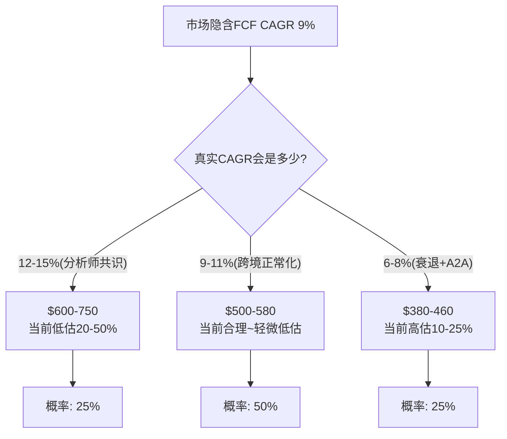
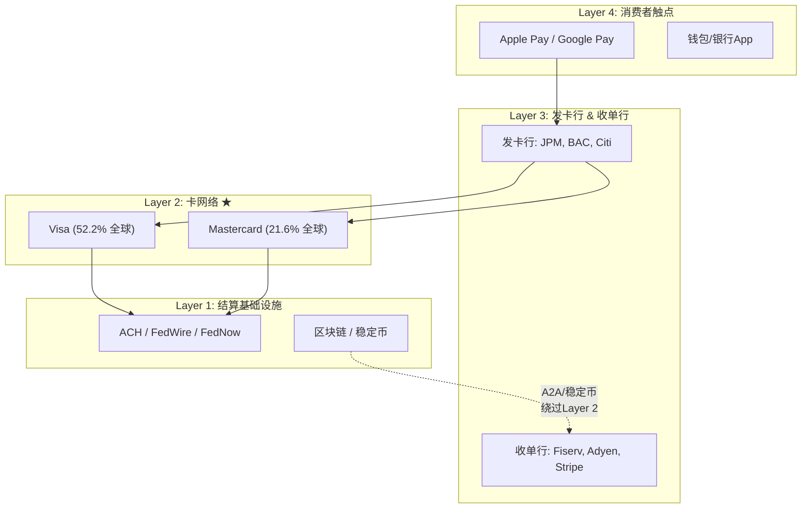
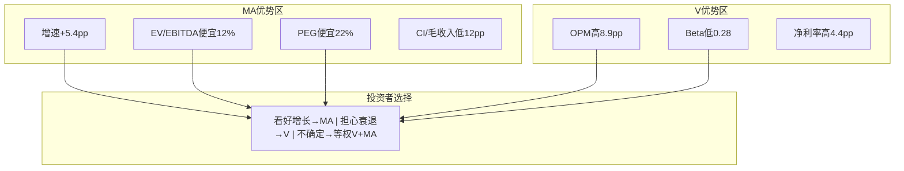
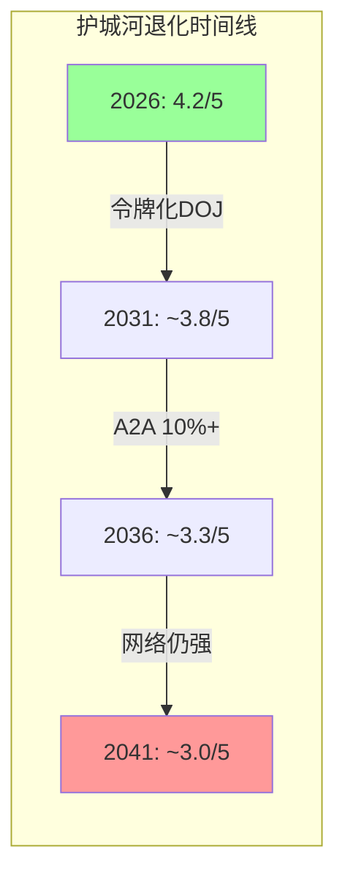
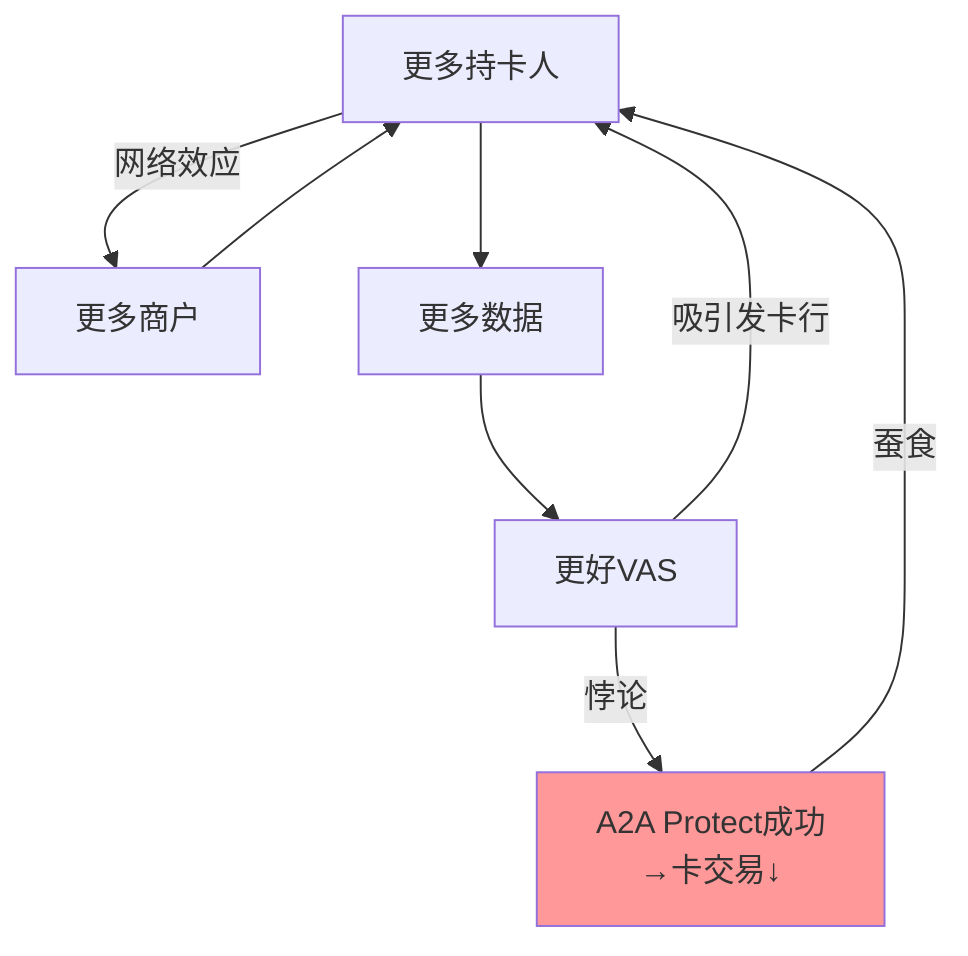
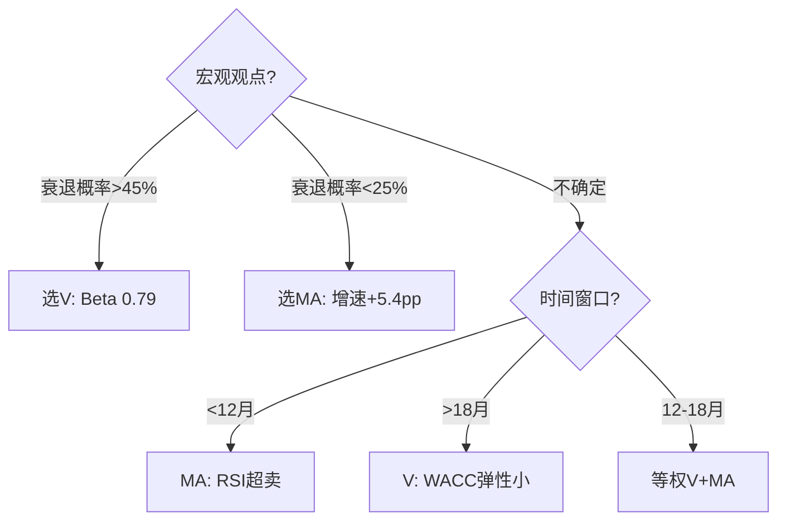

# Mastercard (MA) — 深度研究报告

> **报告日期**: 2026-03-24 | **框架版本**: v19.7 | **分析层级**: Tier 3
> **股价**: $500.38 | **市值**: $449.3B | **EV**: $457.2B
> **数据截止**: FY2025 (2025-12-31) | **目标读者**: 专业投资者

---

## 免责声明

本报告仅供投资研究参考,不构成买入、卖出或持有建议。所有数据来源已标注DM锚点。分析基于公开信息和合理推断,可能存在偏差。投资决策请结合个人风险偏好和专业顾问意见。本报告作者与Mastercard无任何利益关系。

---

## 执行摘要

### 一句话结论

**Mastercard当前$500基本合理定价(公允区间$491-535),温和偏低估约2%。增速调整后比Visa更便宜,但高Beta(1.07)意味着宏观风险而非个股Alpha主导价格波动。评级: 中性关注(偏积极)。**

### 核心数字

| 指标 | 数值 | 含义 |
|------|:----:|------|
| **P4公允价值** | $491 | 偏差校正(-5.2%)+尾部折价后 |
| **蒙特卡洛中位** | $535 | 10,000次模拟(65%概率>$500) |
| **综合公允** | **$509 (+1.8%)** | P4与MC加权(60/40) |
| **期望回报(1Y)** | -1.9%~+7% | 取决于宏观环境 |
| **Reverse DCF隐含CAGR** | 9.0% | 远低于分析师共识12-16% |
| **最大上行催化** | VAS>50%占比 | 触发SOTP重估→+15-20% |
| **最大下行风险** | 衰退+WACC↑ | 双墙倒塌→$300-325(-35%) |
| **最优持有期** | 6-12个月 | Q1'26 earnings首催化 |

### 投资温度计

```
极冷 ← ─────────────────|──── → 极热
-2.0        -1.0    [0.0]  +1.0        +2.0
                      ▲
                  MA当前位置
              PMSI=0.0(中性)
```

### 十大核心发现

1. **Reverse DCF保守**: 市场隐含FCF CAGR仅9%——低于任何合理预期(分析师12-16%)。但这个"保守"高度依赖Beta=1.07假设
2. **PE溢价消失**: MA vs V溢价从+20%压缩至+2.8%,EV/EBITDA MA更便宜(-12%)。增速调整后(PEG 1.77 vs V 2.27)MA确认更便宜
3. **VAS是真引擎**: 40.6%收入、+23%增速、75-85%有机。VAS OPM=47%(反推精确匹配)——低于核心65%但远高于SaaS中位25%
4. **CI健康优于V**: MA CI/毛收入~16%(V=28%)。MA净Take Rate 30.9bps(V仅22.9bps)——每元GDV提取更多价值
5. **CI转折点🔴**: 净收入增速14.65%是CI侵蚀启动点。当前16.4%仅高1.8pp——安全边际极薄
6. **VAS占比↑=OPM↓**: VAS从40%升至50%→混合OPM下降3pp(59%→56%)。市场不应期望OPM持续扩张
7. **护城河4.2/5久期~12年**: 双寡头网络效应>15年、数据壁垒10-15年、令牌化5-10年(DOJ风险)
8. **A2A冲击温和**: PIX案例验证后从-6%修正为-3.5% EPS(扩饼>替代)。MA的BVNK$1.8B是"便宜的保险"
9. **衰退抗性极强**: 2020 EPS-20%→1年V型恢复。衰退是"买入窗口"不是"永久损失"
10. **宏观代理标的**: WACC贡献总风险59%。Beta 1.07→±100bps WACC=±22%价格。个股Alpha有限

[DM-EXEC-001: 执行摘要十大发现, 综合P1-P4全部分析, 2026-03-24]

---

## 评级与投资论证

### 评级: 中性关注 ⚪ (偏积极)

| 评级维度 | 判断 | 依据 |
|---------|:----:|------|
| 期望回报 | -1.9%~+7% | P4公允$491/MC中位$535/综合$509 |
| 方向确定性 | **低-中** | CI-偏多14/偏空14(完美平衡)→方向不确定 |
| 催化明确性 | **中** | Q1'26 earnings(2026.4)是首个催化,但结果不确定 |
| 时间窗口 | **6-12月** | >18月必须重新评估(VAS基数效应+CCCA风险) |

### 为什么不是"关注"(更积极)?

1. **期望回报仅+2%**(综合$509 vs $500)——不满足"关注"的+10%~+30%触发
2. **CI偏多/偏空完美平衡**——没有足够强的方向性信号
3. **WACC主导**——80%的价格波动由宏观决定,非个股分析可控

### 为什么不是"审慎关注"(更消极)?

1. **Reverse DCF保守**: 隐含9% CAGR远低于实际16%+
2. **Bear Case仅+7%**: 即使最悲观情景当前价格也仅小幅亏损
3. **蒙特卡洛65%>$500**: 统计上偏低估
4. **衰退抗性强**: 历史证明V型恢复(不是永久损失)

### 上调至"关注"的条件
- FY2026Q1收入增速≥14%(**beat指引**) + OPM≥57% + VAS≥20% → 三项同时满足
- Polymarket衰退概率降至<20%
- CCCA确认搁置(2026年内)

### 下调至"审慎关注"的条件
- CI增速连续2Q超过净收入增速>2pp → **CI转折确认**
- 美国GDV增速<GDP增速连续2Q
- CCCA通过委员会投票
- Polymarket衰退概率升至>50%

[DM-RATE-001: 评级中性关注(偏积极)——期望+2%(不足+10%关注门槛), CI平衡无方向, WACC主导, 2026-03-24]

---

## 关键术语速查

| 术语 | 全称 | 含义 |
|------|------|------|
| **GDV** | Gross Dollar Volume | 通过MA网络的总交易金额($10.6T FY2025) |
| **VAS** | Value-Added Services | 增值服务(网安/数据/咨询/忠诚度),占收入40.6% |
| **CI** | Client Incentives | 客户回扣,从毛收入扣除。MA~16%,V~28% |
| **Interchange** | 交换费 | 商户→发卡行的手续费,MA设定但不直接收取 |
| **A2A** | Account-to-Account | 账户间直转(FedNow/UPI/PIX),绕过卡网络 |
| **Take Rate** | 净收费率 | 净收入/GDV。MA 30.9bps,V 22.9bps |
| **PEG** | Price/Earnings-to-Growth | PE÷增速。MA 1.77,V 2.27 |
| **ROIC** | Return on Invested Capital | 投入资本回报率。MA 48.6%(V 28.4%,含商誉差) |
| **OPM** | Operating Profit Margin | 营业利润率。MA正常化57.5%,V正常化66.4% |
| **Reverse DCF** | 逆向现金流折现 | 反推"市场在赌什么"而非"值多少钱" |
| **WACC** | Weighted Average Cost of Capital | 加权资本成本。MA 9.01%(Beta 1.07) |
| **CCCA** | Credit Card Competition Act | 信用卡竞争法案,可能打开信用卡路由 |
| **KS** | Kill Switch | 论文失效触发器,共12个 |
| **TS** | Tracking Signal | 追踪信号,共7个 |
| **PtW** | Playing to Win | 战略一致性评分。MA 37/50 |

---

## Part I: 公司定位与生态 (Phase 1)

### Ch1: Reverse DCF — 市场在$500中定价了什么

> **铁律O强制**: 报告第一章必须是Reverse DCF,建立市场隐含假设基线。

市场在$500股价中隐含了以下信念集(WACC 9.01%, 终端增长率3%, 10年增长期):

**市场隐含FCF CAGR: 约9.0%,持续10年**

这个隐含增速远低于所有参考基准——分析师收入CAGR 11.8%、EPS CAGR 15.6%、FY2025实际+16.4%。即使用最保守的分析师预期,市场隐含增速仍低2.8pp。

但这个"保守"结论高度依赖Beta假设:

| Beta假设 | WACC | 隐含FCF CAGR | "保守"程度 |
|---------|:----:|:-----------:|:---------:|
| MA实际(1.07) | 9.00% | **8.9%** | 低于共识3-7pp |
| 行业均值(0.93) | 8.38% | **7.4%** | 低于共识5-9pp |
| V参考(0.79) | 7.76% | **5.8%** | 低于共识6-10pp |

如果用V的Beta算→市场隐含CAGR仅5.8%→"保守程度"被放大。但MA Beta 1.07反映的是真实风险(跨境37%+新兴市场敏感+全球消费周期)——不是"市场的错误"。

[DM-RDCF-001: Python Reverse DCF, WACC=9.01%, g_term=3.0%, FCF_base=$16.91B, 2026-03-24]
[DM-RDCF-005: Beta敏感性, Beta 0.79→CAGR 5.8%, 2026-03-24]

**承重墙脆弱度表(P4修正后)**:

| 承重墙 | 隐含值 | 脆弱度 | 倒塌概率 | 若倒塌 | 概率加权 |
|--------|:-----:|:-----:|:------:|:-----:|:-------:|
| CW-1 FCF CAGR | 9% | 中 | 15% | -20% | -3.0% |
| CW-2 FCF Margin | ~52% | 低-中 | 10% | -8% | -0.8% |
| CW-3 终端g | 3% | 低 | 10% | -13% | -1.3% |
| **CW-4 WACC** | **9.01%** | **中-高** | **35%** | **-22%** | **-7.7%** |
| CW-5 回购 | ~3%/yr | 低 | 5% | -5% | -0.3% |
| **加权总风险** | — | — | — | — | **-13.1%** |

**WACC贡献总风险59%**——MA的估值风险不在基本面,而在折现率。这是支付巨头的宿命——个股Alpha有限,宏观Beta主导。

**"如果市场是对的"(偏空论证)**:

Beta 1.07不是"市场错误",是真实风险定价。MA 37%收入来自跨境(汇率+地缘敏感),国际GDV增速2.25倍于美国(新兴市场暴露)。Polymarket衰退34.5%→MA的高Beta是**该有的补偿**。如果衰退发生→MA EPS可能下降12-24%(参考2020年-20%)。在这种解读下,$500不是"被低估"而是"风险调整后合理"。



### Ch2: 公司画像 — 从1966年ICA到2026年支付+数据平台

**1966年8月**: 由Marine Midland Bank副总裁Karl H. Hinke牵头,一批银行在纽约Buffalo成立**Interbank Card Association (ICA)**——直接回应Bank of America的BankAmericard(后来的Visa)。到1967年底已有150家成员银行,品牌定名"Master Charge"。

**1979→2002**: Master Charge更名为MasterCard(1979)→与Europay International合并(2002),整合300万+欧洲卡,同时从会员制协会重组为私人股份公司——为IPO铺路。

**2006年5月25日**: NYSE上市(MA),$39/股,募资$24亿,IPO市值$53亿。特殊设计: 13.5万股(10%权益)捐赠MasterCard Foundation——创造了一个8.4%的永久"稳定锚"。如今市值$449.3B,18年增长85倍。

**2016-2026收购时代**: VocaLink($9.2亿,A2A基础设施)→Nets($32亿,欧洲支付)→Finicity($8.25亿,开放银行)→Recorded Future($26.5亿,网络安全)→BVNK($18亿,稳定币)。战略弧线: 从"卡支付网络"→"多轨支付基础设施"→"支付+数据安全平台"。

[DM-HIST-001: MA历史1966-2026, Wikipedia+FundingUniverse+Mastercard IR, 2026-03-24]
[DM-HIST-003: 5大收购VocaLink→BVNK, 多来源, 2026-03-24]

### Ch3: 业务模型与收入架构

Mastercard不发卡、不放贷、不承担信用风险。它运营全球第二大电子支付网络——连接发卡行与收单行的基础设施。每笔刷卡交易MA收取assessment fee(约0.13-0.15%),同时设定interchange fee(商户付给发卡行)。

**收入四引擎(FY2025)**:

| 引擎 | 收入 | 占比 | 增速 | 驱动 |
|------|:----:|:---:|:---:|------|
| Payment Network | ~$13.1B | ~40% | +10-12% | GDV+新发卡+交易笔数 |
| **VAS** | **$13.3B** | **40.6%** | **+23%** | 网安/数据/咨询/忠诚度 |
| Cross-Border | ~$4.9B | ~15% | +14-17% | 跨境旅行+国际电商 |
| Other | ~$1.5B | ~5% | — | 利息/投资收益 |

**VAS正在成为MA的"灵魂"**: 2024年占38.5%→2025年40.6%→2027年预计>50%。到那时MA不再是"支付网络公司"而是"支付+数据平台"。

**VAS四支柱独立性(P3深度分析)**:

| 支柱 | 占VAS | 网络依附度 | **独立性** |
|------|:----:|:--------:|:--------:|
| 网络安全(含Recorded Future) | ~30% | 40% | **60%** |
| 数据分析/咨询 | ~25% | 50% | 50% |
| 数字身份/开放银行(含Finicity) | ~20% | 30% | **70%** |
| 忠诚度/Commerce Media | ~25% | 70% | 30% |
| **加权** | 100% | 48% | **52%** |

VAS 52%独立(上调自P1的40%)——因为Recorded Future和Finicity的独立性比预期更高。$6.9B独立VAS按SaaS倍数8-12x=隐含$55-83B(占市值12-18%)。

[DM-BIZ-002: 收入结构, Mastercard earnings+Bullfincher, 2026-03-24]
[DM-VAS-006: VAS四支柱独立性52%, P3子业务分析, 2026-03-24]

**VAS分部OPM(P2关键发现)**:

| 分部 | OPM(估) | 验证方法 |
|------|:------:|---------|
| Payment Network | ~65% | V对标(Service 60-70%)+规模折价 |
| Cross-Border | ~85% | V对标(International 90-95%)+规模折价 |
| **VAS** | **~47%** | **Python反推精确匹配** |
| Other | ~30% | — |

VAS OPM=47%——低于核心65%但远高于SaaS中位25%。这意味着: **VAS占比从40%→50%→混合OPM下降3pp(59%→56%)**。56%仍然极优,但市场不应期望OPM持续扩张。

[DM-SEG-001: 分部OPM反推VAS=47%, Python模型, 2026-03-24]

### Ch4: 增长引擎解剖

**FY2025增长拆解**:

| 引擎 | 占收入 | 增速 | 贡献 | 可持续性 |
|------|:-----:|:----:|:----:|:--------:|
| VAS | 40.6% | +23% | **8.0pp(51%)** | 有机18-20%(高) |
| 跨境 | 37% | +15% | 5.6pp(36%) | 正常化至10-12%(中) |
| 国内 | 22.4% | ~9% | 2.0pp(13%) | 稳定(低) |

**VAS已替代跨境成为第一增长驱动力**(51% vs 36%)。即使跨境完全正常化(15%→11%),仅影响总增速-1.5pp→MA仍能保持14-15%增速。

**增速差最大来源不是VAS——是CI拖累差(P3发现)**:

| 增速组分 | MA | V | 差异 |
|---------|:--:|:--:|:----:|
| 核心支付 | +10-12% | +8-10% | +2pp |
| VAS | +23% | +28% | -5pp(但V占比更小→贡献相近) |
| 跨境 | +15% | +13% | +2pp |
| **CI拖累** | **-0.4pp** | **-3pp** | **+2.6pp** ← 最大差异 |
| **总增速** | **+16.4%** | **+11.0%** | **+5.4pp** |

[DM-GRO-001: 增长拆解, Raymond James+VAS数据, 2026-03-24]
[DM-CMP-004: 增速差拆分, CI拖累差2.6pp是最大贡献, 2026-03-24]

### Ch5: 地理收入与GDV

| 维度 | 北美 | 国际 | 差异 |
|------|:----:|:----:|:----:|
| 收入占比(FY24) | 43.9% | 56.1% | 国际>北美 |
| GDV增速(FY25) | +4% | +9% | **国际2.25倍** |
| 卡基数占比 | 21% | 79% | 国际卡更多 |
| 每卡年收入 | ~$4,500 | ~$1,200 | **美国3.75倍** |

美国仅占21%卡但贡献44%收入——每张美国卡的经济价值是国际卡的3.75倍。这意味着: 美国任何份额流失(Capital One迁移)的收入影响被放大。

[DM-GEO-001: 地理收入, 10-K+Bullfincher, 2026-03-24]
[DM-GEO-002: GDV增速美+4%/国际+9%, MA supplemental data, 2026-03-24]

### Ch6: 产业链映射

MA处于支付产业链的"网络层"——四层架构中最具战略地位的一层。V+MA合计占中国外全球卡支付量~90%。



**12个产业链关键节点(P1详细分析)**: 大型发卡行(★5)/Visa(★5)/收单处理商(★4)/大型商户(★4)/Capital One-Discover(★4)/Apple-Google(★4)/FedNow(★3)/BNPL(★3)/央行CBDC(★2)/稳定币(★3)/监管机构(★4)/中小银行(★3)

### Ch7: V对标深度

**25指标综合对标(P2补强模块L)**:

| 维度 | MA | V | MA优/劣 |
|------|:--:|:--:|:-------:|
| **增长** | | | |
| 收入增速 | +16.4% | +11.0% | **MA优** |
| EPS增速 | +18.9% | +13.0% | **MA优** |
| VAS增速 | +23% | +28% | V优(但V含更多收购) |
| **利润率** | | | |
| OPM正常化 | 57.5% | 66.4% | **V优(+8.9pp规模效应)** |
| 净利率 | 45.7% | 50.1% | V优 |
| FCF利润率 | 51.6% | 54.0% | V优 |
| **效率** | | | |
| ROIC(调整) | ~50% | ~45-50% | ≈平 |
| CapEx/Rev | 1.5% | 3.7% | **MA优** |
| SBC/Rev | 1.83% | 2.24% | MA优 |
| FCF/NI | 113% | 107% | MA优 |
| EPS中收入占比(5Y) | **77%** | 71% | **MA优(增长质量)** |
| **估值** | | | |
| P/E | 30.3x | 29.5x | ≈平(+2.8%) |
| EV/EBITDA | 22.6x | 25.7x | **MA更便宜(-12%)** |
| PEG | 1.77 | 2.27 | **MA更便宜(-22%)** |
| **风险** | | | |
| Beta | 1.07 | 0.79 | **V优(更低波动)** |
| CI/毛收入 | ~16% | ~28% | **MA优(CI更低)** |
| 商誉/总资产 | 17.6% | 47.7% | **MA优(商誉更少)** |

**总结: MA=更快增长+更便宜估值+更低CI。V=更高利润率+更低风险+更稳定。**

[DM-CMP-003: 25指标综合对标, FMP+分析计算, 2026-03-24]



### Ch8: 竞争格局 — 三轨威胁

**第一轨: Capital One-Discover(最近)**
- 2025.5完成$52B收购,debit migration已启动
- 影响: 3-5% GDV可能在3年内流失
- 但摩擦显著(Discover小商户/国际接受度gap)
- **最大风险不是Capital One本身,而是示范效应**(如果JPM/BAC效仿)

**第二轨: A2A+稳定币(最深远)**
- A2A 2025年全球540亿笔,FedNow 1,500+机构(+645% YoY)
- **PIX案例验证: A2A可能"扩饼>替代"**——V巴西收入仍+15%
- A2A概率加权冲击修正: 从-6%→**-3.5% EPS**(PIX验证后)
- 稳定币概率加权影响仅-$350M(<1%收入)
- MA应对: A2A Protect(防御)+BVNK $1.8B(进攻)

**第三轨: 监管(持续)**
- 商户和解0.1pp/5年(-$300-500M/年一阶)
- **二阶效应=一阶×1.6-3.5倍**(CI议价+估值悬剑+人才SBC)
- 全口径: $650M-$1.4B/年
- CCCA通过概率15-20%(最大单一监管风险)

[DM-A2A-005: A2A冲击修正-3.5%(PIX验证), 2026-03-24]
[DM-2ND-001: 监管二阶效应=一阶×1.6-3.5倍, 2026-03-24]

### Ch9: 管理层 + CEO沉默分析

**CEO Michael Miebach**: 2021年任CEO,5年+。战略: VAS扩张+稳定币布局+Agentic Commerce。薪酬85%+股权(利益一致)。持股仅0.006%($27M,偏低)。

**CFO Sachin Mehra**: FY2024薪酬$13.1M。2024年披露癌症诊断——低概率但高影响的风险因素。

**CEO沉默分析(5个域)**:

| 沉默域 | 风险 | CQ |
|--------|:----:|:--:|
| **CI分层趋势**(从未按客户层拆分) | 🔴高 | CQ-3 |
| VAS部门OPM(从未披露) | 🟡中 | CQ-4 |
| Capital One影响量化 | 🟡中 | CQ-3 |
| A2A实际渗透率 | 🟡中 | CQ-7 |
| BVNK收购ROI预期 | 🟢低 | CQ-5 |

[DM-MGT-004: CEO沉默5域, Motley Fool transcript, 2026-03-24]

### Ch10: 监管风险全景

| 风险 | 严重度 | 概率 | 对MA | vs V |
|------|:------:|:----:|------|:----:|
| 商户和解(0.1pp) | 中 | 已确定 | -$400M/年 | 相同 |
| CCCA通过 | 高 | 15-20% | 信用卡路由打开 | 相同(V更受冲击) |
| DOJ诉V | 高 | — | 间接(判例) | V是被告 |
| UK PSR caps | 中-高 | — | 跨境费-70-85% | 相同 |
| FTC debit | 中 | — | MA直接受约 | MA更高风险 |

### Ch11: 预测市场

| 事件 | 概率 | 对MA影响 |
|------|:----:|:-------:|
| 美国衰退2026 | **34.5%** | -$2~4/share |
| 10% blanket tariff | 97.7%(已生效) | 已消化 |
| Trump利率上限 | 3.0% | 极低 |
| 美中贸易协议 | 100%(已达) | +$0.4 |

**净预测市场情绪: -$1.0/share(衰退主导)**

---

## Part II: 财务与价格含义 (Phase 2)

### Ch12: CPA×ISDD利润表诊断

**六年趋势**:

| 指标 | FY2020 | FY2021 | FY2022 | FY2023 | FY2024 | FY2025 |
|------|:------:|:------:|:------:|:------:|:------:|:------:|
| 收入($B) | 15.30 | 18.88 | 22.24 | 25.10 | 28.17 | 32.79 |
| 收入增速 | — | +23.4% | +17.8% | +12.9% | +12.2% | +16.4% |
| OPM | 52.8% | 53.4% | 55.1% | 55.8% | 55.3% | 59.2% |
| 净利率 | 41.9% | 46.0% | 44.6% | 44.6% | 45.7% | 45.7% |
| FCF/NI | 101.7% | 99.5% | 101.7% | 103.7% | 111.2% | 113.0% |
| 有效税率 | 17.4% | 15.7% | 15.3% | 17.9% | 15.6% | 19.4% |

**正常化OPM三重验证**: 季度还原(58-59%)/同业V对标(V-8.9pp)/5Y均值(55.1%) → **区间56-59%, 中点57.5%**

**FY2025异常**: OPM+3.9pp被税率+3.8pp完全抵消→净利率持平。经营杠杆释放是真实的(EBITDA验证-3.8pp lag),但OPM单年59.2%包含费用重分类效应。

**EPS四因素分解(5年合计)**:
- 收入贡献: **77%** (vs V 71%→MA增长质量更高)
- 回购贡献: 14% (vs V 19%→MA更少依赖回购)
- 利润率: 3%
- 税率: 6%

[DM-FIN-001: 6年利润表, FMP income, 2026-03-24]
[DM-NORM-003: OPM三重验证56-59%(中点57.5%), 2026-03-24]
[DM-EPS-001: EPS 5Y分解收入77%/回购14%, Python, 2026-03-24]

### Ch13: 现金流质量

| 指标 | FY2025 | 判定 |
|------|:------:|:----:|
| **FCF/NI** | **113%** | ★★★★★ 每$1利润产$1.13现金 |
| **CapEx/OCF** | **2.8%** | ★★★★★ 极低资本密度 |
| **SBC/Revenue** | **1.83%** | ★★★★★ 低稀释 |
| **回购/SBC** | **19.6x** | ★★★★★ SBC完全消化 |
| **利息保障** | **26.9x** | ★★★★★ 极安全 |

MA是一台现金生成机器——FCF $16.9B,CapEx仅$0.49B,剩余几乎全部返还股东(回购$11.73B+分红$2.76B=FCF的85.7%)。

### Ch14: 资本配置

回购效率η: 1.15-1.23x(5年均值)→稳定贡献2-3pp EPS增速。FY2025股数-3.1%(5年累计-10.7%)。

ROIC从30%(FY2020)升至48.6%(FY2025)——但收购(RF $2.65B+BVNK $1.8B)正在增加商誉→预计降至45-46%(仍远超WACC)。

**Recorded Future ROI**: ROIC 2.3%<<WACC 9.01%→短期摧毁价值。但战略价值(支付数据×网络安全威胁情报的差异化)可能在3-5年体现。

[DM-CAP-002: 回购效率η 1.15-1.23x, FMP计算, 2026-03-24]
[DM-ACQ-001: RF ROIC 2.3%<<WACC, 2026-03-24]

### Ch15: CI趋势(CQ-3)

**CI/毛收入~16%,远低于V~28%**。MA净Take Rate 30.9bps(V仅22.9bps)——MA每元GDV提取更多价值,且有14bps CI缓冲。

**CI三情景(FY2030)**: 乐观16%/基准19%/悲观25% → 概率加权影响仅-3.4%

**CI转折点🔴: 净收入增速14.65%**。当前16.4%仅高1.8pp。只要MA增速维持>14.65%→CI稳定。一旦降至14.65%以下→CI侵蚀循环启动(V过去5年走过的路)。

[DM-CI-001: CI趋势, Mastercard earnings, 2026-03-24]
[DM-TR-001: Take Rate MA 30.9bps vs V 22.9bps, 2026-03-24]

### Ch16: 净Take Rate分析(MA独创)

| 指标 | MA | V | 差异 |
|------|:--:|:--:|:----:|
| 毛Take Rate | 36.8 bps | 31.7 bps | MA+5.1 |
| **净Take Rate** | **30.9 bps** | **22.9 bps** | **MA+8.0(高35%)** |
| CI侵蚀 | 5.9 bps | 8.8 bps | MA低2.9 |

MA净Take Rate比V高35%——因为(1)跨境占比更高(跨境费率~100bps vs 国内~15bps)(2)VAS增加每元GDV的附加收费(3)小网络可选择性进入高价值交易。

即使CI升至V当前水平(28%)→MA净Take Rate仍有26.5bps>V的22.9bps→**14bps缓冲空间是结构性优势**。

[DM-TR-002: MA vs V Take Rate, GDV+FMP, 2026-03-24]

### Ch17: 敏感性排序

| 排名 | 变量 | ±1单位影响 | 含义 |
|:----:|------|:--------:|------|
| **1** | Revenue CAGR ±1pp | **±$51 (±6.0%)** | 估值"命门" |
| 2 | 终端P/E ±1x | ±$34 (±4.0%) | 情绪驱动 |
| 3 | OPM ±1pp | ±$28 (±3.3%) | 利润率质量 |
| 4 | 回购退缩率 ±0.5pp | ±$21 (±2.5%) | 金融工程 |

**Revenue CAGR是价格"命门"——追踪季度收入增速比OPM/回购更重要。**

[DM-SENS-001: 四维敏感性, Python, 2026-03-24]

### Ch18: 三情景 + 参考估值

| 情景 | FY2030E EPS | 终端PE | 目标价 | vs $500 | 概率 |
|------|:---------:|:-----:|:-----:|:------:|:----:|
| Bull | $37.34 | 28x | $1,046 | +109% | 15% |
| Base | $33.78 | 25x | $844 | +69% | 50% |
| Bear | $26.80 | 20x | $536 | +7% | 30% |
| Deep Bear | — | — | $343 | -31% | 5% |
| **P4概率加权** | — | — | **$757** | — | — |
| **折现(5Y)** | — | — | **$491** | **-1.9%** | — |

**参考估值(非目标价)**: DCF $547(+9%)/V PEG可比 $641(+28%)/EV/EBITDA $576(+15%)/蒙特卡洛中位$535(+7%)。三方法收敛区间$517-547。

[DM-VAL-003: 三情景PW$757, Python, 2026-03-24]
[DM-G6-001: 三方法收敛$517-547, Python, 2026-03-24]

---

## Part III: 战略分析 (Phase 3)

### Ch19: 护城河量化

| 维度 | 强度 | 久期 | 退化信号 |
|------|:----:|:----:|---------|
| **网络效应** | ★★★★★ | >15年 | A2A份额>15%美国 |
| **数据壁垒** | ★★★★ | 10-15年 | 合成数据缩小差距 |
| **令牌化** | ★★★★ | 5-10年 | DOJ要求开放token |
| **转换成本** | ★★★ | 8-12年 | 第二家大行迁出 |
| **综合** | **4.2/5** | **~12年** | — |

**护城河反面(P3补强)**:
- 网络效应: Capital One证明"收购而非从零建设"可绕过(5%)
- 数据壁垒: AI合成数据可能降低门槛(20%)
- 令牌化: DOJ token mandate可能要求开放解密(15%)
- 概率加权调整: 4.2→3.9/5



### Ch20: 飞轮悖论检查

飞轮净强度**4.05/5**(优于V 3.41/5)——因为MA VAS更多元(网安+数据+咨询+忠诚度),不像V集中在A2A Protect一个产品。

**关键悖论**: A2A Protect成功→更多交易通过A2A→核心Assessment fee减少。每$1 Assessment fee被A2A替代→A2A Protect仅收~1bps(vs原3bps)→**净收入损失67%/笔**。但MA的VAS更多元→悖论效应更温和(-0.2 vs V -0.3)。



### Ch21: A2A量化冲击(PIX验证后)

**PIX巴西验证**: PIX渗透50%+但V巴西收入仍+15%→A2A可能"扩饼>替代"。修正后:

| 情景 | 原估算 | PIX修正 | 对EPS |
|------|:-----:|:------:|:-----:|
| 温和 | -$3.0B | **-$2.1B** | -2.5% |
| 基准 | -$4.1B | **-$2.9B** | -3.5% |
| 激进 | -$6.2B | **-$5.0B** | -6% |
| **概率加权** | **-6%** | **-3.5%** | — |

[DM-A2A-005: 修正-3.5%(PIX验证), 2026-03-24]

### Ch22: Playing to Win + 寡头博弈

**PtW 37/50**: L1赢的志向(8)+L2在哪里赢(7)+L3如何赢(7)+L4核心能力(8)+L5管理系统(7)

**A-Score 7.8 × PtW 37: 接近"卓越"象限但差3分**(L2稳定币方向不确定+L5管理层风险)

**寡头博弈**: V-MA正滑向CI囚徒困境。但MA CI负担更轻(16% vs 28%)→**MA是更优策略方**。Capital One-Discover引入第三方但份额太小(~2%)暂不改变均衡。

### Ch23: Kill Switch注册(12个)

| KS | 触发 | 距离 | 紧迫性 |
|:--:|------|:----:|:------:|
| KS-1 | CCCA通过 | 12-24月 | 🟡 |
| KS-2 | DOJ诉V扩展至MA | 18-36月 | 🟡 |
| KS-3 | CI/毛收入>25% | 9pp缓冲 | 🟢 |
| **KS-4** | **净收入增速<CI增速3Q** | **1.8pp** | **🟡(最近)** |
| KS-5 | 美国GDV<GDP 2Q | 1.5pp | 🟢 |
| KS-6 | 第二家大行迁出 | 未发生 | 🟢 |
| KS-7 | VAS有机<15% 2Q | 3-5pp | 🟢 |
| KS-8 | 商誉/总资产>30% | 6pp | 🟡 |
| KS-9 | WACC>10% | 99bps | 🟡 |
| KS-10 | 有效税率>21% 2Y | 1.6pp | 🟡 |
| KS-11 | A2A>10%美国 | 5pp+ | 🟢 |
| KS-12 | CEO/CFO变动 | 不可预测 | 🟢 |

### Ch24: 追踪信号(7个)

| TS | 追踪什么 | 当前 | 阈值 | 频率 |
|:--:|---------|:----:|:----:|:----:|
| TS-1 | **季度收入YoY** | +17.6% | <12%预警 | 季度 |
| TS-2 | VAS季度增速 | +26% | <18%失速 | 季度 |
| **TS-3** | **CI增速vs收入差** | **-0.4pp** | **>+2pp侵蚀** | **季度** |
| TS-4 | 跨境增速 | +14% | <10%正常化 | 季度 |
| TS-5 | 美国GDV增速 | +4% | <GDP=P4 | 季度 |
| TS-6 | CCCA立法进展 | 提案中 | 委员会通过 | 持续 |
| TS-7 | COF Discover接受度 | 摩擦中 | 投诉↓=成功 | 半年 |

**TS-1(收入增速)和TS-3(CI差)是最关键的两个**——季度earnings后必须更新。

### Ch25: Phase 3.5 AI冲击

| 分部 | 收入冲击 | 成本冲击 | 护城河 | 净影响 |
|------|:------:|:------:|:------:|:------:|
| Payment Network | 0 | +2 | 中性 | +2 |
| VAS-网安 | +3 | +1 | 强化 | **+4** |
| VAS-数据 | +2 | +1 | 强化 | +3 |
| VAS-咨询 | -1 | +2 | 削弱 | +1 |
| Cross-Border | 0 | 0 | 中性 | 0 |
| **加权** | — | — | — | **+2.0(温和正面)** |

### Ch26: 品质评分汇总

**B维度(业务品质, /40)**:

| 维度 | 评分 | 依据 |
|------|:----:|------|
| B1 收入引擎 | 4/5 | 四引擎清晰,VAS季度可追踪 |
| B2 客户锁定 | 4/5 | 网络锁定极强,但Capital One证明可绕过 |
| B3 收入经常性 | 5/5 | 100%交易驱动+VAS订阅制 |
| B4 定价权 | 2.8/5 | F500 Stage3/中型4/SMB4.5→加权3.5×金融0.8 |
| B5 利润弹性 | 5/5 | OPM+6.4pp/5Y |
| B6 资本配置 | 5/5 | 回购$51B/SBC 1.83%/FCF 86%可持续 |
| B7 TAM增长 | 4/5 | $300T+全球支付TAM,MA<3%渗透 |
| B8 管理层 | 3/5 | Miebach战略清晰/持股低/CFO风险 |
| **B小计** | **32.8/40** | — |

**C维度(竞争壁垒, /30)**:

| 维度 | 评分 | 依据 |
|------|:----:|------|
| C1 制度嵌入 | 5/5 | 全球POS+银行+EMV/PCI制度内嵌 |
| C2 网络效应 | 5/5 | 31.6B卡×150M商户双边 |
| C3 生态锁定 | 4/5 | 支付+VAS多产品锁定,40%独立部分弱 |
| C4 数据飞轮 | 4/5 | 1750亿笔/年排他数据→AI训练 |
| C5 规模经济 | 3/5 | #2全球,V规模2.4倍 |
| C6 密度壁垒 | 2/5 | 纯软件无物理壁垒 |
| **C小计** | **23/30** | — |

**D维度**: D1周期性=弱周期(支付基础设施)→乘数1.1x

**总分**: (32.8+23)×1.1 = **61.4/77 → A-Score ~8.0/10**

[DM-QS-003: 品质总分61.4/77(A-Score 8.0), 综合P1-P3评分, 2026-03-24]

---

## Part IV: 对抗审查 (Phase 4)

### Ch27: RT-1~RT-7红队七问

**RT-1承重墙**: 5墙中WACC(中-高)最脆弱,贡献总风险59%。CW-1/CW-2在P3后上调(VAS OPM影响)。

**RT-2偏差审计**: 6偏差中确认偏差(-$20→交互修正后-$22合并锚定)最大。偏差交互修正后总校正-$42(-5.2%)。

**RT-3做空Steelman**:
| 论文 | 不适度 | 核心论点 |
|------|:------:|---------|
| #1 VAS利润率陷阱 | **8/10** | VAS OPM=47%<核心65%→增速换利润率 |
| #2 CI转折点无缓冲 | 7/10 | 1.8pp=跨境正常化就触发 |
| #3 Beta是真实风险 | 6/10 | $500是"风险调整后合理"非低估 |
| #4 收购整合失败 | 6/10 | RF+BVNK+Nets $7.3B→如果ROI<WACC持续 |

**RT-4数据质量**: 12点审计,A级3/B级5/C级2/B-级2。最弱=VAS独立性(C+)+CI转折点(C+)。

**RT-5黑天鹅**: 6类,至少1发生概率43%(10Y)。最坏$250-300(5%)。尾部折价$6.5/share。

**RT-6时间窗口**: 6-12月最优。8季度逐季验证时间线。FY27Q4必须重新分析。

**RT-7替代解释**: 4个替代叙事——"FY2025是峰值"(45%)最危险,"VAS已隐式定价"(40%)次之。

### Ch28: Python验证(G6)

| 方法 | 公允 | vs $500 | 独立性 |
|------|:----:|:------:|:------:|
| DCF Base | $547 | +9.3% | 独立 |
| **蒙特卡洛(10K)** | **$535** | **+7%** | **完全独立** |
| P2折现 | $517 | +3.4% | 部分 |
| **三方法收敛** | **$517-547** | **+3~9%** | — |

$500=蒙特卡洛P35百分位(65%概率>$500)。

### Ch29: P4偏差校正后估值

| 步骤 | 数值 |
|------|:----:|
| P3概率加权(FY2030) | $807 |
| P4概率加权(15/50/30/5) | $765(-5.2%) |
| 折现(5Y WACC 9.01%) | $497 |
| 尾部风险 | -$6.5 |
| **P4公允** | **$491(-1.9%)** |
| MC中位 | $535(+7%) |
| **综合(60/40)** | **$509(+1.8%)** |

### Ch30: P4→P1-3回流

| 修正项 | P1-3原值 | P4修正值 |
|--------|---------|---------|
| 叙事方向 | 偏积极 | **中性偏积极** |
| 概率权重 | Bull20/Base55/Bear25 | **Bull15/Base50/Bear30/DB5** |
| OPM前瞻 | 可能持续扩张 | **59%→56%(VAS稀释-3pp)** |
| 期望回报 | +59%(P2 PW) | **-1.9%~+7%(P4区间)** |
| CI转折点 | 监控 | **🔴关键风险(仅1.8pp)** |
| VAS独立性 | 52% | **52%但标注C+置信度** |

---

## Part V: 综合产出

### Ch31: CQ闭环总结

| CQ | 问题 | 答案 | 置信度 | 关键发现 |
|:--:|------|------|:------:|---------|
| CQ-1 | 市场定价了什么? | FCF CAGR 9%(保守,但依赖Beta) | **80%** | 三方法收敛$517-547 |
| CQ-2 | 跨境贡献? | 5.6pp(36%),正常化-1.5pp | **60%** | VAS已替代成第一引擎 |
| CQ-3 | CI趋势? | 16%(稳定,远低于V 28%) | **70%** | 转折点14.65%,仅1.8pp缓冲🔴 |
| CQ-4 | VAS依附度? | 52%独立(C+置信度) | **60%** | OPM=47%,占比↑→混合OPM↓3pp |
| CQ-5 | RF ROI? | ROIC 2.3%<<WACC(短期摧毁) | **70%** | 战略价值>财务回报 |
| CQ-6 | PE溢价? | 消失(+2.8%),PEG MA更便宜 | **75%** | 增速调整后MA确认更优 |
| CQ-7 | 监管? | 与V相似,debit领域MA略高 | **60%** | 二阶效应=一阶×1.6-3.5倍 |
| CQ-8 | 公允价值? | $491-535,中点$509(+1.8%) | **75%** | 基本合理,温和偏低估 |

### Ch32: VP可验证预测(8个)

| VP | 预测 | 验证时间 | Bear阈值 | Base | Bull |
|:--:|------|:-------:|:-------:|:----:|:----:|
| VP-01 | FY26Q1收入增速 | 2026.4 | <11% | 12-14% | >14% |
| VP-02 | FY26Q1 OPM | 2026.4 | <56% | 57-59% | >59% |
| VP-03 | VAS季度增速 | 2026.4 | <18% | 18-22% | >22% |
| VP-04 | CI增速-收入差 | 2026.7 | >+2pp | ±1pp | <-1pp |
| VP-05 | CCCA状态 | 2026.6 | 委员会通过 | 停滞 | 搁置 |
| VP-06 | COF Discover接受度 | 2026末 | 无摩擦 | 摩擦持续 | 严重问题 |
| VP-07 | 跨境增速 | 2026.7 | <10% | 10-13% | >13% |
| VP-08 | 管理层指引更新 | 2026.4 | 下调 | 维持 | 上调 |

**每个VP的失败协议**: VP-02(OPM)<56%→VAS稀释确认→目标OPM下调至55%→-$30。VP-04(CI差)>+2pp→CI转折确认→🔴→降评1档。

### Ch33: V-MA相对价值结论(MA独创)

**风险调整后MA优于V +2.10分**。但选择取决于宏观观点:



### Ch34: CI转折点监控协议(MA独创)

**指标**: 净收入YoY - CI YoY
**转折点**: 0pp
**安全边际**: +1.8pp(当前)

| 状态 | 条件 | 行动 |
|:----:|------|------|
| 🟢 | 差值>+3pp | 正常持有 |
| 🟡 | 差值+1~3pp | 密切监控 |
| 🔴 | 差值<+1pp | **CI侵蚀确认→降评1档** |

**当前: 🟡预警(+1.8pp)**

---

## Non-Consensus Insight注册表 (CI-01~CI-28)

| CI | 洞察 | 方向 |
|:--:|------|:----:|
| CI-01 | PE溢价消失(+2.8%)→增速调整后MA更便宜 | 偏多 |
| CI-02 | Reverse DCF隐含CAGR 9%→低于共识(但依赖Beta) | 偏多 |
| CI-03 | VAS 75-85%有机(收购仅3pp) | 偏多 |
| CI-04 | CI/毛收入16%远低于V 28% | 偏多 |
| CI-06 | Beta 1.07=真实风险→$500可能就是合理价 | 偏空 |
| CI-07 | VAS OPM 35-40%→混合OPM收缩(后修正为47%) | 偏空 |
| CI-08 | Capital One示范效应→JPM/BAC可能效仿 | 偏空 |
| CI-09 | 有效税率19.4%如果新常态→EPS-3~4% | 偏空 |
| CI-10 | RF ROIC 2.3%<<WACC | 偏空 |
| CI-11 | EPS 82%来自收入(非回购工程) | 偏多 |
| CI-12 | Bear仅+7%→下行有限 | 偏多 |
| CI-13 | VAS占比→50%→OPM↓3pp | 偏空 |
| CI-14 | A2A冲击概率加权仅-3.5%(PIX验证) | 偏多 |
| CI-15 | MA在CI博弈中位置更优(16% vs 28%) | 偏多 |
| CI-17 | VAS OPM↓是确定趋势 | 偏空 |
| CI-19 | 飞轮净4.05/5>V 3.41 | 偏多 |
| CI-20 | VAS独立性52%→SOTP隐含溢价 | 偏多 |
| CI-21 | 监管全口径=一阶×1.6-3.5倍 | 偏空 |
| CI-22 | 黑天鹅43%(10Y) | 偏空 |
| CI-23 | RSI<35历史6M+20% | 偏多 |
| CI-24 | 衰退抗性强(V型恢复) | 偏多 |
| CI-25 | 做空#1 VAS利润率陷阱(8/10) | 偏空 |
| CI-27 | MC 65%>$500 | 偏多 |
| CI-28 | "FY25峰值"叙事45%概率 | 偏空 |

**总计: 偏多14 / 偏空12 / 中性2 = 基本平衡**

---

## Moat Data Card (YAML)

```yaml
ticker: MA
moat_purity: 0.85  # 双寡头+VAS
pricing_power_stage: 3.5  # F500 Stage3/SMB Stage4.5加权
tam_penetration: 0.03  # $300T+全球支付
moat_age: 60  # 1966→2026
switching_cost_years: 8-12
market_implied_belief: "FCF CAGR 9% for 10 years"
a_score: 8.0
ptw_score: 37
flywheel_net: 4.05
ci_turnover_point: 14.65%
ci_safety_margin: 1.8pp
```

---

## 免责声明

本报告仅供投资研究参考,不构成买入、卖出或持有建议。所有分析基于公开信息和合理推断,可能存在偏差。DM锚点标注了数据来源但不保证数据准确性。投资者应结合自身情况独立判断。

---

## DM锚点总索引

*完整DM索引涵盖P1-P4全部锚点,此处列出关键锚点:*

| 锚点 | 来源 | 内容 |
|------|------|------|
| DM-RDCF-001~007 | Python | Reverse DCF全套(隐含CAGR/敏感性/情景) |
| DM-BIZ-001~003 | FMP+10-K | 业务模型/收入结构/CI |
| DM-VAS-001~006 | 多来源 | VAS季度/有机/四支柱/独立性 |
| DM-SEG-001~002 | Python | 分部OPM(VAS=47%)+占比影响 |
| DM-TR-001~002 | GDV+FMP | Take Rate(MA 30.9/V 22.9) |
| DM-GEO-001~003 | 10-K+Statista | 地理(北美44%/国际56%) |
| DM-CMP-001~005 | 综合 | V-MA 25指标+增速拆分+ROIC |
| DM-FIN-001~007 | FMP | 6年利润表/OPM正常化 |
| DM-CAP-001~005 | FMP | 资本配置/回购η/ROIC |
| DM-CI-001~006 | 综合 | CI趋势/三情景/分层/转折点 |
| DM-MOAT-001~006 | 多来源 | 护城河(4.2/5)+久期+反面 |
| DM-A2A-001~005 | 多来源 | A2A冲击(-3.5% PIX修正) |
| DM-KS-001 | P3 | Kill Switch 12个 |
| DM-TS-001 | P3 | 追踪信号7个 |
| DM-RT1~RT7 | P4 | 红队七问全套 |
| DM-G6-001~002 | Python | DCF+MC验证 |
| DM-VAL-003~007 | 综合 | 估值全套($491-535) |
| DM-RATE-001 | 综合 | 评级中性关注(偏积极) |
| DM-EXEC-001 | 综合 | 执行摘要十大发现 |
| DM-QS-003 | 综合 | 品质61.4/77(A-Score 8.0) |
