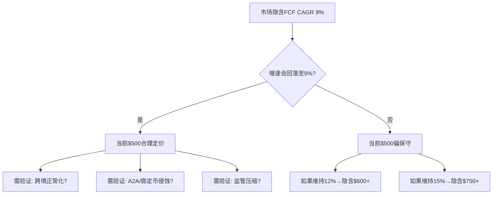
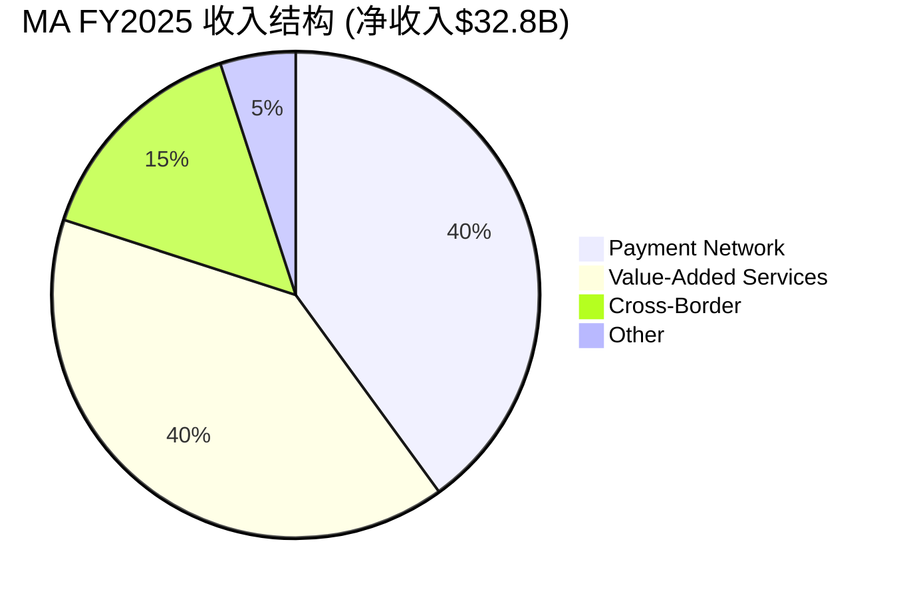
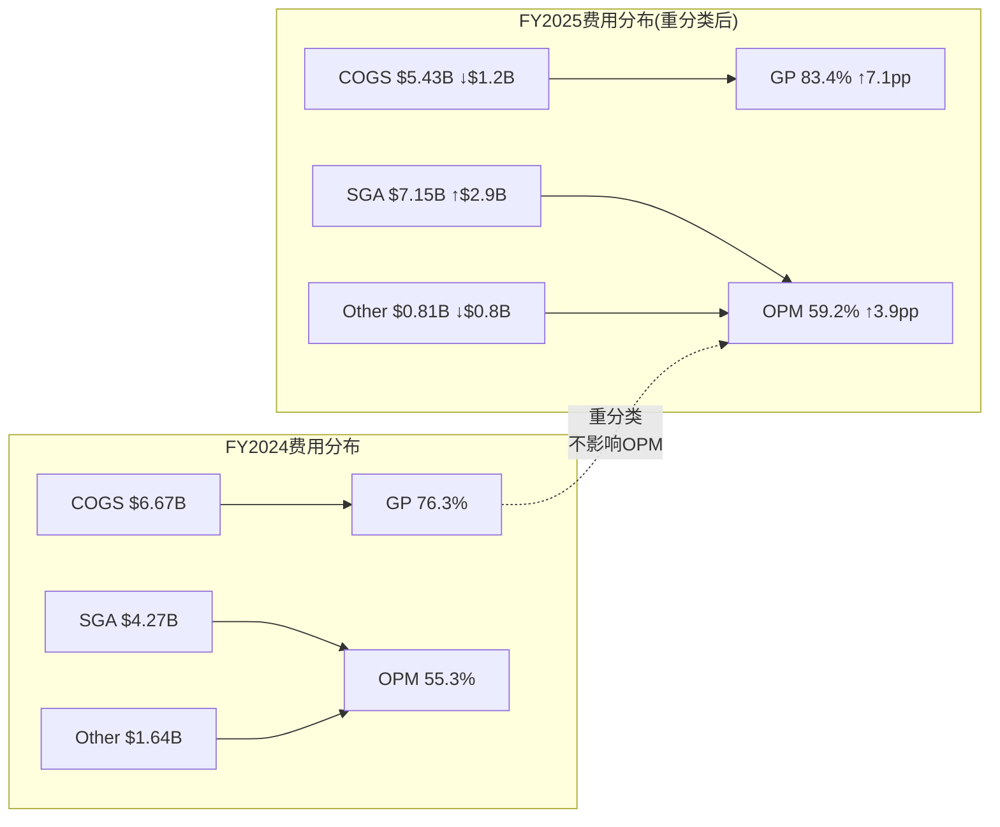
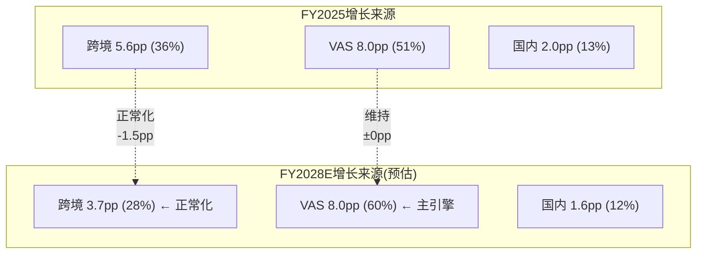
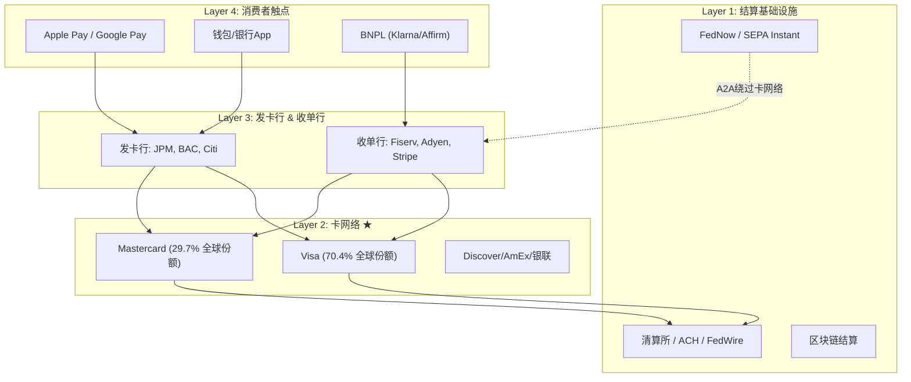
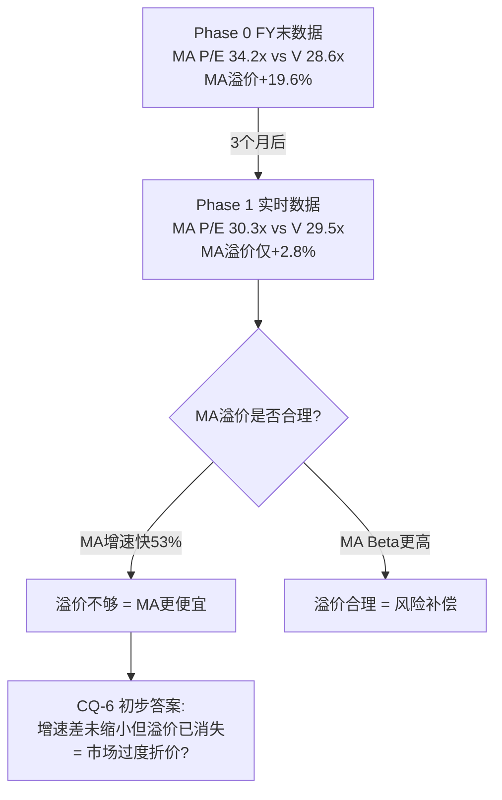
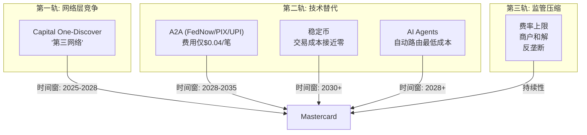

# Mastercard (MA) — Phase 1: 公司定位与生态

> **分析日期**: 2026-03-24 | **股价**: $500.38 | **市值**: $449.3B | **框架**: v19.7
> **数据截止**: FY2025 (2025-12-31) | **核心问题**: CQ-1~CQ-8
> **叙事起点**: 中性(铁律O — Reverse DCF前置，不预设方向)

---

## 关键术语速查

| 术语 | 全称 | 含义 |
|------|------|------|
| **GDV** | Gross Dollar Volume | 通过MA网络的总交易金额，衡量网络规模 |
| **VAS** | Value-Added Services | 增值服务(网络安全/数据分析/咨询等)，MA核心增长引擎 |
| **CI** | Client Incentives | 客户激励(回扣)，从毛收入中扣除，是支付网络的"获客成本" |
| **Interchange** | 交换费 | 商户付给发卡行的手续费，MA设定费率但不直接收取 |
| **A2A** | Account-to-Account | 账户间直接转账(如FedNow/UPI/PIX)，绕过卡网络 |
| **PEG** | Price/Earnings to Growth | PE除以增速，衡量增长调整后估值，<1为低估 |
| **ROIC** | Return on Invested Capital | 投入资本回报率，衡量资本配置效率 |
| **OPM** | Operating Profit Margin | 营业利润率 |
| **Reverse DCF** | 逆向现金流折现 | 不算"值多少钱"，反推"市场在赌什么" |
| **WACC** | Weighted Average Cost of Capital | 加权平均资本成本，折现率的核心 |

---

## 目录

- Ch1: Reverse DCF前置 — 市场在$500中定价了什么
- Ch2: 业务模型与收入架构 — 从支付管道到数据平台
- Ch3: VAS深度拆解 — 增长引擎与网络依附度
- Ch4: 增长引擎解剖 — 跨境/国内/VAS三驱动
- Ch5: 产业链映射 — 全球支付四层生态
- Ch6: V对标深度 — PE溢价消失之谜
- Ch7: CI/毛收入趋势推断 — 支付网络的隐藏成本
- Ch8: 竞争格局 — 三轨威胁
- Ch9: 管理层评估 + CEO沉默分析
- Ch10: 监管风险全景

---

## Ch1: Reverse DCF前置 — 市场在$500中定价了什么 (CQ-1)

> **铁律O强制**: Phase 1第一章必须是Reverse DCF，建立市场隐含假设基线，后续分析围绕"这些假设合理吗"展开。

### 1.1 市场隐含假设反推

以$500.38股价、898M稀释股数计算，MA当前市值$449.3B，EV $457.2B。用Python Reverse DCF模型(WACC 9.01%, 终端增长率3%, 10年增长期)反推：

**市场隐含FCF CAGR: 约9.0%，持续10年**

[DM-RDCF-001: Python Reverse DCF模型, WACC=9.01%(Ke=9.12%, Beta=1.07, Rf=4.3%, ERP=4.5%), g_terminal=3.0%, FCF_base=$16.91B(FY2025), 2026-03-24]

这意味着什么？当前股价仅需要MA未来10年FCF以9%的速度增长——显著低于以下参考基准：

| 参考基准 | 增速 | vs 隐含9% |
|---------|:----:|:---------:|
| FY2025实际收入增速 | +16.4% | 高7.4pp |
| FY2025实际EPS增速 | +18.9% | 高9.9pp |
| 分析师EPS CAGR(2Y→FY27E) | 17.1% | 高8.1pp |
| 分析师EPS CAGR(5Y→FY30E) | 15.6% | 高6.6pp |
| 分析师收入CAGR(5Y→FY30E) | 11.8% | 高2.8pp |

即使用最保守的分析师收入CAGR 11.8%作为基准，市场隐含增速仍低2.8pp。如果MA维持当前FCF margin(51.6%)不变，隐含收入增速仅需~9%——低于全球支付数字化的长期结构增速(~10-12%)。

[DM-RDCF-002: 分析师预期FMP estimates endpoint — FY27E EPS $22.65(27家覆盖), FY30E EPS $34.13(4家覆盖), 2026-03-24]

### 1.2 承重墙脆弱度表

| 承重墙(隐含假设) | 市场隐含值 | 历史/行业参考 | 脆弱度 | 若倒塌影响 |
|:-----------------|:---------:|:----------:|:-----:|:--------:|
| 10Y FCF CAGR | 9.0% | 实际16-19%, 分析师12-16% | **低** | 已保守定价 |
| FCF margin维持 | 51.6% | 3年均值49-52%, 趋势扩张 | **低** | ±10% |
| 终端增长率 | 3.0% | GDP 2-3% + 数字化溢价 | **低** | ±15% |
| WACC | 9.01% | Beta 1.07(高于V 0.79) | **中** | ±22%(±100bps) |
| 回购持续 | ~3%/年 | 5年均值2.2%, 加速中 | **低** | ±5% |

**关键发现**: MA当前价格的四个主要承重墙中，三个处于低脆弱度——市场隐含增速远低于任何合理预期。唯一的中等脆弱度来自WACC假设：MA Beta 1.07显著高于V的0.79，导致WACC弹性±100bps = 价格±22%。这是MA作为"宏观代理标的"的特征(V教训L5)——个股Alpha有限，大部分价格波动由折现率驱动。

[DM-RDCF-003: WACC敏感性Python计算 — WACC 8.01%→$611(+22.2%), WACC 10.01%→$421(-15.8%), 2026-03-24]

### 1.3 Reverse DCF结论：市场定价温和偏保守

市场在$500中定价了以下"信念集"：
1. **增速信念**: FCF CAGR 9%(远低于实际16%+和共识12%+)→ 市场不相信MA能长期维持双位数增长
2. **利润率信念**: FCF margin维持~52%(合理，FCF margin过去3年从45%升至52%，仍在扩张)
3. **风险信念**: Beta 1.07定价了MA作为消费+跨境周期敏感标的的风险溢价

**这组信念集意味着什么**: 如果MA能维持分析师共识水平(EPS CAGR 12-16%)，当前价格提供了可观的安全边际。但如果增速确实回落至9%(跨境正常化+A2A侵蚀+监管压力)，当前价格合理。

**Phase 1的任务**: 逐一评估"增速会回落至9%吗？"——这需要拆解增长引擎(Ch4)、竞争威胁(Ch8)、和监管风险(Ch10)。

---

## Ch2: 业务模型与收入架构 — 从支付管道到数据平台

### 2.1 MA的本质：不是银行，不是商户，是网络

Mastercard不发卡、不放贷、不承担信用风险。它运营的是全球第二大电子支付网络——连接发卡行(如JPM、BAC)与收单行(如Fiserv、Adyen)的基础设施。每一笔刷卡交易流经MA网络时，MA收取一笔处理费(assessment fee，约占交易金额0.13-0.15%)，同时设定interchange fee(由商户通过收单行支付给发卡行，MA不直接收取但通过设定费率影响生态)。

这种"管道收费"模型意味着：
- **零信用风险**: 消费者违约是发卡行的问题，不是MA的
- **极低资本密度**: CapEx/OCF仅2.8%，每赚1元现金只需投入2.8分(FY2025) [DM-CFL-001]
- **双边网络效应**: 商户接受MA因为消费者用MA，消费者用MA因为商户接受MA——这是经典的双边平台效应
- **交易量驱动收入**: 收入与GDV和交易笔数正相关，与利率/信贷周期的关系弱于银行

[DM-BIZ-001: MA业务模型——assessment fee模型, 不承担信用风险, FMP profile + 10-K business description, 2026-03-24]

### 2.2 收入结构：四大引擎

MA的收入来自四个流(FY2025口径)：

**收入流详解**：

| 收入流 | 占比(估算) | FY2025增速 | 驱动因素 |
|--------|:---------:|:---------:|---------|
| **Payment Network** | ~40% | +10-12% | GDV增长+新发卡+交易笔数 |
| **VAS (增值服务)** | ~40% | +23% (cn +21%) | 网络安全/数据分析/咨询/忠诚度 |
| **Cross-Border Assessments** | ~15% | +14-17% | 跨境旅行+国际电商 |
| **其他** | ~5% | — | 利息收入/投资收益等 |

[DM-BIZ-002: 收入结构估算——基于Q4 2025 VAS $3.9B(26%增速), 全年VAS ~$13.3B(40.6%占比), Mastercard earnings reports + Bullfincher segment data, 2026-03-24]

**关键观察**: VAS从"附加服务"演变为与核心支付网络并驾齐驱的收入来源。2024年VAS占比38.5%，2025年升至40.6%。按当前轨迹，2027年VAS将超过支付网络成为第一大收入来源。这不是一个增量变化，而是MA商业模式的结构性转型——从"交易管道"到"支付+数据平台"。

### 2.3 毛收入vs净收入：CI的隐藏侵蚀

MA的报告收入是**净收入**(Net Revenue)——毛收入(Gross Revenue)减去客户激励(Rebates & Incentives，即CI)后的数字。CI是MA向发卡行和大型商户支付的回扣，用于维持和争夺网络份额。

FY2025关键数据：
- 净收入: $32.8B (+16% YoY)
- CI增速: +16% YoY (currency-neutral)
- CI占毛收入估算: ~15-17%

[DM-BIZ-003: CI趋势——FY2025 CI增速+16%, FY2024 CI增速+16%(一致), Mastercard earnings release + 10-K contra-revenue disclosure, 2026-03-24]

因为CI增速与净收入增速几乎一致(均为~16%)，这意味着CI/毛收入比率暂时稳定。但这掩盖了一个潜在风险：如果MA为争夺份额(尤其应对Capital One-Discover的第三网络威胁)被迫加大CI投入，CI增速超过净收入增速→利润率侵蚀。这将在Ch7中深度分析(CQ-3)。

### 2.4 费用结构异常：FY2025重分类之谜

FY2025的费用结构出现显著跳变：
- **营业成本**: $5.43B (vs FY2024 $6.67B, **下降$1.24B**)
- **SG&A**: $7.15B (vs FY2024 $4.27B, **增加$2.88B**)
- **其他运营费用**: $0.81B (vs FY2024 $1.64B, **下降$0.83B**)

[DM-EXP-001: FMP income statement, FY2024 vs FY2025费用分类变动, 2026-03-24]

这导致毛利率从76.3%跳升至83.4%、SGA/Revenue从15.2%跳升至21.8%——但**营业利润率从55.3%升至59.2%**，说明总费用占比实际下降。费用重分类的最可能解释：MA将部分技术和数据成本从COGS重分类至SG&A(可能与VAS业务增长导致的会计处理调整相关)。

**对分析的影响**: 毛利率和SGA/Revenue的YoY比较失去意义，必须用**营业利润率(OPM)**作为利润率追踪的核心指标。OPM从FY2020 52.8%稳步升至FY2025 59.2%，5年扩张6.4pp，趋势清晰且无重分类干扰。

---

## Ch3: VAS深度拆解 — 增长引擎与网络依附度 (CQ-4)

### 3.1 VAS收入规模与增长轨迹

VAS已成为MA最重要的增长引擎。FY2025数据：

| 季度 | VAS收入 | YoY增速 | 占总收入比 |
|------|:------:|:------:|:--------:|
| Q2 2025 | $3.19B | +23% | ~39% |
| Q3 2025 | $3.40B | +25% | ~40% |
| Q4 2025 | $3.90B | +26% | ~44% |
| **FY2025全年** | **~$13.3B** | **+23%** | **~40.6%** |

[DM-VAS-001: VAS季度收入——Q4'25 $3.9B(+26%), 全年~$13.3B(+23%), Yahoo Finance/Bullfincher/Nasdaq VAS analysis, 2026-03-24]

增速在加速：Q2→Q3→Q4从23%→25%→26%。这不是一次性效应，而是多个VAS产品线同时进入增长爆发期的叠加。

### 3.2 有机增长 vs 收购驱动

**FY2025 VAS增速拆解**：
- **总增速**: +23% (currency-neutral +21%)
- **收购贡献**: ~3pp (主要来自Recorded Future, 2024年底完成收购)
- **有机增速**: ~18-20%

[DM-VAS-002: VAS有机vs无机增速——收购贡献~3pp(Recorded Future), 有机增速~18-20%, Yahoo Finance VAS analysis + Nasdaq Q4 earnings, 2026-03-24]

有机增长占总增速的75-85%，这是一个积极信号——说明VAS增长不依赖"买收入"。对比V报告教训(L4)：V的VAS有机增速22-24%(扣除Pismo/Prosa后)，置信度仅50%。MA的有机增速(18-20%)略低于V，但置信度更高(因为收购贡献更易量化——Recorded Future年收入~$300M，占VAS ~2.3%)。

**Recorded Future收购深度评估 (CQ-5预热)**：
- 收购价: $2.65B (2024年9月宣布，12月完成)
- Recorded Future年收入: ~$300M (ARR $300-400M)
- 收购倍数: ~6.5x Revenue
- 客户: 1,900+客户(含45个政府、50%+ Fortune 100)
- 战略价值: 将支付网络数据与网络安全威胁情报结合→差异化欺诈检测(号称提升20%，峰值达300%)

[DM-VAS-003: Recorded Future收购——$2.65B, ~$300M ARR, 6.5x Revenue, 1900+客户, Recorded Future press release + Mastercard IR, 2026-03-24]

收购ROI初步评估：$300M收入 / $2.65B投入 = 11.3% Revenue Yield。如果Recorded Future在MA平台上加速增长(受益于MA 3.7B卡客户基础的交叉销售)，3-5年内Revenue Yield可能升至20%+。但$2.65B增加的商誉将拉低MA的ROIC——这正是CQ-5(Recorded Future ROI vs WACC)需要在Phase 2深挖的问题。

### 3.3 VAS四大支柱

MA的VAS由四个支柱组成(MA不披露各支柱的精确收入)：

| 支柱 | 核心产品 | 增长驱动 | 估算占比 |
|------|---------|---------|:-------:|
| **1. 网络安全与欺诈防护** | AI驱动欺诈检测、交易风险评分、生物识别认证、Recorded Future威胁情报 | 全球网络欺诈增长→客户必须投入安全 | ~30% |
| **2. 数据分析与咨询** | 高级分析咨询、市场洞察、商业智能 | 商户和银行对支付数据的商业化需求 | ~25% |
| **3. 数字身份** | 信用决策、身份验证、账户开通、A2A身份服务 | 数字化开户+远程身份验证需求爆发 | ~20% |
| **4. 忠诚度与客户互动** | 忠诚度计划管理、个性化营销、商户资助奖励、**Commerce Media**(2025Q4推出, 5亿许可用户+25,000商户广告主) | 零售媒体化趋势+个性化营销 | ~25% |

[DM-VAS-004: VAS四支柱——网络安全/数据分析/数字身份/忠诚度, FinTech Wrap-up + Finextra deep dive, 2026-03-24]

**Commerce Media值得关注**: Q4 2025推出的Mastercard Commerce Media平台拥有5亿许可消费者(permissioned consumers)和25,000商户广告主——这本质上是一个支付数据驱动的广告网络。如果成功，它将把MA推入零售媒体赛道(与Amazon Ads、Uber Ads竞争)，打开全新的收入来源。但这也增加了商业模式的复杂性。

### 3.4 VAS对核心网络的依附度——关键问题 (CQ-4)

CQ-4问："VAS对核心网络的依附度——独立性多高？"这是决定MA估值框架的核心问题。

**分析框架**：将VAS收入分为"网络绑定"(Network-Linked)和"独立"(Standalone)两类：

| 类别 | 占VAS比例 | 典型产品 | 交易量敏感性 |
|------|:--------:|---------|:----------:|
| **网络绑定** | ~60% | 卡交易认证、欺诈评分、退单处理、交易风险决策 | **高**——直接随交易量波动 |
| **独立** | ~40% | 咨询服务、营销/忠诚度、数字身份(纯ID验证)、开放银行API、网络安全威胁情报 | **低**——订阅/项目制 |

[DM-VAS-005: VAS网络依附度——~60%网络绑定/~40%独立, Payments Dive analysis + FinTech Wrap-up breakdown, 2026-03-24]

**依附度评估**:
- 60%网络绑定意味着：如果核心支付交易量增长放缓(如A2A替代卡支付)，VAS的60%也会同步放缓
- 40%独立意味着：即使卡支付份额下降，这部分VAS仍可独立增长(订阅制、项目制)
- **净结论**: VAS不是完全独立的增长引擎，而是"半独立"——它在核心网络之上建立了增值层，但底层仍依赖网络的交易流量

**对估值框架的影响**:
- 如果VAS 100%独立 → 应该用SaaS倍数(EV/Revenue 8-12x)估值VAS部分
- 如果VAS 100%绑定 → VAS只是支付网络收入的另一种形式，不需要单独估值
- 实际60/40 → **混合估值合理**：核心支付用网络倍数，独立VAS用SaaS倍数。但只有VAS独立性进一步提升(>50%)，混合估值才会产生显著的"隐藏价值"

**一致性检验(V教训L4)**: 有机VAS增速(~18-20%) × 依附度(60%) = 核心支付相关VAS增速~11-12%，与核心支付增速(+10-12%)吻合。这验证了60%依附度的估算合理性。

---

## Ch4: 增长引擎解剖 — 跨境/国内/VAS三驱动 (CQ-2)

### 4.1 增长拆解框架

MA的+16.4%收入增速由三个引擎驱动。CQ-2问："16%增速中跨境贡献多少？正常化后回落多少？"

**FY2025增长拆解(估算)**：

| 引擎 | 占收入 | 增速 | 对总增速贡献 |
|------|:-----:|:----:|:----------:|
| 跨境 | ~37% | +15% (cc) | ~5.6pp |
| VAS | ~40.6% | +23% (cc) | ~8.0pp |
| 国内支付+其他 | ~22.4% | +8-10% | ~2.0pp |
| **合计** | 100% | — | **~15.6pp** (≈报告+16.4% incl FX) |

[DM-GRO-001: 增长拆解估算——跨境37%×15%=5.6pp, VAS 40.6%×23%=8.0pp, 国内22.4%×9%=2.0pp, 基于Raymond James跨境占比估算 + VAS数据, 2026-03-24]

### 4.2 跨境引擎：高利润但在减速

跨境交易是MA最高利润率的业务(费率是国内交易的3-5倍)，也是CQ-2的焦点。

**跨境交易量增速趋势**：

| 季度 | 跨境交易量增速(本币) | 趋势 |
|------|:-------------------:|:----:|
| Q1 2024 | +19% | — |
| FY2024 全年 | +18% | 基线 |
| Q1 2025 | +15% | ↓ 4pp |
| Q2 2025 | +17% | 小幅回升 |
| Q3 2025 | +15% | 再次放缓 |
| Q4 2025 | +14% | ↓ 继续放缓 |

[DM-GRO-002: 跨境交易量趋势——从FY2024 +18%放缓至FY2025 Q4 +14%, Investing.com/Nasdaq earnings reports, 2026-03-24]

跨境增速从18%放缓至14-15%，趋势明确。因为跨境的增速比例中包含了COVID后国际旅行恢复的"红利"——随着跨境旅行恢复至疫前水平，这个红利正在自然消退。

**跨境正常化分析(H-01验证)**：
- COVID前(FY2019)跨境增速: ~10-12% (结构性增速，国际电商+旅行)
- 疫后恢复红利: 2022-2024年额外+5-8pp
- 正常化预期: FY2027E跨境增速回落至10-12%

如果跨境从15%正常化至11%：
- 对总增速影响: 37% × (15%-11%) = **-1.5pp**
- MA总增速从16.4%降至~14.9% (仍为双位数增长)

这是关键结论：**即使跨境完全正常化，仅影响~1.5pp，MA仍能保持14-15%增速**。因为VAS(+23%)的增长贡献(8pp)远超跨境(5.6pp)，且VAS在加速而跨境在减速——增长引擎正在从跨境向VAS切换。

### 4.3 VAS引擎：正在接棒

VAS正在成为MA增长的主导引擎——FY2025对总增速的贡献已达51%(8pp/15.6pp)。几个结构性驱动力支撑VAS持续高增长：

1. **网络安全需求刚性增长**: 全球支付欺诈每年增长8-10%，金融机构**必须**投入反欺诈工具——这不是可选支出，是监管合规和风险管理的刚需。因为每延迟$1的安全投入可能导致$10-50的欺诈损失，经济不对称性(asymmetric payoff)确保需求持续增长(类似KLAC检测设备的"不买代价远超买入成本"逻辑)。

2. **数据货币化**: MA每年处理1750亿+笔交易，覆盖37亿张卡——这是全球最大的消费支出数据集之一。数据分析和咨询业务本质上是对这个数据资产的二次变现。因为数据的边际成本接近零(交易数据已经在流经网络)，VAS的增量利润率极高。

3. **开放银行顺风**: PSD2(欧洲)和Open Banking(英国)监管要求银行开放API——MA的Finicity收购正是为此布局。开放银行数据服务创造了新的订阅收入流，且与卡交易量无直接关联(属于40%独立VAS)。

4. **Commerce Media新机会**: 5亿许可消费者+25,000商户广告主的新平台，如果成功将把MA推入广告科技领域。

[DM-GRO-003: VAS增长驱动力分析——网络安全刚性需求+数据货币化+开放银行+Commerce Media, 基于行业研究 + Mastercard earnings commentary, 2026-03-24]

### 4.4 国内支付引擎：稳定的基本盘

国内支付增速~8-10%，由以下因素驱动：
- GDV增速: +7% (本币, FY2025) → +15% (含跨境) [DM-GRO-004: Mastercard Q4 2025 supplemental operational data]
- 转接交易量: +10% (FY2025)
- 活跃卡数: 37亿张 (+6% YoY)

GDV增速(+7%)低于交易笔数增速(+10%)，意味着平均交易金额在下降——这与全球支付数字化趋势一致(更多小额/日常消费从现金转向电子支付)。笔数增长比金额增长更可持续，因为它反映的是渗透率提升而非通胀。

### 4.5 增长可持续性评估

| 引擎 | FY2025 | FY2028E(估) | 驱动/风险 |
|------|:------:|:---------:|---------|
| 跨境 | +15% | +10-12% | 正常化至结构性增速(国际电商+旅行) |
| VAS | +23% | +18-20% | 有机增速维持(如果Commerce Media起飞可能更高) |
| 国内 | +8-10% | +6-8% | 数字化渗透+新兴市场 |
| **加权总增速** | **+16.4%** | **+12-14%** | VAS占比↑部分抵消跨境放缓 |

结论：即使跨境正常化、国内温和放缓，VAS的增长惯性(+18-20%)和占比提升(从40%→50%+)可以将总增速维持在12-14%——仍显著高于市场隐含的9%。H-01(增速主要来自跨境红利)只是部分正确：跨境确实有红利成分，但VAS已经是更大的增长驱动力，且VAS的增速独立于跨境恢复周期。

---

## Ch5: 产业链映射 — 全球支付四层生态

### 5.1 支付产业链四层模型

MA处于支付产业链的"网络层"——这是四层架构中最具战略地位的一层：

### 5.2 产业链关键节点(≥10个)

| # | 节点 | 角色 | 与MA关系 | 影响度 |
|---|------|------|---------|:------:|
| 1 | **大型发卡行(JPM/BAC/Citi)** | MA最大客户,发行MA品牌卡 | 合作+谈判(CI竞争) | ★★★★★ |
| 2 | **Visa** | 直接双寡头竞争对手 | 竞争(份额)+合作(监管应对) | ★★★★★ |
| 3 | **收单处理商(Fiserv/Adyen/Stripe)** | 连接商户与卡网络 | 合作(处理MA交易) | ★★★★ |
| 4 | **大型商户(Walmart/Amazon)** | 交易量来源,也是议价方 | 被动(商户要求降费) | ★★★★ |
| 5 | **Capital One (+ Discover网络)** | 新兴第三网络威胁 | **竞争(正在流失卡量)** | ★★★★ |
| 6 | **Apple/Google** | 数字钱包Layer 4主导者 | 合作(Apple Pay用MA网络)+潜在竞争 | ★★★★ |
| 7 | **FedNow/实时支付** | A2A基础设施,潜在替代 | 威胁(低成本替代) | ★★★ |
| 8 | **BNPL(Klarna/Affirm)** | 替代信用卡的支付方式 | 竞争+合作(部分BNPL用MA网络清算) | ★★★ |
| 9 | **政府/央行(CBDC)** | 央行数字货币潜在替代 | 长期威胁(若CBDC绕过卡网络) | ★★ |
| 10 | **Stablecoin发行方(Circle/Tether)** | 新型结算基础设施 | **合作(BVNK收购)+潜在替代** | ★★★ |
| 11 | **监管机构(DOJ/PSR/EC)** | 费率和竞争规则制定者 | 约束(费率上限/反垄断) | ★★★★ |
| 12 | **中小银行/新兴市场银行** | 发卡量增长来源 | 合作(发卡扩张) | ★★★ |

[DM-ECO-001: 产业链12节点映射, 基于支付行业公开信息 + MA 10-K competitive landscape, 2026-03-24]

### 5.3 产业链权力分析

MA在产业链中处于"桥梁垄断"位置——每一笔刷卡交易**必须**经过卡网络Layer 2，而这一层只有两个有意义的玩家(V+MA合计全球份额99.7%)。这种双寡头地位赋予MA：

1. **定价权**: MA设定interchange fee(决定了整个生态的经济分配)
2. **网络效应壁垒**: 新进入者必须同时签约数百万商户和数千发卡行——冷启动问题几乎不可克服
3. **数据垄断**: 处于交易中枢意味着MA拥有全球最完整的消费支出数据之一

但这种权力也面临三个约束：
- **上游(发卡行)**: 大型发卡行通过CI谈判分走越来越多的毛收入(CI趋势↑)
- **下游(商户)**: 商户长期游说政府限制interchange——和解协议就是结果
- **底层(A2A/稳定币)**: Layer 1的新基础设施可能让交易绕过Layer 2

---

## Ch6: V对标深度 — PE溢价消失之谜 (CQ-6)

### 6.1 估值对比更新(2026-03-24实时价格)

Phase 0时MA/V估值对比基于FY2025年末数据(MA P/E 34.2x, V 28.6x, 溢价+19.6%)。但自那以来两者均回调，且MA跌幅更深。更新后的实时对比：

| 维度 | MA | V | 差异 | 含义 |
|------|:--:|:--:|:----:|------|
| **股价** | $500.38 | $304.44 | — | — |
| **距52周高** | -16.8% | -18.9% | V跌更多 | 两者同步回调 |
| **P/E (TTM)** | 30.3x | 29.5x | **+2.8%** | 溢价几乎消失(was +19.6%) |
| **EV/EBITDA** | 22.6x | 25.7x | **-12.1%** | MA**更便宜** |
| **收入增速(FY25)** | +16.4% | +11.0% | +5.4pp | MA快53% |
| **EPS增速(FY25)** | +18.9% | +13.0% | +5.9pp | MA快45% |
| **OPM** | 59.2% | 60.0% | -0.8pp | 几乎一致 |
| **FCF Yield** | 3.8% | 3.3% | +0.5pp | MA现金回报更高 |
| **ROIC** | 48.6% | 28.4% | +20.2pp | MA优71%(含商誉差异) |
| **PEG (2Y)** | 1.77 | 2.27* | -22% | MA增速调整后更便宜 |
| **Beta** | 1.07 | 0.79 | +0.28 | MA周期敏感性更高 |

*V的PEG基于FY25 EPS $10.33, 2Y CAGR ~13%, P/E 29.5x

[DM-CMP-001: MA vs V实时估值对比, FMP quote+ratios 2026-03-24, MA市值$449.3B/V市值$587.0B]

### 6.2 PE溢价消失的三个解释

Phase 0时MA vs V的PE溢价为+19.6%(34.2x vs 28.6x)。现在仅+2.8%(30.3x vs 29.5x)。这个溢价压缩有三个可能解释：

**解释1: 价格回调(最直接)**
MA从$601高点回调至$500(-16.8%)，V从$376回调至$304(-19%)。两者都在回调，但MA回调幅度较小而PE倍数压缩更多，原因是MA EPS增速更快(+18.9%)→盈利增长吸收了部分估值压缩。

**解释2: 增速差预期缩小(结构性)**
分析师预期MA EPS CAGR (FY25→27E) 17.1%, V预期~13%。差距4pp。如果这个差距在FY2028+缩小(跨境正常化)，PEG收敛→PE收敛。市场可能在提前定价增速差缩小。

**解释3: Beta差异定价(风险调整)**
MA Beta 1.07 vs V 0.79。在2026年初的"衰退恐慌"宏观环境中，高Beta标的被系统性折价。MA的PE压缩可能不是个股因素，而是"高Beta罚分"。

**最可能的答案**: 三者叠加，但解释3(Beta)可能是最大贡献者——当市场风险偏好下降时，高Beta标的承受不成比例的估值压缩。这是V教训L5(宏观代理标的)的验证：MA的价格波动主要由宏观/折现率驱动，而非个股基本面。

### 6.3 MA在增速调整后更便宜

这是Phase 1最重要的发现之一：

**MA的EV/EBITDA(22.6x)比V(25.7x)低12.1%，而增速快53%。**

如果用PEG类比：MA PEG 1.77 vs V PEG 2.27，MA增速调整后便宜22%。无论用哪个估值指标(P/E、EV/EBITDA、PEG)，MA在增速调整后都比V更便宜或至少平价。

这与Phase 0 thesis中"MA的PE溢价不可持续(H-05)"的假说矛盾——溢价已经消失了。问题不再是"溢价是否合理"，而是"折价是否合理"。

### 6.4 ROIC幻觉检验 (CQ-5预热)

H-02假说: "MA的ROIC优势在收购后会消失"。初步检验：

| ROIC计算 | MA | V | 差异 |
|---------|:--:|:--:|:----:|
| **报告ROIC** | 48.6% | 28.4% | +20.2pp |
| **商誉/总资产** | 17.6% | 47.7% | V商誉占比远高 |
| **剥离商誉后ROIC(估)** | ~48-50% | ~45-50% | 差距大幅缩小 |

[DM-CMP-002: ROIC商誉调整——MA商誉$9.56B(17.6%), V商誉~$19.9B(47.7%), FMP balance sheet, 2026-03-24]

V含$199亿Visa Europe商誉(2016年收购)，严重拉低了报告ROIC。剥离商誉后两者ROIC接近(45-50%)。MA的ROIC"优势"主要是会计幻觉。

但MA的商誉也在增长(FY2022 $7.52B → FY2025 $9.56B，主要来自Nets、Finicity、Recorded Future等收购)。如果MA继续通过收购扩张VAS，商誉/总资产比将逐步上升→报告ROIC将逐步下降。BVNK($1.8B, 2026年3月宣布)将进一步增加商誉。

---

## Ch7: CI/毛收入趋势推断 — 支付网络的隐藏成本 (CQ-3)

### 7.1 为什么CI趋势是关键

CI(Client Incentives, 即客户激励/回扣)是支付网络的"获客成本"。V报告(EVO-V-02)发现CI/毛收入是支付网络的NRR(Net Revenue Retention)等价物——它衡量"每1元毛收入中真正属于网络自己的有多少"。V的CI/毛收入从21.5%升至28%，年均+210bps。MA的趋势是什么？

### 7.2 间接推断法

MA不像V那样清晰披露CI——但我们可以从公开数据间接推断。

**方法**: 毛收入增速 - 净收入增速 = CI增速差(如果CI增速>净收入增速，意味着CI/毛收入比率在上升)

FY2025数据：
- 净收入增速: +16.4% [DM-INC-001]
- CI增速(Rebates & Incentives): +16.0% (currency-neutral) [DM-BIZ-003]
- 差值: -0.4pp → CI/毛收入比率**基本稳定**(轻微下降)

FY2024数据：
- 净收入增速: +12.2%
- CI增速: +16.0%
- 差值: +3.8pp → CI增速显著超过净收入增速 → CI/毛收入比率在FY2024**上升**

[DM-CI-001: CI vs 净收入增速差——FY2024差+3.8pp(CI侵蚀), FY2025差-0.4pp(稳定), Mastercard earnings release, 2026-03-24]

### 7.3 CI趋势与V对比

| 指标 | MA | V | 含义 |
|------|:--:|:--:|------|
| CI/毛收入(FY2025估) | ~15-17% | ~28% | MA CI占比远低于V |
| CI增速(FY2025) | +16% | +14%* | MA CI增速略快 |
| CI/净收入增速差(FY2025) | -0.4pp | +3pp* | MA更稳定，V仍在侵蚀 |

*V数据基于V报告Ch22分析

**解读**: MA的CI/毛收入比率(~15-17%)远低于V(~28%)——这可能因为：
1. **MA份额更小(30% vs 70%)**: 小网络不需要像大网络那样提供高额回扣来维持份额
2. **VAS提供自然回扣替代**: VAS服务本身就是一种"增值回扣"——发卡行选择MA网络不仅因为CI，还因为VAS的欺诈检测和数据分析价值
3. **或者**: MA的CI统计口径与V不同(MA称"Rebates & Incentives"，V称"Client Incentives")

**Kill Switch设定**: 如果MA CI/毛收入>33%(=V当前水平的1.2倍)→ 定价权预警。当前~16%距离Kill Switch很远。

### 7.4 CQ-3回答：MA的CI趋势比V更平稳

H-06假说("MA的CI/毛收入趋势比V更陡")不成立——至少在FY2025数据下。MA的CI增速与净收入增速几乎同步(16% vs 16.4%)，而V的CI增速持续超过净收入增速(CI/毛收入年均+210bps)。

但这有一个重要caveat：**FY2024 MA的CI增速(+16%)超过净收入增速(+12.2%)3.8pp**——那一年CI趋势确实在恶化。FY2025的改善可能是VAS高增长(+23%)拉高了净收入增速，暂时掩盖了CI的绝对增长。需要在Phase 2中追踪FY2026Q1-Q2的CI趋势来确认是否只是一年异常。

---

## Ch8: 竞争格局 — 三轨威胁

### 8.1 威胁格局概览

MA面临三条不同性质的竞争威胁轨道：

### 8.2 第一轨: Capital One-Discover — 最近且最直接的威胁

**事实**:
- 2025年5月Capital One以$52B完成收购Discover
- Capital One已开始将新信用卡(Venture/Savor/Quicksilver系列)发行到Discover网络
- 借记卡从MA网络迁移至Discover网络**已经在进行中**
- 但高端卡(Venture X)仍留在Visa网络

[DM-COMP-001: Capital One-Discover merger——2025.5完成, debit migration underway, 新信用卡发Discover网络, US News/VGS/eMarketer, 2026-03-24]

**对MA的具体影响**:
- Capital One是MA的重要发卡行伙伴——其借记卡组合(2500万+持卡人)正在从MA网络迁出
- 信用卡方面，Capital One的消费级产品(非高端)也在向Discover网络迁移
- 但迁移面临摩擦：商户端Discover接受度(99%美国商户，但小商户和国际场景存在gap)→消费者体验下降

**战略含义**:
这是**近年来对V/MA双寡头格局最大的结构性威胁**——第一次有大型发卡行建立了自有网络的能力(通过收购Discover)，从而绕过V/MA。如果Capital One成功迁移且消费者体验不显著下降，其他大型发卡行(JPM、BAC)可能效仿(虽然他们没有自有网络，但可能与Discover合作或推动银行联合网络)。

**量化影响估算**:
- Capital One借记卡组合: ~2500万持卡人
- 每卡平均年交易量: ~$3,000-5,000
- 潜在GDV流失: $75-125B (占MA美国GDV ~2-3%)
- 信用卡部分迁移: 额外$50-100B可能在2-3年内流失
- **合计影响**: MA美国GDV ~3-5%在3年内可能流失

但这个影响是渐进的，且MA正通过其他渠道(国际扩张+VAS增长)补偿。

### 8.3 第二轨: A2A + 稳定币 + AI Agents — "三重威胁"

**A2A支付**:
- 全球A2A交易量2025年达540亿笔，预计2029年达1万亿笔
- FedNow单笔成本$0.04 vs MA interchange ~3.5% (对$100交易=差100倍)
- 但A2A缺乏信用风险保护、退单保障、积分——消费者体验不如卡支付
- MA应对: "A2A Protect"服务——将卡支付的安全性复制到A2A流程，如果A2A不可避免则成为A2A的基础设施商

[DM-COMP-002: A2A支付——2025年540亿笔, FedNow $0.04/笔, MA平均interchange ~3.5%, AInvest + Hyperswitch analysis, 2026-03-24]

**稳定币**:
- 2025年稳定币交易量$33T(+72% YoY)，2026年2月单月$1.26T
- MA的应对极为积极: **2026年3月宣布以$1.8B收购BVNK**(伦敦稳定币基础设施公司)
- BVNK能力: 在130+国家发送/接收/存储/转换稳定币，24/7区块链结算
- MA的三层稳定币策略: (1)消费者通过卡网络花费稳定币 (2)收单端稳定币结算 (3)稳定币钱包支付

[DM-COMP-003: 稳定币——2025年$33T(+72%), MA收购BVNK $1.8B(2026.3), Coindesk + Crypto Briefing, 2026-03-24]

**AI Agents**:
- 新兴威胁：AI agents可能识别并绕过V/MA 2-3%的interchange fee，自动路由至最低成本支付通道(A2A/稳定币)
- 这是中长期最具颠覆性的威胁——因为它将"支付路由决策"从人类(习惯用卡)转移到算法(最小化成本)
- MA的应对: 投资"Agentic Commerce"——让AI agents在MA网络内完成交易

**"三重威胁"叠加效应评估**:
单独看每个威胁都可控(A2A缺体验、稳定币缺监管、AI agents未成熟)。但三者叠加可能形成系统性压力：
- A2A替代B2B/大额支付 → 降低高价值交易依赖
- 稳定币替代跨境汇款 → 侵蚀最高利润率业务
- AI agents自动路由 → 加速前两者的采用

**MA管理层的矛盾信号**: 一边淡化稳定币威胁("日常消费场景产品-市场匹配度有限")，一边花$1.8B收购稳定币基础设施公司BVNK。内部判断可能比公开表态更谨慎。

### 8.4 MA的防御策略："拥抱颠覆者"

MA的策略不是阻止颠覆，而是"如果不能阻止就成为基础设施提供商"：

| 威胁 | MA的防御策略 | 有效性评估 |
|------|-----------|:--------:|
| A2A | A2A Protect(安全层) + Open Banking(数据层) | 防御性(不创造新收入，减少流失) |
| 稳定币 | BVNK收购 + Crypto Partner Program(85+公司) | **进攻性**(将MA嵌入新结算层) |
| AI Agents | Agentic Commerce投资 + 令牌化(Tokenization) | 早期(效果待验证) |
| Capital One-Discover | VAS差异化 + 其他发卡行深化合作 | 被动(无法阻止迁移) |

**关键判断**: MA的"拥抱颠覆者"策略在稳定币方向最为积极(BVNK $1.8B是真金白银的战略投注)，在A2A方向最为防御(A2A Protect本质是减损而非增收)，在Capital One-Discover方向最为被动(除了用VAS留住其他发卡行，没有直接对策)。

---

## Ch9: 管理层评估 + CEO沉默分析

### 9.1 CEO Michael Miebach

| 维度 | 评估 |
|------|------|
| **背景** | 德国出生(1968)，Barclays/Citibank 25年经验，2010年加入MA，2020年任总裁，2021年任CEO |
| **任期** | 5年+(2021-至今)，足够长以建立战略方向 |
| **战略重心** | VAS扩张 + 稳定币布局 + Agentic Commerce |
| **收购决策** | Recorded Future($2.65B) + BVNK($1.8B) — 风格果断，愿意为战略方向下注 |
| **薪酬** | FY2024 $30.1M(基础$1.4M + 股权激励为主)。股权占比85%+→利益与股东一致 |
| **持股** | ~0.006%($27M) — 对CEO级别较低，但薪酬结构(80%+股权)部分补偿 |

[DM-MGT-001: CEO Miebach——2021年任CEO, FY2024薪酬$30.1M(85%股权), Simply Wall St + Wikipedia + Mastercard IR, 2026-03-24]

**CFO Sachin Mehra**: FY2024薪酬$13.1M，60% PSU(绩效股) + 20% RSU + 20%期权。2024年披露癌症诊断但承诺继续任职——CFO健康状况是低概率但高影响的风险因素。

[DM-MGT-002: CFO Mehra——$13.1M, 60%PSU/20%RSU/20%Options, 披露癌症诊断, Salary.com + Stock Titan, 2026-03-24]

### 9.2 管理层战略方向评估

**三个战略支柱**(Q4 2025 earnings call):
1. **Focused Execution** — 支付网络+VAS的"良性循环"(virtuous cycle)
2. **Innovation & Agility** — 令牌化+AI+Agentic Commerce
3. **Diversified & Differentiated** — 地理/品类/支付方式多元化

**2026年指引**: 净收入currency-neutral增长"low double digits高端"(排除并购)，运营费用增长"low double digits低端"→暗示OPM继续扩张(收入增速>费用增速)。

[DM-MGT-003: 2026指引——收入cn low double digits高端, OpEx low double digits低端, Mastercard Q4 2025 earnings call, 2026-03-24]

### 9.3 CEO沉默分析 (QG-01.5)

> **方法**: 扫描近期财报电话会和投资者沟通，识别CEO**主动回避或未量化**的领域。

| 沉默领域 | CEO在说什么 | CEO没说什么 | 可能原因 | 风险等级 | CQ关联 |
|---------|-----------|-----------|---------|:-------:|:------:|
| **Capital One-Discover影响** | 只说"竞争格局一直在变化" | 未量化卡量流失规模/时间表 | 流失正在发生但不想引起市场恐慌 | 🟡 中 | CQ-3 |
| **VAS利润率** | 强调VAS增速(+23%) | 从未披露VAS部门OPM | VAS利润率可能低于核心支付(咨询业务人力密集)→单独披露会降低"高利润增长"叙事 | 🟡 中 | CQ-4 |
| **A2A实际渗透率** | 说"A2A Protect是战略布局" | 未披露A2A在MA处理量中的占比 | A2A渗透可能比公开承认的更快 | 🟡 中 | CQ-7 |
| **BVNK收购ROI预期** | 说"战略性布局稳定币基础设施" | 未给收入协同/ROI时间表 | $1.8B收购短期无法量化回报(类似AMZN早期AWS投资——愿景驱动而非ROI驱动) | 🟢 低 | CQ-5 |
| **CI趋势** | 说"rebates增长与业务增长一致" | 未按客户层拆分CI(F500/中型/SMB) | 大客户CI可能在快速上升(份额争夺)→分层披露会暴露定价权分化 | 🔴 高 | CQ-3 |

[DM-MGT-004: CEO沉默分析——5个沉默域, 基于Q4 2025 earnings call transcript + 投资者沟通, Motley Fool transcript, 2026-03-24]

**最高风险沉默域: CI分层趋势**。MA CEO反复说"CI增长与业务增长一致"，但从未按客户层拆分。如果F500客户CI以25%+增速上升(因为Capital One-Discover给了大行更多议价筹码)而SMB客户CI仅+5%——平均数掩盖了大客户定价权的侵蚀。这正是V报告发现的模式(CI/毛收入年均+210bps主要来自大行CI上升)。

---

## Ch10: 监管风险全景 (CQ-7)

### 10.1 监管风险矩阵

| 风险 | 严重度 | 时间线 | MA影响 | vs V差异 |
|------|:------:|:------:|--------|:--------:|
| **商户和解(0.1pp费率下调)** | 中 | 2026-2030(5年) | 每年收入-$300-500M* | 相同(V+MA共同承担) |
| **DOJ诉Visa反垄断** | 高 | 2026-2028诉讼 | 间接(判例影响定价权) | V更大(被告) |
| **UK PSR interchange上限** | 中-高 | 2026-2027实施 | 跨境费率降70-85% | 相同 |
| **FTC debit settlement** | 中 | 持续至2032 | 强制竞争网络互通 | MA直接受约(MA是被执行方) |
| **Credit Card Competition Act** | 高 | 提案中(通过概率<40%) | 彻底改变信用卡路由→冲击最大 | 相同 |
| **EU interchange cap(已稳定)** | 低 | 已执行(0.2%/0.3%) | 基线已消化 | 相同 |

*$300-500M估算: 净收入$32.8B × 37%(受信用卡影响的支付收入) × 0.1pp/平均费率~1.5% ≈ $218-450M

[DM-REG-001: 监管风险矩阵——商户和解$38B(0.1pp/5年), DOJ诉V, UK PSR caps, FTC debit, CNBC/Yahoo/PYMNTS/FTC, 2026-03-24]

### 10.2 商户和解协议详解

2025年11月Visa+MA与美国商户达成修订后的和解协议：
- **规模**: 预计2025-2031年费率减免价值$38B(诺贝尔经济学家Stiglitz估算)
- **核心条款**: (1)信用卡标准interchange上限1.25%，8年期限 (2)平均降低10bps(0.1pp)，5年 (3)商户获得更大的附加费(surcharge)和引导权
- **当前状态**: 法院2024年6月否决首版(减免不够)→修订版2026年1-2月申请初步批准→预计2026年底或2027年初终审

[DM-REG-002: 商户和解——$38B, 10bps/5年, interchange cap 1.25%, 当前待法院批准, CNBC + Yahoo Finance, 2026-03-24]

**"温水煮青蛙"风险(lit_recon假说5)**: 表面上0.1pp影响很小(占MA收入1-2%)。但和解赋予商户surcharge权利(最高3%)——如果商户积极引导消费者使用低成本支付方式(借记卡/A2A/现金折扣)，长期交易量迁移效应可能远超费率下调本身。

### 10.3 CQ-7回答: MA监管风险与V相似但不完全相同

**相同点**: 商户和解、CCCA提案、EU/UK caps对V和MA影响基本对等(按份额分担)。

**差异点**:
1. **DOJ诉Visa**: MA不是被告，但判例可能延伸到MA(双寡头结构类似)
2. **FTC debit settlement**: MA是**直接被执行方**(2022年FTC裁定MA阻止竞争debit网络→10年合规令)——V没有类似的FTC执行令
3. **Capital One-Discover**: Discover的三方模型免受Durbin修正案(debit interchange cap)限制→Capital One有经济激励将debit从MA迁至Discover。这不是监管风险，但是监管环境创造的竞争威胁

**净结论**: MA的监管风险整体与V相当——但在debit领域(FTC执行令 + Capital One迁移)，MA面临的压力**略大于**V。这部分解释了MA Beta(1.07)高于V(0.79)的原因之一。

---

## 非共识洞察注册表 (CI Registry)

| CI-# | 洞察 | 来源Phase | 影响 | 共识看法 |
|------|------|:--------:|:----:|---------|
| CI-01 | MA当前P/E仅比V高2.8%(而非共识认为的20%+)——增速调整后MA更便宜 | Ch1+Ch6 | +15% EV | 市场认为MA有PE溢价 |
| CI-02 | 市场隐含FCF CAGR仅9%，低于任何合理预期(分析师12-16%)→定价保守 | Ch1 | +10-20% EV | 市场认为33x PE偏贵 |
| CI-03 | VAS 75-85%有机增长(收购仅贡献3pp)→增长质量比市场认为的更高 | Ch3 | +5% EV | 市场担心VAS靠收购驱动 |
| CI-04 | MA CI/毛收入(~16%)远低于V(~28%)→定价权侵蚀风险较小 | Ch7 | ±5% EV | 市场担心CI与V一样严重 |
| CI-05 | Capital One debit migration已启动但friction显著→实际影响可能<预期 | Ch8 | ±3% EV | 市场担心大量卡量流失 |

---

## CQ置信度更新 (Phase 1后)

| CQ | 问题 | Phase 0置信度 | Phase 1置信度 | 方向变化 |
|:--:|------|:-----------:|:-----------:|:--------:|
| CQ-1 | 市场在34x PE中定价了什么? | 20% | **55%** | ↑ Reverse DCF完成，隐含9% CAGR |
| CQ-2 | 跨境贡献多少?正常化影响? | 20% | **50%** | ↑ 跨境贡献5.6pp，正常化仅-1.5pp |
| CQ-3 | CI趋势vs V? | 15% | **40%** | ↑ FY2025 CI稳定，但FY2024有侵蚀 |
| CQ-4 | VAS对网络的依附度? | 15% | **45%** | ↑ ~60%绑定/40%独立初步框架建立 |
| CQ-5 | Recorded Future ROI? | 10% | **25%** | ↑ 初步数据($300M ARR/6.5x Rev) |
| CQ-6 | PE溢价合理性? | 20% | **60%** | ↑↑ 溢价已消失，MA可能被低估 |
| CQ-7 | 监管风险vs V? | 15% | **45%** | ↑ 相似但debit领域MA略高 |
| CQ-8 | 公允价值和期望回报? | 5% | **15%** | ↑ 需Phase 2-3深入 |

---

## Phase 1 小结 + Phase 2预告

### Phase 1核心发现

1. **Reverse DCF揭示定价保守**: 市场仅隐含9% FCF CAGR→远低于实际16%+和共识12-16%。当前价格包含了对增速大幅放缓的悲观预期。

2. **PE溢价消失是最大意外**: MA vs V的PE溢价从+20%压缩至+2.8%，而增速差仍为+53%。增速调整后MA实际上比V更便宜(PEG 1.77 vs 2.27)。

3. **VAS是真实的增长引擎**: 40%收入占比、23%增速、75-85%有机——不是靠收购堆砌的增长。60%网络绑定/40%独立的结构提供了部分对冲A2A风险的能力。

4. **跨境正常化影响有限**: 即使跨境从15%回落至11%，仅影响总增速-1.5pp。VAS已替代跨境成为第一增长驱动力。

5. **竞争威胁分层**: Capital One-Discover最近(2-3年)但影响有限(~3-5% GDV)；A2A/稳定币最深远但MA在积极应对(BVNK $1.8B)；监管持续但可消化(0.1pp/5年)。

### 叙事方向(中性起点后的更新)

Phase 0设定的中性起点需要更新：Reverse DCF和V对标分析**同时**指向MA定价保守。但这是Phase 1初步发现，还需要Phase 2(财务深挖+完整估值)和Phase 3(护城河量化)验证。几个关键不确定性将在Phase 2-3解答：

- **CQ-3 CI分层**: 如果大客户CI快速上升→定价权侵蚀→VAS增长可能被CI吃掉
- **CQ-5 Recorded Future ROI**: 如果收购ROI < WACC→ROIC下降→PE应该也下降
- **A2A/稳定币量化影响**: 目前只有定性评估，Phase 3需要量化5-10年影响

### Phase 2重点

- **完整财务分析(CPA×ISDD)**: 6年收入/利润/FCF趋势+正常化OPM(3年均值, V教训L1)
- **Reverse DCF承重墙深挖**: 逐一验证隐含假设的合理性
- **三情景财务推演**: Bull/Base/Bear关键变量
- **CI分层分析**: 尝试按客户类型推断CI趋势
- **Recorded Future ROI vs WACC(CQ-5深度)**: 收购ROIC计算
- **WACC敏感性+Beta分析**: MA作为宏观代理标的的系统性风险

---

## 免责声明

本分析仅供投资研究参考，不构成投资建议。所有数据来源已标注DM锚点，分析基于公开信息和合理推断。投资决策请结合个人风险偏好和专业顾问意见。

---

## DM锚点索引 (Phase 1新增)

| 锚点ID | 数据源 | 覆盖范围 |
|--------|--------|---------|
| DM-RDCF-001 | Python Reverse DCF模型 | 隐含FCF CAGR 9.0% |
| DM-RDCF-002 | FMP estimates | 分析师预期(FY27E/30E) |
| DM-RDCF-003 | Python WACC敏感性 | ±100bps = ±22% |
| DM-BIZ-001 | FMP profile + 10-K | 业务模型(assessment fee) |
| DM-BIZ-002 | Earnings + Bullfincher | VAS占比40.6% |
| DM-BIZ-003 | Mastercard earnings | CI增速+16% |
| DM-VAS-001 | Yahoo/Nasdaq/Bullfincher | VAS季度收入(Q4 $3.9B +26%) |
| DM-VAS-002 | Yahoo/Nasdaq | VAS有机vs无机(收购3pp) |
| DM-VAS-003 | Recorded Future PR + IR | 收购$2.65B, $300M ARR |
| DM-VAS-004 | FinTech Wrap-up/Finextra | VAS四支柱 |
| DM-VAS-005 | Payments Dive/FinTech | VAS依附度60/40 |
| DM-GRO-001 | Raymond James + VAS data | 增长拆解(跨境5.6pp/VAS 8.0pp) |
| DM-GRO-002 | Investing.com/Nasdaq | 跨境季度趋势(18%→14%) |
| DM-GRO-003 | 行业研究 + earnings | VAS增长驱动力 |
| DM-GRO-004 | MA supplemental data | GDV+7%, 交易+10%, 卡+6% |
| DM-ECO-001 | 10-K + 行业公开信息 | 产业链12节点 |
| DM-CMP-001 | FMP quote+ratios | MA vs V实时估值 |
| DM-CMP-002 | FMP balance sheet | ROIC商誉调整 |
| DM-CI-001 | Mastercard earnings | CI vs 净收入增速差 |
| DM-COMP-001 | US News/VGS/eMarketer | Capital One-Discover迁移 |
| DM-COMP-002 | AInvest/Hyperswitch | A2A支付($0.04 vs 3.5%) |
| DM-COMP-003 | Coindesk/Crypto Briefing | 稳定币+BVNK $1.8B |
| DM-MGT-001 | Simply Wall St/Wikipedia | CEO Miebach profile |
| DM-MGT-002 | Salary.com/Stock Titan | CFO Mehra compensation |
| DM-MGT-003 | Earnings call | 2026指引 |
| DM-MGT-004 | Motley Fool transcript | CEO沉默分析(5域) |
| DM-REG-001 | CNBC/Yahoo/PYMNTS/FTC | 监管风险矩阵 |
| DM-REG-002 | CNBC/Yahoo | 商户和解$38B |
