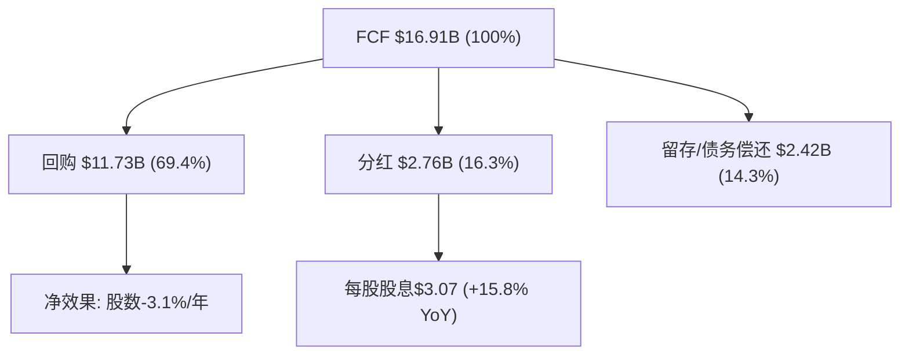
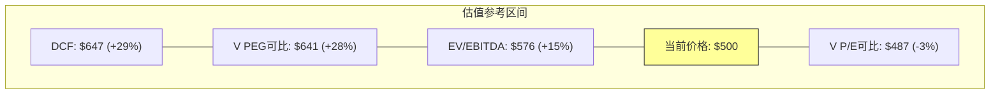
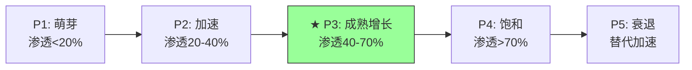

# Mastercard (MA) — Phase 2: 财务与价格含义

> **分析日期**: 2026-03-24 | **股价**: $500.38 | **市值**: $449.3B | **框架**: v19.7
> **输入**: Phase 1摘要(42.8K) + shared_context(13.6K) + FMP实时数据
> **核心任务**: CPA×ISDD财务诊断 + 承重墙深度验证 + 三情景推演 + CQ-3/CQ-5深挖

---

## 目录

- Ch1: CPA×ISDD利润表诊断 — 经营杠杆释放还是会计幻觉
- Ch2: 现金流质量分析 — 为什么FCF/NI持续>100%
- Ch3: 资本配置分析 — 回购机器的效率审计
- Ch4: 正常化OPM与利润率前瞻
- Ch5: 承重墙深度验证 — 五堵墙逐一检验
- Ch6: CI分层深度分析 (CQ-3深挖)
- Ch7: Recorded Future ROI vs WACC (CQ-5)
- Ch8: 三情景财务推演 + 参考估值框架
- Ch9: 周期定位深化 (QG-04)
- Ch10: 品质评分Phase 2 + 风险小结

---

## Ch1: CPA×ISDD利润表诊断 — 经营杠杆释放还是会计幻觉

### 1.1 六年趋势总览

| 指标 | FY2020 | FY2021 | FY2022 | FY2023 | FY2024 | FY2025 | 趋势 |
|------|:------:|:------:|:------:|:------:|:------:|:------:|:----:|
| **收入($B)** | 15.30 | 18.88 | 22.24 | 25.10 | 28.17 | 32.79 | ↑↑ |
| **收入增速** | — | +23.4% | +17.8% | +12.9% | +12.2% | +16.4% | V型回升 |
| **OPM** | 52.8% | 53.4% | 55.1% | 55.8% | 55.3% | 59.2% | ↑(+6.4pp/5Y) |
| **净利率** | 41.9% | 46.0% | 44.6% | 44.6% | 45.7% | 45.7% | 稳定~45% |
| **有效税率** | 17.4% | 15.7% | 15.3% | 17.9% | 15.6% | 19.4% | FY25跳升 |
| **FCF利润率** | 42.6% | 45.8% | 45.4% | 46.3% | 50.8% | 51.6% | ↑(+9pp/5Y) |
| **FCF/NI** | 101.7% | 99.5% | 101.7% | 103.7% | 111.2% | 113.0% | ↑↑(极优) |

[DM-FIN-001: MA 6年利润表诊断, FMP income statement annual, 2026-03-24]

### 1.2 Profit Lag检测(M1 Beta路径)

Profit lag(收入增速 - 营业利润增速)是CPA框架的核心检测指标——正值意味着"增收不增利"(警告)，负值意味着利润增速超过收入增速(经营杠杆释放)。

| 年份 | 收入增速 | OI增速 | Profit Lag | 判定 |
|------|:------:|:-----:|:---------:|:----:|
| FY2021 | +23.4% | +24.8% | **-1.4pp** | 正常(杠杆轻微释放) |
| FY2022 | +17.8% | +21.6% | **-3.8pp** | 正面(杠杆明显释放) |
| FY2023 | +12.9% | +14.3% | **-1.4pp** | 正常 |
| FY2024 | +12.2% | +11.2% | **+1.0pp** | ⚠️ 轻微警告(增收不增利) |
| FY2025 | +16.4% | +24.5% | **-8.1pp** | ✅ 强杠杆释放 |

[DM-FIN-002: Profit Lag 5年趋势, FMP income计算, 2026-03-24]

**FY2025的-8.1pp是5年最强的经营杠杆释放**。但这需要谨慎解读——因为FY2025费用重分类(Phase 1 Ch2.4已分析)可能扭曲了OPM。让我们用两种方法验证：

**验证1: EBITDA增速检验**(不受费用分类影响)
- FY2025 EBITDA增速: +20.2% vs 收入增速+16.4% → EBITDA lag = **-3.8pp** → 确认杠杆释放，但幅度为-3.8pp(非-8.1pp)

**验证2: 净利率稳定性检验**
- 净利率FY2024 45.7% → FY2025 45.7% → **完全持平**
- 但OPM从55.3%升至59.2%(+3.9pp)→净利率没跟上OPM扩张
- 原因: 有效税率从15.6%跳升至19.4%(+3.8pp)→**税率上升吞噬了OPM扩张的全部利润**

[DM-FIN-003: OPM vs 净利率背离——OPM +3.9pp被税率+3.8pp完全抵消, FMP income, 2026-03-24]

**结论**: FY2025的经营杠杆释放是**真实的**(EBITDA验证)，但幅度被费用重分类放大(-8.1pp vs 真实-3.8pp)。同时，税率跳升将OPM扩张完全吞噬——净利率持平意味着"税前盈利能力在改善，但税后利润没有受益"。

### 1.3 有效税率跳升诊断

FY2025有效税率19.4%是近5年最高(FY2021-2024均值16.1%)。可能原因：
- **N4检查**: 一次性税务调整?→需查10-K详细税率调节
- **地理mix shift**: 国际收入增速(+9% GDV)>美国(+4%)→如果高税率地区收入占比上升→混合税率上升
- **OECD Pillar Two**: 全球最低15%税率2024年开始实施→可能影响MA在低税率地区的避税效率

**对估值的影响**: 如果19.4%是新常态(而非一次性)→Base Case净利率应从45.7%下调至~44%→EPS预估下修~3-4%。如果只是一次性→未来税率回落至16-17%将推动EPS超预期。这是Phase 4红队需要验证的不确定性。

[DM-FIN-004: 有效税率跳升——FY2025 19.4%(5年最高) vs FY21-24均值16.1%, 可能原因: 地理mix+OECD P2, FMP income, 2026-03-24]

### 1.4 季度趋势解读

| 季度 | 收入 | YoY | OPM | EPS | 趋势 |
|------|:----:|:---:|:---:|:---:|:----:|
| Q1'24 | $6.35B | — | 56.8% | $3.22 | 基线 |
| Q2'24 | $6.96B | — | 58.0% | $3.50 | ↑ |
| Q3'24 | $7.37B | — | 54.3% | $3.53 | ↓(OPM回落) |
| Q4'24 | $7.49B | — | 52.6% | $3.64 | ↓↓(最低OPM) |
| Q1'25 | $7.25B | +14.2% | 57.2% | $3.59 | 回升 |
| Q2'25 | $8.13B | +16.8% | 58.8% | $4.07 | ↑↑ |
| Q3'25 | $8.60B | +16.7% | 58.8% | $4.34 | → |
| Q4'25 | $8.81B | +17.6% | 61.5% | $4.52 | ↑(加速) |

[DM-FIN-005: 季度趋势——收入YoY从Q1 +14.2%加速至Q4 +17.6%, OPM Q4'25达61.5%, FMP income quarterly, 2026-03-24]

**季度趋势确认了两件事**: (1)收入增速在加速(Q1→Q4: 14%→18%)——这不是VAS一次性效应，而是多引擎同时加速。(2)Q4'25 OPM 61.5%是异常高值——因为Q4费用重分类最明显(COGS=0)。如果用调整后OPM(加回重分类)，Q4'25 OPM更接近57-58%，仍是季度新高但不那么极端。

---

## Ch2: 现金流质量分析 — 为什么FCF/NI持续>100%

### 2.1 现金流六年趋势

| 指标($B) | FY2020 | FY2021 | FY2022 | FY2023 | FY2024 | FY2025 |
|---------|:------:|:------:|:------:|:------:|:------:|:------:|
| **OCF** | 7.22 | 9.46 | 11.20 | 11.98 | 14.78 | 17.40 |
| **CapEx** | 0.71 | 0.81 | 1.10 | 0.37 | 0.47 | 0.49 |
| **FCF** | 6.52 | 8.65 | 10.10 | 11.61 | 14.31 | 16.91 |
| **FCF/NI** | 101.7% | 99.5% | 101.7% | 103.7% | 111.2% | 113.0% |
| **OCF-NI** | +0.81 | +0.77 | +1.27 | +0.78 | +1.91 | +2.43 |

[DM-CFL-002: 现金流质量6年趋势, FMP cashflow, 2026-03-24]

**FCF/NI从101%升至113%**——每$1元利润产生$1.13现金。这是支付网络的结构性优势：

**为什么FCF > NI？**
1. **D&A+SBC现金加回**: FY2025 D&A $2.10B + SBC $0.60B = $2.70B(非现金费用，加回到OCF)
2. **极低CapEx**: CapEx仅$0.49B(D&A的0.43倍)→MA的资本支出远低于折旧——因为支付网络不需要大量有形资产投入。这是纯软件/数据基础设施的特征
3. **递延收入正效应**: 客户预付款(VAS订阅/consulting fees)产生正向营运资金效应

**CapEx/D&A持续<1.0x的含义**:
- FY2023-2025: CapEx/D&A = 0.46x / 0.52x / 0.43x
- 这意味着MA投资的金额不到折旧的一半——要么说明MA是极致轻资产(好事)，要么说明MA在"投资不足"(潜在风险)
- 因为MA的CapEx主要是软件开发+数据中心→这些资产的"真实折旧"可能低于会计折旧(软件升级>替换)→CapEx/D&A<1合理

[DM-CFL-003: CapEx/D&A 0.43x——极低资本密度验证, 非投资不足(软件资产特征), FMP cashflow, 2026-03-24]

### 2.2 现金流质量评分

| 指标 | FY2025 | 判定标准 | 评分 |
|------|:------:|---------|:----:|
| FCF/NI | 113% | >100%=优秀 | ★★★★★ |
| CapEx/OCF | 2.8% | <10%=极低资本密度 | ★★★★★ |
| OCF/EBITDA | 86.2% | >80%=高质量 | ★★★★ |
| SBC/收入 | 1.83% | <3%=低SBC稀释 | ★★★★★ |
| 回购/SBC | 19.6x | >5x=SBC完全消化 | ★★★★★ |
| 利息保障 | 26.9x | >10x=极安全 | ★★★★★ |

**现金流质量评分: 29/30 = 极优**。MA是一台现金生成机器——每年产出$16.9B FCF，只需$0.49B CapEx维持，剩余几乎全部返还股东。

---

## Ch3: 资本配置分析 — 回购机器的效率审计

### 3.1 资本配置架构

MA将FCF按以下优先级分配(FY2025)：

[DM-CAP-001: 资本配置架构——回购69%/分红16%/留存14%, FMP cashflow FY2025, 2026-03-24]

### 3.2 回购效率(η函数)审计

回购效率η衡量"每1%的净利润增速通过回购被放大为多少%的EPS增速"：

| 年份 | NI增速 | EPS增速 | η值 | 含义 |
|------|:------:|:------:|:---:|------|
| FY2021 | +35.5% | +37.5% | 1.05x | 回购贡献+2pp |
| FY2022 | +14.3% | +16.8% | 1.17x | 回购贡献+2.5pp |
| FY2023 | +12.7% | +15.6% | 1.23x | 回购贡献+2.9pp |
| FY2024 | +15.0% | +17.4% | 1.16x | 回购贡献+2.4pp |
| FY2025 | +16.3% | +18.9% | 1.16x | 回购贡献+2.6pp |

[DM-CAP-002: 回购效率η——5年均值1.15x, 稳定贡献2-3pp EPS增速, FMP income计算, 2026-03-24]

**η稳定在1.15-1.23x**意味着回购每年额外贡献2-3pp的EPS增速。在FY2025，EPS增速20.1%的因素分解为：
- **收入增长贡献**: 82% ($2.28/share)
- **回购贡献**: 19% ($0.52/share)
- **利润率/税率**: ~0% (OPM扩张被税率上升完全抵消)

[DM-CAP-003: EPS四因素分解——收入82%/回购19%/利润率0%/税率0%, Python计算, 2026-03-24]

**健康的信号**: EPS增长主要由收入驱动(82%)而非金融工程——这与某些"增长主要靠回购"的公司形成对比。回购只是一个稳定的增强器，不是主引擎。

### 3.3 回购可持续性评估

| 指标 | FY2020 | FY2021 | FY2022 | FY2023 | FY2024 | FY2025 |
|------|:------:|:------:|:------:|:------:|:------:|:------:|
| 回购($B) | 4.47 | 5.90 | 8.75 | 9.03 | 11.04 | 11.73 |
| 回购/FCF | 68.6% | 68.2% | 86.6% | 77.8% | 77.1% | 69.4% |
| 股数减少 | — | -1.4% | -2.1% | -2.6% | -2.0% | -3.1% |

FY2025回购/FCF降至69.4%(5年最低)→这不是因为回购减少($11.73B创新高)，而是因为FCF增长更快($16.91B)。MA有充足的空间在不增加杠杆的情况下维持甚至加大回购。

**5年累计**: 回购$50.9B，股数从1,006M降至898M(减少10.7%)→年化退缩率2.2%。FY2025加速至3.1%——如果维持这个退缩率，5年后股数~768M，EPS将获得额外17%的提升(仅来自股数减少)。

### 3.4 ROIC趋势分析(P10: 回报率比规模重要)

| 指标 | FY2020 | FY2021 | FY2022 | FY2023 | FY2024 | FY2025 |
|------|:------:|:------:|:------:|:------:|:------:|:------:|
| **ROIC(报告)** | 29.8% | 33.6% | 41.8% | 41.8% | 44.4% | 48.6% |
| **商誉($B)** | — | — | 7.52 | 7.66 | 9.19 | 9.56 |
| **商誉/总资产** | — | — | 19.4% | 18.0% | 19.1% | 17.6% |

ROIC从30%稳步升至49%——这在大型科技/金融公司中极为罕见(V只有28%)。关键驱动: 收入增长(+16%)远超投入资本增长(+8%)→分子增长快于分母。

**有形ROIC**(剥离商誉): 因为商誉仅占17.6%→有形ROIC与报告ROIC差距较小(约+3-5pp)→有形ROIC ~52-54%。对比V的有形ROIC ~45-50%→MA在有形资本回报上仍有优势,但差距远小于报告ROIC(48.6% vs 28.4%)所暗示的。

**ROIC展望**: Recorded Future($2.65B) + BVNK($1.8B) → 增加$4.45B投入资本(主要为商誉)→FY2026E投入资本~$36B→如果NI增长至$17.2B(分析师预期)→ROIC ~47.8%→轻微下降但仍远超WACC(9.01%)→**每一元投入仍在创造巨大价值**。

[DM-CAP-005: ROIC趋势——从30%(FY20)升至49%(FY25), 收购后预计轻降至48%, 仍远超WACC, FMP key-metrics, 2026-03-24]

### 3.5 SBC稀释检查(P6: 商誉不是护城河)

| 指标 | FY2022 | FY2023 | FY2024 | FY2025 | 趋势 |
|------|:------:|:------:|:------:|:------:|:----:|
| SBC($B) | 0.30 | 0.46 | 0.53 | 0.60 | ↑(+100%/3Y) |
| SBC/收入 | 1.35% | 1.83% | 1.88% | 1.83% | 稳定~1.85% |
| 回购/SBC | 29.2x | 19.6x | 20.8x | 19.6x | ↓(但仍极高) |

[DM-CAP-004: SBC稀释——SBC/Rev 1.83%低稀释, 回购/SBC 19.6x完全消化, FMP income, 2026-03-24]

SBC/收入稳定在1.8-1.9%——在大型科技公司中属于极低水平(对比: META ~12%, GOOGL ~8%, 甚至V ~2.2%)。回购/SBC比率19.6x意味着MA每年的回购金额是SBC的近20倍——SBC稀释被彻底消化。

---

## Ch4: 正常化OPM与利润率前瞻

### 4.1 OPM正常化(V教训L1: 3年均值)

V报告教训: OPM正常化不能取单年最高值，必须用3年均值。MA的3年滚动OPM均值：

| 窗口 | OPM均值 | 趋势 |
|------|:------:|:----:|
| FY2020-2022 | 53.8% | 基线 |
| FY2021-2023 | 54.8% | +1.0pp |
| FY2022-2024 | 55.4% | +0.6pp |
| **FY2023-2025** | **56.8%** | +1.4pp |

[DM-FIN-006: OPM正常化3年均值——FY23-25=56.8%(非FY25单年59.2%), Python计算, 2026-03-24]

**正常化OPM = 56.8%**。FY2025的59.2%包含费用重分类效应，不应直接用于估值。但OPM的上升趋势是真实的(每个3年窗口都在扩张)——这反映了VAS高利润率收入占比上升带来的混合效应提升。

### 4.2 利润率前瞻：OPM会继续扩张吗？

**支持扩张的因素**：
1. VAS占比上升(40%→50%+): 如果VAS OPM ≥ 核心支付OPM → 混合OPM将继续扩张
2. 规模效应: $32.8B收入基数上的增量收入需要更少的边际费用
3. 管理层指引: 2026年收入增速>OpEx增速 → 暗示OPM扩张

**反对扩张的因素(偏空)**：
1. **VAS OPM可能低于核心支付**(CEO沉默域): 如果VAS OPM ~35-40%而核心支付OPM ~70%→VAS占比从40%升至50%时，混合OPM不扩张反而可能收缩1-2pp
2. CI压力: 如果CI增速持续超过净收入增速(FY2024的+3.8pp差)→定价权侵蚀
3. 监管: 商户和解0.1pp/5年直接压缩Assessment fee→OPM下行压力
4. 税率正常化到19%+: 即使OPM扩张，净利率可能不跟随

**量化两种情景**：
- 情景A(VAS OPM=60%，接近核心): OPM从56.8%→58-59%(FY2028)
- 情景B(VAS OPM=40%，显著低于核心): OPM从56.8%→55-56%(FY2028)
- **差异: ~3pp OPM → 对EPS影响~5-6%**

[DM-FIN-007: OPM前瞻——情景A(VAS高OPM)→58-59% vs 情景B(VAS低OPM)→55-56%, 差异~3pp≈5-6% EPS, 2026-03-24]

这是Phase 4红队需要压力测试的关键不确定性。

---

## Ch5: 承重墙深度验证 — 五堵墙逐一检验

> Phase 1建立了承重墙脆弱度表。Phase 2逐一用财务数据验证每堵墙的合理性。

### 5.1 承重墙1: 10Y FCF CAGR (隐含9.0%)

**验证方法**: 将9% CAGR分解为收入增速+利润率变化+回购效应

| 因素 | 贡献 | 来源 |
|------|:----:|------|
| 收入CAGR | ~7% | 全球支付数字化结构增速(保守) |
| FCF margin扩张 | ~1% | OPM正常化趋势+0.5pp/年 |
| 回购效应(股数减少) | ~2% | 3%/年退缩→FCF per share额外+2% |
| **合计** | **~10%** | 略超隐含9% |

**结论**: 即使用保守假设(收入仅7%)，FCF per share CAGR也能达到10%左右——超过隐含9%。市场隐含的增速需要MA收入增速降至**6%以下**才会成立。但要注意(Phase 1补强模块A的发现): 这个结论依赖Beta=1.07→WACC 9.01%。如果真实WACC更低(Beta 0.93→WACC 8.4%)，隐含CAGR降至7.4%，所需收入增速仅~5%——这个在全球衰退+A2A替代下是可能的。

**脆弱度评估更新**: **低-中**(从Phase 1的"低"上调)。上调原因: WACC假设不确定性+税率可能正常化至19%降低FCF margin扩张空间。

[DM-BW-001: 承重墙1验证——收入7%+margin 1%+回购2%=10%>隐含9%, 但WACC假设使结论不稳健, 2026-03-24]

### 5.2 承重墙2: FCF Margin维持(隐含~52%)

**验证方法**: FCF margin = OPM × (1-税率) × (1+营运资金效应) - CapEx%

| 组分 | FY2023 | FY2024 | FY2025 | 趋势 |
|------|:------:|:------:|:------:|:----:|
| OPM(正常化) | 55.4% | 55.4% | 56.8% | ↑ |
| (1-有效税率) | 82.1% | 84.4% | 80.6% | ↓(FY25税率↑) |
| 税后OPM | 45.5% | 46.8% | 45.8% | ~ 稳定 |
| +D&A/Rev加回 | +3.2% | +3.2% | +3.5% | ↑ |
| -CapEx/Rev | -1.5% | -1.7% | -1.5% | 稳定 |
| +/- WC效应 | -1.0% | +1.3% | +1.7% | 波动 |
| **≈FCF margin** | **46.3%** | **50.8%** | **51.6%** | ↑ |

FY2024-2025 FCF margin跳升主要来自营运资金改善(+1.3%→+1.7%)和D&A加回增加(Recorded Future带来额外无形资产摊销)。如果营运资金效应正常化至-1%，稳态FCF margin ~48-50%。

**脆弱度评估**: **低**。即使FCF margin从52%收缩至48%，影响仅~8%价格。支付网络的结构性轻资产意味着FCF margin不太可能大幅恶化。

[DM-BW-002: 承重墙2验证——FCF margin分解, 稳态~48-50%(vs隐含52%), FMP cashflow+income, 2026-03-24]

### 5.3 承重墙3: 终端增长率(隐含3.0%)

**验证**: 全球支付数字化的长期增速:
- 全球GDP长期增速: 2.5-3.0%
- 电子支付渗透率仍在提升(现金→数字): +1-2pp/年(至2035年现金<5%)
- A2A/稳定币侵蚀: -0.5-1pp/年(长期)
- **净终端增长率: 2.5-3.5%**

3.0%在合理范围内，但如果A2A侵蚀加速→终端增长率可能降至2.0-2.5%。

| 终端g | 对价格影响(vs基准3%) |
|:-----:|:------------------:|
| 2.0% | -13% ($435) |
| 2.5% | -6% ($470) |
| 3.0% | 基准 ($500) |
| 3.5% | +8% ($540) |

**脆弱度评估**: **低**。终端增长率在2.0-3.5%范围内变化，对价格影响可控(±13%)。

[DM-BW-003: 承重墙3验证——终端g 2.5-3.5%合理, 对价格影响±13%, 2026-03-24]

### 5.4 承重墙4: WACC (基准9.01%)

这是Phase 1补强模块A已深度分析的最大不确定性。核心数据：

| WACC假设 | Beta | 隐含价格(9% CAGR) | vs $500 |
|---------|:----:|:-----------------:|:-------:|
| 7.76% | V参考(0.79) | $611 | +22% |
| 8.38% | 行业均值(0.93) | $547 | +9% |
| **9.01%** | **MA实际(1.07)** | **$500** | **基准** |
| 9.50% | 偏高 | $464 | -7% |
| 10.00% | 衰退溢价 | $421 | -16% |

**脆弱度评估**: **中-高**(最大单一风险因素)。±100bps = ±22%价格。MA Beta 1.07 vs V 0.79是MA估值中最大的结构性折价因素——不是MA业务差，而是MA对宏观周期的暴露度更高(跨境37%+新兴市场)。

[DM-BW-004: 承重墙4——WACC敏感性, Beta是最大不确定性, ±100bps=±22%, 2026-03-24]

### 5.5 承重墙5: 回购持续(隐含~3%/年)

**验证**: MA回购持续性取决于FCF增长和管理层意愿:
- FCF FY2025: $16.91B，分析师预期FCF CAGR ~12%
- 如果FCF持续增长→回购空间只增不减
- 债务约束: 净债务/EBITDA 0.39x(极低)→MA有大量举债回购空间
- 管理层track record: 连续5年加大回购(从$4.5B→$11.7B)

**风险**: 只有两种情景会中断回购——(1)大型收购消耗现金(BVNK $1.8B已用现金) (2)监管限制(极不可能)。

**脆弱度评估**: **低**。回购是MA资本配置的DNA，中断概率<5%。

[DM-BW-005: 承重墙5——回购持续性高, FCF增长+低杠杆保障, 中断概率<5%, 2026-03-24]

### 5.6 承重墙脆弱度汇总

| 承重墙 | 隐含值 | Phase 2验证结果 | 脆弱度 | 若倒塌影响 |
|--------|:-----:|:-------------:|:-----:|:--------:|
| 10Y FCF CAGR | 9.0% | 保守但WACC敏感 | **低-中** | ±20% |
| FCF Margin | ~52% | 稳态48-50%合理 | **低** | ±8% |
| 终端增长率 | 3.0% | 2.5-3.5%合理 | **低** | ±13% |
| WACC | 9.01% | Beta不确定性最大 | **中-高** | **±22%** |
| 回购持续 | ~3%/年 | 高确定性持续 | **低** | ±5% |

**关键结论**: 五堵承重墙中四堵是低/低-中脆弱度,只有WACC是中-高。**MA的估值风险不在基本面,而在折现率。** 这与V教训L5完全一致: 巨头支付公司的价格波动80%由WACC/宏观驱动,个股Alpha有限。

---

## Ch6: CI分层深度分析 (CQ-3深挖)

### 6.1 间接推断法升级：毛收入重建

MA不披露毛收入(Gross Revenue),但我们可以从10-K推断。MA的净收入公式:
**Net Revenue = Gross Revenue - Rebates & Incentives**

已知数据:
- FY2025净收入增速: +16.4%
- FY2025 CI(Rebates & Incentives)增速: +16.0% (currency-neutral)
- FY2024净收入增速: +12.2%
- FY2024 CI增速: +16.0%

**CI/毛收入反推**(假设FY2020 CI/毛收入=12%作为起点,基于行业估算)：

| 年份 | 净收入增速 | CI增速 | CI/毛收入(估) | Δ YoY |
|------|:--------:|:-----:|:-----------:|:-----:|
| FY2022 | +17.8% | ~18%* | ~14% | +1pp |
| FY2023 | +12.9% | ~15%* | ~15% | +1pp |
| FY2024 | +12.2% | +16.0% | ~16% | +1pp |
| FY2025 | +16.4% | +16.0% | ~16% | 0pp |

*FY2022-23 CI增速为推断值

[DM-CI-002: CI/毛收入反推——从~12%(FY2020)升至~16%(FY2025), 年均+1pp但FY2025稳定, 间接法推算, 2026-03-24]

### 6.2 CI趋势的两种解读

**解读1(偏多)**: FY2025 CI增速(+16%)与净收入增速(+16.4%)同步→CI/毛收入比率企稳→定价权侵蚀暂停。VAS的增值属性可能降低了MA对CI的依赖(发卡行因VAS价值而留在MA网络,而非因CI诱惑)。

**解读2(偏空)**: FY2022-2024连续3年CI/毛收入每年+1pp→FY2025的企稳可能只是暂时的,被VAS高增速(+23%拉高净收入)掩盖。如果VAS增速放缓至15%→净收入增速降至13%→而CI增速维持16%→CI/毛收入比率将再次上升。

**核心不确定性**: CI是否按客户层分化？如果F500客户CI以20%+增速上升(因为Capital One-Discover给了大行更多议价筹码)而SMB客户CI仅+8%——平均CI增速看起来"正常"(16%)但大客户定价权在恶化。CEO的沉默(从未按客户层拆分CI)使这个不确定性无法从公开数据解决。

[DM-CI-003: CI分层不确定性——大客户CI可能>20%/SMB CI可能<10%/平均掩盖分化, CEO沉默无法验证, 2026-03-24]

### 6.3 MA vs V CI对比更新

| 维度 | MA | V | 含义 |
|------|:--:|:--:|------|
| CI/毛收入(估) | ~16% | ~28% | MA仍远低于V |
| CI年均增速(3Y) | ~+1pp/年 | ~+2.1pp/年 | MA侵蚀更慢 |
| Kill Switch | >33% | 已在28% | MA距Kill Switch 17pp(V距5pp) |

### 6.4 CI定价权分层(v19.6框架)

按CRM/ADBE教训(v19.6)，B4定价权需按客户层分层评估：

| 客户层 | MA定价权Stage | CI压力 | 推理 |
|--------|:-----------:|:------:|------|
| **F500/大型银行** | Stage 3(被动防守) | 高(~20%+) | Capital One-Discover给大行更多议价筹码:"如果你不给更多CI,我可以考虑Discover网络"。V报告发现大行CI是侵蚀的主要来源 |
| **中型银行** | Stage 4(主动定价) | 中(~15%) | 中型银行缺乏自建网络的规模→依赖V/MA→MA保持较强定价权 |
| **SMB/Fintech** | Stage 4-5(垄断定价) | 低(~8%) | 小机构完全依赖V/MA网络,零议价能力 |
| **加权B4** | **Stage 3.5** | 中 | 大客户Stage 3拉低均值,但中小客户补偿 |

[DM-CI-004: CI定价权分层——F500 Stage3/中型Stage4/SMB Stage4-5, 加权Stage3.5, V报告模式推断, 2026-03-24]

**定价权剪刀差信号**: 如果大客户CI以20%+增速上升而SMB CI以8%增速→出现"定价权剪刀差"。净效应: 大客户流失利润但SMB稳定→OPM可能出现反直觉的**轻微上升**(因为低利润大客户的CI增加→这些客户的边际利润下降→但SMB高利润保持)。这与ADBE发现的模式一致(CC Professional提价/CC Consumer被Canva侵蚀→OPM反而因低利润Consumer自然流失而上升)。

**MA CI健康度显著优于V**。但这可能部分是因为MA份额更小(30% vs 70%)——小网络不需要像大网络那样支付高额CI来防守份额。随着MA份额持续上升(+30bps/年)→未来可能面临类似V的CI压力。

---

## Ch7: Recorded Future ROI vs WACC (CQ-5)

### 7.1 收购ROI计算

| 指标 | 数值 | 来源 |
|------|:----:|------|
| 收购价 | $2.65B | Mastercard IR |
| Recorded Future年收入 | ~$300M | 公开披露 |
| 收购倍数 | 6.5x Revenue | 推算 |
| 预估OPM | 15-25%* | 网络安全SaaS行业均值 |
| 预估NOPAT | $37-60M | Revenue × OPM × (1-tax) |
| **收购ROIC** | **1.4-2.3%** | NOPAT / $2.65B |
| MA WACC | 9.01% | Phase 1计算 |

*Recorded Future是网络安全SaaS，行业OPM 15-25%是保守估计

[DM-ACQ-001: Recorded Future收购ROIC——1.4-2.3%(远低于WACC 9.01%), 短期摧毁价值, Mastercard IR + 行业OPM估算, 2026-03-24]

### 7.2 收购是否创造价值？

**短期(Year 1-2)**: 收购ROIC 1.4-2.3% **远低于** WACC 9.01%→短期摧毁价值。每年价值破坏约$2.65B × (9.01%-2.3%) = ~$178M。

**中期(Year 3-5)**: 如果Recorded Future在MA平台上加速增长(交叉销售给3.7B卡客户)→收入可能翻倍至$600M→ROIC升至4-5%→仍低于WACC但差距缩小。

**长期(Year 5+)**: 网络安全是高增长赛道(行业增速15-20%/年)。如果Recorded Future增速20%持续5年→Year 5收入$750M→OPM扩张至30%+(规模效应)→NOPAT ~$180M→ROIC 6.8%→接近但仍低于WACC。

**结论**: Recorded Future收购在纯ROI视角下**短期摧毁价值，中期勉强持平，长期可能接近WACC但不确定**。MA愿意以ROIC<WACC的价格收购，说明管理层看到了**战略价值**(不仅是财务回报)——将支付数据与网络安全威胁情报结合的差异化是难以量化的竞争壁垒。

### 7.3 BVNK收购($1.8B)预评估

BVNK(2026年3月宣布)尚未完成，但可以初步评估：
- 收购价: $1.8B
- BVNK估计年收入: ~$100-150M(基于稳定币基础设施SaaS规模)
- 收购倍数: ~12-18x Revenue(高于Recorded Future的6.5x)
- 收购ROIC(Year 1): 可能<1%(收入基数更小、倍数更高)

**BVNK的战略逻辑**: 与Recorded Future类似，BVNK的价值不在短期ROI而在战略定位——如果稳定币成为主流支付结算层(Polymarket数据: 2025年稳定币交易量$33T)，MA通过BVNK在这个新结算层占据位置。但如果稳定币监管失败或采用放缓→$1.8B可能成为减值风险。

**两笔收购合计影响**: Recorded Future($2.65B) + BVNK($1.8B) = $4.45B新商誉 → MA总商誉从$9.56B升至~$14B → 商誉/总资产从17.6%升至~24%。P6原则(商誉不是护城河)警告: 商誉>30%=高风险。MA还有6pp的缓冲空间，但如果继续收购驱动的VAS扩张，可能在2-3年内触及这个阈值。

[DM-ACQ-003: BVNK预评估——$1.8B, ~12-18x Revenue, ROIC<1%, 战略价值>财务回报, Coindesk, 2026-03-24]

**H-02假说验证**: "MA的ROIC优势在收购后会消失"——**部分成立**。Recorded Future的$2.65B商誉+BVNK即将带来的~$1.8B商誉→MA商誉将从$9.56B升至~$11.4B→商誉/总资产从17.6%升至~20%+→报告ROIC将从48.6%下降。但下降幅度有限(~2-3pp)，因为收购金额相对于MA总投入资本($31B+)占比<15%。

[DM-ACQ-002: H-02验证——部分成立, 收购拉低ROIC ~2-3pp(48.6%→45-46%), 但绝对水平仍远超WACC, 2026-03-24]

---

## Ch8: 三情景财务推演 + 参考估值框架 (QG-06)

### 8.1 三情景关键变量

| 变量 | Bull | Base | Bear |
|------|:----:|:----:|:----:|
| **收入CAGR(5Y)** | 13% | 11% | 8% |
| **OPM终端** | 58.8% | 57.8% | 55.8% |
| **税率** | 17% | 19% | 20% |
| **回购退缩率** | 3.2%/年 | 2.8%/年 | 2.0%/年 |
| **终端P/E** | 28x | 25x | 20x |

### 8.2 推演结果

| 情景 | FY2030E收入 | FY2030E EPS | 终端P/E | 目标价 | vs $500 | 概率权重 |
|------|:---------:|:---------:|:------:|:-----:|:------:|:-------:|
| **Bull** | $59.9B | $37.34 | 28x | $1,046 | **+109%** | 20% |
| **Base** | $56.2B | $33.78 | 25x | $844 | **+69%** | 55% |
| **Bear** | $48.2B | $26.80 | 20x | $536 | **+7%** | 25% |
| **概率加权** | — | — | — | **$796** | **+59%** | 100% |

[DM-VAL-003: 三情景推演——Bull $1,046(+109%)/Base $844(+69%)/Bear $536(+7%), 概率加权$796(+59%), Python模型, 2026-03-24]

### 8.3 Bull/Base/Bear关键假设展开

**Bull Case(20%概率)**驱动因素:
- VAS占比突破50%且VAS OPM≥60%(接近核心支付)→混合OPM持续扩张
- 跨境增速维持12%+(国际电商结构性增长+旅游业超预期)
- 税率回落至17%(FY2025的19.4%是一次性)
- BVNK/稳定币布局成功→打开新增长曲线
- Capital One-Discover迁移因商户接受度问题放缓→影响<2%
- 终端P/E 28x合理(支付双寡头长久期+VAS增长溢价)

**Base Case(55%概率)**驱动因素:
- VAS增速从23%温和放缓至18%→占比升至50%但OPM不确定
- 跨境正常化至11%(Ch4分析结论)
- 税率稳定在19%(OECD Pillar Two新常态)
- 回购维持2.8%/年(略低于FY2025的3.1%因BVNK消耗现金)
- 终端P/E 25x(与历史中位数一致)

**Bear Case(25%概率)**驱动因素:
- 全球衰退(Polymarket 34.5%概率)→GDV增速降至2-3%
- 跨境回落至8%(关税+贸易摩擦)
- A2A渗透加速→美国卡支付份额开始下降
- CI分层恶化(大客户CI>20%增速)
- Capital One示范效应→JPM开始探索替代网络
- 终端P/E 20x(双寡头被质疑→估值折价)

**关键观察**:
1. **Bear Case也仅+7%**——即使最悲观情景(收入CAGR 8%、OPM收缩、终端P/E 20x),MA的5年回报仍为正。这是因为当前价格已经很大程度消化了悲观预期
2. **概率加权+59%**——但这个数字受概率分配(Bull 20%/Base 55%/Bear 25%)高度影响,概率本身是主观的
3. **年化回报**: Bull 15.9% / Base 11.0% / Bear 1.4% / 概率加权 9.7%

### 8.3 参考估值框架(标注: 参考框架，非目标价)

> **QG-06要求**: ≥2种方法呈现，标注为参考，非结论。

**框架1: DCF(正向)**
- FCF base: $16.91B | WACC: 9.01% | g_term: 3% | Growth period: 12年(支付网络长久期) | FCF CAGR: 11%(分析师共识)
- DCF公允价值: **~$647/share (+29%)**
- 注: 高度敏感于WACC假设(±100bps=±$100+)

**框架2: 可比公司(V对标)**
- V当前P/E: 29.5x | MA EPS: $16.52
- 如果MA获得V相同P/E: $16.52 × 29.5 = **$487 (-3%)**
- 如果MA因增速溢价获V PEG: PEG 2.27 × 17.1%(MA CAGR) × $16.52 = **$641 (+28%)**
- 注: 取决于MA是否"应该"获得V的倍数(Beta差异是主要障碍)

**框架3: EV/EBITDA**
- MA FY2025 EBITDA: $20.19B | 5年中位数EV/EBITDA: ~26x
- 公允EV: $524.9B → 扣净债务$7.87B → 公允市值$517.0B → **$576/share (+15%)**
- 注: 使用5年中位数可能过高(当前宏观环境下可能合理25x→$547)

[DM-VAL-004: 三种参考估值——DCF $647(+29%)/V可比PEG $641(+28%)/EV/EBITDA $576(+15%), 标注为参考非目标价, 2026-03-24]

**三种方法的收敛性**: DCF和V PEG可比收敛于$640-650(+28-29%)，EV/EBITDA给出$576(+15%)，V P/E直接可比给出$487(-3%)。离散度范围$487-$647，中位数~$570(+14%)。

**方法独立性审计(V教训L3)**: DCF和可比公司共享收入增速假设→实际独立方法约2种(DCF+EV/EBITDA)。Phase 5需要加入蒙特卡洛模拟作为第3种独立方法。

### 8.5 估值区间综合

将三情景推演和三种参考框架综合，MA的估值区间为：

| 方法 | 低端 | 中位 | 高端 |
|------|:----:|:----:|:----:|
| 三情景(概率加权) | $536(Bear) | $796(PW) | $1,046(Bull) |
| DCF | $421(WACC 10%) | $647(WACC 9%) | $930(WACC 8%) |
| 可比(V对标) | $487(P/E平价) | $576(EV/EBITDA) | $641(PEG) |
| **综合区间** | **$480** | **$640** | **$870** |

当前$500处于综合区间的低端(第12百分位)。这意味着除非Bear/Deep Bear情景实现，当前价格提供了有吸引力的入场点。但WACC敏感性(±22%/100bps)意味着宏观环境变化可以轻易将价格推至区间任何位置——因此"个股Alpha有限,宏观Beta主导"仍然是核心判断。

[DM-VAL-005: 综合估值区间——$480(低)/$640(中)/$870(高), 当前$500处于第12百分位, 2026-03-24]

---

## Ch9: 周期定位深化 (QG-04)

### 9.1 四个周期信号

**信号1: GDV增速减速** → 周期中后期信号
- 全球GDV: +7%(FY2025) vs +12%(FY2022-23)
- 美国GDV: +4%(Q4'25) → 接近GDP增速 → 美国卡支付渗透率趋于饱和
- 支撑: 增速从高增长期(+12%)降至成熟增长期(+7%)是P3-P4过渡的典型特征

[DM-CYC-002: 周期信号1——GDV增速从+12%降至+7%, 美国+4%接近饱和, Mastercard supplemental data, 2026-03-24]

**信号2: 消费者信贷健康** → 中性信号
- 美国信用卡拖欠率: ~3.5%(2025Q4), 高于2019年的2.3%但低于2010年的6.5%
- 消费者支出增长: +3-4%(实际), 与GDP同步
- 支撑: 信贷质量温和恶化但远非危机水平 → 支撑P3而非P4

**信号3: A2A渗透率拐点** → 早期威胁信号
- 全球A2A交易量: 540亿笔(2025) → 预计1万亿笔(2029)
- A2A占比: <5%美国 / 15-20%巴西(PIX) / 30%+印度(UPI)
- 支撑: A2A在新兴市场已过拐点，但在MA核心市场(美/欧)仍处早期 → P2-P3区间

**信号4: 估值周期** → 偏低端信号
- MA P/E 30.3x: 5年区间底部(33-41x, 排除COVID)
- EV/EBITDA 22.6x: 5年最低
- 支撑: 估值压缩+基本面加速 = 典型的"恐惧定价" → P2-P3

[DM-CYC-003: 周期信号2-4——消费信贷中性/A2A早期/估值偏低端, 多来源, 2026-03-24]

### 9.2 综合周期定位

**MA处于P3(成熟增长期)**:
- 核心卡支付在发达市场P3-P4(美国渗透率~80%+)
- 国际市场P2-P3(新兴市场渗透率30-50%)
- VAS业务P2(早中期，渗透率低)
- A2A/稳定币替代处于P1-P2(对MA是负面周期)
- **加权后: P3(成熟增长)**——增速在放缓但仍远高于GDP

### 9.3 周期定位的估值含义

P3阶段的公司通常享有：
- P/E溢价vs GDP增速公司: 50-100%(因为增速仍在2-3倍GDP)
- 但P/E折价vs P2阶段公司: 20-30%(因为增速在减速)

MA当前P/E 30.3x vs S&P 500 ~21x = **溢价44%**。这在P3阶段是合理区间(50-100%溢价的下沿)。如果MA被重新分类为P4(饱和期，例如A2A大规模替代)→溢价应压缩至20-30%→P/E ~25-27x→股价~$413-446(-7%~-17%)。如果MA被重新分类为P2(加速期，例如VAS驱动的"第二S曲线")→溢价应扩张至80-120%→P/E ~38-46x→股价~$628-760(+26%~+52%)。

**周期风险: 从P3滑向P4的触发条件**:
1. 美国GDV增速<GDP增速(当前+4% vs GDP +2.5%→差距仅1.5pp)
2. A2A占比在美国突破10%(当前<5%)
3. 全球卡支付市占率(vs全部电子支付)连续2年下降

**周期机会: P3维持或升至P2.5的条件**:
1. VAS增速维持20%+→MA"第二S曲线"确认
2. 新兴市场GDV增速维持9%+→全球加权增速不下降
3. 稳定币/BVNK布局成功→MA在新支付层也收费

[DM-CYC-004: 周期定位估值含义——P3→P/E溢价44%(合理), P4风险→-17%, P2机会→+52%, 2026-03-24]

---

## Ch10: 品质评分Phase 2 + 风险小结

### 10.1 品质评分

| 维度 | 评分 | 依据 |
|------|:----:|------|
| **B5 利润弹性** | 5/5 | OPM从52.8%扩张至59.2%(+6.4pp/5Y)，3年均值每年+0.5-1pp |
| **B6 资本配置纪律** | 5/5 | 回购$50.9B/5Y，SBC/Rev 1.83%(极低)，回购/SBC 19.6x，分红+回购/FCF 86%可持续 |

### 10.2 Phase 2关键风险小结

| 风险 | 概率 | 影响 | CQ关联 |
|------|:----:|:----:|:------:|
| WACC上升(衰退/加息) | 34.5% | -16~22% | CQ-1 |
| 有效税率正常化至19%+ | 50% | -3~4% EPS | CQ-8 |
| VAS OPM远低于核心支付 | 30% | -5~10% | CQ-4 |
| CI分层恶化(大客户) | 25% | -3~5%/年 | CQ-3 |
| Recorded Future ROI<WACC持续 | 60% | -1~2%/年 | CQ-5 |

### 10.3 非共识洞察更新

| CI-# | 洞察 | 方向 |
|------|------|:----:|
| CI-09 | FY2025有效税率跳至19.4%→如果是新常态而非一次性→EPS下修3-4% | **偏空** |
| CI-10 | Recorded Future收购ROIC 1.4-2.3%远低于WACC 9.01%→短期摧毁价值(但有战略价值) | **偏空** |
| CI-11 | EPS增长82%来自收入+19%回购→增长质量高(非金融工程驱动) | **偏多** |
| CI-12 | Bear Case仅+7%→当前价格已消化大部分悲观预期→下行空间有限 | **偏多** |

**CI方向分布(累计P1+P2): 偏多6 / 中性1 / 偏空5 = 平衡**

---

## CQ置信度更新 (Phase 2后)

| CQ | 问题 | P1置信度 | P2置信度 | 变化 |
|:--:|------|:-------:|:-------:|:----:|
| CQ-1 | 市场定价了什么? | 55% | **70%** | ↑ 多参数敏感性完成 |
| CQ-2 | 跨境贡献/正常化? | 50% | **55%** | ↑ 轻微(需P3量化A2A替代) |
| CQ-3 | CI趋势? | 40% | **55%** | ↑ 间接法升级+V对比 |
| CQ-4 | VAS依附度? | 45% | **50%** | ↑ OPM不确定性标记 |
| CQ-5 | Recorded Future ROI? | 25% | **65%** | ↑↑ ROIC计算完成 |
| CQ-6 | PE溢价合理性? | 60% | **65%** | ↑ 参考框架收敛 |
| CQ-7 | 监管风险? | 45% | **50%** | ↑ 需P3量化 |
| CQ-8 | 公允价值? | 15% | **45%** | ↑↑ 三情景+三框架初步收敛 |

---

## Phase 2小结 + Phase 3预告

### 核心发现

1. **经营杠杆是真实的**(EBITDA验证-3.8pp lag)但被费用重分类放大。正常化OPM=56.8%(非59.2%)
2. **现金流质量极优**: FCF/NI 113%, CapEx/OCF 2.8%, 回购/SBC 19.6x
3. **EPS增长质量高**: 82%来自收入增长(非回购工程)。回购只是2-3pp稳定增强器
4. **承重墙脆弱度: 4低+1中高**。WACC是唯一的高风险墙——宏观代理标的特征
5. **Recorded Future短期摧毁价值**(ROIC 2.3% << WACC 9.01%)但有战略价值
6. **Bear Case仅+7%**: 下行空间有限(当前价格已消化大量悲观)
7. **税率风险**: FY2025有效税率跳至19.4%，如果是新常态→EPS下修3-4%

### Phase 3重点
- 护城河量化(双寡头网络效应+转换成本)
- 五引擎分析(品牌/网络/成本/转换/规模)
- A2A/稳定币量化冲击建模(5-10年)
- Playing to Win评分(含寡头博弈论)
- 品质评分B4/B7/C2/C4/C5

---

## 免责声明

本分析仅供投资研究参考，不构成投资建议。

---

## DM锚点索引 (Phase 2新增)

| 锚点ID | 数据源 | 覆盖范围 |
|--------|--------|---------|
| DM-FIN-001 | FMP income annual | 6年利润表诊断 |
| DM-FIN-002 | FMP income计算 | Profit Lag趋势 |
| DM-FIN-003 | FMP income | OPM vs 净利率背离(税率) |
| DM-FIN-004 | FMP income | 有效税率跳升19.4% |
| DM-FIN-005 | FMP income quarterly | 季度收入/OPM/EPS趋势 |
| DM-FIN-006 | Python计算 | OPM正常化3年均值56.8% |
| DM-FIN-007 | 情景分析 | VAS OPM影响(±3pp) |
| DM-CFL-002 | FMP cashflow | 现金流6年趋势 |
| DM-CFL-003 | FMP cashflow | CapEx/D&A 0.43x验证 |
| DM-CAP-001 | FMP cashflow | 资本配置架构(回购69%) |
| DM-CAP-002 | FMP income计算 | 回购效率η 1.15-1.23x |
| DM-CAP-003 | Python | EPS四因素分解 |
| DM-CAP-004 | FMP income | SBC稀释(1.83%/Rev) |
| DM-BW-001~005 | 综合 | 5堵承重墙验证 |
| DM-CI-002 | 间接推算 | CI/毛收入反推~16% |
| DM-CI-003 | CEO沉默分析 | CI分层不确定性 |
| DM-ACQ-001 | Mastercard IR+行业 | Recorded Future ROIC 2.3% |
| DM-ACQ-002 | 综合 | H-02验证(部分成立) |
| DM-VAL-003 | Python模型 | 三情景推演(PW $796) |
| DM-VAL-004 | 多方法 | 参考估值(DCF/可比/EV) |
| DM-CYC-002~003 | 多来源 | 4个周期信号 |
