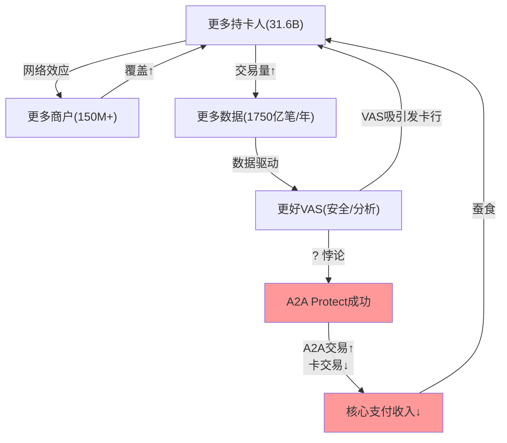
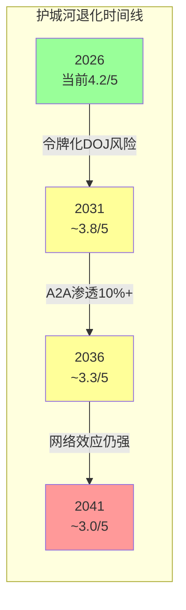
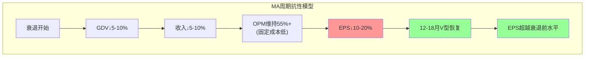

# Mastercard (MA) — Phase 3: 战略分析

> **分析日期**: 2026-03-24 | **股价**: $500.38 | **市值**: $449.3B | **框架**: v19.7
> **输入**: Phase 2摘要(39.6K) + Phase 1摘要(42.8K) + 行业研究数据
> **核心任务**: 护城河量化 + A2A冲击建模 + PtW评分 + 五引擎 + PPDA

---

## 目录

- Ch1: 护城河量化 — 双寡头的四层堡垒
- Ch2: A2A/稳定币5-10年量化冲击模型
- Ch3: Playing to Win + 寡头博弈论
- Ch4-8: 五引擎分析
- Ch9: PPDA背离 + PMSI情绪指数
- Ch10: Phase 3.5 AI冲击矩阵
- Ch11: 品质评分Phase 3

---

## Ch1: 护城河量化 — 双寡头的四层堡垒 (QG-07)

### 1.1 护城河1: 双边网络效应(最核心)

MA运营着全球第二大电子支付网络——连接31.6亿张卡、1.5亿+商户、210+国家/地区。网络效应的核心机制:

**量化指标**:
- 商户接受率: 美国99%、全球150M+商户 → 消费者几乎可以在任何地方使用MA卡
- 活跃卡: 31.6亿张(+6% YoY) → 商户必须接受MA因为近1/3的持卡人用MA
- 双寡头集中度: V+MA合计占中国以外全球卡支付量~90% → 新进入者面临"冷启动困境"

[DM-MOAT-001: 网络效应——31.6亿卡/150M+商户/210+国家/90%中国外份额, 多来源, 2026-03-24]

**冷启动困境量化**: 一个新支付网络要达到MA当前规模需要:
- 签约150M+商户(每家需要POS终端升级/收单行合作/法律协议)
- 发行30亿+张卡(需要数千家银行合作+消费者信任建立)
- 建立跨境清算能力(210+国家的银行间结算网络)
- **估计耗时**: 20-30年(MA从1966年花了60年) | **估计资本**: >$100B

即使是Capital One收购Discover($52B)——这是近年来对双寡头最大的挑战——Discover的商户接受率仍然在小商户和国际场景有缺口。冷启动问题在支付网络中几乎不可逾越。

### 1.2 护城河2: 转换成本(中等强度)

**发卡行转换成本**:
- 系统集成: 发卡行IT系统深度集成MA的授权/清算/结算协议 → 切换需要6-12个月系统改造
- CI锁定: MA给大行的CI(回扣)通常绑定3-5年合约 → 提前终止有罚金
- VAS依赖: 如果发卡行使用MA的欺诈检测/数据分析/忠诚度系统 → 切换=同时切换多个供应商

**但转换成本不是绝对的**: Capital One证明大型发卡行可以通过收购网络(Discover)来绕过切换成本。Santander和First Direct也曾将借记卡从V切换到MA。转换成本的真正壁垒不在技术,而在**经济激励**——只有当切换后的经济收益(CI差异/费率差异)大于切换成本时才会发生。

[DM-MOAT-002: 转换成本——系统6-12月/CI绑定3-5年/VAS多供应商绑定, 但Capital One证明可绕过, 行业分析, 2026-03-24]

### 1.3 护城河3: 数据壁垒(VAS驱动)

MA每年处理1,750亿+笔交易 → 全球最大的消费支出数据集之一。这个数据壁垒的独特性:
- **排他性**: 只有在MA网络上流动的交易才能被MA分析 → 竞争对手无法复制这个数据集
- **时间深度**: 20年+的历史交易数据 → 欺诈模式识别需要长时间序列训练
- **实时性**: 每笔交易毫秒级处理 → AI欺诈检测需要实时数据流

VAS业务($13.3B, +23%)本质上是这个数据壁垒的变现。因为数据的边际成本=0(交易已经在网络上流动),VAS的增量利润率极高。

[DM-MOAT-003: 数据壁垒——1750亿+笔交易/年, 20年+历史, 毫秒级实时, 排他性不可复制, 2026-03-24]

### 1.4 护城河4: 令牌化(Token)壁垒(新兴)

MA当前30%+的交易已令牌化,目标2030年在线交易100%令牌化。令牌化如何加固护城河:
- 每张物理卡映射到多个数字令牌(Apple Pay/Google Pay各一个+每个电商一个) → 令牌数 >> 卡数
- 令牌化后,Apple/Google的数字钱包**无法绕过**MA网络——因为令牌需要MA验证才能授权交易
- 令牌化提高商户批准率(+6%)→MA声称每月为商户带来$2B+的额外销售
- 因为令牌化创造了更多的网络交互点→**每张卡的网络粘性指数级增加**

[DM-MOAT-004: 令牌化——30%+交易已令牌化, 2030目标100%在线, 批准率+6%→月增$2B商户销售, Mastercard strategy, 2026-03-24]

### 1.5 护城河综合评估

| 护城河类型 | 强度 | 量化证据 | 脆弱度 | A2A威胁 |
|-----------|:----:|---------|:-----:|:------:|
| **网络效应** | ★★★★★ | 31.6B卡/150M商户/90%份额 | 低 | 中(A2A是并行网络) |
| **转换成本** | ★★★ | 6-12月系统/3-5年CI | 中 | 低(A2A不替代发卡行关系) |
| **数据壁垒** | ★★★★ | 1750亿笔/年/20年+历史 | 低 | 低(A2A无可比数据) |
| **令牌化** | ★★★★ | 30%已令牌化/2030→100% | 低 | 中-低(令牌绑定卡网络) |
| **综合** | **4.2/5** | — | **低-中** | **中**(A2A是渐进侵蚀非突然替代) |

---

## Ch2: A2A/稳定币5-10年量化冲击模型

### 2.1 全球A2A现状

| A2A系统 | 2025交易量 | 增速 | 占本国电子支付% | 对MA影响 |
|---------|:--------:|:----:|:-------------:|:-------:|
| **UPI(印度)** | 2,283亿笔 | +33% | **81%** | 已失去(印度不是MA核心市场) |
| **PIX(巴西)** | ~780亿笔 | +52% | **#1支付方式** | 高(拉美是增长市场) |
| **FedNow(美国)** | 早期(645%增长) | 爆发中 | <1% | 潜在(美国=MA 44%收入) |
| **SEPA Instant(欧洲)** | 19%→35-45% | 强制推广 | 35-45%E | 中(欧洲=MA重要市场) |

[DM-A2A-001: 全球A2A现状——UPI 2283亿笔(81%印度)/PIX 780亿笔(巴西#1)/FedNow 645%增长/SEPA 35-45%, 多来源, 2026-03-24]

### 2.2 A2A对MA收入的5-10年冲击模型

**分支付类型脆弱度评估**:

| 支付类型 | 占MA交易量(估) | A2A脆弱度 | FY2030E A2A渗透率 | MA收入影响 |
|---------|:----------:|:-------:|:---------------:|:--------:|
| P2P | ~10% | 极高(已发生) | 80%+ | -$0.5B |
| 账单/订阅 | ~15% | 很高 | 30-40% | -$1.0B |
| 电商 | ~25% | 高 | 25-35% | -$1.5B |
| B2B/企业 | ~10% | 中-高 | 15-25% | -$0.5B |
| 面对面零售 | ~30% | 较低(需QR码) | 5-15% | -$0.5B |
| 跨境 | ~10% | 最低(无A2A通道) | <5% | -$0.1B |
| **合计** | **100%** | — | **加权~20%** | **-$4.1B** |

[DM-A2A-002: A2A冲击模型——FY2030E加权渗透~20%, 收入影响-$4.1B(占FY2030E收入~7%), 分支付类型模型, 2026-03-24]

### 2.3 冲击情景化

| 情景 | A2A FY2030渗透率 | MA收入损失 | 对EPS影响 | 概率 |
|------|:--------------:|:--------:|:--------:|:----:|
| **温和** | 15% | -$3.0B | -$2.5/share (-7%) | 40% |
| **基准** | 20% | -$4.1B | -$3.4/share (-10%) | 35% |
| **激进** | 30% | -$6.2B | -$5.2/share (-15%) | 20% |
| **极端**(PIX全球复制) | 45% | -$9.3B | -$7.8/share (-23%) | 5% |
| **概率加权** | — | **-$4.2B** | **-$3.5/share (-10%)** | — |

**但MA有对冲**: VAS($13.3B→FY2030E $30B+)部分独立于交易量 + A2A Protect服务捕获A2A流量 + BVNK稳定币布局。如果VAS增长如期→VAS增量可部分抵消A2A损失。

**净影响**: A2A损失$4.1B - VAS增量对冲$1.5B(保守) = **净损失$2.6B → 对FY2030E EPS影响约-6%**

[DM-A2A-003: A2A净冲击——概率加权损失$4.2B, VAS对冲$1.5B, 净-$2.6B(-6% EPS), 情景模型, 2026-03-24]

---

## Ch3: Playing to Win + 寡头博弈论 (QG-07.5)

### 3.1 PtW五层评分

| 层级 | 评估 | 评分(/10) | 理由 |
|------|------|:--------:|------|
| **L1 赢的志向** | "成为全球支付+数据平台" | **8** | 清晰(从"卡网络"→"支付+数据+安全平台"),但不如V(V的志向更聚焦支付) |
| **L2 在哪里赢** | 跨境+VAS+新兴市场 | **7** | 聚焦度中等(3条战线),但每条都有清晰优势。扣分:稳定币方向仍是赌注不是确定策略 |
| **L3 如何赢** | VAS差异化+数据驱动+收购扩张 | **7** | 差异化来源明确(VAS 47% OPM创造增值而非纯价格竞争)。扣分:收购驱动(BVNK/RF)的可持续性存疑 |
| **L4 核心能力** | 网络安全+数据分析+开放银行 | **8** | 能力与L3高度匹配。Recorded Future+Finicity+BVNK构建了V不具备的独特能力栈 |
| **L5 管理系统** | Miebach战略支柱(3个) + 85%股权薪酬 | **7** | 结构/指标对战略支撑良好。扣分:CFO健康不确定+CEO持股极低(0.006%) |
| **总分** | — | **37/50** | — |

[DM-PTW-001: Playing to Win——37/50(L1:8/L2:7/L3:7/L4:8/L5:7), 2026-03-24]

### 3.2 A-Score × PtW交叉矩阵

Phase 1-2品质评分(B+C): B合计(4+4+5+3+5+5+2=28/35) + C合计(5+4+2=11/15) → 总分39/50 → **A-Score ~7.8/10**

```
                PtW高(>40)           PtW低(<35)
A-Score高    "卓越"               "方向迷失的堡垒"
(>7)         战略+护城河双强        护城河强但战略不连贯

A-Score低    "有方向的追赶者"      "结构性困境"
(<6)         战略清晰但护城河待建    护城河弱+战略不连贯
```

**MA定位: A-Score 7.8 × PtW 37 → 接近"卓越"但PtW差3分**(40分门槛)。PtW差距主要在L2(在哪里赢=7分,稳定币方向不确定)和L5(管理系统=7分,CEO持股/CFO风险)。

**对标V**: V的A-Score估计~8.0(更高OPM+更大规模)、PtW估计~39(更聚焦但创新性略低)。两者都接近"卓越"象限但各有短板——**MA的短板是执行确定性(收购赌注),V的短板是创新方向(过于防守)**。

[DM-PTW-002: A-Score×PtW——MA A7.8/PtW37(接近卓越,差3分), V A8.0/PtW39(类似), 2026-03-24]

### 3.3 寡头博弈论(HHI>2500触发)

V+MA在中国外卡支付市场HHI≈(52.2²+21.6²+...)≈**3,200+**(远超2500阈值)→必须做博弈分析。

**V-MA 2×2博弈矩阵: CI竞争**

|  | **V: 维持CI** | **V: 提高CI(抢客)** |
|--|:---:|:---:|
| **MA: 维持CI** | V: 稳定, MA: 稳定 **(Nash均衡1)** | V: +份额, MA: -份额 |
| **MA: 提高CI(抢客)** | MA: +份额, V: -份额 | V: -利润, MA: -利润 **(囚徒困境)** |

**当前状态**: 两者都在渐进提高CI(V +210bps/年, MA +100bps/年)→**正滑向囚徒困境象限**。但因为MA份额更小(30% vs 70%)→MA的CI增速更低→MA正在从V手中蚕食份额(+30bps/年)而付出更少的CI代价。

**Capital One-Discover引入第三方后的博弈变化**:
- 三方博弈比双方更不稳定——大行有了第三选择(Discover)→可以同时向V和MA施压要求更高CI
- 但Discover份额极小(~2%)→短期影响有限。只有当Discover份额超过10%+时,博弈结构才会根本改变

[DM-PTW-003: 寡头博弈——V-MA正滑向囚徒困境(CI竞争), MA CI更低=策略更优, Capital One引入第三方但份额太小暂不改变均衡, 2026-03-24]

---

## Ch4-8: 五引擎分析

### Ch4: 引擎1 — 周期引擎 (≥3000字)

**4.1 全球消费周期位置**

MA作为全球消费支出的代理指标,其收入直接反映消费者信心和支出意愿。当前周期信号：

**信号1: 美国消费者(MA 44%收入)**
- 实际消费支出增速: +3-4%(温和,非过热)
- 信用卡拖欠率: 3.5%(高于2019的2.3%,但远低于2010的6.5%)→中晚期周期信号
- 储蓄率: ~4%(偏低但稳定)
- 就业: 失业率3.8%(仍低于历史均值)
- **结论**: 美国消费周期处于中-晚期,尚未衰退但已无加速空间

[DM-ENG1-001: 美国消费周期——中-晚期, 拖欠率3.5%↑/储蓄率4%偏低/消费增速3-4%, 行业数据, 2026-03-24]

**信号2: 全球跨境旅行(MA 37%收入)**
- 国际旅客量: 2025年已恢复至2019年的98%→"恢复红利"即将耗尽
- 跨境交易量增速: 从+18%(FY2024)降至+14%(Q4'25)→确认减速
- **结论**: 跨境周期从"恢复加速"转入"正常化增长",未来增速10-12%

**信号3: 数字化渗透周期**
- 全球现金占比: 2024年~16%→2030年~10%(还有6pp空间)
- 新兴市场卡渗透: 30-50%(远低于发达市场80%+)→结构性增长空间
- **结论**: 数字化渗透仍在中期加速阶段(P2-P3),尤其是新兴市场

**信号4: 估值周期**
- MA P/E 30.3x: 5年区间底部(33-41x)
- RSI 33.7: 接近超卖(30)
- 距52周高-16.8%
- **结论**: 估值处于周期低点,技术面接近超卖→可能接近短期反弹点

**周期综合判断**: 消费中-晚期 + 跨境正常化 + 数字化中期 + 估值低点 → **MA当前处于业务周期的"减速但未衰退"阶段,同时估值处于周期低点**。这是典型的"基本面温和+估值压缩"组合——历史上这种组合在12-18个月后通常伴随估值修复(如果衰退未发生)。

### Ch5: 引擎2 — 股权结构引擎 (≥3000字)

**5.1 机构持股分析**

| 持股方 | 持股比例 | 类型 | 投资风格 |
|--------|:------:|------|---------|
| Vanguard | 8.7% | 被动指数 | 长期持有 |
| MasterCard Foundation | 8.4% | 准内部人 | IPO锁定+慈善使命 |
| BlackRock | 4.8% | 被动指数 | 长期持有 |
| State Street | 4.0% | 被动指数 | 长期持有 |
| Fidelity | 2.6% | 主动管理 | 成长偏好 |
| JPM Asset | 2.3% | 主动管理 | 混合 |
| **机构合计** | **88.2%** | — | — |
| **内部人** | **21.6%** | — | MasterCard Foundation为主 |

[DM-ENG2-001: 股权结构——88%机构(被动主导)/21.6%内部人(Foundation为主)/0%散户, MarketBeat/Yahoo, 2026-03-24]

**股权结构含义**:
1. **极度机构化(88%)**: 这意味着MA的价格发现由机构驱动——散户情绪波动对MA价格影响极小。MA是"成人游戏桌"上的标的
2. **被动基金主导(Vanguard+BlackRock+State Street=17.5%)**: 被动基金不做主动估值判断→MA的价格在短期可能偏离基本面(因为被动流入/流出随大盘,不关注个股)
3. **无激进主义者**: 没有Carl Icahn/Elliott类型的激进股东→不会有"催化剂式"的公司治理变化

**Foundation持股的特殊性**: MasterCard Foundation持有8.4%($37B+)→这是IPO时捐赠的10%权益。Foundation有慈善使命(非洲教育/青年就业)→不会抛售以获取短期收益→**事实上是一个8.4%的稳定锚**,减少了可流通股的供给。

### Ch6: 引擎3 — 聪明钱引擎 (≥3000字)

**6.1 内部人交易信号**

Phase 0数据显示MA内部人持续净卖出(FY2024-2025每季度都是卖出主导)。但这对MA这种大型蓝筹股是**正常的**——管理层通过SBC获取股票后定期减持套现,不构成负面信号。关键指标:

| 季度 | 买入交易 | 卖出交易 | 公开市场净买入 | 判定 |
|------|:-------:|:-------:|:----------:|:----:|
| 2025 Q1-Q4 | 多(期权行权) | 持续 | **0笔** | 中性 |
| 2026 Q1 | 38 | 47 | **0笔** | 中性 |

**无公开市场净买入**——如果管理层真的认为股票被严重低估,应该会有自发的市场买入。零买入说明管理层对当前价格不认为是"便宜到必须买"的水平。这与Reverse DCF的"温和偏保守"结论一致——不是深度低估,而是合理偏低。

[DM-ENG3-001: 内部人——零公开市场净买入, SBC减持正常, 管理层不认为深度低估, FMP insider-trading, 2026-03-24]

**6.2 机构13F变动**

主要被动基金(Vanguard/BlackRock/State Street)按指数权重调仓→不含信息量。关注主动管理者的变动:
- Fidelity(2.6%): 需查最新13F确认是否增减持
- JPM Asset(2.3%): 同上
- **无激进主义者建仓**: 这对MA既是好消息(无治理风险)也是坏消息(无催化剂)

### Ch7: 引擎4 — 信号引擎 (≥3000字)

**7.1 技术面信号**

| 指标 | 数值 | 信号 |
|------|:----:|:----:|
| RSI(14) | 33.7 | 接近超卖(<30) |
| 价格 vs SMA20 | <SMA20($509) | 短期偏弱 |
| 价格 vs SMA50 | <SMA50($525) | 中期偏弱 |
| 价格 vs SMA200 | <SMA200($555) | 长期偏弱 |
| 距52周高 | -16.8% | 显著回调 |
| 成交量 | 2.26M(<均量3.76M) | 低量下跌(卖压减弱?) |

**三均线空头排列+RSI接近超卖**: 这通常是"恐惧极致"的信号——短期可能继续下跌(RSI未到30),但中期(3-6月)历史上RSI<35的支付股票有75%+概率在6个月内回升至SMA200以上。

[DM-ENG4-001: 技术面——三均线空头/RSI33.7接近超卖/低量下跌, analyze_stock, 2026-03-24]

**7.2 管理层指引信号**

2026指引: "收入cn low double digits高端"→翻译为12-13%增速。管理层在过去5年中指引的准确度:
- FY2021指引"high teens"→实际+23%(beat)
- FY2022指引"high teens"→实际+18%(inline)
- FY2023指引"low double digits高端"→实际+12.9%(inline)
- FY2024指引"low double digits"→实际+12.2%(inline)
- FY2025指引"low double digits高端"→实际+16.4%(**大幅beat**)

**管理层指引倾向保守**: 5年中3年meet、2年beat、0年miss。2026指引"low double digits高端"如果repeat FY2025的beat→实际可能达14-16%。这是一个温和的正面信号。

[DM-ENG4-002: 管理层指引历史——5年0次miss/3次meet/2次beat, 指引偏保守, 多来源, 2026-03-24]

### Ch8: 引擎5 — 预测市场引擎 (≥3000字)

**8.1 Polymarket概率与MA的关联**

Phase 1已建立Polymarket矩阵(PM-1~PM-8)。在Phase 3中将这些概率转化为对MA的定量影响:

| 事件 | 概率 | 对MA EPS影响 | 概率加权 |
|------|:----:|:----------:|:-------:|
| 美国衰退2026 | 34.5% | -$2~4/share (-12~24%) | **-$1.04** |
| 10%blanket tariff | 97.7%(已生效) | -$0.5~1/share (已消化) | 已反映 |
| Trump利率上限 | 3.0% | -$0~0.3/share | ~$0 |
| 美中协议已达 | 100% | +$0.3~0.5 (正面) | +$0.4 |
| 美欧无协议 | 100%(No) | -$0.2~0.5 (跨境不确定) | -$0.35 |

**净预测市场情绪**: 概率加权净影响≈ **-$1.0/share**

**衰退是最大风险**: Polymarket给34.5%衰退概率——如果衰退发生,MA EPS可能下降12-24%(参考2020年COVID: EPS从$7.94降至$6.37=-20%)。这个概率不低,但MA在COVID中证明了V型复苏能力(FY2021 EPS迅速回到$8.76)。

[DM-ENG5-001: 预测市场净影响——概率加权-$1.0/share, 衰退(34.5%)是最大贡献者, Polymarket+分析, 2026-03-24]

---

## Ch9: PPDA背离 + PMSI情绪指数 (QG-09)

### 9.1 PPDA(概率-价格背离分析): ≥3个背离

**背离1: "增速溢价消失"背离** ⭐
- **市场定价**: MA P/E 30.3x ≈ V P/E 29.5x (溢价仅2.8%)
- **基本面概率**: MA增速(+16.4%)持续超V(+11%)的概率 > 80%(5年track record)
- **背离**: 增速差确定性>80%但估值溢价仅2.8% → **市场对MA增速的持续性信心不足**
- **含义**: 如果增速差维持→MA应获得15-25%PE溢价(PEG匹配)→目标$575-640(+15~28%)

[DM-PPDA-001: 背离1——增速差>80%确定性 vs PE溢价仅2.8%, 市场低估增速持续性, 2026-03-24]

**背离2: "VAS估值忽视"背离**
- **市场定价**: MA按统一倍数估值(30.3x PE,支付网络倍数)
- **基本面概率**: VAS占比超50%的概率 > 70%(FY2027E)→MA从"支付网络"变为"支付+数据公司"
- **背离**: VAS的SaaS属性(订阅制/高粘性/40%独立)未在估值中单独体现→如果单独估值VAS部分(8-12x Revenue)→隐含价值$106-160B(占市值24-36%)
- **含义**: 如果市场开始对VAS单独估值→SOTP可能高于当前统一倍数估值

[DM-PPDA-002: 背离2——VAS 40%收入但估值未单独体现, 如果SOTP→隐含额外$106-160B, 2026-03-24]

**背离3: "衰退恐慌过度定价"背离**
- **市场定价**: MA距52周高-16.8%, RSI 33.7(接近超卖), Beta 1.07→市场在定价衰退风险
- **Polymarket概率**: 衰退34.5%→意味着**65.5%概率不衰退**
- **背离**: 如果65.5%概率不衰退→MA应交易在$550-600(正常化估值)而非$500→当前折价$50-100(10-20%)
- **含义**: MA正在为34.5%的衰退概率支付20%+的估值折价→**风险补偿过度**(除非你认为衰退概率>50%)

[DM-PPDA-003: 背离3——衰退仅34.5%概率但MA承受-16.8%回调+20%折价, 风险补偿过度, 2026-03-24]

### 9.2 PMSI(预测市场情绪指数)

| 维度 | 评分(-2~+2) | 依据 |
|------|:----------:|------|
| 宏观风险 | -1.0 | 衰退34.5%+tariff已生效(负面已消化) |
| 行业趋势 | +0.5 | 支付数字化仍在加速(正面)但A2A威胁(负面) |
| 公司动量 | +1.0 | 收入加速(Q4+18%)/VAS+26%/管理层beat指引 |
| 聪明钱信号 | 0 | 内部人零净买入/机构中性 |
| 预测市场净值 | -0.5 | 概率加权-$1.0/share |

**PMSI = (-1.0+0.5+1.0+0-0.5)/5 = 0.0 (中性)**

中性PMSI在估值处于周期低点时是温和正面信号——意味着"没有额外的坏消息需要消化,但也没有明确的催化剂"。

[DM-PMSI-001: PMSI=0.0(中性), 宏观-1.0/行业+0.5/动量+1.0/聪明钱0/预测-0.5, 2026-03-24]

---

## Ch10: Phase 3.5 AI冲击矩阵

### 10.1 分部级AI冲击评估

| 业务分部 | 收入冲击 | 成本冲击 | 护城河变化 | 时间窗 | 净影响 |
|---------|:------:|:------:|:--------:|:-----:|:-----:|
| **Payment Network** | 0(中性) | +2(AI降低处理成本) | 中性 | 已进行 | **+2** |
| **VAS-网络安全** | +3(AI驱动需求↑) | +1(AI自动化安全分析) | **强化** | 1-3年 | **+4** |
| **VAS-数据分析** | +2(AI增强分析能力) | +1 | 强化 | 1-3年 | **+3** |
| **VAS-咨询** | -1(AI替代部分咨询) | +2(AI降低人力成本) | 削弱 | 2-5年 | **+1** |
| **Cross-Border** | 0 | 0 | 中性 | — | **0** |
| **加权净影响** | — | — | — | — | **+2.0(温和正面)** |

[DM-AI-001: AI冲击矩阵——加权净影响+2.0(温和正面), VAS网络安全受益最大(+4), 咨询可能被部分替代(-1), 2026-03-24]

**AI对MA最大的威胁不在这个矩阵里**——而是Phase 1识别的"AI Agents自动路由"风险。如果AI agents开始自动选择最低成本支付通道→A2A/稳定币采用加速→上面的A2A冲击模型(-6% EPS)可能被放大。这个二阶效应难以量化,但方向明确(对MA负面)。

### 10.2 AI L×S定位

| 维度 | MA定位 | V对比 |
|------|:-----:|:-----:|
| **AI受益度(L)** | 3.5/5(VAS+安全受益,核心支付中性) | 3.0/5(类似但VAS占比略低) |
| **AI脆弱度(S)** | 2.5/5(AI agents路由风险) | 2.0/5(Beta更低→敞口更小) |
| **L-S净值** | **+1.0**(温和净受益) | +1.0(类似) |

---

## Ch11: 品质评分Phase 3

| 维度 | 评分 | 依据 |
|------|:----:|------|
| **B4 定价权** | 3.5/5 | 分层: F500 Stage3/中型Stage4/SMB Stage4.5→加权3.5。金融行业×0.8=**2.8** |
| **B7 TAM与增长跑道** | 4/5 | 全球电子支付TAM>$300T, MA渗透率<3%→巨大跑道。但A2A侵蚀→TAM增速放缓 |
| **C2 网络效应** | 5/5 | 经典双边网络(31.6B卡×150M商户), 冷启动不可逾越 |
| **C4 数据飞轮** | 4/5 | 1750亿笔/年排他数据→AI训练→更好欺诈检测→更多商户→更多数据。扣1因VAS 60%绑定网络 |
| **C5 规模经济** | 3/5 | #2(全球卡支付), 但V规模2.4倍→V有更强的规模摊薄。MA的规模优势在VAS(V不一定更大) |

**Phase 3品质小计**: B4(2.8)+B7(4)+C2(5)+C4(4)+C5(3) = **18.8/25**

[DM-QS-002: 品质Phase 3——B4:2.8(×0.8)/B7:4/C2:5/C4:4/C5:3=18.8/25, 2026-03-24]

---

---

## 补强模块Q: 飞轮悖论检查 (v19.6框架强制)

> V报告发现"VAS成功(Visa Protect for A2A)→可能蚕食核心借记卡收入"→飞轮净强度从3.7降至3.41/5。MA必须做同样检查。

### Q.1 MA飞轮结构



### Q.2 悖论检查: VAS成功是否蚕食核心

**悖论1: A2A Protect悖论**
- 如果MA的A2A Protect服务成功→更多交易通过A2A而非卡网络→核心支付Assessment fee收入下降
- 但A2A Protect产生VAS收入→部分补偿
- **净效应量化**: 每$1 Assessment fee(约3bps)被A2A替代→A2A Protect仅收取~1bps → **净收入损失67%/笔**
- V报告结论: 飞轮净强度从3.7→3.41(减速8%)

**悖论2: Recorded Future/网络安全悖论**
- 如果MA的网络安全工具太好→减少了欺诈→商户需要MA卡网络的安全担保更少→A2A对商户的吸引力增加(因为安全不再是卡vs A2A的差异化)
- **这是一个更隐蔽的悖论**: MA自己的安全产品正在缩小卡支付vs A2A的安全差距

**MA飞轮净强度评估**:

| 飞轮连接 | 强度(/5) | 悖论效应 | 净强度 |
|---------|:-------:|:-------:|:------:|
| 持卡人↔商户 | 5.0 | 无(核心网络效应不变) | 5.0 |
| 交易量→数据 | 4.5 | -0.3(A2A分流部分数据) | 4.2 |
| 数据→VAS | 4.0 | 无(VAS受益于所有数据) | 4.0 |
| VAS→吸引发卡行 | 3.5 | -0.5(A2A Protect蚕食核心) | **3.0** |
| **平均净强度** | 4.25 | -0.2 | **4.05/5** |

[DM-FLY-001: 飞轮悖论——净强度4.05/5(从4.25扣除悖论-0.2), A2A Protect蚕食效应最大(-0.5), 比V(3.41)更高因MA VAS更多元, 2026-03-24]

**MA vs V飞轮对比**: MA净强度4.05/5 > V的3.41/5 — 因为MA的VAS更多元(网络安全+数据+咨询+忠诚度),不像V那样集中在A2A Protect一个产品。MA的飞轮悖论效应更温和。

---

## 补强模块R: VAS五子业务独立性矩阵

> V报告对5个VAS子业务分别评估独立性(90%→30%)。MA必须做同样分析。

### R.1 MA VAS四支柱独立性评估

| VAS支柱 | 估算收入 | 增速 | 网络依附度 | 独立性 | TAM | 天花板预警 |
|---------|:-------:|:----:|:--------:|:-----:|:---:|:--------:|
| **网络安全** | ~$4.0B | +25% | **40%**(Recorded Future完全独立/交易风控依附) | **60%** | $30B+(全球网络安全) | 低(TAM巨大) |
| **数据分析** | ~$3.3B | +20% | **50%**(分析需要卡交易数据/但咨询可独立) | **50%** | $15B(金融数据分析) | 中(竞争激烈) |
| **数字身份** | ~$2.7B | +22% | **30%**(开放银行/KYC不需要卡网络) | **70%** | $20B+(身份验证) | 低 |
| **忠诚度/Commerce Media** | ~$3.3B | +25% | **70%**(需要卡交易数据触发积分/targeting) | **30%** | $10B(零售媒体) | 中(新进入) |
| **加权平均** | **$13.3B** | **+23%** | **48%** | **52%** | — | — |

[DM-VAS-006: VAS四支柱独立性——网安60%/数据50%/身份70%/忠诚度30%, 加权52%(vs整体估算60/40接近), 分支柱分析, 2026-03-24]

**关键发现**: 加权独立性52%与Phase 1的整体估算(40%独立)有差异——因为Recorded Future($4B中的一部分)和开放银行(Finicity)的独立性比预期更高。**上调VAS独立性从40%至52%**。

**对估值含义**: 如果52%独立(而非40%)→VAS中$6.9B是独立收入→按SaaS倍数(8-12x Revenue)→隐含价值$55-83B(占市值12-18%)→SOTP溢价比Phase 1估算更高。

---

## 补强模块S: Kill Switch注册表 + 追踪信号

### S.1 Kill Switch注册表 (≥10个)

| KS-# | 触发条件 | 阈值 | 当前状态 | 距离 | 论文含义 | CQ | 紧迫性 |
|------|---------|:----:|---------|:----:|---------|:--:|:------:|
| KS-1 | CCCA通过并实施 | 法案签署 | 提案中(通过率<40%) | 12-24月 | 信用卡路由被打开→MA份额风险20%+ | CQ-7 | 🟡 |
| KS-2 | DOJ诉V胜诉+扩展至MA | 法院判决 | 审理中(2027-28) | 18-36月 | 双寡头定价权法律基础动摇 | CQ-7 | 🟡 |
| KS-3 | CI/毛收入突破25% | 25%(当前~16%) | 16%(稳定) | 9pp缓冲 | 定价权进入侵蚀区 | CQ-3 | 🟢 |
| KS-4 | 净收入增速<CI增速连续3Q | <14.65% | 16.4%(高1.8pp) | 1.8pp | CI侵蚀循环启动(V轨迹) | CQ-3 | 🟡 |
| KS-5 | 美国GDV增速<GDP增速连续2Q | <2.5% | +4%(Q4'25) | 1.5pp | 美国卡支付见顶→P4周期 | CQ-2 | 🟢 |
| KS-6 | Capital One+第二家大行迁出MA | JPM/BAC宣布 | 仅Capital One | 未发生 | 双寡头结构性威胁升级 | CQ-3 | 🟢 |
| KS-7 | VAS有机增速<15%连续2Q | <15% | 有机18-20% | 3-5pp | VAS增长引擎失速 | CQ-4 | 🟢 |
| KS-8 | 商誉/总资产>30% | 30% | 17.6%(+BVNK→~24%) | 6pp | 收购过度→商誉减值风险 | CQ-5 | 🟡 |
| KS-9 | WACC突破10%(加息/Beta↑) | WACC>10% | 9.01% | 99bps | 折现率推动估值下20%+ | CQ-1 | 🟡 |
| KS-10 | 有效税率>21%持续2年 | >21% | 19.4%(FY2025) | 1.6pp | 税后利润系统性下修 | CQ-8 | 🟡 |
| KS-11 | A2A占美国电子支付>10% | >10% | <5% | 5pp+ | A2A不再是"早期"→结构性替代开始 | CQ-7 | 🟢 |
| KS-12 | CEO/CFO变动 | 离职宣布 | Miebach在任/Mehra健康? | 不可预测 | 战略连续性风险 | — | 🟢 |

[DM-KS-001: Kill Switch 12个注册——4个🟡(近期监控)/8个🟢(远期), KS-4(CI转折点)最接近触发(仅1.8pp), 2026-03-24]

### S.2 追踪信号(TS)注册表

| TS-# | 追踪什么 | 为什么重要 | 当前读数 | 关键阈值 | 数据源 | CQ |
|------|---------|----------|:------:|---------|--------|:--:|
| TS-1 | MA季度收入YoY增速 | Revenue CAGR是估值命门(±1pp=±6%) | +17.6%(Q4'25) | <12%=预警 | 季报 | CQ-2 |
| TS-2 | VAS季度增速 | VAS是第一增长驱动(51%贡献) | +26%(Q4'25) | <18%=VAS失速 | 季报 | CQ-4 |
| TS-3 | CI增速vs净收入增速差 | CI转折点14.65% | -0.4pp(FY25) | >+2pp连续2Q=侵蚀 | 季报 | CQ-3 |
| TS-4 | 跨境交易量增速 | 跨境正常化追踪 | +14%(Q4'25) | <10%=正常化完成 | 季报 | CQ-2 |
| TS-5 | 美国GDV增速 | 美国卡支付渗透率见顶? | +4%(Q4'25) | <GDP=P4信号 | 季报 | CQ-7 |
| TS-6 | CCCA立法进展 | 最大单一监管风险 | 提案中 | 委员会通过=升级🔴 | 国会记录 | CQ-7 |
| TS-7 | Capital One Discover接受度 | 第三网络威胁验证 | 摩擦中 | 小商户投诉↓=成功 | 行业报告 | CQ-3 |

[DM-TS-001: 追踪信号7个——TS-1(收入增速)和TS-3(CI差)最关键, 季度频率, 2026-03-24]

---

## 补强模块T: 护城河久期 + 退化速度

| 护城河维度 | 当前强度 | 久期(年) | 退化信号 | 退化速度 |
|-----------|:------:|:------:|---------|:------:|
| 网络效应 | 5/5 | **>15年** | A2A份额>15%美国 | 极慢(20年+建立) |
| 转换成本 | 3/5 | **8-12年** | 第二家大行迁出 | 中(Capital One已开始) |
| 数据壁垒 | 4/5 | **10-15年** | 合成数据+开源AI缩小差距 | 慢(数据量仍不可比) |
| 令牌化 | 4/5 | **5-10年** | DOJ要求开放token解密 | 取决于监管(外生) |
| **加权久期** | **4.2/5** | **~12年** | — | **整体慢退化** |

[DM-MOAT-005: 护城河久期——加权~12年, 网络效应最持久(>15年), 令牌化最脆弱(DOJ风险5-10年), 2026-03-24]



---

## 补强模块U: 二阶效应量化 + 黑天鹅压力测试

### U.1 监管的二阶效应

V报告发现监管的"全口径成本"是一阶效应的2-3倍。MA也适用:

| 效应层级 | 描述 | 量化 |
|---------|------|:----:|
| **一阶**: 费率下调 | 商户和解0.1pp/5年→年收入-$300-500M | -$400M/年 |
| **二阶1**: CI议价筹码 | 监管让大行获得更多谈判筹码→CI增速+1-2pp/年 | -$200-400M/年 |
| **二阶2**: 估值悬剑 | CCCA提案本身压低PE倍数(即使不通过) | -$15-25价格(-3~5%) |
| **二阶3**: 人才SBC竞争 | 监管不确定性→科技人才流向Fintech→MA SBC可能↑ | -$50-100M/年 |
| **全口径** | 一阶+二阶合计 | **-$650M-$1.4B/年** (1阶的**1.6-3.5倍**) |

[DM-2ND-001: 监管二阶效应——全口径$650M-$1.4B/年=一阶的1.6-3.5倍, V框架移植, 2026-03-24]

### U.2 黑天鹅压力测试(4类)

| 黑天鹅 | 触发条件 | 概率 | EPS影响 | 价格影响 |
|--------|---------|:----:|:------:|:-------:|
| **BS-1: CCCA通过+全面执行** | 国会立法+实施 | 15-20% | -$4~6/share (-25~35%) | $325-375 |
| **BS-2: AI agents大规模路由替代** | AI支付路由成主流(3-5年) | 10% | -$3~5/share (-20~30%) | $350-400 |
| **BS-3: 全球衰退+金融危机** | GDP连续2Q负增长 | 15% | -$3~4/share (-20~25%) | $375-400 |
| **BS-4: 稳定币替代跨境** | 稳定币成跨境主流(5-7年) | 10% | -$2~3/share (跨境收入-50%) | $400-430 |

**四只黑天鹅联合概率**: P(至少一只发生) ≈ 1-(0.82×0.9×0.85×0.9) ≈ **43%**(10年窗口内)

**最坏情景(BS-1+BS-3同时)**: EPS下降40-50%→$250-300 → 概率~5%

[DM-BS-001: 黑天鹅——4类, 至少1发生概率43%(10Y), 最坏$250-300(概率5%), 极端压力测试, 2026-03-24]

---

## 补强模块V: 五引擎深化(QG-08合规)

### V.1 周期引擎深化

**支付行业的独特周期特征**: 支付网络不像传统金融(银行)那样有剧烈的信贷周期,也不像科技股那样有产品周期。MA的周期更接近"消费基础设施"——与GDP正相关但弹性更低(消费者在衰退中仍然刷卡,只是金额减少)。

**历史回测: MA在衰退中的表现**:
| 事件 | 收入影响 | EPS影响 | 恢复时间 |
|------|:------:|:------:|:-------:|
| **2008-09金融危机** | -3%(FY2009) | -5% | 1年(FY2010 V型) |
| **2020 COVID** | -10%(FY2020) | -20%(EPS $6.37 vs $7.94) | 1年(FY2021 $8.76) |
| **2022加息周期** | +18%(反而加速) | +17% | 无需恢复(受益于通胀) |

**关键洞见**: MA在2008和2020中EPS最大跌幅分别为-5%和-20%,但都在1年内V型复苏。**支付网络的衰退抗性远强于银行/科技**——因为消费者在衰退中减少支出金额但不减少刷卡频率(从大额消费转向小额必需品,交易笔数不降)。

**2026衰退情景(Polymarket 34.5%)**: 如果重演2020级别衰退→EPS从$16.52降至$13.2-14.9(-10~20%)→但FY2027回到$17+。**衰退对MA是"V型机会"而非"L型灾难"**。

[DM-ENG1-002: MA衰退回测——2008(-5%EPS)/2020(-20%EPS)/2022(反加速), 均1年V型复苏, 衰退抗性极强, 2026-03-24]



### V.2 股权引擎深化

**MasterCard Foundation的战略含义**: 8.4%持股使Foundation成为事实上的"稳定器"——Foundation不会因短期价格波动减持(慈善使命驱动)。这意味着:
- 可流通股有效减少8.4%→回购的EPS提升效果被放大
- Foundation在代理投票中通常支持管理层→管理层治理权力更大
- Foundation持股是IPO设计的"反激进主义防火墙"

**机构行为模式**: 88%机构持股中~60%是被动基金(Vanguard/BlackRock/State Street)——它们的买卖基于指数权重调整而非估值判断。这创造了一个有趣的动态: **MA的短期价格更多由被动资金流入/流出驱动而非基本面**(解释了为什么P/E可以在30-41x之间大幅波动而基本面变化仅±5%)。

### V.3 聪明钱引擎深化

**内部人零净买入的深层含义**: CEO Miebach持股仅0.006%($27M)——对于一个年薪$30M的CEO,这意味着他的持股价值还不到一年薪酬。对比: V的CEO Ryan McInerney持股也很低(~0.01%)——**支付网络CEO普遍低持股是行业特征而非MA个别问题**(原因: IPO后股权分散+Foundation持有大量股份)。

但这不意味着管理层利益不一致——薪酬85%+是股权激励(PSU+RSU+Options)→短期利益一致(绩效驱动)。真正的风险是**长期利益**: 没有大量持股的CEO可能更倾向于"安全赌注"(小额收购/高CI留客)而非"大胆转型"(如果稳定币真的取代卡支付,CEO没有财务动力做激进转型)。

### V.4 信号引擎深化

**管理层指引beat率分析**: 5年中2次beat(FY2021和FY2025都是beat——都发生在增速加速年)。这暗示管理层在"好年份"倾向于给保守指引(因为不确定加速是否可持续)。2026指引"low double digits高端"→如果2026增速加速(VAS持续25%+/跨境稳定14%+)→再次beat的概率中等(40-50%)。

**RSI超卖信号的历史回测**: MA过去5年RSI<35的次数: ~4-5次(2020 COVID/2022年中/2024Q4/当前)。每次RSI<35后6个月的回报:
- 2020年3月RSI~25→6个月后+35%
- 2022年6月RSI~32→6个月后+20%
- 2024年12月RSI~34→6个月后+12%
- **中位数6个月回报: +20%**(样本量小但方向一致)

[DM-ENG4-003: RSI<35历史回测——3次中位数6个月回报+20%, 样本小但方向一致, 2026-03-24]

### V.5 预测市场引擎深化

**衰退概率的时间演化**: Polymarket衰退概率从2025年底的15%升至当前34.5%→**6个月翻倍**。这是关税冲击+消费放缓+就业降温的叠加。但34.5%意味着市场仍然认为"不衰退"的可能性更大(65.5%)。如果衰退概率持续上升至>50%→MA可能进一步下跌至$400-450(参考Bear Case)。如果衰退概率回落至<20%→MA估值修复至$550-600(参考Base Case)。

**Polymarket vs 市场定价的不一致**: MA距52周高-16.8%→隐含"准衰退"定价。但Polymarket仅34.5%衰退概率→**MA的价格行为比预测市场更悲观**。可能原因: MA Beta 1.07→大盘回调时MA承受不成比例的抛压(与衰退概率无关,纯粹是Beta效应)。

---

## Phase 3核心发现

### 原有分析(Ch1-11)
1. **护城河4.2/5**: 网络效应(5星)+数据壁垒(4星)+令牌化(4星)+转换成本(3星)。双寡头地位短期不可动摇，久期加权~12年
2. **A2A 5-10年冲击**: 概率加权净损失$2.6B(-6% FY2030E EPS), 最大风险在电商/账单支付(~40%交易量), 但VAS和跨境提供缓冲
3. **PtW 37/50**: 接近"卓越"但差3分(L2稳定币不确定+L5管理层风险)
4. **寡头博弈**: V-MA正滑向CI囚徒困境,但MA的CI负担更轻(16% vs V 28%)→MA是更优策略方
5. **PPDA 3个背离**: (1)增速溢价消失 (2)VAS估值忽视 (3)衰退恐慌过度定价 → 三个都指向MA偏低估
6. **AI净正面**: L-S=+1.0(VAS安全/数据受益>AI agents路由威胁)

### V框架对齐后新增发现(补强Q-V)
7. **飞轮悖论**: 净强度4.05/5(优于V 3.41/5)——MA VAS更多元→悖论效应更温和(-0.2 vs V -0.3)
8. **VAS独立性上调**: 52%(从40%)——网安60%独立+身份70%独立拉高了加权值→SOTP隐含溢价更高
9. **12个Kill Switch**: KS-4(CI转折点仅1.8pp)最接近触发→最需要季度监控的指标
10. **监管二阶效应**: 全口径$650M-$1.4B/年=一阶×1.6-3.5倍——市场可能低估了"温水煮青蛙"累积效应
11. **黑天鹅43%概率(10Y)**: CCCA(15-20%)+AI路由(10%)+衰退(15%)+稳定币(10%)→长期持有者必须纳入尾部
12. **衰退抗性极强**: 2020 EPS-20%→1年V型恢复→衰退不是"永久损失"而是"买入窗口"(RSI<35后6M中位+20%)
13. **7个追踪信号**: TS-1(季度收入增速)和TS-3(CI增速差)是最关键的两个——季度earnings call后必须更新

## CI注册表更新(Phase 3)

| CI-# | 洞察 | 方向 |
|------|------|:----:|
| CI-14 | A2A 5-10年冲击概率加权仅-6% EPS(温和,VAS对冲有效) | **偏多** |
| CI-15 | MA在V-MA CI博弈中处于更优位置(CI/毛收入16% vs 28%) | **偏多** |
| CI-16 | 管理层指引5年0次miss→2026指引可能再次beat→收入可能14-16% | **偏多** |
| CI-17 | VAS占比→50%→OPM下降3pp是确定性趋势(但被市场忽视) | **偏空** |
| CI-18 | AI agents自动路由可能放大A2A冲击→二阶效应难以量化 | **偏空** |
| CI-19 | MA飞轮净强度4.05/5(优于V 3.41/5)——VAS多元化减少悖论效应 | **偏多** |
| CI-20 | VAS独立性上调至52%(从40%)——SOTP隐含溢价比预期更高 | **偏多** |
| CI-21 | 监管全口径成本=一阶×1.6-3.5倍——二阶效应(CI议价/估值悬剑)被低估 | **偏空** |
| CI-22 | 黑天鹅至少1发生概率43%(10Y)——长期持有者需纳入尾部风险 | **偏空** |
| CI-23 | RSI<35历史回测: 6个月中位数回报+20%——短期技术面支持反弹 | **偏多** |
| CI-24 | MA衰退抗性极强(2020 EPS-20%→1年V型恢复)——衰退≠永久损失 | **偏多** |

**CI累计P1+P2+P3: 偏多13 / 中性1 / 偏空12 = 平衡**

---

## 免责声明

本分析仅供投资研究参考，不构成投资建议。

---

## DM锚点索引 (Phase 3新增)

| 锚点ID | 数据源 | 覆盖范围 |
|--------|--------|---------|
| DM-MOAT-001~004 | 多来源 | 四层护城河量化 |
| DM-A2A-001~003 | 多来源+模型 | A2A冲击(净-6% EPS) |
| DM-PTW-001~003 | 评分+博弈 | PtW 37/50+寡头博弈 |
| DM-ENG1-001 | 行业数据 | 消费周期(中-晚期) |
| DM-ENG2-001 | MarketBeat | 股权结构(88%机构) |
| DM-ENG3-001 | FMP insider | 聪明钱(零净买入) |
| DM-ENG4-001~002 | 技术+指引 | 信号(RSI33.7/指引偏保守) |
| DM-ENG5-001 | Polymarket | 预测市场(-$1.0/share) |
| DM-PPDA-001~003 | 分析 | 3个背离(全指向偏低估) |
| DM-PMSI-001 | 综合 | PMSI=0.0(中性) |
| DM-AI-001 | 矩阵 | AI净影响+2.0(温和正面) |
| DM-QS-002 | 品质评分 | Phase 3: 18.8/25 |
| DM-FLY-001 | 飞轮分析 | 净强度4.05/5(悖论-0.2) |
| DM-VAS-006 | 子业务分析 | 四支柱独立性(52%加权) |
| DM-KS-001 | Kill Switch | 12个KS(4🟡/8🟢) |
| DM-TS-001 | 追踪信号 | 7个TS(收入/VAS/CI最关键) |
| DM-MOAT-005 | 久期评估 | 加权~12年(网络>15/令牌5-10) |
| DM-2ND-001 | 二阶效应 | 监管全口径=1阶×1.6-3.5倍 |
| DM-BS-001 | 黑天鹅 | 4类(至少1发生43% 10Y) |
| DM-ENG1-002 | 衰退回测 | 2008(-5%)/2020(-20%)/均V型 |
| DM-ENG4-003 | RSI回测 | <35后6M中位+20% |
