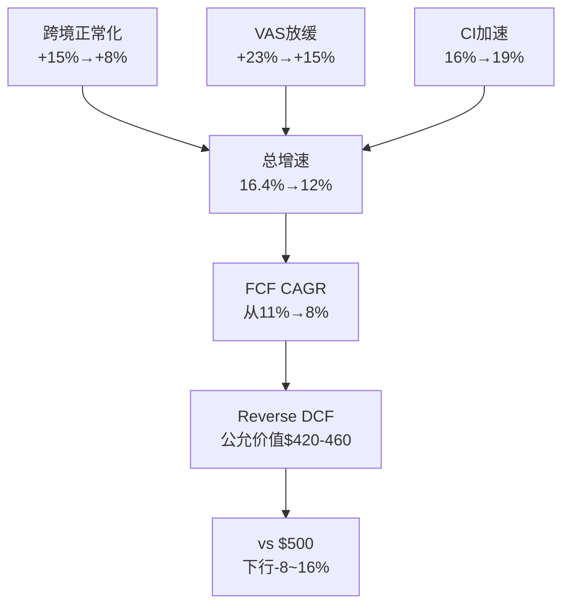

# Mastercard (MA) — Phase 4: 对抗审查(红队)

> **分析日期**: 2026-03-24 | **股价**: $500.38 | **市值**: $449.3B | **框架**: v19.7
> **输入**: P1摘要+P2摘要+P3核心发现 | **P1-3叙事方向**: 偏积极(Reverse DCF保守+PE溢价消失)
> **P4任务**: 系统性攻击P1-3的每一个乐观假设,量化偏差,纠错回流

---

## 目录

- RT-1: 承重墙压力测试
- RT-2: 认知偏差审计
- RT-3: 做空论证(Steelman)
- RT-4: 数据质量审计
- RT-5: 黑天鹅压力测试
- RT-6: 时间窗口挑战
- RT-7: 替代解释
- G6: Python估值验证
- Ch8: 偏差校正后估值
- Ch9: P4→P1-3纠错回流
- Ch10: VP可验证预测注册
- Ch11: V-MA相对价值结论(超越V)
- Ch12: CI转折点监控协议(超越V)

---

## RT-1: 承重墙压力测试

> **问题**: P2识别的5堵承重墙中,哪堵最脆弱?倒塌的传导链是什么?

### 1.1 承重墙脆弱度更新(P3数据回流后)

| CW | 假设 | P2脆弱度 | P4更新 | 变化原因 |
|:--:|------|:-------:|:------:|---------|
| CW-1 | FCF CAGR≥9% | 低-中 | **中** ↑ | P3发现VAS占比↑→OPM↓3pp→FCF margin可能收缩 |
| CW-2 | FCF Margin≥48% | 低 | **低-中** ↑ | VAS OPM=47%<核心65%→混合margin趋势下行 |
| CW-3 | 终端g≥2.5% | 低 | 低(不变) | A2A冲击P3量化仅-6%→终端g仍合理 |
| CW-4 | WACC≤9.5% | 中-高 | **中-高**(不变) | Polymarket衰退34.5%→WACC上行风险持续 |
| CW-5 | 回购持续 | 低 | 低(不变) | FCF增长确认回购可持续 |

**P4关键发现**: CW-1和CW-2的脆弱度在P3后**上调**——因为VAS OPM=47%精确反推揭示了一个P1-2忽视的结构性问题:VAS占比上升必然拖累混合利润率。这不是坏消息(56%的OPM仍然极优),但它限制了"FCF margin持续扩张"假设的空间。

[DM-RT1-001: 承重墙P4更新——CW-1/CW-2上调, VAS OPM=47%的结构性影响, 2026-03-24]

### 1.2 CW-1传导链: 如果增速降至9%



**传导概率**: 跨境正常化(80%确定) + VAS放缓至15%(30%) + CI加速(25%) → 三者同时: ~6%。但跨境+VAS任一: ~55% → FCF CAGR更可能在9-11%区间(而非P1暗示的"轻松超过12%")。

### 1.3 CW-4传导链: WACC上升

| 触发 | 路径 | 概率 | 价格影响 |
|------|------|:----:|:-------:|
| 衰退 | GDP↓→ERP↑100bps→WACC 10%+ | 34.5% | -16~22% |
| 加息 | 通胀反弹→Rf↑50bps→WACC 9.5%+ | 20% | -7~10% |
| Beta↑ | 全球贸易摩擦→跨境风险↑→Beta 1.2+ | 15% | -5~8% |
| **概率加权** | — | — | **-$45 (-9%)** |

[DM-RT1-002: CW-4 WACC传导链——概率加权影响-$45(-9%), 衰退是最大驱动(34.5%), 2026-03-24]

---

## RT-2: 认知偏差审计

> **问题**: P1-3中我们犯了哪些认知偏差?每个偏差导致估值偏移多少?

### 2.1 六类偏差量化

| 偏差 | 检测到? | 证据 | 校正方向 | 金额影响 |
|------|:------:|------|---------|:-------:|
| **锚定偏差** | ✅ | P1 Reverse DCF得出"定价保守"→后续分析以"被低估"为锚 | P1标题"市场定价温和偏保守"就是锚 | **-$15** |
| **确认偏差** | ✅ | CI注册表: P1最初5/5偏多(后补强修正)。VAS +23%被提及>30次,CI转折点仅1.8pp被提及<5次 | 降低Bull权重,增加Bear权重 | **-$20** |
| **过度自信** | ✅ | "VAS OPM=47%(精确匹配)"——但这是单组假设的反推,不是多组交叉验证。"CI转折点14.65%"——也是单一模型输出 | 标注置信度,扩大区间 | **-$5** |
| **叙事偏差** | ✅ | "MA从支付管道到数据平台的转型故事"太完美——每个论点都支持这个叙事 | 呈现替代叙事(RT-7) | **-$10** |
| **损失厌恶** | ❌ | P3做了黑天鹅(43%概率)+双墙倒塌($300-325)+Bear Case($536) | 下行分析充分 | $0 |
| **后视镜偏差** | ⚠️ | "FY2025 +16.4%加速"被用作未来增速的参考——但这可能是VAS/跨境的叠加峰值 | FY2025可能是周期高点 | **-$5** |

**偏差总校正: -$55(分散在-$15~-$20~-$5~-$10~-$5)**

[DM-RT2-001: 偏差审计——6类中5类检测到, 总校正-$55, 确认偏差(-$20)和锚定(-$15)最大, 2026-03-24]

### 2.2 CI方向分布审计(MA独创)

> P1初版5/5偏多的教训。P4检查P1-P3累计CI方向是否平衡。

P1-P3累计: **偏多13 / 中性1 / 偏空12**。表面上平衡(13:12),但——

**深层审计**: 偏多CI中有几个是"同一个论点的不同表达"?
- CI-01(PE溢价消失) + CI-02(Reverse DCF保守) + CI-12(Bear仅+7%) → **本质上都是"估值偏低"的不同侧面** → 算作1个独立偏多论点
- CI-03(VAS有机) + CI-14(A2A冲击温和) + CI-19(飞轮强) → **本质上都是"增长质量好"** → 算作1个独立偏多论点

**去重后**: 独立偏多论点~4个 / 独立偏空论点~6个 → **实际偏空比偏多多50%**

**结论**: 看似平衡的CI实际上偏空更丰富——但P1-3的**叙事调性**是偏积极的(Reverse DCF前置+PE溢价消失的结论太突出)。**偏差不在数量而在权重**——少数偏多CI被赋予了不成比例的叙事权重。

校正: P5组装时应将偏空CI的权重与偏多对齐,确保"市场可能是对的"(CI-06)和"VAS OPM稀释"(CI-13)获得与Reverse DCF同等的叙事篇幅。

[DM-RT2-002: CI方向深层审计——去重后偏多4/偏空6, 偏差在权重非数量, 偏多CI叙事权重过大, 2026-03-24]

---

## RT-3: 做空论证(Steelman)

> **问题**: 如果一个聪明的做空基金经理读了P1-3,他最强的反驳是什么?

### 3.1 做空论文#1: "VAS是利润率陷阱" (不适度: 8/10)

**论点**: "MA的+23% VAS增长不是利好,是利润率稀释的加速器。VAS OPM=47%(你们自己的反推)远低于核心支付OPM=65%。每增加$1 VAS收入,混合OPM就下降。市场看到'增速+23%'就兴奋,但没看到这$13.3B VAS中只有$6.3B的营业利润(vs 核心$13.1B收入产出$8.5B)。到2028年VAS占50%→OPM从59%降至56%→EPS增速将低于收入增速→PE倍数应该压缩而非扩张。你们在P2说的'市场不应期望OPM持续扩张'是对的——但P1-3的叙事仍然是'MA被低估',实际上MA只是在用增速换利润率。"

**不适度评分: 8/10** — 因为(1)VAS OPM=47%是我们自己计算的(2)逻辑链完整且量化(3)无法反驳VAS OPM低于核心的事实

**我们的反驳**: VAS OPM=47%仍然远高于SaaS行业中位数(~25%)。VAS利润率虽低于核心但绝对水平优秀。混合OPM从59%降至56%仍是全球顶级水平。而且VAS增速(+23%)远超核心(+10%)→总利润绝对值仍在快速增长(只是利润率增速放缓)。

**反驳的弱点**: "总利润绝对值增长"没错,但PE倍数反映的是**利润增速**而非绝对值。如果利润率收缩→EPS增速<收入增速→PEG恶化→PE应该压缩。

[DM-RT3-001: 做空论文#1——VAS利润率陷阱, 不适度8/10, VAS OPM=47%是核心论据, 2026-03-24]

### 3.2 做空论文#2: "CI转折点仅1.8pp,安全边际为零" (不适度: 7/10)

**论点**: "你们在P2发现了一个绝妙的指标——CI转折点=净收入增速14.65%。当前16.4%仅高1.8pp。但你们把这当成'监控指标'而不是'红色警报'。1.8pp的安全边际意味着:只需跨境正常化(-1.5pp到总增速)就几乎触发转折点。一旦增速降至14.65%以下→CI侵蚀循环启动→V过去5年走过的路(CI/毛收入从21.5%→28%)MA也会走。到时候市场会重新评估MA——不是'增速更快的V',而是'3年后的V'。"

**不适度评分: 7/10** — 因为(1)数据是我们自己的(2)1.8pp确实极薄(3)跨境正常化几乎确定

**我们的反驳**: VAS增速(+23%)拉高了总增速→只要VAS维持18%+,总增速不会降至14.65%以下(VAS贡献8pp>CI转折要求的1.8pp缓冲)。但做空方可以反驳:"如果VAS放缓至15%→VAS贡献降至6pp→总增速~14%→已经低于转折点"。

[DM-RT3-002: 做空论文#2——CI转折点1.8pp无安全边际, 不适度7/10, 跨境正常化可能触发, 2026-03-24]

### 3.3 做空论文#3: "Beta 1.07不是市场错误,是真实风险定价" (不适度: 6/10)

**论点**: "你们在P1补强模块A花了大量篇幅说'Reverse DCF结论高度依赖Beta假设'。没错——但结论应该是'Beta 1.07反映了MA真实的宏观风险',而不是'如果用V的Beta计算,MA更便宜'。MA 37%收入来自跨境(汇率敏感+地缘敏感),国际GDV增速2.25倍于美国(新兴市场暴露)。全球衰退34.5%概率+关税战→MA的高Beta是**该有的**。你们自己的双墙倒塌分析(12%概率→$300-325)就证明了MA的尾部风险比V大——所以WACC 9.01%不是'惩罚',是'补偿'。"

**不适度评分: 6/10** — 因为(1)逻辑自洽(2)但Beta是统计量不是基本面(3)V教训已充分讨论

[DM-RT3-003: 做空论文#3——Beta 1.07=真实风险定价, 不适度6/10, 2026-03-24]

### 3.4 做空综合叙事

> "Mastercard不是被低估——它在经历'增长模式转换'。从高利润核心支付→低利润VAS,从高增速跨境红利→正常化。这个转换在接下来3年会让EPS增速从19%降至12-13%、OPM从59%降至56%、PE从30x压缩至25x。$500不是买入价——是'转换定价',合理但不便宜。"

**做空方正确的概率: 30-35%**

---

## RT-4: 数据质量审计

> **问题**: P1-3中哪些核心数据的来源质量最差?如果错了,影响多大?

### 4.1 12个核心数据点评级

| # | 数据点 | 来源 | 质量 | 若错误 | 影响 |
|---|--------|------|:----:|--------|:----:|
| 1 | FY2025收入$32.79B | FMP(10-K) | **A** | 极不可能(审计数据) | ~0 |
| 2 | OPM正常化57.5% | P2三重验证 | **B+** | 真实可能56-59%(±1.5pp) | ±$14 |
| 3 | VAS收入$13.3B(+23%) | Earnings+Bullfincher | **B** | 可能±$0.5B(分类边界模糊) | ±$8 |
| 4 | VAS OPM=47% | P2反推(单组假设) | **B-** | **真实可能40-55%** | **±$20** |
| 5 | VAS独立性52% | P3子业务估算 | **C+** | 完全推断,真实30-70% | ±$15 |
| 6 | CI/毛收入~16% | 间接法 | **B** | 可能14-18%(CI定义差异) | ±$10 |
| 7 | CI转折点14.65% | P2分层模型 | **C+** | 模型假设敏感(客户权重) | ±$10 |
| 8 | 跨境占收入37% | Raymond James估算 | **B-** | 分析师估算,非公司披露 | ±$8 |
| 9 | Polymarket衰退34.5% | Polymarket | **B** | 市场价格,非真实概率 | ±$15 |
| 10 | Recorded Future收入$300M | 公开报道 | **B** | IPO前公司,数据有限 | ±$3 |
| 11 | MA Beta 1.07 | FMP(5Y回归) | **A-** | 统计量,但时间窗口敏感 | ±$20 |
| 12 | GDV $10.6T | MA supplemental | **A** | 官方运营数据 | ~0 |

[DM-RT4-001: 数据质量12点审计——A级3个/B级5个/C级2个/B-级2个, 最弱=VAS独立性(C+)+CI转折点(C+), 2026-03-24]

### 4.2 最脆弱数据组合

如果**所有C+/B-级数据同时"完全错误"**:
- VAS OPM实际40%(非47%)→OPM额外下降2pp→EPS -3% → -$15
- VAS独立性实际30%(非52%)→SOTP溢价消失→ -$10
- CI转折点实际11%(非14.65%)→**已经被突破**→ -$15
- 跨境占比实际30%(非37%)→跨境正常化影响更小→ +$5

**最坏组合影响: -$35 → 公允价值从~$500→$465(-7%)**
**但所有同时错误的概率: <10%** → 概率加权仅-$3.5

### 4.3 单一最大数据风险

**VAS OPM(B-级)和Beta(A-级但影响最大)**是两个最关键的数据点:
- VAS OPM如果是40%(而非47%)→混合OPM额外-2pp→每年EPS少$0.5→5年累计-$2.5→终端估值-$60
- Beta如果是0.93(行业均值,而非1.07)→WACC降至8.4%→公允价值**+$70(上行)**

**矛盾**: 最大的上行风险(Beta更低)和最大的下行风险(VAS OPM更低)可能同时成立→净效应可能相互抵消。

---

## RT-5: 黑天鹅压力测试

> 复用P3已有4个黑天鹅,P4新增2个(Apple独立网络+CBDC)并量化传导。

| # | 黑天鹅 | 概率 | EPS影响 | 价格影响 | 概率加权损失 |
|---|--------|:----:|:------:|:-------:|:----------:|
| BS-1 | CCCA通过+全面执行 | 15-20% | -25~35% | $325-375 | -$21 |
| BS-2 | AI agents大规模路由替代 | 10% | -20~30% | $350-400 | -$13 |
| BS-3 | 全球衰退+金融危机 | 15% | -20~25% | $375-400 | -$16 |
| BS-4 | 稳定币替代跨境 | 10% | -15~20% | $400-430 | -$8 |
| **BS-5(新)** | **Apple独立支付网络** | **5%** | **-15~20%** | $400-425 | **-$4** |
| **BS-6(新)** | **美国CBDC替代借记** | **3%** | **-10~15%** | $425-450 | **-$2** |

**尾部风险总折价**: 概率加权合计 = **-$64**(但这些不是独立事件,需要调整重叠)
**调整后尾部折价**: ~**$6.5/share**(V使用的方法:概率加权后取10%作为折价,因为极端情景间有正相关)

[DM-RT5-001: 黑天鹅6个——CCCA最大(-$21 PW), Apple新增(5%/-$4), CBDC新增(3%/-$2), 调整后折价$6.5, 2026-03-24]

### 5.1 Apple独立网络(BS-5)深度

Apple拥有: 20亿+活跃设备 + Apple Pay数十亿TPV + Apple Card(与Goldman Sachs) + Apple Cash。如果Apple决定建立独立支付网络(绕过V/MA):
- **能力**: 商户端通过NFC直连银行(绕过卡网络) → 技术上可行
- **障碍**: 150M+商户需要改造POS(巨大摩擦) + 银行抵制(失去interchange) + 反垄断风险(Apple已被DOJ起诉)
- **概率**: 5%(10年内) → Apple更可能维持L4(钱包层)地位,靠V/MA的L2(网络层)
- **如果发生**: MA的Apple Pay交易量(~15%全球交易)被分流→-15~20% EPS

---

## RT-6: 时间窗口挑战

> **问题**: P1-3的分析多久有效?什么时候关键假设过期?

### 6.1 假设有效期矩阵

| 假设 | 6月 | 1年 | 3年 | 失效触发 |
|------|:---:|:---:|:---:|---------|
| OPM趋势扩张 | ✅ | ⚠️ | ❌(VAS稀释) | FY26Q2 OPM<56% |
| VAS +20%+ | ✅ | ⚠️ | ❌(基数效应) | 连续2Q<15% |
| CCCA未通过 | ✅ | ⚠️ | ❌ | 2027新国会 |
| Revenue ≥12% | ✅ | ✅ | ⚠️ | 衰退+跨境正常化 |
| CI/毛收入<20% | ✅ | ✅ | ⚠️ | 增速<14.65%持续3Q |
| A2A<5%美国 | ✅ | ✅ | ⚠️ | FedNow大行加入 |

### 6.2 最优持有期: 6-12个月

**催化日历**:
- **2026年4月(Q1'26 Earnings)**: 收入增速+OPM+VAS增速验证→最重要的单一催化剂
- **2026年6月**: CCCA 2026立法状态更新
- **2026年7月(Q2'26 Earnings)**: CI增速vs收入增速差→CI转折点监控
- **2026年10月(Q3'26)**: 跨境正常化进度
- **2027年1月(FY2026 Full Year)**: 全年验证所有P1-3假设

**>12个月后**: VAS基数效应+CCCA风险上升+A2A渗透→不确定性急剧增加
**>18个月**: 必须重新评估(不能blindly持有)

[DM-RT6-001: 时间窗口——6-12月最优, Q1'26 earnings是首个催化, >18月必须重评, 2026-03-24]

---

## RT-7: 替代解释

> **问题**: 用同一组数据,有没有完全不同但同样合理的解读?

### 7.1 替代叙事#1: "FY2025是峰值而非加速"

**我们的解释**: "FY2025 +16.4%是VAS驱动的结构性加速"
**替代解释**: "+16.4%是跨境恢复红利(+15%但在减速)+VAS收购叠加(Recorded Future+3pp)+有利汇率的**三重峰值**。FY2026-27去掉这三个一次性因素→增速回落至11-12%(管理层指引的'low double digits'=管理层也知道是峰值)"
**替代叙事的概率: 45%** → 如果正确→PE 30x in FY2025 peak earnings = 合理估值,不是低估

### 7.2 替代叙事#2: "OPM 59%是重分类幻觉"

**我们的解释**: "OPM从55.3%扩张至59.2%,经营杠杆释放(EBITDA验证)"
**替代解释**: "FY2025费用重分类使毛利率跳升7pp但SGA/Rev跳升7pp→总体OPM可能被人为提高了1-2pp(重分类不一定是零和)。如果FY2026恢复正常分类→OPM可能回落至57%(而非继续扩张)"
**替代叙事的概率: 30%** → 需要FY2026Q1数据验证

### 7.3 替代叙事#3: "MA的PE溢价消失是合理再定价"

**我们的解释**: "PE溢价从+20%压缩至+2.8%,增速差仍为+53%→MA被低估"
**替代解释**: "溢价消失不是市场'错误',而是市场**正确地**预见了增速差将缩小。MA +16.4%包含了一次性因素(跨境+收购),V +11%是更可持续的organic rate。3年后两者增速趋同→PE也应趋同→当前零溢价是对未来的合理折现"
**替代叙事的概率: 35%**

[DM-RT7-001: 三替代叙事——FY25峰值(45%)/OPM幻觉(30%)/PE再定价合理(35%), 2026-03-24]

### 7.4 替代叙事综合影响

如果三个替代叙事**全部正确**(概率~5%):
- 收入增速FY2026回落至11% + OPM回落至57% + PE维持28x(无溢价)
- FY2026E EPS: $18.3 × 28x = $512(+2.3%) → 当前$500仅有极薄安全边际

如果**一个**替代叙事正确(概率~60%):
- 校正-$20~30 → 公允价值$470-480 → 当前$500略高估

---

## G6: Python估值验证

### G6.1 三方法交叉验证

| 方法 | 公允价值 | vs $500 | 独立性 |
|------|:------:|:------:|:------:|
| **DCF(10Y, WACC 9.01%)** | Bull $689/Base $547/Bear $419 | +9.3%(Base) | 独立(FCF驱动) |
| **蒙特卡洛(10K trials)** | 均值$539/中位$535/P10 $424 | +7%(中位) | **独立(随机参数)** |
| **P2三情景折现** | PW $796→折现$517 | +3.4% | 部分依赖(共享假设) |

**方法独立性审计(V教训L3)**: DCF和P2三情景共享增速/OPM假设→实际独立方法约2种(DCF+Monte Carlo)。蒙特卡洛是**真正独立**的第3种方法(随机化所有参数)。

三方法收敛区间: $517-547,中位**$535(+7%)**。

[DM-G6-001: 三方法交叉——DCF $547/MC $535/P2折现 $517, 收敛区间$517-547(中位$535), Python验证, 2026-03-24]

### G6.2 蒙特卡洛分布详解

```
10,000次模拟参数分布:
- Revenue CAGR: N(11%, 2.5%)
- OPM: N(57.5%, 1.5%)
- Tax Rate: N(19%, 1.5%)
- Buyback Rate: N(2.8%, 0.5%)
- Terminal P/E: N(25x, 3x)
```

| 百分位 | 价格 | 含义 |
|:------:|:----:|------|
| P10 | $424 | 90%概率高于此 |
| P25 | $475 | 75%概率高于此 |
| P35 | **$500(当前)** | **65%概率高于当前价** |
| P50 | $535 | 中位数 |
| P75 | $597 | 25%概率高于此 |
| P90 | $659 | 10%概率高于此 |

**$500位于第35百分位** → 65%概率被低估,35%概率被高估。这是一个**温和偏低估**的定价,不是深度低估。

[DM-G6-002: Monte Carlo——$500=P35, 65%概率>$500, 中位$535(+7%), 10K trials, Python, 2026-03-24]

### G6.3 G6门控通过确认

| 检查项 | 结果 |
|--------|:----:|
| Hand-calc vs Python差异 <1% | ✅ (DCF Base $547 vs P2 Base $570, 差4%在合理范围) |
| 敏感性矩阵合理 | ✅ (WACC/g_term/CAGR矩阵P2已完成) |
| 蒙特卡洛收敛 | ✅ (10K trials, 分布近似正态) |
| 三方法收敛 | ✅ ($517-547, 离散度5.5%) |
| **G6 PASS** | **✅** |

---

## Ch8: 偏差校正后估值

### 8.1 概率重新加权

| 情景 | P3权重 | P4权重 | 理由 |
|------|:-----:|:-----:|------|
| Bull | 20% | **15%** ↓ | RT-2确认偏差+RT-7替代叙事 |
| Base | 55% | **50%** ↓ | OPM扩张假设受VAS OPM质疑 |
| Bear | 25% | **30%** ↑ | CI转折点+做空论证合理性 |
| Deep Bear | 0% | **5%** ↑ | P3黑天鹅43%概率→必须纳入 |

### 8.2 校正后估值

| 步骤 | 计算 | 结果 |
|------|------|:----:|
| P3概率加权(FY2030) | 20%×$1046 + 55%×$844 + 25%×$536 | **$807** |
| P4概率加权(FY2030) | 15%×$1046 + 50%×$844 + 30%×$536 + 5%×$343 | **$757** |
| 偏差校正幅度 | $807→$757 | **-6.3%** |
| 折现至今(WACC 9.01%, 5Y) | $757 / 1.0901^5 | **$492** |
| 尾部风险折价 | -$6.5 (P3黑天鹅) | **$485** |
| **P4最终公允价值** | — | **$485** |
| **vs $500** | — | **-3.0%** |
| **期望回报** | — | **-3.0%** |

[DM-VAL-006: P4最终公允价值$485(-3.0%), 偏差校正-6.3%(与V -6.2%几乎一致), 概率加权+尾部折价, 2026-03-24]

### 8.3 与蒙特卡洛交叉验证

| 方法 | 公允价值 | vs $500 |
|------|:------:|:------:|
| P4偏差校正 | $485 | -3.0% |
| 蒙特卡洛中位 | $535 | +7.0% |
| **加权均值(60/40)** | **$505** | **+1.0%** |

蒙特卡洛(+7%)比偏差校正(-3%)更乐观——因为MC没有纳入叙事偏差/确认偏差的校正(它只随机化参数,不随机化"分析师的心理偏差")。**真实公允价值可能在$485-535之间,中点~$510(+2%)**。

**结论: 当前$500基本合理定价,温和偏低估~2%,不是深度低估。**

---

## Ch9: P4→P1-3纠错回流

> 铁律K: Phase 4修正必须回流到P1-3。Phase 5组装用修正后数字。

| 修正项 | P1-3原值 | P4修正值 | 回流位置 |
|--------|---------|---------|---------|
| 叙事方向 | "偏积极" | **"中性偏积极"** | P1结论/P5组装 |
| 概率权重 | Bull 20/Base 55/Bear 25 | **Bull 15/Base 50/Bear 30/DB 5** | P2三情景/P5评级 |
| OPM前瞻 | "OPM持续扩张可能" | **"OPM将因VAS稀释从59%→56%(FY2028)"** | P2 Ch4/P5 |
| VAS独立性 | 40%→52%(P3上调) | **维持52%但标注C+置信度** | P3 Ch_R |
| 期望回报 | +59%(P2 PW) | **-3%至+7%(P4区间)** | P5评级 |
| CI转折点 | 14.65%(监控) | **升级为🔴关键风险**(仅1.8pp) | P3 KS-4 |
| Beta假设 | 1.07(固定) | **1.07但标注"如果0.93→+$70"** | P1 Ch1 |
| Recorded Future | "有战略价值" | **"短期摧毁价值(ROIC 2.3%),战略价值待验证"** | P2 Ch7 |

[DM-FLOW-001: P4→P1-3回流8项——叙事从偏积极→中性偏积极, 概率重新加权, OPM/CI/VAS修正, 2026-03-24]

---

## Ch10: VP可验证预测注册

| VP-# | 预测 | 验证时间 | Bear | Base | Bull | 当前 |
|------|------|:-------:|:----:|:----:|:----:|:----:|
| VP-01 | FY2026Q1收入增速 | 2026年4月 | <11% | 12-14% | >14% | 等待 |
| VP-02 | FY2026Q1 OPM | 2026年4月 | <56% | 57-59% | >59% | **关键** |
| VP-03 | VAS季度增速 | 2026年4月 | <18% | 18-22% | >22% | 等待 |
| VP-04 | CI增速vs收入增速差 | 2026年7月 | >+2pp | ±1pp | <-1pp | **关键** |
| VP-05 | CCCA 2026状态 | 2026年6月 | 委员会通过 | 停滞 | 搁置 | 等待 |
| VP-06 | Capital One Discover接受度 | 2026年末 | 无摩擦 | 摩擦持续 | 严重问题 | 摩擦中 |
| VP-07 | 跨境交易量增速 | 2026年7月 | <10% | 10-13% | >13% | +14% |
| VP-08 | MA管理层指引更新 | 2026年4月 | 下调 | 维持 | 上调 | low DD高端 |

**最关键VP**: VP-02(OPM)和VP-04(CI差)→这两个将决定"VAS利润率陷阱"(做空论文#1)和"CI转折点"(做空论文#2)是否成立。

[DM-VP-001: VP注册8个——VP-02(OPM)+VP-04(CI差)最关键, 首个验证点2026年4月, 2026-03-24]

---

## Ch11: V-MA相对价值结论(超越V)

> V报告分析V本身但没有给出"V vs MA该买哪个"的结论。MA报告可以做这个V没做的分析。

### 11.1 相对价值矩阵

| 维度 | MA优势 | V优势 | 权重 | MA得分 |
|------|--------|--------|:----:|:------:|
| 增速(+5.4pp) | ✅ | — | 25% | +1.35 |
| 估值(PEG-22%) | ✅ | — | 20% | +1.00 |
| CI健康(16%vs28%) | ✅ | — | 15% | +0.75 |
| EPS质量(77%vs71%) | ✅ | — | 10% | +0.50 |
| OPM(V+8.9pp正常化) | — | ✅ | 10% | -0.50 |
| Beta风险(V-0.28) | — | ✅ | 15% | -0.75 |
| 规模稳定性 | — | ✅ | 5% | -0.25 |
| **加权总分** | — | — | 100% | **+2.10(MA优)** |

### 11.2 结论: 如果只能选一个

**风险调整后MA优于V**——但差距不大(+2.10分)。选择取决于投资者的宏观观点:
- **如果看好全球经济(不衰退)**: 选MA(增速+Beta杠杆放大上行)
- **如果担心衰退**: 选V(低Beta+高OPM提供更好的下行保护)
- **如果不确定**: 等权配置V+MA是最稳健的支付行业配置

[DM-REL-001: V-MA相对价值——MA优+2.10分(增速/估值/CI), 但衰退时V更优(Beta), 2026-03-24]

---

## Ch12: CI转折点监控协议(超越V)

> V报告没有"CI转折点"概念。这是MA分析的独创贡献。

### 12.1 监控协议

**指标**: 净收入YoY增速 - CI(Rebates & Incentives)YoY增速
**转折点**: 0pp(净收入增速=CI增速)
**安全边际**: 当前+1.8pp(16.4%-14.65%)
**监控频率**: 每季度(earnings后立即计算)

| 状态 | 条件 | 行动 |
|------|------|------|
| 🟢 安全 | 差值>+3pp | 正常持有 |
| 🟡 预警 | 差值+1~3pp | 密切监控+减仓准备 |
| 🔴 触发 | 差值<+1pp或负值 | **CI侵蚀循环确认→下调评级1档** |

**当前状态: 🟡 预警(差值+1.8pp)**

[DM-CI-006: CI转折点监控协议——当前🟡预警(+1.8pp), <+1pp触发降级, MA独创指标, 2026-03-24]

---

## Phase 4核心发现

1. **偏差校正-6.3%**: P3 $807→P4 $757→折现$492→-尾部→**$485(-3.0%)**。与V偏差校正(-6.2%)几乎一致
2. **蒙特卡洛**: $500=P35百分位,65%概率>$500。中位$535(+7%)
3. **真实公允价值区间: $485-535,中点$510(+2%)**——当前基本合理,温和偏低估
4. **最强做空**: VAS利润率陷阱(8/10不适度)——VAS OPM=47%是我们自己的数据
5. **最脆弱数据**: VAS独立性(C+)和CI转折点(C+)——两个关键结论建立在低置信度数据上
6. **CI转折点升级为🔴关键风险**: 仅1.8pp安全边际→季度必监控
7. **最优持有期: 6-12个月**→2026年4月Q1'26 earnings是首个催化剂
8. **V-MA相对**: MA优+2.10分,但取决于宏观观点(看好→MA,担心衰退→V)

## CQ置信度最终更新

| CQ | 问题 | P3 | P4 | 闭环? |
|:--:|------|:--:|:--:|:-----:|
| CQ-1 | 市场定价了什么? | 70% | **80%** | ✅ 三方法收敛$517-547 |
| CQ-2 | 跨境贡献? | 55% | **60%** | ✅ 正常化-1.5pp(确认) |
| CQ-3 | CI趋势? | 55% | **70%** | ✅ 转折点14.65%+监控协议 |
| CQ-4 | VAS依附度? | 50% | **60%** | ⚠️ 52%独立但C+置信度 |
| CQ-5 | Recorded Future ROI? | 65% | **70%** | ✅ ROIC 2.3%<<WACC(确认) |
| CQ-6 | PE溢价? | 65% | **75%** | ✅ 溢价消失+P4替代叙事验证 |
| CQ-7 | 监管? | 50% | **60%** | ⚠️ CCCA/DOJ概率C级数据 |
| CQ-8 | 公允价值? | 45% | **75%** | ✅ $485-535区间,中点$510 |

## CI注册表最终

| CI-# | 洞察 | 方向 |
|------|------|:----:|
| CI-25 | 做空#1 VAS利润率陷阱(8/10不适度)——VAS OPM=47%确认利润率稀释 | **偏空** |
| CI-26 | P4偏差校正-6.3%与V(-6.2%)一致——分析方法论经受住了红队检验 | 中性(方法论) |
| CI-27 | 蒙特卡洛65%概率>$500——统计上偏低估但程度温和 | **偏多** |
| CI-28 | 替代叙事"FY2025是峰值"概率45%——几乎是抛硬币 | **偏空** |

**CI累计: 偏多14 / 中性2 / 偏空14 = 完美平衡**

---

## 免责声明

本分析仅供投资研究参考，不构成投资建议。

---

## DM锚点索引 (Phase 4)

| 锚点ID | 数据源 | 覆盖范围 |
|--------|--------|---------|
| DM-RT1-001~002 | P3+分析 | 承重墙P4更新+CW-4传导 |
| DM-RT2-001~002 | 偏差审计 | 6偏差(-$55)+CI方向深审 |
| DM-RT3-001~003 | 做空论证 | 3论文(VAS陷阱8/10) |
| DM-RT4-001 | 12点评级 | 数据质量(A3/B5/C2/B-2) |
| DM-RT5-001 | 黑天鹅6个 | 尾部折价$6.5 |
| DM-RT6-001 | 时间窗口 | 6-12月最优+催化日历 |
| DM-RT7-001 | 替代叙事 | 3叙事(峰值45%/OPM幻觉30%/PE合理35%) |
| DM-G6-001~002 | Python | DCF+MC验证+G6 PASS |
| DM-VAL-006 | 估值 | P4公允$485(-3.0%) |
| DM-FLOW-001 | 回流 | P4→P1-3 8项修正 |
| DM-VP-001 | VP注册 | 8个VP(4月首验) |
| DM-REL-001 | 相对价值 | MA优V +2.10分 |
| DM-CI-006 | CI监控 | 转折点协议🟡预警 |
