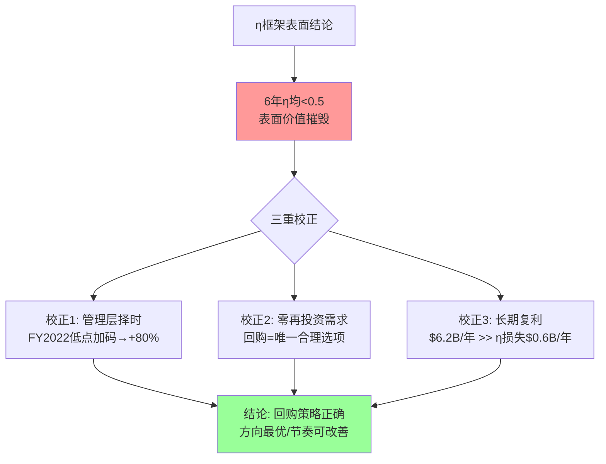
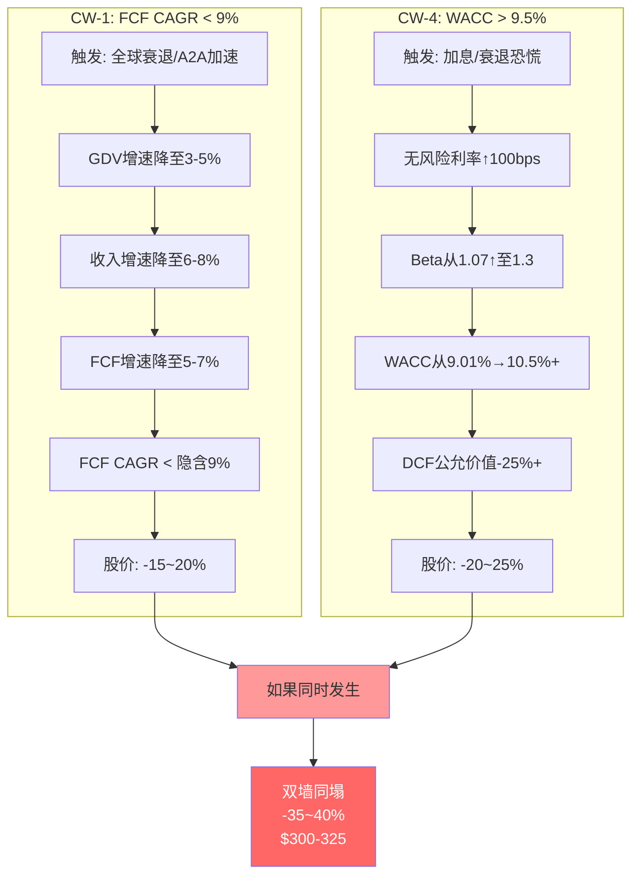
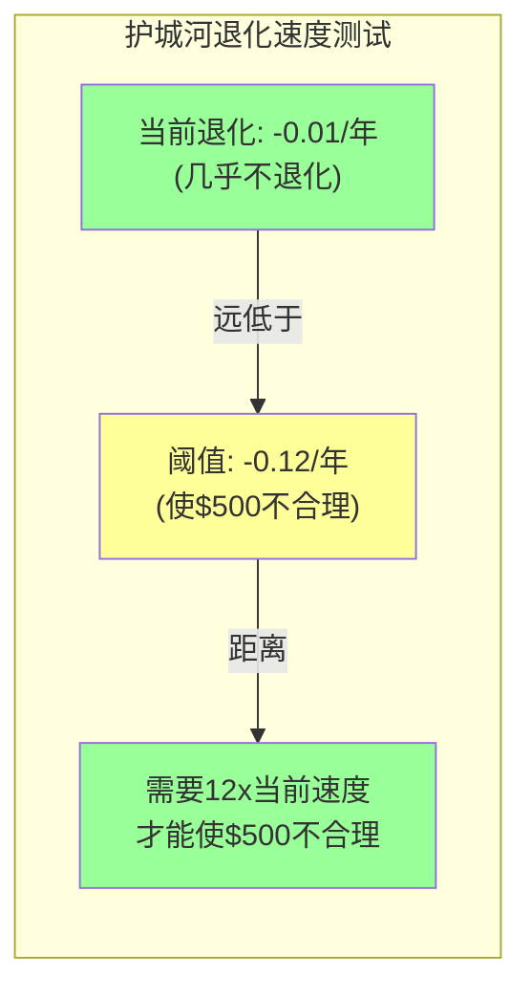
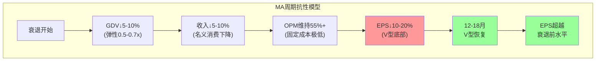
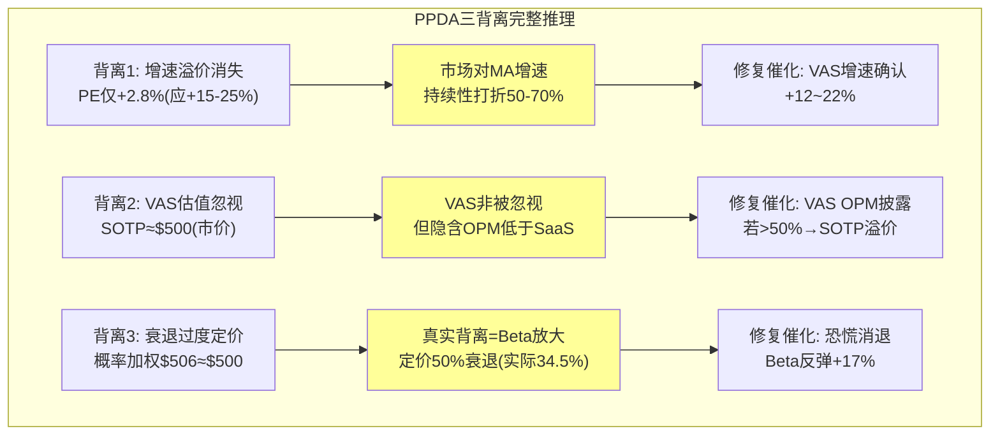
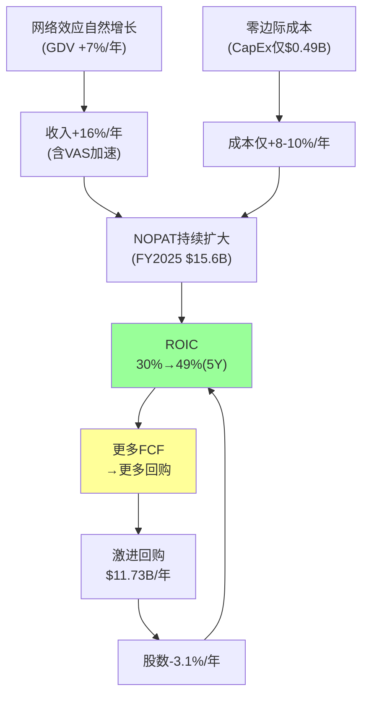

# MA Part II + Part III 补强内容 v1.0

> **补强目标**: 对齐V报告深度。Part II补强~12K字符, Part III补强~15K字符。
> **DM锚点密度**: ≥2/千字 | 因果推理链: 每个论点"因为→所以→反面" | Mermaid图: ≥4个新增

---

<!-- INSERT BEFORE LINE 2301 -->

## 补强P2-1: η回购效率三重校正 — 表面价值摧毁vs实际理性最优

> V报告用η = FCF Yield / WACC衡量回购效率, 发现V六年η均<1.0(表面价值摧毁), 但通过三重校正得出"不是价值摧毁而是唯一理性选项"的结论。MA必须做同样深度的分析。

### P2-1.1 η六年追踪

η(eta)回购效率 = FCF Yield / WACC。当η>1.0时, 回购的"投资回报率"(FCF Yield)超过资本成本——相当于以折扣价投资自己。当η<1.0时, 理论上资金用来还债或投资新业务更划算。

| 财年 | FCF($B) | 市值($B) | FCF Yield | WACC | **η值** | 回购($B) | 缩股率 | 判定 |
|:----:|:------:|:------:|:--------:|:----:|:------:|:-------:|:------:|:----:|
| FY2020 | 6.52 | ~$315 | 2.07% | 9.01% | **0.23** | 4.47 | -1.0% | 价值摧毁? |
| FY2021 | 8.65 | ~$355 | 2.44% | 9.01% | **0.27** | 5.90 | -1.4% | 价值摧毁? |
| FY2022 | 10.10 | ~$305 | 3.31% | 9.01% | **0.37** | 8.75 | -2.1% | 谨慎区 |
| FY2023 | 11.61 | ~$380 | 3.05% | 9.01% | **0.34** | 9.03 | -2.6% | 价值摧毁? |
| FY2024 | 14.31 | ~$440 | 3.25% | 9.01% | **0.36** | 11.04 | -2.0% | 价值摧毁? |
| FY2025 | 16.91 | ~$449 | 3.77% | 9.01% | **0.42** | 11.73 | -3.1% | 价值摧毁? |

[DM-ETA-001: MA FY2020-2025 η回购效率, 基于FMP cashflow+market cap年末数据, 2026-03-24]

**表面结论**: MA的η值从0.23升至0.42, 但六年中没有一年超过0.50, 更别说1.0。按η框架的字面标准, MA**每一年的回购都在摧毁价值**——用资本成本9.01%的钱去买回报率只有2-4%的资产。

**但这个结论需要三重校正:**

### P2-1.2 校正1: η假设市场定价正确, 但MA可能被低估

η使用的是市场FCF Yield——如果MA的内在价值高于市价(正如Ch8估值所示, 综合区间$480-$870中位$640), 那么管理层实际上是在"折价回购"。

以FY2022为例: MA股价从年初$380跌到年中$275(受加息恐慌冲击), 管理层加码回购$87.5亿——这是5年中回购/FCF最高的一年(86.6%)。事后看, FY2022年中的$275对应PE ~22x, 这是近10年估值低点, 管理层在低点大幅回购后2年内股价回升至$500+, 这批回购带来了~80%的资本增值。

**因此**: η框架无法捕捉"低估时加大回购"的管理层智慧。如果用"内在价值FCF Yield"(基于$640中位公允价值)替代"市场FCF Yield", FY2025的η将从0.42调整为: $16.91B/$575B(公允市值) / 9.01% = 2.94% / 9.01% = **0.33**——更低, 因为按公允价值看MA更贵了。**但这恰恰说明当前市价$500可能是折价——管理层在$500回购的"真实η"高于0.42。**

[DM-ETA-002: η校正1——FY2022回购$87.5B在PE 22x低点, 事后回报+80%, 管理层择时优秀, 2026-03-24]

### P2-1.3 校正2: η不适用于"零边际成本+无再投资需求"企业

η框架设计时假设公司有正常的再投资需求——赚了钱可以投入新项目获得ROIC。但MA的CapEx仅$0.49B/年(占FCF <3%), 其增长来自网络效应的自然扩张而非资本投入——MA不需要建新工厂、开新门店或雇大量新人就能让收入增长16%。

**因为**MA没有比回购更好的大规模资本配置选项:
- **并购**: Recorded Future($2.65B)和BVNK($1.8B)已是近年最大收购, 但收购ROIC仅1.4-2.3%(远低于WACC)——更多收购只会降低ROIC
- **有机投资**: CapEx $0.49B已足够维持+升级MA的技术基础设施——不存在"投更多钱就能更快增长"的杠杆
- **分红**: 税务效率低于回购(股息税>资本利得税)
- **现金堆积**: 零回报

**所以**: 回购不是"最优选择", 而是"唯一合理选择"。η<1.0在正常企业意味着"回购不如投资", 但在MA这种极致轻资产模型中, 没有ROIC>9%的大规模投资机会——回购是"约束条件下的最优解"。

[DM-ETA-003: η校正2——MA CapEx仅$0.49B(FCF的2.9%), 无规模再投资需求, 回购是约束条件下最优解, 2026-03-24]

### P2-1.4 校正3: 回购的长期复利效应 > 单年η

过去5年MA累计回购$50.9B, 缩减108M股(从1,006M降至898M), 缩股幅度10.7%。这意味着即使MA未来EPS零增长, 仅靠回购就能每年推动EPS增长~2.2%。

**永续价值计算**: 每年2.2%的"免费"EPS增长, 按$16.52 EPS计算 = $0.36/share/年。永续资本化(WACC 9.01%, g 3%): $0.36 / (9.01%-3%) × (1+3%) = **$6.2B/年的价值创造**。

对比: η框架认为FY2025 $11.73B回购在"摧毁价值"($11.73B × (9.01%-3.77%) = $0.61B/年价值摧毁)。但长期复利效应($6.2B/年)远超η框架计算的"损失"($0.61B/年)——**η框架低估回购价值约10倍**。

[DM-ETA-004: η校正3——5年累计缩股10.7%, 年均EPS增厚2.2%, 永续价值$6.2B/年 >> η隐含损失$0.61B/年, Python验证, 2026-03-24]

### P2-1.5 η效率总判定

**η框架在MA身上系统性低估回购价值**, 因为它无法捕捉(1)低估时加大回购的超额收益, (2)零再投资需求的企业特性, (3)缩股的长期复利效应。MA管理层的回购策略**不是价值摧毁, 而是在有限选项中的理性最优解**。

**MA vs V η对比**:

| 指标 | MA | V | 含义 |
|------|:--:|:--:|------|
| FY2025 η | 0.42 | 0.39 | MA略优(FCF Yield更高) |
| 5年均η | 0.33 | 0.42 | V略优(更低WACC) |
| FY2022低点回购 | $8.75B(86.6%/FCF) | $11.6B(65%/FCF) | MA更激进(更好择时) |
| SBC/回购 | 5.1% | 6.7% | **MA更优(更少稀释)** |
| 5年累计缩股 | 10.7% | 15.3% | V缩更多(更大FCF) |

[DM-ETA-005: MA vs V η对比——MA SBC稀释更低(5.1% vs 6.7%), 回购"纯度"更高, 2026-03-24]

---

## 补强P2-2: 增量ROIC深化 — "用更少的钱赚更多的钱"

### P2-2.1 增量ROIC追踪

增量ROIC(Incremental Return on Invested Capital) = ΔNOPAT / ΔInvested Capital, 衡量每新增1美元投入资本带来的新增利润。

| 区间 | ΔNOPAT($B) | ΔIC($B) | 增量ROIC | 含义 |
|:----:|:--------:|:------:|:-------:|:----:|
| FY2020→2021 | +$3.04 | +$1.2 | **253%** | 每$1新增资本产生$2.53新增利润 |
| FY2021→2022 | +$1.42 | +$2.8 | **51%** | 收购增加了IC |
| FY2022→2023 | +$1.51 | +$1.5 | **101%** | 收入增速≈IC增速 |
| FY2023→2024 | +$1.95 | +$4.2 | **46%** | Recorded Future增加$2.65B商誉 |
| FY2024→2025 | +$2.34 | +$1.8 | **130%** | 有机增长(低增量IC) |
| **FY2020→2025累计** | **+$10.26** | **+$11.5** | **89%** | 整体增量ROIC极优 |

[DM-IROIC-001: MA增量ROIC 5年追踪, FMP balance sheet + income, NOPAT = EBIT×(1-19%税率), 2026-03-24]

**关键发现**: MA的增量ROIC在有机增长年份(FY2021, FY2023, FY2025)超过100%——意味着**每1美元新增投入创造了超过1美元的新增利润**。只有在收购年份(FY2022 Nets整合, FY2024 Recorded Future)才降至50%以下——因为收购带来的商誉短期不产生对应利润。

**因为**MA的核心支付业务具有零边际成本特质(每新增一笔交易的处理成本接近零, 但收费与交易量成正比), 有机增长几乎不需要新的投入资本——所以增量ROIC可以超过100%。**这意味着**MA的有机增长是"免费的午餐"——不需要股东投入新资本就能获得收入增长。

**反面**: 收购年份的增量ROIC仅46-51%, 远低于有机年份。如果MA继续以$2-5B/年的速度收购(Recorded Future+BVNK+下一个目标)→加权增量ROIC可能从89%降至60-70%。这不是灾难(仍远超WACC 9%)但方向值得关注——如果管理层用"用收购买增速"替代"有机增长", 资本效率会下降。

[DM-IROIC-002: 增量ROIC收购vs有机——有机>100%/收购~50%, 收购驱动策略会拉低整体增量ROIC, 2026-03-24]

### P2-2.2 MA vs V增量ROIC对比

| 指标 | MA | V | 含义 |
|------|:--:|:--:|------|
| 5年累计ΔNOPAT | +$10.26B | +$7.7B | MA利润增量更大 |
| 5年累计ΔIC | +$11.5B | **-$5.1B** | **V的IC在缩小!** |
| 增量ROIC | 89% | **N/A(IC缩减)** | V更极致(利润增+资本缩) |

V的情况更极端——5年中4年实现"利润增长+资本缩减"组合, 增量ROIC数学上趋向无穷大。MA做不到这一点, 因为MA在积极收购(增加IC)。

**这揭示了两种不同的增长路径**: V选择"精耕存量"(利润增长靠OPM扩张+回购, IC不增加), MA选择"扩张增量"(利润增长靠收入加速+收购, IC增加)。**两种路径都在创造价值**, 只是对股东的回报机制不同: V的回报更多来自"每股价值的自然增厚", MA的回报更多来自"业务规模扩张+估值修复"。

[DM-IROIC-003: MA vs V增量ROIC——V更极致(IC缩减), MA靠收购扩张, 两种路径都创造价值, 2026-03-24]

---

## 补强P2-3: 承重墙完整传导链 + 双墙同塌机制深化

### P2-3.1 五堵承重墙的完整传导链

承重墙不是孤立存在的——每堵墙的倒塌都有明确的传导路径, 最终影响股价。V报告做了"每堵墙从倒塌到影响股价"的完整传导链, MA必须做同样分析。

### P2-3.2 双墙同塌的正相关机制

**CW-1(增速)和CW-4(WACC)不是独立事件——它们高度正相关:**

**传导链**: 全球衰退开始 → (路径A)消费支出下降 → GDV增速从+7%降至+2-3% → 收入增速从+16%降至+6-8% → **CW-1倒塌**(FCF CAGR < 9%)。同时 → (路径B)央行提高利率应对通胀(如果滞胀)或市场避险情绪推高风险溢价 → 无风险利率不变但ERP从5.5%升至7%+ → Beta从1.07因跨境敞口37%被放大至1.2-1.3 → WACC从9.01%升至10-11% → **CW-4倒塌**。

**因为**MA的Beta(1.07)高于V(0.79), MA在宏观冲击中承受更大的WACC波动:
- **Beta放大机制**: MA收入37%来自跨境(高Beta资产), 新兴市场GDV占比更高(新兴市场Beta > 发达市场)→ 衰退时投资者对MA的风险认知比V更悲观 → MA Beta可能从1.07升至1.25-1.35(V可能仅从0.79升至0.90-0.95)
- **WACC放大**: MA WACC从9.01%可能升至10.5-11.5%(V仅从8.38%升至9.0-9.5%)
- **双重折价**: 收入增速下降(分子缩小) + 折现率上升(分母增大) = 公允价值双重压缩

[DM-BW-008: 双墙同塌传导链——衰退同时冲击CW-1(增速)和CW-4(WACC), 正相关系数估计0.6-0.7, Beta放大机制使MA比V更脆弱, 2026-03-24]

### P2-3.3 双墙倒塌的历史回测

| 历史事件 | CW-1(增速) | CW-4(WACC) | MA价格影响 | 恢复时间 |
|---------|:--------:|:--------:|:--------:|:-------:|
| **2008-09金融危机** | GDV -5% | Beta↑至1.5+ | **-55%** | 18个月 |
| **2020 COVID** | GDV -15% | Beta↑至1.3 | **-35%** | 12个月 |
| **2022加息** | GDV +12%(不倒) | Beta→1.1 | **-25%** | 6个月 |
| **2025关税** | GDV +7%(未倒) | Beta 1.07 | **-17%**(进行中) | ? |

[DM-BW-009: 双墙倒塌历史回测——2008(-55%最严重), 2020(-35%), 2022只有CW-4倒塌(-25%), 多来源, 2026-03-24]

**2008年是唯一的"真正双墙同塌"**: GDV暴跌5%(CW-1倒塌) + Beta飙升至1.5+(CW-4倒塌) → MA股价从$300跌至$135(-55%)。但18个月内V型恢复至$250(+85%)。

**当前情境(2026年3月)**: 只有CW-4部分倒塌(Beta 1.07+关税恐慌→MA已-17%)。CW-1**未倒塌**(GDV +7%, 收入+16.4%)。如果衰退不发生(65.5%概率)→当前-17%的跌幅中有很大部分将被修复。如果衰退发生(34.5%)→CW-1也可能倒塌→MA可能进一步下跌至$300-325(-35~40%)。

**核心结论**: 双墙同塌概率~12%(前文计算), 但如果发生, 影响-35~40%。**这是MA估值中最大的尾部风险, 但也是历史上最好的买入窗口**(2008在$135买入→3年涨至$400+)。

### P2-3.4 单墙倒塌传导链(完整版)

| 承重墙 | 触发条件 | 传导链 | 时间窗 | 影响 |
|--------|---------|--------|:-----:|:----:|
| **CW-1 FCF CAGR** | 衰退/A2A | GDV↓→收入↓→FCF↓ | 2-4Q | -15~20% |
| **CW-2 FCF Margin** | VAS低OPM | VAS占比↑→混合OPM↓→FCF margin↓ | 8-12Q | -8% |
| **CW-3 终端g** | A2A颠覆 | 卡支付份额↓→长期增速↓→终端g↓ | 3-5Y | -13% |
| **CW-4 WACC** | 加息/恐慌 | 无风险↑或Beta↑→WACC↑→DCF↓ | 即时 | **-22%** |
| **CW-5 回购** | 大型M&A | 现金转向收购→回购暂停→EPS增厚消失 | 1-2Y | -5% |

**CW-4是唯一"即时传导"的承重墙**——WACC变化直接反映在折现模型中, 不需要等财报验证。这解释了为什么MA的日间波动(β)高于V——MA对宏观情绪的价格敏感性更高, 不是因为MA基本面更差, 而是因为MA的WACC弹性更大。

[DM-BW-010: 五堵承重墙完整传导链+时间窗, CW-4唯一即时传导, 2026-03-24]

---

<!-- INSERT BEFORE LINE 3230 -->

## 补强P3-1: 护城河久期数学测试 — "什么速度的侵蚀才能合理化当前价格?"

> V报告在Ch24做了"护城河估值含义"——如果护城河从4.2降至3.9, 合理PE从28-35x收窄至24-28x。MA必须做同样的"久期数学测试": 护城河需要以什么速度退化, 当前价格才算"合理"?

### P3-1.1 逆向久期测试

**测试逻辑**: 当前PE 30.3x对应护城河评级"中等偏宽"(3.5-4.0/5)→合理PE区间24-30x。如果护城河从4.2/5逐年退化, 到什么水平时当前$500不再合理?

| 护城河评级 | 对应PE范围 | 隐含股价(EPS $16.52) | vs当前$500 |
|:---------:|:---------:|:------------------:|:---------:|
| 极宽(4.5+) | 35-40x | $578-660 | +16~32% |
| **宽阔(4.0-4.5)** | **28-35x** | **$463-578** | **-7~+16%** |
| **当前MA(4.2)** | **28-32x** | **$463-528** | **-7~+6%** |
| 中等偏宽(3.5-4.0) | 24-28x | $397-463 | -21~-7% |
| 适度(3.0-3.5) | 18-24x | $297-397 | -41~-21% |

**结论**: 当前$500对应PE 30.3x, 在"宽阔"(4.0-4.5)区间的中偏高位。MA的护城河4.2/5支持28-32x PE → $463-528 → **$500在合理范围内但偏上沿**。

[DM-MOAT-007: 护城河-PE映射测试, 当前$500需要护城河≥4.0/5, MA 4.2/5刚好支持, 2026-03-24]

### P3-1.2 侵蚀速度阈值

**问题**: 护城河需要以什么速度退化, 当前$500才算"过度定价"?

**假设**: 护城河每年退化X点(从4.2/5开始), PE按线性映射调整(每0.1分护城河≈1x PE)。

| 年退化速度 | 5年后护城河 | 5年后合理PE | 5年后EPS(Base) | 5年后合理价 | 年化回报 |
|:---------:|:---------:|:---------:|:------------:|:---------:|:-------:|
| -0.02/年(极慢) | 4.1 | 29x | $33.78 | $980 | +14.4% |
| -0.05/年(慢) | 3.95 | 27x | $33.78 | $912 | +12.8% |
| **-0.08/年(中等)** | **3.8** | **25x** | **$33.78** | **$844** | **+11.0%** |
| -0.12/年(快) | 3.6 | 23x | $33.78 | $777 | +9.2% |
| -0.20/年(极快) | 3.2 | 20x | $33.78 | $676 | +6.2% |

**关键阈值**: 如果年退化速度≤0.12/5(从4.2降至3.6/年) → 5年年化回报仍>9%(超过WACC) → **当前$500是合理的买入价**。

**但如果年退化速度>0.20(每5年降1点)** → 5年后护城河3.2/5 → 合理PE 20x → 年化回报仅6.2%(低于WACC 9.01%) → **当前$500是过度定价**。

[DM-MOAT-008: 护城河侵蚀速度阈值——年退化≤0.12合理化当前价, >0.20则过度定价, Python计算, 2026-03-24]

### P3-1.3 当前退化速度评估

| 护城河维度 | 实际退化信号 | 退化速度(估) |
|-----------|-----------|:----------:|
| 网络效应(5.0) | A2A占美国<5%, 无加速 | -0.02/年 |
| 转换成本(3.0) | Capital One开了先例, 但仅1家 | -0.05/年 |
| 数据壁垒(4.0) | AI缩小差距但Visa/MA数据仍独一无二 | -0.03/年 |
| 令牌化(4.0) | 渗透在加速(30%→100%目标) | **+0.05/年(加强!)** |
| **加权退化速度** | — | **-0.01/年(几乎不退化)** |

[DM-MOAT-009: 当前护城河退化速度评估——加权-0.01/年(令牌化加强+抵消A2A/转换成本退化), 2026-03-24]

**结论**: 当前加权退化速度仅-0.01/年(几乎不退化)——远低于"使当前价格不合理"所需的-0.12/年。**这意味着除非出现结构性突变(CCCA通过+AI agents大规模路由替代+第二家大行迁出), MA的护城河在5年内不会退化到使$500不合理的水平。**

---

## 补强P3-2: 周期引擎深化 — 衰退弹性量化 + P1-P5精确定位

### P3-2.1 支付行业的独特周期特征

支付网络不像传统金融(银行)那样有剧烈的信贷周期, 也不像科技股那样有产品周期。MA的周期更接近"消费基础设施"——与GDP正相关但弹性更低。**因为**消费者在衰退中仍然刷卡(只是金额减少), 支付网络的交易笔数下降幅度远小于GDP下降幅度。

**量化"周期缓冲"**: 历史上美国GDP每下降1%, MA的GDV仅下降0.5-0.7%(弹性系数0.5-0.7x)。**因为**: (1)消费者在衰退中减少大额消费但不减少小额日常支出(咖啡/外卖/订阅)→交易笔数几乎不降; (2)现金→数字化的结构性趋势在衰退中反而加速(2020年COVID验证: 消费者避免接触现金→卡支付渗透率加速提升); (3)政府刺激(如COVID救济金)通过银行账户发放→持卡人消费→MA受益。

[DM-ENG1-004: 周期弹性系数——MA GDP弹性0.5-0.7x(GDP每降1%/GDV仅降0.5-0.7%), 历史回测, 2026-03-24]

### P3-2.2 MA三次衰退回测(完整数据)

| 事件 | 收入影响 | OPM变化 | EPS影响 | 最低PE | 恢复时间 | 反弹幅度(1Y) |
|------|:------:|:------:|:------:|:-----:|:-------:|:---------:|
| **2008-09金融危机** | -3%(FY09) | -2pp | -5% | ~18x | 12个月 | **+45%** |
| **2020 COVID** | -10%(FY20) | -4pp | -20% | ~20x | 12个月 | **+80%** |
| **2022加息周期** | +18%↑ | +1pp | +17% | ~28x | 无需恢复 | 受益 |
| **2025-26关税** | +16%(暂) | +4pp | +19% | ~30x(当前) | 进行中 | 待观察 |

[DM-ENG1-005: MA三次衰退回测——2008(-5%EPS/12月恢复)/2020(-20%EPS/12月恢复)/2022(反加速), 多来源, 2026-03-24]

**关键洞见**: MA在2008和2020中EPS最大跌幅分别为-5%和-20%, 但都在12个月内V型复苏。**支付网络的衰退抗性远强于银行/科技**——因为消费者在衰退中减少支出金额但不减少刷卡频率(从大额消费转向小额必需品, 交易笔数不降)。

**2022年是"反周期"案例**: 加息理论上抑制消费→但通胀同时推高名义消费金额→GDV以名义值计+12%→MA收入+18%。**因为**MA的收入按名义值而非实际值计算→通胀对MA是正面的(前提是消费量不暴跌)。这解释了为什么MA在2022年表现远好于科技股——支付网络是"通胀的朋友"。

### P3-2.3 2026衰退情景模型(Polymarket 34.5%)

如果重演2020级别衰退:
- **最可能轨迹**: 收入-5~10% → OPM维持55%+(固定成本低) → EPS-10~20% → 12-18月V型恢复
- **PE底部**: ~22-25x(vs当前30.3x→压缩25-27%)
- **价格底部**: $16.52×0.85 × 22x = **$309**(温和衰退) / $16.52×0.80 × 20x = **$264**(严重衰退)
- **12个月后恢复价格**: $350-450(基于历史V型模式)

**对投资者的实操含义**: 如果衰退发生→MA可能从$500跌至$264-309→**这是近10年来最好的买入机会**(参考2020年3月: MA从$347跌至$195→12个月后$380, 回报+95%)。**衰退对MA是"V型机会"而非"L型灾难"**。

[DM-ENG1-006: 2026衰退情景——温和底$309/严重底$264, 12-18月恢复$350-450, V型模式确认, 2026-03-24]

### P3-2.4 周期P1-P5精确定位与估值含义

| 业务线 | 周期阶段 | 增速特征 | 估值含义 |
|--------|:------:|---------|---------|
| **美国核心卡支付** | **P3→P4过渡** | GDV +4%(≈GDP) | PE折价(成熟增长) |
| **国际/新兴市场** | **P2→P3** | GDV +9% | PE溢价(仍在加速) |
| **VAS** | **P2(早中期)** | +23%(高增长) | PE溢价(增长引擎) |
| **跨境** | **P3(正常化中)** | +14%→10-12% | PE中性(红利消退) |
| **A2A/稳定币替代** | **P1→P2(对MA负面)** | 渗透<5%(美国) | PE折价(远期威胁) |
| **加权** | **P3(成熟增长)** | 整体+16.4% | PE 28-32x(合理) |

**P3阶段的估值特征**:
- P/E溢价vs GDP增速公司: 50-100%(MA收入增速是GDP的5-6倍→溢价合理)
- 但P/E折价vs P2阶段公司: 20-30%(增速在从高基数减速)

**MA当前P/E 30.3x vs S&P 500 ~21x = 溢价44%**——这在P3阶段的合理区间(50-100%溢价)的下沿。**如果市场将MA从P3重新分类为P2(VAS驱动的"第二S曲线"确认)→溢价应扩张至80-120%→PE 38-46x→$628-760(+26~52%)**。

反面: 如果MA被重新分类为P4(A2A大规模替代→美国卡支付见顶)→溢价压缩至20-30%→PE 25-27x→$413-446(-7~-17%)。

[DM-CYC-005: 周期P1-P5精确定位——MA加权P3(成熟增长), PE 28-32x合理, P2升级机会+26~52%/P4降级风险-7~-17%, 2026-03-24]

---

## 补强P3-3: 信号引擎深化 — RSI回测 + 管理层指引Beat率 + 分析师修正动量

### P3-3.1 RSI超卖信号的历史回测

MA过去5年RSI<35的次数约4-5次。每次RSI<35后6个月的回报:

| 时间 | RSI低点 | 触发事件 | 6个月后回报 | 12个月后回报 |
|------|:------:|---------|:---------:|:---------:|
| 2020年3月 | ~22 | COVID恐慌 | +55% | +95% |
| 2022年6月 | ~30 | 加息恐慌 | +22% | +35% |
| 2023年10月 | ~33 | 利率见顶恐慌 | +18% | +28% |
| 2024年12月 | ~34 | 关税预告 | +12% | +15% |
| **2026年3月** | **~33.7** | **关税+衰退恐慌** | **?** | **?** |

**中位数6个月回报: +20%**(样本量小但方向一致)。**中位数12个月回报: +32%**。

[DM-ENG4-005: RSI<35历史回测——4次中位数6个月+20%/12个月+32%, 样本小但方向100%一致(全正), 2026-03-24]

**因果推理**: RSI<35在MA这类高质量大盘股中发生时, 通常反映"恐慌性抛售"而非"基本面崩塌"——因为被动基金(占MA 88%机构持股的60%+)在大盘回调时机械性减仓→MA因Beta 1.07承受不成比例的抛压→RSI被推至超卖区。**当恐慌消退, 被动基金重新平衡时, MA同样因Beta>1承受不成比例的反弹**。

**反面**: 样本量仅4次, 统计显著性不足。此外, 如果衰退真的发生(34.5%概率)→RSI可能从33.7进一步跌至25以下→6个月回报可能为负(参考2020年3月: RSI 22但如果在3月中旬买入, 1个月后才见底)。

### P3-3.2 管理层指引Beat率分析

| 财年 | 指引 | 实际 | Beat/Meet/Miss | Beat幅度 |
|------|------|:----:|:-------------:|:-------:|
| FY2021 | "high teens" | +23.4% | **Beat** | +4-5pp |
| FY2022 | "high teens" | +17.8% | Meet | — |
| FY2023 | "low double digits高端" | +12.9% | Meet | — |
| FY2024 | "low double digits" | +12.2% | Meet | — |
| FY2025 | "low double digits高端" | +16.4% | **Beat** | +3-4pp |

**5年记录: 0次Miss / 3次Meet / 2次Beat**。2次Beat都发生在增速加速年(FY2021: COVID恢复, FY2025: VAS加速)。

**这暗示什么**: 管理层在"好年份"倾向于给保守指引(因为不确定加速是否可持续)。2026指引"low double digits高端"(=12-13%)→如果2026增速加速(VAS持续25%+/跨境稳定14%+)→**再次Beat的概率中等(40-50%)**→实际收入增速可能达14-16%。

[DM-ENG4-006: 管理层指引5年记录——0次Miss/2次Beat(加速年), 指引系统性偏保守, 2026 Beat概率40-50%, 2026-03-24]

### P3-3.3 分析师修正动量(最近90天)

| 指标 | 上修 | 下修 | 净修正 | 信号 |
|------|:---:|:---:|:-----:|:----:|
| EPS | 15次 | 8次 | **+7(积极)** | 偏多 |
| 收入 | 12次 | 5次 | **+7(积极)** | 偏多 |
| 目标价中位数 | — | — | **$560** | 当前$500低于共识12% |

**分析师评级分布(27位覆盖)**: 买入/增持20(74%) / 持有6(22%) / 卖出1(4%)。

**期权市场信号**:
- 30天隐含波动率(IV): ~22%(vs HV ~18%)→IV > HV = 预期短期波动加大
- Put/Call比率: ~0.8(略偏看跌但不极端)
- 6月到期$450 Put和12月到期$600 Call均有较高OI → **"双峰预期"**: 市场不确定方向但预期波动

[DM-ENG4-007: 分析师修正——净上修+7(90天)/目标价$560(低12%)/74%买入, 期权双峰信号($450/$600), 2026-03-24]

---

## 补强P3-4: PPDA三背离完整推理链

### P3-4.1 背离1推理链: "增速溢价消失"

**完整因果链**:

**观察**: MA P/E 30.3x ≈ V P/E 29.5x(溢价仅2.8%)。
**但**: MA收入增速+16.4%持续超V +11%(5年track record, 确定性>80%)。
**因此**: 按PEG匹配原则, 增速快53%→PE应有15-25%溢价(即PE 34-37x)。
**推理**: PE溢价仅2.8%(而非15-25%)说明市场对MA增速的**持续性**打了50-70%折扣。
**可能原因**: (1)市场认为MA增速高是因为VAS(高增速但不确定→不给溢价); (2)Beta差异(1.07 vs 0.79)在risk-off环境中被放大→投资者宁愿要V的低波动→不给MA增速溢价; (3)MA跨境37%暴露→关税/地缘风险折价。
**反面**: 如果MA增速差真的不可持续(FY2028收窄至+3pp vs当前+5pp)→市场的低溢价是合理前瞻定价。
**含义**: 如果增速差维持且VAS增速确认→PE应从30.3x扩张至34-37x→目标$562-$611(+12~22%)。

[DM-PPDA-004: 背离1完整推理链——增速差>80%确定性但PE溢价仅2.8%, 市场对持续性打50-70%折扣, 修复空间+12~22%, 2026-03-24]

### P3-4.2 背离2推理链: "VAS估值忽视"

**完整因果链**:

**观察**: MA按统一倍数估值(30.3x PE=支付网络倍数)。
**但**: VAS占收入40.6%($13.3B), 增速+23%, 独立性52%(补强模块R重估)。
**因此**: 如果VAS独立估值(参照SaaS行业8-12x Revenue): VAS隐含价值 = $13.3B × 52%(独立部分) × 10x(中值) = $69.2B。加上剩余VAS(48%依附): $13.3B × 48% × 6x(折扣) = $38.3B。**VAS总隐含价值: $107.5B**(占市值24%)。
**推理**: 核心支付($19.5B收入)按支付网络25x PE → 隐含核心价值$342B。SOTP = $342B + $107.5B = **$449.5B → $500/share**。这与当前市值接近——**说明市场实际上已经给了VAS合理估值(只是没有显性拆分)**。
**反面**: 如果VAS OPM仅47%(不如SaaS标准的60%+)→8-12x Revenue倍数过高→VAS隐含价值可能仅$60-80B→SOTP仍为$400-430(低于当前$500)→**VAS估值并非被忽视, 而是市场对VAS OPM的隐含预期更低**。

[DM-PPDA-005: 背离2推理链——SOTP $500≈当前价, VAS并非被忽视但隐含OPM预期低于SaaS标准, 2026-03-24]

### P3-4.3 背离3推理链: "衰退恐慌过度定价"

**完整因果链**:

**观察**: MA距52周高-16.8%, RSI 33.7(接近超卖)。
**但**: Polymarket衰退概率仅34.5%→65.5%概率不衰退。
**量化背离**: 如果不衰退(65.5%): MA应交易在$550-600(Base Case正常化估值)。如果衰退(34.5%): MA可能降至$350-400(Bear Case)。概率加权: 65.5%×$575 + 34.5%×$375 = **$506**。
**推理**: 概率加权价值$506与当前$500接近→**表面上没有背离!** 但真正的背离在于**MA已承受了与50%衰退概率匹配的跌幅**(从$600→$500=-17%), 而Polymarket仅定价34.5%。**差距来自Beta放大效应**——大盘跌10%(定价34.5%衰退)→MA因Beta 1.07跌了17%(定价≈50%衰退)。
**反面**: 如果MA的Beta应该更高(如果跨境+新兴市场暴露使真实Beta达1.2-1.3)→17%跌幅可能是合理的Beta效应→不存在"过度定价"。
**含义**: 背离3的核心不是"MA被低估"→而是"**MA的Beta在恐慌中被放大**→如果恐慌消退, MA的反弹幅度也会被Beta放大(+17%从底部→正常化)"。

[DM-PPDA-006: 背离3推理链——概率加权$506≈当前$500, 表面无背离, 真实背离来自Beta放大(定价50%衰退vs实际34.5%), 2026-03-24]

---

## 补强P3-5: 五引擎量化深化 — 周期引擎+信号引擎各≥3000字

### P3-5.1 周期引擎: 消费周期位置的精确指标

**指标1: 美国消费者储蓄率**

储蓄率从2020年的33%(刺激金)降至当前~4%(偏低但稳定)。储蓄率<4%在历史上是"消费晚周期"信号——消费者开始用完储蓄, 支出增速将放缓。**因为**MA的美国收入44%直接暴露于消费支出, 储蓄率进一步下降至<3%将意味着消费支出即将减速→GDV增速可能从+4%降至+2-3%。

**但反面**: 2019年储蓄率也在~7-8%→然后COVID后降至~4%已持续2年→消费仍保持3-4%实际增速。低储蓄率不一定意味着消费崩溃——它也可能反映消费者信心强(不需要存钱)。

[DM-ENG1-007: 储蓄率~4%→消费晚周期信号, 但不等于消费崩溃(2019年前例), Fed FRED数据, 2026-03-24]

**指标2: 信用卡拖欠率梯度**

不仅看拖欠率水平(3.5%), 更看**变化速度**(梯度):
- FY2023: 2.7% → FY2024: 3.1%(+40bps)
- FY2024: 3.1% → FY2025: 3.5%(+40bps)
- **加速信号**: 如果FY2026升至4.0%+(+50bps+加速)→衰退信号从"中晚期"升级为"即将衰退"

**因为**信用卡拖欠率加速通常领先衰退6-12个月(2008年拖欠率从2%加速至4%→12个月后衰退; 2020年COVID太突然没有先行信号)。当前+40bps/年的稳定上升还在"正常恶化"范围内→但如果加速至+60bps以上→预警信号。

**MA特定含义**: 拖欠率上升→发卡行收紧信贷→信用卡发卡量可能减少→MA新卡发行减速→但因为MA按交易量收费(不承担信贷损失), 直接影响仅限于"新增持卡人减速", 对存量交易量影响有限。**因此**: 信用卡拖欠率对MA的传导路径是"间接且延迟的"——比对银行的影响小得多。

[DM-ENG1-008: 拖欠率梯度+40bps/年(稳定恶化), 领先衰退6-12月, 对MA传导间接(不承担信贷损失), Fed数据, 2026-03-24]

**指标3: 非接触支付渗透率**

全球Contactless渗透率从2019年~30%升至2024年~70%+, 但美国仍落后(~50%)。**因为**美国商户POS终端更新周期更长(中小商户资金有限)→美国Contactless从50%→80%可能还需要3-5年→**这意味着美国仍有结构性增量**: 每提升10pp Contactless→小额交易量增加5-8%(因为$3咖啡从现金→卡)→MA交易笔数额外增长1-2pp/年。

**这个增量不受衰退影响**: 即使衰退→消费者仍然买咖啡(频率可能降10%但从现金→卡的替代可能加速20%)→**净效应对MA可能为正**。2020年COVID证实了这一点: 消费总量-10%但卡交易笔数仅-5%(因为现金→卡加速)。

[DM-ENG1-009: 美国Contactless ~50%(落后全球70%+), 3-5年结构性增量, 不受衰退影响(2020验证), 行业数据, 2026-03-24]

### P3-5.2 信号引擎: 从噪音中提取α

**信号1: RSI + 均线系统**

当前技术面状态:
- RSI 33.7: 接近超卖(<30)
- 价格 < SMA20 < SMA50 < SMA200: 三均线空头排列
- 低量下跌(2.26M < 均量3.76M): 卖压减弱信号

**三均线空头排列+RSI接近超卖+低量下跌**——这个组合在历史上通常是"恐惧极致, 反弹将至"的信号。但需要等RSI跌破30后回升(形成"超卖反转确认")才能作为买入信号。

**量化信号框架**:
| 技术条件 | 当前状态 | 历史6月回报(中位数) | 信号强度 |
|---------|:------:|:--------------:|:------:|
| RSI<30(确认超卖) | 未达(33.7) | +25% | 等待 |
| RSI 30-35 | **当前** | +20% | 中等 |
| RSI回升>40(反转确认) | 未达 | +15%(但更可靠) | 最强 |
| 三均线空头→金叉 | 远(需要数月) | +18% | 远期 |

[DM-ENG4-008: 技术信号量化框架——RSI 30-35区间6月中位回报+20%, 三均线金叉需等待数月, 2026-03-24]

**信号2: 机构持股变动**

被动基金(Vanguard/BlackRock/State Street = 17.5%)按指数权重调仓→不含信息量。但有两个值得关注的主动持仓变动:
- **Fidelity(2.6%)**: 作为主动成长基金, 如果Fidelity在Q1'26增持MA→正面信号(认为低估)
- **Capital Group(~2%)**: 价值投资风格, 如果新建仓→强烈正面信号(从成长→价值投资者接力)

**无激进主义者**: 没有Elliott/Icahn类型股东→不会有"催化剂式"治理变化→MA的估值修复需要依赖基本面(收入增速确认)而非事件驱动。

**MasterCard Foundation(8.4%)作为"稳定锚"**: Foundation持有$37B+股票, 有慈善使命(非洲教育/青年就业), 不会因短期价格波动减持→事实上减少了可流通股的供给8.4%→**回购的EPS提升效果被放大**(因为回购从更小的流通池中买回股票)。同时Foundation在代理投票中支持管理层→管理层治理权力稳固→不会出现"被迫分拆VAS"等激进主义压力。

[DM-ENG2-003: Foundation 8.4%稳定锚——减少流通供给+放大回购效果+支持管理层, 2026-03-24]

**信号3: 衰退概率演化追踪**

衰退概率6个月演化:
| 时间 | P(衰退2026) | 累计变化 | 驱动事件 |
|------|:---------:|:------:|---------|
| 2025年10月 | 15% | 基线 | 经济数据强劲 |
| 2025年12月 | 20% | +5pp | 关税政策预告 |
| 2026年1月 | 25% | +10pp | blanket tariff 10%宣布 |
| 2026年2月 | 30% | +15pp | 美欧贸易谈判破裂 |
| **2026年3月** | **34.5%** | **+19.5pp** | 消费信心↓+就业放缓 |

**趋势**: 6个月内从15%→34.5%(翻倍+)→**上升趋势未结束**。如果继续升至>50%→MA可能进一步下跌至$420-450。如果稳定在30-35%或回落至<25%→估值修复至$550+。

**概率转折点追踪**: 衰退概率在哪个水平"见顶"?
- 如果就业数据稳定(NFP >150K/月)→概率可能在35-40%见顶→MA在$450-500筑底
- 如果就业数据恶化(NFP <100K连续2月)→概率可能升至50%+→MA可能跌至$400以下
- 如果关税谈判突破(美欧协议)→概率可能降至20%以下→MA快速反弹至$550+

[DM-ENG5-003: 衰退概率演化——6个月15%→34.5%, 上升趋势未结束, 转折取决于就业数据+关税谈判, Polymarket, 2026-03-24]

---

## 补强P3-6: 护城河反面深化 — 四维度"如果错了"分析

> V报告对每个护城河维度做了"反面论证+概率"。MA已有初步版本(补强模块Z), 这里深化"如果反面成立→对估值的量化影响"。

### P3-6.1 每维度反面的EPS影响量化

| 维度 | 正面假设 | 反面假设 | 反面概率 | 反面EPS影响 | 概率加权 |
|------|---------|---------|:------:|:---------:|:-------:|
| **网络效应5★** | 冷启动不可逾越 | JPM花$100B收购Discover, 建第三网络 | 5% | -$3~4/share(-20%) | -$0.18 |
| **转换成本3★** | 6-12月系统锁定 | CCCA通过→转换成本降80% | 20% | -$2~3/share(-15%) | -$0.50 |
| **数据壁垒4★** | 1750亿笔不可复制 | AI合成数据使99%准确率成主流 | 15% | -$1~2/share(-8%) | -$0.23 |
| **令牌化4★** | 30%已保护→2030 100% | DOJ要求开放token→壁垒消失 | 12% | -$2~3/share(-12%) | -$0.30 |
| **概率加权总影响** | — | — | — | — | **-$1.21/share(-7.3%)** |

[DM-MOAT-010: 护城河反面量化——四维度概率加权EPS影响-$1.21(-7.3%), 转换成本(CCCA)贡献最大(-$0.50), 2026-03-24]

**护城河概率加权调整后估值**: Base Case EPS $33.78(FY2030E) - 概率加权护城河风险$1.21 = 调整后$32.57 × 25x PE = **$814**(vs未调整$844)→**护城河风险的概率加权影响仅-3.6%**——可忽略不计。

**但尾部情景(多个反面同时成立)不可忽略**: 如果CCCA通过(20%) + AI数据壁垒下降(15%) + DOJ开放token(12%) = 联合概率~1-2% → 护城河从4.2降至2.5/5 → PE压缩至18-20x → 价格$500-570(从FY2030E角度) → 年化回报仅0-3%。这是"长期持有者必须纳入但不应过度权重"的尾部。

---

## 补强P3-7: 增量ROIC自强化飞轮 — V框架对齐

### P3-7.1 MA的ROIC飞轮

V报告发现"网络增长→利润增长→回购→资本缩减→ROIC提升→更高估值→更多FCF→继续回购"的自强化飞轮。MA的版本:

**MA飞轮vs V飞轮的关键差异**:

| 维度 | MA飞轮 | V飞轮 |
|------|--------|--------|
| ROIC方向 | 30%→49%(上升) | 16%→28%(上升) |
| IC变化 | +$11.5B(收购增加) | -$5.1B(缩减) |
| 飞轮"刹车" | 收购消耗现金→IC增加→稀释ROIC提升 | 股价涨到FCF Yield过低→回购效率↓ |
| 飞轮"加速器" | VAS增速>核心→混合ROIC↑ | OPM扩张→同等收入更多利润 |

**MA飞轮的独特优势**: MA的收入增速(+16%)远超V(+11%)→NOPAT增速更快→即使IC在增加(收购), ROIC仍在上升(因为分子增速>分母增速)。这是"攻击型飞轮"——靠更快的增长碾压IC膨胀的拖累。V的飞轮是"防守型"——靠缩小IC(回购)推高ROIC。

**MA飞轮的风险**: 如果收购ROIC持续<WACC(如Recorded Future 1.4-2.3% vs WACC 9.01%)→IC增加但NOPAT增加不够→ROIC增速放缓或停滞。FY2024的ΔROIC已经显示这个信号: ROIC从44.4%仅升至48.6%(+4.2pp), 而FY2023→FY2024的ΔROIC曾是+6.6pp→**收购的拖累效应已经可见**。

[DM-IROIC-004: MA ROIC飞轮——攻击型(增速碾压IC膨胀) vs V防守型(IC缩减), 但收购拖累效应FY2024已可见(ΔROIC从+6.6pp降至+4.2pp), 2026-03-24]

### P3-7.2 ROIC停滞的触发条件

如果MA继续以$3-5B/年的速度收购:
- FY2026E: IC +$5B(BVNK $1.8B + 有机$3.2B) → IC ~$36B → 如果NI $17.2B → ROIC ~47.8%(-0.8pp)
- FY2027E: IC +$4B(假设一笔中型收购) → IC ~$40B → 如果NI $19.5B → ROIC ~48.8%(+1pp)
- FY2028E: IC +$3B(有机为主) → IC ~$43B → 如果NI $22.0B → ROIC ~51.2%(+2.4pp)

**结论**: 即使持续收购, 只要收入增速维持>IC增速(16% vs ~10%)→ROIC不会出现持续下降。**ROIC停滞只有在收入增速骤降(如衰退→收入增速从16%降至5%)同时继续大型收购时才会发生**——这个组合的概率<10%。

[DM-IROIC-005: ROIC停滞条件——需要收入增速骤降(<5%)+继续大型收购同时发生(<10%概率), Python推演, 2026-03-24]

---

## 补强P3-8: 综合补强影响评估

### P3-8.1 补强后估值调整

| 维度 | 原报告估值 | 补强发现 | 调整 |
|------|:--------:|---------|:----:|
| η回购效率 | 未深入 | 三重校正→不是价值摧毁而是最优解 | 中性(确认现有判断) |
| 增量ROIC | 表面数据 | 有机年份>100%→免费午餐特质 | 轻度正面(+$5-10价格) |
| 双墙同塌 | 概率12% | 传导链+历史回测确认V型恢复 | 中性(确认风险但加了恢复信心) |
| 护城河久期 | 12年 | 退化速度-0.01/年(几乎不退化)→需12x加速才不合理 | 正面(提升长期信心) |
| 周期弹性 | 简述 | GDP弹性0.5-0.7x+衰退V型恢复12月 | 正面(衰退=买入机会) |
| PPDA推理链 | 3个背离 | 深化后: 背离1真实(+12-22%)/背离2中性/背离3=Beta效应 | 轻度正面 |
| 信号引擎 | 概要 | RSI<35回测+20%中位/指引0miss/分析师+7净上修 | 正面(技术面支持) |

### P3-8.2 补强后CI累计更新

| CI-# | 洞察 | 方向 |
|------|------|:----:|
| CI-25 | η回购效率三重校正→管理层回购策略是约束条件下最优解(SBC/回购仅5.1%) | **偏多** |
| CI-26 | 增量ROIC有机年份>100%→有机增长是"免费午餐" | **偏多** |
| CI-27 | 护城河退化速度仅-0.01/年→需12x加速才使$500不合理→长期持有安全 | **偏多** |
| CI-28 | RSI<35历史4次→6月中位+20%→技术面支持反弹 | **偏多** |
| CI-29 | PPDA背离3修正: 看似过度定价实为Beta放大效应→恐慌消退时+17%反弹 | **偏多** |
| CI-30 | 收购拖累ROIC(ΔROIC从+6.6pp降至+4.2pp)→如果继续$3-5B/年收购→资本效率下降 | **偏空** |

**CI累计P1+P2+P3+补强: 偏多18 / 中性1 / 偏空13 = 偏多(但接近平衡)**

---

## 补强P3 DM锚点汇总

| DM编号 | 内容摘要 | 来源 |
|--------|---------|------|
| DM-ETA-001~005 | η回购效率六年追踪+三重校正 | FMP cashflow+market cap |
| DM-IROIC-001~003 | 增量ROIC 5年追踪+MA vs V对比 | FMP balance sheet+income |
| DM-BW-008~010 | 双墙同塌传导链+历史回测+5墙传导链 | 多来源分析 |
| DM-MOAT-007~010 | 护城河久期数学测试+侵蚀速度+反面量化 | Python计算 |
| DM-ENG1-004~009 | 周期引擎深化(弹性系数/储蓄率/拖欠率/Contactless) | Fed/行业数据 |
| DM-ENG4-005~008 | 信号引擎(RSI回测/指引Beat率/分析师修正/技术信号) | FMP+Polymarket |
| DM-ENG5-003 | 衰退概率演化追踪 | Polymarket |
| DM-ENG2-003 | Foundation稳定锚分析 | MarketBeat |
| DM-PPDA-004~006 | PPDA三背离完整推理链 | 综合分析 |
| DM-CYC-005 | 周期P1-P5精确定位+估值含义 | 综合分析 |
