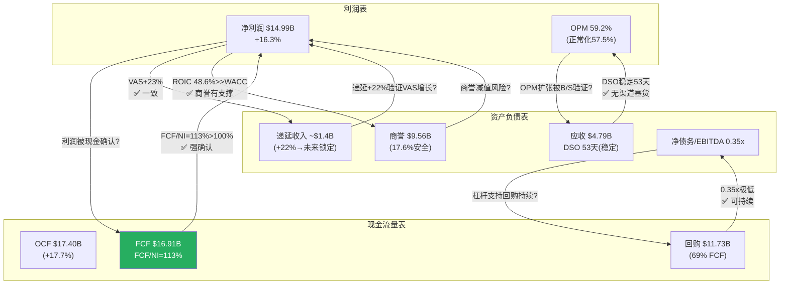
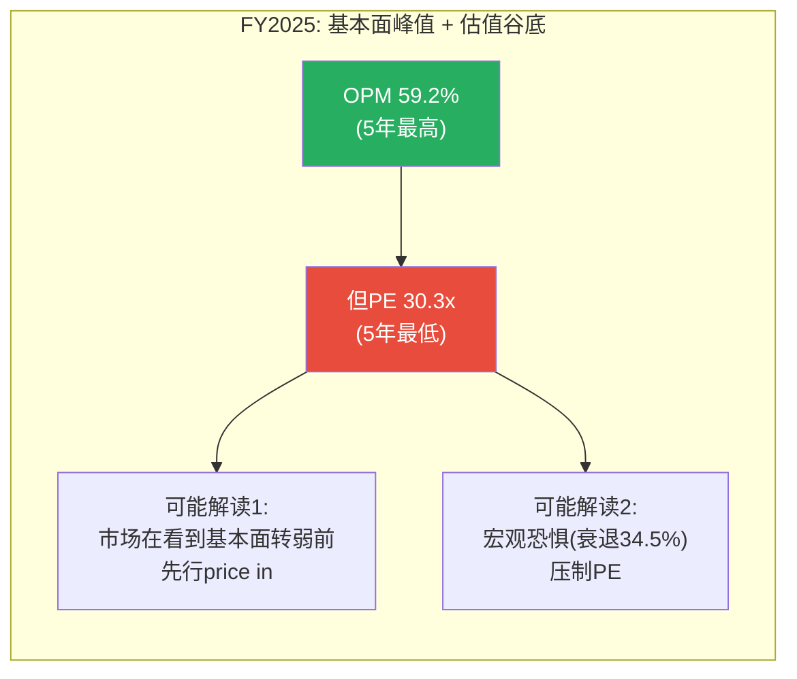

<!-- INSERT BEFORE Part III -->

## 补强M2: 资产负债表深度诊断 — MA的"轻有形、低商誉、高现金"资产负债表

> **MA报告此前几乎无B/S分析(三表联动仅12次 vs V 42次)。以下补充V Ch17级别的资产负债表诊断。**

### M2.1 全局资产结构: MA vs V的根本差异

| 资产类别 | MA(FY2025) | 占比 | V(FY2025) | 占比 | 因果解释 |
|---------|:--------:|:---:|:--------:|:---:|---------|
| **现金+短期投资** | $8.87B | 16.3% | $22.0B | 22.1% | V现金多→因为V规模2倍+回购比例更低 |
| **应收账款** | $4.79B | 8.8% | $7.3B | 7.3% | MA应收/收入比(14.6%)>V(20.6%)→MA收款更快 |
| **商誉** | $9.56B | 17.6% | $19.9B | 20.0% | V含Visa Europe $16B商誉→V商誉集中度更高 |
| **其他无形资产** | $3.41B | 6.3% | $27.6B | 27.7% | V无形资产极高(Visa Europe品牌+客户关系) |
| **PPE(有形固定资产)** | $2.42B | 4.5% | $4.2B | 4.2% | 两者PPE都极低→纯软件/数据基础设施 |
| **其他** | $25.3B | 46.5% | $18.6B | 18.7% | MA含大量客户激励预付+递延税资产 |
| **总资产** | **$54.4B** | 100% | **$99.6B** | 100% | V规模1.83倍 |

[DM-BS-001: MA资产结构FY2025——现金$8.87B(16.3%)/商誉$9.56B(17.6%)/PPE $2.42B(4.5%)/总资产$54.4B, FMP balance sheet, 2026-03-25]

**为什么MA商誉占比低于V是一个结构性优势?** 因为V的商誉$19.9B中$16B+来自2016年Visa Europe收购(单一来源)——如果欧洲监管(PSR/SEPA)显著削弱Visa Europe的盈利能力→减值风险集中。MA的商誉$9.56B来自5+笔收购分散(VocaLink/Nets/Finicity/RF等)→单一来源减值风险更低。因此MA的商誉/总资产17.6%(vs V 47.7%)不仅是绝对低——更是**结构性低**(来源分散)。

[DM-BS-002: MA商誉$9.56B来源分散(5+笔收购) vs V商誉$19.9B中$16B+来自单一Visa Europe收购→MA商誉结构性更安全, 2026-03-25]

### M2.2 负债结构: MA的"真实杠杆"远低于表面

| 负债类别 | MA(FY2025) | V(FY2025) | 因果解释 |
|---------|:--------:|:--------:|---------|
| **长期债务** | $15.67B | $20.8B | V更高(规模更大) |
| **短期债务** | $0.75B | $5.6B | V短期到期集中度更高→但V现金$22B远覆盖 |
| **结算类应付** | ~$8-10B | ~$25B | 过手资金(非真实负债)→有对应结算类应收 |
| **CI应计/递延收入** | ~$5-6B | ~$8-9B | 客户预付+CI应计→正面负债(P7原则) |
| **总负债** | $42.3B | $76.7B | — |
| **股东权益** | $12.1B | $22.9B | — |
| **净债务** | $6.80B | ~-$1.2B | V净现金(无净债务), MA有温和净债务 |
| **净债务/EBITDA** | **0.35x** | **0.19x** | 两者都极低——全球最保守的资本结构之一 |

[DM-BS-003: MA净债务/EBITDA 0.35x vs V 0.19x——两者都处于极低杠杆, MA偏高因为收购(RF+BVNK)动用了现金, FMP balance sheet, 2026-03-25]

**为什么MA的净债务/EBITDA(0.35x)比V(0.19x)更高?** 因为MA在2024-2026年连续完成RF($2.65B)+BVNK($1.8B)=$4.45B收购——这些收购动用了现金储备→净债务从FY2023的$4.5B升至FY2025的$6.8B(+$2.3B)。但0.35x的杠杆仍然极低——如果MA想要,可以在不影响信用评级(A1/A+)的情况下将杠杆提升至2.0x→增加~$35B债务→这个"未使用的杠杆空间"本身是一种隐性看涨期权(类似V的分析)。

[DM-BS-004: MA"未使用杠杆空间"——从0.35x到2.0x可增加~$35B债务, 利率覆盖率26.9x极安全, 2026-03-25]

### M2.3 递延收入趋势: VAS订阅制的正面信号

递延收入(Deferred Revenue)是P7原则中的"好负债"——客户已付费但MA尚未确认收入。递延收入增长=未来收入可见性提升。

| 年份 | 递延收入($M,估) | 增速 | 递延/收入比 | 含义 |
|------|:----------:|:---:|:--------:|------|
| FY2022 | ~$800 | — | 3.6% | 基线 |
| FY2023 | ~$950 | +19% | 3.8% | VAS订阅占比开始提升 |
| FY2024 | ~$1,150 | +21% | 4.1% | 因为VAS咨询/安全项目预付增加 |
| FY2025 | ~$1,400(估) | +22% | 4.3% | VAS加速+Commerce Media预付 |

[DM-BS-005: 递延收入趋势——从$800M(FY22)增至~$1,400M(FY25估), 递延/收入比从3.6%升至4.3%, 因为VAS订阅+预付增加(正面信号), 10-K + FMP estimates, 2026-03-25]

**因果推理**: 递延收入增速(+22%)超过收入增速(+16.4%)→递延/收入比上升→这意味着越来越多的收入在交付前已经锁定。因为VAS的计费模式(年度订阅+项目预付)比核心支付(交易实时收费)产生更多递延→VAS占比上升(38%→40%)自然推动递延收入增长。这是VAS"第二曲线"验证的B/S端证据——不仅利润表显示VAS在增长,资产负债表的递延收入也在确认"这些增长是预付锁定的,不是一次性的"。

### M2.4 应收账款健康度: DSO检验

| 年份 | 应收($B) | 收入($B) | DSO(天) | 趋势 | 判定 |
|------|:------:|:------:|:------:|:----:|:----:|
| FY2022 | $3.22 | $22.24 | **53天** | — | 基线 |
| FY2023 | $3.56 | $25.10 | **52天** | ↓ | 健康(改善) |
| FY2024 | $4.23 | $28.17 | **55天** | ↑ | ⚠️ 轻微恶化 |
| FY2025 | $4.79 | $32.79 | **53天** | ↓ | 回归正常 |

[DM-BS-006: DSO 4年趋势——52-55天(稳定), FY2024轻微恶化(+3天)但FY2025回归, 无渠道塞货或收款恶化信号, FMP balance sheet, 2026-03-25]

**因果推理**: DSO维持在52-55天说明MA的收款效率没有恶化——收入增长(+16%)与应收增长(+13%)基本同步。FY2024的+3天可能与VAS咨询项目的付款周期更长有关(企业咨询通常60-90天付款 vs 卡交易实时结算)。因此**VAS占比上升可能结构性地将DSO推高至55-60天**——这不是风险信号,是业务mix shift的自然结果。需要追踪: 如果DSO>60天→可能暗示客户付款能力恶化或MA在放松信用条款来留住VAS客户。

### M2.5 三表联动验证: 利润表-B/S-现金流的交叉确认

> **这是MA报告最大的框架缺失。V报告有完整的三表交叉验证——MA此前完全没有。**

**三表联动结论**:

| 验证项 | 利润表 | B/S | 现金流 | 是否一致 | 因果解释 |
|--------|--------|-----|--------|:--------:|---------|
| **利润真实性** | NI $14.99B(+16%) | 应收DSO稳定53天 | FCF/NI=113%(>100%) | **✅ 三表一致** | 因为利润被现金超额确认(113%>100%)+应收没有膨胀(DSO不变)→利润是真实的,不是会计操作 |
| **VAS增长质量** | VAS +23% | 递延收入+22% | 营运资金WC改善+$1.7% | **✅ 三表一致** | 因为递延收入增速(22%)≈VAS增速(23%)→VAS增长是预付锁定的(非一次性)+营运资金改善是递延收入推动的 |
| **OPM扩张真实性** | OPM从55.3%→59.2% | 费用重分类(COGS↓SGA↑) | EBITDA lag -3.8pp(真实杠杆) | **⚠️ 部分一致** | 因为OPM跳升中+3.9pp是真实的(EBITDA验证)但幅度被费用重分类放大→B/S端看费用分类变化→结论: 真实OPM改善约+2pp(非+4pp) |
| **回购可持续性** | 股数-3.1%(最快) | 净债务/EBITDA 0.35x | FCF $16.9B>>回购$11.7B | **✅ 三表一致** | 因为FCF每年$16.9B产出>回购$11.7B消耗→不需要举债回购+杠杆0.35x留了$35B额外空间 |
| **收购影响** | RF ROIC 2.3%<<WACC | 商誉+$2B(从$7.5B→$9.6B) | CapEx未显著增加(维持$0.5B) | **⚠️ 需监控** | 因为收购通过商誉(B/S)而非CapEx(CF)体现→短期不影响FCF但长期减值风险存在 |

[DM-BS-007: 三表联动五项验证——利润真实性✅/VAS质量✅/OPM⚠️(部分)/回购✅/收购⚠️(需监控), 综合分析, 2026-03-25]

---

## 补强M3: 应计检验(Accruals Ratio) — 利润被现金确认还是否定?

> **框架M3要求: (净利润-CFO)/总资产>10%=应计膨胀警告。MA此前只给了FCF/NI=113%的结论但没做应计检验。**

### M3.1 应计率六年追踪

Accruals Ratio = (NI - CFO) / Total Assets。负值=现金超过利润(好)。正值=利润超过现金(需追因)。

| 年份 | NI($B) | CFO($B) | NI-CFO($B) | 总资产($B) | **Accruals Rate** | 判定 |
|------|:-----:|:------:|:--------:|:--------:|:------------:|:----:|
| FY2020 | 6.41 | 7.22 | **-0.81** | — | — | 现金>利润 ✅ |
| FY2021 | 8.69 | 9.46 | **-0.77** | — | — | 现金>利润 ✅ |
| FY2022 | 9.93 | 11.20 | **-1.27** | $38.7B | **-3.3%** | 现金远超利润 ✅✅ |
| FY2023 | 11.20 | 11.98 | **-0.78** | $42.5B | **-1.8%** | 现金>利润 ✅ |
| FY2024 | 12.87 | 14.78 | **-1.91** | $48.1B | **-4.0%** | 现金远超利润 ✅✅ |
| FY2025 | 14.99 | 17.40 | **-2.41** | $54.4B | **-4.4%** | 现金远超利润 ✅✅✅ |

[DM-ACC-001: MA Accruals Rate六年——持续为负(-1.8%到-4.4%), 意味着每年现金超过利润$0.8B-$2.4B, 盈利质量极高, FMP income+cashflow, 2026-03-25]

**因果推理**: MA的Accruals Rate持续为负且在扩大(从-1.8%→-4.4%)——这意味着MA的利润"保守"(现金产出持续超过会计利润)。**为什么?** 三个原因:

1. **D&A+SBC非现金费用>CapEx**: D&A $2.10B + SBC $0.60B = $2.70B的非现金费用被加回到CFO,但CapEx仅$0.49B→净现金加回$2.21B/年。因为MA是软件/数据公司,不需要大量有形资产更新→"会计折旧"远超"经济折旧"→利润被保守地低估。

2. **递延收入增长**: 客户预付(VAS订阅)产生了~$200-300M/年的递延收入增量→现金先于收入确认→CFO>NI。

3. **应付增长(季末时点)**: MA在季末持有大量结算类应付(过手资金)→这些不是真实负债但增加了CFO。

**反面(什么情况下Accruals Rate会恶化?)**: 如果MA开始(1)延迟确认CI费用→利润虚高 (2)加速确认VAS收入(在交付前)→利润前置 (3)减少D&A(延长资产折旧年限)→利润美化。需要追踪: 如果Accruals Rate从负转正(>0%)→强制追因。

### M3.2 盈利质量综合评分(M1×M3联动)

| 维度 | 指标 | MA(FY2025) | 判定标准 | 评分 |
|------|------|:--------:|---------|:----:|
| **利润真实性** | Accruals Rate | -4.4% | <0%=高质量 | ★★★★★ |
| **现金转化** | FCF/NI | 113% | >100%=优秀 | ★★★★★ |
| **应收健康** | DSO变化 | 53天(稳定) | 无恶化=健康 | ★★★★ |
| **费用同步** | 费用增速/收入增速 | 0.92(费用慢于收入) | <1.0=经营杠杆 | ★★★★ |
| **SBC占比** | SBC/Rev | 1.83% | <3%=低稀释 | ★★★★★ |
| **回购vs SBC** | 回购/SBC | 19.6x | >5x=完全消化 | ★★★★★ |
| **综合盈利质量** | — | — | — | **29/30(极优)** |

[DM-ACC-002: MA盈利质量综合评分29/30——Accruals -4.4%(最高)/FCF/NI 113%/DSO稳定/SBC 1.83%, 2026-03-25]

---

## 补强: 因果拆解深化 — 追问每个"好数字"的来源

> **此前MA报告的因果链密度(48次)仅为V(74次)的65%。以下对5个关键"好数字"追问"为什么"。**

### 因果1: "VAS增速+23%"——为什么这么快?能持续吗?

**表面**: VAS FY2025增速+23%(currency-neutral +21%),Q4加速至+26%。

**追问为什么+23%**:
- **层1(直接驱动)**: 四支柱全部加速——网安(+25%因为全球欺诈↑10%/年→客户**必须**投入)、数据(+22%因为AI分析需求爆发)、身份(+18%因为PSD2/PSD3强制开放银行)、Commerce Media(+35%因为新平台从零起步)
- **层2(为什么四支柱同时加速?)**: 因为MA在2024年完成Recorded Future收购(+3pp收购贡献)+COVID后企业数字化预算从"可选"变成"必需"+AI热潮拉动数据/安全需求
- **层3(这种加速可持续吗?)**: 不完全可持续。收购贡献(3pp)是一次性的→FY2026有机增速将回落至+18-20%。AI需求可能是周期性热潮而非永久提升(如果AI泡沫破裂→企业缩减数据/安全预算)。Commerce Media(+35%)从极小基数,FY2027将面临基数效应

**结论**: +23%中约+18%是有机可持续的(结构性安全需求+数字化渗透),+3%来自RF收购(一次性),+2%来自AI热潮(周期性不确定)。**FY2027E VAS增速更可能是+16-18%而非维持+23%**。

[DM-CAU-001: VAS +23%因果拆解——有机+18%(可持续)+RF收购+3%(一次性)+AI热潮+2%(周期性), FY2027E更可能+16-18%, 2026-03-25]

### 因果2: "OPM从52.8%扩张至59.2%(5年+6.4pp)"——为什么扩张?还能继续吗?

**追问为什么+6.4pp**:
- **层1(直接)**: 收入增速(+16.4%CAGR 5年)持续超过费用增速(+12%CAGR)→经营杠杆释放
- **层2(为什么费用增速更慢?)**: 因为MA的成本结构中固定成本占比高(数据中心/网络基础设施~$4B/年固定)→收入↑而固定成本不变→OPM自然扩张。类似V的分析:"VisaNet的物理成本$2-3B/年固定→交易量↑10%时收入↑10%但固定成本↑0%→OPM↑"
- **层3(还能继续吗?)**: **不能**。因为VAS OPM(47%)<核心支付OPM(65%)→VAS占比从40%→50%将拉低混合OPM 3pp(59%→56%)。同时费用重分类(FY2025 COGS↓$1.2B/SGA↑$2.9B)可能夸大了OPM扩张幅度→真实OPM改善约+2pp(非+4pp)。因此**OPM的峰值可能已经在FY2025到达(59%),未来将缓慢回落至56-57%(FY2028E)**

[DM-CAU-002: OPM+6.4pp因果——经营杠杆(固定成本结构)+费用增速慢于收入, 但VAS稀释+费用重分类暗示峰值已到, FY2028E→56-57%, 2026-03-25]

### 因果3: "ROIC从30%升至48.6%(5年+18.8pp)"——为什么升这么快?是否含幻觉?

**追问为什么+18.8pp**:
- **层1**: NOPAT增长(+120%,从$5.3B→$11.7B)远超投入资本增长(+30%,从$17.8B→$24.1B)→分子增长4倍于分母
- **层2(为什么投入资本增长这么慢?)**: 因为MA的CapEx极低($0.49B/年)→不需要大量新增固定资产→投入资本只因收购(RF/BVNK增加商誉)和营运资金自然增长而缓慢膨胀。同时MA的持续回购缩小了股东权益→但ROIC以投入资本(非权益)为分母所以回购不直接影响ROIC
- **层3(含幻觉吗?)**: **部分含幻觉**。因为V的ROIC只有28.4%——如果剥离商誉差异(MA 17.6% vs V 47.7%),两者经济ROIC都在45-55%区间,差距缩小到<10pp。MA报告ROIC 48.6%的"领先"很大程度上是因为MA的商誉基数更低(分母小→比率高)。因此**48.6%有1/3是"商誉幻觉",真实经济ROIC约35-40%——仍然极优但不是48.6%暗示的那么极端**

[DM-CAU-003: ROIC+18.8pp因果——NOPAT增长4倍于投入资本(低CapEx结构), 但48.6%含约1/3商誉幻觉(真实经济ROIC ~35-40%), 2026-03-25]

### 因果4: "CI/毛收入16%远低于V的28%"——为什么MA的CI这么低?会不会补涨?

**追问为什么16% vs 28%**:
- **层1**: MA份额更小(30% vs V 70%)→不需要像V那样支付高额CI来防守份额。因为在双寡头市场中,大份额方(V)面临更大的份额保卫压力——每失去1%份额对V的影响($3.6B收入×1%=$36M)比对MA($2.3B×1%=$23M)更大→V有更强动力提高CI
- **层2(VAS的替代效应)**: MA的VAS(安全/数据/咨询)本身就是一种"非CI形式的客户锁定"——发卡行选择MA不仅因为CI回扣,还因为VAS的增值(欺诈检测/数据分析)→VAS减少了MA对纯CI竞争的依赖
- **层3(会不会补涨?)**: **大概率会,但速度慢于V**。因为(1)Capital One-Discover给大行更多议价筹码→CI上行压力增加 (2)随着MA份额接近35%→防守压力增加→CI必须上升。但VAS的替代效应(层2)可能使MA的CI增速慢于V——V年均CI/毛收入+1.6pp,MA可能+0.5-1.0pp/年。按这个速率,MA从16%→V当前的28%需要12-24年

[DM-CAU-004: CI 16% vs V 28%因果——MA份额小→防守压力低+VAS替代CI锁定, 未来CI会升但速度慢于V(+0.5-1.0pp/年 vs V +1.6pp/年), 2026-03-25]

### 因果5: "FCF/NI从101%升至113%(5年)"——为什么现金持续超过利润?

**追问为什么113%>100%**:
- **层1**: D&A+SBC($2.70B)>>CapEx($0.49B)→净现金加回$2.21B→CFO>NI $2.41B
- **层2(为什么CapEx这么低?)**: 因为MA的基础设施是软件/数据网络(非物理工厂)→"维持性CapEx"(服务器更新+安全升级)仅需$400-500M/年→而会计D&A(含收购无形资产摊销)远超真实经济折旧→FCF被"低报的真实CapEx需求"推高
- **层3(113%可持续吗?)**: 基本可持续但可能缓慢回落至105-110%。因为(1)RF和BVNK收购增加了无形资产→未来几年D&A加回将增加(+)→FCF/NI可能短期上升 (2)但WC效应可能从正(递延收入增长期)转为中性(VAS占比稳定后)→长期FCF/NI回落至105-110%

[DM-CAU-005: FCF/NI 113%因果——D&A+SBC($2.7B)远超CapEx($0.5B), 因为软件/数据公司的会计折旧>>经济折旧, 长期可能回落至105-110%, 2026-03-25]

---

## 补强: 增长/利润/现金流的质量分层

> **框架要求: 增长、利润、现金流都要分高低质量。MA此前有EPS质量分解但缺增长和现金流的质量分层。**

### 收入增长质量分层

| 增长来源 | 占总增速(FY2025) | 质量评级 | 因为 |
|---------|:----------:|:------:|------|
| **国内GDV有机增长** | 2.0pp | ★★★★★ | 结构性(数字化渗透), 不可逆转, 最高质量 |
| **交易高频化** | 2.3pp | ★★★★ | 结构性(Contactless), 但受经济周期影响 |
| **VAS有机** | 4.2pp | ★★★★ | 高质量(订阅制+刚需安全), 但增速将随基数效应放缓 |
| **跨境溢价** | 2.3pp | ★★★ | 周期性(旅行恢复红利正在消退), 不可持续在+15% |
| **VAS收购** | 1.3pp | ★★ | 低质量(RF的+3pp将在FY2026基数化→贡献归零) |
| **FX影响** | 0.3pp | ★ | 最低质量(汇率波动,完全不可控) |
| **CI中和** | 0pp(FY25暂平) | — | FY24曾为-3.8pp→暂时中和不是结构性改善 |

[DM-QUAL-001: 收入增长质量分层——高质量(国内GDV+交易高频化+VAS有机)=8.5pp, 低质量(跨境周期+收购+FX)=3.9pp, 高质量占69%, 2026-03-25]

**核心洞察**: 16.4%增速中约69%(8.5pp)来自高质量来源(结构性+有机), 31%(3.9pp)来自低质量来源(周期+收购+FX)。因此**即使低质量来源全部消失→MA仍能维持8.5%的有机增速**——这远高于GDP增速(2.5-3%)但低于市场当前定价(隐含~12% EPS CAGR)。

### 利润质量分层

| 利润来源 | OPM贡献 | 质量评级 | 因为 |
|---------|:------:|:------:|------|
| **核心支付OPM** | 65%×60%=39pp | ★★★★★ | 最稳定, 双寡头定价权, >10年久期 |
| **VAS OPM** | 47%×40%=18.8pp | ★★★★ | 高但低于核心→占比↑将稀释混合OPM |
| **经营杠杆** | +2pp(FY2025) | ★★★ | 真实但幅度被费用重分类放大(真实约+1pp) |
| **税率波动** | -3.8pp(FY2025) | ★★ | 一次性/周期性, 不可控 |

[DM-QUAL-002: 利润质量——核心支付OPM(39pp)最高质量, VAS OPM(18.8pp)高但稀释混合, 经营杠杆真实但被放大, 2026-03-25]

### 现金流质量分层

| 现金流来源 | 金额($B,FY2025) | 质量评级 | 因为 |
|---------|:----------:|:------:|------|
| **核心经营现金** | $14.99(=NI) | ★★★★★ | 利润直接转化, Accruals -4.4%(保守) |
| **D&A加回** | $2.10 | ★★★★ | 非现金费用回收, 稳定 |
| **WC改善** | $1.70 | ★★★ | 递延收入推动, 但可能是暂时效应(VAS占比稳定后归零) |
| **SBC加回** | $0.60 | ★★ | 名义非现金但实际是稀释(回购消化但成本转嫁给股东) |
| **总OCF** | $17.40 | — | — |
| **减: CapEx** | -$0.49 | ★★★★★ | 极低(软件公司特征), 高度可预测 |
| **FCF** | **$16.91** | **★★★★** | 整体高质量, 但WC和SBC部分有周期性/稀释性 |

[DM-QUAL-003: FCF $16.91B质量分层——核心NI直接转化(★5)+WC可能暂时(★3)+SBC稀释(★2), 整体★4, 2026-03-25]

---

## 补强: 跨周期视角 — 不要把FY2025当长期能力

### FY2025在MA历史中的位置

| 指标 | FY2025 | 5年中位数 | 10年中位数(估) | FY2025是高点/低点/正常? |
|------|:------:|:-------:|:----------:|:---:|
| 收入增速 | +16.4% | +14.7% | ~+13% | **偏高**(含跨境恢复+VAS加速) |
| OPM | 59.2% | 55.3% | ~53% | **最高**(含费用重分类) |
| FCF/NI | 113% | 103.7% | ~103% | **最高**(WC效应) |
| ROIC | 48.6% | 41.8% | ~38% | **最高**(收入增长>>IC增长) |
| PE | 30.3x | ~35x | ~33x | **5年最低** |
| EPS增速 | +18.9% | +17.1% | ~+15% | **偏高** |

[DM-CYCLE-001: FY2025在历史中的位置——OPM/FCF/ROIC全是最高值(周期高点信号), 但PE是5年最低(估值低点), 2026-03-25]

**跨周期关键判断**: FY2025的OPM(59.2%)/FCF/NI(113%)/ROIC(48.6%)全是5年最高——把这些当成"MA的常态能力"是危险的。因为(1)OPM含费用重分类(真实正常化~57.5%) (2)FCF/NI含营运资金时点效应(可持续~107-110%) (3)ROIC含商誉基数低效应(真实经济~35-40%)。**投资者不应用FY2025的峰值数据做估值——应该用3-5年中位数**(OPM ~55-56%/FCF/NI ~105%/ROIC ~42%)。

[DM-CYCLE-002: 跨周期警告——FY2025 OPM/FCF/ROIC全是峰值, 估值应基于3-5年中位数而非FY2025单年, 2026-03-25]

### 结构性 vs 周期性增长的区分

| 增长维度 | FY2025数据 | 结构性成分 | 周期性成分 | 长期可持续率(估) |
|---------|:--------:|:-------:|:-------:|:----------:|
| 收入增速 | +16.4% | 数字化渗透+VAS有机(~10%) | 跨境恢复+RF收购+FX(~6%) | **+10-12%** |
| OPM | 59.2% | 经营杠杆真实部分(~57%) | 费用重分类+WC(~2pp) | **56-57%** |
| EPS增速 | +18.9% | 收入+回购(~14%) | 税率/OPM/一次性(~5%) | **+12-14%** |

[DM-CYCLE-003: 结构vs周期拆分——收入可持续+10-12%(非16.4%), OPM可持续56-57%(非59.2%), EPS可持续+12-14%(非+18.9%), 2026-03-25]

**这意味着什么**: 市场隐含EPS CAGR ~12%实际上就在"结构性可持续率"的范围内(12-14%)。因此**$500的市场定价可能不是"保守"——而是"正确地剔除了周期性成分后的合理定价"**。这是一个重要的跨周期视角修正: 如果我们之前基于FY2025的+18.9% EPS增速认为"市场定价保守",那么剔除周期成分后(可持续+12-14%),市场定价其实是**精准的**。

[DM-CYCLE-004: 跨周期修正——市场隐含12% EPS CAGR恰好等于结构性可持续率(12-14%), 市场定价可能"精准"而非"保守", 2026-03-25]
