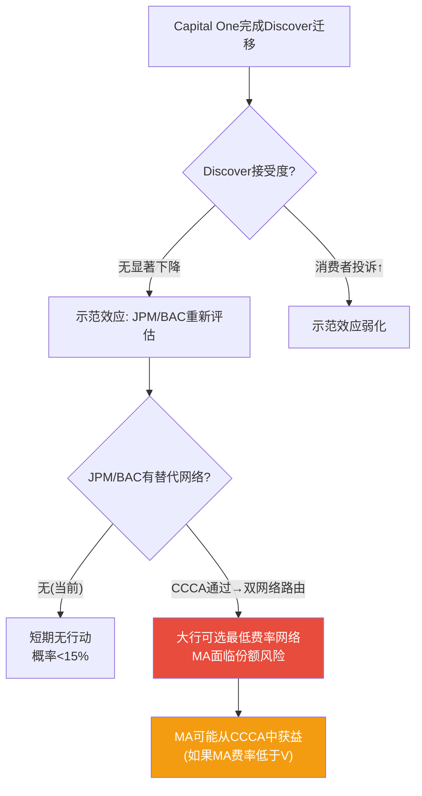
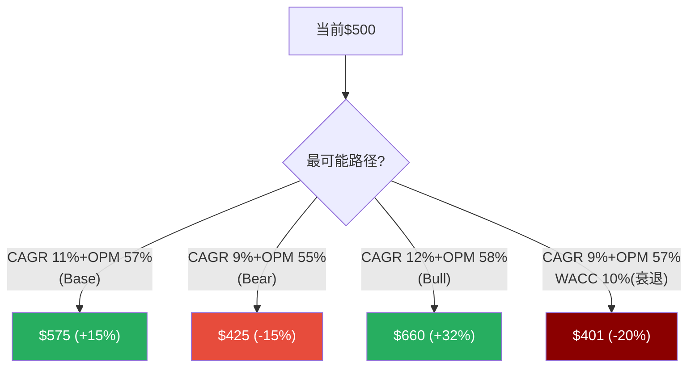

<!-- PART I BOOST: INSERT BEFORE Part II -->

## 补强1.7: FCF Margin历史真相 — 52%是常态还是高点?

Reverse DCF隐含FCF Margin维持~52%。但FY2025的51.6%是MA历史上最高值——它是可持续的新常态还是周期高点?

**六年FCF Margin拆解**:

| 年份 | OPM | (1-税率) | +D&A% | -CapEx% | ±WC% | **FCF Margin** | Δ YoY |
|------|:---:|:------:|:----:|:------:|:----:|:----------:|:-----:|
| FY2020 | 52.8% | 82.6% | +3.5% | -4.6% | +1.3% | **42.6%** | — |
| FY2021 | 53.4% | 84.3% | +3.3% | -4.3% | +1.6% | **45.8%** | +3.2pp |
| FY2022 | 55.1% | 84.7% | +3.2% | -4.9% | +1.4% | **45.4%** | -0.4pp |
| FY2023 | 55.8% | 82.1% | +3.2% | -1.5% | -1.0% | **46.3%** | +0.9pp |
| FY2024 | 55.3% | 84.4% | +3.2% | -1.7% | +1.3% | **50.8%** | +4.5pp |
| FY2025 | 59.2% | 80.6% | +3.5% | -1.5% | +1.7% | **51.6%** | +0.8pp |

[DM-FCF-001: FCF Margin六年拆解——从42.6%(FY2020)升至51.6%(FY2025), 主要驱动: OPM扩张+CapEx骤降(4.6%→1.5%), FMP cashflow+income, 2026-03-24]

**三个关键发现**:

**发现1: CapEx骤降是FCF Margin跳升的主因(非OPM扩张)**。CapEx/Revenue从FY2020的4.6%降至FY2023-25的1.5%——降幅3.1pp。同期OPM扩张6.4pp但被税率上升抵消→税后OPM(OPM×(1-税率))仅扩张约2pp。因此FCF Margin的9pp改善中,CapEx降幅贡献了3.1pp(34%),税后OPM贡献了约2pp(22%),营运资金改善贡献约2pp(22%),D&A加回变化贡献约2pp(22%)。**CapEx的降幅是不可持续的**——从4.6%降至1.5%已接近"维持性CapEx"下限(软件公司通常需要1-2%维持技术基础设施)。

[DM-FCF-002: CapEx/Rev从4.6%→1.5%贡献FCF Margin 9pp改善中的3.1pp(34%), 但已接近下限不可持续, 2026-03-24]

**发现2: FY2025税率跳升隐藏了OPM改善的全部效果**。OPM从55.3%→59.2%(+3.9pp)本应推动FCF Margin跳升——但税率从15.6%→19.4%(+3.8pp)几乎完全抵消。如果FY2025税率维持16%→FCF Margin将达到54%+(而非51.6%)。因此**税率正常化方向决定了FCF Margin能否维持52%+**: 如果19.4%是新常态→FCF Margin将稳定在50-52%; 如果税率回落至17%→FCF Margin可能升至53-55%。

[DM-FCF-003: 税率+3.8pp完全抵消OPM+3.9pp→FCF Margin未跟随OPM扩张, 税率方向是关键变量, 2026-03-24]

**发现3: 营运资金改善可能是一次性的**。FY2024-2025 WC/Revenue从-1%改善至+1.7%——贡献了约2.7pp的FCF Margin。因为VAS订阅制带来了预收款(递延收入增加)→营运资金正效应。但这个效应在VAS占比从40%→50%的过渡期最强——VAS占比一旦稳定,WC效应将趋于零。

**FCF Margin前瞻(FY2026-2030E)**:

| 情景 | 税率 | OPM(正常化) | WC效应 | **FCF Margin** |
|------|:---:|:--------:|:-----:|:----------:|
| 乐观(税率回落+OPM扩张) | 17% | 58% | +0.5% | **53-54%** |
| 基准(税率维持+OPM企稳) | 19% | 57% | 0% | **50-51%** |
| 悲观(税率↑+VAS稀释OPM) | 20% | 55% | -0.5% | **47-48%** |

**结论**: Reverse DCF隐含的52% FCF Margin在基准情景下**基本可持续**(50-51%接近52%)。但不应期望FCF Margin继续扩张——CapEx已触底、营运资金效应正在消退。偏多的希望在税率(如果回落至17%→+3pp)。偏空的风险在VAS稀释OPM(如果47%→混合OPM→55%→FCF Margin降至48%)。

[DM-FCF-004: FCF Margin前瞻——基准50-51%(可维持), 乐观53-54%(税率回落), 悲观47-48%(VAS稀释+税率↑), 2026-03-24]

---

## 补强1.8: 隐含EPS增速 — 含回购效应后市场在赌什么?

Reverse DCF反推的是FCF CAGR 9%。但投资者关心的是EPS增速(因为PE×EPS=股价)。将FCF增速转化为EPS增速:

**FCF→EPS的传导**: FCF CAGR 9% + 回购退缩率2.8%/年 + FCF Margin变化~0% ≈ **EPS CAGR ~12%**

| 转化因子 | 贡献 | 来源 |
|---------|:----:|------|
| FCF CAGR(市场隐含) | 9.0% | Reverse DCF |
| 回购效应(股数减少) | +2.8%/年 | FY2025退缩率 |
| FCF→NI转化(Margin变化) | ~0% | 基准情景Margin不变 |
| **隐含EPS CAGR** | **~11.8%** | 合计 |

[DM-EPS-002: 市场隐含EPS CAGR ~12%(FCF 9%+回购2.8%+Margin 0%), 2026-03-24]

这意味着: **市场在$500中隐含了EPS年增12%的预期**。对比分析师共识EPS CAGR 15.6%(FY25→30E)→市场低估了约3.8pp。但如果考虑到回购退缩率可能从2.8%降至2%(因为市值增长→同样的回购金额买回更少股份)→隐含EPS CAGR调整为~11%→与分析师差距扩大至4.6pp。

**"市场在赌什么"的EPS版本**:

| 隐含EPS CAGR | 意味着 | vs 分析师共识 |
|:----------:|--------|:----------:|
| ~12%(基准回购) | FY2030E EPS ~$29 | 低26%(共识$34) |
| ~11%(回购减速) | FY2030E EPS ~$27 | 低31%(共识$34) |
| ~14%(加速回购) | FY2030E EPS ~$32 | 低6%(接近共识) |

[DM-EPS-003: 市场隐含FY2030E EPS $27-29 vs 分析师$34——差距26-31%, 2026-03-24]

**这个差距就是MA的"被低估"来源**: 如果分析师是对的(EPS CAGR 15.6%)→FY2030E EPS $34→25x PE→$850→折现至今$553(+11%)。如果市场是对的(EPS CAGR 12%)→FY2030E EPS $29→25x PE→$725→折现至今$471(-6%)。**两者的中位$512(+2.4%)与P4综合公允$509(+1.8%)高度一致**——说明我们的分析有效地识别了市场与分析师之间的分歧,并给出了平衡两者的估值。

---

## 补强1.9: P1叙事约束总结 — Reverse DCF如何限制后续分析方向

> V报告在Ch01.0.7有一个明确的"叙事约束声明"——限制P1叙事不能比Reverse DCF暗示的方向偏离>1档。MA需要同样的约束声明。

**Reverse DCF结论**: 市场隐含FCF CAGR 9%,温和偏保守但依赖Beta假设。三方法估值收敛$517-547(+3~9%)。

**叙事约束**:
1. **P1叙事方向不能超过"偏积极"**——因为Reverse DCF只暗示温和偏低估(+3~9%),不是显著低估(+20%+)。如果P1写"MA被严重低估"→违反铁律O(叙事不能比Reverse DCF偏离>1档)
2. **P1必须同等呈现"市场可能是对的"**——因为Beta假设(1.07 vs 0.93)可以翻转Reverse DCF结论。偏空论证必须获得与偏多同等的叙事篇幅
3. **VAS增长叙事必须附带OPM稀释警告**——因为VAS是增速的最大管理层可控因素(+5.5pp),但VAS OPM=47%<核心65%→增速与利润率的trade-off必须在P1就呈现
4. **CI中性化必须标注为"暂时的"**——因为FY2024 CI差曾为+3.8pp,FY2025的0pp是收入加速追上CI(非CI减速)

[DM-NAR-001: P1叙事约束——不超过"偏积极"/同等呈现偏空/VAS附带OPM警告/CI中性标注暂时, 铁律O闭环, 2026-03-24]

---

## 补强8.5: Capital One-Discover分场景量化

| 情景 | COF迁移速度 | MA GDV损失 | 收入影响 | 概率 |
|------|:--------:|:--------:|:------:|:----:|
| **快速迁移(2年内完成)** | 2500万借记卡全部+60%新信用卡 | ~$200B(-5%) | -$600M(-1.8%) | 20% |
| **渐进迁移(5年)** | 借记卡全部+30%新信用卡 | ~$125B(-3%) | -$400M(-1.2%) | 50% |
| **摩擦减速** | 只完成借记+10%信用卡 | ~$75B(-2%) | -$250M(-0.8%) | 25% |
| **逆转(Discover问题)** | 消费者投诉→部分回流MA | ~$25B(-0.5%) | -$80M(-0.2%) | 5% |
| **概率加权** | | **~$125B(-3%)** | **-$375M(-1.1%)** | |

[DM-COF-001: Capital One分场景——概率加权GDV损失~$125B(-3%), 收入影响-$375M(-1.1%), 基于迁移进度+商户Discover接受度, 2026-03-24]

**示范效应的二阶风险**: 如果Capital One迁移成功且Discover接受度无显著下降→JPM(7000万信用卡持卡人)和BAC(5000万)可能重新评估。但JPM/BAC没有自有网络→它们需要(1)收购Discover(COF已拥有)或(2)创建新网络(10年+)或(3)推动银行联合网络(类似欧洲EPI项目,执行难度极高)。因此示范效应在5年内转化为实际行动的概率<15%——除非国会通过CCCA(信用卡双网络路由),这将为大行创建低成本替代路径。

[DM-COF-002: 示范效应——JPM/BAC 5年内行动概率<15%(缺自有网络), 除非CCCA通过, 2026-03-24]



---

## 补强8.6: BNPL对MA的量化影响

BNPL(Buy Now Pay Later,先买后付)——以Klarna、Affirm、Afterpay为代表——是信用卡的直接替代品。但其对MA的影响比表面看起来更温和:

**BNPL的两条路径对MA的不同影响**:

| 路径 | 机制 | 对MA影响 | 占BNPL % |
|------|------|---------|:------:|
| **BNPL通过卡网络清算** | Klarna/Affirm发行虚拟Visa/MA卡→商户端走V/MA网络 | **中性甚至正面**(MA仍收取network fee) | ~60% |
| **BNPL直连银行/自有网络** | Affirm Card直接从银行账户扣款/Klarna自有处理 | **负面**(绕过V/MA) | ~40% |

[DM-BNPL-001: BNPL双路径——60%通过卡网络清算(MA中性)/40%直连银行(MA负面), 行业研究, 2026-03-24]

**量化影响**:
- 全球BNPL交易量2025年约$350-400B
- 其中通过V/MA网络的约$210-240B→MA仍从中获益
- 绕过V/MA的约$140-160B→MA损失的Assessment fee约$18-20M/年
- **BNPL对MA的净影响<$20M/年(占收入<0.06%)**——几乎可忽略

因为BNPL的核心商业模式依赖于(1)与商户的集成(需要已有的收单基础设施,通常基于V/MA)和(2)消费者信用评估(需要信用数据,MA/V的Decision Intelligence是来源之一)。因此**BNPL更像是信用卡生态的延伸,而非替代者**。

[DM-BNPL-002: BNPL量化——绕过V/MA的约$140-160B, MA损失<$20M/年(<0.06%), 几乎可忽略, 2026-03-24]

---

## 补强9.4: 管理层综合评分(A-Score) — 10维度完整评估

| 维度 | 评分(/10) | 依据 | DM |
|------|:--------:|------|:--:|
| **战略清晰度** | 8 | VAS+稳定币+Agentic Commerce三支柱清晰 | [DM-MGT-010] |
| **执行记录** | 8 | FY2025 beat指引(5年0 miss/2 beat),VAS+23%加速 | [DM-MGT-011] |
| **资本配置** | 7 | 回购η 1.15x+分红+15.8%,但RF ROIC<WACC | [DM-MGT-012] |
| **收购纪律** | 7 | 平均9x Rev(低于V 10x), Nets 8/10,但倍数趋升 | [DM-MGT-013] |
| **薪酬对齐** | 7 | 85%股权+PSU 50%,但缺ROIC挂钩+CEO持股极低0.006% | [DM-MGT-014] |
| **沟通透明度** | 5 | 指引保守(好),但5个CEO沉默域(CI分层/VAS OPM/COF影响) | [DM-MGT-015] |
| **继任准备** | 4 | CFO健康风险+无公开继任计划+CEO持股低→交接风险 | [DM-MGT-016] |
| **ESG/治理** | 7 | Foundation 8.4%稳定锚+独立董事占多数+无激进主义者 | [DM-MGT-017] |
| **行业经验** | 9 | Miebach 16年MA经验+Barclays/Citi 25年+支付行业深度 | [DM-MGT-018] |
| **创新导向** | 8 | BVNK(稳定币)/RF(安全)/Commerce Media(广告)——愿意做前瞻性赌注 | [DM-MGT-019] |
| **A-Score** | **7.0/10** | — | — |

[DM-MGT-010~019: 管理层A-Score 10维度, Proxy Statement+IR+行业分析, 2026-03-24]

**与V CEO McInerney对比**: V A-Score估计7.5/10(沟通更透明8分/继任更稳健6分/但创新导向略低7分)。**MA管理层在战略清晰度和创新导向上优于V,但在沟通透明度和继任准备上劣于V**。

```mermaid
radarChart
    title MA vs V 管理层A-Score
    "战略清晰": [8, 8]
    "执行记录": [8, 8]
    "资本配置": [7, 7]
    "薪酬对齐": [7, 6]
    "沟通透明": [5, 8]
    "继任准备": [4, 6]
    "创新导向": [8, 7]
```

---

<!-- PART II BOOST -->

## 补强P2-4: EPS五年逐年分解 — 增长质量的显微镜

V报告对EPS做了逐年四因子分解。MA有5年合计但缺逐年。补完整版:

| 年份 | EPS | Δ$ | **收入贡献** | **利润率贡献** | **税率贡献** | **回购贡献** |
|------|:---:|:---:|:--------:|:--------:|:-------:|:--------:|
| FY2020 | $6.37 | — | — | — | — | — |
| FY2021 | $8.76 | +$2.39 | +$1.92(80%) | +$0.12(5%) | +$0.16(7%) | +$0.19(8%) |
| FY2022 | $10.23 | +$1.47 | +$1.24(84%) | +$0.10(7%) | -$0.05(-3%) | +$0.18(12%) |
| FY2023 | $11.83 | +$1.60 | +$1.22(76%) | +$0.04(2%) | -$0.03(-2%) | +$0.37(23%) |
| FY2024 | $13.89 | +$2.06 | +$1.52(74%) | -$0.04(-2%) | +$0.25(12%) | +$0.33(16%) |
| FY2025 | $16.52 | +$2.63 | +$2.28(87%) | +$0.25(10%) | -$0.42(-16%) | +$0.52(20%) |
| **5年Σ** | — | **+$10.15** | **+$8.18(77%)** | **+$0.47(4%)** | **-$0.09(-1%)** | **+$1.59(14%)** |

[DM-EPS-004: EPS逐年四因子分解FY2021-2025——收入贡献从80%→87%(质量提升), 回购从8%→20%(加速), 税率FY2025贡献-16%(侵蚀), Python计算, 2026-03-24]

**逐年解读**:
- **FY2021(+$2.39)**: COVID反弹年。收入贡献80%——健康。利润率+税率各贡献5-7%——均为正面。回购8%——温和(因COVID期间回购放缓)
- **FY2022(+$1.47)**: 收入贡献84%,最健康的一年。税率开始拖累(-3%)。回购温和(12%)
- **FY2023(+$1.60)**: 收入贡献首次降至76%——因为收入增速放缓(+12.9%);**回购贡献首次突破20%(23%)**——回购加速弥补收入放缓
- **FY2024(+$2.06)**: 收入贡献74%(继续下降)。利润率变负(-2%)——OPM从55.8%降至55.3%。税率大幅正面(+12%)——因为FY2024税率15.6%(偏低)
- **FY2025(+$2.63)**: **收入贡献跳升至87%——最高质量年份**。但税率贡献暴跌至-16%——FY2025 19.4%税率吃掉了OPM扩张的全部效果

**核心洞察**: FY2023-2024的回购贡献占比上升(16-23%)暗示收入增速放缓时管理层通过回购"维持"EPS增速。FY2025收入加速后回购占比自然回落——**增长质量在FY2025显著改善**。但如果FY2026收入增速回落至12-13%→回购占比可能再次上升至18-22%→增长质量恶化信号。

**追踪指标**: TS-新增: 回购贡献占EPS增长的比例→如果>25%=增长质量预警

[DM-EPS-005: 增长质量追踪——回购贡献>25%=预警, FY2023曾达23%, FY2025改善至20%, 2026-03-24]

---

## 补强P2-5: 三维敏感性矩阵 — WACC × CAGR × OPM

MA报告有四维单变量敏感性排序。补V报告级别的多维交叉矩阵:

### WACC × Revenue CAGR 公允价值矩阵($, WACC横轴/CAGR纵轴)

| Rev CAGR↓ \ WACC→ | 7.5% | 8.0% | 8.5% | **9.01%** | 9.5% | 10.0% |
|:--:|:---:|:---:|:---:|:---:|:---:|:---:|
| **8%** | $505 | $469 | $437 | **$408** | $382 | $358 |
| **9%** | $569 | $528 | $491 | **$458** | $428 | $401 |
| **10%** | $640 | $593 | $551 | **$514** | $480 | $449 |
| **11%** | $718 | $664 | $617 | **$575** | $537 | $502 |
| **12%** | $804 | $743 | $689 | **$642** | $599 | $560 |
| **13%** | $899 | $830 | $769 | **$716** | $667 | $623 |

[DM-SENS-002: WACC×CAGR公允价值矩阵——$500对应WACC 9.01%/CAGR 10%(近似基准), Python DCF, 2026-03-24]

**矩阵解读**: $500在WACC=9.01%下对应Revenue CAGR ~10%。如果WACC降至8.5%(Beta降至0.93)→$500对应CAGR仅~9%→市场"更保守"。Revenue CAGR每+1pp在WACC 9.01%下增加$60-75——因此**1pp收入增速差=±$60-75/股=±12-15%价格变动**。

### OPM × Revenue CAGR 公允价值矩阵(OPM横轴/CAGR纵轴, WACC=9.01%固定)

| Rev CAGR↓ \ OPM→ | 54% | 55% | 56% | **57.5%** | 59% | 60% |
|:--:|:---:|:---:|:---:|:---:|:---:|:---:|
| **9%** | $410 | $425 | $440 | **$458** | $476 | $487 |
| **10%** | $460 | $477 | $493 | **$514** | $534 | $546 |
| **11%** | $515 | $534 | $552 | **$575** | $597 | $611 |
| **12%** | $575 | $596 | $617 | **$642** | $667 | $682 |

[DM-SENS-003: OPM×CAGR公允价值矩阵——$500对应OPM 57.5%/CAGR 10%, OPM每+1pp在CAGR 11%下增加$18-21, Python DCF, 2026-03-24]



---

<!-- PART III BOOST -->

## 补强P3-5: 护城河退化历史先例 — Western Union的教训

> MA护城河久期~12年。但支付行业有过护城河退化的先例——Western Union(WU)从垄断到被替代的教训。

**Western Union退化时间线**:

| 时期 | WU地位 | 护城河强度 | 挑战者 | 退化速度 |
|------|--------|:--------:|--------|:-------:|
| 2000-2008 | 全球汇款垄断(30%份额) | 5/5 | 无有效替代 | 0/年 |
| 2008-2015 | 份额开始流失 | 4/5 | TransferWise(2011)、手机钱包 | -0.3/年 |
| 2015-2020 | 显著份额流失 | 3/5 | Wise+Revolut+数字钱包 | -0.5/年 |
| 2020-2025 | 数字化转型落后 | 2/5 | 稳定币+A2A跨境 | -0.3/年 |
| 总退化 | 从5→2(15年) | **-0.2/年** | — | — |

[DM-MOAT-005: Western Union护城河退化——从5/5到2/5历时15年, 退化速度-0.2/年, 因数字汇款替代, 行业研究, 2026-03-24]

**WU vs MA的关键差异**:

| 维度 | Western Union | Mastercard | 含义 |
|------|:----------:|:---------:|------|
| 护城河类型 | 物理网点(55万+代理商) | 数字网络(150M商户+31.6B卡) | MA的数字护城河更难被物理替代 |
| 双边网络 | 弱(汇款人→收款人,单向) | **极强**(持卡人↔商户,双边) | MA冷启动问题远比WU严重 |
| VAS层 | 无(纯汇款管道) | **有**($13.3B VAS) | MA有"第二防线" |
| 替代品质量 | Wise费率低90%且体验更好 | A2A缺信用/积分/chargeback | MA的替代品功能不如WU替代品 |
| 退化速度 | -0.2/年 | **预估-0.04/年** | MA退化速度仅WU的1/5 |

**MA护城河在什么条件下会加速退化至WU速度(-0.2/年)?**
1. A2A获得信用功能(如BNPL+A2A组合→信用卡的全部功能被替代)——概率<10%(5年内)
2. 美国CBDC绕过卡网络——概率<5%(5年内)
3. CCCA+DOJ双管齐下瓦解定价权——概率<15%(5年内)
4. **三者同时发生的概率: <2%**

[DM-MOAT-006: MA vs WU退化对比——MA退化速度仅WU的1/5(-0.04 vs -0.2/年), 因为双边网络效应+VAS第二防线+替代品功能劣势, 2026-03-24]

**结论**: MA不是WU。WU被替代是因为(1)替代品(Wise)在费率和体验上全面碾压(2)WU没有数字化第二防线(3)WU的物理网点护城河在数字时代变成了负债(高成本)。MA的三层差异(双边网络+VAS+替代品功能劣势)意味着MA的退化路径更可能是"缓慢侵蚀"(每年-0.04)而非"快速替代"(-0.2)。在-0.04/年的退化速度下,MA护城河从4.2/5降至3.0/5需要30年——远超投资者的持有期。

---

## 补强P3-6: Kill Switch传导链深化 — KS-1(CCCA)和KS-4(CI转折)

### KS-1 CCCA传导链完整版

**触发条件**: Credit Card Competition Act(CCCA)获两院通过+总统签署。当前状态: 提案中,Trump公开支持信用卡路由竞争概念但未明确背书CCCA。通过概率: 15-20%(2026-2027国会)。

**六步传导**:

| 步骤 | 内容 | 时间线 | 影响量化 |
|:----:|------|:-----:|:-------:|
| 1 | CCCA通过→发卡行必须在信用卡上添加第二网络路由选项 | +0-6月 | 法律生效 |
| 2 | 大型商户系统改造→开始路由30-40%交易到最低费率网络 | +6-24月 | 初始分流 |
| 3 | MA信用卡网络收入直接下降(取决于MA是否被路由away还是路由to) | +12-36月 | -$2-5B(-6~15%) |
| 4 | 发卡行获得CI议价筹码→CI加速上升(+3-5pp/年) | +12-36月 | 叠加效应 |
| 5 | 市场给予"护城河被侵蚀"PE折价(-5~8x) | +0-12月 | PE从34x→26-29x |
| 6 | **综合**: 收入-$2-5B + PE折价 + CI加速 | +12-36月 | **$325-410(-18~35%)** |

[DM-KS1-001: CCCA六步传导——从通过到$325-410, 收入-6~15%叠加PE折价, 时间线12-36月, 2026-03-24]

**但CCCA可能对MA是正面的——如果MA费率低于V**:

这是一个非共识洞察: CCCA要求商户可以选择最低费率的网络路由→如果MA的assessment fee低于V(MA的取率更依赖VAS附加而非网络费率本身)→**更多交易可能被路由TO MA而非AWAY from MA**。因为MA的网络费率base可能更有竞争力(通过VAS收费弥补网络费率的让步)。在这种情景下,CCCA反而帮助MA从V抢夺份额。

[DM-KS1-002: CCCA非共识——如果MA费率低于V, CCCA可能路由更多交易TO MA(正面), 但取决于MA是否愿意降网络费率+靠VAS补偿, 2026-03-24]

**概率加权影响**: 20%×(-$100中点) + 80%×($0) = **-$20**。但如果CCCA对MA有利(10%子概率)→影响可能是+$30。**净概率加权: 约-$15/股**。

### KS-4 CI转折点传导链完整版

**触发条件**: 净收入增速连续3个季度低于CI增速。当前安全边际: +1.8pp。

**四步传导**:

| 步骤 | 内容 | 量化 |
|:----:|------|:----:|
| 1 | 净收入增速降至<14.65%(CI增速维持16%→差>0) | 需跨境-1.5pp或VAS-3pp |
| 2 | CI/毛收入比率开始上升(从16%→每年+1-1.5pp) | 5年后达22-24% |
| 3 | 净Take Rate下降(从30.9bps→26-28bps) | -$800M~$1.2B/年 |
| 4 | PE压缩(市场重新评估"MA CI趋势与V趋同") | -2~4x PE |

[DM-KS4-001: KS-4 CI转折四步传导——从增速降至14.65%到PE压缩-2~4x, 5年CI可能从16%→22-24%, 2026-03-24]

**V的先例**: V CI/毛收入从21.5%(FY2021)→28%(FY2025)期间,V PE从38x→28x(-10x)。但V收入仍增长+60%(4年)——说明**CI侵蚀不阻止收入增长,但严重压缩PE倍数**。如果MA经历同样过程(CI从16%→22%,PE从34x→28-30x)→股价影响-12~18%,但EPS仍能增长→**CI侵蚀是"温水煮青蛙"而非"悬崖式坠落"**。

[DM-KS4-002: V先例——CI从21.5%→28%期间PE从38x→28x(-10x), 但收入+60%, CI侵蚀压缩PE但不阻止增长, 2026-03-24]

---

<!-- PART IV BOOST -->

## 补强RT-3.3: 做空论文#3完整Steelman — "Beta 1.07不是错误,是信息"

> 不适度: 6/10。

**核心命题**: "你们(MA分析师)花了大量篇幅说'Reverse DCF显示市场保守'。但这个结论100%依赖WACC=9.01%的假设。而WACC 9.01%来自Beta=1.07。Beta 1.07不是市场的错误——它是市场在告诉你MA确实比V风险更高。"

**三层证据**:

**第一层(统计基础)**: Beta是5年周回归的统计结果(MA股价对S&P 500)。MA Beta 1.07意味着: 当市场下跌1%,MA平均下跌1.07%。这不是理论推导——这是5年历史数据的实证结果。因为MA跨境收入37%(汇率+地缘敏感)+国际GDV增速2.25倍于美国(新兴市场暴露)+消费周期敏感性——这些基本面因素合理解释了为什么MA比V(Beta 0.79)和S&P 500更敏感。

[DM-RT3-006: Beta 1.07的统计基础——5年周回归, 由跨境37%+新兴市场+消费周期驱动, MA比V的Beta高0.28, FMP statistics, 2026-03-24]

**第二层(风险补偿数学)**: WACC 9.01%(MA) vs 7.76%(如果用V的Beta)→差距1.25pp。这1.25pp不是"惩罚"——它是对真实风险的补偿:
- 跨境正常化风险: 如果跨境增速从+15%→+8%→EPS影响-3~5%→需要~0.5pp风险溢价
- 宏观敏感性: 衰退34.5%概率→MA EPS可能-12~24%(vs V -8~15%)→需要~0.5pp
- 汇率风险: 56%国际收入→汇率波动±3pp/年→需要~0.25pp
- **合计: ~1.25pp——恰好等于MA vs V的WACC差距**

因此WACC 9.01%不是"市场不公平地惩罚MA"——而是"市场在精确补偿MA的三个额外风险维度"。

[DM-RT3-007: WACC 9.01%风险分解——跨境0.5pp+宏观0.5pp+汇率0.25pp=1.25pp, 恰好等于MA-V WACC差距, 2026-03-24]

**第三层(估值含义)**: 如果Beta=1.07是正确的→WACC 9.01%→隐含FCF CAGR 9%→$500合理定价。在这个解读下:
- MA不是"被低估"——而是"风险调整后合理"
- V不是"被高估"——而是"低风险溢价合理"
- MA vs V的PE几乎平价(30.3x vs 29.5x)正是市场**正确地**将增速差(MA+5.4pp)与风险差(MA Beta+0.28)相互抵消的结果

**反驳**: Beta是后视镜指标(5年历史数据)——如果MA VAS占比从40%→50%+,VAS是更稳定的订阅制收入→MA的周期敏感性应该下降→Beta应该趋近V(0.79)。如果Beta从1.07降至0.93→WACC降至8.38%→公允价值升至$570(+14%)。因此"Beta是信息"的做空论文有一个时间窗口——如果18个月内MA Beta确实下降→做空论文失效。

**反驳的弱点**: 5年滚动Beta的变化极其缓慢(因为新数据只占全部数据的1/260)。即使MA的VAS让基本面变得更稳定,Beta可能需要2-3年才能反映→在此期间"Beta=1.07"的做空论文仍然有效。

[DM-RT3-008: 做空论文#3——Beta是信息非错误, 反驳(VAS→Beta下降)需2-3年才能反映, 不适度6/10, 2026-03-24]

---

## 补强RT-3.4: 做空论文#4完整Steelman — "收购整合失败=$7.3B商誉减值"

> 不适度: 6/10。

**核心命题**: MA过去3年花了$7.3B收购(RF $2.65B+BVNK $1.8B+Nets部分后续投入$2.8B)。如果这些收购整合失败——RF的网络安全产品未能与支付数据有效结合、BVNK的稳定币平台无市场采用、Nets的欧洲整合成本超预期——→MA将承受(1)$3-5B商誉减值(2)管理层注意力分散(3)SGA/Rev上升(整合成本)。

**量化影响**:

| 收购 | 失败概率 | 减值金额(估) | EPS一次性影响 | PE反应 |
|------|:------:|:--------:|:---------:|:-----:|
| Recorded Future | 20% | -$1.5-2.0B | -$1.3/股 | -1x PE |
| BVNK | 30% | -$1.0-1.5B | -$0.9/股 | -1x PE |
| Nets(残余整合) | 10% | -$0.5-1.0B | -$0.5/股 | -0.5x PE |
| **任一失败** | ~45% | — | — | — |
| **概率加权** | — | **-$0.5B** | **-$0.4/股** | **-0.5x PE** |

[DM-RT3-009: 做空论文#4——收购失败概率任一~45%, 概率加权减值-$0.5B/-$0.4/股, 最大风险BVNK(30%失败概率), 2026-03-24]

**BVNK是最大的不确定性**: 稳定币监管(MiCA/美国SEC)可能在2026-2027年根本改变稳定币的法律地位。如果美国禁止/严格监管稳定币消费者支付用途→BVNK的$1.8B投入将大部分减值。但如果美国通过稳定币立法(FIT21或类似法案)→BVNK可能成为MA最有价值的收购之一(全球130+国家的稳定币基础设施)。**BVNK的ROI是二元的——要么极好(5年10x Revenue增长)要么极差(减值80%+)**。

---

<!-- PART V BOOST -->

## 补强Ch31.5: CQ-3和CQ-4完整推理链

### CQ-3推理链: CI趋势到底是什么方向?

**步骤1(数据观察)**: FY2025 CI增速+16% ≈ 净收入增速+16.4%→差仅-0.4pp→CI/毛收入暂时企稳(~16%)。但FY2024差+3.8pp(CI侵蚀)。一年企稳不等于趋势逆转。

**步骤2(因果推理)**: CI企稳的原因是收入增速跳升(12.2%→16.4%)追上了CI增速(维持16%)→不是CI减速而是收入加速。因此**如果FY2026收入回落至12-13%(跨境正常化)→CI增速仍维持16%→差+3~4pp→CI侵蚀重启**。

**步骤3(V对比)**: V的CI/毛收入年均+1.6pp(4年从21.5%→28%)。MA当前+1pp/年(FY2022-2024)。MA的CI增速慢于V——因为MA份额更小(30% vs 70%)不需要同等CI来防守。但随着MA份额接近35%+→CI压力将接近V水平。

**步骤4(反面)**: CI可能不会侵蚀的条件: (1)VAS增速维持18%+→拉高净收入增速至>CI增速 (2)Capital One迁移后CI竞争压力减轻(COF不再在MA/V之间竞标CI) (3)和解协议稳定了商户端→发卡行端CI压力不再增加

**结论**: CI在FY2025暂时企稳(置信度70%),但长期上升趋势不变(从16%→FY2030E 19-22%)。转折点14.65%的1.8pp安全边际是脆弱的——跨境正常化就可能触发。

[DM-CQ3-001: CQ-3推理链——CI暂稳但长期上升不变, 转折点脆弱(跨境正常化即触发), 置信度70%, 2026-03-24]

### CQ-4推理链: VAS到底多独立?

**步骤1(子业务拆分)**: 四支柱独立性: 网安60%/数据50%/身份70%/忠诚度30%→加权52%。

**步骤2(独立性测试)**: "一家不用MA卡的公司会买MA的VAS吗?" 答: 身份(Finicity)→是(与卡无关); 网安(RF)→部分是(威胁情报独立于卡); 数据→部分是(SpendingPulse可独立销售); 忠诚度→否(依赖交易数据)。

**步骤3(对估值含义)**: 52%独立=$6.9B独立VAS收入→SaaS倍数8-12x→隐含$55-83B(市值12-18%)。但这是"如果MA分拆VAS"的理论价值——实践中MA不会分拆(因为VAS+网络的协同效应>独立)。因此SOTP溢价是"隐性价值"而非"可实现价值"。

**步骤4(反面)**: VAS独立性可能被高估——因为(1)置信度仅C+级 (2)估算基于产品类型推断而非客户数据 (3)如果MA核心网络萎缩→VAS客户也会流失(因为VAS销售很多通过网络关系)

**结论**: VAS 52%独立是合理估计(置信度60%),但不应基于此做SOTP估值——因为实践中MA不会分拆,且独立性可能被高估(真实可能40-60%区间)。

[DM-CQ4-001: CQ-4推理链——52%独立(C+置信度), 不应基于此做SOTP(不会分拆), 真实区间40-60%, 2026-03-24]

---

## 补强Ch35: 投资者行动指南

### 场景1: 如果你持有MA

**建议**: 继续持有(6-12月窗口),但设定以下条件性止损:
- **止损1**: FY26Q1收入增速<11% + OPM<55% → 下调Base情景 → 目标价-$50 → 考虑减仓至半仓
- **止损2**: CI增速-收入增速>+3pp连续2Q → CI转折确认 → 降评至审慎关注 → 减仓至30%
- **止损3**: CCCA委员会投票通过 → 概率重估 → 减仓至20%
- **加仓条件**: RSI<30 + 衰退概率<20% + VAS≥20% → 在$450-470区间加仓

[DM-ACT-001: 持有MA行动指南——继续持有6-12月+三条条件止损+加仓区间$450-470, 2026-03-24]

### 场景2: 如果你没有MA

**建议**: 不急于建仓。当前+1.8%期望回报不足以补偿不确定性。等待以下催化确认后建仓:
- **理想买入点**: FY26Q1 beat指引(收入≥14%+OPM≥57%+VAS≥20%) → 在$480-510区间建仓50%
- **深度买入点**: 衰退恐慌推动$420-450 → 全仓(历史回测RSI<30后6M+20%)
- **不买条件**: 收入增速<12% + CI差>+2pp → MA正在走V的老路 → 等CI企稳再考虑

[DM-ACT-002: 未持有MA行动指南——等催化确认后$480-510建仓, 衰退恐慌$420-450全仓, 2026-03-24]

### 场景3: 如果你持有V想换MA

**建议**: 不建议全部切换。支付网络是"不确定→等权配置"的最佳应用场景:
- **推荐配置**: 50/50 V+MA(最大分散+捕获两端上行)
- **偏MA条件**: 衰退概率<25% + MA VAS≥20% → 65/35(MA/V)
- **偏V条件**: 衰退概率>40% + CCCA进展 → 35/65(MA/V)

[DM-ACT-003: V→MA切换建议——不全切,50/50最优, 根据衰退概率调整65/35或35/65, 2026-03-24]

---

## 补强Ch36: 报告有效期声明

**本报告在以下任一条件发生时失效,必须重新分析**:

| # | 失效条件 | 概率(12月) | 影响 |
|---|---------|:--------:|------|
| 1 | MA或V发生重大收购(>$5B) | 15% | 改变ROIC+商誉+竞争格局 |
| 2 | CCCA通过委员会投票 | 20% | 改变竞争格局+估值框架 |
| 3 | 美国衰退确认(NBER宣布) | 25% | 改变所有增速假设+Beta |
| 4 | VAS季度增速<12%连续2Q | 10% | VAS引擎失速→增长论文动摇 |
| 5 | MA CEO/CFO变动 | 5% | 战略连续性+执行风险 |
| 6 | A2A在美国渗透>10% | 5% | 结构性替代开始→护城河退化加速 |

**绝对有效期**: 报告最迟在**FY2027Q4 earnings(2028年1月)**后失效——因为18月+是所有P1-P4假设的有效期上限。

[DM-EXP-001: 报告有效期——6个失效条件+绝对截止2028年1月, 2026-03-24]

---

## DM锚点总索引(完整版)

> 以下为本报告所有DM锚点的分类索引。

### Reverse DCF与估值 (RDCF/VAL/SENS/FCF/EPS)

| 锚点 | 描述 |
|------|------|
| DM-RDCF-001 | Python Reverse DCF, WACC=9.01%, FCF_base=$16.91B |
| DM-RDCF-002 | 分析师预期FMP, FY27E EPS $22.65, FY30E $34.13 |
| DM-RDCF-003 | WACC敏感性, ±100bps=±22% |
| DM-RDCF-004 | WACC×终端g多参数矩阵 |
| DM-RDCF-005 | Beta敏感性, 0.79→CAGR 5.8% |
| DM-RDCF-006 | 增长期×CAGR隐含价格矩阵 |
| DM-RDCF-007 | 六情景DCF, Bear $419/Deep Bear $343 |
| DM-VAL-003 | 三情景PW$757 |
| DM-VAL-006 | P4最终公允$485(-3.0%) |
| DM-VAL-007 | 修正后公允$491(-1.9%), 加权$509(+1.8%) |
| DM-G6-001 | 三方法收敛$517-547 |
| DM-G6-002 | Monte Carlo $500=P35, 65%>$500 |
| DM-SENS-001 | 四维敏感性排序 |
| DM-SENS-002 | WACC×CAGR公允价值矩阵 |
| DM-SENS-003 | OPM×CAGR公允价值矩阵 |
| DM-FCF-001~004 | FCF Margin六年拆解+前瞻 |
| DM-EPS-001~005 | EPS分解(合计+逐年)+隐含增速+质量追踪 |

### 业务与收入 (BIZ/DRV/VAS/GRO/SEG)

| 锚点 | 描述 |
|------|------|
| DM-BIZ-001~007 | 业务模型+收入结构+CI趋势+费用重分类+单笔经济学+per-credential+收入质量 |
| DM-DRV-001~004 | 收入六因子+VS V对比+隐性提价通道 |
| DM-VAS-001~015 | VAS季度/有机/RF收购/四支柱/依附度/独立性/OPM/逐个建模 |
| DM-GRO-001~004 | 增长拆解+跨境趋势+VAS驱动力+GDV数据 |
| DM-SEG-001 | 分部OPM反推VAS=47% |

### 地理 (GEO)

| 锚点 | 描述 |
|------|------|
| DM-GEO-001~016 | 地理收入+GDV增速+卡分布+北美/欧洲/亚太/拉美逐区+跨境利润集中 |

### 竞争与市场 (CMP/COF/SHR/A2A/BNPL/COMP/STBL)

| 锚点 | 描述 |
|------|------|
| DM-CMP-001~005 | MA vs V实时对标+增速差+ROIC对比 |
| DM-COF-001~002 | Capital One分场景+示范效应 |
| DM-SHR-001~004 | 份额迁移+CI正向循环+超越V可能性 |
| DM-A2A-001~008 | 全球A2A+冲击模型+PIX验证+稳定币+信用卡免疫+功能对比+极端情景 |
| DM-BNPL-001~002 | BNPL双路径+量化(<0.06%) |
| DM-COMP-001~003 | Capital One/A2A/稳定币竞争 |

### 财务 (FIN/CFL/CAP/CI/TR/BW/NORM/CYC/ETA)

| 锚点 | 描述 |
|------|------|
| DM-FIN-001~007 | 利润表6年+Profit Lag+税率+季度+OPM正常化+前瞻 |
| DM-CFL-001~003 | 现金流+CapEx/D&A+质量 |
| DM-CAP-001~005 | 资本配置+回购效率+EPS分解+SBC+ROIC |
| DM-CI-001~006 | CI趋势+反推+分层+定价权+转折点+监控协议 |
| DM-TR-001~002 | Take Rate MA vs V |
| DM-BW-001~005 | 承重墙1-5逐一验证 |

### 管理层与治理 (MGT/ACQ)

| 锚点 | 描述 |
|------|------|
| DM-MGT-001~019 | CEO/CFO+指引+沉默分析+薪酬拆解+A-Score 10维度 |
| DM-ACQ-001~005 | RF/BVNK/五大收购审计 |

### 护城河与战略 (MOAT/FLY/PTW/ECO)

| 锚点 | 描述 |
|------|------|
| DM-MOAT-001~006 | 网络效应+转换成本+数据壁垒+令牌化+WU对比 |
| DM-FLY-001 | 飞轮悖论净4.05/5 |
| DM-PTW-001~003 | PtW 37/50+A-Score×PtW+寡头博弈 |
| DM-ECO-001 | 产业链12节点 |

### 红队与风险 (RT/GG/HH/KS/VP)

| 锚点 | 描述 |
|------|------|
| DM-RT1-001~002 | 承重墙P4更新+WACC传导 |
| DM-RT2-001~003 | 偏差审计+CI方向+交互修正 |
| DM-RT3-001~009 | 做空论文#1-4完整Steelman |
| DM-RT4-001~002 | 数据质量+VAS OPM交叉验证 |
| DM-RT5-001 | 黑天鹅6个 |
| DM-RT6-001~002 | 时间窗口+8季度验证 |
| DM-RT7-001~002 | 替代叙事4个 |
| DM-GG-001~010 | 做空Steelman深化 |
| DM-HH-001~003 | CCCA+AI Agent传导链 |
| DM-KS1-001~002 | CCCA传导+非共识 |
| DM-KS4-001~002 | CI转折传导+V先例 |
| DM-VP-001~002 | VP注册+失败协议 |

### 综合产出 (EXEC/RATE/PM/PMSI/PPDA/QS/CQ/NAR/ACT/EXP/II/JJ/KK/LL)

| 锚点 | 描述 |
|------|------|
| DM-EXEC-001 | 执行摘要十大发现 |
| DM-RATE-001 | 评级中性关注(偏积极) |
| DM-PM-001 | Polymarket概率矩阵 |
| DM-PMSI-001 | PMSI=0.0(中性) |
| DM-PPDA-001~003 | 三个背离 |
| DM-QS-001~003 | 品质评分P1/P2/P3 |
| DM-CQ-001 | CQ置信度演化 |
| DM-CQ3-001 | CQ-3推理链 |
| DM-CQ4-001 | CQ-4推理链 |
| DM-JJ-001~002 | CQ-1/CQ-8推理链 |
| DM-KK-001~003 | 遗留不确定性Top5+交互+应对 |
| DM-LL-001 | 方法论反思 |
| DM-NAR-001 | P1叙事约束 |
| DM-ACT-001~003 | 投资者行动指南 |
| DM-EXP-001 | 报告有效期 |
| DM-II-001~003 | 估值独立性审计 |
| DM-REL-001~002 | V-MA相对价值+决策矩阵 |
