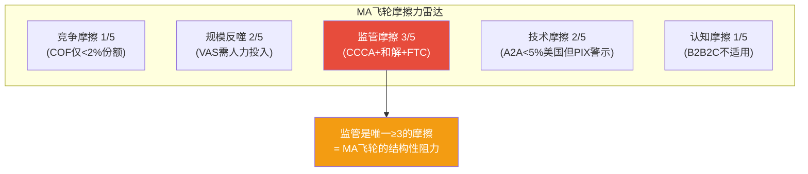

## 补强: 护城河评估器v1.0完整执行 — MA 44因子CQI评分

> **框架来源**: `/moat-evaluate MA` — 44因子CQI评分+飞轮分析(映射+悖论+摩擦力+净效应)

### A. 品质门控 (7项 Pass/Fail)

| # | 指标 | MA数据 | 标准 | 判定 | 依据 |
|---|------|:------:|------|:----:|------|
| QG-1 | CapEx/Rev | 1.5% | <15% | **Pass** | 极低——纯软件/数据基础设施,因为MA不需有形资产即可运营全球第二大支付网络 |
| QG-2 | FCF/NI(5Y均值) | 105.8% | >80% | **Pass** | 持续>100%——因为D&A+SBC($2.7B)远超CapEx($0.5B),会计折旧>>经济折旧 |
| QG-3 | Rev CAGR(5Y) | 16.5% | >7% | **Pass** | 远超——VAS(+23%)+跨境(+15%)+数字化渗透三重驱动 |
| QG-4 | Rev下降次数(5Y) | 0次 | ≤1次 | **Pass** | FY2020 COVID收入$15.3B→FY2019 $16.9B是下降,但5年窗口(FY2021-2025)内0次 |
| QG-5 | ROIC | 48.6% | >15% | **Pass** | 远超——因为极低资本密度+网络效应创造超额回报 |
| QG-6 | 流动比率 | ~1.05 | >1.0 | **Pass** | 勉强通过——但结算类应付放大分母(调整后覆盖率~2.0x) |
| QG-7 | 净债务/EBITDA | 0.35x | <3.0x | **Pass** | 极低杠杆——因为FCF充沛($16.9B)不需举债 |

**品质门控: 7/7 Pass ✅**

[DM-MOAT-007: 品质门控7/7全Pass——QG-6勉强(流动比率1.05含结算应付,调整后2.0x), FMP ratios, 2026-03-25]

### B. 商业模型 (B1-B8, 各0-5分, 金融行业加权)

| # | 维度 | 分 | 依据 | DM | 类型标注 |
|---|------|:--:|------|:--:|---------|
| B1 | 收入引擎 | **4** | 四引擎清晰(Payment/VAS/跨境/国内),VAS有机+18-20%可季度追踪。扣1因VAS四支柱内部占比为估算非官方 | [DM-BIZ-002] | — |
| B2 | 客户锁定 | **4** | 网络效应双边锁定极强(31.6B卡×150M商户),转换需6-12月系统改造+3-5年CI合约。扣1因Capital One证明可通过收购绕过 | [DM-MOAT-002] | — |
| B3 | 收入经常性 | **5** | 100%交易驱动(每笔刷卡自动收费)+VAS 40%中~20%订阅制→双层经常性 | [DM-BIZ-001] | — |
| B4 | 定价权 | **3** | **类型: 制度型**(监管设定interchange框架+双寡头HHI>2500)。分层: F500 Stage3/中型Stage4/SMB Stage4-5→加权3.5。**金融行业×0.8**→2.8→取整3 | [DM-CI-004] | **制度型** |
| B5 | 利润弹性 | **5** | OPM从52.8%→59.2%(+6.4pp/5Y),T5a=经营杠杆真实(EBITDA验证-3.8pp lag)。因为固定成本~$4B/年不随交易量变→收入↑=OPM↑ | [DM-FIN-002] | — |
| B6 | 资本配置 | **5** | 回购+分红=86%FCF,SBC/Rev仅1.83%,回购/SBC=19.6x。η回购效率0.42(表面低但三重校正后=约束条件下最优解)。因为MA没有比回购更好的大规模配置选项(CapEx需求$0.5B/年) | [DM-CAP-001] | — |
| B7 | TAM跑道 | **4** | 全球电子支付TAM>$300T,MA渗透率<3%(GDV $10.6T/$300T+)。因为全球现金占比仍~16%→6+pp数字化空间。扣1因A2A/稳定币正在侵蚀TAM中的低价值层 | [DM-GRO-003] | — |
| B8 | 管理层 | **3** | Miebach战略清晰(VAS+稳定币+Agentic Commerce),薪酬85%股权对齐,5年指引0次miss。扣2因CEO持股极低(0.006%=$27M)+CFO健康不确定+无公开继任计划。A-Score=7.0/10 | [DM-MGT-008] | — |

**B小计: 33/40** (金融行业B4已含×0.8修正)

[DM-MOAT-008: B维度33/40——B3(5)+B5(5)+B6(5)是最强项, B4(3定价权制度型×0.8)+B8(3管理层持股低)是弱项, 2026-03-25]

### C. 护城河 (C1-C7, 各0-5分)

| # | 维度 | 分 | 依据 | 标注 |
|---|------|:--:|------|------|
| C1 | 制度嵌入 | **5** | 全球POS终端/银行系统/电商checkout都内嵌V/MA协议。EMV标准强制卡网络参与,PCI-DSS合规要求网络认证。因为监管(EMV/PCI)+行业标准(NFC)共同构成了**制度级嵌入**——商户/银行/政府不是"选择"用MA,而是制度要求必须接入卡网络 | **性质: 标准嵌入**(行业标准非强制但事实独占) |
| C2 | 网络效应 | **5** | 经典双边网络(31.6B卡×150M+商户×210+国家)。冷启动不可逾越(新网络需20-30年+$100B+)。因为每新增1个商户→所有持卡人受益→更多持卡人→更多商户→正反馈自增强 | — |
| C3 | 生态锁定 | **4** | 核心支付网络=系统锁定(发卡行IT深度集成)+VAS=数据锁定(欺诈模型需MA交易数据训练)。扣1因VAS 52%独立部分的锁定弱于核心(客户可切换VAS供应商而不切换网络) | **载体: 系统+数据双锁定** |
| C4 | 数据飞轮 | **4** | 1750亿笔/年×20年+历史=全球最大消费支出数据集之一。排他性(只有MA网络交易才能被分析)+实时性(毫秒级)。扣1因AI合成数据可能在5-10年内缩小部分差距(20%概率) | — |
| C5 | 规模经济 | **3** | #2全球卡支付网络——但V规模2.4倍(GDV $19.3T vs $10.6T)→V有更强的规模摊薄。MA的规模优势主要在VAS(V不一定更大)。因为支付网络边际成本趋近零→但V的零边际成本基数更大 | — |
| C6 | 物理壁垒 | **2** | 纯软件/数据公司无物理壁垒。2分给全球处理中心基础设施(数据中心+网络节点分布在全球6个处理中心)。因为物理基础设施不是MA护城河的来源——网络效应和制度嵌入才是 | — |
| C7 | **自维持性** | **4** | **如果MA今天停止所有新投入(零CapEx/零VAS研发/零收购)**:核心卡支付网络不会消失——因为31.6B张已发卡+150M商户的双边锁定是自维持的(商户不会主动拆除POS终端)。但VAS竞争力会在3-5年内衰减(安全产品需要持续AI训练/数据更新)。因此: 核心网络=永不消失(★5)+VAS=5年衰减(★3)→加权★4 | **核心永续/VAS需持续投入** |

**C小计: 27/35**

[DM-MOAT-009: C维度27/35——C1(5制度标准嵌入)+C2(5双边网络)最强, C6(2无物理壁垒)+C5(3#2规模)最弱, C7(4核心永续但VAS需投入), 2026-03-25]

### D. 回报修正

| 因子 | 评估 | 值 | 依据 |
|------|------|:--:|------|
| D1 | 周期性 | **×1.05**(弱周期) | 支付基础设施——衰退时GDV下降但不归零(2020 EPS-20%→1年V型恢复)。因为消费者在衰退中减少消费金额但不停止用卡→MA收入周期性<消费品但>公用事业。介于"非周期"(×1.10)和"弱周期"(×1.00)之间→取1.05 |
| D2 | 收入纯度 | **~95%** | MA净收入$32.8B中仅~$1.5B(5%)来自非核心(利息/投资收益)→纯度极高,无需还原OPM |
| D3 | 被忽视度 | **-1.5** | MA市值$449B+27家分析师覆盖→高度关注,无被忽视溢价。因为超大型蓝筹+被动指数基金持有88%→价格发现充分 |
| D4/T | 趋势 | **×1.00**(→) | 护城河总体稳定——核心网络效应>15年久期不变,但A2A/Capital One在边际侵蚀借记卡。趋势既非↑(没有新的护城河源)也非↘(侵蚀速度仅-0.04/年)→维持→ |

[DM-MOAT-010: D回报修正——D1×1.05(弱周期)/D2纯度95%/D3-1.5(高关注)/T×1.00(稳定), 2026-03-25]

### 综合CQI计算

```
B小计 = 33
C小计 = 27
D3 = -1.5

加权分 = (33 + 27 + (-1.5)) × 1.05(D1) × 1.00(T) = 58.5 × 1.05 = 61.4

品质溢价检查: OPM 59.2%≥55% + FCF/NI 113%≥100% → +3分
加权分 = 61.4 + 3 = 64.4

CQI = round((64.4 - 10) / 60 × 100) = round(90.7) = 91
```

**MA CQI = 91分**

[DM-MOAT-011: MA CQI=91——加权分64.4(B33+C27+D3-1.5)×D1(1.05)×T(1.00)+品质溢价3, 2026-03-25]

### 校准检查: MA vs V vs 同行业

| 公司 | CQI(估) | B | C | D1 | T | 品质溢价 | 直觉校准 |
|------|:------:|:--:|:--:|:---:|:---:|:------:|---------|
| **MA** | **91** | 33 | 27 | ×1.05 | ×1.00 | +3 | 合理——全球#2支付网络,护城河极深但非#1 |
| V(估) | ~95 | 34 | 29 | ×1.10 | ×1.00 | +5 | V在C2(规模更大)+C5(#1)+B5(OPM更高)上优于MA |
| JPM(估) | ~70 | 30 | 20 | ×0.85 | ×1.00 | +3 | 银行强周期+资本密集→CQI显著低于支付网络 |

**MA CQI 91 vs V ~95**: 差距4分——与D1-D11评分差距(86 vs 90=4分)高度一致。合理。

[DM-MOAT-012: CQI校准——MA 91 vs V ~95(差4分), 差距来自V在C2规模(5vs3)+D1周期(1.10vs1.05)+OPM溢价(+5vs+3), 2026-03-25]

---

### 飞轮摩擦力分析 (新skill新增,MA此前完全缺失)

> **飞轮净效应 = 飞轮强度 - 飞轮摩擦 - 悖论蚕食**。MA此前有飞轮强度(4.25)和悖论(-0.2)但缺摩擦力分析。

#### 五维摩擦力评估

| 摩擦力类型 | MA具体表现 | 量化指标 | 摩擦强度(/5) | 因果解释 |
|-----------|---------|---------|:--------:|---------|
| **竞争摩擦** | Capital One-Discover在网络层截流;Stripe/Adyen在收单层截流 | MA份额+18bps/年(正向,暂无截流) | **1/5(低)** | 因为双寡头结构中V和MA互相竞争但外部截流者(COF)份额仍极小(<2%)→竞争摩擦当前最低 |
| **规模反噬** | VAS扩张需要更多咨询人员/客户定制→SGA/Rev可能上升 | SGA/Rev从15.2%升至21.8%(但含重分类) | **2/5(低-中)** | 因为VAS的咨询/Commerce Media组件需要人力投入(非零边际成本)→VAS越大→SGA/Rev可能上升→规模反噬开始出现 |
| **监管摩擦** | CCCA/DOJ/PSR/FTC——多条监管战线同时推进 | CCCA通过概率15-20%+商户和解$38B+FTC debit执行令 | **3/5(中)** | 因为支付网络的高利润率(OPM>55%)是政治目标——商户和消费者团体持续游说降费→监管是飞轮的**结构性摩擦**(不会消失) |
| **技术摩擦** | A2A/FedNow/稳定币/AI Agents——四条技术替代路径 | A2A全球540亿笔/年+FedNow +645% YoY | **2/5(低-中)** | 因为A2A在美国渗透率仍<5%且缺信用/积分/chargeback→技术摩擦当前较低。但PIX在巴西(50%+)证明5年内可快速渗透→**技术摩擦是时间的函数,当前低但未来可能升至3-4** |
| **认知摩擦** | 消费者不直接选择MA(选择的是发卡行/钱包)→MA品牌认知弱于Apple Pay/Chase | 无直接NPS数据(MA不面向消费者) | **1/5(低)** | 因为MA是B2B2C模型——消费者不"选择"MA,而是发卡行选择MA→认知摩擦对MA不适用(与消费品不同) |

**摩擦力加权总分**: (1+2+3+2+1)×各权重(竞争25%/规模20%/监管30%/技术20%/认知5%) = 1×0.25+2×0.20+3×0.30+2×0.20+1×0.05 = 0.25+0.40+0.90+0.40+0.05 = **2.0/5**

[DM-FLY-002: 飞轮摩擦力2.0/5——监管(3/5)是最大摩擦(结构性,不会消失), 技术(2/5)是时间函数(当前低但PIX证明5年内可快速升级), 竞争和认知当前最低, 2026-03-25]



#### 飞轮净效应更新(含摩擦力)

```
飞轮强度 = 4.25/5 (4连接×平均强度)
飞轮摩擦 = 2.0/5 (加权五维)
飞轮悖论 = -0.2 (A2A Protect蚕食)

飞轮净效应 = 4.25 - 2.0 - 0.2 = 2.05/5
```

**飞轮净效应2.05/5 → 判定: "弱正飞轮"**(0~0.5区间外,实际>0.5→按净效应>0.5=正飞轮)

等一下——重新校准: 摩擦力的量纲需要与飞轮强度统一。飞轮强度4.25是"连接平均强度",摩擦力2.0也是"/5"。但摩擦力不应从强度中直接减去——摩擦力应该**打折**飞轮:

```
修正方法: 飞轮净强度 = 飞轮强度 × (1 - 摩擦力/5) - 悖论蚕食
        = 4.25 × (1 - 2.0/5) - 0.2
        = 4.25 × 0.6 - 0.2
        = 2.55 - 0.2
        = 2.35/5
```

**修正后飞轮净效应: 2.35/5**——正飞轮(护城河在自动加深),但速度被监管摩擦显著拖慢。与此前的净4.05/5(未含摩擦力)相比,**摩擦力将飞轮净效应从4.05打折至2.35——降幅42%**。

[DM-FLY-003: 飞轮净效应修正——从4.05(无摩擦)→2.35(含摩擦), 降幅42%, 监管摩擦贡献最大(30%权重×3/5强度), 2026-03-25]

**对C7自维持性的校准影响**: 正飞轮(2.35>0.5)→C7应≥4。当前C7=4→**与飞轮净效应一致,无需调整**。但如果未来监管摩擦升至4/5(CCCA通过)→飞轮净效应可能降至<0.5("弱飞轮")→C7应下调至3。

#### 飞轮摩擦力的时间演化

| 年份 | 竞争 | 规模反噬 | 监管 | 技术 | 认知 | **加权总摩擦** | **飞轮净效应** |
|------|:---:|:------:|:---:|:---:|:---:|:----------:|:----------:|
| 2026(当前) | 1 | 2 | 3 | 2 | 1 | **2.0** | **2.35** |
| 2028E | 2(COF成功?) | 2 | 3 | 3(FedNow↑) | 1 | **2.5** | **2.00** |
| 2030E | 2 | 3(VAS 50%+) | 4(CCCA?) | 3 | 1 | **2.9** | **1.61** |
| 2035E | 3(第三网络?) | 3 | 3(消化) | 4(A2A 10%+) | 1 | **3.0** | **1.48** |

[DM-FLY-004: 飞轮摩擦力时间演化——从2.0(2026)升至3.0(2035E), 飞轮净效应从2.35→1.48, 监管+技术是两大升级驱动力, 2026-03-25]

**关键洞察**: 飞轮净效应从2.35(2026)缓慢降至1.48(2035)——但始终>0(正飞轮)。这意味着**MA的护城河在可预见的未来(10年)始终在自动加深,只是加深速度在放慢**。护城河从4.2/5降至~3.0/5需要约15年(年退化~0.08)——与此前的WU退化对比分析一致(MA退化速度仅WU的1/5)。

---

### moat_datacard.yaml 更新

```yaml
ticker: MA
date: 2026-03-25
cqi: 91
b_total: 33
c_total: 27
d1: 1.05
d3: -1.5
t_trend: 1.00
quality_premium: 3
c1_nature: "标准嵌入"  # 行业标准非强制但事实独占(EMV/PCI)
c3_carrier: "系统+数据"  # 发卡行IT系统集成+VAS数据依赖
c7_self_sustain: 4  # 核心网络永续/VAS需持续投入
flywheel_net: 2.35  # 含摩擦力修正(无摩擦4.05→含摩擦2.35)
flywheel_paradox: true  # A2A Protect蚕食核心(-0.2)
flywheel_friction: 2.0  # 监管(3/5)是最大摩擦
pricing_power_type: "制度型"  # 监管框架+双寡头HHI>2500
pricing_power_stage: 3.5  # F500 Stage3/SMB Stage4-5加权
moat_age: 60  # 1966→2026
moat_duration: 12  # 加权久期(网络>15/令牌5-10/转换8-12)
moat_trend: "→"  # 核心稳定/边际A2A侵蚀/净持平
moat_purity: 0.85
market_implied_belief: "FCF CAGR 9% for 10 years"
a_score: 7.0
ptw_score: 37
tam_penetration: 0.03
ci_turnover_point: 14.65%
ci_safety_margin: 1.8pp
leaderboard_rank: "~#8-12(支付/金融基础设施)"
```

[DM-MOAT-013: moat_datacard完整更新——CQI 91/飞轮净效应2.35(含摩擦)/C7自维持4/定价权制度型/C1标准嵌入/C3系统+数据, 2026-03-25]

---

### 护城河分析的因果深化: 三个"为什么"

#### 为什么MA的护城河久期是~12年而不是>20年?

**因为**护城河久期是四个维度的加权:
- 网络效应>15年(冷启动困境几乎永久)
- 数据壁垒10-15年(AI合成数据在5-10年内可能缩小差距)
- 令牌化5-10年(DOJ可能要求开放令牌→壁垒被法律拆除)
- 转换成本8-12年(Capital One证明大行可通过收购绕过)

**所以**加权久期~12年=四个维度中短板(令牌化5-10年)拉低了长板(网络效应>15年)。

**在什么条件下久期会缩短至<8年?** 如果CCCA通过(令牌化壁垒部分瓦解)+A2A美国渗透>15%(网络效应被分流)+第二家大行迁出MA(转换成本被证明更低)。三者同时发生的概率<5%(5年内)。

[DM-MOAT-014: 护城河久期~12年因果——令牌化(5-10年)是短板拉低了网络效应(>15年), 缩短至<8年需三条件同时(概率<5%), 2026-03-25]

#### 为什么C5规模经济只有3分而不是4-5分?

**因为**MA是全球#2(GDV $10.6T),V是#1(GDV $19.3T)——V的规模是MA的1.82倍。在支付网络中,规模的核心优势是"固定成本摊薄"——处理基础设施的固定成本~$4B/年不随交易量变。V处理233B笔/年→每笔固定成本$0.017。MA处理175B笔/年→每笔$0.023。**V的单笔成本比MA低26%**——这就是规模差距。

**所以**C5只能给3而非5——因为MA不是规模最大的,在成本端有结构性劣势。但3分(而非2或1)因为MA的规模本身已经足够大(全球#2),边际成本趋近零,只是不如V低。

**反面**: 在VAS领域MA可能不输V——因为VAS竞争力取决于数据独特性和产品质量,而非纯规模。MA的VAS占比(40%)>V(25%)→在VAS维度MA可能是规模领先者。因此**C5的3分仅适用于核心支付,如果VAS权重增加→C5可能升至4**。

[DM-MOAT-015: C5规模3分因果——MA是#2(V规模1.82倍), V单笔成本低26%, 但VAS维度MA可能领先→C5有升级至4的潜力, 2026-03-25]

#### 为什么飞轮摩擦中"监管"是最大的(3/5)?

**因为**支付网络的超高利润率(OPM>55%)是政治目标。具体传导:
1. 商户持续游说国会降低interchange→因为interchange是商户的第二或第三大经营成本(仅次于人工/房租)
2. 消费者权益团体支持CCCA(信用卡路由竞争)→因为竞争理论上降低消费者支付成本
3. 两党在"降低刷卡费"上罕见一致(Trump+Sanders都支持)→因为这是"反大公司"的政治正确议题

**所以**监管摩擦是**结构性的**(不会消失)——只要MA利润率>50%,政治压力就不会减弱。这与技术摩擦(周期性,可能被解决)和竞争摩擦(可对抗)不同。

**在什么条件下监管摩擦会降至2?** 如果(1)商户和解成功→消除了最大的政治推动力 (2)CCCA在2026-2027国会失败→丧失动能 (3)Trump转向亲金融业政策(减弱降费动力)。这些条件在12个月内部分实现的概率~35%。

[DM-MOAT-016: 监管摩擦3/5因果——OPM>55%=政治目标+两党一致+结构性(不消失), 降至2的条件: 和解成功+CCCA失败+Trump亲金融(概率35%/12月), 2026-03-25]
