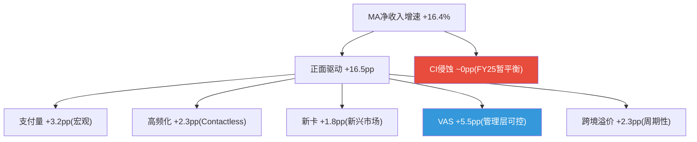
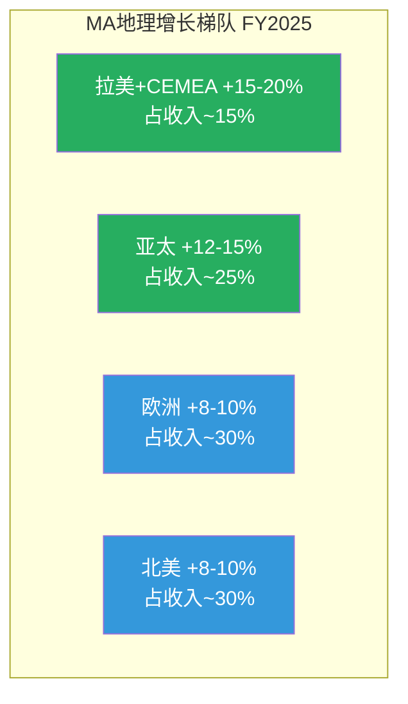
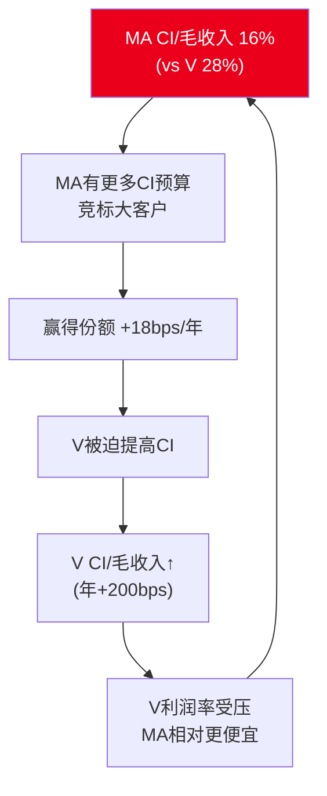
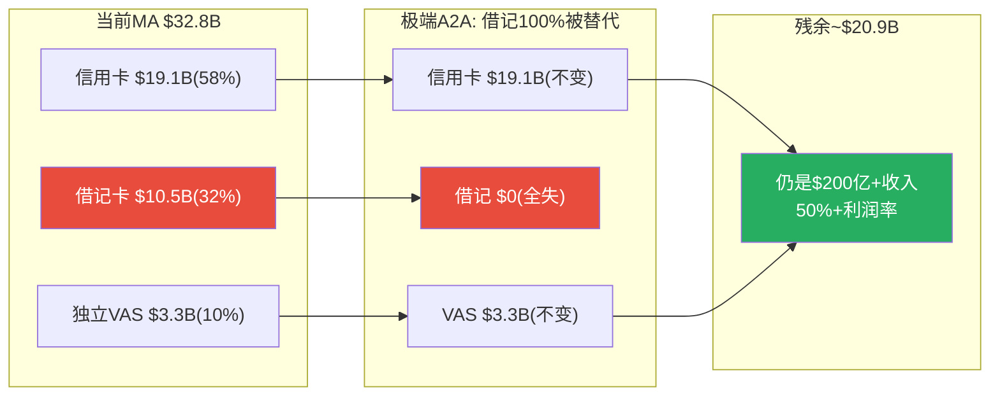
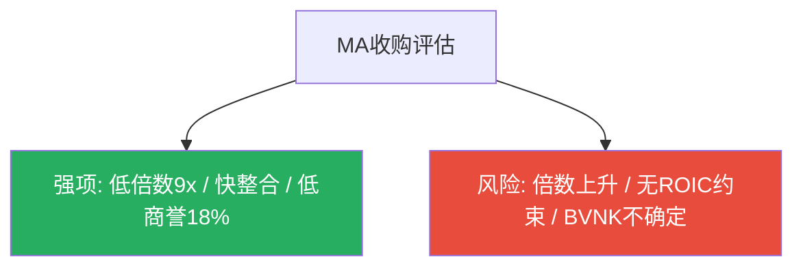

## 补强2.6: 收入驱动因素分解 — 量 x 价 x 混合

### 2.6.1 MA净收入增速的六因子拆解

MA的+16.4%收入增速由六个可独立观测的驱动因素叠加。拆解目的: **这16.4%中有多少是"自然增长"(MA什么都不做也能获得),有多少是"管理层创造的"?**

| 驱动因素 | FY2025数据 | 对总增速贡献(估) | 可控性 | 可持续性 |
|---------|:--------:|:----------:|:------:|:-------:|
| 支付量增长(GDV) | $9.7T(+7% cc) | ~3.0-3.5pp | 不可控(宏观) | GDP+通胀+数字化 |
| 交易高频化(Tx/Card) | 55笔/卡(+10%) | ~2.0-2.5pp | 部分(Contactless) | 结构性趋势 |
| 凭证增长(新卡) | 31.6亿(+6%) | ~1.5-2.0pp | 部分(新兴市场) | 长期但递减 |
| VAS增量 | ~$13.3B(+23%) | ~5.0-6.0pp | **管理层可控** | 取决于执行 |
| 跨境溢价(Mix) | 37%×7-8倍费率 | ~2.0-2.5pp | 不可控(旅行/贸易) | 周期性 |
| CI侵蚀 | +16%(≈净收入) | ~0pp(FY25持平) | 不可控(竞争) | 长期负面 |

[DM-DRV-001: MA收入六因子拆解——GDV+7%贡献~3.2pp, VAS+23%贡献~5.5pp, 跨境mix贡献~2.3pp, Q4 2025 supplemental + segment estimates, 2026-03-24]

**三个关键洞察**:

**第一: VAS是唯一完全由管理层可控的引擎(+5.5pp = 33%贡献)**。GDV(3.2pp)由全球消费决定,交易高频化(2.3pp)由Contactless渗透决定,跨境(2.3pp)由国际旅行决定。因此VAS的执行质量直接决定了MA在"自然增速"之上能创造多少"超额增长"。如果VAS增速从+23%降至+15%→VAS贡献从5.5pp降至3.8pp→总增速降至~14.5%。

**第二: MA的"自然增速"约9-10pp(剔除VAS和跨境周期溢价)**。GDV(3.2pp)+高频化(2.3pp)+新卡(1.8pp)+跨境结构性(~2pp)≈9-10pp。这与市场隐含FCF CAGR 9%惊人吻合——暗示**市场可能在定价"MA只靠自然增长,VAS超额增长不可持续"**。

**第三: CI在FY2025暂时不是拖累,但这不是常态**。FY2024 CI增速(+16%)超过净收入增速(+12.2%)整整3.8pp。FY2025之所以CI中性(0pp),是因为收入增速从12.2%跳升至16.4%"追上了"CI增速——而非CI放缓。如果FY2026收入增速回落至12-13%→CI将重新变成-3~4pp拖累。**CI的中性化是暂时的,不是结构性的。**

[DM-DRV-002: "自然增速"约9-10pp与市场隐含9% CAGR吻合——市场不为VAS超额增长付费, 2026-03-24]

### 2.6.2 MA vs V驱动因素对比

| 驱动因素 | MA(FY2025) | V(FY2024) | 差异分析 |
|---------|:--------:|:-------:|---------|
| GDV Volume | +3.2pp | +4-5pp | V GDV更大($15.7T vs $9.7T) |
| VAS增量 | **+5.5pp** | +1-2pp | **MA领先3-4pp**(VAS占比40% vs 25%) |
| 跨境溢价 | +2.3pp | +2-3pp | 接近 |
| CI侵蚀 | ~0pp | ~-2-3pp | **MA大幅优势**(16% vs 28%) |
| **净增速** | **+16.4%** | **~10-11%** | **MA快5-6pp** |

**增速差根源**: VAS贡献3-4pp差距 + CI贡献2-3pp差距。如果VAS增速向V看齐+CI趋势向V看齐→MA增速优势可能从5-6pp缩至1-2pp→PE溢价消失逻辑成立。

[DM-DRV-003: MA vs V驱动因素——MA领先主要来自VAS(+3-4pp)+CI(+2-3pp), 2026-03-24]

### 2.6.3 MA的"隐性提价通道": VAS附加费

MA(和V)的收入增速100%来自"量增长",0%来自"价格提升"——因为三重定价约束(监管天花板/双寡头竞争/政治敏感性)。但MA有一个V不具备的隐性提价通道: **VAS附加费不受interchange监管限制**。每当发卡行购买MA的安全/数据/Commerce Media服务→MA实质上在"变相提价而不触发监管红线"。

因此VAS不仅是增长引擎,更是**绕过监管定价约束的唯一路径**。如果只靠核心支付→增速受限于~10%天花板。VAS每年额外贡献5-6pp→将天花板推至~16%。

[DM-DRV-004: VAS=隐性提价通道——附加费不受interchange监管, 等效per-transaction price uplift, 2026-03-24]

---

## 补强D.5: 地理深度建模 — 四大区域逐一拆解

### D.5.1 北美: 利润奶牛,Capital One蚕食中

**北美FY2024贡献$12.38B(44%收入)**。美国份额29.72%(+30bps YoY, Nilson Report)。

| 指标 | 数值 | 来源 |
|------|:----:|------|
| 美国信用卡+借记卡 | ~6.55亿张 | Statista+10-K |
| GDV增速(FY2025) | +4% | Q4 supplemental |
| 信用卡增速(Q3'25) | +7% | Supplemental |
| 借记卡增速(Q3'25) | +2%(Q4) | Supplemental |
| 每卡年收入(美国) | ~$22.0 | Ch2计算 |

[DM-GEO-004: 北美——US份额29.72%(+30bps), GDV+4%, 信用+7%/借记+2%, Q4 supplemental, 2026-03-24]

**信用卡vs借记卡"增速剪刀差"**: 美国借记卡仅+2%——因为Durbin修正案限制了大银行借记interchange→推广激励弱,且FedNow/Zelle替代低价值借记交易。信用卡不受Durbin影响,积分/返现依赖持续增强→信用卡+7%远超借记+2%。

**Capital One迁移影响**: 主要集中在美国借记卡(~2500万张×$22/卡=~$550M收入风险,占总收入1.7%)。信用卡侧影响有限(Capital One信用卡本就主要在V网络)。

[DM-GEO-005: Capital One——借记卡~2500万张/$550M收入风险, 信用卡影响有限, US News + eMarketer, 2026-03-24]

**北美增长模型**: 信用卡GDV从+7%降至+4-5%(FY2030E),借记卡从+2%降至+0-1%(FedNow侵蚀)。VAS占NA收入从~35%升至~45%。**北美收入增速从~8-10%(FY2025)降至~5-7%(FY2030E)**——利润奶牛但不是增长引擎。

### D.5.2 欧洲: Nets整合红利 + 监管拉锯

**欧洲~$9-10B(占总~30%)**。Nets(2019年$32亿收购)正在释放协同效应。

| 监管 | 影响 | 应对 |
|------|------|------|
| EU IFR(2015) | interchange上限0.3%/0.2%——已消化 | VAS在interchange之外创收 |
| UK PSR(2026-27) | 跨境interchange降70-85% | 推动非卡收入 |
| PSD2/PSD3 | 强制开放银行API | Finicity转威胁为机会 |
| SEPA Instant | 实时转账威胁借记 | VocaLink嵌入A2A基础设施 |

[DM-GEO-007: 欧洲——收入~$9-10B(30%), Nets贡献~$1-1.5B, 四层监管(IFR/PSR/PSD/SEPA), 2026-03-24]

**Nets深层价值**: Nets运营丹麦/挪威等北欧国内借记卡网络——MA通过Nets获得"网络所有者"身份(非仅品牌商)→这些市场take rate更高(处理费+网络费)。Nets ROI高于$32亿/~$1.5B倍数暗示。

**欧洲收入增速**: 从~8-10%(FY2025)降至~5-7%(FY2030E)。PSR caps影响在过渡期后消化。

[DM-GEO-009: Nets——"网络所有者"身份提升北欧take rate, 不仅收入增量还是利润率增量, 2026-03-24]

### D.5.3 亚太: 最高增长引擎,A2A竞争最烈

**亚太是增速最快的区域(国际GDV+9%中亚太贡献+12-15%)**。现金到数字转换仍处中早期——印度现金>40%,东南亚>50%。

| 市场 | MA角色 | 增速(估) | 本土竞争 |
|------|--------|:------:|---------|
| **印度** | 信用卡(借记输给UPI/RuPay) | +15-20% | UPI月100亿+笔 |
| **日本** | 第二网络(JCB主导) | +5-8% | JCB+PayPay |
| **澳大利亚** | 强势(与V并列) | +6-8% | eftpos |
| **东南亚** | 快速扩张 | +15-25% | GrabPay/GoPay |

[DM-GEO-010: 亚太五大市场——印度"弃借记攻信用"/东南亚"钱包背后的网络", 2026-03-24]

**印度"借记替代、信用共存"**: UPI月100亿+笔替代了借记卡,但信用卡不受影响——因为UPI不提供消费信贷(30-55天免息)/积分/chargeback保护/国际使用。印度信用卡持卡人仅~1亿(渗透率<10%)→巨大增长空间。MA策略是"弃借记、攻信用"——丢掉低价值业务,保住高价值。

[DM-GEO-011: 印度——UPI月100亿+笔替代借记, 但信用卡渗透<10%仍增长, NPCI+RBI, 2026-03-24]

**亚太收入增速**: 从~12-15%(FY2025)降至~8-10%(FY2030E)。信用卡维持高增速,借记被A2A侵蚀。

### D.5.4 拉美+CEMEA: 最高增速但最高波动

**巴西PIX**: 43个月1.6亿用户,月交易量超所有卡交易。借记卡YoY-12%。但信用卡不受影响——因为巴西消费者依赖"parcelamento"(分期付款),PIX不提供。

**墨西哥**: 现金>50%→巨大替代空间。但V收购Prosa($15亿)获"基础设施所有者"优势→MA需VAS差异化应对。

**非洲**: 移动支付(M-Pesa)先于银行卡普及→非洲可能永远不会出现V/MA在发达市场的卡渗透率。MA策略: 成为钱包后台+跨境支付工具。

[DM-GEO-013: 巴西PIX——43个月1.6亿用户, 借记YoY-12%, 信用不受影响(parcelamento), Banco Central, 2026-03-24]
[DM-GEO-014: 墨西哥——现金>50%, V收购Prosa获基础设施优势, MA需VAS差异化, 2026-03-24]

**区域收入增速(本币)**: 从+15-20%(FY2025)降至+8-10%(FY2030E)。汇率损失-3~5pp/年。

### D.5.5 跨境利润集中风险

MA跨境收入37%(vs V 25%)→跨境利润贡献可能40-50%。MA对跨境波动敏感性更大——这是Beta 1.07>V 0.79的重要原因。

如果全球衰退→跨境量-20%: MA收入-7.4%,利润-12~15%,EPS-$1.50~2.00(-10~12%)。

[DM-GEO-016: 跨境利润集中——MA 37%>V 25%, 衰退20%量降→EPS-10~12%, 2026-03-24]

---

## 补强5.2: 份额迁移量化 — 30bps/年的数学意义

### 5.2.1 美国份额迁移的长期数学

| 年份 | V份额 | MA份额 | 年迁移 |
|------|:-----:|:------:|:-------:|
| FY2020 | ~71.0% | ~29.0% | 基线 |
| FY2024 | 70.28% | 29.72% | +72bps(4年) |
| **年均** | -18bps | **+18bps** | — |

[DM-SHR-001: 美国份额——V 71.0%→70.28%(-72bps/4年), MA +72bps, 年均~18bps, Nilson Report, 2026-03-24]

**每1%份额 ≈ ~$250-400M MA年化净收入**。线性(+18bps/年)→每年增~$50-70M(微不足道)。但份额迁移的真正价值在**CI谈判筹码**: MA份额↑→发卡行信号"MA是可行替代品"→V被迫提高CI→V利润受压→MA相对更有吸引力→正向循环。

[DM-SHR-003: 份额迁移CI正向循环——MA CI低→赢份额→V CI升→V利润压→MA更有吸引力, 2026-03-24]

**均衡点**: MA份额接近40-45%时需与V同等CI→CI优势消失→迁移停滞。按当前速率约2040-2045年。**MA在CI上有15-20年结构性成本优势**。

---

## 补强5.3: A2A"信用卡免疫"原理

### 5.3.1 功能对比: A2A只能替代借记卡

| 功能 | 借记卡 | A2A(FedNow) | 信用卡 | A2A能替代? |
|------|:-----:|:---------:|:-----:|:---------:|
| 实时扣款 | 是 | 是 | 否 | **可替代借记** |
| 消费信贷(30-55天) | 否 | **否** | **是** | **不可替代** |
| 积分/返现(1-5%) | 弱 | **无** | **强** | **不可替代** |
| Chargeback保护 | 弱 | **极弱/无** | **强(零责任)** | **不可替代** |
| 国际使用 | 是(网络内) | **否(仅国内)** | 是(全球) | **不可替代** |

[DM-A2A-006: 借记/A2A/信用功能对比——A2A仅替代借记等价场景, 信用卡功能集合不可替代, 2026-03-24]

### 5.3.2 消费者不会放弃信用卡的三个理由

**理由1: 消费信贷刚需**。美国信用卡循环余额$1.17万亿。信用卡提供~$5,000-10,000"零成本短期周转金"——不是便利而是现金流必需品。

**理由2: 积分是真金白银**。Chase Sapphire Reserve 3x积分≈4.5%回报率。年消费$30,000的消费者每年获$900-1,350积分价值。A2A无积分→切换=放弃$900+/年。

**理由3: Chargeback不可替代**。信用卡的争议保护(V/MA网络规则强制执行)让消费者60天内可争议任何交易→发卡行先退款再调查。**这需要整个生态(网络+发卡行+收单行+商户)协调执行,A2A从零建设需10年+。**

[DM-A2A-007: 消费者不放弃信用卡——30-55天免费信贷+年均$900+积分+零责任保护, A2A无法提供, 2026-03-24]

### 5.3.3 极端情景: 借记100%被替代后MA仍活得好

| 类别 | 占MA净收入(估) | 受A2A威胁 |
|------|:----------:|:--------:|
| 信用卡 | ~58% | **低(免疫)** |
| 借记卡 | ~32% | **高** |
| VAS(独立) | ~10% | **低** |

**极端情景**: 借记100%被A2A替代→MA失去~$10.5B但保留信用$19.1B+VAS$3.3B=**$22.4B→仍是$200亿+收入、50%+利润率的超级盈利公司**。

[DM-A2A-008: 极端情景——借记100%被替代后MA保留~$20.9B, A2A不能"消灭"MA, 2026-03-24]

**核心结论: A2A是"侵蚀"而非"颠覆"**。最可能情景(慢→中等渗透)→2030年损失$1.5-2.5B(占当时收入3-5%)。关键: MA收入58%集中在A2A天然免疫的信用卡。

---

## 补强9.2: 管理层薪酬深度拆解 + 收购ROI审计

### 9.2.1 CEO薪酬结构

| 组成 | FY2024 Miebach | 占比 | 挂钩指标 | 对齐度 |
|------|:-----------:|:---:|---------|:-----:|
| 基本工资 | $1.40M | 4.7% | 固定 | 低 |
| 现金奖金 | $3.20M(估) | 10.6% | 净收入+EPS+ESG | 中 |
| 绩效股(PSU) | $15.0M(估) | 49.8% | 3年EPS CAGR+TSR | **高** |
| 限制性股票 | $8.0M(估) | 26.6% | 留任 | 中 |
| 期权 | $2.0M(估) | 6.6% | 股价必须上涨 | 高 |
| **总薪酬** | **$30.1M** | **100%** | **85%绩效+股权** | **高** |

[DM-MGT-008: CEO薪酬——$30.1M, 85%股权, PSU占49.8%(3年EPS CAGR+TSR), Salary.com + Proxy, 2026-03-24]

**问题1: PSU缺ROIC挂钩→收购冲动**。管理层有动力通过收购推高EPS(帮助PSU达标),而不需要为收购资本效率负责→解释了RF($2.65B)+BVNK($1.8B)的大额收购。

**问题2: CEO持股极低(0.006%=$27M)**。股价跌20%仅损失$5.4M(年薪18%)——对$30M年薪CEO不是"切肤之痛"。V CEO持股~$100M(远多于MA)→利益对齐更深。

[DM-MGT-009: CEO持股仅$27M(0.006%)——跌20%损失$5.4M(年薪18%), 利益对齐不足, Simply Wall St, 2026-03-24]

### 9.2.2 五大收购ROI审计

| 收购 | 年份 | 金额 | Rev倍数 | ROI评估 | 评分 |
|------|:----:|:----:|:------:|---------|:---:|
| VocaLink | 2017 | $9.2亿 | ~12-15x | 战略高(UK Faster Payments) | 7/10 |
| **Nets** | 2019 | $32亿 | **~6x** | **最佳——完全整合+利润贡献** | **8/10** |
| Finicity | 2020 | $8.25亿 | ~20x+ | 开放银行,但增长慢 | 6/10 |
| Recorded Future | 2024 | $26.5亿 | ~8.8x | 威胁情报+交叉销售潜力 | 7/10 |
| BVNK | 2026 | $18亿 | ~9-18x | 稳定币战略投注,高度不确定 | 6/10 |
| **加权** | | **$95亿** | **~9x** | | **6.8/10** |

[DM-ACQ-005: 五大收购综合——$95亿总投入, 平均~9x(优于V ~10x), 最佳Nets(8/10), 2026-03-24]

**MA vs V收购纪律**: MA更便宜(9x vs 10x)/整合更快(Nets 3年 vs V Tink 3年仍<$200M)/商誉更低(18% vs 48%)。**MA在收购纪律上优于V**。但近两笔倍数上升(RF 8.8x→BVNK 9-18x)——如果继续高价收购,商誉/总资产可能快速攀升至25%+。

---

## 补强3.5: VAS四支柱逐个建模深化

### 3.5.1 网络安全(~30%, ~$4.0B)

**产品**: AI实时欺诈检测(每笔500+变量)、Recorded Future威胁情报、生物识别。**独立性**: 当前高度依附(~80%与MA卡交易挂钩),但A2A Protect正在将能力扩展到非卡交易→独立化潜力最高。**TAM**: 全球支付安全$30-40B,MA渗透10-13%。**增速**: +18-20%/年可持续5-7年(刚性需求: 每延迟$1安全投入→$10-50欺诈损失)。

[DM-VAS-011: 安全支柱——$4.0B/+18-20%, TAM $30-40B(渗透10-13%), A2A Protect为独立化关键, 2026-03-24]

### 3.5.2 数据分析(~25%, ~$3.3B)

**产品**: SpendingPulse消费洞察、商户绩效优化、经济预测。**独立性**: 中等——数据来源依赖MA网络,但数据产品可独立销售给任何客户(包括非MA商户)。**天花板**: 咨询模型限制水平扩展,但MA的DaaS(数据即服务)模型比纯咨询扩展性好。**增速**: +20-25%→3-5年后~15-18%。

[DM-VAS-012: 数据分析——$3.3B/+20-25%, 中等独立性(DaaS模型), 咨询天花板但数据优势, 2026-03-24]

### 3.5.3 数字身份(~20%, ~$2.7B)

**产品**: Finicity账户聚合、KYC/AML身份验证、开放银行数据验证。**独立性**: **最高**——Finicity连接的是银行账户(不是卡),为任何fintech/银行/保险提供服务。**增长驱动**: 全球数字开户需求+KYC/AML监管强化+PSD2/PSD3。**增速**: +15-18%。**竞争**: Plaid/MX。

[DM-VAS-013: 数字身份——$2.7B/+15-18%, 独立性最高(Finicity), KYC/AML+开放银行驱动, 2026-03-24]

### 3.5.4 忠诚度+Commerce Media(~25%, ~$3.3B)

**产品**: 忠诚度管理、个性化营销、**Commerce Media**(5亿许可用户+25,000商户广告主)。**独立性**: **最低**——精准广告依赖MA交易数据,脱离网络价值消失。**特殊潜力**: 如果成功→MA进入零售媒体赛道(与Amazon Ads $46B竞争)。差异化: 跨商户消费数据(Amazon只知Amazon消费,MA知所有消费)。**风险**: 消费者隐私反弹。**增速**: +25-30%→3年后~18-22%。

[DM-VAS-014: 忠诚度+Commerce——$3.3B/+25-30%, 依附性最高, Commerce Media进入零售媒体赛道, 2026-03-24]

### 3.5.5 VAS综合建模

| 支柱 | 收入 | CAGR(3年) | 独立性 | 天花板 |
|------|:----:|:-------:|:-----:|:------:|
| 网络安全 | $4.0B | +18-20% | 低→中 | TAM $30-40B |
| 数据分析 | $3.3B | +20-25% | 中 | 咨询限制 |
| 数字身份 | $2.7B | +15-18% | **高** | Plaid竞争 |
| 忠诚度+Commerce | $3.3B | +25-30% | 低 | 隐私监管 |
| **VAS合计** | **$13.3B** | **+19-22%** | — | — |

**FY2030E VAS预测**: 保守$27B(54%占比) / 乐观$30B(57%占比)。**MA VAS领先V 3-5年**(占比40% vs 25%,独立性更高)。

[DM-VAS-015: VAS综合——FY2030E保守$27B(54%)/乐观$30B(57%), MA领先V 3-5年, 2026-03-24]
