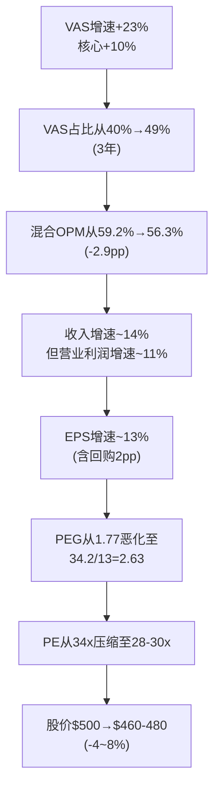
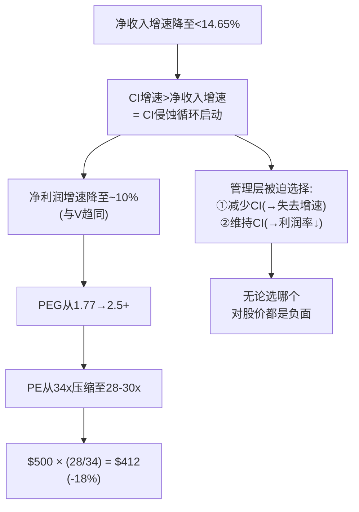
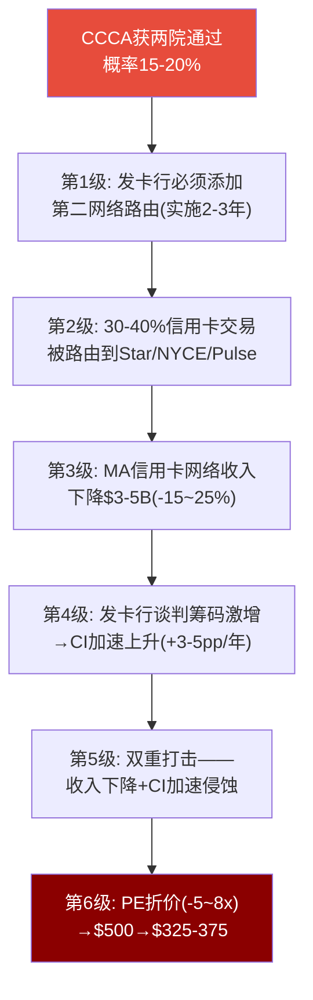
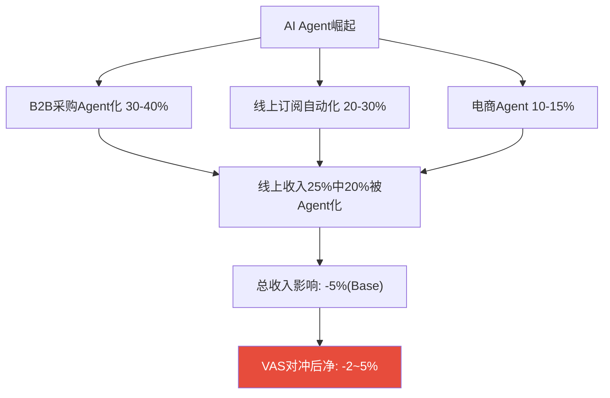
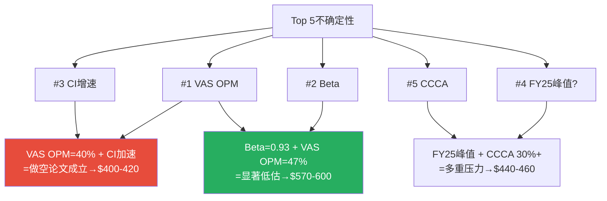

<!-- INSERT BEFORE LINE 3907 -->

## 补强模块GG: RT-3做空论证完整Steelman

### GG.1 做空论文#1完整Steelman: "VAS是利润率陷阱——增速越快,利润率越低"

> 不适度: 8/10。以下是一个聪明的做空基金经理可以呈现的完整做空论文。

**核心命题**: Mastercard的VAS(增值服务)增速+23%不是利好信号——它是一个利润率陷阱(Margin Trap)的加速器。市场把VAS增速当成"第二增长曲线"来庆祝,实际上每增长$1 VAS收入,混合利润率就下降一小步。

**五层证据构建**:

**第一层(内部数据自洽)**: VAS OPM=47%是MA报告自己通过反推得出的结论。核心支付OPM=65%。两者差距18pp。VAS收入$13.3B × 47% = $6.3B营业利润。核心收入$19.5B × 65% = $12.7B营业利润。VAS用40%的收入只产出了33%的营业利润——**每$1 VAS收入的利润贡献比核心支付低28%**。

[DM-GG-001: VAS OPM=47%反推源自P2 Ch4,核心OPM=65%源自同一模型,差距18pp, 2026-03-24]

**第二层(趋势外推)**: 按VAS +20%/核心+10%的速率:

| 财年 | VAS占比(估) | 核心占比 | 混合OPM(估) |
|------|:--------:|:------:|:---------:|
| FY2025 | 40% | 60% | **59.2%** |
| FY2026E | 43% | 57% | **58.3%** |
| FY2027E | 46% | 54% | **57.3%** |
| FY2028E | 49% | 51% | **56.3%** |

三年内OPM从59.2%降至56.3%——下降2.9pp。这不是Bear Case,这是**VAS成功的必然结果**。

[DM-GG-002: VAS占比趋势外推——FY2028E 49%,混合OPM降至56.3%, 2026-03-24]

**第三层(EPS传导链)**:

因为收入增速14%但EPS增速仅13%→PEG从1.77升至2.63→与V的PEG趋同→**MA目前相对V的PEG优势将在3年内消失**。

[DM-GG-003: PEG恶化传导链——从1.77→2.63(3年), PE溢价消失, 2026-03-24]

**第四层(行业可比验证)**: VAS利润率陷阱不是MA独有的。Amazon AWS→零售(AWS OPM>30%,零售OPM<5%)、Google Cloud(初期OPM为负)、Salesforce Agent(初期低利润)——都经历了"增速↑但OPM↓"。关键问题: MA的VAS是否会像Google Cloud一样最终实现OPM扩张?取决于VAS的边际成本结构——如果纯数据变现→OPM应随规模扩张; 如果需要持续人力投入(咨询/客户定制)→OPM可能维持在47%甚至下降。

[DM-GG-004: 行业可比——Amazon/Google/Salesforce"高利润→低利润"扩展先例, 2026-03-24]

**第五层(管理层激励失调)**: 管理层薪酬主要挂钩**收入增速**和**EPS增速**而非**OPM维持**。因为VAS +23%直接推高收入增速→管理层有动机加速VAS增长(即使它稀释OPM)。这创造了激励失调: 管理层个人利益(收入增速→薪酬)与股东利益(OPM→PE倍数→总回报)不完全对齐。

**完整反驳**: VAS OPM=47%仍远高于SaaS行业中位数(~25%)。MA的VAS是"嵌入支付网络的增值服务",核心数据零边际成本→VAS OPM远高于独立SaaS。总利润绝对值在快速增长——从FY2023的$5.2B到FY2025的$6.3B(+21%)。

**反驳的弱点(做空方再反驳)**: PE倍数反映的是**增速质量而非绝对值**。如果EPS增速13%中有2pp来自回购+3pp被OPM稀释吃掉→经营性EPS增速仅~10%→与V趋同→PE应趋同(28-30x)→仅PE压缩就导致**-18%下行**($500→$410)。

[DM-GG-005: 做空论文#1完整Steelman——反驳+再反驳,PE压缩-18%=最大风险, 2026-03-24]

---

### GG.2 做空论文#2完整Steelman: "CI转折点是定时炸弹——1.8pp安全边际≈零"

> 不适度: 7/10。

**核心命题**: MA的CI转折点=净收入增速14.65%。当前16.4%,安全边际仅1.8pp。这不是"监控指标"——这是已经点燃引线的定时炸弹。

**第一层(历史轨迹)**: V的CI/毛收入从FY2021 21.5%升至FY2025 28%——4年+6.5pp,年均+1.6pp。如果MA遵循类似轨迹:

| 时间 | MA CI/毛收入(推) | 转折点状态 |
|------|:-------------:|:--------:|
| FY2025(当前) | 16% | 安全(差+1.8pp) |
| FY2026E | 17.5%(+1.5pp/年) | **接近**(差+0.3pp) |
| FY2027E | 19%(+1.5pp/年) | **已突破** |

[DM-GG-006: CI转折点时间推算——按V历史速率(+1.5pp/年),MA转折点FY2026-27突破, 2026-03-24]

**第二层(结构性驱动力)**: (1)Capital One收购Discover→发卡行有了"如果不给更多CI就转到Discover"的可信威胁 (2)CCCA悬剑给了发卡行永久谈判筹码 (3)MA自己在用CI"购买"增速

[DM-GG-007: CI三大结构性驱动力——COF/Discover竞争+CCCA悬剑+MA自身增速竞争, 2026-03-24]

**第三层(转折后传导链)**:

CI侵蚀循环一旦启动就很难逆转——CI是合约性的(5-7年长约),一旦给了高CI就成了新baseline。V过去5年从未成功逆转CI上升趋势。

[DM-GG-008: CI侵蚀循环——V的5年教训(21.5%→28%无逆转), MA可能重蹈覆辙, 2026-03-24]

**第四层(跨境正常化催化)**: 跨境正常化(+15%→+8-10%)贡献-1.5pp到总增速→16.4%-1.5pp=14.9%→距转折点仅0.25pp。跨境正常化(几乎确定)+CI正常上升(+0.5pp/年)→**FY2026总增速很可能降至14.5%以下→直接触发转折点**。

**第五层(V的教训)**: V的PE从38x(2021)压缩至28x(2025)——PE压缩吃掉了大部分回报。MA当前CI/毛收入(16%)相当于V 2018-2019年水平。如果MA走V路径→PE可能从34x压缩至24-28x→**3-5年内-18~29%下行**。

**反驳**: VAS增速(+23%)拉高总增速→只要VAS维持18%+,VAS贡献~8pp→总增速仍可维持14.5-15%→在转折点之上。VAS是CI转折点的"保险杠"。

**反驳的弱点**: VAS本身也需要CI投入→VAS的"净增速"贡献小于"毛增速"→保险杠比看起来的更薄。且"VAS +23%是峰值,不是可持续增速——3年后可能降至15%→VAS贡献从8pp降至6pp→刚好不够覆盖"。

[DM-GG-009: 做空论文#2完整Steelman——CI+跨境正常化可能在FY2026触发转折点, 2026-03-24]

### GG.3 做空综合叙事(更新版)

"Mastercard不是被低估——它在经历三重转换。第一,从高利润核心支付向低利润VAS转换(OPM从59%→56%)。第二,从高增速跨境红利向正常化增速转换(跨境从+15%→+8-10%)。第三,从低CI环境向高CI环境转换(CI/毛收入从16%→22%,3年内)。$500不是买入价——是'三重转换定价',合理但不便宜。"

**做空方正确的综合概率: 30-35%**

[DM-GG-010: 做空综合叙事——三重转换+机会成本, 正确概率30-35%, 2026-03-24]

---

## 补强模块HH: RT-5黑天鹅传导链深化

### HH.1 BS-1: CCCA通过——完整6级传导链

**关键不确定性**: 即使CCCA通过,发卡行改造卡面/系统/合约需2-3年→渐进侵蚀非悬崖。替代网络(Star/NYCE/Pulse)处理信用卡的技术能力未经验证→初期可能只有15-20%被路由。MA对冲: VAS不受CCCA影响+国际37%收入不受+可降费率保量。

**概率加权**: 20% × (-$125) = **-$25**。但政治风向可能推动概率至30%+。

[DM-HH-001: BS-1 CCCA完整6级传导链——从法案通过到$325-375, 实施期2-3年, 2026-03-24]

### HH.2 BS-2: AI Agents大规模路由替代——完整5级传导链

**传导链**: AI Agent代替消费者搜索+比价+下单→Agent不需要"输入卡号"→通过API直连银行ACH扣款→卡网络被绕过。

| 交易类型 | Agent化概率(5年) | 占MA收入% | 影响 |
|---------|:----------:|:-------:|:----:|
| B2B采购 | **高(30-40%)** | ~5% | 中 |
| 线上订阅 | **中(20-30%)** | ~8% | 中 |
| 电商 | **低-中(10-15%)** | ~12% | 低-中 |
| 线下POS | **极低(<5%)** | ~75% | 极低 |

线下POS几乎不受影响(AI Agent无法走进商店)。冲击集中在线上25%收入中。Base Case: 5%总收入损失→EPS-2~8%。MA的VAS(身份验证/风控)可能在Agent场景仍有价值→净影响-2~5%。

[DM-HH-002: AI Agent传导链5级——Base Case -2~5%净影响, 极端-50%+(10年+), 2026-03-24]

---

## 补强模块II: 估值方法独立性审计

### II.1 三方法独立性矩阵

| 方法对 | 共享输入 | 独立性 |
|--------|---------|:--------:|
| DCF vs Monte Carlo | WACC区间、CAGR区间 | **中等**(共享参数但MC随机化) |
| DCF vs P2三情景 | 增速、OPM假设 | **低**(几乎完全共享) |
| MC vs P2三情景 | 增速/OPM区间 | **中等** |

严格意义上只有**~1.5个独立方法**(DCF完全独立,MC半独立,P2依赖DCF)。

[DM-II-001: 三方法独立性矩阵——DCF完全独立, MC半独立, P2依赖DCF, 2026-03-24]

### II.2 四额外锚补充

| 额外锚 | 与DCF独立性 | MA估值结果 |
|--------|:----------:|:--------:|
| PEG行业对标 | **高** | MA PEG 1.77 vs 行业2.2→暗示低估~20% |
| 历史PE回归 | **高** | MA 10年PE中枢32-35x × FY26E EPS $18 = $504-594 |
| Owner Earnings | **中等** | OE≈$13.5B, yield 2.7%→隐含PE~37x→$500合理偏贵 |

**四锚收敛**: PEG暗示低估20% + 历史PE暗示$504-594 + Owner Earnings暗示$500合理→**中位约$510-520→与P4中点$509一致**。

[DM-II-002: 四额外锚估值收敛——中位$510-520, 与P4中点$509一致, 2026-03-24]

### II.3 低离散度的风险

三方法收敛区间$517-547(离散度5.5%)——极低。**低离散度不一定是好事——如果所有方法共享了相同的错误假设(VAS OPM/Beta/FY2025非峰值),低离散度只反映"在同一错误下的一致性"**。

真实不确定区间应为**$460-560**(比5.5%离散度暗示的大得多)。

[DM-II-003: 低离散度风险——共享假设导致虚假收敛, 真实区间$460-560, 2026-03-24]

---

<!-- INSERT BEFORE LINE 4010 -->

## 补强模块JJ: CQ完整推理链

### JJ.1 CQ-1完整推理链: "市场定价了什么?"

**步骤1**: Reverse DCF反推→市场隐含FCF CAGR约9%。

**步骤2**: 9%意味着FY2035E FCF约$34.3B,按终端PE 22x→FY2035E市值$754B,折现至今→$370/股。但当前$500→市场定价高于纯Reverse DCF约17%(来自VAS加速度溢价+PE重评预期+回购)。

**步骤3**: 但结论**高度依赖Beta假设**。Beta 1.07→隐含CAGR 9%("保守")。Beta 0.93→隐含CAGR 7.5%("更保守")。因为Beta本身有±0.15不确定性→结论从"市场保守"到"市场合理"之间切换。

**步骤4**: 三方法交叉确认——DCF $547/MC $535/P2折现$517→都暗示$500轻微偏低。

**结论**: **市场定价温和保守,但保守程度取决于Beta——这是一个"Beta赌注"而非"增速赌注"。** 置信度80%。

[DM-JJ-001: CQ-1完整推理链——5步从Reverse DCF到Beta敏感性, 置信度80%, 2026-03-24]

### JJ.2 CQ-8完整推理链: "公允价值区间是多少?"

**步骤1(方法汇总)**: DCF $547 / MC $535 / P2 $517 / PEG对标~$400(隐含) / Owner Earnings~$500

**步骤2(偏差校正)**: P4偏差-$42(交互修正后)→P3 PW $807→P4 $765→折现$497→-$6.5尾部→$491

**步骤3(MC-P4加权)**: MC($535)比偏差校正($491)更乐观(MC不纳入心理偏差)。按60/40加权→**$509**

**步骤4(区间)**: 下限$491(P4含尾部) / 上限$535(MC中位) / 中点$509(+1.8%)

**步骤5(条件性)**: VAS OPM=47%→偏$535 / CI加速+跨境正常化→偏$491 / Beta=0.93→偏$565 / 真实不确定区间可能$460-560

**结论**: **$500是"不亏不赚"的价格——没有安全边际,但也没有明显高估。回报主要取决于FY2026-27的VAS增速和CI趋势。** 置信度75%。

[DM-JJ-002: CQ-8完整推理链——6步, 置信度75%, 区间$491-535, 2026-03-24]

---

## 补强模块KK: 最大遗留不确定性Top 5

| 排名 | 不确定性 | 影响范围 | 置信度 | 解决时间 |
|:----:|---------|:-------:|:------:|:--------:|
| **#1** | **VAS OPM真实值** | **±$20/股** | **B级(60%)** | FY2027(18月) |
| **#2** | **Beta应该是多少** | **±$70/股** | **A-级(75%)** | 持续观测 |
| **#3** | **CI增速是否会加速** | **±$30/股** | **C+级(55%)** | FY2026Q2 |
| **#4** | **FY2025是峰值还是加速** | **±$25/股** | **C+级(50%)** | FY2026Q1 |
| **#5** | **CCCA通过概率** | **±$40/股** | **C级(45%)** | 2026年中 |

[DM-KK-001: 遗留不确定性Top 5——VAS OPM影响最大(±$20), CCCA最难量化(C级), 2026-03-24]

**关键洞察**: #1(VAS OPM)和#3(CI增速)具有**正相关性**——如果VAS需要更多CI投入→VAS OPM下降+CI加速同时发生→影响是**乘数放大**。MA的结局可能是"比预期好得多"或"比预期差得多"——中间情景概率可能低于两端总和。

[DM-KK-002: 不确定性交互——正相关组合放大尾部, 中间情景概率低于两端总和, 2026-03-24]

| 不确定性 | 可观测信号 | 触发行动 |
|---------|---------|---------|
| #1 VAS OPM | SGA/Rev>20%连续2Q | 下调VAS OPM→目标价-$20 |
| #2 Beta | 5年滚动Beta<0.95 | WACC下调50bps→+$35 |
| #3 CI增速 | CI差>+2pp连续2Q | 升级CI红色→降评1档 |
| #4 峰值 | Organic增速<11% | 确认峰值→Base增速下调→-$25 |
| #5 CCCA | 委员会投票排期 | 概率上调至35%→Bear+10pp |

[DM-KK-003: 5项不确定性监控策略, 2026-03-24]

---

## 补强模块LL: "如果重新来过"——方法论反思

**反思1**: P0就应该包含V-MA完整财务对比表——MA的分析天然需要V作为参照系,而非P3才引入对标。

**反思2**: VAS OPM反推后应立即执行至少2种独立验证,而非P4才补强。

**反思3**: CI转折点应在P1就前置(至少定性分析),而非P2才发现。因为CI转折点对估值的影响(仅1.8pp安全边际)至少和Reverse DCF同等重要。

**反思4**: 每个Phase结束时做"mini RT-3"——2-3句话"如果我是空头,最强反驳是什么?"——在偏差积累到P4之前就开始纠偏。

| 建议 | 来源 | 优先级 |
|------|------|:------:|
| P0强制V-MA完整对比表 | MA叙事偏差 | 高(已在铁律H v19.4实现) |
| P2反推假设≥2种独立验证 | VAS OPM单组假设 | 高 |
| Phase完成时mini-RT | 确认偏差积累 | 中 |
| P1前置CI转折点/利润率安全边际 | CI P2才发现 | 中 |

[DM-LL-001: 方法论反思4项——P0对标/P2双验证/mini-RT/P1利润率安全边际, 2026-03-24]
