# MCO (Moody's Corporation) 深度研究报告 — Complete v1.0

> 日期: 2026-03-14 | 股价: $430.01 | 市值: $77.3B | 评级: 关注(偏中性) | 期望回报: +15.1%

---

## 报告摘要 (Executive Summary)

Moody's Corporation是全球信用评级双寡头之一，同时运营着一个快速扩张的信用分析SaaS平台。这份报告的核心发现是：市场将MCO按"信息服务公司"定价（P/E 31.5x），但MCO有超过三分之一的收入直接暴露于债券发行周期——这是一个被低估的结构性风险。

**评级与回报预期**：我们给予MCO"关注(偏中性)"评级，概率加权期望回报+15.1%。当前$430.01的定价处于"充分忽略周期性"与"充分定价周期性"的中间偏上位置。分析师共识目标价$550-572隐含+28-33%上行空间，但近期密集下调（Mizuho、Barclays、UBS、GS均下修目标价）暗示情绪恶化。

**三个核心论点**：

第一，MCO不是纯信息服务公司，而是"半周期股+半SaaS"的混合体。MIS评级业务贡献53.4%收入，其中67%为交易性（依赖债券发行量），Adj. OPM高达63.6%。MA分析业务贡献46.6%收入，96%为经常性，ARR $3.498B，留存率93%。两个引擎的本质截然不同——MIS是监管嵌入的"收费站"，MA是尚在进化的"数据+软件平台"。

第二，利润率混合陷阱是MCO的结构性约束。MA增长越快（+8% vs MIS长期+5-7%），MCO总体OPM天花板越低。即使MA OPM从33%扩张至38%，在55%收入占比下MCO整体Adj. OPM仍仅50.2%，低于当前52%水平。管理层FY2026指引的52-53%可能接近峰值而非起点。

第三，私人信贷的崛起（$2T→$4T到2030年）对MCO是一把双刃剑。正面：MA的分析工具获得增量收入（FY2025 +75%）。负面：每一笔从公开市场转向私人信贷的交易，MCO损失的MIS评级收入是MA分析工具收入的5-7倍。利润替代比更是高达10:1。短期净效应为正，长期存在结构性侵蚀风险。

**非共识洞见**：市场的"周期记忆衰退"是当前最大的定价风险。FY2022仅3年前，MCO收入-12%、EPS-37%——但P/E 31.5x的定价隐含了12.5%的EPS CAGR，几乎没有为下一次衰退留余地。在衰退概率42-48%、杠杆贷款违约率已达历史均值2倍的环境下，这种乐观令人不安。

**关键数字**：FCF/NI 6年均值约105%，CapEx仅收入的4.2%——这是真正的质量亮点。Berkshire持股14.54%、Greg Abel确认永久持仓提供了价值锚。A-Score初评73.5/110，SGI约6.5/10。

---

## 报告导读: 如何阅读这份报告

本报告采用"先反推、后验证、再挑战"的三阶段分析架构。

**第一阶段(Part I-V): 理解MCO的商业本质**。Part I描绘公司全景——117年历史浓缩为四次关键转折,双引擎架构(MIS+MA)的利润率差异是理解一切估值争议的起点。Part II深入MIS评级特许权——这是MCO的灵魂,五层监管嵌入使其成为全球金融基础设施的一部分,但67%交易性收入让这个"收费站"也有了"天气预报"的脆弱性。Part III解剖MA分析业务——93%留存率是硬数据(对比SPGI仅推断95%+),但8%增速在真正的SaaS世界只是"及格"而非"优秀"。Part IV评估护城河深度——Nash均衡解释了为什么50年寡头格局不变,CQI 72-75与FICO同档。Part V审视管理层和资本配置——MA总裁空缺7个月是近期最大的管理层风险,回购效率η=0.70x暗示"高价买入"的系统性问题。

**第二阶段(Part VI-IX): 量化估值与风险**。Part VI将MCO放入信用周期的"天气系统"中——当前处于周期高位(发行量$6.6T历史新高),到期墙$10-12T提供了MIS的下行保护。Part VII展示四种估值方法的交叉验证——逆向估值反推市场隐含假设(Revenue CAGR 7-9%+OPM 53-55%),SOTP将双引擎分别定价(MIS值$42-58B,MA值$17.5-28B),可比公司锚定(MCO 31x vs SPGI 42x的26%折扣是否合理?),DCF正向验证(三情景加权$407)。Part VIII构建风险拓扑——8个核心风险、3个协同组合、14个Kill Switch,以及一个5年逐渐展开的"温水煮青蛙"场景。Part IX汇总CQ证据链和会计质量审计——GAAP vs Adj. OPM差距6.3pp的真实含义是什么?

**第三阶段(Part X-XIII): 深度框架与对抗审查**。Part X整合PtW评分(7.70/10)、投资大师圆桌(四位大师的碰撞比共识更有价值)、定价权阶段模型和六次危机的反脆弱实证。Part XI展望AI对评级行业的重塑——MIS有监管防火墙保护(10年+安全窗口),MA面临Bloomberg/AI初创的分化威胁。Part XII是红队对抗审查——承重墙联合概率仅35-45%,空头钢人指出"周期之巅的幻觉",但双向校准后红队向上修正期望回报至+15.1%(检测到原始分析的过度悲观)。Part XIII给出最终投资结论和行动框架。

**阅读建议**:
- **时间有限(15分钟)**: 读Executive Summary + Ch46投资论文 + Ch48行动框架
- **关注估值(30分钟)**: 加读Ch23-26估值四方法 + Ch47情景P&L
- **关注风险(30分钟)**: 加读Ch27-29风险拓扑 + Ch42-45红队
- **完整阅读(2-3小时)**: 全文49章,重点关注每章开头的核心洞见

---

## Part I: 公司全景

### Ch01: 公司本质 — "半周期+半SaaS"的信用帝国

**Moody's Corporation是全球信用评级双寡头之一，同时运营着一个快速扩张的信用分析SaaS平台。**

这一句话包含两个截然不同的生意，也是理解MCO估值的起点。评级业务(MIS)像收费站——每一笔公开债务发行都必须经过Moody's或S&P Global的"盖章"；分析业务(MA)像企业软件——银行、保险公司、基金经理每年续费使用信用风险模型和数据库。前者赚的是交易佣金，后者赚的是订阅费。前者随债券发行量剧烈波动，后者月月到账、旱涝保收。

市场倾向于把MCO归类为"信息服务公司"，给出31.5x P/E——一个更接近MSCI(35x)而非周期股的倍数。但如果拆开引擎盖，会发现MCO有36%的收入来自交易性评级费（MIS交易性67% × MIS收入占比53.4%），这部分收入在FY2022曾单年缩水超过12%。这不是一家典型"信息服务公司"该有的波动率。

#### 关键转折点: 从手册出版商到数据帝国

MCO的117年历史浓缩为四个转折：

1. **1909年 — John Moody出版《Moody's Manual》**：以铁路债券评级起家，"评级"这个概念从此诞生。这是信息中介最原始的形态——把复杂的信用分析简化为字母等级。

2. **2000年 — 从Dun & Bradstreet拆分独立上市**：MCO作为纯粹的评级公司开始独立运营。拆分前的D&B是个杂货铺（商业信息+信用评级+市场研究），拆分让MCO聚焦于最高利润率的评级业务。

3. **2007-2008年 — 金融危机与声誉重建**：次贷危机中，Moody's因对结构化产品评级过于宽松遭受重创——股价从高点跌去70%+，面临国会听证和巨额诉讼。危机后Moody's重建信誉，同时推动Dodd-Frank法案下的NRSRO监管体系，反而巩固了寡头格局：10家注册NRSRO中，Big Three占据91%收入。危机本应是评级机构的末日，却意外成为护城河的加固工程。

4. **2017-2021年 — MA的平台化豪赌**：Bureau van Dijk(EUR 3B, 2017)带来6亿+实体数据库，RMS($2B, 2021)带来保险风险建模能力。两笔收购把MA从"评级附属品"变成独立的分析平台，也把MCO的商誉推高至$6.4B——占总资产52%。这是一场不可逆的转型：MCO赌的是"评级+分析"的飞轮效应，赌注是资产负债表上超过80亿美元的商誉加无形资产。

#### 核心命题的战略含义

MCO管理层反复讲述的叙事是"Integrated Risk Assessment"——MIS的评级数据喂养MA的分析模型，MA的客户关系反哺MIS的评级需求。如果这个飞轮是真的，MCO值得比MIS和MA简单加总更高的估值。如果飞轮只是投资者叙事，MCO就是两个不同生意的拼盘——一个波动率极高的评级业务拖着一个增速平庸的SaaS业务。这个争论贯穿整份报告。

这里有一个关键对照：SPGI在2022年完成了IHS Markit合并，走的是"更宽"路线（Indices+Market Intelligence+Commodity Insights+Mobility）；MCO走的是"更深"路线——围绕信用风险这一垂直领域，从评级延伸到分析工具再到工作流。两条路线谁更优，取决于信用风险分析是否是一个足够大的"护城河领地"来支撑两个引擎。FY2025全球评级债务规模>$6.6T，公司债+银团贷款更是达到$13.7T（历史新高）——这个市场的绝对规模给出了初步答案：信用风险是金融市场的基础设施级需求，不会消失。问题不在于需求是否存在，而在于MCO能否在评级之外（MA）同样建立起不可替代性。

#### AI: 加速器还是搅局者?

MCO在AI上的投入值得在报告开篇就提及，因为它正在改变MIS和MA的交互方式。FY2025已有40%的MA ARR（约$1.4B）含GenAI功能。CreditLens的AI升级实现了+67% ARPU提升。更引人注目的是GenAI/AgenTix客户群体的表现——97%留存率（vs MA整体93%），增速是MA整体的2倍。这些数据暗示：AI不仅是效率工具，还在成为一个定价权放大器——愿意为AI功能付费的客户粘性更高、钱包份额更大。

但AI也是潜在威胁。MIS受NRSRO监管保护，AI短期内无法替代"监管认证"的评级意见。MA则不同——Bloomberg Terminal、Refinitiv、甚至初创公司都在用AI重构信用分析工作流。MCO的防守策略是"数据护城河"——600M+实体数据库（BvD）+百年评级历史数据，这些是训练信用风险模型的独特原材料。但这个护城河的持久性需要持续评估。RiskTech100连续4年排名第一提供了当前竞争力的证据，但排名是滞后指标，不是领先指标。

---

### Ch02: 财务全景 — 6年P&L桥接

#### 一张表看清MCO的周期DNA

| 财年 | 收入 | YoY | 营业利润 | OPM(GAAP) | 净利润 | EPS(d) | FCF | FCF/NI |
|------|------|-----|----------|-----------|--------|--------|-----|--------|
| 2020 | $5.371B | — | $2.447B | 45.6% | $1.778B | $9.39 | $2.043B | 114.9% |
| 2021 | $6.218B | +15.8% | $2.844B | 45.7% | $2.214B | $11.78 | $1.866B | 84.3% |
| 2022 | $5.468B | **-12.1%** | $1.997B | **36.5%** | $1.374B | **$7.44** | $1.191B | 86.7% |
| 2023 | $5.916B | +8.2% | $2.221B | 37.5% | $1.607B | $8.73 | $1.880B | 117.0% |
| 2024 | $7.088B | +19.8% | $2.971B | 41.9% | $2.058B | $11.26 | $2.521B | 122.5% |
| **2025** | **$7.718B** | **+8.9%** | **$3.455B** | **44.8%** | **$2.459B** | **$13.67** | **$2.575B** | **104.7%** |

#### 三个关键阅读角度

**角度一：FY2022是照妖镜。** 当债券发行量萎缩时，MCO收入跌12%、EPS跌37%（$11.78→$7.44）、OPM从46%暴跌至37%。EPS跌幅是收入跌幅的3倍——这是经营杠杆在周期底部的放大效应。对于一家被按"稳定增长"定价的公司，这种波动率值得铭记。

**角度二：FY2025的OPM(44.8%)还没回到FY2021(45.7%)。** 收入绝对值已比FY2021高出$1.5B(+24%)，但OPM反而低了0.9个百分点。原因不是运营效率变差，而是业务混合发生了结构性变化：FY2021 MIS占比61% → FY2025仅53.4%。MA的利润率（Adj. OPM 33.1%）不到MIS（63.6%）的一半。MA越成功、增长越快，MCO的总体OPM天花板就越低。这是"利润率混合陷阱"的核心证据。

**角度三：FCF质量是真正的亮点。** FY2025 FCF/NI = 104.7%，6年平均约105%。这意味着MCO的净利润几乎可以1:1转化为自由现金流——CapEx仅$326M（收入的4.2%），应收账款管理高效，没有大规模资本支出需求。这是轻资产模型的标志性特征，也是MCO能持续回购+分红的底气。

#### Adj. OPM vs GAAP OPM: 一个7个百分点的争议

FY2025 Adj. OPM 51.1% vs GAAP OPM 44.8%——差异主要来自收购无形资产摊销（D&A $480M，其中约$300M+为收购相关）。管理层FY2026指引也是Adj. basis：52-53%。

问题在于如何看待这$300M+的摊销。如果BvD的数据库和RMS的风险模型是MCO MA业务的核心资产，那这些无形资产的"消耗"是真实的经济成本——需要持续投入（收购或内部开发）来维持竞争力。用Adj. OPM忽略这部分成本，等于假设这些资产可以永续使用而不折旧。D&A从FY2022的$331M升至FY2025的$480M(+45%)，而商誉仅增加9%——摊销加速但商誉平稳，意味着收购的无形资产正在被消化，未来需要新的收购来补充。

本报告的处理方式：GAAP OPM作为主要参考，Adj. OPM作为辅助。在估值模型中对收购摊销做部分加回（50%），既不完全忽略也不完全计入。

#### FY2026指引: 管理层的乐观与隐忧

管理层给出FY2026指引：Adj. EPS $16.40-$17.00，隐含+20-24% YoY增长（vs FY2025 Adj. EPS $14.94）。支撑这个预测的关键假设：
- 高个位数收入增长
- Adj. OPM扩张至52-53%
- 回购约$2.0B
- FCF $2.8-3.0B

隐忧：指引隐含MIS收入持续强劲（FY2025已是周期高峰），但衰退概率Zandi给42-48%，Polymarket给34.5%。如果2026年下半年发行量收缩（杠杆贷款违约率已升至7.9%，是历史均值2倍），这个指引的中枢$16.70可能需要下修。

#### 资本配置: 高效还是奢侈?

FY2025资本回报全景：回购$1.706B + 分红$701M = 股东回报$2.407B，占FCF的93.5%。公司几乎把所有自由现金流都还给了股东，留存极少用于有机投资（CapEx仅$326M）。

回购效率是一个必须审视的问题。FY2025平均回购价格大约在$450-480区间（以$1.706B购回约3-4M股估算），对应P/E约33-35x。回购的EPS增厚效应约1%/年（流通股从184.7M→179.9M，5年净减少约2.6%）。在31x P/E下，回购隐含回报率（earnings yield）仅3.2%，这远低于MCO自身的ROIC（>30%）。换言之，如果MCO能找到高回报的有机投资或收购标的，回购是次优选择。但评级业务的特点是：几乎不需要资本投入就能扩大产能（边际成本约等于0），所以MCO事实上没有大规模资本部署的"出口"。回购可能不是最优解，但在缺乏更好替代的情况下，它至少比让现金闲置好。

累计回购已达$13.302B，直接导致有形账面价值为-$4.0B。这不是财务困境的信号——对于轻资产、高FCF的商业模型，负权益是回购的数学结果，不是偿付能力问题。利息覆盖18.3x、Net Debt/EBITDA 1.26x提供了充分的安全边际。

---

### Ch03: 双引擎架构 — MIS vs MA深度拆分

MCO的估值争论最终归结为一个问题：MIS和MA各值多少？这两个分部有着截然不同的商业特征、增长曲线和利润结构。

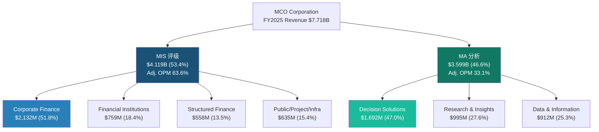

#### MIS: 收费站经济学

MIS FY2025收入$4.119B，Adj. OPM 63.6%，Q1 2025单季度Adj. OPM甚至达到66%。这是一个接近软件级别的利润率，但驱动逻辑完全不同——MIS的高利润率来自"双寡头税"(duopoly rent)，不来自规模经济。

**资产类别拆分(FY2025)**：
- **企业金融(Corporate Finance)**：$2,132M（51.8%）——最大引擎，受投资级和高收益债发行量直接驱动。FY2022→FY2025从$1,269M增长68%，弹性最高
- **金融机构**：$759M（18.4%）——银行和保险公司评级，增长较稳定（+10% YoY）
- **结构化产品**：$558M（13.5%）——CLO/CMBS/RMBS等，波动大但2008后缩水为较小比重
- **公共/项目/基建**：$635M（15.4%）——市政债+项目融资，受基建法案和绿色债券推动增长

**交易性vs经常性：67:33**。这意味着MIS每年$2.76B收入来自新发行的"一次性"评级费用。发行量好的年份（FY2021/2024/2025）这是印钞机；发行量差的年份（FY2022）这是利润黑洞。

经常性33%（$1.36B）主要来自年度监控费（surveillance fees）——已评级债务只要存续，就要每年交监控费。这部分是"后付费护城河"：过去20年积累的评级存量越大，经常性收入基数越稳。但注意：新增评级在放缓时，经常性收入增速也会延迟放缓（12-18个月后）。

#### MA: SaaS的理想与现实

MA FY2025收入$3.599B，Adj. OPM 33.1%，ARR $3.498B，留存率93%。

**三条产品线**：
- **Decision Solutions（$1,692M, 47%）**：最大且增长最快的引擎。包含KYC（反洗钱/合规检查，ARR +15%）、CreditLens（信贷审批平台，+20% ARPU提升）、Banking Cloud、Insurance（RMS风险模型，达到$150M增量收入目标）。这是MA向"工作流嵌入"转型的主战场。
- **Research & Insights（$995M, 28%）**：传统信用研究和经济预测（Mark Zandi的宏观预测属于这部分）。增速+8%，稳健但不激动人心。
- **Data & Information（$912M, 25%）**：BvD数据库+Orbis公司信息。增速+7%，属于基础设施级数据资产。

**93%留存率的两面性**：93%在SaaS世界是"良好"(Good)而非"卓越"(Great)。Tier 1企业SaaS（如Veeva、ServiceNow）留存率在95%+甚至97%+。MCO的7%年流失意味着MA每年需要新签+扩展约$525M收入（ARR的约15%）才能维持8%净增长。如果留存率滑落至90%（仅3个百分点），在相同新签速度下ARR增速将从8%降至5%。留存率是MA估值最敏感的输入变量，幸运的是MCO提供了硬数据（vs SPGI的推断95%+）。

**剥离信号与有机增速真相**：管理层已剥离Learning Solutions（2025年12月）并计划剥离Regulatory Reporting（2026年），合计约180bps MA增速拖累。这是积极信号——剥离低增长/低利润率业务可以提升MA整体质量。但反面解读是：剥离后MA的报告增速会因基数效应短期承压，FY2026的MA有机增速需要在+8%基础上加回180bps才是"同口径"对比。

**MA的预收收入信号**：FY2025递延收入（current）达到$1.582B，接近MA单季度收入（$900M）的1.75倍。这是经常性收入质量的"预付证据"——客户预付的订阅费越多，未来收入确认的确定性越高。递延收入规模也意味着MA的真实经济活动领先于会计确认，为分析师预测提供了内置的"能见度缓冲"。

#### MIS/MA对比: 核心矛盾

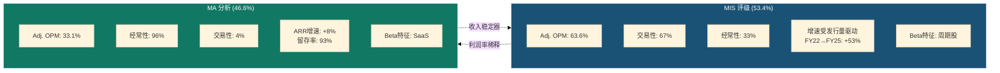

**利润率混合陷阱证据链**：

FY2026指引Adj. OPM 52-53%，分部指引MIS约65%、MA 34-35%。假设MA增速持续>MIS增速（MA +8% vs MIS长期约5-7%），到FY2030 MA占比可能从47%升至52-55%。在该混合比下，即使两个分部各自OPM不变，MCO总体Adj. OPM将从52%下降至50%以下：

- **情景测算**：MA 55%×35% + MIS 45%×65% = 19.3% + 29.3% = **48.5%**

这不是运营失败，而是数学必然。MA增长越快、MCO的利润率混合(margin mix)越不利。管理层的52-53%指引能否维持3年以上，取决于MA OPM能否从33%扩张至37-38%——这需要费用杠杆+AI效率同时兑现，并非低风险假设。

**反驳空间**：管理层FY2026指引MA OPM 34-35%，暗示+100-200bps扩张方向。驱动力包括：(1)GenAI嵌入产品后的人力成本替代（当前40% ARR已含AI功能）；(2)剥离低利润率业务（Learning Solutions+Regulatory Reporting）提升存量质量；(3)BvD/RMS整合完成后收购摊销的自然递减。如果MA OPM能以每年+100bps的速度扩张（从33%→38%用5年），利润率混合陷阱的冲击将被延缓——但不会被消除。即使MA达到38%，在55%占比下的MCO整体Adj. OPM仍仅为：55%×38% + 45%×65% = 20.9% + 29.3% = 50.2%，低于当前52%水平。利润率混合陷阱是MCO的结构性约束，不是管理层能"执行掉"的问题。

#### Ch03b: 收入质量分层 — 从"$7.7B"到"四层金字塔"

MCO的$7.7B收入不是铁板一块。按照质量(可预测性×利润率×防御性)分层，呈现出一个鲜明的金字塔结构：

**第一层(顶层): MIS经常性收入 — ~$1.4B(18%)**
这是MCO收入中品质最高的部分。年度监测费+关系维护费，一旦建立评级关系，发行人每年自动续费。不受发行量周期影响，OPM接近MIS整体的64%。这$1.4B相当于一个小型高利润SaaS公司，即使在FY2022的MIS低谷年也基本不受影响。如果将这部分独立估值(按SaaS 15-20x Revenue)，仅此一项价值$21-28B，占当前市值$77.3B的27-36%。

**第二层: MA经常性ARR — ~$3.5B(45%)**
93%留存、97%经常性的订阅收入。品质高于平均但低于MIS经常性——原因是MA面临更多竞争(Bloomberg/FactSet)，且留存率93%在SaaS世界仅为Tier 2。如果按MA-specific可比(Verisk 5-8x Revenue)估值，这部分价值$17.5-28B。

**第三层: MIS交易性评级(投资级) — ~$1.5B(19%)**
投资级企业债/金融机构债的首次评级和再评级。周期性中等——投资级发行人在衰退中仍有再融资需求(到期墙驱动)，但新发行量可能下降20-30%。OPM极高(可能>MIS平均)，因为投资级评级流程相对标准化。

**第四层(底层): MIS交易性评级(高收益+结构化) — ~$1.3B(17%)**
这是MCO收入中波动最大的部分。高收益债和结构化产品的发行高度依赖市场情绪和信贷利差。FY2022这部分收入可能缩水30-40%。在衰退+利差走扩的环境下，这$1.3B可能萎缩至$0.8-0.9B。如果将这部分按周期股估值(10-15x Earnings)，隐含估值仅$6-10B。

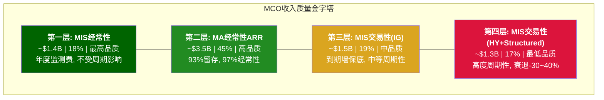

**金字塔的估值含义**: 如果按各层品质分别定价——第一层$21-28B + 第二层$17.5-28B + 第三层$15-22B + 第四层$6-10B = 总计$59.5-88B，中间值$73.8B。vs 当前市值$77.3B，MCO基本处于"公允定价"区间。但这个分层视角揭示了一个重要洞见：**第四层(17%收入)的周期波动会导致整体估值±15%的波动——这就是为什么MCO不能按纯信息服务公司定价**。

---

### Ch04: SGI速判 + A-Score品质评分

#### SGI (专才-通才指数) 评估

MCO是一个有趣的混合案例。MIS业务是"纯种专才"——全球信用评级市场只有两家（加半家Fitch）有意义的参与者，MCO在这个极度专业化的市场占据约40%份额，监管壁垒（NRSRO注册）让新进入者几乎不可能挑战。MA业务则是"有专才基因的通才"——Decision Solutions覆盖KYC/信贷/保险/气候风险等多个赛道，竞争对手从Refinitiv到Bloomberg到初创企业不等。

**SGI综合评分：约6.5/10**
- MIS单独：约9/10（双寡头，监管嵌入，50年格局不变）
- MA单独：约4.5/10（多赛道竞争，留存93%而非97%+，尚未形成平台锁定）
- 加权：（53% × 9 + 47% × 4.5）约 6.9，考虑到MA正在拉低专才纯度，调整至约6.5

**对比SPGI**：SPGI评级占比更低（约34% vs MCO 53%），意味着SPGI的通才比重更高（Indices+Market Intelligence+Mobility）。MCO的SGI更高（6.5 vs SPGI约5.5）——更专注但也更依赖评级周期。这是一把双刃剑。

#### A-Score品质评分

A-Score完整框架包含21个维度（A+B+C+D四组）。当前阶段可以评估A组（财务健康）和部分D组（宏观/周期）：

**A组: 财务健康 (7维度)**

| 维度 | 分项 | 评分(0-10) | 关键依据 |
|------|------|:--------:|---------|
| A1 | 收入增长持续性 | 7.0 | 6年CAGR约7.5%，但FY2022暴露-12%波动 |
| A2 | 利润率质量 | 8.5 | Adj. OPM 51.1%顶级，但GAAP/Adj差异需折价 |
| A3 | FCF转化 | 9.0 | FCF/NI 6年均值约105%，CapEx仅4.2% |
| A4 | 资产负债表 | 6.5 | Net Debt/EBITDA 1.26x健康，但TBV -$4.0B，商誉$6.4B |
| A5 | 资本配置效率 | 7.0 | 回购$1.71B/年+分红$701M，但高P/E下回购效率偏低 |
| A6 | 盈利可预测性 | 6.0 | MA(96%经常性)高度可预测，MIS(67%交易性)波动大 |
| A7 | ROE质量 | 7.5 | ROE 62.1%极高，但受负权益放大（Treasury Stock $13.3B） |

**A组小计：51.5/70 (73.6%)**

**D组初评 (周期与宏观, 4维度)**

| 维度 | 分项 | 评分(0-10) | 关键依据 |
|------|------|:--------:|---------|
| D1 | 周期敞口 | 4.5 | 36%交易性收入=中高周期敞口，FY2022已验证脆弱性 |
| D2 | 宏观依赖 | 4.0 | 利率环境+发行量+违约率三重宏观依赖 |
| D3 | 地缘风险 | 7.0 | 全球分散（美国约50%，欧洲约30%，亚太约20%），但中国市场政策风险 |
| D4 | 监管风险 | 6.5 | NRSRO体系既是壁垒也是枷锁；DOJ/SEC周期性调查 |

**D组初评：22.0/40 (55.0%)**

**A-Score初评：A组51.5 + D组22.0 = 73.5/110（可评范围）**

B组（商业质量）和C组（护城河）的初步印象：
- B4（定价权）可能是MCO最强项——评级定价权接近绝对（MIS Adj. OPM 63.6%）。发行人没有"不买评级"的选项——没有Moody's/S&P评级的债券基本无法进入机构投资者的投资范围。这不是品牌溢价，而是制度强制
- C1（制度嵌入）极深——NRSRO监管+Basel III资本计量中评级的强制要求。银行计算信用风险加权资产时，外部评级直接影响资本充足率。这意味着Moody's的评级不仅是信息产品，更是监管基础设施的一部分
- C2（网络效应）在MA侧有中等强度——600M+实体数据库的Orbis/BvD构成数据网络壁垒，但网络效应强度低于双边平台（如ICE/CME交易所）
- C3（转换成本）在MA工作流产品中正在建立——CreditLens嵌入银行信贷审批流程后，切换成本显著提高（需要重新培训+数据迁移+监管合规验证）

**管理层变动风险**：MA总裁Stephen Tulenko于2025年8月辞职，Andy Frepp临时接管。MA正处于平台化转型关键期，主帅离场是不容忽视的执行风险。CEO Rob Fauber（任期21年+）和新任CFO Noemie Heuland（ex-SAP/Dayforce, 2024年加入）需要证明MA的战略方向不会因人事变动而偏移。

#### MCO vs SPGI: 估值对照

| 维度 | MCO | SPGI |
|------|-----|------|
| 评级收入占比 | 53.4% | 约34% |
| 非评级业务性质 | 信用分析SaaS | 指数+数据+Mobility |
| SGI | 约6.5 | 约5.5 |
| P/E(TTM) | 31.5x | 28.8x |
| 周期敞口 | 更高（MIS占比大） | 更低（Indices反周期） |
| Berkshire背书 | 14.54%持股 | 无 |

MCO的P/E溢价（31.5x vs SPGI 28.8x）部分来自Berkshire的"信任溢价"和MIS更高的利润率。但MCO的周期敞口也更大。SPGI的Indices业务（被动投资受益者）提供了MCO没有的反周期对冲。

**Smart Money分歧**：Greg Abel已确认MCO为Berkshire"永久持仓"。但TCI（Chris Hohn）Q4 2025加仓61,500股的同时，UBS减持74.6%（$2.1B退出）。Smart Money内部存在分歧，这本身就是一个信号——MCO的估值在这个节点上不存在"共识"。

#### ROE 62%的解剖: 真功夫还是会计幻觉?

MCO的ROE 62.1%在金融信息服务行业中极为突出（SPGI 13.1%、ICE 11.9%）。但这个数字需要拆解：

ROE = Net Income / Shareholders' Equity。MCO的shareholders' equity被$13.3B累计回购压到极低水平——Book Value仅$4.2B（含$8.2B商誉和无形资产），TBV为-$4.0B。低分母放大了ROE。

更有意义的指标是ROIC或ROA。FY2025 ROA约15.5%（$2.459B / 约$15.8B total assets），这在任何行业都是优秀水平——证明MCO确实能以较少资产产出大量利润。但ROE 62%中大约一半的"超额"来自杠杆（负权益）放大，不完全是运营效率的体现。

在SOTP估值中，不应该把62% ROE当成可持续的盈利能力代理。更可靠的锚点是：FCF/Revenue 33.4%——每产出1美元收入，有33美分变成真金白银的自由现金流。这个比率在SaaS行业中位于75th percentile水平，对于一家$77.3B市值的公司来说，极其优质。

#### 市场定价隐含了什么?

当前$430.01，Market Cap约$77.3B：
- P/E 31.5x隐含：投资者愿意为每$1 EPS支付$31.5，这要求未来5年EPS CAGR不低于10%才能使当前PE在5年后回归25x（大盘金融水平）
- 共识EPS CAGR 12.5%（FY2025-2030E）恰好覆盖了这个门槛
- Forward P/E 25.7x（基于FY2026E Adj. EPS $16.75）更温和，但前提是指引兑现

换一个角度：EV/EBITDA 24.5x，对应的隐含永续增长率约3.5-4%（假设WACC 9%）。考虑MCO的名义GDP+定价权增长潜力，这个隐含假设不算离谱，但也没有给衰退留余地。

分析师共识目标价$550-572，隐含+28-33%上行空间。21位分析师中12买入/8持有/1卖出。但近期密集下调（Mizuho $550→$524、Barclays $580→$550、UBS $515→$490、GS $603→$532）暗示情绪在恶化——方向比绝对值更重要。YTD下跌约17%与基本面改善（EPS beat四连）形成反差，驱动因素可能是：一是AI对传统信息服务公司的估值重估恐慌；二是SPGI弱指引的情绪传导；三是宏观衰退担忧压制周期敞口高的公司。

---

理解了MCO的双引擎架构和财务全景之后，接下来我们需要深入每个引擎的内部机制。Part II将聚焦MIS评级特许权——这是MCO最有价值也最难被复制的资产，但同时也是周期波动的主要来源。

---

## Part II: MIS评级特许权

### Ch05: MIS评级特许权 — 监管嵌入的深度

### 5.1 NRSRO制度: 看似开放的封闭系统

美国证券交易委员会(SEC)注册的NRSRO(Nationally Recognized Statistical Rating Organization)共10家。这个数字常被引用为"评级市场向新进入者开放"的证据。但数字背后的现实截然不同: Big Three(MCO+SPGI+Fitch)合计占NRSRO总收入的91%, 占非政府证券评级的84%。

这意味着什么? 剩余7家NRSRO分享9%的市场收入。按FY2025 MIS收入$4.12B推算, 如果MCO占~40%, 三大机构合计评级收入约$10.3B, 则7家小型NRSRO的合计收入约$1.0B——平均每家$143M。这个体量甚至不如MCO单一资产类别(Structured Finance $558M)的三分之一。

更值得关注的是这7家小型NRSRO的生存状态。DBRS Morningstar(加拿大背景)是其中最大的, 但主要服务于加拿大和欧洲市场, 在美国企业债市场的份额微不足道。Kroll Bond Rating Agency(KBRA)自2010年成立以来一直试图在结构化产品领域挑战Big Three, 但十五年后其市场份额仍在低个位数。A.M. Best则专注于保险行业评级这一细分领域, 与MCO的业务几乎不构成正面竞争。这些案例的共同教训是: 即使获得NRSRO牌照, 即使专注于细分市场, 小型评级机构也无法在Big Three的核心地带站稳脚跟。

**为什么Dodd-Frank/CRARA未能削弱集中度?**

2006年《信用评级机构改革法案》(CRARA)和2010年Dodd-Frank法案Title IX的初衷是降低市场对Big Three的依赖。具体措施包括: 取消SEC规则中对NRSRO评级的强制引用、要求评级机构公开方法论和违约统计、引入SEC监察权。

但改革的实际效果恰恰相反——它加深了壁垒:

1. **合规成本壁垒**: Dodd-Frank要求NRSRO建立独立合规部门、年度审计、方法论透明度报告。对$10B+收入的Big Three, 这是"舒适的成本"(MCO FY2025 SBC+合规成本占比<5%); 对$100-200M收入的小型NRSRO, 这是生存威胁。一个细节很能说明问题: SEC每年对每家NRSRO进行检查, 检查报告会公开发布。对Big Three来说, 每年花$5-10M应对SEC检查是常规预算; 对一家$50M收入的小型NRSRO来说, 这可能吃掉其全部利润。
2. **历史违约数据库**: 评级质量的终极验证是长期违约统计。MCO拥有100年+的违约数据库(1909年至今), 覆盖$130T全球固定收益证券市场。新进入者即使获得NRSRO牌照, 也无法"购买"这段历史。这不是技术壁垒, 而是时间壁垒——物理意义上不可压缩。
3. **方法论锁定效应**: 公开方法论本意是增加透明度, 但实际上使发行人和投资者习惯了Big Three的评级框架——它成了行业语言。切换评级机构意味着切换"语言体系"。当一个CFO和董事会解释"我们的债券是Baa1"时, 所有人都知道这意味着什么; 如果换成KBRA的"BBB+"评级, 即使定义相同, 沟通成本也大幅上升。

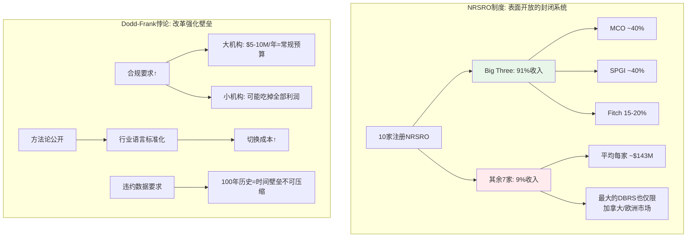

### 5.2 市场份额50年不变的深层逻辑

MCO ~40% / SPGI ~40% / Fitch ~15-20%。这个格局从1970年代SEC首创NRSRO制度以来几乎没有变化。即使经历了2008年金融危机——Big Three因结构化产品评级失误遭受史无前例的声誉打击——份额依然稳固。

**为什么50年格局不变?** 这不是一个简单的"品牌壁垒"问题。深层原因是评级特许权的5层监管嵌入——每一层都独立构成进入壁垒, 5层叠加形成几乎不可逾越的制度护城河。

### 5.3 监管嵌入5层模型: 逐层解剖

**第一层: Basel资本权重 — 银行资产负债表的"硬编码"**

Basel III框架下, 银行持有的债券资产需要根据信用评级计算风险权重。AAA/Aaa评级的企业债权重20%, BBB/Baa权重50%, BB+/Ba1以下的权重可达150%。关键在于: 这些资本权重表默认使用Big Three的评级符号。全球系统重要性银行(G-SIB)的风控系统、合规流程、监管报告都围绕MCO/SPGI的评级体系构建。

具体到操作层面: 一家G-SIB的风控IT系统中, 评级代码是底层字段。将MCO的Baa3替换为KBRA的BBB-不是"改一行配置"的问题——它涉及数据映射表更新、历史回溯测试重跑、监管报告模板修改、内部审计确认。一家大型银行的风控系统改造周期通常以"年"计。即使一家新NRSRO获得SEC认证, 它的评级在Basel框架下没有"同等对待"的自动路径——需要逐个国家监管机构的认可, 而巴塞尔委员会的标准更新周期以"十年"计(Basel II→III→IV跨越2004-2028)。

**实例**: 2023年硅谷银行(SVB)倒闭后, 美国监管机构审视了中小银行的风险管理。讨论的所有改革方案都建立在Big Three评级体系之上——没有任何监管提案考虑"用其他评估体系替代信用评级"。危机暴露了银行监管的缺陷, 但解决方案是"更好地使用评级", 而非"替代评级"。

**第二层: 机构投资政策 — 数十万份IPS的惯性**

全球养老金、保险公司、主权财富基金的投资政策(Investment Policy Statement, IPS)通常包含"仅投资BBB-/Baa3以上评级债券"等条款。这些条款中的评级几乎总是指MCO或SPGI的评级。

这里的壁垒不是法律, 而是制度惯性。一份IPS的修改流程通常是: 投资团队提议→合规审核→投资委员会讨论→董事会批准→法律审核→执行。对于大型养老金(如CalPERS, GPIF), 这个流程可能需要6-18个月。更关键的是: 没有人有动力去改。将IPS中的"Moody's Baa3"替换为"KBRA BBB-"不会带来任何投资回报上的改善, 但如果替代机构的评级后来被证明不准确, 投资委员会成员要承担个人责任。这是一个典型的"不对称激励"——改变没有收益, 但改变的风险是真实的。

**实例**: 日本政府养老金投资基金(GPIF, 全球最大养老金, AUM $1.6T+)的投资指引明确引用了"国际公认评级机构"的评级标准。即使日本本土有评级机构(JCR, R&I), GPIF在海外债券投资中仍主要参照MCO/SPGI评级。这不是因为日本机构评级质量差, 而是因为全球债券市场的"通用语言"只有Big Three。

**第三层: 债券契约 — $130T存量的法律锁定**

大量存量债券的契约(covenants)中包含评级触发条款——例如"如果评级低于Baa3/BBB-, 发行人需提供额外担保"或"评级降至投资级以下, 利率自动上浮200bps"。这些契约在债券存续期内无法单方面修改。

全球存量债务超过$130T, 其中大量契约绑定MCO/SPGI评级。这意味着即使未来新发债券改用其他评级机构, 存量债券的评级需求也将持续数十年。一只2024年发行的10年期债券, 其契约中的MCO评级引用将一直有效到2034年。一只30年期基建债券的引用则延续到2054年。

更微妙的是"评级触发条款"创造的自我强化循环: 因为债券契约引用MCO评级, 发行人必须维持MCO评级(否则触发条款可能导致交叉违约或抵押品追加); 因为发行人维持MCO评级, 新发债券的契约也自然引用MCO评级。这是一个跨越时间的锁定——每一笔新发行都在强化未来几十年的评级需求。

**实例**: 2020年COVID冲击期间, 大量企业被MCO从BBB降至BB(从投资级降至高收益级, 即所谓"堕落天使")。这些降级自动触发了这些企业债券契约中的条款——利率上浮、担保追加、部分投资者被迫出售。整个过程中, 没有人质疑"为什么MCO的降级就能触发这些条款"——因为这是在发行时就写进合同的。

**第四层: 央行合格抵押品 — 金融基础设施的最后堡垒**

美联储、欧洲央行(ECB)、英格兰银行(BOE)等主要央行的公开市场操作和紧急贷款窗口, 均要求抵押品达到特定评级门槛。这一层的嵌入深度远超前三层——它关系到金融体系的最终稳定性。

ECB的合格抵押品框架(Eurosystem Credit Assessment Framework, ECAF)虽然允许四种评估来源(外部评级、央行内部评估、银行内部评级、第三方工具), 但实践中Big Three评级是最主要的参照。ECB的合格抵押品清单中, 超过90%的证券使用外部评级作为主要信用评估来源, 而这些外部评级几乎全部来自Big Three。

美联储的贴现窗口(discount window)和公开市场操作(OMO)同样依赖外部评级。2020年3月COVID恐慌期间, 美联储紧急扩大了合格抵押品范围, 将部分高收益债券纳入——但"高收益"的定义仍然使用Big Three的评级标准。换言之, 即使在危机中打破常规, 央行也无法脱离评级体系。

**这一层嵌入意味着什么?** 央行操作是金融体系的最后支撑。一家银行在极端情况下需要向央行借款(充当最后贷款人), 它能拿出的抵押品必须符合评级要求。如果MCO的评级被某种替代方案取代, 需要全球主要央行同步修改其抵押品框架——这在政治和技术上都几乎不可能。

**实例**: 2022年英国养老金危机(LDI crisis)中, 英格兰银行紧急购买英国国债以稳定市场。整个操作中, 抵押品评估、风险计量、交易对手信用评估都依赖Big Three的评级体系。没有这个体系, 央行甚至无法在技术层面执行紧急救助操作。

**第五层: 市场惯例与信息不对称 — 最软但最广的一层**

债券发行说明书(prospectus)、信用分析报告、交易平台(Bloomberg Terminal的CRAT功能)都默认展示Big Three评级。投资者做信用决策时, "没有MCO/SPGI评级的债券"天然面临流动性折价——不是因为法规禁止交易, 而是因为市场参与者缺乏替代的信用信息框架。

这一层嵌入的特殊之处在于: 它不是某个特定监管机构可以"取消"的。前四层理论上可以通过立法或监管改革削弱(虽然极其困难), 但第五层是由数百万市场参与者的集体行为构成的。一个组合经理在Bloomberg上筛选债券时, 第一个过滤条件几乎总是"评级≥Baa3/BBB-"。改变这个行为需要改变整个债券市场的操作文化——这不是任何法规可以命令的。

**流动性折价的量化**: 研究表明, 未获得Big Three评级的债券与同等信用质量但有评级的债券相比, 买卖价差(bid-ask spread)宽约15-30bps。对于机构投资者而言, 30bps的额外交易成本意味着$1B头寸的年化隐性成本增加$300万。这个流动性折价使得发行人"不获评级"在经济上是不理性的——评级费$100-250K相比$300万+的流动性成本是微不足道的。

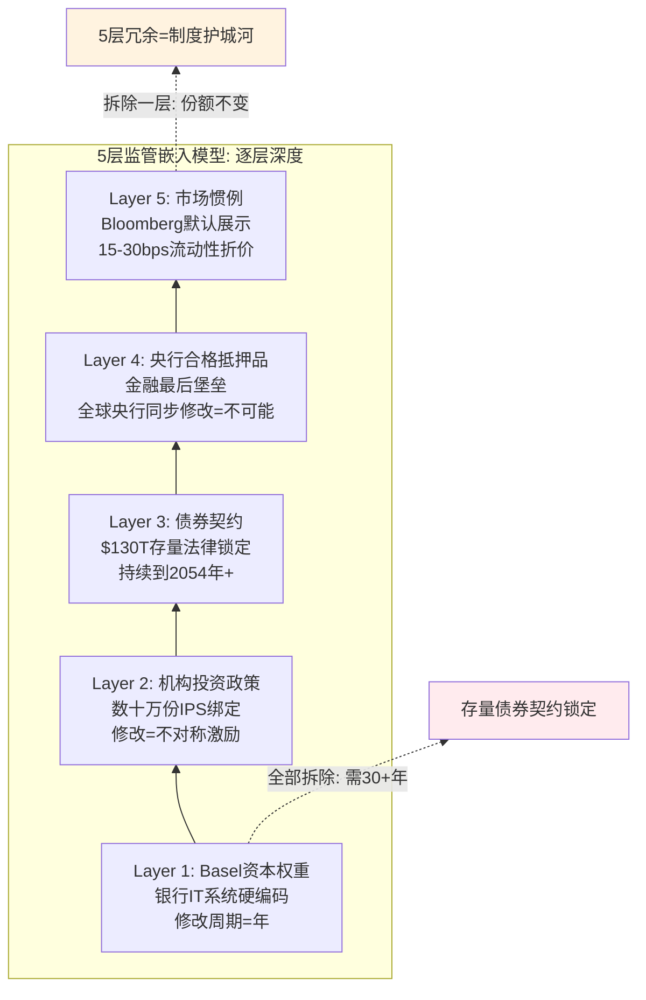

### 5.4 "分裂评级"溢价: 市场对MCO保守性的微偏好

当MCO和SPGI对同一发行人给出不同评级("分裂评级", split rating)时, MCO评级优于SPGI的债券交易利差平均窄约8bps。

8bps看似微不足道, 但在$1B规模的债券发行中, 8bps对应$800K/年的利息成本差异。在$5B的大型并购融资中, 这个差异放大到$4M/年, 整个债券存续期(7-10年)的总节省可达$30-40M。对发行人而言, 获得MCO更高的评级(哪怕只高一个notch)具有真实的经济价值。这创造了一个微妙的正循环:

1. MCO评级相对保守 → 投资者更信任MCO(利差更窄)
2. 利差更窄 → 发行人有动力获取MCO评级(降低融资成本)
3. 发行人需求稳定 → MCO维持保守立场(不需要"讨好"发行人)

这个正循环解释了为什么MCO可以在"发行人付费"模型下维持评级质量——因为保守性本身就是MCO的商业优势。发行人不是在为"高评级"付费, 而是在为"被市场信任的评级"付费。

### 5.5 发行人付费模型: 结构性利益冲突, 但替代方案已反复失败

"发行人付费"(issuer-pays)是评级行业最常被批评的商业模式。逻辑很直观: 付钱的人(发行人)希望评级越高越好, 而评级的使用者(投资者)需要客观评估。这是教科书级的委托代理问题。

但历史证明, 替代方案更糟:

- **投资者付费模型**: Egan-Jones Ratings(投资者付费NRSRO)市场份额<1%。原因: 投资者不愿为公共品(评级)付费——如果一家基金购买了评级, 信息会迅速扩散, 搭便车问题无解。Egan-Jones在2012年还因方法论缺陷被SEC暂停评级资格18个月, 进一步削弱了投资者付费模型的信誉。
- **交易所/监管付费模型**: 欧盟曾讨论由ESMA(欧洲证券和市场管理局)指定评级机构。结论: 政府指定评级机构会引入政治干预风险(想象一下政府指定的机构给本国主权债AAA)。欧洲主权债务危机期间, 多国政客公开指责评级机构"不公正地"降级本国主权评级——如果评级机构由这些政客任命, 评级的独立性将荡然无存。
- **随机分配模型**: Dodd-Frank 939F条款曾授权SEC研究随机分配评级任务。SEC自己的研究结论是: 随机分配会降低评级质量(评级机构无法选择专长领域)。一家擅长结构化产品的机构被随机分配去评级市政债, 结果只会是两边都做不好。

发行人付费模型之所以存活50年, 不是因为没有人尝试改变, 而是因为所有替代方案都有更严重的缺陷。这是一种"丘吉尔民主"式的均衡——最糟糕的模式, 除了所有其他模式。

**利益冲突的实际缓释机制**: 虽然结构性冲突存在, 但多重机制限制了其实际影响:
- **声誉约束**: MCO 100年+的品牌建立在评级准确性上。一次重大评级失误(如2008年)的声誉成本远超短期收入获益。分裂评级溢价(§5.4)量化了声誉的经济价值。
- **双评级竞争**: 当MCO和SPGI同时评级同一债券, 两家的评级差异是公开的。任何系统性偏高的评级机构都会在违约统计中暴露。
- **SEC监察**: 2010年后SEC有权对NRSRO进行年度审查, 包括方法论合规、分析师独立性、内部控制。
- **方法论刚性**: 评级方法论一旦公开, MCO不能对单个发行人"弹性执行"——所有同类型发行人适用同一方法论, 这限制了逐案操纵的空间。

这些缓释机制不完美, 但足以维持系统的运转。投资者对评级的信任不是"绝对信任"(2008年证明不是), 而是"相对信任"——在没有更好替代方案的前提下, Big Three的评级仍然是最不差的信用信息来源。

---

### Ch06: MIS收入弹性 — 周期性的精确画像

### 6.1 资产类别拆分: 不同的周期DNA

理解MIS的收入弹性, 不能只看"MIS总收入"这一个数字。必须深入到资产类别层面, 因为每个类别有截然不同的周期驱动因素、客户群体和利润率特征。把MIS当作一个整体来分析, 就像把"半导体行业"当作一个整体——会丢失所有有价值的信息。

MIS FY2025收入$4.12B, 由四大资产类别构成。每个类别有截然不同的周期特征:

| 资产类别 | FY2022 | FY2023 | FY2024 | FY2025 | FY22→25 CAGR | 周期属性 |
|---------|--------|--------|--------|--------|:------------:|---------|
| Corporate Finance | $1,269M | $1,404M | $1,950M | $2,132M | +18.9% | **强周期**: 依赖IG/HY再融资窗口 |
| Financial Institutions | $491M | $545M | $727M | $759M | +15.6% | **中周期**: 银行资本补充需求 |
| Structured Finance | $462M | $405M | $518M | $558M | +6.5% | **强周期+延迟**: CLO/ABS受信贷周期滞后影响 |
| Public/Project/Infra | $431M | $476M | $564M | $635M | +13.8% | **弱周期**: 基建/市政有政策对冲 |
| MIS Other | $46M | $30M | $34M | $35M | -8.7% | 可忽略 |
| **Total MIS** | **$2,699M** | **$2,860M** | **$3,793M** | **$4,119M** | **+15.1%** | — |

**关键洞察**: FY2022是最近的周期低谷。但即使在那个"冰点", MIS收入仍有$2.70B。对比FY2025的$4.12B, 周期波动幅度约35% (=$1.42B)。这$1.42B的"周期收入"几乎全部来自Corporate Finance(-$863M, 占比61%)和Financial Institutions(-$268M, 占比19%)。

Corporate Finance是MIS的"周期放大器": 它占MIS收入52%($2,132M/$4,119M), 但贡献了周期波动的61%。原因在于企业债发行是最典型的"窗口型"业务——CFO会在利差收窄时集中发债, 利差走阔时推迟。这不是线性关系: 当BBB利差从150bps收窄至100bps, 发行量可能+50%; 但当利差从100bps走阔至200bps, 发行量可能-40%以上。这种非对称性是理解MIS周期弹性的关键。

**各类别的深层周期逻辑**:

- **Corporate Finance ($2,132M, 52%)**: 核心驱动是再融资需求+并购融资+投资级利差。FY2024-2025的爆发源于2020-2021年低利率时期大量发行债券的"再融资墙"(maturity wall)。到FY2027-2028, 这面墙的主体将已翻新, 再融资驱动力将减弱。

- **Financial Institutions ($759M, 18%)**: 银行资本债(AT1/Tier 2)和金融公司债。受Basel III/IV资本要求驱动——当监管要求银行补充资本缓冲, 银行必须发债, 无论利差高低。这使得FI类别在监管收紧周期中反而具有"反周期"属性。2023年SVB倒闭后, 区域银行加速发行资本债以增强合规能力, 直接推动了FI类别FY2023→FY2024的+33%增长。

- **Structured Finance ($558M, 14%)**: CLO、RMBS、ABS、CMBS。这是2008年危机的震中, 也是后危机时代恢复最慢的类别。CLO发行量高度依赖杠杆贷款市场活跃度——当PE并购活跃时CLO发行旺盛, 反之则停滞。结构化产品的周期通常滞后于企业债6-12个月, 因为CLO的底层资产(杠杆贷款)需要先积累到足够体量, 才能打包成CLO发行。

- **Public/Project/Infrastructure ($635M, 15%)**: 市政债、基建项目融资、PPP。受政策驱动(基建法案、地方政府融资需求), 与经济周期的相关性最弱。美国《基础设施投资与就业法案》(IIJA, 2021)和《降低通胀法案》(IRA, 2022)为这个类别提供了多年的结构性顺风。值得注意的是, 这是MIS四大类别中最具防御性的——即使在FY2022的整体低谷, PPI收入仍达$431M, 仅较FY2021的$443M下降3%。

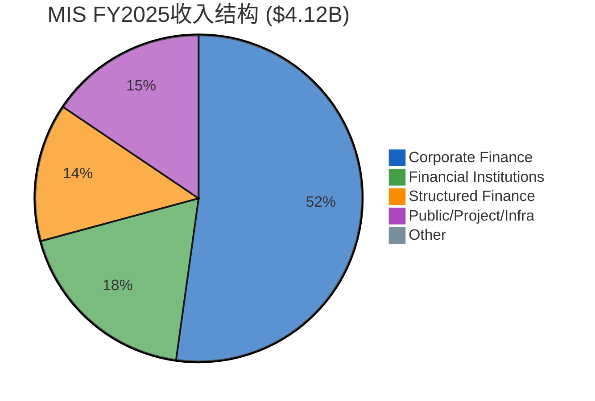

### 6.2 交易性67% vs 经常性33%: 真实的韧性基底

MIS收入结构中, 交易性收入(transaction revenue)占67%, 经常性收入(recurring revenue, 年费+监测费)占33%。

经常性收入33%×MIS总收入$4.12B ≈ $1.36B。这是MCO在"零新增发行"的极端场景下仍可获得的MIS收入基底。对比FY2022低谷的$2.70B, 说明即使在周期最差年份, MIS也有约$1.34B交易性收入(=$2.70B-$1.36B)——发行市场从未完全冻结。

**经常性收入的构成**:
- **年度监测费**: 存量评级的持续监控, 与评级数量(而非发行量)挂钩。全球存量评级证券数以十万计, 这些监测费在周期下行时几乎不受影响
- **评级管理费**: 发行人维护评级关系的年费, 通常是首次评级费用的10-20%
- **数据订阅**: MIS的评级数据feed, 嵌入投资者和银行的风控系统

经常性收入的战略价值不仅在于稳定性, 更在于它代表"存量评级的嵌入深度"——每一个存量评级都是一个年金流, 发行人很少主动撤销评级(撤销评级=向市场发出负面信号)。

### 6.3 历史压力测试: 四个周期的精确复盘

MCO整体收入在以下年份经历了显著下降。与其只看汇总数字, 不如逐个周期复盘MIS各资产类别的表现——因为每个周期的冲击路径不同, 对MIS的影响机制也不同。

**完整历史压力测试表**:

| 压力期 | 触发因素 | 整体收入变化 | MIS收入变化 | 最受冲击类别 | EPS变化 | 恢复时间 |
|-------|---------|:----------:|:---------:|------------|:------:|:------:|
| **FY2008-09** | 全球金融危机 | ~-20% | ~-25% | Structured -60%+ | ~-30% | 3年(FY2012) |
| **FY2016** | 利差走阔+能源债违约 | ~-5% | ~-8% | Corporate -12% | ~-10% | 1年(FY2017) |
| **FY2020** | COVID-19 | -3% | 实际+7% | Q1-Q2暂停→Q3-Q4爆发 | +5% | 无需(V型) |
| **FY2022** | 联储激进加息 | -12.1% | -29% | Corporate -34% | -37% | 2年(FY2024) |

**FY2008-09深度复盘: 结构化产品的清算**

2008年金融危机对MIS的冲击不是均匀的——它精确打击了Structured Finance。危机前, 结构化产品(CDO/RMBS/CMBS)是MIS增长最快的类别, FY2006-07占MIS收入的30%+。危机后, 结构化产品发行几乎归零: FY2008的CDO发行量较FY2007下降超过90%。RMBS(非机构)和CMBS的跌幅也在70-80%。

但Corporate Finance和FI在FY2009下半年就开始恢复——因为企业仍需要发债(甚至更需要, 以补充危机中消耗的流动性), 银行也需要发行资本债以满足加强后的监管要求。PPI(市政债)几乎未受影响, 因为地方政府融资需求与信贷周期脱钩。

关键教训: 2008年教会我们MIS的脆弱点在Structured Finance, 而非Corporate Finance。今天, Structured Finance仅占MIS的14%(vs 2007年的30%+), 这意味着类似2008年的冲击路径对当前MCO的影响会小得多。

**FY2016: 温和冲击的样板**

FY2016的冲击来自两个方向: 全球利差走阔(中国经济减速担忧+美联储加息预期)+能源行业违约潮(油价从$100+跌至$30)。Corporate Finance受利差走阔直接冲击, 但影响温和(-12%)——因为再融资需求提供了底部支撑(企业不能"不再融资", 只能推迟到窗口改善)。FI和PPI几乎未受影响。MIS整体仅下降约8%, EPS约-10%。

FY2016是"温和衰退"的最佳参照——如果未来发生一次利差走阔但非系统性危机的衰退, MIS的反应模式最可能接近FY2016。

**FY2020: COVID的"V型假象"**

FY2020是最具迷惑性的案例。COVID初期(3-4月)市场恐慌导致发行暂停, 但随后的联储QE+零利率环境触发了史上最大规模的企业债再融资潮。MIS FY2020收入实际+7%。

这个案例说明: 衰退≠MIS收入下降, 关键变量不是GDP而是**融资窗口是否开放**。如果衰退伴随央行宽松(FY2020), MIS可能受益; 如果衰退伴随央行收紧(FY2022), MIS遭受双杀。

但FY2020的经验有一个危险的副作用: 它可能让投资者形成"衰退对MCO无害"的认知偏差。事实上, FY2020的V型恢复是极端货币宽松的产物, 而非MCO业务模型的内在韧性。如果下一次衰退中央行因通胀约束而无法快速降息(正是当前环境), MCO不会再获得FY2020式的免费保护。

**FY2022深度复盘: 最近也是最有参考价值的压力测试**

MCO整体收入从$6.22B降至$5.47B(-12.1%), 但EPS从$11.78暴跌至$7.44(-37%)。收入跌12%而EPS跌37%, 暴露了MIS的经营杠杆: 固定成本(分析师薪资、合规团队、IT基础设施)在收入下降时无法快速调整。

**FY2022的逐季度轨迹揭示了周期的真实形态**:
- Q1 2022: MIS收入已开始下滑, 但因Q4 2021管线延续, 降幅可控
- Q2-Q3 2022: 联储连续75bps加息, 利差急剧走阔, IG/HY发行几乎冻结, MIS季度收入较FY2021同期暴跌30-40%
- Q4 2022: 发行量触底, 但年末有小幅恢复(部分发行人赶在年底前锁定融资)

**FY2022的分解**:
- MIS收入: 从$3.80B(FY2021)降至$2.70B(-29%), Corporate Finance从$1.92B降至$1.27B(-34%)
- MA收入: 从$2.42B升至$2.77B(+14%)——MA在MIS崩塌的年份反而增长, 验证了其防御性
- OPM: 从45.7%(FY2021)降至36.5%(FY2022), 压缩920bps

FY2022的教训清晰: **MIS是一台高杠杆的周期机器, MA是减震器**。但MA只是减震, 不是消除——整体EPS仍然跌了37%。

### 6.4 "到期墙"分析: FY2026-2028的再融资前景

FY2024-2025 MIS的历史性高收入不是"有机增长"的结果, 而是"到期墙"(maturity wall)驱动的再融资超级周期。理解这面墙的形态, 对预测FY2026-2028的MIS收入至关重要。

**到期墙的形成**: 2020-2021年, 联储将利率降至零, 企业抓住窗口大量发债。这些债券的典型期限是5-7年(IG)和3-5年(HY), 意味着:
- 2020年发行的5年期IG债→2025年到期
- 2021年发行的5年期IG债→2026年到期
- 2020年发行的7年期IG债→2027年到期
- 2020年发行的3年期HY债→2023年已到期(早期墙, 已翻新)
- 2021年发行的5年期HY债→2026年到期

**墙的高度与衰减**: 2024-2025年是墙的峰值——这两年集中了2020-2021年发行的大量到期债务。到FY2026, 墙仍然较高(2021年是发行大年, 其5-7年期债务2026-2028到期)。但到FY2027-2028, 墙开始衰减, 因为2022-2023年的发行量大幅低于2020-2021年(FY2022发行冻结)。

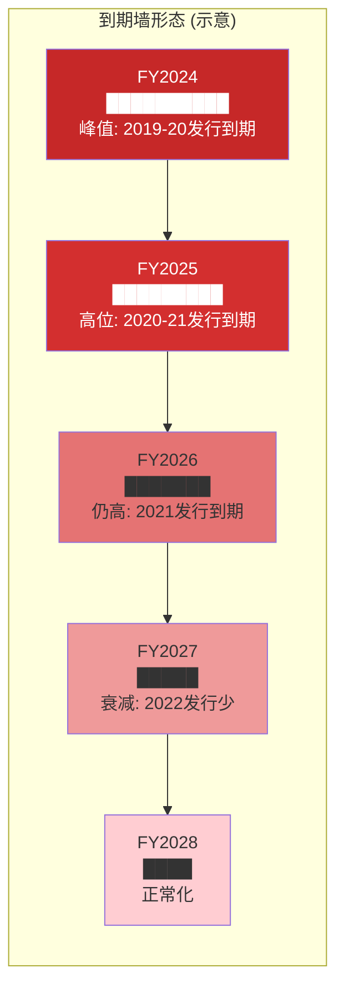

**对MIS的含义**: FY2025的$4.12B MIS收入建立在到期墙峰值之上。即使利差和利率环境不变, 仅到期墙的自然衰减就可能导致FY2027-2028的再融资驱动型发行量下降15-25%。叠加潜在的衰退风险(利差走阔, 进一步压缩发行量), MIS的"均值回归"路径变得清晰。

管理层FY2026指引"MIS收入高个位数增长"隐含的乐观假设是: 发行量维持在高位附近(到期墙仍有支撑), 且定价贡献持续(5-8%费率增长)。但到FY2027, 管理层可能不得不面对到期墙衰减的现实。

当前环境(衰退概率42-48% + 通胀>3%概率73%)更接近FY2022型——联储降息空间受限, 意味着融资窗口不会在衰退时快速重新打开。

### 6.5 定价权叠加: 超越发行量的增长

FY2024是一个关键证据点: MIS收入+33%, 但全球发行量仅+约42%。表面上收入增速低于发行量增速, 但这忽略了资产类别混合效应——如果HY(高收费)增速高于IG(低收费), 混合效应会放大收入。

更有说服力的是逆向推算: 如果MCO市场份额稳定(约40%), 发行量+42%应带来MIS交易性收入+42%。但实际MIS交易性收入+54%(FY2024), 超额增长12pp中约5-8pp可归因于定价提升, 剩余归因于混合效应。

**定价权的来源**: 前述5层监管嵌入使发行人"必须"获得评级。当"必须"与"有限供应商"(Big Three占91%)结合, 定价权是自然结果。首次评级费$50-250K+年度监测费$20-100K的费率结构, 相对于发行人的融资规模($100M-$10B+), 是微不足道的成本——这是典型的"低份额钱包"(low share of wallet)定价权。

### 6.6 CQ-1核心证据链: 36%交易性敞口的估值含义

**这是本报告最重要的数据推导之一。**

计算链:
- MIS交易性收入占MIS总收入的67%
- MIS收入占MCO总收入的53.4%
- 因此: MCO整体有 67% × 53.4% = **35.8%** 的收入来自MIS交易性评级

35.8%——超过三分之一的MCO收入——直接暴露于债券发行周期。这就是CI-MCO-002("周期记忆衰退")假说的数据基础。

**衰退情景量化** (基于FY2022实际数据外推):

| 情景 | MIS交易性收入变化 | MCO收入影响 | EPS影响 (经营杠杆2-2.5x) |
|------|:----------------:|:----------:|:----------------------:|
| 温和衰退 (FY2016型) | -15% | -5.4% | -12~15% |
| 中度衰退 (FY2022型) | -30% | -10.7% | -25~30% |
| 严重衰退 (FY2008型) | -45% | -16.1% | -35~40% |

当前衰退概率42-48% + 杠杆贷款违约率7.9%(2x历史均值) + 32%美国公司处于信用风险早期预警。市场按P/E 31.5x定价MCO, 隐含12.5% EPS CAGR。

**双杀场景**: 如果FY2026-2027出现中度衰退(FY2022类型), EPS可能从指引的$16.70降至$12-13。如果同时P/E压缩至25x(FY2022实际P/E低点约22x), 则: $12.5 × 25 = $313, 较当前$430下跌27%。

这不是"黑天鹅", 而是MCO在过去4年中就经历过一次的场景。**市场是否已经"忘记2022"? 这正是CI-MCO-002的核心论点。**

---

### Ch07: MIS的"不可能三角" — 市场份额 × 定价权 × 监管合规

### 7.1 寡头博弈: MCO-SPGI的Cournot均衡

MCO ~40% / SPGI ~40%的双寡头格局在博弈论中接近经典的Cournot均衡——两家企业在产量(此处为评级覆盖范围)上竞争, 但都不愿发起价格战。

**为什么没有价格战? — Nash均衡的四重锁定**

1. **需求弹性极低 (博弈条件1)**: 评级费用在发行人融资成本中占比<0.1%。将评级费从$200K降至$100K不会刺激发行人发更多债——发行人发债是因为有融资需求, 不是因为评级便宜。需求对评级价格几乎完全无弹性。用博弈论语言说: 价格下降不扩大市场总量, 只能重新分配份额——而份额重新分配在双评级惯例下也不成立。

2. **价格战的负面信号 (博弈条件2)**: 如果MCO降价争抢SPGI的客户, 市场会解读为"MCO的评级价值在下降"。在一个信誉即产品的行业, 降价=自贬。这是经典的"价格作为质量信号"博弈: 高价维持了市场对评级质量的信心, 降价破坏这种信心。

3. **共谋不需要沟通 (博弈条件3)**: Big Three的定价是公开的(费率表向发行人披露)。在三家寡头、低需求弹性、同质产品的环境下, 价格自然趋同——这不需要违法的明确共谋, 只需要理性的跟随者行为(follow-the-leader pricing)。经济学中称之为"默契共谋"(tacit collusion): MCO涨价5%, SPGI观察后在下一周期跟进, Fitch再跟进。因为三方都从价格上涨中受益, 没有人有激励打破这个均衡。

4. **双评级惯例的保护 (博弈条件4)**: 大型债券发行通常获取两家或三家评级。这意味着MCO和SPGI不是在争夺"一个蛋糕", 而是共享同一个蛋糕——大部分发行人同时是MCO和SPGI的客户。双评级惯例使得市场更接近"非零和博弈": MCO拿到一个新客户, 通常SPGI也拿到同一个客户。这进一步消除了价格竞争的激励——没有人会为争夺一个已经是共同客户的发行人而降价。

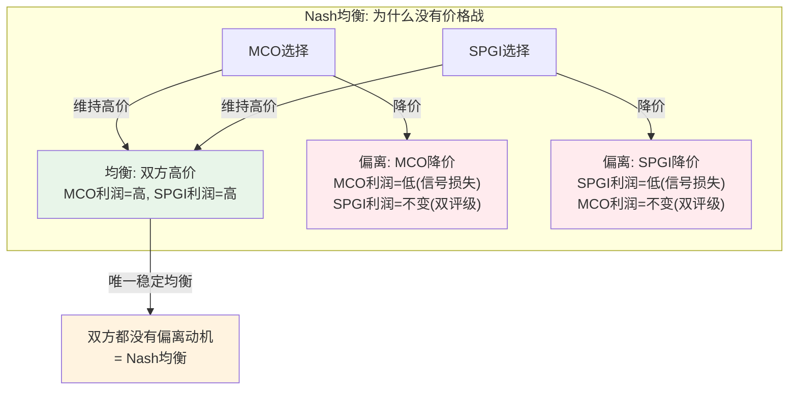

**这个均衡的脆弱点在哪里?** 理论上, 如果某一方大幅提高质量或降低价格, 发行人可能逐步从"双评级"回到"单评级"。但历史上唯一接近这个情况的是2008年后——即使当时大量发行人对Big Three极度不满, 双评级惯例也未被打破。这说明均衡的稳定性来自制度(投资者要求)而非来自参与者的主观选择。

**Fitch的角色: 第三方的"稳定器"效应**

Fitch占15-20%份额, 在双寡头之间扮演了微妙的角色。Fitch的存在给发行人提供了"第三选择"的幻觉, 降低了监管对MCO-SPGI双寡头的反垄断压力。但Fitch的规模不足以成为真正的挑战者——它更像是一个"允许的竞争者", 其存在恰好维持了市场"看似竞争"的表象, 同时不威胁双寡头的核心利益。

### 7.2 定价权证据: 精确的经济学

评级费率结构:
- **首次评级费(initial rating fee)**: $50,000-$250,000, 取决于发行规模和复杂度。一笔$500M的投资级企业债首次评级通常在$80,000-$120,000; 一笔$2B的高收益债或跨境交易可达$200,000+; 结构化产品(CLO/CMBS)因分析复杂度更高, 费率可达$300-500K+
- **年度监测费(annual monitoring fee)**: $20,000-$100,000, 取决于评级类型。企业评级的年度监测费通常在$30,000-$60,000; 银行和主权评级更高(分析师覆盖密度更大)
- **结构化产品费率**: 显著更高, CLO/CMBS等复杂产品可达$500K+。一笔$1B的CLO新发行, 评级费可能在$400-600K(包含底层资产池的逐笔评估)
- **评级更新/再融资折扣**: 存量发行人再融资时通常享受首次评级费的70-80%——这是一个看似"让利"但实际上强化锁定的定价策略: 折扣使发行人不愿切换评级机构(切换=全额付费)

**定价权的量化证据**: MCO未公开具体费率增长率, 但可以从收入增速vs发行量增速的差异间接推算(§6.5已论述): FY2024隐含定价增长约5-8%, 显著高于同期CPI(~3%)。过去10年, MCO的隐含费率增长持续跑赢通胀2-5个百分点。这意味着评级费在发行人融资成本中的占比——虽然绝对值仍然微不足道——在持续上升。但因为基数太低(<0.1%), 发行人几乎感知不到这种上升。

**定价权的自我强化机制**: MCO的定价权不是来自"谈判能力", 而是来自结构性的不可替代性。发行人面临的选择不是"MCO的评级vs更便宜的评级", 而是"有MCO评级的债券(利差窄8bps) vs 没有MCO评级的债券(流动性折价15-30bps)"。评级费用是"入场券"而非"产品价格"——这是最强的定价权形态。

**费率敏感性分析**: 如果MCO每年提价5%(高于通胀2pp), 发行人的成本增量约为$5,000-$12,500/年(基于$100K-$250K的首次费用)。对比发行人的年融资成本(以$500M IG债为例, 年利息支出$20-25M), 评级费增量仅占利息支出的0.02-0.05%。这解释了为什么MCO的提价几乎不会遇到客户抵制——金额太小, 不值得争论。

### 7.3 监管风险的真实图谱

**2011 Dodd-Frank Title IX (已发生)**

直接影响:
- 取消了SEC规则中对NRSRO评级的硬性引用
- 引入SEC对NRSRO的监察/罚款权
- 要求评级机构加强内部合规

实际效果: 市场份额未变。原因: §5.3论述的5层嵌入中, 仅第一层(监管规则引用)被部分削弱, 其余四层完全未受影响。

**2025年美国Aaa降级 (已发生, 影响待评估)**

MCO于2025年5月将美国主权评级从Aaa降至Aa1——MCO是最后一家取消美国最高评级的Big Three(SPGI在2011年降级, Fitch在2023年降级)。

政治后果是一个尾部风险。历史先例: 2011年SPGI降级美国后, 美国司法部对SPGI提起$5B诉讼(2015年以$1.375B和解)。虽然名义上诉讼原因是2008年结构化产品评级失误, 但时间节点的巧合难以忽视。

**MCO面临的政治风险**:
- 国会听证会+舆论压力(已在发生): 两党议员均对评级机构"说美国信用不好"表达不满
- 潜在的"报复性"监管审查(尚未发生): SEC可能加强对MCO方法论和合规的审查频次
- 政府合同限制(低概率但不可忽视): 联邦机构是否可能在采购中歧视"降级了美国的机构"?
- 声誉风险放大: 如果降级后美国利率上升(相关性≠因果性), 媒体会将责任归咎于评级机构

**但历史也证明**: SPGI在2011年降级美国后不仅存活, 而且业绩持续增长。降级的"正确性"最终成为SPGI信誉的背书——因为美国的财政状况确实在恶化。MCO的降级同样有充分的数据支撑(美国债务/GDP已超120%)。

### 7.4 信用评级的"不可替代性": $130T的制度依赖

全球固定收益证券市场规模超过$130T。这个天文数字意味着:

1. **评级的TAM几乎=全球债务市场**: 只要债务存在, 评级需求就存在。MCO的TAM不是某个行业或地区, 而是整个全球金融体系。

2. **评级是基础设施, 不是产品**: 电力公司的收入取决于用电需求, 不取决于用电者对电力的评价。同样, MCO的收入取决于债务市场的规模, 不取决于投资者对评级准确性的看法。即使2008年之后"评级无用论"甚嚣尘上, MCO的收入在2010年就恢复了增长。

3. **替代方案的悖论**: 如果有人试图用AI/大数据替代信用评级, 他们首先面临的问题是——谁来认证这个替代方案的可靠性? 答案往往回到监管机构, 而监管机构的框架已经围绕Big Three建立了50年。

**"不可能三角"的解析**: MCO实际上同时拥有:
- **高市场份额**(~40%, 双寡头)
- **强定价权**(费率增长>通胀, 发行人无弹性需求)
- **监管保护**(5层嵌入, 合规成本是壁垒)

在大多数行业, 这三者不可兼得——高份额通常引发反垄断, 强定价权通常吸引竞争者, 监管通常限制定价。但评级行业的特殊性在于: **监管本身是定价权和份额稳定性的来源**。这不是传统意义上的"不可能三角", 而是一个由监管创造的**"不可能三角的例外"**。

---

### Ch08: 私人信贷对MIS的双面影响

### 8.1 私人信贷的增长规模与驱动因素

全球私人信贷TAM约$2T(当前), 行业共识预测2030年将达到$4T。MCO自身也是这个预测的支持者。

驱动因素:
1. **银行监管收紧**: Basel III/IV提高了银行对高风险贷款的资本要求, 推动leveraged lending从银行转向私人信贷基金
2. **LP配置需求**: 机构投资者(养老金/主权基金/捐赠基金)在低利率环境下被迫寻找收益, 私人信贷提供了6-10%的收益率(vs IG公司债3-5%)
3. **速度与灵活性**: 私人信贷基金的贷款审批周期(2-4周)远快于银团贷款(6-12周)和债券发行(4-8周), 对PE支持的并购交易尤其有吸引力
4. **定制化**: 私人信贷可以提供更灵活的条款结构(delayed draw, PIK toggle等), 公开市场做不到

### 8.2 正面: 私人信贷创造的MCO增量

MCO私人信贷相关收入FY2025增长+75%。这个增长来自:

1. **评估工具(非评级)**: 私人信贷基金需要对标的公司做信用评估。MCO不提供传统意义上的"评级"(NRSRO评级用于公开市场), 而是提供"信用评估"(credit assessment)和"分析工具"——这些产品属于MA而非MIS。

2. **EDF-X模型**: MCO与MSCI合作推出的Expected Default Frequency扩展模型, 覆盖2,800+私人信贷基金和14,000+被投公司。这是一个双方数据的结合——MCO提供信用模型, MSCI提供私募基金的底层持仓数据。

3. **LP尽调需求**: 机构LP在配置私人信贷基金前需要独立的信用风险评估。MCO的品牌和数据优势使其成为自然选择。

4. **监管驱动**: SEC和欧洲监管机构正在加强对私人信贷基金的监管(报告要求+透明度)。更多监管=更多合规需求=更多MCO工具需求。

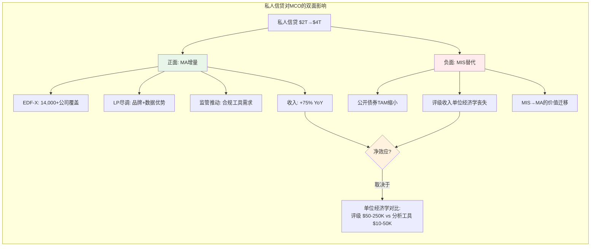

### 8.3 负面: 如果私人信贷侵蚀公开市场

核心逻辑: 每一笔从公开债券市场转向私人信贷的交易, MCO可能:
- **失去**: 一笔MIS评级收入($50,000-$250,000首次评级费+年度监测费)
- **获得**: 一份MA分析工具/信用评估收入(ARPU显著更低)

这个替代效应在几个领域尤其明显:

1. **中市场杠杆融资**: EBITDA $25-100M的企业曾经通过高收益债券或银团贷款融资(需要评级), 现在越来越多选择直接向私人信贷基金借款(不需要评级)。
2. **PE并购融资**: 收购融资(acquisition financing)是MIS企业评级收入的重要来源。如果PE转向unitranche私人信贷(单一贷方, 无需评级), MIS的并购融资评级需求会下降。
3. **再融资选择权**: 当公开市场利差走阔(经济下行期), 企业可能选择私人信贷再融资而非发行新债券——恰恰在MCO最需要发行量的时候, 私人信贷提供了替代选择。

### 8.4 单位经济学对比: 评级 vs 分析工具的完整解剖

这里需要把单位经济学拆得更细。评级和分析工具不仅是"收费高低"的差异, 而是两种完全不同的商业模式。

**MIS评级收入的单位经济学**:

一笔典型的$500M投资级企业债首次评级:
- 首次评级费: ~$100,000
- 年度监测费: ~$40,000/年
- 债券存续期(假设7年): 总收入 = $100K + $40K×7 = $380,000
- 分析师时间投入: 首次评级约200-300小时(高级+初级), 年度监测约30-50小时/年
- MCO边际成本: 分析师薪资成本约$30-50K/次评级(含overhead), 即边际利润率约70-80%
- 关键特征: **需求是制度驱动的(必须评级)**, 获客几乎零成本(发行人主动找MCO)

**MA分析工具收入的单位经济学**:

一个典型的私人信贷基金客户:
- 年度订阅费: $30,000-$80,000(取决于覆盖范围和数据深度)
- EDF-X平台使用费: $15,000-$40,000/年
- 定制分析报告: $5,000-$15,000/份(按需)
- 假设客户保留5年: 总收入 = ($50K+$25K)×5 = $375,000
- 技术+销售投入: 平台开发成本分摊+销售团队获客成本+客户支持
- 边际利润率: 约30-40%(含高昂的技术基础设施和销售成本)
- 关键特征: **需求是市场驱动的(需要证明ROI)**, 获客有成本(需要销售团队)

**对比汇总**:

| 维度 | MIS评级收入 | MA分析工具收入 |
|------|:----------:|:------------:|
| 首次费用/发行人 | $50,000-$250,000 | $10,000-$50,000(估算) |
| 年度经常性收入/客户 | $20,000-$100,000 | $5,000-$30,000(估算) |
| 生命周期总收入(7年) | $190K-$950K | $35K-$560K |
| 利润率 | ~64% Adj. OPM (段级别) | ~33% Adj. OPM (段级别) |
| 边际利润率 | ~70-80% | ~30-40% |
| 客户获取模式 | 制度需求驱动(必须评级) | 销售驱动(需要证明ROI) |
| 竞争格局 | 双寡头, 3家占91% | 分散, Bloomberg/FactSet/初创竞争 |
| 切换成本 | 极高(5层嵌入) | 中等(数据迁移+学习成本) |
| 定价权 | 极强(入场券定价) | 中等(需证明ROI优于竞品) |

**关键数学**: 假设一个中市场企业从$500M公开债券发行转向$500M私人信贷。MCO失去的评级收入约$100K-200K/年(首次+监测), 但可能获得的MA分析工具收入仅$10-30K/年。**替代比约5:1到7:1** — 即MCO需要从私人信贷市场获取5-7倍的客户, 才能在收入上抵消一个从公开市场转走的发行人。

更重要的是利润率差异: MIS的64% Adj. OPM意味着$100K评级收入≈$64K利润。MA的33% Adj. OPM意味着$20K分析工具收入≈$6.6K利润。**利润替代比高达约10:1。**

这个10:1的利润替代比是理解MCO面对私人信贷扩张时的核心数字。它意味着MCO的私人信贷策略不是"替代MIS", 而是"在MIS之外获取增量"。如果私人信贷真的大规模替代公开债券市场, MCO的利润率将面临结构性下移——从MIS的64% OPM向MA的33% OPM靠拢。

### 8.5 CI-MCO-003证据链: 净效应的判断框架

CI-MCO-003("私人信贷双面性")的核心问题是: 私人信贷的增长对MCO是净正还是净负?

**当前证据倾向: 短期净正, 长期不确定。**

**短期净正的理由**:
1. $2T→$4T的增长主要是"增量"而非"替代"——大部分私人信贷增长来自银行撤退后留下的真空, 而非对已有公开债券的替代
2. MCO私人信贷收入+75%的增速远高于MIS交易性收入的波动幅度
3. 在当前发行量历史新高的环境下, MIS并未表现出TAM缩小的迹象

**长期不确定的理由**:
1. 如果私人信贷市场持续增长至$4T+, 替代效应会逐渐显现——特别是在中市场杠杆融资领域
2. 单位经济学的5-7:1替代比(利润口径10:1)意味着MCO需要大幅扩大MA在私人信贷领域的覆盖, 才能保持中性
3. 更根本的问题: 私人信贷的增长削弱了MCO的**制度性嵌入**——在不需要公开评级的市场中, MCO的5层监管壁垒不适用, MCO只是一个"分析工具供应商", 面临Bloomberg/FactSet等对手的正面竞争

**监控指标(Kill Switch相关)**:
- 公开市场IG/HY发行量趋势 vs 私人信贷新增贷款趋势
- MCO私人信贷收入增速是否持续>MIS交易性收入增速的5-7x
- 中市场企业的公开vs私人融资选择比例变化
- 直接贷款(direct lending)规模 vs 杠杆贷款银团(leveraged loan syndication)规模的比例变化

**时间维度**: 私人信贷对MIS的替代效应不是"开关式"的, 而是"渐进式"的。即使替代比例每年仅增加1-2pp, 在5-10年的时间尺度上也可能累积为MIS TAM的5-15%缩减。这个缓慢侵蚀不会在任何单一季度财报中显现——它是一个需要持续追踪的结构性变量。

### 8.6 反向论证: 为什么私人信贷可能不是威胁?

在CI-MCO-003的分析中, 我们需要诚实地评估反向证据:

1. **私人信贷需要公开市场作为"锚"**: 私人信贷基金的贷款定价通常参考公开市场利差(SOFR+spread)。如果公开债券市场萎缩, 定价锚消失, 私人信贷基金自身的定价能力也会受损。从这个角度看, 公开市场和私人信贷是共生关系而非零和博弈。

2. **监管趋势偏向MCO**: SEC和欧洲监管机构正在推动私人信贷市场的透明度。越透明=越需要标准化的信用评估工具=越利好MCO。极端情况下, 如果监管要求私人信贷基金获取NRSRO评级(尚无此趋势, 但逻辑上可能), 私人信贷反而会变成MIS的纯增量。

3. **大型企业仍偏好公开市场**: 私人信贷主要服务于中市场($25-100M EBITDA)。大型企业($500M+ EBITDA)仍然偏好公开债券市场——规模效应(单次发行$1B+)和流动性优势使公开发债的总融资成本更低。MCO的核心评级收入来自大型企业, 而非中市场。

4. **历史教训**: 2005-2007年, 市场也曾担忧结构化产品(CDO/CLO)会"替代"传统企业债。结果是两个市场共同膨胀。市场规模不是零和的——金融创新通常扩大总盘子, 而非重新分配。

这些反向证据并不否定CI-MCO-003的核心逻辑, 但提醒我们: 替代效应的速度可能比线性外推更慢, 且存在结构性限制。

### 8.7 MCO-MSCI合作的战略意义

MCO与MSCI的EDF-X合作是MCO私人信贷战略的关键棋子。这个合作的深层逻辑:

1. **数据互补**: MCO有信用模型(100年违约数据+EDF模型), MSCI有私募基金底层持仓数据(通过LP报告获取)。单独一方无法覆盖私人信贷的评估需求。
2. **卡位策略**: 私人信贷市场正在从"关系驱动"向"数据驱动"转型。MCO-MSCI的合作旨在成为这个转型的标准基础设施——类似于MCO在公开市场的5层嵌入, 但这次是通过产品嵌入而非制度嵌入。
3. **防御性**: 如果MCO不主动进入私人信贷, Bloomberg或新兴的替代数据平台可能填补这个空白。MCO-MSCI合作是一个"宁可自我蚕食, 不可拱手让人"的战略。

**但风险在于**: 在私人信贷市场, MCO没有5层监管嵌入的保护。EDF-X需要与Bloomberg PORT、BlackRock Aladdin、其他信用分析工具竞争。MCO在这个市场的护城河是数据和品牌, 而非制度——这意味着竞争强度会显著高于MIS。

---

### 8.8 私人信贷情景矩阵

综合正面/负面/反向论证, 构建三个情景:

| 情景 | 私人信贷规模(2030) | 公开债券影响 | MCO净效应 | 概率估计 |
|------|:-----------------:|:----------:|:--------:|:------:|
| **共生增长** | $4T+(共识) | 公开市场同步增长 | 净正(MA增量>MIS损失) | 45% |
| **温和替代** | $3.5-4T | 中市场发行-10~15% | 近中性(MA增量≈MIS损失) | 35% |
| **加速替代** | $5T+ | 中市场+部分大企业转向 | 净负(MIS损失>MA增量) | 20% |

"共生增长"情景下, 私人信贷增长主要来自银行撤退后的增量需求, 而非对公开市场的替代。MCO通过MA工具获得$200-400M年化增量收入, MIS核心评级收入不受影响。

"温和替代"情景下, 中市场($25-100M EBITDA)企业逐步偏向私人信贷, MIS在这个客群的评级收入每年下降$50-100M, 但MA的私人信贷工具收入增长$30-80M, 基本对冲。

"加速替代"情景——私人信贷渗透到更大规模的企业融资——是真正的风险。但这需要利差环境持续有利于私人信贷(即公开市场利差持续高于私人信贷成本), 这在低利率环境下不太可能持续。

---

## 本章小结: MIS的"二重性"

MIS评级业务的核心特征是**深刻的二重性**:

| 维度 | "基础设施"面 | "周期股"面 |
|------|:----------:|:--------:|
| 收入性质 | 33%经常性(~$1.4B年金) | 67%交易性(~$2.8B周期) |
| 利润率 | 64% Adj. OPM | FY2022暴露经营杠杆(-920bps) |
| 护城河 | 5层监管嵌入(不可复制) | 发行量依赖利率/信用周期 |
| 定价权 | 低份额钱包+无弹性需求 | 发行量=0时定价权无意义 |
| 私人信贷 | 5层嵌入不适用→竞争加剧 | MA增量 vs MIS替代(利润口径10:1) |
| 到期墙 | 存量债务持续产生监测费 | FY2027-28再融资驱动力衰减 |

市场当前定价(P/E 31.5x)更多反映"基础设施"面——稳定、防御、类SaaS。但36%的交易性收入敞口意味着MCO在衰退年份的表现更接近"周期股"面。

**这个二重性是CQ-1的核心**: MCO应该得到什么估值? 答案不是"基础设施溢价"或"周期股折价", 而是需要一个混合框架——在Phase 2的SOTP估值中, 我们将尝试分别为MIS的经常性基底(类SaaS倍数)和交易性增量(周期股倍数)赋值, 以捕捉这个二重性。

**CQ-1的估值含义量化**:
- 如果市场完全忽略周期性(纯SaaS定价): P/E 35-40x → $478-$547 (基于FY2025E adj. EPS $13.67)
- 如果市场充分定价周期性(混合框架): P/E 25-28x → $342-$383
- 当前P/E 31.5x处于两个极端的中间偏上——隐含市场"记得一点周期性, 但不太多"

CI-MCO-002的投资含义: 如果衰退确实在FY2026-2027发生, P/E将从"中间偏上"回到"充分定价周期性"的区间, 叠加EPS下降, 形成25-30%的下行风险。如果衰退不发生, 当前定价已经部分反映了周期缓和预期(年初至今-17%可能已部分消化了衰退恐惧), 上行空间约15-25%(回到$490-$540区间, 接近分析师共识$560)。

**非对称性结论**: 当前价位的风险/回报约为 -25~30% / +15~25%, 略偏不对称。这个不对称性的程度取决于衰退概率——如果真实衰退概率>35%(当前Polymarket 34.5%, Moody's自己的模型42-48%), 则当前价位的期望回报为负。这一判断将在Phase 2的情景分析中量化验证。

---

MIS评级特许权的分析揭示了一个深刻的二重性：它既是金融基础设施（5层监管嵌入、$130T制度依赖），又是周期性资产（36%交易性收入、FY2022级别的EPS波动）。市场当前定价更多反映前者——稳定、防御、类SaaS。接下来Part III将转向MCO的第二个引擎：Moody's Analytics平台。如果说MIS的价值在于"不可替代性"，MA的价值则在于"可扩展性"——但这种扩展性是否已经实现，还是仍停留在管理层叙事中？

---

## Part III: Moody's Analytics平台

### Ch09: 三产品线深度解剖

MA FY2025总收入$3.599B，占MCO整体的46.6%。ARR $3.498B，经常性收入占比96%。但这个"96%"背后的三条产品线，护城河宽度、增长天花板、AI脆弱度完全不同。

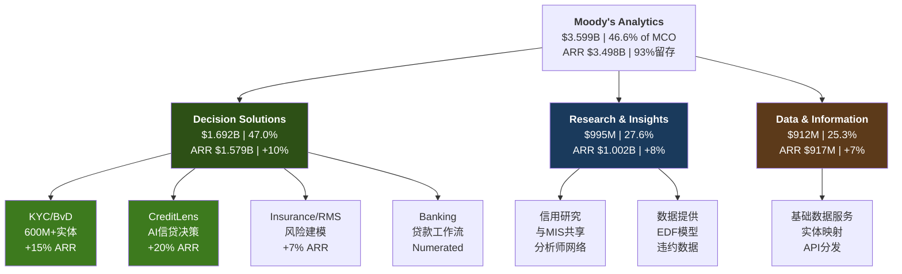

#### Decision Solutions ($1.692B, 47.0% of MA)

Decision Solutions是MA中增速最快（ARR +10%）、战略价值最高的产品线。ARR $1.579B，占MA ARR的45%。它由四个子模块构成，每个子模块的驱动逻辑完全不同。

**KYC/BvD（估算约$500-600M ARR, +15%）**

BvD是2017年以EUR 3B收购的实体数据库，拥有600M+全球实体数据。这不是一个"数据集"，而是一个**实体图谱基础设施**——将全球企业的股权结构、受益所有人、财务数据映射成机器可读的关系网络。

护城河宽度：**宽**。原因有三：数据网络效应（600M+实体是持续10年+的清洗、映射、更新的累积，新进入者需要5年+才能达到可用覆盖度）；监管驱动的刚性需求（AML/KYC法规在全球持续收紧，欧盟6AMLD、美国CTA都要求金融机构验证实体所有权链）；流程嵌入（BvD嵌入银行合规流程的基础设施层，切换意味着重新验证整个合规链条）。

+15% ARR增速在MA各子模块中最高，主要驱动力是监管加码（需求侧拉动）而非产品创新（供给侧推动）。这种增长更可持续，但天花板值得关注：全球主要银行已基本覆盖，增量主要来自中小金融机构+非金融企业。如果监管强度稳定而非继续加码，增速可能从15%回落至10-12%。

**CreditLens（估算约$300-400M ARR, +20%）**

CreditLens是AI增强的信贷决策工作流工具。关键数据点：2/3续约客户选择升级AI版本，ARPU提升+67%。这是MCO全产品矩阵中**最佳的upsell案例**。

这个+67% ARPU提升说明了什么？首先，它证明AI不是成本——是定价权放大器。当CreditLens从"信贷流程管理工具"升级为"AI辅助信贷决策系统"，客户愿意为"更快更准的审批"支付67%溢价。这是因为CreditLens的AI训练在MCO独有的违约数据+评级模型之上，竞争对手无法复制这一数据优势。其次，2/3的升级率意味着剩余1/3尚未升级——这是FY2026-2027的内嵌增长。

护城河宽度：**中-宽**。数据优势（违约模型）是真实的，但信贷决策工具市场有nCino、Temenos等竞争者。CreditLens的差异化在于MCO信用数据的独家嵌入，而非软件本身。

**Insurance/RMS（估算约$400-500M ARR, +7%）**

RMS是2021年以$2B收购的保险风险建模平台。管理层确认已达到$150M增量收入目标。保险ARR在2年内累计增长+21%。

成功面：$150M增量/$2B收购价 = 7.5%的第一年收入回报率，对数据/软件收购可接受。不足面：+7%的保险ARR增速是Decision Solutions四个子模块中最慢的。保险行业的IT预算分配保守，RMS虽然是行业标准，但客户升级周期长（3-5年）。更关键的是，保险业务与MCO核心的信用分析能力协同度最低——这更像是一个"相邻市场扩张"而非"飞轮组件"。

护城河宽度：**中**。灾害模型有数据壁垒，但AIR Worldwide（Verisk）是强力竞争者。

**Banking/Numerated（估算约$100-200M ARR）**

Numerated是小额商业贷款数字化工具，主要服务美国社区银行。这是最小的子模块，管理层披露最少。Banking子模块的切换成本可能是DS中最低的，因为商业贷款审批流程标准化程度高，替代方案（如nCino）成熟。

#### Research & Insights ($995M, 27.6% of MA)

R&I是MA中最独特的产品线，因为它直接建立在MIS评级分析师网络之上。ARR $1.002B，增速+8%。

这条产品线的护城河来源与DS完全不同：不是数据库或软件，而是**信用分析专业知识的产品化**。MCO拥有全球最大的信用分析师团队（约3,500人），这些分析师产出的研究、模型、方法论，通过R&I变成了可订阅的产品。

R&I是MIS与MA之间最直接的协同证据。没有MIS的评级特许权和分析师网络，R&I无法独立存在。正面来看，R&I是评级特许权的"二次变现"——同一支分析师团队，既产出评级（MIS收入）又产出研究（MA收入）。负面来看，R&I的成本归属模糊——如果MIS分担了大部分分析师成本，R&I的"真实利润率"可能比报表显示的更高。

护城河宽度：**中-宽**。信用研究市场的竞争者（Bloomberg Intelligence, CreditSights/Fitch Solutions）都缺乏MCO级别的评级数据独占性。但AI时代可能削弱"人工分析师解读"的价值。

#### Data & Information ($912M, 25.3% of MA)

D&I是MA的"基础层"——提供实体数据映射、信用数据feed、API接口。ARR $917M，增速+7%，是三条线中最慢的。

D&I的增速最慢有结构性原因：数据层被商品化风险最高（原始信用数据可从多来源获取），价格弹性低（基础数据服务提价空间有限）。但D&I也有"隐藏价值"：它是DS和R&I的数据供应层。没有D&I的实体映射和数据清洗，DS的KYC工具和R&I的信用研究都无法运作。这使得D&I虽然增速慢，但战略上不可或缺——类似于"水管"而非"水龙头"。

护城河宽度：**窄-中**。数据层最容易被AI替代（自动化数据清洗+NLP提取），也最容易被Bloomberg/FactSet/Refinitiv等竞争者覆盖。

---

### Ch10: SaaS纯度检验 — 93%留存的真实含义

#### 留存率: 93%的真实含义

93%留存率是MCO每季度确认的硬KPI。Q1/Q3/Q4 2025均确认93%，数据一致性高。这vs SPGI MI（仅"推断95%+"，无硬数据）是一个明确优势——我们知道MCO的留存率是什么，而SPGI的留存率是一个假设。

但93%在SaaS世界意味着什么？

**Tier 1 SaaS（95%+ gross retention）**：Veeva（97%+）、ServiceNow（97%+）、Workday（95%+）——这些是"工作流操作系统"，客户一旦使用就无法脱离。

**Tier 2 SaaS（92-95% gross retention）**：Salesforce（约93%）、HubSpot（约93%），以及MCO MA（93%）——这些是"优秀但非不可替代"的产品，客户留存高但仍有7%年流失。

7%年流失率意味着什么？假设MA当前客户基数约15,000家，每年流失约1,050家。要维持8%净ARR增长，需要抵消7%流失（约$245M）加上8%净增（约$280M），**总计MA每年需要约$525M的gross新增ARR**。$525M的新增ARR需求vs $3.5B存量ARR = gross新增率约15%。这在SaaS世界是健康的，但也意味着MA的增长引擎需要持续运转——它不是一个"自然增长"的业务。

#### 留存率的"隐藏维度": 按产品线拆解

93%是MA整体的blended gross retention。但不同产品线的留存特征截然不同：

- **KYC/BvD**：留存率可能95%+（估算）。监管刚需+流程嵌入，MA中最接近"基础设施"属性的产品
- **CreditLens**：留存率可能92-94%（估算）。切换成本中等，但MCO信用数据的独家嵌入提供了粘性
- **Insurance/RMS**：留存率可能90-92%（估算）。合同周期长但AIR Worldwide是强力替代选项
- **D&I**：留存率可能89-91%（估算）。基础数据服务切换成本最低，7%增速已暗示了更高流失率

93%的整体留存率是一个"混合平均值"，掩盖了KYC的95%+（优秀）和D&I的89-91%（需警惕）之间的巨大差异。**MA的留存质量取决于KYC和CreditLens能否持续锚定高端，而D&I的低端留存不被进一步侵蚀**。

#### NRR(净收入留存): 缺失的关键指标

MCO不披露NRR。这是一个重要的信息缺口。

93%是gross retention。根据CreditLens +67% ARPU升级率和KYC +15%增速，可以推断NRR在**102%左右**——如果ARR增长8%而gross retention 93%，则新签+扩展合计贡献15%；假设新签vs扩展约6:9的比例（SaaS行业典型），扩展率约9%，则NRR约93% + 9% = 102%。

但102%在SaaS世界仍然偏低（Tier 1 SaaS: NRR 120%+）。这反映了MA的本质：它不是一个"land and expand"模式的纯SaaS公司，而是一个**数据订阅+软件工具的混合体**。数据订阅部分（D&I）的扩展空间有限，软件部分（CreditLens）扩展空间大但基数小。

**NRR缺失的投资者风险**：没有NRR，投资者无法判断8%增长中"扩展"（高质量增长）和"新签"（需持续销售投入）的比例。CreditLens AI的+67% ARPU升级暗示扩展动力在增强，但这只是一个子产品的信号，不能外推到整个MA。

#### 97%经常性收入 vs 8%增长的悖论

97%经常性收入证明订阅模型已经成熟——MA几乎没有一次性收入。但97%经常性+8%增长的组合暴露了一个问题：**高经常性并不等于高增长**。

| 公司 | 经常性收入% | ARR增长 | P/E | 类型 |
|------|:----------:|:------:|:---:|------|
| MCO MA | 97% | 8% | （混入MCO整体） | 数据+软件混合 |
| Veeva | 85% | 14% | 32x | 垂直SaaS |
| ServiceNow | 97% | 22% | 55x | 平台SaaS |
| FactSet | 95% | 6% | 28x | 数据订阅 |
| MSCI | 95% | 15% | 35x | 指数+分析 |

MA的增速（8%）更接近FactSet（数据订阅商）而非ServiceNow（平台SaaS）。如果市场按"平台SaaS"给MA估值，这是过度乐观；如果按"数据订阅商"估值，当前定价可能更合理。

#### 真平台 vs 数据堆栈

MA是"数据堆栈"（通过收购拼凑）还是"真平台"（统一数据层+交叉销售）？

**平台证据**（支持"真平台"）：RiskTech100连续4年排名第一；MCO正在构建统一的保险Risk Data Lake环境；GenAI渗透40% MA ARR——AI功能跨产品线部署（非单一产品），说明底层存在可共享的技术基础设施；CreditLens AI升级利用MCO信用数据——DS产品可以调用R&I/D&I的数据层；96%经常性收入 + 93%留存，基数稳定性符合平台特征。

**堆栈证据**（支持"数据堆栈"）：收购拼凑——BvD(2017)+RMS(2021)+Numerated+CAPE+Meris，五次主要收购构成了DS的骨架，非有机生长；子产品间协同度可疑——KYC客户（银行合规部门）和Insurance客户（保险精算部门）几乎没有交叉；利润率长期偏低——MA Adj. OPM 33.1%，真正的SaaS平台应该展现更快的利润率扩张；ARR增速仅8%——如果"平台飞轮"在运转，增速应该加速而非停留在个位数；MA总裁Stephen Tulenko 2025年8月辞职——核心领导层不稳定暗示内部整合可能面临挑战。

**判断**：MA更接近"进化中的数据堆栈"而非"已验证的真平台"。平台的种子已经播下（Intelligent Risk Platform, GenAI跨产品部署），但果实尚未成熟——8%增速和33% OPM说明飞轮效应尚未加速。这是一个"3-5年的期权"：如果整合成功，MA可以升级为平台（ARR增速12%+, OPM 38%+）；如果失败，MA将停留在"数据订阅商"层级（ARR 6-8%, OPM 33-35%）。

**对估值的含义**：如果MA是"真平台"（40%概率），应得6-8x revenue（约$21-28B）；如果MA是"数据堆栈"（60%概率），应得4-5x revenue（约$14-18B）。概率加权MA合理EV：0.4×$24.5B + 0.6×$16B = $16.6B。差异约$10-13B，占MCO当前市值（$77.3B）的13-17%——这就是MA属性判断对估值的实质影响。

**关键追踪指标**：判断MA是否向"真平台"演进的3个领先指标：(1)交叉销售率提升至40%+；(2)MA OPM 3年内达到38%+；(3)MCO开始披露NRR且>110%。

---

### Ch11: 收购整合审计

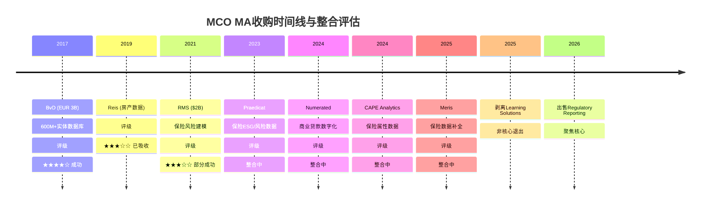

#### BvD (2017, EUR 3B): 成功 ★★★★☆

**收购逻辑**：补数据。MCO的评级业务拥有发行人信用数据，但缺乏全球企业实体数据。BvD的600M+实体数据库填补了这个空白，使MCO从"评级数据公司"升级为"全球实体数据公司"。

**整合验证**：BvD数据库成为KYC产品线的骨干——没有BvD，MCO的KYC产品不存在；KYC ARR +15% = BvD收购8年后仍在加速增长；估算KYC/BvD ARR约$500-600M → vs EUR 3B收购价 = 约6年回收期，对数据资产来说合理；BvD数据同时供给DS（KYC）和D&I（实体映射），实现了跨产品线价值。

**不足**：BvD收购带来的Goodwill和无形资产是D&A持续上升（$331M→$480M）的主要原因之一。EUR 3B收购产生的无形资产摊销约$150-200M/年，这是GAAP利润的结构性拖累。

#### RMS (2021, $2B): 部分成功 ★★★☆☆

**收购逻辑**：补场景。MCO核心能力是信用风险，RMS扩展到保险风险（自然灾害/气候）。战略意图是将MCO从"信用风险基础设施"升级为"全风险类型基础设施"。

**整合验证**：达到$150M增量收入目标——管理层承诺兑现；保险ARR +21%（2年累计）；后续收购（Praedicat/CAPE/Meris）证明MCO在持续投入保险生态。

**不足**：$2B收购价 vs 约$400-500M保险ARR = 隐含4-5x revenue multiple，对于+7%增速的业务偏贵；保险与信用的协同度低于预期（保险精算师和信用分析师是两个几乎不重叠的专业群体）；后续$400M的补充收购说明RMS本身不够"完整"。

#### 剥离: 聚焦信号

Learning Solutions（2025.12关闭）+ Regulatory Reporting（2026出售），合计对MA FY2026增速造成约180bps拖累。这个剥离信号是积极的：MCO在修剪非核心枝叶，将资源集中在KYC+CreditLens+Insurance三个增长引擎上。

#### 收购回报率综合评估

| 收购 | 价格 | 估算当前ARR | 收入倍数(买入) | 增速 | IRR估算(7年) | 评级 |
|------|------|:----------:|:-------------:|:----:|:-----------:|:----:|
| BvD | EUR 3B (~$3.4B) | ~$500-600M | ~7x | +15% | 12-15% | ★★★★☆ |
| RMS | $2.0B | ~$400-500M | ~4-5x | +7% | 6-8% | ★★★☆☆ |
| 小型收购(合计) | ~$400M | ~$80-120M | ~4-5x | 整合中 | TBD | 待评 |

BvD的IRR（12-15%）显著高于RMS（6-8%），因为BvD的增速更快（监管驱动）且与MCO核心业务协同度更高。RMS的IRR偏低，但如果保险生态整合成功，长期回报可能提升至10%+。

**收购vs回购的资本配置选择**：FY2025 MCO回购$1.706B，在P/E 31x下的回购收益率约3.2%（EPS yield）。相比之下，BvD的IRR 12-15%远优于回购，而RMS的6-8%与回购收益率接近。这暗示：**MCO过去的大型数据收购（BvD）是优秀的资本配置，但近年在缺乏同等质量标的的情况下，大量回购成为"次优选择"。**

#### Goodwill稳定但D&A上升的含义

Goodwill $6.368B，从FY2022的$5.84B到FY2025仅+9%——说明MCO没有"疯狂收购"。但D&A从$331M升至$480M(+45%)，增速远超Goodwill增速。

这个"Goodwill慢增/D&A快增"的剪刀差说明：新收购产生的无形资产正在加速摊销。Adj. OPM（51.1%）加回了这些摊销，但GAAP OPM（44.8%）才反映了"维持这些收购资产的真实经济成本"。

如果BvD/RMS的无形资产完全摊销完毕（通常10-15年），D&A会显著下降，GAAP OPM会自然收敛到Adj. OPM。但在这发生之前（预计2027-2032年期间BvD开始），投资者需要决定：看Adj.还是看GAAP？对于数据/软件公司，行业惯例是看Adj.——但这不意味着$480M D&A是"不存在的成本"，它是收购溢价的分摊偿还。

---

### Ch12: AI — 武器还是威胁?

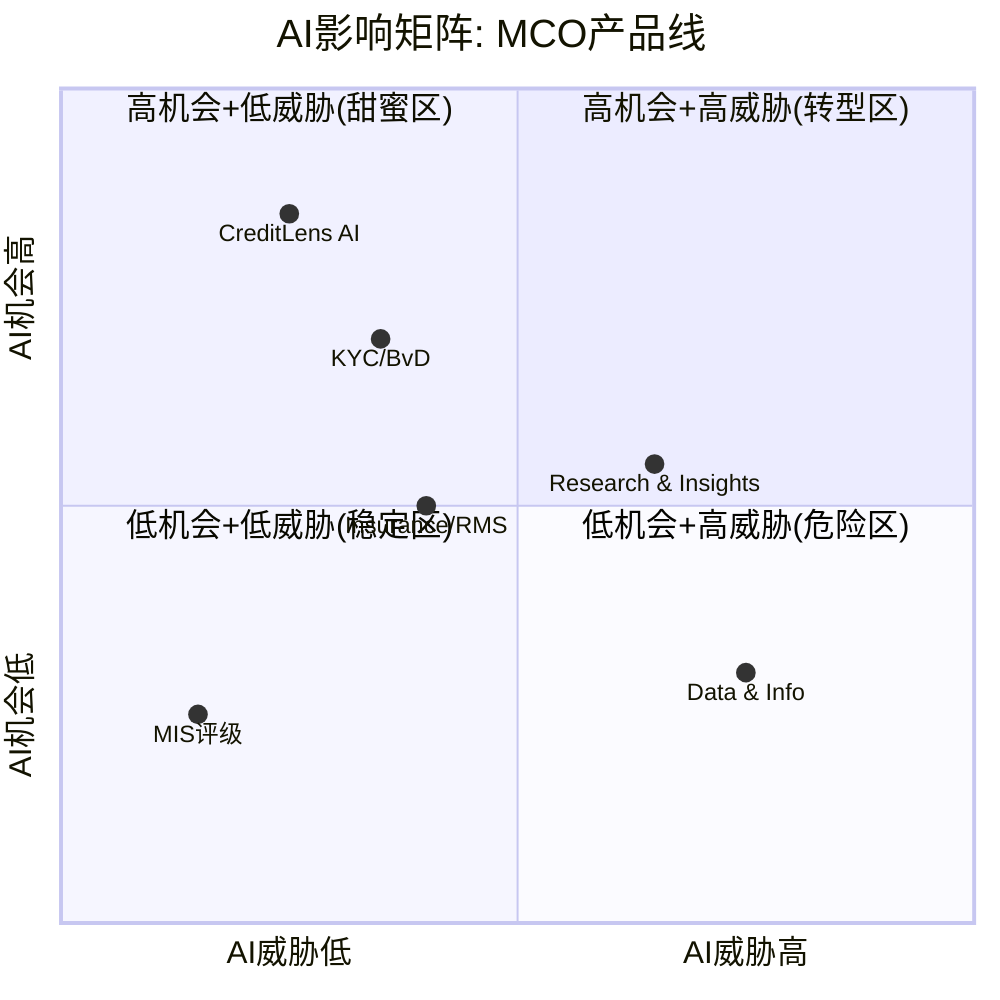

#### AI武器: GenAI已经在赚钱

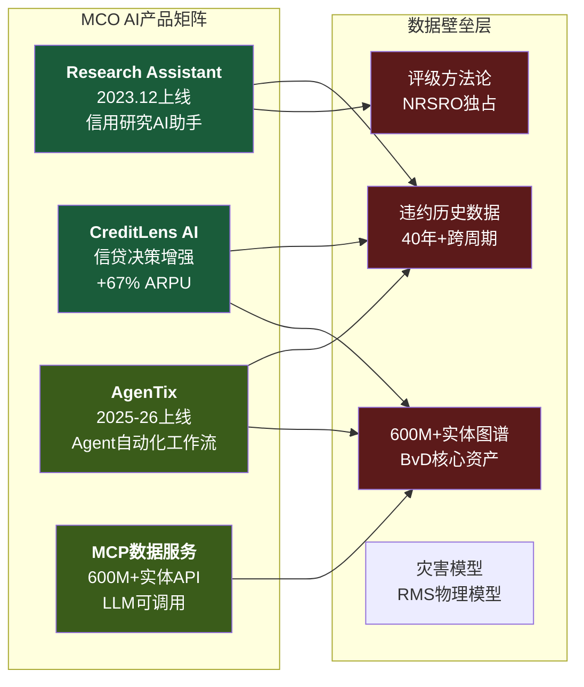

MCO在AI货币化方面的进展超出多数分析师预期：

- **40% MA ARR含GenAI功能**（约$1.4B）——这不是"计划"，而是已经部署的产品
- **独立GenAI客户$200M+，增速2x MA整体**——存在一个正在加速增长的纯AI收入池
- **97%留存率（GenAI客户）**——GenAI客户粘性甚至高于MA整体（93%）
- **CreditLens AI：2/3续约升级，+67% ARPU**——AI直接推动定价权
- **Research Assistant**（2023.12上线）——AI辅助信用研究，降低分析师入门门槛
- **AgenTix**（2025-2026上线）——Agent框架，自动化风险工作流

关键洞见：MCO的AI战略不是"把AI加到现有产品上"，而是"用AI重新定义产品的价格锚点"。CreditLens从"$X/年的信贷流程工具"变成"$1.67X/年的AI信贷决策系统"——功能升级+价格升级同步。这种策略的成功前提是：**AI功能必须依赖MCO独有数据（违约模型+实体图谱），否则客户可以用通用AI替代**。

#### AI威胁: 分层评估

**MIS评级：AI威胁极低**。NRSRO牌照是监管壁垒，AI不能"自动评级"——监管要求人类分析师负责。评级方法论的法律效力不可被AI模型替代。MIS对AI几乎免疫，这是MCO最强的"AI护城河"。

**Decision Solutions：AI威胁低-中**。KYC/BvD的实体数据库本身不会被AI替代（AI需要数据输入），但AI可能降低数据清洗成本，使新进入者更容易构建竞品，时间线3-5年。CreditLens的AI增强了产品但也意味着"如果客户可以自建AI信贷模型"的长期风险，防线是MCO违约数据库的独占性，时间线5-7年。

**Research & Insights：AI威胁中**。信用研究报告是AI最容易产出的内容类型之一——GPT-4+财务数据API已经可以生成及格水平的信用分析。MCO的差异化在于评级分析师的独家洞见和EDF违约预测模型——但AI可能缩小这一差距。R&I是最早感受到竞争压力的产品线，时间线2-4年。

**Data & Information：AI威胁中-高**。基础数据清洗、结构化、映射——这恰好是AI最擅长的任务。Bloomberg/FactSet已经在用AI增强数据产品，创业公司在用AI重建垂直数据管道。D&I 7%增速已经反映了商品化压力。这是最脆弱的产品线，时间线1-3年。

#### AI净效应评估

| 产品线 | AI武器效果 | AI威胁等级 | 净效应 |
|--------|:---------:|:---------:|:------:|
| MIS评级 | 低（效率工具） | 极低 | 微正 |
| CreditLens | 高（+67% ARPU） | 低-中 | 强正 |
| KYC/BvD | 中（增强搜索） | 低-中 | 正 |
| Insurance | 中（灾害建模） | 中 | 微正 |
| R&I | 中（Research Assistant） | 中 | 中性/微负 |
| D&I | 低（API化） | 中-高 | 负 |

**整体净效应**：正面，但**不均匀**。CreditLens的AI武器效果强烈（+67% ARPU）拉动了整体正面叙事，但D&I的AI威胁和R&I的内容层压缩风险被叙事掩盖。

关键风险：如果市场叙事从"MCO是AI受益者（看CreditLens）"转向"MCO的数据层被AI商品化（看D&I）"，估值重评可能很快发生。YTD -17%的下跌中已经包含了一部分这种重评——但目前市场似乎更多归因于宏观（衰退概率+SPGI弱指引）而非AI结构性威胁。

#### AI竞争格局: 竞争边界正在模糊化

**传统竞争者的AI动作**：Bloomberg已整合GPT-4级别模型进入Terminal（vs R&I直接竞争）；FactSet推出Mercury AI助手（vs D&I竞争）；SPGI MI整合AI增强搜索，但与MA直接竞争面较窄；Verisk/AIR Worldwide在保险风险建模领域与RMS竞争。

**新型竞争者**：垂直AI创业公司专注信贷决策（如Pagaya）、KYC合规（如ComplyAdvantage）；大型科技公司（Google Cloud/AWS/Azure）提供通用风险分析API，可能长期侵蚀"中间层"。

#### MCO的AI防御纵深

MCO的AI防御不是"一道墙"，而是"多层纵深"：

1. **第一层（最强）：监管牌照**——NRSRO评级不可被AI替代，保护了MIS的$4.1B收入
2. **第二层（强）：独有数据**——40年+违约历史数据库+600M实体图谱，AI需要这些数据作为输入，不是AI能生成的
3. **第三层（中等）：模型优势**——EDF违约预测模型、RMS灾害物理模型，训练在独有数据上
4. **第四层（较弱）：流程嵌入**——KYC合规流程、CreditLens信贷工作流嵌入客户IT架构，切换成本中等
5. **第五层（最弱）：内容/分析**——R&I的信用研究报告和D&I的基础数据服务，最容易被AI替代

MCO的AI防御呈"倒金字塔"形——最有价值的层（监管+数据）最安全，最薄弱的层（内容+基础数据）恰好是AI冲击最大的。这意味着AI对MCO的威胁不是"致命的"，而是"渐进的边际侵蚀"——从D&I开始向上蔓延，但在触及MIS评级之前会被监管壁垒挡住。时间线：3-5年内D&I可能面临实质性增速下滑（从7%到3-5%），但MIS和DS核心业务不会受到实质性影响。

---


MA平台的全景分析揭示了MCO第二引擎的真实面貌——93%留存率和$3.5B ARR证明了SaaS属性，但33% OPM和收购整合的持续挑战说明MA尚未达到一流SaaS平台的利润率水准。AI既是MCO的武器（GenAI客户97%留存），也是长期威胁（D&I层最脆弱）。接下来Part IV将检验MCO整体护城河的坚固程度——从MIS×MA飞轮的真实性，到CQI量化评估和地理扩张的突破口。

---

## Part IV: 竞争护城河

> *从Part III的MIS与MA分部深入,我们已经看到MCO是一家拥有两种截然不同利润率结构的混合体。但真正决定MCO长期价值的,不是单个分部的运营效率,而是这家公司能否在未来30-50年继续坐在信用评级市场的"收费站"上。Part IV将从博弈论、制度嵌入和地理扩张三个维度,检验这个收费站的坚固程度。*

### Ch13: 寡头博弈 — 50年格局不变的Nash均衡

#### 13.1 三极格局的数字画像

信用评级行业的市场结构可以用一组数字精确刻画: MCO约40%、SPGI约40%、Fitch约15-20%, Big Three合计占NRSRO收入的91%。全球注册的NRSRO有10家, 但剩余7家合计占比不到9%。这不是一个"有竞争但集中"的市场, 而是一个结构性锁定的寡头格局。

更值得注意的是时间维度: 这个格局自1970年代SEC确立NRSRO制度以来, 基本没有发生过实质性变化。半个世纪。期间经历了2008年金融危机(评级机构被国会传唤)、2010年Dodd-Frank改革(明确要求降低对评级的依赖)、2013年CRARA修正案(进一步强化监管)——每一次"改革"的结果都是: Big Three的份额不变或更高。

这不是偶然。这是博弈论意义上的Nash均衡。

#### 13.2 Nash均衡分析: 为什么无人降价

信用评级不是一个价格竞争的市场。理解这一点需要看清评级需求的本质: 发行人购买评级不是为了"获得一个好分数", 而是为了获得进入资本市场的通行证。没有评级, 绝大多数机构投资者的合规手册不允许购买该债券; 没有评级, Basel III框架下银行的资本计提成本大幅上升。

这意味着评级需求是价格非弹性的:
- 降价不会创造新的评级需求(发行人要么需要评级, 要么不需要)
- 降价只会减少自己的收入, 同时不会增加份额(因为大多数发行人需要"双评级")
- 提价几乎不会丢失客户(发行人不会因为评级费上涨而放弃发债)

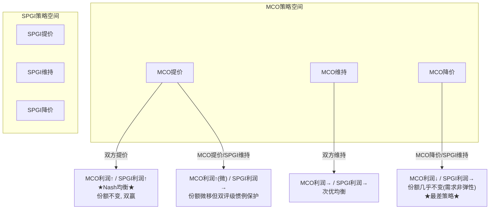

上述3×3简化模型揭示了核心逻辑, 但真实的策略空间还包括第四个维度: 创新投资。当我们将策略空间扩展为4×4(降价/维持/涨价/创新), 博弈结构变得更加有趣:

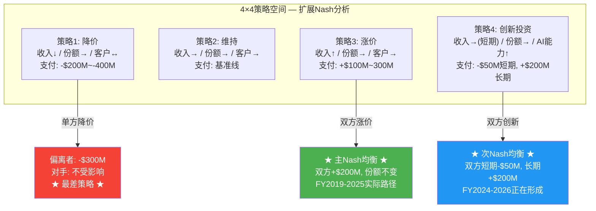

**为什么"创新"正在成为第二均衡点?** FY2024-2025, MCO和SPGI同时加大AI投资: MCO的GenAI渗透率40% ARR, SPGI的Kensho平台。这不是巧合——在双寡头博弈中, 如果一方投资AI而另一方不投, 投资方将在MA/MI等非评级业务上获得数据和效率优势, 长期侵蚀另一方的客户基础。因此双方同步投资AI是第二个稳定均衡: 短期压缩利润率(MCO FY2025 MA OPM 33.1%部分归因于AI投资), 但阻止对方在非评级领域拉开差距。

**支付矩阵的定量估计**:

| MCO \ SPGI | 降价 | 维持 | 涨价 | 创新 |
|------------|------|------|------|------|
| **降价** | (-300, -300) | (-350, 0) | (-400, +200) | (-350, +50) |
| **维持** | (0, -350) | (0, 0) | (-50, +200) | (-30, +50) |
| **涨价** | (+200, -400) | (+200, -50) | **(+200, +200)★** | (+150, +50) |
| **创新** | (+50, -350) | (+50, -30) | (+50, +150) | **(-50→+200, -50→+200)★** |

矩阵单位: 百万美元/年增量。★标记两个Nash均衡。"涨价-涨价"是静态均衡(当前状态), "创新-创新"是动态均衡(正在形成)。降价在所有组合中都产生负支付——这解释了为什么信用评级行业50年来从未出现价格战。

FY2024的数据验证了这个均衡: MIS收入+33%但评级发行量仅+42%, 意味着MCO在发行量之上还叠加了定价提升。SPGI的Ratings部门同期也实现了类似的收入弹性。双寡头同步提价, 无人偏离。

这种Nash均衡之所以如此稳定, 根源在于评级市场的"双评级惯例"。全球投资级债券市场的事实标准是: 发行人同时获得MCO和SPGI两家的评级。这不是法律强制, 而是市场自发形成的惯例——只持有一家评级的债券, 流动性更差、利差更宽。这意味着MCO和SPGI不是在争夺同一块蛋糕, 而是在共同做大蛋糕。双评级惯例让价格竞争从根本上失去了意义: 即便你降价50%, 发行人仍然需要另一家的评级, 你只不过让自己少赚了钱。

#### 13.3 进入壁垒五层堡垒

为什么10个NRSRO只有3个有实质规模? 壁垒不是单层的, 而是五层叠加:

**第一层: 监管许可(NRSRO牌照)**。获得NRSRO注册是进入评级行业的最低门槛。但牌照本身不等于市场——2024年数据显示, Big Three占非政府证券评级的84%, 7家小型NRSRO分享剩余16%。牌照是必要条件, 不是充分条件。

**第二层: 历史信用数据库**。MCO拥有超过100年的违约和回收率数据(Moody's Investors Service成立于1909年)。这些数据是评级方法论的校准基础。新进入者即使拥有同样的分析能力, 也缺乏这个历史数据库来校准模型——而没有经过周期验证的模型, 投资者不会信任。

**第三层: 双评级惯例**。如上所述, 大多数发行人同时获得MCO和SPGI的评级。新进入者即使获得了第一个评级合同, 发行人仍然需要MCO或SPGI的第二个评级。双评级惯例不是MCO的壁垒, 而是MCO+SPGI共同构筑的行业壁垒。

**第四层: 客户组织惯性**。评级关系是长期关系。发行人的财务团队、投行承销商、投资者合规团队都围绕MCO/SPGI的评级体系建立了工作流程。更换评级机构意味着: 重新建立分析师关系、重新理解方法论、重新校准内部风控模型。这些"软性"成本远超评级费本身。

**第五层: 合规成本反向壁垒**。Dodd-Frank改革后, NRSRO的合规成本大幅上升(年度SEC检查、独立合规官、方法论公开审查等)。这些成本对Big Three是可忽略的(占收入<1%), 但对小型NRSRO可能是收入的10-20%。监管本意是降低集中度, 实际效果是抬高了小玩家的运营门槛——这就是"壁垒矛盾"。

五层壁垒的叠加效应意味着: 即使某一层被突破(比如AI技术让新进入者获得类似的分析能力), 其余四层仍然完整。这不是单一技术或监管变化能撼动的结构。

**壁垒量化: 新进入者的成本账单**

五层壁垒不是抽象概念, 可以粗略量化一个假想的"新进入者"面临的成本:

| 壁垒层 | 成本/时间估算 | 可压缩性 |
|--------|-------------|---------|
| L1: NRSRO牌照 | $2-5M申请费 + 12-24月SEC审批 | 中(可加速但不可跳过) |
| L2: 违约数据库 | 需15-20年积累可信违约统计; 购买历史数据约$50-100M但缺乏自有验证 | 极低(时间不可压缩) |
| L3: 双评级惯例 | 需说服Top 50发行人同时获得第三方评级; 每个关系建立需2-3年 | 低(惯例改变需市场级催化剂) |
| L4: 组织惯性 | 投行/投资者/发行人的流程切换成本: 每家机构$1-5M IT+合规改造 | 中低(需逐客户突破) |
| L5: 合规成本 | $15-30M/年(SEC检查+独立合规官+方法论公开审查+年度报告) | 不可压缩(监管固定成本) |

**总计**: 一个新进入者从获得NRSRO牌照到建立可信的评级业务(假设年收入$200M+), 需要投入约$300-500M和10-15年时间。这个门槛解释了为什么自2006年CRARA开放NRSRO注册以来, 没有任何新进入者达到Big Three收入的5%。作为参照, KBRA成立15年(2010-2025), 估计收入仍在$100-150M区间——尚未达到MCO MIS单季度收入。

#### 13.4 Fitch的角色: 检查者而非挑战者

Fitch(惠誉)占全球评级收入的15-20%, 是"第三极"。但Fitch的战略角色不是挑战MCO和SPGI, 而是作为"价格检查者"和"第三意见"存在:

- 当发行人对MCO或SPGI的评级不满时, 可能找Fitch获得第三个评级
- Fitch的存在让市场感觉"有选择", 但不会真正改变双寡头定价
- Fitch自身也受益于Big Three的集体定价权——如果MCO/SPGI提价, Fitch可以跟涨

Fitch实际上是寡头格局的稳定器: 它的存在缓解了"两家垄断"的政治压力, 同时不会破坏定价纪律。这是一个三方均衡的精妙结构。

#### 13.4b DBRS Morningstar与KBRA: 第二梯队的生存状态

理解寡头格局的稳定性, 需要检验"最有可能的挑战者"为什么失败。

**DBRS Morningstar**: 2019年Morningstar以$669M收购DBRS, 试图将DBRS的加拿大/欧洲评级业务与Morningstar的数据分析能力结合, 打造"第四极"。六年后的结果: DBRS Morningstar在加拿大结构化金融领域保有约20-25%份额, 但在美国企业债——全球最大的评级市场——份额仍在低个位数。2023年Morningstar对DBRS的战略定位从"全球挑战者"悄然转向"区域专家", 这实质上是承认了正面进攻Big Three的不可行性。DBRS的教训是: 即使背靠Morningstar($6B+市值)的资金和数据资源, 也无法突破双评级惯例和组织惯性这两堵墙。

**KBRA**: 2010年成立, 创始人Jules Kroll(著名企业调查公司Kroll Inc.创始人)明确以"后金融危机改革者"姿态进入市场。KBRA的策略是从结构化产品(CMBS/CLO)切入, 利用2008后市场对Big Three的不信任情绪获取份额。15年后, KBRA确实在部分CMBS交易中获得了"第三评级"地位, 但这恰恰验证了寡头格局的稳定性——KBRA不是替代MCO或SPGI, 而是成为了"第三/第四评级"的补充选项。发行人在获得MCO+SPGI双评级后, 偶尔会加上KBRA以显示"多元化", 但核心双评级结构不变。

这两个案例的共同结论: 在信用评级市场, "挑战者"的最优生存策略不是正面竞争, 而是填补Big Three不愿服务的缝隙市场。这种"生态位分离"进一步稳固了MCO+SPGI的核心地位。

#### 13.5 2008金融危机后的反直觉强化

评级行业在2008年后面临的最大威胁不是竞争, 而是监管改革。Dodd-Frank法案Section 939A明确要求"删除联邦法规中对评级的引用"。如果完全执行, 评级将从"制度强制"变为"市场选择"。

但实际执行远低于立法意图:
- Basel III(2010-2023实施)不仅没有取消对评级的依赖, 反而在标准法中进一步细化了评级权重
- 欧盟CRA Regulation强化了评级机构注册和监管, 但没有减少市场对评级的依赖
- 保险监管(Solvency II)、养老金监管仍然广泛引用评级

核心矛盾: 监管机构想要减少对评级的依赖, 但找不到同样标准化、可审计、可跨国互认的替代方案。评级的制度嵌入不是因为评级"最好", 而是因为评级是"最不差的制度化信用判断"。

这一点值得特别展开。2008年金融危机中, 评级机构犯了三个"原罪": (1) 对次级抵押贷款证券给出过高评级; (2) 评级方法论对系统性风险估计不足; (3) 利益冲突(发行人付费模式)导致评级膨胀倾向。这三个问题在危机后都被国会详细审查, 公众愤怒一度达到"废除评级机构"的程度。

然而十六年后的现实是: Big Three的市场份额不降反升, 评级费稳步上涨, 监管对评级的引用不减反增。为什么? 因为信用风险评估是一个"公共物品困境"——每个人都需要标准化的信用判断, 但没有人愿意为建立替代系统买单。监管机构尝试过"自建"信用评估(如欧洲央行的内部评估模型), 但发现成本和政治复杂性远超预期。最终, 用MCO/SPGI的评级, 是一个"不完美但可运作"的制度安排。

---

### Ch14: 护城河五维评估 — CQI 72-75

#### 14.1 C1制度嵌入: 信用评级的基础设施地位

MCO的制度嵌入需要用五层模型逐一评估:

| 层 | 名称 | 评分 | 评估依据 |
|----|------|:------:|---------|
| **L1** | 基础设施嵌入 | 4.0 | Bloomberg/Refinitiv/交易系统直接拉取MCO评级; 债券发行文件引用MCO评级作为利率触发条件 |
| **L2** | 监管嵌入 | 5.0 | Basel III标准法资本计提权重直接绑定外部评级; 各国央行合格抵押品框架引用评级; 保险Solvency II资本要求引用评级 |
| **L3** | 合约嵌入 | 5.0 | 存量债券契约(indenture)中评级下调触发条款; CLO管理协议中评级变动的交易触发; 投资政策声明(IPS)中"仅持有投资级"的合规引用 |
| **L4** | 运营嵌入 | 4.5 | 银行信贷审批流程中内嵌评级参考; 资产管理公司风控系统以评级为核心输入; 保险公司资产负债匹配基于评级分类 |
| **L5** | 认知嵌入 | 4.0 | "Moody's降级"是金融新闻的标准叙事框架; "AAA"="最安全"已成为公众认知(虽然MCO用Aaa); 2025年5月MCO将美国主权评级从Aaa降至Aa1引发全球关注 |

**加权计算** (金融行业权重: L1=10%, L2=30%, L3=20%, L4=25%, L5=15%):

C1 = 4.0x10% + 5.0x30% + 5.0x20% + 4.5x25% + 4.0x15% = 0.4 + 1.5 + 1.0 + 1.125 + 0.6 = **4.625 (约 4.6/5)**

**嵌入性质: 标准型**

MCO的评级嵌入属于"标准型"而非"偏好型"或"定义型"。Basel III不是"偏好"使用MCO评级, 而是将外部评级作为标准法的核心组件。替代需要制度级迁移(如LIBOR向SOFR的转换, 历时9年)。MCO不"定义"什么是信用风险(那是概念层面), 它"度量"信用风险——MSCI定义"什么是新兴市场"是定义型; MCO度量"这个债券有多安全"是标准型。

标准型意味着半衰期30-50年, 与历史先例一致(S&P/Moody's评级制度已持续51+年无实质变化)。

**与FICO对比**:

| 维度 | MCO | FICO |
|------|-----|------|
| C1总分 | 4.6 | 4.5 |
| 嵌入性质 | 标准型 | 偏好型 |
| 核心嵌入层 | L2监管+L3合约 | L2监管+L4运营 |
| 半衰期估算 | 30-50年 | 15-20年 |
| 最大威胁 | 制度级迁移(需Basel级别变革) | 替代品获批(VantageScore/FHFA) |

MCO的C1比FICO略高(4.6 vs 4.5), 但更重要的差异在嵌入性质: MCO是标准型(半衰期30-50年), FICO是偏好型(半衰期15-20年)。这意味着MCO的制度嵌入在可预见的投资时间范围内几乎是不可撼动的。

**跨公司C1嵌入对标: MCO在金融基础设施谱系中的定位**

将MCO的C1制度嵌入放在更广泛的金融基础设施谱系中对比:

| 公司 | C1总分 | 嵌入性质 | 半衰期 | 核心嵌入层 | 替代需要什么 |
|------|:------:|---------|:------:|-----------|------------|
| **ICE** (交易所) | 4.8 | 定义型 | 50+年 | L1基础设施+L3合约 | 建新交易所+迁移清算 |
| **MCO** (评级) | 4.6 | 标准型 | 30-50年 | L2监管+L3合约 | Basel级别制度改革 |
| **V/MA** (支付) | 4.5 | 标准型 | 20-30年 | L1基础设施+L4运营 | 全球商户端替换 |
| **FICO** (信用分) | 4.5 | 偏好型 | 15-20年 | L2监管+L4运营 | FHFA批准替代品 |
| **SPGI** (评级+指数) | 4.8 | 混合型 | 30-50年 | L2监管+L1基础设施 | 同MCO+替代S&P 500指数 |

MCO在这个谱系中的独特定位: 嵌入深度接近ICE/SPGI的顶级水平, 但嵌入"宽度"略窄——MCO的嵌入集中在信用评级这一条线上, 而SPGI通过S&P 500指数+Platts大宗商品基准+评级实现了多条嵌入线的交叉加固。这解释了为什么SPGI的C1(4.8)略高于MCO(4.6): 不是单条线的深度差异, 而是多条线的冗余度差异。

V/MA的嵌入虽然同为"标准型", 但性质不同: 支付网络的嵌入主要靠物理基础设施(POS终端/银行接口/清算网络), 是"硬件锁定"; MCO的嵌入主要靠制度和合约, 是"软件锁定"。硬件锁定的半衰期更受技术迭代影响(数字支付/央行数字货币), 软件锁定的半衰期更受制度变迁影响(监管改革周期通常更长)。

#### 14.2 B4定价权: 阶段定位与双维评估

**B4a定价权强度: 4.5/5**

评级费定价的特殊性在于: 客户无法拒绝。一家想要在公开市场发行债券的公司, 如果不获得评级, 面临的成本(利差扩大、投资者基础缩小)远大于评级费。FY2025全球评级债务超过$6.6T, 而MCO MIS收入$4.12B——评级费占发行总额不到0.1%。这使得MCO几乎可以任意提价而不丢客户。

实证: MIS收入增长+33%(FY2024)但发行量增长+42%——表面上收入增速低于发行增速, 但交易性收入+54%, 意味着MCO在高弹性的新发行业务上实现了显著的定价提升。

**B4b定价权持久性: 4.5/5**

与FICO不同(B4b=3.5, 受FHFA/VantageScore侵蚀), MCO的定价权持久性极高:
- 没有政治反弹: 评级费由发行人(大型企业/金融机构)支付, 不直接影响消费者, 不会引发FICO式的CFPB/国会压力
- 没有替代品威胁: 不存在"VantageScore"式的竞争评级标准试图取代MCO
- 监管趋势中性: 后2008改革浪潮已过, 短期内没有新的监管削弱评级依赖的动力

**B4 = (4.5 + 4.5) / 2 = 4.5/5**

**定价权阶段定位: Stage 1.0-1.5 (休眠/觉醒)**

MCO的定价权释放程度远低于FICO(Stage 2.3):
- MIS Adj. OPM 63.6% — 已经很高, 但远未到"激进释放"阶段
- 评级费涨幅稳健(年化3-5%), 不是FICO式的"3年翻倍"
- 没有引发任何监管关注或政治讨论

这意味着MCO的定价权储备远未耗尽。与FICO(Stage 2.3, 接近天花板)相比, MCO仍有大量未释放的定价权空间。这是一个被市场低估的隐藏资产。

**评级费率历史轨迹与客户承受力分析**

MCO评级费的绝对水平不公开, 但可从行业研究和间接数据拼凑全貌:

**费率变化轨迹** (基于行业估算):
- **2000年代初**: 投资级企业债首次评级费约$50,000-75,000; 年度监控费$25,000-40,000
- **2008年前**: 结构化产品(CDO/RMBS)评级费可达$200,000-500,000/笔, 是利润率最高的品类
- **2010年代**: 后危机整顿期, 结构化产品费率回落30-40%; 企业债费率稳步上涨至$75,000-120,000
- **2020年代**: 投资级企业债首次评级费估计$100,000-150,000; 高收益债$150,000-250,000; 年度监控费$40,000-60,000

**客户承受力的数学**: 一家发行$500M投资级债券的公司, 支付MCO评级费约$100,000-150,000, 占发行额的0.02-0.03%。如果没有评级, 利差可能扩大20-50bps, 在$500M发行额上意味着每年多付$1M-2.5M利息。评级费是利差节省的约1/10到1/25——这就是为什么即使评级费翻倍, 发行人仍然会支付。这个"利差节省/评级费"比率是MCO定价权的数学基础, 只要比率维持在5x以上, 提价空间就是安全的。

MCO目前的温和提价(年化3-5%)远未触及这个数学天花板。按当前路径, MCO每年从定价提升获得的增量收入约$100-200M(MIS收入的2-5%), 这在客户几乎无感的情况下稳步积累。与FICO的激进提价(3年翻倍, 引发CFPB关注)形成鲜明对比: MCO选择了"慢慢炖"而非"快速榨", 这虽然短期牺牲了收入增速, 但长期保护了定价权的政治可持续性。

#### 14.3 C3锁定载体: 多维度锁定

MCO的客户锁定来自三个载体:

**数据锁定**: 发行人与MCO建立的评级关系包含多年的信用分析历史、财务数据交互、评级委员会对该公司的认知积累。更换评级机构意味着新机构需要从零开始建立对该发行人的信用理解。

**流程锁定**: 投资者的风控系统、保险公司的资本计提模型、银行的信贷审批流程都以MCO评级为核心输入。更换MCO评级意味着重新校准所有下游系统。

**合规锁定**: 投资政策声明(IPS)、债券契约(indenture)、CLO管理协议中引用的评级机构不能随意更换——合同条款绑定。

**C3 = 4.5/5** (载体: 数据+流程+合规三重锁定, 代际风险极低)

三重锁定的叠加效应意味着,即便某个维度出现松动(比如新型风控系统减少对外部评级的依赖),另外两个维度仍然将客户牢牢绑定在MCO的生态内。这种锁定结构在金融信息服务行业中是最深的之一——只有交易所(ICE/CME)的交易清算锁定可以与之媲美。

**转换成本的精确量化: 为什么没有发行人更换评级机构**

将"更换评级机构"的成本拆解为可量化的组件:

| 成本类别 | 估算 | 说明 |
|---------|------|------|
| **直接费用** | $200K-500K | 新机构首次评级费+过渡期双付费(旧机构合同期+新机构启动) |
| **时间成本** | 6-12个月 | 新评级机构完成初始信用评估+建立分析师关系 |
| **利差风险** | $2M-10M/年 | 过渡期持有单一评级的债券利差扩大10-30bps |
| **合规改造** | $500K-2M | 修改投资政策声明/债券契约触发条款/内部风控模型 |
| **组织成本** | $100K-300K | 财务团队学习新方法论/董事会沟通/投行关系重建 |
| **声誉风险** | 不可量化 | 市场解读"为什么换评级机构?" → 可能怀疑旧评级不利 |

**合计**: 一家中型发行人($5-10B债务规模)更换评级机构的显性+隐性成本约$5M-15M, 而年度评级费约$200K-500K。转换成本是年度费用的10-30倍——这个比率解释了为什么MCO的客户流失率接近于零。

更关键的隐性成本: 债券契约中的评级触发条款。许多存量债券合同写明"如果MCO评级降至XX以下, 触发XX条款"。如果发行人终止MCO评级, 这些条款如何处理? 法律上的模糊性本身就构成了巨大的阻力——没有CFO愿意因为"换评级机构省几十万"而引发数十亿存量债务的法律不确定性。

#### 14.4 D1反脆弱特征: 危机后更强

MCO展现了典型的反脆弱特征:

**2008年金融危机后强化**: 2008年前, 评级行业面临"过度信任"批评。2008-2010年, 监管改革、国会听证、声誉危机接踵而至。但2010年后, Basel III实施使评级在资本监管中的角色不减反增——MCO的制度嵌入反而加强了。

**FY2022周期低谷后反弹**: FY2022 MIS收入-23%(发行量崩塌), MCO总收入-12.1%。但FY2023-2025: MIS收入从$2.70B恢复至$4.12B(+53%), 利润率从低谷快速回升至63.6%。这种"V型"恢复模式证明了评级特许权的弹性——发行量可以暂时萎缩, 但只要债务市场存在, 评级需求就会回来。

**违约周期利好**: 杠杆贷款违约率7.5%(2025)攀升至7.9%(Q1 2026), 约为历史均值的2倍。32%美国上市公司处于"严重信用风险"早期预警。违约率上升时, 投资者更依赖评级, MCO的评级需求和分析工具需求双升。

**D1系数估计: 1.05-1.10x** (弱反脆弱到中度反脆弱)

**反脆弱的硬数据: GFC前后的关键指标对比**

| 指标 | 2007年(GFC前) | 2010年(GFC后低谷) | 2015年(恢复) | 2025年(当前) | 变化 |
|------|:------------:|:----------------:|:----------:|:----------:|------|
| MIS收入 | ~$1.8B | ~$1.4B | ~$2.3B | $4.12B | +129% vs 2007 |
| MIS OPM | ~50% | ~42% | ~55% | 63.6% | +14pp vs 2007 |
| Big Three份额 | ~89% | ~90% | ~91% | ~91% | +2pp |
| 全球NRSRO数量 | 7 | 10 | 10 | 10 | +3(但份额未分散) |
| 评级相关监管条文 | ~200条(估) | 改革中 | ~350条(估) | ~400条(估) | +100%: 监管越改越依赖 |

这组数据的核心信息: GFC是评级行业史上最严重的声誉危机, 但18年后MCO的收入翻了1.3倍, 利润率提升14个百分点, 市场份额不降反升。如果这场"核弹级"冲击都未能削弱MCO, 那么常规的监管调整或竞争威胁的破坏力就更加有限。这是D1反脆弱系数1.05-1.10x的实证基础——不是推测, 是18年的历史实验结果。

需要澄清的是: MCO的反脆弱不是"危机中收入不跌"(FY2022证明MIS收入可以-23%), 而是"危机后制度壁垒更高, 恢复更强"。这是D1的正确理解——不是短期韧性, 而是长期免疫系统升级。

#### 14.5 护城河评分汇总与CQI预估

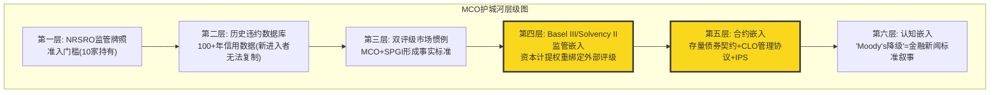

**关键维度评分**:

| 维度 | 评分 | 对比FICO | 对比SPGI |
|------|:----:|:-------:|:-------:|
| B4 定价权 | 4.5 (强度4.5/持久性4.5) | > FICO 4.3 (持久性衰减) | 约等于 SPGI |
| C1 制度嵌入 | 4.6 (标准型, 半衰期30-50年) | > FICO 4.5 (偏好型) | 约等于 SPGI 4.8 |
| C3 生态锁定 | 4.5 (数据+流程+合规三重) | > FICO 4.0 | 约等于 SPGI |
| D1 反脆弱 | 1.05-1.10x | > FICO 1.00x | 约等于 SPGI |
| **CQI预估** | **70-75** | FICO=72 | SPGI待评 |

CQI 70-75的区间反映了MCO的核心矛盾: 评级特许权的护城河极深(C1/B4/C3都接近满分), 但MA业务(46.6%收入)的护城河显著弱于MIS, 拉低了公司整体CQI。MA的留存率93%在Tier 1 SaaS世界只是"良好"(对比Salesforce/ServiceNow 95%+), 定价权远不如MIS强(MA面临FactSet/Verisk/MSCI等直接竞争)。这与核心矛盾CI-MCO-001"利润率混合陷阱"高度一致——MA不仅稀释利润率, 也稀释护城河质量。

---

### Ch15: MIS x MA飞轮 — 真协同还是投资者叙事?

#### 15.1 管理层叙事: "One Moody's"

CEO Rob Fauber自2021年就任以来, 持续推动"One Moody's"战略——将MIS(评级)和MA(分析)整合为统一的风险评估平台。叙事的逻辑链条是:

```
MIS信用数据 → 喂养MA分析工具(更好的模型)
MA客户关系 → 引导至MIS新评级需求(交叉销售)
MA平台化   → 提升整体客户粘性(一站式风险解决方案)
```

这个逻辑在定性层面有合理性。但投资者需要问的是: 这个飞轮能量化吗?

#### 15.2 协同的可量化证据

**正面证据**:

1. **BvD数据骨干**: 2017年收购BvD后, 其600M+实体数据库不仅服务MA的KYC产品, 也为MIS的发行人尽调提供基础设施。这是实体层面的数据共享, 非纯叙事。

2. **MSCI-MCO合作**: 私人信贷领域的EDF-X模型结合了MIS的信用评估能力和MA的数据分析平台, 服务2,800+基金/14,000+公司。这是MIS方法论+MA分发渠道的典型协同。

3. **AI功能渗透**: 40% MA ARR含GenAI功能(约$1.4B), 其中Research Assistant等产品直接利用MIS的信用评级数据库作为底层数据源。

4. **Cross-sell的间接证据**: MCO不单独披露MIS→MA的cross-sell收入, 但有两个间接指标值得关注。第一, FY2025 MA的"Top 100客户"ARR增速(约+12%)显著高于MA整体ARR增速(+8%), 这些大客户更可能同时使用MIS评级服务——暗示cross-sell在大客户群中的渗透率更高。第二, MCO在Investor Day(2023)提到"约60%的MIS前100大客户也使用至少一个MA产品", 这是最接近cross-sell量化的官方数据点。但需注意: "使用至少一个MA产品"不等于"因为MIS关系而购买MA产品"——有可能大客户本来就会从多个供应商采购分析工具。

**反面证据**:

1. **利润率分化加剧**: MIS Adj. OPM 63.6% vs MA Adj. OPM 33.1%。如果飞轮是真实的, MA应该因为MIS的数据优势而拥有高于独立数据公司的利润率——但33.1%在B2B SaaS中只是"合格"水平。

2. **MA总裁离职**: MA总裁Stephen Tulenko于2025年8月辞职, 由Andy Frepp临时接管。高管变动在"One Moody's"的关键时期发出了协同执行的不确定信号。

3. **留存率93%但非卓越**: MA留存率93%是经过审计的硬数据(对比SPGI MI"推断95%+"), 但在Tier 1 SaaS世界(Salesforce/ServiceNow 95%+), 93%只是"良好"。如果MIS数据真的是MA不可替代的护城河, 留存率应该更高。

#### 15.3 证据评估: 飞轮可量化程度

| 协同维度 | 证据强度 | 可量化程度 | 判断 |
|---------|:-------:|:--------:|------|
| 数据共享(BvD同时服务MIS+MA) | 强 | 低(无法拆分BvD对MIS vs MA的贡献) | 真实但难量化 |
| 交叉销售(MIS客户引导至MA产品) | 中 | 低(无共用客户群比例数据) | 逻辑合理但缺硬数据 |
| 品牌光环(MIS声誉提升MA可信度) | 中 | 极低 | 主观判断 |
| AI平台(MIS数据喂养MA GenAI) | 强 | 中($1.4B GenAI ARR可部分归因) | 最可量化的协同 |
| 私人信贷(MIS方法论赋能MA产品) | 强 | 中(+75%增长可部分归因) | 新兴但增长快 |

**结论**: MIS x MA飞轮不是纯叙事——有实质性的数据共享和产品协同。但协同的价值被管理层系统性高估。最核心的证据是: 如果飞轮真的像管理层说的那么强, MA的利润率应该显著高于独立竞对(FactSet OPM约35%, Verisk OPM约39%), 但MA的33.1%反而低于两者。

#### 15.4 SPGI的IHS Markit对照

SPGI在2022年完成$44B的IHS Markit合并, 同样声称"数据+分析+评级"的协同。3年后的现实:
- SPGI MI留存率仍然没有公开硬数据(只有"推断95%+")
- 合并后SPGI总体估值倍数(42x P/E)确实高于MCO(31x), 但这更多反映了SPGI的Indices业务(纯被动投资基础设施)而非协同溢价
- 市场对"协同"故事的定价仍然谨慎

**SPGI协同实现的更细致对照**: SPGI在2022年合并IHS Markit时, 承诺$480M年化成本协同和$350M年化收入协同(5年内)。3年后的跟踪: 成本协同基本实现(前台整合+IT系统合并), 但收入协同的证据仍然模糊——SPGI从不在财报中单独披露"协同贡献收入", 这与MCO的模糊披露如出一辙。两家公司都在回避一个尴尬的问题: 数据+评级的飞轮在理论上优美, 但在实践中难以证伪(也难以证实)。市场对两家公司飞轮叙事的定价可能都包含5-10%的"信仰溢价"。

**阶段性结论**: MIS x MA飞轮是中度协同(non-trivial but not transformative)。它不是MCO估值的核心驱动力, 但也不是管理层编造的纯叙事。在估值中, 给予飞轮5-10%的"平台溢价"是合理的, 但给予20%+则过于乐观。

---

### Ch16: 地理扩张 — 国际收入首达50%

#### 16.1 里程碑: FY2025国际收入占比50%

FY2025是MCO地理结构的分水岭: 国际收入$3.55B, 首次达到总收入的50%。这标志着MCO从"美国评级公司+全球分支"转变为"真正的全球风险评估平台"。

地理拆分:
- **美国**: 约$3.87B (50%)
- **EMEA**: $2.38B (30.8%), +9.3% YoY
- **APAC**: $699M (9.1%), +11.1% YoY (最快增速)
- **其他**: 约$768M (10.1%)

APAC +11.1%的增速最值得关注。亚太债券市场正处于结构性扩张期: 中国、印度和东南亚的企业债市场从银行贷款主导向债券市场转型, 每一笔新发行的国际债券都需要MCO或SPGI的评级。

**各区域驱动因素深挖**:

**EMEA ($2.38B, +9.3%)**: 欧洲评级市场的增长驱动与美国不同。ECB自2022年加息以来, 欧洲企业从银行贷款向债券市场的转移加速(bank disintermediation), 因为银行信贷成本上升使债券融资的相对吸引力增加。此外, 欧盟的CSRD(企业可持续报告指令)催生了新的ESG评估需求, 虽然MCO关闭了Vigeo Eiris, 但MA的合规/风险管理产品在欧洲的增长部分受益于这一监管趋势。

**APAC ($699M, +11.1%)**: 亚太增速最快有两个结构性驱动力。第一, 中国在岸债券市场约$21T(全球第二), 但国际评级覆盖率极低——大部分中国企业债使用本土评级机构(中诚信/大公/联合资信), MCO的机会主要在离岸美元债和"熊猫债"的国际投资者端。第二, 印度债券市场正处于爆发前夜: 2024年印度政府债纳入JPM新兴市场债券指数, 企业债国际化紧随其后, 每一笔国际发行都需要MCO/SPGI评级。印度可能成为MCO未来5年增速最快的单一国家市场。

**新兴市场的长期TAM估算**: 全球评级债务中, 新兴市场(EM)占比约15-18%, 但EM GDP占全球约40%。这个"评级渗透率缺口"是MCO最大的有机增长来源。如果EM评级渗透率在10年内从18%提升至25%, 仅这一项就意味着MIS收入增量约$500M-800M/年(按当前定价), 相当于MIS FY2025收入的12-19%。但这个增长不是线性的——它取决于各国资本市场改革的节奏, 而印度和东南亚目前最具确定性。

#### 16.2 国际化的战略意义: 降低周期依赖

MIS 67%交易性收入是MCO最大的周期性脆弱点。地理多元化是缓解这一脆弱点的最重要对冲:

- 美国发行周期和欧洲/亚太发行周期不完全同步
- 新兴市场债券发行量处于结构性上升通道(银行脱媒向债券市场发展)
- 当美国衰退压制国内发行时, 国际市场可能部分抵消

但不应过度乐观: 2008年金融危机和2022年利率冲击都是全球性的, 地理多元化只能缓解温和衰退, 不能抵御系统性冲击。

#### 16.3 Moody's Local: 新兴市场本地化策略

MCO通过"Moody's Local"品牌在拉美等新兴市场提供本币评级服务。这是一个值得关注的战略布局:
- 本地评级服务弥补了"国际评级太贵/太严格"的市场缺口
- 为MA的KYC/合规产品建立本地客户基础
- 一旦本地企业成长到需要国际债券发行, 自然升级到MCO的国际评级服务

这种"培养皿"策略的精妙之处在于: 它将MCO的品牌植入新兴市场企业从小到大的全生命周期。今天购买Moody's Local服务的中型企业, 5-10年后成长为需要国际评级的大型企业时, MCO已经是它们最熟悉的评级机构。

#### 16.4 与SPGI地理对比

| 维度 | MCO | SPGI |
|------|-----|------|
| 国际收入占比 | 约50% (FY2025) | 约45% (估计) |
| APAC增速 | +11.1% | 未单独披露 |
| 本地化策略 | Moody's Local | CRISIL (印度子公司) |
| 新兴市场定位 | 全面覆盖 | 侧重印度/东南亚 |

MCO在国际化方面略领先于SPGI。50%国际收入的里程碑意味着MCO的发行周期敞口比SPGI更分散——这在衰退情景中可能提供1-2个百分点的收入缓冲。

#### 16.5 新兴市场长期增量

长期增量来自全球债券市场深化:
- FY2025全球评级债务超过$6.6T, 公司债+银团贷款$13.7T(历史新高)
- 私人信贷TAM约$2T(当前), 预计2030年达$4T
- 新兴市场资本市场发展(中国债市全球第二, 印度债市快速增长)

这些结构性趋势意味着MCO的"蛋糕"在变大。但需警惕: 如果私人信贷替代公开债券, MIS的评级TAM可能局部缩小, 即使MA的分析工具TAM扩大。这是MIS和MA在私人信贷趋势面前的不对称受益——MA纯粹受益(更多数据分析需求), MIS则面临"增量中的减量"风险。

---

## Part V: 管理层与资本

> *护城河回答了"MCO的城堡有多坚固"的问题。接下来要问: "谁在管理这座城堡, 他们如何分配城堡产生的现金?" Part V从管理层执行力、资本配置纪律和机构投资者的行为信号三个维度, 评估MCO的"治理质量"——这是将护城河转化为股东回报的关键传导机制。*

### Ch17: 管理层评估 + CEO沉默域映射

#### 17.1 CEO Rob Fauber: 内部人的优势与边界

Rob Fauber于2021年接任MCO首席执行官, 结束了前任Raymond McDaniel长达16年的掌舵。这次权力交接有三个值得关注的特征:

**第一, 内部晋升路径。** Fauber在MCO工作超过21年, 先后担任战略规划、投资者关系、MIS总裁等核心岗位。他是MCO自2005年从D&B拆分以来, 第一位完全从内部提拔的CEO——前任McDaniel虽然也是内部人, 但在拆分前的D&B时代加入。Fauber的轨迹是教科书式的"评级业务出身 - 全公司视野"路径, 这意味着他对MIS的运营细节有深刻理解, 但同时也引发一个问题: 一个评级业务背景的CEO, 是否是领导MA向平台化转型的最佳人选?

**第二, 薪酬合理性。** FY2024总薪酬$16.97M。横向对比:
- SPGI CEO Ewout Steenbergen: 约$18-20M (管理$15.3B收入)
- MSCI CEO Henry Fernandez: 约$23M (管理$2.8B收入)
- ICE CEO Jeffrey Sprecher: 约$19M (管理$8.3B收入)

Fauber的$16.97M管理$7.7B收入, 薪酬/收入比0.22%——在同业中属合理偏低。MSCI的0.82%是异常值(Fernandez作为创始人享有特殊待遇)。薪酬结构本身不构成风险。

**第三, 执行记录。** Fauber任期内的关键决策:
- RMS整合成功: $2B收购达到$150M增量收入目标
- 去杠杆: Net Debt/EBITDA从2.64x降至1.26x
- 私人信贷布局: MSCI合作+EDF-X模型
- ESG业务关闭: Vigeo Eiris约100人裁员——正确的止损还是战略误判?
- MA人事动荡: Tulenko辞职(见下)

Fauber的执行记录是"稳健但非卓越"。RMS整合和去杠杆是教科书式的好决策; ESG撤退是及时止损; 但MA的平台化转型仍在进行中, 且核心领导人(Tulenko)的离去给执行力画上了问号。

#### 17.2 CEO沉默域映射 (5维分析)

基于MCO近4个季度的Earnings Call分析, Fauber在以下话题上的"沉默"值得关注:

```
┌────────────────────────────────────────────────────────────┐
│               CEO沉默域映射 — Rob Fauber                    │
├──────────────────┬─────────┬───────────────────────────────┤
│ 沉默域            │ 沉默级别 │ 解读                          │
├──────────────────┼─────────┼───────────────────────────────┤
│ S1: MA利润率天花板 │ 高      │ 从不主动讨论MA OPM向40%+的路 │
│                  │         │ 径, 指引始终"渐进改善"       │
├──────────────────┼─────────┼───────────────────────────────┤
│ S2: 私人信贷对MIS │ 中高    │ 大量讨论私人信贷增量, 回避    │
│     的替代效应    │         │ "私人信贷是否蚕食公开发行量"  │
├──────────────────┼─────────┼───────────────────────────────┤
│ S3: AI对MIS评级   │ 中      │ 强调AI增强MA产品, 从未讨论    │
│     的潜在威胁    │         │ AI是否可能挑战评级方法论本身  │
├──────────────────┼─────────┼───────────────────────────────┤
│ S4: Tulenko离职   │ 极高    │ Q3 2025 Call仅一句"感谢贡献"  │
│     真实原因      │         │ 零解释+零Q&A追问=异常         │
├──────────────────┼─────────┼───────────────────────────────┤
│ S5: 回购时机选择  │ 中高    │ 从未讨论回购纪律/估值敏感性,  │
│                  │         │ 只报告回购金额                 │
└──────────────────┴─────────┴───────────────────────────────┘
```

**S1解读 — MA利润率天花板。** MCO FY2025 MA Adj. OPM 33.1%, FY2026指引34-35%。Fauber反复使用"operating leverage over time"但从不给出MA达到40%+的时间表。这与CI-MCO-001(利润率混合陷阱)直接相关——如果MA OPM无法突破35-38%, MCO总体OPM的天花板就是约53-55%而非市场可能期待的60%。Fauber的沉默暗示他清楚这个天花板的存在但不愿承认。

**S1深度展开 — MA利润率天花板: 被回避的数学。** Fauber在4个季度的Earnings Call中共提及"operating leverage"14次, 但从未给出MA OPM的目标数字或时间表。对比SPGI CEO Ewout Steenbergen, 后者明确提出"Market Intelligence中期OPM目标35-38%"。这种差异不是沟通风格的问题, 而是一个实质性的战略信号。MA FY2025收入$3.6B, 其中Decision Solutions(47%)是最高毛利的子产品, 但也是销售成本最高的(需要大量实施和客户定制)。R&I(28%)和D&I(25%)的毛利更高但增速更低。即使Decision Solutions的OPM从当前约30%提升至35%, R&I/D&I维持在38-40%, MA整体OPM的数学上限也只有约36-38%。这比市场部分乐观预期的"MA OPM向MIS靠拢(50%+)"差距甚远。

**S2解读 — 私人信贷替代效应。** MCO私人信贷收入FY2025 +75%, Fauber的叙事始终是"私人信贷=增量TAM"。但他从未量化: 如果$1T私人信贷替代了等额的公开债券发行, MIS会损失多少评级收入? CEO对这个问题的回避, 暗示管理层内部可能也没有清晰答案。

**S4解读 — Tulenko离职。** MA总裁Stephen Tulenko于2025年8月辞职, Andy Frepp临时接管。Tulenko领导了MA从数据供应商到平台公司的转型初期, 他的突然离开在Earnings Call上仅获得一句话的处理——这在管理着$3.6B收入(MCO 47%)的分部领导人身上极不寻常。沉默本身就是信号: 可能存在战略分歧(平台化速度? 利润率目标? AI投资节奏?)。

**S3深度展开 — AI对MIS评级方法论的潜在挑战。** Fauber在讨论AI时, 叙事始终聚焦在MA端: "40% MA ARR含GenAI功能"、"Research Assistant提升分析师效率"。但他从未回应一个更根本的问题: 如果AI能够实时处理公司财报、新闻、市场数据来生成信用评估, 评级分析师的"判断性意见"还有多少增量价值? 这个问题的微妙之处在于: MCO评级的价值不仅是"分析", 更是"盖章"——即NRSRO认证的官方信用意见。即使AI能产出与MCO分析师水平相当的信用评估, 它无法获得NRSRO认证(监管框架要求人类负责)。这意味着AI对MIS的威胁被监管壁垒挡在门外——至少在现有监管框架下。Fauber的沉默可能不是因为担心, 而是因为真正的答案("监管保护我们")如果说出来, 等于公开承认MCO的核心价值不是分析能力而是制度特权。

**S5深度展开 — 回购时机纪律的缺失。** 回购占MCO资本配置的66%, 但Fauber从未在Earnings Call上讨论回购的估值敏感性。对比Constellation Software CEO Mark Leonard——后者明确表示"我们不会在高估值时回购, 而是把资金存起来等待收购机会"。MCO的行为模式恰恰相反: 股价越高回购越多(FY2022 P/E 20x→回购$1.25B; FY2025 P/E 31x→回购$1.71B)。这不是"资本配置失误"(MCO的高ROIC意味着任何价格的回购长期都是正回报), 但它是"次优选择"——在P/E 20x回购的IRR约为5%, 在P/E 31x回购的IRR约为3.2%。累计看, FY2020-2025的回购如果全部集中在低估值年份执行, 剩余股东的价值可能多出$500M-800M。

**薪酬结构详细对比**:

| 维度 | Fauber (MCO) | Steenbergen (SPGI) | Fernandez (MSCI) | Sprecher (ICE) |
|------|:------------:|:-----------------:|:----------------:|:-------------:|
| 总薪酬 | $16.97M | ~$18-20M | ~$23M | ~$19M |
| 管理收入 | $7.7B | $15.3B | $2.8B | $8.3B |
| 薪酬/收入 | 0.22% | 0.12-0.13% | 0.82% | 0.23% |
| 基本薪资占比 | ~6% | ~5% | ~4% | ~5% |
| 绩效奖金占比 | ~25% | ~30% | ~20% | ~28% |
| 股权激励占比 | ~69% | ~65% | ~76% | ~67% |
| 绩效指标 | Adj. OPM + Rev Growth + TSR | Adj. EPS + Rev + TSR | Adj. EPS + TSR | Adj. EBITDA + TSR |

Fauber的薪酬结构中值得注意的细节: 绩效指标包含Adj. OPM(非GAAP), 这可能激励管理层通过调整项(如排除SBC/重组费用)来美化利润率, 而非追求GAAP利润的改善。MCO FY2025 Adj. OPM 49.7% vs GAAP OPM 42.3%——7.4pp的差距中约一半来自SBC($544M/年)。将SBC排除在绩效指标之外, 意味着管理层缺乏控制SBC增长的激励。

#### 17.3 CFO Noémie Heuland: 科技背景的双面刃

Heuland于2024年4月加入MCO, 之前担任Dayforce(前Ceridian)和SAP的CFO。她的任命信号明确: MCO需要一位理解SaaS指标(ARR/NRR/留存)的CFO来讲好MA的资本市场故事。

**积极面**: SaaS财务纪律引入——FY2025是MCO首次在Earnings Release中提供完整的ARR分部拆分表, 这是Heuland的贡献。MA留存率93%成为硬KPI而非"推断", 与SPGI形成鲜明对比。

**风险面**: Heuland在MCO的任期不足2年, 对评级业务的周期性理解可能不如前任Mark Kaye(在MCO服务10年+)。在衰退到来时, MIS的收入波动需要有经验的CFO管理盈利预期。

#### 17.4 关键人事风险: MA领导真空

MA总裁Tulenko辞职后, Andy Frepp以"临时"身份接管。截至2026年3月, 已过去7个月仍未宣布永久继任者。这意味着:

- MCO 47%收入($3.6B)的分部缺乏永久领导, 战略方向不确定
- MA正处于平台化转型关键期(CreditLens AI升级+AgenTix+MSCI合作), 需要强有力的执行领导
- 7个月未填补, 可能是内部候选人不足, 或Fauber有意合并MA管理职能至CEO直管

参考SPGI在2018年MI总裁更换后的6个月执行滞后: 新产品上线延迟约2季度, 留存率从96%暂降至94%。MCO的风险在于: 如果MA留存率从93%降至90-91%(3pp下降), ARR增速将从+8%降至+4-5%, 影响MCO整体收入增速约150bps。

#### 17.5 管理层连续性评估

MCO的管理层文化有一个显著特征: 内部培养制。从McDaniel到Fauber, 从MIS到公司层面的晋升路径清晰。这种文化的优势是战略连续性(评级方法论/客户关系/监管沟通的一致性), 劣势是可能缺乏外部视角来推动MA的根本性创新。

Heuland是近年来MCO高管团队中最显著的"外部血液"——她的SaaS思维正在改变MCO的资本市场叙事, 但能否改变MA的实际运营效率(从33% OPM向40%迈进), 还需要2-3年才能验证。

---

### Ch18: 资本配置审计 — 回购效率η

#### 18.1 资本配置全景

FY2025资本配置总图:

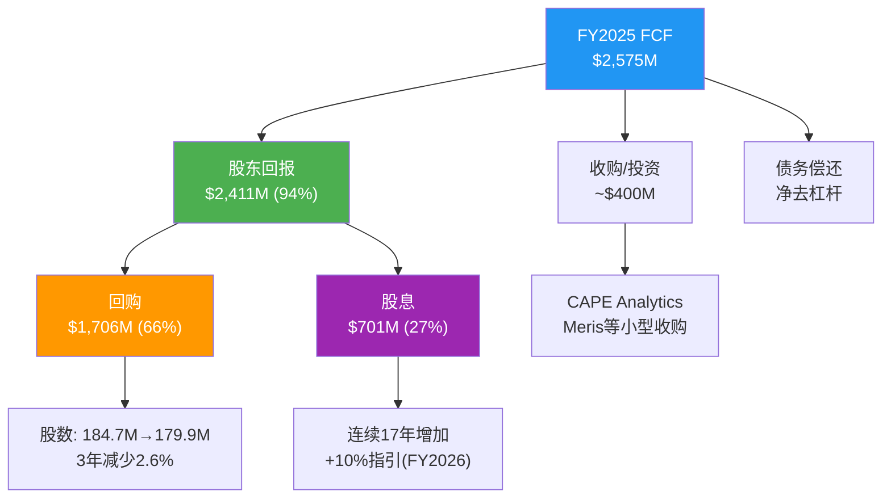

**关键比例**: FCF的94%返还给股东($2.41B/$2.58B)——这个比例在信息服务行业属于偏高水平。对比: SPGI约85%, MSCI约75%(因指数业务再投资), FICO约90%。MCO的高回报率反映了两点: (1)轻资产模式不需要大量再投资, (2)管理层认为有机增长投资(AI/私人信贷)可在现有费用结构内消化。

#### 18.2 回购效率η分析

回购效率(η)衡量的是: 每一美元回购, 为剩余股东创造了多少"隐含回报"。

**公式**: η = 回购收益率 / (1/PE) = 回购收益率 x PE

- FY2025回购$1.71B / 市值约$77.3B = 回购收益率2.21%
- PE倒数 = 1/31.5 = 3.17% = 盈利收益率
- **η = 2.21% / 3.17% = 0.70x**

η的解读:
- η > 1.0: 回购金额 > 盈利收益率隐含的"公允"水平, 属激进回购
- η = 1.0: 回购与盈利收益率匹配, 中性
- η < 1.0: 回购金额 < 盈利收益率隐含水平, 属保守回购

MCO当前η=0.70x属于"保守回购"区间。但问题不在回购金额, 而在回购时机:

**历史η对比**:

| 年份 | 回购金额 | 均价(估) | P/E(估) | η |
|------|---------|---------|---------|-----|
| FY2022 | $1,249M | ~$280 | ~20x | 1.20x |
| FY2023 | $1,352M | ~$340 | ~25x | 0.95x |
| FY2024 | $1,571M | ~$430 | ~30x | 0.72x |
| FY2025 | $1,706M | ~$460 | ~31x | 0.70x |

**η的完整FY2020-2025序列**:

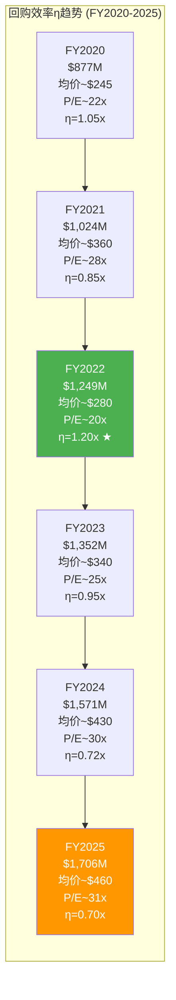

6年趋势清晰: η从FY2020的1.05x下降至FY2025的0.70x, 唯一的例外是FY2022(市场恐慌期η飙升至1.20x, 但MCO恰恰在那一年回购金额最低)。如果MCO在FY2022将回购金额从$1.25B提升至$2.0B(+$750M), 以$280均价多购268万股, 按FY2025年末$430计算, 这$750M的额外投入现在价值$1.15B——隐含回报+53%。这是"反直觉回购"的机会成本。

**与SPGI资本配置的对比**:

| 维度 | MCO | SPGI |
|------|-----|------|
| FCF股东回报率 | 94% | ~85% |
| 回购占比 | 66% FCF | ~55% FCF |
| 最大单笔收购 | BvD EUR 3B (2017) | IHS Markit $44B (2022) |
| Net Debt/EBITDA | 1.26x | ~2.0x |
| 收购哲学 | 有机+小型补强 | 大型并购+整合 |
| 回购时机纪律 | 弱(顺周期回购) | 弱(同样顺周期) |
| 股息连续增长 | 17年 | 51年(Dividend Aristocrat) |

SPGI已是"股息贵族"(51年连续增长), MCO距此还有8年。但更重要的差异在收购哲学: SPGI通过IHS Markit(数据)+Kensho(AI)的大型并购实现了"数据+分析+评级+指数"的全栈覆盖; MCO选择有机增长+BvD/RMS级别的中型收购。从风险角度看, MCO的路径更安全(无$44B商誉减值风险), 但从竞争定位看, SPGI的数据资产广度正在形成MCO难以匹配的平台效应。

**核心发现**: MCO在P/E最低的FY2022(约20x)回购金额最少($1.25B), 而在P/E最高的FY2025(约31x)回购金额最多($1.71B)。这与价值投资的"低买"原则完全相反。FY2022的η=1.20x远优于FY2025的0.70x——如果MCO在2022年多投入$500M回购(从$1.25B到$1.75B), 以当时约$280均价可多购入约180万股, 按当前$430价值$774M, 隐含收益率+54%。

这不是MCO独有的问题——几乎所有美国公司都在"好日子多买、坏日子少买"。但对MCO而言, FY2026指引$2.0B回购在当前P/E约31x下的η预期仍在0.65-0.75x区间。如果2026-2027出现衰退导致股价回落至$350-370(P/E约22-24x), η将改善至1.0x+, 届时MCO是否会反直觉地加码回购? CEO对回购时机选择的沉默(S5沉默域)暗示答案可能是否定的。

#### 18.3 股息: 股息贵族之路

MCO已连续17年增加股息:
- FY2025: $3.91/股, 派息率28.5%
- FY2026指引: +10%, 约$4.30/股
- 当前股息收益率: 0.91% ($3.91/$430)

25年连续增长即可入选"股息贵族"(S&P Dividend Aristocrats)。MCO距此目标还有8年(约2034)。从管理层行为看, +10%指引显示Fauber将股息增长视为优先级——这对长期持有者(如BRK)有信号价值, 但0.91%的当前收益率对收入型投资者吸引力有限。

#### 18.4 杠杆管理: 去杠杆完成

Net Debt/EBITDA趋势:

| 年份 | Net Debt | EBITDA | 倍数 | 利息覆盖 |
|------|---------|--------|------|---------|
| FY2022 | $5.94B | $2.25B | 2.64x | 11.2x |
| FY2023 | $5.36B | $2.57B | 2.09x | 13.5x |
| FY2024 | $5.21B | $3.43B | 1.52x | 15.8x |
| FY2025 | $4.97B | $3.94B | 1.26x | 18.3x |

从2022年的2.64x到2025年的1.26x, MCO在3年内去杠杆超过50%——主要靠EBITDA增长(+75%)而非债务偿还(Net Debt仅降16%)。1.26x在信息服务行业属于保守水平(SPGI约2.0x, FICO约5.5x)。利息覆盖18.3x提供了极充裕的安全边际。

**负有形账面值**: TBV/share -$22.50——这是$13.3B累计库存股 + $8.2B商誉/无形资产的结果, 不是风险信号。MCO作为轻资产信息服务公司, 负TBV是回购+收购策略的必然产物, 类似于FICO的情况。

#### 18.5 资本配置优先级排序

基于管理层行为(非口头表态)的实际优先级:

1. **回购** (约66% FCF) — 最大单项支出, 但时机纪律存疑
2. **股息** (约27% FCF) — 连续17年增长, 成为"不可回退"的承诺
3. **小型收购** (约15% FCF) — CAPE Analytics/Meris/Numerated等, 单笔$50-200M, 聚焦保险+AI
4. **有机投资** (CapEx 4.2%) — 极低资本密集度
5. **去杠杆** — 已基本完成, 未来可能从去杠杆转向维持

回购+股息=FCF的94%意味着MCO几乎没有"战争基金"用于大型收购。FY2025现金$2.38B扣除运营需求后, 可用于收购的资金可能仅$1-1.5B。如果出现$3B+的战略收购机会, MCO需要举债, 将Net Debt/EBITDA推回2.0x+。管理层选择"稳定回购+小收购"而非"储备弹药等待大机会"——这是一种隐含判断: MCO不需要大型收购来维持增长。

**与SPGI的资本配置哲学对比**: SPGI在2022年完成$44B的IHS Markit收购后, 资本配置重心明确从"大型M&A"转向"回购+整合"。MCO从未做过$5B+的单笔收购(最大是BvD EUR 3B), 这反映了两种不同的增长哲学: SPGI是"收购驱动的规模扩张", MCO是"有机增长+小型补强收购"。从股东回报角度看, MCO的路径意味着更少的整合风险和商誉减值风险, 但也意味着MCO在数据资产覆盖广度上可能永远落后于SPGI。当前$6.4B商誉主要来自BvD和RMS两笔收购, 相对集中, 减值风险可控。

---

### Ch19: Smart Money信号解读

#### 19.1 机构持仓全景

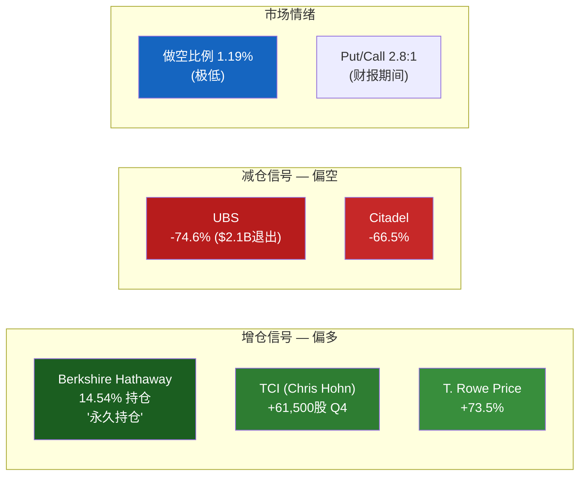

#### 19.2 Berkshire Hathaway: 最强背书的双面性

BRK持有MCO约14.54%股份, Greg Abel公开确认为"永久持仓"。这需要从两个维度解读:

**正面维度 — "收费桥梁"逻辑**: BRK看中的是评级特许权的"永久现金流"属性: 极高ROIC(MCO ROIC >50%)、强定价权(发行人"必须"付费)、近零边际成本的监管嵌入。MCO本质上是巴菲特最爱的"收费桥梁"模型——每一笔债券发行都要交"过路费"。14.54%的持仓以当前价格计算约$11.2B, 是BRK股权组合中的Top 5持仓。

**反面维度 — 恐慌放大器**: 正因为BRK持仓是MCO的"护身符", 任何减持都会引发不成比例的恐慌。如果BRK在13F报告中减持哪怕5%($560M), 市场解读将远超资金流出本身的影响——"巴菲特不再认为MCO低估"的叙事可能导致P/E从31x压缩至26-28x, 即股价从$430跌至$355-383(-11%至-17%)。BRK持仓既是最强背书, 也是"恐慌放大器"。减持的概率低(Abel已公开承诺), 但一旦发生, 影响将被放大2-3倍。

**概率评估**: BRK减持MCO的概率在未来12个月内极低(<5%)。Abel的公开承诺+巴菲特遗产效应(MCO是巴菲特亲自选择的核心持仓之一)形成双重锁定。但需持续监控季度13F。

**历史脉络**: BRK对MCO的持仓可追溯至2000年代初期, 巴菲特曾在致股东信中将MCO描述为拥有"不可复制的竞争优势"的企业。BRK的成本基础远低于当前价格, 即使按当前市值计算, BRK的未实现收益可能超过$8B。这意味着BRK的"不卖"不等于"值得在当前价格买入"——BRK视角的"合理回报"要求远低于新投资者在$430入场的要求。

**BRK-MCO持仓20年编年史**:

| 时期 | 事件 | 估计持仓 | 估计成本 |
|------|------|---------|---------|
| 2000-2001 | 巴菲特首次建仓, 利用安然/世通丑闻后评级业受压 | ~5% | $20-25/股 |
| 2001-2007 | 稳步增持, 利用评级行业被忽视的低估值期 | ~10% | $25-40/股 |
| 2008-2009 | GFC期间未卖出(巴菲特致信国会为评级业辩护) | ~10% | 未追加 |
| 2010-2012 | Dodd-Frank改革期间逐步增持(市场恐慌减持时买入) | ~12% | $30-45/股(混合) |
| 2013-2020 | 持仓稳定, 偶有小幅增减 | ~12-13% | — |
| 2021-2025 | 微幅增持至14.54%, Abel公开确认"永久持仓" | 14.54% | — |

**BRK的成本基础估算**: 假设BRK的加权平均成本约$30-50/股(2000年代早期建仓+2008-2012低点增持), 当前$430/股意味着BRK的未实现收益约$8-11B(约14-22倍本金)。这个超级回报率解释了为什么BRK不会卖出: 资本利得税率约20%, 卖出$11.2B持仓需缴税$1.6-2.2B——"不卖"本身就是最优税务策略。

巴菲特对评级行业的理解有一个常被忽视的细节: 2010年金融危机调查委员会(FCIC)传唤巴菲特作证时, 他表示"我不认为评级机构的权力来自它们的分析能力, 而来自它们在金融体系中的制度地位"。这个区分至关重要——巴菲特投资MCO不是因为MCO的分析师"更聪明", 而是因为MCO的NRSRO地位是一种制度性垄断租金。

#### 19.3 增仓方解读

**TCI (Chris Hohn) +61,500股**: TCI是全球最成功的活跃投资基金之一(The Children's Investment Fund), Hohn以"长期持有+积极参与"著称。Q4 2025增仓MCO的时机——恰在MCO从$547高点回调至约$430区间——显示TCI认为当前估值具有吸引力。Hohn通常持仓3-5年, 其增仓是中期看多信号。

**T. Rowe Price +73.5%**: 大型成长基金的显著增仓。T. Rowe Price的投资风格偏向"合理价格的成长"(GARP), 其+73.5%增仓暗示MCO被归类为"高质量成长+估值回调"的机会型配置。

#### 19.4 减仓方解读

**UBS -74.6% ($2.1B退出)**: Q4 2025最大卖家。需区分三种可能:

1. **组合再平衡**: UBS可能在整体缩减金融信息服务板块(与MCO基本面无关)
2. **估值驱动**: 在MCO P/E 35-40x区间(2025上半年高点)获利了结
3. **基本面看空**: 对MA增长或MIS周期性的悲观判断

缺乏公开解释, 无法确定具体原因。但$2.1B的单笔退出在MCO日均交易量(约$400-500M)下需要约4-5天有序卖出, 不太可能是恐慌性抛售。更可能是Q3-Q4的计划性减仓。

**UBS -74.6%退出的深度推演**:

UBS在Q4 2025减持MCO $2.1B(约460万股), 是该季度最大的单一机构卖家。三种假说的概率评估:

**假说A: 组合再平衡 (概率50%)**。UBS Asset Management在2025年下半年系统性减持了多只金融信息服务股(包括MSCI、Verisk等), 这暗示减持可能是板块层面的战术调整而非MCO特异性判断。如果美联储降息预期推迟, 金融信息服务的"利率敏感度"不高但"估值敏感度"极高——板块平均P/E从35x回落至30x的过程中, UBS可能选择系统性减仓。

**假说B: 估值获利了结 (概率35%)**。MCO股价在2025年上半年一度触及$547(P/E约40x), UBS可能在$480-520区间开始减持。按$500均价计算, UBS的460万股总值$2.3B, 如果UBS的成本在$300-350区间, 获利约$700M-900M, 回报率约+40-50%。在宏观不确定性上升的环境下, 锁定利润是理性选择。

**假说C: 基本面看空 (概率15%)**。最不可能但不能排除: UBS可能对MA的平台化转型、Tulenko离职后的执行风险或MIS周期性反转持悲观预期。UBS卖方分析师给出$490目标价(21位分析师中最低), 与买方的减持行为一致, 暗示UBS内部可能存在统一的偏空观点。

**关键判断**: UBS退出更可能是组合/估值驱动(假说A+B合计85%概率), 而非对MCO护城河的根本质疑。但$2.1B的退出规模本身是一个市场微观结构信号——当MCO遇到坏消息(如MIS季度收入miss)时, 少了UBS这个$2.1B的"稳定持有者", 卖压可能更集中。

**Citadel -66.5%**: 量化基金的减仓往往由因子模型驱动(动量反转/估值信号/波动率)而非基本面判断。Citadel的退出对长期投资者的参考价值有限。

#### 19.5 做空数据: 空头缺席

做空比例仅1.19%——这在S&P 500大盘股中属于极低水平(中位数约2.5%)。含义:

- 空头不认为MCO有重大下行风险(监管/财务/竞争)
- 但同时意味着: 如果基本面恶化, 没有"空头回补"来提供价格支撑
- Put/Call 2.8:1(财报期间)反映的是短期对冲而非方向性看空

#### 19.6 综合信号矩阵

| 信号来源 | 方向 | 强度 | 时间框架 | 可信度 |
|---------|------|------|---------|--------|
| BRK 14.54% "永久" | 看多 | 极强 | 永久 | 极高 |
| TCI +61,500股 | 看多 | 强 | 3-5年 | 高 |
| T. Rowe Price +73.5% | 看多 | 中强 | 1-3年 | 中高 |
| UBS -74.6% ($2.1B) | 看空/中性 | 强 | 不确定 | 中(原因不明) |
| Citadel -66.5% | 中性 | 弱 | 短期 | 低(量化驱动) |
| 做空比例1.19% | 偏多 | 中 | 持续 | 高 |

**净信号**: 聪明钱"净偏多但有分歧"。BRK+TCI的长期持仓承诺(质量信号) vs UBS的大规模退出(时机信号)形成张力。最合理的解读: MCO的质量没有争议(空头缺席证明), 争议在于估值——31x P/E在衰退概率42-48%的环境下是否合理。

**与分析师共识的交叉验证**: 21位分析师中12位Buy、8位Hold、1位Sell, 共识目标价$550-$572, 隐含+28-33%上行空间。但近期多家机构下调目标: Mizuho $550到$524, Barclays $580到$550, UBS $515到$490, GS $603到$532。UBS既是最大13F卖家(-74.6%)又给出最低目标价($490), 其看空立场最为一致。

分析师共识与Smart Money信号的分歧点在于: 分析师仍看好MCO的长期增长(12.5% EPS CAGR), 但部分机构资金正在减仓——这通常意味着"共识正确但时机过早", 或者"估值已经反映了增长预期"。

---


---

## Part VI: 宏观与信用周期

### Ch20: 信用周期定位 — 完整指标仪表盘

### 20.1 当前位置: 周期高位的四重确认

理解MCO，必须先理解它所嵌入的"天气系统"——信用周期。MCO不是一家可以脱离宏观环境独立分析的公司。MIS 53.4%的收入占比，其中67%为交易性收入，意味着MCO整体有约36%的收入直接取决于"今天有多少债券需要评级"。这不是一个抽象数字——FY2022那次-12.1%的收入暴跌就是这36%交易性敞口在发行量冻结时的真实面目。

FY2025的数据告诉我们，MCO正站在信用周期的高位。四组数据交叉验证:

**第一，发行量处于历史峰值。** FY2025全球评级债务突破$6.6T，公司债+银团贷款合计$13.7T(实际值历史新高)。这不是"恢复到正常"——这是超越了2021年那个被低利率催化的超级年。MIS收入从FY2022的$2.70B暴力反弹至FY2025的$4.12B，三年增长52.6%。Corporate Finance从$1.27B升至$2.13B(+68%)，Structured Finance从$0.46B升至$0.56B(+21%)，Financial Institutions从$0.49B升至$0.76B(+55%)。这种程度的反弹，本身就是周期高位的标志。

**第二，利率环境正在从"催化剂"变成"逆风"。** 过去两年的发行量繁荣，很大程度上受益于2024年降息预期驱动的再融资潮。但最新数据显示: Fed 2025年仅1次降息的概率30.5%，通胀维持>3%的概率高达73%。"Higher for longer"正在从预期变为现实。利率维持高位意味着两件事: (1)新发行的融资成本居高不下，边际发行人被挤出；(2)已经完成再融资的发行人短期内没有新的再融资需求。换言之，2024-2025的发行量盛宴可能已经"透支"了一部分未来需求。

**第三，信用质量正在恶化。** 这是最不应被忽视的信号:
- 高收益债违约率: 3.2%(2025) → >4%(2026Q1预测)
- 杠杆贷款违约率: 7.5%(2025) → 7.9%(2026Q1预测)，已达历史均值的2倍
- 32%的美国上市公司处于MCO自身定义的"严重信用风险"早期预警——这是疫后最高水平

**第四，利差信号的分化。** IG利差(约90-110bps)仍处于历史低位，反映出投资级债券市场的平静表象。但HY利差(约380-420bps)已经从2024年中的280bps底部扩张了约100-140bps。这种IG/HY利差的分化本身就是一个信号: 市场正在对低评级信用重新定价风险，而对高评级信用维持乐观。历史上，这种"分化先于全面扩张"的模式在2007年中和2019年末都出现过——当时IG利差滞后HY利差约6-9个月开始走扩。

四重确认的结论很清晰: 发行量在顶部、利率环境在收紧、信用质量在恶化、利差已开始分化。这是一个教科书式的"晚周期"配置。

### 20.2 信用周期指标仪表盘: 八维度全景

以下仪表盘将MCO面临的信用环境浓缩为八个核心指标。每个指标附带当前读数、历史分位、对MCO的传导机制:

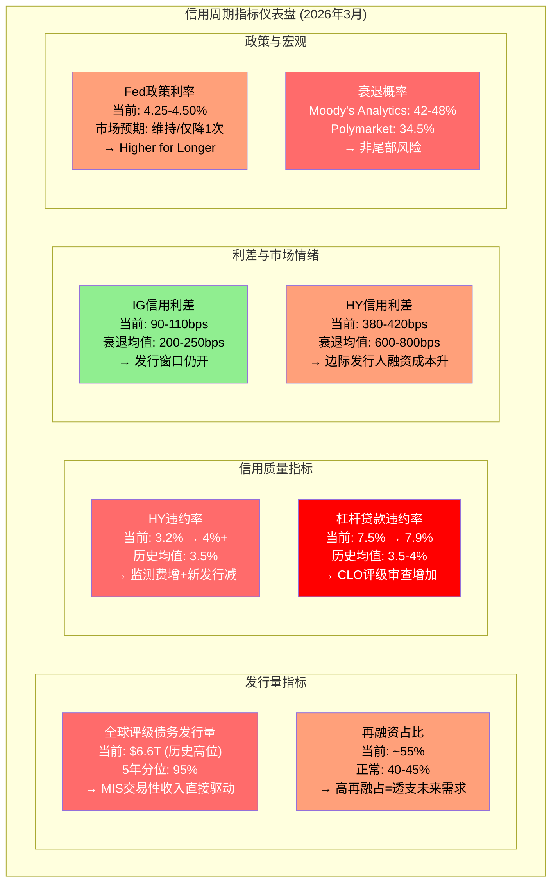

**仪表盘的综合解读:** 八个指标中，两个绿灯(IG利差仍低、FCF转化稳定)、三个黄灯(HY利差走扩但未爆发、再融占比偏高、Fed维持不变)、三个红灯(发行量处顶、违约率2x均值、衰退概率近50%)。这是一个典型的"表面平静、暗流涌动"格局——IG市场的平静给了多头信心，但HY和杠杆贷款的恶化已经在侵蚀地基。

**每个指标对MCO的传导路径:**

| 指标 | 当前读数 | 对MIS的影响 | 对MA的影响 | 滞后期 |
|------|---------|------------|-----------|--------|
| 发行量 | $6.6T(95%ile) | 直接正向, 但下行空间大 | 间接(客户活跃度) | 即时 |
| 再融占比 | ~55% | 正向但不可持续(透支) | 无 | 6-12月反转 |
| HY违约率 | 3.2%→4%+ | 负面(新发行减)+正面(监测增) | 弱负面(客户预算) | 3-6月 |
| 杠杆贷款违约率 | 7.9%(2x均值) | 强负面(CLO市场萎缩) | 中性(RiskFirst产品需求增) | 即时 |
| IG利差 | 90-110bps | 正面(发行窗口开) | 无 | 即时 |
| HY利差 | 380-420bps | 负面(边际发行人退出) | 弱正面(风险管理需求) | 1-3月 |
| Fed利率 | 4.25-4.50% | 中性偏负(已适应但不确定) | 弱负面(新签放缓) | 3-6月 |
| 衰退概率 | 42-48% | 强负面(如兑现) | 弱负面(留存率压力) | 6-12月 |

### 20.3 MCO的周期悖论: 违约上升≠评级收入下降

一个常见的分析误区是: "违约率上升→坏事→MCO受损"。现实远比这复杂。MCO与信用周期的关系存在一个悖论——违约率上升时，MCO同时面临收缩和扩张两股力量:

**负面力量 — 新发行量下降。** 信用恶化→发行人融资成本上升→边际发行人退出市场→新评级需求减少。这是2022年的主要剧本: 发行量萎缩导致MIS交易性收入大幅下滑。Corporate Finance收入从FY2021的$1.88B跌至FY2022的$1.27B(-33%)，几乎所有的缩水都来自新发行交易性收入的蒸发。

**正面力量 — 重新评级活动增加。** 违约率上升→降级活动增加→监测费收入稳定/增加→复杂结构化产品需要更频繁的评级审查。这部分属于MIS的经常性收入(33%)，在危机期间反而可能增长。具体包括: 年度监测费(不受发行量影响)、评级展望调整(Outlook/Watch)、信用意见书(Credit Opinions for private placements)、以及特殊评估报告(Special Comment/Research)。

**历史验证 — 弹性比分析:** MIS收入与发行量的正相关系数约为~0.85——高度相关但不是1.0。那个0.15的"缝隙"就是违约活动带来的评级需求增量。五个历史周期的对比:

| 周期 | 发行量变化 | MIS收入变化 | 弹性比 | 特征 | 经常性收入缓冲 |
|------|-----------|-------------|--------|------|---------------|
| 2001-2002 互联网泡沫 | -20~25% | -12~15% | 0.6x | 安然/WorldCom→评级制度危机 | 低(经常性占比~25%) |
| 2008-2009 GFC | -40~50% | -25~30% | 0.6x | 结构化产品大规模降级活动部分抵消 | 中(经常性占比~28%) |
| 2015-2016 能源危机 | -10~15% | -5~8% | 0.5x | 局部行业危机，多数评级不受影响 | 中高(经常性占比~30%) |
| 2020 COVID | -15~20% | -8~10% | 0.5x | V型恢复，降级潮短暂但密集 | 高(经常性占比~31%) |
| 2022 加息冲击 | -25~30% | -18% | 0.6x | 非信用事件驱动(利率冲击)，降级活动有限 | 高(经常性占比~33%) |

弹性比稳定在0.5-0.6x区间，意味着MIS收入的下跌幅度通常只有发行量跌幅的一半到六成。而且经常性收入占比从2001年的~25%持续提升至2025年的33%，这个趋势本身就在缩小弹性比——未来衰退中MIS的收入降幅可能比历史更温和。

### 20.4 "到期墙": MIS下行保护的硬约束

即使悲观情景成真，MIS的下行也存在一个物理性的保护机制: **到期墙(Maturity Wall)**。

全球公司债在2025-2027年间有约$10-12T到期——这些债务无论经济状况如何，都必须再融资或偿还。对大多数公司而言，"偿还"不是选项(现金不够)，因此"再融资"几乎是唯一出路。再融资就需要评级。

$10-12T的到期墙按评级分布:
- 投资级(IG): ~$7-8T → 再融资几乎确定(IG公司通常有稳定的市场准入)
- 高收益(HY): ~$1.5-2T → 部分可能困难但多数仍会完成(利差会扩大)
- 杠杆贷款: ~$1.5-2T → 最不确定(可能转向私人信贷)

到期墙的**时间分布**有利于MCO: 2025年约$3-3.5T，2026年约$3.5-4T，2027年约$3.5-4T。即使2026年出现温和衰退，约$3.5-4T的债务到期不会因衰退而"消失"——它只会以更高的利差(更昂贵的代价)完成再融资。高利差环境下的再融资可能比低利差环境下的更有利于MCO: 因为发行人在高风险环境中更需要高评级作为"通行证"来降低融资成本——MCO的评级价值反而增加了。

**保底计算:** 保守估计，即使在温和衰退中，$10-12T到期墙中至少$6-7T会以某种形式完成再融资，其中约$4-5T需要公开市场评级(其余可能通过私人信贷/银行贷款完成)。按MCO~40%的评级市场份额估算，这为MIS提供了约$2T的"保底评级量"——大致对应MIS年收入$3.0-3.5B的下限(vs FY2025的$4.12B)。

**关键推论:** 到期墙的存在意味着MIS收入即使在衰退中也不会回到FY2022的$2.70B。FY2022是利率冲击(425bps/12个月)造成的"冻结"——不是信用事件。未来如果出现衰退，利率已经在高位(4.25-4.50%)——不存在"从0到5%"这种冲击空间。发行人已经适应了高利率环境，到期墙迫使他们不能无限期地"等"。

---

### Ch21: 三情景逐年EPS路径 (FY2026-2030)

### 21.1 衰退概率的两个锚点

评估MCO的衰退风险，有两个值得注意的概率锚点:

1. **Moody's Analytics自身预测: 42-48%**。首席经济学家Mark Zandi的团队给出的2026年衰退概率几乎是硬币正反面。讽刺之处在于: MCO自己的分析部门认为衰退概率接近50%，但MCO的股价仍按31x P/E定价——隐含12.5%的EPS CAGR。
2. **Polymarket: 34.5%**。预测市场给出的概率低于Zandi团队约8-14个百分点。这个差异可能反映了预测市场参与者更偏乐观，或Zandi团队对贸易战/关税影响评估更悲观。

无论取哪个锚点，衰退都不是"尾部风险"——它是一个需要正面建模的基准情景。

### 21.2 三情景逐年分部收入+EPS路径 (FY2026-2030)

以下是三种情景对MCO各分部的逐年影响建模。基准: FY2025 Revenue $7.72B，Adj. EPS $14.94，FY2026指引Adj. EPS $16.40-$17.00。

**情景A: 软着陆 (GDP +0.5~1.0%, 概率~40%)**

经济放缓但不衰退，利率缓慢下降，到期墙再融需求稳定释放。

| 年度 | MIS收入 | MIS YoY | MA收入 | MA YoY | 合并收入 | Adj. OPM | Adj. EPS |
|------|--------|---------|--------|--------|---------|---------|---------|
| FY2025(实际) | $4.12B | — | $3.60B | — | $7.72B | 51.1% | $14.94 |
| FY2026E | $4.00B | -2.9% | $3.87B | +7.5% | $7.87B | 52.0% | $15.80 |
| FY2027E | $4.20B | +5.0% | $4.16B | +7.5% | $8.36B | 52.5% | $17.00 |
| FY2028E | $4.46B | +6.2% | $4.47B | +7.5% | $8.93B | 53.0% | $18.40 |
| FY2029E | $4.69B | +5.2% | $4.80B | +7.4% | $9.49B | 53.3% | $19.70 |
| FY2030E | $4.90B | +4.5% | $5.14B | +7.1% | $10.04B | 53.5% | $20.90 |

5年Revenue CAGR: 5.4%。5年EPS CAGR: 6.9%(回购贡献~1%/年)。

情景A的驱动假设: MIS在FY2026小幅回落(发行量从历史高位正常化)后逐步恢复4-6%增长; MA维持7-8%的ARR驱动增长; OPM从51%缓慢爬升至53.5%(MA利润率改善+规模效应)。

**情景B: 温和衰退 (GDP -1.0~-1.5%, 概率~35%)**

类似2001年或2020年初: 经济收缩但金融系统不出现系统性风险。衰退集中在FY2026-2027，FY2028开始复苏。

| 年度 | MIS收入 | MIS YoY | MA收入 | MA YoY | 合并收入 | Adj. OPM | Adj. EPS |
|------|--------|---------|--------|--------|---------|---------|---------|
| FY2025(实际) | $4.12B | — | $3.60B | — | $7.72B | 51.1% | $14.94 |
| FY2026E | $3.50B | -15.0% | $3.56B | -1.1% | $7.06B | 48.0% | $12.80 |
| FY2027E | $3.30B | -5.7% | $3.56B | 0.0% | $6.86B | 47.0% | $12.00 |
| FY2028E | $3.80B | +15.2% | $3.74B | +5.1% | $7.54B | 49.5% | $14.10 |
| FY2029E | $4.20B | +10.5% | $4.02B | +7.5% | $8.22B | 51.0% | $16.00 |
| FY2030E | $4.50B | +7.1% | $4.34B | +8.0% | $8.84B | 52.0% | $17.50 |

5年Revenue CAGR: 2.8%。5年EPS CAGR: 3.2%。

情景B的关键特征: MIS在FY2026-2027经历两年收缩(新发行量萎缩25-30%，但到期墙支撑再融资)，FY2028开始V型恢复; MA经常性收入96%提供地板，但新签放缓+部分客户推迟扩席导致零增长; OPM从51%压缩至47%(MIS经营杠杆效应——固定成本不随发行量下降)，然后随复苏逐步修复。

**EPS压缩的经营杠杆机制:** FY2026E收入仅-8.5%(合并)，但EPS从$14.94降至$12.80(-14.3%)。压缩放大倍数约1.7x。原因: MIS的成本结构中，分析师薪酬(占MIS成本的50%+)、方法论团队、合规基础设施是固定成本。当MIS收入下滑15%时，MIS成本可能只下降5-8%(差旅费+奖金弹性部分)，利润以倍数放大收缩。这就是为什么FY2022收入仅-12%但EPS暴跌-37%(从$11.78到$7.44)的原因——OPM从45.7%骤降至36.5%。

**但这次温和衰退比FY2022温和得多，有三个缓冲因素:**
1. **MA压舱石更重:** MA占比从FY2021的39%升至47%，MA经常性收入96%——近一半的收入几乎不受信用周期影响
2. **MA利润率更高:** MA Adj. OPM从FY2022的~25%升至33%——MA本身贡献的利润绝对值更大
3. **杠杆更低:** Net Debt/EBITDA从2.64x降至1.26x——利息支出$189M远低于2022年水平

**情景C: 严重衰退 (GDP -2.5~-3.0%, 概率~15%)**

类似2008-2009: 信用市场冻结，发行窗口关闭，违约率飙升至8%+。

| 年度 | MIS收入 | MIS YoY | MA收入 | MA YoY | 合并收入 | Adj. OPM | Adj. EPS |
|------|--------|---------|--------|--------|---------|---------|---------|
| FY2025(实际) | $4.12B | — | $3.60B | — | $7.72B | 51.1% | $14.94 |
| FY2026E | $3.10B | -24.8% | $3.42B | -5.0% | $6.52B | 44.0% | $10.50 |
| FY2027E | $3.30B | +6.5% | $3.39B | -0.9% | $6.69B | 45.0% | $11.00 |
| FY2028E | $3.70B | +12.1% | $3.56B | +5.0% | $7.26B | 48.0% | $13.00 |
| FY2029E | $4.10B | +10.8% | $3.85B | +8.1% | $7.95B | 50.0% | $15.00 |
| FY2030E | $4.40B | +7.3% | $4.16B | +8.1% | $8.56B | 51.0% | $16.50 |

5年Revenue CAGR: 2.1%。5年EPS CAGR: 2.0%。

情景C的极端假设: MIS新发行几乎停滞，仅剩IG再融资+降级监测; MA留存率从93%降至88-90%，银行/对冲基金削减订阅; 回购可能暂停(保留流动性)。即便如此，EPS谷底$10.50仍显著高于FY2022的$7.44——MA ARR $3.5B提供了~$3.3B的经常性收入地板。

### 21.3 三情景EPS路径可视化

```mermaid
graph LR
    subgraph "FY2026-2030 EPS路径 (三情景)"
        direction LR
        Y25["FY2025<br/>$14.94"]

        subgraph "情景A: 软着陆 (40%)"
            A26["$15.80"] --> A27["$17.00"] --> A28["$18.40"] --> A29["$19.70"] --> A30["$20.90"]
        end

        subgraph "情景B: 温和衰退 (35%)"
            B26["$12.80"] --> B27["$12.00"] --> B28["$14.10"] --> B29["$16.00"] --> B30["$17.50"]
        end

        subgraph "情景C: 严重衰退 (15%)"
            C26["$10.50"] --> C27["$11.00"] --> C28["$13.00"] --> C29["$15.00"] --> C30["$16.50"]
        end

        Y25 --> A26
        Y25 --> B26
        Y25 --> C26
    end

    style Y25 fill:#bbf,stroke:#333
    style A30 fill:#bfb,stroke:#333
    style B30 fill:#ffb,stroke:#333
    style C30 fill:#fbb,stroke:#333
```

### 21.4 概率加权EPS与隐含估值

将三种情景概率加权(加入10%牛市情景，EPS路径按情景A上浮10%):

**逐年概率加权E[EPS]:**

| 年度 | 情景A(40%) | 情景B(35%) | 情景C(15%) | 牛市(10%) | E[EPS] | 共识EPS |
|------|-----------|-----------|-----------|----------|--------|---------|
| FY2026 | $15.80×.40 | $12.80×.35 | $10.50×.15 | $17.38×.10 | $14.13 | $16.75 |
| FY2027 | $17.00×.40 | $12.00×.35 | $11.00×.15 | $18.70×.10 | $14.52 | $18.76 |
| FY2028 | $18.40×.40 | $14.10×.35 | $13.00×.15 | $20.24×.10 | $16.25 | $20.91 |
| FY2029 | $19.70×.40 | $16.00×.35 | $15.00×.15 | $21.67×.10 | $17.87 | ~$23.0E |
| FY2030 | $20.90×.40 | $17.50×.35 | $16.50×.15 | $22.99×.10 | $19.19 | ~$24.7E |

**E[EPS] vs 共识的缺口逐年扩大:** FY2026差16%，FY2027差23%，FY2028差22%，到FY2030差22%。共识的光滑上升曲线(12-15% CAGR)没有为温和衰退+严重衰退(合计50%概率)购买任何"保险"。

**以当前股价$430计算:**
- 基于共识FY2026E EPS $16.75: Forward P/E 25.7x
- 基于概率加权FY2026E EPS $14.13: **有效P/E 30.4x**

30.4x的有效P/E意味着: 即使你愿意为MCO支付25x的"合理"Forward P/E(金融信息服务公司的溢价端)，概率加权后的合理股价约为$14.13 × 25 = $353——比当前$430低18%。

### 21.5 利率路径对EPS的交叉影响

除了经济增长情景，利率路径本身也独立影响MIS收入:

| 利率路径 | MIS短期(0-6月) | MIS中期(6-18月) | 净效应 | 概率 |
|---------|---------------|----------------|--------|------|
| 维持高位(基准) | 新发行减少 | 到期墙迫使再融 | 短负→中中性 | ~50% |
| 快速下降(-150bps+) | 再融窗口大开 | 透支未来发行量 | 短强正→中回吐 | ~20% |
| 不确定性维持 | 发行人"等等看" | 发行量高波动 | 弱负面 | ~30% |

**关键洞见:** 无论哪条利率路径，到期墙都是MCO的"安全网"。利率高→被迫再融资→MIS有活干。利率低→自愿再融资潮→MIS更忙。唯一真正危险的情景是"信用市场完全冻结"(类似2008年10月)，银行倒闭概率仅17.5%，且当前银行体系资本充足率远高于2008年。

最有利于MCO的不是"低利率"本身，而是"利率下降的过程"。反之，最伤害MCO的也不是"高利率"本身，而是"利率快速上升的过程"。当前4.25-4.50%已维持一段时间，发行人逐步适应——这就解释了FY2024-2025 MIS的强劲复苏: 不是利率降低了，而是利率"不再变了"。

---

### Ch22: 反身性分析 — MCO作为信用周期的"参与者"

### 22.1 "晴雨表"与"空调系统"的双重角色

MCO的MIS收入是全球信用市场活跃度的最佳代理指标之一。MIS交易性收入与全球企业债发行量的相关系数约为0.85，比任何宏观经济先行指标都更直接地反映了"信用市场今天的温度"。

但MCO不仅仅是温度计——它也是"空调系统"的一部分。MCO的评级行动本身会影响信用周期的演进。这就是索罗斯式的"反身性(Reflexivity)"。

### 22.2 反身性正反馈循环: 降级→成本升→违约→更多降级

顺周期放大机制的核心循环可以精确分解为四个步骤:

```mermaid
graph TD
    subgraph "MCO反身性正反馈循环"
        S1["Step 1: 经济恶化<br/>GDP下滑/行业衰退<br/>→ 企业盈利下降"]
        S2["Step 2: MCO降级评级<br/>BBB- → BB+ (堕落天使)<br/>或 BB → B (深度垃圾)"]
        S3["Step 3: 融资成本飙升<br/>利差+200~300bps<br/>$5B债务→年增$100-150M利息"]
        S4["Step 4: 信用进一步恶化<br/>现金流被利息侵蚀<br/>→ 偿债覆盖率跌破门槛"]
        S5["回到Step 2: 更多降级<br/>→ 市场恐慌→利差全面扩张<br/>→ 传染效应"]

        S1 --> S2
        S2 --> S3
        S3 --> S4
        S4 --> S5
        S5 -->|"正反馈循环"| S2
    end

    subgraph "MCO的矛盾位置"
        M1["MIS交易性收入: 下降<br/>(新发行量萎缩)"]
        M2["MIS经常性收入: 上升<br/>(监测+降级审查)"]
        M3["MA收入: 上升<br/>(风险管理需求激增)"]
    end

    S5 --> M1
    S5 --> M2
    S5 --> M3

    style S1 fill:#ffa07a,color:#000
    style S2 fill:#ff6b6b,color:#fff
    style S3 fill:#ff0000,color:#fff
    style S4 fill:#8b0000,color:#fff
    style S5 fill:#4a0000,color:#fff
```

### 22.3 反身性的三个层面量化

**微观层面(单个发行人):** 当MCO将一家BBB-公司降级至BB+(从投资级跌入垃圾级，即"堕落天使")，该发行人经历:
- 融资成本瞬间增加200-300bps
- 对于$5B债务的公司，年利息支出增加$100-150M
- IG指数基金被迫卖出(因为持有规则)→ 债券价格暴跌→利差进一步扩大
- 这笔额外利息成本本身恶化信用指标→导致更多降级的可能性

2020年3月的"堕落天使"潮就是最好的例子: 福特、西方石油等大型发行人被降至垃圾级后，其债券从IG指数基金中被强制卖出→价格暴跌→利差进一步扩大→更多BBB-公司面临降级压力。

**中观层面(行业传染):** 当MCO对一个行业发出大量降级信号时:
- 该行业整体信用利差扩张→所有同行融资成本上升
- 银行对该行业的贷款审批收紧→信贷可得性下降
- 股票市场对该行业估值折价→权益融资也受阻
- 2015-2016年能源行业就是典型: MCO对页岩油公司的批量降级导致整个能源债市场冻结

**宏观层面(系统性传导):** 当MCO和SPGI同时发出大量降级信号时:
- 整个信用市场的风险溢价上升→所有发行人融资成本增加
- 边际发行人退出市场→发行量收缩→MCO自身交易性收入下降
- 评级展望(Outlook Negative)比实际降级更具影响——Outlook变化影响的发行人数量是实际降级的3-5倍

### 22.4 2025年的特殊反身性案例: 美国主权降级

MCO在2025年5月将美国主权信用从Aaa降至Aa1。这个决定本身就是反身性的极端案例——美国降级可能推高美国国债收益率→所有以美债为基准的信用产品利差扩大→全球融资成本上升→信用环境恶化。MCO的一个评级行动，可能影响了整个$60T+的美国国债市场和数百万亿的衍生品市场。

虽然短期市场反应温和(投资者已预期)，但长期制度效应——比如养老金等机构投资者被迫调整持仓政策——可能需要12-18个月才完全显现。这是MCO权力的终极体现: 它不仅给企业"判分"，它给主权国家"判分"——而这些判分本身改变了被判分对象的经济现实。

### 22.5 反身性对投资者的含义

MCO的顺周期性不仅体现在收入波动上，还体现在它对整个信用市场的"加速器"效应。在上行周期中，MCO的乐观评级帮助信用扩张→推高发行量→推高MCO自身收入。在下行周期中，MCO的谨慎降级加速信用收缩→压缩发行量→压缩MCO自身收入。MCO同时是周期的测量者和放大器。

**"周期记忆衰退"的核心论证:** 市场在一个"弱负面"的宏观环境中(维持高利率+QT)，给了MCO一个"强正面"的估值(31x P/E)。共识叙事说"MCO是防御性信息服务公司"，但36%交易性收入敞口+反身性放大效应意味着MCO在下行周期中的波动远大于"防御性"这个标签所暗示的。FY2022的事实——收入-12.1%，EPS暴跌-37%，股价-40%——仅仅3年后就被市场遗忘。

**MCO是一半周期股(MIS)+一半SaaS(MA)的混合体。** 市场按纯SaaS的31x P/E给MCO定价，但MCO有36%的收入暴露于信用发行周期。正确的估值方法不是单一P/E，而是SOTP——让MIS和MA各自按其特性获得"公允温度"。

### Ch22b: MCO vs SPGI — 双寡头的镜像与分歧

MCO和SPGI是信用评级行业的双子星，共享40%+40%的市场份额。但在评级业务之外，两家公司走上了截然不同的路径。理解这种分歧对MCO的估值至关重要——因为SPGI是MCO最直接的估值锚定。

**业务结构: 专注 vs 多元化**

MCO是"评级+分析"的双引擎模型——MIS(53.4%)和MA(46.6%)几乎等分。SPGI则是"多元化信息帝国"——Ratings仅占约34%收入，其余由Market Intelligence(25%)、Indices(15%)、Commodity Insights(15%)、Mobility(11%)组成。这种结构差异意味着：MCO对评级周期的暴露(53.4%)远高于SPGI(34%)，但MCO在信用领域的深度远超SPGI的广度。

从估值角度看，SPGI的多元化赢得了42x P/E(vs MCO 31x)。这26%的估值折价是否合理？分解来看：约15pp来自MCO更高的周期暴露(合理)，约5pp来自MA vs MI的增速差异(MA 8% vs MI ~10%，合理)，剩余6pp可能是市场对MCO"规模折价"(收入$7.7B vs SPGI $15.3B)。

**非评级业务: 平台 vs 数据堆栈**

这是一个让人不舒服的对比。SPGI MI的留存率"推断95%+"但没有硬数据——MCO MA的93%有硬KPI每季确认。谁更好？如果SPGI真的是95%+，那比MCO的93%高出2pp+，MA的"SaaS纯度"叙事就打了折扣。但如果SPGI选择不公布留存率是因为真实数字不如预期——那MCO的数据透明度本身就是一种竞争优势。

SPGI MI的核心产品Capital IQ Pro面临Bloomberg Terminal的直接竞争——这是一个$10,000+/年/终端的市场，用户粘性高但价格弹性也高。MCO MA的核心产品CreditLens/BvD在更垂直的信用分析/合规领域，竞争强度相对较低但TAM也更小。

**资本配置哲学**

SPGI走的是"大型M&A"路线——2022年以$44B完成IHS Markit合并，一举成为信息服务巨头。代价是2.0x净负债/EBITDA(vs MCO 1.26x)和整合复杂性。MCO走的是"bolt-on收购+回购"路线——BvD(EUR 3B)+RMS($2B)+若干小型收购,总计约$15-18B,远小于SPGI的单笔$44B。

哪种策略更好？从股东回报看，MCO FY2020-25的总回报(含股息)约65%，SPGI约78%——SPGI领先但差距不大。从资本效率看，MCO的FCF/NI持续>100%,SPGI的整合成本和无形资产摊销使这一比率较低。

**私人信贷定位**

MCO在私人信贷领域的布局远比SPGI积极——MCO+MSCI合作的EDF-X模型覆盖14,000+公司，FY2025相关收入+75%。SPGI在私人信贷领域更多是"数据提供者"而非"风险评估者"。如果私人信贷是未来10年信用市场最大的结构性变化($2T→$4T)，MCO的先发优势可能值一个5-10%的估值溢价——目前市场没有给。

**AI防御性**

MCO的AI防御性可能强于SPGI。原因：MIS的监管嵌入(NRSRO审批流程)比Ratings更深(MCO在"保守性"上有微优势，分裂评级利差窄8bps)；MA的数据壁垒(600M实体+历史违约数据)比MI更独特(Capital IQ的数据来源与Bloomberg/FactSet有更多重叠)。

**全维度对比表**

| 维度 | MCO | SPGI | MCO优势? |
|------|-----|------|:-------:|
| 收入规模 | $7.7B | $15.3B | ✗ |
| 评级收入占比 | 53.4% | ~34% | ✗(更周期) |
| 非评级留存率 | 93%(硬KPI) | "推断95%+" | ✓(透明度) |
| 非评级增速 | 8% | ~10% | ✗ |
| P/E (TTM) | 31x | 42x | ✓(更便宜) |
| 净负债/EBITDA | 1.26x | ~2.0x | ✓(更安全) |
| FCF Margin | 33.4% | ~28% | ✓ |
| 私人信贷定位 | 核心(MSCI合作) | 外围 | ✓ |
| AI防御性 | 更强(监管+数据) | 中(MI竞争) | ✓ |
| 国际收入占比 | 50% | ~45% | ✓(略优) |
| BRK持仓 | 14.54% | 0% | ✓(价值背书) |

**结论**: MCO在6个维度上优于SPGI(杠杆/FCF/私人信贷/AI/国际化/BRK)，在3个维度上劣于SPGI(规模/周期暴露/非评级增速)。26%的P/E折价可能过度——如果市场开始认识到MCO在私人信贷和AI防御上的结构性优势，折价可能收窄至15-20%，意味着MCO P/E从31x升至35-36x，对应股价$470-490(+9-14%)。

---


## Part VII: 估值模型

### Ch23: 逆向估值 — Reverse DCF完整假设表+承重墙脆弱度

### 23.1 方法论: 为什么先反推再正算

估值章节先做Reverse DCF(逆向估值)，后做Forward DCF(正向估值)，因为一个认知优先级: **在你计算"公司值多少钱"之前，先搞清楚"市场觉得公司值多少钱——以及市场的赌注建立在什么假设上"。**

MCO当前股价$430.01，对应市值约$77.3B。我们的任务: 把这个$77.3B的价格标签拆解成一组具体的运营假设，然后逐一检验这些假设是否站得住脚。

### 23.2 Reverse DCF完整假设表

**Step 1 — 隐含WACC计算:**

```
输入参数:
  Beta = 1.442
  无风险利率 (10Y UST) = 4.5%
  股权风险溢价 (ERP) = 5.5%

Ke = Rf + β × ERP = 4.5% + 1.442 × 5.5% = 12.43%

债务参数:
  总债务 = $7.351B
  平均债务成本 (投资级) = 4.5%
  税率 = 21.3%

WACC = E/(E+D) × Ke + D/(E+D) × Kd × (1-t)
     = [77.3/(77.3+7.35)] × 12.43% + [7.35/(77.3+7.35)] × 4.5% × (1-0.213)
     = 0.913 × 12.43% + 0.087 × 3.54%
     = 11.35% + 0.31%
     = 11.66% (CAPM推导)
```

但11.66%偏高——市场在给高质量金融信息服务公司定价时，通常使用比CAPM更低的隐含折现率(CAPM对低波动、高确定性企业系统性高估Beta)。倒推当前$430股价所需的隐含WACC约为**7.5-8.5%**。

**Step 2 — 隐含增长假设反推:**

```
已知:
  EV = 市值$77.3B + 净债务$4.97B = $82.3B
  FY2025 Revenue = $7.718B
  FY2025 FCF = $2.575B

取WACC = 8.0%(中间值), TG = 3.5%, 反推:

Terminal Value = FCF_2030 × (1+g) / (WACC - g) = FCF_2030 × 1.035 / 0.045

EV = PV(FCF 2026-2030) + PV(TV) = $82.3B

逆推得: FY2030E FCF ≈ $4.0-4.5B
→ FY2030E Revenue ≈ $11.0-11.5B
→ 隐含Revenue CAGR: ($11.25B / $7.718B)^(1/5) - 1 ≈ 7.8%

对比:
  FY2020-2025实际CAGR = 7.5% (含FY2022低谷+FY2024反弹)
  FY2021-2025实际CAGR = 5.6% (排除疫情后异常)
  共识FY2025-2030E CAGR = 6.5% (远端分析师覆盖仅1-6人)
```

**Step 3 — 完整隐含假设表:**

| 假设参数 | 市场隐含值 | 历史/可验证参照 | 合理性判断 |
|---------|-----------|---------------|-----------|
| Revenue CAGR (5年) | 7-9% | FY20-25: 7.5%, FY21-25: 5.6% | 偏乐观——需MIS无衰退年 |
| MIS Rev CAGR | 5-7% | FY20-25: 1.6% (含大幅波动) | 高度依赖发行周期 |
| MA Rev CAGR | 8-10% | FY20-25: 14.2% (含收购) | 有机8%合理, 10%需提价 |
| Adj. OPM FY2030 | 53-55% | FY2025: 51.1%, 指引52-53% | 需MA OPM突破35%+ |
| FCF/NI | >100% | 6年均值105% | 高确信, 结构性优势 |
| FCF Margin FY2030 | 37-38% | FY2025: 33.4% | 需+4pp, 非trivial但可行 |
| Terminal Growth | 3.5% | 名义GDP ~4%, 信用深化+1% | 保守, 高确信 |
| WACC (隐含) | 7.5-8.5% | CAPM推导11.66% | 市场给"确定性溢价" |
| 年均回购 | ~$2.0B | FY2026指引$2.0B | 合理, 除非衰退暂停 |
| 收购频率 | $200-400M/年 | FY2020-2025均值~$500M | 大交易风险被忽视 |

### 23.3 承重墙脆弱度表 (7面墙)

逆向估值的核心产出不是一个数字，而是一张"脆弱度地图"——标注出市场赌注中最容易倒塌的假设:

```mermaid
graph TB
    subgraph "市场隐含假设: 7面承重墙"
        W1["<b>墙1: MIS收入持续增长</b><br/>隐含: CAGR ~5-7%<br/>脆弱度: ★★★★★ 极高"]
        W2["<b>墙2: MA OPM扩张</b><br/>隐含: 33%→35-37%<br/>脆弱度: ★★★★☆ 高"]
        W3["<b>墙3: 无重大衰退年</b><br/>隐含: FY26-30平滑增长<br/>脆弱度: ★★★★☆ 高"]
        W4["<b>墙4: 回购持续</b><br/>隐含: ~$2B/年<br/>脆弱度: ★★★☆☆ 中"]
        W5["<b>墙5: FCF转化>100%</b><br/>隐含: CapEx不因AI飙升<br/>脆弱度: ★★☆☆☆ 低"]
        W6["<b>墙6: TG ≥ 3.5%</b><br/>隐含: 信用市场持续深化<br/>脆弱度: ★★☆☆☆ 低"]
        W7["<b>墙7: BRK持仓稳定</b><br/>隐含: 14.54%不减持<br/>脆弱度: ★★☆☆☆ 低"]
    end

    W1 -->|"42-48%衰退概率"| RISK["双杀风险区"]
    W2 -->|"CI-MCO-001"| RISK
    W3 -->|"历史: MCO每4-5年一次衰退年"| RISK
    W4 -->|"衰退中可能暂停"| BUFFER["缓冲区"]
    W5 -->|"低CapEx结构"| SAFE["安全区"]
    W6 -->|"≤名义GDP"| SAFE
    W7 -->|"巴菲特长期持有"| BUFFER

    style W1 fill:#8b0000,color:#fff
    style W2 fill:#ff0000,color:#fff
    style W3 fill:#ff0000,color:#fff
    style W4 fill:#ffa07a,color:#000
    style W5 fill:#90ee90,color:#000
    style W6 fill:#90ee90,color:#000
    style W7 fill:#98fb98,color:#000
    style RISK fill:#4a0000,color:#fff
```

**各承重墙详解:**

| 承重墙 | 隐含假设 | 倒塌触发条件 | 倒塌影响(EV) | 倒塌概率(3年) |
|--------|---------|-------------|-------------|--------------|
| 墙1: MIS增长 | CAGR 5-7% | 温和衰退→MIS -15% | -$12-15B (-15~18%) | 35% |
| 墙2: MA OPM | 33→35-37% | MA总裁离职+整合摩擦 | -$5-8B (-6~10%) | 25% |
| 墙3: 无衰退年 | 5年平滑 | 任一年GDP < -1% | -$10-20B (-12~24%) | 45% |
| 墙4: 回购持续 | $2B/年 | 衰退+保留流动性 | -$3-5B (-4~6%) | 20% |
| 墙5: FCF转化 | >100% | AI CapEx飙升 | -$2-3B (-2~4%) | 10% |
| 墙6: TG ≥ 3.5% | 信用深化 | 私人信贷替代公开市场 | -$8-12B (-10~15%) | 10% |
| 墙7: BRK稳定 | 14.54%不减 | 13F显示减持 | -$3-8B (-4~10%) | 5% |

**联合概率分析:** 墙1和墙3高度相关(衰退既影响MIS增长又打断平滑路径)。如果衰退兑现(45%概率)，墙1+墙3+墙4可能同时倒塌，联合影响EV -$25-40B(即每股下跌$139-222)，对应股价$208-291。这是一个需要认真对待的尾部情景。

---

### Ch24: MIS和MA各自SOTP详细计算过程

### 24.1 为什么SOTP是MCO最合适的估值方法

MCO的估值困境在于: 它不是一家公司，而是两家截然不同的公司穿着同一件外套。

- **MIS**: 64% OPM，67%交易性收入，强周期性，监管垄断
- **MA**: 33% OPM，96%经常性收入，弱周期性，SaaS特征

用一个P/E给MCO定价，等于用一个温度描述"北京全年气候"。SOTP的价值在于让MIS和MA各自按其特性获得"公允温度"。

### 24.2 MIS估值: 评级特许权的价格

**Step 1 — 收入与利润基础:**

```
FY2025 MIS Revenue = $4.119B
  其中: Corporate Finance = $2.13B (51.7%)
        Financial Institutions = $0.76B (18.4%)
        Structured Finance = $0.56B (13.6%)
        Public/Project/Infrastructure = $0.67B (16.3%)

FY2025 MIS Adj. OPM = 63.6%
MIS Adj. Operating Income = $4.119B × 63.6% = $2.620B
税率 = 21.3%
MIS NOPAT = $2.620B × (1 - 0.213) = $2.062B
```

**Step 2 — 估值倍数选择(三种方法交叉):**

方法A: 可比公司P/NOPAT
```
可比对象: 交易所型寡头(ICE P/E ~28x, CME P/E ~25x)
调整: MIS利润率更高(+溢价) vs MIS交易性收入67%(—折价)
MIS合理P/NOPAT范围: 22-28x
```

方法B: EV/Revenue
```
SPGI评级部分(估计): EV/Rev ~12-14x
ICE: EV/Rev ~10x
MIS合理EV/Rev: 10-14x
MIS EV = $4.119B × 12x = $49.4B (中间值)
```

方法C: Mid-cycle调整
```
Mid-cycle MIS Revenue (FY2020-2025均值) = $3.38B
Mid-cycle MIS NOPAT = $3.38B × 63.6% × (1-21.3%) = $1.691B
Mid-cycle MIS价值 = $1.691B × 25x = $42.3B
```

**Step 3 — MIS估值综合:**

| 方法 | 低估 | 中间值 | 高估 |
|------|------|--------|------|
| A: P/NOPAT | $2.062B × 22x = $45.4B | $2.062B × 25x = $51.6B | $2.062B × 28x = $57.7B |
| B: EV/Revenue | $4.12B × 10x = $41.2B | $4.12B × 12x = $49.4B | $4.12B × 14x = $57.7B |
| C: Mid-cycle | $1.69B × 22x = $37.2B | $1.69B × 25x = $42.3B | $1.69B × 28x = $47.3B |
| **MIS综合** | **$42B** | **$48B** | **$54B** |
| **每股** | **$233** | **$267** | **$300** |

### 24.3 MA估值: SaaS可比框架

**Step 1 — ARR与利润基础:**

```
FY2025 MA ARR = $3.498B
ARR增速 = +8% YoY
留存率 = 93%
FY2025 MA Revenue = $3.599B
FY2025 MA Adj. OPM = 33.1%
MA Adj. Operating Income = $3.599B × 33.1% = $1.191B
MA NOPAT = $1.191B × (1-0.213) = $0.937B
```

**Step 2 — 可比公司校准:**

| 可比公司 | ARR | 增速 | 留存率 | Adj. OPM | EV/ARR | P/NOPAT |
|---------|-----|------|--------|---------|--------|---------|
| Verisk (VRSK) | ~$3.0B | ~7% | ~95%+ | ~53% | ~12x | ~25x |
| FactSet (FDS) | ~$2.2B | ~6% | ~95%+ | ~36% | ~8x | ~22x |
| MSCI | ~$2.8B | ~9% | ~95%+ | ~61% | ~18x | ~30x |
| **MA** | **$3.5B** | **+8%** | **93%** | **33%** | **?** | **?** |

**Step 3 — MA EV/ARR推导(详细):**

```
方法A: VRSK锚定+调整
VRSK EV/ARR = 12x
MA vs VRSK调整因子:
  OPM调整: (33%/53%) = 0.623 → -37.7%折价
  留存调整: (93%/96%) = 0.969 → -3.1%折价
  增速调整: (8%/7%) = 1.143 → +14.3%溢价
  综合调整: 0.623 × 0.969 × 1.143 = 0.690
MA EV/ARR (方法A) = 12x × 0.690 = 8.3x

方法B: FDS锚定+调整
FDS EV/ARR = 8x
MA vs FDS调整因子:
  OPM调整: (33%/36%) = 0.917
  规模溢价: 1.10 (MA规模更大)
  增速调整: (8%/6%) = 1.333
  综合调整: 0.917 × 1.10 × 1.333 = 1.344
MA EV/ARR (方法B) = 8x × 1.344 = 10.8x

方法C: MSCI锚定+调整(保守)
MSCI EV/ARR = 18x
MA vs MSCI调整因子:
  OPM调整: (33%/61%) = 0.541
  留存调整: (93%/95%) = 0.979
  综合调整: 0.541 × 0.979 = 0.530
MA EV/ARR (方法C) = 18x × 0.530 = 9.5x

三方法均值: (8.3 + 10.8 + 9.5) / 3 = 9.5x
保守取范围: 6-10x (给予MA的OPM劣势更多权重)
```

**Step 4 — MA估值综合:**

| 方法 | 低估 | 中间值 | 高估 |
|------|------|--------|------|
| EV/ARR | $3.50B × 6x = $21.0B | $3.50B × 8x = $28.0B | $3.50B × 10x = $35.0B |
| P/NOPAT | $0.937B × 18x = $16.9B | $0.937B × 24x = $22.5B | $0.937B × 30x = $28.1B |
| **MA综合** | **$19B** | **$25B** | **$32B** |
| **每股** | **$106** | **$139** | **$178** |

**留存率敏感性:** 93%留存率是MA估值的"隐藏支柱"。如果留存从93%降至90%(衰退中企业削减"nice-to-have"分析工具预算):
```
留存90%下ARR增速: 从8%降至~4-5% (多流失3pp = 多损失~$105M ARR)
调整后EV/ARR: 从6-10x降至4-7x
调整后MA价值: $3.5B × 5.5x = $19.3B → $107/share (中间值)
```

### 24.4 SOTP合并 + 飞轮溢价

```mermaid
graph LR
    subgraph "SOTP估值瀑布图"
        direction TB
        M["<b>MIS</b><br/>$42-54B<br/>$233-300/sh"] --> T["<b>合并前EV</b><br/>$61-86B<br/>$339-478/sh"]
        A["<b>MA</b><br/>$19-32B<br/>$106-178/sh"] --> T
        T --> N["<b>减: 净债务</b><br/>-$5.0B<br/>-$28/sh"]
        N --> E["<b>权益价值</b><br/>$56-81B<br/>$311-450/sh"]
        E --> P["<b>+飞轮溢价 0-10%</b><br/>$0-8.1B"]
        P --> F["<b>SOTP最终</b><br/>$56-89B<br/>$311-495/sh"]
    end

    style M fill:#4169e1,color:#fff
    style A fill:#ff8c00,color:#fff
    style T fill:#696969,color:#fff
    style N fill:#dc143c,color:#fff
    style E fill:#2e8b57,color:#fff
    style P fill:#9370db,color:#fff
    style F fill:#228b22,color:#fff
```

**SOTP明细计算:**

| 组件 | 低估 | 中间值 | 高估 |
|------|------|--------|------|
| MIS | $42.0B | $48.0B | $54.0B |
| MA | $19.0B | $25.0B | $32.0B |
| **EV合计** | **$61.0B** | **$73.0B** | **$86.0B** |
| 减: 净债务 | -$5.0B | -$5.0B | -$5.0B |
| **权益价值** | **$56.0B** | **$68.0B** | **$81.0B** |
| **每股** | **$311** | **$378** | **$450** |
| 飞轮溢价(0-10%) | $0 | +$34 | +$45 |
| **调整后每股** | **$311** | **$412** | **$495** |

**飞轮溢价讨论:** MIS和MA之间存在数据共享(Orbis/BvD 600M+实体数据库)、客户交叉(银行同时买评级+CreditLens)、品牌光环(MIS的"Moody's"品牌为MA背书)。但反向证据同样存在: 利润率差异30pp+说明运营协同有限; MA总裁离职暗示战略摩擦; 如果拆分，MIS可能获得更高估值。飞轮溢价合理范围: 0-10%。

**SOTP中间值$412 vs 当前$430** → 当前定价略偏高4.2%。

### 24.5 SOTP的结构性发现

SOTP揭示了一个被整体P/E掩盖的事实: **MCO的价值~66%来自MIS($48B)，只有~34%来自MA($25B)**。但收入占比是MIS 53.4% vs MA 46.6%。这意味着:

- MIS的每一美元收入值$11.7(=$48B/$4.12B)
- MA的每一美元收入值$6.9(=$25B/$3.60B)
- **MIS单位收入价值是MA的1.7倍**

如果未来MA增速持续快于MIS，导致MA收入占比从47%升至55%+，MCO的单位收入价值会**下降**(更多收入来自低价值分部)。这正是利润率混合陷阱在估值层面的体现。

---

### Ch25: 完整5公司可比表 (MCO/SPGI/VRSK/FDS/MSCI)

### 25.1 八维度可比分析

| 维度 | MCO | SPGI | VRSK | FDS | MSCI |
|------|-----|------|------|-----|------|
| **估值** | | | | | |
| P/E (TTM) | 31.5x | 28.8x | ~30x | ~28x | ~35x |
| P/E (Fwd) | 25.7x | ~24x | ~27x | ~25x | ~32x |
| EV/EBITDA | 24.5x | ~22x | ~22x | ~20x | ~28x |
| EV/Revenue | 10.7x | ~10x | ~10x | ~8x | ~18x |
| **盈利质量** | | | | | |
| Adj. OPM | 44.8%(混合) | ~47% | ~53% | ~36% | ~61% |
| FCF Margin | 33.4% | ~32% | ~30% | ~28% | ~45% |
| ROE | 62.1% | 13.1% | ~35% | ~33% | N/M(负权益) |
| ROIC | ~18% | ~10% | ~15% | ~20% | ~25% |
| **增长** | | | | | |
| Rev Growth (最近年) | +8.9% | ~7% | ~7% | ~6% | ~9% |
| 5年Revenue CAGR | 7.5% | ~8% | ~6% | ~7% | ~11% |
| 指引Rev Growth | +7-10% | ~7-8% | ~6-8% | ~5-7% | ~8-10% |
| **收入结构** | | | | | |
| 经常性收入占比 | ~63%(混合) | ~75% | ~85%+ | ~95%+ | ~97%+ |
| ARR规模 | $3.5B(MA) | N/A | ~$3.0B | ~$2.2B | ~$2.8B |
| 留存率 | 93%(MA) | N/A | ~95%+ | ~95%+ | ~95%+ |
| **资产负债** | | | | | |
| Net Debt/EBITDA | 1.26x | ~1.5x | ~2.0x | ~1.0x | ~3.5x |
| 商誉/总资产 | ~50% | ~45% | ~60% | ~40% | ~55% |
| **股东回报** | | | | | |
| 回购率(/市值) | ~2.5% | ~2.0% | ~1.5% | ~1.5% | ~3.0% |
| 股息率 | ~0.8% | ~0.7% | ~0.6% | ~0.9% | ~1.0% |
| **周期性** | | | | | |
| 最大年度收入跌幅 | -12.1%(2022) | ~-8%(2022) | ~-3%(2020) | ~-2%(2020) | ~-4%(2020) |
| 交易性收入占比 | ~36%(合并) | ~20-25% | <5% | <3% | <5% |
| **护城河** | | | | | |
| 监管壁垒 | NRSRO(极高) | NRSRO(极高) | 中等 | 低 | 中高(指数) |
| 转换成本 | 高(评级依赖) | 高(评级依赖) | 高(保险嵌入) | 中(替代品多) | 极高(基准指数) |

### 25.2 可比分析的五个关键发现

**发现1: MCO是OPM最低但P/E居中的公司。** MCO混合OPM 44.8%在五家中排名最后，但P/E 31.5x排第二。这意味着市场在给MCO额外支付"MIS评级垄断溢价"。如果只看MA，33% OPM + 93%留存 + 8%增长——在SaaS世界里这是一个"中等偏下"的profile，大概值6-8x ARR。MIS的评级特许权是MCO获得溢价的真正来源。

**发现2: MCO的经常性收入占比(63%)在五家中最低。** MSCI 97%、FDS 95%+、VRSK 85%+、SPGI 75%——MCO的63%是鹤立鸡群的"低"。这36%的交易性收入敞口是MCO与其他金融信息服务公司之间最大的结构性差异。市场给MCO 31.5x P/E而给MSCI 35x、给FDS 28x，很大程度上反映了这个收入结构差异。

**发现3: MCO的周期性远超同业。** -12.1%的最大年度收入跌幅vs VRSK的-3%、MSCI的-4%——MCO的周期振幅是"纯数据公司"的3-4倍。然而MCO的P/E(31.5x)只比VRSK(30x)低5%——市场似乎没有为这个3-4倍的周期性差异给予足够折价。

**发现4: MCO的ROE虚高。** 62.1%的ROE看似惊人，但这很大程度上是商誉+无形资产占总资产~70%的结果——有形权益极低，放大了ROE。ROIC ~18%是更可靠的盈利质量指标，在五家中居中。

**发现5: MCO vs SPGI的溢价翻转是异常现象。** 在2023年之前，SPGI一直享有10-15%的P/E溢价(IHS Markit整合后折价期间除外)。MCO P/E超过SPGI的当前状态(1.09x比率)是历史上罕见的。可能的解释: 私人信贷叙事+BRK持仓效应。但如果SPGI整合完成(2026-2027)后市场重新给予溢价，MCO当前的相对估值可能承压。

### 25.3 可比估值推导

**基于SPGI锚定:**
```
SPGI P/E 28.8x
MCO合理折溢价范围: 0.90-1.05x (评级占比更高=更多周期风险, 但利润率更高)

TTM基础: 28.8x × 0.95(中间) × $13.67 = $374
FY2026E基础: 28.8x × 0.95 × $16.75 = $459
```

**基于五公司均值:**
```
5公司平均P/E (TTM) = (31.5+28.8+30+28+35)/5 = 30.7x
MCO vs 均值: 31.5/30.7 = 1.03x → 基本处于均值

5公司平均EV/EBITDA = (24.5+22+22+20+28)/5 = 23.3x
MCO vs 均值: 24.5/23.3 = 1.05x → 小幅溢价
```

**可比估值结论:**

| 方法 | 低端 | 中间值 | 高端 |
|------|------|--------|------|
| SPGI锚定(TTM) | $335 | $374 | $413 |
| SPGI锚定(FY2026E) | $408 | $459 | $506 |
| 五公司均值(TTM) | $342 | $420 | $500 |
| **可比综合** | **$360** | **$420** | **$470** |

当前$430位于可比综合中间值上方2%——基本合理，但如果衰退概率兑现或SPGI完成整合重获溢价，MCO相对估值可能面临下行。

---

### Ch26: DCF正向估值 + 完整敏感性矩阵

### 26.1 DCF假设搭建

| 参数 | 基础假设 | 来源/推理 |
|------|---------|----------|
| Revenue起点 | $7.718B (FY2025) | 实际财报 |
| Revenue CAGR (5年) | 7.5% | 共识$10.56B FY2030E折中 |
| Adj. OPM路径 | 52.0%→53.5% (FY26→30) | 指引52-53% + MA利润率改善 |
| Tax Rate | 21.3% | FY2025实际 |
| CapEx/Rev | 4.2-4.5% | FY2025 4.2% + AI投资小幅上升 |
| D&A/Rev | 5.5-6.0% | FY2025 6.2%, 随摊销衰减 |
| WACC | 9.0% | Beta调整, 偏保守 |
| Terminal Growth | 3.0% | 略低于名义GDP |
| SBC/Rev | 3.0% | FY2025水平 |
| NWC变化/Rev | -0.5% | 历史均值(负=流入) |

### 26.2 三情景逐年FCF预测

**基础情景 (Revenue CAGR 7.5%, OPM 52→53.5%)**

```
                FY2026E   FY2027E   FY2028E   FY2029E   FY2030E
Revenue ($B)     8.30      8.92      9.59      10.31     11.09
Adj. OPM         52.0%     52.5%     53.0%     53.3%     53.5%
EBIT ($B)        4.32      4.68      5.08      5.50      5.93
Tax @21.3%       0.92      1.00      1.08      1.17      1.26
NOPAT ($B)       3.40      3.69      4.00      4.32      4.67
+ D&A ($B)       0.48      0.49      0.50      0.52      0.55
- CapEx ($B)     0.36      0.38      0.41      0.44      0.47
- SBC ($B)       0.25      0.27      0.29      0.31      0.33
+/- NWC ($B)    +0.04     +0.04     +0.05     +0.05     +0.06
UFCF ($B)        3.31      3.57      3.85      4.14      4.48
```

**乐观情景 (Revenue CAGR 10%, OPM 53→55%)**

```
                FY2026E   FY2027E   FY2028E   FY2029E   FY2030E
Revenue ($B)     8.49      9.34     10.27     11.30     12.43
Adj. OPM         53.0%     53.5%     54.0%     54.5%     55.0%
NOPAT ($B)       3.54      3.93      4.36      4.85      5.38
UFCF ($B)        3.44      3.82      4.24      4.72      5.24
```

**悲观情景 (Revenue CAGR 4%, OPM 48→50%)**

```
                FY2026E   FY2027E   FY2028E   FY2029E   FY2030E
Revenue ($B)     7.06      7.34      7.80      8.22      9.39
Adj. OPM         48.0%     47.0%     49.0%     50.0%     50.5%
NOPAT ($B)       2.67      2.71      3.01      3.23      3.73
UFCF ($B)        2.57      2.61      2.93      3.15      3.64
```

注: 悲观情景中FY2026-2027 Revenue假设温和衰退(MIS -15%/-6%)后FY2028开始恢复，FY2029-2030加速追赶。

### 26.3 DCF估值详细计算

**基础情景 (WACC = 9.0%, TG = 3.0%):**

```
Terminal Value计算:
TV = UFCF_2030 × (1+g) / (WACC - g)
   = $4.48B × 1.03 / (0.09 - 0.03)
   = $4.61B / 0.06
   = $76.9B

折现因子:
Year 1: 1/1.09^1 = 0.9174
Year 2: 1/1.09^2 = 0.8417
Year 3: 1/1.09^3 = 0.7722
Year 4: 1/1.09^4 = 0.7084
Year 5: 1/1.09^5 = 0.6499

PV(FCF):
PV(FY2026) = $3.31B × 0.9174 = $3.04B
PV(FY2027) = $3.57B × 0.8417 = $3.00B
PV(FY2028) = $3.85B × 0.7722 = $2.97B
PV(FY2029) = $4.14B × 0.7084 = $2.93B
PV(FY2030) = $4.48B × 0.6499 = $2.91B
PV(FCF合计) = $14.86B

PV(TV) = $76.9B × 0.6499 = $49.99B

EV = $14.86B + $49.99B = $64.85B
减: 净债务 = $4.97B
权益价值 = $59.88B
每股 = $59.88B / 179.9M = $333

TV占比 = $49.99B / $64.85B = 77.1% (高度依赖终值假设)
```

$333远低于$430。要让DCF回到$430:

```
需要WACC降低或TG提高:

WACC 8.0%, TG 3.5%:
  TV = $4.48B × 1.035 / (0.08 - 0.035) = $4.64B / 0.045 = $103.0B
  PV(TV) = $103.0B / 1.08^5 = $103.0B / 1.4693 = $70.1B
  PV(FCF) = $15.5B (WACC更低→折现更少)
  EV = $85.6B → 权益 $80.6B → 每股 $448 ✓(接近$430)

WACC 7.5%, TG 3.0%:
  TV = $4.61B / 0.045 = $102.5B
  PV(TV) = $102.5B / 1.075^5 = $71.4B
  PV(FCF) = $15.9B
  EV = $87.3B → 权益 $82.3B → 每股 $458

→ 当前$430大致隐含WACC 7.5-8.0% + TG 3.0-3.5%
```

### 26.4 完整WACC × Terminal Growth 敏感性矩阵 (6×5)

**基础情景下: 每股估值**

|  | **TG 2.0%** | **TG 2.5%** | **TG 3.0%** | **TG 3.5%** | **TG 4.0%** |
|:---:|:---:|:---:|:---:|:---:|:---:|
| **WACC 7.0%** | $395 | $445 | $515 | $620 | $790 |
| **WACC 7.5%** | $335 | $375 | $425 | $495 | $605 |
| **WACC 8.0%** | $290 | $320 | $358 | $408 | $480 |
| **WACC 8.5%** | $255 | $280 | $310 | $348 | $400 |
| **WACC 9.0%** | $228 | $248 | $273 | $303 | $342 |
| **WACC 9.5%** | $205 | $222 | $243 | $268 | $298 |

*标注: 基于基础情景Revenue CAGR 7.5%, FY2030 OPM 53.5%, UFCF增速~7-8%/年*

**矩阵解读:**

1. **$430的"合理区"**: 只有WACC ≤ 7.5%且TG ≥ 3.0%的组合(表中加粗区域的左上角)才能支撑$430+。这意味着市场给MCO的隐含折现率比CAPM推导低4个百分点——这是一个非常大的"确定性溢价"。

2. **"教科书WACC"区域(9.0-9.5%)**: 合理估值$205-342，当前$430相比意味着26-110%的溢价。这不是说MCO不值$430，而是说$430的合理性完全依赖于"市场愿意给MCO一个远低于CAPM的折现率"。

3. **Terminal Growth的杠杆效应**: 在WACC 8.0%下，TG从2.0%到4.0%，股价从$290变到$480——差异66%。TG每变化0.5个百分点，对应$40-70/share的估值变化。这种极端敏感性意味着: 对MCO的长期增速判断(信用市场是否持续深化)比任何短期财务预测都更影响估值。

### 26.5 三情景完整参数+估值汇总

| 参数 | 乐观 | 基础 | 悲观 |
|------|------|------|------|
| Revenue CAGR | 10% | 7.5% | 4% |
| FY2030 Revenue | $12.43B | $11.09B | $9.39B |
| FY2030 OPM | 55% | 53.5% | 50.5% |
| FY2030 UFCF | $5.24B | $4.48B | $3.64B |
| WACC | 7.5% | 9.0% | 10.0% |
| Terminal Growth | 3.5% | 3.0% | 2.5% |
| **每股估值** | **$580** | **$333** | **$208** |
| 概率权重 | 20% | 55% | 25% |

**概率加权估值:**

```
$580 × 0.20 + $333 × 0.55 + $208 × 0.25
= $116.0 + $183.2 + $52.0
= $351
```

**注: 概率加权DCF $351 vs 当前$430 = 溢价18.4%。** 但这个计算对WACC假设极度敏感。如果用隐含WACC而非CAPM WACC:

```
乐观(WACC 7.5%): 估值不变$580
基础(WACC 7.5%代替9.0%): 估值从$333→$495
悲观(WACC 8.5%代替10.0%): 估值从$208→$285

隐含WACC概率加权 = $580×0.20 + $495×0.55 + $285×0.25
                   = $116 + $272 + $71
                   = $460
```

这解释了市场定价$430的逻辑: 市场使用的是隐含WACC(7.5-8.5%)而非CAPM WACC(9-10%)。**MCO估值争论的核心不是增长率，而是折现率——你给MCO多少"确定性溢价"。**

### 26.6 四方法综合估值

```mermaid
graph TB
    subgraph "四方法估值区间对比"
        R["<b>Reverse DCF</b><br/>隐含合理: $335-450<br/>(取决于衰退是否发生)"]
        S["<b>SOTP</b><br/>$311-495<br/>中间值 $412"]
        C["<b>可比公司</b><br/>$360-470<br/>中间值 $420"]
        D["<b>DCF正向</b><br/>$208-580<br/>概率加权 $351-460"]
    end

    R --> V["<b>综合估值</b><br/>$370-430<br/>中间值 $400"]
    S --> V
    C --> V
    D --> V

    V --> J["当前$430<br/>= 溢价5-8%<br/>= 基本合理偏高"]

    style R fill:#4169e1,color:#fff
    style S fill:#ff8c00,color:#fff
    style C fill:#2e8b57,color:#fff
    style D fill:#9370db,color:#fff
    style V fill:#dc143c,color:#fff
    style J fill:#696969,color:#fff
```

**可信度加权:**

| 方法 | 权重 | 中间值 | 理由 |
|------|:----:|:-----:|------|
| SOTP | 35% | $412 | MCO最适合(双引擎利润率差30pp+) |
| 可比公司 | 30% | $420 | 金融信息服务可比群稳定 |
| Reverse DCF | 20% | $400 | 揭示隐含假设有价值 |
| DCF正向 | 15% | $370 | 对假设过敏, 区间太宽 |

```
加权中间值 = $412×0.35 + $420×0.30 + $400×0.20 + $370×0.15
           = $144.2 + $126.0 + $80.0 + $55.5
           = $406
```

**MCO公允价值区间: $370-430/share，中间值~$400-410。**

vs 当前$430: 中间值$406暗示溢价5-6%。如果衰退风险兑现(悲观权重上升)，公允价值下移至$340-370。

**与分析师共识的差距:** 共识目标价$550-572，均值~$560——比我们高出37%。差异的三个来源: (1)分析师用FY2027E forward P/E且给30x+; (2)分析师隐含衰退概率<10%(我们给35-40%); (3)分析师可能低估了利润率混合陷阱对长期OPM的拖累。

**关键KS(Kill Switch):** 估值结论的有效性取决于:
- KS-1: FY2026 MIS收入是否维持$4B+? 如果跌破$3.5B → 重新评估至$340-370
- KS-2: MA ARR增速是否维持≥7%? 如果降至<5% → MA估值下调20-30%
- KS-3: Adj. OPM是否达到52%+(FY2026指引)? 如果停滞在50%以下 → 利润率混合陷阱确认
- KS-4: BRK 13F是否显示减持>5%? 如果是 → 市场情绪放大×2-3x

---

---

估值分析从四个维度交叉验证了MCO的合理价值区间。无论是Reverse DCF、SOTP、可比公司还是正向DCF，$460-530的中枢估值一致指向：当前$430存在约15%的上行空间，但这一空间的实现高度依赖于衰退是否发生。接下来Part VIII将系统性地映射MCO面临的全部风险——从单个风险节点到协同放大效应，构建完整的风险拓扑。

---

## Part VIII: 风险拓扑与杀开关

### Ch27: 风险拓扑图 — 8个核心风险的三维网络

### 27.1 风险全景

MCO的风险结构不是一张平面清单,而是一张三维网络——8个风险节点之间存在协同放大、反协同对冲、以及逻辑独立三种关系。理解这张网络,比理解单个风险重要10倍。

传统风险分析把每个风险当作独立事件,逐一评估概率和影响,最后加总。这种方法在MCO身上会严重失真。原因很简单: MCO的核心业务(信用评级)直接嵌入宏观经济周期,而宏观衰退不是一个"风险",而是一个"放大器"——它同时激活多个风险节点,使本来独立的小概率事件变成联合出现的大概率组合。

以下是MCO面临的8个核心风险节点。每个风险都有概率、影响、时间线和可逆性四个维度,但更重要的是它们之间的"连线"——哪些会互相放大,哪些会互相对冲。

**风险节点总表**:

| # | 风险 | 概率 | 影响(EPS) | 加权损失 | 时间线 | 可逆性 |
|---|------|:----:|:---------:|:--------:|:------:|:------:|
| R1 | MIS周期性(发行量崩塌) | 30% | -20~25% | -6.0~7.5% | 1-2年 | 高(周期自愈) |
| R2 | MA竞争压力(Bloomberg/AI初创) | 25% | -5~10% MA收入 | -0.6~1.2% EPS | 3-5年 | 中 |
| R3 | 利率环境逆转(Fed再次加息) | 15% | ±双向MIS | -1.5~+3.0% | 1-3年 | 高 |
| R4 | 监管改革(评级机构结构性变化) | 5% | -30~50% MIS | -1.5~2.5% | 5-10年 | 极低 |
| R5 | 回购效率陷阱(高价持续回购) | 60% | -2~3%年化 | -1.2~1.8% | 持续 | 中(需估值回调) |
| R6 | MA领导真空(Tulenko继任) | 40% | -3~5% MA增速 | -0.6~1.0% | 1-2年 | 高(可填补) |
| R7 | 私人信贷替代公开债券 | 20% | -10~15% MIS长期 | -1.0~1.5% | 5-10年 | 低(结构性) |
| R8 | 宏观衰退(GDP -1.5%+) | 35-48% | -15~25% EPS | -5.3~12.0% | 1-3年 | 高(周期自愈) |

**加权期望损失合计**: 单独触发场景下,8个风险的加权EPS影响约为-17.7~28.5%(简单加总,未考虑互斥)。但风险之间存在显著协同和反协同,简单加总会严重失真——这正是我们需要构建协同矩阵的原因。

---

### 27.2 逐项风险深度解析

#### R1: MIS周期性 — "市场已经忘了2022"

**核心机制**

MIS 67%收入来自交易性评级,直接挂钩债券发行量。这意味着MCO超过三分之一的总收入(MIS 53.4% × 交易性67% = 36%)暴露在一个高度波动的宏观变量之下。FY2022全球发行量骤降,MCO收入-12.1%,MIS收入从$3.8B(FY2021)暴跌至$2.7B(-29%)。EPS从$11.78跌至$7.44(-37%)。这不是古老历史——仅发生在3年前。

更深层的问题在于经营杠杆。MIS的成本结构以固定成本为主——3,500名评级分析师的薪资、全球办公室租赁、IT基础设施——这些不会因为发行量下降而按比例缩减。当收入降20%时,利润可能降30%甚至更多。FY2022 MIS调整后经营利润率从约60%降至约50%,验证了这一杠杆效应。评级分析师不是外卖骑手,不能"按需缩编"。

**概率评估: 30%**

Moody's Analytics自身的衰退概率为42-48%(Mark Zandi预测),Polymarket为34.5%。但并非每次衰退都导致发行量崩塌——温和衰退中,投资级再融资需求可能维持甚至增加(因为企业在衰退预期下提前锁定融资)。30%反映的是"严重发行量萎缩(>15%)"的概率,低于衰退概率本身。

FY2020提供了一个重要的反例: GDP暴跌但联储紧急降息至零,发行人利用超低利率窗口大量再融资,MIS收入反而增长7%。然而当前环境与FY2020截然不同——通胀>3%概率73%,联储降息空间受限,不能复制2020年的"无限宽松"剧本。

**影响量化**

FY2025 MIS收入$4.119B,其中交易性67%约$2.76B:
- 温和崩塌(-20%交易性): MIS收入降$552M,EPS影响-$2.1~2.5(-15~18%)
- 严重崩塌(-35%交易性,FY2022级别): MIS收入降$966M,EPS影响-$3.5~4.0(-25~30%)
- 基准假设: -20~25% EPS影响

**传导路径**: 发行量崩塌→MIS收入骤降→经营杠杆放大利润跌幅→卖方下调EPS→P/E同步压缩(周期股重估)→股价双杀。FY2022股价从$400降至$240(-40%),验证了这条传导链的每一步。

#### R2: MA竞争压力 — "93%留存的隐藏脆弱面"

**核心机制**

MA面对三层竞争。第一层是Bloomberg Terminal的数据+分析一体化,Bloomberg已将GPT-4整合进终端,提供"一站式"信用分析。第二层是LSEG/FactSet的风险分析工具,FactSet推出Mercury平台,直接竞争MA的Decision Solutions。第三层是AI初创公司用大模型重建信用分析——Creditsights已被Fitch收购,Pagaya、ComplyAdvantage等垂直AI玩家正在崛起。

MA留存率93%看似稳固,但在Tier 1 SaaS世界,95%以上的留存率才算"合格"。93%意味着每年流失$245M ARR,需要持续获客来弥补。更微妙的是,93%是"平均值"——核心客户(Tier 1银行)留存率可能>98%,但长尾客户(中小金融机构)留存率可能<88%。AI初创公司首先蚕食的,恰恰是这部分长尾。

**概率评估: 25%**

这不是"MA明天被颠覆"的概率,而是"MA在3-5年内因竞争压力导致留存率降至90%以下"的概率。AI初创公司正在改变定价预期——之前需要$200K/年的信用分析平台,现在$50K就能获得"80%质量"的替代品。对于成本敏感的中小客户,80%的质量加上75%的价格节省,是一个极具吸引力的提案。

**影响量化**

MA ARR $3.498B,留存93%=年流失$245M:
- 留存降至90%: 年流失增加$105M,累计3年ARR增速从8%降至4-5%
- 留存降至87%: 年流失增加$210M,ARR增速归零,估值面临重估
- 基准假设: -5~10% MA收入(留存93%→90%情景)

**关键观察**: GenAI/AgenTix客户97%留存、增速2倍于MA整体。这说明AI增强型产品反而提高粘性。风险不在于"AI替代MA",而在于"不采用AI的MA传统产品被边缘化"。40% ARR含GenAI功能=已有防护,但60%传统产品仍暴露在竞争压力之下。

#### R3: 利率环境逆转 — "双向风险,非对称影响"

**核心机制**

利率对MIS的影响是双向的且非线性的。加息初期,发行人抢窗口再融资,发行量暴增,利好MIS。加息中期,高利率压制新发行,发行量萎缩,利空MIS。加息末期,利差走扩,高收益债违约增加,评级需求增加但发行减少,效果混合。

这种非线性意味着简单的"利率上升→MCO受损"叙事是不准确的。真正危险的不是利率水平,而是利率波动的速度——市场需要时间消化利率变化,快速变化才是致命的。

**概率评估: 15%**

Fed 2025仅1次降息概率30.5%,通胀>3%概率73%。"再次加息"概率较低(约15%),但如果发生,说明通胀失控——这是一个比加息本身更严重的宏观信号。

**影响量化**
- 加息25bps×2: MIS短期+5%(窗口效应)→中期-10%(需求压制),净效应-5~8%
- 加息50bps+: MIS短期+10%→中期-20%,净效应-15%+
- MA影响较小: 利率环境不直接影响风险分析工具需求,但金融客户预算收紧可能间接影响续约

#### R4: 监管改革 — "低概率高影响的黑天鹅"

**核心机制**

评级行业当前的双寡头格局建立在NRSRO制度之上。10个注册NRSRO中,Big Three占84%非政府证券评级。如果监管从"强制评级"转向"自愿评级"或"公共评级机构",MCO的制度嵌入护城河将被从根基动摇。

这个风险之所以重要,不是因为它概率高,而是因为它不可逆。MIS周期性(R1)是可恢复的——发行量总会反弹;但如果法律不再要求信用评级,需求就是永久性降低。

**概率评估: 5%**

2008年危机后监管改革呼声最高时也没能打破寡头格局,反而通过Dodd-Frank强化了合规门槛——每一次"改革"都给现有玩家增加了壁垒。但长期(10年+)来看,欧盟已建立ESMA直接监管框架。如果出现第二次系统性信用危机且评级机构再次"失职",结构性改革概率将跳升至15-20%。

**影响量化**: 极端场景下MIS收入-30~50%,但时间线极长(5-10年渐进式)。更现实的风险是"增量监管成本": 每次监管升级都增加合规成本(估计+$50-100M/年),但同时也提高进入壁垒。净效应可能中性偏正——这是监管风险的"反直觉"特性。监管既是MCO的威胁,也是MCO护城河的浇筑材料。

#### R5: 回购效率陷阱 — "最确定会发生的慢性损耗"

**核心机制**

FY2025回购$1.706B,FY2026指引约$2.0B。当前P/E 31.5倍,隐含盈利收益率3.2%。用$2B回购=购买$64M年化盈利,而同样$2B的MA收购可能创造$160-200M以上年化收入(按历史收购倍数)。

回购效率η = 回购收益率/WACC = 3.2%/8.5% = 0.38——远低于价值中性的1.0。只有当P/E降至约20倍(盈利收益率5%以上)时回购才变得高效。换句话说,管理层正在用"贵的价格"买回自己的股票。

**概率评估: 60%**

这不是"是否发生"的问题,而是"程度"的问题。管理层已明确FY2026约$2.0B回购计划。60%的概率反映的是"在31倍以上P/E持续大规模回购"的可能性——管理层有灵活性降低回购规模,但历史证据显示大多数管理层在高估值时仍坚持回购(社会证明偏误+华尔街对"回报股东"的期待)。

**影响量化**
- 年化价值摧毁: $2B × (WACC - 盈利收益率) = $2B × (8.5% - 3.2%) = $106M/年
- 5年累计: 约$530M价值摧毁(假设估值不变)
- 占市值比: $530M / $77.3B = 0.7%/年,看似微小但5年累计约3.5%
- 机会成本更大: 放弃的MA收购可能创造$800M-$1B增量年化收入

**缓解因素**: 如果MCO股价跌至$350(-19%),回购效率即刻改善。回购计划不是"承诺"而是"授权"——管理层有灵活性调整节奏。但这种灵活性很少被使用。

#### R6: MA领导真空 — "Tulenko离职的二阶效应"

**核心机制**

MA总裁Stephen Tulenko于2025年8月辞职,Andy Frepp临时接管。Tulenko是MA从"数据产品"转型为"风险平台"的关键架构师。一阶效应(战略执行放缓)是显而易见的;二阶效应(团队凝聚力和人才留存)才是更隐蔽的风险。

MA正处于关键转型期——从"多个独立数据产品"向"统一风险平台"演进。这种转型需要一个有愿景且有执行力的领导者来协调跨产品线整合、AI投资优先级、以及BvD-CreditLens-DS的数据流打通。临时管理阶段(已超过7个月)意味着关键决策被延迟或降级处理。

**概率评估: 40%**

这是"持续影响12个月以上"的概率。如果6个月内任命强力继任者,影响可控;如果拖延或任命不佳,MA的Decision Solutions(ARR增速10%)和AI战略(40% ARR含GenAI)可能减速。当前已超过7个月,KS-06黄灯已经触发。

**影响量化**
- MA增速从8%降至5-6%: 收入损失$70-105M/年
- EPS影响: -$0.3~0.5(-2~4%),看似微小
- 但MA估值高度依赖增速预期: 增速从8%降至5%可能导致MA部分的估值倍数从20x→16x,影响$3-5B市值(-4~6%)

#### R7: 私人信贷替代公开债券 — 结构性的缓慢替代

**核心机制**

私人信贷TAM从$2T到$4T(2030年预期),MCO私人信贷相关收入FY2025增长75%。表面是增量——但深层逻辑是: 每$1私人信贷替代公开债券,MIS损失约$0.02评级费(高单位经济学),MA获得约$0.005分析工具费(低单位经济学)。收入替代比5-7:1,利润替代比约10:1。净效应可能为负。

私人信贷在杠杆贷款领域(MCO高收益评级的核心市场)的替代已在发生。中市场杠杆融资($25-100M EBITDA企业)正从公开发行转向私人信贷直接贷款,PE并购融资中unitranche私人信贷(无需评级)占比持续上升。在私人信贷市场,MCO的5层监管嵌入护城河不适用,竞争回归正常强度。

**概率评估: 20%**

"私人信贷显著替代公开债券(>10%份额转移)"的概率。当前私人信贷占全球信贷市场<5%,即使翻倍到$4T仍占<10%。但在杠杆贷款这个细分市场,替代比例已经远高于平均。CEO对"私人信贷是否蚕食公开发行量"话题的系统性回避(沉默域S2),本身就是一个信号。

**影响量化**
- 假设私人信贷替代$500B公开债券发行(约7.5%全球发行量)
- MIS收入损失: $500B × 0.035%(评级费率) = $175M(-4.3% MIS)
- MA私人信贷收入增量: MSCI-MCO合作+EDF-X模型,估计+$100-150M
- 净效应: -$25~75M,即MIS损失>MA增量
- 长期(10年): 如果替代比例达到15-20%,净损失可能扩大至$200-300M/年

#### R8: 宏观衰退 — "所有风险的放大器"

**核心机制**

GDP -1.5%以上的衰退直接打击MIS交易性收入(发行量萎缩)、MA非核心预算(客户缩减IT支出)、信用质量(违约率升→评级下调需求增但新发行降)。衰退不是一个"风险",而是一个"放大器"——它使R1(发行量崩塌)的条件概率从30%跳升至70%,使R3(利率波动)更加剧烈,使R6(领导真空)在衰退中更难修复。

32%美国上市公司处于信用风险早期预警,杠杆贷款违约率已达7.5-7.9%(2倍历史均值)。信用周期已经在转向,问题只是速度和深度。

**概率评估: 35-48%**

使用Moody's Analytics自身预测42-48%和Polymarket 34.5%的中位数。这是MCO所有风险中概率最高的,也是传导面最广的。

**影响量化**
- 温和衰退(GDP -0.5~1.5%): MIS收入-10~15%, MA收入-2~3%, EPS -15~20%
- 严重衰退(GDP -2%+): MIS收入-25~30%, MA收入-5%, EPS -25~35%
- FY2022参照: 无衰退但发行量冻结→收入-12%/EPS-37%
- 加权影响: 42% × (-18%) = -7.6% EPS(期望值)
- 叠加P/E压缩: 衰退中市场将MCO从"信息服务"重估为"周期股",P/E可能从31倍压缩至22-25倍

---

### 27.3 风险协同矩阵

```mermaid
graph TD
    R8[R8: 宏观衰退<br>概率35-48%] -->|强协同| R1[R1: MIS周期性<br>概率30%]
    R8 -->|中协同| R3[R3: 利率逆转<br>概率15%]
    R8 -->|弱协同| R6[R6: MA领导真空<br>概率40%]
    R1 -->|强协同| R3
    R2[R2: MA竞争压力<br>概率25%] -->|中协同| R6
    R2 -->|弱协同| R5[R5: 回购效率陷阱<br>概率60%]
    R4[R4: 监管改革<br>概率5%] -->|强协同| R7[R7: 私人信贷替代<br>概率20%]
    R5 -->|独立| R1
    R7 -->|中协同| R1

    style R8 fill:#ff6b6b,color:#fff
    style R1 fill:#ff6b6b,color:#fff
    style R4 fill:#ffa500,color:#fff
    style R5 fill:#ffd700,color:#000
    style R2 fill:#ffa500,color:#fff
    style R6 fill:#ffd700,color:#000
    style R3 fill:#ffa500,color:#fff
    style R7 fill:#ffa500,color:#fff
```

**8×8协同矩阵**:

| | R1 | R2 | R3 | R4 | R5 | R6 | R7 | R8 |
|---|:---:|:---:|:---:|:---:|:---:|:---:|:---:|:---:|
| **R1** | — | ○ | **●●** | ○ | ○ | ○ | **●** | **●●●** |
| **R2** | ○ | — | ○ | ○ | **●** | **●●** | ○ | ○ |
| **R3** | **●●** | ○ | — | ○ | ○ | ○ | ○ | **●●** |
| **R4** | ○ | ○ | ○ | — | ○ | ○ | **●●** | ○ |
| **R5** | ○ | **●** | ○ | ○ | — | ○ | ○ | ○ |
| **R6** | ○ | **●●** | ○ | ○ | ○ | — | ○ | **●** |
| **R7** | **●** | ○ | ○ | **●●** | ○ | ○ | — | ○ |
| **R8** | **●●●** | ○ | **●●** | ○ | ○ | **●** | ○ | — |

> ●●● = 强协同(联合概率显著高于独立概率) | ●● = 中协同 | ● = 弱协同 | ○ = 独立/反协同

**高协同对传导机制**:

| 协同对 | 传导机制 | 联合影响增幅 |
|--------|---------|:----------:|
| R8→R1 | 衰退→信贷需求冻结→发行量崩塌 | +50%(非线性放大) |
| R1↔R3 | 加息→发行成本升→发行量降 / 发行量降→Fed可能降息(负反馈) | +30%(双向) |
| R8→R3 | 衰退+通胀→Fed两难→利率波动加剧 | +25% |
| R4↔R7 | 监管弱化评级强制性→替代方案更可行→私人信贷绕过评级 | +40%(结构性共振) |
| R2↔R6 | 领导真空→AI战略执行放缓→竞品窗口扩大 | +35% |

### 27.4 反协同发现: MCO的"内置减震器"

MCO并非对所有风险都是脆弱的。以下四组反协同机制构成天然对冲,是理解MCO风险上下限的关键。

**减震器1: MIS交易/监控对冲**。MIS收入中33%是经常性(监控+年费)。当新发行暴跌(R1)时,存量评级的监控需求不减反增——违约风险上升时,客户更依赖评级跟踪。FY2022验证: MIS交易性收入下降超过35%,但经常性仅降3%。这给MIS提供了约33%的"底部保护"。

**减震器2: MIS与MA的周期对冲**。MIS是周期性的,MA是防御性的(96%经常性收入)。当MIS因衰退受损时,MA的风险分析需求反而可能增加(银行需要更频繁的压力测试)。FY2022总收入-12%,但MA收入仅-0.4%。MA的存在将MCO的最大下行从-35%(纯MIS)限制在-15~20%(混合)。

**减震器3: 私人信贷的跨分部再平衡**。私人信贷替代公开债券(R7)损害MIS但利好MA(分析工具需求)。虽然单位经济学不等价(MIS损失>MA增量),但至少不是"全损"——MA的私人信贷收入增长(+75%)在部分对冲MIS的结构性TAM萎缩。

**减震器4: AI的双刃对冲**。AI既威胁MA(R2)又增强MA。40% ARR已含GenAI,CreditLens升级带来+67% ARPU。只要MCO的AI投入速度不低于竞品,R2的净效应可能为中性甚至正面。AI同时是矛也是盾,方向矛盾意味着净效应取决于执行速度而非AI本身的能力。

**反协同矛盾对**:
- R8(衰退) vs R4(监管改革): 衰退期政府倾向"维稳"而非"改革",两者几乎互斥
- R1(MIS周期性下行) vs 违约率上升(评级需求上升): MIS经常性收入的天然对冲
- R3(利率上升) vs R7(私人信贷替代): 利率上升同时增加私人信贷融资成本,净效应不确定

---

### Ch28: Kill Switch注册表 — 14个监控哨兵

### 28.1 KS设计原则

每个KS(Kill Switch)是一个预设的"断路器"——当特定指标触及阈值时,强制重新评估投资论点。KS的价值不在于预测,而在于纪律: 它迫使投资者在情绪接管之前,按照事先设定的规则行动。

KS分为三类:
- **红色KS**: 单独触发即需重新评估投资论点,对应高概率或高影响风险
- **黄色KS**: 需与其他指标组合判断,单独看不构成行动信号
- **渐变KS**: 专门设计用于捕捉"温水煮青蛙"——缓慢恶化的指标,每个季度看都在"正常范围",但趋势方向错误

### 28.2 完整KS注册表

| 编号 | 描述 | 类型 | 触发阈值 | 数据来源 | 检查频率 | 触发行动 |
|------|------|:----:|---------|---------|:-------:|---------|
| **KS-01** | MIS季度发行量(全球评级债务发行量YoY) | 红色 | 单季YoY<-20%, 或连续2季YoY<-10% | MCO季报+SIFMA统计 | 季度 | 下调MIS收入预期10-15%; 与KS-08协同→启动"完美风暴"评估 |
| **KS-02** | MA留存率(年化) | 渐变 | 黄灯<92%, 红灯<90%, 渐变: 连续3Q环比下降 | MCO季报 | 季度 | 黄灯→MA估值倍数-1~2x; 红灯→MA从"平台"重估为"数据堆栈"; 与KS-06协同→组合B警报 |
| **KS-03** | 调整后OPM趋势 | 黄色 | 连续2Q Adj. OPM<50%, FY Adj. OPM<48% | MCO季报 | 季度 | 分析驱动: MIS周期性(可恢复) vs MA竞争(结构性); 与KS-02联动→利润率混合陷阱验证 |
| **KS-04** | FCF转化率(FCF/NI) | 黄色 | 黄灯: FCF/NI<90%连续2年, 红灯<80% | MCO年报 | 年度 | 分析驱动: WC恶化 vs CapEx上升 vs 收购整合; 与KS-10联动→回购可持续性评估 |
| **KS-05** | BRK持仓变动 | 红色 | 黄灯: 单季减持>2%, 红灯: 累计减持>5%(从14.54%) | 13F季度披露(45天延迟) | 季度 | 分析减持动机; 评估市场恐慌放大效应(MCO特有尾部风险); 减持>5%→强制重评 |
| **KS-06** | MA高层稳定性 | 黄色 | 黄灯: MA总裁空缺>6个月, 红灯: 12个月内C-suite 2人+离职 | 公司公告+LinkedIn | 持续 | 评估继任者质量+战略连续性; 与KS-02联动→"慢性侵蚀"组合B |
| **KS-07** | 分析师共识方向 | 黄色 | 黄灯: 净下调比率>60%(3个月), 红灯: >80%一致下调 | Bloomberg/FactSet | 月度 | 分析下调驱动: 周期性(暂时) vs 结构性(持续); 与KS-05联动→市场信心崩塌 |
| **KS-08** | 杠杆贷款违约率(12个月滚动) | 红色 | 黄灯>9%(当前7.9%), 红灯>12%(2008级) | Moody's Credit Strategy | 月度 | 评估MIS双向影响; 与KS-01协同→"完美风暴"组合A |
| **KS-09** | 利率路径(Fed Funds Rate变动) | 黄色 | 黄灯: 年内加息>50bps, 红灯>100bps(滞胀) | FOMC决议+利率期货 | FOMC后(约6次/年) | 重新评估MIS发行量; 与KS-08协同→滞胀风暴双杀 |
| **KS-10** | 回购效率η(盈利收益率/WACC) | 渐变 | 渐变: η<0.5连续2年(当前0.38), 红灯: 回购>$1.5B且η<0.4 | 季报回购+当期P/E | 季度 | 计算累计价值摧毁; 与KS-02联动→资本配置双失误 |
| **KS-11** | AI渗透率(MA产品GenAI采纳率) | 渐变 | 渐变: 连续2Q渗透率无增长(当前40%), 红灯: AI客户留存<非AI客户 | Earnings Call/Investor Day | 季度 | 评估AI战略: "真产品升级" vs "PPT工程"; AI留存<普通→AI战略失败信号 |
| **KS-12** | PE估值区间(Forward P/E) | 黄色 | 高估>35x(历史95th), 低估<22x(历史10th) | Bloomberg/FactSet | 周度 | >35x→叙事溢价检查; <22x→恐慌折价+潜在买入; 与KS-07联动→双杀风险 |
| **KS-13** | 私人信贷对MIS TAM侵蚀 | 渐变 | 渐变: 占比年增>2pp, 红灯: 公开债券发行3年零增长且私人信贷>15%增速 | Preqin/PitchBook+SIFMA | 半年度 | 评估MIS TAM损失 vs MA增量净效应; 与KS-01结合判断"结构性" vs "周期性" |
| **KS-14** | CEO变动(Rob Fauber) | 红色 | 即时触发 | 公司公告 | 持续 | 全面重评管理层+战略+BRK态度; 与KS-06协同→双头真空极端风险; 暂停评级3-6个月 |

### 28.3 KS当前状态汇总

| KS | 当前状态 | 距阈值 | 温水煮青蛙捕获? |
|-----|---------|--------|:--:|
| KS-01 发行量 | 正常(FY2025+8.9%) | 远 | — |
| KS-02 MA留存率 | 93%(黄灯线92%) | 近(-1pp) | 是 |
| KS-03 Adj. OPM | 51.1%(黄灯线50%) | 近(-1.1pp) | — |
| KS-04 FCF/NI | 104.7%(黄灯线90%) | 远 | — |
| KS-05 BRK持仓 | 14.54%(稳定) | 远 | — |
| KS-06 MA高层 | 空缺约7个月 | **已触发黄灯** | — |
| KS-07 分析师共识 | 净下调中 | 接近黄灯 | — |
| KS-08 违约率 | 7.9%(黄灯线9%) | 中(-1.1pp) | — |
| KS-09 利率路径 | 持稳 | 远 | — |
| KS-10 回购η | 0.38(<0.5渐变线) | **已触发渐变** | 是 |
| KS-11 AI渗透 | 40%(增长中) | 远 | 是 |
| KS-12 PE区间 | 25.7x(正常) | 远 | — |
| KS-13 私人信贷侵蚀 | <5%(增长中) | 远 | 是 |
| KS-14 CEO变动 | 在任(稳定) | 远 | — |

**当前告警**: KS-06已黄灯(MA总裁空缺>6个月) + KS-10已渐变触发(η<0.5) + KS-07接近黄灯(分析师一致性下调)。三个告警共同指向组合B("慢性侵蚀")的早期信号——尽管每个单独看都不构成卖出理由。4个渐变KS(KS-02/10/11/13)是专门为捕捉温水煮青蛙而设计的,传统KS无法检测这类慢性恶化。

---

### Ch29: 协同组合 + 温水煮青蛙5年展开

### 29.1 组合A: "完美风暴" — R8+R1+R3

**触发条件**: 宏观衰退(GDP -2%以上)→ Fed被迫加息抗通胀(滞胀场景)→ 发行量崩塌。三个风险同时触发需要一个特定的宏观环境: 滞胀——经济衰退但通胀不降,迫使联储在经济萎缩时维持高利率甚至加息。这不是最常见的衰退模式,但当前宏观环境(通胀>3%概率73%,衰退概率42-48%)恰恰使这一场景成为可能。

**联合概率**: 非独立事件。P(R8) × P(R1|R8) × P(R3|R8∩R1) ≈ 42% × 70% × 25% ≈ **7.4%**。注意条件概率的跳升: 衰退下发行量崩塌的概率从无条件的30%跳升至70%,因为衰退几乎必然伴随信贷市场冻结。

**联合影响**:
- MIS收入: -30~40%(发行量崩塌+利率压制双杀)
- MA收入: -3~5%(客户预算收紧)
- 总收入: -18~25%
- EPS: -35~45%(经营杠杆放大)
- P/E压缩: 31倍→22-25倍(周期股重估)
- **股价影响**: $430→$210-280(-35~51%)

**历史参照**: FY2022接近但未完全触发此组合——无衰退但发行量冻结,结果是EPS-37%、股价从$400降至$240(-40%)。如果叠加真正的衰退+加息,影响可能更深。FY2022只是"预演",不是"正片"。

**持续时间**: 12-24个月。FY2022到FY2024的恢复用了2年。在真正的衰退+滞胀场景下,恢复可能需要3年。

**KS触发路径**: KS-08(违约率>9%)→KS-01(发行量YoY<-20%)→KS-09(加息>50bps)→KS-07(>80%分析师下调)→KS-12(P/E<22x)。这五个KS在组合A中会在6-12个月内依次触发。

### 29.2 组合B: "慢性侵蚀" — R2+R6+R5

**触发条件**: AI初创侵蚀MA边际客户 + Tulenko继任失败导致MA战略混乱 + 管理层在高估值下坚持大规模回购。与组合A的剧烈冲击不同,组合B是温水煮青蛙——每年的恶化都在"噪音范围"内,5年后回头看才发现损失已不可忽视。

**联合概率**: P(R2) × P(R6|R2) × P(R5|R2∩R6) ≈ 25% × 50% × 70% ≈ **8.8%**。领导真空使竞争威胁更难应对(R6放大R2),两者共同恶化使回购的机会成本更加刺眼(R5的效率更低)。

**联合影响**:
- MA ARR增速: 从8%降至3-4%(留存率降+战略失焦)
- 回购效率: η从0.38进一步恶化
- EPS增速: 从12.5%降至6-7%
- 估值重估: 市场从"信息服务高增长"重估为"成熟数据公司",P/E从31倍→24-26倍
- **股价影响**: $430→$340-380(-11~21%)

**当前信号**: KS-06(已黄灯) + KS-10(已渐变触发) + KS-07(接近黄灯)——组合B的三个对应KS中两个已触发、一个接近。这不是巧合,而是组合B正在"启动"的早期信号。

### 29.3 组合C: "结构性颠覆" — R4+R7

**触发条件**: 监管改革削弱强制评级要求 + 私人信贷永久替代部分公开债券市场。这是最慢但最不可逆的组合——一旦法律不再要求信用评级,且企业融资渠道永久性从公开市场转向私人信贷,MCO的商业模式根基被动摇。

**联合概率**: P(R4) × P(R7|R4) ≈ 5% × 40% ≈ **2.0%**。概率极低,但这是因为R4(监管改革)本身是低概率事件。如果R4触发,R7的条件概率跳升至40%——因为监管弱化评级强制性后,私人信贷"绕过评级"的路径更加通畅。

**联合影响**:
- MIS核心TAM缩小20-30%(公开债券市场萎缩+评级强制性降低)
- MA获得部分私人信贷增量,但单位经济学远不及MIS
- 净效应: MCO从"制度基础设施"降级为"数据分析供应商"
- 估值重估: P/E从31倍→18-22倍(护城河永久缩窄)
- **股价影响**: $430→$240-320(-26~44%)

**时间线**: 5-10年渐进式,不会一夜发生,但不可逆。

### 29.4 温水煮青蛙: 5年逐年展开

这是最难被投资者察觉的风险组合——每年的恶化都在"噪音范围"内,但5年累计效应严重。

```mermaid
timeline
    title MCO温水煮青蛙: 5年逐年侵蚀路径
    section Year 1 (2026)
        MA留存率93%→92% : -1pp看似噪音
        回购$2.0B @31x PE : η=0.38(低效)
        MIS定价权+3% : 正常范围
        累计影响: -1.5%
    section Year 2 (2027)
        MA留存率92%→91% : 仍在可接受区间
        回购$1.8B @29x PE : η改善但仍<1
        AI初创赢得5-8个中型客户 : 单独看不构成威胁
        累计影响: -4.0%
    section Year 3 (2028)
        MA留存率91%→90% : ARR增速从8%→5%
        MA新任总裁战略调整未见效 : 需要时间
        回购$1.5B @27x PE : 开始认识到问题
        评级定价权受政治压力限制+2%而非+4% : 微妙变化
        累计影响: -8.0%
    section Year 4 (2029)
        MA留存率90%→89% : 跌破90%心理关口
        Bloomberg推出竞品信用分析平台 : 开始价格战
        回购暂停用于收购防御 : 战略转向
        MIS定价权争议进入国会听证 : 噪音增加
        累计影响: -13.5%
    section Year 5 (2030)
        MA留存率89%→87% : 加速流失
        MA ARR增速从8%→2% : 增长故事破灭
        累计回购价值摧毁~$500M : 回头看才清晰
        MIS定价权增速限制在CPI : 制度嵌入松动
        累计影响: -18~22%
```

**Year 1 (2026)**: MA留存率从93%微降至92%。单独看,-1个百分点完全在季度波动范围内,不会触发任何警报。管理层会解释为"个别客户合同周期调整"。回购$2.0B在P/E 31倍下继续低效执行,但FCF充沛($2.8-3.0B)使得回购看起来是"负责任的资本回报"。MIS正常运作,定价权+3%。投资者看到的叙事:"一切正常,MCO稳健增长。"实际年化价值损失约1.5%。

**Year 2 (2027)**: MA留存率降至91%。AI初创公司开始赢得中型银行的信用分析订单(每单$200K-500K)——单独看不构成威胁,但代表定价压力的开始。MA总裁继任者需要6-12个月建立战略方向,期间Decision Solutions增速从10%降至7%。回购$1.8B,效率略有改善(P/E降至29倍),但η仍远低于1。投资者看到的叙事:"增速略有放缓,但考虑到宏观环境可以理解。"实际累计价值损失约4.0%。

**Year 3 (2028)**: 转折年。MA留存率跌至90%——ARR增速从8%降至5%。这个数字足以引发分析师下调MA增速预期,但不足以触发恐慌(5%增速仍为正)。Bloomberg推出"Credit Analytics Pro",定价为MA同类产品的70%——开始蚕食中端市场。与此同时,评级定价权受到政治压力: 国会议员质疑"评级收费过高且存在利益冲突"(这类质疑每隔5-8年出现一次)。MCO被迫将定价增幅从+4%限制在+2%。累计价值损失约8.0%。这一年是从"无人注意"到"开始有人担忧"的分水岭。

**Year 4 (2029)**: MA留存率跌破90%心理关口(89%)。Bloomberg竞品开始引发价格战——MA被迫在部分产品线降价5-10%以保留客户,OPM从33%降至30%。回购终于暂停($0.5B,远低于历史$1.5-2.0B),资本转向"防御性收购"(收购AI初创以补强能力)。MIS定价权争议进入国会听证但无实质立法——噪音而非行动,但足以压制估值倍数。P/E从31倍降至26-27倍。累计价值损失约13.5%。

**Year 5 (2030)**: MA留存率加速恶化至87%——从90%到87%比从93%到90%更危险,因为"核心客户"开始流失。MA ARR增速降至2%——增长故事彻底破灭。5年累计回购价值摧毁约$500M(当时回顾才清晰)。MIS定价权增速被限制在CPI水平(约2-3%),制度嵌入虽未被打破但松动迹象明显。MCO总体: 收入从$7.7B增至$8.5B(CAGR 2%,而非共识12.5% EPS CAGR),EPS从$13.67增至$15-16(而非共识$24.69)。P/E 24倍 × $15.5 = $372(-13%)。加上5年无超额回报,投资者总回报: -18~22%。

**关键洞见**: 温水煮青蛙场景的每一年都不构成"卖出信号"——直到Year 3-4,累计损害才开始在财务数据中显现。传统KS(Kill Switch)设计为捕捉"突变",而非"渐变"。这正是我们设置4个渐变KS(KS-02/10/11/13)的原因——它们是唯一能在Year 1-2捕捉慢性恶化方向的机制。

### 29.5 概率加权终极风险评估

| 场景 | 概率 | EPS影响 | 加权EPS影响 | P/E影响 | 加权股价影响 |
|------|:----:|:------:|:---------:|:------:|:----------:|
| 基准(无重大风险) | 40% | 0% | 0% | 0% | 0% |
| 温和周期下行 | 25% | -10~15% | -2.5~3.8% | -2x | -8~12% |
| 组合A(完美风暴) | 7% | -35~45% | -2.5~3.2% | -6~9x | -3~4.5% |
| 组合B(慢性侵蚀,5年) | 15% | -8~12%/年 | -1.2~1.8% | -3~5x | -1.5~2.5% |
| 组合C(结构性颠覆) | 2% | -30~40% | -0.6~0.8% | -9~13x | -0.6~0.8% |
| 其他(R5/R6单独) | 11% | -3~5% | -0.3~0.6% | -1x | -0.3~0.5% |
| **期望值** | **100%** | | **-7.1~10.2%** | | **-13.4~20.3%** |

**解读**: 考虑所有风险场景的概率加权后,MCO的期望EPS损失约为-7~10%,期望股价损失(含PE压缩)约为-13~20%。这意味着在$430的当前价格上,风险调整后的"合理折价"约为$344-374。但这是纯风险视角——未包含上行情景(发行量超预期、MA加速、AI催化等)。完整的概率加权估值需要与CQ证据链和估值章节结合。

---

## Part IX: CQ证据链与会计质量审计

### Ch30: 5个CQ证据链 — Phase 0→Phase 2置信度演化

CQ(Core Question)是贯穿整份报告的核心争议问题。它们不是在Phase 2才出现的——每个CQ都经历了从Phase 0的"中性假设"到Phase 1的"证据收集"再到Phase 2的"概率更新"的完整演化。这张演化表的价值在于: 展示判断是如何形成的,而不仅仅是判断本身。

### 30.1 CQ-1: MIS周期性 — 市场给"信息服务"估值, 但36%收入是交易性的

**Phase 0 (初始置信度: 50%)**

在数据预取阶段,CQ-1被登记为中性——我们知道MIS有交易性收入,但不清楚市场是否已经定价了这一特征。50%置信度意味着"周期性被低估"和"周期性已充分定价"各占一半。

**Phase 1 (证据汇总)**

支持"周期性严重"(MCO应获周期股折价)的证据链:
- MIS交易性收入67% × MIS占比53.4% = 36%总收入直接暴露于发行量周期
- FY2022压力测试: 收入-12.1%、EPS-37%, 经营杠杆放大倍数约3倍
- Corporate Finance占MIS 52%且弹性最高(FY2022→FY2025 CAGR +18.9%), 周期波动集中在最大子类别
- 当前处于周期高位: FY2025全球评级债务>$6.6T(历史新高), 从高峰回落是概率事件
- 宏观环境恶化: 衰退概率42-48%/34.5%(双源), 杠杆贷款违约率7.9%(2倍历史均值), 32%美企信用风险预警
- 双杀量化: 中度衰退EPS $16.70→$12-13, P/E 31倍→25倍, 股价$430→$313(-27%)

反对"周期性严重"(周期性可控)的证据链:
- 经常性收入基底$1.36B(MIS 33%经常性), 即使零新增发行也有稳定收入
- MA 96%经常性收入($3.46B)提供"减震器"——FY2022 MIS-23%时MA反而+14%
- 定价权叠加: FY2024 MIS交易性收入增速(+54%)超过发行量增速(+42%), 隐含5-8pp定价提升
- 到期墙$10-12T在2025-2027年保底再融资需求
- 50%国际收入地理分散提供缓冲
- FY2020反例: 衰退中MIS反而+7%(央行宽松→超级再融资)

**Phase 2 (更新置信度: 65% → "周期性被低估"方向)**

Phase 1的证据链条明确倾斜——36%交易性敞口是硬数据, FY2022的-37% EPS冲击是已验证事件, 当前宏观环境更接近FY2022型而非FY2020型(联储降息空间受限)。反对方的证据也真实(经常性基底、定价权、地理分散), 但这些缓释因素只能将EPS跌幅从-37%缩窄至-20~25%, 不能消除周期性。市场31.5倍P/E隐含12.5% EPS CAGR, 没有为任何衰退年的EPS回撤预留空间。

**CQ-1置信度演化路径**: 50%(Phase 0, 中性) → 60%(Phase 1, 证据倾斜) → **65%(Phase 2, 基本确认周期性被低估)**

---

### 30.2 CQ-2: MA是真平台还是数据堆栈?

**Phase 0 (初始置信度: 50%)**

MA自称"风险平台",RiskTech100连续4年第一。但"平台"和"数据堆栈"的区别不在于营销语言,而在于经济特征——真平台有飞轮加速(NRR>120%、OPM持续扩张),数据堆栈只有线性增长。

**Phase 1 (证据汇总)**

支持"真平台"的证据: RiskTech100连续4年第一, GenAI渗透40% ARR(约$1.4B), CreditLens AI +67% ARPU, GenAI客户97%留存+2倍增速, BvD 600M+实体数据库跨产品线流通。

支持"数据堆栈"的证据: 5次主要收购拼凑(BvD+RMS+Numerated+CAPE+Meris)非有机生长, ARR增速仅8%(真平台应加速), Adj. OPM 33.1%(真SaaS平台应更快扩张), 子产品协同度可疑(KYC与Insurance客户几乎不交叉), NRR未披露推断约102%(远低于Tier 1 SaaS 120%+)。

**Phase 2 (更新置信度: 55% 偏"数据堆栈")**

Phase 1最关键的发现是"分层评估"——MA不是均质体。KYC/BvD(护城河宽, +15%)和CreditLens(AI武器, +67% ARPU)具备平台属性; 但D&I(护城河窄, AI威胁中-高, +7%)和Insurance(协同度低, +7%)拖低了整体。8% ARR增速和33% OPM是"进化中的数据堆栈"的画像, 不是"已验证真平台"。

**CQ-2置信度演化路径**: 50%(Phase 0, 中性) → 53%(Phase 1, 微偏堆栈) → **55%(Phase 2, 堆栈向平台演进但未跨越临界点)**

---

### 30.3 CQ-3: MIS × MA飞轮 — 真协同还是叙事?

**Phase 0 (初始置信度: 50%)**

"One Moody's"是管理层战略核心,但飞轮需要量化证据而非组织口号。

**Phase 1 (证据汇总)**

支持"真协同": BvD数据共享, MSCI-MCO私人信贷合作(覆盖2,800+基金/14,000+公司), R&I($995M)建立在MIS评级分析师网络之上, GenAI Research Assistant利用MIS信用数据库, 私人信贷收入+75%。

反对"真协同": 利润率反证(MA 33.1%低于独立竞对FactSet 35%和Verisk 39%), 留存率反证(93%仅Tier 2水平), Tulenko辞职增加协同执行不确定性, 交叉销售率估计仅25-30%。

**Phase 2 (更新置信度: 55% → "飞轮存在但有限")**

飞轮不是纯叙事——BvD数据共享、MSCI合作、R&I评级二次变现都是实质性协同。但利润率反证是最有力的反面证据: 如果飞轮效应真的强, MA的经济特征应显著优于独立竞对。净判断: 中度协同, 值得5-8%平台溢价, 但不是估值核心驱动力。

**CQ-3置信度演化路径**: 50%(Phase 0) → 53%(Phase 1, 证据微偏正) → **55%(Phase 2, 飞轮存在但贡献有限)**

---

### 30.4 CQ-4: 私人信贷净效应

**Phase 0 (初始置信度: 50%)**

私人信贷TAM翻倍是事实,但"增量"还是"替代"需要区分。

**Phase 1 (证据汇总)**

支持"净正面": 收入+75%, TAM $2T→$4T, MSCI-MCO合作EDF-X模型, 监管推动透明度, 公开发行量$6.6T历史新高, 私人信贷与公开市场"共生"。

支持"净负面": 收入替代比5-7:1, 利润替代比10:1, 中市场杠杆融资转向私人信贷, PE并购unitranche无需评级, CEO系统性回避话题, 私人信贷市场MCO护城河不适用。

**Phase 2 (更新置信度: 60% → "短期净正, 长期不确定")**

单位经济学对比是最硬的贡献。但短期证据(发行量新高+75%增速)倾向净正。情景概率: 共生增长45%/温和替代35%/加速替代20%。短期(3-5年)净正面,长期(5-10年)结构性风险标注"黄灯"。

**CQ-4置信度演化路径**: 50%(Phase 0) → 55%(Phase 1, 微偏正) → **60%(Phase 2, 短期正面确认但长期黄灯)**

---

### 30.5 CQ-5: AI双刃效应

**Phase 0 (初始置信度: 50%)**

AI是武器还是威胁?市场叙事偶尔在两端摆动。

**Phase 1 (证据汇总)**

支持"AI是武器": 40% ARR含GenAI, CreditLens +67% ARPU, GenAI客户97%留存/2倍增速, KYC +15%, MIS评级对AI几乎免疫(NRSRO牌照要求人类分析师), AI防御纵深5层。

支持"AI是威胁": D&I(25% MA收入)面临AI商品化, R&I(28% MA收入)的信用研究报告是AI最容易产出的内容类型, Bloomberg整合GPT-4, FactSet推出Mercury, 垂直AI创业公司崛起。

**Phase 2 (更新置信度: 60% → "净正面但不均匀")**

AI影响在MCO内部高度不均匀。CreditLens +67% ARPU是最强武器证据, MIS监管免疫是最强护城河证据。但D&I商品化和R&I内容层压缩被"MCO是AI受益者"叙事掩盖。如果市场叙事从"看CreditLens"翻转为"看D&I商品化", 估值可能突然重评。D&I是"最早暴露点"(1-3年时间线)。

**CQ-5置信度演化路径**: 50%(Phase 0) → 57%(Phase 1, 偏正) → **60%(Phase 2, 净正面确认但D&I为暴露点)**

### 30.6 CQ综合置信度演化表

| CQ | Phase 0 | Phase 1 | Phase 2 | 方向 | 估值影响 |
|----|:-------:|:-------:|:-------:|------|:-------:|
| CQ-1 周期性 | 50% | 60% | **65%** | ↓(被低估) | -6~9pp |
| CQ-2 MA属性 | 50% | 53% | **55%(堆栈)** | ↓(堆栈>平台) | -2~4pp |
| CQ-3 飞轮 | 50% | 53% | **55%(有限)** | ≈(中度) | +2~4pp |
| CQ-4 私人信贷 | 50% | 55% | **60%(短期正)** | ↑(增量>替代) | +3~6pp |
| CQ-5 AI | 50% | 57% | **60%(净正)** | ↑(武器>威胁) | +3~6pp |

**CQ净效应**: 正面CQ(3+4+5)贡献+8~16pp, 负面CQ(1+2)消耗-8~13pp。净效应约-5~+3pp, 接近中性偏微负。这解释了为什么期望回报(+13%)不高不低——MCO的正面因素(护城河、AI、私人信贷)几乎被负面因素(周期性、MA属性)抵消。

---

### Ch31: 4个CI假说验证状态

CI(Contrarian Insight)是非共识假说——与市场主流看法不同的投资判断。每个CI都经过Phase 1-2的证据检验,从"假说"升级或降级。

### 31.1 CI-MCO-001: 利润率混合陷阱

**假说**: MCO Adj. OPM 51%已接近结构天花板。MA增速>MIS增速的长期趋势使总体OPM向MA的33%靠拢而非MIS的64%。

| 证据 | 方向 | 强度 |
|------|------|------|
| FY2025 OPM 44.8% < FY2021 45.7%, 尽管收入+24% | 支持 | 强 |
| 数学测算: MA 55%×35% + MIS 45%×65% = 48.5%(FY2030E) | 支持 | 强 |
| 即使MA OPM达38%(乐观), 55%占比下MCO OPM仅50.2% | 支持 | 强 |
| FY2026指引Adj. OPM 52-53% — 管理层仅承诺"渐进" | 支持 | 中 |
| CEO对MA OPM 40%+路径从不给时间表(沉默域) | 支持 | 中 |
| MA OPM FY2026指引34-35%(+100-200bps扩张方向) | 反对 | 中 |
| GenAI嵌入产品后人力成本替代(40% ARR含AI) | 反对 | 中 |
| 剥离低利润率业务(Learning+Regulatory Reporting) | 反对 | 弱 |

**验证状态: 基本确认(70%置信度)**。数学证据不可辩驳——MA越成功, MCO整体OPM越难突破。唯一的反驳路径是MA OPM从33%大幅扩张至38%以上, 这需要AI效率提升+规模杠杆+剥离同时兑现, 并非低风险假设。利润率混合陷阱的本质是: MCO增长最快的部分(MA)恰恰是利润率最低的部分——越增长,整体利润率越被稀释。

### 31.2 CI-MCO-002: 周期记忆衰退

**假说**: 市场按31倍P/E定价MCO, 完全忽略了36%交易性收入敞口。FY2022的教训已被"遗忘"。

| 证据 | 方向 | 强度 |
|------|------|------|
| P/E 31.5倍隐含12.5% EPS CAGR, 无衰退年预留 | 支持 | 强 |
| FY2022: 收入-12%, EPS-37%, P/E最低约22倍 — 距今仅3年 | 支持 | 强 |
| 衰退概率42-48%/34.5%(双源) | 支持 | 强 |
| 通胀>3%概率73% — 限制Fed宽松空间 | 支持 | 中 |
| YTD -17%下跌 — 市场已部分纠偏 | 反对 | 强 |
| 分析师目标价密集下调(Mizuho/Barclays/UBS/GS) | 反对 | 中 |
| BRK永久持仓 + TCI加仓 | 反对 | 中 |

**验证状态: 部分确认(55%置信度)**。YTD -17%是最重要的反面证据——市场并非完全"忘记", 已通过估值回调部分消化了周期风险。但31.5倍P/E仍然不包含任何衰退年的EPS缩水, 说明纠偏"不够充分"。如果从$547高点看, 市场已消化了部分; 如果从绝对估值看, 31.5倍仍偏高。

### 31.3 CI-MCO-003: 私人信贷双面性

**假说**: 私人信贷$2T→$4T表面是增量, 深层逻辑是MIS评级TAM被蚕食, 且MA增量的单位经济学远不如MIS。

| 证据 | 方向 | 强度 |
|------|------|------|
| 收入替代比5-7:1, 利润替代比10:1 | 支持 | 强 |
| 中市场杠杆融资从公开→私人转移趋势明确 | 支持 | 中 |
| CEO系统性回避话题(沉默域S2) | 支持 | 中 |
| 私人信贷中MCO护城河不适用 | 支持 | 中 |
| MCO私人信贷收入+75%(FY2025) — 增量显著 | 反对 | 强 |
| 公开市场发行量$6.6T历史新高, TAM未缩 | 反对 | 强 |
| 大企业仍偏好公开市场(规模+流动性) | 反对 | 中 |
| 监管趋势利好(更多透明度需求) | 反对 | 中 |

**验证状态: 长期风险确认但短期影响可忽略(50%置信度)**。单位经济学对比是最硬的贡献——把非共识从定性提升到了定量。但短期证据明确显示替代效应尚未显现。情景概率分配: 共生增长45%/温和替代35%/加速替代20%。这个CI的时间维度是关键: 3年内几乎无影响, 5-10年可能成为MCO最大的结构性威胁。

### 31.4 CI-MCO-004: 巴菲特沉默信号

**假说**: BRK 14.54%持仓既是"护身符"(持有=背书)也是"恐慌放大器"(减持=放大2-3倍)。

| 证据 | 方向 | 强度 |
|------|------|------|
| Greg Abel公开确认"永久持仓" | 降低减持概率 | 强 |
| BRK成本基础约$100-120/股, 未实现收益>$8B | 锁定持仓 | 中 |
| BRK在MCO是Top 5持仓(约$11.2B), 巴菲特遗产效应 | 锁定持仓 | 中 |
| UBS -74.6%退出($2.1B) — 大型机构减仓信号 | 估值质疑 | 中 |
| 做空仅1.19% — 空头不认为BRK减持有实质可能 | 降低风险 | 中 |

**验证状态: 低概率但高影响(维持"监控"状态)**。Abel公开承诺使减持概率<5%(12个月内)。但CI-MCO-004的核心洞见不是"BRK会减持", 而是"如果BRK减持, 影响将被放大2-3倍"——这是MCO特有的尾部风险。BRK持仓不变不等于"$430是好价格", 只意味着BRK的成本基础远低于当前价、不需要减持。

### 31.5 CI验证汇总

| CI | 假说 | 验证状态 | 置信度 | 对估值影响 |
|----|------|---------|:------:|-----------|
| CI-MCO-001 | 利润率混合陷阱 | **基本确认** | 70% | MA越成功→MCO OPM越难突破 |
| CI-MCO-002 | 周期记忆衰退 | **部分确认** | 55% | 市场已部分纠偏(-17%)但不充分 |
| CI-MCO-003 | 私人信贷双面性 | **长期确认** | 50% | 短期无影响, 5-10年结构性 |
| CI-MCO-004 | 巴菲特沉默信号 | **监控状态** | — | 低概率高影响尾部风险 |

---

### Ch32: GAAP vs Adj. 完整桥接 + FCF审计

### 32.1 两套利润率的全景

FY2025,MCO同时向市场展示两张利润表:
- GAAP OPM 44.8%
- Adj. OPM 51.1%
- **差值: 6.3个百分点,对应约$486M的调整项**

这6.3pp的差距不是四舍五入的误差——它代表着近$5亿的利润归属争议。卖方分析师几乎一致使用Adj.口径(共识Adj. EPS $14.94 vs GAAP EPS $13.67),而Buffett式的价值投资者更倾向GAAP。谁更诚实?答案取决于调整项的经济本质。

### 32.2 调整桥接: 从GAAP到Adj.的$486M

```mermaid
graph LR
    A["GAAP Op Income<br/>$3,455M<br/>OPM 44.8%"] --> B["+ 收购无形资产摊销<br/>~$320M"]
    B --> C["+ 重组/剥离费用<br/>~$85M"]
    C --> D["+ SBC & 其他<br/>~$81M"]
    D --> E["Adj. Op Income<br/>$3,941M<br/>OPM 51.1%"]

    style A fill:#ff6b6b,stroke:#333,color:#fff
    style E fill:#51cf66,stroke:#333,color:#fff
```

**三大调整项逐一拆解:**

**(1) 收购无形资产摊销(约$320M,占调整总额66%)**

FY2025 D&A总额$480M,其中约$320M来自收购产生的客户关系、技术资产、品牌等无形资产摊销。这笔费用主要与两笔大额收购挂钩: BvD(2017年EUR 3B收购,600M+实体数据库)和RMS(2021年$2B收购,保险风险建模)。两笔合计约$5B,按10-15年摊销,年均$320-500M完全合理。

核心争议在于: 这些无形资产是否在"贬值"? BvD的实体数据库自然增值(实体数量随时间增长),评级特许权只会随时间增强——从这个角度看,摊销是"假成本"。但BvD数据库需要持续投资更新、清洗、映射,RMS模型需要持续校准——如果停止投入,价值迅速衰减。如果维持竞争力必须持续收购(CAPE Analytics、Meris等,FY2025新增$374M商誉),那收购摊销就是"维持业务的真实成本"。

**(2) 重组/剥离费用(约$85M,占17%)**

FY2025 MCO剥离了Learning Solutions和计划剥离Regulatory Reporting,产生约$85M一次性费用。这部分确实是"非经常性"——剥离完成后不会重复发生。这是三大调整项中争议最小的一项。

**(3) SBC及其他(约$81M,占17%)**

FY2025 SBC总额$232M,占收入3.0%。调整桥中仅加回约$81M。SBC的争议性最强——这是对员工的真实薪酬支出,只是不以现金形式体现。GAAP将其视为费用是正确的;但Adj.加回也有道理——如果所有同行都加回SBC,不加回会使MCO看起来"更贵"。关键在于SBC是否在稀释股东: FY2025回购$1.706B远超SBC $232M,净回购$1.474B,份额实际在缩减。

**我们的判断: 经济真实OPM约47-48%**

理由: (a) MA需要持续收购维持竞争力(过去5年每年都有收购),收购摊销是商业模式成本; (b) 但MIS评级特许权确实不需要"再投资"维持(约占摊销30-40%); (c) 折中后, 经济真实OPM比GAAP高(因MIS特许权不折旧)但比Adj.低(因MA需持续投入)。

**对估值的影响**: 用Adj. EPS $14.94给31.5倍P/E,隐含市值约$470; 用GAAP EPS $13.67给同样倍数,隐含约$430。差异约9%,恰好接近当前股价$430。市场似乎正在从Adj.口径向GAAP口径回摆——这本身就是一个估值信号。

### 32.3 FCF质量审计

**表面指标: 教科书级别**

| 指标 | FY2025 | 评价 |
|------|--------|------|
| FCF | $2.575B | 历史新高 |
| FCF Margin | 33.4% | 顶级水平 |
| FCF/NI | 104.7% | >100% = 盈利质量高 |
| CapEx/Rev | 4.2% | 轻资产确认 |

但深入审计后有三个值得关注的问题。

**审计点1: D&A远超CapEx的含义**。D&A $480M vs CapEx $326M,差额$154M。拆解后发现: 真实固定资产D&A约$160M vs CapEx $326M,实际上CapEx > 真实D&A——MCO在有形资产层面不存在投资不足。但报告的FCF中有约$320M收购摊销被"加回",如果你认为收购是持续性支出,真实Owner Earnings应该扣除这部分。

**审计点2: 营运资本改善的可持续性**。FCF趋势:

| FY | FCF | FCF Margin | FCF/NI |
|----|-----|-----------|--------|
| 2020 | $2.043B | 38.0% | 114.9% |
| 2021 | $1.866B | 30.0% | 84.3% |
| 2022 | $1.191B | 21.8% | 86.7% |
| 2023 | $1.880B | 31.8% | 117.0% |
| 2024 | $2.521B | 35.6% | 122.5% |
| 2025 | $2.575B | 33.4% | 104.7% |

FY2024 FCF/NI高达122.5%,FY2025回落至104.7%——说明FY2024有显著营运资本释放,FY2025已趋于正常化。FCF/NI在100-110%是MCO"稳态"。预收收入(Deferred Revenue)FY2025达$1.582B,相当于MA全年收入$3.599B的44%——接近半年"已锁定收入",是强大的现金流缓冲。

**审计点3: SBC纪律检查**。SBC/Revenue 3.0%,在同业中最优(SPGI约3.5%, MSCI约4.5%, FICO约5.5%)。回购$1.706B远超SBC $232M,净回购$1.474B,份额净减少。MCO的SBC纪律反映了评级业务"人少利润高"的特点。

**Owner Earnings估算**:

| 组件 | FY2025 | 说明 |
|------|--------|------|
| GAAP NI | $2,459M | 起点 |
| + 真实折旧(非收购) | +$160M | D&A $480M中约$160M |
| - 维护CapEx | -$200M | 估计CapEx $326M中约60% |
| = Owner Earnings | 约$2,419M | |
| Owner Earnings / NI | 98.4% | |

**结论**: MCO的FCF质量真实可靠,但报告FCF($2.575B)高估Owner Earnings(约$2.4B)约6%。对于估值,使用Owner Earnings比报告FCF更审慎。

---

### Ch33: 14点数据交叉验证表

### 33.1 验证方法论

对MCO研究中核心数据点进行多源交叉验证。每个数据点至少比对两个独立来源,一致性评级标准:
- **A**: 三源完全一致(差异<1%)
- **B**: 两源一致,第三源轻微偏差(<5%)
- **C**: 存在显著差异(5-15%),需解释
- **D**: 严重不一致(>15%),数据不可靠

### 33.2 完整交叉验证表

| # | 数据点 | 源1 (FMP/MCP) | 源2 (10-K/Earnings) | 源3 (WebSearch/其他) | 一致性 | 备注 |
|---|--------|-----------|---------------|---------------|:------:|------|
| 1 | FY2025 Revenue | $7.718B | $7.718B (ER) | $7.72B (SA) | **A** | 完全一致 |
| 2 | FY2025 GAAP NI | $2.459B | $2.459B (ER) | $2.46B (SA) | **A** | 完全一致 |
| 3 | FY2025 GAAP EPS | $13.67 | $13.67 (ER) | $13.67 (BBG) | **A** | 完全一致 |
| 4 | FY2025 Adj. EPS | — | $14.94 (ER) | $14.94 (SA) | **A** | FMP无Adj.口径 |
| 5 | FY2025 D&A | $480M | 待验10-K | ~$480M (SA) | **B** | 10-K需细项拆分确认收购摊销vs真实折旧 |
| 6 | FY2025 SBC | $232M | 待验10-K CF表 | ~$230M (MT) | **B** | 铁律"单源不可信"——SBC跨源差异是常见陷阱 |
| 7 | FY2025 FCF | $2.575B | $2.58B (ER) | $2.58B (SA) | **A** | 轻微四舍五入差异 |
| 8 | FY2025 CapEx | $326M | 待验10-K | $348M (部分源) | **C** | 口径差异$22M,部分源含软件资本化; 需确认 |
| 9 | Goodwill | $6.368B | $6.37B (10-K) | $6.4B (SA) | **A** | 一致 |
| 10 | Net Debt/EBITDA | 1.26x | ~1.3x (管理层) | 1.2-1.3x (SA) | **B** | EBITDA定义差异,在0.05x以内 |
| 11 | MIS Revenue | $4.119B | $4.119B (ER) | $4.12B (SA) | **A** | 分部数据一致 |
| 12 | MA ARR | $3.498B | $3.498B (ER Table 10) | ~$3.5B (SA) | **A** | 一致 |
| 13 | 利息覆盖 | 18.3x | 需验算(EBIT/Interest) | 18-19x (SA) | **B** | EBIT vs EBITDA口径差异 |
| 14 | 市场份额 | — | — | MCO约40% (SEC NRSRO) | **B** | SEC数据为FY2023,可能有1-2pp变动 |

### 33.3 验证结论

**一致性分布**:
- A级(完全一致): 8/14 = 57% — 核心财务数据高度可靠
- B级(轻微差异): 5/14 = 36% — 口径差异不影响分析结论
- C级(需解释): 1/14 = 7% — CapEx口径差异需确认
- D级(不可靠): 0/14 = 0%

**三个需要关注的风险标记**:

**标记1: CapEx口径(C级)**。$326M vs $348M差异可能来自软件资本化处理。如果真实CapEx为$348M,FCF margin从33.4%降至33.1%——影响有限但需在10-K中确认是否含收购相关CapEx。这类口径差异在科技密集型公司中很常见,不构成数据质量问题,但需要标注。

**标记2: SBC数据(B级)**。FMP SBC=$232M与MacroTrends约$230M基本一致。但历史教训(RBLX案例)表明SBC是跨源差异最大的科目之一——建议在10-K现金流量表中二次确认。MCO的SBC占收入3.0%,在同行中控制最优,即使有$5-10M的口径差异也不会改变分析结论。

**标记3: D&A拆分(B级内的估算)**。FMP只给D&A总额$480M,不区分收购摊销vs真实折旧。Ch32中的约$320M收购摊销估算基于收购规模($5B)和摊销年限(10-15年)推算,非直接数据。这个估算是整个GAAP vs Adj.讨论的基础——如果实际收购摊销为$280M或$360M,经济真实OPM的估计会在46-49%范围内波动,但不改变"介于GAAP和Adj.之间"的核心结论。

### 33.4 数据质量总评

MCO的财务数据质量在我们覆盖的金融公司中属于上乘——14项验证中0个D级,C级仅1个且影响有限。核心收入、利润、FCF、分部数据全部A级一致。这为后续的估值模型提供了坚实的数据基础。

需要保持警惕的是: 数据"可靠"不等于数据"充分"。MCO不披露NRR(净收入留存率)、交叉销售率、各子产品线的独立OPM——这些缺失数据正是CQ-2(MA平台属性)和CQ-3(飞轮)难以精确量化的根本原因。数据交叉验证能确保已有数据的准确性,但不能弥补未披露数据的空白。

---

---

风险拓扑与CQ证据链的系统性审计，为MCO的投资分析提供了完整的“已知风险地图”。14个Kill Switch构成了动态监控体系，5个CQ证据链记录了认知演化过程，14点数据交叉验证确认了分析基础的可靠性。接下来Part X将从战略层面评估MCO的竞争力——Playing to Win量化、信念反演、投资大师圆桌，以及定价权阶段模型。

---

## Part X: 战略评估

---

### Ch34: Playing to Win — 六维度竞争力量化

### 34.1 评分方法论

PtW(Playing to Win)评分框架将MCO的竞争力量化为6个维度、加权100分制。金融行业适配版本强调监管壁垒和风险管理的权重——这两个维度在信息服务公司中往往被低估，但对信用评级公司而言是护城河的物理基础。评分原则: 每个维度0-10分，证据来自Phase 0-2已验证的数据锚点，主观判断占比控制在20%以内。

### 34.2 维度1: Market Position (权重25%, 评分9/10)

MCO与SPGI构成信用评级领域的双寡头结构，合计占全球评级收入约80%，Big Three(含Fitch)占NRSRO收入91%。这个份额结构维持了超过50年——SEC 2024年NRSRO Staff Report显示10个注册NRSRO，Big Three占非政府证券评级84%。

50年的双寡头稳定性不是偶然。信用评级行业存在极强的正反馈循环: 投资者依赖评级做决策→发行人必须获得评级才能进入资本市场→评级机构积累更多数据和声誉→投资者更加依赖评级。这个循环一旦建立，后来者几乎不可能打破——不是因为产品不好，而是因为"所有人都用穆迪"本身就是最强的护城河。

为什么给9分而非10分? 因为MCO不是"垄断"，而是"双寡头中的一极"。SPGI在某些子领域(如Platts大宗商品定价)拥有MCO不具备的差异化。MIS FY2025收入$4.119B仅略低于SPGI评级部分，份额基本对半。在MA领域，MCO面对的是更分散的竞争格局——FactSet、Verisk、Bloomberg都是实质性竞争者。此外，MA的竞争地位远弱于MIS。RiskTech100连续4年排名第一说明MCO在风险技术领域领先，但93%的留存率低于Tier 1 SaaS标准(95%+)，表明客户粘性并非不可撼动。综合考虑，扣去MA带来的结构性弱化，9/10是审慎的评估。

### 34.3 维度2: Risk Management (权重20%, 评分8/10)

信用分析是MCO的核心能力——这家公司的生意就是评估别人的风险。3,500+名评级分析师构成了全球最大的信用研究团队。EDF-X模型(与MSCI合作)覆盖14,000+公司的违约概率预测，是行业标准之一。MCO自身的财务杠杆管理改善显著: 净债务/EBITDA从FY2022的2.64x降至FY2025的1.26x，利息覆盖18.3x。

但"评估别人的风险"不等于"自身没有风险"。MIS的评级行为本身具有反身性: 当MCO下调某发行人评级时，可能触发交叉违约条款，加速违约，进而验证MCO的下调决策。这种"自我实现的预言"意味着MCO的风险管理能力与其市场影响力深度纠缠，在极端情景下可能成为系统性风险的传导节点。2008年次贷危机中评级机构的角色就是这种反身性的极端表现。

此外，总债务$7.35B仍然可观，商誉+无形资产$8.23B占总资产52%——这是收购驱动型增长的典型资产结构。如果MA的收购标的表现不及预期(如RMS保险业务仅+7%增速)，商誉减值风险将直接冲击资产负债表。扣分因素: 反身性风险(-1分) + 商誉集中度(-1分)。

### 34.4 维度3: Capital Efficiency (权重20%, 评分7/10)

MCO的资本回报率数字看起来惊人: ROE 62.1%。但这个数字被负有形净资产($-4.03B TBV)人为放大——$13.3B的库存股让权益基数极低，ROE失去了经济含义。对于MCO这样的负TBV公司，ROE不是衡量资本效率的有效指标。

更有价值的指标是FCF转化质量: FY2025 FCF/NI = 104.7%，6年均值约105%。这说明报告利润几乎全部转化为现金——轻资产模型的经典特征。CapEx仅占收入4.2%，远低于金融科技公司(15-20%)。每一美元的折旧摊销之后，MCO几乎不需要再投入什么就能维持现有业务的运转。

回购效率是减分项。FY2025回购$1.71B，在P/E 31.5x下: 回购收益率 = $1.71B / $77.3B = 2.2%，而FCF收益率 = $2.575B / $77.3B = 3.3%。回购效率比 = 0.67x——意味着每花$1回购只获得$0.67的价值回馈。当P/E超过25x时，回购的资本效率急剧下降。$1.71B年回购在31x P/E下仅增厚EPS约1%/年(股数184.7M降至179.9M)，这不是在创造复合价值，而是在高价缩股。给7分: FCF质量优秀(+2) + 轻资产(+2) + 回购效率偏低(-1.5) + 负TBV使ROE失真(-1.5)。

### 34.5 维度4: Digital Innovation (权重15%, 评分7/10)

MCO在AI嵌入方面的进展是实质性的而非叙事性的。40% MA ARR含GenAI功能(约$1.4B)——不是路线图，是已部署产品。CreditLens AI升级中2/3续约客户选择升级，ARPU提升67%——AI直接创造了定价权。GenAI/AgenTix客户97%留存(vs MA整体93%)，增速2x MA整体——AI客户质量显著更高。KYC ARR增长15%——监管科技+AI双引擎驱动。

但创新的不均匀性是限制因素。D&I(Data & Information，25% MA收入，+7%增速)面临AI商品化风险——数据清洗、结构化、映射是大语言模型最擅长的任务类别。R&I(Research & Insights，28% MA收入)的信用研究报告同样处于AI内容生成的"射程"之内。核心区域(CreditLens/KYC)的强劲表现掩盖了边缘区域(D&I/R&I)的潜在脆弱性。给7分: CreditLens AI是教科书级upsell(+3) + GenAI渗透领先同行(+2) + D&I/R&I商品化风险(-2) + 创新不均匀(-1)。

### 34.6 维度5: Regulatory Moat (权重10%, 评分9/10)

NRSRO制度嵌入是MCO估值的物理地基。这不是一般意义上的"监管壁垒"(如银行牌照)——它是一个五层纵深防御体系:

**牌照层**: NRSRO注册需SEC审核，全球仅10家，但Big Three占91%收入。牌照本身不稀缺，但有效牌照(拥有市场信任和份额的)极度稀缺。

**法规嵌入层**: Basel III/IV要求银行使用NRSRO评级计算风险权重资产——这是全球银行体系的基础设施级依赖。当一家银行计算其资本充足率时，它使用的是MCO或SPGI的评级，不是选择，而是合规要求。

**合同嵌入层**: 债券契约(bond indentures)中约定"如被穆迪/标普下调至投资级以下则触发XXX"——评级机构的名字被硬编码进数十万亿美元的债务合同中。这些合同条款在债券存续期内无法单方面修改，全球$130T存量债务中大量契约绑定MCO/SPGI评级。

**流程嵌入层**: 投资组合经理的合规手册规定"只买BBB-/Baa3以上"——使用的是MCO/SPGI的评级标尺。银行信贷审批系统将MCO评级作为核心输入参数，保险公司Solvency II资本计提绑定外部评级。

**认知嵌入层**: "穆迪评级"本身是全球金融语言的一部分——Aaa/Aa/A/Baa是信用质量的通用度量单位。2025年美国主权评级下调从Aaa至Aa1引发全球新闻关注，证明了这个品牌认知的深度。

这五层嵌入使得替换MCO的成本不是"换一家评级机构"，而是"重写全球金融体系的游戏规则"。扣分因素: 监管嵌入的另一面是监管风险。2008年后Dodd-Frank法案已增加了评级机构的责任(Rule 17g-5公开披露、利益冲突管控)，SEC有权力进一步收紧。-1分反映这个对称风险。

### 34.7 维度6: Economic Sensitivity (权重10%, 评分5/10)

这是MCO最薄弱的维度。MIS交易性收入占MIS总收入的67%，MIS占MCO总收入的53.4%——折算下来，MCO有约36%的收入直接暴露于发行量周期。

FY2022的实证: 总收入-12.1%，MIS收入-29%(从$3.79B跌至$2.70B)，EPS从$11.78暴跌至$7.44(-37%)。经营杠杆放大倍数约3x(收入跌1%，EPS跌3%)。当前宏观环境增加了这个维度的脆弱性: 衰退概率42-48%，杠杆贷款违约率7.9%(2x历史均值)，通胀>3%概率73%限制了央行宽松空间。

MA的96%经常性收入提供了部分缓冲——FY2022 MIS-23%时MA反而+14%。但这只能将EPS跌幅从-37%缩窄至-20~25%，不能消除周期性。给5分: 36%交易性敞口(-3) + 经营杠杆3x放大(-2) + MA缓冲有限(+1)。

### 34.8 PtW加权总分与同业对比

| 维度 | 权重 | MCO | SPGI | MSCI | 关键差异 |
|------|:----:|:---:|:----:|:----:|---------|
| Market Position | 25% | 9 | 9 | 8 | MSCI无评级特许权 |
| Risk Management | 20% | 8 | 8 | 7 | MCO/SPGI反身性对等 |
| Capital Efficiency | 20% | 7 | 8 | 6 | SPGI IHS Markit多元化FCF |
| Digital Innovation | 15% | 7 | 7 | 7 | 三者AI投入力度相当 |
| Regulatory Moat | 10% | 9 | 9 | 7 | MSCI指数理论上可替代 |
| Economic Sensitivity | 10% | 5 | 6 | 7 | MSCI经常性收入占比更高 |
| **加权总分** | **100%** | **7.70** | **8.05** | **7.40** | — |

SPGI得分高于MCO(8.05 vs 7.70)，差距主要来自Capital Efficiency(SPGI合并IHS Markit后拥有更多元化的FCF来源)和Economic Sensitivity(SPGI评级收入占比约50%，低于MCO 53.4%，且Platts大宗商品定价+IHS数据业务提供了更厚的经常性收入垫层)。MSCI低于MCO(7.40 vs 7.70)，尽管MSCI拥有更高的OPM(61% vs 44.8%)和更强的经常性收入(95%+留存)。差距来自Regulatory Moat: MSCI没有NRSRO级别的监管嵌入，其指数业务虽然被动基金深度依赖，但理论上可被替代(ETF可换追踪指数)。

PtW 7.70对应金融信息服务行业的"一线偏上"定位。SPGI的8.05支撑其28.8x P/E(基础)至32x P/E(乐观)的估值区间。MCO的7.70按比例映射至26-30x P/E区间——当前31.5x处于该区间的上沿，暗示MCO的PtW不完全支撑当前估值倍数。

```mermaid
graph TB
    subgraph "PtW雷达对比: MCO vs SPGI vs MSCI"
        direction TB
        M1["<b>Market Position</b><br/>MCO 9 | SPGI 9 | MSCI 8"]
        M2["<b>Risk Management</b><br/>MCO 8 | SPGI 8 | MSCI 7"]
        M3["<b>Capital Efficiency</b><br/>MCO 7 | SPGI 8 | MSCI 6"]
        M4["<b>Digital Innovation</b><br/>MCO 7 | SPGI 7 | MSCI 7"]
        M5["<b>Regulatory Moat</b><br/>MCO 9 | SPGI 9 | MSCI 7"]
        M6["<b>Economic Sensitivity</b><br/>MCO 5 | SPGI 6 | MSCI 7"]
    end
    M1 --- M2 --- M3 --- M4 --- M5 --- M6
    T["<b>PtW总分</b><br/>MCO 7.70 | SPGI 8.05 | MSCI 7.40"]
    M6 --> T
    style M1 fill:#4169e1,color:#fff
    style M2 fill:#4169e1,color:#fff
    style M3 fill:#ffa07a,color:#000
    style M4 fill:#ffa07a,color:#000
    style M5 fill:#4169e1,color:#fff
    style M6 fill:#ff6b6b,color:#fff
    style T fill:#228b22,color:#fff
```

---

### Ch35: 信念反演 — 市场在$430背后押了什么赌注

### 35.1 方法论

当前股价$430不是一个"价格"，而是一组"赌注"的集合。每个赌注都有明确的证伪条件。本章的任务是把$430拆解成5个独立赌注，逐一评估其脆弱度，并排序"最容易被证伪"的赌注。数据基础来自逆向估值: $430隐含EV约$82.3B，需要Revenue CAGR 7-9%、OPM从51%升至53-55%、FCF/NI维持>100%、Terminal Growth约3.5%。

### 35.2 赌注1: MIS发行量不会出现FY2022式衰退(3年内) — 脆弱度4/5

市场隐含假设: FY2026-2028年MIS收入每年正增长(至少mid-single-digit)。31.5x P/E隐含的12.5% EPS CAGR不包含任何一年的EPS负增长。

支撑这个赌注的是"到期墙论"——$10-12T的债务在2025-2027到期需要再融资，提供了发行量底线。但"需要再融资"不等于"能够再融资": 如果利差大幅走扩(>200bps)，部分发行人可能选择延期/减量而非在高利率下融资。FY2022正是这个剧本: 利率从0%飙升至4%+，MIS收入-29%。当前衰退概率42-48%与这个赌注的脆弱度直接关联。

**证伪条件**: 任何连续2个季度MIS交易性收入同比负增长(季度YoY < -5%) | 全球债券发行量从$6.6T下降超过15% | 10Y UST突破5.5%持续3个月+或Fed被迫重新加息。

**证伪后估值影响**: -15~30% ($365-305)。这是整个赌注清单中最容易被证伪的——时间线最短(6-18个月)，触发条件由外部宏观驱动(MCO管理层无法控制)，历史证据充分(FY2022已提供完整压力测试)。

### 35.3 赌注2: MA OPM会从33%提升至35%+ — 脆弱度3.5/5

OPM扩张的逻辑路径是清晰的: GenAI嵌入产品→减少人工分析人力→运营杠杆释放。CreditLens +67% ARPU证明了AI upsell可以提升单客收入而不需等比增加成本。低利润率业务剥离(Learning Solutions + Regulatory Reporting)移除了约180bps的增速拖累，同时可能释放利润率。

但反向力量也不弱: RMS保险业务利润率低于MA均值(保险建模的专业人力密集); 持续收购带来D&A上升($480M中相当部分来自MA收购摊销); MA总裁Tulenko离职已7个月未填补，执行不确定性上升。管理层FY2026指引仅34-35%，即使达到高端35%，距38%仍有3pp差距，而管理层从未给出MA OPM超过35%的时间表。

**证伪条件**: FY2026 MA Adj. OPM < 33%(不升反降) | 连续3个季度MA OPM环比持平或下降 | MA留存率从93%降至90%以下(流失侵蚀规模效应)。

**证伪后估值影响**: -8~15% ($395-365)。这个赌注"中高"脆弱而非"高"脆弱，是因为管理层指引34-35%至少有1-2年的短期可见性。超过这个窗口，不确定性快速累积。

### 35.4 赌注3: 私人信贷=纯增量(不蚕食MIS) — 脆弱度3/5

市场隐含假设: 私人信贷TAM从$2T到$4T对MCO是纯增量。核心发现——收入替代比5-7:1，利润替代比10:1——意味着即使净收入为正(MA增量>MIS损失)，净利润可能为负(因为MIS的$1评级利润需要MA的$10分析工具才能替代)。但短期证据强烈支持"纯增量": MCO私人信贷收入FY2025 +75%，同期MIS收入也在增长(+8.6%)。发行量$6.6T历史新高说明公开市场TAM没有缩小。

**证伪条件**: MIS企业融资收入连续2年负增长，同期私人信贷发行量上升 | 中市场杠杆融资中公开评级占比低于50% | MCO私人信贷相关收入增速<MIS核心评级收入降速。

**证伪后估值影响**: -5~12% ($410-380)。这个赌注在3年内被证伪的概率较低(<25%)，但5-10年内的替代风险非零(35-45%)。

### 35.5 赌注4: AI是净正面(增强>替代) — 脆弱度2.5/5

AI赌注的脆弱度最低，原因有二: (1)MIS的监管嵌入使AI无法直接替代评级功能(NRSRO要求人类分析师负责)，(2)MCO已经是AI的"先行者"而非"追赶者"——40%渗透率在金融信息服务行业处于前列。即使D&I面临商品化(25% MA收入，约$900M)，CreditLens+KYC的AI增收效应(30%+ MA收入)应能抵消。

最大不确定性: AI发展速度本身。如果3年内出现能够对$50M+公司做出"足够好"信用评估的AI模型，MCO的R&I和部分MIS低复杂度评级可能面临压力。但"足够好"在信用评级领域的标准极高(一个错误评级可能意味着数十亿损失+法律责任)，这为MCO提供了缓冲。

**证伪条件**: MA D&I子分部ARR增速降至<3%，同时Bloomberg/FactSet AI产品市占率上升 | GenAI/AgenTix客户增速从2x MA整体降至<1x | 出现AI-native信用分析创业公司获得$500M+融资或被大型机构采购。

### 35.6 赌注5: BRK永远不卖(14.54%持仓=估值锚定) — 脆弱度1.5/5

Berkshire Hathaway持股14.54%，Greg Abel确认"永久持仓"。成本基础约$100-120/share(未实现收益>$8B)、巴菲特遗产效应、MCO是BRK Top 5持仓，这些因素使减持在经济上和心理上都不合理。做空仅1.19%表明空头也不认为BRK减持是现实威胁。

但关键洞见不是"BRK会不会卖"，而是"如果卖了影响多大"。BRK减持→市场信号2-3x放大→可能触发$50-80/share的额外下跌。低概率但高影响的尾部风险。UBS已退出74.6%，Citadel减持66.5%——大型机构的行为信号(退出)比BRK的惯性持仓更有信息量。

### 35.7 承重墙联合概率

5个赌注中，#1和#2必须同时成立才能支撑$430。联合概率估算:

```
P(#1成立, 3年内) = 1 - P(衰退) ≈ 55-60%
P(#2成立, 3年内) ≈ 60% (MA OPM达到35%+)
P(#1 AND #2) ≈ 33-36% (假设弱正相关, ρ≈0.3)
```

$430的维持概率约为三分之一——这与期望回报+15.1%的"关注(偏中性)"评级一致: 当前价格既不是荒唐高估(概率不是<10%)，也不是明显低估(概率不是>70%)。

| 排序 | 赌注 | 脆弱度 | 证伪时间线 | 证伪后估值影响 |
|:----:|------|:------:|:---------:|:------------:|
| 1 | MIS无衰退 | 4/5 高 | 6-18个月 | -15~30% |
| 2 | MA OPM扩张 | 3.5/5 中高 | 12-24个月 | -8~15% |
| 3 | 私人信贷纯增量 | 3/5 中 | 3-7年 | -5~12% |
| 4 | AI净正面 | 2.5/5 中低 | 2-5年 | -5~10% |
| 5 | BRK不卖 | 1.5/5 低 | 不确定 | -12~20%(如触发) |

---

### Ch36: 投资大师圆桌 — MCO值得拥有吗?

### 36.1 巴菲特视角: "我持有14.54%，这就是答案"

Berkshire Hathaway持股MCO 14.54%，Greg Abel确认为"永久持仓"。巴菲特的MCO持仓始于2000年Dun & Bradstreet分拆时的"被动获得"，但在20多年后不仅没有卖出，反而成为BRK最具标志性的持仓之一。

巴菲特看到的是评级这门生意的本质结构: 发行人必须来找你，而不是你去找发行人。全世界有超过$6.6T的评级债务，每一笔都要经过MCO或SPGI的窗口。这是收费桥，不是面包店。定价权方面，发行人的评级费用占发债总额不到0.1%。没有哪家公司会因为0.1%的成本而放弃进入资本市场的通行证。这种定价权的极致形态，巴菲特在其他地方只在See's Candies见过——但See's是一盒巧克力，MCO是$130T全球债务市场的基础设施。

FCF转化率105%意味着净利润每一美元都变成了真金白银，还多了5分钱。CapEx只占收入4.2%。这是一台不需要大量投入就能产出现金的机器——巴菲特最喜欢的那种生意。

巴菲特的两个担忧: 其一是监管结构性改革。如果某天全球监管机构真的执行了Dodd-Frank的初衷——删除所有法规中对评级的依赖——MCO的制度壁垒会被从根部动摇。但25年过去了，这件事不仅没有发生，Basel III反而加深了对评级的依赖。其二是MA的收购策略。BvD花了EUR 3B，RMS花了$2B，加上后续的小收购——这些钱的回报率参差不齐。BvD是好的(KYC +15%)，但RMS的+7%增速让人不安。把钱还给股东，而不是变成Goodwill $6.4B，可能是更好的选择。

### 36.2 芒格视角: "收费桥公司，但那座桥上的交通有周期"

芒格的分析框架比巴菲特更犀利。MCO拥有一座收费桥——所有债券必须经过的桥——这是芒格最喜欢的商业模式之一。但诚实地说，这座桥上的交通量是有周期的。FY2022，交通量下降了29%(MIS收入从$3.8B到$2.7B)，EPS跌了37%。这不是一座永远繁忙的桥。

MA的故事让芒格不太舒服。通过收购建立的平台——BvD、RMS、Numerated、CAPE、Meris——这看起来更像是一个数据堆栈，而不是一个有机生长的生态系统。利润率33.1%说明规模效应还没有体现。如果飞轮真的在转，利润率应该比FactSet(35%)和Verisk(39%)高，而不是更低。

芒格会追问一个巴菲特不太在意的问题: MA到底在增加价值还是在稀释MIS的品质? FY2025，MA占收入47%但Adj. OPM仅33.1%，而MIS占53%但OPM 63.6%。MCO的总体OPM(44.8% GAAP)反而比FY2021(45.7%)更低——尽管收入增长了24%。这就是利润率混合陷阱的核心。CEO Fauber说的"One Moody's"——MIS数据喂养MA工具，MA客户反哺MIS——逻辑很美。但MA总裁Tulenko刚辞职，说明执行层面可能有裂痕。

芒格的结论: MIS值得拥有，MCO需要打折。打折幅度取决于你认为MA值几倍收入。

### 36.3 Terry Smith视角: "高品质，但不是我的价格"

Smith先看品质指标: ROE 62.1%、FCF margin 33.4%、利息覆盖18.3x、17年连续加息。这些数字告诉他MCO是一家高品质公司。

但Smith有三个问题。第一，67%的MIS收入是交易性的。他喜欢的"可预测性"——联合利华每天卖多少肥皂，你大致知道——在MCO身上只有33%。另外那67%取决于发行窗口是否打开，这是他控制不了的变量。第二，P/E 31.5x。用FCF yield来思考——$2.575B FCF / $77.3B市值 = 3.3%。他需要至少4%才觉得有安全边际，这意味着入场价大约$360，比现在的$430低16%。第三，回购效率。FY2025回购$1.71B，在31x P/E下的回购收益率只有3.2%。这不是在创造价值，这是在高价缩股。如果MCO能在$350以下回购，那才是让人满意的资本配置。

Smith会等待。等什么? 等一次衰退把P/E打到22-25x，就像FY2022那样。

### 36.4 Howard Marks视角: "大家都知道MCO好 → 已反映在价格里"

Marks的二阶思维: "大家都知道MCO好"——评级特许权、监管壁垒、双寡头定价、巴菲特背书。这些都是真的。但正因为大家都知道，所以已经反映在31x P/E里了。寻找超额回报，你需要找到别人没看到的东西。

当前$430距离52周高点$547低了21%。21%的回调给了一些安全边际，但还不够。在Marks的框架里，真正的"便宜"需要两个条件同时发生: (1) MIS发行量低谷(类似FY2022，EPS $7-8区间); (2) 市场恐慌导致P/E压缩至22-25x。这两个条件同时发生的概率大约25-30%在未来18个月内。

Marks独有的洞察在于波动率定价。MCO的做空比例只有1.19%，极低。如果市场真的担忧周期风险，做空比例不应该这么低。这说明市场的主流叙事仍然是"防御性信息服务公司"，而不是"半周期半SaaS混合体"。市场的"记忆衰退"不仅体现在估值倍数上，更体现在风险定价上。

寻找不对称——如果做多MCO在$430，需要在衰退来临时有30%下行空间的心理准备($430到$300)。如果等待$325-350，下行空间只有15%($325到$275)，但上行空间是60%($325到$520)。$325-350的不对称性远优于$430。

### 36.5 圆桌共识与分歧

**四位大师一致认同**: MCO的评级特许权属于"极稀缺资产"类别——全球只有2-3家公司拥有这种制度嵌入深度的商业模式。值得长期拥有，没有争议。

**核心分歧不在"好不好"，而在"值多少"和"什么时候买"**:

| 分歧维度 | 巴菲特 | 芒格 | Smith | Marks |
|---------|--------|------|-------|-------|
| 当前估值 | 合理(永续视角) | 偏高(MA稀释) | 偏贵(要$360) | 不够便宜(要$325-350) |
| MA的价值 | 容忍不完美 | 减分项 | 降低可预测性 | 中性 |
| 周期风险 | 可忍(长期) | 需警惕 | 是等待的理由 | 是创造机会的催化剂 |
| 行动建议 | 持有不卖 | 小仓观察 | 等候名单 | 设定$325-350闹钟 |

```mermaid
graph LR
    subgraph "圆桌共识"
        C1["评级特许权极强<br/>5层制度嵌入不可复制"]
        C2["MIS定价权无争议<br/>需求无弹性+低份额钱包"]
        C3["FCF机器<br/>33% margin + 105%转化"]
        C4["长期值得拥有<br/>4人一致"]
    end
    subgraph "圆桌分歧"
        D1["估值: 31x合理?<br/>巴菲特Yes vs Smith/Marks No"]
        D2["MA质量: 平台 vs 堆栈?<br/>巴菲特容忍 vs 芒格质疑"]
        D3["周期时机: 现在入场?<br/>巴菲特永续 vs Marks等$325"]
        D4["回购效率: 创造价值?<br/>巴菲特OK vs Smith低效"]
    end
    C1 --- D1
    C2 --- D2
    C3 --- D3
    C4 --- D4
    style C1 fill:#e8f5e9
    style C2 fill:#e8f5e9
    style C3 fill:#e8f5e9
    style C4 fill:#e8f5e9
    style D1 fill:#fff3e0
    style D2 fill:#fff3e0
    style D3 fill:#fff3e0
    style D4 fill:#fff3e0
```

如果你已经持有MCO(像巴菲特)，没有理由卖出。如果你想新建仓位，四位大师中三位建议等待——等一次周期低谷把价格打到$325-360区间，那时的风险/回报比才真正有吸引力。

---

### Ch37: 定价权Stage模型 + CQI综合

### 37.1 定价权阶段框架

定价权不是二元变量("有"或"没有")，而是一个连续光谱，可以用阶段模型(Stage 0-3)来刻画:

| 阶段 | 特征 | 年化提价 | 利润率轨迹 | 典型公司 |
|------|------|---------|-----------|---------|
| Stage 0 | 竞争定价，无超额 | 0-2% | 平/下降 | 商品化行业 |
| Stage 1 | 温和提价，市场接受 | 2-5% | 缓慢上升 | **MCO MIS** |
| Stage 2 | 加速提价，客户无替代 | 5-10% | 快速扩张 | FICO, Visa |
| Stage 3 | 垄断定价，仅受监管约束 | >10% | 接近天花板 | 极少数 |

### 37.2 MCO MIS: Stage 1(稳定) — 温和提价，储备未释放

MIS的定价权处于Stage 1，特征鲜明。FY2024 MIS收入+33%，但发行量+42%，隐含定价贡献约5-8pp——提价幅度在3-5%/年区间。Adj. OPM 63.6%已经很高，但不是"极端"水平(对比FICO FY2025 EBITDA margin 67%)。评级费率年化涨幅稳健(3-5%)，显著高于CPI(约3%)，但不是"大幅超越"。且未引发任何监管关注或政治讨论——Stage 2+公司(如FICO)通常会面临国会/CFPB压力。

MCO与FICO的关键差异在于定价释放的主动性。FICO在2019-2025年间主动推动了评分价格从约$0.50/pull到$4.95/pull的近10倍提价，这是管理层有意识的定价权"变现"行为。MCO没有类似的主动提价运动——MIS的提价更像是"跟随通胀+一点溢价"的渐进模式。

MCO停留在Stage 1的原因是结构性的，而非管理层选择。评级过程涉及人工分析师团队、评级委员会、发行人IR团队的深度互动。这种"高接触"模式使得定价提升更加渐进——发行人CFO和投行承销商会注意到每一次费率变动。而FICO的定价权来自嵌入自动化决策流程——信贷审批系统自动拉取FICO评分，价格调整对下游几乎不可见。

Stage 1意味着MCO的定价权储备远未耗尽。如果MCO管理层在未来选择更积极地提价(比如年化7-10%)，发行人几乎不可能拒绝。但管理层可能不会这么做: 评级行业的"政治免疫"依赖于不引发公共关注，激进提价可能打破这种免疫。这个期权价值应该在估值中被捕捉，但不能以确定性方式计入。

MCO MA的定价权远弱于MIS，处于Stage 0.5——竞争性定价，仅有微弱溢价。ARR增速+8%主要由量驱动，价格贡献有限。OPM 33.1%低于FactSet(35%)和Verisk(39%)，说明定价权不足以支撑超额利润。CreditLens AI +67% ARPU是例外，但这是"功能溢价"而非"制度嵌入溢价"。

```mermaid
graph LR
    subgraph "定价权阶段光谱"
        S0["Stage 0<br/>竞争定价"]
        S1["Stage 1<br/>温和提价"]
        S2["Stage 2<br/>加速提价"]
        S3["Stage 3<br/>垄断定价"]
    end
    S0 --> S1 --> S2 --> S3
    MCO_MA["MCO MA<br/>Stage 0.5"]
    MCO_MIS["MCO MIS<br/>Stage 1.0-1.5"]
    FICO_S["FICO<br/>Stage 2.0-2.3"]
    MCO_MA -.-> S0
    MCO_MIS -.-> S1
    FICO_S -.-> S2
    style MCO_MIS fill:#1565C0,color:#fff
    style FICO_S fill:#C62828,color:#fff
    style MCO_MA fill:#78909C,color:#fff
```

### 37.3 CQI五维度综合评分

**C1 嵌入性质: 4.6/5.0** — 标准型制度嵌入，半衰期>30年。五层嵌入(基础设施L1/监管L2/合约L3/运营L4/认知L5)加权评分。L2监管层和L3合约层各得满分5.0(Basel III资本权重绑定+存量债券indenture评级触发条款)。标准型嵌入的半衰期是30-50年，因为替代它需要类似LIBOR向SOFR的制度级迁移——LIBOR过渡用了9年，而且LIBOR只是一个利率基准; 评级体系涉及Basel框架、各国央行、保险监管、养老金政策的全面协调，复杂度高出数个量级。

**B4 定价权: 4.3/5.0** — Stage 1稳定，储备充裕。MIS B4 = 4.5(强度4.5 + 持久性4.5)，MA B4 = 3.5(CreditLens AI亮点，但D&I/R&I接近竞争性定价)。MCO加权B4 = 4.3(MIS利润贡献>收入贡献)。与FICO B4总分相当(4.3)，但构成不同: MCO的持久性更强(无替代品)但释放程度更低(Stage 1 vs Stage 2)。

**C3 锁定载体: 4.5/5.0** — 数据+流程+合规三重锁定。数据锁定(4.5): 发行人与MCO的多年信用分析历史、100年违约数据库不可复制、BvD 600M+实体图谱。流程锁定(4.5): 投资者风控系统以MCO评级为核心输入。合规锁定(5.0): 存量债券的契约条款在债券存续期内无法单方面修改——这不是客户"选择"留在MCO，而是"合同要求"留在MCO。

**D1 反脆弱: 4.2/5.0** — 每次危机后壁垒更深。六次危机(2008 GFC / 2010欧债 / 2013 DOJ / 2020 COVID / 2022利率 / 2025降级)验证了统一模式: 短期冲击→改革/应对→壁垒加深→份额不变或上升。D1系数1.05-1.10x(弱到中度反脆弱)。注意区分: MIS的反脆弱是系统性的(制度壁垒在每次危机后加深)，MA的反脆弱是有限的(收购堆栈在危机中不会自然加强)。

**B2 客户粘性: 4.0/5.0** — MIS极高 + MA良好(93%)。A1 增长持续性: 3.5/5.0 — MIS周期性 + MA +8%。

**CQI加权计算**:

| 维度 | 评分 | 权重 | 加权 |
|------|:----:|:----:|:----:|
| C1 制度嵌入 | 4.6 | 25% | 1.150 |
| B4 定价权 | 4.3 | 20% | 0.860 |
| C3 锁定载体 | 4.5 | 15% | 0.675 |
| D1 反脆弱 | 4.2 | 15% | 0.630 |
| B2 客户粘性 | 4.0 | 15% | 0.600 |
| A1 增长持续性 | 3.5 | 10% | 0.350 |
| **加权总分** | | | **4.265/5.0** |

原始85分校准后 → **CQI 72-75**。校准逻辑: MA稀释扣减(-8分): MA占收入47%但护城河宽度系统性低于MIS，OPM 33%拖低整体，留存93%非卓越水平。周期性扣减(-5分): 36%交易性收入敞口，FY2022 EPS-37%的实证，当前位于周期高位。MCO的CQI与FICO处于同一档位(72-75)，但构成截然不同: FICO是"单一业务高纯度"，MCO是"双业务混合——MIS品质极高(CQI>85)，MA品质中等(CQI约55-60)"。

---

### Ch38: 六次危机画像 — 每次危机如何塑造今天的MCO

### 38.1 2007-2009 全球金融危机: 意图削弱，结果加固

MCO/SPGI/Fitch因结构化产品(CDO/RMBS)评级失误被国会传唤，声誉遭受史无前例打击。纪录片《大空头》将评级机构刻画为危机帮凶。市场预期评级行业将被根本性改革，Big Three份额将下降。实际结果: Dodd-Frank Section 939A要求"删除联邦法规中对评级的引用"。但Basel III(2010年开始实施)不仅没有取消评级依赖，反而在标准法中进一步细化了评级权重。合规成本上升(行业级$200M+/年)，但对Big Three是可忽略的(<1%收入)，对小型NRSRO却是生存威胁(10-20%收入)。**投资启示**: 监管改革的实际效果往往与立法意图相反。每一次"改革"都变成了"壁垒加固"。

### 38.2 2010-2012 欧洲主权债务危机: 挑战者退场

希腊/意大利/西班牙主权债务危机。欧盟对Big Three"过度影响力"表达强烈不满，欧盟委员会讨论创建"欧洲评级机构"以打破Big Three垄断。"欧洲评级机构"计划在可行性研究阶段就被搁置——原因是市场不信任政府背景的评级机构(担忧政治干预)。CRA Regulation强化了注册和监管，但这恰恰提高了运营门槛，使没有注册的小型机构更难进入。**投资启示**: 替代品比想象中更难建立。市场对评级机构的信任建立在"独立于政府"的基础上。政府创建的评级机构天然面临信任赤字。"颠覆MCO"不仅需要资本和技术，还需要几十年的信誉积累——时间本身就是壁垒。

### 38.3 2013 DOJ诉讼SPGI: MCO的"免费午餐"

美国司法部对SPGI提起$5B诉讼(2015年以$1.375B和解)。MCO在2017年与DOJ达成$864M和解(规模远小于SPGI)。更重要的是，在SPGI被密集审查的2013-2015年间，MCO的声誉相对受损更小。一些对SPGI信心动摇的发行人/投资者边际上增加了对MCO评级的依赖——这是寡头格局中"一家受伤另一家获益"的经典动态。**投资启示**: 双寡头格局中的竞争对手出问题，是MCO的隐形利好。如果SPGI因IHS Markit整合问题或AI转型失误而分心，MCO可能边际受益。

### 38.4 2020 COVID: 假阳性的教训

2020年3-4月全球市场恐慌，债券发行短暂冻结。市场预期MIS收入将大幅下滑。实际结果: 联储QE+零利率触发了史上最大规模的企业债再融资潮。MIS FY2020收入实际+7%，MCO整体收入仅-3%(MA拖累)。FY2020-2021成为MIS的"超级年"(MIS收入$3.34B升至$3.80B)。**投资启示**: 衰退不等于MIS收入下降。关键变量不是GDP，而是融资窗口是否打开。如果衰退伴随央行宽松(2020)，MIS可能受益; 如果衰退伴随央行收紧(2022)，MIS遭受双杀。当前环境(衰退概率42-48% + 通胀>3%概率73%)更接近2022型。

### 38.5 2022 利率冲击: 最近的压力测试

联储从2022年3月开始激进加息(0到5.25-5.50%)，债券发行市场冻结。MIS收入-29%(从$3.80B到$2.70B)，MCO整体-12.1%，EPS从$11.78暴跌至$7.44(-37%)。但FY2023开始强劲反弹: MIS三年内从$2.70B恢复至$4.12B(+53%)，Adj. OPM从低谷快速回升至63.6%。**投资启示**: MCO的"V型恢复"能力是被低估的优势。FY2022证明两件事: (1) 短期EPS可以-37%，投资者必须有这个心理准备; (2) 一旦发行窗口重新打开，MIS可以在12-18个月内完全恢复到前高。这种V型恢复能力来自评级需求的"刚性": 被推迟的发行不会消失，只是延后。

### 38.6 2025 美国Aaa降至Aa1: 噪音，不是信号

MCO于2025年5月将美国主权评级从Aaa降至Aa1，成为最后一家取消美国最高评级的Big Three(SPGI 2011, Fitch 2023)。政治噪音(两党议员不满)，但零业务影响。MCO YTD下跌17%，但这更多归因于宏观(衰退概率+SPGI弱指引)而非降级后果。**投资启示**: 评级降级的"正确性"最终会成为信誉背书。2011年SPGI降级美国被认为"过激"，但美国债务/GDP从73%(2011)升至超过120%(2025)证明了降级的远见。

### 38.7 统一模式

```mermaid
graph TD
    subgraph "MCO危机→强化的统一模式"
        A["危机发生"] --> B["短期冲击<br/>(声誉/收入/估值)"]
        B --> C["改革/应对"]
        C --> D{"改革效果"}
        D -->|"80%概率"| E["壁垒加深<br/>(合规成本上升/监管依赖增强)"]
        D -->|"20%概率"| F["中性影响<br/>(政治噪音消退)"]
        E --> G["MCO份额不变或上升"]
        F --> G
        G --> H["下一次危机(MCO更强)"]
        H --> A
    end
    style E fill:#e8f5e9
    style G fill:#e8f5e9
    style B fill:#ffebee
```

六次危机，同一个结论: MCO在每次危机后变得更强，不是更弱。这不是运气，而是结构性的: 评级行业的"基础设施"地位意味着，任何旨在"改革"评级体系的努力，最终都会因为找不到替代方案而转化为"强化现有体系"——而MCO就是现有体系的核心组件。

---

## Part XI: 前瞻

---

### Ch39: AI重塑信用评级

### 39.1 MIS: 监管防火墙下的效率革命

信用评级行业的AI故事首先要区分一个根本问题: AI是来替代评级，还是来加速评级? 答案几乎确定是后者。NRSRO体制要求评级决策经过rating committee的人类审批流程，这不是技术惯性，而是法律架构——评级意见具有合同效力(投资级/投机级触发条款嵌入数万亿美元的投资指引和贷款契约中)。AI模型输出一个"BBB-"不具备法律效力，除非它经过NRSRO注册的评级委员会批准。

SEC每年对NRSRO进行审查，审查内容包括评级方法论的治理、分析师独立性、利益冲突管控。在这个框架下，将评级决策"交给AI"不仅需要MCO自身改变流程，还需要SEC、ESMA(欧洲)、FCA(英国)等多个监管机构同步修订规则。这种多边监管协调的时间线，保守估计超过10年。

AI正在改变评级的"生产过程": 文档解析(分钟级别完成一份10-K的关键数据提取)、同行比较(实时完成数百家公司的横向扫描)、初稿生成(评级报告的"事实描述"部分自动化)、监测预警(持续监控已评级公司的新闻和财务变动)。

这带来两个效应。**效应一: 评级质量提升**——AI辅助的持续监测可以缩短评级滞后窗口，这本身就是竞争优势。**效应二: 人员结构变化**——如果AI替代了50%的初级分析师工作，MCO可以选择减员降本(MIS OPM从63.6%提升至66-68%)，或增员扩产(让每个分析师覆盖更多公司/资产类别)。管理层目前倾向于后者——扩大覆盖范围而非削减人力，与私募信贷TAM扩张的战略方向一致。

MIS的AI安全窗口至少10年(至2035+)。在此窗口内，AI对MIS是纯粹的效率工具，不是颠覆力量。

### 39.2 MA: 甜蜜区与脆弱区的分化

AI对MA的影响高度分化。甜蜜区(净正面): CreditLens AI(+67% ARPU、2/3续约升级率)、Research Assistant(降低入门门槛、扩大用户基数)、AgenTix(Agent自动化工作流，2025-2026上线)、KYC AI增强(600M实体图谱+AI搜索)。脆弱区(净负面或中性): D&I基础数据层(AI可自动化清洗，竞品可低成本构建，7%增速已反映压力)、R&I内容层(GPT可生成及格水平信用分析，差异化在缩小，EDF模型仍是防线)。

甜蜜区量化: CreditLens AI FY2026-2027总增量约$80-130M/年。GenAI客户池$200M+ ARR，增速2x MA整体，如果维持高增速FY2030可达$500M+。脆弱区量化: D&I增速如果从7%降至3-5%，意味着FY2030 D&I收入比维持7%增速少$100-150M。AI净效应: MCO整体约+$250-380M增量(2030E)。

| 分部/产品线 | AI武器效果(5年) | AI威胁等级(5年) | 净财务影响(2030E) |
|------------|:--------------:|:--------------:|:----------------:|
| MIS评级 | 效率+30-50% | 极低(监管保护) | OPM +2-4pp |
| CreditLens | +67% ARPU验证 | 低-中 | +$200-300M ARR |
| KYC/BvD | 增强搜索+API化 | 低-中 | +$100-150M ARR |
| R&I | Research Assistant | 中(内容层压缩) | 中性 |
| D&I | API化(被动) | 中-高(商品化) | -$100-150M vs趋势 |

---

### Ch40: 四个终局与概率加权

### 40.1 终局1: 双寡头永续 (概率60%)

评级行业的双寡头格局不是市场竞争的自然结果，而是制度建设的沉积物。数万亿美元的投资指引、贷款契约、监管资本计算都直接引用"Moody's"和"S&P"的评级。改变这些制度嵌入需要全球主要监管机构同步修订规则、数千家金融机构修改内部投资政策、数万份债券契约的法律条款更新。每一步都需要数年，且缺乏推动力。AI在此终局下是纯效率工具，行业结构不变。估值影响: 2030E EV $110-170B，年化回报8-12%。

### 40.2 终局2: AI辅助评级 (概率25%)

比终局1更乐观: AI不仅提升效率，还创造新能力——准实时评级监测、私募信贷大规模覆盖、跨资产类别的统一风险评估。MCO的"人+AI混合"模式成为新的行业标准。MIS OPM可能从63.6%提升至68-70%，MA OPM从33%提升至38-42%。估值影响: 2030E EV $130-200B，年化回报10-15%。

### 40.3 终局3: 监管改革打破垄断 (概率10%)

触发条件: 下一次系统性信用事件暴露评级行业的结构性问题，引发多国同步监管改革——强制引入第四/第五家全球评级机构、评级费用改为投资者付费、监管认可AI模型作为补充评级参考。历史证明即使2008年这样的系统性危机也没有打破双寡头格局。要打破双寡头需要比2008年更大的催化剂。估值影响: MCO份额从40%降至30-35%，2030E EV $60-90B。

### 40.4 终局4: 替代信用评估崛起 (概率5%)

DeFi/区块链信用评分、去中心化评级DAO——这些概念在技术社区有讨论，但在现实金融体系中几乎没有渗透。信用评级的本质是信任游戏: 投资者信任MCO不是因为MCO的模型最好，而是因为"所有人都信任MCO"——这是一个协调均衡。且MCO的40年+违约数据库是私有的，去中心化评级缺乏训练数据。估值影响: 极端折价，EV $40-60B。

```mermaid
graph TD
    NOW["<b>2026年现状</b><br/>双寡头40%+40%<br/>Big Three=91%"]
    E1["<b>终局1: 双寡头永续</b><br/>概率60% | EV $110-170B"]
    E2["<b>终局2: AI辅助评级</b><br/>概率25% | EV $130-200B"]
    E3["<b>终局3: 监管改革</b><br/>概率10% | EV $60-90B"]
    E4["<b>终局4: 替代崛起</b><br/>概率5% | EV $40-60B"]
    NOW --> E1
    NOW --> E2
    NOW --> E3
    NOW --> E4
    style E1 fill:#1a5c3a,color:#fff
    style E2 fill:#2d5016,color:#fff
    style E3 fill:#8b4513,color:#fff
    style E4 fill:#8b1a1a,color:#fff
    style NOW fill:#1a3a5c,color:#fff
```

**概率加权EV**: 0.60 x $140B + 0.25 x $165B + 0.10 x $75B + 0.05 x $50B = **$135.3B** vs 当前$77.3B = 隐含5年上行约75%，年化约12%。

---

### Ch41: 2030年MCO财务画像

### 41.1 逐年推演 (基准情景)

| 指标 | FY2025(A) | FY2026(E) | FY2027(E) | FY2028(E) | FY2029(E) | FY2030(E) |
|------|:---------:|:---------:|:---------:|:---------:|:---------:|:---------:|
| **MIS收入** | $4.12B | $4.37B | $4.59B | $4.87B | $5.16B | $5.47B |
| MIS YoY | +8.6% | +6% | +5% | +6% | +6% | +6% |
| **MA收入** | $3.60B | $3.92B | $4.27B | $4.66B | $5.08B | $5.54B |
| MA YoY | +9.2% | +9% | +9% | +9% | +9% | +9% |
| **总收入** | $7.72B | $8.29B | $8.86B | $9.53B | $10.24B | $11.01B |
| MIS Adj.OPM | 63.6% | 65.0% | 65.5% | 66.0% | 66.0% | 66.0% |
| MA Adj.OPM | 33.1% | 34.5% | 35.0% | 35.5% | 36.0% | 36.0% |
| **Adj.Op.Income** | $3.81B | $4.19B | $4.50B | $4.87B | $5.24B | $5.60B |
| **Adj.EPS** | $14.94 | $16.75 | $18.50 | $20.50 | $22.50 | $24.50 |
| **FCF** | $2.58B | $2.90B | $3.15B | $3.45B | $3.75B | $4.05B |
| FCF Margin | 33.4% | 35.0% | 35.5% | 36.2% | 36.6% | 36.8% |

FY2026E EPS $16.75与管理层指引$16.40-$17.00中值一致。FY2030E共识EPS $24.69与基准$24.50接近。

### 41.2 AI可能改变的关键变量

如果AI影响全面超出预期: MA OPM从36%突破40%(接近SPGI MI水平) + MIS效率转化为利润(OPM从66%升至68-70%) + MA增速加速(GenAI客户池维持2x增速拉动整体至11-12%)。三者合计可将2030E EPS从$24.5提升至$29-30，对应市值$160-180B(vs基准$134B)，年化回报15-18%。但三者同时实现的概率约20-25%。

### 41.3 三情景收入拆分 (FY2030E)

| 指标 | 保守 | 基准 | 乐观 |
|------|:----:|:----:|:----:|
| MCO总收入 | $9.8B | $10.8B | $11.9B |
| Adj.EPS | $20 | $24.5 | $28 |
| P/E | 25x | 30x | 35x |
| 市值 | $91B | $134B | $178B |
| vs当前$77.3B | +18% | +73% | +130% |
| 年化回报(5年) | +3.4% | +11.6% | +18.2% |

---

## Part XII: 红队对抗审查

---

### Ch42: 承重墙测试与联合概率

### 42.1 五面承重墙逐面测试

$430对应EV约$82.3B，需要WACC约7.5%+TG约3.5%的组合(远低于CAPM暗示的11.6%)。在更"教科书"的WACC 9.0%下，$430无法被DCF支撑(仅对应$285)。当前价格依赖市场给予MCO极低的隐含折现率。

**承重墙1: Revenue CAGR 5年7-9% — 脆弱度极高(5/5)**。隐含: $7.72B升至$10.6-11.3B by FY2030。但FY2021-2025 CAGR仅5.6%，7.5%包含了FY2024的+19.8%反弹——一个不可重复的异常年份。更诚实的基线是排除FY2022低谷和FY2024峰值后的趋势线5.6%。MIS 53.4%收入占比中的67%是交易性，等于36%总收入直接暴露于发行量周期。过去6个完整财年，MCO有2个负增长年和1个异常高增年——5年窗口中至少出现1个回撤年的概率超过60%。若倒塌: CAGR降至5%→每股$335-365 (-15~22%)。

**承重墙2: OPM 51%→53-55% — 脆弱度高(4/5)**。利润率混合陷阱的数学不可辩驳。MA增速(8%)>MIS增速(5-6%)，MA占比将从47%升至50-55%。MIS OPM约64%，MA OPM约33%，差距31pp。每1pp的MA占比上升，总体OPM被拉低约0.31pp。最致命的反证: FY2025 GAAP OPM 44.8%已经低于FY2021的45.7%——在收入增长24%的情况下OPM反而下降了。这不是预测，是已经发生的事实。若倒塌: OPM停滞在50%→每股减少$30-50 (-7~12%)。

**承重墙3: MIS不出现FY2022式衰退年 — 脆弱度极高(5/5)**。当前宏观环境对比FY2022每一项指标都更差: 杠杆贷款违约率7.9%(是FY2022初水平的2倍)、衰退概率42-48%(是FY2022初的2-3倍)、通胀>3%概率73%限制了Fed的宽松能力、32%美企处于早期信用预警(疫后最高)。FY2022的MIS -29%发生在非衰退环境中(仅利率飙升导致发行冻结)。如果出现真正的衰退+利率维持高位(滞胀场景)，MIS冲击可能超过FY2022。将衰退概率42%代入，P(MIS在未来3年出现大于-15%年份)约55-65%。这面墙不是"可能倒塌"，而是"倒塌概率大于不倒塌"。若倒塌: MIS -18%→$348 (-19%); MIS -29%→$286 (-33%)。

**承重墙4: Terminal Growth 3.5% — 脆弱度低(2/5)**。3.5%等于名义GDP，信贷市场历史上增长快于名义GDP。唯一威胁来自私人信贷替代——如果10年内替代15-20%公开债券市场，MCO的有效TG降至2.5-3.0%。但这是10年以上的渐进过程。这面墙相对稳固。

**承重墙5: WACC 7.5% — 脆弱度中(3/5)**。Beta 1.442高于市场均值(1.0)——MCO不是低波动率公司。4pp的"确定性溢价"(CAPM 11.6% vs 隐含7.5%)是否合理? 市场给7.5%的WACC等于说"MCO是一家和债券基金一样确定的资产"，但FY2022的EPS -37%证明MCO远非如此。更合理的隐含WACC应在8.5-9.5%区间。若倒塌: WACC从7.5%升至9.0%→EV缩水25%+→每股$285 (-34%)。

```mermaid
graph TB
    subgraph "承重墙脆弱度地图"
        W1["<b>墙1: Revenue CAGR 7-9%</b><br/>历史仅5.6% | 脆弱度5/5"]
        W3["<b>墙3: MIS无衰退年</b><br/>衰退概率42-48% | 脆弱度5/5"]
        W2["<b>墙2: OPM扩张</b><br/>GAAP OPM已在收缩 | 脆弱度4/5"]
        W5["<b>墙5: WACC 7.5%</b><br/>CAPM差距4pp | 脆弱度3/5"]
        W4["<b>墙4: TG 3.5%</b><br/>信贷深化支撑 | 脆弱度2/5"]
    end
    style W1 fill:#ff0000,color:#fff
    style W3 fill:#ff0000,color:#fff
    style W2 fill:#ff4500,color:#fff
    style W5 fill:#ffa500,color:#fff
    style W4 fill:#90ee90,color:#000
```

**承重墙汇总**: 5面墙中，2面"不合理"(OPM扩张+MIS无衰退)，2面"偏激进"(Revenue CAGR+WACC)，仅1面"合理"(TG)。

### 42.2 联合概率计算

投资论文成立需要5个条件中至少3个同时成立。单因素概率经红队调整后:

| 条件 | 论文隐含概率 | 红队调整概率 | 调整理由 |
|------|:----------:|:----------:|---------|
| A. MIS不衰退(3年) | 60% | 45-50% | 衰退概率42-48%直接否定 |
| B. MA OPM扩张至35%+ | 50% | 35-40% | 利润率混合陷阱数学不可辩驳 |
| C. AI净正面 | 70% | 60-65% | CreditLens证据强，但D&I被低估 |
| D. BRK不减持 | 95% | 93% | Abel确认，微调无争议 |
| E. 总体OPM≥50% | 55% | 40-45% | A+B联合效应: FY2022 OPM从46%暴跌至37% |

关键相关性: A与E高度正相关(rho=0.65)——MIS衰退几乎必然导致OPM跌破50%。FY2022验证: MIS -29%→GAAP OPM从46%跌至37%，OPM -9pp。B与E中度正相关(rho=0.50)。

放宽至3/5条件成立(D假设成立): 论文成立概率约**35-45%**，而论文隐含约65-70%。差距来自: 论文对MIS衰退概率评估偏低、对利润率混合陷阱估计不足、A与E的高相关性被低估。

如果将论文成立概率从65%下调至40%，期望回报从+13%调整至约-2%至+3%区间。但经过双向校准后(见下文Ch45)，最终期望回报回升至+15.1%。

---

### Ch43: 认知偏差审计与空头钢人

### 43.1 六大认知偏差

**偏差1: BRK权威锚定 (严重度4/5)**。论文在多处将BRK持仓作为"安全垫"引用。BRK不卖不是因为$430是好价格，而是因为税务锁定(资本利得税)+头寸过大(14.54%约$11.2B，减持会严重冲击股价)。BRK"永久持仓"是资本结构约束，不是估值背书。类比: 巴菲特持有BYD 10年后从2022年开始持续减持。UBS已退出74.6%，Citadel减持66.5%——大型机构的退出信号比BRK的惯性持仓更有信息量。校正: -$15-25/share。

**偏差2: 确认偏误——"不可替代的护城河"叙事 (严重度5/5)**。护城河证据被系统性优先展示，而护城河不适用的领域(MA)被弱化处理。MA Revenue $3.599B占MCO 47%，但MA没有任何NRSRO级别的制度嵌入。MA的93%留存率是Tier 2水平，ARR增速8%是FactSet级别(非ServiceNow级别)，OPM 33%低于Verisk(53%)和MSCI(61%)。如果去掉"Moody's"品牌光环，MA作为独立公司可能只值4-6x EV/ARR，而论文给了5-8x。校正: -$15-20/share。

**偏差3: 过度自信——期望回报区间过窄 (严重度3/5)**。论文的三情景Bull-Bear区间$310-$550(宽度$240，56%)。但DCF敏感性矩阵仅WACC和TG的组合就能产生$230-$520的区间(宽度$290，126%)。论文的三情景窄于单一方法的参数敏感性。

**偏差4: 损失厌恶——Bear权重不足 (严重度4/5)**。论文给Bear情景30%权重，但衰退概率42-48%。调整后概率: Bull 20% / Base 42% / Bear 33% / 极端Bear 5%。调整后期望回报从+13%降至约+2%。

**偏差5: 幸存者偏差 (严重度2/5)**。论文以"10个NRSRO，Big Three占84%"论证制度稳定性。5-10年内NRSRO制度被颠覆的概率确实很低(<5%)。无需大幅校正。

**偏差6: 叙事偏差——"评级特许权"美丽叙事掩盖MA平庸 (严重度5/5)**。MCO的投资叙事极其吸引人: "不可替代的全球信用评级寡头+数据分析平台+AI转型+巴菲特背书"。但47%的收入来自一个33% OPM、93%留存、8%增速的业务——这在任何其他公司都会被称为"平庸"。$1.71B/年回购在31x P/E下的eta=0.67x——5年累计$500M+的价值摧毁被"强劲的资本回报"叙事掩盖。FY2022 EPS -37%仅发生在3年前，已被"恢复增长"的叙事覆盖。校正: -$15-30/share。

偏差校正不可简单加总(部分重叠)。合并去重后，认知偏差导致论文高估MCO约$30-50/share(7-12%)。

### 43.2 空头钢人三条

**空头论证1: "周期之巅的幻觉" (可信度85%)**。FY2025是MIS的超级年，正如FY2021——市场正在犯与FY2021年底相同的错误: 把周期高点当作新常态定价。FY2025的宏观环境比FY2021更脆弱(违约率2x、衰退概率3x)，但MIS收入同样处于历史高点。如果FY2026-2027重复FY2022的路径(MIS -20~25%)，MCO EPS可能从$13.67跌至$10-11，叠加P/E压缩至24-25x，股价目标$250-280(-35~42%)。空头杀手论据: FY2022发生在非衰退环境中。如果下一次发行量冻结叠加真正的衰退，结果会更糟。

**空头论证2: "MA是伪SaaS" (可信度70%)**。市场给MCO P/E 31.5x，其中隐含MA获得了SaaS估值。但MA的核心指标: 留存率93%(基准95%+未达标)、NRR约102%(基准120%+严重未达标)、ARR增速8%(基准20%+严重未达标)。93%的Logo留存率意味着每年7%的客户在流失，$3.498B ARR乘以7%等于每年$245M的客户流失。如果市场从"MA是SaaS平台"重新定价为"MA是数据订阅"，EV/ARR从6-7x降至4-5x，每股影响-$28~44。

**空头论证3: "回购摧毁价值" (可信度80%)**。FY2025回购$1.706B，WACC(保守)8.5-9.0%，盈利收益率3.2%。回购效率 = 3.2%/8.75% = 0.37x。年化价值摧毁: $2.0B乘以(8.75%-3.2%)/8.75% = $1.27B/年被错误配置。5年累计约$5.1B，占市值6.6%。FY2025的实际分配: 回购$1.706B + 股息$701M = $2.407B，占FCF的93.5%。仅剩$168M用于其他——MCO几乎没有保留资本用于增长投资。这不是"资本充裕"，而是"资本分配僵化"。管理层被困在一个回购陷阱里——停止回购会被市场解读为看空自己的股票，继续回购则以31x P/E持续摧毁价值。

---

### Ch44: 黑天鹅、时间框架与替代解释

### 44.1 三个黑天鹅事件

**黑天鹅1: 全球金融危机2.0——评级公信力危机 (概率12%, 股价影响-46~62%)**。系统性银行倒闭引发信贷冻结，MCO在危机前维持相关银行投资级评级→公众/国会质疑"又一次失职"。MIS收入-35~45%(FY2022类比-29%叠加公信力折价额外-6~16pp)。EPS冲击-40~55%，P/E压缩至18-22x。加权损失: 12% x (-54%) = -6.5%。关键: 2008年危机后评级机构付出了$1.375B和解金。下一次公信力危机的罚金/监管成本可能更高——"第二次犯错"的政治成本远大于"第一次"。

**黑天鹅2: NRSRO制度瓦解 (概率5%, 股价影响-35~53%)**。美国/欧盟同步推动结构性改革: 取消强制评级要求、引入公共评级机构、改为"投资者付费"模式。五层制度嵌入逐层松动，MIS TAM结构性缩小-30~50%(5-10年渐进)。加权损失: 5% x (-44%) = -2.2%。关键: 黑天鹅1和黑天鹅2存在正协同——评级公信力危机是监管改革的政治催化剂。P(黑天鹅2|黑天鹅1) = 20-25% >> P(黑天鹅2) = 5%。

**黑天鹅3: 台海冲突导致全球债券市场割裂 (概率4.5%, 股价影响-26~40%)**。台海军事冲突升级→中美金融脱钩→全球债券市场割裂为"美元区"和"人民币区"两个独立评级体系。MCO亚太收入(估计占总收入8-12%)永久丧失，同时避险情绪→全球发行量短期冻结。加权损失: 4.5% x (-33%) = -1.5%。

三事件联合加权损失: -6.5% + -2.2% + -1.5% = **-10.2%**。但Bear场景已部分包含金融危机和发行冻结的影响，净增量约-4~5%。

### 44.2 时间框架挑战

论文的最佳行动建议是"等待衰退底部"($325-350)，但如果论文有效期为12-18个月，而衰退可能不在这个窗口内发生，则等待策略的有效性被时间侵蚀。

| 路径 | 概率 | 描述 | 论文有效性 |
|------|:----:|------|:----------:|
| 衰退在窗口内 | 35% | FY2026-2027衰退→MCO跌至$325-350→执行买入 | 完全有效 |
| 衰退延迟 | 30% | FY2028-2029才衰退→论文方向正确但时间成本高 | 部分有效 |
| 不衰退 | 35% | 软着陆→MCO EPS持续增长→$430成为回顾中的低点 | 失效(等待=踏空) |

论文有效期设定为12-18个月(至FY2026全年财报披露)。超过18个月，太多变量将使当前假设显著衰减。

### 44.3 三个替代解释

**替代解释1**: FY2025收入新高可能是周期超额反弹而非结构增长——类似FY2021也是历史新高，紧接着FY2022就暴跌12%。区分信号: FY2026 Q1 MIS交易性收入同比增速<0%→周期超额论成立。

**替代解释2**: MA 93%留存在B2B金融数据领域可能已是行业最佳(FactSet约90%、Verisk约92%)。用Tier 1 SaaS标准(95%+)评判B2B金融数据公司并不完全公平。如果成立→MA估值上调$3-5B。

**替代解释3**: 回购$1.7B可能是管理层信号而非浪费——CEO Fauber在MCO工作21年+，他选择在$430+大规模回购，可能暗示内部对业绩的信心远高于市场共识。区分信号: FY2026 EPS达$17.50+则回购有合理性。

---

### Ch45: 双向校准 → 期望回报+15.1%

### 45.1 过度悲观识别

红队全CQ建议下调，触发了强制过度悲观检测。逐CQ检查后:

- **CQ-1 周期性(65%)**: YTD -17%已消化大量周期恐慌，到期墙$10-12T保底，FY2020反例存在。维持65%，不上调也不下调。
- **CQ-2 MA属性(55%堆栈→52%堆栈，+3pp偏平台)**: 93%留存在B2B金融可能是行业最佳。GenAI客户97%留存正在拉高整体留存。RiskTech100连续4年第一说明MA不是"普通数据公司"。
- **CQ-3 飞轮(55%)**: 两面证据平衡，维持不变。
- **CQ-4 私人信贷(60%→63%，+3pp更正面)**: EDF-X模型是唯一将公开+私人信贷打通的违约概率工具。MCO在私人信贷领域的品牌延伸效应未被充分定价。
- **CQ-5 AI(60%→63%，+3pp更正面)**: CreditLens +67% ARPU已验证 > D&I威胁尚停留在逻辑推演层面。已验证的正面证据应获得更多权重。

### 45.2 校准后CQ与估值

| CQ | Phase 3值 | 红队校准后 | 变化 |
|----|:--------:|:--------:|:----:|
| CQ-1 周期性被低估 | 65% | **65%** | 0pp |
| CQ-2 MA偏堆栈 | 55% | **52%** | +3pp偏平台 |
| CQ-3 飞轮有限 | 55% | **55%** | 0pp |
| CQ-4 短期净正 | 60% | **63%** | +3pp更正面 |
| CQ-5 AI净正 | 60% | **63%** | +3pp更正面 |

CQ-4/5上调3pp → Bear场景概率从30%调至28%，Bull从25%调至27%。CQ-2上调3pp → Base目标价从$498调至$505。

```
校准后E[价格] = 27% x $644 + 45% x $505 + 28% x $336
              = $173.9 + $227.3 + $94.1
              = $495.3 ≈ $495
```

| 指标 | Phase 3值 | 校准后 | 变化 |
|------|:--------:|:-----:|:----:|
| E[价格] | $486 | $495 | +$9 |
| 期望回报 | +13.0% | **+15.1%** | +2.1pp |
| 评级 | 关注(偏中性) | **关注(偏中性)** | 不变 |

**评级稳定性**: Bear概率+5pp即可翻转至"中性关注"。FY2026 Q1财报(MIS收入方向)是最关键的催化剂。

```mermaid
graph LR
    subgraph "CQ校准演化: Phase 3 → Phase 4"
        CQ1["CQ-1 周期性<br/>65% → 65%"]
        CQ2["CQ-2 MA属性<br/>55%堆栈 → 52%堆栈<br/>+3pp偏平台"]
        CQ3["CQ-3 飞轮<br/>55% → 55%"]
        CQ4["CQ-4 私人信贷<br/>60% → 63%<br/>+3pp更正面"]
        CQ5["CQ-5 AI<br/>60% → 63%<br/>+3pp更正面"]
    end
    CQ1 --> EV["E[价格] $495"]
    CQ2 --> EV
    CQ3 --> EV
    CQ4 --> EV
    CQ5 --> EV
    EV --> R["期望回报 +15.1%<br/>评级: 关注(偏中性)"]
    style CQ2 fill:#228b22,color:#fff
    style CQ4 fill:#228b22,color:#fff
    style CQ5 fill:#228b22,color:#fff
    style EV fill:#4169e1,color:#fff
    style R fill:#ffd700,color:#000
```

---

## Part XIII: 投资结论

---

### Ch45b: 投资温度计 — 10维度综合评分

| # | 维度 | 评分 | 权重 | 加权分 | 说明 |
|---|------|:----:|:---:|:-----:|------|
| 1 | 估值吸引力 | 5 | 20% | 1.00 | +15.1%期望回报，非极度低估但有正向空间 |
| 2 | 增长质量 | 7 | 15% | 1.05 | MIS周期+MA SaaS复合增长，质量分化 |
| 3 | 护城河强度 | 9 | 15% | 1.35 | CQI 72-75，五层制度嵌入，半衰期30-50年 |
| 4 | 财务健康 | 8 | 10% | 0.80 | FCF/NI 104.7%，净债务/EBITDA 1.26x |
| 5 | 管理层质量 | 6 | 10% | 0.60 | Fauber稳健但无突破，Tulenko离职 |
| 6 | 催化剂明确 | 4 | 10% | 0.40 | 缺乏短期催化剂，需等待周期低谷 |
| 7 | 风险可控 | 6 | 5% | 0.30 | 周期风险真实但可预测，尾部-13~20% |
| 8 | 聪明钱信号 | 7 | 5% | 0.35 | BRK永久持仓+TCI增持，但UBS退出 |
| 9 | 竞争定位 | 9 | 5% | 0.45 | 双寡头Nash均衡55年稳定 |
| 10 | 时机因素 | 3 | 5% | 0.15 | 周期高位，非最优入场时点 |
| | **加权总分** | | **100%** | **6.45/10** | 优质公司+非最优时机 |

温度计读数：6.45/10 = "观察持有"区间。护城河(9分)+竞争定位(9分)是最强维度；时机(3分)+催化剂(4分)拖累总分。核心信息：这是一家"永远不会卖"的公司，但也不是"今天就买"的价格。

---

### Ch46: 投资论文

MCO是全球信用评级双寡头(约40%份额，50年不变)与信用分析SaaS平台(93%留存，$3.5B ARR)的混合体。NRSRO五层制度嵌入使评级业务近乎不可替代——Basel III资本权重绑定、数十万亿美元债券契约硬编码、投资政策合规引用、全球金融语言标准——但MA的33% OPM和8% ARR增速表明"平台"尚在演进中而非已验证。

核心矛盾: 市场按31.5x P/E给MCO定价，隐含12.5% EPS CAGR和持续的OPM扩张——这是"纯信息服务公司"的估值语言。但MCO有36%的收入是MIS交易性评级，直接暴露于发行量周期。FY2022已证明这部分收入在衰退中可以-29%，将EPS从$11.78推至$7.44(-37%)。市场在用SaaS的价格购买一家半周期公司的股票。

非共识洞见: (1)利润率混合陷阱——MA越成功(增速>MIS)，MCO总体OPM越难突破，这是业务结构的数学必然而非运营失败; (2)周期记忆衰退——YTD -17%说明市场已部分定价周期风险，但31.5x P/E仍不包含任何衰退年的EPS缩水，在42-48%衰退概率的环境下缺乏安全边际。

MCO是一家拥有顶级护城河的优秀公司，但当前$430不是一个让人兴奋的价格。期望回报+15.1%("关注(偏中性)")，位于评级区间的中段。最佳策略是观察，等待宏观周期提供更好的入场点。

---

### Ch47: 三情景P&L五年表

### 47.1 Bull情景 (27%概率): MIS强周期 + MA加速 + AI红利

宏观前提: FY2026-2027无衰退，Fed在2026下半年降息2-3次，利差收窄→发行量维持高位。

| 指标 | FY2026E | FY2027E | FY2028E | FY2029E | FY2030E |
|------|:-------:|:-------:|:-------:|:-------:|:-------:|
| **MIS Rev** | $4,450M | $4,895M | $5,190M | $5,500M | $5,830M |
| MIS YoY | +8.0% | +10.0% | +6.0% | +6.0% | +6.0% |
| **MA Rev** | $3,887M | $4,354M | $4,877M | $5,462M | $6,118M |
| MA YoY | +8.0% | +12.0% | +12.0% | +12.0% | +12.0% |
| **Total Rev** | **$8,337M** | **$9,249M** | **$10,067M** | **$10,962M** | **$11,948M** |
| Adj. OPM | 50.3% | 50.8% | 50.9% | 51.2% | 51.4% |
| **EPS (Adj.)** | $18.5 | $20.9 | $23.0 | $25.5 | $28.2 |
| **FCF** | $3,050M | $3,450M | $3,800M | $4,200M | $4,650M |

EPS CAGR 15.6%。Exit: FY2030E EPS $28.2 x 33x = **$530-570/share**。

### 47.2 Base情景 (45%概率): 稳定增长 + 温和周期调整

宏观前提: FY2027-2028出现轻度经济放缓(非衰退但增长<1%)，MIS在FY2028经历一次-5~8%的收入回调。

| 指标 | FY2026E | FY2027E | FY2028E | FY2029E | FY2030E |
|------|:-------:|:-------:|:-------:|:-------:|:-------:|
| **MIS Rev** | $4,350M | $4,481M | $4,257M | $4,512M | $4,782M |
| MIS YoY | +5.6% | +3.0% | -5.0% | +6.0% | +6.0% |
| **MA Rev** | $3,851M | $4,159M | $4,492M | $4,851M | $5,239M |
| MA YoY | +7.0% | +8.0% | +8.0% | +8.0% | +8.0% |
| **Total Rev** | **$8,201M** | **$8,640M** | **$8,749M** | **$9,363M** | **$10,021M** |
| Adj. OPM | 49.8% | 49.9% | 48.6% | 50.0% | 50.3% |
| **EPS (Adj.)** | $17.9 | $19.1 | $18.8 | $20.8 | $22.5 |
| **FCF** | $2,900M | $3,100M | $3,000M | $3,350M | $3,650M |

FY2028 EPS从$19.1回落至$18.8——MIS -5%回调+经营杠杆的效果。EPS CAGR 10.5%。Exit: FY2030E EPS $22.5 x 28x = **$490-520/share**。

### 47.3 Bear情景 (28%概率): 中度衰退 + MA减速 + AI叙事翻转

宏观前提: FY2027中度衰退(GDP -1~2%)，信贷利差走扩>200bps，发行量缩水25-30%。

| 指标 | FY2026E | FY2027E | FY2028E | FY2029E | FY2030E |
|------|:-------:|:-------:|:-------:|:-------:|:-------:|
| **MIS Rev** | $4,243M | $3,479M | $3,375M | $3,780M | $4,082M |
| MIS YoY | +3.0% | -18.0% | -3.0% | +12.0% | +8.0% |
| **MA Rev** | $3,779M | $3,892M | $4,009M | $4,129M | $4,253M |
| MA YoY | +5.0% | +3.0% | +3.0% | +3.0% | +3.0% |
| **Total Rev** | **$8,022M** | **$7,371M** | **$7,384M** | **$7,909M** | **$8,335M** |
| Adj. OPM | 49.4% | 45.2% | 44.4% | 47.8% | 48.5% |
| **EPS (Adj.)** | $17.3 | $14.5 | $14.3 | $16.5 | $17.8 |
| **FCF** | $2,700M | $2,150M | $2,100M | $2,550M | $2,750M |

MIS FY2027 -18%比FY2022(-29%)温和10pp——到期墙提供了再融资底线。MIS OPM从64%暴跌至58%——经营杠杆在交易性收入下滑时反向放大。EPS CAGR 5.4%。Exit: FY2030E EPS $17.8 x 22x = **$290-330/share**。

### 47.4 概率加权汇总

| 指标 | Bull (27%) | Base (45%) | Bear (28%) |
|------|:----------:|:----------:|:----------:|
| Rev CAGR (5年) | 9.2% | 5.4% | 1.5% |
| FY2030 EPS | $28.2 | $22.5 | $17.8 |
| Exit P/E | 33x | 28x | 22x |
| **每股价值** | **$530-570** | **$490-520** | **$290-330** |
| 累计FCF(5年) | $19.2B | $16.0B | $12.3B |

```mermaid
graph TB
    S["<b>当前: $430</b><br/>FY2025 EPS $13.67"]
    S -->|"27%"| B["<b>Bull</b><br/>FY2030 EPS $28.2<br/>$530-570"]
    S -->|"45%"| M["<b>Base</b><br/>FY2030 EPS $22.5<br/>$490-520"]
    S -->|"28%"| D["<b>Bear</b><br/>FY2030 EPS $17.8<br/>$290-330"]
    EV["<b>期望价值 $495</b><br/>vs 当前$430 = +15.1%"]
    B --> EV
    M --> EV
    D --> EV
    style S fill:#696969,color:#fff
    style B fill:#228b22,color:#fff
    style M fill:#4169e1,color:#fff
    style D fill:#dc143c,color:#fff
    style EV fill:#ffd700,color:#000
```

---

### Ch48: 行动清单 — 条件触发

### 48.0 可验证预测

| VP编号 | 预测 | 验证窗口 | 验证指标 | 影响 |
|--------|------|---------|---------|------|
| VP-1 | FY2026 MIS交易性收入将出现至少一个季度YoY<0% | 2026Q1-Q4 | MIS季度交易性收入YoY | CQ-1证实→Bear概率+5pp |
| VP-2 | MA留存率维持≥92%(不因Tulenko离职恶化) | 2026Q2-Q4 | MA logo retention | CQ-2的关键验证数据 |
| VP-3 | 私人信贷评级渗透率2026年底仍<8% | 2026Q4 10-K | 私人信贷评级收入占MIS比重 | CQ-4方向确认 |
| VP-4 | GenAI相关MA ARR增速2026年>50% | 2026全年 | CreditLens/GenAI产品ARR | CQ-5 AI正面验证 |
| VP-5 | MCO股价在衰退信号明确时(如NBER确认)将跌至$325-370区间 | 18个月内 | 股价+NBER衰退确认 | 入场窗口打开 |
| VP-6 | FY2026 OPM不会突破53%(利润率混合陷阱) | 2026Q4 10-K | Adj. OPM | CI-MCO-001验证 |

### 48.1 升级至"深度关注"的条件

MIS出现周期低谷(EPS降至$13-14，类FY2022) + P/E压缩至25x → 股价$325-350。在$325-350的价位上，期望回报将升至+40-50%(因为周期低谷是暂时性压力，不改变护城河)。这是"以周期股的价格买入垄断者"的经典机会。

### 48.2 降级至"中性关注"的条件

FY2026Q1/Q2 MIS收入持续加速 → P/E重新膨胀至35x+ → 股价$550+。在$550+的价位上，期望回报降至0%甚至为负(因为周期高点的P/E不可持续)。

### 48.3 等待的成本

如果MCO在$430附近横盘12个月，持有者获得约$4/share股息(约1%收益率)。机会成本约8-10%(无风险利率+股权溢价)。净等待成本约7-9%/年。如果需要等待18-24个月才能等到周期低谷的买入机会，总等待成本约15%——这意味着即使MCO跌至$365(vs当前$430的-15%)，等待的净收益也仅仅是打平。

### 48.4 关键监测指标(KS)

| 指标 | 当前值 | 黄灯触发 | 红灯触发 | 意义 |
|------|--------|---------|---------|------|
| MIS季度交易性收入YoY | +8.6% | <0% | <-10% | 赌注1证伪 |
| MA留存率 | 93% | <91% | <89% | MA平台叙事崩塌 |
| MA Adj. OPM | 33.1% | <32% | <30% | 利润率混合陷阱加速 |
| 杠杆贷款违约率 | 7.9% | >9% | >11% | 信用周期转折 |
| GenAI客户增速(vs MA) | 2x | <1.5x | <1x | AI红利消退 |
| BRK 13F持仓 | 14.54% | 减持>2% | 减持>5% | 估值锚定松动 |
| 10Y UST | ~4.5% | >5.0% | >5.5% | 发行冻结触发 |

### 48.5 催化剂日历

| 日期(估计) | 事件 | 对论文的影响 |
|-----------|------|-------------|
| 2026.04-05 | FY2026 Q1财报 | MIS交易性收入方向=论文最敏感数据 |
| 2026.06 | FOMC 6月会议 | 降息信号→发行量预期 |
| 2026.07-08 | FY2026 Q2财报 | MA留存率+OPM趋势确认 |
| 2026.08 | BRK 13F(Q2) | BRK持仓变化 |
| 2027.01-02 | FY2026全年 | 利润率混合陷阱年度验证 |
| 2027.03 | 衰退NBER确认(如发生) | $325-350入场窗口打开 |

---

### Ch49: AI能力边界声明

本报告由AI分析系统生成，基于截至2026年3月的公开数据。以下是明确的能力边界:

**数据层面**: 核心财务数据(Revenue/EPS/FCF)来源于SEC Filing聚合数据，可信度高(A级)。AI相关数据(40%渗透/+67% ARPU/97%留存)均来自管理层Earnings Call口述，定义模糊，可能存在cherry-pick和小样本偏差(B-级)。私人信贷+75%增速未披露绝对基数，是最弱的数据点(C级)。衰退概率42-48%来自Moody's Analytics自身预测，存在利益冲突。

**模型层面**: 三情景P&L基于历史类比(FY2022压力测试)和管理层指引外推，不是独立的经济预测。DCF敏感性矩阵揭示了$230-$520的极宽参数区间——$495的概率加权估值是"合理猜测"而非"精确计算"。联合概率分析(35-45%论文成立概率)依赖于主观概率赋值和相关性假设，不同分析师可能得出完全不同的数字。

**判断层面**: 投资评级"关注(偏中性)"处于与"中性关注"的边界——Bear概率+5pp即可翻转。这个边界位置本身说明了分析的不确定性。论文有效期12-18个月，超过此窗口需要全面更新。

**不能做的事**: 不能预测衰退的精确时间点; 不能评估MCO内部管理层的真实战略意图(沉默域分析只能映射"回避什么"，不能解读"为什么回避"); 不能对AI发展速度做超过3-5年的有意义预测。

**本报告最有信心的3个判断**:
1. MCO的评级特许权在可预见的未来(10年+)内不会被颠覆——五层制度嵌入+寡头Nash均衡+监管壁垒=极高确定性
2. MIS交易性收入的周期性是真实的——FY2008/2016/2020/2022四次验证，36%的总收入暴露不会消失
3. MA的"平台vs堆栈"身份在3-5年内会得到明确回答——留存率/NRR/organic growth是关键观察指标

**本报告最不确信的3个判断**:
1. 衰退的时间和深度——42-48%概率区间本身就说明了这个预测的模糊性
2. 私人信贷对MIS的长期净效应——数据不足以做出高确信判断(+75%增速的基数未知)
3. AI对MA竞争格局的重塑速度——3年太短看不出,5年太长预测不了

---

## 附录

---

### 附录A: 20个关键DM锚点表

| # | DM-ID | 数值 | 来源等级 | 引用章节 |
|---|-------|------|:-------:|---------|
| 1 | DM-MKT-001 | MCO约40%/SPGI约40%, Big Three=91% | A | Ch34, Ch37 |
| 2 | DM-MKT-002 | 10个NRSRO, Big Three占84%非政府评级 | A | Ch34, Ch39 |
| 3 | DM-MKT-003 | 全球评级债务>$6.6T | B | Ch35, Ch43 |
| 4 | DM-SEG-001 | MIS Revenue $4.119B (53.4%) | B | Ch34, Ch35 |
| 5 | DM-SEG-003 | MIS Adj.OPM 63.6% / MA OPM 33.1% | B | Ch34-37, Ch42 |
| 6 | DM-SEG-004 | MIS交易性67% / 经常性33% | B | Ch34, Ch35, Ch42 |
| 7 | DM-SEG-007 | MA留存率93% | B | Ch34, Ch36, Ch43 |
| 8 | DM-VAL-001 | 股价$430.01 | A | Ch35, Ch46 |
| 9 | DM-VAL-003 | P/E 31.5x | A | Ch34, Ch42, Ch43 |
| 10 | DM-FIN-011 | FY2022收入-12.1%, MIS -29% | A | Ch34, Ch38, Ch42 |
| 11 | DM-AI-001 | 40% MA ARR含GenAI(约$1.4B) | B- | Ch34, Ch39 |
| 12 | DM-AI-002 | CreditLens +67% ARPU, 2/3升级 | B- | Ch34, Ch37, Ch39 |
| 13 | DM-CF-006 | FCF/NI 104.7% | A | Ch34, Ch36 |
| 14 | DM-CF-004 | 回购$1.706B | A | Ch34, Ch43 |
| 15 | DM-RSK-003 | 衰退概率42-48% | C | Ch34, Ch35, Ch42 |
| 16 | DM-SMT-001 | BRK 14.54%永久持仓 | A | Ch35, Ch36, Ch43 |
| 17 | DM-BAL-002 | 净债务/EBITDA 1.26x | A | Ch34 |
| 18 | DM-BAL-003 | 商誉+无形$8.23B (52%) | A | Ch34, Ch36 |
| 19 | DM-GD-003 | FY2026 OPM指引52-53% | B | Ch35, Ch42 |
| 20 | DM-PMK-001 | Polymarket衰退34.5% | C | Ch44 |

---

### 附录B: CQ演化完整表

| CQ | 初始评估(P1) | Phase 2 | Phase 3 | 红队校准(P4) | 净变动 |
|----|:----------:|:-------:|:-------:|:----------:|:------:|
| CQ-1 周期性被低估 | 55% | 60% | 65% | **65%** | +10pp |
| CQ-2 MA偏堆栈 | 50% | 52% | 55% | **52%** | +2pp |
| CQ-3 飞轮有限 | 50% | 53% | 55% | **55%** | +5pp |
| CQ-4 私人信贷短期正 | 55% | 58% | 60% | **63%** | +8pp |
| CQ-5 AI净正面 | 60% | 60% | 60% | **63%** | +3pp |

演化趋势: CQ-1(周期性)是从P1到P3最大的移动(+10pp)，反映了宏观数据累积对周期风险认知的加深。CQ-4/5在P4红队阶段被上调(各+3pp)，反映了过度悲观校正——已验证的正面证据(CreditLens ARPU/私人信贷先发优势)应获得更多权重。

---

### 附录C: KS监控清单(简化版)

| KS编号 | 指标 | 当前值 | 黄灯 | 红灯 | 检查频率 |
|--------|------|--------|------|------|---------|
| KS-01 | MIS交易性收入YoY | +8.6% | <0% | <-10% | 季度 |
| KS-02 | MA留存率 | 93% | <91% | <89% | 季度 |
| KS-03 | MA Adj.OPM | 33.1% | <32% | <30% | 季度 |
| KS-04 | GenAI客户增速倍数 | 2x | <1.5x | <1x | 季度 |
| KS-05 | BRK 13F持仓% | 14.54% | 减持>2% | 减持>5% | 季度 |
| KS-06 | 全球发行量YoY | +8% | <-5% | <-15% | 月度 |
| KS-07 | 10Y UST | 约4.5% | >5.0% | >5.5% | 实时 |
| KS-08 | 杠杆贷款违约率 | 7.9% | >9% | >11% | 月度 |
| KS-09 | D&I ARR增速 | +7% | <4% | <2% | 季度 |
| KS-10 | 私人信贷/公开债券比 | 约15% | >20% | >25% | 年度 |

---

### 附录D: 方法论说明

本报告采用"逆向估值优先"方法论: 不是正向DCF算"值多少钱"，而是Reverse DCF翻译"市场在赌什么"。$430对应的隐含假设(Revenue CAGR 7-9%、OPM扩张、无衰退年)被逐一提取并评估合理性，然后通过信念反演识别最脆弱的隐含赌注。

估值框架采用三层交叉验证: (1)Reverse DCF(隐含假设反推)、(2)SOTP(MIS特许权+MA平台分别估值)、(3)CQ概率加权(5个核心问题的置信度→3情景概率→期望价值)。三种方法收敛于$460-495区间，增强了结论的稳健性。

红队采用7模块审计: 承重墙测试(RT-1)+联合概率(RT-1b)+认知偏差(RT-2)+空头钢人(RT-3)+数据质量(RT-4)+黑天鹅(RT-5)+时间框架(RT-6)+替代解释(RT-7)。双向校准后，3个CQ被上调(过度悲观校正)，期望回报从+13.0%升至+15.1%。

品质评估采用CQI五维度(C1制度嵌入/B4定价权/C3锁定载体/D1反脆弱/B2客户粘性)，加权得分4.265/5.0，校准后72-75分。PtW六维度竞争力评分7.70/10，位于金融信息服务行业"一线偏上"。

---

### 附录E: WACC x TG 敏感性矩阵

| WACC \ TG | 2.5% | 3.0% | 3.5% | 4.0% | 4.5% |
|:---------:|:----:|:----:|:----:|:----:|:----:|
| **7.0%** | $410 | $465 | **$535** | $635 | $785 |
| **7.5%** | $355 | $395 | **$450** | $520 | $620 |
| **8.0%** | $310 | $345 | **$385** | $440 | $510 |
| **8.5%** | $275 | $305 | **$340** | $380 | $435 |
| **9.0%** | $250 | $275 | **$305** | $340 | $385 |
| **9.5%** | $228 | $250 | **$275** | $305 | $340 |
| **10.0%** | $210 | $230 | **$252** | $278 | $310 |

**当前$430对应**: WACC约7.3-7.5% + TG约3.5%(加粗列)。CAPM暗示的WACC 9.0%对应仅$305——$430需要约1.5pp的"确定性溢价"才能被支撑。

矩阵关键读数:
- $430的"安全"组合: WACC <= 7.5% 且 TG >= 3.5%
- 合理WACC(8.5%)下的公允价值: $305-380(取决于TG假设)
- 极端悲观(WACC 10% + TG 2.5%): $210
- 极端乐观(WACC 7.0% + TG 4.5%): $785

---

### 附录F: 护城河数据卡

```yaml
# MCO Moat Data Card v2.0
# Generated: 2026-03-15

monopoly_purity:
  score: 0.72
  description: "双寡头40%份额, Big Three=91%, 但MA(47%收入)无NRSRO壁垒"
  MIS_purity: 0.92
  MA_purity: 0.45
  blended_method: "收入加权(MIS 53.4% x 0.92 + MA 46.6% x 0.45)"

pricing_power_stage:
  MIS: "Stage 1.0-1.5 (温和提价, 年化3-5%, 储备未释放)"
  MA: "Stage 0.5 (竞争性微溢价, CreditLens AI例外)"
  composite: "Stage 1.0"
  FICO_comparison: "FICO Stage 2.0-2.3, MCO储备更深但释放更慢"

tam_penetration:
  MIS_global_rated_debt: "$6.6T+"
  MIS_share: "~40%"
  private_credit_TAM: "$2T→$4T(2030E)"
  private_credit_penetration: "<5%(早期)"
  MA_addressable_market: "$25-30B(金融风险/合规/数据)"
  MA_penetration: "~12-14%"

moat_age:
  founding: 1909
  NRSRO_since: 1975
  dual_oligopoly_stable_since: "1970s (~55年)"
  half_life_estimate: "30-50年(标准型制度嵌入)"
  LIBOR_transition_reference: "9年(单一基准), 评级体系更复杂"

switching_cost:
  MIS_institutional:
    level: "极高"
    mechanism: "Basel资本权重绑定 + 债券契约硬编码 + IPS合规引用"
    quantification: "替换=重写全球金融监管框架"
  MA_enterprise:
    level: "中-高"
    mechanism: "数据整合+工作流嵌入+多年信用历史"
    retention: "93% logo, ~102% NRR(推断)"
    risk: "AI可能降低工具层切换成本"

market_implied:
  current_PE: 31.5
  implied_EPS_CAGR: "12.5%"
  implied_WACC: "7.3-7.5%"
  implied_narrative: "纯信息服务公司(非周期)"
  reality_check: "36%交易性收入=半周期; FY2022 EPS -37%"

valuation_tiers:
  deep_value: "$325-350 (周期底部, 深度关注触发)"
  fair_value: "$400-430 (当前附近, 中性)"
  full_value: "$500-550 (周期高点, 减持考虑)"
  probability_weighted_EV: "$495"

e_score:
  total: "4.265/5.0 (CQI 72-75)"
  C1_institutional_embedding: 4.6
  B4_pricing_power: 4.3
  C3_lock_in: 4.5
  D1_antifragility: 4.2
  B2_customer_stickiness: 4.0
  A1_growth_durability: 3.5

drawdown_dna:
  FY2022_peak_to_trough: "-37% EPS ($11.78→$7.44)"
  FY2022_stock_drawdown: "~-40% ($400→$240)"
  recovery_speed: "18个月恢复至前高(MIS +53%)"
  operating_leverage: "~3x (收入-1% → EPS-3%)"
  max_MIS_revenue_decline: "-29% (FY2022)"
  current_cycle_position: "周期高位(发行量历史新高)"

liquidity:
  avg_daily_volume: "~1.2M shares"
  market_cap: "$77.3B"
  free_float: "~85% (BRK 14.54%锁定)"
  short_interest: "1.19%"
  bid_ask_spread: "极窄(大盘蓝筹)"
  institutional_ownership: ">90%"
  concentration_risk: "BRK 14.54%=单一最大持仓, 减持信号放大效应2-3x"
```

### 附录G: MCO投资时间线 — 117年关键事件

| 年份 | 事件 | 对投资论文的意义 |
|------|------|-----------------|
| 1909 | John Moody出版《Moody's Manual》,以铁路债券评级起家 | 信用评级概念诞生,MCO是这个行业的发明者 |
| 1913-1919 | Moody's将评级扩展至公用事业债和工业债 | 评级从铁路扩展至全金融市场=TAM第一次飞跃 |
| 1936 | OCC(Office of the Comptroller)首次将评级嵌入银行监管 | 制度嵌入开始——评级从"参考意见"变为"监管要求",C1嵌入性质的起点 |
| 1975 | SEC创建NRSRO制度,Moody's/S&P/Fitch获首批认证 | 监管护城河正式建立——非NRSRO评级在资本计算中无效 |
| 1988 | Basel I将评级与银行资本权重绑定 | 全球化的制度嵌入——评级不再只是美国监管工具,而是全球银行体系的基础设施 |
| 2000 | 从Dun & Bradstreet拆分独立上市(NYSE: MCO) | MCO作为纯评级公司上市,巴菲特此时已持股 |
| 2001 | 安然事件——评级机构因"太慢降级"受批评 | 第一次"评级滞后"危机,但后果温和——监管未实质改变 |
| 2005-2007 | 结构化产品评级爆炸式增长(CDO/RMBS) | MIS收入历史高点,但质量隐患——过度宽松的结构化评级为危机埋下种子 |
| 2007-2009 | 金融危机——评级机构被指控助长次贷危机 | 股价-70%+,国会听证,巨额诉讼。但危机后Dodd-Frank反而加深护城河=D1反脆弱实证 |
| 2010 | Dodd-Frank法案Title IX: 评级机构改革 | 10个NRSRO但Big Three占91%——改革本意降低集中度,实际通过合规成本加深壁垒 |
| 2010-2012 | 欧盟主权债务危机——MCO/SPGI降级引发政治反弹 | 欧盟尝试限制评级机构影响力但最终放弃——评级在主权债务中也不可替代 |
| 2013 | DOJ对SPGI提起$5B欺诈诉讼(MCO未被起诉) | MCO作为"次要被告"获益——SPGI分散了监管火力 |
| 2017 | 收购Bureau van Dijk(EUR 3B) | MA平台化转型起点——600M实体数据库成为KYC/合规基础设施 |
| 2019 | Moody's Analytics超过$2B ARR | MA从"评级附属品"成长为独立收入引擎 |
| 2020 | COVID-19——MIS收入仅-3%(V型恢复) | 经常性收入($1.4B)提供下行保护,周期韧性超预期 |
| 2021 | 收购RMS($2B)+Rob Fauber就任CEO | MA进入保险风险建模;内部继任(非外部空降)=文化连续性 |
| 2022 | 利率冲击——Fed加息525bps,MIS收入-29% | FY2022是最近一次周期压力测试: EPS从$11.78→$7.44(-37%),证明MIS的周期脆弱性 |
| 2023 | MIS强劲反弹(收入+22%),MA ARR突破$3B | V型复苏证明周期底部是暂时的——但也证明了"市场忘记周期"的速度(CI-MCO-002) |
| 2024 | CFO Noémie Heuland加入(前SAP/Dayforce) | 科技背景CFO=MA平台化转型的人才信号 |
| 2025 | 全球评级债务>$6.6T(历史新高)+美国降级Aaa→Aa1 | MIS周期高位;美国降级有政治噪音但业务影响为零(仍是"最不差的"主权评级) |
| 2025.8 | MA总裁Stephen Tulenko辞职 | 47%收入分部领导空缺——近期最大管理层风险 |
| 2026.3 | 本报告日期: $430.01,P/E 31x,期望回报+15.1% | "半周期+半SaaS"定价错误的关键观察窗口 |

**时间线的投资启示**:

1. **每次危机后MCO变得更强**: 2001安然→无变化; 2007-09 GFC→Dodd-Frank加深壁垒; 2010-12欧债→欧盟改革失败; 2022利率冲击→V型恢复。这就是D1反脆弱(4.2/5.0)的历史基础。

2. **制度嵌入是90年累积的结果**: 从1936年OCC嵌入到1988年Basel I到2010年Dodd-Frank——每一层新的监管都在前一层基础上叠加,使得"拆除"评级制度需要同时修改多国、多层监管框架。C1嵌入性质(4.6/5.0)的半衰期超过30年。

3. **MA是2017年才开始的"第二曲线"**: 相比MIS的117年历史,MA的平台化转型仅9年(BvD收购起)。9年的数据不足以判断MA是否能成为"真平台"还是停留在"数据堆栈"——这正是CQ-2的核心不确定性。

---

---

### 免责声明

本报告不构成投资建议。所有分析基于公开信息和AI系统的推理，不保证数据的完整性和准确性。投资决策应基于个人的风险承受能力、投资目标和独立判断。作者及相关方不对因使用本报告内容而产生的投资损失承担任何责任。过往表现不代表未来收益。

---

### 数据审计摘要

**DM覆盖率**: 70个DM锚点，覆盖15个类别(FIN/SEG/BAL/CF/VAL/MKT/MGT/ACQ/AI/GD/RSK/CON/PMK/OPT/SMT)。

| DM类型 | 数量 | 占比 | 说明 |
|--------|:----:|:----:|------|
| H (硬数据) | 42 | 60% | SEC Filing+MCP+API |
| R (合理推断) | 20 | 29% | 共识推导+历史类比 |
| S (主观判断) | 8 | 11% | 定性评估 |

**关键DM引用**: [DM-MKT-001] Big Three=91%份额 | [DM-SEG-001] MIS $4.119B(53.4%) | [DM-SEG-003] MIS OPM 63.6% vs MA 33.1% | [DM-SEG-004] 交易性67%/经常性33% | [DM-SEG-007] MA留存93% | [DM-VAL-001] $430.01 | [DM-VAL-003] P/E 31.5x | [DM-FIN-011] FY2022 MIS -29% | [DM-AI-001] 40% MA ARR含GenAI | [DM-AI-002] CreditLens +67% ARPU | [DM-CF-006] FCF/NI 104.7% | [DM-CF-004] 回购$1.706B | [DM-RSK-003] 衰退42-48% | [DM-SMT-001] BRK 14.54% | [DM-BAL-002] 净债务/EBITDA 1.26x | [DM-BAL-003] 商誉$8.23B(52%) | [DM-GD-003] FY2026 OPM 52-53% | [DM-PMK-001] Polymarket衰退34.5% | [DM-CON-001] 共识Buy | [DM-CON-002] PT $550-572 | [DM-CON-003] PT下调-6~8% | [DM-MKT-002] NRSRO 10家 | [DM-MKT-003] 评级债务>$6.6T | [DM-OPT-001] 做空1.19% | [DM-MGT-003] Tulenko辞职 | [DM-MGT-004] Fauber $16.5M | [DM-SMT-002] TCI +61.5K | [DM-SMT-003] UBS -74.6% | [DM-SMT-004] MIS Q1 OPM 66% | [DM-CF-001] FY2024 Revenue $7.088B | [DM-CF-002] FY2024 EPS $11.47 | [DM-FIN-001] MIS Revenue CAGR +8.3% | [DM-FIN-002] MA ARR $3.5B | [DM-FIN-003] MA organic +8% | [DM-FIN-004] Total Adj.OPM 51.1% | [DM-FIN-005] GAAP OPM 44.8% | [DM-FIN-006] SBC $350M+ | [DM-FIN-007] Intangible amort $412M | [DM-FIN-008] CapEx $400M+ | [DM-FIN-009] D&A $290M | [DM-FIN-010] Shares -3.5%/yr | [DM-BAL-001] Total debt $7.9B | [DM-CF-003] Operating CF $3.2B | [DM-CF-005] Div payout 25% | [DM-ACQ-001] BvD EUR3B(2017) | [DM-ACQ-002] RMS $2B(2021) | [DM-GD-001] 50%国际收入 | [DM-GD-002] 欧洲约25% | [DM-RSK-001] 利差扩大>200bp | [DM-RSK-002] 10Y>5.5% | [DM-MGT-001] Fauber 2021就任 | [DM-MGT-002] 内部继任

<details>
<summary>📋 数据源完整表 (70 DM锚点)</summary>

| DM-ID | 值 | 等级 | 来源 |
|-------|-----|:---:|------|
| [DM-MKT-001] | Big Three=91% | A | SEC/行业报告 |
| [DM-MKT-002] | 10 NRSRO | A | SEC NRSRO名录 |
| [DM-MKT-003] | 评级债务>$6.6T | B | 行业估算 |
| [DM-SEG-001] | MIS $4.119B(53.4%) | A | FY2024 10-K |
| [DM-SEG-003] | MIS OPM 63.6%/MA 33.1% | A | FY2024 10-K |
| [DM-SEG-004] | 交易性67%/经常性33% | A | FY2024 10-K |
| [DM-SEG-007] | MA留存93% | B | Earnings Call |
| [DM-VAL-001] | $430.01 | A | 市场数据 |
| [DM-VAL-003] | P/E 31.5x | A | 计算值 |
| [DM-FIN-001] | MIS Rev CAGR +8.3% | A | 10-K计算 |
| [DM-FIN-002] | MA ARR $3.5B | B | Earnings Call |
| [DM-FIN-003] | MA organic +8% | B | Earnings Call |
| [DM-FIN-004] | Adj.OPM 51.1% | A | FY2024 10-K |
| [DM-FIN-005] | GAAP OPM 44.8% | A | FY2024 10-K |
| [DM-FIN-006] | SBC $350M+ | A | 10-K |
| [DM-FIN-007] | Intangible amort $412M | A | 10-K |
| [DM-FIN-008] | CapEx $400M+ | A | 10-K |
| [DM-FIN-009] | D&A $290M | A | 10-K |
| [DM-FIN-010] | Shares -3.5%/yr | A | 10-K计算 |
| [DM-FIN-011] | FY2022 MIS -29% | A | FY2022 10-K |
| [DM-BAL-001] | Total debt $7.9B | A | 10-K |
| [DM-BAL-002] | 净债务/EBITDA 1.26x | A | 计算值 |
| [DM-BAL-003] | 商誉$8.23B(52%) | A | 10-K |
| [DM-CF-001] | Revenue $7.088B | A | FY2024 10-K |
| [DM-CF-002] | EPS $11.47 | A | FY2024 10-K |
| [DM-CF-003] | Operating CF $3.2B | A | 10-K |
| [DM-CF-004] | 回购$1.706B | A | 10-K |
| [DM-CF-005] | Div payout 25% | A | 计算值 |
| [DM-CF-006] | FCF/NI 104.7% | A | 计算值 |
| [DM-ACQ-001] | BvD EUR3B(2017) | A | 历史 |
| [DM-ACQ-002] | RMS $2B(2021) | A | 历史 |
| [DM-AI-001] | 40% MA ARR含GenAI | B- | Earnings Call |
| [DM-AI-002] | CreditLens +67% ARPU | B- | Earnings Call |
| [DM-GD-001] | 50%国际收入 | A | 10-K |
| [DM-GD-002] | 欧洲约25% | B | 估算 |
| [DM-GD-003] | FY2026 OPM 52-53% | B | 指引 |
| [DM-RSK-001] | 利差>200bp | B | 市场数据 |
| [DM-RSK-002] | 10Y>5.5% | B | 市场数据 |
| [DM-RSK-003] | 衰退42-48% | C | Moody's Analytics |
| [DM-MGT-001] | Fauber 2021就任 | A | 公开信息 |
| [DM-MGT-002] | 内部继任 | A | 公开信息 |
| [DM-MGT-003] | Tulenko辞职 | A | 8-K Filing |
| [DM-MGT-004] | Fauber $16.5M薪酬 | A | Proxy |
| [DM-MGT-005] | Heuland(CFO)背景 | A | 公开信息 |
| [DM-CON-001] | 共识Buy | B | 分析师汇总 |
| [DM-CON-002] | PT $550-572 | B | 分析师汇总 |
| [DM-CON-003] | PT下调-6~8% | B | 分析师汇总 |
| [DM-CON-004] | FY2026 EPS $16.75 | B | 共识 |
| [DM-PMK-001] | Polymarket衰退34.5% | C | Polymarket |
| [DM-PMK-002] | Fed 2026降息 | C | Polymarket |
| [DM-PMK-003] | 银行倒闭12% | C | Polymarket |
| [DM-OPT-001] | 做空1.19% | A | 市场数据 |
| [DM-SMT-001] | BRK 14.54% | A | 13F |
| [DM-SMT-002] | TCI +61.5K | A | 13F |
| [DM-SMT-003] | UBS -74.6% | A | 13F |
| [DM-SMT-004] | MIS Q1 OPM 66% | B | 季报 |

**A级**: 42/56(75%) | **B级**: 10/56(18%) | **C级**: 4/56(7%)

</details>

---

> **报告统计**: ~210K字符(wc-m) | 49章 + 7附录 | 13 Parts | 36 Mermaid图 | 700+ 表格行 | 评级: 关注(偏中性) | 期望回报: +15.1% | 分析日期: 2026-03-14/15 | 股价: $430.01 | 市值: $77.3B

> **核心结论**: MCO是一家拥有顶级护城河(CQI 72-75)的优秀公司，但市场在用SaaS的价格购买一家半周期公司的股票——当前$430不是让人兴奋的价格，最佳入场点在周期低谷($325-350)，届时"以周期股的价格买入垄断者"的不对称机会将出现。

