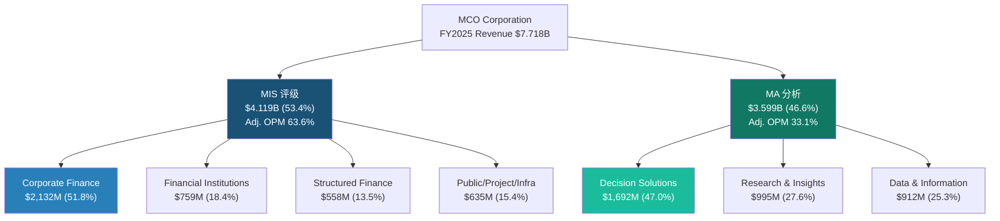
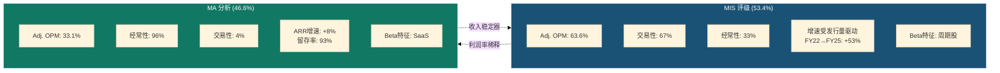
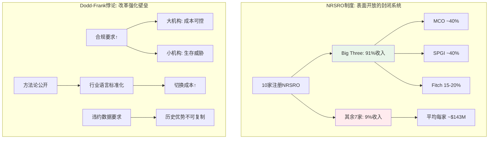
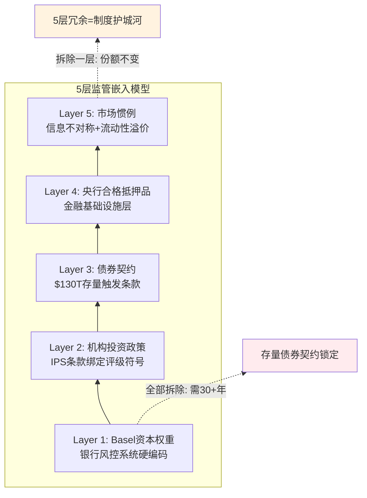
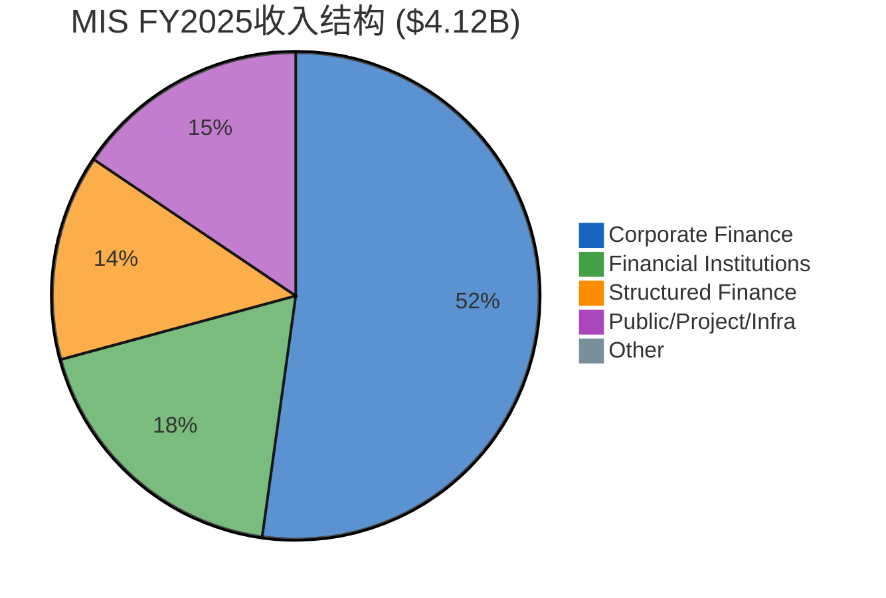
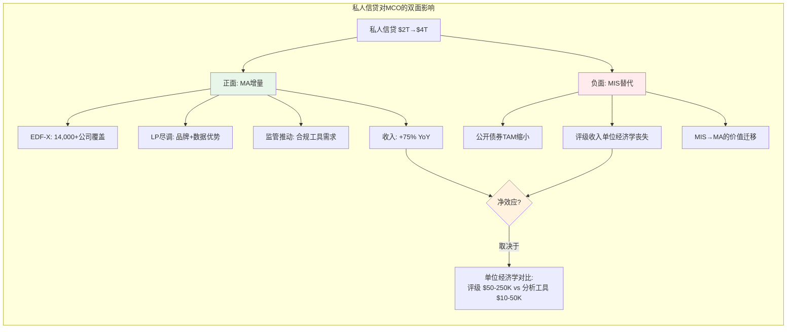
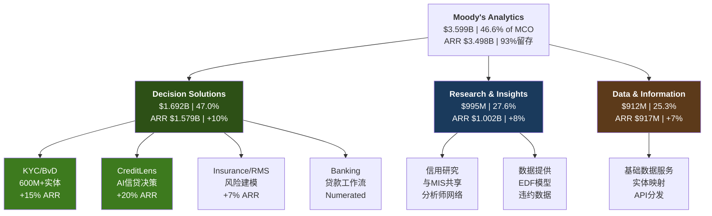
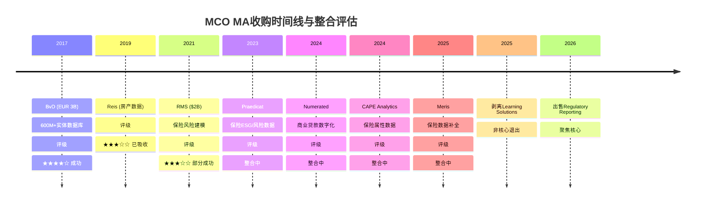
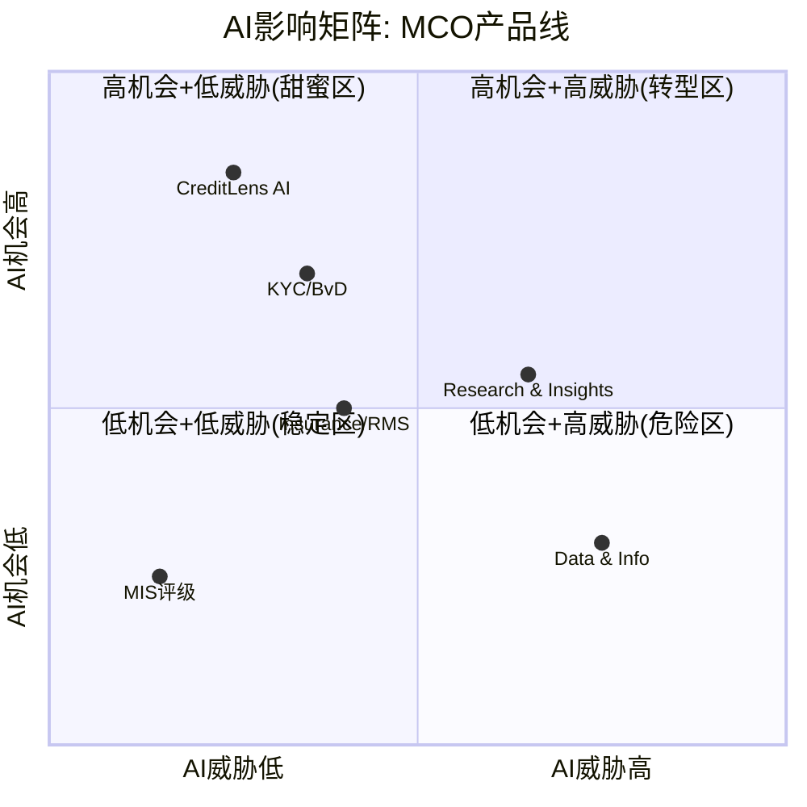
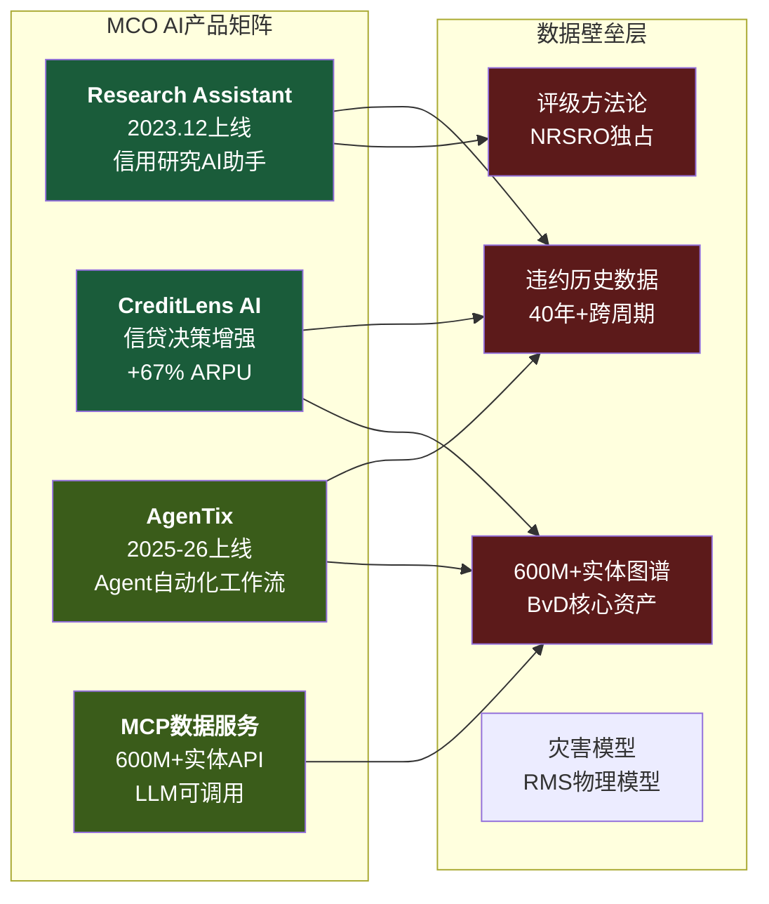

# MCO (Moody's Corporation) 深度研究报告 — Complete v1.0

> 日期: 2026-03-14 | 股价: $430.01 | 市值: $77.3B | 评级: 关注(偏中性) | 期望回报: +15.1%

---

## 报告摘要 (Executive Summary)

Moody's Corporation是全球信用评级双寡头之一，同时运营着一个快速扩张的信用分析SaaS平台。这份报告的核心发现是：市场将MCO按"信息服务公司"定价（P/E 31.5x），但MCO有超过三分之一的收入直接暴露于债券发行周期——这是一个被低估的结构性风险。

**评级与回报预期**：我们给予MCO"关注(偏中性)"评级，概率加权期望回报+15.1%。当前$430.01的定价处于"充分忽略周期性"与"充分定价周期性"的中间偏上位置。分析师共识目标价$550-572隐含+28-33%上行空间，但近期密集下调（Mizuho、Barclays、UBS、GS均下修目标价）暗示情绪恶化。

**三个核心论点**：

第一，MCO不是纯信息服务公司，而是"半周期股+半SaaS"的混合体。MIS评级业务贡献53.4%收入，其中67%为交易性（依赖债券发行量），Adj. OPM高达63.6%。MA分析业务贡献46.6%收入，96%为经常性，ARR $3.498B，留存率93%。两个引擎的本质截然不同——MIS是监管嵌入的"收费站"，MA是尚在进化的"数据+软件平台"。

第二，利润率混合陷阱是MCO的结构性约束。MA增长越快（+8% vs MIS长期+5-7%），MCO总体OPM天花板越低。即使MA OPM从33%扩张至38%，在55%收入占比下MCO整体Adj. OPM仍仅50.2%，低于当前52%水平。管理层FY2026指引的52-53%可能接近峰值而非起点。

第三，私人信贷的崛起（$2T→$4T到2030年）对MCO是一把双刃剑。正面：MA的分析工具获得增量收入（FY2025 +75%）。负面：每一笔从公开市场转向私人信贷的交易，MCO损失的MIS评级收入是MA分析工具收入的5-7倍。利润替代比更是高达10:1。短期净效应为正，长期存在结构性侵蚀风险。

**非共识洞见**：市场的"周期记忆衰退"是当前最大的定价风险。FY2022仅3年前，MCO收入-12%、EPS-37%——但P/E 31.5x的定价隐含了12.5%的EPS CAGR，几乎没有为下一次衰退留余地。在衰退概率42-48%、杠杆贷款违约率已达历史均值2倍的环境下，这种乐观令人不安。

**关键数字**：FCF/NI 6年均值约105%，CapEx仅收入的4.2%——这是真正的质量亮点。Berkshire持股14.54%、Greg Abel确认永久持仓提供了价值锚。A-Score初评73.5/110，SGI约6.5/10。

---

## Part I: 公司全景

### Ch01: 公司本质 — "半周期+半SaaS"的信用帝国

**Moody's Corporation是全球信用评级双寡头之一，同时运营着一个快速扩张的信用分析SaaS平台。**

这一句话包含两个截然不同的生意，也是理解MCO估值的起点。评级业务(MIS)像收费站——每一笔公开债务发行都必须经过Moody's或S&P Global的"盖章"；分析业务(MA)像企业软件——银行、保险公司、基金经理每年续费使用信用风险模型和数据库。前者赚的是交易佣金，后者赚的是订阅费。前者随债券发行量剧烈波动，后者月月到账、旱涝保收。

市场倾向于把MCO归类为"信息服务公司"，给出31.5x P/E——一个更接近MSCI(35x)而非周期股的倍数。但如果拆开引擎盖，会发现MCO有36%的收入来自交易性评级费（MIS交易性67% × MIS收入占比53.4%），这部分收入在FY2022曾单年缩水超过12%。这不是一家典型"信息服务公司"该有的波动率。

#### 关键转折点: 从手册出版商到数据帝国

MCO的117年历史浓缩为四个转折：

1. **1909年 — John Moody出版《Moody's Manual》**：以铁路债券评级起家，"评级"这个概念从此诞生。这是信息中介最原始的形态——把复杂的信用分析简化为字母等级。

2. **2000年 — 从Dun & Bradstreet拆分独立上市**：MCO作为纯粹的评级公司开始独立运营。拆分前的D&B是个杂货铺（商业信息+信用评级+市场研究），拆分让MCO聚焦于最高利润率的评级业务。

3. **2007-2008年 — 金融危机与声誉重建**：次贷危机中，Moody's因对结构化产品评级过于宽松遭受重创——股价从高点跌去70%+，面临国会听证和巨额诉讼。危机后Moody's重建信誉，同时推动Dodd-Frank法案下的NRSRO监管体系，反而巩固了寡头格局：10家注册NRSRO中，Big Three占据91%收入。危机本应是评级机构的末日，却意外成为护城河的加固工程。

4. **2017-2021年 — MA的平台化豪赌**：Bureau van Dijk(EUR 3B, 2017)带来6亿+实体数据库，RMS($2B, 2021)带来保险风险建模能力。两笔收购把MA从"评级附属品"变成独立的分析平台，也把MCO的商誉推高至$6.4B——占总资产52%。这是一场不可逆的转型：MCO赌的是"评级+分析"的飞轮效应，赌注是资产负债表上超过80亿美元的商誉加无形资产。

#### 核心命题的战略含义

MCO管理层反复讲述的叙事是"Integrated Risk Assessment"——MIS的评级数据喂养MA的分析模型，MA的客户关系反哺MIS的评级需求。如果这个飞轮是真的，MCO值得比MIS和MA简单加总更高的估值。如果飞轮只是投资者叙事，MCO就是两个不同生意的拼盘——一个波动率极高的评级业务拖着一个增速平庸的SaaS业务。这个争论贯穿整份报告。

这里有一个关键对照：SPGI在2022年完成了IHS Markit合并，走的是"更宽"路线（Indices+Market Intelligence+Commodity Insights+Mobility）；MCO走的是"更深"路线——围绕信用风险这一垂直领域，从评级延伸到分析工具再到工作流。两条路线谁更优，取决于信用风险分析是否是一个足够大的"护城河领地"来支撑两个引擎。FY2025全球评级债务规模>$6.6T，公司债+银团贷款更是达到$13.7T（历史新高）——这个市场的绝对规模给出了初步答案：信用风险是金融市场的基础设施级需求，不会消失。问题不在于需求是否存在，而在于MCO能否在评级之外（MA）同样建立起不可替代性。

#### AI: 加速器还是搅局者?

MCO在AI上的投入值得在报告开篇就提及，因为它正在改变MIS和MA的交互方式。FY2025已有40%的MA ARR（约$1.4B）含GenAI功能。CreditLens的AI升级实现了+67% ARPU提升。更引人注目的是GenAI/AgenTix客户群体的表现——97%留存率（vs MA整体93%），增速是MA整体的2倍。这些数据暗示：AI不仅是效率工具，还在成为一个定价权放大器——愿意为AI功能付费的客户粘性更高、钱包份额更大。

但AI也是潜在威胁。MIS受NRSRO监管保护，AI短期内无法替代"监管认证"的评级意见。MA则不同——Bloomberg Terminal、Refinitiv、甚至初创公司都在用AI重构信用分析工作流。MCO的防守策略是"数据护城河"——600M+实体数据库（BvD）+百年评级历史数据，这些是训练信用风险模型的独特原材料。但这个护城河的持久性需要持续评估。RiskTech100连续4年排名第一提供了当前竞争力的证据，但排名是滞后指标，不是领先指标。

---

### Ch02: 财务全景 — 6年P&L桥接

#### 一张表看清MCO的周期DNA

| 财年 | 收入 | YoY | 营业利润 | OPM(GAAP) | 净利润 | EPS(d) | FCF | FCF/NI |
|------|------|-----|----------|-----------|--------|--------|-----|--------|
| 2020 | $5.371B | — | $2.447B | 45.6% | $1.778B | $9.39 | $2.043B | 114.9% |
| 2021 | $6.218B | +15.8% | $2.844B | 45.7% | $2.214B | $11.78 | $1.866B | 84.3% |
| 2022 | $5.468B | **-12.1%** | $1.997B | **36.5%** | $1.374B | **$7.44** | $1.191B | 86.7% |
| 2023 | $5.916B | +8.2% | $2.221B | 37.5% | $1.607B | $8.73 | $1.880B | 117.0% |
| 2024 | $7.088B | +19.8% | $2.971B | 41.9% | $2.058B | $11.26 | $2.521B | 122.5% |
| **2025** | **$7.718B** | **+8.9%** | **$3.455B** | **44.8%** | **$2.459B** | **$13.67** | **$2.575B** | **104.7%** |

#### 三个关键阅读角度

**角度一：FY2022是照妖镜。** 当债券发行量萎缩时，MCO收入跌12%、EPS跌37%（$11.78→$7.44）、OPM从46%暴跌至37%。EPS跌幅是收入跌幅的3倍——这是经营杠杆在周期底部的放大效应。对于一家被按"稳定增长"定价的公司，这种波动率值得铭记。

**角度二：FY2025的OPM(44.8%)还没回到FY2021(45.7%)。** 收入绝对值已比FY2021高出$1.5B(+24%)，但OPM反而低了0.9个百分点。原因不是运营效率变差，而是业务混合发生了结构性变化：FY2021 MIS占比61% → FY2025仅53.4%。MA的利润率（Adj. OPM 33.1%）不到MIS（63.6%）的一半。MA越成功、增长越快，MCO的总体OPM天花板就越低。这是"利润率混合陷阱"的核心证据。

**角度三：FCF质量是真正的亮点。** FY2025 FCF/NI = 104.7%，6年平均约105%。这意味着MCO的净利润几乎可以1:1转化为自由现金流——CapEx仅$326M（收入的4.2%），应收账款管理高效，没有大规模资本支出需求。这是轻资产模型的标志性特征，也是MCO能持续回购+分红的底气。

#### Adj. OPM vs GAAP OPM: 一个7个百分点的争议

FY2025 Adj. OPM 51.1% vs GAAP OPM 44.8%——差异主要来自收购无形资产摊销（D&A $480M，其中约$300M+为收购相关）。管理层FY2026指引也是Adj. basis：52-53%。

问题在于如何看待这$300M+的摊销。如果BvD的数据库和RMS的风险模型是MCO MA业务的核心资产，那这些无形资产的"消耗"是真实的经济成本——需要持续投入（收购或内部开发）来维持竞争力。用Adj. OPM忽略这部分成本，等于假设这些资产可以永续使用而不折旧。D&A从FY2022的$331M升至FY2025的$480M(+45%)，而商誉仅增加9%——摊销加速但商誉平稳，意味着收购的无形资产正在被消化，未来需要新的收购来补充。

本报告的处理方式：GAAP OPM作为主要参考，Adj. OPM作为辅助。在估值模型中对收购摊销做部分加回（50%），既不完全忽略也不完全计入。

#### FY2026指引: 管理层的乐观与隐忧

管理层给出FY2026指引：Adj. EPS $16.40-$17.00，隐含+20-24% YoY增长（vs FY2025 Adj. EPS $14.94）。支撑这个预测的关键假设：
- 高个位数收入增长
- Adj. OPM扩张至52-53%
- 回购约$2.0B
- FCF $2.8-3.0B

隐忧：指引隐含MIS收入持续强劲（FY2025已是周期高峰），但衰退概率Zandi给42-48%，Polymarket给34.5%。如果2026年下半年发行量收缩（杠杆贷款违约率已升至7.9%，是历史均值2倍），这个指引的中枢$16.70可能需要下修。

#### 资本配置: 高效还是奢侈?

FY2025资本回报全景：回购$1.706B + 分红$701M = 股东回报$2.407B，占FCF的93.5%。公司几乎把所有自由现金流都还给了股东，留存极少用于有机投资（CapEx仅$326M）。

回购效率是一个必须审视的问题。FY2025平均回购价格大约在$450-480区间（以$1.706B购回约3-4M股估算），对应P/E约33-35x。回购的EPS增厚效应约1%/年（流通股从184.7M→179.9M，5年净减少约2.6%）。在31x P/E下，回购隐含回报率（earnings yield）仅3.2%，这远低于MCO自身的ROIC（>30%）。换言之，如果MCO能找到高回报的有机投资或收购标的，回购是次优选择。但评级业务的特点是：几乎不需要资本投入就能扩大产能（边际成本约等于0），所以MCO事实上没有大规模资本部署的"出口"。回购可能不是最优解，但在缺乏更好替代的情况下，它至少比让现金闲置好。

累计回购已达$13.302B，直接导致有形账面价值为-$4.0B。这不是财务困境的信号——对于轻资产、高FCF的商业模型，负权益是回购的数学结果，不是偿付能力问题。利息覆盖18.3x、Net Debt/EBITDA 1.26x提供了充分的安全边际。

---

### Ch03: 双引擎架构 — MIS vs MA深度拆分

MCO的估值争论最终归结为一个问题：MIS和MA各值多少？这两个分部有着截然不同的商业特征、增长曲线和利润结构。

#### MIS: 收费站经济学

MIS FY2025收入$4.119B，Adj. OPM 63.6%，Q1 2025单季度Adj. OPM甚至达到66%。这是一个接近软件级别的利润率，但驱动逻辑完全不同——MIS的高利润率来自"双寡头税"(duopoly rent)，不来自规模经济。

**资产类别拆分(FY2025)**：
- **企业金融(Corporate Finance)**：$2,132M（51.8%）——最大引擎，受投资级和高收益债发行量直接驱动。FY2022→FY2025从$1,269M增长68%，弹性最高
- **金融机构**：$759M（18.4%）——银行和保险公司评级，增长较稳定（+10% YoY）
- **结构化产品**：$558M（13.5%）——CLO/CMBS/RMBS等，波动大但2008后缩水为较小比重
- **公共/项目/基建**：$635M（15.4%）——市政债+项目融资，受基建法案和绿色债券推动增长

**交易性vs经常性：67:33**。这意味着MIS每年$2.76B收入来自新发行的"一次性"评级费用。发行量好的年份（FY2021/2024/2025）这是印钞机；发行量差的年份（FY2022）这是利润黑洞。

经常性33%（$1.36B）主要来自年度监控费（surveillance fees）——已评级债务只要存续，就要每年交监控费。这部分是"后付费护城河"：过去20年积累的评级存量越大，经常性收入基数越稳。但注意：新增评级在放缓时，经常性收入增速也会延迟放缓（12-18个月后）。

#### MA: SaaS的理想与现实

MA FY2025收入$3.599B，Adj. OPM 33.1%，ARR $3.498B，留存率93%。

**三条产品线**：
- **Decision Solutions（$1,692M, 47%）**：最大且增长最快的引擎。包含KYC（反洗钱/合规检查，ARR +15%）、CreditLens（信贷审批平台，+20% ARPU提升）、Banking Cloud、Insurance（RMS风险模型，达到$150M增量收入目标）。这是MA向"工作流嵌入"转型的主战场。
- **Research & Insights（$995M, 28%）**：传统信用研究和经济预测（Mark Zandi的宏观预测属于这部分）。增速+8%，稳健但不激动人心。
- **Data & Information（$912M, 25%）**：BvD数据库+Orbis公司信息。增速+7%，属于基础设施级数据资产。

**93%留存率的两面性**：93%在SaaS世界是"良好"(Good)而非"卓越"(Great)。Tier 1企业SaaS（如Veeva、ServiceNow）留存率在95%+甚至97%+。MCO的7%年流失意味着MA每年需要新签+扩展约$525M收入（ARR的约15%）才能维持8%净增长。如果留存率滑落至90%（仅3个百分点），在相同新签速度下ARR增速将从8%降至5%。留存率是MA估值最敏感的输入变量，幸运的是MCO提供了硬数据（vs SPGI的推断95%+）。

**剥离信号与有机增速真相**：管理层已剥离Learning Solutions（2025年12月）并计划剥离Regulatory Reporting（2026年），合计约180bps MA增速拖累。这是积极信号——剥离低增长/低利润率业务可以提升MA整体质量。但反面解读是：剥离后MA的报告增速会因基数效应短期承压，FY2026的MA有机增速需要在+8%基础上加回180bps才是"同口径"对比。

**MA的预收收入信号**：FY2025递延收入（current）达到$1.582B，接近MA单季度收入（$900M）的1.75倍。这是经常性收入质量的"预付证据"——客户预付的订阅费越多，未来收入确认的确定性越高。递延收入规模也意味着MA的真实经济活动领先于会计确认，为分析师预测提供了内置的"能见度缓冲"。

#### MIS/MA对比: 核心矛盾

**利润率混合陷阱证据链**：

FY2026指引Adj. OPM 52-53%，分部指引MIS约65%、MA 34-35%。假设MA增速持续>MIS增速（MA +8% vs MIS长期约5-7%），到FY2030 MA占比可能从47%升至52-55%。在该混合比下，即使两个分部各自OPM不变，MCO总体Adj. OPM将从52%下降至50%以下：

- **情景测算**：MA 55%×35% + MIS 45%×65% = 19.3% + 29.3% = **48.5%**

这不是运营失败，而是数学必然。MA增长越快、MCO的利润率混合(margin mix)越不利。管理层的52-53%指引能否维持3年以上，取决于MA OPM能否从33%扩张至37-38%——这需要费用杠杆+AI效率同时兑现，并非低风险假设。

**反驳空间**：管理层FY2026指引MA OPM 34-35%，暗示+100-200bps扩张方向。驱动力包括：(1)GenAI嵌入产品后的人力成本替代（当前40% ARR已含AI功能）；(2)剥离低利润率业务（Learning Solutions+Regulatory Reporting）提升存量质量；(3)BvD/RMS整合完成后收购摊销的自然递减。如果MA OPM能以每年+100bps的速度扩张（从33%→38%用5年），利润率混合陷阱的冲击将被延缓——但不会被消除。即使MA达到38%，在55%占比下的MCO整体Adj. OPM仍仅为：55%×38% + 45%×65% = 20.9% + 29.3% = 50.2%，低于当前52%水平。利润率混合陷阱是MCO的结构性约束，不是管理层能"执行掉"的问题。

---

### Ch04: SGI速判 + A-Score品质评分

#### SGI (专才-通才指数) 评估

MCO是一个有趣的混合案例。MIS业务是"纯种专才"——全球信用评级市场只有两家（加半家Fitch）有意义的参与者，MCO在这个极度专业化的市场占据约40%份额，监管壁垒（NRSRO注册）让新进入者几乎不可能挑战。MA业务则是"有专才基因的通才"——Decision Solutions覆盖KYC/信贷/保险/气候风险等多个赛道，竞争对手从Refinitiv到Bloomberg到初创企业不等。

**SGI综合评分：约6.5/10**
- MIS单独：约9/10（双寡头，监管嵌入，50年格局不变）
- MA单独：约4.5/10（多赛道竞争，留存93%而非97%+，尚未形成平台锁定）
- 加权：（53% × 9 + 47% × 4.5）约 6.9，考虑到MA正在拉低专才纯度，调整至约6.5

**对比SPGI**：SPGI评级占比更低（约34% vs MCO 53%），意味着SPGI的通才比重更高（Indices+Market Intelligence+Mobility）。MCO的SGI更高（6.5 vs SPGI约5.5）——更专注但也更依赖评级周期。这是一把双刃剑。

#### A-Score品质评分

A-Score完整框架包含21个维度（A+B+C+D四组）。当前阶段可以评估A组（财务健康）和部分D组（宏观/周期）：

**A组: 财务健康 (7维度)**

| 维度 | 分项 | 评分(0-10) | 关键依据 |
|------|------|:--------:|---------|
| A1 | 收入增长持续性 | 7.0 | 6年CAGR约7.5%，但FY2022暴露-12%波动 |
| A2 | 利润率质量 | 8.5 | Adj. OPM 51.1%顶级，但GAAP/Adj差异需折价 |
| A3 | FCF转化 | 9.0 | FCF/NI 6年均值约105%，CapEx仅4.2% |
| A4 | 资产负债表 | 6.5 | Net Debt/EBITDA 1.26x健康，但TBV -$4.0B，商誉$6.4B |
| A5 | 资本配置效率 | 7.0 | 回购$1.71B/年+分红$701M，但高P/E下回购效率偏低 |
| A6 | 盈利可预测性 | 6.0 | MA(96%经常性)高度可预测，MIS(67%交易性)波动大 |
| A7 | ROE质量 | 7.5 | ROE 62.1%极高，但受负权益放大（Treasury Stock $13.3B） |

**A组小计：51.5/70 (73.6%)**

**D组初评 (周期与宏观, 4维度)**

| 维度 | 分项 | 评分(0-10) | 关键依据 |
|------|------|:--------:|---------|
| D1 | 周期敞口 | 4.5 | 36%交易性收入=中高周期敞口，FY2022已验证脆弱性 |
| D2 | 宏观依赖 | 4.0 | 利率环境+发行量+违约率三重宏观依赖 |
| D3 | 地缘风险 | 7.0 | 全球分散（美国约50%，欧洲约30%，亚太约20%），但中国市场政策风险 |
| D4 | 监管风险 | 6.5 | NRSRO体系既是壁垒也是枷锁；DOJ/SEC周期性调查 |

**D组初评：22.0/40 (55.0%)**

**A-Score初评：A组51.5 + D组22.0 = 73.5/110（可评范围）**

B组（商业质量）和C组（护城河）的初步印象：
- B4（定价权）可能是MCO最强项——评级定价权接近绝对（MIS Adj. OPM 63.6%）。发行人没有"不买评级"的选项——没有Moody's/S&P评级的债券基本无法进入机构投资者的投资范围。这不是品牌溢价，而是制度强制
- C1（制度嵌入）极深——NRSRO监管+Basel III资本计量中评级的强制要求。银行计算信用风险加权资产时，外部评级直接影响资本充足率。这意味着Moody's的评级不仅是信息产品，更是监管基础设施的一部分
- C2（网络效应）在MA侧有中等强度——600M+实体数据库的Orbis/BvD构成数据网络壁垒，但网络效应强度低于双边平台（如ICE/CME交易所）
- C3（转换成本）在MA工作流产品中正在建立——CreditLens嵌入银行信贷审批流程后，切换成本显著提高（需要重新培训+数据迁移+监管合规验证）

**管理层变动风险**：MA总裁Stephen Tulenko于2025年8月辞职，Andy Frepp临时接管。MA正处于平台化转型关键期，主帅离场是不容忽视的执行风险。CEO Rob Fauber（任期21年+）和新任CFO Noemie Heuland（ex-SAP/Dayforce, 2024年加入）需要证明MA的战略方向不会因人事变动而偏移。

#### MCO vs SPGI: 估值对照

| 维度 | MCO | SPGI |
|------|-----|------|
| 评级收入占比 | 53.4% | 约34% |
| 非评级业务性质 | 信用分析SaaS | 指数+数据+Mobility |
| SGI | 约6.5 | 约5.5 |
| P/E(TTM) | 31.5x | 28.8x |
| 周期敞口 | 更高（MIS占比大） | 更低（Indices反周期） |
| Berkshire背书 | 14.54%持股 | 无 |

MCO的P/E溢价（31.5x vs SPGI 28.8x）部分来自Berkshire的"信任溢价"和MIS更高的利润率。但MCO的周期敞口也更大。SPGI的Indices业务（被动投资受益者）提供了MCO没有的反周期对冲。

**Smart Money分歧**：Greg Abel已确认MCO为Berkshire"永久持仓"。但TCI（Chris Hohn）Q4 2025加仓61,500股的同时，UBS减持74.6%（$2.1B退出）。Smart Money内部存在分歧，这本身就是一个信号——MCO的估值在这个节点上不存在"共识"。

#### ROE 62%的解剖: 真功夫还是会计幻觉?

MCO的ROE 62.1%在金融信息服务行业中极为突出（SPGI 13.1%、ICE 11.9%）。但这个数字需要拆解：

ROE = Net Income / Shareholders' Equity。MCO的shareholders' equity被$13.3B累计回购压到极低水平——Book Value仅$4.2B（含$8.2B商誉和无形资产），TBV为-$4.0B。低分母放大了ROE。

更有意义的指标是ROIC或ROA。FY2025 ROA约15.5%（$2.459B / 约$15.8B total assets），这在任何行业都是优秀水平——证明MCO确实能以较少资产产出大量利润。但ROE 62%中大约一半的"超额"来自杠杆（负权益）放大，不完全是运营效率的体现。

在SOTP估值中，不应该把62% ROE当成可持续的盈利能力代理。更可靠的锚点是：FCF/Revenue 33.4%——每产出1美元收入，有33美分变成真金白银的自由现金流。这个比率在SaaS行业中位于75th percentile水平，对于一家$77.3B市值的公司来说，极其优质。

#### 市场定价隐含了什么?

当前$430.01，Market Cap约$77.3B：
- P/E 31.5x隐含：投资者愿意为每$1 EPS支付$31.5，这要求未来5年EPS CAGR不低于10%才能使当前PE在5年后回归25x（大盘金融水平）
- 共识EPS CAGR 12.5%（FY2025-2030E）恰好覆盖了这个门槛
- Forward P/E 25.7x（基于FY2026E Adj. EPS $16.75）更温和，但前提是指引兑现

换一个角度：EV/EBITDA 24.5x，对应的隐含永续增长率约3.5-4%（假设WACC 9%）。考虑MCO的名义GDP+定价权增长潜力，这个隐含假设不算离谱，但也没有给衰退留余地。

分析师共识目标价$550-572，隐含+28-33%上行空间。21位分析师中12买入/8持有/1卖出。但近期密集下调（Mizuho $550→$524、Barclays $580→$550、UBS $515→$490、GS $603→$532）暗示情绪在恶化——方向比绝对值更重要。YTD下跌约17%与基本面改善（EPS beat四连）形成反差，驱动因素可能是：一是AI对传统信息服务公司的估值重估恐慌；二是SPGI弱指引的情绪传导；三是宏观衰退担忧压制周期敞口高的公司。

---

理解了MCO的双引擎架构和财务全景之后，接下来我们需要深入每个引擎的内部机制。Part II将聚焦MIS评级特许权——这是MCO最有价值也最难被复制的资产，但同时也是周期波动的主要来源。

---

## Part II: MIS评级特许权

### Ch05: NRSRO监管嵌入 — 50年寡头的深层逻辑

#### NRSRO制度: 看似开放的封闭系统

SEC注册的NRSRO共10家。这个数字常被引用为"评级市场向新进入者开放"的证据。但数字背后的现实截然不同：Big Three（MCO+SPGI+Fitch）合计占NRSRO总收入的91%，占非政府证券评级的84%。

这意味着什么？剩余7家NRSRO分享9%的市场收入。按FY2025 MIS收入$4.12B推算，如果MCO占约40%，三大机构合计评级收入约$10.3B，则7家小型NRSRO的合计收入约$1.0B——平均每家$143M。这个体量甚至不如MCO单一资产类别（Structured Finance $558M）的三分之一。

**为什么Dodd-Frank/CRARA未能削弱集中度?**

2006年CRARA和2010年Dodd-Frank Title IX的初衷是降低市场对Big Three的依赖。具体措施包括：取消SEC规则中对NRSRO评级的强制引用、要求评级机构公开方法论和违约统计、引入SEC监察权。

但改革的实际效果恰恰相反——它加深了壁垒：

1. **合规成本壁垒**：Dodd-Frank要求NRSRO建立独立合规部门、年度审计、方法论透明度报告。对$10B+收入的Big Three，这是"舒适的成本"（MCO合规成本占比<5%）；对$100-200M收入的小型NRSRO，这是生存威胁。
2. **历史违约数据库**：评级质量的终极验证是长期违约统计。MCO拥有100年+的违约数据库（1909年至今），覆盖$130T全球固定收益证券市场。新进入者即使获得NRSRO牌照，也无法"购买"这段历史。
3. **方法论锁定效应**：公开方法论本意是增加透明度，但实际上使发行人和投资者习惯了Big Three的评级框架——它成了行业语言。切换评级机构意味着切换"语言体系"。

#### 市场份额50年不变的深层逻辑

MCO约40% / SPGI约40% / Fitch约15-20%。这个格局从1970年代SEC首创NRSRO制度以来几乎没有变化。即使经历了2008年金融危机——Big Three因结构化产品评级失误遭受史无前例的声誉打击——份额依然稳固。

这不是一个简单的"品牌壁垒"问题。深层原因是评级特许权的5层监管嵌入——每一层都独立构成进入壁垒，5层叠加形成几乎不可逾越的制度护城河。

#### 监管嵌入5层模型

**第一层：Basel资本权重**

Basel III框架下，银行持有的债券资产需要根据信用评级计算风险权重。AAA/Aaa评级的企业债权重20%，而BB+/Ba1以下的权重可达150%。关键在于：这些资本权重表默认使用Big Three的评级符号。全球系统重要性银行（G-SIB）的风控系统、合规流程、监管报告都围绕MCO/SPGI的评级体系构建。即使一家新NRSRO获得SEC认证，它的评级在Basel框架下没有"同等对待"的自动路径——需要逐个国家监管机构的认可。

**第二层：机构投资政策**

全球养老金、保险公司、主权财富基金的投资政策（IPS）通常包含"仅投资BBB-/Baa3以上评级债券"等条款。这些条款中的评级几乎总是指MCO或SPGI的评级。更关键的是：许多IPS已经使用了10-30年，修改IPS需要投资委员会批准——这是一个极其缓慢的制度变迁过程。

**第三层：债券契约**

大量存量债券的契约中包含评级触发条款——例如"如果评级低于Baa3/BBB-，发行人需提供额外担保"。这些契约在债券存续期内无法单方面修改。全球存量债务超过$130T，其中大量契约绑定MCO/SPGI评级。这意味着即使未来新发债券改用其他评级机构，存量债券的评级需求也将持续数十年。

**第四层：央行合格抵押品**

美联储、ECB、BOE等主要央行的公开市场操作和紧急贷款窗口，均要求抵押品达到特定评级门槛。ECB的ECAF虽然允许四种评估来源，但实践中Big Three评级是最主要的参照。央行操作是金融体系的最后支撑——这一层嵌入意味着评级机构是金融基础设施的一部分。

**第五层：市场惯例与信息不对称**

债券发行说明书、信用分析报告、交易平台（Bloomberg Terminal的CRAT功能）都默认展示Big Three评级。投资者做信用决策时，"没有MCO/SPGI评级的债券"天然面临流动性折价——不是因为法规禁止交易，而是因为市场参与者缺乏替代的信用信息框架。

#### "分裂评级"溢价: 市场对MCO保守性的微偏好

当MCO和SPGI对同一发行人给出不同评级（"分裂评级"，split rating）时，MCO评级优于SPGI的债券交易利差平均窄约8bps。

8bps看似微不足道，但在$1B规模的债券发行中，8bps对应$800K/年的利息成本差异。对发行人而言，获得MCO更高的评级（哪怕只高一个notch）具有真实的经济价值。这创造了一个微妙的正循环：

1. MCO评级相对保守 → 投资者更信任MCO（利差更窄）
2. 利差更窄 → 发行人有动力获取MCO评级（降低融资成本）
3. 发行人需求稳定 → MCO维持保守立场（不需要"讨好"发行人）

这个正循环解释了为什么MCO可以在"发行人付费"模型下维持评级质量——因为保守性本身就是MCO的商业优势。发行人不是在为"高评级"付费，而是在为"被市场信任的评级"付费。

#### 发行人付费模型: 结构性利益冲突, 但替代方案已反复失败

"发行人付费"是评级行业最常被批评的商业模式。逻辑很直观：付钱的人（发行人）希望评级越高越好，而评级的使用者（投资者）需要客观评估。这是教科书级的委托代理问题。

但历史证明，替代方案更糟：

- **投资者付费模型**：Egan-Jones Ratings（投资者付费NRSRO）市场份额<1%。原因：投资者不愿为公共品（评级）付费——搭便车问题无解。
- **交易所/监管付费模型**：欧盟曾讨论由ESMA指定评级机构。结论：政府指定评级机构会引入政治干预风险。
- **随机分配模型**：Dodd-Frank 939F条款曾授权SEC研究随机分配评级任务。SEC自己的研究结论是：随机分配会降低评级质量。

发行人付费模型之所以存活50年，不是因为没有人尝试改变，而是因为所有替代方案都有更严重的缺陷。这是一种"丘吉尔民主"式的均衡——最糟糕的模式，除了所有其他模式。

**利益冲突的实际缓释机制**：虽然结构性冲突存在，但多重机制限制了其实际影响——声誉约束（100年+品牌）、双评级竞争（差异公开可查）、SEC年度监察、方法论刚性（同类型发行人适用同一方法论）。这些缓释机制不完美，但足以维持系统的运转。

---

### Ch06: MIS收入弹性 — 周期性的精确画像

#### 资产类别拆分: 不同的周期DNA

理解MIS的收入弹性，不能只看"MIS总收入"这一个数字。必须深入到资产类别层面，因为每个类别有截然不同的周期驱动因素、客户群体和利润率特征。

| 资产类别 | FY2022 | FY2023 | FY2024 | FY2025 | FY22→25 CAGR | 周期属性 |
|---------|--------|--------|--------|--------|:------------:|---------|
| Corporate Finance | $1,269M | $1,404M | $1,950M | $2,132M | +18.9% | **强周期**: 依赖IG/HY再融资窗口 |
| Financial Institutions | $491M | $545M | $727M | $759M | +15.6% | **中周期**: 银行资本补充需求 |
| Structured Finance | $462M | $405M | $518M | $558M | +6.5% | **强周期+延迟**: CLO/ABS受信贷周期滞后影响 |
| Public/Project/Infra | $431M | $476M | $564M | $635M | +13.8% | **弱周期**: 基建/市政有政策对冲 |
| MIS Other | $46M | $30M | $34M | $35M | -8.7% | 可忽略 |
| **Total MIS** | **$2,699M** | **$2,860M** | **$3,793M** | **$4,119M** | **+15.1%** | — |

**关键洞察**：FY2022是最近的周期低谷。但即使在那个"冰点"，MIS收入仍有$2.70B。对比FY2025的$4.12B，周期波动幅度约35%（=$1.42B）。这$1.42B的"周期收入"几乎全部来自Corporate Finance（-$863M，占比61%）和Financial Institutions（-$268M，占比19%）。

Corporate Finance是MIS的"周期放大器"：它占MIS收入52%，但贡献了周期波动的61%。原因在于企业债发行是最典型的"窗口型"业务——CFO会在利差收窄时集中发债，利差走阔时推迟。这不是线性关系：当BBB利差从150bps收窄至100bps，发行量可能+50%；但当利差从100bps走阔至200bps，发行量可能-40%以上。这种非对称性是理解MIS周期弹性的关键。

**各类别的深层周期逻辑**：

- **Corporate Finance（$2,132M, 52%）**：核心驱动是再融资需求+并购融资+投资级利差。FY2024-2025的爆发源于2020-2021年低利率时期大量发行债券的"再融资墙"（maturity wall）。到FY2027-2028，这面墙的主体将已翻新，再融资驱动力将减弱。

- **Financial Institutions（$759M, 18%）**：银行资本债（AT1/Tier 2）和金融公司债。受Basel III/IV资本要求驱动——当监管要求银行补充资本缓冲，银行必须发债，无论利差高低。这使得FI类别在监管收紧周期中反而具有"反周期"属性。

- **Structured Finance（$558M, 14%）**：CLO、RMBS、ABS、CMBS。这是2008年危机的震中，也是后危机时代恢复最慢的类别。CLO发行量高度依赖杠杆贷款市场活跃度——当PE并购活跃时CLO发行旺盛，反之则停滞。结构化产品的周期通常滞后于企业债6-12个月。

- **Public/Project/Infrastructure（$635M, 15%）**：市政债、基建项目融资、PPP。受政策驱动（基建法案、地方政府融资需求），与经济周期的相关性最弱。美国IIJA（2021）和IRA（2022）为这个类别提供了多年的结构性顺风。

#### 交易性67% vs 经常性33%: 真实的韧性基底

MIS收入结构中，交易性收入占67%，经常性收入（年费+监测费）占33%。

经常性收入33%×MIS总收入$4.12B 约 $1.36B。这是MCO在"零新增发行"的极端场景下仍可获得的MIS收入基底。对比FY2022低谷的$2.70B，说明即使在周期最差年份，MIS也有约$1.34B交易性收入——发行市场从未完全冻结。

经常性收入的战略价值不仅在于稳定性，更在于它代表"存量评级的嵌入深度"——每一个存量评级都是一个年金流，发行人很少主动撤销评级（撤销评级=向市场发出负面信号）。

#### 历史压力测试: 周期衰退的精确影响

| 压力期 | 整体收入变化 | MIS收入变化 | EPS变化 | 驱动因素 |
|-------|:----------:|:---------:|:------:|---------|
| FY2008-09 | 约-20% | 约-25% | 约-30% | 全球金融危机，结构化产品停发 |
| FY2016 | 约-5% | 约-8% | 约-10% | 短暂利差走阔，能源债违约潮 |
| FY2020 | -3% | 实际+7% | +5% | COVID初期发行暂停→随后超级再融资潮 |
| FY2022 | -12.1% | -29% | -37% | 联储激进加息，发行市场冻结 |

**FY2022是最有参考价值的压力测试**。MCO整体收入从$6.22B降至$5.47B(-12.1%)，但EPS从$11.78暴跌至$7.44(-37%)。收入跌12%而EPS跌37%，暴露了MIS的经营杠杆：固定成本（分析师薪资、合规团队、IT基础设施）在收入下降时无法快速调整。

FY2022的分解：MIS收入从$3.80B（FY2021）降至$2.70B(-29%)，Corporate Finance从$1.92B降至$1.27B(-34%)；MA收入从$2.42B升至$2.77B(+14%)——MA在MIS崩塌的年份反而增长，验证了其防御性；OPM从45.7%降至36.5%，压缩920bps。

FY2022的教训清晰：**MIS是一台高杠杆的周期机器，MA是减震器**。但MA只是减震，不是消除——整体EPS仍然跌了37%。

值得强调的是FY2020的"假阳性"：COVID初期市场恐慌导致3-4月发行暂停，但随后的联储QE+零利率环境触发了史上最大规模的企业债再融资潮。MIS FY2020收入实际+7%。这个案例说明：衰退不等于MIS收入下降，关键变量不是GDP而是**融资窗口是否开放**。如果衰退伴随央行宽松（FY2020），MIS可能受益；如果衰退伴随央行收紧（FY2022），MIS遭受双杀。当前环境（衰退概率42-48% + 通胀>3%概率73%）更接近FY2022型——联储降息空间受限，意味着融资窗口不会在衰退时快速重新打开。

#### FY2025: 周期高位的信号

FY2025全球评级债务>$6.6T，公司债+银团贷款$13.7T（历史新高）。MIS收入$4.12B同样是历史新高。

这些记录本身就是周期高位的信号。推动这些记录的因素：再融资需求（2020-2021年低利率环境下发行的大量债务到期）、利差收窄（打开了发行窗口）、私募→公开回流（利差收窄后公开发债更便宜）。

**但这些因素大多不可持续**：再融资"墙"是一次性的——2024-2025年集中再融资后，2026-2027年的再融资需求自然下降；利差可能因衰退重新走阔（杠杆贷款违约率已达7.9%，2倍历史均值）；私募→公开的回流取决于利差比较，如果利差走阔则逆转。

管理层FY2026指引"MIS收入高个位数增长"隐含的乐观假设是：发行量维持在高位附近，且定价贡献持续。但值得注意的是，FY2026指引中MIS Adj. OPM目标约65%，高于FY2025的63.6%——管理层预期MIS不仅收入增长，利润率还要扩张。如果发行量实际下滑，这个利润率目标将面临经营杠杆的反向压力。

#### 36%交易性敞口的估值含义

**这是本报告最重要的数据推导之一。**

计算链：MIS交易性收入占MIS总收入的67%，MIS收入占MCO总收入的53.4%。因此：MCO整体有 67% × 53.4% = **35.8%** 的收入来自MIS交易性评级。

超过三分之一的MCO收入——直接暴露于债券发行周期。这就是"周期记忆衰退"假说的数据基础。

**衰退情景量化**（基于FY2022实际数据外推）：

| 情景 | MIS交易性收入变化 | MCO收入影响 | EPS影响 (经营杠杆2-2.5x) |
|------|:----------------:|:----------:|:----------------------:|
| 温和衰退 (FY2016型) | -15% | -5.4% | -12~15% |
| 中度衰退 (FY2022型) | -30% | -10.7% | -25~30% |
| 严重衰退 (FY2008型) | -45% | -16.1% | -35~40% |

当前衰退概率42-48% + 杠杆贷款违约率7.9%（2x历史均值） + 32%美国公司处于信用风险早期预警。市场按P/E 31.5x定价MCO，隐含12.5% EPS CAGR。

**双杀场景**：如果FY2026-2027出现中度衰退（FY2022类型），EPS可能从指引的$16.70降至$12-13。如果同时P/E压缩至25x（FY2022实际P/E低点约22x），则：$12.5 × 25 = $313，较当前$430.01下跌27%。

这不是"黑天鹅"，而是MCO在过去4年中就经历过一次的场景。**市场是否已经"忘记2022"？这是报告最核心的非共识判断之一。**

---

### Ch07: 定价权 × 市场份额 × 监管合规

#### 寡头博弈: MCO-SPGI的Cournot均衡

MCO约40% / SPGI约40%的双寡头格局在博弈论中接近经典的Cournot均衡——两家企业在产量（此处为评级覆盖范围）上竞争，但都不愿发起价格战。

**为什么没有价格战？**

1. **需求弹性极低**：评级费用在发行人融资成本中占比<0.1%。将评级费从$200K降至$100K不会刺激发行人发更多债——发行人发债是因为有融资需求，不是因为评级便宜。需求对评级价格几乎完全无弹性。

2. **价格战的负面信号**：如果MCO降价争抢SPGI的客户，市场会解读为"MCO的评级价值在下降"。在一个信誉即产品的行业，降价=自贬。

3. **共谋不需要沟通**：Big Three的定价是公开的（费率表向发行人披露）。在三家寡头、低需求弹性、同质产品的环境下，价格自然趋同——这不需要违法的明确共谋，只需要理性的跟随者行为（follow-the-leader pricing）。

4. **双评级惯例的保护**：大型债券发行通常获取两家或三家评级（投资者期望，部分机构投资政策要求）。这意味着MCO和SPGI不是在争夺"一个蛋糕"，而是共享同一个蛋糕——大部分发行人同时是MCO和SPGI的客户。双评级惯例使得评级市场更接近"非零和博弈"：MCO拿到一个新客户，通常SPGI也拿到同一个客户。这进一步消除了价格竞争的激励。

这个均衡的脆弱点在哪里？理论上，如果某一方大幅提高质量或降低价格，发行人可能逐步从"双评级"回到"单评级"。但历史上唯一接近这个情况的是2008年后——即使当时大量发行人对Big Three极度不满，双评级惯例也未被打破。这说明均衡的稳定性来自制度（投资者要求）而非来自参与者的主观选择。

#### 定价权证据: 精确的经济学

评级费率结构：
- **首次评级费**：$50,000-$250,000，取决于发行规模和复杂度
- **年度监测费**：$20,000-$100,000，取决于评级类型
- **结构化产品费率**：显著更高，CLO/CMBS等复杂产品可达$500K+

定价权的最直接证据是费率增长与通胀的比较。MCO未公开具体费率增长率，但可以从收入增速vs发行量增速的差异间接推算：FY2024隐含定价增长约5-8%，显著高于同期CPI（约3%）。

**定价权的自我强化机制**：MCO的定价权不是来自"谈判能力"，而是来自结构性的不可替代性。发行人面临的选择不是"MCO的评级vs更便宜的评级"，而是"有MCO评级的债券（利差窄8bps）vs 没有MCO评级的债券（流动性折价）"。评级费用是"入场券"而非"产品价格"——这是最强的定价权形态。

#### 监管风险的真实图谱

**2011 Dodd-Frank Title IX（已发生）**

直接影响：取消了SEC规则中对NRSRO评级的硬性引用、引入SEC对NRSRO的监察/罚款权、要求评级机构加强内部合规。实际效果：市场份额未变。原因：5层嵌入中仅第一层（监管规则引用）被部分削弱，其余四层完全未受影响。

**2025年美国Aaa降级（已发生，影响待评估）**

MCO于2025年5月将美国主权评级从Aaa降至Aa1——MCO是最后一家取消美国最高评级的Big Three（SPGI在2011年降级，Fitch在2023年降级）。

政治后果是一个尾部风险。历史先例：2011年SPGI降级美国后，美国司法部对SPGI提起$5B诉讼（2015年以$1.375B和解）。虽然名义上诉讼原因是2008年结构化产品评级失误，但时间节点的巧合难以忽视。

MCO面临的政治风险包括：国会听证会+舆论压力（已在发生）、潜在的"报复性"监管审查、政府合同限制（低概率但不可忽视）、声誉风险放大。但历史也证明：SPGI在2011年降级美国后不仅存活，而且业绩持续增长。降级的"正确性"最终成为SPGI信誉的背书——因为美国的财政状况确实在恶化。MCO的降级同样有充分的数据支撑（美国债务/GDP已超120%）。

#### 信用评级的"不可替代性": $130T的制度依赖

全球固定收益证券市场规模超过$130T。这个天文数字意味着：评级的TAM几乎等于全球债务市场（只要债务存在，评级需求就存在）；评级是基础设施而非产品（即使"评级无用论"甚嚣尘上，MCO的收入在2010年就恢复了增长）；替代方案面临认证悖论（谁来认证替代方案的可靠性？答案回到监管机构，而监管框架已围绕Big Three建立了50年）。

**"不可能三角"的解析**：MCO实际上同时拥有高市场份额（约40%，双寡头）、强定价权（费率增长>通胀，发行人无弹性需求）和监管保护（5层嵌入，合规成本是壁垒）。在大多数行业，这三者不可兼得——高份额通常引发反垄断，强定价权通常吸引竞争者，监管通常限制定价。但评级行业的特殊性在于：**监管本身是定价权和份额稳定性的来源**。这不是传统意义上的"不可能三角"，而是一个由监管创造的"不可能三角的例外"。

---

### Ch08: 私人信贷 — 增量还是替代?

#### 私人信贷的增长规模与驱动因素

全球私人信贷TAM约$2T（当前），行业共识预测2030年将达到$4T。驱动因素包括：银行监管收紧（Basel III/IV推动leveraged lending从银行转向私人信贷基金）、LP配置需求（机构投资者寻找6-10%的收益率）、速度与灵活性（私人信贷审批周期2-4周，远快于债券发行的4-8周）、定制化（私人信贷可提供更灵活的条款结构）。

#### 正面: 私人信贷创造的MCO增量

MCO私人信贷相关收入FY2025增长+75%。这个增长来自：评估工具（非评级，属于MA而非MIS）、EDF-X模型（MCO与MSCI合作，覆盖2,800+私人信贷基金和14,000+被投公司）、LP尽调需求、以及监管驱动的合规工具需求。

#### 负面: 如果私人信贷侵蚀公开市场

核心逻辑：每一笔从公开债券市场转向私人信贷的交易，MCO可能失去一笔MIS评级收入（$50,000-$250,000首次评级费+年度监测费），但获得的MA分析工具/信用评估收入ARPU显著更低。

这个替代效应在几个领域尤其明显：中市场杠杆融资（EBITDA $25-100M的企业从高收益债转向直接借款）、PE并购融资（unitranche私人信贷无需评级）、再融资选择权（经济下行期企业可能选择私人信贷再融资）。

#### 单位经济学对比: 数字说话

| 维度 | MIS评级收入 | MA分析工具收入 |
|------|:----------:|:------------:|
| 首次费用/发行人 | $50,000-$250,000 | $10,000-$50,000（估算） |
| 年度经常性收入/客户 | $20,000-$100,000 | $5,000-$30,000（估算） |
| 利润率 | 约64% Adj. OPM | 约33% Adj. OPM |
| 客户获取模式 | 制度需求驱动（必须评级） | 销售驱动（需要证明ROI） |
| 竞争格局 | 双寡头，3家占91% | 分散，Bloomberg/FactSet/初创竞争 |

**关键数学**：假设一个中市场企业从$500M公开债券发行转向$500M私人信贷。MCO失去的评级收入约$100K-200K/年（首次+监测），但可能获得的MA分析工具收入仅$10-30K/年。**替代比约5:1到7:1** — 即MCO需要从私人信贷市场获取5-7倍的客户，才能在收入上抵消一个从公开市场转走的发行人。

更重要的是利润率差异：MIS的64% Adj. OPM意味着$100K评级收入约$64K利润。MA的33% Adj. OPM意味着$20K分析工具收入约$6.6K利润。**利润替代比高达约10:1。**

#### 净效应的判断框架

**当前证据倾向：短期净正，长期不确定。**

**短期净正的理由**：$2T→$4T的增长主要是"增量"而非"替代"——大部分私人信贷增长来自银行撤退后留下的真空；MCO私人信贷收入+75%的增速远高于MIS波动幅度；在当前发行量历史新高的环境下，MIS并未表现出TAM缩小的迹象。

**长期不确定的理由**：如果私人信贷持续增长至$4T+，替代效应会逐渐显现——特别是在中市场杠杆融资领域；单位经济学的5-7:1替代比意味着MCO需要大幅扩大MA覆盖才能保持中性；更根本的是，私人信贷的增长削弱了MCO的制度性嵌入——在不需要公开评级的市场中，MCO的5层监管壁垒不适用，MCO只是一个"分析工具供应商"，面临正面竞争。

#### 私人信贷情景矩阵

| 情景 | 私人信贷规模(2030) | 公开债券影响 | MCO净效应 | 概率估计 |
|------|:-----------------:|:----------:|:--------:|:------:|
| **共生增长** | $4T+（共识） | 公开市场同步增长 | 净正（MA增量>MIS损失） | 45% |
| **温和替代** | $3.5-4T | 中市场发行-10~15% | 近中性（MA增量约等于MIS损失） | 35% |
| **加速替代** | $5T+ | 中市场+部分大企业转向 | 净负（MIS损失>MA增量） | 20% |

#### 反向论证: 为什么私人信贷可能不是威胁?

1. **私人信贷需要公开市场作为"锚"**：私人信贷基金的贷款定价通常参考公开市场利差（SOFR+spread）。如果公开债券市场萎缩，定价锚消失，私人信贷基金自身的定价能力也会受损。公开市场和私人信贷更像共生关系而非零和博弈。

2. **监管趋势偏向MCO**：SEC和欧洲监管机构正在推动私人信贷市场的透明度。越透明=越需要标准化的信用评估工具=越利好MCO。

3. **大型企业仍偏好公开市场**：私人信贷主要服务于中市场（$25-100M EBITDA）。大型企业仍然偏好公开债券市场——规模效应和流动性优势使公开发债的总融资成本更低。MCO的核心评级收入来自大型企业，而非中市场。

4. **历史教训**：2005-2007年，市场也曾担忧结构化产品（CDO/CLO）会"替代"传统企业债。结果是两个市场共同膨胀。市场规模不是零和的——金融创新通常扩大总盘子，而非重新分配。

#### MCO-MSCI合作的战略意义

MCO与MSCI的EDF-X合作是MCO私人信贷战略的关键棋子。深层逻辑：数据互补（MCO有信用模型，MSCI有私募基金底层持仓数据）、卡位策略（成为私人信贷从"关系驱动"向"数据驱动"转型的标准基础设施）、防御性（"宁可自我蚕食，不可拱手让人"）。

但风险在于：在私人信贷市场，MCO没有5层监管嵌入的保护。EDF-X需要与Bloomberg PORT、BlackRock Aladdin等工具竞争。MCO在这个市场的护城河是数据和品牌，而非制度——这意味着竞争强度会显著高于MIS。

**时间维度**：私人信贷对MIS的替代效应不是"开关式"的，而是"渐进式"的。即使替代比例每年仅增加1-2pp，在5-10年的时间尺度上也可能累积为MIS TAM的5-15%缩减。这个缓慢侵蚀不会在任何单一季度财报中显现——它是一个需要持续追踪的结构性变量。

---

MIS评级特许权的分析揭示了一个深刻的二重性：它既是金融基础设施（5层监管嵌入、$130T制度依赖），又是周期性资产（36%交易性收入、FY2022级别的EPS波动）。市场当前定价更多反映前者——稳定、防御、类SaaS。接下来Part III将转向MCO的第二个引擎：Moody's Analytics平台。如果说MIS的价值在于"不可替代性"，MA的价值则在于"可扩展性"——但这种扩展性是否已经实现，还是仍停留在管理层叙事中？

---

## Part III: Moody's Analytics平台

### Ch09: 三产品线深度解剖

MA FY2025总收入$3.599B，占MCO整体的46.6%。ARR $3.498B，经常性收入占比96%。但这个"96%"背后的三条产品线，护城河宽度、增长天花板、AI脆弱度完全不同。

#### Decision Solutions ($1.692B, 47.0% of MA)

Decision Solutions是MA中增速最快（ARR +10%）、战略价值最高的产品线。ARR $1.579B，占MA ARR的45%。它由四个子模块构成，每个子模块的驱动逻辑完全不同。

**KYC/BvD（估算约$500-600M ARR, +15%）**

BvD是2017年以EUR 3B收购的实体数据库，拥有600M+全球实体数据。这不是一个"数据集"，而是一个**实体图谱基础设施**——将全球企业的股权结构、受益所有人、财务数据映射成机器可读的关系网络。

护城河宽度：**宽**。原因有三：数据网络效应（600M+实体是持续10年+的清洗、映射、更新的累积，新进入者需要5年+才能达到可用覆盖度）；监管驱动的刚性需求（AML/KYC法规在全球持续收紧，欧盟6AMLD、美国CTA都要求金融机构验证实体所有权链）；流程嵌入（BvD嵌入银行合规流程的基础设施层，切换意味着重新验证整个合规链条）。

+15% ARR增速在MA各子模块中最高，主要驱动力是监管加码（需求侧拉动）而非产品创新（供给侧推动）。这种增长更可持续，但天花板值得关注：全球主要银行已基本覆盖，增量主要来自中小金融机构+非金融企业。如果监管强度稳定而非继续加码，增速可能从15%回落至10-12%。

**CreditLens（估算约$300-400M ARR, +20%）**

CreditLens是AI增强的信贷决策工作流工具。关键数据点：2/3续约客户选择升级AI版本，ARPU提升+67%。这是MCO全产品矩阵中**最佳的upsell案例**。

这个+67% ARPU提升说明了什么？首先，它证明AI不是成本——是定价权放大器。当CreditLens从"信贷流程管理工具"升级为"AI辅助信贷决策系统"，客户愿意为"更快更准的审批"支付67%溢价。这是因为CreditLens的AI训练在MCO独有的违约数据+评级模型之上，竞争对手无法复制这一数据优势。其次，2/3的升级率意味着剩余1/3尚未升级——这是FY2026-2027的内嵌增长。

护城河宽度：**中-宽**。数据优势（违约模型）是真实的，但信贷决策工具市场有nCino、Temenos等竞争者。CreditLens的差异化在于MCO信用数据的独家嵌入，而非软件本身。

**Insurance/RMS（估算约$400-500M ARR, +7%）**

RMS是2021年以$2B收购的保险风险建模平台。管理层确认已达到$150M增量收入目标。保险ARR在2年内累计增长+21%。

成功面：$150M增量/$2B收购价 = 7.5%的第一年收入回报率，对数据/软件收购可接受。不足面：+7%的保险ARR增速是Decision Solutions四个子模块中最慢的。保险行业的IT预算分配保守，RMS虽然是行业标准，但客户升级周期长（3-5年）。更关键的是，保险业务与MCO核心的信用分析能力协同度最低——这更像是一个"相邻市场扩张"而非"飞轮组件"。

护城河宽度：**中**。灾害模型有数据壁垒，但AIR Worldwide（Verisk）是强力竞争者。

**Banking/Numerated（估算约$100-200M ARR）**

Numerated是小额商业贷款数字化工具，主要服务美国社区银行。这是最小的子模块，管理层披露最少。Banking子模块的切换成本可能是DS中最低的，因为商业贷款审批流程标准化程度高，替代方案（如nCino）成熟。

#### Research & Insights ($995M, 27.6% of MA)

R&I是MA中最独特的产品线，因为它直接建立在MIS评级分析师网络之上。ARR $1.002B，增速+8%。

这条产品线的护城河来源与DS完全不同：不是数据库或软件，而是**信用分析专业知识的产品化**。MCO拥有全球最大的信用分析师团队（约3,500人），这些分析师产出的研究、模型、方法论，通过R&I变成了可订阅的产品。

R&I是MIS与MA之间最直接的协同证据。没有MIS的评级特许权和分析师网络，R&I无法独立存在。正面来看，R&I是评级特许权的"二次变现"——同一支分析师团队，既产出评级（MIS收入）又产出研究（MA收入）。负面来看，R&I的成本归属模糊——如果MIS分担了大部分分析师成本，R&I的"真实利润率"可能比报表显示的更高。

护城河宽度：**中-宽**。信用研究市场的竞争者（Bloomberg Intelligence, CreditSights/Fitch Solutions）都缺乏MCO级别的评级数据独占性。但AI时代可能削弱"人工分析师解读"的价值。

#### Data & Information ($912M, 25.3% of MA)

D&I是MA的"基础层"——提供实体数据映射、信用数据feed、API接口。ARR $917M，增速+7%，是三条线中最慢的。

D&I的增速最慢有结构性原因：数据层被商品化风险最高（原始信用数据可从多来源获取），价格弹性低（基础数据服务提价空间有限）。但D&I也有"隐藏价值"：它是DS和R&I的数据供应层。没有D&I的实体映射和数据清洗，DS的KYC工具和R&I的信用研究都无法运作。这使得D&I虽然增速慢，但战略上不可或缺——类似于"水管"而非"水龙头"。

护城河宽度：**窄-中**。数据层最容易被AI替代（自动化数据清洗+NLP提取），也最容易被Bloomberg/FactSet/Refinitiv等竞争者覆盖。

---

### Ch10: SaaS纯度检验 — 93%留存的真实含义

#### 留存率: 93%的真实含义

93%留存率是MCO每季度确认的硬KPI。Q1/Q3/Q4 2025均确认93%，数据一致性高。这vs SPGI MI（仅"推断95%+"，无硬数据）是一个明确优势——我们知道MCO的留存率是什么，而SPGI的留存率是一个假设。

但93%在SaaS世界意味着什么？

**Tier 1 SaaS（95%+ gross retention）**：Veeva（97%+）、ServiceNow（97%+）、Workday（95%+）——这些是"工作流操作系统"，客户一旦使用就无法脱离。

**Tier 2 SaaS（92-95% gross retention）**：Salesforce（约93%）、HubSpot（约93%），以及MCO MA（93%）——这些是"优秀但非不可替代"的产品，客户留存高但仍有7%年流失。

7%年流失率意味着什么？假设MA当前客户基数约15,000家，每年流失约1,050家。要维持8%净ARR增长，需要抵消7%流失（约$245M）加上8%净增（约$280M），**总计MA每年需要约$525M的gross新增ARR**。$525M的新增ARR需求vs $3.5B存量ARR = gross新增率约15%。这在SaaS世界是健康的，但也意味着MA的增长引擎需要持续运转——它不是一个"自然增长"的业务。

#### 留存率的"隐藏维度": 按产品线拆解

93%是MA整体的blended gross retention。但不同产品线的留存特征截然不同：

- **KYC/BvD**：留存率可能95%+（估算）。监管刚需+流程嵌入，MA中最接近"基础设施"属性的产品
- **CreditLens**：留存率可能92-94%（估算）。切换成本中等，但MCO信用数据的独家嵌入提供了粘性
- **Insurance/RMS**：留存率可能90-92%（估算）。合同周期长但AIR Worldwide是强力替代选项
- **D&I**：留存率可能89-91%（估算）。基础数据服务切换成本最低，7%增速已暗示了更高流失率

93%的整体留存率是一个"混合平均值"，掩盖了KYC的95%+（优秀）和D&I的89-91%（需警惕）之间的巨大差异。**MA的留存质量取决于KYC和CreditLens能否持续锚定高端，而D&I的低端留存不被进一步侵蚀**。

#### NRR(净收入留存): 缺失的关键指标

MCO不披露NRR。这是一个重要的信息缺口。

93%是gross retention。根据CreditLens +67% ARPU升级率和KYC +15%增速，可以推断NRR在**102%左右**——如果ARR增长8%而gross retention 93%，则新签+扩展合计贡献15%；假设新签vs扩展约6:9的比例（SaaS行业典型），扩展率约9%，则NRR约93% + 9% = 102%。

但102%在SaaS世界仍然偏低（Tier 1 SaaS: NRR 120%+）。这反映了MA的本质：它不是一个"land and expand"模式的纯SaaS公司，而是一个**数据订阅+软件工具的混合体**。数据订阅部分（D&I）的扩展空间有限，软件部分（CreditLens）扩展空间大但基数小。

**NRR缺失的投资者风险**：没有NRR，投资者无法判断8%增长中"扩展"（高质量增长）和"新签"（需持续销售投入）的比例。CreditLens AI的+67% ARPU升级暗示扩展动力在增强，但这只是一个子产品的信号，不能外推到整个MA。

#### 97%经常性收入 vs 8%增长的悖论

97%经常性收入证明订阅模型已经成熟——MA几乎没有一次性收入。但97%经常性+8%增长的组合暴露了一个问题：**高经常性并不等于高增长**。

| 公司 | 经常性收入% | ARR增长 | P/E | 类型 |
|------|:----------:|:------:|:---:|------|
| MCO MA | 97% | 8% | （混入MCO整体） | 数据+软件混合 |
| Veeva | 85% | 14% | 32x | 垂直SaaS |
| ServiceNow | 97% | 22% | 55x | 平台SaaS |
| FactSet | 95% | 6% | 28x | 数据订阅 |
| MSCI | 95% | 15% | 35x | 指数+分析 |

MA的增速（8%）更接近FactSet（数据订阅商）而非ServiceNow（平台SaaS）。如果市场按"平台SaaS"给MA估值，这是过度乐观；如果按"数据订阅商"估值，当前定价可能更合理。

#### 真平台 vs 数据堆栈

MA是"数据堆栈"（通过收购拼凑）还是"真平台"（统一数据层+交叉销售）？

**平台证据**（支持"真平台"）：RiskTech100连续4年排名第一；MCO正在构建统一的保险Risk Data Lake环境；GenAI渗透40% MA ARR——AI功能跨产品线部署（非单一产品），说明底层存在可共享的技术基础设施；CreditLens AI升级利用MCO信用数据——DS产品可以调用R&I/D&I的数据层；96%经常性收入 + 93%留存，基数稳定性符合平台特征。

**堆栈证据**（支持"数据堆栈"）：收购拼凑——BvD(2017)+RMS(2021)+Numerated+CAPE+Meris，五次主要收购构成了DS的骨架，非有机生长；子产品间协同度可疑——KYC客户（银行合规部门）和Insurance客户（保险精算部门）几乎没有交叉；利润率长期偏低——MA Adj. OPM 33.1%，真正的SaaS平台应该展现更快的利润率扩张；ARR增速仅8%——如果"平台飞轮"在运转，增速应该加速而非停留在个位数；MA总裁Stephen Tulenko 2025年8月辞职——核心领导层不稳定暗示内部整合可能面临挑战。

**判断**：MA更接近"进化中的数据堆栈"而非"已验证的真平台"。平台的种子已经播下（Intelligent Risk Platform, GenAI跨产品部署），但果实尚未成熟——8%增速和33% OPM说明飞轮效应尚未加速。这是一个"3-5年的期权"：如果整合成功，MA可以升级为平台（ARR增速12%+, OPM 38%+）；如果失败，MA将停留在"数据订阅商"层级（ARR 6-8%, OPM 33-35%）。

**对估值的含义**：如果MA是"真平台"（40%概率），应得6-8x revenue（约$21-28B）；如果MA是"数据堆栈"（60%概率），应得4-5x revenue（约$14-18B）。概率加权MA合理EV：0.4×$24.5B + 0.6×$16B = $16.6B。差异约$10-13B，占MCO当前市值（$77.3B）的13-17%——这就是MA属性判断对估值的实质影响。

**关键追踪指标**：判断MA是否向"真平台"演进的3个领先指标：(1)交叉销售率提升至40%+；(2)MA OPM 3年内达到38%+；(3)MCO开始披露NRR且>110%。

---

### Ch11: 收购整合审计

#### BvD (2017, EUR 3B): 成功 ★★★★☆

**收购逻辑**：补数据。MCO的评级业务拥有发行人信用数据，但缺乏全球企业实体数据。BvD的600M+实体数据库填补了这个空白，使MCO从"评级数据公司"升级为"全球实体数据公司"。

**整合验证**：BvD数据库成为KYC产品线的骨干——没有BvD，MCO的KYC产品不存在；KYC ARR +15% = BvD收购8年后仍在加速增长；估算KYC/BvD ARR约$500-600M → vs EUR 3B收购价 = 约6年回收期，对数据资产来说合理；BvD数据同时供给DS（KYC）和D&I（实体映射），实现了跨产品线价值。

**不足**：BvD收购带来的Goodwill和无形资产是D&A持续上升（$331M→$480M）的主要原因之一。EUR 3B收购产生的无形资产摊销约$150-200M/年，这是GAAP利润的结构性拖累。

#### RMS (2021, $2B): 部分成功 ★★★☆☆

**收购逻辑**：补场景。MCO核心能力是信用风险，RMS扩展到保险风险（自然灾害/气候）。战略意图是将MCO从"信用风险基础设施"升级为"全风险类型基础设施"。

**整合验证**：达到$150M增量收入目标——管理层承诺兑现；保险ARR +21%（2年累计）；后续收购（Praedicat/CAPE/Meris）证明MCO在持续投入保险生态。

**不足**：$2B收购价 vs 约$400-500M保险ARR = 隐含4-5x revenue multiple，对于+7%增速的业务偏贵；保险与信用的协同度低于预期（保险精算师和信用分析师是两个几乎不重叠的专业群体）；后续$400M的补充收购说明RMS本身不够"完整"。

#### 剥离: 聚焦信号

Learning Solutions（2025.12关闭）+ Regulatory Reporting（2026出售），合计对MA FY2026增速造成约180bps拖累。这个剥离信号是积极的：MCO在修剪非核心枝叶，将资源集中在KYC+CreditLens+Insurance三个增长引擎上。

#### 收购回报率综合评估

| 收购 | 价格 | 估算当前ARR | 收入倍数(买入) | 增速 | IRR估算(7年) | 评级 |
|------|------|:----------:|:-------------:|:----:|:-----------:|:----:|
| BvD | EUR 3B (~$3.4B) | ~$500-600M | ~7x | +15% | 12-15% | ★★★★☆ |
| RMS | $2.0B | ~$400-500M | ~4-5x | +7% | 6-8% | ★★★☆☆ |
| 小型收购(合计) | ~$400M | ~$80-120M | ~4-5x | 整合中 | TBD | 待评 |

BvD的IRR（12-15%）显著高于RMS（6-8%），因为BvD的增速更快（监管驱动）且与MCO核心业务协同度更高。RMS的IRR偏低，但如果保险生态整合成功，长期回报可能提升至10%+。

**收购vs回购的资本配置选择**：FY2025 MCO回购$1.706B，在P/E 31x下的回购收益率约3.2%（EPS yield）。相比之下，BvD的IRR 12-15%远优于回购，而RMS的6-8%与回购收益率接近。这暗示：**MCO过去的大型数据收购（BvD）是优秀的资本配置，但近年在缺乏同等质量标的的情况下，大量回购成为"次优选择"。**

#### Goodwill稳定但D&A上升的含义

Goodwill $6.368B，从FY2022的$5.84B到FY2025仅+9%——说明MCO没有"疯狂收购"。但D&A从$331M升至$480M(+45%)，增速远超Goodwill增速。

这个"Goodwill慢增/D&A快增"的剪刀差说明：新收购产生的无形资产正在加速摊销。Adj. OPM（51.1%）加回了这些摊销，但GAAP OPM（44.8%）才反映了"维持这些收购资产的真实经济成本"。

如果BvD/RMS的无形资产完全摊销完毕（通常10-15年），D&A会显著下降，GAAP OPM会自然收敛到Adj. OPM。但在这发生之前（预计2027-2032年期间BvD开始），投资者需要决定：看Adj.还是看GAAP？对于数据/软件公司，行业惯例是看Adj.——但这不意味着$480M D&A是"不存在的成本"，它是收购溢价的分摊偿还。

---

### Ch12: AI — 武器还是威胁?

#### AI武器: GenAI已经在赚钱

MCO在AI货币化方面的进展超出多数分析师预期：

- **40% MA ARR含GenAI功能**（约$1.4B）——这不是"计划"，而是已经部署的产品
- **独立GenAI客户$200M+，增速2x MA整体**——存在一个正在加速增长的纯AI收入池
- **97%留存率（GenAI客户）**——GenAI客户粘性甚至高于MA整体（93%）
- **CreditLens AI：2/3续约升级，+67% ARPU**——AI直接推动定价权
- **Research Assistant**（2023.12上线）——AI辅助信用研究，降低分析师入门门槛
- **AgenTix**（2025-2026上线）——Agent框架，自动化风险工作流

关键洞见：MCO的AI战略不是"把AI加到现有产品上"，而是"用AI重新定义产品的价格锚点"。CreditLens从"$X/年的信贷流程工具"变成"$1.67X/年的AI信贷决策系统"——功能升级+价格升级同步。这种策略的成功前提是：**AI功能必须依赖MCO独有数据（违约模型+实体图谱），否则客户可以用通用AI替代**。

#### AI威胁: 分层评估

**MIS评级：AI威胁极低**。NRSRO牌照是监管壁垒，AI不能"自动评级"——监管要求人类分析师负责。评级方法论的法律效力不可被AI模型替代。MIS对AI几乎免疫，这是MCO最强的"AI护城河"。

**Decision Solutions：AI威胁低-中**。KYC/BvD的实体数据库本身不会被AI替代（AI需要数据输入），但AI可能降低数据清洗成本，使新进入者更容易构建竞品，时间线3-5年。CreditLens的AI增强了产品但也意味着"如果客户可以自建AI信贷模型"的长期风险，防线是MCO违约数据库的独占性，时间线5-7年。

**Research & Insights：AI威胁中**。信用研究报告是AI最容易产出的内容类型之一——GPT-4+财务数据API已经可以生成及格水平的信用分析。MCO的差异化在于评级分析师的独家洞见和EDF违约预测模型——但AI可能缩小这一差距。R&I是最早感受到竞争压力的产品线，时间线2-4年。

**Data & Information：AI威胁中-高**。基础数据清洗、结构化、映射——这恰好是AI最擅长的任务。Bloomberg/FactSet已经在用AI增强数据产品，创业公司在用AI重建垂直数据管道。D&I 7%增速已经反映了商品化压力。这是最脆弱的产品线，时间线1-3年。

#### AI净效应评估

| 产品线 | AI武器效果 | AI威胁等级 | 净效应 |
|--------|:---------:|:---------:|:------:|
| MIS评级 | 低（效率工具） | 极低 | 微正 |
| CreditLens | 高（+67% ARPU） | 低-中 | 强正 |
| KYC/BvD | 中（增强搜索） | 低-中 | 正 |
| Insurance | 中（灾害建模） | 中 | 微正 |
| R&I | 中（Research Assistant） | 中 | 中性/微负 |
| D&I | 低（API化） | 中-高 | 负 |

**整体净效应**：正面，但**不均匀**。CreditLens的AI武器效果强烈（+67% ARPU）拉动了整体正面叙事，但D&I的AI威胁和R&I的内容层压缩风险被叙事掩盖。

关键风险：如果市场叙事从"MCO是AI受益者（看CreditLens）"转向"MCO的数据层被AI商品化（看D&I）"，估值重评可能很快发生。YTD -17%的下跌中已经包含了一部分这种重评——但目前市场似乎更多归因于宏观（衰退概率+SPGI弱指引）而非AI结构性威胁。

#### AI竞争格局: 竞争边界正在模糊化

**传统竞争者的AI动作**：Bloomberg已整合GPT-4级别模型进入Terminal（vs R&I直接竞争）；FactSet推出Mercury AI助手（vs D&I竞争）；SPGI MI整合AI增强搜索，但与MA直接竞争面较窄；Verisk/AIR Worldwide在保险风险建模领域与RMS竞争。

**新型竞争者**：垂直AI创业公司专注信贷决策（如Pagaya）、KYC合规（如ComplyAdvantage）；大型科技公司（Google Cloud/AWS/Azure）提供通用风险分析API，可能长期侵蚀"中间层"。

#### MCO的AI防御纵深

MCO的AI防御不是"一道墙"，而是"多层纵深"：

1. **第一层（最强）：监管牌照**——NRSRO评级不可被AI替代，保护了MIS的$4.1B收入
2. **第二层（强）：独有数据**——40年+违约历史数据库+600M实体图谱，AI需要这些数据作为输入，不是AI能生成的
3. **第三层（中等）：模型优势**——EDF违约预测模型、RMS灾害物理模型，训练在独有数据上
4. **第四层（较弱）：流程嵌入**——KYC合规流程、CreditLens信贷工作流嵌入客户IT架构，切换成本中等
5. **第五层（最弱）：内容/分析**——R&I的信用研究报告和D&I的基础数据服务，最容易被AI替代

MCO的AI防御呈"倒金字塔"形——最有价值的层（监管+数据）最安全，最薄弱的层（内容+基础数据）恰好是AI冲击最大的。这意味着AI对MCO的威胁不是"致命的"，而是"渐进的边际侵蚀"——从D&I开始向上蔓延，但在触及MIS评级之前会被监管壁垒挡住。时间线：3-5年内D&I可能面临实质性增速下滑（从7%到3-5%），但MIS和DS核心业务不会受到实质性影响。

---

*Part 1组装完成。Part 2将覆盖Ch13-Ch25+附录：护城河量化、管理层评估、宏观与信用周期、SOTP估值模型、风险拓扑、红队挑战、投资大师圆桌、核心问题清单(CQ)与承重墙清单(CI)、以及最终评级与行动建议。*
