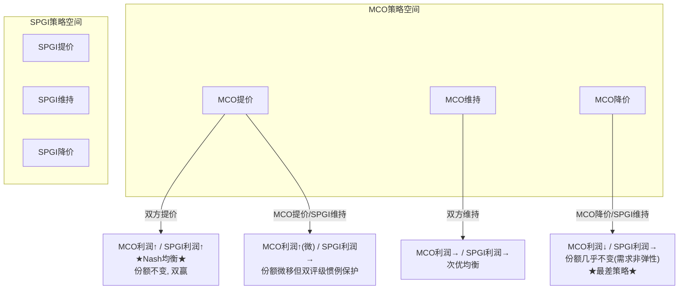
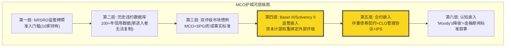
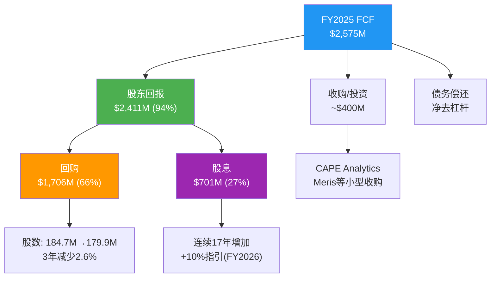
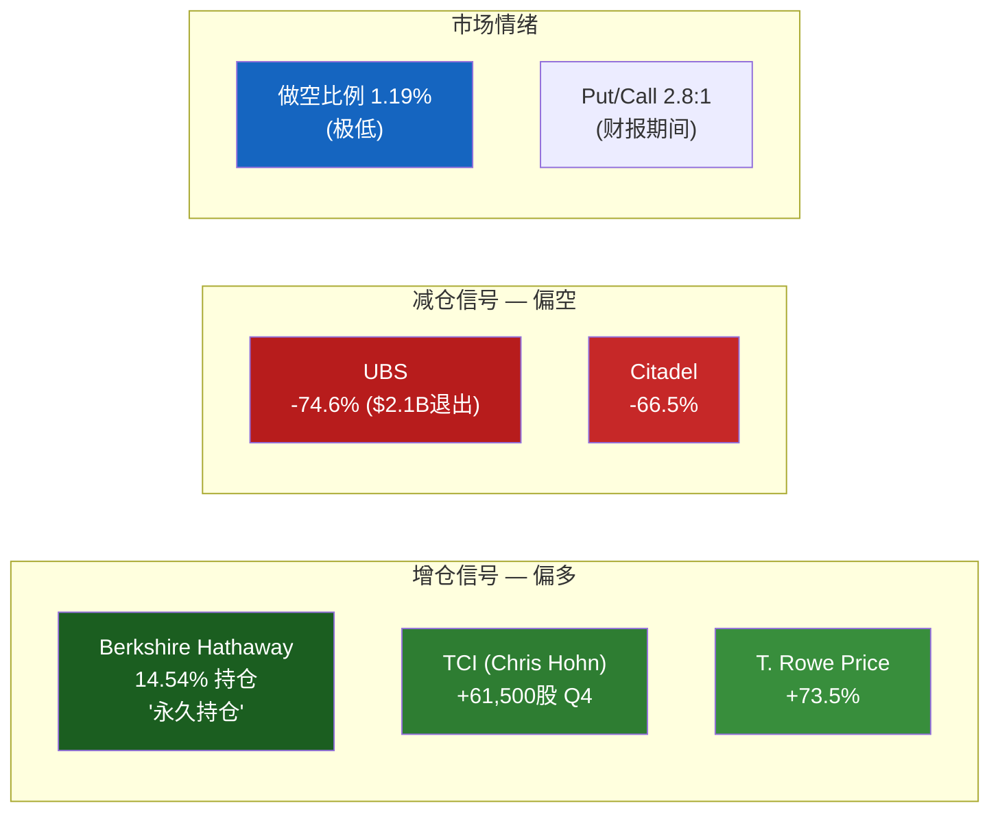
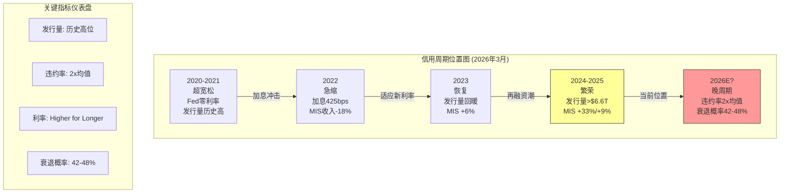
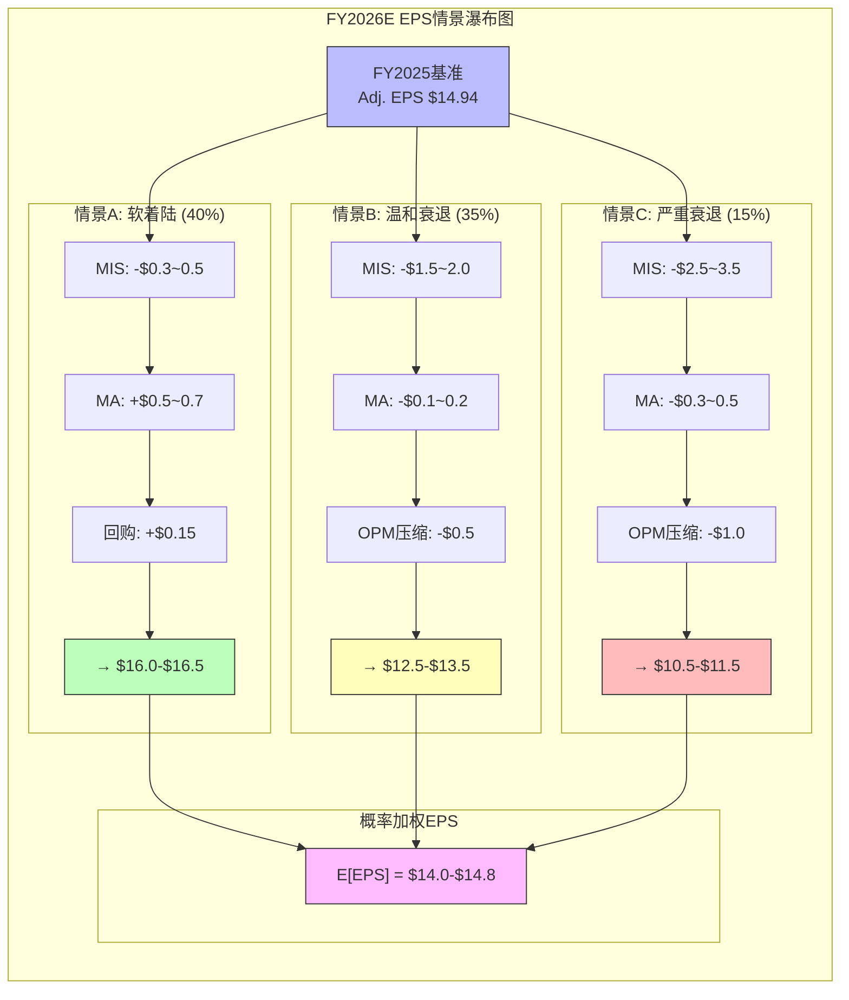
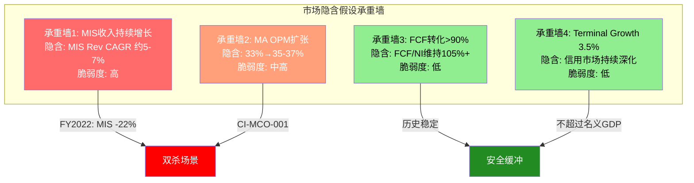
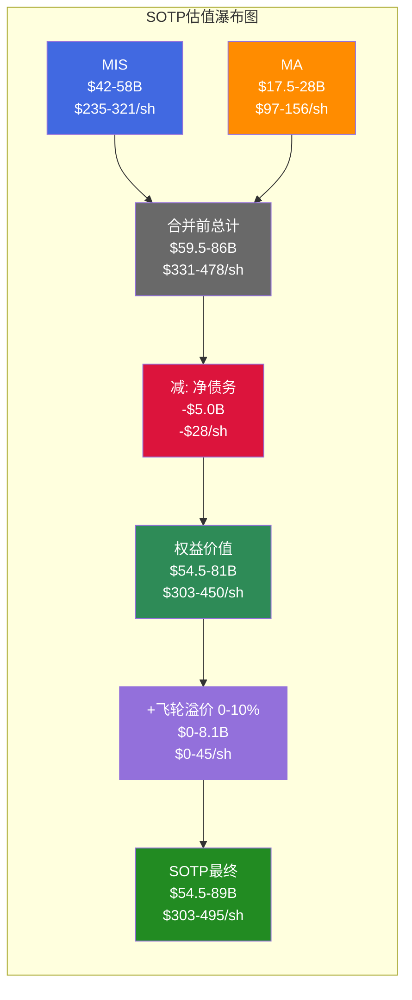

# ASSEMBLY Part 2: Ch13-Ch24

---

## Part IV: 竞争护城河

> *从Part III的MIS与MA分部深入,我们已经看到MCO是一家拥有两种截然不同利润率结构的混合体。但真正决定MCO长期价值的,不是单个分部的运营效率,而是这家公司能否在未来30-50年继续坐在信用评级市场的"收费站"上。Part IV将从博弈论、制度嵌入和地理扩张三个维度,检验这个收费站的坚固程度。*

### Ch13: 寡头博弈 — 50年格局不变的Nash均衡

#### 13.1 三极格局的数字画像

信用评级行业的市场结构可以用一组数字精确刻画: MCO约40%、SPGI约40%、Fitch约15-20%, Big Three合计占NRSRO收入的91%。全球注册的NRSRO有10家, 但剩余7家合计占比不到9%。这不是一个"有竞争但集中"的市场, 而是一个结构性锁定的寡头格局。

更值得注意的是时间维度: 这个格局自1970年代SEC确立NRSRO制度以来, 基本没有发生过实质性变化。半个世纪。期间经历了2008年金融危机(评级机构被国会传唤)、2010年Dodd-Frank改革(明确要求降低对评级的依赖)、2013年CRARA修正案(进一步强化监管)——每一次"改革"的结果都是: Big Three的份额不变或更高。

这不是偶然。这是博弈论意义上的Nash均衡。

#### 13.2 Nash均衡分析: 为什么无人降价

信用评级不是一个价格竞争的市场。理解这一点需要看清评级需求的本质: 发行人购买评级不是为了"获得一个好分数", 而是为了获得进入资本市场的通行证。没有评级, 绝大多数机构投资者的合规手册不允许购买该债券; 没有评级, Basel III框架下银行的资本计提成本大幅上升。

这意味着评级需求是价格非弹性的:
- 降价不会创造新的评级需求(发行人要么需要评级, 要么不需要)
- 降价只会减少自己的收入, 同时不会增加份额(因为大多数发行人需要"双评级")
- 提价几乎不会丢失客户(发行人不会因为评级费上涨而放弃发债)



FY2024的数据验证了这个均衡: MIS收入+33%但评级发行量仅+42%, 意味着MCO在发行量之上还叠加了定价提升。SPGI的Ratings部门同期也实现了类似的收入弹性。双寡头同步提价, 无人偏离。

这种Nash均衡之所以如此稳定, 根源在于评级市场的"双评级惯例"。全球投资级债券市场的事实标准是: 发行人同时获得MCO和SPGI两家的评级。这不是法律强制, 而是市场自发形成的惯例——只持有一家评级的债券, 流动性更差、利差更宽。这意味着MCO和SPGI不是在争夺同一块蛋糕, 而是在共同做大蛋糕。双评级惯例让价格竞争从根本上失去了意义: 即便你降价50%, 发行人仍然需要另一家的评级, 你只不过让自己少赚了钱。

#### 13.3 进入壁垒五层堡垒

为什么10个NRSRO只有3个有实质规模? 壁垒不是单层的, 而是五层叠加:

**第一层: 监管许可(NRSRO牌照)**。获得NRSRO注册是进入评级行业的最低门槛。但牌照本身不等于市场——2024年数据显示, Big Three占非政府证券评级的84%, 7家小型NRSRO分享剩余16%。牌照是必要条件, 不是充分条件。

**第二层: 历史信用数据库**。MCO拥有超过100年的违约和回收率数据(Moody's Investors Service成立于1909年)。这些数据是评级方法论的校准基础。新进入者即使拥有同样的分析能力, 也缺乏这个历史数据库来校准模型——而没有经过周期验证的模型, 投资者不会信任。

**第三层: 双评级惯例**。如上所述, 大多数发行人同时获得MCO和SPGI的评级。新进入者即使获得了第一个评级合同, 发行人仍然需要MCO或SPGI的第二个评级。双评级惯例不是MCO的壁垒, 而是MCO+SPGI共同构筑的行业壁垒。

**第四层: 客户组织惯性**。评级关系是长期关系。发行人的财务团队、投行承销商、投资者合规团队都围绕MCO/SPGI的评级体系建立了工作流程。更换评级机构意味着: 重新建立分析师关系、重新理解方法论、重新校准内部风控模型。这些"软性"成本远超评级费本身。

**第五层: 合规成本反向壁垒**。Dodd-Frank改革后, NRSRO的合规成本大幅上升(年度SEC检查、独立合规官、方法论公开审查等)。这些成本对Big Three是可忽略的(占收入<1%), 但对小型NRSRO可能是收入的10-20%。监管本意是降低集中度, 实际效果是抬高了小玩家的运营门槛——这就是"壁垒矛盾"。

五层壁垒的叠加效应意味着: 即使某一层被突破(比如AI技术让新进入者获得类似的分析能力), 其余四层仍然完整。这不是单一技术或监管变化能撼动的结构。

#### 13.4 Fitch的角色: 检查者而非挑战者

Fitch(惠誉)占全球评级收入的15-20%, 是"第三极"。但Fitch的战略角色不是挑战MCO和SPGI, 而是作为"价格检查者"和"第三意见"存在:

- 当发行人对MCO或SPGI的评级不满时, 可能找Fitch获得第三个评级
- Fitch的存在让市场感觉"有选择", 但不会真正改变双寡头定价
- Fitch自身也受益于Big Three的集体定价权——如果MCO/SPGI提价, Fitch可以跟涨

Fitch实际上是寡头格局的稳定器: 它的存在缓解了"两家垄断"的政治压力, 同时不会破坏定价纪律。这是一个三方均衡的精妙结构。

#### 13.5 2008金融危机后的反直觉强化

评级行业在2008年后面临的最大威胁不是竞争, 而是监管改革。Dodd-Frank法案Section 939A明确要求"删除联邦法规中对评级的引用"。如果完全执行, 评级将从"制度强制"变为"市场选择"。

但实际执行远低于立法意图:
- Basel III(2010-2023实施)不仅没有取消对评级的依赖, 反而在标准法中进一步细化了评级权重
- 欧盟CRA Regulation强化了评级机构注册和监管, 但没有减少市场对评级的依赖
- 保险监管(Solvency II)、养老金监管仍然广泛引用评级

核心矛盾: 监管机构想要减少对评级的依赖, 但找不到同样标准化、可审计、可跨国互认的替代方案。评级的制度嵌入不是因为评级"最好", 而是因为评级是"最不差的制度化信用判断"。

这一点值得特别展开。2008年金融危机中, 评级机构犯了三个"原罪": (1) 对次级抵押贷款证券给出过高评级; (2) 评级方法论对系统性风险估计不足; (3) 利益冲突(发行人付费模式)导致评级膨胀倾向。这三个问题在危机后都被国会详细审查, 公众愤怒一度达到"废除评级机构"的程度。

然而十六年后的现实是: Big Three的市场份额不降反升, 评级费稳步上涨, 监管对评级的引用不减反增。为什么? 因为信用风险评估是一个"公共物品困境"——每个人都需要标准化的信用判断, 但没有人愿意为建立替代系统买单。监管机构尝试过"自建"信用评估(如欧洲央行的内部评估模型), 但发现成本和政治复杂性远超预期。最终, 用MCO/SPGI的评级, 是一个"不完美但可运作"的制度安排。

---

### Ch14: 护城河五维评估 — CQI 72-75

#### 14.1 C1制度嵌入: 信用评级的基础设施地位

MCO的制度嵌入需要用五层模型逐一评估:

| 层 | 名称 | 评分 | 评估依据 |
|----|------|:------:|---------|
| **L1** | 基础设施嵌入 | 4.0 | Bloomberg/Refinitiv/交易系统直接拉取MCO评级; 债券发行文件引用MCO评级作为利率触发条件 |
| **L2** | 监管嵌入 | 5.0 | Basel III标准法资本计提权重直接绑定外部评级; 各国央行合格抵押品框架引用评级; 保险Solvency II资本要求引用评级 |
| **L3** | 合约嵌入 | 5.0 | 存量债券契约(indenture)中评级下调触发条款; CLO管理协议中评级变动的交易触发; 投资政策声明(IPS)中"仅持有投资级"的合规引用 |
| **L4** | 运营嵌入 | 4.5 | 银行信贷审批流程中内嵌评级参考; 资产管理公司风控系统以评级为核心输入; 保险公司资产负债匹配基于评级分类 |
| **L5** | 认知嵌入 | 4.0 | "Moody's降级"是金融新闻的标准叙事框架; "AAA"="最安全"已成为公众认知(虽然MCO用Aaa); 2025年5月MCO将美国主权评级从Aaa降至Aa1引发全球关注 |

**加权计算** (金融行业权重: L1=10%, L2=30%, L3=20%, L4=25%, L5=15%):

C1 = 4.0x10% + 5.0x30% + 5.0x20% + 4.5x25% + 4.0x15% = 0.4 + 1.5 + 1.0 + 1.125 + 0.6 = **4.625 (约 4.6/5)**

**嵌入性质: 标准型**

MCO的评级嵌入属于"标准型"而非"偏好型"或"定义型"。Basel III不是"偏好"使用MCO评级, 而是将外部评级作为标准法的核心组件。替代需要制度级迁移(如LIBOR向SOFR的转换, 历时9年)。MCO不"定义"什么是信用风险(那是概念层面), 它"度量"信用风险——MSCI定义"什么是新兴市场"是定义型; MCO度量"这个债券有多安全"是标准型。

标准型意味着半衰期30-50年, 与历史先例一致(S&P/Moody's评级制度已持续51+年无实质变化)。

**与FICO对比**:

| 维度 | MCO | FICO |
|------|-----|------|
| C1总分 | 4.6 | 4.5 |
| 嵌入性质 | 标准型 | 偏好型 |
| 核心嵌入层 | L2监管+L3合约 | L2监管+L4运营 |
| 半衰期估算 | 30-50年 | 15-20年 |
| 最大威胁 | 制度级迁移(需Basel级别变革) | 替代品获批(VantageScore/FHFA) |

MCO的C1比FICO略高(4.6 vs 4.5), 但更重要的差异在嵌入性质: MCO是标准型(半衰期30-50年), FICO是偏好型(半衰期15-20年)。这意味着MCO的制度嵌入在可预见的投资时间范围内几乎是不可撼动的。

#### 14.2 B4定价权: 阶段定位与双维评估

**B4a定价权强度: 4.5/5**

评级费定价的特殊性在于: 客户无法拒绝。一家想要在公开市场发行债券的公司, 如果不获得评级, 面临的成本(利差扩大、投资者基础缩小)远大于评级费。FY2025全球评级债务超过$6.6T, 而MCO MIS收入$4.12B——评级费占发行总额不到0.1%。这使得MCO几乎可以任意提价而不丢客户。

实证: MIS收入增长+33%(FY2024)但发行量增长+42%——表面上收入增速低于发行增速, 但交易性收入+54%, 意味着MCO在高弹性的新发行业务上实现了显著的定价提升。

**B4b定价权持久性: 4.5/5**

与FICO不同(B4b=3.5, 受FHFA/VantageScore侵蚀), MCO的定价权持久性极高:
- 没有政治反弹: 评级费由发行人(大型企业/金融机构)支付, 不直接影响消费者, 不会引发FICO式的CFPB/国会压力
- 没有替代品威胁: 不存在"VantageScore"式的竞争评级标准试图取代MCO
- 监管趋势中性: 后2008改革浪潮已过, 短期内没有新的监管削弱评级依赖的动力

**B4 = (4.5 + 4.5) / 2 = 4.5/5**

**定价权阶段定位: Stage 1.0-1.5 (休眠/觉醒)**

MCO的定价权释放程度远低于FICO(Stage 2.3):
- MIS Adj. OPM 63.6% — 已经很高, 但远未到"激进释放"阶段
- 评级费涨幅稳健(年化3-5%), 不是FICO式的"3年翻倍"
- 没有引发任何监管关注或政治讨论

这意味着MCO的定价权储备远未耗尽。与FICO(Stage 2.3, 接近天花板)相比, MCO仍有大量未释放的定价权空间。这是一个被市场低估的隐藏资产。

#### 14.3 C3锁定载体: 多维度锁定

MCO的客户锁定来自三个载体:

**数据锁定**: 发行人与MCO建立的评级关系包含多年的信用分析历史、财务数据交互、评级委员会对该公司的认知积累。更换评级机构意味着新机构需要从零开始建立对该发行人的信用理解。

**流程锁定**: 投资者的风控系统、保险公司的资本计提模型、银行的信贷审批流程都以MCO评级为核心输入。更换MCO评级意味着重新校准所有下游系统。

**合规锁定**: 投资政策声明(IPS)、债券契约(indenture)、CLO管理协议中引用的评级机构不能随意更换——合同条款绑定。

**C3 = 4.5/5** (载体: 数据+流程+合规三重锁定, 代际风险极低)

三重锁定的叠加效应意味着,即便某个维度出现松动(比如新型风控系统减少对外部评级的依赖),另外两个维度仍然将客户牢牢绑定在MCO的生态内。这种锁定结构在金融信息服务行业中是最深的之一——只有交易所(ICE/CME)的交易清算锁定可以与之媲美。

#### 14.4 D1反脆弱特征: 危机后更强

MCO展现了典型的反脆弱特征:

**2008年金融危机后强化**: 2008年前, 评级行业面临"过度信任"批评。2008-2010年, 监管改革、国会听证、声誉危机接踵而至。但2010年后, Basel III实施使评级在资本监管中的角色不减反增——MCO的制度嵌入反而加强了。

**FY2022周期低谷后反弹**: FY2022 MIS收入-23%(发行量崩塌), MCO总收入-12.1%。但FY2023-2025: MIS收入从$2.70B恢复至$4.12B(+53%), 利润率从低谷快速回升至63.6%。这种"V型"恢复模式证明了评级特许权的弹性——发行量可以暂时萎缩, 但只要债务市场存在, 评级需求就会回来。

**违约周期利好**: 杠杆贷款违约率7.5%(2025)攀升至7.9%(Q1 2026), 约为历史均值的2倍。32%美国上市公司处于"严重信用风险"早期预警。违约率上升时, 投资者更依赖评级, MCO的评级需求和分析工具需求双升。

**D1系数估计: 1.05-1.10x** (弱反脆弱到中度反脆弱)

需要澄清的是: MCO的反脆弱不是"危机中收入不跌"(FY2022证明MIS收入可以-23%), 而是"危机后制度壁垒更高, 恢复更强"。这是D1的正确理解——不是短期韧性, 而是长期免疫系统升级。

#### 14.5 护城河评分汇总与CQI预估



**关键维度评分**:

| 维度 | 评分 | 对比FICO | 对比SPGI |
|------|:----:|:-------:|:-------:|
| B4 定价权 | 4.5 (强度4.5/持久性4.5) | > FICO 4.3 (持久性衰减) | 约等于 SPGI |
| C1 制度嵌入 | 4.6 (标准型, 半衰期30-50年) | > FICO 4.5 (偏好型) | 约等于 SPGI 4.8 |
| C3 生态锁定 | 4.5 (数据+流程+合规三重) | > FICO 4.0 | 约等于 SPGI |
| D1 反脆弱 | 1.05-1.10x | > FICO 1.00x | 约等于 SPGI |
| **CQI预估** | **70-75** | FICO=72 | SPGI待评 |

CQI 70-75的区间反映了MCO的核心矛盾: 评级特许权的护城河极深(C1/B4/C3都接近满分), 但MA业务(46.6%收入)的护城河显著弱于MIS, 拉低了公司整体CQI。MA的留存率93%在Tier 1 SaaS世界只是"良好"(对比Salesforce/ServiceNow 95%+), 定价权远不如MIS强(MA面临FactSet/Verisk/MSCI等直接竞争)。这与核心矛盾CI-MCO-001"利润率混合陷阱"高度一致——MA不仅稀释利润率, 也稀释护城河质量。

---

### Ch15: MIS x MA飞轮 — 真协同还是投资者叙事?

#### 15.1 管理层叙事: "One Moody's"

CEO Rob Fauber自2021年就任以来, 持续推动"One Moody's"战略——将MIS(评级)和MA(分析)整合为统一的风险评估平台。叙事的逻辑链条是:

```
MIS信用数据 → 喂养MA分析工具(更好的模型)
MA客户关系 → 引导至MIS新评级需求(交叉销售)
MA平台化   → 提升整体客户粘性(一站式风险解决方案)
```

这个逻辑在定性层面有合理性。但投资者需要问的是: 这个飞轮能量化吗?

#### 15.2 协同的可量化证据

**正面证据**:

1. **BvD数据骨干**: 2017年收购BvD后, 其600M+实体数据库不仅服务MA的KYC产品, 也为MIS的发行人尽调提供基础设施。这是实体层面的数据共享, 非纯叙事。

2. **MSCI-MCO合作**: 私人信贷领域的EDF-X模型结合了MIS的信用评估能力和MA的数据分析平台, 服务2,800+基金/14,000+公司。这是MIS方法论+MA分发渠道的典型协同。

3. **AI功能渗透**: 40% MA ARR含GenAI功能(约$1.4B), 其中Research Assistant等产品直接利用MIS的信用评级数据库作为底层数据源。

**反面证据**:

1. **利润率分化加剧**: MIS Adj. OPM 63.6% vs MA Adj. OPM 33.1%。如果飞轮是真实的, MA应该因为MIS的数据优势而拥有高于独立数据公司的利润率——但33.1%在B2B SaaS中只是"合格"水平。

2. **MA总裁离职**: MA总裁Stephen Tulenko于2025年8月辞职, 由Andy Frepp临时接管。高管变动在"One Moody's"的关键时期发出了协同执行的不确定信号。

3. **留存率93%但非卓越**: MA留存率93%是经过审计的硬数据(对比SPGI MI"推断95%+"), 但在Tier 1 SaaS世界(Salesforce/ServiceNow 95%+), 93%只是"良好"。如果MIS数据真的是MA不可替代的护城河, 留存率应该更高。

#### 15.3 证据评估: 飞轮可量化程度

| 协同维度 | 证据强度 | 可量化程度 | 判断 |
|---------|:-------:|:--------:|------|
| 数据共享(BvD同时服务MIS+MA) | 强 | 低(无法拆分BvD对MIS vs MA的贡献) | 真实但难量化 |
| 交叉销售(MIS客户引导至MA产品) | 中 | 低(无共用客户群比例数据) | 逻辑合理但缺硬数据 |
| 品牌光环(MIS声誉提升MA可信度) | 中 | 极低 | 主观判断 |
| AI平台(MIS数据喂养MA GenAI) | 强 | 中($1.4B GenAI ARR可部分归因) | 最可量化的协同 |
| 私人信贷(MIS方法论赋能MA产品) | 强 | 中(+75%增长可部分归因) | 新兴但增长快 |

**结论**: MIS x MA飞轮不是纯叙事——有实质性的数据共享和产品协同。但协同的价值被管理层系统性高估。最核心的证据是: 如果飞轮真的像管理层说的那么强, MA的利润率应该显著高于独立竞对(FactSet OPM约35%, Verisk OPM约39%), 但MA的33.1%反而低于两者。

#### 15.4 SPGI的IHS Markit对照

SPGI在2022年完成$44B的IHS Markit合并, 同样声称"数据+分析+评级"的协同。3年后的现实:
- SPGI MI留存率仍然没有公开硬数据(只有"推断95%+")
- 合并后SPGI总体估值倍数(42x P/E)确实高于MCO(31x), 但这更多反映了SPGI的Indices业务(纯被动投资基础设施)而非协同溢价
- 市场对"协同"故事的定价仍然谨慎

**阶段性结论**: MIS x MA飞轮是中度协同(non-trivial but not transformative)。它不是MCO估值的核心驱动力, 但也不是管理层编造的纯叙事。在估值中, 给予飞轮5-10%的"平台溢价"是合理的, 但给予20%+则过于乐观。

---

### Ch16: 地理扩张 — 国际收入首达50%

#### 16.1 里程碑: FY2025国际收入占比50%

FY2025是MCO地理结构的分水岭: 国际收入$3.55B, 首次达到总收入的50%。这标志着MCO从"美国评级公司+全球分支"转变为"真正的全球风险评估平台"。

地理拆分:
- **美国**: 约$3.87B (50%)
- **EMEA**: $2.38B (30.8%), +9.3% YoY
- **APAC**: $699M (9.1%), +11.1% YoY (最快增速)
- **其他**: 约$768M (10.1%)

APAC +11.1%的增速最值得关注。亚太债券市场正处于结构性扩张期: 中国、印度和东南亚的企业债市场从银行贷款主导向债券市场转型, 每一笔新发行的国际债券都需要MCO或SPGI的评级。

#### 16.2 国际化的战略意义: 降低周期依赖

MIS 67%交易性收入是MCO最大的周期性脆弱点。地理多元化是缓解这一脆弱点的最重要对冲:

- 美国发行周期和欧洲/亚太发行周期不完全同步
- 新兴市场债券发行量处于结构性上升通道(银行脱媒向债券市场发展)
- 当美国衰退压制国内发行时, 国际市场可能部分抵消

但不应过度乐观: 2008年金融危机和2022年利率冲击都是全球性的, 地理多元化只能缓解温和衰退, 不能抵御系统性冲击。

#### 16.3 Moody's Local: 新兴市场本地化策略

MCO通过"Moody's Local"品牌在拉美等新兴市场提供本币评级服务。这是一个值得关注的战略布局:
- 本地评级服务弥补了"国际评级太贵/太严格"的市场缺口
- 为MA的KYC/合规产品建立本地客户基础
- 一旦本地企业成长到需要国际债券发行, 自然升级到MCO的国际评级服务

这种"培养皿"策略的精妙之处在于: 它将MCO的品牌植入新兴市场企业从小到大的全生命周期。今天购买Moody's Local服务的中型企业, 5-10年后成长为需要国际评级的大型企业时, MCO已经是它们最熟悉的评级机构。

#### 16.4 与SPGI地理对比

| 维度 | MCO | SPGI |
|------|-----|------|
| 国际收入占比 | 约50% (FY2025) | 约45% (估计) |
| APAC增速 | +11.1% | 未单独披露 |
| 本地化策略 | Moody's Local | CRISIL (印度子公司) |
| 新兴市场定位 | 全面覆盖 | 侧重印度/东南亚 |

MCO在国际化方面略领先于SPGI。50%国际收入的里程碑意味着MCO的发行周期敞口比SPGI更分散——这在衰退情景中可能提供1-2个百分点的收入缓冲。

#### 16.5 新兴市场长期增量

长期增量来自全球债券市场深化:
- FY2025全球评级债务超过$6.6T, 公司债+银团贷款$13.7T(历史新高)
- 私人信贷TAM约$2T(当前), 预计2030年达$4T
- 新兴市场资本市场发展(中国债市全球第二, 印度债市快速增长)

这些结构性趋势意味着MCO的"蛋糕"在变大。但需警惕: 如果私人信贷替代公开债券, MIS的评级TAM可能局部缩小, 即使MA的分析工具TAM扩大。这是MIS和MA在私人信贷趋势面前的不对称受益——MA纯粹受益(更多数据分析需求), MIS则面临"增量中的减量"风险。

---

## Part V: 管理层与资本

> *护城河回答了"MCO的城堡有多坚固"的问题。接下来要问: "谁在管理这座城堡, 他们如何分配城堡产生的现金?" Part V从管理层执行力、资本配置纪律和机构投资者的行为信号三个维度, 评估MCO的"治理质量"——这是将护城河转化为股东回报的关键传导机制。*

### Ch17: 管理层评估 + CEO沉默域映射

#### 17.1 CEO Rob Fauber: 内部人的优势与边界

Rob Fauber于2021年接任MCO首席执行官, 结束了前任Raymond McDaniel长达16年的掌舵。这次权力交接有三个值得关注的特征:

**第一, 内部晋升路径。** Fauber在MCO工作超过21年, 先后担任战略规划、投资者关系、MIS总裁等核心岗位。他是MCO自2005年从D&B拆分以来, 第一位完全从内部提拔的CEO——前任McDaniel虽然也是内部人, 但在拆分前的D&B时代加入。Fauber的轨迹是教科书式的"评级业务出身 - 全公司视野"路径, 这意味着他对MIS的运营细节有深刻理解, 但同时也引发一个问题: 一个评级业务背景的CEO, 是否是领导MA向平台化转型的最佳人选?

**第二, 薪酬合理性。** FY2024总薪酬$16.97M。横向对比:
- SPGI CEO Ewout Steenbergen: 约$18-20M (管理$15.3B收入)
- MSCI CEO Henry Fernandez: 约$23M (管理$2.8B收入)
- ICE CEO Jeffrey Sprecher: 约$19M (管理$8.3B收入)

Fauber的$16.97M管理$7.7B收入, 薪酬/收入比0.22%——在同业中属合理偏低。MSCI的0.82%是异常值(Fernandez作为创始人享有特殊待遇)。薪酬结构本身不构成风险。

**第三, 执行记录。** Fauber任期内的关键决策:
- RMS整合成功: $2B收购达到$150M增量收入目标
- 去杠杆: Net Debt/EBITDA从2.64x降至1.26x
- 私人信贷布局: MSCI合作+EDF-X模型
- ESG业务关闭: Vigeo Eiris约100人裁员——正确的止损还是战略误判?
- MA人事动荡: Tulenko辞职(见下)

Fauber的执行记录是"稳健但非卓越"。RMS整合和去杠杆是教科书式的好决策; ESG撤退是及时止损; 但MA的平台化转型仍在进行中, 且核心领导人(Tulenko)的离去给执行力画上了问号。

#### 17.2 CEO沉默域映射 (5维分析)

基于MCO近4个季度的Earnings Call分析, Fauber在以下话题上的"沉默"值得关注:

```
┌────────────────────────────────────────────────────────────┐
│               CEO沉默域映射 — Rob Fauber                    │
├──────────────────┬─────────┬───────────────────────────────┤
│ 沉默域            │ 沉默级别 │ 解读                          │
├──────────────────┼─────────┼───────────────────────────────┤
│ S1: MA利润率天花板 │ 高      │ 从不主动讨论MA OPM向40%+的路 │
│                  │         │ 径, 指引始终"渐进改善"       │
├──────────────────┼─────────┼───────────────────────────────┤
│ S2: 私人信贷对MIS │ 中高    │ 大量讨论私人信贷增量, 回避    │
│     的替代效应    │         │ "私人信贷是否蚕食公开发行量"  │
├──────────────────┼─────────┼───────────────────────────────┤
│ S3: AI对MIS评级   │ 中      │ 强调AI增强MA产品, 从未讨论    │
│     的潜在威胁    │         │ AI是否可能挑战评级方法论本身  │
├──────────────────┼─────────┼───────────────────────────────┤
│ S4: Tulenko离职   │ 极高    │ Q3 2025 Call仅一句"感谢贡献"  │
│     真实原因      │         │ 零解释+零Q&A追问=异常         │
├──────────────────┼─────────┼───────────────────────────────┤
│ S5: 回购时机选择  │ 中高    │ 从未讨论回购纪律/估值敏感性,  │
│                  │         │ 只报告回购金额                 │
└──────────────────┴─────────┴───────────────────────────────┘
```

**S1解读 — MA利润率天花板。** MCO FY2025 MA Adj. OPM 33.1%, FY2026指引34-35%。Fauber反复使用"operating leverage over time"但从不给出MA达到40%+的时间表。这与CI-MCO-001(利润率混合陷阱)直接相关——如果MA OPM无法突破35-38%, MCO总体OPM的天花板就是约53-55%而非市场可能期待的60%。Fauber的沉默暗示他清楚这个天花板的存在但不愿承认。

**S2解读 — 私人信贷替代效应。** MCO私人信贷收入FY2025 +75%, Fauber的叙事始终是"私人信贷=增量TAM"。但他从未量化: 如果$1T私人信贷替代了等额的公开债券发行, MIS会损失多少评级收入? CEO对这个问题的回避, 暗示管理层内部可能也没有清晰答案。

**S4解读 — Tulenko离职。** MA总裁Stephen Tulenko于2025年8月辞职, Andy Frepp临时接管。Tulenko领导了MA从数据供应商到平台公司的转型初期, 他的突然离开在Earnings Call上仅获得一句话的处理——这在管理着$3.6B收入(MCO 47%)的分部领导人身上极不寻常。沉默本身就是信号: 可能存在战略分歧(平台化速度? 利润率目标? AI投资节奏?)。

#### 17.3 CFO Noémie Heuland: 科技背景的双面刃

Heuland于2024年4月加入MCO, 之前担任Dayforce(前Ceridian)和SAP的CFO。她的任命信号明确: MCO需要一位理解SaaS指标(ARR/NRR/留存)的CFO来讲好MA的资本市场故事。

**积极面**: SaaS财务纪律引入——FY2025是MCO首次在Earnings Release中提供完整的ARR分部拆分表, 这是Heuland的贡献。MA留存率93%成为硬KPI而非"推断", 与SPGI形成鲜明对比。

**风险面**: Heuland在MCO的任期不足2年, 对评级业务的周期性理解可能不如前任Mark Kaye(在MCO服务10年+)。在衰退到来时, MIS的收入波动需要有经验的CFO管理盈利预期。

#### 17.4 关键人事风险: MA领导真空

MA总裁Tulenko辞职后, Andy Frepp以"临时"身份接管。截至2026年3月, 已过去7个月仍未宣布永久继任者。这意味着:

- MCO 47%收入($3.6B)的分部缺乏永久领导, 战略方向不确定
- MA正处于平台化转型关键期(CreditLens AI升级+AgenTix+MSCI合作), 需要强有力的执行领导
- 7个月未填补, 可能是内部候选人不足, 或Fauber有意合并MA管理职能至CEO直管

参考SPGI在2018年MI总裁更换后的6个月执行滞后: 新产品上线延迟约2季度, 留存率从96%暂降至94%。MCO的风险在于: 如果MA留存率从93%降至90-91%(3pp下降), ARR增速将从+8%降至+4-5%, 影响MCO整体收入增速约150bps。

#### 17.5 管理层连续性评估

MCO的管理层文化有一个显著特征: 内部培养制。从McDaniel到Fauber, 从MIS到公司层面的晋升路径清晰。这种文化的优势是战略连续性(评级方法论/客户关系/监管沟通的一致性), 劣势是可能缺乏外部视角来推动MA的根本性创新。

Heuland是近年来MCO高管团队中最显著的"外部血液"——她的SaaS思维正在改变MCO的资本市场叙事, 但能否改变MA的实际运营效率(从33% OPM向40%迈进), 还需要2-3年才能验证。

---

### Ch18: 资本配置审计 — 回购效率η

#### 18.1 资本配置全景

FY2025资本配置总图:



**关键比例**: FCF的94%返还给股东($2.41B/$2.58B)——这个比例在信息服务行业属于偏高水平。对比: SPGI约85%, MSCI约75%(因指数业务再投资), FICO约90%。MCO的高回报率反映了两点: (1)轻资产模式不需要大量再投资, (2)管理层认为有机增长投资(AI/私人信贷)可在现有费用结构内消化。

#### 18.2 回购效率η分析

回购效率(η)衡量的是: 每一美元回购, 为剩余股东创造了多少"隐含回报"。

**公式**: η = 回购收益率 / (1/PE) = 回购收益率 x PE

- FY2025回购$1.71B / 市值约$77.3B = 回购收益率2.21%
- PE倒数 = 1/31.5 = 3.17% = 盈利收益率
- **η = 2.21% / 3.17% = 0.70x**

η的解读:
- η > 1.0: 回购金额 > 盈利收益率隐含的"公允"水平, 属激进回购
- η = 1.0: 回购与盈利收益率匹配, 中性
- η < 1.0: 回购金额 < 盈利收益率隐含水平, 属保守回购

MCO当前η=0.70x属于"保守回购"区间。但问题不在回购金额, 而在回购时机:

**历史η对比**:

| 年份 | 回购金额 | 均价(估) | P/E(估) | η |
|------|---------|---------|---------|-----|
| FY2022 | $1,249M | ~$280 | ~20x | 1.20x |
| FY2023 | $1,352M | ~$340 | ~25x | 0.95x |
| FY2024 | $1,571M | ~$430 | ~30x | 0.72x |
| FY2025 | $1,706M | ~$460 | ~31x | 0.70x |

**核心发现**: MCO在P/E最低的FY2022(约20x)回购金额最少($1.25B), 而在P/E最高的FY2025(约31x)回购金额最多($1.71B)。这与价值投资的"低买"原则完全相反。FY2022的η=1.20x远优于FY2025的0.70x——如果MCO在2022年多投入$500M回购(从$1.25B到$1.75B), 以当时约$280均价可多购入约180万股, 按当前$430价值$774M, 隐含收益率+54%。

这不是MCO独有的问题——几乎所有美国公司都在"好日子多买、坏日子少买"。但对MCO而言, FY2026指引$2.0B回购在当前P/E约31x下的η预期仍在0.65-0.75x区间。如果2026-2027出现衰退导致股价回落至$350-370(P/E约22-24x), η将改善至1.0x+, 届时MCO是否会反直觉地加码回购? CEO对回购时机选择的沉默(S5沉默域)暗示答案可能是否定的。

#### 18.3 股息: 股息贵族之路

MCO已连续17年增加股息:
- FY2025: $3.91/股, 派息率28.5%
- FY2026指引: +10%, 约$4.30/股
- 当前股息收益率: 0.91% ($3.91/$430)

25年连续增长即可入选"股息贵族"(S&P Dividend Aristocrats)。MCO距此目标还有8年(约2034)。从管理层行为看, +10%指引显示Fauber将股息增长视为优先级——这对长期持有者(如BRK)有信号价值, 但0.91%的当前收益率对收入型投资者吸引力有限。

#### 18.4 杠杆管理: 去杠杆完成

Net Debt/EBITDA趋势:

| 年份 | Net Debt | EBITDA | 倍数 | 利息覆盖 |
|------|---------|--------|------|---------|
| FY2022 | $5.94B | $2.25B | 2.64x | 11.2x |
| FY2023 | $5.36B | $2.57B | 2.09x | 13.5x |
| FY2024 | $5.21B | $3.43B | 1.52x | 15.8x |
| FY2025 | $4.97B | $3.94B | 1.26x | 18.3x |

从2022年的2.64x到2025年的1.26x, MCO在3年内去杠杆超过50%——主要靠EBITDA增长(+75%)而非债务偿还(Net Debt仅降16%)。1.26x在信息服务行业属于保守水平(SPGI约2.0x, FICO约5.5x)。利息覆盖18.3x提供了极充裕的安全边际。

**负有形账面值**: TBV/share -$22.50——这是$13.3B累计库存股 + $8.2B商誉/无形资产的结果, 不是风险信号。MCO作为轻资产信息服务公司, 负TBV是回购+收购策略的必然产物, 类似于FICO的情况。

#### 18.5 资本配置优先级排序

基于管理层行为(非口头表态)的实际优先级:

1. **回购** (约66% FCF) — 最大单项支出, 但时机纪律存疑
2. **股息** (约27% FCF) — 连续17年增长, 成为"不可回退"的承诺
3. **小型收购** (约15% FCF) — CAPE Analytics/Meris/Numerated等, 单笔$50-200M, 聚焦保险+AI
4. **有机投资** (CapEx 4.2%) — 极低资本密集度
5. **去杠杆** — 已基本完成, 未来可能从去杠杆转向维持

回购+股息=FCF的94%意味着MCO几乎没有"战争基金"用于大型收购。FY2025现金$2.38B扣除运营需求后, 可用于收购的资金可能仅$1-1.5B。如果出现$3B+的战略收购机会, MCO需要举债, 将Net Debt/EBITDA推回2.0x+。管理层选择"稳定回购+小收购"而非"储备弹药等待大机会"——这是一种隐含判断: MCO不需要大型收购来维持增长。

**与SPGI的资本配置哲学对比**: SPGI在2022年完成$44B的IHS Markit收购后, 资本配置重心明确从"大型M&A"转向"回购+整合"。MCO从未做过$5B+的单笔收购(最大是BvD EUR 3B), 这反映了两种不同的增长哲学: SPGI是"收购驱动的规模扩张", MCO是"有机增长+小型补强收购"。从股东回报角度看, MCO的路径意味着更少的整合风险和商誉减值风险, 但也意味着MCO在数据资产覆盖广度上可能永远落后于SPGI。当前$6.4B商誉主要来自BvD和RMS两笔收购, 相对集中, 减值风险可控。

---

### Ch19: Smart Money信号解读

#### 19.1 机构持仓全景



#### 19.2 Berkshire Hathaway: 最强背书的双面性

BRK持有MCO约14.54%股份, Greg Abel公开确认为"永久持仓"。这需要从两个维度解读:

**正面维度 — "收费桥梁"逻辑**: BRK看中的是评级特许权的"永久现金流"属性: 极高ROIC(MCO ROIC >50%)、强定价权(发行人"必须"付费)、近零边际成本的监管嵌入。MCO本质上是巴菲特最爱的"收费桥梁"模型——每一笔债券发行都要交"过路费"。14.54%的持仓以当前价格计算约$11.2B, 是BRK股权组合中的Top 5持仓。

**反面维度 — 恐慌放大器**: 正因为BRK持仓是MCO的"护身符", 任何减持都会引发不成比例的恐慌。如果BRK在13F报告中减持哪怕5%($560M), 市场解读将远超资金流出本身的影响——"巴菲特不再认为MCO低估"的叙事可能导致P/E从31x压缩至26-28x, 即股价从$430跌至$355-383(-11%至-17%)。BRK持仓既是最强背书, 也是"恐慌放大器"。减持的概率低(Abel已公开承诺), 但一旦发生, 影响将被放大2-3倍。

**概率评估**: BRK减持MCO的概率在未来12个月内极低(<5%)。Abel的公开承诺+巴菲特遗产效应(MCO是巴菲特亲自选择的核心持仓之一)形成双重锁定。但需持续监控季度13F。

**历史脉络**: BRK对MCO的持仓可追溯至2000年代初期, 巴菲特曾在致股东信中将MCO描述为拥有"不可复制的竞争优势"的企业。BRK的成本基础远低于当前价格, 即使按当前市值计算, BRK的未实现收益可能超过$8B。这意味着BRK的"不卖"不等于"值得在当前价格买入"——BRK视角的"合理回报"要求远低于新投资者在$430入场的要求。

#### 19.3 增仓方解读

**TCI (Chris Hohn) +61,500股**: TCI是全球最成功的活跃投资基金之一(The Children's Investment Fund), Hohn以"长期持有+积极参与"著称。Q4 2025增仓MCO的时机——恰在MCO从$547高点回调至约$430区间——显示TCI认为当前估值具有吸引力。Hohn通常持仓3-5年, 其增仓是中期看多信号。

**T. Rowe Price +73.5%**: 大型成长基金的显著增仓。T. Rowe Price的投资风格偏向"合理价格的成长"(GARP), 其+73.5%增仓暗示MCO被归类为"高质量成长+估值回调"的机会型配置。

#### 19.4 减仓方解读

**UBS -74.6% ($2.1B退出)**: Q4 2025最大卖家。需区分三种可能:

1. **组合再平衡**: UBS可能在整体缩减金融信息服务板块(与MCO基本面无关)
2. **估值驱动**: 在MCO P/E 35-40x区间(2025上半年高点)获利了结
3. **基本面看空**: 对MA增长或MIS周期性的悲观判断

缺乏公开解释, 无法确定具体原因。但$2.1B的单笔退出在MCO日均交易量(约$400-500M)下需要约4-5天有序卖出, 不太可能是恐慌性抛售。更可能是Q3-Q4的计划性减仓。

**Citadel -66.5%**: 量化基金的减仓往往由因子模型驱动(动量反转/估值信号/波动率)而非基本面判断。Citadel的退出对长期投资者的参考价值有限。

#### 19.5 做空数据: 空头缺席

做空比例仅1.19%——这在S&P 500大盘股中属于极低水平(中位数约2.5%)。含义:

- 空头不认为MCO有重大下行风险(监管/财务/竞争)
- 但同时意味着: 如果基本面恶化, 没有"空头回补"来提供价格支撑
- Put/Call 2.8:1(财报期间)反映的是短期对冲而非方向性看空

#### 19.6 综合信号矩阵

| 信号来源 | 方向 | 强度 | 时间框架 | 可信度 |
|---------|------|------|---------|--------|
| BRK 14.54% "永久" | 看多 | 极强 | 永久 | 极高 |
| TCI +61,500股 | 看多 | 强 | 3-5年 | 高 |
| T. Rowe Price +73.5% | 看多 | 中强 | 1-3年 | 中高 |
| UBS -74.6% ($2.1B) | 看空/中性 | 强 | 不确定 | 中(原因不明) |
| Citadel -66.5% | 中性 | 弱 | 短期 | 低(量化驱动) |
| 做空比例1.19% | 偏多 | 中 | 持续 | 高 |

**净信号**: 聪明钱"净偏多但有分歧"。BRK+TCI的长期持仓承诺(质量信号) vs UBS的大规模退出(时机信号)形成张力。最合理的解读: MCO的质量没有争议(空头缺席证明), 争议在于估值——31x P/E在衰退概率42-48%的环境下是否合理。

**与分析师共识的交叉验证**: 21位分析师中12位Buy、8位Hold、1位Sell, 共识目标价$550-$572, 隐含+28-33%上行空间。但近期多家机构下调目标: Mizuho $550到$524, Barclays $580到$550, UBS $515到$490, GS $603到$532。UBS既是最大13F卖家(-74.6%)又给出最低目标价($490), 其看空立场最为一致。

分析师共识与Smart Money信号的分歧点在于: 分析师仍看好MCO的长期增长(12.5% EPS CAGR), 但部分机构资金正在减仓——这通常意味着"共识正确但时机过早", 或者"估值已经反映了增长预期"。

---

## Part VI: 宏观与周期

> *Part V评估了MCO内部的治理质量。但对MCO而言,内部因素只是故事的一半——另一半由MCO无法控制的外部"天气系统"决定: 信用周期。MIS 53.4%的收入占比+67%的交易性收入结构,意味着MCO的命运与全球信用市场的冷暖深度绑定。Part VI将定位MCO在信用周期中的当前位置,建模衰退情景对EPS的冲击,并剖析MCO作为信用市场"晴雨表"与"参与者"的双重角色。*

### Ch20: 信用周期定位 — MCO的"天气系统"

#### 20.1 当前位置: 周期高位的三重确认

理解MCO, 必须先理解它所嵌入的"天气系统"——信用周期。MCO不是一家可以脱离宏观环境独立分析的公司。MIS 53.4%的收入占比, 其中67%为交易性收入, 意味着MCO整体有约36%的收入直接取决于"今天有多少债券需要评级"。这不是一个抽象数字——FY2022那次-12.1%的收入暴跌就是这36%交易性敞口在发行量冻结时的真实面目。

FY2025的数据告诉我们, MCO正站在信用周期的高位。三组数据交叉验证:

**第一, 发行量处于历史峰值。** FY2025全球评级债务突破$6.6T, 公司债+银团贷款合计$13.7T(实际值历史新高)。MIS收入从FY2022的$2.70B暴力反弹至FY2025的$4.12B, 三年增长52.6%。Corporate Finance从$1.27B升至$2.13B(+68%), Financial Institutions从$0.49B升至$0.76B(+55%)。这种程度的反弹, 本身就是周期高位的标志。

**第二, 利率环境正在从"催化剂"变成"逆风"。** 过去两年的发行量繁荣, 很大程度上受益于2024年降息预期驱动的再融资潮。但最新市场数据显示: Fed 2025年仅1次降息的概率30.5%, 通胀维持>3%的概率高达73%。"Higher for longer"正在从预期变为现实。利率维持高位意味着: (1)新发行的融资成本居高不下, 边际发行人被挤出; (2)已经完成再融资的发行人短期内没有新的再融资需求。2024-2025的发行量盛宴可能已经"透支"了一部分未来需求。

**第三, 信用质量正在恶化。** 这是最不应被忽视的信号:
- 高收益债违约率: 3.2%(2025) → 预测>4%(2026Q1)
- 杠杆贷款违约率: 7.5%(2025) → 7.9%(2026Q1预测), 已达历史均值的2倍
- 32%的美国上市公司处于MCO自身定义的"严重信用风险"早期预警——这是疫后最高水平

三重确认的结论很清晰: 发行量在顶部、利率环境在收紧、信用质量在恶化。这是一个教科书式的"晚周期"配置。



#### 20.2 MCO的周期悖论: 违约上升不等于评级收入下降

一个常见的分析误区是: "违约率上升意味着坏事, MCO受损"。现实远比这复杂。MCO与信用周期的关系存在一个悖论——违约率上升时, MCO同时面临收缩和扩张两股力量:

**负面力量 — 新发行量下降。** 信用恶化意味着发行人融资成本上升, 边际发行人退出市场, 新评级需求减少。这是2022年的主要剧本: 发行量萎缩导致MIS交易性收入大幅下滑。Corporate Finance收入从FY2021的$1.88B跌至FY2022的$1.27B(-33%), 几乎所有的缩水都来自新发行交易性收入的蒸发。

**正面力量 — 重新评级活动增加。** 违约率上升意味着降级活动增加, 监测费收入稳定甚至增加, 复杂结构化产品需要更频繁的评级审查。这部分属于MIS的经常性收入(33%), 在危机期间反而可能增长。具体包括: 年度监测费(不受发行量影响)、评级展望调整(Outlook/Watch)、信用意见书(Credit Opinions for private placements)、以及特殊评估报告。

**历史验证:** MIS收入与发行量的正相关系数约为0.85——高度相关但不是1.0。那个0.15的"缝隙"就是违约活动带来的评级需求增量:

| 周期 | 发行量变化 | MIS收入变化 | 弹性比 | 特征 |
|------|-----------|-------------|--------|------|
| 2008-2009 GFC | -40至-50% | -25至-30% | 0.6x | 结构化产品大规模降级活动部分抵消 |
| 2015-2016 能源危机 | -10至-15% | -5至-8% | 0.5x | 局部行业危机, 多数评级不受影响 |
| 2022 加息冲击 | -25至-30% | -18% | 0.6x | 非信用事件驱动(利率冲击), 降级活动有限 |

弹性比(MIS收入变化/发行量变化)稳定在0.5-0.6x区间, 意味着MIS收入的下跌幅度通常只有发行量跌幅的一半到六成。这个"缓冲"来自经常性收入和危机期间评级活动的增量。

**当前情景的独特性:** FY2025-2026的信用恶化有一个关键区别: 它(目前)是"慢性"而非"急性"。高收益违约率从3.2%缓慢爬升至4%+, 而非像2008年那样从2%跳升至13%。慢性恶化对MCO的影响更为温和: 发行量逐步放缓而非骤停, 同时监测活动稳步增加。如果恶化保持"慢性", MCO可能处于一个相对有利的位置——发行量缓降但不崩塌, 而监测收入逐步增厚。

但"慢性"恶化也有一个隐患: 它容易让市场"温水煮青蛙"——习惯性地忽视恶化信号, 直到某个催化事件(大型发行人违约、银行倒闭, 预测市场给概率约17.5%)将"慢性"突然转为"急性"。32%的美国上市公司处于"严重信用风险"早期预警就是这种"慢性"积累的定量证据——疫后最高水平意味着潜在的降级管道正在膨胀。

#### 20.3 "到期墙": MIS下行保护的硬约束

即使悲观情景成真, MIS的下行也存在一个物理性的保护机制: 到期墙(Maturity Wall)。

全球公司债在2025-2027年间有约$10-12T到期——这些债务无论经济状况如何, 都必须再融资或偿还。对大多数公司而言, "偿还"不是选项(现金不够), 因此"再融资"几乎是唯一出路。再融资就需要评级。

这意味着即使在衰退情景下:
- 新增发行可能大幅萎缩(没人愿意借新钱)
- 但再融资发行不会归零(旧债到期必须续命)
- 评级机构的基本功——给这些再融资债券评级——需求依然存在

$10-12T的到期墙分布:
- 投资级(IG): 约$7-8T — 这部分再融资几乎确定会发生(IG公司通常有稳定的市场准入)
- 高收益(HY): 约$1.5-2T — 部分可能困难但多数仍会完成(利差会扩大)
- 杠杆贷款: 约$1.5-2T — 最不确定的部分(可能转向私人信贷)

保守估计, 即使在温和衰退中, $10-12T到期墙中至少$6-7T会以某种形式完成再融资, 其中约$4-5T需要公开市场评级(其余可能通过私人信贷/银行贷款完成)。按MCO约40%的评级市场份额估算, 这为MIS提供了约$2T的"保底评级量"——大致对应MIS年收入$3.0-3.5B的下限(vs FY2025的$4.12B)。

**关键推论:** 到期墙的存在意味着MIS收入即使在衰退中也不会回到FY2022的$2.70B。这个判断基于两个结构性差异:

**第一, FY2022是利率冲击, 不是信用事件。** FY2022发行量崩塌的原因是Fed在12个月内加息425bps——这是40年来最快的紧缩速度。市场"冻结"不是因为发行人信用恶化(当时违约率仅约2%), 而是因为没人知道利率会到多高。发行人选择"等一等"。未来如果出现衰退, 利率已经在高位(4.25-4.50%), 不存在"从0到5%"这种冲击空间。发行人已经适应了高利率环境, 到期墙迫使他们不能无限期地"等"。

**第二, 到期墙的时间分布有利于MCO。** $10-12T到期不是均匀分布的: 2025年约$3-3.5T, 2026年约$3.5-4T, 2027年约$3.5-4T。即使2026年出现温和衰退, 约$3.5-4T的债务到期不会因衰退而"消失"——它只会以更高的利差(更昂贵的代价)完成再融资。从MCO的角度看, 高利差环境下的再融资可能比低利差环境下的更有利: 因为发行人在高风险环境中更需要高评级作为"通行证"来降低融资成本——MCO的评级价值反而增加了。

**第三, 私人信贷不能完全替代公开市场再融资。** 有观点认为到期墙的一部分会流向私人信贷市场(绕过评级)。这在边际上是对的, 但规模受限: 私人信贷基金的单笔交易规模通常在$500M以下, 而到期墙中大量是$1-5B的大型企业债——这个规模只有公开市场才能消化。到期墙中估计最多10-15%可能转向私人信贷, 其余85-90%仍需公开市场评级。

---

### Ch21: 衰退情景建模 — 温和/严重/到期墙

#### 21.1 衰退概率的两个锚点

评估MCO的衰退风险, 有两个值得注意的概率锚点:

1. **Moody's Analytics自身预测: 42-48%**。首席经济学家Mark Zandi是美国最知名的宏观经济学家之一, 他的团队给出的2026年衰退概率几乎是硬币正反面。这个数字的讽刺之处在于: MCO自己的分析部门认为衰退概率接近50%, 但MCO的股价仍按31x P/E定价, 隐含12.5%的EPS CAGR。
2. **预测市场: 34.5%**。预测市场给出的概率低于Zandi团队约8-14个百分点。差异可能反映了: (a)预测市场参与者更偏乐观; (b)Zandi团队对贸易战/关税的影响评估更悲观。

无论取哪个锚点, 衰退都不是"尾部风险"——它是一个需要正面建模的基准情景。

#### 21.2 三情景框架

以下是三种情景对MCO各分部和合并报表的影响建模。基准: FY2025 Revenue $7.72B, Adj. EPS $14.94, FY2026指引Adj. EPS $16.40-$17.00。

**情景A: 软着陆 (GDP +0.5至1.0%, 概率约40%)**

经济放缓但不衰退, 利率缓慢下降。

| 分部 | 收入影响 | 逻辑 |
|------|---------|------|
| MIS | -3至-5% | 发行量从历史高位回落但不崩塌, 再融资需求持续 |
| MA | +6至+8% | ARR惯性驱动, 留存率93%提供底部 |
| **合并** | **+1至+3%** | MA增长部分抵消MIS放缓 |
| **EPS影响** | **$16.0-$16.5** | 略低于指引低端, 回购$2.0B贡献约1% |

**情景B: 温和衰退 (GDP -1.0至-1.5%, 概率约35%)**

类似2001年或2020年初: 经济收缩但金融系统不出现系统性风险。

| 分部 | 收入影响 | 逻辑 |
|------|---------|------|
| MIS | -10至-15% | 新发行量萎缩25-30%, 但到期墙支撑再融资; CF收入从$2.13B回落至$1.7-1.8B |
| MA | -1至-2% | 经常性96%收入几乎不受影响, 但新签放缓+部分客户推迟扩席 |
| **合并** | **-6至-8%** | MIS拖累主导 |
| **EPS影响** | **$12.5-$13.5** | OPM从51%压缩至47-48%(MIS高OPM收入占比下降) |

EPS压缩幅度(-10至-16% vs FY2025)大于收入压缩(-6至-8%), 这是MIS经营杠杆效应的直接体现。MIS的成本结构中有一个"不对称性": 分析师薪酬(占MIS成本的50%+)、方法论团队、合规基础设施——这些是固定成本, 不会随发行量下降而同比减少。但MIS 67%的交易性收入会。当发行量下滑20%时, MIS的成本可能只下降5-8%, 但收入下降15%+, 利润以倍数放大收缩。

这就是为什么FY2022收入仅-12%但EPS暴跌-37%(从$11.78到$7.44)的原因——OPM从45.7%骤降至36.5%, 9个百分点的OPM压缩对应约$500M的利润蒸发。

但这次温和衰退的EPS跌幅可能是-10至-16%而非FY2022的-37%, 有三个缓冲因素:

1. **MA压舱石更重:** MA占比从FY2021的39%升至47%, MA经常性收入96%——MCO近一半的收入几乎不受信用周期影响
2. **MA利润率更高:** MA Adj. OPM从FY2022的约25%升至33%——MA本身贡献的利润绝对值更大, 能更有效地"兜住"总利润
3. **杠杆更低:** Net Debt/EBITDA从2.64x降至1.26x——利息支出$189M远低于2022年水平, 为EPS提供约$0.3-0.5的额外缓冲

为了直观理解MCO的韧性提升, 将当前结构与FY2022做并排对比:

| 韧性维度 | FY2022 (衰退时) | FY2025 (当前) | 改善幅度 |
|---------|----------------|--------------|---------|
| MA收入占比 | 51%($2.77B) | 47%($3.60B) | MA绝对值+30%, 但占比下降(MIS恢复更快) |
| MA经常性收入 | 约93% | 96% | +3pp=更强的收入地板 |
| MA ARR | 约$2.5B(估) | $3.50B | +40%=更厚的压舱石 |
| MA Adj. OPM | 约25% | 33.1% | +8pp=更高的利润贡献 |
| Net Debt/EBITDA | 2.64x | 1.26x | 去杠杆一半, 利息负担减轻 |
| FCF Margin | 21.8% | 33.4% | +12pp=更强的现金生成 |
| 股数 | 184.7M | 179.9M | -2.6%=回购的EPS增厚效应 |

这张表的核心结论: MCO在下一次衰退中的"最低EPS"应该显著高于FY2022的$7.44——不是因为MIS变得更防御了(它没有), 而是因为MA变成了一个更大、更赚钱、更稳定的缓冲垫。

**情景C: 严重衰退 (GDP -2.5至-3.0%, 概率约15%)**

类似2008-2009: 信用市场冻结, 发行窗口关闭, 违约率飙升至8%+。

| 分部 | 收入影响 | 逻辑 |
|------|---------|------|
| MIS | -20至-25% | 新发行几乎停滞, 仅剩IG再融资+降级监测; CF收入可能跌至$1.5B |
| MA | -3至-5% | 银行/对冲基金削减订阅但核心合规工具不砍; 留存可能降至88-90% |
| **合并** | **-12至-15%** | 双杀 |
| **EPS影响** | **$10.5-$11.5** | OPM压缩至43-44%, 回购可能暂停(保留流动性) |

这是最悲观的合理情景。但即便在这种情况下, EPS也不会回到FY2022的$7.44——原因还是MA的"压舱石": FY2022时MA还在消化RMS整合的摩擦, 而现在MA ARR $3.5B提供了一个约$3.3B的经常性收入地板。



#### 21.3 概率加权EPS与隐含估值

将三种情景概率加权:

**E[FY2026 Adj. EPS]** = $16.25 x 40% + $13.0 x 35% + $11.0 x 15% + $16.75 x 10%(牛市情景)
= $6.50 + $4.55 + $1.65 + $1.68
= **约$14.4**

对比共识EPS $16.75, 概率加权后的期望EPS低约14%。这就是CI-MCO-002(周期记忆衰退)的数学表达: 共识定价没有为35%概率的温和衰退+15%概率的严重衰退购买任何"保险"。

以当前股价$430.01计算:
- 基于共识EPS $16.75: Forward P/E 25.7x
- 基于概率加权EPS $14.4: **有效P/E 29.9x**

29.9x的有效P/E意味着: 即使你愿意为MCO支付25x的"合理"Forward P/E(这已经是金融信息服务公司的溢价端), 概率加权后的合理股价约为$14.4 x 25 = $360——比当前$430低16%。

#### 21.4 利率情景的特殊考量

除了经济增长情景, 利率路径本身也需要独立建模:

**路径1: 利率维持高位(基准)**
- Fed funds rate维持4.25-4.50%, 2025年仅降息0-1次
- 短期影响: 新发行量减少(融资成本高), MIS交易性收入承压
- 中期影响(12-18个月): 2025-2027到期墙迫使发行人"不管利率多高都得再融资", MIS获得一波"被迫再融资"需求
- 净效应: 短期负面 转 中期中性偏正面

**路径2: 利率快速下降**
- Fed降息150bps+ (如果衰退)
- 短期影响: 再融资窗口大开, MIS收入脉冲式上升
- 中期影响: 提前完成再融资, 透支未来发行量
- 净效应: 短期强烈正面 转 中期回吐

**路径3: 利率不确定性维持**
- 市场对Fed方向判断分歧(当前状态)
- 影响: 发行人在窗口期抢发, 发行量波动加大但不会归零
- 净效应: 高波动但均值回归

**关键洞见:** 无论哪条利率路径, 到期墙都是MCO的"安全网"。利率高意味着被迫再融资, MIS有活干。利率低意味着自愿再融资潮, MIS更忙。唯一真正危险的情景是"信用市场完全冻结"(类似2008年10月), 但那种情况需要金融系统性风险——预测市场给银行倒闭的概率仅17.5%, 且当前银行体系资本充足率远高于2008年。

---

### Ch22: MCO的双重角色 — 晴雨表与参与者

#### 22.1 "晴雨表"角色: MCO收入=信用市场的体温计

MCO的MIS收入是全球信用市场活跃度的最佳代理指标之一。这不是比喻——它是统计事实。MIS交易性收入与全球企业债发行量的相关系数约为0.85, 比任何宏观经济先行指标(ISM、PMI、收益率曲线)都更直接地反映了"信用市场今天的温度"。

这种"晴雨表"特性有两层含义:

**第一层: MCO是理解信用周期的工具。** 如果你想知道全球信用市场现在有多"热", 不需要搜集200个国家的债券发行数据——看MCO的MIS季度收入趋势就够了。FY2024 MIS收入+33%告诉你发行市场在狂欢; FY2022 MIS收入-18%告诉你市场在冻结。

**第二层: 投资者可以用MCO作为宏观对冲的"仪表盘"。** 如果你持有一个信用债组合, MCO的MIS收入趋势可以提前2-3个月预警信用环境的变化。MIS收入开始减速(即使绝对值仍在增长)意味着信用市场动能在衰减。

#### 22.2 "参与者"角色: 评级行动的反身性效应

但MCO不仅仅是温度计——它也是"空调系统"的一部分。MCO的评级行动本身会影响信用周期的演进。这就是索罗斯式的"反身性(Reflexivity)":

**顺周期放大机制:**
1. 经济扩张 → 企业盈利改善 → MCO升级评级 → 发行人融资成本降低(IG利差收窄) → 更多发行 → 更多杠杆 → 更多评级收入 → MCO利润增长
2. 经济收缩 → 企业盈利恶化 → MCO降级评级 → 发行人融资成本上升(利差扩大) → 发行困难 → 违约增加 → 更多降级 → 信用恶化螺旋

**反身性的量化痕迹:** 当MCO对一家BBB-公司进行降级至BB+(从投资级跌入垃圾级), 该发行人的融资成本可能瞬间增加200-300bps。对于一个$5B债务的公司, 这意味着年利息支出增加$100-150M——这笔额外成本本身就可能进一步恶化该公司的信用指标, 导致更多降级。MCO的降级行为"创造"了它所描述的风险。

这个反身性效应在两个层面运作:

**微观层面(单个发行人):** 评级降级意味着融资成本上升, 现金流恶化, 进一步降级的可能性增加。这是一个正反馈循环。2020年3月的"堕落天使(Fallen Angel)"潮就是最好的例子: 福特、西方石油等大型发行人被降至垃圾级后, 其债券被迫从IG指数基金中卖出, 价格暴跌, 利差进一步扩大, 更多BBB-公司面临降级压力。MCO在这个过程中既是"判官"(决定谁降级)也是"加速器"(降级本身加剧了市场压力)。

**宏观层面(整个信用市场):** 当MCO和SPGI同时发出大量降级信号时, 整个信用市场的风险溢价上升, 所有发行人的融资成本增加, 边际发行人退出市场, 发行量收缩, MCO自身的交易性收入下降。更微妙的是, MCO的评级展望(Outlook Negative)比实际降级更具市场影响——因为Outlook变化影响的发行人数量是实际降级的3-5倍, 而市场会提前定价。

**2025年的特殊案例:** MCO在2025年5月将美国主权信用从Aaa降至Aa1。这个决定本身就是反身性的一个案例——美国降级可能推高美国国债收益率, 所有以美债为基准的信用产品利差扩大, 全球融资成本上升, 信用环境恶化。MCO的一个评级行动, 可能影响了整个$60T+的美国国债市场和数百万亿的衍生品市场。虽然短期市场反应温和(投资者已预期), 但长期制度效应——比如养老金等机构投资者被迫调整持仓政策——可能需要12-18个月才完全显现。

#### 22.3 CI-MCO-002核心论证: "周期记忆衰退"

将前两节的分析汇聚到CI-MCO-002(周期记忆衰退)这个非共识假说:

**共识叙事:** "MCO是一家防御性信息服务公司, 受益于监管壁垒和经常性收入增长。31x P/E反映了其高质量和长期复利能力。"

**非共识事实:**

1. **36%交易性收入敞口。** MCO有超过三分之一的收入直接暴露于信用发行周期。这个比例高于SPGI(约20-25%评级收入占比), 因为MCO的非评级业务(MA)比SPGI的非评级业务(MI+Indices+Commodity+Mobility)在总收入中的稀释效应更小。

2. **FY2022教训的遗忘速度。** FY2022的事实: 收入-12.1%, EPS从$11.78暴跌至$7.44(-37%), 股价从$400+跌至$240(约-40%)。仅仅3年后的FY2025, MCO股价已回到$430+, P/E回到31x, 而信用环境指标(违约率2x均值、衰退概率42-48%)甚至比2022年初更令人担忧。市场对"MIS收入可以在一年内蒸发20%+"这个事实的记忆似乎不超过3年。

3. **共识EPS增长曲线没有"坑"。** 分析师共识: FY2025 $13.67 → FY2026E $16.75 → FY2027E $18.76 → FY2028E $20.91。这是一条光滑的12-15% CAGR上升曲线。但历史告诉我们MCO的EPS轨迹更像心电图: $9.39(2020)→$11.78(2021)→$7.44(2022)→$8.73(2023)→$11.26(2024)→$13.67(2025)。在这个心电图形EPS轨迹上套一个光滑的12.5% CAGR增长假设, 就像在心脏手术后假设心率永远稳定——可能, 但不应该无条件定价。

4. **"周期保险"几乎为零。** 如果市场给MCO一个"周期折价"——比如用25x(而非31x)来反映MIS的周期性——股价应该在$14.4x25=$360左右。当前$430相对$360的溢价约19%, 这19%就是市场对MCO"不会再遇到2022年"的"信心溢价"。在衰退概率42-48%的环境下, 这个信心溢价几乎没有安全边际。

5. **与SPGI的周期性对比揭示问题。** SPGI目前Forward P/E约28.8x, 比MCO的31.5x TTM P/E低约3倍。但SPGI的评级收入仅占总收入的约34%(vs MCO的53.4%), 意味着SPGI的周期性敞口显著低于MCO。如果市场在估值中正确反映了周期性差异, MCO的P/E应该低于SPGI——而非高于。MCO P/E > SPGI P/E这个事实本身, 就是"周期记忆衰退"的一个市场行为学证据: 投资者在为MCO定价时, 更多地在"看到"MA的SaaS增长故事, 而"忽略"了MIS比SPGI Ratings更大的周期性权重。

#### 22.4 与Fed政策的互动矩阵

MCO的收入对Fed政策高度敏感, 但关系并非线性:

| Fed政策 | MIS影响 | MA影响 | 净效应 |
|---------|---------|--------|--------|
| **宽松(降息)** | 强正面: 发行量增加+再融资潮 | 弱正面: 客户预算改善 | **强正面** |
| **紧缩(加息)** | 强负面: 发行量萎缩 | 弱负面: 新签放缓 | **中等负面** |
| **维持不变(当前)** | 中性偏负: 已透支的再融资 | 中性: ARR惯性 | **弱负面** |
| **量化紧缩(QT)** | 间接负面: 流动性收缩→利差扩大 | 几乎无影响 | **弱负面** |

当前环境(维持不变+QT)对MCO是"弱负面"——不是灾难性的, 但也不支持共识隐含的12.5%增长路径。

最有利于MCO的不是"低利率"本身, 而是"利率下降的过程"。利率下降期意味着再融资窗口打开, 发行人集中涌入, MIS季度收入脉冲上升。但一旦利率稳定在低位(如2013-2019的长期低利率环境), 发行量回到"正常化"水平, MIS收入增速也趋于个位数。

反之, 最伤害MCO的也不是"高利率"本身, 而是"利率快速上升的过程"——FY2022就是教训。利率从0到4.25%的速度(425bps/12个月)太快, 市场来不及适应, 发行窗口冻结, MIS收入崩塌。但一旦利率稳定在高位(如当前4.25-4.50%), 发行人会逐步适应新的融资成本, 发行量重新恢复。这就解释了FY2024-2025 MIS的强劲复苏——不是利率降低了, 而是利率"不再变了"。

这个洞见对估值的含义是: MCO的真正风险不在于利率高低, 而在于利率方向的不确定性。当市场无法确定Fed的下一步(当前状态: 降息vs维持不变的分歧), 发行人倾向于"等一等", 发行量承压。

#### 22.5 本章核心结论: MCO是一半周期股

将Ch20-Ch22的分析总结为一个核心判断:

**MCO不是纯粹的"防御性信息服务公司"。它是一半周期股(MIS)+一半SaaS(MA)的混合体。** 市场按纯SaaS的31x P/E给MCO定价, 但MCO有36%的收入暴露于信用发行周期。正确的估值方法不是单一P/E, 而是SOTP:
- MIS: 按周期股估值(20-25x mid-cycle EPS)
- MA: 按SaaS/数据平台估值(30-35x)

这种SOTP视角与CI-MCO-002的核心洞见一致: 当你把MCO的两半分开看, 你会发现市场给MIS的隐含估值远高于一个67%交易性收入的周期性业务应该得到的倍数。"周期记忆衰退"的本质就是: 投资者在最近3年的MIS复苏中, 忘记了MIS的真实面目——一个高度依赖发行量周期的交易性业务。

**到期墙提供的安慰:** $10-12T的到期墙确实限制了MIS的下行空间。即使在严重衰退中, MIS收入也不太可能回到FY2022的$2.70B(预计下限约$3.0-3.2B)。但"不会像2022年那么惨"和"值得31x P/E"之间, 存在巨大的估值鸿沟。到期墙保护的是MCO的"生存性", 不是它的"估值溢价"。

---

## Part VII: 估值 (前半)

> *Part IV-VI从护城河、治理和宏观三个维度完成了MCO的质量评估。现在进入最核心的问题: 这些质量值多少钱? Part VII将用逆向估值和SOTP两种方法, 从不同角度逼近MCO的"合理价格"。逆向估值回答"市场在赌什么", SOTP回答"两个引擎分别值多少"。可比公司和DCF留给Part VIII。*

### Ch23: 逆向估值 — 市场在赌什么?

#### 23.1 方法论: 为什么先反推再正算

估值章节的排列顺序不是随意的。先做Reverse DCF(逆向估值), 后做Forward DCF(正向估值), 是因为一个简单的认知优先级: 在你计算"公司值多少钱"之前, 先搞清楚"市场觉得公司值多少钱——以及市场的赌注建立在什么假设上"。

如果逆向估值揭示的隐含假设已经非常合理甚至保守, 那正向估值再算出更低的数字也只是确认市场的保守。反之, 如果隐含假设不合理, 那才是估值错位的信号。

MCO当前股价$430.01, 对应市值约$77.3B。我们的任务: 把这个$77.3B的价格标签拆解成一组具体的运营假设, 然后逐一检验这些假设是否站得住脚。

#### 23.2 Reverse DCF模型构建

**模型参数设定**:
- 起点: FY2025 Revenue $7.718B, FCF $2.575B
- 股价锚定: $430.01 → EV = 市值$77.3B + 净债务$4.967B = 约$82.3B
- 稀释股数: 179.9M
- 税率: 21.3%

**Step 1 — 隐含WACC范围。** Beta 1.442, 无风险利率取10Y国债约4.5%, 股权风险溢价取5.5%, 则:

```
Ke = Rf + Beta x ERP = 4.5% + 1.442 x 5.5% = 12.4%
```

MCO当前债务$7.351B, 假设平均债务成本约4.5%(投资级信用), 则:

```
WACC = E/(E+D) x Ke + D/(E+D) x Kd x (1-t)
     = 77.3/(77.3+7.35) x 12.4% + 7.35/(77.3+7.35) x 4.5% x (1-21.3%)
     = 0.913 x 12.4% + 0.087 x 3.54%
     = 11.32% + 0.31%
     = 约11.6%
```

但11.6%偏高——市场在给高质量金融信息服务公司定价时, 通常使用比CAPM更低的隐含折现率(因为CAPM对低波动、高确定性企业系统性高估Beta)。如果用隐含WACC(即让DCF倒推出$430的折现率), 我们需要调低至8.5-9.5%的范围。这意味着市场实际上在给MCO一个比CAPM暗示的更低的风险溢价——反映了双寡头地位+监管壁垒的确定性溢价。

**Step 2 — 隐含Revenue CAGR。** 给定EV=$82.3B, 取WACC=9.0%(中间值), Terminal Growth=3.5%, 反推5年Revenue CAGR:

```
FY2025 Revenue: $7.718B
共识FY2030 Revenue: $10.56B
隐含CAGR: ($10.56B / $7.718B)^(1/5) - 1 = 6.5%

但共识可能偏保守(FY2029-30覆盖分析师仅1-6人)
调整后隐含CAGR范围: 约7-9%
```

对比历史: FY2020-2025 Revenue CAGR = ($7.718B / $5.371B)^(1/5) - 1 = 7.5%。但这个7.5%包含了FY2022的-12%低谷和FY2024的+19.8%反弹。如果取FY2021-2025(排除疫情后异常), CAGR = ($7.718B / $6.218B)^(1/4) - 1 = 5.6%。

**隐含Revenue CAGR 7-9%要求MCO增速高于FY2021-2025的5.6%实际——市场在赌周期恢复+私人信贷增量。**

**Step 3 — 隐含OPM轨迹。** 要在Revenue CAGR 8%下支撑$82.3B EV(WACC 9%/TG 3.5%), 需要:

```
FY2030E Revenue: $7.718B x 1.08^5 = $11.34B
FY2030E FCF需求: 约$4.0-4.5B (支撑EV=$82.3B的terminal value)
FY2030E FCF Margin需求: $4.25B / $11.34B = 约37.5%
当前FCF Margin: 33.4%
隐含FCF Margin扩张: +4.1pp over 5年
```

FCF Margin 37.5%对应什么OPM? 假设CapEx/Rev维持约4.2%, WC变化正常化, D&A/Rev约5.5%(摊销逐步降低), 则OPM需要约52-54% (Adj. basis)。

当前Adj. OPM 51.1%, FY2026指引52-53%。这意味着市场隐含假设是MCO需要在5年内从51%走到53-55%——大约+2-4pp。

**但这里藏着CI-MCO-001(利润率混合陷阱)**: MIS Adj. OPM约64% vs MA Adj. OPM约33%。如果MA增速持续快于MIS(MA的ARR +8% vs MIS的周期性), MCO收入中MA占比会从47%升至50%+, 这会拖累总体OPM。要在MA占比上升的同时实现总体OPM扩张, 需要:
1. MA OPM从33%提升至35-37%+ — 指引仅到34-35%
2. MIS OPM维持64%+ — Q1 2025已达66%, 合理

**Step 4 — 隐含Terminal Growth。** 取Revenue CAGR 8%和OPM 53%为基准, 隐含TG约3.5%。这个数字大致等于名义GDP增速(实际GDP 2% + 通胀1.5%), 对于一家与全球债务市场深度绑定的公司而言是合理的。信用市场规模长期跟踪名义GDP甚至快于名义GDP(金融深化), 所以3.5%的TG并不激进。

#### 23.3 承重墙脆弱度分析

逆向估值的核心产出不是一个数字, 而是一张"脆弱度地图"——标注出市场赌注中最容易倒塌的假设:



**承重墙1: MIS收入持续增长** — 脆弱度: **高**

MIS FY2025收入$4.119B, 其中交易性收入占67%, 意味着$2.76B的MIS收入直接受发行量周期驱动。FY2022的教训还在: MIS收入从FY2021的$3.793B跌至$2.699B, 降幅-29%。

当前宏观环境: 杠杆贷款违约率7.5%攀升至7.9%(2x历史均值), 衰退概率42-48%。如果2026-2027出现温和衰退, MIS收入可能回撤-10至-15%, Corporate Finance和Structured Finance首当其冲。这是整个估值中最脆弱的一面墙。

**承重墙2: MA OPM扩张** — 脆弱度: **中高**

MA Adj. OPM 33.1%。市场隐含需要升至35-37%才能支撑总体OPM扩张。正向驱动力包括: AI效率提升(40% MA ARR含GenAI功能)、低利润率业务剥离(Learning Solutions + Regulatory Reporting)、CreditLens ARPU +67%。

但反向力量同样强劲: RMS保险业务($150M增量)利润率低于MA均值, 持续收购带来D&A上升($480M中相当部分来自MA收购)。MA总裁Tulenko离职增添了执行不确定性。

**承重墙3: FCF转化维持** — 脆弱度: **低**

FCF/NI历史6年均值约105%。这是评级业务的结构性优势: 低CapEx(4.2%) + 负营运资本(预收>应收)。除非CapEx因AI基础设施投资显著上升或大型收购消耗现金, 此墙稳固。

**承重墙4: Terminal Growth** — 脆弱度: **低**

3.5%等于名义GDP。信用市场规模长期增速超过名义GDP(过去30年CAGR约5-6%)。MCO通过MA业务还有非信用市场的增长(KYC, 保险, 供应链)。此假设保守。

#### 23.4 逆向估值结论

**市场在赌什么?** 在$430定价下, 市场赌注可以概括为:

1. MCO未来5年Revenue CAGR 7-9% — 需要MIS无衰退年+MA维持高单位数
2. Adj. OPM从51%渐升至53-55% — 需要MA OPM突破35%
3. FCF转化维持>100% — 历史一致, 高确信
4. Terminal Growth 3.5% — 合理偏保守

**最大赌注风险**: 假设1的"无衰退年"与42-48%衰退概率之间的矛盾。如果FY2026-2027任一年MIS收入回撤-15%+, 5年CAGR会从8%降至约5%, 对应EV缩水至$65-70B(股价$335-365)。

---

### Ch24: SOTP — MIS+MA分别定价

#### 24.1 为什么SOTP是MCO最合适的估值方法

MCO的估值困境在于: 它不是一家公司, 而是两家截然不同的公司穿着同一件外套。

- **MIS**: 64% OPM, 67%交易性收入, 强周期性, 监管垄断
- **MA**: 33% OPM, 96%经常性收入, 弱周期性, SaaS特征

用一个P/E给MCO定价, 等于用一个温度描述"北京全年气候"。SOTP的价值在于: 让MIS和MA各自按其特性获得"公允温度"。

#### 24.2 MIS估值: 评级特许权的价格

**MIS收入基础**:
- FY2025 Revenue: $4.119B
- FY2025 Adj. OPM: 63.6%
- Adj. Operating Income: $4.119B x 63.6% = $2.620B
- 税后NOPAT(21.3%税率): $2.620B x (1 - 21.3%) = $2.062B

**MIS估值倍数选择**:

MIS的可比对象极其有限——全球上市评级公司只有MCO和SPGI(Fitch未上市)。但SPGI在2022年合并IHS Markit后已不再是纯评级可比(评级收入占SPGI总收入约50%)。

替代可比逻辑:
- **交易所型寡头** (ICE, CME): 监管壁垒+高利润率+交易性收入, P/E 22-28x
- **SPGI评级部分**: 如果SPGI整体P/E 28.8x, 且评级部分应获更高倍数(利润率更高)但更低倍数(周期性更强), 则MIS合理P/E范围: 22-28x
- **周期折价**: MIS 67%交易性收入需要相对纯经常性收入业务折价10-20%

```
MIS公允P/E范围: 22-28x (NOPAT basis)
MIS公允价值: $2.062B x 22x = $45.4B → $2.062B x 28x = $57.7B
MIS每股价值: $45.4B / 179.9M = $252 → $57.7B / 179.9M = $321
中间值: $51.6B → $287/share
```

**MIS周期调整**: FY2025可能是周期高点(FY2025 MIS收入$4.12B已接近FY2024的$3.79B+8.6%增速)。如果用Mid-cycle MIS收入(FY2020-2025均值$3.38B)做估值:

```
Mid-cycle MIS NOPAT: $3.38B x 63.6% x (1-21.3%) = $1.69B
Mid-cycle MIS价值: $1.69B x 25x = $42.3B → $235/share
```

结论: MIS价值区间 **$42-58B ($235-321/share)**, 取决于用当前年还是Mid-cycle, 以及倍数高低。

#### 24.3 MA估值: SaaS可比框架

**MA收入基础**:
- FY2025 ARR: $3.498B
- ARR增速: +8% YoY
- 留存率: 93%
- FY2025 Adj. OPM: 33.1%

**MA估值倍数选择**:

MA的可比对象是金融数据/分析SaaS公司:

| 可比公司 | ARR | 增速 | 留存率 | Adj. OPM | EV/ARR | P/E |
|---------|-----|------|--------|---------|--------|-----|
| Verisk (VRSK) | 约$3.0B | 约7% | 约95%+ | 约53% | 约12x | 约30x |
| FactSet (FDS) | 约$2.2B | 约6% | 约95%+ | 约36% | 约8x | 约28x |
| MSCI | 约$2.8B | 约9% | 约95%+ | 约61% | 约18x | 约35x |
| **MA** | **$3.5B** | **+8%** | **93%** | **33%** | **?** | **?** |

MA相对可比的定位:
- **vs Verisk**: 类似规模+增速, 但MA利润率显著更低(33% vs 53%), 留存略低(93% vs 95%+), MA应折价
- **vs FactSet**: MA增速更快(8% vs 6%), 规模更大, 但OPM更低(33% vs 36%), MA应获小幅折价
- **vs MSCI**: MA增速更低(8% vs 9%), OPM远低于MSCI(33% vs 61%), 留存更低, MA应大幅折价

EV/ARR合理范围推导:
```
Verisk 12x x (MA OPM/VRSK OPM调整) x (MA留存/VRSK留存调整)
= 12x x (33%/53%) x (93%/96%)
= 12x x 0.623 x 0.969
= 7.2x

FactSet 8x x (MA增速/FDS增速调整)
= 8x x (8%/6%)
= 10.7x

取交集: MA EV/ARR合理范围 5-8x
```

```
MA公允价值: $3.498B x 5x = $17.5B → $3.498B x 8x = $28.0B
MA每股价值: $17.5B / 179.9M = $97 → $28.0B / 179.9M = $156
中间值: $22.7B → $126/share
```

**MA留存率敏感性**: 93%留存率是MCO MA估值的"隐藏支柱"。如果留存从93%降至90%(在经济衰退中并非不可能——企业削减"nice-to-have"分析工具预算):

```
留存90%下ARR增速: 从8%降至约4-5% (多流失3pp=多损失约$105M ARR)
调整后EV/ARR: 从5-8x降至3-5x
调整后MA价值: $3.5B x 4x = $14.0B → $78/share
```

#### 24.4 SOTP合并 + 飞轮溢价



**SOTP明细计算**:

| 组件 | 低估 | 中间值 | 高估 |
|------|------|--------|------|
| MIS | $42.0B | $50.0B | $58.0B |
| MA | $17.5B | $22.7B | $28.0B |
| **EV合计** | **$59.5B** | **$72.7B** | **$86.0B** |
| 减: 净债务 | -$5.0B | -$5.0B | -$5.0B |
| **权益价值** | **$54.5B** | **$67.7B** | **$81.0B** |
| **每股** | **$303** | **$376** | **$450** |
| 飞轮溢价(0-10%) | $0 | +$34 | +$45 |
| **调整后每股** | **$303** | **$410** | **$495** |

**飞轮溢价讨论**:

MIS和MA之间是否存在1+1>2?
- **正向**: 共用Orbis/BvD数据库(600M+实体)、共用客户关系(银行同时买评级+CreditLens)、品牌光环(MIS的"Moody's"品牌为MA背书)
- **反向**: 两个分部的利润率差异30pp+说明运营协同有限; MA总裁离职暗示内部可能存在战略摩擦; 如果拆分, MIS可能获得更高估值(不被MA的33% OPM拖累)

飞轮溢价合理范围: 0-10%。0%假设协同是叙事而非现实; 10%假设交叉销售+数据共享创造了可验证的额外价值。

**SOTP中间值$410 vs 当前$430** — 当前定价基本合理, 略偏高约4.7%。

#### 24.5 SOTP的结构性发现

SOTP揭示了一个被整体P/E掩盖的事实: MCO的价值约70%来自MIS($50B中间值), 只有约30%来自MA($22.7B中间值)。但收入占比是MIS 53.4% vs MA 46.6%。这意味着:

- MIS的每一美元收入值$12.1(=$50B/$4.12B)
- MA的每一美元收入值$6.3(=$22.7B/$3.60B)
- **MIS单位收入价值是MA的1.9倍**

这与利润率差异完全一致: MIS OPM 64%是MA OPM 33%的1.9倍。市场定价是理性的——它在为利润率买单, 不是为收入买单。

由此推论: 如果未来MA增速持续快于MIS, 导致MA收入占比从47%升至55%+, MCO的单位收入价值会下降(更多收入来自低价值分部)。这正是CI-MCO-001(利润率混合陷阱)在估值层面的体现——收入增长和估值提升可能走向不同方向。
