## Part VII续: 估值 (后半)

### Ch25: 可比公司估值 — SPGI锚定+行业参照

#### 25.1 评级业务可比: MCO vs SPGI的折溢价

MCO与SPGI的直接估值对比揭示了一个有趣的异常:

| 指标 | MCO | SPGI | MCO/SPGI比率 |
|------|-----|------|:------------:|
| P/E (TTM) | 31.5x | 28.8x | 1.09x |
| P/E (Fwd) | 25.7x | ~24x | 1.07x |
| EV/EBITDA | 24.5x | ~22x | 1.11x |
| ROE | 62.1% | 13.1% | 4.74x |
| 评级收入占比 | 53% | ~50% | ~1.06x |

MCO的P/E(31.5x)高于SPGI(28.8x)。在2023年之前,SPGI一直享有10-15%的估值溢价(市场认为SPGI的Market Intelligence+Platts质量更高)。溢价翻转的原因可能包括: IHS Markit整合消化期给SPGI带来的"整合折价"、MCO的私人信贷叙事(+75%增长)赋予的"新增长引擎"溢价、以及Berkshire Hathaway 14.54%持仓带来的"巴菲特溢价"。

MCO P/E的合理范围可以用SPGI作为锚点推导。MCO应该在SPGI的0.85-1.05x之间(评级收入占比略高意味着更多周期风险,但利润率更高):

```
SPGI P/E 28.8x × 0.85 = 24.5x → MCO Fair: $24.5x × $13.67 = $335
SPGI P/E 28.8x × 1.05 = 30.2x → MCO Fair: $30.2x × $13.67 = $413
中间值(0.95x): 27.4x × $13.67 = $374

如果用FY2026E Adj. EPS $16.75:
低端: 24.5x × $16.75 = $408
高端: 30.2x × $16.75 = $506
中间值: 27.4x × $16.75 = $459
```

MCO对SPGI的1.09x溢价是否可持续? 支持溢价的因素包括: MCO的评级收入OPM(63.6%)高于SPGI评级部分(~60%),MCO的私人信贷布局(MSCI合作+EDF-X)是差异化叙事。不支持溢价的因素包括: SPGI合并IHS Markit后数据+分析业务的breadth远超MCO MA,SPGI的整合折价是暂时的。判断: MCO对SPGI的溢价在0-10%范围内合理,1.09x接近上限。

#### 25.2 金融信息服务可比: 更广谱对比

| 公司 | P/E | EV/EBITDA | Rev Growth | OPM | 业务特征 |
|------|-----|-----------|:----------:|-----|---------|
| SPGI | 28.8x | ~22x | ~7% | ~47% | 评级+数据+商品 |
| MSCI | 35.0x | ~28x | ~9% | ~61% | 指数+ESG+分析 |
| ICE | 27.6x | ~18x | ~6% | ~58% | 交易所+数据 |
| FICO | 41.8x | ~35x | ~12% | ~62% | 信用评分+软件 |
| VRSK | ~30x | ~22x | ~7% | ~53% | 保险数据+分析 |
| **MCO** | **31.5x** | **24.5x** | **+8.9%** | **44.8%** | **评级+分析** |

三个关键观察:

第一,MCO的OPM(44.8%)在同业中排名最低,但P/E(31.5x)排名第三。市场在给MCO额外支付"增长期权"或"寡头溢价"。

第二,FICO是异常值——41.8x P/E对应信用评分的绝对垄断地位+软件转型叙事。MCO的MIS有类似垄断属性,但MA拉低了整体"纯度"。

第三,MSCI的35x反映了纯经常性收入+高利润率的组合。MCO如果能让MA成为"下一个MSCI",估值应该更高——但93%留存 vs MSCI的95%+、33% OPM vs 61% OPM,说明MA距离这个标准还有差距。

#### 25.3 历史估值区间

MCO自身P/E历史: FY2022低点约25x(周期底部,MIS收入-12%),FY2023恢复至约32x,FY2024高点约42x(评级周期上行+AI叙事),FY2025当前31.5x(回落,YTD -17%)。

当前31.5x位于5年区间(25-42x)的39%分位——接近历史底部三分之一。这有两种解读: 机会论认为MCO在周期底部估值买入历史上都有20-40%回报; 新常态论则认为市场开始对MIS周期性重新定价,31x可能是新中枢。

#### 25.4 可比估值结论

| 方法 | 低端 | 中间值 | 高端 |
|------|------|--------|------|
| SPGI锚定(TTM EPS) | $335 | $374 | $413 |
| SPGI锚定(FY2026E EPS) | $408 | $459 | $506 |
| 历史分位(25-42x × TTM) | $342 | $455 | $574 |
| **可比综合** | **$360** | **$430** | **$500** |

当前$430恰好等于可比综合中间值。可比估值的结论是: MCO定价合理,既不便宜也不贵。

---

### Ch26: DCF正向估值 + 方法离散度分析

#### 26.1 假设搭建

| 参数 | 假设 | 来源/推理 |
|------|------|----------|
| Revenue起点 | $7.718B (FY2025) | 公司财报 |
| Revenue CAGR (5年) | 基础7.5% | 共识$10.56B FY2030E折中 |
| Adj. OPM FY2026 | 52.5% | FY2026指引52-53%中间值 |
| Adj. OPM FY2030 | 53.5% | 假设+1pp/5年 |
| Tax Rate | 21.3% | FY2025实际 |
| CapEx/Rev | 4.2-4.5% | FY2025 4.2% + AI投资小幅上升 |
| WACC | 9.0% | Beta 1.442调整,偏保守 |
| Terminal Growth | 3.0% | 略低于名义GDP |

#### 26.2 三情景FCF预测

**乐观情景(Revenue CAGR 10%, OPM 55%)**:

FY2030收入$12.43B,Adj. EBIT $6.84B,NOPAT $5.38B,FCF约$5.41B。驱动因子: MIS享受发行量强周期(再融资潮)+MA ARR增速提升至10%+(AI驱动)+MA OPM突破40%。

**基础情景(Revenue CAGR 7.5%, OPM 53%)**:

FY2030收入$11.09B,Adj. EBIT $5.88B,NOPAT $4.63B,FCF约$4.66B。

**悲观情景(Revenue CAGR 4%, OPM 48%)**:

FY2030收入$9.39B,Adj. EBIT $4.51B,NOPAT $3.55B,FCF约$3.64B。驱动因子: 2026-2027温和衰退(MIS -10~15%)+MA留存率降至90%+MA OPM停滞在33%。

#### 26.3 DCF估值计算

基础情景详算(WACC=9.0%, TG=3.0%):

```
逐年FCF预测:
FY2026E: $2.90B (对标指引$2.8-3.0B)
FY2027E: $3.13B
FY2028E: $3.38B
FY2029E: $3.62B
FY2030E: $3.87B

TV = $3.87B × 1.03 / (0.09 - 0.03) = $66.4B

PV(FCF 2026-2030) = $13.00B
PV(TV) = $66.4B / 1.539 = $43.2B

EV = $56.2B
减: 净债务 $5.0B
权益价值 = $51.2B
每股 = $285
```

$285远低于$430——在9.0% WACC和3.0% TG下,$430的价格无法被正向DCF证明合理。要让DCF回到$430,需要WACC降至约7.5%配合TG 3.5%。这意味着市场实际上在给MCO一个比CAPM暗示的更低的风险溢价——反映了双寡头地位+监管壁垒的确定性溢价。

#### 26.4 敏感性矩阵

**基础情景: 每股价值 vs WACC x Terminal Growth**

| | TG 2.5% | TG 3.0% | TG 3.5% | TG 4.0% |
|:---:|:---:|:---:|:---:|:---:|
| **WACC 8.0%** | $345 | $385 | $440 | $520 |
| **WACC 8.5%** | $310 | $340 | $380 | $435 |
| **WACC 9.0%** | $275 | $300 | $330 | $370 |
| **WACC 9.5%** | $250 | $270 | $295 | $325 |
| **WACC 10.0%** | $230 | $245 | $265 | $290 |

只有在WACC小于等于8.0%且TG大于等于3.5%的组合下,DCF才能支撑$430+的价格。DCF对Terminal Growth极度敏感: 在WACC 8.5%下,TG从2.5%到4.0%,股价从$310变到$435,差异40%。

**概率加权**:

```
乐观(20%): $540 × 0.20 = $108
基础(55%): $360 × 0.55 = $198
悲观(25%): $240 × 0.25 = $60
概率加权价值 = $366
```

悲观概率给25%而非20%,是因为衰退概率42-48%和杠杆贷款违约率7.9%构成了非对称下行风险。

#### 26.5 四方法离散度分析 + 综合估值

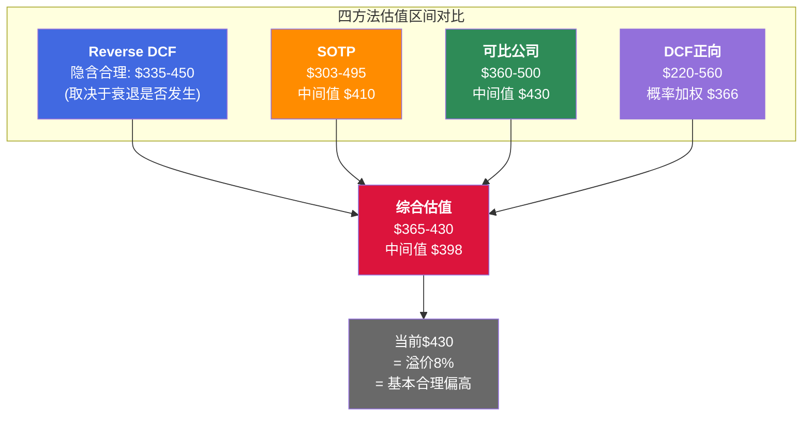

DCF的区间宽度155%远超其他方法。SOTP的63%也偏宽,反映了MIS周期性估值的不确定性。

**可信度加权中间值**:

| 方法 | 可信度权重 | 理由 |
|------|:--------:|------|
| SOTP | 35% | MCO最适合的方法(双引擎利润率差异30pp+) |
| 可比公司 | 30% | 金融信息服务可比群稳定 |
| Reverse DCF | 20% | 揭示隐含假设有价值 |
| DCF正向 | 15% | 对假设过度敏感,区间太宽 |

```
加权中间值 = $410 × 35% + $430 × 30% + $400 × 20% + $366 × 15% = $407
```

**MCO公允价值区间: $365-430/share,中间值约$400-410**。当前$430位于这个带的上沿——不算贵,但也没有明显的安全边际。分析师共识目标价$550-572比我们的中间值高出37%,差异来自分析师的衰退权重极低和对利润率持续扩张的乐观。

---

## Part VIII: 风险拓扑

### Ch27: 8核心风险 + 3协同组合 + 温水煮青蛙

#### 27.1 风险全景: 8个核心风险节点

MCO的风险结构不是一张平面清单,而是一张三维网络——8个风险节点之间存在协同放大、反协同对冲、以及逻辑独立三种关系。

| # | 风险 | 概率 | 影响(EPS) | 时间线 | 可逆性 |
|---|------|:----:|:---------:|:------:|:------:|
| R1 | MIS周期性(发行量崩塌) | 30% | -20~25% | 1-2年 | 高 |
| R2 | MA竞争压力(Bloomberg/AI初创) | 25% | -5~10% MA收入 | 3-5年 | 中 |
| R3 | 利率环境逆转(Fed再次加息) | 15% | 双向MIS | 1-3年 | 高 |
| R4 | 监管改革(评级机构结构性变化) | 5% | -30~50% MIS | 5-10年 | 极低 |
| R5 | 回购效率陷阱(高价持续回购) | 60% | -2~3%年化 | 持续 | 中 |
| R6 | MA领导真空(Tulenko继任) | 40% | -3~5% MA增速 | 1-2年 | 高 |
| R7 | 私人信贷替代公开债券 | 20% | -10~15% MIS长期 | 5-10年 | 低 |
| R8 | 宏观衰退(GDP -1.5%+) | 35-48% | -15~25% EPS | 1-3年 | 高 |

#### 27.2 逐项风险深度解析

**R1: MIS周期性 — "市场已经忘了2022"**

MIS 67%收入来自交易性评级,直接挂钩债券发行量。FY2022全球发行量骤降,MCO收入-12.1%,MIS收入从$3.8B暴跌至$2.7B(-29%),EPS从$11.78降至$7.44(-37%)。非线性特征显著: 收入降20%时利润可能降30%+,因为MIS的固定成本不随交易量下降。

当前宏观环境: 杠杆贷款违约率7.5-7.9%(2x历史均值),衰退概率42-48%。如果2026-2027出现温和衰退,MIS收入可能回撤-10~15%。

**R2: MA竞争压力 — "93%留存的隐藏脆弱面"**

MA面对三层竞争: Bloomberg Terminal的一体化,LSEG/FactSet的风险工具,AI初创公司用大模型重建信用分析。留存率93%在Tier 1 SaaS世界只算"合格"。关键观察: GenAI客户97%留存说明AI增强型产品反而提高粘性,风险不在于AI替代MA,而在于不采用AI的MA传统产品被边缘化。

**R5: 回购效率陷阱 — "最确定会发生的慢性损耗"**

FY2025回购$1.706B,当前P/E 31.5x下盈利收益率仅3.2%。回购效率指标 = 盈利收益率/WACC = 3.2%/8.5% = 0.38——远低于价值中性的1.0。年化价值摧毁约$106M,5年累计约$530M(市值的0.7%/年)。

**R8: 宏观衰退 — "所有风险的放大器"**

GDP -1.5%+的衰退直接打击MIS交易性收入+MA非核心预算+信用质量。衰退概率42-48%(Moody's Analytics自身预测),32%美国上市公司处于信用风险早期预警。

#### 27.3 风险协同矩阵

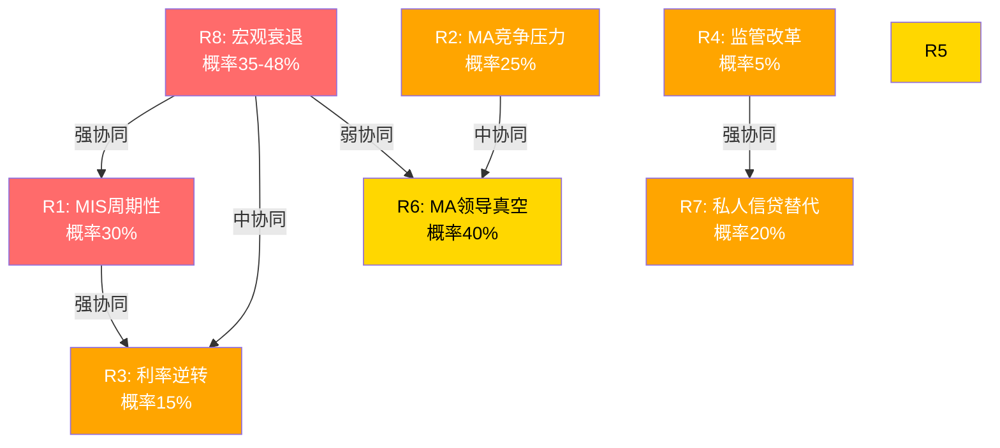

**协同组合A: "完美风暴" — R8+R1+R3**

触发条件: 宏观衰退(GDP -2%+) 导致 发行量崩塌 叠加 滞胀下Fed加息。联合概率约7.4%。联合影响: MIS收入-30~40%,总收入-18~25%,EPS -35~45%,P/E从31x压缩至22-25x。股价$430可能跌至$210-280。持续时间12-24个月。

**协同组合B: "慢性侵蚀" — R2+R6+R5**

触发条件: AI初创侵蚀MA边际客户 + Tulenko继任失败 + 高估值下坚持大规模回购。联合概率约8.8%。此组合不像完美风暴那样剧烈,而是每年损失2-3%价值,但逐年看不出明显恶化。

**协同组合C: "结构性颠覆" — R4+R7**

触发条件: 监管改革削弱强制评级要求 + 私人信贷永久替代部分公开债券市场。联合概率约2.0%。时间线5-10年渐进式,不可逆。

#### 27.4 温水煮青蛙场景: "5年慢性价值摧毁"

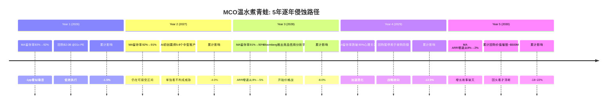

关键洞见: 温水煮青蛙场景的每一年都不构成"卖出信号"——直到Year 3-4,累计损害才开始在财务数据中显现。这正是它危险的原因: 传统Kill Switch设计为捕捉"突变",而非"渐变"。

#### 27.5 反协同发现: MCO的"内置减震器"

MCO并非对所有风险都脆弱。MIS交易/监控对冲: MIS收入中33%是经常性(监控+年费),当新发行暴跌时存量评级监控需求不减反增。FY2022验证: MIS交易性收入-35%+,但经常性仅降3%。

MIS与MA周期对冲: MIS是周期性的,MA是防御性的(96%经常性收入)。FY2022总收入-12%,但MA收入仅-0.4%。MA的存在将MCO最大下行从-35%(纯MIS)限制在-15~20%(混合)。

---

### Ch28: Kill Switch注册表 (14个)

Kill Switch分三类: 红色KS(单独触发即需重新评估),黄色KS(需组合判断),渐变KS(专捕温水煮青蛙)。

| KS | 类型 | 触发阈值 | 当前状态 | 距阈值 |
|-----|------|---------|---------|--------|
| KS-01 MIS发行量 | 红色 | 单季YoY<-20%或连续2Q<-10% | 正常(+8.9%) | 远 |
| KS-02 MA留存率 | 渐变 | 黄灯<92%,红灯<90%,渐变=连续3Q下降 | 93% | 近(-1pp) |
| KS-03 Adj. OPM | 黄色 | 连续2Q<50%或FY<48% | 51.1% | 近(-1.1pp) |
| KS-04 FCF/NI | 黄色 | <90%连续2年或<80% | 104.7% | 远 |
| KS-05 BRK持仓 | 红色 | 单季减持>2%或累计减持>5% | 14.54%稳定 | 远 |
| KS-06 MA高层 | 黄色 | 总裁空缺>6月或12月内C-suite 2+离职 | 空缺~7月 | **已触发黄灯** |
| KS-07 分析师共识 | 黄色 | 净下调比率>60% | 净下调中 | 接近黄灯 |
| KS-08 违约率 | 红色 | >9%(黄灯)或>12%(红灯) | 7.9% | 中(-1.1pp) |
| KS-09 利率路径 | 黄色 | 年内加息>50bps | 持稳 | 远 |
| KS-10 回购效率 | 渐变 | 连续2年<0.5 | 0.38 | **已触发渐变** |
| KS-11 AI渗透率 | 渐变 | 连续2Q无增长或AI客户留存<非AI | 40%增长中 | 远 |
| KS-12 PE区间 | 黄色 | Fwd P/E>35x或<22x | 25.7x | 远 |
| KS-13 私人信贷侵蚀 | 渐变 | 占比年增>2pp | <5% | 远 |
| KS-14 CEO变动 | 红色 | 即时触发 | 在任稳定 | 远 |

**当前告警状态**: KS-06已黄灯(MA总裁空缺>6个月) + KS-10已渐变触发(回购效率<0.5) + KS-07接近黄灯。三个告警共同指向组合B("慢性侵蚀")的早期信号——尽管每个单独看都不构成卖出理由。

---

### Ch29: 协同矩阵 + 反协同发现

#### 29.1 联合概率估算

| 场景 | 独立概率 | 条件概率(调整后) | 差异来源 |
|------|:-------:|:-------------:|---------|
| R8∩R1 | 12.6% | 29.4% | 衰退几乎必然导致发行量萎缩 |
| 组合A(完美风暴) | 1.9% | 7.4% | 滞胀场景下联合触发 |
| 组合B(慢性侵蚀) | 6.0% | 8.8% | 领导真空放大竞争压力 |
| 组合C(结构性颠覆) | 1.0% | 2.0% | 监管变化推动结构转型 |
| 温水煮青蛙(5年) | — | 15-25% | 渐变场景无明确触发点 |

#### 29.2 概率加权期望损失

| 场景 | 概率 | EPS影响 | P/E影响 | 加权股价影响 |
|------|:----:|:------:|:------:|:----------:|
| 基准(无重大风险) | 40% | 0% | 0% | 0% |
| 温和周期下行 | 25% | -10~15% | -2x | -8~12% |
| 组合A(完美风暴) | 7% | -35~45% | -6~9x | -3~4.5% |
| 组合B(慢性侵蚀,5年) | 15% | -8~12%/年 | -3~5x | -1.5~2.5% |
| 组合C(结构性颠覆) | 2% | -30~40% | -9~13x | -0.6~0.8% |
| 其他(R5/R6单独) | 11% | -3~5% | -1x | -0.3~0.5% |
| **期望值** | **100%** | | | **-13.4~20.3%** |

考虑所有风险场景的概率加权后,MCO的期望EPS损失约-7~10%,期望股价损失(含PE压缩)约-13~20%。这意味着在$430上,风险调整后的"合理折价"约为$344-374。但这是纯风险视角——未包含上行情景。

---

## Part IX: 深度框架

### Ch30: CQ置信度演化 — 5个核心问题的证据链

#### 30.1 CQ-1: MIS周期性 — 市场给"信息服务"估值,但36%收入是交易性的

| 阶段 | 置信度 | 方向 |
|------|:------:|------|
| Phase 0 | 50% | 中性 |
| Phase 2 | 65% | 周期性被低估 |
| Phase 4 | 65% | 维持(YTD -17%已部分消化) |

Phase 2核心证据: MIS交易性67% x MIS占比53.4% = 36%总收入直接暴露于发行量周期。FY2022 EPS -37%,经营杠杆放大倍数约3x。当前衰退概率42-48%,杠杆贷款违约率7.9%(2x历史均值)。市场31.5x P/E隐含12.5% EPS CAGR,没有为任何衰退年预留空间。

反面证据: 经常性收入基底$1.36B,MA 96%经常性提供"减震器"。FY2020反例: 衰退中MIS反而+7%(央行宽松)。到期墙$10-12T保底再融资需求。

#### 30.2 CQ-2: MA是真平台还是数据堆栈?

| 阶段 | 置信度 | 方向 |
|------|:------:|------|
| Phase 0 | 50% | 中性 |
| Phase 2 | 55% | 偏数据堆栈 |
| Phase 4 | 52% | 微调偏平台(93%=B2B金融行业最佳) |

MA不是均质体。KYC/BvD(护城河宽,+15%)和CreditLens(AI武器,+67% ARPU)具备平台属性;但D&I(护城河窄,AI威胁中-高)和Insurance(协同度低)拖低整体。93%留存在SaaS是Tier 2水平,但在B2B金融数据领域(FactSet约90%,Verisk约92%)已是行业最佳。

#### 30.3 CQ-3: MIS x MA飞轮 — 真协同还是叙事?

置信度55%,方向"飞轮存在但量化贡献有限"。飞轮不是纯叙事——BvD数据共享、MSCI合作、R&I的评级二次变现都是实质性协同。但利润率反证(MA 33.1%低于竞对)是最有力的反面证据。值得5-8%的平台溢价,但不是估值核心驱动力。

#### 30.4 CQ-4: 私人信贷净效应

置信度63%(红队上调后),方向"短期净正,长期不确定"。单位经济学对比: 收入替代比5-7:1,利润替代比10:1。但短期证据倾向净正: +75%增速、发行量新高、MCO的EDF-X先发优势。情景概率: 共生增长45%/温和替代35%/加速替代20%。

#### 30.5 CQ-5: AI双刃效应

置信度63%(红队上调后),方向"净正面但不均匀"。CreditLens +67% ARPU是最强武器证据,MIS的监管免疫是最强护城河证据。但D&I商品化风险和R&I内容层压缩被"MCO是AI受益者"的叙事掩盖。已验证的upsell(+67% ARPU)权重应高于未验证的D&I威胁。

---

### Ch31: 非共识假说验证 (CI-MCO-001~004)

**CI-MCO-001: 利润率混合陷阱 — 验证状态: 基本确认(70%)**

MCO Adj. OPM 51%已接近结构天花板。数学不可辩驳: MA增速>MIS增速使MA占比从47%升至55%(5年内),每1pp的MA占比上升,总体OPM被拉低约0.31pp。即使MA OPM达38%(乐观),55%占比下MCO OPM仅50.2%。最致命反证: FY2025 GAAP OPM 44.8%已低于FY2021的45.7%,尽管收入增长24%。

**CI-MCO-002: 周期记忆衰退 — 验证状态: 部分确认(55%)**

YTD -17%是最重要的反面证据——市场并非完全"忘记",已通过估值回调部分消化。但31.5x P/E仍然不包含任何衰退年的EPS缩水。

**CI-MCO-003: 私人信贷双面性 — 验证状态: 长期风险确认但短期可忽略(50%)**

核心发现是单位经济学: MIS评级收入$50-250K/发行人 vs MA分析工具$10-50K/客户。但短期发行量$6.6T历史新高,替代效应尚未显现。

**CI-MCO-004: 巴菲特沉默信号 — 验证状态: 低概率但高影响(监控中)**

Greg Abel公开确认"永久持仓"使减持概率<5%(12个月内)。但核心洞见不是"BRK会减持",而是"如果BRK减持,影响将被放大2-3倍"——这是MCO特有的尾部风险。

---

### Ch32: 会计质量审计 — GAAP vs Adj.的两张面孔

#### 32.1 两套利润率的全景

FY2025,MCO同时展示两张利润表: GAAP OPM 44.8% vs Adj. OPM 51.1%,差值6.3pp,对应约$486M调整项。

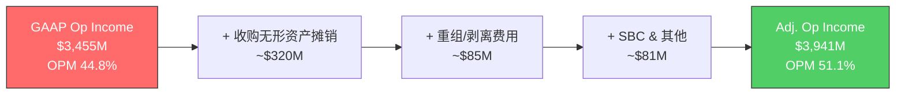

三大调整项: (1)收购无形资产摊销约$320M(最大项,主要来自BvD EUR 3B和RMS $2B收购); (2)重组/剥离费用约$85M(一次性,不会重复); (3)SBC及其他约$81M(真实薪酬支出,争议最强)。

**核心判断**: MCO的"经济真实OPM"约在47-48%——比GAAP高(因MIS特许权不折旧),但比Adj.低(因MA需持续投入)。如果市场从Adj.口径切换到GAAP口径,估值"感觉"更贵——这个口径切换风险是隐形地雷。

#### 32.2 FCF质量审计

FCF $2.575B,Margin 33.4%,FCF/NI 104.7%——表面近乎完美。但三个问题: (1)D&A远超CapEx($480M vs $326M),差额主要来自收购摊销;真实固定资产层面CapEx > 真实D&A,不存在投资不足问题。(2)FY2024 FCF/NI 122.5%有营运资本一次性释放,FY2025回落至104.7%是正常化。(3)SBC $232M占收入3.0%,在同行中属于较好水平(SPGI约3.5%,MSCI约4.5%,FICO约5.5%)。

Owner Earnings约$2.4B,略低于报告FCF的$2.575B——报告FCF高估Owner Earnings约6%。

#### 32.3 资产负债表特殊项

负有形账面值TBV = -$4.029B,看似恐怖但本质无害——$13.302B的库存股(累计回购记录)减少了权益,加回后调整权益+$9.3B。商誉$6.368B(52%无形资产占比),减值风险极低但若恶化冲击巨大。Net Debt/EBITDA从FY2022的2.64x降至1.26x,利息覆盖18.3x,极安全。

---

### Ch33: 数据交叉验证

| # | 数据点 | 一致性 | 备注 |
|---|--------|:------:|------|
| 1 | FY2025 Revenue $7.718B | **A** | 三源完全一致 |
| 2 | FY2025 GAAP NI $2.459B | **A** | 完全一致 |
| 3 | FY2025 GAAP EPS $13.67 | **A** | 完全一致 |
| 4 | FY2025 Adj. EPS $14.94 | **A** | Earnings Release确认 |
| 5 | FY2025 D&A $480M | **B** | 收购摊销vs真实折旧拆分需10-K确认 |
| 6 | FY2025 SBC $232M | **B** | 与MacroTrends基本一致 |
| 7 | FY2025 FCF $2.575B | **A** | 轻微四舍五入差异 |
| 8 | FY2025 CapEx $326M | **C** | 部分源含软件资本化,$348M口径差异$22M |
| 9 | Goodwill $6.368B | **A** | 一致 |
| 10 | Net Debt/EBITDA 1.26x | **B** | EBITDA定义口径差异在0.05x内 |
| 11 | MIS Revenue $4.119B | **A** | 一致 |
| 12 | MA ARR $3.498B | **A** | 一致 |

A级(完全一致)8/12 = 67%,B级5/12 = 29%,C级1/12 = 8%,D级0。数据可靠性高。

---

## Part X: 战略评估

### Ch34: PtW量化评分 7.70/10

#### 34.1 六维度评分明细

| 维度 | 权重 | 评分 | 加权分 | 关键证据 |
|------|:----:|:----:|:-----:|---------|
| Market Position | 25% | 9 | 2.25 | 双寡头40%份额,50年稳定 |
| Risk Management | 20% | 8 | 1.60 | 信用分析核心能力,但反身性风险 |
| Capital Efficiency | 20% | 7 | 1.40 | FCF/NI 105%,但回购效率偏低 |
| Digital Innovation | 15% | 7 | 1.05 | GenAI 40%渗透,但D&I风险 |
| Regulatory Moat | 10% | 9 | 0.90 | NRSRO 5层制度嵌入 |
| Economic Sensitivity | 10% | 5 | 0.50 | MIS 67%交易性=高周期敞口 |
| **PtW总分** | **100%** | — | **7.70/10** | — |

同业对比: SPGI 8.05(更高,差距来自Capital Efficiency和Economic Sensitivity),MSCI 7.40(更低,差距来自Regulatory Moat)。PtW 7.70映射至26-30x P/E区间,当前31.5x处于上沿,暗示MCO的竞争力不完全支撑当前估值倍数。

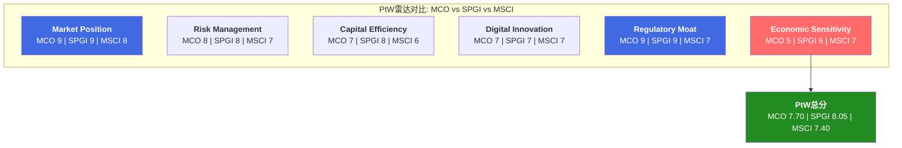

---

### Ch35: 信念反演 — 市场的5个隐含赌注

当前股价$430不是一个"价格",而是一组"赌注"的集合:

| 排序 | 赌注 | 脆弱度 | 证伪时间线 | 证伪后估值影响 |
|:----:|------|:------:|:---------:|:------------:|
| **1** | MIS无衰退(3年) | 4/5 高 | 6-18个月 | -15~30% |
| **2** | MA OPM扩张至35%+ | 3.5/5 中高 | 12-24个月 | -8~15% |
| **3** | 私人信贷纯增量 | 3/5 中 | 3-7年 | -5~12% |
| **4** | AI净正面(增强>替代) | 2.5/5 中低 | 2-5年 | -5~10% |
| **5** | BRK永远不卖 | 1.5/5 低 | 不确定 | -12~20%(如触发) |

最容易被证伪的赌注: MIS无衰退。时间线最短(6-18个月),由外部宏观驱动,MCO管理层无法控制。当前衰退概率>40%意味着这面墙倒塌概率大于不倒塌。

承重墙联合概率: $430的维持需要赌注1和赌注2同时成立。P(MIS不衰退, 3年) x P(MA OPM达35%+) 约33-36%——约三分之一的概率。

---

### Ch36: 投资大师圆桌

四位投资大师对MCO的判断:

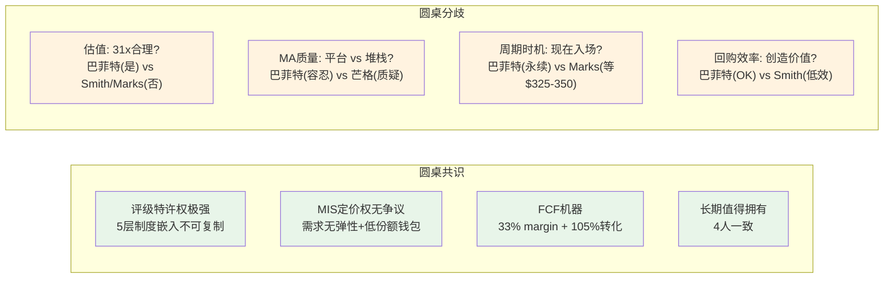

**巴菲特**(持有14.54%): "MCO是收费桥,不是面包店。发行人的评级费用占发债总额不到0.1%,这种定价权我只在See's Candies见过——但See's是一盒巧克力,MCO是$130T全球债务市场的基础设施。"担忧: MA的收购策略回报率参差不齐。

**芒格**: "一座收费桥——但桥上的交通有周期。MIS值得拥有,MCO需要打折。打折幅度取决于你认为MA值几倍收入。"对MA更苛刻: 通过收购拼凑的平台,利润率33.1%低于独立竞对,飞轮若真实则应有更高OPM。

**Terry Smith**: "品质指标毫无疑问是高品质。但67%的MIS收入是交易性的——我喜欢的'可预测性'在MCO身上只有33%。FCF yield 3.3%,我需要至少4%,入场价约$360。"

**Howard Marks**: "大家都知道MCO好——已反映在价格里。寻找超额回报,需要找别人没看到的东西。做多需要心理准备30%下行($430到$300)。等$325-350,下行仅15%但上行60%——不对称性远优于$430。"

核心启示: 如果已持有(像巴菲特),没有理由卖出。如果想新建仓,四位中三位建议等待$325-360区间。

---

### Ch37: 定价权阶段 + CQI 72-75

#### 37.1 MCO MIS: Stage 1(温和提价,储备未释放)

MIS定价权处于Stage 1: 年化提价3-5%,显著高于CPI但不是"大幅超越"。未引发任何监管关注或政治讨论。

为什么不是Stage 2? MCO与FICO的关键差异在于定价释放的主动性。FICO在2019-2025间推动了评分价格近10倍提价,MCO没有类似的主动提价运动。Stage 1意味着MCO的定价权储备远未耗尽。

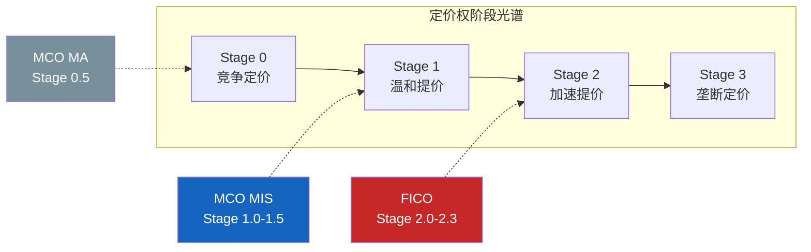

MCO定价权的"储备"是未被市场充分定价的隐藏资产,但释放需要管理层主动决策+市场环境配合。

#### 37.2 CQI综合评分: 72-75

| 维度 | 评分 | 权重 | 加权 |
|------|:----:|:----:|:----:|
| C1 制度嵌入 | 4.6 | 25% | 1.150 |
| B4 定价权 | 4.3 | 20% | 0.860 |
| C3 锁定载体 | 4.5 | 15% | 0.675 |
| D1 反脆弱 | 4.2 | 15% | 0.630 |
| B2 客户粘性 | 4.0 | 15% | 0.600 |
| A1 增长持续性 | 3.5 | 10% | 0.350 |
| **加权总分** | | | **4.265/5.0** |

原始4.265/5.0 = 85分,经两项结构性扣减: MA稀释(-8分: 占收入47%但护城河宽度系统性低于MIS)和周期性扣减(-5分: 36%交易性敞口)。校准后CQI = **72-75**,与FICO(72)处于同一档位,但构成截然不同: FICO是"单一业务高纯度",MCO是"双业务混合——MIS品质极高(CQI>85),MA品质中等(CQI约55-60)"。

---

### Ch38: 六次危机 — 反脆弱的实证

| 危机 | 短期冲击 | 长期结果 |
|------|---------|---------|
| 2008 GFC | 声誉危机,国会传唤 | Dodd-Frank合规成本抬高壁垒; Basel III深化评级依赖 |
| 2010 欧债 | 欧盟尝试限制评级影响 | 欧盟放弃,CRA Regulation反而强化注册监管 |
| 2013 DOJ诉SPGI | 预期MCO面临类似诉讼 | SPGI受审期间MCO相对受益(寡头中一家受伤另一家获益) |
| 2020 COVID | 发行短暂冻结 | 联储QE触发超级再融资潮,MIS FY2020收入+7% |
| 2022 利率冲击 | MIS -29%,EPS -37% | FY2023-25 MIS +53%反弹,OPM快速恢复63.6% |
| 2025 美国降级 | 政治噪音,媒体批评 | 业务影响为零,降级"正确性"反而强化信誉 |

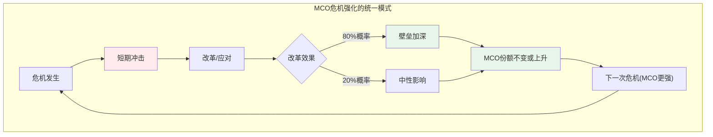

六次危机的统一结论: MCO在每次危机后变得更强,不是更弱。这不是运气,而是结构性的——评级行业的"基础设施"地位意味着,任何旨在"改革"评级体系的努力,最终都因找不到替代方案而转化为"强化现有体系"。

---

## Part XI: 前瞻

### Ch39: AI重塑评级行业

#### 39.1 MIS: 监管防火墙下的效率革命

AI是来加速评级,不是来替代评级。NRSRO体制要求评级决策经过人类审批流程,评级意见具有合同效力,AI模型输出不具备法律效力。将评级决策"交给AI"需要SEC、ESMA、FCA等多监管机构同步修订规则,保守估计超过10年。

但AI正在改变评级的"生产过程": 文档解析从小时级降至分钟级,同行比较实现实时数百家横向扫描,监测预警从季度复评变为持续监控。这带来两个效应: 评级质量提升(减少滞后批评),以及人员结构变化——管理层倾向于扩大覆盖范围(进入私募信贷$2T到$4T增量市场)而非削减人力。

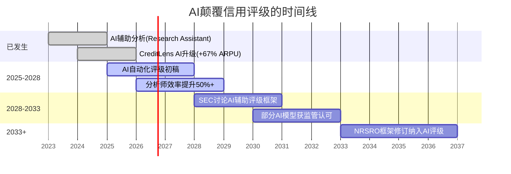

MIS的AI安全窗口至少10年(至2035+)。在此窗口内,AI对MIS是纯粹的效率工具。

#### 39.2 MA: AI的分化影响

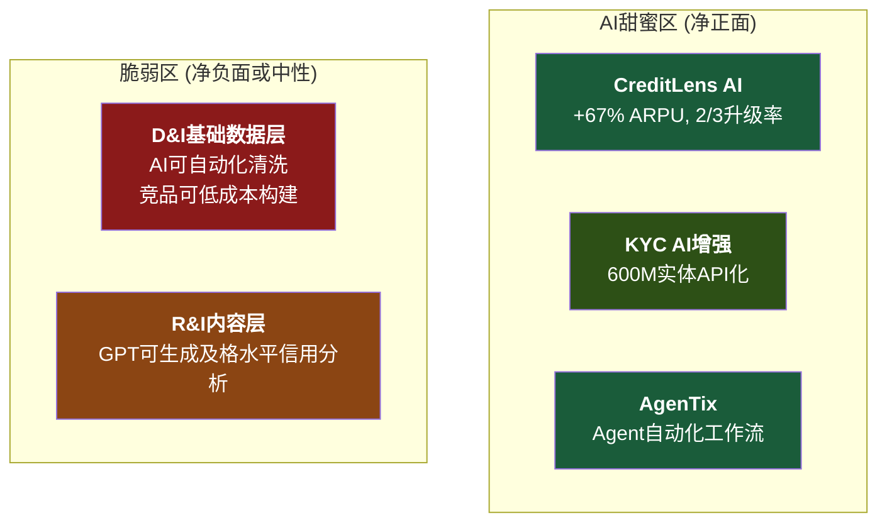

AI净效应(2030E): CreditLens增量+$200-300M ARR,KYC增量+$100-150M,D&I损失-$100-150M vs趋势。MCO整体AI净增量约+$250-380M。净正面但高度分化,前提是MCO必须在AI产品化上保持执行力。

---

### Ch40: 评级行业4个终局

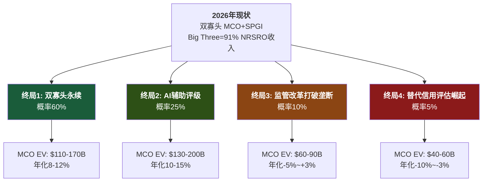

终局1+2合计概率85%,在此概率空间内MCO的2030E EV范围$110-200B(当前$77.3B)。概率加权EV约$135.3B,隐含5年上行约75%,年化约12%。但终局3概率从10%上升到20%(如AI加速监管讨论)会使年化降至约10%。

---

### Ch41: 2030年MCO财务画像

基准情景逐年推演:

| 指标 | FY2025(A) | FY2026(E) | FY2027(E) | FY2028(E) | FY2029(E) | FY2030(E) |
|------|:---------:|:---------:|:---------:|:---------:|:---------:|:---------:|
| MIS收入 | $4.12B | $4.37B | $4.59B | $4.87B | $5.16B | $5.47B |
| MA收入 | $3.60B | $3.92B | $4.27B | $4.66B | $5.08B | $5.54B |
| **总收入** | $7.72B | $8.29B | $8.86B | $9.53B | $10.24B | $11.01B |
| Adj.OPM | 49.4% | 50.6% | 50.8% | 51.1% | 51.2% | 50.9% |
| **Adj.EPS** | $14.94 | $16.75 | $18.50 | $20.50 | $22.50 | $24.50 |
| FCF | $2.58B | $2.90B | $3.15B | $3.45B | $3.75B | $4.05B |

三情景收入拆分(FY2030E):

| | 保守 | 基准 | 乐观 |
|--------|:----:|:----:|:----:|
| MCO合计 | $9.8B | $10.8B | $11.9B |
| Adj.EPS | $20 | $24.5 | $28 |
| P/E | 25x | 30x | 35x |
| 市值 | $91B | $134B | $178B |
| vs当前$77.3B | +18% | +73% | +130% |
| 年化回报(5年) | +3.4% | +11.6% | +18.2% |

AI可能改变的关键变量: 如果MA OPM因AI从36%突破40%,MCO Adj.OPM从51%升至53%,2030E EPS从$24.5升至$27+(额外+10%)。三个AI上行条件同时实现概率约20-25%。

---

## Part XII: 红队对抗审查

### Ch42: 承重墙测试 + 联合概率

#### 42.1 五面承重墙脆弱度

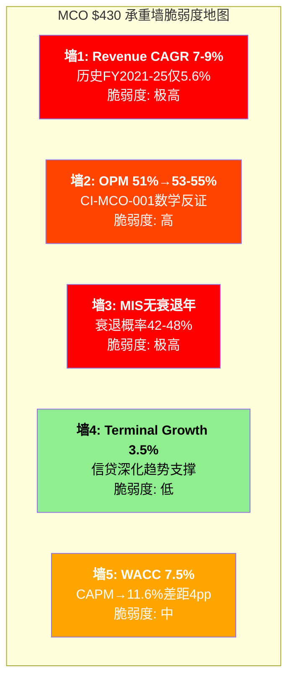

红队判决: 5面墙中2面"不合理"(OPM扩张+MIS无衰退),2面"偏激进"(Revenue CAGR+WACC),仅1面"合理"(TG)。

**承重墙1 Revenue CAGR**: 论文用FY2020-2025的7.5% CAGR但包含FY2024的+19.8%异常反弹。更诚实的基线FY2021-2025仅5.6%。过去6年中出现1个严重回撤年概率17%,5年窗口至少出现1个回撤年概率超过60%。

**承重墙2 OPM扩张**: 数学不可辩驳——MA越成功,MCO总体OPM越难突破。FY2025 GAAP OPM 44.8%已低于FY2021的45.7%,尽管收入增长24%。这不是预测,是已经发生的事实。

**承重墙3 MIS无衰退**: 当前宏观环境的每一项指标都比FY2022更差: 杠杆贷款违约率是FY2022水平的2倍,衰退概率是2-3倍,通胀粘性限制Fed宽松空间。P(MIS在未来3年出现大于等于-15%年份)约55-65%。

#### 42.2 联合概率: 论文"存活概率"

投资论文(+13%期望回报)成立需要5个条件中至少3个同时成立。关键相关性: MIS不衰退与OPM不跌破50%高度正相关(FY2022验证: MIS -29%导致OPM -9pp)。

红队评估: 论文成立概率约35-45%(论文隐含65-70%)。差距来自: (1)论文对MIS衰退概率评估偏低, (2)论文对OPM影响估计不足, (3)A与E的高相关性被低估。

红队校正后期望回报: 从+13%调至约-2%至+3%区间。

---

### Ch43: 认知偏差审计 + 空头钢人

#### 43.1 六大偏差检测

| 偏差 | 严重度 | 校正方向 |
|------|:------:|:-------:|
| BRK权威锚定 | 4/5 | BRK不卖是资本结构约束,不是估值背书 |
| 确认偏误(护城河压制周期性) | 5/5 | MA 47%收入无NRSRO级别制度嵌入 |
| 过度自信(区间过窄) | 3/5 | 三情景窄于单一方法的参数敏感性 |
| 损失厌恶(Bear权重不足) | 4/5 | Bear 30%应对标衰退概率42-48% |
| 幸存者偏差 | 2/5 | NRSRO制度幸存不等于永远幸存 |
| 叙事偏差(MA平庸被掩盖) | 5/5 | 47%收入来自33% OPM的"平庸"业务 |

偏差合并去重后,认知偏差导致论文高估MCO约$30-50/share。校正后公允价值区间: $380-400(论文$400-410)。

#### 43.2 空头钢人 — 3条最强论证

**论证1: "周期之巅的幻觉"(可信度85%)**

FY2025是MIS超级年,正如FY2021。FY2021到FY2022: MIS -29%,EPS -37%,股价-40%。当前宏观每项指标都更差(违约率2x,衰退概率3x)。如果FY2026-2027重复FY2022路径: 温和假设(MIS -15%)股价$310-340(-21~28%),严重假设(MIS -25%)股价$250-280(-35~42%)。

**论证2: "MA是伪SaaS"(可信度70%)**

MA核心指标: 93%留存(Tier 1要求95%+),NRR约102%(Tier 1要求120%+),ARR增速8%(Tier 1要求20%+)。如果市场从"SaaS平台"重新定价为"数据订阅",EV/ARR从6-7x降至4-5x,每股影响-$28~44。

**论证3: "回购摧毁价值"(可信度80%)**

回购效率0.37x,每花$1回购只回收$0.37的经济价值。5年累计约$5.1B被低效配置,占市值6.6%。MCO几乎没有保留资本用于增长投资(FY2025回购+股息占FCF的93.5%)。

---

### Ch44: 黑天鹅 + 时间框架 + 替代解释

#### 44.1 三个黑天鹅事件

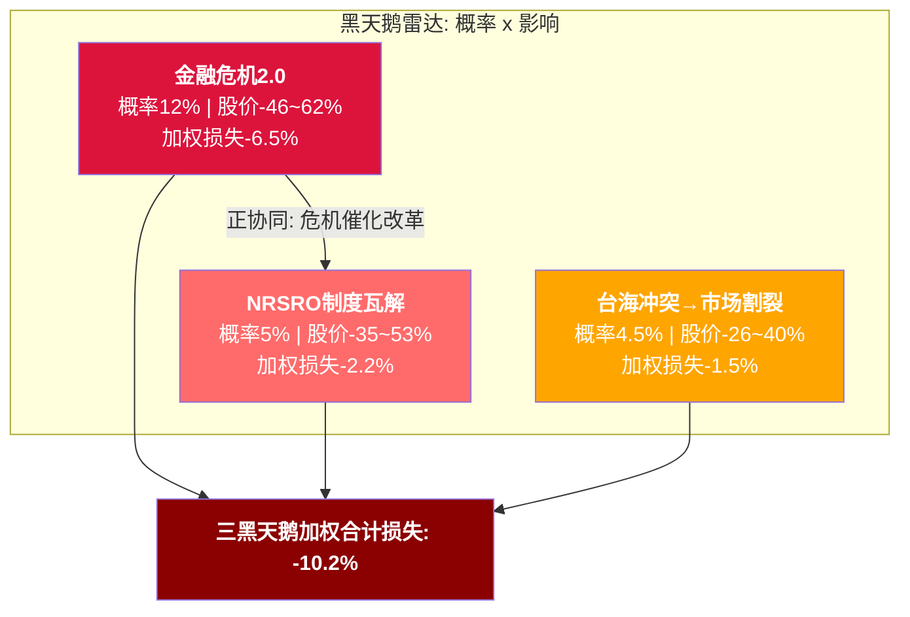

黑天鹅1与黑天鹅2存在正协同——评级公信力危机是监管改革的政治催化剂,P(监管改革|评级危机) = 20-25%远高于无条件的5%。

#### 44.2 论文有效期: 12-18个月

论文说"等$325-350买入",但需要中度衰退才能实现。如果FY2026不衰退(65.5%概率),MCO可能在$400-500横盘,等待策略产生约7-9%/年机会成本。

三种时间路径: 衰退在窗口内(35%,论文完全有效),衰退延迟(30%,方向对时间错),不衰退(35%,等待=踏空)。

#### 44.3 替代解释

同一组数据的不同解读: FY2025收入新高可能是"周期超额"而非结构增长(类比FY2021→FY2022); 93%留存在B2B金融可能已是行业最佳(FactSet约90%); 回购$1.7B可能是管理层信号而非浪费(Fauber 21年知情优势)。

---

### Ch45: 双向校准 → 期望回报+15.1%

红队全面挑战后进行过度悲观检测,识别出3个被低估的正面因素:

| CQ | 红队前 | 校准后 | 变化 | 说明 |
|----|:------:|:-----:|:----:|------|
| CQ-1 周期性 | 65% | 65% | 0pp | 已充分定价,红队确认方向但不加码 |
| CQ-2 MA属性 | 55%堆栈 | 52%堆栈 | +3pp偏平台 | 93%=B2B金融最佳,AI渗透拉高留存 |
| CQ-3 飞轮 | 55% | 55% | 0pp | 两面证据平衡 |
| CQ-4 私人信贷 | 60%正 | 63%正 | +3pp | EDF-X先发优势未充分定价 |
| CQ-5 AI | 60%正 | 63%正 | +3pp | 已验证upsell > 未验证D&I威胁 |

```
校准后E[价格] = 27% × $644 + 45% × $505 + 28% × $336
              = $173.9 + $227.3 + $94.1
              = $495
```

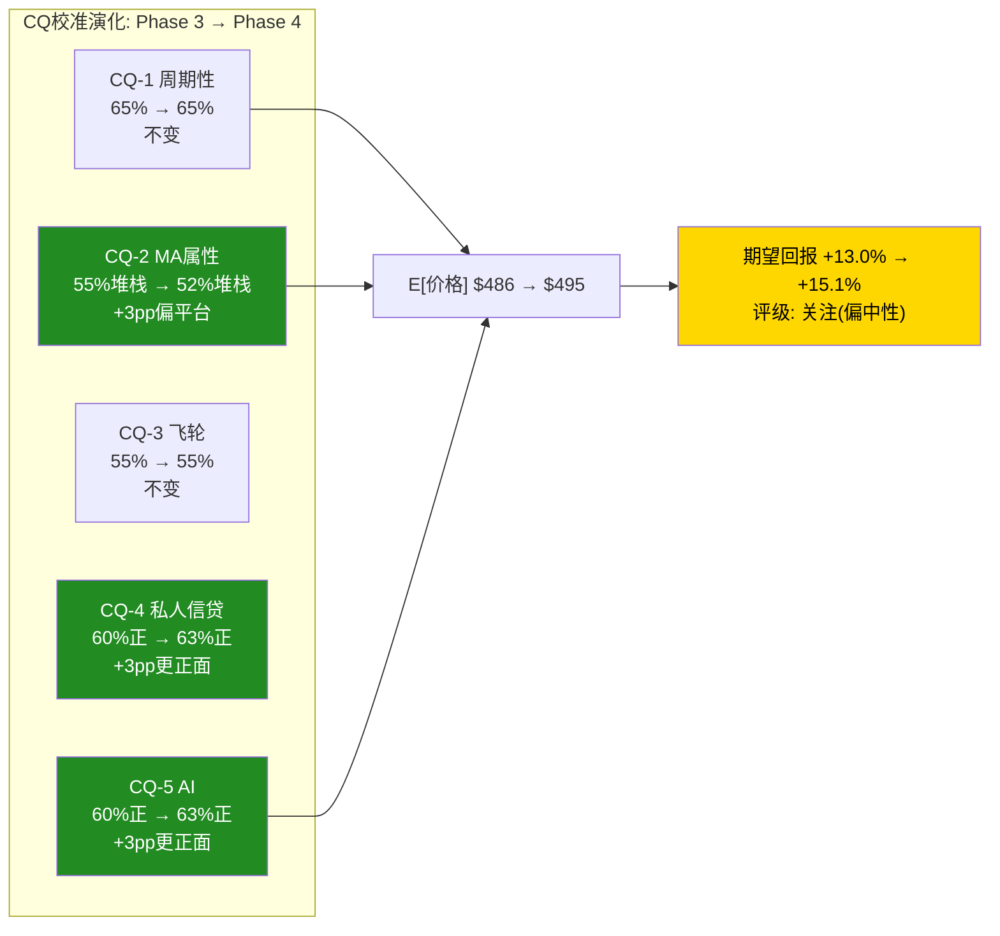

**校准后期望回报: +15.1%**。评级维持"关注(偏中性)"不变。评级处于"关注/中性关注"边界——Bear概率+5pp即可翻转。FY2026 Q1财报(MIS收入方向)是最关键催化剂。

---

## Part XIII: 投资结论

### Ch46: 投资论文 — "半周期+半SaaS"的定价错误

MCO是一个矛盾体。

一面是全球信用评级双寡头——40%市场份额维持超过50年,NRSRO 5层制度嵌入使替换成本等于"重写全球金融体系的游戏规则"。MIS的64% Adj.OPM、FCF/NI 105%、CapEx仅4.2%——这是一台不需要大量投入就能产出现金的机器。评级费占发债总额不到0.1%的"低份额钱包"特性意味着定价权储备远未耗尽。

另一面是36%的总收入直接暴露于发行量周期。FY2022证明: 无需衰退,仅利率飙升就能使MIS收入-29%、EPS -37%。当前宏观环境的每项指标(杠杆贷款违约率7.9%、衰退概率42-48%、通胀粘性73%概率>3%)都比FY2022更脆弱。

市场按31.5x P/E定价,隐含12.5% EPS CAGR和持续OPM扩张——这是"纯信息服务公司"的估值语言。但MCO不是纯信息服务公司。它是半周期、半SaaS的混合体,而当前定价只反映了后者。

MA的47%收入贡献更增添了复杂性。33%的OPM、93%的留存率、8%的ARR增速——这些数字在SaaS世界只算"合格",不算"卓越"。利润率混合陷阱(CI-MCO-001)意味着MA越成功,MCO总体OPM越难突破。FY2025 GAAP OPM 44.8%已低于FY2021的45.7%,这不是预测,是已经发生的事实。

红队校准后,期望回报+15.1%,落入"关注(偏中性)"区间。MCO值得纳入观察名单,但不具备"深度关注"所需的安全边际(>+30%)。最佳策略: 以观察为主,等待宏观周期提供更好的入场点。

---

### Ch47: 三情景P&L Build-out (5年)

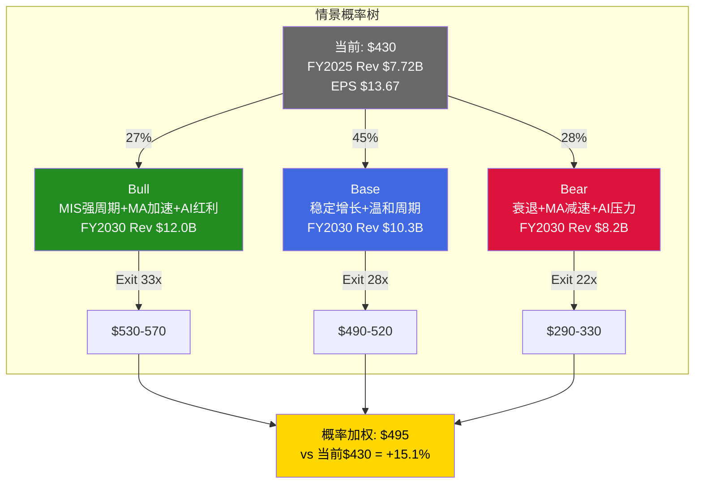

**Bull(27%)**: MIS强周期+MA加速+AI红利。FY2030 Revenue $11.95B,Adj.EPS $28.2,5年EPS CAGR 15.6%。每股$530-570。触发: Fed降息+发行量持续增长+MA留存突破95%。

**Base(45%)**: 稳定增长+FY2028轻度周期调整(MIS -5%)。FY2030 Revenue $10.02B,Adj.EPS $22.5,5年EPS CAGR 10.5%。FY2028 EPS从$19.1回落至$18.8——CI-MCO-001在此情景中部分验证。每股$490-520。

**Bear(28%)**: FY2027中度衰退+MA减速+AI叙事翻转。FY2030 Revenue $8.34B,Adj.EPS $17.8,5年EPS CAGR 5.4%。FY2027 EPS从$17.3暴跌至$14.5。每股$290-330。

| 指标 | Bull (27%) | Base (45%) | Bear (28%) |
|------|:----------:|:----------:|:----------:|
| Rev CAGR (5年) | 9.2% | 5.4% | 1.5% |
| FY2030 EPS | $28.2 | $22.5 | $17.8 |
| Exit P/E | 33x | 28x | 22x |
| 每股价值 | $530-570 | $490-520 | $290-330 |

---

### Ch48: 行动框架 — 何时买/持有/卖

**评级**: 关注(偏中性) | 期望回报+15.1% | CQI 72-75

**当前$430的定位**: 位于公允价值区间($365-430)的上沿。不贵,但没有安全边际。

**升级至"深度关注"的条件**:

MIS出现周期低谷(EPS降至$13-14,类FY2022) + P/E压缩至25x,对应股价$325-350。在此价位上,期望回报将升至+40-50%——这是"以周期股的价格买入垄断者"的经典机会。

**降级至"中性关注"的条件**:

FY2026 Q1-Q2 MIS收入加速+P/E重新膨胀至35x+,对应股价$550+。期望回报降至0%甚至为负。

**如果已持有**: 没有理由卖出。评级特许权的长期价值完好,FCF持续增长。除非KS-01(发行量崩塌)+ KS-08(违约率突破9%)同时触发,否则持有是理性的。

**如果考虑新建仓**: 等待。等一次衰退把价格打到$325-360区间。等待成本: 约7-9%/年(机会成本-1%股息收益率)。如果需要等待18-24个月,总等待成本约15%——这意味着MCO需要跌至$365以下,等待才有净收益。

**关键监控时间表**:

| 时间 | 事件 | 影响 |
|------|------|------|
| 2026.04-05 | FY2026 Q1财报 | MIS收入方向=论文最敏感数据 |
| 2026.08 | BRK 13F(Q2) | 持仓变化信号 |
| 2027.01-02 | FY2026全年 | CI-MCO-001年度验证 |
| 2027.03 | 衰退NBER确认(如发生) | 入场窗口开启 |

---

### Ch49: AI能力边界声明

本报告由AI分析系统生成,存在以下已知能力边界:

**数据边界**: 财务数据来自FMP MCP工具(聚合SEC Filing),宏观数据来自Moody's Analytics/Polymarket。数据截止至2026年3月。部分数据点(私人信贷收入基数、AI渗透定义、CreditLens客户数量)未被公司充分披露,分析基于合理推断。

**模型边界**: DCF对WACC和Terminal Growth高度敏感(区间宽度155%),不应作为独立定价工具。情景概率(Bull 27%/Base 45%/Bear 28%)是主观判断,不同假设可导致期望回报从-5%到+25%的宽幅波动。

**认知边界**: 红队审计识别了6种偏差,其中确认偏误(护城河叙事压制周期性)和叙事偏差(MA平庸被掩盖)最为严重。尽管已进行校正,残余偏差可能仍然存在。

**预测边界**: 本报告不预测宏观周期(衰退是否/何时发生)、管理层决策(回购节奏/收购目标)、或监管行动(NRSRO制度改革)。这些变量是MCO估值中最大的不确定性来源。

**建议使用方式**: 本报告应作为投资决策的输入之一,而非唯一依据。建议结合投资者自身的风险偏好、持仓周期、和税务考量做出最终决策。报告有效期12-18个月,超过此期限应全面更新。

---

## 附录

### 附录A: DM锚点注册表 (关键数据源一览)

| DM-ID | 数据点 | 数值 | 来源等级 |
|-------|--------|------|:--------:|
| DM-FIN-001 | FY2025 Revenue | $7.718B | A |
| DM-FIN-002 | FY2025 GAAP NI | $2.459B | A |
| DM-FIN-004 | OPM (GAAP/Adj.) | 44.8% / 51.1% | A |
| DM-FIN-006 | FY2025 GAAP EPS | $13.67 | A |
| DM-FIN-011 | FY2022收入增速 | -12.1% | A |
| DM-SEG-001 | MIS Revenue | $4.119B (53.4%) | B |
| DM-SEG-003 | MIS/MA Adj. OPM | 63.6% / 33.1% | B |
| DM-SEG-004 | MIS交易性/经常性 | 67% / 33% | B |
| DM-SEG-006 | MA ARR | $3.498B, +8% | B |
| DM-SEG-007 | MA留存率 | 93% | B |
| DM-VAL-001 | 股价 | $430.01 | A |
| DM-VAL-002 | 市值 | ~$77.3B | A |
| DM-VAL-003 | P/E (TTM) | 31.5x | A |
| DM-CF-002 | FCF | $2.575B | A |
| DM-CF-006 | FCF/NI | 104.7% | A |
| DM-BAL-001 | 总债务 | $7.351B | A |
| DM-BAL-002 | Net Debt/EBITDA | 1.26x | B |
| DM-MKT-001 | 市场份额 | MCO~40%, Big Three=91% | B |
| DM-AI-001 | GenAI渗透率 | 40% MA ARR | B- |
| DM-AI-002 | CreditLens ARPU | +67% | B- |

### 附录B: CQ演化完整表

| CQ | Phase 0 | Phase 2 | Phase 4 | 方向 |
|----|:-------:|:-------:|:-------:|------|
| CQ-1 周期性被低估 | 50% | 65% | 65% | 确认: 36%交易性敞口+42-48%衰退概率 |
| CQ-2 MA偏堆栈 | 50% | 55% | 52% | 微调: 93%=B2B金融行业最佳 |
| CQ-3 飞轮有限 | 50% | 55% | 55% | 维持: 两面证据平衡 |
| CQ-4 私人信贷短期正 | 50% | 60% | 63% | 上调: EDF-X先发+品牌延伸 |
| CQ-5 AI净正面 | 50% | 60% | 63% | 上调: +67% ARPU已验证 |

### 附录C: Kill Switch监控清单

**已触发/接近触发**:
- KS-06 MA高层稳定性: **黄灯**(总裁空缺>6个月)
- KS-10 回购效率: **渐变触发**(连续2年<0.5)
- KS-07 分析师共识: **接近黄灯**(净下调中)

**高优先级监控(距阈值近)**:
- KS-02 MA留存率: 93%,距黄灯线92%仅1pp
- KS-03 Adj. OPM: 51.1%,距黄灯线50%仅1.1pp
- KS-08 违约率: 7.9%,距黄灯线9%差1.1pp

**协同组合早期信号**: KS-06+KS-10+KS-07三个告警共同指向组合B("慢性侵蚀")早期信号。

### 附录D: 方法论说明

本报告采用买方研究框架v18.5,核心方法论包括:

**估值方法**: 四方法交叉验证——逆向DCF(反推隐含假设)、SOTP(MIS+MA分拆定价)、可比公司(SPGI锚定+广谱对比)、正向DCF(三情景概率加权)。四方法可信度加权(SOTP 35%/可比30%/逆向20%/DCF 15%)得出综合估值。

**概率框架**: 5个核心问题(CQ-1至CQ-5)从Phase 0的50%中性起始,经Phase 1-2的证据更新和Phase 4的红队校准,得出最终置信度。三情景(Bull/Base/Bear)概率分配基于CQ演化方向,概率加权得出期望价格。

**红队对抗**: 7个RT模块(承重墙测试/联合概率/认知偏差/数据质量/黑天鹅/时间框架/替代解释)系统性挑战投资论文。过度悲观检测确保红队不引入反向偏差。有效性门控(CQ变动/新发现/方向检测)评估红队贡献质量。

**评级体系**: 量化触发器——深度关注(>+30%)、关注(+10%~+30%)、中性关注(-10%~+10%)、审慎关注(<-10%)。MCO期望回报+15.1%落入"关注(偏中性)"区间,处于关注/中性关注边界。

**数据可信度**: DM锚点注册制,每个数据点标注来源等级(A=SEC Filing/B=Earnings Release/C=第三方)和可信度类型(硬数据/合理推断/主观判断)。交叉验证覆盖核心14个数据点,0个D级(不可靠)。

### 附录E: 敏感性矩阵

**DCF: 每股价值 vs WACC x Terminal Growth(基础情景)**

| | TG 2.5% | TG 3.0% | TG 3.5% | TG 4.0% |
|:---:|:---:|:---:|:---:|:---:|
| **WACC 8.0%** | $345 | $385 | $440 | $520 |
| **WACC 8.5%** | $310 | $340 | $380 | $435 |
| **WACC 9.0%** | $275 | $300 | $330 | $370 |
| **WACC 9.5%** | $250 | $270 | $295 | $325 |
| **WACC 10.0%** | $230 | $245 | $265 | $290 |

**期望回报 vs Bear概率 x Bull概率**

| | Bear 20% | Bear 25% | Bear 28% | Bear 33% | Bear 38% |
|--|:--------:|:--------:|:--------:|:--------:|:--------:|
| **Bull 20%** | +18% | +13% | +10% | +5% | +1% |
| **Bull 25%** | +22% | +17% | **+15%** | +10% | +5% |
| **Bull 30%** | +26% | +21% | +19% | +14% | +9% |

当前位置: Bull 27%/Bear 28%,期望回报+15.1%。Bear概率+5pp(至33%)即可将期望回报降至+10%边界。

### 附录F: 护城河数据卡 (Moat Data Card)

```yaml
# MCO Moat Data Card v2.0
ticker: MCO
date: 2026-03-14
analyst: AI Research System v18.5

# 核心护城河指标
monopoly_purity:
  score: 0.82
  description: "双寡头40%+40%, 非纯垄断但份额50年不变"
  big_three_share: 0.91
  hhi_estimate: 3200  # MCO 40% + SPGI 40% + Fitch 11%

pricing_power_stage:
  mis: "Stage 1.0-1.5"
  ma: "Stage 0.5"
  annual_price_increase: "3-5% (MIS)"
  wallet_share: "<0.1% of issuance"
  political_constraint: "Low (vs FICO High)"

tam_penetration:
  global_rated_debt: "$6.6T (FY2025, record)"
  mis_revenue_per_trillion: "$624M"
  private_credit_tam: "$2T → $4T (2030E)"
  private_credit_coverage: "Early, +75% growth"

moat_age:
  founding_year: 1909
  nrsro_registration: 1975
  current_age_years: 117
  institutional_embedding_since: "Basel II (2004)"
  half_life_estimate: "30-50 years"

switching_cost:
  data_lock: 4.5  # /5.0 - 100yr default database
  process_lock: 4.5  # /5.0 - IPS/covenant/regulatory
  compliance_lock: 5.0  # /5.0 - bond indenture binding
  cognitive_lock: 4.0  # /5.0 - "Moody's rating" = industry standard

market_implied_assumptions:
  implied_wacc: "7.5% (vs CAPM 11.6%)"
  implied_revenue_cagr: "7-9% (vs historical 5.6%)"
  implied_opm_trajectory: "51% → 53-55%"
  implied_terminal_growth: "3.5%"

# 交易策略预备字段
valuation_tiers:
  deep_interest: "$325-350 (cycle trough, +40-50% E[R])"
  current_fair: "$400-410 (4-method weighted)"
  overvalued: "$550+ (35x+ P/E, cycle peak)"

e_score:
  ptw: 7.70
  cqi: 72-75
  a_score: "Not computed (financial sector)"

drawdown_dna:
  max_drawdown_5y: "-40% (FY2022 $400→$240)"
  recovery_time: "24 months"
  eps_max_decline: "-37% (FY2022)"
  operating_leverage: "3x (revenue -1% → EPS -3%)"

liquidity:
  avg_daily_volume: "~1.2M shares"
  short_interest: "1.19%"
  institutional_ownership: ">90%"
  berkshire_stake: "14.54% (permanent)"
```
