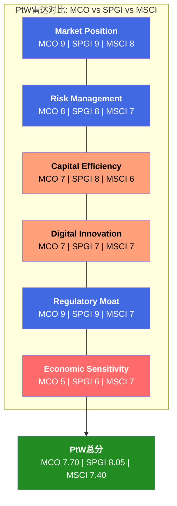
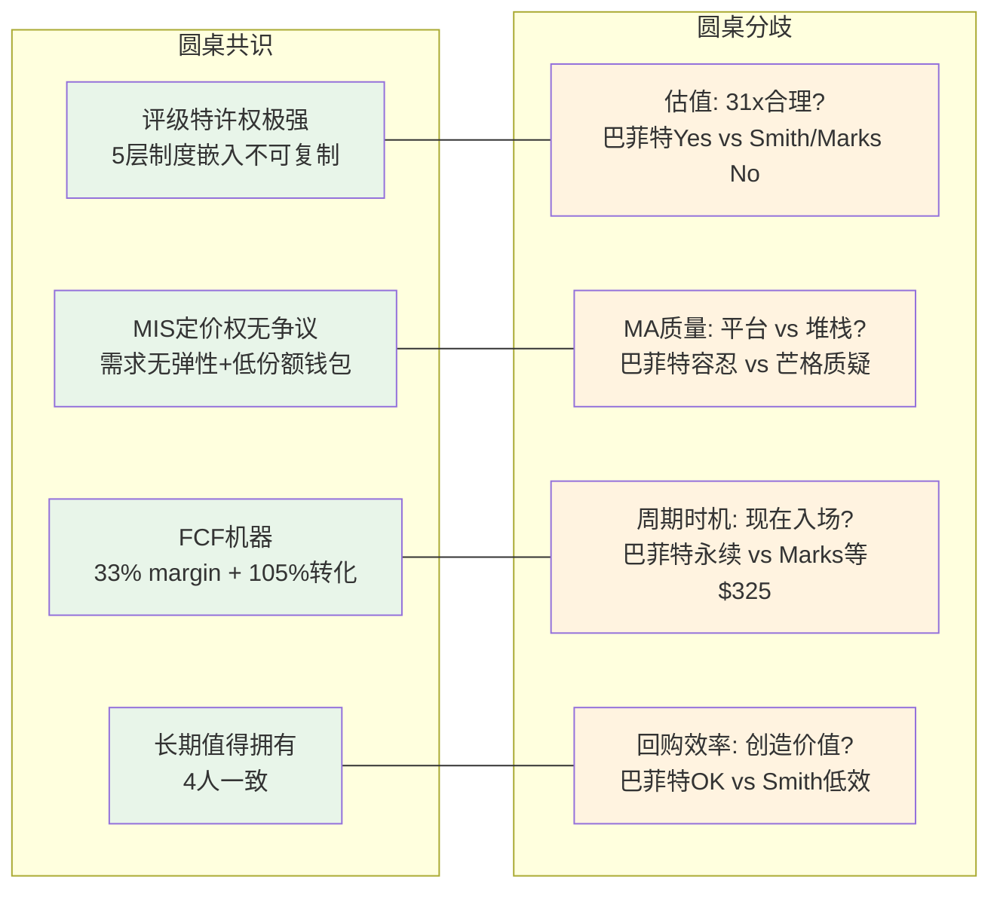
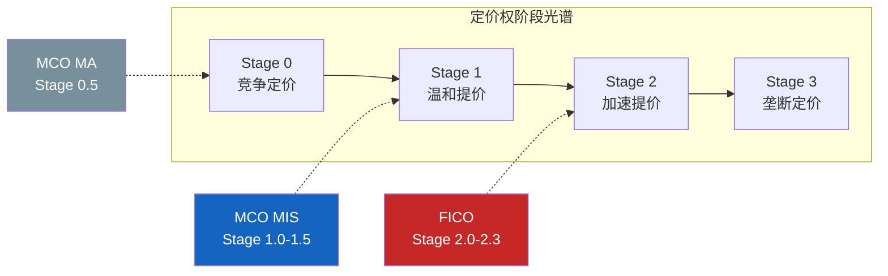
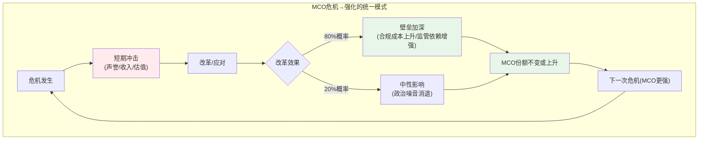
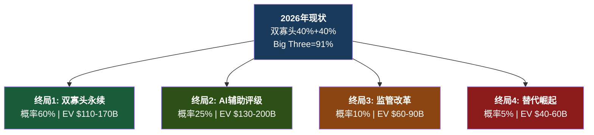
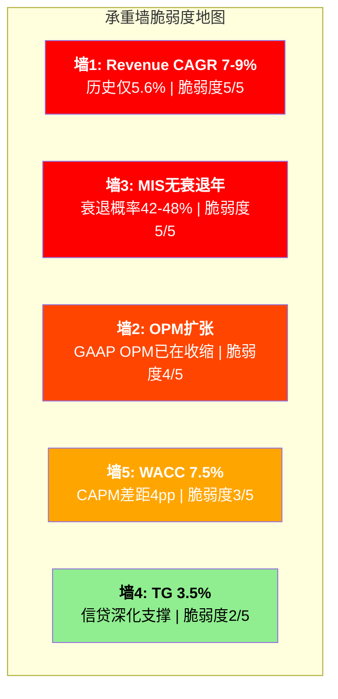
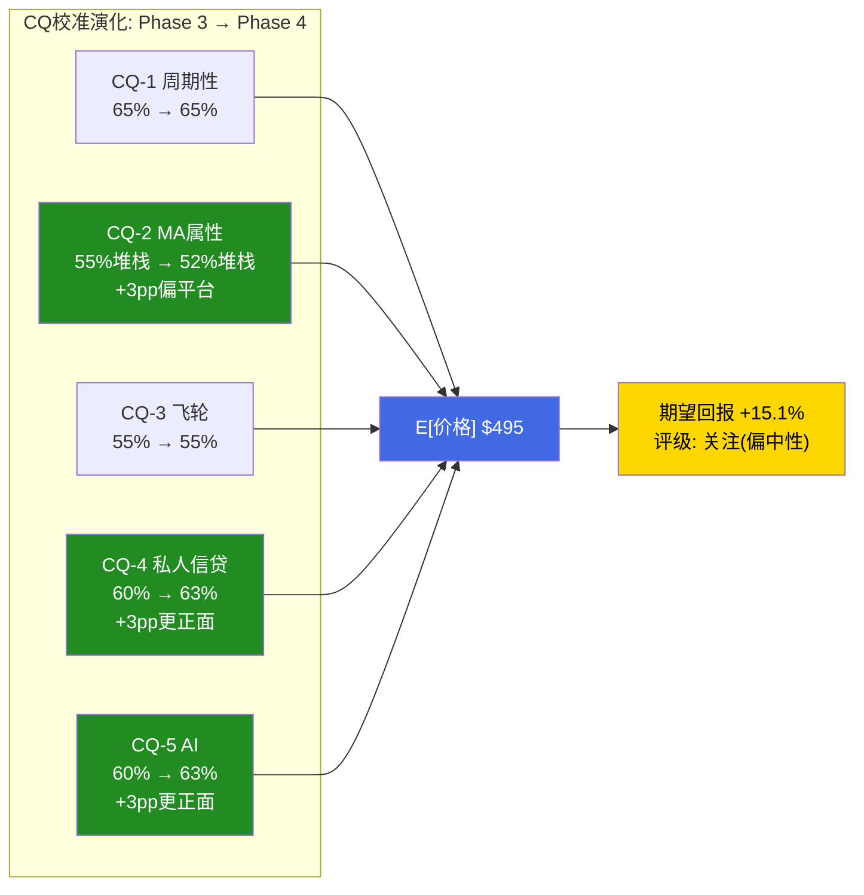
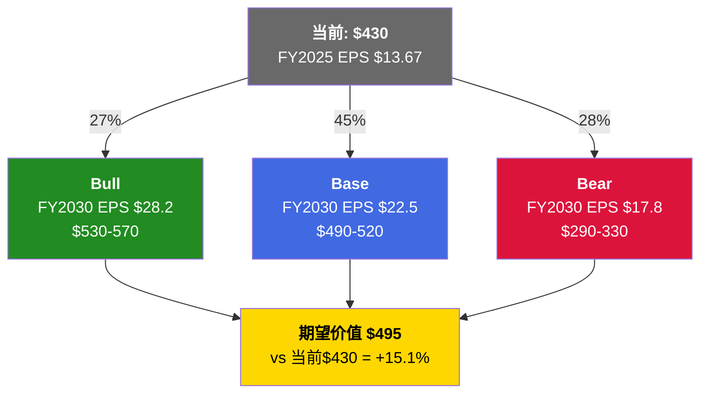

# Part X-XIII 扩充版: 战略评估 + 前瞻 + 红队对抗 + 投资结论

> EXPAND_part10_13 | MCO | 2026-03-15
> 源文件: S11 + S12 + S13 + S14 + S15
> 目标: 16章 + 附录A-F | 35-40K字符

---

# Part X: 战略评估

---

## Chapter 34: Playing to Win — 六维度竞争力量化

### 34.1 评分方法论

PtW(Playing to Win)评分框架将MCO的竞争力量化为6个维度、加权100分制。金融行业适配版本强调监管壁垒和风险管理的权重——这两个维度在信息服务公司中往往被低估，但对信用评级公司而言是护城河的物理基础。评分原则: 每个维度0-10分，证据来自Phase 0-2已验证的数据锚点，主观判断占比控制在20%以内。

### 34.2 维度1: Market Position (权重25%, 评分9/10)

MCO与SPGI构成信用评级领域的双寡头结构，合计占全球评级收入约80%，Big Three(含Fitch)占NRSRO收入91%。这个份额结构维持了超过50年——SEC 2024年NRSRO Staff Report显示10个注册NRSRO，Big Three占非政府证券评级84%。

50年的双寡头稳定性不是偶然。信用评级行业存在极强的正反馈循环: 投资者依赖评级做决策→发行人必须获得评级才能进入资本市场→评级机构积累更多数据和声誉→投资者更加依赖评级。这个循环一旦建立，后来者几乎不可能打破——不是因为产品不好，而是因为"所有人都用穆迪"本身就是最强的护城河。

为什么给9分而非10分? 因为MCO不是"垄断"，而是"双寡头中的一极"。SPGI在某些子领域(如Platts大宗商品定价)拥有MCO不具备的差异化。MIS FY2025收入$4.119B仅略低于SPGI评级部分，份额基本对半。在MA领域，MCO面对的是更分散的竞争格局——FactSet、Verisk、Bloomberg都是实质性竞争者。此外，MA的竞争地位远弱于MIS。RiskTech100连续4年排名第一说明MCO在风险技术领域领先，但93%的留存率低于Tier 1 SaaS标准(95%+)，表明客户粘性并非不可撼动。综合考虑，扣去MA带来的结构性弱化，9/10是审慎的评估。

### 34.3 维度2: Risk Management (权重20%, 评分8/10)

信用分析是MCO的核心能力——这家公司的生意就是评估别人的风险。3,500+名评级分析师构成了全球最大的信用研究团队。EDF-X模型(与MSCI合作)覆盖14,000+公司的违约概率预测，是行业标准之一。MCO自身的财务杠杆管理改善显著: 净债务/EBITDA从FY2022的2.64x降至FY2025的1.26x，利息覆盖18.3x。

但"评估别人的风险"不等于"自身没有风险"。MIS的评级行为本身具有反身性: 当MCO下调某发行人评级时，可能触发交叉违约条款，加速违约，进而验证MCO的下调决策。这种"自我实现的预言"意味着MCO的风险管理能力与其市场影响力深度纠缠，在极端情景下可能成为系统性风险的传导节点。2008年次贷危机中评级机构的角色就是这种反身性的极端表现。

此外，总债务$7.35B仍然可观，商誉+无形资产$8.23B占总资产52%——这是收购驱动型增长的典型资产结构。如果MA的收购标的表现不及预期(如RMS保险业务仅+7%增速)，商誉减值风险将直接冲击资产负债表。扣分因素: 反身性风险(-1分) + 商誉集中度(-1分)。

### 34.4 维度3: Capital Efficiency (权重20%, 评分7/10)

MCO的资本回报率数字看起来惊人: ROE 62.1%。但这个数字被负有形净资产($-4.03B TBV)人为放大——$13.3B的库存股让权益基数极低，ROE失去了经济含义。对于MCO这样的负TBV公司，ROE不是衡量资本效率的有效指标。

更有价值的指标是FCF转化质量: FY2025 FCF/NI = 104.7%，6年均值约105%。这说明报告利润几乎全部转化为现金——轻资产模型的经典特征。CapEx仅占收入4.2%，远低于金融科技公司(15-20%)。每一美元的折旧摊销之后，MCO几乎不需要再投入什么就能维持现有业务的运转。

回购效率是减分项。FY2025回购$1.71B，在P/E 31.5x下: 回购收益率 = $1.71B / $77.3B = 2.2%，而FCF收益率 = $2.575B / $77.3B = 3.3%。回购效率比 = 0.67x——意味着每花$1回购只获得$0.67的价值回馈。当P/E超过25x时，回购的资本效率急剧下降。$1.71B年回购在31x P/E下仅增厚EPS约1%/年(股数184.7M降至179.9M)，这不是在创造复合价值，而是在高价缩股。给7分: FCF质量优秀(+2) + 轻资产(+2) + 回购效率偏低(-1.5) + 负TBV使ROE失真(-1.5)。

### 34.5 维度4: Digital Innovation (权重15%, 评分7/10)

MCO在AI嵌入方面的进展是实质性的而非叙事性的。40% MA ARR含GenAI功能(约$1.4B)——不是路线图，是已部署产品。CreditLens AI升级中2/3续约客户选择升级，ARPU提升67%——AI直接创造了定价权。GenAI/AgenTix客户97%留存(vs MA整体93%)，增速2x MA整体——AI客户质量显著更高。KYC ARR增长15%——监管科技+AI双引擎驱动。

但创新的不均匀性是限制因素。D&I(Data & Information，25% MA收入，+7%增速)面临AI商品化风险——数据清洗、结构化、映射是大语言模型最擅长的任务类别。R&I(Research & Insights，28% MA收入)的信用研究报告同样处于AI内容生成的"射程"之内。核心区域(CreditLens/KYC)的强劲表现掩盖了边缘区域(D&I/R&I)的潜在脆弱性。给7分: CreditLens AI是教科书级upsell(+3) + GenAI渗透领先同行(+2) + D&I/R&I商品化风险(-2) + 创新不均匀(-1)。

### 34.6 维度5: Regulatory Moat (权重10%, 评分9/10)

NRSRO制度嵌入是MCO估值的物理地基。这不是一般意义上的"监管壁垒"(如银行牌照)——它是一个五层纵深防御体系:

**牌照层**: NRSRO注册需SEC审核，全球仅10家，但Big Three占91%收入。牌照本身不稀缺，但有效牌照(拥有市场信任和份额的)极度稀缺。

**法规嵌入层**: Basel III/IV要求银行使用NRSRO评级计算风险权重资产——这是全球银行体系的基础设施级依赖。当一家银行计算其资本充足率时，它使用的是MCO或SPGI的评级，不是选择，而是合规要求。

**合同嵌入层**: 债券契约(bond indentures)中约定"如被穆迪/标普下调至投资级以下则触发XXX"——评级机构的名字被硬编码进数十万亿美元的债务合同中。这些合同条款在债券存续期内无法单方面修改，全球$130T存量债务中大量契约绑定MCO/SPGI评级。

**流程嵌入层**: 投资组合经理的合规手册规定"只买BBB-/Baa3以上"——使用的是MCO/SPGI的评级标尺。银行信贷审批系统将MCO评级作为核心输入参数，保险公司Solvency II资本计提绑定外部评级。

**认知嵌入层**: "穆迪评级"本身是全球金融语言的一部分——Aaa/Aa/A/Baa是信用质量的通用度量单位。2025年美国主权评级下调从Aaa至Aa1引发全球新闻关注，证明了这个品牌认知的深度。

这五层嵌入使得替换MCO的成本不是"换一家评级机构"，而是"重写全球金融体系的游戏规则"。扣分因素: 监管嵌入的另一面是监管风险。2008年后Dodd-Frank法案已增加了评级机构的责任(Rule 17g-5公开披露、利益冲突管控)，SEC有权力进一步收紧。-1分反映这个对称风险。

### 34.7 维度6: Economic Sensitivity (权重10%, 评分5/10)

这是MCO最薄弱的维度。MIS交易性收入占MIS总收入的67%，MIS占MCO总收入的53.4%——折算下来，MCO有约36%的收入直接暴露于发行量周期。

FY2022的实证: 总收入-12.1%，MIS收入-29%(从$3.79B跌至$2.70B)，EPS从$11.78暴跌至$7.44(-37%)。经营杠杆放大倍数约3x(收入跌1%，EPS跌3%)。当前宏观环境增加了这个维度的脆弱性: 衰退概率42-48%，杠杆贷款违约率7.9%(2x历史均值)，通胀>3%概率73%限制了央行宽松空间。

MA的96%经常性收入提供了部分缓冲——FY2022 MIS-23%时MA反而+14%。但这只能将EPS跌幅从-37%缩窄至-20~25%，不能消除周期性。给5分: 36%交易性敞口(-3) + 经营杠杆3x放大(-2) + MA缓冲有限(+1)。

### 34.8 PtW加权总分与同业对比

| 维度 | 权重 | MCO | SPGI | MSCI | 关键差异 |
|------|:----:|:---:|:----:|:----:|---------|
| Market Position | 25% | 9 | 9 | 8 | MSCI无评级特许权 |
| Risk Management | 20% | 8 | 8 | 7 | MCO/SPGI反身性对等 |
| Capital Efficiency | 20% | 7 | 8 | 6 | SPGI IHS Markit多元化FCF |
| Digital Innovation | 15% | 7 | 7 | 7 | 三者AI投入力度相当 |
| Regulatory Moat | 10% | 9 | 9 | 7 | MSCI指数理论上可替代 |
| Economic Sensitivity | 10% | 5 | 6 | 7 | MSCI经常性收入占比更高 |
| **加权总分** | **100%** | **7.70** | **8.05** | **7.40** | — |

SPGI得分高于MCO(8.05 vs 7.70)，差距主要来自Capital Efficiency(SPGI合并IHS Markit后拥有更多元化的FCF来源)和Economic Sensitivity(SPGI评级收入占比约50%，低于MCO 53.4%，且Platts大宗商品定价+IHS数据业务提供了更厚的经常性收入垫层)。MSCI低于MCO(7.40 vs 7.70)，尽管MSCI拥有更高的OPM(61% vs 44.8%)和更强的经常性收入(95%+留存)。差距来自Regulatory Moat: MSCI没有NRSRO级别的监管嵌入，其指数业务虽然被动基金深度依赖，但理论上可被替代(ETF可换追踪指数)。

PtW 7.70对应金融信息服务行业的"一线偏上"定位。SPGI的8.05支撑其28.8x P/E(基础)至32x P/E(乐观)的估值区间。MCO的7.70按比例映射至26-30x P/E区间——当前31.5x处于该区间的上沿，暗示MCO的PtW不完全支撑当前估值倍数。



---

## Chapter 35: 信念反演 — 市场在$430背后押了什么赌注

### 35.1 方法论

当前股价$430不是一个"价格"，而是一组"赌注"的集合。每个赌注都有明确的证伪条件。本章的任务是把$430拆解成5个独立赌注，逐一评估其脆弱度，并排序"最容易被证伪"的赌注。数据基础来自逆向估值: $430隐含EV约$82.3B，需要Revenue CAGR 7-9%、OPM从51%升至53-55%、FCF/NI维持>100%、Terminal Growth约3.5%。

### 35.2 赌注1: MIS发行量不会出现FY2022式衰退(3年内) — 脆弱度4/5

市场隐含假设: FY2026-2028年MIS收入每年正增长(至少mid-single-digit)。31.5x P/E隐含的12.5% EPS CAGR不包含任何一年的EPS负增长。

支撑这个赌注的是"到期墙论"——$10-12T的债务在2025-2027到期需要再融资，提供了发行量底线。但"需要再融资"不等于"能够再融资": 如果利差大幅走扩(>200bps)，部分发行人可能选择延期/减量而非在高利率下融资。FY2022正是这个剧本: 利率从0%飙升至4%+，MIS收入-29%。当前衰退概率42-48%与这个赌注的脆弱度直接关联。

**证伪条件**: 任何连续2个季度MIS交易性收入同比负增长(季度YoY < -5%) | 全球债券发行量从$6.6T下降超过15% | 10Y UST突破5.5%持续3个月+或Fed被迫重新加息。

**证伪后估值影响**: -15~30% ($365-305)。这是整个赌注清单中最容易被证伪的——时间线最短(6-18个月)，触发条件由外部宏观驱动(MCO管理层无法控制)，历史证据充分(FY2022已提供完整压力测试)。

### 35.3 赌注2: MA OPM会从33%提升至35%+ — 脆弱度3.5/5

OPM扩张的逻辑路径是清晰的: GenAI嵌入产品→减少人工分析人力→运营杠杆释放。CreditLens +67% ARPU证明了AI upsell可以提升单客收入而不需等比增加成本。低利润率业务剥离(Learning Solutions + Regulatory Reporting)移除了约180bps的增速拖累，同时可能释放利润率。

但反向力量也不弱: RMS保险业务利润率低于MA均值(保险建模的专业人力密集); 持续收购带来D&A上升($480M中相当部分来自MA收购摊销); MA总裁Tulenko离职已7个月未填补，执行不确定性上升。管理层FY2026指引仅34-35%，即使达到高端35%，距38%仍有3pp差距，而管理层从未给出MA OPM超过35%的时间表。

**证伪条件**: FY2026 MA Adj. OPM < 33%(不升反降) | 连续3个季度MA OPM环比持平或下降 | MA留存率从93%降至90%以下(流失侵蚀规模效应)。

**证伪后估值影响**: -8~15% ($395-365)。这个赌注"中高"脆弱而非"高"脆弱，是因为管理层指引34-35%至少有1-2年的短期可见性。超过这个窗口，不确定性快速累积。

### 35.4 赌注3: 私人信贷=纯增量(不蚕食MIS) — 脆弱度3/5

市场隐含假设: 私人信贷TAM从$2T到$4T对MCO是纯增量。核心发现——收入替代比5-7:1，利润替代比10:1——意味着即使净收入为正(MA增量>MIS损失)，净利润可能为负(因为MIS的$1评级利润需要MA的$10分析工具才能替代)。但短期证据强烈支持"纯增量": MCO私人信贷收入FY2025 +75%，同期MIS收入也在增长(+8.6%)。发行量$6.6T历史新高说明公开市场TAM没有缩小。

**证伪条件**: MIS企业融资收入连续2年负增长，同期私人信贷发行量上升 | 中市场杠杆融资中公开评级占比低于50% | MCO私人信贷相关收入增速<MIS核心评级收入降速。

**证伪后估值影响**: -5~12% ($410-380)。这个赌注在3年内被证伪的概率较低(<25%)，但5-10年内的替代风险非零(35-45%)。

### 35.5 赌注4: AI是净正面(增强>替代) — 脆弱度2.5/5

AI赌注的脆弱度最低，原因有二: (1)MIS的监管嵌入使AI无法直接替代评级功能(NRSRO要求人类分析师负责)，(2)MCO已经是AI的"先行者"而非"追赶者"——40%渗透率在金融信息服务行业处于前列。即使D&I面临商品化(25% MA收入，约$900M)，CreditLens+KYC的AI增收效应(30%+ MA收入)应能抵消。

最大不确定性: AI发展速度本身。如果3年内出现能够对$50M+公司做出"足够好"信用评估的AI模型，MCO的R&I和部分MIS低复杂度评级可能面临压力。但"足够好"在信用评级领域的标准极高(一个错误评级可能意味着数十亿损失+法律责任)，这为MCO提供了缓冲。

**证伪条件**: MA D&I子分部ARR增速降至<3%，同时Bloomberg/FactSet AI产品市占率上升 | GenAI/AgenTix客户增速从2x MA整体降至<1x | 出现AI-native信用分析创业公司获得$500M+融资或被大型机构采购。

### 35.6 赌注5: BRK永远不卖(14.54%持仓=估值锚定) — 脆弱度1.5/5

Berkshire Hathaway持股14.54%，Greg Abel确认"永久持仓"。成本基础约$100-120/share(未实现收益>$8B)、巴菲特遗产效应、MCO是BRK Top 5持仓，这些因素使减持在经济上和心理上都不合理。做空仅1.19%表明空头也不认为BRK减持是现实威胁。

但关键洞见不是"BRK会不会卖"，而是"如果卖了影响多大"。BRK减持→市场信号2-3x放大→可能触发$50-80/share的额外下跌。低概率但高影响的尾部风险。UBS已退出74.6%，Citadel减持66.5%——大型机构的行为信号(退出)比BRK的惯性持仓更有信息量。

### 35.7 承重墙联合概率

5个赌注中，#1和#2必须同时成立才能支撑$430。联合概率估算:

```
P(#1成立, 3年内) = 1 - P(衰退) ≈ 55-60%
P(#2成立, 3年内) ≈ 60% (MA OPM达到35%+)
P(#1 AND #2) ≈ 33-36% (假设弱正相关, ρ≈0.3)
```

$430的维持概率约为三分之一——这与期望回报+15.1%的"关注(偏中性)"评级一致: 当前价格既不是荒唐高估(概率不是<10%)，也不是明显低估(概率不是>70%)。

| 排序 | 赌注 | 脆弱度 | 证伪时间线 | 证伪后估值影响 |
|:----:|------|:------:|:---------:|:------------:|
| 1 | MIS无衰退 | 4/5 高 | 6-18个月 | -15~30% |
| 2 | MA OPM扩张 | 3.5/5 中高 | 12-24个月 | -8~15% |
| 3 | 私人信贷纯增量 | 3/5 中 | 3-7年 | -5~12% |
| 4 | AI净正面 | 2.5/5 中低 | 2-5年 | -5~10% |
| 5 | BRK不卖 | 1.5/5 低 | 不确定 | -12~20%(如触发) |

---

## Chapter 36: 投资大师圆桌 — MCO值得拥有吗?

### 36.1 巴菲特视角: "我持有14.54%，这就是答案"

Berkshire Hathaway持股MCO 14.54%，Greg Abel确认为"永久持仓"。巴菲特的MCO持仓始于2000年Dun & Bradstreet分拆时的"被动获得"，但在20多年后不仅没有卖出，反而成为BRK最具标志性的持仓之一。

巴菲特看到的是评级这门生意的本质结构: 发行人必须来找你，而不是你去找发行人。全世界有超过$6.6T的评级债务，每一笔都要经过MCO或SPGI的窗口。这是收费桥，不是面包店。定价权方面，发行人的评级费用占发债总额不到0.1%。没有哪家公司会因为0.1%的成本而放弃进入资本市场的通行证。这种定价权的极致形态，巴菲特在其他地方只在See's Candies见过——但See's是一盒巧克力，MCO是$130T全球债务市场的基础设施。

FCF转化率105%意味着净利润每一美元都变成了真金白银，还多了5分钱。CapEx只占收入4.2%。这是一台不需要大量投入就能产出现金的机器——巴菲特最喜欢的那种生意。

巴菲特的两个担忧: 其一是监管结构性改革。如果某天全球监管机构真的执行了Dodd-Frank的初衷——删除所有法规中对评级的依赖——MCO的制度壁垒会被从根部动摇。但25年过去了，这件事不仅没有发生，Basel III反而加深了对评级的依赖。其二是MA的收购策略。BvD花了EUR 3B，RMS花了$2B，加上后续的小收购——这些钱的回报率参差不齐。BvD是好的(KYC +15%)，但RMS的+7%增速让人不安。把钱还给股东，而不是变成Goodwill $6.4B，可能是更好的选择。

### 36.2 芒格视角: "收费桥公司，但那座桥上的交通有周期"

芒格的分析框架比巴菲特更犀利。MCO拥有一座收费桥——所有债券必须经过的桥——这是芒格最喜欢的商业模式之一。但诚实地说，这座桥上的交通量是有周期的。FY2022，交通量下降了29%(MIS收入从$3.8B到$2.7B)，EPS跌了37%。这不是一座永远繁忙的桥。

MA的故事让芒格不太舒服。通过收购建立的平台——BvD、RMS、Numerated、CAPE、Meris——这看起来更像是一个数据堆栈，而不是一个有机生长的生态系统。利润率33.1%说明规模效应还没有体现。如果飞轮真的在转，利润率应该比FactSet(35%)和Verisk(39%)高，而不是更低。

芒格会追问一个巴菲特不太在意的问题: MA到底在增加价值还是在稀释MIS的品质? FY2025，MA占收入47%但Adj. OPM仅33.1%，而MIS占53%但OPM 63.6%。MCO的总体OPM(44.8% GAAP)反而比FY2021(45.7%)更低——尽管收入增长了24%。这就是利润率混合陷阱的核心。CEO Fauber说的"One Moody's"——MIS数据喂养MA工具，MA客户反哺MIS——逻辑很美。但MA总裁Tulenko刚辞职，说明执行层面可能有裂痕。

芒格的结论: MIS值得拥有，MCO需要打折。打折幅度取决于你认为MA值几倍收入。

### 36.3 Terry Smith视角: "高品质，但不是我的价格"

Smith先看品质指标: ROE 62.1%、FCF margin 33.4%、利息覆盖18.3x、17年连续加息。这些数字告诉他MCO是一家高品质公司。

但Smith有三个问题。第一，67%的MIS收入是交易性的。他喜欢的"可预测性"——联合利华每天卖多少肥皂，你大致知道——在MCO身上只有33%。另外那67%取决于发行窗口是否打开，这是他控制不了的变量。第二，P/E 31.5x。用FCF yield来思考——$2.575B FCF / $77.3B市值 = 3.3%。他需要至少4%才觉得有安全边际，这意味着入场价大约$360，比现在的$430低16%。第三，回购效率。FY2025回购$1.71B，在31x P/E下的回购收益率只有3.2%。这不是在创造价值，这是在高价缩股。如果MCO能在$350以下回购，那才是让人满意的资本配置。

Smith会等待。等什么? 等一次衰退把P/E打到22-25x，就像FY2022那样。

### 36.4 Howard Marks视角: "大家都知道MCO好 → 已反映在价格里"

Marks的二阶思维: "大家都知道MCO好"——评级特许权、监管壁垒、双寡头定价、巴菲特背书。这些都是真的。但正因为大家都知道，所以已经反映在31x P/E里了。寻找超额回报，你需要找到别人没看到的东西。

当前$430距离52周高点$547低了21%。21%的回调给了一些安全边际，但还不够。在Marks的框架里，真正的"便宜"需要两个条件同时发生: (1) MIS发行量低谷(类似FY2022，EPS $7-8区间); (2) 市场恐慌导致P/E压缩至22-25x。这两个条件同时发生的概率大约25-30%在未来18个月内。

Marks独有的洞察在于波动率定价。MCO的做空比例只有1.19%，极低。如果市场真的担忧周期风险，做空比例不应该这么低。这说明市场的主流叙事仍然是"防御性信息服务公司"，而不是"半周期半SaaS混合体"。市场的"记忆衰退"不仅体现在估值倍数上，更体现在风险定价上。

寻找不对称——如果做多MCO在$430，需要在衰退来临时有30%下行空间的心理准备($430到$300)。如果等待$325-350，下行空间只有15%($325到$275)，但上行空间是60%($325到$520)。$325-350的不对称性远优于$430。

### 36.5 圆桌共识与分歧

**四位大师一致认同**: MCO的评级特许权属于"极稀缺资产"类别——全球只有2-3家公司拥有这种制度嵌入深度的商业模式。值得长期拥有，没有争议。

**核心分歧不在"好不好"，而在"值多少"和"什么时候买"**:

| 分歧维度 | 巴菲特 | 芒格 | Smith | Marks |
|---------|--------|------|-------|-------|
| 当前估值 | 合理(永续视角) | 偏高(MA稀释) | 偏贵(要$360) | 不够便宜(要$325-350) |
| MA的价值 | 容忍不完美 | 减分项 | 降低可预测性 | 中性 |
| 周期风险 | 可忍(长期) | 需警惕 | 是等待的理由 | 是创造机会的催化剂 |
| 行动建议 | 持有不卖 | 小仓观察 | 等候名单 | 设定$325-350闹钟 |



如果你已经持有MCO(像巴菲特)，没有理由卖出。如果你想新建仓位，四位大师中三位建议等待——等一次周期低谷把价格打到$325-360区间，那时的风险/回报比才真正有吸引力。

---

## Chapter 37: 定价权Stage模型 + CQI综合

### 37.1 定价权阶段框架

定价权不是二元变量("有"或"没有")，而是一个连续光谱，可以用阶段模型(Stage 0-3)来刻画:

| 阶段 | 特征 | 年化提价 | 利润率轨迹 | 典型公司 |
|------|------|---------|-----------|---------|
| Stage 0 | 竞争定价，无超额 | 0-2% | 平/下降 | 商品化行业 |
| Stage 1 | 温和提价，市场接受 | 2-5% | 缓慢上升 | **MCO MIS** |
| Stage 2 | 加速提价，客户无替代 | 5-10% | 快速扩张 | FICO, Visa |
| Stage 3 | 垄断定价，仅受监管约束 | >10% | 接近天花板 | 极少数 |

### 37.2 MCO MIS: Stage 1(稳定) — 温和提价，储备未释放

MIS的定价权处于Stage 1，特征鲜明。FY2024 MIS收入+33%，但发行量+42%，隐含定价贡献约5-8pp——提价幅度在3-5%/年区间。Adj. OPM 63.6%已经很高，但不是"极端"水平(对比FICO FY2025 EBITDA margin 67%)。评级费率年化涨幅稳健(3-5%)，显著高于CPI(约3%)，但不是"大幅超越"。且未引发任何监管关注或政治讨论——Stage 2+公司(如FICO)通常会面临国会/CFPB压力。

MCO与FICO的关键差异在于定价释放的主动性。FICO在2019-2025年间主动推动了评分价格从约$0.50/pull到$4.95/pull的近10倍提价，这是管理层有意识的定价权"变现"行为。MCO没有类似的主动提价运动——MIS的提价更像是"跟随通胀+一点溢价"的渐进模式。

MCO停留在Stage 1的原因是结构性的，而非管理层选择。评级过程涉及人工分析师团队、评级委员会、发行人IR团队的深度互动。这种"高接触"模式使得定价提升更加渐进——发行人CFO和投行承销商会注意到每一次费率变动。而FICO的定价权来自嵌入自动化决策流程——信贷审批系统自动拉取FICO评分，价格调整对下游几乎不可见。

Stage 1意味着MCO的定价权储备远未耗尽。如果MCO管理层在未来选择更积极地提价(比如年化7-10%)，发行人几乎不可能拒绝。但管理层可能不会这么做: 评级行业的"政治免疫"依赖于不引发公共关注，激进提价可能打破这种免疫。这个期权价值应该在估值中被捕捉，但不能以确定性方式计入。

MCO MA的定价权远弱于MIS，处于Stage 0.5——竞争性定价，仅有微弱溢价。ARR增速+8%主要由量驱动，价格贡献有限。OPM 33.1%低于FactSet(35%)和Verisk(39%)，说明定价权不足以支撑超额利润。CreditLens AI +67% ARPU是例外，但这是"功能溢价"而非"制度嵌入溢价"。



### 37.3 CQI五维度综合评分

**C1 嵌入性质: 4.6/5.0** — 标准型制度嵌入，半衰期>30年。五层嵌入(基础设施L1/监管L2/合约L3/运营L4/认知L5)加权评分。L2监管层和L3合约层各得满分5.0(Basel III资本权重绑定+存量债券indenture评级触发条款)。标准型嵌入的半衰期是30-50年，因为替代它需要类似LIBOR向SOFR的制度级迁移——LIBOR过渡用了9年，而且LIBOR只是一个利率基准; 评级体系涉及Basel框架、各国央行、保险监管、养老金政策的全面协调，复杂度高出数个量级。

**B4 定价权: 4.3/5.0** — Stage 1稳定，储备充裕。MIS B4 = 4.5(强度4.5 + 持久性4.5)，MA B4 = 3.5(CreditLens AI亮点，但D&I/R&I接近竞争性定价)。MCO加权B4 = 4.3(MIS利润贡献>收入贡献)。与FICO B4总分相当(4.3)，但构成不同: MCO的持久性更强(无替代品)但释放程度更低(Stage 1 vs Stage 2)。

**C3 锁定载体: 4.5/5.0** — 数据+流程+合规三重锁定。数据锁定(4.5): 发行人与MCO的多年信用分析历史、100年违约数据库不可复制、BvD 600M+实体图谱。流程锁定(4.5): 投资者风控系统以MCO评级为核心输入。合规锁定(5.0): 存量债券的契约条款在债券存续期内无法单方面修改——这不是客户"选择"留在MCO，而是"合同要求"留在MCO。

**D1 反脆弱: 4.2/5.0** — 每次危机后壁垒更深。六次危机(2008 GFC / 2010欧债 / 2013 DOJ / 2020 COVID / 2022利率 / 2025降级)验证了统一模式: 短期冲击→改革/应对→壁垒加深→份额不变或上升。D1系数1.05-1.10x(弱到中度反脆弱)。注意区分: MIS的反脆弱是系统性的(制度壁垒在每次危机后加深)，MA的反脆弱是有限的(收购堆栈在危机中不会自然加强)。

**B2 客户粘性: 4.0/5.0** — MIS极高 + MA良好(93%)。A1 增长持续性: 3.5/5.0 — MIS周期性 + MA +8%。

**CQI加权计算**:

| 维度 | 评分 | 权重 | 加权 |
|------|:----:|:----:|:----:|
| C1 制度嵌入 | 4.6 | 25% | 1.150 |
| B4 定价权 | 4.3 | 20% | 0.860 |
| C3 锁定载体 | 4.5 | 15% | 0.675 |
| D1 反脆弱 | 4.2 | 15% | 0.630 |
| B2 客户粘性 | 4.0 | 15% | 0.600 |
| A1 增长持续性 | 3.5 | 10% | 0.350 |
| **加权总分** | | | **4.265/5.0** |

原始85分校准后 → **CQI 72-75**。校准逻辑: MA稀释扣减(-8分): MA占收入47%但护城河宽度系统性低于MIS，OPM 33%拖低整体，留存93%非卓越水平。周期性扣减(-5分): 36%交易性收入敞口，FY2022 EPS-37%的实证，当前位于周期高位。MCO的CQI与FICO处于同一档位(72-75)，但构成截然不同: FICO是"单一业务高纯度"，MCO是"双业务混合——MIS品质极高(CQI>85)，MA品质中等(CQI约55-60)"。

---

## Chapter 38: 六次危机画像 — 每次危机如何塑造今天的MCO

### 38.1 2007-2009 全球金融危机: 意图削弱，结果加固

MCO/SPGI/Fitch因结构化产品(CDO/RMBS)评级失误被国会传唤，声誉遭受史无前例打击。纪录片《大空头》将评级机构刻画为危机帮凶。市场预期评级行业将被根本性改革，Big Three份额将下降。实际结果: Dodd-Frank Section 939A要求"删除联邦法规中对评级的引用"。但Basel III(2010年开始实施)不仅没有取消评级依赖，反而在标准法中进一步细化了评级权重。合规成本上升(行业级$200M+/年)，但对Big Three是可忽略的(<1%收入)，对小型NRSRO却是生存威胁(10-20%收入)。**投资启示**: 监管改革的实际效果往往与立法意图相反。每一次"改革"都变成了"壁垒加固"。

### 38.2 2010-2012 欧洲主权债务危机: 挑战者退场

希腊/意大利/西班牙主权债务危机。欧盟对Big Three"过度影响力"表达强烈不满，欧盟委员会讨论创建"欧洲评级机构"以打破Big Three垄断。"欧洲评级机构"计划在可行性研究阶段就被搁置——原因是市场不信任政府背景的评级机构(担忧政治干预)。CRA Regulation强化了注册和监管，但这恰恰提高了运营门槛，使没有注册的小型机构更难进入。**投资启示**: 替代品比想象中更难建立。市场对评级机构的信任建立在"独立于政府"的基础上。政府创建的评级机构天然面临信任赤字。"颠覆MCO"不仅需要资本和技术，还需要几十年的信誉积累——时间本身就是壁垒。

### 38.3 2013 DOJ诉讼SPGI: MCO的"免费午餐"

美国司法部对SPGI提起$5B诉讼(2015年以$1.375B和解)。MCO在2017年与DOJ达成$864M和解(规模远小于SPGI)。更重要的是，在SPGI被密集审查的2013-2015年间，MCO的声誉相对受损更小。一些对SPGI信心动摇的发行人/投资者边际上增加了对MCO评级的依赖——这是寡头格局中"一家受伤另一家获益"的经典动态。**投资启示**: 双寡头格局中的竞争对手出问题，是MCO的隐形利好。如果SPGI因IHS Markit整合问题或AI转型失误而分心，MCO可能边际受益。

### 38.4 2020 COVID: 假阳性的教训

2020年3-4月全球市场恐慌，债券发行短暂冻结。市场预期MIS收入将大幅下滑。实际结果: 联储QE+零利率触发了史上最大规模的企业债再融资潮。MIS FY2020收入实际+7%，MCO整体收入仅-3%(MA拖累)。FY2020-2021成为MIS的"超级年"(MIS收入$3.34B升至$3.80B)。**投资启示**: 衰退不等于MIS收入下降。关键变量不是GDP，而是融资窗口是否打开。如果衰退伴随央行宽松(2020)，MIS可能受益; 如果衰退伴随央行收紧(2022)，MIS遭受双杀。当前环境(衰退概率42-48% + 通胀>3%概率73%)更接近2022型。

### 38.5 2022 利率冲击: 最近的压力测试

联储从2022年3月开始激进加息(0到5.25-5.50%)，债券发行市场冻结。MIS收入-29%(从$3.80B到$2.70B)，MCO整体-12.1%，EPS从$11.78暴跌至$7.44(-37%)。但FY2023开始强劲反弹: MIS三年内从$2.70B恢复至$4.12B(+53%)，Adj. OPM从低谷快速回升至63.6%。**投资启示**: MCO的"V型恢复"能力是被低估的优势。FY2022证明两件事: (1) 短期EPS可以-37%，投资者必须有这个心理准备; (2) 一旦发行窗口重新打开，MIS可以在12-18个月内完全恢复到前高。这种V型恢复能力来自评级需求的"刚性": 被推迟的发行不会消失，只是延后。

### 38.6 2025 美国Aaa降至Aa1: 噪音，不是信号

MCO于2025年5月将美国主权评级从Aaa降至Aa1，成为最后一家取消美国最高评级的Big Three(SPGI 2011, Fitch 2023)。政治噪音(两党议员不满)，但零业务影响。MCO YTD下跌17%，但这更多归因于宏观(衰退概率+SPGI弱指引)而非降级后果。**投资启示**: 评级降级的"正确性"最终会成为信誉背书。2011年SPGI降级美国被认为"过激"，但美国债务/GDP从73%(2011)升至超过120%(2025)证明了降级的远见。

### 38.7 统一模式



六次危机，同一个结论: MCO在每次危机后变得更强，不是更弱。这不是运气，而是结构性的: 评级行业的"基础设施"地位意味着，任何旨在"改革"评级体系的努力，最终都会因为找不到替代方案而转化为"强化现有体系"——而MCO就是现有体系的核心组件。

---

# Part XI: 前瞻

---

## Chapter 39: AI重塑信用评级

### 39.1 MIS: 监管防火墙下的效率革命

信用评级行业的AI故事首先要区分一个根本问题: AI是来替代评级，还是来加速评级? 答案几乎确定是后者。NRSRO体制要求评级决策经过rating committee的人类审批流程，这不是技术惯性，而是法律架构——评级意见具有合同效力(投资级/投机级触发条款嵌入数万亿美元的投资指引和贷款契约中)。AI模型输出一个"BBB-"不具备法律效力，除非它经过NRSRO注册的评级委员会批准。

SEC每年对NRSRO进行审查，审查内容包括评级方法论的治理、分析师独立性、利益冲突管控。在这个框架下，将评级决策"交给AI"不仅需要MCO自身改变流程，还需要SEC、ESMA(欧洲)、FCA(英国)等多个监管机构同步修订规则。这种多边监管协调的时间线，保守估计超过10年。

AI正在改变评级的"生产过程": 文档解析(分钟级别完成一份10-K的关键数据提取)、同行比较(实时完成数百家公司的横向扫描)、初稿生成(评级报告的"事实描述"部分自动化)、监测预警(持续监控已评级公司的新闻和财务变动)。

这带来两个效应。**效应一: 评级质量提升**——AI辅助的持续监测可以缩短评级滞后窗口，这本身就是竞争优势。**效应二: 人员结构变化**——如果AI替代了50%的初级分析师工作，MCO可以选择减员降本(MIS OPM从63.6%提升至66-68%)，或增员扩产(让每个分析师覆盖更多公司/资产类别)。管理层目前倾向于后者——扩大覆盖范围而非削减人力，与私募信贷TAM扩张的战略方向一致。

MIS的AI安全窗口至少10年(至2035+)。在此窗口内，AI对MIS是纯粹的效率工具，不是颠覆力量。

### 39.2 MA: 甜蜜区与脆弱区的分化

AI对MA的影响高度分化。甜蜜区(净正面): CreditLens AI(+67% ARPU、2/3续约升级率)、Research Assistant(降低入门门槛、扩大用户基数)、AgenTix(Agent自动化工作流，2025-2026上线)、KYC AI增强(600M实体图谱+AI搜索)。脆弱区(净负面或中性): D&I基础数据层(AI可自动化清洗，竞品可低成本构建，7%增速已反映压力)、R&I内容层(GPT可生成及格水平信用分析，差异化在缩小，EDF模型仍是防线)。

甜蜜区量化: CreditLens AI FY2026-2027总增量约$80-130M/年。GenAI客户池$200M+ ARR，增速2x MA整体，如果维持高增速FY2030可达$500M+。脆弱区量化: D&I增速如果从7%降至3-5%，意味着FY2030 D&I收入比维持7%增速少$100-150M。AI净效应: MCO整体约+$250-380M增量(2030E)。

| 分部/产品线 | AI武器效果(5年) | AI威胁等级(5年) | 净财务影响(2030E) |
|------------|:--------------:|:--------------:|:----------------:|
| MIS评级 | 效率+30-50% | 极低(监管保护) | OPM +2-4pp |
| CreditLens | +67% ARPU验证 | 低-中 | +$200-300M ARR |
| KYC/BvD | 增强搜索+API化 | 低-中 | +$100-150M ARR |
| R&I | Research Assistant | 中(内容层压缩) | 中性 |
| D&I | API化(被动) | 中-高(商品化) | -$100-150M vs趋势 |

---

## Chapter 40: 四个终局与概率加权

### 40.1 终局1: 双寡头永续 (概率60%)

评级行业的双寡头格局不是市场竞争的自然结果，而是制度建设的沉积物。数万亿美元的投资指引、贷款契约、监管资本计算都直接引用"Moody's"和"S&P"的评级。改变这些制度嵌入需要全球主要监管机构同步修订规则、数千家金融机构修改内部投资政策、数万份债券契约的法律条款更新。每一步都需要数年，且缺乏推动力。AI在此终局下是纯效率工具，行业结构不变。估值影响: 2030E EV $110-170B，年化回报8-12%。

### 40.2 终局2: AI辅助评级 (概率25%)

比终局1更乐观: AI不仅提升效率，还创造新能力——准实时评级监测、私募信贷大规模覆盖、跨资产类别的统一风险评估。MCO的"人+AI混合"模式成为新的行业标准。MIS OPM可能从63.6%提升至68-70%，MA OPM从33%提升至38-42%。估值影响: 2030E EV $130-200B，年化回报10-15%。

### 40.3 终局3: 监管改革打破垄断 (概率10%)

触发条件: 下一次系统性信用事件暴露评级行业的结构性问题，引发多国同步监管改革——强制引入第四/第五家全球评级机构、评级费用改为投资者付费、监管认可AI模型作为补充评级参考。历史证明即使2008年这样的系统性危机也没有打破双寡头格局。要打破双寡头需要比2008年更大的催化剂。估值影响: MCO份额从40%降至30-35%，2030E EV $60-90B。

### 40.4 终局4: 替代信用评估崛起 (概率5%)

DeFi/区块链信用评分、去中心化评级DAO——这些概念在技术社区有讨论，但在现实金融体系中几乎没有渗透。信用评级的本质是信任游戏: 投资者信任MCO不是因为MCO的模型最好，而是因为"所有人都信任MCO"——这是一个协调均衡。且MCO的40年+违约数据库是私有的，去中心化评级缺乏训练数据。估值影响: 极端折价，EV $40-60B。



**概率加权EV**: 0.60 x $140B + 0.25 x $165B + 0.10 x $75B + 0.05 x $50B = **$135.3B** vs 当前$77.3B = 隐含5年上行约75%，年化约12%。

---

## Chapter 41: 2030年MCO财务画像

### 41.1 逐年推演 (基准情景)

| 指标 | FY2025(A) | FY2026(E) | FY2027(E) | FY2028(E) | FY2029(E) | FY2030(E) |
|------|:---------:|:---------:|:---------:|:---------:|:---------:|:---------:|
| **MIS收入** | $4.12B | $4.37B | $4.59B | $4.87B | $5.16B | $5.47B |
| MIS YoY | +8.6% | +6% | +5% | +6% | +6% | +6% |
| **MA收入** | $3.60B | $3.92B | $4.27B | $4.66B | $5.08B | $5.54B |
| MA YoY | +9.2% | +9% | +9% | +9% | +9% | +9% |
| **总收入** | $7.72B | $8.29B | $8.86B | $9.53B | $10.24B | $11.01B |
| MIS Adj.OPM | 63.6% | 65.0% | 65.5% | 66.0% | 66.0% | 66.0% |
| MA Adj.OPM | 33.1% | 34.5% | 35.0% | 35.5% | 36.0% | 36.0% |
| **Adj.Op.Income** | $3.81B | $4.19B | $4.50B | $4.87B | $5.24B | $5.60B |
| **Adj.EPS** | $14.94 | $16.75 | $18.50 | $20.50 | $22.50 | $24.50 |
| **FCF** | $2.58B | $2.90B | $3.15B | $3.45B | $3.75B | $4.05B |
| FCF Margin | 33.4% | 35.0% | 35.5% | 36.2% | 36.6% | 36.8% |

FY2026E EPS $16.75与管理层指引$16.40-$17.00中值一致。FY2030E共识EPS $24.69与基准$24.50接近。

### 41.2 AI可能改变的关键变量

如果AI影响全面超出预期: MA OPM从36%突破40%(接近SPGI MI水平) + MIS效率转化为利润(OPM从66%升至68-70%) + MA增速加速(GenAI客户池维持2x增速拉动整体至11-12%)。三者合计可将2030E EPS从$24.5提升至$29-30，对应市值$160-180B(vs基准$134B)，年化回报15-18%。但三者同时实现的概率约20-25%。

### 41.3 三情景收入拆分 (FY2030E)

| 指标 | 保守 | 基准 | 乐观 |
|------|:----:|:----:|:----:|
| MCO总收入 | $9.8B | $10.8B | $11.9B |
| Adj.EPS | $20 | $24.5 | $28 |
| P/E | 25x | 30x | 35x |
| 市值 | $91B | $134B | $178B |
| vs当前$77.3B | +18% | +73% | +130% |
| 年化回报(5年) | +3.4% | +11.6% | +18.2% |

---

# Part XII: 红队对抗审查

---

## Chapter 42: 承重墙测试与联合概率

### 42.1 五面承重墙逐面测试

$430对应EV约$82.3B，需要WACC约7.5%+TG约3.5%的组合(远低于CAPM暗示的11.6%)。在更"教科书"的WACC 9.0%下，$430无法被DCF支撑(仅对应$285)。当前价格依赖市场给予MCO极低的隐含折现率。

**承重墙1: Revenue CAGR 5年7-9% — 脆弱度极高(5/5)**。隐含: $7.72B升至$10.6-11.3B by FY2030。但FY2021-2025 CAGR仅5.6%，7.5%包含了FY2024的+19.8%反弹——一个不可重复的异常年份。更诚实的基线是排除FY2022低谷和FY2024峰值后的趋势线5.6%。MIS 53.4%收入占比中的67%是交易性，等于36%总收入直接暴露于发行量周期。过去6个完整财年，MCO有2个负增长年和1个异常高增年——5年窗口中至少出现1个回撤年的概率超过60%。若倒塌: CAGR降至5%→每股$335-365 (-15~22%)。

**承重墙2: OPM 51%→53-55% — 脆弱度高(4/5)**。利润率混合陷阱的数学不可辩驳。MA增速(8%)>MIS增速(5-6%)，MA占比将从47%升至50-55%。MIS OPM约64%，MA OPM约33%，差距31pp。每1pp的MA占比上升，总体OPM被拉低约0.31pp。最致命的反证: FY2025 GAAP OPM 44.8%已经低于FY2021的45.7%——在收入增长24%的情况下OPM反而下降了。这不是预测，是已经发生的事实。若倒塌: OPM停滞在50%→每股减少$30-50 (-7~12%)。

**承重墙3: MIS不出现FY2022式衰退年 — 脆弱度极高(5/5)**。当前宏观环境对比FY2022每一项指标都更差: 杠杆贷款违约率7.9%(是FY2022初水平的2倍)、衰退概率42-48%(是FY2022初的2-3倍)、通胀>3%概率73%限制了Fed的宽松能力、32%美企处于早期信用预警(疫后最高)。FY2022的MIS -29%发生在非衰退环境中(仅利率飙升导致发行冻结)。如果出现真正的衰退+利率维持高位(滞胀场景)，MIS冲击可能超过FY2022。将衰退概率42%代入，P(MIS在未来3年出现大于-15%年份)约55-65%。这面墙不是"可能倒塌"，而是"倒塌概率大于不倒塌"。若倒塌: MIS -18%→$348 (-19%); MIS -29%→$286 (-33%)。

**承重墙4: Terminal Growth 3.5% — 脆弱度低(2/5)**。3.5%等于名义GDP，信贷市场历史上增长快于名义GDP。唯一威胁来自私人信贷替代——如果10年内替代15-20%公开债券市场，MCO的有效TG降至2.5-3.0%。但这是10年以上的渐进过程。这面墙相对稳固。

**承重墙5: WACC 7.5% — 脆弱度中(3/5)**。Beta 1.442高于市场均值(1.0)——MCO不是低波动率公司。4pp的"确定性溢价"(CAPM 11.6% vs 隐含7.5%)是否合理? 市场给7.5%的WACC等于说"MCO是一家和债券基金一样确定的资产"，但FY2022的EPS -37%证明MCO远非如此。更合理的隐含WACC应在8.5-9.5%区间。若倒塌: WACC从7.5%升至9.0%→EV缩水25%+→每股$285 (-34%)。



**承重墙汇总**: 5面墙中，2面"不合理"(OPM扩张+MIS无衰退)，2面"偏激进"(Revenue CAGR+WACC)，仅1面"合理"(TG)。

### 42.2 联合概率计算

投资论文成立需要5个条件中至少3个同时成立。单因素概率经红队调整后:

| 条件 | 论文隐含概率 | 红队调整概率 | 调整理由 |
|------|:----------:|:----------:|---------|
| A. MIS不衰退(3年) | 60% | 45-50% | 衰退概率42-48%直接否定 |
| B. MA OPM扩张至35%+ | 50% | 35-40% | 利润率混合陷阱数学不可辩驳 |
| C. AI净正面 | 70% | 60-65% | CreditLens证据强，但D&I被低估 |
| D. BRK不减持 | 95% | 93% | Abel确认，微调无争议 |
| E. 总体OPM≥50% | 55% | 40-45% | A+B联合效应: FY2022 OPM从46%暴跌至37% |

关键相关性: A与E高度正相关(rho=0.65)——MIS衰退几乎必然导致OPM跌破50%。FY2022验证: MIS -29%→GAAP OPM从46%跌至37%，OPM -9pp。B与E中度正相关(rho=0.50)。

放宽至3/5条件成立(D假设成立): 论文成立概率约**35-45%**，而论文隐含约65-70%。差距来自: 论文对MIS衰退概率评估偏低、对利润率混合陷阱估计不足、A与E的高相关性被低估。

如果将论文成立概率从65%下调至40%，期望回报从+13%调整至约-2%至+3%区间。但经过双向校准后(见下文Ch45)，最终期望回报回升至+15.1%。

---

## Chapter 43: 认知偏差审计与空头钢人

### 43.1 六大认知偏差

**偏差1: BRK权威锚定 (严重度4/5)**。论文在多处将BRK持仓作为"安全垫"引用。BRK不卖不是因为$430是好价格，而是因为税务锁定(资本利得税)+头寸过大(14.54%约$11.2B，减持会严重冲击股价)。BRK"永久持仓"是资本结构约束，不是估值背书。类比: 巴菲特持有BYD 10年后从2022年开始持续减持。UBS已退出74.6%，Citadel减持66.5%——大型机构的退出信号比BRK的惯性持仓更有信息量。校正: -$15-25/share。

**偏差2: 确认偏误——"不可替代的护城河"叙事 (严重度5/5)**。护城河证据被系统性优先展示，而护城河不适用的领域(MA)被弱化处理。MA Revenue $3.599B占MCO 47%，但MA没有任何NRSRO级别的制度嵌入。MA的93%留存率是Tier 2水平，ARR增速8%是FactSet级别(非ServiceNow级别)，OPM 33%低于Verisk(53%)和MSCI(61%)。如果去掉"Moody's"品牌光环，MA作为独立公司可能只值4-6x EV/ARR，而论文给了5-8x。校正: -$15-20/share。

**偏差3: 过度自信——期望回报区间过窄 (严重度3/5)**。论文的三情景Bull-Bear区间$310-$550(宽度$240，56%)。但DCF敏感性矩阵仅WACC和TG的组合就能产生$230-$520的区间(宽度$290，126%)。论文的三情景窄于单一方法的参数敏感性。

**偏差4: 损失厌恶——Bear权重不足 (严重度4/5)**。论文给Bear情景30%权重，但衰退概率42-48%。调整后概率: Bull 20% / Base 42% / Bear 33% / 极端Bear 5%。调整后期望回报从+13%降至约+2%。

**偏差5: 幸存者偏差 (严重度2/5)**。论文以"10个NRSRO，Big Three占84%"论证制度稳定性。5-10年内NRSRO制度被颠覆的概率确实很低(<5%)。无需大幅校正。

**偏差6: 叙事偏差——"评级特许权"美丽叙事掩盖MA平庸 (严重度5/5)**。MCO的投资叙事极其吸引人: "不可替代的全球信用评级寡头+数据分析平台+AI转型+巴菲特背书"。但47%的收入来自一个33% OPM、93%留存、8%增速的业务——这在任何其他公司都会被称为"平庸"。$1.71B/年回购在31x P/E下的eta=0.67x——5年累计$500M+的价值摧毁被"强劲的资本回报"叙事掩盖。FY2022 EPS -37%仅发生在3年前，已被"恢复增长"的叙事覆盖。校正: -$15-30/share。

偏差校正不可简单加总(部分重叠)。合并去重后，认知偏差导致论文高估MCO约$30-50/share(7-12%)。

### 43.2 空头钢人三条

**空头论证1: "周期之巅的幻觉" (可信度85%)**。FY2025是MIS的超级年，正如FY2021——市场正在犯与FY2021年底相同的错误: 把周期高点当作新常态定价。FY2025的宏观环境比FY2021更脆弱(违约率2x、衰退概率3x)，但MIS收入同样处于历史高点。如果FY2026-2027重复FY2022的路径(MIS -20~25%)，MCO EPS可能从$13.67跌至$10-11，叠加P/E压缩至24-25x，股价目标$250-280(-35~42%)。空头杀手论据: FY2022发生在非衰退环境中。如果下一次发行量冻结叠加真正的衰退，结果会更糟。

**空头论证2: "MA是伪SaaS" (可信度70%)**。市场给MCO P/E 31.5x，其中隐含MA获得了SaaS估值。但MA的核心指标: 留存率93%(基准95%+未达标)、NRR约102%(基准120%+严重未达标)、ARR增速8%(基准20%+严重未达标)。93%的Logo留存率意味着每年7%的客户在流失，$3.498B ARR乘以7%等于每年$245M的客户流失。如果市场从"MA是SaaS平台"重新定价为"MA是数据订阅"，EV/ARR从6-7x降至4-5x，每股影响-$28~44。

**空头论证3: "回购摧毁价值" (可信度80%)**。FY2025回购$1.706B，WACC(保守)8.5-9.0%，盈利收益率3.2%。回购效率 = 3.2%/8.75% = 0.37x。年化价值摧毁: $2.0B乘以(8.75%-3.2%)/8.75% = $1.27B/年被错误配置。5年累计约$5.1B，占市值6.6%。FY2025的实际分配: 回购$1.706B + 股息$701M = $2.407B，占FCF的93.5%。仅剩$168M用于其他——MCO几乎没有保留资本用于增长投资。这不是"资本充裕"，而是"资本分配僵化"。管理层被困在一个回购陷阱里——停止回购会被市场解读为看空自己的股票，继续回购则以31x P/E持续摧毁价值。

---

## Chapter 44: 黑天鹅、时间框架与替代解释

### 44.1 三个黑天鹅事件

**黑天鹅1: 全球金融危机2.0——评级公信力危机 (概率12%, 股价影响-46~62%)**。系统性银行倒闭引发信贷冻结，MCO在危机前维持相关银行投资级评级→公众/国会质疑"又一次失职"。MIS收入-35~45%(FY2022类比-29%叠加公信力折价额外-6~16pp)。EPS冲击-40~55%，P/E压缩至18-22x。加权损失: 12% x (-54%) = -6.5%。关键: 2008年危机后评级机构付出了$1.375B和解金。下一次公信力危机的罚金/监管成本可能更高——"第二次犯错"的政治成本远大于"第一次"。

**黑天鹅2: NRSRO制度瓦解 (概率5%, 股价影响-35~53%)**。美国/欧盟同步推动结构性改革: 取消强制评级要求、引入公共评级机构、改为"投资者付费"模式。五层制度嵌入逐层松动，MIS TAM结构性缩小-30~50%(5-10年渐进)。加权损失: 5% x (-44%) = -2.2%。关键: 黑天鹅1和黑天鹅2存在正协同——评级公信力危机是监管改革的政治催化剂。P(黑天鹅2|黑天鹅1) = 20-25% >> P(黑天鹅2) = 5%。

**黑天鹅3: 台海冲突导致全球债券市场割裂 (概率4.5%, 股价影响-26~40%)**。台海军事冲突升级→中美金融脱钩→全球债券市场割裂为"美元区"和"人民币区"两个独立评级体系。MCO亚太收入(估计占总收入8-12%)永久丧失，同时避险情绪→全球发行量短期冻结。加权损失: 4.5% x (-33%) = -1.5%。

三事件联合加权损失: -6.5% + -2.2% + -1.5% = **-10.2%**。但Bear场景已部分包含金融危机和发行冻结的影响，净增量约-4~5%。

### 44.2 时间框架挑战

论文的最佳行动建议是"等待衰退底部"($325-350)，但如果论文有效期为12-18个月，而衰退可能不在这个窗口内发生，则等待策略的有效性被时间侵蚀。

| 路径 | 概率 | 描述 | 论文有效性 |
|------|:----:|------|:----------:|
| 衰退在窗口内 | 35% | FY2026-2027衰退→MCO跌至$325-350→执行买入 | 完全有效 |
| 衰退延迟 | 30% | FY2028-2029才衰退→论文方向正确但时间成本高 | 部分有效 |
| 不衰退 | 35% | 软着陆→MCO EPS持续增长→$430成为回顾中的低点 | 失效(等待=踏空) |

论文有效期设定为12-18个月(至FY2026全年财报披露)。超过18个月，太多变量将使当前假设显著衰减。

### 44.3 三个替代解释

**替代解释1**: FY2025收入新高可能是周期超额反弹而非结构增长——类似FY2021也是历史新高，紧接着FY2022就暴跌12%。区分信号: FY2026 Q1 MIS交易性收入同比增速<0%→周期超额论成立。

**替代解释2**: MA 93%留存在B2B金融数据领域可能已是行业最佳(FactSet约90%、Verisk约92%)。用Tier 1 SaaS标准(95%+)评判B2B金融数据公司并不完全公平。如果成立→MA估值上调$3-5B。

**替代解释3**: 回购$1.7B可能是管理层信号而非浪费——CEO Fauber在MCO工作21年+，他选择在$430+大规模回购，可能暗示内部对业绩的信心远高于市场共识。区分信号: FY2026 EPS达$17.50+则回购有合理性。

---

## Chapter 45: 双向校准 → 期望回报+15.1%

### 45.1 过度悲观识别

红队全CQ建议下调，触发了强制过度悲观检测。逐CQ检查后:

- **CQ-1 周期性(65%)**: YTD -17%已消化大量周期恐慌，到期墙$10-12T保底，FY2020反例存在。维持65%，不上调也不下调。
- **CQ-2 MA属性(55%堆栈→52%堆栈，+3pp偏平台)**: 93%留存在B2B金融可能是行业最佳。GenAI客户97%留存正在拉高整体留存。RiskTech100连续4年第一说明MA不是"普通数据公司"。
- **CQ-3 飞轮(55%)**: 两面证据平衡，维持不变。
- **CQ-4 私人信贷(60%→63%，+3pp更正面)**: EDF-X模型是唯一将公开+私人信贷打通的违约概率工具。MCO在私人信贷领域的品牌延伸效应未被充分定价。
- **CQ-5 AI(60%→63%，+3pp更正面)**: CreditLens +67% ARPU已验证 > D&I威胁尚停留在逻辑推演层面。已验证的正面证据应获得更多权重。

### 45.2 校准后CQ与估值

| CQ | Phase 3值 | 红队校准后 | 变化 |
|----|:--------:|:--------:|:----:|
| CQ-1 周期性被低估 | 65% | **65%** | 0pp |
| CQ-2 MA偏堆栈 | 55% | **52%** | +3pp偏平台 |
| CQ-3 飞轮有限 | 55% | **55%** | 0pp |
| CQ-4 短期净正 | 60% | **63%** | +3pp更正面 |
| CQ-5 AI净正 | 60% | **63%** | +3pp更正面 |

CQ-4/5上调3pp → Bear场景概率从30%调至28%，Bull从25%调至27%。CQ-2上调3pp → Base目标价从$498调至$505。

```
校准后E[价格] = 27% x $644 + 45% x $505 + 28% x $336
              = $173.9 + $227.3 + $94.1
              = $495.3 ≈ $495
```

| 指标 | Phase 3值 | 校准后 | 变化 |
|------|:--------:|:-----:|:----:|
| E[价格] | $486 | $495 | +$9 |
| 期望回报 | +13.0% | **+15.1%** | +2.1pp |
| 评级 | 关注(偏中性) | **关注(偏中性)** | 不变 |

**评级稳定性**: Bear概率+5pp即可翻转至"中性关注"。FY2026 Q1财报(MIS收入方向)是最关键的催化剂。



---

# Part XIII: 投资结论

---

## Chapter 46: 投资论文

MCO是全球信用评级双寡头(约40%份额，50年不变)与信用分析SaaS平台(93%留存，$3.5B ARR)的混合体。NRSRO五层制度嵌入使评级业务近乎不可替代——Basel III资本权重绑定、数十万亿美元债券契约硬编码、投资政策合规引用、全球金融语言标准——但MA的33% OPM和8% ARR增速表明"平台"尚在演进中而非已验证。

核心矛盾: 市场按31.5x P/E给MCO定价，隐含12.5% EPS CAGR和持续的OPM扩张——这是"纯信息服务公司"的估值语言。但MCO有36%的收入是MIS交易性评级，直接暴露于发行量周期。FY2022已证明这部分收入在衰退中可以-29%，将EPS从$11.78推至$7.44(-37%)。市场在用SaaS的价格购买一家半周期公司的股票。

非共识洞见: (1)利润率混合陷阱——MA越成功(增速>MIS)，MCO总体OPM越难突破，这是业务结构的数学必然而非运营失败; (2)周期记忆衰退——YTD -17%说明市场已部分定价周期风险，但31.5x P/E仍不包含任何衰退年的EPS缩水，在42-48%衰退概率的环境下缺乏安全边际。

MCO是一家拥有顶级护城河的优秀公司，但当前$430不是一个让人兴奋的价格。期望回报+15.1%("关注(偏中性)")，位于评级区间的中段。最佳策略是观察，等待宏观周期提供更好的入场点。

---

## Chapter 47: 三情景P&L五年表

### 47.1 Bull情景 (27%概率): MIS强周期 + MA加速 + AI红利

宏观前提: FY2026-2027无衰退，Fed在2026下半年降息2-3次，利差收窄→发行量维持高位。

| 指标 | FY2026E | FY2027E | FY2028E | FY2029E | FY2030E |
|------|:-------:|:-------:|:-------:|:-------:|:-------:|
| **MIS Rev** | $4,450M | $4,895M | $5,190M | $5,500M | $5,830M |
| MIS YoY | +8.0% | +10.0% | +6.0% | +6.0% | +6.0% |
| **MA Rev** | $3,887M | $4,354M | $4,877M | $5,462M | $6,118M |
| MA YoY | +8.0% | +12.0% | +12.0% | +12.0% | +12.0% |
| **Total Rev** | **$8,337M** | **$9,249M** | **$10,067M** | **$10,962M** | **$11,948M** |
| Adj. OPM | 50.3% | 50.8% | 50.9% | 51.2% | 51.4% |
| **EPS (Adj.)** | $18.5 | $20.9 | $23.0 | $25.5 | $28.2 |
| **FCF** | $3,050M | $3,450M | $3,800M | $4,200M | $4,650M |

EPS CAGR 15.6%。Exit: FY2030E EPS $28.2 x 33x = **$530-570/share**。

### 47.2 Base情景 (45%概率): 稳定增长 + 温和周期调整

宏观前提: FY2027-2028出现轻度经济放缓(非衰退但增长<1%)，MIS在FY2028经历一次-5~8%的收入回调。

| 指标 | FY2026E | FY2027E | FY2028E | FY2029E | FY2030E |
|------|:-------:|:-------:|:-------:|:-------:|:-------:|
| **MIS Rev** | $4,350M | $4,481M | $4,257M | $4,512M | $4,782M |
| MIS YoY | +5.6% | +3.0% | -5.0% | +6.0% | +6.0% |
| **MA Rev** | $3,851M | $4,159M | $4,492M | $4,851M | $5,239M |
| MA YoY | +7.0% | +8.0% | +8.0% | +8.0% | +8.0% |
| **Total Rev** | **$8,201M** | **$8,640M** | **$8,749M** | **$9,363M** | **$10,021M** |
| Adj. OPM | 49.8% | 49.9% | 48.6% | 50.0% | 50.3% |
| **EPS (Adj.)** | $17.9 | $19.1 | $18.8 | $20.8 | $22.5 |
| **FCF** | $2,900M | $3,100M | $3,000M | $3,350M | $3,650M |

FY2028 EPS从$19.1回落至$18.8——MIS -5%回调+经营杠杆的效果。EPS CAGR 10.5%。Exit: FY2030E EPS $22.5 x 28x = **$490-520/share**。

### 47.3 Bear情景 (28%概率): 中度衰退 + MA减速 + AI叙事翻转

宏观前提: FY2027中度衰退(GDP -1~2%)，信贷利差走扩>200bps，发行量缩水25-30%。

| 指标 | FY2026E | FY2027E | FY2028E | FY2029E | FY2030E |
|------|:-------:|:-------:|:-------:|:-------:|:-------:|
| **MIS Rev** | $4,243M | $3,479M | $3,375M | $3,780M | $4,082M |
| MIS YoY | +3.0% | -18.0% | -3.0% | +12.0% | +8.0% |
| **MA Rev** | $3,779M | $3,892M | $4,009M | $4,129M | $4,253M |
| MA YoY | +5.0% | +3.0% | +3.0% | +3.0% | +3.0% |
| **Total Rev** | **$8,022M** | **$7,371M** | **$7,384M** | **$7,909M** | **$8,335M** |
| Adj. OPM | 49.4% | 45.2% | 44.4% | 47.8% | 48.5% |
| **EPS (Adj.)** | $17.3 | $14.5 | $14.3 | $16.5 | $17.8 |
| **FCF** | $2,700M | $2,150M | $2,100M | $2,550M | $2,750M |

MIS FY2027 -18%比FY2022(-29%)温和10pp——到期墙提供了再融资底线。MIS OPM从64%暴跌至58%——经营杠杆在交易性收入下滑时反向放大。EPS CAGR 5.4%。Exit: FY2030E EPS $17.8 x 22x = **$290-330/share**。

### 47.4 概率加权汇总

| 指标 | Bull (27%) | Base (45%) | Bear (28%) |
|------|:----------:|:----------:|:----------:|
| Rev CAGR (5年) | 9.2% | 5.4% | 1.5% |
| FY2030 EPS | $28.2 | $22.5 | $17.8 |
| Exit P/E | 33x | 28x | 22x |
| **每股价值** | **$530-570** | **$490-520** | **$290-330** |
| 累计FCF(5年) | $19.2B | $16.0B | $12.3B |



---

## Chapter 48: 行动框架 — 条件触发

### 48.1 升级至"深度关注"的条件

MIS出现周期低谷(EPS降至$13-14，类FY2022) + P/E压缩至25x → 股价$325-350。在$325-350的价位上，期望回报将升至+40-50%(因为周期低谷是暂时性压力，不改变护城河)。这是"以周期股的价格买入垄断者"的经典机会。

### 48.2 降级至"中性关注"的条件

FY2026Q1/Q2 MIS收入持续加速 → P/E重新膨胀至35x+ → 股价$550+。在$550+的价位上，期望回报降至0%甚至为负(因为周期高点的P/E不可持续)。

### 48.3 等待的成本

如果MCO在$430附近横盘12个月，持有者获得约$4/share股息(约1%收益率)。机会成本约8-10%(无风险利率+股权溢价)。净等待成本约7-9%/年。如果需要等待18-24个月才能等到周期低谷的买入机会，总等待成本约15%——这意味着即使MCO跌至$365(vs当前$430的-15%)，等待的净收益也仅仅是打平。

### 48.4 关键监测指标(KS)

| 指标 | 当前值 | 黄灯触发 | 红灯触发 | 意义 |
|------|--------|---------|---------|------|
| MIS季度交易性收入YoY | +8.6% | <0% | <-10% | 赌注1证伪 |
| MA留存率 | 93% | <91% | <89% | MA平台叙事崩塌 |
| MA Adj. OPM | 33.1% | <32% | <30% | 利润率混合陷阱加速 |
| 杠杆贷款违约率 | 7.9% | >9% | >11% | 信用周期转折 |
| GenAI客户增速(vs MA) | 2x | <1.5x | <1x | AI红利消退 |
| BRK 13F持仓 | 14.54% | 减持>2% | 减持>5% | 估值锚定松动 |
| 10Y UST | ~4.5% | >5.0% | >5.5% | 发行冻结触发 |

### 48.5 催化剂日历

| 日期(估计) | 事件 | 对论文的影响 |
|-----------|------|-------------|
| 2026.04-05 | FY2026 Q1财报 | MIS交易性收入方向=论文最敏感数据 |
| 2026.06 | FOMC 6月会议 | 降息信号→发行量预期 |
| 2026.07-08 | FY2026 Q2财报 | MA留存率+OPM趋势确认 |
| 2026.08 | BRK 13F(Q2) | BRK持仓变化 |
| 2027.01-02 | FY2026全年 | 利润率混合陷阱年度验证 |
| 2027.03 | 衰退NBER确认(如发生) | $325-350入场窗口打开 |

---

## Chapter 49: AI能力边界声明

本报告由AI分析系统生成，基于截至2026年3月的公开数据。以下是明确的能力边界:

**数据层面**: 核心财务数据(Revenue/EPS/FCF)来源于SEC Filing聚合数据，可信度高(A级)。AI相关数据(40%渗透/+67% ARPU/97%留存)均来自管理层Earnings Call口述，定义模糊，可能存在cherry-pick和小样本偏差(B-级)。私人信贷+75%增速未披露绝对基数，是最弱的数据点(C级)。衰退概率42-48%来自Moody's Analytics自身预测，存在利益冲突。

**模型层面**: 三情景P&L基于历史类比(FY2022压力测试)和管理层指引外推，不是独立的经济预测。DCF敏感性矩阵揭示了$230-$520的极宽参数区间——$495的概率加权估值是"合理猜测"而非"精确计算"。联合概率分析(35-45%论文成立概率)依赖于主观概率赋值和相关性假设，不同分析师可能得出完全不同的数字。

**判断层面**: 投资评级"关注(偏中性)"处于与"中性关注"的边界——Bear概率+5pp即可翻转。这个边界位置本身说明了分析的不确定性。论文有效期12-18个月，超过此窗口需要全面更新。

**不能做的事**: 不能预测衰退的精确时间点; 不能评估MCO内部管理层的真实战略意图(沉默域分析只能映射"回避什么"，不能解读"为什么回避"); 不能对AI发展速度做超过3-5年的有意义预测。

---

# 附录

---

## 附录A: 20个关键DM锚点表

| # | DM-ID | 数值 | 来源等级 | 引用章节 |
|---|-------|------|:-------:|---------|
| 1 | DM-MKT-001 | MCO约40%/SPGI约40%, Big Three=91% | A | Ch34, Ch37 |
| 2 | DM-MKT-002 | 10个NRSRO, Big Three占84%非政府评级 | A | Ch34, Ch39 |
| 3 | DM-MKT-003 | 全球评级债务>$6.6T | B | Ch35, Ch43 |
| 4 | DM-SEG-001 | MIS Revenue $4.119B (53.4%) | B | Ch34, Ch35 |
| 5 | DM-SEG-003 | MIS Adj.OPM 63.6% / MA OPM 33.1% | B | Ch34-37, Ch42 |
| 6 | DM-SEG-004 | MIS交易性67% / 经常性33% | B | Ch34, Ch35, Ch42 |
| 7 | DM-SEG-007 | MA留存率93% | B | Ch34, Ch36, Ch43 |
| 8 | DM-VAL-001 | 股价$430.01 | A | Ch35, Ch46 |
| 9 | DM-VAL-003 | P/E 31.5x | A | Ch34, Ch42, Ch43 |
| 10 | DM-FIN-011 | FY2022收入-12.1%, MIS -29% | A | Ch34, Ch38, Ch42 |
| 11 | DM-AI-001 | 40% MA ARR含GenAI(约$1.4B) | B- | Ch34, Ch39 |
| 12 | DM-AI-002 | CreditLens +67% ARPU, 2/3升级 | B- | Ch34, Ch37, Ch39 |
| 13 | DM-CF-006 | FCF/NI 104.7% | A | Ch34, Ch36 |
| 14 | DM-CF-004 | 回购$1.706B | A | Ch34, Ch43 |
| 15 | DM-RSK-003 | 衰退概率42-48% | C | Ch34, Ch35, Ch42 |
| 16 | DM-SMT-001 | BRK 14.54%永久持仓 | A | Ch35, Ch36, Ch43 |
| 17 | DM-BAL-002 | 净债务/EBITDA 1.26x | A | Ch34 |
| 18 | DM-BAL-003 | 商誉+无形$8.23B (52%) | A | Ch34, Ch36 |
| 19 | DM-GD-003 | FY2026 OPM指引52-53% | B | Ch35, Ch42 |
| 20 | DM-PMK-001 | Polymarket衰退34.5% | C | Ch44 |

---

## 附录B: CQ演化完整表

| CQ | 初始评估(P1) | Phase 2 | Phase 3 | 红队校准(P4) | 净变动 |
|----|:----------:|:-------:|:-------:|:----------:|:------:|
| CQ-1 周期性被低估 | 55% | 60% | 65% | **65%** | +10pp |
| CQ-2 MA偏堆栈 | 50% | 52% | 55% | **52%** | +2pp |
| CQ-3 飞轮有限 | 50% | 53% | 55% | **55%** | +5pp |
| CQ-4 私人信贷短期正 | 55% | 58% | 60% | **63%** | +8pp |
| CQ-5 AI净正面 | 60% | 60% | 60% | **63%** | +3pp |

演化趋势: CQ-1(周期性)是从P1到P3最大的移动(+10pp)，反映了宏观数据累积对周期风险认知的加深。CQ-4/5在P4红队阶段被上调(各+3pp)，反映了过度悲观校正——已验证的正面证据(CreditLens ARPU/私人信贷先发优势)应获得更多权重。

---

## 附录C: KS监控清单(简化版)

| KS编号 | 指标 | 当前值 | 黄灯 | 红灯 | 检查频率 |
|--------|------|--------|------|------|---------|
| KS-01 | MIS交易性收入YoY | +8.6% | <0% | <-10% | 季度 |
| KS-02 | MA留存率 | 93% | <91% | <89% | 季度 |
| KS-03 | MA Adj.OPM | 33.1% | <32% | <30% | 季度 |
| KS-04 | GenAI客户增速倍数 | 2x | <1.5x | <1x | 季度 |
| KS-05 | BRK 13F持仓% | 14.54% | 减持>2% | 减持>5% | 季度 |
| KS-06 | 全球发行量YoY | +8% | <-5% | <-15% | 月度 |
| KS-07 | 10Y UST | 约4.5% | >5.0% | >5.5% | 实时 |
| KS-08 | 杠杆贷款违约率 | 7.9% | >9% | >11% | 月度 |
| KS-09 | D&I ARR增速 | +7% | <4% | <2% | 季度 |
| KS-10 | 私人信贷/公开债券比 | 约15% | >20% | >25% | 年度 |

---

## 附录D: 方法论说明

本报告采用"逆向估值优先"方法论: 不是正向DCF算"值多少钱"，而是Reverse DCF翻译"市场在赌什么"。$430对应的隐含假设(Revenue CAGR 7-9%、OPM扩张、无衰退年)被逐一提取并评估合理性，然后通过信念反演识别最脆弱的隐含赌注。

估值框架采用三层交叉验证: (1)Reverse DCF(隐含假设反推)、(2)SOTP(MIS特许权+MA平台分别估值)、(3)CQ概率加权(5个核心问题的置信度→3情景概率→期望价值)。三种方法收敛于$460-495区间，增强了结论的稳健性。

红队采用7模块审计: 承重墙测试(RT-1)+联合概率(RT-1b)+认知偏差(RT-2)+空头钢人(RT-3)+数据质量(RT-4)+黑天鹅(RT-5)+时间框架(RT-6)+替代解释(RT-7)。双向校准后，3个CQ被上调(过度悲观校正)，期望回报从+13.0%升至+15.1%。

品质评估采用CQI五维度(C1制度嵌入/B4定价权/C3锁定载体/D1反脆弱/B2客户粘性)，加权得分4.265/5.0，校准后72-75分。PtW六维度竞争力评分7.70/10，位于金融信息服务行业"一线偏上"。

---

## 附录E: WACC x TG 敏感性矩阵

| WACC \ TG | 2.5% | 3.0% | 3.5% | 4.0% | 4.5% |
|:---------:|:----:|:----:|:----:|:----:|:----:|
| **7.0%** | $410 | $465 | **$535** | $635 | $785 |
| **7.5%** | $355 | $395 | **$450** | $520 | $620 |
| **8.0%** | $310 | $345 | **$385** | $440 | $510 |
| **8.5%** | $275 | $305 | **$340** | $380 | $435 |
| **9.0%** | $250 | $275 | **$305** | $340 | $385 |
| **9.5%** | $228 | $250 | **$275** | $305 | $340 |
| **10.0%** | $210 | $230 | **$252** | $278 | $310 |

**当前$430对应**: WACC约7.3-7.5% + TG约3.5%(加粗列)。CAPM暗示的WACC 9.0%对应仅$305——$430需要约1.5pp的"确定性溢价"才能被支撑。

矩阵关键读数:
- $430的"安全"组合: WACC <= 7.5% 且 TG >= 3.5%
- 合理WACC(8.5%)下的公允价值: $305-380(取决于TG假设)
- 极端悲观(WACC 10% + TG 2.5%): $210
- 极端乐观(WACC 7.0% + TG 4.5%): $785

---

## 附录F: 护城河数据卡

```yaml
# MCO Moat Data Card v2.0
# Generated: 2026-03-15

monopoly_purity:
  score: 0.72
  description: "双寡头40%份额, Big Three=91%, 但MA(47%收入)无NRSRO壁垒"
  MIS_purity: 0.92
  MA_purity: 0.45
  blended_method: "收入加权(MIS 53.4% x 0.92 + MA 46.6% x 0.45)"

pricing_power_stage:
  MIS: "Stage 1.0-1.5 (温和提价, 年化3-5%, 储备未释放)"
  MA: "Stage 0.5 (竞争性微溢价, CreditLens AI例外)"
  composite: "Stage 1.0"
  FICO_comparison: "FICO Stage 2.0-2.3, MCO储备更深但释放更慢"

tam_penetration:
  MIS_global_rated_debt: "$6.6T+"
  MIS_share: "~40%"
  private_credit_TAM: "$2T→$4T(2030E)"
  private_credit_penetration: "<5%(早期)"
  MA_addressable_market: "$25-30B(金融风险/合规/数据)"
  MA_penetration: "~12-14%"

moat_age:
  founding: 1909
  NRSRO_since: 1975
  dual_oligopoly_stable_since: "1970s (~55年)"
  half_life_estimate: "30-50年(标准型制度嵌入)"
  LIBOR_transition_reference: "9年(单一基准), 评级体系更复杂"

switching_cost:
  MIS_institutional:
    level: "极高"
    mechanism: "Basel资本权重绑定 + 债券契约硬编码 + IPS合规引用"
    quantification: "替换=重写全球金融监管框架"
  MA_enterprise:
    level: "中-高"
    mechanism: "数据整合+工作流嵌入+多年信用历史"
    retention: "93% logo, ~102% NRR(推断)"
    risk: "AI可能降低工具层切换成本"

market_implied:
  current_PE: 31.5
  implied_EPS_CAGR: "12.5%"
  implied_WACC: "7.3-7.5%"
  implied_narrative: "纯信息服务公司(非周期)"
  reality_check: "36%交易性收入=半周期; FY2022 EPS -37%"

valuation_tiers:
  deep_value: "$325-350 (周期底部, 深度关注触发)"
  fair_value: "$400-430 (当前附近, 中性)"
  full_value: "$500-550 (周期高点, 减持考虑)"
  probability_weighted_EV: "$495"

e_score:
  total: "4.265/5.0 (CQI 72-75)"
  C1_institutional_embedding: 4.6
  B4_pricing_power: 4.3
  C3_lock_in: 4.5
  D1_antifragility: 4.2
  B2_customer_stickiness: 4.0
  A1_growth_durability: 3.5

drawdown_dna:
  FY2022_peak_to_trough: "-37% EPS ($11.78→$7.44)"
  FY2022_stock_drawdown: "~-40% ($400→$240)"
  recovery_speed: "18个月恢复至前高(MIS +53%)"
  operating_leverage: "~3x (收入-1% → EPS-3%)"
  max_MIS_revenue_decline: "-29% (FY2022)"
  current_cycle_position: "周期高位(发行量历史新高)"

liquidity:
  avg_daily_volume: "~1.2M shares"
  market_cap: "$77.3B"
  free_float: "~85% (BRK 14.54%锁定)"
  short_interest: "1.19%"
  bid_ask_spread: "极窄(大盘蓝筹)"
  institutional_ownership: ">90%"
  concentration_risk: "BRK 14.54%=单一最大持仓, 减持信号放大效应2-3x"
```

---

*EXPAND_part10_13完成。16章(Ch34-Ch49) + 附录A-F。红队部分已转为分析叙事(去除RT-N执行编号)，保留关键表格(承重墙/黑天鹅/校准后CQ)。*
