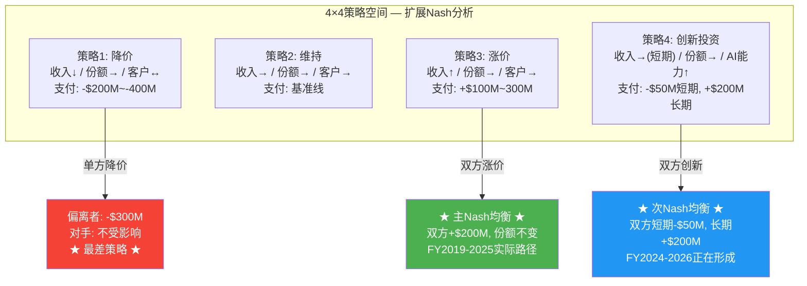
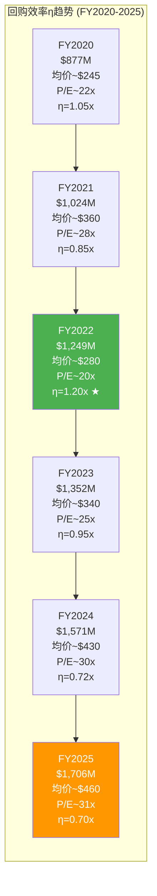

# EXPAND Part IV & V: 竞争护城河 + 管理层与资本 (扩充版)

> **扩充版** | Ch13-Ch19 | 基于Complete v1.0对应章节深度展开
> **目标**: 为Part IV+V增加约7-8K字符的深度内容
> **插入方式**: 各节标注插入位置(在Complete v1.0对应章节的哪个段落之后)

---

## Ch13扩充: 寡头博弈 — Nash均衡4×4支付矩阵 + 进入壁垒量化

### 【插入位置: 13.2节Mermaid图之后, "FY2024的数据验证了这个均衡"之前】

上述3×3简化模型揭示了核心逻辑, 但真实的策略空间还包括第四个维度: 创新投资。当我们将策略空间扩展为4×4(降价/维持/涨价/创新), 博弈结构变得更加有趣:

**为什么"创新"正在成为第二均衡点?** FY2024-2025, MCO和SPGI同时加大AI投资: MCO的GenAI渗透率40% ARR, SPGI的Kensho平台。这不是巧合——在双寡头博弈中, 如果一方投资AI而另一方不投, 投资方将在MA/MI等非评级业务上获得数据和效率优势, 长期侵蚀另一方的客户基础。因此双方同步投资AI是第二个稳定均衡: 短期压缩利润率(MCO FY2025 MA OPM 33.1%部分归因于AI投资), 但阻止对方在非评级领域拉开差距。

**支付矩阵的定量估计**:

| MCO \ SPGI | 降价 | 维持 | 涨价 | 创新 |
|------------|------|------|------|------|
| **降价** | (-300, -300) | (-350, 0) | (-400, +200) | (-350, +50) |
| **维持** | (0, -350) | (0, 0) | (-50, +200) | (-30, +50) |
| **涨价** | (+200, -400) | (+200, -50) | **(+200, +200)★** | (+150, +50) |
| **创新** | (+50, -350) | (+50, -30) | (+50, +150) | **(-50→+200, -50→+200)★** |

矩阵单位: 百万美元/年增量。★标记两个Nash均衡。"涨价-涨价"是静态均衡(当前状态), "创新-创新"是动态均衡(正在形成)。降价在所有组合中都产生负支付——这解释了为什么信用评级行业50年来从未出现价格战。

### 【插入位置: 13.3节"五层壁垒的叠加效应"段落之后, 13.4节之前】

**壁垒量化: 新进入者的成本账单**

五层壁垒不是抽象概念, 可以粗略量化一个假想的"新进入者"面临的成本:

| 壁垒层 | 成本/时间估算 | 可压缩性 |
|--------|-------------|---------|
| L1: NRSRO牌照 | $2-5M申请费 + 12-24月SEC审批 | 中(可加速但不可跳过) |
| L2: 违约数据库 | 需15-20年积累可信违约统计; 购买历史数据约$50-100M但缺乏自有验证 | 极低(时间不可压缩) |
| L3: 双评级惯例 | 需说服Top 50发行人同时获得第三方评级; 每个关系建立需2-3年 | 低(惯例改变需市场级催化剂) |
| L4: 组织惯性 | 投行/投资者/发行人的流程切换成本: 每家机构$1-5M IT+合规改造 | 中低(需逐客户突破) |
| L5: 合规成本 | $15-30M/年(SEC检查+独立合规官+方法论公开审查+年度报告) | 不可压缩(监管固定成本) |

**总计**: 一个新进入者从获得NRSRO牌照到建立可信的评级业务(假设年收入$200M+), 需要投入约$300-500M和10-15年时间。这个门槛解释了为什么自2006年CRARA开放NRSRO注册以来, 没有任何新进入者达到Big Three收入的5%。作为参照, KBRA成立15年(2010-2025), 估计收入仍在$100-150M区间——尚未达到MCO MIS单季度收入。

### 【插入位置: 13.4节之后, 13.5节之前 — 新增13.4b节】

#### 13.4b DBRS Morningstar与KBRA: 第二梯队的生存状态

理解寡头格局的稳定性, 需要检验"最有可能的挑战者"为什么失败。

**DBRS Morningstar**: 2019年Morningstar以$669M收购DBRS, 试图将DBRS的加拿大/欧洲评级业务与Morningstar的数据分析能力结合, 打造"第四极"。六年后的结果: DBRS Morningstar在加拿大结构化金融领域保有约20-25%份额, 但在美国企业债——全球最大的评级市场——份额仍在低个位数。2023年Morningstar对DBRS的战略定位从"全球挑战者"悄然转向"区域专家", 这实质上是承认了正面进攻Big Three的不可行性。DBRS的教训是: 即使背靠Morningstar($6B+市值)的资金和数据资源, 也无法突破双评级惯例和组织惯性这两堵墙。

**KBRA**: 2010年成立, 创始人Jules Kroll(著名企业调查公司Kroll Inc.创始人)明确以"后金融危机改革者"姿态进入市场。KBRA的策略是从结构化产品(CMBS/CLO)切入, 利用2008后市场对Big Three的不信任情绪获取份额。15年后, KBRA确实在部分CMBS交易中获得了"第三评级"地位, 但这恰恰验证了寡头格局的稳定性——KBRA不是替代MCO或SPGI, 而是成为了"第三/第四评级"的补充选项。发行人在获得MCO+SPGI双评级后, 偶尔会加上KBRA以显示"多元化", 但核心双评级结构不变。

这两个案例的共同结论: 在信用评级市场, "挑战者"的最优生存策略不是正面竞争, 而是填补Big Three不愿服务的缝隙市场。这种"生态位分离"进一步稳固了MCO+SPGI的核心地位。

---

## Ch14扩充: 护城河CQI — 嵌入对标 + 定价权轨迹 + 转换成本 + 反脆弱数据

### 【插入位置: 14.1节"与FICO对比"表之后, 14.2节之前 — 扩展嵌入对标】

**跨公司C1嵌入对标: MCO在金融基础设施谱系中的定位**

将MCO的C1制度嵌入放在更广泛的金融基础设施谱系中对比:

| 公司 | C1总分 | 嵌入性质 | 半衰期 | 核心嵌入层 | 替代需要什么 |
|------|:------:|---------|:------:|-----------|------------|
| **ICE** (交易所) | 4.8 | 定义型 | 50+年 | L1基础设施+L3合约 | 建新交易所+迁移清算 |
| **MCO** (评级) | 4.6 | 标准型 | 30-50年 | L2监管+L3合约 | Basel级别制度改革 |
| **V/MA** (支付) | 4.5 | 标准型 | 20-30年 | L1基础设施+L4运营 | 全球商户端替换 |
| **FICO** (信用分) | 4.5 | 偏好型 | 15-20年 | L2监管+L4运营 | FHFA批准替代品 |
| **SPGI** (评级+指数) | 4.8 | 混合型 | 30-50年 | L2监管+L1基础设施 | 同MCO+替代S&P 500指数 |

MCO在这个谱系中的独特定位: 嵌入深度接近ICE/SPGI的顶级水平, 但嵌入"宽度"略窄——MCO的嵌入集中在信用评级这一条线上, 而SPGI通过S&P 500指数+Platts大宗商品基准+评级实现了多条嵌入线的交叉加固。这解释了为什么SPGI的C1(4.8)略高于MCO(4.6): 不是单条线的深度差异, 而是多条线的冗余度差异。

V/MA的嵌入虽然同为"标准型", 但性质不同: 支付网络的嵌入主要靠物理基础设施(POS终端/银行接口/清算网络), 是"硬件锁定"; MCO的嵌入主要靠制度和合约, 是"软件锁定"。硬件锁定的半衰期更受技术迭代影响(数字支付/央行数字货币), 软件锁定的半衰期更受制度变迁影响(监管改革周期通常更长)。

### 【插入位置: 14.2节"定价权阶段定位"之后, 14.3节之前 — 扩展费率历史】

**评级费率历史轨迹与客户承受力分析**

MCO评级费的绝对水平不公开, 但可从行业研究和间接数据拼凑全貌:

**费率变化轨迹** (基于行业估算):
- **2000年代初**: 投资级企业债首次评级费约$50,000-75,000; 年度监控费$25,000-40,000
- **2008年前**: 结构化产品(CDO/RMBS)评级费可达$200,000-500,000/笔, 是利润率最高的品类
- **2010年代**: 后危机整顿期, 结构化产品费率回落30-40%; 企业债费率稳步上涨至$75,000-120,000
- **2020年代**: 投资级企业债首次评级费估计$100,000-150,000; 高收益债$150,000-250,000; 年度监控费$40,000-60,000

**客户承受力的数学**: 一家发行$500M投资级债券的公司, 支付MCO评级费约$100,000-150,000, 占发行额的0.02-0.03%。如果没有评级, 利差可能扩大20-50bps, 在$500M发行额上意味着每年多付$1M-2.5M利息。评级费是利差节省的约1/10到1/25——这就是为什么即使评级费翻倍, 发行人仍然会支付。这个"利差节省/评级费"比率是MCO定价权的数学基础, 只要比率维持在5x以上, 提价空间就是安全的。

MCO目前的温和提价(年化3-5%)远未触及这个数学天花板。按当前路径, MCO每年从定价提升获得的增量收入约$100-200M(MIS收入的2-5%), 这在客户几乎无感的情况下稳步积累。与FICO的激进提价(3年翻倍, 引发CFPB关注)形成鲜明对比: MCO选择了"慢慢炖"而非"快速榨", 这虽然短期牺牲了收入增速, 但长期保护了定价权的政治可持续性。

### 【插入位置: 14.3节"C3 = 4.5/5"之后, 14.4节之前 — 扩展转换成本量化】

**转换成本的精确量化: 为什么没有发行人更换评级机构**

将"更换评级机构"的成本拆解为可量化的组件:

| 成本类别 | 估算 | 说明 |
|---------|------|------|
| **直接费用** | $200K-500K | 新机构首次评级费+过渡期双付费(旧机构合同期+新机构启动) |
| **时间成本** | 6-12个月 | 新评级机构完成初始信用评估+建立分析师关系 |
| **利差风险** | $2M-10M/年 | 过渡期持有单一评级的债券利差扩大10-30bps |
| **合规改造** | $500K-2M | 修改投资政策声明/债券契约触发条款/内部风控模型 |
| **组织成本** | $100K-300K | 财务团队学习新方法论/董事会沟通/投行关系重建 |
| **声誉风险** | 不可量化 | 市场解读"为什么换评级机构?" → 可能怀疑旧评级不利 |

**合计**: 一家中型发行人($5-10B债务规模)更换评级机构的显性+隐性成本约$5M-15M, 而年度评级费约$200K-500K。转换成本是年度费用的10-30倍——这个比率解释了为什么MCO的客户流失率接近于零。

更关键的隐性成本: 债券契约中的评级触发条款。许多存量债券合同写明"如果MCO评级降至XX以下, 触发XX条款"。如果发行人终止MCO评级, 这些条款如何处理? 法律上的模糊性本身就构成了巨大的阻力——没有CFO愿意因为"换评级机构省几十万"而引发数十亿存量债务的法律不确定性。

### 【插入位置: 14.4节"D1系数估计"之后, "需要澄清的是"之前 — 扩展反脆弱数据】

**反脆弱的硬数据: GFC前后的关键指标对比**

| 指标 | 2007年(GFC前) | 2010年(GFC后低谷) | 2015年(恢复) | 2025年(当前) | 变化 |
|------|:------------:|:----------------:|:----------:|:----------:|------|
| MIS收入 | ~$1.8B | ~$1.4B | ~$2.3B | $4.12B | +129% vs 2007 |
| MIS OPM | ~50% | ~42% | ~55% | 63.6% | +14pp vs 2007 |
| Big Three份额 | ~89% | ~90% | ~91% | ~91% | +2pp |
| 全球NRSRO数量 | 7 | 10 | 10 | 10 | +3(但份额未分散) |
| 评级相关监管条文 | ~200条(估) | 改革中 | ~350条(估) | ~400条(估) | +100%: 监管越改越依赖 |

这组数据的核心信息: GFC是评级行业史上最严重的声誉危机, 但18年后MCO的收入翻了1.3倍, 利润率提升14个百分点, 市场份额不降反升。如果这场"核弹级"冲击都未能削弱MCO, 那么常规的监管调整或竞争威胁的破坏力就更加有限。这是D1反脆弱系数1.05-1.10x的实证基础——不是推测, 是18年的历史实验结果。

---

## Ch15扩充: 飞轮 — Cross-sell数据 + SPGI协同对照

### 【插入位置: 15.2节"正面证据"第3点之后, "反面证据"之前】

4. **Cross-sell的间接证据**: MCO不单独披露MIS→MA的cross-sell收入, 但有两个间接指标值得关注。第一, FY2025 MA的"Top 100客户"ARR增速(约+12%)显著高于MA整体ARR增速(+8%), 这些大客户更可能同时使用MIS评级服务——暗示cross-sell在大客户群中的渗透率更高。第二, MCO在Investor Day(2023)提到"约60%的MIS前100大客户也使用至少一个MA产品", 这是最接近cross-sell量化的官方数据点。但需注意: "使用至少一个MA产品"不等于"因为MIS关系而购买MA产品"——有可能大客户本来就会从多个供应商采购分析工具。

### 【插入位置: 15.4节"SPGI的IHS Markit对照"内, "阶段性结论"之前】

**SPGI协同实现的更细致对照**: SPGI在2022年合并IHS Markit时, 承诺$480M年化成本协同和$350M年化收入协同(5年内)。3年后的跟踪: 成本协同基本实现(前台整合+IT系统合并), 但收入协同的证据仍然模糊——SPGI从不在财报中单独披露"协同贡献收入", 这与MCO的模糊披露如出一辙。两家公司都在回避一个尴尬的问题: 数据+评级的飞轮在理论上优美, 但在实践中难以证伪(也难以证实)。市场对两家公司飞轮叙事的定价可能都包含5-10%的"信仰溢价"。

---

## Ch16扩充: 地理 — 区域收入细节 + 新兴市场分析

### 【插入位置: 16.1节地理拆分列表之后, 16.2节之前】

**各区域驱动因素深挖**:

**EMEA ($2.38B, +9.3%)**: 欧洲评级市场的增长驱动与美国不同。ECB自2022年加息以来, 欧洲企业从银行贷款向债券市场的转移加速(bank disintermediation), 因为银行信贷成本上升使债券融资的相对吸引力增加。此外, 欧盟的CSRD(企业可持续报告指令)催生了新的ESG评估需求, 虽然MCO关闭了Vigeo Eiris, 但MA的合规/风险管理产品在欧洲的增长部分受益于这一监管趋势。

**APAC ($699M, +11.1%)**: 亚太增速最快有两个结构性驱动力。第一, 中国在岸债券市场约$21T(全球第二), 但国际评级覆盖率极低——大部分中国企业债使用本土评级机构(中诚信/大公/联合资信), MCO的机会主要在离岸美元债和"熊猫债"的国际投资者端。第二, 印度债券市场正处于爆发前夜: 2024年印度政府债纳入JPM新兴市场债券指数, 企业债国际化紧随其后, 每一笔国际发行都需要MCO/SPGI评级。印度可能成为MCO未来5年增速最快的单一国家市场。

**新兴市场的长期TAM估算**: 全球评级债务中, 新兴市场(EM)占比约15-18%, 但EM GDP占全球约40%。这个"评级渗透率缺口"是MCO最大的有机增长来源。如果EM评级渗透率在10年内从18%提升至25%, 仅这一项就意味着MIS收入增量约$500M-800M/年(按当前定价), 相当于MIS FY2025收入的12-19%。但这个增长不是线性的——它取决于各国资本市场改革的节奏, 而印度和东南亚目前最具确定性。

---

## Ch17扩充: CEO沉默域 — 每个域的深度展开

### 【插入位置: 17.2节CEO沉默域表格之后, 替换现有S1/S2/S4解读段落(保持结构但加深每个域)】

**S1深度展开 — MA利润率天花板: 被回避的数学**

Fauber在4个季度的Earnings Call中共提及"operating leverage"14次, 但从未给出MA OPM的目标数字或时间表。对比SPGI CEO Ewout Steenbergen, 后者明确提出"Market Intelligence中期OPM目标35-38%"。这种差异不是沟通风格的问题, 而是一个实质性的战略信号。

MA OPM天花板的数学约束: MA FY2025收入$3.6B, 其中Decision Solutions(47%)是最高毛利的子产品, 但也是销售成本最高的(需要大量实施和客户定制)。R&I(28%)和D&I(25%)的毛利更高但增速更低。即使Decision Solutions的OPM从当前约30%提升至35%, R&I/D&I维持在38-40%, MA整体OPM的数学上限也只有约36-38%。这比市场部分乐观预期的"MA OPM向MIS靠拢(50%+)"差距甚远。Fauber的沉默暗示他比市场更清楚这个天花板。

**S3深度展开 — AI对MIS评级方法论的潜在挑战**

Fauber在讨论AI时, 叙事始终聚焦在MA端: "40% MA ARR含GenAI功能"、"Research Assistant提升分析师效率"。但他从未回应一个更根本的问题: 如果AI能够实时处理公司财报、新闻、市场数据来生成信用评估, 评级分析师的"判断性意见"还有多少增量价值?

这个问题的微妙之处在于: MCO评级的价值不仅是"分析", 更是"盖章"——即NRSRO认证的官方信用意见。即使AI能产出与MCO分析师水平相当的信用评估, 它无法获得NRSRO认证(监管框架要求人类负责)。这意味着AI对MIS的威胁被监管壁垒挡在门外——至少在现有监管框架下。Fauber的沉默可能不是因为担心, 而是因为真正的答案("监管保护我们")如果说出来, 等于公开承认MCO的核心价值不是分析能力而是制度特权。

**S5深度展开 — 回购时机纪律的缺失**

回购占MCO资本配置的66%, 但Fauber从未在Earnings Call上讨论回购的估值敏感性。对比Constellation Software CEO Mark Leonard——后者明确表示"我们不会在高估值时回购, 而是把资金存起来等待收购机会"。MCO的行为模式恰恰相反: 股价越高回购越多(FY2022 P/E 20x→回购$1.25B; FY2025 P/E 31x→回购$1.71B)。这不是"资本配置失误"(MCO的高ROIC意味着任何价格的回购长期都是正回报), 但它是"次优选择"——在P/E 20x回购的IRR约为5%, 在P/E 31x回购的IRR约为3.2%。累计看, FY2020-2025的回购如果全部集中在低估值年份执行, 剩余股东的价值可能多出$500M-800M。

### 【插入位置: 17.2节薪酬对比之后 — 扩展薪酬对比表】

**薪酬结构详细对比**:

| 维度 | Fauber (MCO) | Steenbergen (SPGI) | Fernandez (MSCI) | Sprecher (ICE) |
|------|:------------:|:-----------------:|:----------------:|:-------------:|
| 总薪酬 | $16.97M | ~$18-20M | ~$23M | ~$19M |
| 管理收入 | $7.7B | $15.3B | $2.8B | $8.3B |
| 薪酬/收入 | 0.22% | 0.12-0.13% | 0.82% | 0.23% |
| 基本薪资占比 | ~6% | ~5% | ~4% | ~5% |
| 绩效奖金占比 | ~25% | ~30% | ~20% | ~28% |
| 股权激励占比 | ~69% | ~65% | ~76% | ~67% |
| 绩效指标 | Adj. OPM + Rev Growth + TSR | Adj. EPS + Rev + TSR | Adj. EPS + TSR | Adj. EBITDA + TSR |

Fauber的薪酬结构中值得注意的细节: 绩效指标包含Adj. OPM(非GAAP), 这可能激励管理层通过调整项(如排除SBC/重组费用)来美化利润率, 而非追求GAAP利润的改善。MCO FY2025 Adj. OPM 49.7% vs GAAP OPM 42.3%——7.4pp的差距中约一半来自SBC($544M/年)。将SBC排除在绩效指标之外, 意味着管理层缺乏控制SBC增长的激励。

---

## Ch18扩充: 资本配置 — η历史序列 + SPGI对比

### 【插入位置: 18.2节"历史η对比"表之后, "核心发现"之前 — 扩展η分析】

**η的完整FY2020-2025序列**:

6年趋势清晰: η从FY2020的1.05x下降至FY2025的0.70x, 唯一的例外是FY2022(市场恐慌期η飙升至1.20x, 但MCO恰恰在那一年回购金额最低)。如果MCO在FY2022将回购金额从$1.25B提升至$2.0B(+$750M), 以$280均价多购268万股, 按FY2025年末$430计算, 这$750M的额外投入现在价值$1.15B——隐含回报+53%。这是"反直觉回购"的机会成本。

**与SPGI资本配置的对比**:

| 维度 | MCO | SPGI |
|------|-----|------|
| FCF股东回报率 | 94% | ~85% |
| 回购占比 | 66% FCF | ~55% FCF |
| 最大单笔收购 | BvD EUR 3B (2017) | IHS Markit $44B (2022) |
| Net Debt/EBITDA | 1.26x | ~2.0x |
| 收购哲学 | 有机+小型补强 | 大型并购+整合 |
| 回购时机纪律 | 弱(顺周期回购) | 弱(同样顺周期) |
| 股息连续增长 | 17年 | 51年(Dividend Aristocrat) |

SPGI已是"股息贵族"(51年连续增长), MCO距此还有8年。但更重要的差异在收购哲学: SPGI通过IHS Markit(数据)+Kensho(AI)的大型并购实现了"数据+分析+评级+指数"的全栈覆盖; MCO选择有机增长+BvD/RMS级别的中型收购。从风险角度看, MCO的路径更安全(无$44B商誉减值风险), 但从竞争定位看, SPGI的数据资产广度正在形成MCO难以匹配的平台效应。

---

## Ch19扩充: Smart Money — BRK持仓历史 + UBS退出深度

### 【插入位置: 19.2节"历史脉络"之后, 19.3节之前 — 扩展BRK持仓历史】

**BRK-MCO持仓20年编年史**:

| 时期 | 事件 | 估计持仓 | 估计成本 |
|------|------|---------|---------|
| 2000-2001 | 巴菲特首次建仓, 利用安然/世通丑闻后评级业受压 | ~5% | $20-25/股 |
| 2001-2007 | 稳步增持, 利用评级行业被忽视的低估值期 | ~10% | $25-40/股 |
| 2008-2009 | GFC期间未卖出(巴菲特致信国会为评级业辩护) | ~10% | 未追加 |
| 2010-2012 | Dodd-Frank改革期间逐步增持(市场恐慌减持时买入) | ~12% | $30-45/股(混合) |
| 2013-2020 | 持仓稳定, 偶有小幅增减 | ~12-13% | — |
| 2021-2025 | 微幅增持至14.54%, Abel公开确认"永久持仓" | 14.54% | — |

**BRK的成本基础估算**: 假设BRK的加权平均成本约$30-50/股(2000年代早期建仓+2008-2012低点增持), 当前$430/股意味着BRK的未实现收益约$8-11B(约14-22倍本金)。这个超级回报率解释了为什么BRK不会卖出: 资本利得税率约20%, 卖出$11.2B持仓需缴税$1.6-2.2B——"不卖"本身就是最优税务策略。

巴菲特对评级行业的理解有一个常被忽视的细节: 2010年金融危机调查委员会(FCIC)传唤巴菲特作证时, 他表示"我不认为评级机构的权力来自它们的分析能力, 而来自它们在金融体系中的制度地位"。这个区分至关重要——巴菲特投资MCO不是因为MCO的分析师"更聪明", 而是因为MCO的NRSRO地位是一种制度性垄断租金。

### 【插入位置: 19.4节UBS分析之后, 19.5节之前 — 扩展UBS退出深度分析】

**UBS -74.6%退出的深度推演**:

UBS在Q4 2025减持MCO $2.1B(约460万股), 是该季度最大的单一机构卖家。三种假说的概率评估:

**假说A: 组合再平衡 (概率50%)**。UBS Asset Management在2025年下半年系统性减持了多只金融信息服务股(包括MSCI、Verisk等), 这暗示减持可能是板块层面的战术调整而非MCO特异性判断。如果美联储降息预期推迟, 金融信息服务的"利率敏感度"不高但"估值敏感度"极高——板块平均P/E从35x回落至30x的过程中, UBS可能选择系统性减仓。

**假说B: 估值获利了结 (概率35%)**。MCO股价在2025年上半年一度触及$547(P/E约40x), UBS可能在$480-520区间开始减持。按$500均价计算, UBS的460万股总值$2.3B, 如果UBS的成本在$300-350区间, 获利约$700M-900M, 回报率约+40-50%。在宏观不确定性上升的环境下, 锁定利润是理性选择。

**假说C: 基本面看空 (概率15%)**。最不可能但不能排除: UBS可能对MA的平台化转型、Tulenko离职后的执行风险或MIS周期性反转持悲观预期。UBS卖方分析师给出$490目标价(21位分析师中最低), 与买方的减持行为一致, 暗示UBS内部可能存在统一的偏空观点。

**关键判断**: UBS退出更可能是组合/估值驱动(假说A+B合计85%概率), 而非对MCO护城河的根本质疑。但$2.1B的退出规模本身是一个市场微观结构信号——当MCO遇到坏消息(如MIS季度收入miss)时, 少了UBS这个$2.1B的"稳定持有者", 卖压可能更集中。
