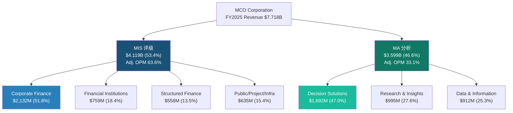
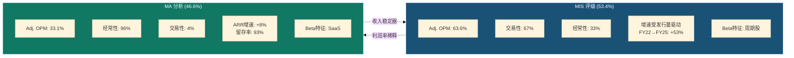

# S01: 公司概览 — MCO的双重人格

> Phase 1 Staging | 目标: 15-18K字符 | DM锚点驱动
> 核心命题: MCO不是"纯信息服务公司"，而是"半周期股(MIS)+半SaaS(MA)"的混合体

---

## Ch01: 公司本质 — "一句话MCO"

**Moody's Corporation是全球信用评级双寡头之一，同时运营着一个快速扩张的信用分析SaaS平台。**

这一句话包含两个截然不同的生意，也是理解MCO估值的起点。评级业务(MIS)像收费站——每一笔公开债务发行都必须经过Moody's或S&P Global的"盖章"；分析业务(MA)像企业软件——银行、保险公司、基金经理每年续费使用信用风险模型和数据库。前者赚的是交易佣金，后者赚的是订阅费。前者随债券发行量剧烈波动，后者月月到账、旱涝保收。

市场倾向于把MCO归类为"信息服务公司"，给出31.5x P/E [DM-VAL-003]——一个更接近MSCI(35x)而非周期股的倍数。但如果你拆开引擎盖，会发现MCO有36%的收入来自交易性评级费(MIS交易性67% [DM-SEG-004] × MIS收入占比53.4% [DM-SEG-001])，这部分收入在FY2022曾单年缩水超过12% [DM-FIN-011]。这不是一家典型"信息服务公司"该有的波动率。

### 关键转折点: 从手册出版商到数据帝国

MCO的117年历史浓缩为四个转折：

1. **1909年 — John Moody出版《Moody's Manual》**: 以铁路债券评级起家，"评级"这个概念从此诞生。这是信息中介最原始的形态——把复杂的信用分析简化为字母等级。

2. **2000年 — 从Dun & Bradstreet拆分独立上市**: MCO作为纯粹的评级公司开始独立运营。拆分前的D&B是个杂货铺(商业信息+信用评级+市场研究)，拆分让MCO聚焦于最高利润率的评级业务。

3. **2007-2008年 — 金融危机与声誉重建**: 次贷危机中，Moody's因对结构化产品评级过于宽松遭受重创——股价从高点跌去70%+，面临国会听证和巨额诉讼。危机后Moody's重建信誉，同时推动Dodd-Frank法案下的NRSRO监管体系，反而巩固了寡头格局：10家注册NRSRO中，Big Three占据91%收入 [DM-MKT-001] [DM-MKT-002]。危机本应是评级机构的末日，却意外成为护城河的加固工程。

4. **2017-2021年 — MA的平台化豪赌**: Bureau van Dijk(€3B, 2017) [DM-ACQ-001]带来6亿+实体数据库，RMS($2B, 2021) [DM-ACQ-002]带来保险风险建模能力。两笔收购把MA从"评级附属品"变成独立的分析平台，也把MCO的商誉推高至$6.4B [DM-BAL-003]——占总资产52%。这是一场不可逆的转型：MCO赌的是"评级+分析"的飞轮效应，赌注是资产负债表上超过80亿美元的商誉加无形资产。

### 核心命题的战略含义

MCO管理层反复讲述的叙事是"Integrated Risk Assessment"——MIS的评级数据喂养MA的分析模型，MA的客户关系反哺MIS的评级需求。如果这个飞轮是真的，MCO值得比MIS和MA简单加总更高的估值。如果飞轮只是投资者叙事，MCO就是两个不同生意的拼盘——一个波动率极高的评级业务拖着一个增速平庸的SaaS业务。这是CQ-3的核心争论，也贯穿整份报告。

这里有一个关键对照: SPGI在2022年完成了IHS Markit合并，走的是"更宽"路线(Indices+Market Intelligence+Commodity Insights+Mobility)；MCO走的是"更深"路线——围绕信用风险这一垂直领域，从评级延伸到分析工具再到工作流。两条路线谁更优，取决于信用风险分析是否是一个足够大的"护城河领地"来支撑两个引擎。FY2025全球评级债务规模>$6.6T [DM-MKT-003]，公司债+银团贷款更是达到$13.7T(历史新高)——这个市场的绝对规模给出了初步答案: 信用风险是金融市场的基础设施级需求，不会消失。问题不在于需求是否存在，而在于MCO能否在评级之外(MA)同样建立起不可替代性。

### AI: 加速器还是搅局者?

MCO在AI上的投入值得Ch01就提及，因为它正在改变MIS和MA的交互方式。FY2025已有40%的MA ARR(约$1.4B)含GenAI功能 [DM-AI-001]。CreditLens的AI升级实现了+67% ARPU提升 [DM-AI-002]。更引人注目的是GenAI/AgenTix客户群体的表现——97%留存率(vs MA整体93%)，增速是MA整体的2倍 [DM-AI-003]。这些数据暗示: AI不仅是效率工具，还在成为一个定价权放大器——愿意为AI功能付费的客户粘性更高、钱包份额更大。

但AI也是潜在威胁。MIS受NRSRO监管保护，AI短期内无法替代"监管认证"的评级意见。MA则不同——Bloomberg Terminal、Refinitiv、甚至初创公司都在用AI重构信用分析工作流。MCO的防守策略是"数据护城河"——600M+实体数据库(BvD)+百年评级历史数据，这些是训练信用风险模型的独特原材料。但这个护城河的持久性需要持续评估(CQ-5)。RiskTech100连续4年排名第一 [DM-MKT-007]提供了当前竞争力的证据，但排名是滞后指标，不是领先指标。

---

## Ch02: 财务全景 — 6年P&L桥接

### 一张表看清MCO的周期DNA

| 财年 | 收入 | YoY | 营业利润 | OPM(GAAP) | 净利润 | EPS(d) | FCF | FCF/NI |
|------|------|-----|----------|-----------|--------|--------|-----|--------|
| 2020 | $5.371B | — | $2.447B | 45.6% | $1.778B | $9.39 | $2.043B | 114.9% |
| 2021 | $6.218B | +15.8% | $2.844B | 45.7% | $2.214B | $11.78 | $1.866B | 84.3% |
| 2022 | $5.468B | **-12.1%** | $1.997B | **36.5%** | $1.374B | **$7.44** | $1.191B | 86.7% |
| 2023 | $5.916B | +8.2% | $2.221B | 37.5% | $1.607B | $8.73 | $1.880B | 117.0% |
| 2024 | $7.088B | +19.8% | $2.971B | 41.9% | $2.058B | $11.26 | $2.521B | 122.5% |
| **2025** | **$7.718B** | **+8.9%** | **$3.455B** | **44.8%** | **$2.459B** | **$13.67** | **$2.575B** | **104.7%** |

*来源: [DM-FIN-001]~[DM-FIN-011], [DM-CF-001]~[DM-CF-006]*

### 三个关键阅读角度

**角度一: FY2022是照妖镜。** 当债券发行量萎缩时，MCO收入跌12%、EPS跌37%($11.78→$7.44)、OPM从46%暴跌至37%。EPS跌幅是收入跌幅的3倍——这是经营杠杆在周期底部的放大效应。对于一家被按"稳定增长"定价的公司，这种波动率值得铭记。

**角度二: FY2025的OPM(44.8%)还没回到FY2021(45.7%)。** 收入绝对值已比FY2021高出$1.5B(+24%)，但OPM反而低了0.9个百分点。原因不是运营效率变差，而是业务混合发生了结构性变化：FY2021 MIS占比61% → FY2025仅53.4% [DM-SEG-001]。MA的利润率(Adj. OPM 33.1% [DM-SEG-003])不到MIS(63.6%)的一半。MA越成功、增长越快，MCO的总体OPM天花板就越低。这是CI-MCO-001"利润率混合陷阱"的核心证据。

**角度三: FCF质量是真正的亮点。** FY2025 FCF/NI = 104.7% [DM-CF-006]，6年平均~105%。这意味着MCO的净利润几乎可以1:1转化为自由现金流——CapEx仅$326M(收入的4.2%) [DM-CF-003]，应收账款管理高效，没有大规模资本支出需求。这是轻资产模型的标志性特征，也是MCO能持续回购+分红的底气。

### Adj. OPM vs GAAP OPM: 一个7个百分点的争议

FY2025 Adj. OPM 51.1% vs GAAP OPM 44.8% [DM-FIN-004]——差异主要来自收购无形资产摊销(D&A $480M [DM-FIN-008]，其中约$300M+为收购相关)。管理层FY2026指引也是Adj. basis: 52-53% [DM-GD-003]。

问题在于如何看待这$300M+的摊销。如果BvD的数据库和RMS的风险模型是MCO MA业务的核心资产，那这些无形资产的"消耗"是真实的经济成本——需要持续投入(收购或内部开发)来维持竞争力。用Adj. OPM忽略这部分成本，等于假设这些资产可以永续使用而不折旧。D&A从FY2022的$331M升至FY2025的$480M(+45%) [DM-FIN-008]，而商誉仅增加9% [DM-BAL-003]——摊销加速但商誉平稳，意味着收购的无形资产正在被消化，未来需要新的收购来补充。

本报告的处理方式: GAAP OPM作为主要参考，Adj. OPM作为辅助。在估值模型中对收购摊销做部分加回(50%)，既不完全忽略也不完全计入。

### FY2026指引: 管理层的乐观与隐忧

管理层给出FY2026指引: Adj. EPS $16.40-$17.00 [DM-GD-001]，隐含+20-24% YoY增长(vs FY2025 Adj. EPS $14.94 [DM-CON-003])。支撑这个预测的关键假设:
- 高个位数收入增长
- Adj. OPM扩张至52-53% [DM-GD-003]
- 回购~$2.0B [DM-GD-004]
- FCF $2.8-3.0B [DM-GD-002]

隐忧: 指引隐含MIS收入持续强劲(FY2025已是周期高峰)，但衰退概率Zandi给42-48% [DM-RSK-003]，Polymarket给34.5% [DM-PMK-001]。如果2026年下半年发行量收缩(杠杆贷款违约率已升至7.9%，是历史均值2倍 [DM-RSK-002])，这个指引的中枢$16.70可能需要下修。

### 资本配置: 高效还是奢侈?

FY2025资本回报全景: 回购$1.706B [DM-CF-004] + 分红$701M [DM-CF-005] = 股东回报$2.407B，占FCF的93.5%。公司几乎把所有自由现金流都还给了股东，留存极少用于有机投资(CapEx仅$326M [DM-CF-003])。

回购效率是一个必须审视的问题。FY2025平均回购价格大约在$450-480区间(以$1.706B购回约3-4M股估算)，对应P/E ~33-35x。回购的EPS增厚效应约1%/年(流通股从184.7M→179.9M，5年净减少~2.6%)。在31x P/E下，回购隐含回报率(earnings yield)仅3.2%，这远低于MCO自身的ROIC(>30%)。换言之，如果MCO能找到高回报的有机投资或收购标的，回购是次优选择。但评级业务的特点是: 几乎不需要资本投入就能扩大产能(边际成本≈0)，所以MCO事实上没有大规模资本部署的"出口"。回购可能不是最优解，但在缺乏更好替代的情况下，它至少比让现金闲置好。

累计回购已达$13.302B [DM-BAL-005]，直接导致有形账面价值为-$4.0B [DM-BAL-004]。这不是财务困境的信号——对于轻资产、高FCF的商业模型，负权益是回购的数学结果，不是偿付能力问题。利息覆盖18.3x [DM-FIN-007]、Net Debt/EBITDA 1.26x [DM-BAL-002]提供了充分的安全边际。

---

## Ch03: 双引擎架构 — MIS vs MA深度拆分

MCO的估值争论最终归结为一个问题: MIS和MA各值多少? 这两个分部有着截然不同的商业特征、增长曲线和利润结构。

### MIS: 收费站经济学

MIS FY2025收入$4.119B [DM-SEG-001]，Adj. OPM 63.6% [DM-SEG-003]，Q1 2025单季度Adj. OPM甚至达到66% [DM-SMT-004]。这是一个接近软件级别的利润率，但驱动逻辑完全不同——MIS的高利润率来自"双寡头税"(duopoly rent)，不来自规模经济。

**资产类别拆分(FY2025)**:
- **企业金融(Corporate Finance)**: $2,132M(51.8%)——最大引擎，受投资级和高收益债发行量直接驱动。FY2022→FY2025从$1,269M增长68%，弹性最高 [DM-SEG表]
- **金融机构**: $759M(18.4%)——银行和保险公司评级，增长较稳定(+10% YoY)
- **结构化产品**: $558M(13.5%)——CLO/CMBS/RMBS等，波动大但2008后缩水为较小比重
- **公共/项目/基建**: $635M(15.4%)——市政债+项目融资，受基建法案和绿色债券推动增长

**交易性vs经常性: 67:33** [DM-SEG-004]。这意味着MIS每年$2.76B收入来自新发行的"一次性"评级费用。发行量好的年份(FY2021/2024/2025)这是印钞机；发行量差的年份(FY2022)这是利润黑洞。

经常性33%($1.36B)主要来自年度监控费(surveillance fees)——已评级债务只要存续，就要每年交监控费。这部分是"后付费护城河"：过去20年积累的评级存量越大，经常性收入基数越稳。但注意:新增评级在放缓时，经常性收入增速也会延迟放缓(12-18个月后)。

**资产类别增长弹性(FY2022→FY2025 CAGR)**:
- Corporate Finance: $1,269M→$2,132M, CAGR +18.8%——弹性最大，也是衰退时收缩最猛的部分
- Financial Institutions: $491M→$759M, CAGR +15.6%——银行再融资+并购驱动
- Public/Project/Infra: $431M→$635M, CAGR +13.8%——基建法案+绿色债券的结构性增长
- Structured Finance: $462M→$558M, CAGR +6.5%——2008后天花板明显更低

这个弹性谱系很重要: Corporate Finance占MIS收入52%且弹性最高，意味着MIS的周期波动主要由投资级和高收益债发行量决定。FY2025全球发行量创历史新高 [DM-MKT-003]，这是好消息也是警报——从高峰回落是概率事件，不是黑天鹅。32%美国上市公司处于"严重信用风险"早期预警(疫后最高) [DM-RSK-004]，暗示下一轮衰退的MIS收入缩幅可能不亚于FY2022。

### MA: SaaS的理想与现实

MA FY2025收入$3.599B [DM-SEG-002]，Adj. OPM 33.1% [DM-SEG-003]，ARR $3.498B [DM-SEG-006]，留存率93% [DM-SEG-007]。

**三条产品线**:
- **Decision Solutions($1,692M, 47%)**:  最大且增长最快的引擎。包含KYC(反洗钱/合规检查，ARR +15% [DM-AI-004])、CreditLens(信贷审批平台，+20% ARPU提升 [DM-AI-002])、Banking Cloud、Insurance(RMS风险模型，达到$150M增量收入目标 [DM-ACQ-002])。这是MA向"工作流嵌入"转型的主战场。
- **Research & Insights($995M, 28%)**: 传统信用研究和经济预测(Mark Zandi的宏观预测属于这部分)。增速+8%，稳健但不激动人心。
- **Data & Information($912M, 25%)**: BvD数据库+Orbis公司信息。增速+7%，属于基础设施级数据资产。

**93%留存率的两面性**: 93%在SaaS世界是"良好"(Good)而非"卓越"(Great)。Tier 1企业SaaS(如Veeva、ServiceNow)留存率在95%+甚至97%+。MCO的7%年流失意味着MA每年需要新签+扩展约$525M收入(ARR的~15%)才能维持8%净增长。如果留存率滑落至90%(仅3个百分点)，在相同新签速度下ARR增速将从8%降至5%。留存率是MA估值最敏感的输入变量，幸运的是MCO提供了硬数据(vs SPGI的推断95%+)。

**剥离信号与有机增速真相**: 管理层已剥离Learning Solutions(2025年12月)并计划剥离Regulatory Reporting(2026年) [DM-ACQ-004]，合计约180bps MA增速拖累。这是积极信号——剥离低增长/低利润率业务可以提升MA整体质量。但反面解读是: 剥离后MA的报告增速会因基数效应短期承压，FY2026的MA有机增速需要在+8%基础上加回180bps才是"同口径"对比。

**MA的预收收入信号**: FY2025递延收入(current)达到$1.582B [DM-BAL-007]，接近MA单季度收入($900M)的1.75倍。这是经常性收入质量的"预付证据"——客户预付的订阅费越多，未来收入确认的确定性越高。递延收入规模也意味着MA的真实经济活动领先于会计确认，为分析师预测提供了内置的"能见度缓冲"。

### MIS/MA对比: 一张图说清核心矛盾

**核心矛盾(CI-MCO-001证据链)**:

FY2026指引Adj. OPM 52-53% [DM-GD-003]，分部指引MIS ~65%、MA 34-35%。假设MA增速持续>MIS增速(MA +8% vs MIS长期~5-7%)，到FY2030 MA占比可能从47%升至52-55%。在该混合比下，即使两个分部各自OPM不变，MCO总体Adj. OPM将从52%下降至50%以下:

- **情景测算**: MA 55%×35% + MIS 45%×65% = 19.3% + 29.3% = **48.5%**

这不是运营失败，而是数学必然。MA增长越快、MCO的利润率混合(margin mix)越不利。管理层的52-53%指引能否维持3年以上，取决于MA OPM能否从33%扩张至37-38%——这需要费用杠杆+AI效率同时兑现，并非低风险假设。

**反驳空间**: 管理层FY2026指引MA OPM 34-35% [DM-GD-003]，暗示+100-200bps扩张方向。驱动力包括: (1)GenAI嵌入产品后的人力成本替代(当前40% ARR已含AI功能 [DM-AI-001])；(2)剥离低利润率业务(Learning Solutions+Regulatory Reporting [DM-ACQ-004])提升存量质量；(3)BvD/RMS整合完成后收购摊销的自然递减。如果MA OPM能以每年+100bps的速度扩张(从33%→38%用5年)，CI-MCO-001的冲击将被延缓——但不会被消除。即使MA达到38%，在55%占比下的MCO整体Adj. OPM仍仅为: 55%×38% + 45%×65% = 20.9% + 29.3% = 50.2%，低于当前52%水平。利润率混合陷阱是MCO的结构性约束，不是管理层能"执行掉"的问题。

### 私人信贷: 增量还是替代?

一个必须正面回答的问题: 私人信贷TAM从$2T扩至$4T(2030E) [DM-MKT-004]，MCO私人信贷相关收入FY2025 +75% [DM-MKT-005]，MSCI合作的EDF-X模型已上线 [DM-MKT-006]。

但CI-MCO-003提出了一个非共识视角: 如果私人信贷永久替代部分公开债务市场，MIS的核心TAM(公开债务评级)会缩水。MCO通过MA的分析工具赚取私人信贷收入(单笔ARPU较低)，可能无法1:1弥补MIS损失的评级收入(单笔ARPU极高)。这是一个需要在Phase 2量化的关键变量。

**MCO的应对**: MSCI合作是关键棋子。EDF-X模型+MSCI私募数据(2,800+基金/14,000+公司) [DM-MKT-006]试图为私人信贷资产提供"类评级"的信用评估——不是正式评级(不走MIS的NRSRO流程)，而是分析评分(走MA的SaaS流程)。这笔收入归MA(订阅模式)而非MIS(交易模式)。如果私人信贷持续替代公开债务，MCO的总收入或许能保持增长，但收入质量和利润率结构会发生位移——更多收入从高利润率MIS转向低利润率MA，CI-MCO-001的逻辑再次得到强化。

当前判断: 5年内净效应为正(私人信贷增量>公开市场侵蚀)，但长期(10年+)MCO的利润率结构可能因此持续被改写。这不是一个可以简单乐观的叙事。

---

## Ch04: SGI速判 + A-Score初评

### SGI (专才-通才指数) 评估

MCO是一个有趣的混合案例。MIS业务是"纯种专才"——全球信用评级市场只有两家(加半家Fitch)有意义的参与者，MCO在这个极度专业化的市场占据~40%份额 [DM-MKT-001]，监管壁垒(NRSRO注册)让新进入者几乎不可能挑战 [DM-MKT-002]。MA业务则是"有专才基因的通才"——Decision Solutions覆盖KYC/信贷/保险/气候风险等多个赛道，竞争对手从Refinitiv到Bloomberg到初创企业不等。

**SGI综合评分: ~6.5/10**
- MIS单独: ~9/10 (双寡头，监管嵌入，50年格局不变)
- MA单独: ~4.5/10 (多赛道竞争，留存93%而非97%+，尚未形成平台锁定)
- 加权: (53% × 9 + 47% × 4.5) ≈ 6.9，考虑到MA正在拉低专才纯度，调整至~6.5

**对比SPGI**: SPGI评级占比更低(~34% vs MCO 53%)，意味着SPGI的通才比重更高(Indices+Market Intelligence+Mobility)。MCO的SGI更高(6.5 vs SPGI ~5.5)——更专注但也更依赖评级周期。这是一把双刃剑。

### A-Score初评 (Phase 0可评估维度)

A-Score完整框架包含21个维度(A+B+C+D四组)。Phase 0/1阶段可以初步评估A组(财务健康)和部分D组(宏观/周期):

**A组: 财务健康 (7维度)**

| 维度 | 分项 | 评分(0-10) | 关键依据 |
|------|------|:--------:|---------|
| A1 | 收入增长持续性 | 7.0 | 6年CAGR ~7.5%，但FY2022暴露-12%波动 |
| A2 | 利润率质量 | 8.5 | Adj. OPM 51.1%顶级 [DM-FIN-004]，但GAAP/Adj差异需折价 |
| A3 | FCF转化 | 9.0 | FCF/NI 6年均值~105% [DM-CF-006]，CapEx仅4.2% |
| A4 | 资产负债表 | 6.5 | Net Debt/EBITDA 1.26x健康 [DM-BAL-002]，但TBV -$4.0B [DM-BAL-004]，商誉$6.4B |
| A5 | 资本配置效率 | 7.0 | 回购$1.71B/年 [DM-CF-004]+分红$701M [DM-CF-005]，但高P/E下回购η偏低 |
| A6 | 盈利可预测性 | 6.0 | MA(96%经常性)高度可预测 [DM-SEG-005]，MIS(67%交易性)波动大 |
| A7 | ROE质量 | 7.5 | ROE 62.1% [DM-VAL表]极高，但受负权益放大(Treasury Stock $13.3B [DM-BAL-005]) |

**A组小计: 51.5/70 (73.6%)**

**D组初评 (周期与宏观, 4维度可评)**

| 维度 | 分项 | 评分(0-10) | 关键依据 |
|------|------|:--------:|---------|
| D1 | 周期敞口 | 4.5 | 36%交易性收入=中高周期敞口，FY2022已验证脆弱性 |
| D2 | 宏观依赖 | 4.0 | 利率环境+发行量+违约率三重宏观依赖 |
| D3 | 地缘风险 | 7.0 | 全球分散(美国~50%，欧洲~30%，亚太~20%)，但中国市场政策风险 |
| D4 | 监管风险 | 6.5 | NRSRO体系既是壁垒也是枷锁; DOJ/SEC周期性调查 |

**D组初评: 22.0/40 (55.0%)**

**Phase 0 A-Score初评: A组51.5 + D组22.0 = 73.5/110 (可评范围)**

B组(商业质量)和C组(护城河)需要Phase 1-2深入分析后评估。初步印象:
- B4(定价权)可能是MCO最强项——评级定价权接近绝对(MIS Adj. OPM 63.6%)。发行人没有"不买评级"的选项——没有Moody's/S&P评级的债券基本无法进入机构投资者的投资范围。这不是品牌溢价，而是制度强制
- C1(制度嵌入)极深——NRSRO监管+Basel III资本计量中评级的强制要求。银行计算信用风险加权资产时，外部评级直接影响资本充足率。这意味着Moody's的评级不仅是信息产品，更是监管基础设施的一部分
- C2(网络效应)在MA侧有中等强度——600M+实体数据库的Orbis/BvD构成数据网络壁垒，但网络效应强度低于双边平台(如ICE/CME交易所)
- C3(转换成本)在MA工作流产品中正在建立——CreditLens嵌入银行信贷审批流程后，切换成本显著提高(需要重新培训+数据迁移+监管合规验证)

**管理层变动风险补充**: MA总裁Stephen Tulenko于2025年8月辞职 [DM-MGT-003]，Andy Frepp临时接管。MA正处于平台化转型关键期，主帅离场是不容忽视的执行风险。CEO Rob Fauber(任期21年+) [DM-MGT-001]和新任CFO Noemie Heuland(ex-SAP/Dayforce, 2024年加入) [DM-MGT-002]需要证明MA的战略方向不会因人事变动而偏移。

### MCO vs SPGI: 估值启示

| 维度 | MCO | SPGI |
|------|-----|------|
| 评级收入占比 | 53.4% | ~34% |
| 非评级业务性质 | 信用分析SaaS | 指数+数据+Mobility |
| SGI | ~6.5 | ~5.5 |
| P/E(TTM) | 31.5x [DM-VAL-003] | 28.8x |
| 周期敞口 | 更高(MIS占比大) | 更低(Indices反周期) |
| A-Score(初评) | 73.5/110 | 56.0/70(完整) |
| Berkshire背书 | 14.54%持股 [DM-SMT-001] | 无 |

MCO的P/E溢价(31.5x vs SPGI 28.8x)部分来自Berkshire的"信任溢价"和MIS更高的利润率。但MCO的周期敞口也更大。SPGI的Indices业务(被动投资受益者)提供了MCO没有的反周期对冲。

**一个值得追踪的信号**: Greg Abel已确认MCO为Berkshire"永久持仓" [DM-SMT-001]。但TCI(Chris Hohn)Q4 2025加仓61,500股 [DM-SMT-002]的同时，UBS减持74.6%($2.1B退出) [DM-SMT-003]。Smart Money内部存在分歧，这本身就是一个信号——MCO的估值在这个节点上不存在"共识"。

### ROE 62%的解剖: 真功夫还是会计幻觉?

MCO的ROE 62.1% [DM-VAL表]在金融信息服务行业中极为突出(SPGI 13.1%、ICE 11.9%)。但这个数字需要拆解:

ROE = Net Income / Shareholders' Equity。MCO的shareholders' equity被$13.3B累计回购 [DM-BAL-005]压到极低水平——Book Value仅$4.2B(含$8.2B商誉和无形资产 [DM-BAL-003])，TBV为-$4.0B [DM-BAL-004]。低分母放大了ROE。

更有意义的指标是ROIC(投入资本回报率)或ROA。FY2025 ROA约15.5%($2.459B / ~$15.8B total assets)，这在任何行业都是优秀水平——证明MCO确实能以较少资产产出大量利润。但ROE 62%中大约一半的"超额"来自杠杆(负权益)放大，不完全是运营效率的体现。

在SOTP估值中，我们不应该把62% ROE当成可持续的盈利能力代理。更可靠的锚点是: FCF/Revenue 33.4% [DM-CF-002]——每产出1美元收入，有33美分变成真金白银的自由现金流。这个比率在SaaS行业中位于75th percentile水平，对于一家$77B市值的公司来说，极其优质。

### 市场定价隐含了什么?

收尾Ch04前，用逆向估值锚定市场预期。当前$430.01 [DM-VAL-001]，Market Cap ~$77.3B [DM-VAL-002]:
- P/E 31.5x [DM-VAL-003]隐含: 投资者愿意为每$1 EPS支付$31.5，这要求未来5年EPS CAGR≥10%才能使当前PE在5年后回归25x(大盘金融水平)
- 共识EPS CAGR 12.5%(FY2025-2030E) [DM-VAL-007]恰好覆盖了这个门槛
- Forward P/E 25.7x(基于FY2026E Adj. EPS $16.75)更温和，但前提是指引兑现

换一个角度: EV/EBITDA 24.5x [DM-VAL-004]，对应的隐含永续增长率约3.5-4%(假设WACC 9%)。考虑MCO的名义GDP+定价权增长潜力，这个隐含假设不算离谱，但也没有给衰退留余地。

分析师共识目标价$550-572 [DM-CON-002]，隐含+28-33%上行空间。21位分析师中12买入/8持有/1卖出 [DM-CON-001]。但近期密集下调(Mizuho $550→$524、Barclays $580→$550、UBS $515→$490、GS $603→$532 [DM-CON-004])暗示情绪在恶化——方向比绝对值更重要。YTD下跌~17% [DM-RSK-001]与基本面改善(EPS beat四连)形成反差，驱动因素可能是: ①AI对传统信息服务公司的估值重估恐慌 ②SPGI弱指引的情绪传导 ③宏观衰退担忧压制周期敞口高的公司。

---

*S01完成。核心发现: ①MCO是"半周期+半SaaS"混合体，市场定价偏向纯信息服务; ②OPM天花板由MIS/MA混合比决定(CI-MCO-001)，52-53%可能接近峰值而非起点; ③FCF转化率>100%是真正的质量亮点; ④SGI ~6.5，评级专才度极高但MA拉低整体专注度。后续Phase 1重点: MIS周期情景建模(Ch05) + MA留存率敏感性(Ch06) + 飞轮真伪验证(Ch08)。*
