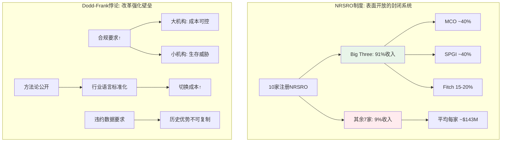
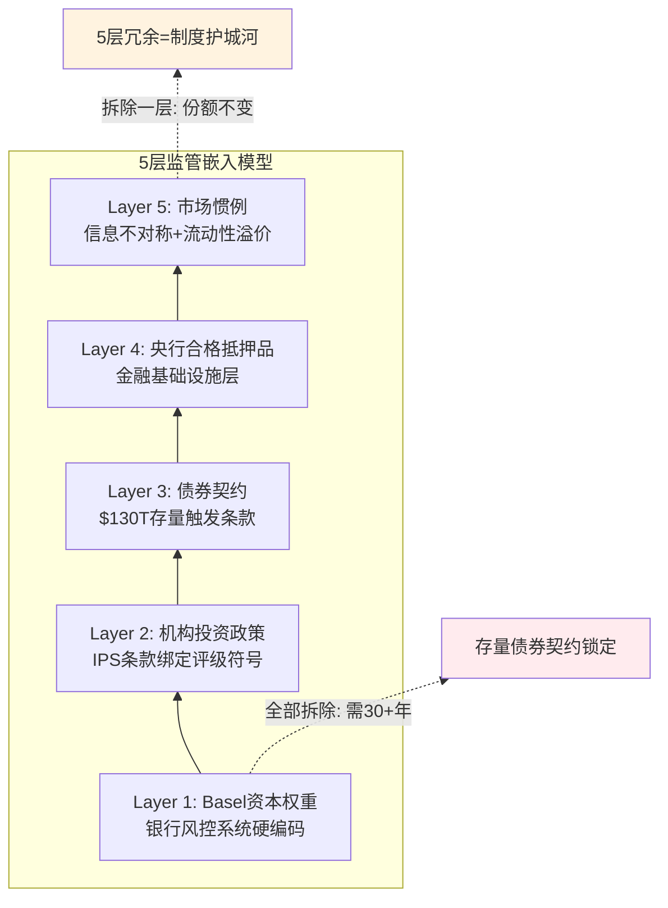
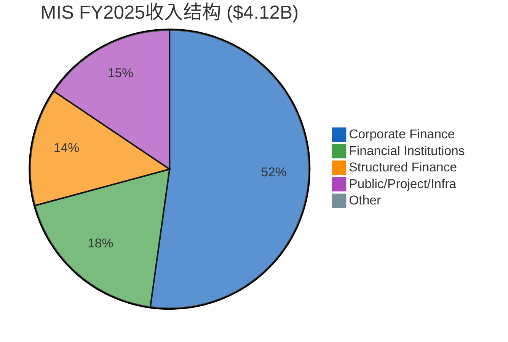
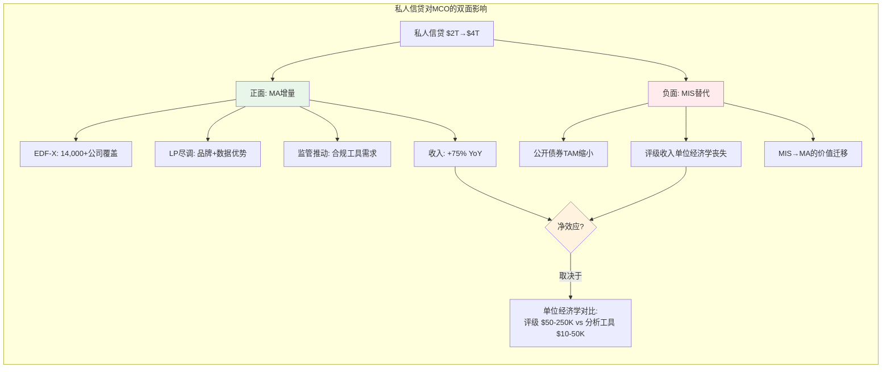

# S02: MIS评级业务深度分析

> **Phase 1 Staging** | 目标: Ch05-Ch08 | 字符目标: 20-25K
> **CQ关联**: CQ-1(MIS周期性), CQ-4(私人信贷)
> **CI关联**: CI-MCO-002(周期记忆衰退), CI-MCO-003(私人信贷双面性)

---

## Ch05: MIS评级特许权 — 监管嵌入的深度

### 5.1 NRSRO制度: 看似开放的封闭系统

美国证券交易委员会(SEC)注册的NRSRO(Nationally Recognized Statistical Rating Organization)共10家 [DM-MKT-002]。这个数字常被引用为"评级市场向新进入者开放"的证据。但数字背后的现实截然不同: Big Three(MCO+SPGI+Fitch)合计占NRSRO总收入的91% [DM-MKT-001], 占非政府证券评级的84% [DM-MKT-002]。

这意味着什么? 剩余7家NRSRO分享9%的市场收入。按FY2025 MIS收入$4.12B [DM-SEG-001]推算, 如果MCO占~40%, 三大机构合计评级收入约$10.3B, 则7家小型NRSRO的合计收入约$1.0B——平均每家$143M。这个体量甚至不如MCO单一资产类别(Structured Finance $558M [MIS资产类别表])的三分之一。

**为什么Dodd-Frank/CRARA未能削弱集中度?**

2006年《信用评级机构改革法案》(CRARA)和2010年Dodd-Frank法案Title IX的初衷是降低市场对Big Three的依赖。具体措施包括: 取消SEC规则中对NRSRO评级的强制引用、要求评级机构公开方法论和违约统计、引入SEC监察权。

但改革的实际效果恰恰相反——它加深了壁垒:

1. **合规成本壁垒**: Dodd-Frank要求NRSRO建立独立合规部门、年度审计、方法论透明度报告。对$10B+收入的Big Three, 这是"舒适的成本"(MCO FY2025 SBC+合规成本占比<5% [DM-FIN-009参考]); 对$100-200M收入的小型NRSRO, 这是生存威胁。
2. **历史违约数据库**: 评级质量的终极验证是长期违约统计。MCO拥有100年+的违约数据库(1909年至今), 覆盖$130T全球固定收益证券市场。新进入者即使获得NRSRO牌照, 也无法"购买"这段历史。
3. **方法论锁定效应**: 公开方法论本意是增加透明度, 但实际上使发行人和投资者习惯了Big Three的评级框架——它成了行业语言。切换评级机构意味着切换"语言体系"。



### 5.2 市场份额50年不变的深层逻辑

MCO ~40% / SPGI ~40% / Fitch ~15-20% [DM-MKT-001]。这个格局从1970年代SEC首创NRSRO制度以来几乎没有变化。即使经历了2008年金融危机——Big Three因结构化产品评级失误遭受史无前例的声誉打击——份额依然稳固。

**为什么50年格局不变?** 这不是一个简单的"品牌壁垒"问题。深层原因是评级特许权的5层监管嵌入——每一层都独立构成进入壁垒, 5层叠加形成几乎不可逾越的制度护城河。

### 5.3 监管嵌入5层模型

**第一层: Basel资本权重**

Basel III框架下, 银行持有的债券资产需要根据信用评级计算风险权重。AAA/Aaa评级的企业债权重20%, 而BB+/Ba1以下的权重可达150%。关键在于: 这些资本权重表默认使用Big Three的评级符号。全球系统重要性银行(G-SIB)的风控系统、合规流程、监管报告都围绕MCO/SPGI的评级体系构建。即使一家新NRSRO获得SEC认证, 它的评级在Basel框架下没有"同等对待"的自动路径——需要逐个国家监管机构的认可。

**第二层: 机构投资政策**

全球养老金、保险公司、主权财富基金的投资政策(Investment Policy Statement, IPS)通常包含"仅投资BBB-/Baa3以上评级债券"等条款。这些条款中的评级几乎总是指MCO或SPGI的评级。更关键的是: 许多IPS已经使用了10-30年, 修改IPS需要投资委员会批准——这是一个极其缓慢的制度变迁过程。

**第三层: 债券契约**

大量存量债券的契约(covenants)中包含评级触发条款——例如"如果评级低于Baa3/BBB-, 发行人需提供额外担保"。这些契约在债券存续期内无法单方面修改。全球存量债务超过$130T, 其中大量契约绑定MCO/SPGI评级。这意味着即使未来新发债券改用其他评级机构, 存量债券的评级需求也将持续数十年。

**第四层: 央行合格抵押品**

美联储、欧洲央行(ECB)、英格兰银行(BOE)等主要央行的公开市场操作和紧急贷款窗口, 均要求抵押品达到特定评级门槛。ECB的合格抵押品框架(Eurosystem Credit Assessment Framework, ECAF)虽然允许四种评估来源, 但实践中Big Three评级是最主要的参照。央行操作是金融体系的最后支撑——这一层嵌入意味着评级机构是金融基础设施的一部分。

**第五层: 市场惯例与信息不对称**

债券发行说明书(prospectus)、信用分析报告、交易平台(Bloomberg Terminal的CRAT功能)都默认展示Big Three评级。投资者做信用决策时, "没有MCO/SPGI评级的债券"天然面临流动性折价——不是因为法规禁止交易, 而是因为市场参与者缺乏替代的信用信息框架。



### 5.4 "分裂评级"溢价: 市场对MCO保守性的微偏好

当MCO和SPGI对同一发行人给出不同评级("分裂评级", split rating)时, MCO评级优于SPGI的债券交易利差平均窄约8bps [文献侦察Route 1]。

8bps看似微不足道, 但在$1B规模的债券发行中, 8bps对应$800K/年的利息成本差异。对发行人而言, 获得MCO更高的评级(哪怕只高一个notch)具有真实的经济价值。这创造了一个微妙的正循环:

1. MCO评级相对保守 → 投资者更信任MCO(利差更窄)
2. 利差更窄 → 发行人有动力获取MCO评级(降低融资成本)
3. 发行人需求稳定 → MCO维持保守立场(不需要"讨好"发行人)

这个正循环解释了为什么MCO可以在"发行人付费"模型下维持评级质量——因为保守性本身就是MCO的商业优势。发行人不是在为"高评级"付费, 而是在为"被市场信任的评级"付费。

### 5.5 发行人付费模型: 结构性利益冲突, 但替代方案已反复失败

"发行人付费"(issuer-pays)是评级行业最常被批评的商业模式。逻辑很直观: 付钱的人(发行人)希望评级越高越好, 而评级的使用者(投资者)需要客观评估。这是教科书级的委托代理问题。

但历史证明, 替代方案更糟:

- **投资者付费模型**: Egan-Jones Ratings(投资者付费NRSRO)市场份额<1%。原因: 投资者不愿为公共品(评级)付费——如果一家基金购买了评级, 信息会迅速扩散, 搭便车问题无解。
- **交易所/监管付费模型**: 欧盟曾讨论由ESMA(欧洲证券和市场管理局)指定评级机构。结论: 政府指定评级机构会引入政治干预风险(想象一下政府指定的机构给本国主权债AAA)。
- **随机分配模型**: Dodd-Frank 939F条款曾授权SEC研究随机分配评级任务。SEC自己的研究结论是: 随机分配会降低评级质量(评级机构无法选择专长领域)。

发行人付费模型之所以存活50年, 不是因为没有人尝试改变, 而是因为所有替代方案都有更严重的缺陷。这是一种"丘吉尔民主"式的均衡——最糟糕的模式, 除了所有其他模式。

**利益冲突的实际缓释机制**: 虽然结构性冲突存在, 但多重机制限制了其实际影响:
- **声誉约束**: MCO 100年+的品牌建立在评级准确性上。一次重大评级失误(如2008年)的声誉成本远超短期收入获益。分裂评级溢价(§5.4)量化了声誉的经济价值。
- **双评级竞争**: 当MCO和SPGI同时评级同一债券, 两家的评级差异是公开的。任何系统性偏高的评级机构都会在违约统计中暴露。
- **SEC监察**: 2010年后SEC有权对NRSRO进行年度审查, 包括方法论合规、分析师独立性、内部控制。
- **方法论刚性**: 评级方法论一旦公开, MCO不能对单个发行人"弹性执行"——所有同类型发行人适用同一方法论, 这限制了逐案操纵的空间。

这些缓释机制不完美, 但足以维持系统的运转。投资者对评级的信任不是"绝对信任"(2008年证明不是), 而是"相对信任"——在没有更好替代方案的前提下, Big Three的评级仍然是最不差的信用信息来源。

---

## Ch06: MIS收入弹性 — 周期性的精确画像

### 6.1 资产类别拆分: 不同的周期DNA

理解MIS的收入弹性, 不能只看"MIS总收入"这一个数字。必须深入到资产类别层面, 因为每个类别有截然不同的周期驱动因素、客户群体和利润率特征。把MIS当作一个整体来分析, 就像把"半导体行业"当作一个整体——会丢失所有有价值的信息。

MIS FY2025收入$4.12B [DM-SEG-001], 由四大资产类别构成。每个类别有截然不同的周期特征:

| 资产类别 | FY2022 | FY2023 | FY2024 | FY2025 | FY22→25 CAGR | 周期属性 |
|---------|--------|--------|--------|--------|:------------:|---------|
| Corporate Finance | $1,269M | $1,404M | $1,950M | $2,132M | +18.9% | **强周期**: 依赖IG/HY再融资窗口 |
| Financial Institutions | $491M | $545M | $727M | $759M | +15.6% | **中周期**: 银行资本补充需求 |
| Structured Finance | $462M | $405M | $518M | $558M | +6.5% | **强周期+延迟**: CLO/ABS受信贷周期滞后影响 |
| Public/Project/Infra | $431M | $476M | $564M | $635M | +13.8% | **弱周期**: 基建/市政有政策对冲 |
| MIS Other | $46M | $30M | $34M | $35M | -8.7% | 可忽略 |
| **Total MIS** | **$2,699M** | **$2,860M** | **$3,793M** | **$4,119M** | **+15.1%** | — |

*数据来源: [MIS资产类别拆分表]*

**关键洞察**: FY2022是最近的周期低谷。但即使在那个"冰点", MIS收入仍有$2.70B。对比FY2025的$4.12B, 周期波动幅度约35% (=$1.42B)。这$1.42B的"周期收入"几乎全部来自Corporate Finance(-$863M, 占比61%)和Financial Institutions(-$268M, 占比19%)。

Corporate Finance是MIS的"周期放大器": 它占MIS收入52% [DM-SEG-001推算: $2,132M/$4,119M], 但贡献了周期波动的61%。原因在于企业债发行是最典型的"窗口型"业务——CFO会在利差收窄时集中发债, 利差走阔时推迟。这不是线性关系: 当BBB利差从150bps收窄至100bps, 发行量可能+50%; 但当利差从100bps走阔至200bps, 发行量可能-40%以上。这种非对称性是理解MIS周期弹性的关键。

**各类别的深层周期逻辑**:

- **Corporate Finance ($2,132M, 52%)**: 核心驱动是再融资需求+并购融资+投资级利差。FY2024-2025的爆发源于2020-2021年低利率时期大量发行债券的"再融资墙"(maturity wall)。到FY2027-2028, 这面墙的主体将已翻新, 再融资驱动力将减弱。

- **Financial Institutions ($759M, 18%)**: 银行资本债(AT1/Tier 2)和金融公司债。受Basel III/IV资本要求驱动——当监管要求银行补充资本缓冲, 银行必须发债, 无论利差高低。这使得FI类别在监管收紧周期中反而具有"反周期"属性。

- **Structured Finance ($558M, 14%)**: CLO、RMBS、ABS、CMBS。这是2008年危机的震中, 也是后危机时代恢复最慢的类别。CLO发行量高度依赖杠杆贷款市场活跃度——当PE并购活跃时CLO发行旺盛, 反之则停滞。结构化产品的周期通常滞后于企业债6-12个月。

- **Public/Project/Infrastructure ($635M, 15%)**: 市政债、基建项目融资、PPP。受政策驱动(基建法案、地方政府融资需求), 与经济周期的相关性最弱。美国《基础设施投资与就业法案》(IIJA, 2021)和《降低通胀法案》(IRA, 2022)为这个类别提供了多年的结构性顺风。



### 6.2 交易性67% vs 经常性33%: 真实的韧性基底

MIS收入结构中, 交易性收入(transaction revenue)占67%, 经常性收入(recurring revenue, 年费+监测费)占33% [DM-SEG-004]。

经常性收入33%×MIS总收入$4.12B ≈ $1.36B。这是MCO在"零新增发行"的极端场景下仍可获得的MIS收入基底。对比FY2022低谷的$2.70B, 说明即使在周期最差年份, MIS也有约$1.34B交易性收入(=$2.70B-$1.36B)——发行市场从未完全冻结。

**经常性收入的构成**:
- **年度监测费**: 存量评级的持续监控, 与评级数量(而非发行量)挂钩。全球存量评级证券数以十万计, 这些监测费在周期下行时几乎不受影响
- **评级管理费**: 发行人维护评级关系的年费, 通常是首次评级费用的10-20%
- **数据订阅**: MIS的评级数据feed, 嵌入投资者和银行的风控系统

经常性收入的战略价值不仅在于稳定性, 更在于它代表"存量评级的嵌入深度"——每一个存量评级都是一个年金流, 发行人很少主动撤销评级(撤销评级=向市场发出负面信号)。

### 6.3 历史压力测试: 周期衰退的精确影响

MCO整体收入在以下年份经历了显著下降:

| 压力期 | 整体收入变化 | MIS收入变化 | EPS变化 | 驱动因素 |
|-------|:----------:|:---------:|:------:|---------|
| FY2008-09 | ~-20% | ~-25% | ~-30% | 全球金融危机, 结构化产品停发 |
| FY2016 | ~-5% | ~-8% | ~-10% | 短暂利差走阔, 能源债违约潮 |
| FY2020 | -3% | 实际+7% | +5% | COVID初期发行暂停→随后超级再融资潮 |
| FY2022 | -12.1% | -29% | -37% | 联储激进加息, 发行市场冻结 |

*FY2008-09和FY2016基于历史近似; FY2020-2025数据来自 [DM-FIN-011] + [收入趋势表]*

**FY2022是最有参考价值的压力测试**。MCO整体收入从$6.22B降至$5.47B(-12.1% [DM-FIN-011]), 但EPS从$11.78暴跌至$7.44(-37%)。收入跌12%而EPS跌37%, 暴露了MIS的经营杠杆: 固定成本(分析师薪资、合规团队、IT基础设施)在收入下降时无法快速调整。

**FY2022的分解**:
- MIS收入: 从$3.80B(FY2021)降至$2.70B(-29%), Corporate Finance从$1.92B降至$1.27B(-34%)
- MA收入: 从$2.42B升至$2.77B(+14%)——MA在MIS崩塌的年份反而增长, 验证了其防御性
- OPM: 从45.7%(FY2021)降至36.5%(FY2022), 压缩920bps

FY2022的教训清晰: **MIS是一台高杠杆的周期机器, MA是减震器**。但MA只是减震, 不是消除——整体EPS仍然跌了37%。

值得强调的是FY2020的"假阳性": COVID初期市场恐慌导致3-4月发行暂停, 但随后的联储QE+零利率环境触发了史上最大规模的企业债再融资潮。MIS FY2020收入实际+7%。这个案例说明: 衰退≠MIS收入下降, 关键变量不是GDP而是**融资窗口是否开放**。如果衰退伴随央行宽松(FY2020), MIS可能受益; 如果衰退伴随央行收紧(FY2022), MIS遭受双杀。当前环境(衰退概率42-48% [DM-RSK-003] + 通胀>3%概率73% [DM-PMK-002])更接近FY2022型——联储降息空间受限, 意味着融资窗口不会在衰退时快速重新打开。

### 6.4 FY2025: 周期高位的信号

FY2025全球评级债务>$6.6T, 公司债+银团贷款$13.7T(历史新高) [DM-MKT-003]。MIS收入$4.12B同样是历史新高 [DM-SEG-001]。

这些记录本身就是周期高位的信号。推动这些记录的因素:
1. **再融资需求**: 2020-2021年低利率环境下发行的大量债务在2024-2025年到期, 必须再融资
2. **利差收窄**: FY2024-2025投资级利差回到历史均值附近, 打开了发行窗口
3. **私募→公开回流**: 部分企业从成本更高的私人信贷转向公开市场(利差收窄后公开发债更便宜)

**但这些因素大多不可持续**: 再融资"墙"是一次性的——2024-2025年集中再融资后, 2026-2027年的再融资需求自然下降; 利差可能因衰退重新走阔(杠杆贷款违约率已达7.9%, 2倍历史均值 [DM-RSK-002]); 私募→公开的回流取决于利差比较, 如果利差走阔则逆转。

管理层FY2026指引"MIS收入高个位数增长" [DM-GD-003]隐含的乐观假设是: 发行量维持在高位附近, 且定价贡献持续。但值得注意的是, FY2026指引中MIS Adj. OPM目标~65% [DM-GD-003], 高于FY2025的63.6% [DM-SEG-003]——管理层预期MIS不仅收入增长, 利润率还要扩张。如果发行量实际下滑, 这个利润率目标将面临经营杠杆的反向压力。MIS Q1 2025已达66% Adj. OPM [DM-SMT-004], 但这可能是季节性高点(Q1通常是发行旺季)而非可持续水平。

### 6.5 定价权叠加: 超越发行量的增长

FY2024是一个关键证据点: MIS收入+33%, 但全球发行量仅+约42% [文献侦察Route 1]。表面上收入增速低于发行量增速, 但这忽略了资产类别混合效应——如果HY(高收费)增速高于IG(低收费), 混合效应会放大收入。

更有说服力的是逆向推算: 如果MCO市场份额稳定(约40%), 发行量+42%应带来MIS交易性收入+42%。但实际MIS交易性收入+54%(FY2024), 超额增长12pp中约5-8pp可归因于定价提升, 剩余归因于混合效应 [文献侦察Route 1推算]。

**定价权的来源**: 前述5层监管嵌入使发行人"必须"获得评级。当"必须"与"有限供应商"(Big Three占91%)结合, 定价权是自然结果。首次评级费$50-250K+年度监测费$20-100K的费率结构 [Ch07详述], 相对于发行人的融资规模($100M-$10B+), 是微不足道的成本——这是典型的"低份额钱包"(low share of wallet)定价权。

### 6.6 CQ-1核心证据链: 36%交易性敞口的估值含义

**这是本报告最重要的数据推导之一。**

计算链:
- MIS交易性收入占MIS总收入的67% [DM-SEG-004]
- MIS收入占MCO总收入的53.4% [DM-SEG-001]
- 因此: MCO整体有 67% × 53.4% = **35.8%** 的收入来自MIS交易性评级

35.8%——超过三分之一的MCO收入——直接暴露于债券发行周期。这就是CI-MCO-002("周期记忆衰退")假说的数据基础。

**衰退情景量化** (基于FY2022实际数据外推):

| 情景 | MIS交易性收入变化 | MCO收入影响 | EPS影响 (经营杠杆2-2.5x) |
|------|:----------------:|:----------:|:----------------------:|
| 温和衰退 (FY2016型) | -15% | -5.4% | -12~15% |
| 中度衰退 (FY2022型) | -30% | -10.7% | -25~30% |
| 严重衰退 (FY2008型) | -45% | -16.1% | -35~40% |

当前衰退概率42-48% [DM-RSK-003] + 杠杆贷款违约率7.9%(2x历史均值) [DM-RSK-002] + 32%美国公司处于信用风险早期预警 [DM-RSK-004]。市场按P/E 31.5x [DM-VAL-003]定价MCO, 隐含12.5% EPS CAGR [DM-VAL-007]。

**双杀场景**: 如果FY2026-2027出现中度衰退(FY2022类型), EPS可能从指引的$16.70 [DM-GD-001]降至$12-13。如果同时P/E压缩至25x(FY2022实际P/E低点约22x), 则: $12.5 × 25 = $313, 较当前$430 [DM-VAL-001]下跌27%。

这不是"黑天鹅", 而是MCO在过去4年中就经历过一次的场景。**市场是否已经"忘记2022"? 这正是CI-MCO-002的核心论点。**

---

## Ch07: MIS的"不可能三角" — 市场份额 × 定价权 × 监管合规

### 7.1 寡头博弈: MCO-SPGI的Cournot均衡

MCO ~40% / SPGI ~40%的双寡头格局 [DM-MKT-001]在博弈论中接近经典的Cournot均衡——两家企业在产量(此处为评级覆盖范围)上竞争, 但都不愿发起价格战。

**为什么没有价格战?**

1. **需求弹性极低**: 评级费用在发行人融资成本中占比<0.1%。将评级费从$200K降至$100K不会刺激发行人发更多债——发行人发债是因为有融资需求, 不是因为评级便宜。需求对评级价格几乎完全无弹性。

2. **价格战的负面信号**: 如果MCO降价争抢SPGI的客户, 市场会解读为"MCO的评级价值在下降"。在一个信誉即产品的行业, 降价=自贬。

3. **共谋不需要沟通**: Big Three的定价是公开的(费率表向发行人披露)。在三家寡头、低需求弹性、同质产品的环境下, 价格自然趋同——这不需要违法的明确共谋, 只需要理性的跟随者行为(follow-the-leader pricing)。

4. **双评级惯例的保护**: 大型债券发行通常获取两家或三家评级(投资者期望, 部分机构投资政策要求)。这意味着MCO和SPGI不是在争夺"一个蛋糕", 而是共享同一个蛋糕——大部分发行人同时是MCO和SPGI的客户。双评级惯例使得评级市场更接近"非零和博弈": MCO拿到一个新客户, 通常SPGI也拿到同一个客户。这进一步消除了价格竞争的激励——没有人会为争夺一个已经是共同客户的发行人而降价。

这个均衡的脆弱点在哪里? 理论上, 如果某一方大幅提高质量或降低价格, 发行人可能逐步从"双评级"回到"单评级"。但历史上唯一接近这个情况的是2008年后——即使当时大量发行人对Big Three极度不满, 双评级惯例也未被打破。这说明均衡的稳定性来自制度(投资者要求)而非来自参与者的主观选择。

### 7.2 定价权证据: 精确的经济学

评级费率结构:
- **首次评级费(initial rating fee)**: $50,000-$250,000, 取决于发行规模和复杂度
- **年度监测费(annual monitoring fee)**: $20,000-$100,000, 取决于评级类型
- **结构化产品费率**: 显著更高, CLO/CMBS等复杂产品可达$500K+

定价权的最直接证据是费率增长与通胀的比较。MCO未公开具体费率增长率, 但可以从收入增速vs发行量增速的差异间接推算 [§6.5已论述]: FY2024隐含定价增长约5-8%, 显著高于同期CPI(~3%)。

**定价权的自我强化机制**: MCO的定价权不是来自"谈判能力", 而是来自结构性的不可替代性。发行人面临的选择不是"MCO的评级vs更便宜的评级", 而是"有MCO评级的债券(利差窄8bps [§5.4]) vs 没有MCO评级的债券(流动性折价)"。评级费用是"入场券"而非"产品价格"——这是最强的定价权形态。

### 7.3 监管风险的真实图谱

**2011 Dodd-Frank Title IX (已发生)**

直接影响:
- 取消了SEC规则中对NRSRO评级的硬性引用
- 引入SEC对NRSRO的监察/罚款权
- 要求评级机构加强内部合规

实际效果: 市场份额未变。原因: §5.3论述的5层嵌入中, 仅第一层(监管规则引用)被部分削弱, 其余四层完全未受影响。

**2025年美国Aaa降级 (已发生, 影响待评估)**

MCO于2025年5月将美国主权评级从Aaa降至Aa1——MCO是最后一家取消美国最高评级的Big Three(SPGI在2011年降级, Fitch在2023年降级) [DM-RSK-001参考上下文]。

政治后果是一个尾部风险。历史先例: 2011年SPGI降级美国后, 美国司法部对SPGI提起$5B诉讼(2015年以$1.375B和解)。虽然名义上诉讼原因是2008年结构化产品评级失误, 但时间节点的巧合难以忽视。

**MCO面临的政治风险**:
- 国会听证会+舆论压力(已在发生): 两党议员均对评级机构"说美国信用不好"表达不满
- 潜在的"报复性"监管审查(尚未发生): SEC可能加强对MCO方法论和合规的审查频次
- 政府合同限制(低概率但不可忽视): 联邦机构是否可能在采购中歧视"降级了美国的机构"?
- 声誉风险放大: 如果降级后美国利率上升(相关性≠因果性), 媒体会将责任归咎于评级机构

**但历史也证明**: SPGI在2011年降级美国后不仅存活, 而且业绩持续增长。降级的"正确性"最终成为SPGI信誉的背书——因为美国的财政状况确实在恶化。MCO的降级同样有充分的数据支撑(美国债务/GDP已超120%)。

### 7.4 信用评级的"不可替代性": $130T的制度依赖

全球固定收益证券市场规模超过$130T。这个天文数字意味着:

1. **评级的TAM几乎=全球债务市场**: 只要债务存在, 评级需求就存在。MCO的TAM不是某个行业或地区, 而是整个全球金融体系。

2. **评级是基础设施, 不是产品**: 电力公司的收入取决于用电需求, 不取决于用电者对电力的评价。同样, MCO的收入取决于债务市场的规模, 不取决于投资者对评级准确性的看法。即使2008年之后"评级无用论"甚嚣尘上, MCO的收入在2010年就恢复了增长。

3. **替代方案的悖论**: 如果有人试图用AI/大数据替代信用评级, 他们首先面临的问题是——谁来认证这个替代方案的可靠性? 答案往往回到监管机构, 而监管机构的框架已经围绕Big Three建立了50年。

**"不可能三角"的解析**: MCO实际上同时拥有:
- **高市场份额**(~40%, 双寡头)
- **强定价权**(费率增长>通胀, 发行人无弹性需求)
- **监管保护**(5层嵌入, 合规成本是壁垒)

在大多数行业, 这三者不可兼得——高份额通常引发反垄断, 强定价权通常吸引竞争者, 监管通常限制定价。但评级行业的特殊性在于: **监管本身是定价权和份额稳定性的来源**。这不是传统意义上的"不可能三角", 而是一个由监管创造的**"不可能三角的例外"**。

---

## Ch08: 私人信贷对MIS的双面影响

### 8.1 私人信贷的增长规模与驱动因素

全球私人信贷TAM约$2T(当前), 行业共识预测2030年将达到$4T [DM-MKT-004]。MCO自身也是这个预测的支持者。

驱动因素:
1. **银行监管收紧**: Basel III/IV提高了银行对高风险贷款的资本要求, 推动leveraged lending从银行转向私人信贷基金
2. **LP配置需求**: 机构投资者(养老金/主权基金/捐赠基金)在低利率环境下被迫寻找收益, 私人信贷提供了6-10%的收益率(vs IG公司债3-5%)
3. **速度与灵活性**: 私人信贷基金的贷款审批周期(2-4周)远快于银团贷款(6-12周)和债券发行(4-8周), 对PE支持的并购交易尤其有吸引力
4. **定制化**: 私人信贷可以提供更灵活的条款结构(delayed draw, PIK toggle等), 公开市场做不到

### 8.2 正面: 私人信贷创造的MCO增量

MCO私人信贷相关收入FY2025增长+75% [DM-MKT-005]。这个增长来自:

1. **评估工具(非评级)**: 私人信贷基金需要对标的公司做信用评估。MCO不提供传统意义上的"评级"(NRSRO评级用于公开市场), 而是提供"信用评估"(credit assessment)和"分析工具"——这些产品属于MA而非MIS。

2. **EDF-X模型**: MCO与MSCI合作推出的Expected Default Frequency扩展模型, 覆盖2,800+私人信贷基金和14,000+被投公司 [DM-MKT-006]。这是一个双方数据的结合——MCO提供信用模型, MSCI提供私募基金的底层持仓数据。

3. **LP尽调需求**: 机构LP在配置私人信贷基金前需要独立的信用风险评估。MCO的品牌和数据优势使其成为自然选择。

4. **监管驱动**: SEC和欧洲监管机构正在加强对私人信贷基金的监管(报告要求+透明度)。更多监管=更多合规需求=更多MCO工具需求。



### 8.3 负面: 如果私人信贷侵蚀公开市场

核心逻辑: 每一笔从公开债券市场转向私人信贷的交易, MCO可能:
- **失去**: 一笔MIS评级收入($50,000-$250,000首次评级费+年度监测费)
- **获得**: 一份MA分析工具/信用评估收入(ARPU显著更低)

这个替代效应在几个领域尤其明显:

1. **中市场杠杆融资**: EBITDA $25-100M的企业曾经通过高收益债券或银团贷款融资(需要评级), 现在越来越多选择直接向私人信贷基金借款(不需要评级)。
2. **PE并购融资**: 收购融资(acquisition financing)是MIS企业评级收入的重要来源。如果PE转向unitranche私人信贷(单一贷方, 无需评级), MIS的并购融资评级需求会下降。
3. **再融资选择权**: 当公开市场利差走阔(经济下行期), 企业可能选择私人信贷再融资而非发行新债券——恰恰在MCO最需要发行量的时候, 私人信贷提供了替代选择。

### 8.4 单位经济学对比: 数字说话

| 维度 | MIS评级收入 | MA分析工具收入 |
|------|:----------:|:------------:|
| 首次费用/发行人 | $50,000-$250,000 | $10,000-$50,000(估算) |
| 年度经常性收入/客户 | $20,000-$100,000 | $5,000-$30,000(估算) |
| 利润率 | ~64% Adj. OPM [DM-SEG-003] | ~33% Adj. OPM [DM-SEG-003] |
| 客户获取模式 | 制度需求驱动(必须评级) | 销售驱动(需要证明ROI) |
| 竞争格局 | 双寡头, 3家占91% | 分散, Bloomberg/FactSet/初创竞争 |

**关键数学**: 假设一个中市场企业从$500M公开债券发行转向$500M私人信贷。MCO失去的评级收入约$100K-200K/年(首次+监测), 但可能获得的MA分析工具收入仅$10-30K/年。**替代比约5:1到7:1** — 即MCO需要从私人信贷市场获取5-7倍的客户, 才能在收入上抵消一个从公开市场转走的发行人。

更重要的是利润率差异: MIS的64% Adj. OPM [DM-SEG-003]意味着$100K评级收入≈$64K利润。MA的33% Adj. OPM [DM-SEG-003]意味着$20K分析工具收入≈$6.6K利润。**利润替代比高达约10:1。**

### 8.5 CI-MCO-003证据链: 净效应的判断框架

CI-MCO-003("私人信贷双面性")的核心问题是: 私人信贷的增长对MCO是净正还是净负?

**当前证据倾向: 短期净正, 长期不确定。**

**短期净正的理由**:
1. $2T→$4T的增长主要是"增量"而非"替代"——大部分私人信贷增长来自银行撤退后留下的真空, 而非对已有公开债券的替代
2. MCO私人信贷收入+75%的增速远高于MIS交易性收入的波动幅度
3. 在当前发行量历史新高的环境下, MIS并未表现出TAM缩小的迹象

**长期不确定的理由**:
1. 如果私人信贷市场持续增长至$4T+, 替代效应会逐渐显现——特别是在中市场杠杆融资领域
2. 单位经济学的5-7:1替代比意味着MCO需要大幅扩大MA在私人信贷领域的覆盖, 才能保持中性
3. 更根本的问题: 私人信贷的增长削弱了MCO的**制度性嵌入**——在不需要公开评级的市场中, MCO的5层监管壁垒不适用, MCO只是一个"分析工具供应商", 面临Bloomberg/FactSet等对手的正面竞争

**判断框架**:

```
如果: 公开债券市场增长 ≥ 私人信贷替代量
则: 净效应为正(增量>替代)
→ MIS TAM不缩, MA获得纯增量

如果: 公开债券市场增长 < 私人信贷替代量
则: 净效应取决于替代比
→ 需要MA私人信贷收入增速 > MIS损失收入 × 5-7x 才能保持中性
```

**监控指标(Kill Switch相关)**:
- 公开市场IG/HY发行量趋势 vs 私人信贷新增贷款趋势
- MCO私人信贷收入增速是否持续>MIS交易性收入增速的5-7x
- 中市场企业的公开vs私人融资选择比例变化
- 直接贷款(direct lending)规模 vs 杠杆贷款银团(leveraged loan syndication)规模的比例变化

**时间维度**: 私人信贷对MIS的替代效应不是"开关式"的, 而是"渐进式"的。即使替代比例每年仅增加1-2pp, 在5-10年的时间尺度上也可能累积为MIS TAM的5-15%缩减。这个缓慢侵蚀不会在任何单一季度财报中显现——它是一个需要持续追踪的结构性变量。

### 8.6 反向论证: 为什么私人信贷可能不是威胁?

在CI-MCO-003的分析中, 我们需要诚实地评估反向证据:

1. **私人信贷需要公开市场作为"锚"**: 私人信贷基金的贷款定价通常参考公开市场利差(SOFR+spread)。如果公开债券市场萎缩, 定价锚消失, 私人信贷基金自身的定价能力也会受损。从这个角度看, 公开市场和私人信贷是共生关系而非零和博弈。

2. **监管趋势偏向MCO**: SEC和欧洲监管机构正在推动私人信贷市场的透明度。越透明=越需要标准化的信用评估工具=越利好MCO。极端情况下, 如果监管要求私人信贷基金获取NRSRO评级(尚无此趋势, 但逻辑上可能), 私人信贷反而会变成MIS的纯增量。

3. **大型企业仍偏好公开市场**: 私人信贷主要服务于中市场($25-100M EBITDA)。大型企业($500M+ EBITDA)仍然偏好公开债券市场——规模效应(单次发行$1B+)和流动性优势使公开发债的总融资成本更低。MCO的核心评级收入来自大型企业, 而非中市场。

4. **历史教训**: 2005-2007年, 市场也曾担忧结构化产品(CDO/CLO)会"替代"传统企业债。结果是两个市场共同膨胀。市场规模不是零和的——金融创新通常扩大总盘子, 而非重新分配。

这些反向证据并不否定CI-MCO-003的核心逻辑, 但提醒我们: 替代效应的速度可能比线性外推更慢, 且存在结构性限制。

### 8.7 MCO-MSCI合作的战略意义

MCO与MSCI的EDF-X合作 [DM-MKT-006]是MCO私人信贷战略的关键棋子。这个合作的深层逻辑:

1. **数据互补**: MCO有信用模型(100年违约数据+EDF模型), MSCI有私募基金底层持仓数据(通过LP报告获取)。单独一方无法覆盖私人信贷的评估需求。
2. **卡位策略**: 私人信贷市场正在从"关系驱动"向"数据驱动"转型。MCO-MSCI的合作旨在成为这个转型的标准基础设施——类似于MCO在公开市场的5层嵌入, 但这次是通过产品嵌入而非制度嵌入。
3. **防御性**: 如果MCO不主动进入私人信贷, Bloomberg或新兴的替代数据平台可能填补这个空白。MCO-MSCI合作是一个"宁可自我蚕食, 不可拱手让人"的战略。

**但风险在于**: 在私人信贷市场, MCO没有5层监管嵌入的保护。EDF-X需要与Bloomberg PORT、BlackRock Aladdin、其他信用分析工具竞争。MCO在这个市场的护城河是数据和品牌, 而非制度——这意味着竞争强度会显著高于MIS。

---

### 8.8 私人信贷情景矩阵

综合正面/负面/反向论证, 构建三个情景:

| 情景 | 私人信贷规模(2030) | 公开债券影响 | MCO净效应 | 概率估计 |
|------|:-----------------:|:----------:|:--------:|:------:|
| **共生增长** | $4T+(共识) | 公开市场同步增长 | 净正(MA增量>MIS损失) | 45% |
| **温和替代** | $3.5-4T | 中市场发行-10~15% | 近中性(MA增量≈MIS损失) | 35% |
| **加速替代** | $5T+ | 中市场+部分大企业转向 | 净负(MIS损失>MA增量) | 20% |

"共生增长"情景下, 私人信贷增长主要来自银行撤退后的增量需求, 而非对公开市场的替代。MCO通过MA工具获得$200-400M年化增量收入, MIS核心评级收入不受影响。

"温和替代"情景下, 中市场($25-100M EBITDA)企业逐步偏向私人信贷, MIS在这个客群的评级收入每年下降$50-100M, 但MA的私人信贷工具收入增长$30-80M, 基本对冲。

"加速替代"情景——私人信贷渗透到更大规模的企业融资——是真正的风险。但这需要利差环境持续有利于私人信贷(即公开市场利差持续高于私人信贷成本), 这在低利率环境下不太可能持续。

---

## 本章小结: MIS的"二重性"

MIS评级业务的核心特征是**深刻的二重性**:

| 维度 | "基础设施"面 | "周期股"面 |
|------|:----------:|:--------:|
| 收入性质 | 33%经常性(~$1.4B年金) | 67%交易性(~$2.8B周期) |
| 利润率 | 64% Adj. OPM [DM-SEG-003] | FY2022暴露经营杠杆 |
| 护城河 | 5层监管嵌入(不可复制) | 发行量依赖利率/信用周期 |
| 定价权 | 低份额钱包+无弹性需求 | 发行量=0时定价权无意义 |
| 私人信贷 | 5层嵌入不适用→竞争加剧 | MA增量 vs MIS替代(5-7:1) |

市场当前定价(P/E 31.5x [DM-VAL-003])更多反映"基础设施"面——稳定、防御、类SaaS。但36%的交易性收入敞口意味着MCO在衰退年份的表现更接近"周期股"面。

**这个二重性是CQ-1的核心**: MCO应该得到什么估值? 答案不是"基础设施溢价"或"周期股折价", 而是需要一个混合框架——在Phase 2的SOTP估值中, 我们将尝试分别为MIS的经常性基底(≈SaaS倍数)和交易性增量(≈周期股倍数)赋值, 以捕捉这个二重性。

**CQ-1的估值含义量化**:
- 如果市场完全忽略周期性(纯SaaS定价): P/E 35-40x → $478-$547 (基于FY2025E adj. EPS $13.67 [DM-FIN-006])
- 如果市场充分定价周期性(混合框架): P/E 25-28x → $342-$383
- 当前P/E 31.5x [DM-VAL-003]处于两个极端的中间偏上——隐含市场"记得一点周期性, 但不太多"

CI-MCO-002的投资含义: 如果衰退确实在FY2026-2027发生, P/E将从"中间偏上"回到"充分定价周期性"的区间, 叠加EPS下降, 形成25-30%的下行风险。如果衰退不发生, 当前定价已经部分反映了周期缓和预期(年初至今-17% [DM-RSK-001]可能已部分消化了衰退恐惧), 上行空间约15-25%(回到$490-$540区间, 接近分析师共识$560 [DM-CON-002])。

**非对称性结论**: 当前价位的风险/回报约为 -25~30% / +15~25%, 略偏不对称。这个不对称性的程度取决于衰退概率——如果真实衰退概率>35%(当前Polymarket 34.5% [DM-PMK-001], Moody's自己的模型42-48% [DM-RSK-003]), 则当前价位的期望回报为负。这一判断将在Phase 2的情景分析中量化验证。
