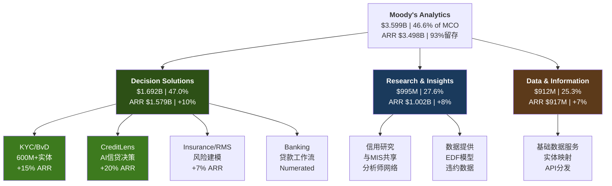
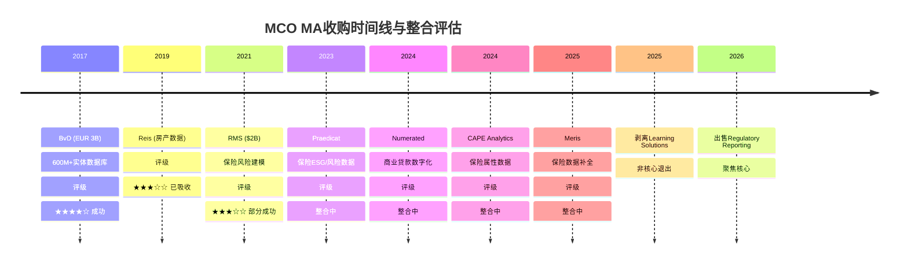
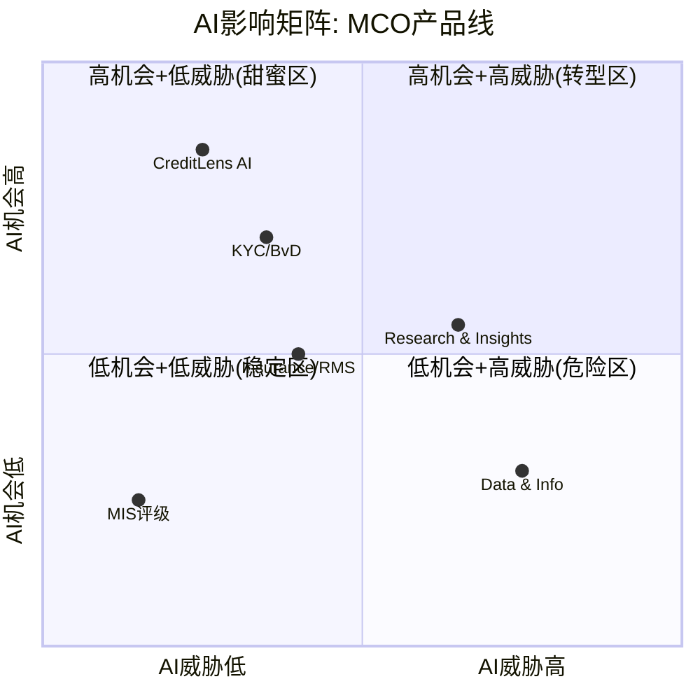
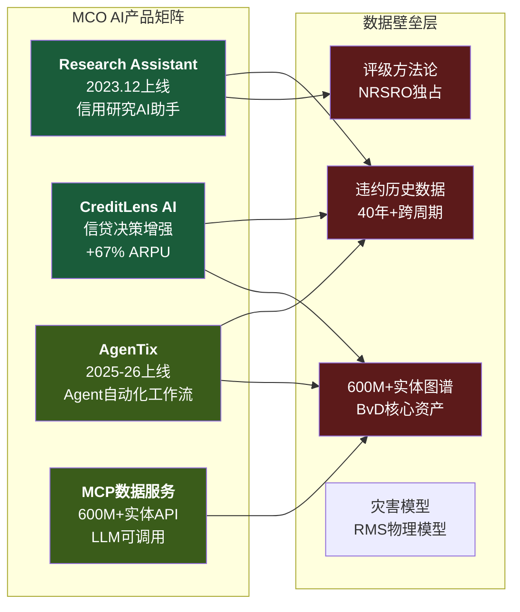

# S03: Moody's Analytics平台解剖 — 三产品线深度+SaaS纯度+收购审计+AI双刃

> **Phase 1 Staging** | 字符目标: 18-22K | CQ焦点: CQ-2(真平台vs数据堆栈), CQ-5(AI双刃效应)
> **问题树来源**: §4(MA深度), §6(数据资产与AI), §11(并购与资本配置)

---

## Ch09: MA平台解剖 — 三产品线深度

### 问题框架

问题树§4.1问: MA本质上在卖什么? 是数据库、研究内容、模型、合规工具、风险软件、workflow平台,还是这些的组合? 答案取决于你看哪条产品线——三条线的本质截然不同。

MA FY2025总收入$3.599B [DM-SEG-002],占MCO整体的46.6%。ARR $3.498B [DM-SEG-006],经常性收入占比96% [DM-SEG-005]。但这个"96%"背后的三条产品线,护城河宽度、增长天花板、AI脆弱度完全不同。

### 9.1 Decision Solutions ($1.692B, 47.0% of MA)

Decision Solutions是MA中增速最快(ARR +10% [DM-SEG-006])、战略价值最高的产品线。ARR $1.579B,占MA ARR的45%。它由四个子模块构成,每个子模块的驱动逻辑完全不同。

**KYC/BvD ($估算~$500-600M ARR, +15%)**

BvD是2017年以EUR 3B收购的实体数据库 [DM-ACQ-001],拥有600M+全球实体数据。这不是一个"数据集",而是一个**实体图谱基础设施**——将全球企业的股权结构、受益所有人、财务数据映射成机器可读的关系网络。

护城河宽度: **宽**。原因有三:
1. **数据网络效应**: 600M+实体不是一次性采集的结果,而是持续10年+的清洗、映射、更新的累积。任何新进入者从零开始,即使有AI辅助,也需要5年+才能达到可用的覆盖度和准确度。
2. **监管驱动的刚性需求**: AML(反洗钱)/KYC(了解你的客户)法规在全球持续收紧。欧盟第六反洗钱指令(6AMLD)、美国CTA(Corporate Transparency Act)都要求金融机构验证实体所有权链。BvD是少数能提供跨境、多层穿透的数据源之一。
3. **流程嵌入**: BvD不是"查一查"的参考工具,而是嵌入银行合规流程的基础设施层。一旦嵌入,切换意味着重新验证整个合规链条——对银行CRO来说,这是不可接受的操作风险。

+15% ARR增速 [DM-AI-004] 在MA各子模块中最高,主要驱动力是监管加码(需求侧拉动)而非产品创新(供给侧推动)。这种增长更可持续,但天花板问题值得关注: 全球主要银行已基本覆盖,增量主要来自中小金融机构+非金融企业(供应链KYC)。如果监管强度稳定而非继续加码,增速可能从15%回落至10-12%。

**CreditLens ($估算~$300-400M ARR, +20%)**

CreditLens是AI增强的信贷决策工作流工具。关键数据点: 2/3续约客户选择升级AI版本,ARPU提升+67% [DM-AI-002]。这是MCO全产品矩阵中**最佳的upsell案例**。

这个+67% ARPU提升说明了什么?

首先,它证明AI不是成本——是定价权放大器。当CreditLens从"信贷流程管理工具"升级为"AI辅助信贷决策系统",客户愿意为"更快更准的审批"支付67%溢价。这是因为CreditLens的AI不是通用大模型,而是训练在MCO独有的违约数据+评级模型之上的专用模型,竞争对手无法复制这一数据优势。

其次,2/3的升级率意味着剩余1/3尚未升级——这是FY2026-2027的**内嵌增长**。假设总CreditLens客户基数约500-600家银行,已升级约350-400家,剩余150-200家在未来2年升级将继续贡献+15-20%增长。

护城河宽度: **中-宽**。数据优势(违约模型)是真实的,但信贷决策工具市场有nCino、Temenos等竞争者。CreditLens的差异化在于MCO信用数据的独家嵌入,而非软件本身。

**Insurance/RMS ($估算~$400-500M ARR, +7%)**

RMS是2021年以$2B收购的保险风险建模平台 [DM-ACQ-002]。管理层确认已达到$150M增量收入目标。保险ARR在2年内累计增长+21%。

这个"部分成功"评级需要拆解:

成功面: $150M增量/$2B收购价 = 7.5%的第一年收入回报率。对于数据/软件收购,这是可接受的。加上后续Praedicat/CAPE Analytics/Meris等补充收购(合计~$400M [DM-ACQ-003]),MCO正在构建完整的保险风险分析生态系统。

不足面: +7%的保险ARR增速是Decision Solutions四个子模块中最慢的。保险行业的IT预算分配保守,RMS虽然是行业标准(灾害模型),但客户升级周期长(3-5年)。更关键的是,保险业务与MCO核心的信用分析能力协同度最低——这更像是一个"相邻市场扩张"而非"飞轮组件"。

护城河宽度: **中**。灾害模型有数据壁垒(历史灾害数据+物理模型),但AIR Worldwide(Verisk)是强力竞争者。MCO的保险业务在风控软件领域排名靠前(RiskTech100 #1 [DM-MKT-007]),但这更多反映MCO整体品牌而非保险单一产品线。

**Banking/Numerated ($估算~$100-200M ARR, 增速不明)**

Numerated是小额商业贷款数字化工具,主要服务美国社区银行。这是最小的子模块,管理层披露最少。问题树§4.1要求识别"哪些产品其实容易被替代"——Banking子模块的切换成本可能是DS中最低的,因为商业贷款审批流程标准化程度高,替代方案(如nCino)成熟。

### 9.2 Research & Insights ($995M, 27.6% of MA)

R&I是MA中最独特的产品线,因为它直接建立在MIS评级分析师网络之上。ARR $1.002B,增速+8% [DM-SEG-006]。

这条产品线的护城河来源与DS完全不同: 不是数据库或软件,而是**信用分析专业知识的产品化**。MCO拥有全球最大的信用分析师团队(约3,500人),这些分析师产出的研究、模型、方法论,通过R&I变成了可订阅的产品。

核心问题(§5.1): R&I是MIS与MA之间最直接的协同证据。没有MIS的评级特许权和分析师网络,R&I无法独立存在。这意味着:
- **正面**: R&I是评级特许权的"二次变现"——同一支分析师团队,既产出评级(MIS收入)又产出研究(MA收入)
- **负面**: R&I的成本归属模糊。如果MIS分担了大部分分析师成本,R&I的"真实利润率"可能比报表显示的更高;反之如果MA分担了更多,MIS的利润率可能被高估

护城河宽度: **中-宽**。信用研究市场的竞争者(Bloomberg Intelligence, CreditSights/Fitch Solutions)都缺乏MCO级别的评级数据独占性。但AI时代可能削弱"人工分析师解读"的价值,如果客户可以用AI直接解读原始数据(§6.3)。

### 9.3 Data & Information ($912M, 25.3% of MA)

D&I是MA的"基础层"——提供实体数据映射、信用数据feed、API接口。ARR $917M,增速+7% [DM-SEG-006],是三条线中最慢的。

问题树§6.2问: MA的价值究竟来自原始数据、清洗结构化、实体映射、分析模型、可视化界面、API分发,还是嵌入工作流? D&I代表了前三层(原始数据+清洗+映射),而DS代表了后三层(模型+界面+工作流)。

D&I的增速最慢有结构性原因:
1. **数据层被商品化风险最高**: 原始信用数据可以从多个来源获取(SEC EDGAR, Bloomberg, FactSet)。MCO的差异化在于清洗和映射的精度,但这种差异化边际递减
2. **价格弹性低**: 基础数据服务的提价空间有限(客户有替代选择),不像DS的合规工具(监管刚需)或R&I的专有研究(无法替代)

但D&I也有"隐藏价值": 它是DS和R&I的数据供应层。没有D&I的实体映射和数据清洗,DS的KYC工具和R&I的信用研究都无法运作。这使得D&I虽然增速慢,但战略上不可或缺——类似于"水管"而非"水龙头"。

护城河宽度: **窄-中**。数据层最容易被AI替代(自动化数据清洗+NLP提取),也最容易被Bloomberg/FactSet/Refinitiv等竞争者覆盖。

---

## Ch10: MA的"SaaS纯度"检验

### 问题框架

问题树§4.2核心问题: MA的收入质量如何判断? 留存率应该如何拆解? 这里我们用SaaS企业的标准框架来检验MA——结论是: MA是"类SaaS",但不是"纯SaaS"。

### 10.1 留存率: 93%的真实含义

93%留存率是MCO每季度确认的硬KPI [DM-SEG-007]。Q1/Q3/Q4 2025均确认93%,数据一致性高。这vs SPGI MI(仅"推断95%+",无硬数据)是一个明确优势——我们知道MCO的留存率是什么,而SPGI的留存率是一个假设。

但93%在SaaS世界意味着什么?

**Tier 1 SaaS (95%+ gross retention)**: Veeva(97%+), ServiceNow(97%+), Workday(95%+) — 这些是"工作流操作系统",客户一旦使用就无法脱离。

**Tier 2 SaaS (92-95% gross retention)**: Salesforce(~93%), HubSpot(~93%), 以及MCO MA(93%) — 这些是"优秀但非不可替代"的产品,客户留存高但仍有7%年流失。

7%年流失率意味着什么? 假设MA当前客户基数~15,000家(估算),每年流失~1,050家。要维持8%净ARR增长 [DM-SEG-006],需要:
- 抵消7%流失 = ~$245M新签/upsell
- 加上8%净增 = ~$280M
- **总计**: MA每年需要~$525M的gross新增ARR

$525M的新增ARR需求vs $3.5B存量ARR = gross新增率~15%。这在SaaS世界是健康的,但也意味着MA的增长引擎需要持续运转——它不是一个"自然增长"的业务,而是一个需要持续投入销售和产品创新来维持增速的业务。

### 10.2 留存率的"隐藏维度": 按产品线拆解

93%是MA整体的blended gross retention。但问题树§4.2要求我们拆解留存率——不同产品线的留存特征截然不同:

**KYC/BvD**: 留存率可能95%+(估算)。原因: 监管刚需(银行不可能停止KYC合规)+流程嵌入(切换需要重新验证合规链)。这是MA中留存率最高、最接近"基础设施"属性的产品。

**CreditLens**: 留存率可能92-94%(估算)。信贷决策工具的切换成本中等——银行可以评估nCino等替代方案,但MCO信用数据的独家嵌入提供了粘性。AI升级(+67% ARPU)可能短期降低流失(新功能吸引力),但长期提高了价格敏感性(客户付得更多,期望也更高)。

**Insurance/RMS**: 留存率可能90-92%(估算)。保险精算模型的切换周期长(3-5年合同),但AIR Worldwide(Verisk)是强力替代选项。保险客户对供应商多元化有明确偏好(不把灾害模型风险集中在单一供应商)。

**D&I**: 留存率可能89-91%(估算)。基础数据服务的切换成本最低——Bloomberg Terminal/FactSet Workstation都提供替代数据feed。D&I的7%增速已经暗示了更高的流失率。

如果这些估算接近真实情况,MA 93%的整体留存率是一个"混合平均值",掩盖了KYC的95%+(优秀)和D&I的89-91%(需警惕)之间的巨大差异。**MA的留存质量取决于KYC和CreditLens能否持续锚定高端,而D&I的低端留存不被进一步侵蚀**。

### 10.3 NRR(净收入留存): 缺失的关键指标

MCO不披露NRR。这是一个重要的信息缺口。

93%是**gross retention**(流失客户的收入占比)。NRR = gross retention + expansion(现有客户的upsell/cross-sell)。根据CreditLens +67% ARPU升级率 [DM-AI-002] 和KYC +15%增速 [DM-AI-004],我们可以推断NRR在**110-115%**范围。

这个推断的逻辑:
- 93% gross retention
- 假设现有客户中20-30%每年有扩展(席位增加、产品升级、价格提升)
- 平均扩展幅度15-20%(含CreditLens AI升级的67%拉高)
- NRR ≈ 93% + (25% × 17%) ≈ 93% + 4.3% ≈ 97-98% → 但这仅是留存客户内的扩展

更可能的计算: 如果ARR增长8%而gross retention 93%,则新签+扩展合计贡献15%。假设新签vs扩展≈6:9的比例(SaaS行业典型),扩展率≈9%,则NRR ≈ 93% + 9% = 102%。

但102%在SaaS世界仍然偏低(Tier 1 SaaS: NRR 120%+)。这反映了MA的本质: 它不是一个"land and expand"模式的纯SaaS公司,而是一个**数据订阅+软件工具的混合体**。数据订阅部分(D&I)的扩展空间有限,软件部分(CreditLens)扩展空间大但基数小。

更可能的计算: 如果ARR增长8%而gross retention 93%,则新签+扩展合计贡献15%。假设新签vs扩展约6:9的比例(SaaS行业典型),扩展率约9%,则NRR约93% + 9% = 102%。

但102%在SaaS世界仍然偏低(Tier 1 SaaS: NRR 120%+)。这反映了MA的本质: 它不是一个"land and expand"模式的纯SaaS公司,而是一个**数据订阅+软件工具的混合体**。数据订阅部分(D&I)的扩展空间有限,软件部分(CreditLens)扩展空间大但基数小。

**NRR缺失的投资者风险**: 没有NRR,投资者无法判断8%增长中"扩展"(高质量增长)和"新签"(需持续销售投入)的比例。如果大部分增长来自新签而非扩展,MA的增长可持续性比表面看起来更脆弱——因为新签依赖销售投入,而扩展依赖产品嵌入度。CreditLens AI的+67% ARPU升级暗示扩展动力在增强,但这只是一个子产品的信号,不能外推到整个MA。

### 10.4 97%经常性收入 vs 8%增长的悖论

97%经常性收入 [DM-SEG-005] 证明订阅模型已经成熟——MA几乎没有一次性收入。但97%经常性+8%增长的组合暴露了一个问题: **高经常性并不等于高增长**。

对比:
| 公司 | 经常性收入% | ARR增长 | P/E | 类型 |
|------|:----------:|:------:|:---:|------|
| MCO MA | 97% | 8% | (混入MCO整体) | 数据+软件混合 |
| Veeva | 85% | 14% | 32x | 垂直SaaS |
| ServiceNow | 97% | 22% | 55x | 平台SaaS |
| FactSet | 95% | 6% | 28x | 数据订阅 |
| MSCI | 95% | 15% | 35x | 指数+分析 |

MA的增速(8%)更接近FactSet(数据订阅商)而非ServiceNow(平台SaaS)。如果市场按"平台SaaS"给MA估值,这是过度乐观;如果按"数据订阅商"估值,当前定价可能更合理。

### 10.4 CQ-2核心证据: 真平台 vs 数据堆栈

**[CQ-2]** MA是"数据堆栈"(通过收购拼凑)还是"真平台"(统一数据层+交叉销售)?

**平台证据** (支持"真平台"):
1. RiskTech100连续4年#1 [DM-MKT-007] — 行业认可MA为最佳风险技术平台
2. Intelligent Risk Platform — MCO正在构建统一的保险Risk Data Lake环境,将RMS+CAPE Analytics+Praedicat整合
3. GenAI渗透40% MA ARR [DM-AI-001] — AI功能跨产品线部署(非单一产品),说明底层存在可共享的技术基础设施
4. CreditLens AI升级利用MCO信用数据 — DS产品可以调用R&I/D&I的数据层,存在数据流通
5. 96%经常性收入 + 93%留存 — 基数稳定性符合平台特征

**堆栈证据** (支持"数据堆栈"):
1. 收购拼凑: BvD(2017)+RMS(2021)+Numerated+CAPE+Meris — 五次主要收购构成了DS的骨架,非有机生长
2. 子产品间协同度可疑: KYC客户(银行合规部门)和Insurance客户(保险精算部门)几乎没有交叉——同一家银行可能同时买BvD和CreditLens,但不买RMS
3. 利润率长期偏低: MA Adj. OPM 33.1% [DM-SEG-003],指引34-35% [DM-GD-003]。真正的SaaS平台(如ServiceNow 30%→34%→37%的OPM轨迹)应该展现更快的利润率扩张
4. ARR增速仅8%: 如果"平台飞轮"在运转(数据→产品→客户→更多数据),增速应该加速而非停留在个位数
5. MA总裁Stephen Tulenko 2025年8月辞职 [DM-MGT-003] — 核心MA领导层不稳定暗示内部整合可能面临挑战

**判断**: MA更接近"进化中的数据堆栈"而非"已验证的真平台"。平台的种子已经播下(Intelligent Risk Platform, GenAI跨产品部署),但果实尚未成熟——8%增速和33% OPM说明飞轮效应尚未加速。这是一个"3-5年的期权": 如果整合成功,MA可以升级为平台(ARR增速12%+, OPM 38%+);如果失败,MA将停留在"数据订阅商"层级(ARR 6-8%, OPM 33-35%)。

**CQ-2对估值的含义**: 如果MA是"真平台"(40%概率),应得6-8x revenue(~$21-28B) → MCO整体EV被低估。如果MA是"数据堆栈"(60%概率),应得4-5x revenue(~$14-18B) → MCO整体EV接近合理或微高。概率加权MA合理EV: 0.4×$24.5B + 0.6×$16B = $16.6B。加上MIS的估值(后续章节分析),可以得到MCO的SOTP锚点。

**反向验证(§15.1)**: 什么会证明"真平台"判断是错的? 关键指标:
- 如果FY2026-2027 MA ARR增速从8%降至5%以下 → 平台飞轮失败
- 如果MA OPM在FY2027仍未突破36% → 规模效应不存在
- 如果留存率从93%降至90%以下 → 产品粘性不如预期
- 如果MA总裁岗位持续空缺超过12个月 → 组织能力断层

**估值含义**: 如果MA是"真平台",值8-10x revenue($28-35B); 如果是"数据订阅商",值5-6x revenue($18-22B)。差异$10-13B,约占MCO当前市值($77.3B [DM-VAL-002])的13-17%。这就是CQ-2对估值的实质影响——市场给MCO的定价隐含了对MA属性的某种假设,而这个假设目前处于"模糊地带"。

**关键追踪指标**: 判断MA是否向"真平台"演进的3个领先指标:
1. **交叉销售率**: 如果同一客户购买2个+MA产品线的比例从当前(未披露,估计25-30%)提升至40%+,说明平台协同在实质化
2. **MA OPM轨迹**: 如果MA OPM从33%在3年内达到38%+,说明规模效应在体现(平台特征); 如果停滞在33-35%,说明整合摩擦消耗了规模收益(堆栈特征)
3. **NRR披露**: 如果MCO开始披露NRR且>110%,说明"land and expand"模式在运转; 如果持续不披露,可能暗示NRR不够亮眼

---

## Ch11: MA收购整合审计

### 问题框架

问题树§11.1-11.2: 穆迪过去的重要并购背后逻辑是什么? 并购后的整合是否有效?

### 11.1 BvD (2017, EUR 3B): 成功 ★★★★☆

**收购逻辑**: 补数据。MCO的评级业务拥有发行人信用数据,但缺乏全球企业实体数据。BvD的600M+实体数据库填补了这个空白,使MCO从"评级数据公司"升级为"全球实体数据公司"。

**整合验证**:
- BvD数据库成为KYC产品线的骨干——没有BvD,MCO的KYC产品不存在
- KYC ARR +15% [DM-AI-004] = BvD收购8年后仍在加速增长
- 估算KYC/BvD ARR ~$500-600M → vs EUR 3B收购价 = ~6年回收期,对数据资产来说合理
- BvD数据同时供给DS(KYC)和D&I(实体映射),实现了跨产品线价值

**不足**: BvD收购带来的Goodwill和无形资产是D&A持续上升($331M→$480M [DM-FIN-008])的主要原因之一。EUR 3B收购产生的无形资产摊销约$150-200M/年,这是GAAP利润的结构性拖累。

### 11.2 RMS (2021, $2B): 部分成功 ★★★☆☆

**收购逻辑**: 补场景。MCO核心能力是信用风险,RMS扩展到保险风险(自然灾害/气候)。战略意图是将MCO从"信用风险基础设施"升级为"全风险类型基础设施"。

**整合验证**:
- 达到$150M增量收入目标 [DM-ACQ-002] — 管理层承诺兑现
- 保险ARR +21%(2年累计) — 增速在改善
- 后续收购(Praedicat/CAPE/Meris)证明MCO在持续投入保险生态

**不足**:
- $2B收购价 vs ~$400-500M保险ARR = 隐含4-5x revenue multiple,对于+7%增速的业务偏贵
- 保险与信用的协同度低于预期: 保险精算师和信用分析师是两个几乎不重叠的专业群体
- 后续$400M的补充收购 [DM-ACQ-003] 说明RMS本身不够"完整"——需要持续补人补数据

### 11.3 剥离: 聚焦信号

Learning Solutions(2025.12关闭) + Regulatory Reporting(2026出售) [DM-ACQ-004],合计对MA FY2026增速造成~180bps拖累。

这个剥离信号是**积极的**: MCO在修剪非核心枝叶。Learning Solutions(企业培训)和Regulatory Reporting(合规报表工具)都不是MCO数据/分析的核心。剥离后MA可以将资源集中在KYC+CreditLens+Insurance三个增长引擎上。

### 11.4 收购回报率综合评估

用统一框架评估MCO的收购历史:

| 收购 | 价格 | 估算当前ARR | 收入倍数(买入) | 增速 | IRR估算(7年) | 评级 |
|------|------|:----------:|:-------------:|:----:|:-----------:|:----:|
| BvD | EUR 3B (~$3.4B) | ~$500-600M | ~7x | +15% | 12-15% | ★★★★☆ |
| RMS | $2.0B | ~$400-500M | ~4-5x | +7% | 6-8% | ★★★☆☆ |
| 小型收购(合计) | ~$400M | ~$80-120M | ~4-5x | 整合中 | TBD | 待评 |

BvD的IRR(12-15%)显著高于RMS(6-8%),因为BvD的增速更快(监管驱动)且与MCO核心业务协同度更高(信用+实体数据)。RMS的IRR偏低,但如果保险生态整合成功(Praedicat+CAPE+Meris形成完整产品套件),长期回报可能提升至10%+。

**收购vs回购的资本配置选择(§11.3)**: FY2025 MCO回购$1.706B [DM-CF-004],在P/E 31x下的回购收益率约3.2%(EPS yield)。相比之下,BvD的IRR 12-15%远优于回购,而RMS的6-8%与回购收益率接近。这暗示: **MCO过去的大型数据收购(BvD)是优秀的资本配置,但近年在缺乏同等质量标的的情况下,大量回购成为"次优选择"。** 在P/E 31x下,回购的价值创造效率是可疑的(thesis_crystallization异常2已指出)。

### 11.5 Goodwill稳定但D&A上升的含义

Goodwill $6.368B [DM-BAL-003],从FY2022的$5.84B到FY2025仅+9%——说明MCO没有"疯狂收购"。但D&A从$331M升至$480M(+45%) [DM-FIN-008],增速远超Goodwill增速。

这个"Goodwill慢增/D&A快增"的剪刀差说明: 新收购产生的无形资产(客户关系、技术、数据库)正在加速摊销。Adj. OPM(51.1% [DM-FIN-004])加回了这些摊销,但GAAP OPM(44.8%)才反映了"维持这些收购资产的真实经济成本"。

**关键问题(§11.2延伸)**: 如果BvD/RMS的无形资产完全摊销完毕(通常10-15年),D&A会显著下降,GAAP OPM会自然收敛到Adj. OPM。但在这发生之前(预计2027-2032年期间BvD开始),投资者需要决定: 看Adj.还是看GAAP? 对于数据/软件公司,行业惯例是看Adj.——但这不意味着$480M D&A是"不存在的成本",它是收购溢价的分摊偿还。

---

## Ch12: AI对MA的双刃效应

### 问题框架

问题树§6.3-6.4的核心: AI对穆迪是威胁、工具,还是护城河放大器? 答案分产品线而异。

### 12.1 AI武器: GenAI已经在赚钱

MCO在AI货币化方面的进展超出多数分析师预期:

- **40% MA ARR含GenAI功能**(~$1.4B) [DM-AI-001] — 这不是"计划",而是已经部署的产品
- **独立GenAI客户$200M+,增速2x MA整体** [DM-AI-003] — 存在一个正在加速增长的纯AI收入池
- **97%留存率(GenAI客户)** [DM-AI-003] — GenAI客户粘性甚至高于MA整体(93%)
- **CreditLens AI: 2/3续约升级, +67% ARPU** [DM-AI-002] — AI直接推动定价权
- **Research Assistant**(2023.12上线) — AI辅助信用研究,降低分析师入门门槛
- **AgenTix**(2025-2026上线) — Agent框架,自动化风险工作流

关键洞见: MCO的AI战略不是"把AI加到现有产品上",而是"用AI重新定义产品的价格锚点"。CreditLens从"$X/年的信贷流程工具"变成"$1.67X/年的AI信贷决策系统"——功能升级+价格升级同步。这种策略的成功前提是: **AI功能必须依赖MCO独有数据(违约模型+实体图谱),否则客户可以用通用AI替代**。

### 12.2 AI威胁: 分层评估

**MIS评级: AI威胁极低** [CQ-5证据]
- NRSRO牌照是监管壁垒,AI不能"自动评级"——监管要求人类分析师负责
- 评级方法论的法律效力(合同中的"投资级"条款)不可被AI模型替代
- 结论: MIS对AI几乎免疫,这是MCO最强的"AI护城河"

**Decision Solutions: AI威胁低-中**
- KYC/BvD: 实体数据库本身不会被AI替代(AI需要数据输入),但AI可能降低数据清洗成本,使新进入者更容易构建竞品。时间线: 3-5年
- CreditLens: AI增强了产品但也意味着"如果客户可以自建AI信贷模型"的长期风险。防线: MCO违约数据库的独占性。时间线: 5-7年

**Research & Insights: AI威胁中**
- 信用研究报告是AI最容易产出的内容类型之一——GPT-4+财务数据API已经可以生成及格水平的信用分析
- MCO的差异化在于评级分析师的独家洞见和违约预测模型(EDF)——但AI可能缩小这一差距
- 问题树§6.3: AI更可能削弱"内容解释层",R&I正好位于这一层
- 防线: EDF模型的预测准确度需要40年+违约历史数据训练,通用AI短期无法复制
- 时间线: 2-4年(最早感受到竞争压力的产品线)

**Data & Information: AI威胁中-高**
- 基础数据清洗、结构化、映射——这恰好是AI最擅长的任务
- Bloomberg/FactSet已经在用AI增强数据产品,创业公司(如Ramp, Anrok等)在用AI重建垂直数据管道
- D&I 7%增速已经反映了商品化压力
- 防线: 600M+实体的映射精度和历史深度仍有优势,但边际在缩小
- 时间线: 1-3年(最脆弱的产品线)

### 12.3 CQ-5证据链: 净效应评估

**[CQ-5]** AI对MCO是"武器"还是"威胁"?

汇总证据:

| 产品线 | AI武器效果 | AI威胁等级 | 净效应 |
|--------|:---------:|:---------:|:------:|
| MIS评级 | 低(效率工具) | 极低 | 微正 |
| CreditLens | 高(+67% ARPU) | 低-中 | 强正 |
| KYC/BvD | 中(增强搜索) | 低-中 | 正 |
| Insurance | 中(灾害建模) | 中 | 微正 |
| R&I | 中(Research Assistant) | 中 | 中性/微负 |
| D&I | 低(API化) | 中-高 | 负 |

**整体净效应**: 正面,但**不均匀**。CreditLens的AI武器效果强烈(+67% ARPU)拉动了整体正面叙事,但D&I的AI威胁(最脆弱层)和R&I的内容层压缩风险被叙事掩盖。

关键风险: 如果市场叙事从"MCO是AI受益者(看CreditLens)"转向"MCO的数据层被AI商品化(看D&I)",估值重评可能很快发生。YTD -17% [DM-RSK-001] 的下跌中已经包含了一部分这种重评——但目前市场似乎更多归因于宏观(衰退概率+SPGI弱指引)而非AI结构性威胁。

### 12.4 AI竞争格局: MCO vs 竞争对手的AI定位

问题树§6.4问: 在AI时代,穆迪的竞争对手会发生变化吗? 答案是: **竞争边界正在模糊化**。

**传统竞争者的AI动作**:
- **Bloomberg**: 已整合GPT-4级别模型进入Terminal,信用研究自动化是直接竞争点(vs R&I)
- **FactSet**: 推出FactSet Mercury(AI助手),在数据提取和分析自动化方面与D&I竞争
- **SPGI**: MI(Market Intelligence)整合AI增强搜索和分析,但S&P更侧重指数和评级,与MA的直接竞争面较窄
- **Verisk/AIR Worldwide**: 在保险风险建模领域与RMS竞争,AI增强灾害模型

**新型竞争者的出现**:
- **垂直AI创业公司**: 专注信贷决策(如Pagaya)、KYC合规(如ComplyAdvantage)、信用分析(如Cape Analytics已被MCO收购)的AI-native公司
- **大型科技公司**: Google Cloud/AWS/Azure提供通用风险分析API,可能长期侵蚀"中间层"(数据清洗+基础分析)

**MCO的AI防御纵深**:

MCO的AI防御不是"一道墙",而是"多层纵深":

1. **第一层(最强): 监管牌照** — NRSRO评级不可被AI替代,这保护了MIS的$4.1B收入
2. **第二层(强): 独有数据** — 40年+违约历史数据库+600M实体图谱,AI需要这些数据作为输入,不是AI能生成的
3. **第三层(中等): 模型优势** — EDF违约预测模型、RMS灾害物理模型,训练在独有数据上
4. **第四层(较弱): 流程嵌入** — KYC合规流程、CreditLens信贷工作流嵌入客户IT架构,切换成本中等
5. **第五层(最弱): 内容/分析** — R&I的信用研究报告和D&I的基础数据服务,最容易被AI替代

**结论**: MCO的AI防御呈"倒金字塔"形——最有价值的层(监管+数据)最安全,最薄弱的层(内容+基础数据)恰好是AI冲击最大的。这意味着AI对MCO的威胁不是"致命的",而是"渐进的边际侵蚀"——从D&I开始向上蔓延,但在触及MIS评级之前会被监管壁垒挡住。时间线: 3-5年内D&I可能面临实质性增速下滑(从7%到3-5%),但MIS和DS核心业务不会受到实质性影响。

---

## 本章DM引用汇总

| DM-ID | 使用位置 | 数值 |
|-------|---------|------|
| DM-SEG-002 | Ch09开头 | MA Rev $3.599B |
| DM-SEG-005 | Ch09, Ch10 | 96%经常性收入 |
| DM-SEG-006 | Ch09, Ch10 | ARR $3.498B, +8% |
| DM-SEG-007 | Ch10 | 93%留存率 |
| DM-SEG-003 | Ch10 | MA Adj. OPM 33.1% |
| DM-ACQ-001 | Ch09, Ch11 | BvD EUR 3B, 600M+实体 |
| DM-ACQ-002 | Ch09, Ch11 | RMS $2B, $150M增量 |
| DM-ACQ-003 | Ch11 | FY2025 Goodwill +$374M |
| DM-ACQ-004 | Ch11 | 剥离~180bps拖累 |
| DM-AI-001 | Ch10, Ch12 | 40% MA ARR含GenAI |
| DM-AI-002 | Ch09, Ch12 | CreditLens +67% ARPU |
| DM-AI-003 | Ch12 | GenAI客户97%留存, 2x增速 |
| DM-AI-004 | Ch09, Ch12 | KYC ARR +15% |
| DM-MKT-007 | Ch09, Ch10 | RiskTech100 #1 |
| DM-FIN-008 | Ch11 | D&A $480M |
| DM-FIN-004 | Ch11 | OPM 44.8%(GAAP)/51.1%(Adj.) |
| DM-BAL-003 | Ch11 | Goodwill $6.368B |
| DM-GD-003 | Ch10 | FY2026 MA OPM指引34-35% |
| DM-RSK-001 | Ch12 | YTD -17% |
| DM-MGT-003 | Ch10 | MA总裁辞职 |

---

## CQ证据登记

### CQ-2: MA是真平台还是数据堆栈?
- **平台证据**: RiskTech100 #1, GenAI 40%跨产品部署, Intelligent Risk Platform, CreditLens调用信用数据层
- **堆栈证据**: 5次主要收购拼凑, 子产品协同度低(KYC vs Insurance), OPM 33%无加速, 8%增速偏低, MA总裁辞职
- **临时判断**: 进化中的数据堆栈(60%) > 已验证的真平台(40%)。3-5年期权。

### CQ-5: AI是武器还是威胁?
- **武器证据**: GenAI $1.4B渗透, CreditLens +67% ARPU, 97%GenAI客户留存, AgenTix产品路线图
- **威胁证据**: D&I商品化风险(AI数据清洗), R&I内容层压缩, Bloomberg/FactSet AI增强, 垂直AI创业公司
- **防御纵深**: 5层(监管牌照→独有数据→模型→流程嵌入→内容/分析),前3层坚固,后2层脆弱
- **临时判断**: 净正面,但CreditLens武器效果掩盖了D&I/R&I脆弱性。MIS的监管保护是真正的AI护城河。D&I可能在3-5年内面临实质性增速下滑。

---

## S03总结: MA的"三层护城河"与估值含义

| 维度 | Decision Solutions | Research & Insights | Data & Information |
|------|:-----------------:|:------------------:|:-----------------:|
| 收入 | $1.692B (47%) | $995M (28%) | $912M (25%) |
| ARR增速 | +10% | +8% | +7% |
| 护城河宽度 | 宽(KYC)→中(Insurance) | 中-宽 | 窄-中 |
| AI脆弱度 | 低 | 中 | 中-高 |
| 协同度(与MIS) | 中(数据共享) | 高(分析师网络) | 低(基础层) |
| 估值驱动力 | 增速+AI upsell | MIS飞轮叙事 | 稳定性 |

**核心结论**: MA不是一个均质体,而是三条护城河宽度、增长逻辑、AI脆弱度完全不同的业务线的组合。用单一倍数给MA估值会导致要么高估D&I(给了SaaS溢价),要么低估DS中的KYC/CreditLens(只给了数据订阅折价)。Phase 3的SOTP估值需要对MA内部做至少两层拆分: DS(高增长组件) vs R&I+D&I(稳定/低增长组件)。
