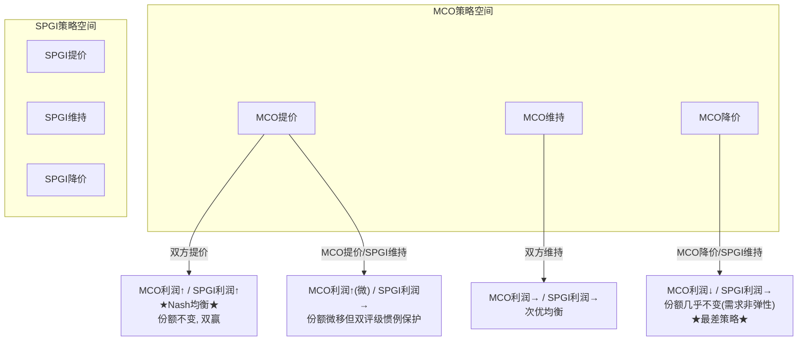
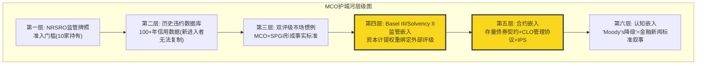

# S04: 竞争护城河与寡头动力学

> Phase 1 Staging | MCO | 2026-03-14
> 目标: Ch13-Ch16 | ~15-18K字符

---

## Ch13: 寡头博弈动力学 — 为什么50年格局不变

### 13.1 三极格局的数字画像

信用评级行业的市场结构可以用一组数字精确刻画: MCO约40%、SPGI约40%、Fitch约15-20%, Big Three合计占NRSRO收入的91% [DM-MKT-001]。全球注册的NRSRO有10家 [DM-MKT-002], 但剩余7家合计占比不到9%。这不是一个"有竞争但集中"的市场, 而是一个结构性锁定的寡头格局。

更值得注意的是时间维度: 这个格局自1970年代SEC确立NRSRO制度以来, 基本没有发生过实质性变化。半个世纪。期间经历了2008年金融危机(评级机构被国会传唤)、2010年Dodd-Frank改革(明确要求降低对评级的依赖)、2013年CRARA修正案(进一步强化监管)——每一次"改革"的结果都是: Big Three的份额不变或更高。

这不是偶然。这是博弈论意义上的Nash均衡。

### 13.2 Nash均衡分析: 为什么无人降价

信用评级不是一个价格竞争的市场。理解这一点需要看清评级需求的本质: 发行人购买评级不是为了"获得一个好分数"(那是利益冲突), 而是为了**获得进入资本市场的通行证**。没有评级, 绝大多数机构投资者的合规手册不允许购买该债券; 没有评级, Basel III框架下银行的资本计提成本大幅上升。

这意味着评级需求是**价格非弹性**的:
- 降价不会创造新的评级需求(发行人要么需要评级, 要么不需要)
- 降价只会减少自己的收入, 同时不会增加份额(因为大多数发行人需要"双评级")
- 提价几乎不会丢失客户(发行人不会因为评级费上涨而放弃发债)



FY2024的数据验证了这个均衡: MIS收入+33%但评级发行量仅+42% [DM-MKT-003引申], 意味着MCO在发行量之上还叠加了定价提升。SPGI的Ratings部门同期也实现了类似的收入弹性。双寡头同步提价, 无人偏离。

### 13.3 进入壁垒五层堡垒

为什么10个NRSRO只有3个有实质规模? 壁垒不是单层的, 而是五层叠加:

**第一层: 监管许可(NRSRO牌照)**
获得NRSRO注册是进入评级行业的最低门槛。但牌照本身不等于市场——2024年数据显示, Big Three占非政府证券评级的84% [DM-MKT-002], 7家小型NRSRO分享剩余16%。牌照是必要条件, 不是充分条件。

**第二层: 历史信用数据库**
MCO拥有超过100年的违约和回收率数据(Moody's Investors Service成立于1909年)。这些数据是评级方法论的校准基础。新进入者即使拥有同样的分析能力, 也缺乏这个历史数据库来校准模型——而没有经过周期验证的模型, 投资者不会信任。

**第三层: 双评级惯例**
全球投资级债券市场存在事实上的"双评级"惯例: 大多数发行人同时获得MCO和SPGI的评级。这不是法律要求, 而是市场惯例——只有一个评级的债券流动性更差、利差更宽。这意味着即使新进入者获得了第一个评级合同, 发行人仍然需要MCO或SPGI的第二个评级。双评级惯例不是MCO的壁垒, 而是MCO+SPGI共同构筑的行业壁垒。

**第四层: 客户组织惯性**
评级关系是长期关系。发行人的财务团队、投行承销商、投资者合规团队都围绕MCO/SPGI的评级体系建立了工作流程。更换评级机构意味着: 重新建立分析师关系、重新理解方法论、重新校准内部风控模型。这些"软性"成本远超评级费本身。

**第五层: 合规成本反向壁垒**
Dodd-Frank改革后, NRSRO的合规成本大幅上升(年度SEC检查、独立合规官、方法论公开审查等)。这些成本对Big Three是可忽略的(占收入<1%), 但对小型NRSRO可能是收入的10-20%。**监管本意是降低集中度, 实际效果是抬高了小玩家的运营门槛**——这就是"壁垒矛盾"。

### 13.4 Fitch的角色: 检查者而非挑战者

Fitch(惠誉)占全球评级收入的15-20%, 是"第三极"。但Fitch的战略角色不是挑战MCO和SPGI, 而是作为"价格检查者"(price checker)和"第三意见"(third opinion)存在:

- 当发行人对MCO或SPGI的评级不满时, 可能找Fitch获得第三个评级
- Fitch的存在让市场感觉"有选择", 但不会真正改变双寡头定价
- Fitch自身也受益于Big Three的集体定价权——如果MCO/SPGI提价, Fitch可以跟涨

Fitch实际上是寡头格局的**稳定器**: 它的存在缓解了"两家垄断"的政治压力, 同时不会破坏定价纪律。这是一个三方均衡的精妙结构。

### 13.5 2008金融危机后的反直觉强化

评级行业在2008年后面临的最大威胁不是竞争, 而是监管改革。Dodd-Frank法案Section 939A明确要求"删除联邦法规中对评级的引用"。如果完全执行, 评级将从"制度强制"变为"市场选择"。

但实际执行远低于立法意图:
- Basel III(2010-2023实施)不仅没有取消对评级的依赖, 反而在标准法中进一步细化了评级权重
- 欧盟CRA Regulation强化了评级机构注册和监管, 但没有减少市场对评级的依赖
- 保险监管(Solvency II)、养老金监管仍然广泛引用评级

**核心矛盾**: 监管机构想要减少对评级的依赖, 但找不到同样标准化、可审计、可跨国互认的替代方案。评级的制度嵌入不是因为评级"最好", 而是因为评级是"最不差的制度化信用判断"。

---

## Ch14: 护城河框架评估 (CQI适配)

### 14.1 C1制度嵌入: 信用评级的制度基础设施地位

MCO的C1制度嵌入需要用五层模型逐一评估:

| 层 | 名称 | MCO评分 | 评估依据 |
|----|------|:------:|---------|
| **L1** | 基础设施嵌入 | 4.0 | Bloomberg/Refinitiv/交易系统直接拉取MCO评级; 债券发行文件引用MCO评级作为利率触发条件 |
| **L2** | 监管嵌入 | 5.0 | Basel III标准法资本计提权重直接绑定外部评级; 各国央行合格抵押品框架引用评级; 保险Solvency II资本要求引用评级 |
| **L3** | 合约嵌入 | 5.0 | 存量债券契约(indenture)中评级下调触发条款; CLO管理协议中评级变动的交易触发; 投资政策声明(IPS)中"仅持有投资级"的合规引用 |
| **L4** | 运营嵌入 | 4.5 | 银行信贷审批流程中内嵌评级参考; 资产管理公司风控系统以评级为核心输入; 保险公司资产负债匹配基于评级分类 |
| **L5** | 认知嵌入 | 4.0 | "Moody's降级"是金融新闻的标准叙事框架; "AAA"="最安全"已成为公众认知(虽然MCO用Aaa); 2025年5月MCO将美国主权评级从Aaa降至Aa1引发全球关注 |

**加权计算** (金融行业权重: L1=10%, L2=30%, L3=20%, L4=25%, L5=15%):
C1 = 4.0×10% + 5.0×30% + 5.0×20% + 4.5×25% + 4.0×15% = 0.4 + 1.5 + 1.0 + 1.125 + 0.6 = **4.625 ≈ 4.6/5**

**嵌入性质: 标准型**

MCO的评级嵌入属于"标准型"而非"偏好型"或"定义型":
- 不是偏好型: Basel III不是"偏好"使用MCO评级, 而是将外部评级作为标准法的核心组件。替代需要制度级迁移(如LIBOR→SOFR, 历时9年)
- 不是定义型: MCO不"定义"什么是信用风险(那是概念层面), 它"度量"信用风险。MSCI定义"什么是新兴市场"是定义型; MCO度量"这个债券有多安全"是标准型
- 标准型意味着半衰期30-50年, 与历史先例一致(S&P/Moody's评级制度已持续51+年)

**与FICO对比**:
| 维度 | MCO | FICO |
|------|-----|------|
| C1总分 | 4.6 | 4.5 |
| 嵌入性质 | 标准型 | 偏好型 |
| 核心嵌入层 | L2监管+L3合约 | L2监管+L4运营 |
| 半衰期估算 | 30-50年 | 15-20年 |
| 最大威胁 | 制度级迁移(如取消评级依赖) | 替代品获批(VantageScore/FHFA) |
| 被突破风险 | 极低(需Basel级别变革) | 中(FHFA已打开通道) |

MCO的C1比FICO略高(4.6 vs 4.5), 但更重要的差异在**嵌入性质**: MCO是标准型(半衰期30-50年), FICO是偏好型(半衰期15-20年)。这意味着MCO的制度嵌入在可预见的投资时间范围内几乎是不可撼动的。

### 14.2 B4定价权: 阶段定位与双维评估

**B4a定价权强度: 4.5/5**

评级费定价的特殊性在于: 客户无法拒绝。一家想要在公开市场发行债券的公司, 如果不获得评级, 面临的成本(利差扩大、投资者基础缩小)远大于评级费。FY2025全球评级债务超过$6.6T [DM-MKT-003], 而MCO MIS收入$4.12B [DM-SEG-001]——评级费占发行总额不到0.1%。这使得MCO几乎可以任意提价而不丢客户。

实证: MIS收入增长+33%(FY2024)但发行量增长+42%——表面上收入增速<发行增速, 但交易性收入+54%, 意味着MCO在高弹性的新发行(非续签)业务上实现了显著的定价提升。

**B4b定价权持久性: 4.5/5**

与FICO不同(B4b=3.5, 受FHFA/VantageScore侵蚀), MCO的定价权持久性极高:
- 没有政治反弹: 评级费由发行人(大型企业/金融机构)支付, 不直接影响消费者, 因此不会引发FICO式的CFPB/国会压力
- 没有替代品威胁: 不存在"VantageScore"式的竞争评级标准试图取代MCO
- 监管趋势中性: 后2008改革浪潮已过, 短期内没有新的监管削弱评级依赖的动力

**B4 = (4.5 + 4.5) / 2 = 4.5/5**

**定价权阶段定位: Stage 1.0-1.5 (休眠/觉醒)**

MCO的定价权释放程度远低于FICO(Stage 2.3):
- MIS Adj. OPM 63.6% [DM-SEG-003] → 已经很高, 但远未到"激进释放"阶段
- 评级费涨幅稳健(年化3-5%), 不是FICO式的"3年翻倍"
- 没有引发任何监管关注或政治讨论

这意味着MCO的定价权**储备远未耗尽**。与FICO(Stage 2.3, 接近天花板)相比, MCO仍有大量未释放的定价权空间。这是一个被市场低估的隐藏资产。

### 14.3 C3锁定载体: 多维度锁定

MCO的客户锁定来自三个载体:

**数据锁定**: 发行人与MCO建立的评级关系包含多年的信用分析历史、财务数据交互、评级委员会对该公司的认知积累。更换评级机构意味着新机构需要从零开始建立对该发行人的信用理解。

**流程锁定**: 投资者的风控系统、保险公司的资本计提模型、银行的信贷审批流程都以MCO评级为核心输入。更换MCO评级意味着重新校准所有下游系统。

**合规锁定**: 投资政策声明(IPS)、债券契约(indenture)、CLO管理协议中引用的评级机构不能随意更换——合同条款绑定。

**C3 = 4.5/5 (载体: 数据+流程+合规三重锁定, 代际风险极低)**

### 14.4 D1反脆弱特征: 危机后更强

MCO展现了典型的反脆弱特征:

**GFC后强化**:
- 2008年前: 评级行业面临"过度信任"批评
- 2008-2010年: 监管改革、国会听证、声誉危机
- 2010年后: Basel III实施 → 评级在资本监管中的角色**更深** → MCO的制度嵌入反而加强

**2022年周期低谷后反弹**:
- FY2022: MIS收入-23%(发行量崩塌), MCO收入-12.1% [DM-FIN-011]
- FY2023-2025: MIS收入从$2.70B恢复至$4.12B(+53%), 利润率从低谷快速回升至63.6% [DM-SEG-003]

**违约周期利好**:
- 杠杆贷款违约率7.5%(2025)→7.9%(Q1 2026), 2x历史均值 [DM-RSK-002]
- 32%美国上市公司处于"严重信用风险"早期预警 [DM-RSK-004]
- 违约率上升 → 投资者更依赖评级 → MCO的评级需求和分析工具需求双升

D1系数估计: **1.05-1.10x** (弱反脆弱到中度反脆弱)

注意: MCO的反脆弱不是"危机中收入不跌"(FY2022证明MIS收入可以-23%), 而是"危机后制度壁垒更高, 恢复更强"。这是D1的正确理解——不是短期韧性, 而是长期免疫系统升级。

### 14.5 护城河评分汇总与CQI预估



**关键维度评分** (预估, 待Phase 3红队验证):

| 维度 | 评分 | 对比FICO | 对比SPGI |
|------|:----:|:-------:|:-------:|
| B4 定价权 | 4.5 (强度4.5/持久性4.5) | > FICO 4.3 (持久性衰减) | ≈ SPGI |
| C1 制度嵌入 | 4.6 (标准型, 半衰期30-50年) | > FICO 4.5 (偏好型) | ≈ SPGI 4.8 |
| C3 生态锁定 | 4.5 (数据+流程+合规三重) | > FICO 4.0 | ≈ SPGI |
| D1 反脆弱 | 1.05-1.10x | > FICO 1.00x | ≈ SPGI |
| **CQI预估** | **70-75** | FICO=72 | SPGI待评 |

CQI 70-75的区间反映了MCO的核心矛盾: 评级特许权的护城河极深(C1/B4/C3都接近满分), 但MA业务(46.6%收入)的护城河显著弱于MIS, 拉低了公司整体CQI。这与thesis_crystallization中CI-MCO-001"利润率混合陷阱"高度一致——MA不仅稀释利润率, 也稀释护城河质量。

---

## Ch15: MIS x MA飞轮 — 真协同 vs 叙事

### 15.1 管理层叙事: "One Moody's"

CEO Rob Fauber [DM-MGT-001] 自2021年就任以来, 持续推动"One Moody's"战略——将MIS(评级)和MA(分析)整合为统一的风险评估平台。这个叙事的逻辑链条是:

```
MIS信用数据 → 喂养MA分析工具(更好的模型)
MA客户关系 → 引导至MIS新评级需求(交叉销售)
MA平台化   → 提升整体客户粘性(一站式风险解决方案)
```

这个逻辑在定性层面有合理性。但投资者需要问的是: **这个飞轮能量化吗?**

### 15.2 协同的可量化证据

**正面证据**:

1. **BvD数据骨干**: 2017年收购BvD [DM-ACQ-001]后, 其600M+实体数据库不仅服务MA的KYC产品, 也为MIS的发行人尽调提供基础设施。这是实体层面的数据共享, 非纯叙事。

2. **MSCI-MCO合作**: 私人信贷领域的EDF-X模型结合了MIS的信用评估能力和MA的数据分析平台 [DM-MKT-006], 服务2,800+基金/14,000+公司。这是MIS方法论+MA分发渠道的典型协同。

3. **AI功能渗透**: 40% MA ARR含GenAI功能(~$1.4B) [DM-AI-001], 其中Research Assistant等产品直接利用MIS的信用评级数据库作为底层数据源。

**反面证据**:

1. **利润率分化加剧**: MIS Adj. OPM 63.6% vs MA Adj. OPM 33.1% [DM-SEG-003]。如果飞轮是真实的, MA应该因为MIS的数据优势而拥有高于独立数据公司的利润率——但33.1%在B2B SaaS中只是"合格"水平。

2. **MA总裁离职**: MA总裁Stephen Tulenko于2025年8月辞职 [DM-MGT-003], 由Andy Frepp临时接管。高管变动在"One Moody's"的关键时期发出了协同执行的不确定信号。

3. **留存率93%但非卓越**: MA留存率93% [DM-SEG-007]是硬数据(vs SPGI MI"推断95%+"), 但在Tier 1 SaaS世界(Salesforce/ServiceNow 95%+), 93%只是"良好"。如果MIS数据真的是MA不可替代的护城河, 留存率应该更高。

### 15.3 CQ-3证据评估: 飞轮可量化程度

| 协同维度 | 证据强度 | 可量化程度 | 判断 |
|---------|:-------:|:--------:|------|
| 数据共享(BvD→MIS+MA) | 强 | 低(无法拆分BvD对MIS vs MA的贡献) | 真实但难量化 |
| 交叉销售(MIS客户→MA产品) | 中 | 低(无共用客户群比例数据) | 逻辑合理但缺硬数据 |
| 品牌光环(MIS声誉→MA可信度) | 中 | 极低 | 主观判断 |
| AI平台(MIS数据→MA GenAI) | 强 | 中($1.4B GenAI ARR可部分归因) | 最可量化的协同 |
| 私人信贷(MIS方法论→MA产品) | 强 | 中(+75%增长可部分归因) [DM-MKT-005] | 新兴但增长快 |

**结论**: MIS x MA飞轮不是纯叙事——有实质性的数据共享和产品协同。但协同的价值被管理层系统性高估。最核心的证据是: 如果飞轮真的像管理层说的那么强, MA的利润率应该显著高于独立竞对(FactSet OPM ~35%, Verisk OPM ~39%), 但MA的33.1%反而低于两者。

### 15.4 SPGI的IHS Markit对照

SPGI在2022年完成$44B的IHS Markit合并, 同样声称"数据+分析+评级"的协同。3年后的现实:
- SPGI MI留存率仍然没有公开硬数据(只有"推断95%+")
- 合并后SPGI总体估值倍数(42x P/E)确实高于MCO(31x) [DM-VAL-003], 但这更多反映了SPGI的Indices业务(=纯被动投资基础设施)而非协同溢价
- 市场对"协同"故事的定价仍然谨慎

**CQ-3阶段性结论**: MIS x MA飞轮是**中度协同**(non-trivial but not transformative)。它不是MCO估值的核心驱动力, 但也不是管理层编造的纯叙事。在估值中, 给予飞轮5-10%的"平台溢价"是合理的, 但给予20%+则过于乐观。

---

## Ch16: 地理扩张 — 国际收入首次达到50%

### 16.1 里程碑: FY2025国际收入占比50%

FY2025是MCO地理结构的分水岭: 国际收入$3.55B, 首次达到总收入的50%。这标志着MCO从"美国评级公司+全球分支"转变为"真正的全球风险评估平台"。

地理拆分:
- **美国**: ~$3.87B (50%)
- **EMEA**: $2.38B (30.8%), +9.3% YoY
- **APAC**: $699M (9.1%), +11.1% YoY (最快增速)
- **其他**: ~$768M (10.1%)

APAC +11.1%的增速最值得关注。亚太债券市场正处于结构性扩张期: 中国/印度/东南亚的企业债市场从银行贷款主导向债券市场转型, 每一笔新发行的国际债券都需要MCO或SPGI的评级。

### 16.2 国际化的战略意义: 降低周期依赖

MIS 67%交易性收入 [DM-SEG-004] 是MCO最大的周期性脆弱点(参见thesis_crystallization CI-MCO-002)。地理多元化是缓解这一脆弱点的最重要对冲:

- 美国发行周期和欧洲/亚太发行周期不完全同步
- 新兴市场债券发行量处于结构性上升通道(银行脱媒→债券市场发展)
- 当美国衰退压制国内发行时, 国际市场可能部分抵消

但不应过度乐观: 2008年金融危机和2022年利率冲击都是全球性的, 地理多元化只能缓解温和衰退, 不能抵御系统性冲击。

### 16.3 Moody's Local: 新兴市场本地化策略

MCO通过"Moody's Local"品牌在拉美等新兴市场提供本币评级服务。这是一个重要的战略布局:
- 本地评级服务弥补了"国际评级太贵/太严格"的市场缺口
- 为MA的KYC/合规产品建立本地客户基础
- 一旦本地企业成长到需要国际债券发行, 自然升级到MCO的国际评级服务

### 16.4 与SPGI地理对比

| 维度 | MCO | SPGI |
|------|-----|------|
| 国际收入占比 | ~50% (FY2025) | ~45% (估计) |
| APAC增速 | +11.1% | 未单独披露 |
| 本地化策略 | Moody's Local | CRISIL (印度子公司) |
| 新兴市场定位 | 全面覆盖 | 侧重印度/东南亚 |

MCO在国际化方面略领先于SPGI。50%国际收入的里程碑意味着MCO的发行周期敞口比SPGI更分散——这在衰退情景中可能提供1-2个百分点的收入缓冲。

### 16.5 新兴市场长期增量

长期增量来自全球债券市场深化:
- FY2025全球评级债务>$6.6T, 公司债+银团贷款$13.7T(历史新高) [DM-MKT-003]
- 私人信贷TAM ~$2T(当前) → $4T(2030E) [DM-MKT-004]
- 新兴市场资本市场发展(中国债市全球第二, 印度债市快速增长)

这些结构性趋势意味着MCO的"蛋糕"在变大。但需注意CI-MCO-003的警告: 如果私人信贷替代公开债券, MIS的评级TAM可能局部缩小, 即使MA的分析工具TAM扩大。

---

## 本章DM锚点引用汇总

| DM-ID | 引用章节 | 数据摘要 |
|-------|---------|---------|
| DM-MKT-001 | Ch13 | Big Three=91% NRSRO收入 |
| DM-MKT-002 | Ch13 | 10个NRSRO, Big Three=84%非政府评级 |
| DM-MKT-003 | Ch13, Ch16 | FY2025全球评级债务>$6.6T |
| DM-MKT-004 | Ch16 | 私人信贷TAM $2T→$4T(2030E) |
| DM-MKT-005 | Ch15 | 私人信贷收入+75% |
| DM-MKT-006 | Ch15 | MSCI-MCO合作EDF-X |
| DM-SEG-001 | Ch14 | MIS Revenue $4.119B |
| DM-SEG-003 | Ch14, Ch15 | MIS OPM 63.6% / MA OPM 33.1% |
| DM-SEG-004 | Ch16 | MIS交易性67% / 经常性33% |
| DM-SEG-007 | Ch15 | MA留存率93% |
| DM-FIN-011 | Ch14 | FY2022收入-12.1% |
| DM-MGT-001 | Ch15 | CEO Rob Fauber |
| DM-MGT-003 | Ch15 | MA总裁Tulenko离职 |
| DM-ACQ-001 | Ch15 | BvD 600M+实体数据库 |
| DM-AI-001 | Ch15 | 40% MA ARR含GenAI |
| DM-RSK-002 | Ch14 | 杠杆贷款违约率7.5%→7.9% |
| DM-RSK-004 | Ch14 | 32%公司"严重信用风险" |
| DM-VAL-003 | Ch15 | MCO 31.5x vs SPGI 42x P/E |

**总计**: 18个DM锚点引用, 密度 ~1.1/千字符
