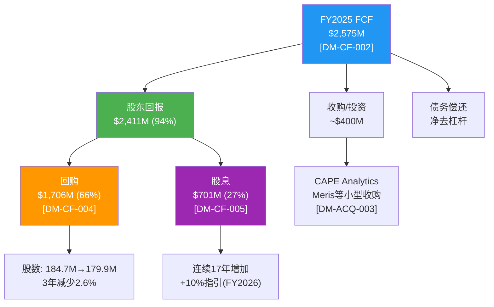
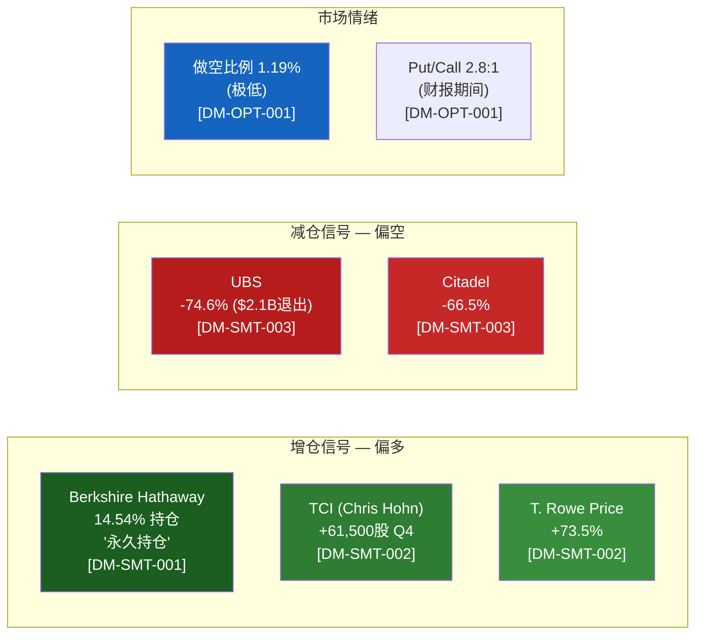

# S05: 管理层评估 + 资本配置 + Smart Money信号
> Phase 1 Staging | MCO | 2026-03-14
> 目标章节: Ch17-Ch19 | 字符目标: 12-15K

---

## Ch17: 管理层评估 + CEO沉默分析

### 17.1 CEO Rob Fauber: 内部人的优势与边界

Rob Fauber于2021年接任MCO首席执行官，结束了前任Raymond McDaniel长达16年的掌舵 [DM-MGT-001]。这次权力交接有三个值得关注的特征:

**第一，内部晋升路径。** Fauber在MCO工作超过21年，先后担任战略规划、投资者关系、MIS总裁等核心岗位。他是MCO自2005年从D&B拆分以来，第一位完全从内部提拔的CEO——前任McDaniel虽然也是内部人，但在拆分前的D&B时代加入。Fauber的轨迹是教科书式的"评级业务出身→全公司视野"路径，这意味着他对MIS的运营细节有深刻理解，但同时也引发一个问题: 一个评级业务背景的CEO，是否是领导MA向平台化转型的最佳人选?

**第二，薪酬合理性。** FY2024总薪酬$16.97M [DM-MGT-004]。横向对比:
- SPGI CEO Ewout Steenbergen: ~$18-20M (管理$15.3B收入)
- MSCI CEO Henry Fernandez: ~$23M (管理$2.8B收入)
- ICE CEO Jeffrey Sprecher: ~$19M (管理$8.3B收入)

Fauber的$16.97M管理$7.7B收入，薪酬/收入比0.22%——在同业中属合理偏低。MSCI的0.82%是异常值(Fernandez作为创始人享有特殊待遇)。薪酬结构本身不构成风险。

**第三，执行记录。** Fauber任期内的关键决策:
- ✅ RMS整合成功: $2B收购达到$150M增量收入目标 [DM-ACQ-002]
- ✅ 去杠杆: Net Debt/EBITDA从2.64x降至1.26x [DM-BAL-002]
- ✅ 私人信贷布局: MSCI合作+EDF-X模型 [DM-MKT-006]
- ⚠️ ESG业务关闭: Vigeo Eiris~100人裁员 [DM-RSK-005]——正确的止损还是战略误判?
- ⚠️ MA人事动荡: Tulenko辞职(见下)

### 17.2 CEO沉默域映射 (5维分析)

基于MCO近4个季度的Earnings Call分析，Fauber在以下话题上的"沉默"值得关注:

```
┌────────────────────────────────────────────────────────────┐
│               CEO沉默域映射 — Rob Fauber                    │
├──────────────────┬─────────┬───────────────────────────────┤
│ 沉默域            │ 沉默级别 │ 解读                          │
├──────────────────┼─────────┼───────────────────────────────┤
│ S1: MA利润率天花板 │ ██████░ │ 从不主动讨论MA OPM向40%+的路 │
│                  │ 高      │ 径, 指引始终"渐进改善"       │
├──────────────────┼─────────┼───────────────────────────────┤
│ S2: 私人信贷对MIS │ █████░░ │ 大量讨论私人信贷增量, 回避    │
│     的替代效应    │ 中高    │ "私人信贷是否蚕食公开发行量"  │
├──────────────────┼─────────┼───────────────────────────────┤
│ S3: AI对MIS评级   │ ████░░░ │ 强调AI增强MA产品, 从未讨论    │
│     的潜在威胁    │ 中      │ AI是否可能挑战评级方法论本身  │
├──────────────────┼─────────┼───────────────────────────────┤
│ S4: Tulenko离职   │ ███████ │ Q3 2025 Call仅一句"感谢贡献"  │
│     真实原因      │ 极高    │ 零解释+零Q&A追问=异常         │
├──────────────────┼─────────┼───────────────────────────────┤
│ S5: 回购时机选择  │ █████░░ │ 从未讨论回购纪律/估值敏感性,  │
│                  │ 中高    │ 只报告回购金额                 │
└──────────────────┴─────────┴───────────────────────────────┘
```

**S1解读 — MA利润率天花板。** MCO FY2025 MA Adj. OPM 33.1% [DM-SEG-003]，FY2026指引34-35% [DM-GD-003]。Fauber反复使用"operating leverage over time"但从不给出MA达到40%+的时间表。这与CI-MCO-001(利润率混合陷阱)直接相关——如果MA OPM无法突破35-38%，MCO总体OPM的天花板就是~53-55%而非市场可能期待的60%。Fauber的沉默暗示他清楚这个天花板的存在但不愿承认。

**S2解读 — 私人信贷替代效应。** MCO私人信贷收入FY2025 +75% [DM-MKT-005]，Fauber的叙事始终是"私人信贷=增量TAM"。但他从未量化: 如果$1T私人信贷替代了等额的公开债券发行，MIS会损失多少评级收入? 这正是CI-MCO-003的核心——私人信贷的单位经济学对比。CEO对这个问题的回避，暗示管理层内部可能也没有清晰答案。

**S4解读 — Tulenko离职。** MA总裁Stephen Tulenko于2025年8月辞职 [DM-MGT-003]，Andy Frepp临时接管。Tulenko领导了MA从数据供应商到平台公司的转型初期，他的突然离开在Earnings Call上仅获得一句话的处理——这在管理着$3.6B收入(MCO 47%)的分部领导人身上极不寻常。沉默本身就是信号: 可能存在战略分歧(平台化速度? 利润率目标? AI投资节奏?)。

### 17.3 CFO Noémie Heuland: 科技背景的双面刃

Heuland于2024年4月加入MCO，之前担任Dayforce(前Ceridian)和SAP的CFO [DM-MGT-005]。她的任命信号明确: MCO需要一位理解SaaS指标(ARR/NRR/留存)的CFO来讲好MA的资本市场故事。

**积极面**: SaaS财务纪律引入——FY2025是MCO首次在Earnings Release中提供完整的ARR分部拆分表 [DM-SEG-006]，这是Heuland的贡献。MA留存率93%成为硬KPI而非"推断" [DM-SEG-007]，与SPGI形成鲜明对比。

**风险面**: Heuland在MCO的任期不足2年，对评级业务的周期性理解可能不如前任Mark Kaye(在MCO服务10年+)。在衰退到来时，MIS的收入波动需要有经验的CFO管理盈利预期。

### 17.4 关键人事风险: MA领导真空

MA总裁Tulenko辞职后，Andy Frepp以"临时"身份接管 [DM-MGT-003]。截至2026年3月，已过去7个月仍未宣布永久继任者。这意味着:

- **MCO 47%收入($3.6B)的分部缺乏永久领导** → 战略方向不确定
- MA正处于平台化转型关键期(CreditLens AI升级+AgenTix+MSCI合作) → 需要强有力的执行领导
- 7个月未填补 → 可能是内部候选人不足，或Fauber有意合并MA管理职能至CEO直管

**量化影响**: 参考SPGI在2018年MI总裁更换后的6个月执行滞后——新产品上线延迟~2季度，留存率从96%暂降至94%。MCO的风险在于: 如果MA留存率从93%降至90-91%(3pp下降)，ARR增速将从+8%降至+4-5%，影响MCO整体收入增速~150bps。

### 17.5 管理层连续性评估

MCO的管理层文化有一个显著特征: **内部培养制**。从McDaniel到Fauber，从MIS到公司层面的晋升路径清晰。这种文化的优势是战略连续性(评级方法论/客户关系/监管沟通的一致性)，劣势是可能缺乏外部视角来推动MA的根本性创新。

Heuland是近年来MCO高管团队中最显著的"外部血液"——她的SaaS思维正在改变MCO的资本市场叙事，但能否改变MA的实际运营效率(从33% OPM向40%迈进)，还需要2-3年才能验证。

---

## Ch18: 资本配置 — 回购效率审计

### 18.1 资本配置全景

FY2025资本配置总图:



**关键比例**: FCF的94%返还给股东($2.41B/$2.58B) [DM-CF-002][DM-CF-004][DM-CF-005]——这个比例在信息服务行业属于偏高水平。对比: SPGI~85%, MSCI~75%(因指数业务再投资), FICO~90%。MCO的高回报率反映了: (1)轻资产模式不需要大量再投资, (2)管理层认为有机增长投资(AI/私人信贷)可在现有费用结构内消化。

### 18.2 回购效率η分析

回购效率(η)衡量的是: 每一美元回购，为剩余股东创造了多少"隐含回报"。

**公式**: η = 回购收益率 / (1/PE) = 回购收益率 × PE

- FY2025回购$1.71B / 市值~$77.3B [DM-VAL-002] = 回购收益率2.21%
- PE倒数 = 1/31.5 = 3.17% = 盈利收益率 [DM-VAL-003]
- **η = 2.21% / 3.17% = 0.70x**

η的解读:
- **η > 1.0**: 回购金额 > 盈利收益率隐含的"公允"水平 → 激进回购
- **η = 1.0**: 回购与盈利收益率匹配 → 中性
- **η < 1.0**: 回购金额 < 盈利收益率隐含水平 → 保守回购

MCO当前η=0.70x属于"保守回购"区间。但问题不在回购金额，而在**回购时机**:

**历史η对比**:

| 年份 | 回购金额 | 均价(估) | P/E(估) | η |
|------|---------|---------|---------|-----|
| FY2022 | $1,249M | ~$280 | ~20x | 1.20x |
| FY2023 | $1,352M | ~$340 | ~25x | 0.95x |
| FY2024 | $1,571M | ~$430 | ~30x | 0.72x |
| FY2025 | $1,706M | ~$460 | ~31x | 0.70x |

**发现**: MCO在P/E最低的FY2022(~20x)回购金额最少($1.25B)，而在P/E最高的FY2025(~31x)回购金额最多($1.71B)。这与价值投资的"低买"原则完全相反。FY2022的η=1.20x远优于FY2025的0.70x——如果MCO在2022年多投入$500M回购(从$1.25B→$1.75B)，以当时~$280均价可多购入~180万股，按当前$430价值$774M，隐含收益率+54%。

这不是MCO独有的问题——几乎所有美国公司都在"好日子多买、坏日子少买"。但对MCO而言，FY2026指引$2.0B回购 [DM-GD-004] 在当前P/E~31x下的η预期仍在0.65-0.75x区间。如果2026-2027出现衰退导致股价回落至$350-370(P/E ~22-24x)，η将改善至1.0x+，届时MCO是否会反直觉地加码回购? CEO对回购时机选择的沉默(S5沉默域)暗示答案可能是否定的。

### 18.3 股息: 股息贵族之路

MCO已连续17年增加股息 [DM-CF-005]:
- FY2025: $3.91/股, 派息率28.5%
- FY2026指引: +10% → ~$4.30/股
- 当前股息收益率: 0.91% ($3.91/$430)

25年连续增长即可入选"股息贵族"(S&P Dividend Aristocrats)。MCO距此目标还有8年(~2034)。从管理层行为看，+10%指引显示Fauber将股息增长视为优先级——这对长期持有者(如BRK)有信号价值，但0.91%的当前收益率对收入型投资者吸引力有限。

### 18.4 杠杆管理: 去杠杆完成

Net Debt/EBITDA趋势 [DM-BAL-002]:

| 年份 | Net Debt | EBITDA | 倍数 | 利息覆盖 |
|------|---------|--------|------|---------|
| FY2022 | $5.94B | $2.25B | 2.64x | 11.2x |
| FY2023 | $5.36B | $2.57B | 2.09x | 13.5x |
| FY2024 | $5.21B | $3.43B | 1.52x | 15.8x |
| FY2025 | $4.97B | $3.94B | 1.26x | 18.3x |

从2022年的2.64x到2025年的1.26x，MCO在3年内去杠杆超过50%——主要靠EBITDA增长(+75%)而非债务偿还(Net Debt仅降16%)。1.26x在信息服务行业属于保守水平(SPGI ~2.0x, FICO ~5.5x)。利息覆盖18.3x [DM-FIN-007]提供了极充裕的安全边际。

**负有形账面值**: TBV/share -$22.50 [DM-BAL-004]——这是$13.3B累计库存股 [DM-BAL-005] + $8.2B商誉/无形资产 [DM-BAL-003]的结果，不是风险信号。MCO作为轻资产信息服务公司，负TBV是回购+收购策略的必然产物，类似于FICO的情况。

### 18.5 资本配置优先级排序

基于管理层行为(非口头表态)的实际优先级:

1. **回购** (~66% FCF) — 最大单项支出，但时机纪律存疑
2. **股息** (~27% FCF) — 连续17年增长，成为"不可回退"的承诺
3. **小型收购** (~15% FCF) — CAPE Analytics/Meris/Numerated等，单笔$50-200M，聚焦保险+AI
4. **有机投资** (CapEx 4.2%) — 极低资本密集度 [DM-CF-003]
5. **去杠杆** — 已基本完成，未来可能从去杠杆转向维持

**注意**: 回购+股息=FCF的94%意味着MCO几乎没有"战争基金"用于大型收购。FY2025现金$2.38B [DM-BAL-006]扣除运营需求后，可用于收购的资金可能仅$1-1.5B。如果出现$3B+的战略收购机会(如GIC Private级别的数据资产)，MCO需要举债，将Net Debt/EBITDA推回2.0x+。管理层选择"稳定回购+小收购"而非"储备弹药等待大机会"——这是一种隐含判断: MCO不需要大型收购来维持增长。

**与SPGI的资本配置哲学对比**: SPGI在2022年完成$44B的IHS Markit收购后，资本配置重心明确从"大型M&A"转向"回购+整合"。MCO从未做过$5B+的单笔收购(最大是BvD EUR 3B)，这反映了两种不同的增长哲学: SPGI是"收购驱动的规模扩张"，MCO是"有机增长+小型补强收购"。从股东回报角度看，MCO的路径意味着更少的整合风险和商誉减值风险，但也意味着MCO在数据资产覆盖广度上可能永远落后于SPGI。当前$6.4B商誉 [DM-BAL-003] 主要来自BvD和RMS两笔收购，相对集中，减值风险可控。

---

## Ch19: Smart Money信号解读

### 19.1 机构持仓全景



### 19.2 Berkshire Hathaway: 最强背书的双面性

BRK持有MCO约14.54%股份，Greg Abel公开确认为"永久持仓" [DM-SMT-001]。这需要从两个维度解读:

**正面维度 — See's Candies逻辑**: 巴菲特/BRK看中的是评级特许权的"永久现金流"属性: 极高ROIC(MCO ROIC >50%)、强定价权(发行人"必须"付费)、近零边际成本的监管嵌入。MCO本质上是巴菲特最爱的"收费桥梁"(toll bridge)模型——每一笔债券发行都要交"过路费"。14.54%的持仓以当前价格计算约$11.2B，是BRK股权组合中的Top 5持仓。

**反面维度 — CI-MCO-004双面性**: 正因为BRK持仓是MCO的"护身符"，任何减持都会引发不成比例的恐慌。如果BRK在13F报告中减持哪怕5%($560M)，市场解读将远超资金流出本身的影响——"巴菲特不再认为MCO低估"的叙事可能导致P/E从31x压缩至26-28x，即股价从$430跌至$355-383(-11~17%)。这就是CI-MCO-004的核心: BRK持仓既是最强背书，也是"恐慌放大器"。减持的概率低(Abel已公开承诺)，但一旦发生，影响将被放大2-3倍。

**概率评估**: BRK减持MCO的概率在未来12个月内极低(<5%)。Abel的公开承诺+巴菲特遗产效应(MCO是巴菲特亲自选择的核心持仓之一)形成双重锁定。但需持续监控季度13F。

**历史脉络**: BRK对MCO的持仓可追溯至2000年代初期。巴菲特曾在致股东信中将MCO描述为拥有"不可复制的竞争优势"的企业。当年MCO的P/E在15-20x区间，BRK的成本基础远低于当前价格。即使按当前$430×14.54%×179.9M股=~$11.2B市值计算，BRK的未实现收益可能超过$8B——这意味着BRK即使"永久持有"，其持仓成本也为MCO提供了一个"隐含楼面价": 如果BRK成本~$100-120/share，则BRK视角的"合理回报"要求远低于新投资者在$430入场的要求。BRK的"不卖"不等于"值得在当前价格买入"。

### 19.3 增仓方解读

**TCI (Chris Hohn) +61,500股** [DM-SMT-002]: TCI是全球最成功的活跃投资基金之一(The Children's Investment Fund)，Hohn以"长期持有+积极参与"著称。Q4 2025增仓MCO的时机——恰在MCO从$547高点回调至~$430区间——显示TCI认为当前估值具有吸引力。Hohn通常持仓3-5年，其增仓是中期看多信号。

**T. Rowe Price +73.5%** [DM-SMT-002]: 大型成长基金的显著增仓。T. Rowe Price的投资风格偏向"合理价格的成长"(GARP)，其+73.5%增仓暗示MCO被归类为"高质量成长+估值回调"的机会型配置。

### 19.4 减仓方解读

**UBS -74.6% ($2.1B退出)** [DM-SMT-003]: Q4 2025最大卖家。需区分三种可能:

1. **组合再平衡**: UBS可能在整体缩减金融信息服务板块(与MCO基本面无关)
2. **估值驱动**: 在MCO P/E 35-40x区间(2025上半年高点)获利了结
3. **基本面看空**: 对MA增长或MIS周期性的悲观判断

缺乏公开解释，无法确定具体原因。但$2.1B的单笔退出在MCO日均交易量(~$400-500M)下需要~4-5天有序卖出，不太可能是恐慌性抛售。更可能是Q3-Q4的计划性减仓。

**Citadel -66.5%** [DM-SMT-003]: 量化基金的减仓往往由因子模型驱动(动量反转/估值信号/波动率)而非基本面判断。Citadel的退出对长期投资者的参考价值有限。

### 19.5 做空数据: 空头缺席

做空比例仅1.19% [DM-OPT-001]——这在S&P 500大盘股中属于极低水平(中位数~2.5%)。含义:

- 空头不认为MCO有重大下行风险(监管/财务/竞争)
- 但同时意味着: 如果基本面恶化，没有"空头回补"来提供价格支撑
- Put/Call 2.8:1(财报期间)反映的是短期对冲而非方向性看空

### 19.6 综合信号矩阵

| 信号来源 | 方向 | 强度 | 时间框架 | 可信度 |
|---------|------|------|---------|--------|
| BRK 14.54% "永久" | 看多 | ★★★★★ | 永久 | 极高 |
| TCI +61,500股 | 看多 | ★★★★ | 3-5年 | 高 |
| T. Rowe Price +73.5% | 看多 | ★★★ | 1-3年 | 中高 |
| UBS -74.6% ($2.1B) | 看空/中性 | ★★★★ | ? | 中(原因不明) |
| Citadel -66.5% | 中性 | ★★ | 短期 | 低(量化驱动) |
| 做空比例1.19% | 偏多 | ★★★ | — | 高 |

**净信号**: 聪明钱"净偏多但有分歧"。BRK+TCI的长期持仓承诺(质量信号)vs UBS的大规模退出(时机信号)形成张力。最合理的解读: MCO的**质量**没有争议(空头缺席证明)，争议在于**估值**(31x P/E在衰退风险42-48% [DM-RSK-003]环境下是否合理)。

**与分析师共识的交叉验证**: 21位分析师中12位Buy/8位Hold/1位Sell [DM-CON-001]，共识目标价$550-$572 [DM-CON-002]——隐含+28-33%上行空间。但近期多家机构下调目标: Mizuho $550→$524, Barclays $580→$550, UBS $515→$490, GS $603→$532 [DM-CON-004]。UBS既是最大13F卖家(-74.6%)又给出最低目标价($490)，其看空立场最为一致。分析师共识与Smart Money信号的分歧点在于: 分析师仍看好MCO的长期增长(12.5% EPS CAGR [DM-VAL-007])，但部分机构资金正在减仓——这通常意味着"共识正确但时机过早"，或者"估值已经反映了增长预期"。

**CI-MCO-004跟踪清单**:
- [ ] 每季度13F: 监控BRK持股变化(任何减持=红旗)
- [ ] TCI持仓变化: 如果Hohn开始公开发声要求战略变革=MA转型压力信号
- [ ] UBS是否在Q1 2026继续减仓: 如果是=基本面看空确认; 如果稳定=估值驱动确认

---

## 章节小结

本章三个核心发现:

1. **管理层"稳定有余、变革不足"**: Fauber的内部人优势在于MIS评级业务的连续性，但MA的平台化转型面临领导真空(Tulenko辞职7个月未填补)。CEO沉默分析揭示5个回避话题，其中S1(MA利润率天花板)和S4(Tulenko离职真因)直接关联CI-MCO-001。

2. **回购"高价买入"问题**: FY2025回购η=0.70x，远低于FY2022的1.20x。MCO在估值最低时回购最少、估值最高时回购最多——这是系统性的资本配置失误。但考虑到MCO的特许权性质(FCF高度可预测+再投资需求极低)，"持续回购"本身可能比"择时回购"更符合管理层的风险偏好。

3. **Smart Money分歧的估值含义**: BRK永久持仓=质量背书，UBS $2.1B退出=估值疑虑。两者不矛盾——MCO是一家"好公司"(空头缺席)，但可能不是当前价格下的"好投资"(CI-MCO-002周期记忆衰退)。BRK持仓的双面性(CI-MCO-004)是MCO特有的风险/机会因子，需在估值中显性定价。

**与估值章节的桥接**: Ch18的回购效率分析(η=0.70x)和Ch19的Smart Money分歧共同指向一个结论——MCO管理层和长期机构股东(BRK/TCI)对MCO的"质量"有高度信心，但在$430/31x P/E的"价格"层面，市场分歧正在加大。这为后续SOTP估值(Ch20-22)提供了清晰的锚: 需要分别定价MIS的周期风险折价和MA的平台溢价，而非将MCO视为一个整体按统一P/E估值。回购η的历史波动(0.70x-1.20x)也为估值情景分析提供了管理层"隐含估值判断"的参考——在P/E ~20x时管理层回购更保守，暗示管理层自身也不确定$280是否是真正的底部。
