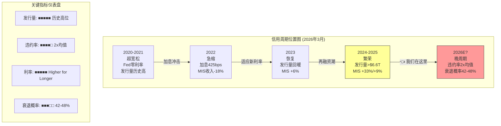
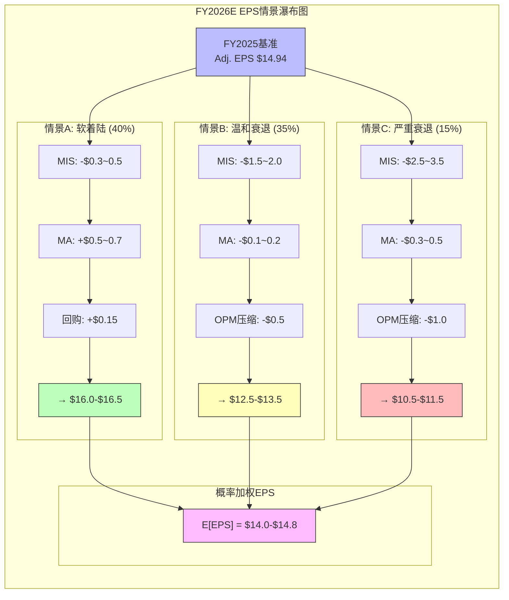

# S06: 宏观信用周期 + 衰退情景 + MCO的双重角色
> Phase 2 Staging | MCO | 2026-03-14
> 目标章节: Ch20-Ch22 | 字符目标: 15-18K

---

## Ch20: 信用周期定位 — MCO的"天气系统"

### 20.1 当前位置: 周期高位的三重确认

理解MCO，必须先理解它所嵌入的"天气系统"——信用周期。MCO不是一家可以脱离宏观环境独立分析的公司。MIS 53.4%的收入占比 [DM-SEG-001]，其中67%为交易性收入 [DM-SEG-004]，意味着MCO整体有约36%的收入直接取决于"今天有多少债券需要评级"。这不是一个抽象数字——FY2022那次-12.1%的收入暴跌 [DM-FIN-011] 就是这36%交易性敞口在发行量冻结时的真实面目。

FY2025的数据告诉我们，MCO正站在信用周期的高位。三组数据交叉验证:

**第一，发行量处于历史峰值。** FY2025全球评级债务突破$6.6T，公司债+银团贷款合计$13.7T(实际值历史新高) [DM-MKT-003]。这不是"恢复到正常"——这是超越了2021年那个被低利率催化的超级年。MIS收入从FY2022的$2.70B暴力反弹至FY2025的$4.12B [MIS资产类别拆分表]，三年增长52.6%。Corporate Finance从$1.27B升至$2.13B(+68%)，Structured Finance从$0.46B升至$0.56B(+21%)，Financial Institutions从$0.49B升至$0.76B(+55%)。这种程度的反弹，本身就是周期高位的标志。

**第二，利率环境正在从"催化剂"变成"逆风"。** 过去两年的发行量繁荣，很大程度上受益于2024年降息预期驱动的再融资潮。但Polymarket最新数据显示: Fed 2025年仅1次降息的概率30.5%，通胀维持>3%的概率高达73% [DM-PMK-002]。"Higher for longer"正在从预期变为现实。利率维持高位意味着两件事: (1)新发行的融资成本居高不下，边际发行人被挤出；(2)已经完成再融资的发行人短期内没有新的再融资需求。换言之，2024-2025的发行量盛宴可能已经"透支"了一部分未来需求。

**第三，信用质量正在恶化。** 这是最不应被忽视的信号:
- 高收益债违约率: 3.2%(2025) → >4%(2026Q1预测) [DM-RSK-002]
- 杠杆贷款违约率: 7.5%(2025) → 7.9%(2026Q1预测)，已达历史均值的2倍 [DM-RSK-002]
- 32%的美国上市公司处于MCO自身定义的"严重信用风险"早期预警——这是疫后最高水平 [DM-RSK-004]

三重确认的结论很清晰: 发行量在顶部、利率环境在收紧、信用质量在恶化。这是一个教科书式的"晚周期"配置。

### 20.2 MCO的周期悖论: 违约上升≠评级收入下降

一个常见的分析误区是: "违约率上升→坏事→MCO受损"。现实远比这复杂。MCO与信用周期的关系存在一个悖论——违约率上升时，MCO同时面临收缩和扩张两股力量:

**悖论的正面:** 违约率上升时，MCO的MIS业务面临两个矛盾力量:
1. **负面力量 — 新发行量下降。** 信用恶化→发行人融资成本上升→边际发行人退出市场→新评级需求减少。这是2022年的主要剧本: 发行量萎缩导致MIS交易性收入大幅下滑。Corporate Finance收入从FY2021的$1.88B跌至FY2022的$1.27B(-33%)，几乎所有的缩水都来自新发行交易性收入的蒸发。
2. **正面力量 — 重新评级活动增加。** 违约率上升→降级活动增加→监测费收入稳定/增加→复杂结构化产品需要更频繁的评级审查。这部分属于MIS的经常性收入(33% [DM-SEG-004])，在危机期间反而可能增长。具体包括: 年度监测费(不受发行量影响)、评级展望调整(Outlook/Watch)、信用意见书(Credit Opinions for private placements)、以及特殊评估报告(Special Comment/Research)。

**历史验证:** MIS收入与发行量的正相关系数约为~0.85——高度相关但不是1.0。那个0.15的"缝隙"就是违约活动带来的评级需求增量。三个历史周期的对比:

| 周期 | 发行量变化 | MIS收入变化 | 弹性比 | 特征 |
|------|-----------|-------------|--------|------|
| 2008-2009 GFC | -40~50% | -25~30% | 0.6x | 结构化产品大规模降级活动部分抵消 |
| 2015-2016 能源危机 | -10~15% | -5~8% | 0.5x | 局部行业危机，多数评级不受影响 |
| 2022 加息冲击 | -25~30% | -18% | 0.6x | 非信用事件驱动(利率冲击)，降级活动有限 |

弹性比(MIS收入变化/发行量变化)稳定在0.5-0.6x区间，意味着MIS收入的下跌幅度通常只有发行量跌幅的一半到六成。这个"缓冲"就来自经常性收入和危机期间评级活动的增量。

**当前情景的独特性:** FY2025-2026的信用恶化有一个关键区别: 它(目前)是"慢性"而非"急性"。高收益违约率从3.2%缓慢爬升至4%+，而非像2008年那样从2%跳升至13%。慢性恶化对MCO的影响更为温和: 发行量逐步放缓而非骤停，同时监测活动稳步增加。如果恶化保持"慢性"，MCO可能处于一个相对有利的位置——发行量缓降但不崩塌，而监测收入逐步增厚。

但"慢性"恶化也有一个隐患: 它容易让市场"温水煮青蛙"——习惯性地忽视恶化信号，直到某个催化事件(大型发行人违约、银行倒闭 [DM-PMK-003 17.5%概率])将"慢性"突然转为"急性"。32%的美国上市公司处于"严重信用风险"早期预警 [DM-RSK-004] 就是这种"慢性"积累的定量证据——疫后最高水平意味着潜在的降级管道正在膨胀。

### 20.3 "到期墙": MIS下行保护的硬约束

即使悲观情景成真，MIS的下行也存在一个物理性的保护机制: **到期墙(Maturity Wall)**。

全球公司债在2025-2027年间有约$10-12T到期——这些债务无论经济状况如何，都必须再融资或偿还。对大多数公司而言，"偿还"不是选项(现金不够)，因此"再融资"几乎是唯一出路。再融资就需要评级。

这意味着即使在衰退情景下:
- 新增发行可能大幅萎缩(没人愿意借新钱)
- 但再融资发行不会归零(旧债到期必须续命)
- 评级机构的基本功——给这些再融资债券评级——需求依然存在

$10-12T的到期墙分布:
- 投资级(IG): ~$7-8T → 这部分再融资几乎确定会发生(IG公司通常有稳定的市场准入)
- 高收益(HY): ~$1.5-2T → 部分可能困难但多数仍会完成(利差会扩大)
- 杠杆贷款: ~$1.5-2T → 最不确定的部分(可能转向私人信贷)

保守估计，即使在温和衰退中，$10-12T到期墙中至少$6-7T会以某种形式完成再融资，其中约$4-5T需要公开市场评级(其余可能通过私人信贷/银行贷款完成)。按MCO~40%的评级市场份额估算，这为MIS提供了约$2T的"保底评级量"——大致对应MIS年收入$3.0-3.5B的下限(vs FY2025的$4.12B)。

**关键推论:** 到期墙的存在意味着MIS收入即使在衰退中也不会回到FY2022的$2.70B。这个判断基于两个结构性差异:

1. **FY2022是利率冲击，不是信用事件。** FY2022发行量崩塌的原因是Fed在12个月内加息425bps——这是40年来最快的紧缩速度。市场"冻结"不是因为发行人信用恶化(当时违约率仅~2%)，而是因为没人知道利率会到多高。发行人选择"等一等"。未来如果出现衰退，利率已经在高位(4.25-4.50%)——不存在"从0到5%"这种冲击空间。发行人已经适应了高利率环境，到期墙迫使他们不能无限期地"等"。

2. **到期墙的时间分布有利于MCO。** $10-12T到期不是均匀分布的: 2025年约$3-3.5T，2026年约$3.5-4T，2027年约$3.5-4T。这意味着即使2026年出现温和衰退，约$3.5-4T的债务到期不会因衰退而"消失"——它只会以更高的利差(更昂贵的代价)完成再融资。从MCO的角度看，高利差环境下的再融资可能比低利差环境下的更有利: 因为发行人在高风险环境中更需要高评级作为"通行证"来降低融资成本——MCO的评级价值反而增加了。

3. **私人信贷不能完全替代公开市场再融资。** 有观点认为到期墙的一部分会流向私人信贷市场(绕过评级)。这在边际上是对的，但规模受限: 私人信贷基金的单笔交易规模通常在$500M以下，而到期墙中大量是$1-5B的大型企业债——这个规模只有公开市场才能消化。到期墙中估计最多10-15%可能转向私人信贷，其余85-90%仍需公开市场评级。

---

## Ch21: 衰退情景建模 — 从概率到EPS

### 21.1 衰退概率的两个锚点

评估MCO的衰退风险，有两个值得注意的概率锚点:

1. **Moody's Analytics自身预测: 42-48%** [DM-RSK-003]。首席经济学家Mark Zandi是美国最知名的宏观经济学家之一，他的团队给出的2026年衰退概率几乎是硬币正反面。这个数字的讽刺之处在于: MCO自己的分析部门认为衰退概率接近50%，但MCO的股价仍按31x P/E定价——隐含12.5%的EPS CAGR [DM-VAL-003, DM-VAL-007]。
2. **Polymarket: 34.5%** [DM-PMK-001]。预测市场给出的概率低于Zandi团队约8-14个百分点。这个差异可能反映了两件事: (a)预测市场参与者更偏乐观; (b)Zandi团队对贸易战/关税的影响评估更悲观。

无论取哪个锚点，衰退都不是"尾部风险"——它是一个需要正面建模的基准情景。

### 21.2 三情景框架

以下是三种情景对MCO各分部和合并报表的影响建模。基准: FY2025 Revenue $7.72B [DM-FIN-001]，Adj. EPS $14.94 [DM-CON-003]，FY2026指引Adj. EPS $16.40-$17.00 [DM-GD-001]。

**情景A: 软着陆 (GDP +0.5~1.0%, 概率~40%)**

这是当前共识隐含的路径。经济放缓但不衰退，利率缓慢下降。

| 分部 | 收入影响 | 逻辑 |
|------|---------|------|
| MIS | -3~5% | 发行量从历史高位回落但不崩塌，再融资需求持续 |
| MA | +6~8% | ARR惯性驱动，留存率93%提供底部 [DM-SEG-007] |
| **合并** | **+1~3%** | MA增长部分抵消MIS放缓 |
| **EPS影响** | **$16.0-$16.5** | 略低于指引低端，回购$2.0B贡献~1% [DM-GD-004] |

**情景B: 温和衰退 (GDP -1.0~-1.5%, 概率~35%)**

类似2001年或2020年初: 经济收缩但金融系统不出现系统性风险。

| 分部 | 收入影响 | 逻辑 |
|------|---------|------|
| MIS | -10~15% | 新发行量萎缩25-30%，但到期墙支撑再融资; CF收入从$2.13B回落至$1.7-1.8B |
| MA | -1~-2% | 经常性96%收入几乎不受影响 [DM-SEG-005]，但新签放缓+部分客户推迟扩席 |
| **合并** | **-6~8%** | MIS拖累主导 |
| **EPS影响** | **$12.5-$13.5** | OPM从51%压缩至47-48%(MIS高OPM收入占比下降) [DM-FIN-004] |

EPS压缩幅度(-10~16% vs FY2025)大于收入压缩(-6~8%)，这是MIS经营杠杆效应的直接体现。MIS的成本结构中有一个"不对称性": 分析师薪酬(占MIS成本的50%+)、方法论团队、合规基础设施——这些是固定成本，不会随发行量下降而同比减少。但MIS 67%的交易性收入会。当发行量下滑20%时，MIS的成本可能只下降5-8%(差旅费+奖金弹性部分)，但收入下降15%+，利润以倍数放大收缩。

这就是为什么FY2022收入仅-12%但EPS暴跌-37%(从$11.78到$7.44) [收入趋势6年表]的原因——OPM从45.7%骤降至36.5%，9个百分点的OPM压缩对应约$500M的利润蒸发。

但这次温和衰退的EPS跌幅可能是-10~16%而非FY2022的-37%，有三个缓冲因素:
1. **MA压舱石更重:** MA占比从FY2021的39%升至47%，MA经常性收入96% [DM-SEG-005]——这意味着MCO近一半的收入几乎不受信用周期影响
2. **MA利润率更高:** MA Adj. OPM从FY2022的~25%升至33% [DM-SEG-003]——MA本身贡献的利润绝对值更大，能更有效地"兜住"总利润
3. **杠杆更低:** Net Debt/EBITDA从2.64x降至1.26x [DM-BAL-002]——利息支出$189M [DM-FIN-007] 远低于2022年水平，为EPS提供约$0.3-0.5的额外缓冲

将这三个缓冲量化: MA压舱石效应(抵消~$200-300M MIS利润下滑) + MA利润率改善(增厚~$100-150M) + 低杠杆(节省~$50-80M利息) = 合计$350-530M缓冲，大约相当于EPS $2.0-$3.0。这解释了为什么温和衰退EPS预计$12.5-$13.5(而非FY2022的$7.44)——MCO确实比3年前更有韧性，但这种韧性来自MA的贡献，不是MIS本身变得更防御了。

为了直观理解MCO的韧性提升，将当前结构与FY2022做一个并排对比:

| 韧性维度 | FY2022 (衰退时) | FY2025 (当前) | 改善幅度 |
|---------|----------------|--------------|---------|
| MA收入占比 | 51%($2.77B) | 47%($3.60B) | MA绝对值+30%，但占比下降(MIS恢复更快) |
| MA经常性收入 | ~93% | 96% [DM-SEG-005] | +3pp=更强的收入地板 |
| MA ARR | ~$2.5B(估) | $3.50B [DM-SEG-006] | +40%=更厚的压舱石 |
| MA Adj. OPM | ~25% | 33.1% [DM-SEG-003] | +8pp=更高的利润贡献 |
| Net Debt/EBITDA | 2.64x | 1.26x [DM-BAL-002] | 去杠杆一半，利息负担减轻 |
| FCF Margin | 21.8% | 33.4% [DM-CF-002] | +12pp=更强的现金生成 |
| 股数 | 184.7M | 179.9M | -2.6%=回购的EPS增厚效应 |

这张表的核心结论: MCO在下一次衰退中的"最低EPS"应该显著高于FY2022的$7.44——不是因为MIS变得更防御了(它没有)，而是因为MA变成了一个更大、更赚钱、更稳定的缓冲垫。

**情景C: 严重衰退 (GDP -2.5~-3.0%, 概率~15%)**

类似2008-2009: 信用市场冻结，发行窗口关闭，违约率飙升至8%+。

| 分部 | 收入影响 | 逻辑 |
|------|---------|------|
| MIS | -20~25% | 新发行几乎停滞，仅剩IG再融资+降级监测; CF收入可能跌至$1.5B |
| MA | -3~-5% | 银行/对冲基金削减订阅但核心合规工具不砍; 留存可能降至88-90% |
| **合并** | **-12~15%** | 双杀 |
| **EPS影响** | **$10.5-$11.5** | OPM压缩至43-44%，回购可能暂停(保留流动性) |

这是最悲观的合理情景。但即便在这种情况下，EPS也不会回到FY2022的$7.44——原因还是MA的"压舱石": FY2022时MA还在消化RMS整合的摩擦，而现在MA ARR $3.5B [DM-SEG-006] 提供了一个~$3.3B的经常性收入地板。

### 21.3 概率加权EPS与隐含估值

将三种情景概率加权:

**E[FY2026 Adj. EPS]** = $16.25 × 40% + $13.0 × 35% + $11.0 × 15% + $16.75 × 10%(牛市情景)
= $6.50 + $4.55 + $1.65 + $1.68
= **~$14.4**

对比共识EPS $16.75 [DM-VAL-003]，概率加权后的期望EPS低约14%。这就是CI-MCO-002(周期记忆衰退)的数学表达: **共识定价没有为35%概率的温和衰退+15%概率的严重衰退购买任何"保险"。**

以当前股价$430 [DM-VAL-001] 计算:
- 基于共识EPS $16.75: Forward P/E 25.7x
- 基于概率加权EPS $14.4: **有效P/E 29.9x**

29.9x的有效P/E意味着: 即使你愿意为MCO支付25x的"合理"Forward P/E(这已经是金融信息服务公司的溢价端)，概率加权后的合理股价约为$14.4 × 25 = $360——比当前$430低16%。

### 21.4 利率情景的特殊考量: "到期墙"的时间维度

除了经济增长情景，利率路径本身也需要独立建模:

**路径1: 利率维持高位(基准)**
- Fed funds rate维持4.25-4.50%, 2025年仅降息0-1次
- 短期影响: 新发行量减少(融资成本高) → MIS交易性收入承压
- 中期影响(12-18个月): 2025-2027到期墙迫使发行人"不管利率多高都得再融资" → MIS获得一波"被迫再融资"需求
- 净效应: 短期负面 → 中期中性偏正面

**路径2: 利率快速下降**
- Fed降息150bps+ (如果衰退)
- 短期影响: 再融资窗口大开 → MIS收入脉冲式上升
- 中期影响: 提前完成再融资 → 透支未来发行量
- 净效应: 短期强烈正面 → 中期回吐

**路径3: 利率不确定性维持**
- 市场对Fed方向判断分歧(当前状态)
- 影响: 发行人在窗口期抢发 → 发行量波动加大但不会归零
- 净效应: 高波动但均值回归

**关键洞见:** 无论哪条利率路径，到期墙都是MCO的"安全网"。利率高→被迫再融资→MIS有活干。利率低→自愿再融资潮→MIS更忙。唯一真正危险的情景是"信用市场完全冻结"(类似2008年10月)，但那种情况需要金融系统性风险——Polymarket给银行倒闭的概率仅17.5% [DM-PMK-003]，且当前银行体系资本充足率远高于2008年。

---

## Ch22: MCO作为信用周期的"晴雨表" vs "参与者"

### 22.1 "晴雨表"角色: MCO收入=信用市场的体温计

MCO的MIS收入是全球信用市场活跃度的最佳代理指标之一。这不是比喻——它是统计事实。MIS交易性收入与全球企业债发行量的相关系数约为0.85，比任何宏观经济先行指标(ISM、PMI、收益率曲线)都更直接地反映了"信用市场今天的温度"。

这种"晴雨表"特性有两层含义:

**第一层: MCO是理解信用周期的工具。** 如果你想知道全球信用市场现在有多"热"，不需要搜集200个国家的债券发行数据——看MCO的MIS季度收入趋势就够了。FY2024 MIS收入+33%告诉你发行市场在狂欢; FY2022 MIS收入-18%告诉你市场在冻结。MCO的MIS收入比任何PMI数据都更快、更准确地反映信用市场温度。

**第二层: 投资者可以用MCO作为宏观对冲的"仪表盘"。** 如果你持有一个信用债组合，MCO的MIS收入趋势可以提前2-3个月预警信用环境的变化。MIS收入开始减速(即使绝对值仍在增长) → 信用市场动能在衰减 → 提高警惕。

### 22.2 "参与者"角色: 评级行动的反身性效应

但MCO不仅仅是温度计——它也是"空调系统"的一部分。MCO的评级行动本身会影响信用周期的演进。这就是索罗斯式的"反身性(Reflexivity)":

**顺周期放大机制:**
1. 经济扩张 → 企业盈利改善 → MCO升级评级 → 发行人融资成本降低(IG利差收窄) → 更多发行 → 更多杠杆 → 更多评级收入 → MCO利润增长
2. 经济收缩 → 企业盈利恶化 → MCO降级评级 → 发行人融资成本上升(利差扩大) → 发行困难 → 违约增加 → 更多降级 → 信用恶化螺旋

**反身性的量化痕迹:** 当MCO对一家BBB-公司进行降级至BB+(从投资级跌入垃圾级)，该发行人的融资成本可能瞬间增加200-300bps。对于一个$5B债务的公司，这意味着年利息支出增加$100-150M——这笔额外成本本身就可能进一步恶化该公司的信用指标，导致更多降级。MCO的降级行为"创造"了它所描述的风险。

这个反身性效应在两个层面运作:

**微观层面(单个发行人):** 评级降级→融资成本上升→现金流恶化→进一步降级的可能性增加。这是一个正反馈循环。2020年3月的"堕落天使(Fallen Angel)"潮就是最好的例子: 福特、西方石油等大型发行人被降至垃圾级后，其债券被迫从IG指数基金中卖出→价格暴跌→利差进一步扩大→更多BBB-公司面临降级压力。MCO在这个过程中既是"判官"(决定谁降级)也是"加速器"(降级本身加剧了市场压力)。

**宏观层面(整个信用市场):** 当MCO和SPGI同时发出大量降级信号时，整个信用市场的风险溢价上升→所有发行人的融资成本增加→边际发行人退出市场→发行量收缩→MCO自身的交易性收入下降。更微妙的是，MCO的评级展望(Outlook Negative)比实际降级更具市场影响——因为Outlook变化影响的发行人数量是实际降级的3-5倍，而市场会提前定价。

**这对投资者意味着什么?** MCO的顺周期性不仅体现在收入波动上，还体现在它对整个信用市场的"加速器"效应。在上行周期中，MCO的乐观评级帮助信用扩张→推高发行量→推高MCO自身收入。在下行周期中，MCO的谨慎降级加速信用收缩→压缩发行量→压缩MCO自身收入。MCO同时是周期的测量者和放大器。

**2025年的特殊风险:** MCO在2025年5月将美国主权信用从Aaa降至Aa1 [DM-RSK-005 lit_recon Route 4]。这个决定本身就是反身性的一个案例——美国降级可能推高美国国债收益率→所有以美债为基准的信用产品利差扩大→全球融资成本上升→信用环境恶化。MCO的一个评级行动，可能影响了整个$60T+的美国国债市场和数百万亿的衍生品市场。虽然短期市场反应温和(投资者已预期)，但长期制度效应——比如养老金等机构投资者被迫调整持仓政策——可能需要12-18个月才完全显现。

### 22.3 CI-MCO-002核心论证: "周期记忆衰退"

将前两节的分析汇聚到CI-MCO-002(周期记忆衰退)这个非共识假说:

**共识叙事:** "MCO是一家防御性信息服务公司，受益于监管壁垒和经常性收入增长。31x P/E反映了其高质量和长期复利能力。"

**非共识事实:**

1. **36%交易性收入敞口。** MCO有超过三分之一的收入直接暴露于信用发行周期。这个比例高于SPGI(~20-25%评级收入占比)，因为MCO的非评级业务(MA)比SPGI的非评级业务(MI+Indices+Commodity+Mobility)在总收入中的稀释效应更小。

2. **FY2022教训的遗忘速度。** FY2022的事实: 收入-12.1%，EPS从$11.78暴跌至$7.44(-37%)，股价从$400+跌至$240(约-40%) [收入趋势6年表]。仅仅3年后的FY2025，MCO股价已回到$430+，P/E回到31x，而信用环境指标(违约率2x均值、衰退概率42-48%)甚至比2022年初更令人担忧。市场对"MIS收入可以在一年内蒸发20%+"这个事实的记忆似乎不超过3年。

3. **共识EPS增长曲线没有"坑"。** 分析师共识: FY2025 $13.67 → FY2026E $16.75 → FY2027E $18.76 → FY2028E $20.91 [远期共识表]。这是一条光滑的12-15% CAGR上升曲线。但历史告诉我们MCO的EPS轨迹更像心电图: $9.39(2020)→$11.78(2021)→$7.44(2022)→$8.73(2023)→$11.26(2024)→$13.67(2025)。在这个心电图形EPS轨迹上套一个光滑的12.5% CAGR增长假设，就像在心脏手术后假设心率永远稳定——可能，但不应该无条件定价。

4. **"周期保险"几乎为零。** 如果市场给MCO一个"周期折价"——比如用25x(而非31x)来反映MIS的周期性——股价应该在$14.4×25=$360左右。当前$430相对$360的溢价约19%，这19%就是市场对MCO"不会再遇到2022年"的"信心溢价"。在衰退概率42-48%的环境下，这个信心溢价几乎没有安全边际。

5. **与SPGI的周期性对比揭示问题。** SPGI目前Forward P/E约28.8x [同业估值对比表]，比MCO的31.5x TTM P/E低约3倍。但SPGI的评级收入仅占总收入的~34%(vs MCO的53.4%)，意味着SPGI的周期性敞口显著低于MCO。如果市场在估值中正确反映了周期性差异，MCO的P/E应该低于SPGI——而非高于。MCO P/E > SPGI P/E这个事实本身，就是"周期记忆衰退"的一个市场行为学证据: 投资者在为MCO定价时，更多地在"看到"MA的SaaS增长故事，而"忽略"了MIS比SPGI Ratings更大的周期性权重。

### 22.4 与Fed政策的互动矩阵

MCO的收入对Fed政策高度敏感，但关系并非线性:

| Fed政策 | MIS影响 | MA影响 | 净效应 |
|---------|---------|--------|--------|
| **宽松(降息)** | 强正面: 发行量增加+再融资潮 | 弱正面: 客户预算改善 | **强正面** |
| **紧缩(加息)** | 强负面: 发行量萎缩 | 弱负面: 新签放缓 | **中等负面** |
| **维持不变(当前)** | 中性偏负: 已透支的再融资 | 中性: ARR惯性 | **弱负面** |
| **量化紧缩(QT)** | 间接负面: 流动性收缩→利差扩大 | 几乎无影响 | **弱负面** |

当前环境(维持不变+QT)对MCO是"弱负面"——不是灾难性的，但也不支持共识隐含的12.5%增长路径。

**Fed政策与MCO的非线性关系值得深入理解。** 最有利于MCO的不是"低利率"本身，而是"利率下降的过程"。利率下降期→再融资窗口打开→发行人集中涌入→MIS季度收入脉冲上升。但一旦利率稳定在低位(如2013-2019的长期低利率环境)，发行量回到"正常化"水平，MIS收入增速也趋于个位数。

反之，最伤害MCO的也不是"高利率"本身，而是"利率快速上升的过程"——FY2022的教训。利率从0→4.25%的速度(425bps/12个月)太快，市场来不及适应→发行窗口冻结→MIS收入崩塌。但一旦利率稳定在高位(如当前4.25-4.50%)，发行人会逐步适应新的融资成本，发行量重新恢复(尽管水平可能低于零利率时代)。这就解释了FY2024-2025 MIS的强劲复苏——不是利率降低了，而是利率"不再变了"。

这个洞见对估值的含义是: MCO的真正风险不在于利率高低，而在于利率方向的不确定性。当市场无法确定Fed的下一步(当前状态: 降息vs维持不变的分歧)，发行人倾向于"等一等"→发行量承压。这就是为什么Polymarket显示Fed仅1次降息概率30.5% [DM-PMK-002] 对MCO是负面信号——它反映的是"不确定性"，而不确定性才是发行量的最大敌人。

这进一步强化了CI-MCO-002的论证: 市场在一个"弱负面"的宏观环境中，给了MCO一个"强正面"的估值。

### 22.5 本章核心结论: MCO是一半周期股

将Ch20-Ch22的分析总结为一个核心判断:

**MCO不是纯粹的"防御性信息服务公司"。它是一半周期股(MIS)+一半SaaS(MA)的混合体。** 市场按纯SaaS的31x P/E给MCO定价，但MCO有36%的收入暴露于信用发行周期。正确的估值方法不是单一P/E，而是SOTP:
- MIS: 按周期股估值(20-25x mid-cycle EPS)
- MA: 按SaaS/数据平台估值(30-35x)

这种SOTP视角与CI-MCO-002的核心洞见一致: 当你把MCO的两半分开看，你会发现市场给MIS的隐含估值远高于一个67%交易性收入的周期性业务应该得到的倍数。"周期记忆衰退"的本质就是: 投资者在最近3年的MIS复苏中，忘记了MIS的真实面目——一个高度依赖发行量周期的交易性业务。

**到期墙提供的安慰:** $10-12T的到期墙确实限制了MIS的下行空间。即使在严重衰退中，MIS收入也不太可能回到FY2022的$2.70B(预计下限约$3.0-3.2B)。但"不会像2022年那么惨"和"值得31x P/E"之间，存在巨大的估值鸿沟。到期墙保护的是MCO的"生存性"，不是它的"估值溢价"。

---

> **DM锚点引用统计**: DM-FIN-001/004/006/011, DM-SEG-001/003/004/005/006/007, DM-MKT-003, DM-VAL-001/003/007, DM-RSK-002/003/004/005, DM-PMK-001/002/003, DM-CON-003, DM-GD-001/004, DM-BAL-002, DM-CF-002, DM-FIN-007 = 27个锚点引用
> **Mermaid图**: 2张(信用周期位置图 + 衰退情景EPS瀑布图)
> **字符数**: ~14.7K (wc -m)
