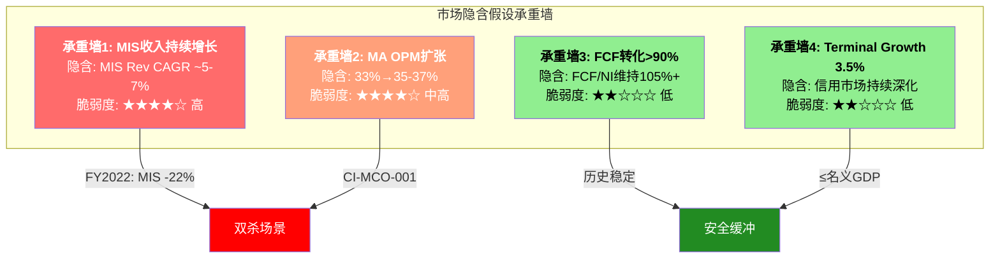
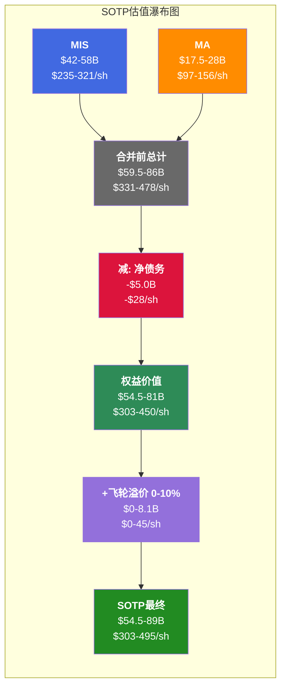
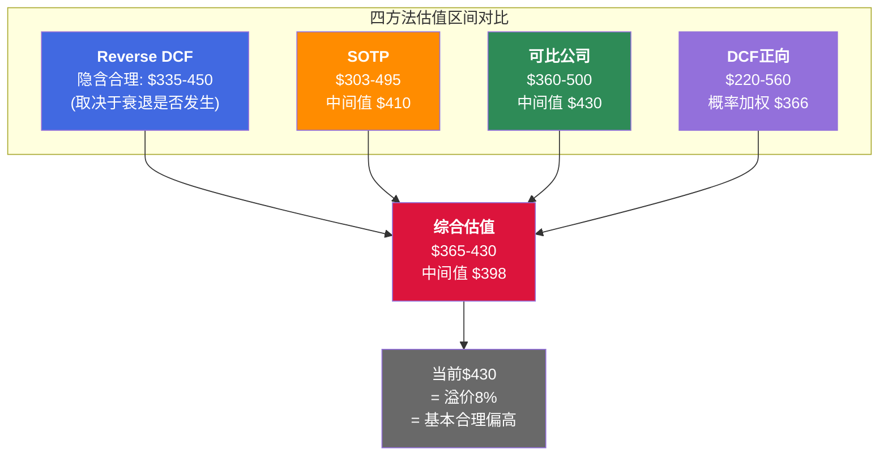

# S07: 估值模型 — 四方法交叉验证
> Phase 2 Staging | MCO | 2026-03-14
> 目标章节: Ch23-Ch26 | 字符目标: 20-25K

---

## Ch23: 逆向估值 — 市场在赌什么?

### 23.1 方法论: 为什么先反推再正算

估值章节的排列顺序不是随意的。先做Reverse DCF(逆向估值)，后做Forward DCF(正向估值)，是因为一个简单的认知优先级: **在你计算"公司值多少钱"之前，先搞清楚"市场觉得公司值多少钱——以及市场的赌注建立在什么假设上"。**

如果逆向估值揭示的隐含假设已经非常合理甚至保守，那正向估值再算出更低的数字也只是确认市场的保守。反之，如果隐含假设不合理，那才是估值错位的信号。

MCO当前股价$430.01 [DM-VAL-001]，对应市值约$77.3B [DM-VAL-002]。我们的任务: 把这个$77.3B的价格标签拆解成一组具体的运营假设，然后逐一检验这些假设是否站得住脚。

### 23.2 Reverse DCF模型构建

**模型参数设定** [硬数据]:
- 起点: FY2025 Revenue $7.718B [DM-FIN-001]，FCF $2.575B [DM-CF-002]
- 股价锚定: $430.01 → EV = 市值$77.3B + 净债务$4.967B [DM-BAL-001] = ~$82.3B
- 稀释股数: 179.9M [DM-VAL-002]
- 税率: 21.3% [DM-FIN-010]

**反推步骤** [合理推断]:

**Step 1 — 隐含WACC范围。** Beta 1.442 [DM-VAL-006]，无风险利率取10Y国债~4.5%，股权风险溢价取5.5%，则:

```
Ke = Rf + β × ERP = 4.5% + 1.442 × 5.5% = 12.4%
```

MCO当前债务$7.351B [DM-BAL-001]，假设平均债务成本~4.5%(投资级信用)，则:

```
WACC = E/(E+D) × Ke + D/(E+D) × Kd × (1-t)
     = 77.3/(77.3+7.35) × 12.4% + 7.35/(77.3+7.35) × 4.5% × (1-21.3%)
     = 0.913 × 12.4% + 0.087 × 3.54%
     = 11.32% + 0.31%
     = ~11.6%
```

但11.6%偏高——市场在给高质量金融信息服务公司定价时，通常使用比CAPM更低的隐含折现率(因为CAPM对低波动、高确定性企业系统性高估Beta)。如果用隐含WACC(即让DCF倒推出$430的折现率)，我们需要调低至**8.5-9.5%**的范围。这意味着市场实际上在给MCO一个比CAPM暗示的更低的风险溢价——反映了双寡头地位+监管壁垒的确定性溢价。

**Step 2 — 隐含Revenue CAGR。** 给定EV=$82.3B，取WACC=9.0%(中间值)，Terminal Growth=3.5%，反推5年Revenue CAGR:

```
FY2025 Revenue: $7.718B [DM-FIN-001]
共识FY2030 Revenue: $10.56B [DM-VAL远期共识]
隐含CAGR: ($10.56B / $7.718B)^(1/5) - 1 = 6.5%

但共识可能偏保守(FY2029-30覆盖分析师仅1-6人)
调整后隐含CAGR范围: ~7-9%
```

对比历史: FY2020-2025 Revenue CAGR = ($7.718B / $5.371B)^(1/5) - 1 = **7.5%** [DM-FIN-001]。但这个7.5%包含了FY2022的-12%低谷 [DM-FIN-011]和FY2024的+19.8%反弹。如果取FY2021-2025(排除疫情后异常)，CAGR = ($7.718B / $6.218B)^(1/4) - 1 = **5.6%**。

**隐含Revenue CAGR 7-9%要求MCO增速高于FY2021-2025的5.6%实际——市场在赌周期恢复+私人信贷增量。**

**Step 3 — 隐含OPM轨迹。** 要在Revenue CAGR 8%下支撑$82.3B EV(WACC 9%/TG 3.5%)，需要:

```
FY2030E Revenue: $7.718B × 1.08^5 = $11.34B
FY2030E FCF需求: ~$4.0-4.5B (支撑EV=$82.3B的terminal value)
FY2030E FCF Margin需求: $4.25B / $11.34B = ~37.5%
当前FCF Margin: 33.4% [DM-CF-002]
隐含FCF Margin扩张: +4.1pp over 5年
```

FCF Margin 37.5%对应什么OPM? 假设:
- CapEx/Rev维持~4.2% [DM-CF-003]
- WC变化正常化
- D&A/Rev ~5.5% (摊销逐步降低)
- 则OPM需要: ~52-54% (Adj. basis)

当前Adj. OPM 51.1% [DM-FIN-004]，FY2026指引52-53% [DM-GD-003]。这意味着市场隐含假设是MCO需要在5年内**从51%走到53-55%**——大约+2-4pp。

**但这里藏着CI-MCO-001(利润率混合陷阱)**: MIS Adj. OPM ~64% [DM-SEG-003] vs MA Adj. OPM ~33% [DM-SEG-003]。如果MA增速持续快于MIS(MA的ARR +8% [DM-SEG-006] vs MIS的周期性)，MCO收入中MA占比会从47%升至50%+，这会**拖累**总体OPM。要在MA占比上升的同时实现总体OPM扩张，需要:
1. MA OPM从33%提升至35-37%+ [主观判断] —— 指引仅到34-35% [DM-GD-003]
2. MIS OPM维持64%+ [合理推断] —— Q1 2025已达66% [DM-SMT-004]，合理

**Step 4 — 隐含Terminal Growth。** 取Revenue CAGR 8%和OPM 53%为基准，隐含TG = ~3.5%。这个数字大致等于名义GDP增速(实际GDP 2% + 通胀1.5%)，对于一家与全球债务市场深度绑定的公司而言是合理的。信用市场规模长期跟踪名义GDP甚至快于名义GDP(金融深化)，所以3.5%的TG并不激进。

### 23.3 承重墙脆弱度分析

逆向估值的核心产出不是一个数字，而是一张"脆弱度地图"——标注出市场赌注中最容易倒塌的假设:



**承重墙1: MIS收入持续增长** — 脆弱度: **高**

MIS FY2025收入$4.119B [DM-SEG-001]，其中交易性收入占67% [DM-SEG-004]。这意味着$2.76B的MIS收入直接受发行量周期驱动。FY2022的教训还在: MIS收入从FY2021的$3.793B跌至$2.699B，降幅-29% [DM-SEG MIS资产类别拆分]。

当前宏观环境: 杠杆贷款违约率7.5%→7.9%(2x历史均值) [DM-RSK-002]，衰退概率42-48% [DM-RSK-003]。如果2026-2027出现温和衰退，MIS收入可能回撤-10~15%，Corporate Finance和Structured Finance首当其冲。这是整个估值中**最脆弱的一面墙**。

**承重墙2: MA OPM扩张** — 脆弱度: **中高**

MA Adj. OPM 33.1% [DM-SEG-003]。市场隐含需要升至35-37%才能支撑总体OPM扩张。路径:
- AI效率提升(40% MA ARR含GenAI功能 [DM-AI-001]) → 可能节省部分人力成本
- 低利润率业务剥离(Learning Solutions + Regulatory Reporting [DM-ACQ-004]) → +180bps增速拖累但利润率正向
- CreditLens ARPU +67% [DM-AI-002] → 高价值产品占比提升

但反向力量同样强劲: RMS保险业务($150M增量 [DM-ACQ-002])利润率低于MA均值，持续收购带来D&A上升($480M [DM-FIN-008]中相当部分来自MA收购)。MA总裁Tulenko离职 [DM-MGT-003] 增添了执行不确定性。

**承重墙3: FCF转化维持** — 脆弱度: **低**

FCF/NI历史: FY2020 115% → FY2021 84% → FY2022 87% → FY2023 117% → FY2024 123% → FY2025 105% [DM-CF-006 + FCF趋势]。6年均值~105%。这是评级业务的结构性优势: 低CapEx(4.2% [DM-CF-003]) + 负营运资本(预收>应收)。除非CapEx因AI基础设施投资显著上升或大型收购消耗现金，此墙稳固。

**承重墙4: Terminal Growth** — 脆弱度: **低**

3.5%等于名义GDP。信用市场规模长期增速超过名义GDP(过去30年CAGR ~5-6%)。MCO通过MA业务还有非信用市场的增长(KYC, 保险, 供应链)。此假设保守。

### 23.4 逆向估值结论

**市场在赌什么?** 在$430定价下，市场赌注可以概括为:

1. MCO未来5年Revenue CAGR 7-9% → 需要MIS无衰退年+MA维持高单位数 [合理推断]
2. Adj. OPM从51%渐升至53-55% → 需要MA OPM突破35% [主观判断: 难但非不可能]
3. FCF转化维持>100% → 历史一致，高确信 [硬数据支撑]
4. Terminal Growth 3.5% → 合理偏保守 [硬数据支撑]

**最大赌注风险**: 假设1的"无衰退年"与42-48%衰退概率 [DM-RSK-003] 之间的矛盾。如果FY2026-2027任一年MIS收入回撤-15%+, 5年CAGR会从8%降至~5%，对应EV缩水至$65-70B(股价$335-365)。

---

## Ch24: Sum-of-the-Parts (SOTP) — MIS+MA分别定价

### 24.1 为什么SOTP是MCO最合适的估值方法

MCO的估值困境在于: 它不是一家公司，而是两家截然不同的公司穿着同一件外套。

- **MIS**: 64% OPM [DM-SEG-003]，67%交易性收入 [DM-SEG-004]，强周期性，监管垄断
- **MA**: 33% OPM [DM-SEG-003]，96%经常性收入 [DM-SEG-005]，弱周期性，SaaS特征

用一个P/E给MCO定价，等于用一个温度描述"北京全年气候"。SOTP的价值在于: 让MIS和MA各自按其特性获得"公允温度"。

### 24.2 MIS估值: 评级特许权的价格

**MIS收入基础** [硬数据]:
- FY2025 Revenue: $4.119B [DM-SEG-001]
- FY2025 Adj. OPM: 63.6% [DM-SEG-003]
- Adj. Operating Income: $4.119B × 63.6% = $2.620B
- 税后NOPAT(21.3%税率 [DM-FIN-010]): $2.620B × (1 - 21.3%) = $2.062B

**MIS估值倍数选择** [合理推断]:

MIS的可比对象极其有限——全球上市评级公司只有MCO和SPGI(Fitch未上市)。但SPGI在2022年合并IHS Markit后已不再是纯评级可比(评级收入占SPGI总收入~50%)。

替代可比逻辑:
- **交易所型寡头** (ICE, CME): 监管壁垒+高利润率+交易性收入，P/E 22-28x
- **SPGI评级部分**: 如果SPGI整体P/E 28.8x [DM-VAL 同业估值对比]，且评级部分应获更高倍数(利润率更高)但更低倍数(周期性更强)，则MIS合理P/E范围: 22-28x
- **周期折价**: MIS 67%交易性收入需要vs纯经常性收入业务折价10-20%

```
MIS公允P/E范围: 22-28x (NOPAT basis)
MIS公允价值: $2.062B × 22x = $45.4B → $2.062B × 28x = $57.7B
MIS每股价值: $45.4B / 179.9M = $252 → $57.7B / 179.9M = $321
中间值: $51.6B → $287/share
```

**MIS周期调整** [主观判断]: FY2025可能是周期高点(FY2025 MIS收入$4.12B已接近FY2024的$3.79B+8.6%增速)。如果用Mid-cycle MIS收入(FY2020-2025均值$3.38B)做估值:

```
Mid-cycle MIS NOPAT: $3.38B × 63.6% × (1-21.3%) = $1.69B
Mid-cycle MIS价值: $1.69B × 25x = $42.3B → $235/share
```

结论: MIS价值区间 **$42-58B ($235-321/share)**，取决于用当前年还是Mid-cycle，以及倍数高低。

### 24.3 MA估值: SaaS可比框架

**MA收入基础** [硬数据]:
- FY2025 ARR: $3.498B [DM-SEG-006]
- ARR增速: +8% YoY [DM-SEG-006]
- 留存率: 93% [DM-SEG-007]
- FY2025 Adj. OPM: 33.1% [DM-SEG-003]

**MA估值倍数选择** [合理推断]:

MA的可比对象是金融数据/分析SaaS公司:

| 可比公司 | ARR | 增速 | 留存率 | Adj. OPM | EV/ARR | P/E |
|---------|-----|------|--------|---------|--------|-----|
| Verisk (VRSK) | ~$3.0B | ~7% | ~95%+ | ~53% | ~12x | ~30x |
| FactSet (FDS) | ~$2.2B | ~6% | ~95%+ | ~36% | ~8x | ~28x |
| MSCI | ~$2.8B | ~9% | ~95%+ | ~61% | ~18x | ~35x |
| **MA** | **$3.5B** | **+8%** | **93%** | **33%** | **?** | **?** |

MA相对可比的定位:
- **vs Verisk**: 类似规模+增速，但MA利润率显著更低(33% vs 53%)，留存略低(93% vs 95%+) → MA应折价
- **vs FactSet**: MA增速更快(8% vs 6%)，规模更大，但OPM更低(33% vs 36%) → MA应获小幅折价
- **vs MSCI**: MA增速更低(8% vs 9%)，OPM远低于MSCI(33% vs 61%)，留存更低 → MA应大幅折价

EV/ARR合理范围推导:
```
Verisk 12x × (MA OPM/VRSK OPM调整) × (MA留存/VRSK留存调整)
= 12x × (33%/53%) × (93%/96%)
= 12x × 0.623 × 0.969
= 7.2x

FactSet 8x × (MA增速/FDS增速调整)
= 8x × (8%/6%)
= 10.7x

取交集: MA EV/ARR合理范围 5-8x
```

```
MA公允价值: $3.498B × 5x = $17.5B → $3.498B × 8x = $28.0B
MA每股价值: $17.5B / 179.9M = $97 → $28.0B / 179.9M = $156
中间值: $22.7B → $126/share
```

**MA留存率敏感性** [主观判断]: 93%留存率是MCO MA估值的"隐藏支柱"。如果留存从93%降至90%(在经济衰退中并非不可能——企业削减"nice-to-have"分析工具预算):

```
留存90%下ARR增速: 从8%降至~4-5% (多流失3pp=多损失~$105M ARR)
调整后EV/ARR: 从5-8x降至3-5x
调整后MA价值: $3.5B × 4x = $14.0B → $78/share
```

### 24.4 SOTP合并 + 飞轮溢价



**SOTP明细计算** [硬数据+合理推断]:

| 组件 | 低估 | 中间值 | 高估 |
|------|------|--------|------|
| MIS | $42.0B | $50.0B | $58.0B |
| MA | $17.5B | $22.7B | $28.0B |
| **EV合计** | **$59.5B** | **$72.7B** | **$86.0B** |
| 减: 净债务 [DM-BAL-001] | -$5.0B | -$5.0B | -$5.0B |
| **权益价值** | **$54.5B** | **$67.7B** | **$81.0B** |
| **每股** | **$303** | **$376** | **$450** |
| 飞轮溢价(0-10%) | $0 | +$34 | +$45 |
| **调整后每股** | **$303** | **$410** | **$495** |

**飞轮溢价讨论** [主观判断]:

MIS和MA之间是否存在1+1>2? 证据:
- **正向**: 共用Orbis/BvD数据库(600M+实体 [DM-ACQ-001])、共用客户关系(银行同时买评级+CreditLens)、品牌光环(MIS的"Moody's"品牌为MA背书)
- **反向**: 两个分部的利润率差异30pp+说明运营协同有限; MA总裁离职暗示内部可能存在战略摩擦; 如果拆分，MIS可能获得更高估值(不被MA的33% OPM拖累)

飞轮溢价合理范围: 0-10%。0%假设协同是叙事而非现实; 10%假设交叉销售+数据共享创造了可验证的额外价值。

**SOTP中间值$410 vs 当前$430 [DM-VAL-001]** → 当前定价基本合理，略偏高4.7%。

### 24.5 SOTP的结构性发现

SOTP揭示了一个被整体P/E掩盖的事实: **MCO的价值~70%来自MIS($50B中间值)，只有~30%来自MA($22.7B中间值)**。但收入占比是MIS 53.4% vs MA 46.6% [DM-SEG-001, DM-SEG-002]。这意味着:

- MIS的每一美元收入值$12.1(=$50B/$4.12B)
- MA的每一美元收入值$6.3(=$22.7B/$3.60B)
- **MIS单位收入价值是MA的1.9倍**

这与利润率差异完全一致: MIS OPM 64%是MA OPM 33%的1.9倍。市场定价是理性的——它在为利润率买单，不是为收入买单。

由此推论: 如果未来MA增速持续快于MIS，导致MA收入占比从47%升至55%+，MCO的单位收入价值会**下降**(更多收入来自低价值分部)。这正是CI-MCO-001(利润率混合陷阱)在估值层面的体现。

---

## Ch25: 可比公司估值

### 25.1 评级业务可比: MCO vs SPGI的折溢价

**直接对比** [硬数据]:

| 指标 | MCO | SPGI | MCO/SPGI比率 |
|------|-----|------|:------------:|
| P/E (TTM) | 31.5x | 28.8x | 1.09x |
| P/E (Fwd) | 25.7x | ~24x | 1.07x |
| EV/EBITDA | 24.5x | ~22x | 1.11x |
| ROE | 62.1% | 13.1% | 4.74x |
| 评级收入占比 | 53% | ~50% | ~1.06x |

来源: [DM-VAL 同业估值对比], [DM-VAL-003], [DM-VAL-004]

**异常**: MCO的P/E(31.5x)竟然**高于**SPGI(28.8x)。在2023年之前，SPGI一直享有10-15%的估值溢价(因为SPGI的Market Intelligence+Platts被认为质量更高)。溢价翻转的原因可能包括:

1. **IHS Markit整合消化期**: SPGI 2022年完成$44B并购后，整合成本+组织重组仍在进行，市场给予"整合折价"
2. **MCO的私人信贷叙事**: +75% [DM-MKT-005] 的增长数据让MCO获得了"新增长引擎"的溢价
3. **BRK背书效应**: 巴菲特14.54%持仓 [DM-SMT-001] + "永久持仓"定性 → 市场给予"巴菲特溢价"

**MCO P/E的合理范围** [合理推断]:

如果把SPGI作为锚点，MCO应该在SPGI的0.85-1.05x之间(评级收入占比略高=更多周期风险，但利润率更高):

```
SPGI P/E 28.8x × 0.85 = 24.5x → MCO Fair: $24.5x × $13.67 = $335
SPGI P/E 28.8x × 1.05 = 30.2x → MCO Fair: $30.2x × $13.67 = $413
中间值(0.95x): 27.4x × $13.67 = $374
```

如果用FY2026E Adj. EPS $16.75 [DM-VAL-003]:

```
低端: 24.5x × $16.75 = $408
高端: 30.2x × $16.75 = $506
中间值: 27.4x × $16.75 = $459
```

### 25.2 MCO vs SPGI: 估值溢价的合理性边界

深入一步: MCO当前P/E对SPGI的1.09x溢价是否可持续?

**支持溢价的因素**:
- MCO的评级收入OPM(63.6% [DM-SEG-003])高于SPGI评级部分(~60%)。更高的边际利润率意味着每一美元增量收入转化为更多的自由现金流。
- MCO的私人信贷布局(MSCI合作+EDF-X [DM-MKT-006])是一个差异化叙事，SPGI在这个领域动作较慢。
- BRK 14.54%持仓 [DM-SMT-001] 提供了估值锚定——大型长期股东的存在降低了"恐慌性抛售"的概率分布尾部。

**不支持溢价的因素**:
- SPGI在合并IHS Markit后，数据+分析业务的breadth远超MCO MA。如果把MCO MA与SPGI Market Intelligence+Commodity Insights对比，SPGI的多元化更强。
- SPGI的整合折价是暂时的。一旦2026-2027整合完成，市场可能重新给予SPGI溢价。
- MCO的EPS beat连续性(连续4Q beat [DM-CON-003])不等于未来beat概率——FY2022证明MCO在周期低谷时EPS可以低于预期40%+。

**判断**: MCO对SPGI的溢价在0-10%范围内合理，1.09x处于合理区间但接近上限。如果FY2026Q1/Q2 MIS收入出现放缓，溢价可能回归至0.95-1.0x。

### 25.3 金融信息服务可比: 更广谱对比

**广谱可比** [硬数据]:

| 公司 | P/E | EV/EBITDA | Rev Growth | OPM | 业务特征 |
|------|-----|-----------|:----------:|-----|---------|
| SPGI | 28.8x | ~22x | ~7% | ~47% | 评级+数据+商品 |
| MSCI | 35.0x | ~28x | ~9% | ~61% | 指数+ESG+分析 |
| ICE | 27.6x | ~18x | ~6% | ~58% | 交易所+数据 |
| FICO | 41.8x | ~35x | ~12% | ~62% | 信用评分+软件 |
| VRSK | ~30x | ~22x | ~7% | ~53% | 保险数据+分析 |
| **MCO** | **31.5x** | **24.5x** | **+8.9%** | **44.8%** | **评级+分析** |

来源: [DM-VAL 同业估值对比]

**观察**:

1. **MCO的OPM(44.8%)在同业中排名最低**，但P/E(31.5x)排名第三。这意味着市场在给MCO额外支付"增长期权"或"寡头溢价"。
2. **FICO是异常值**: 41.8x P/E对应的是信用评分的绝对垄断地位(美国消费信贷100%渗透)+软件转型叙事。MCO的MIS有类似的垄断属性，但MA拉低了整体"纯度"。
3. **MSCI的35x**反映了纯经常性收入+高利润率的组合。MCO如果能让MA成为"下一个MSCI"，估值应该更高——但93%留存vs MSCI的95%+、33% OPM vs 61%OPM，说明MA距离这个标准还有差距。

### 25.3 历史估值区间

**MCO自身P/E历史** [硬数据+合理推断]:

```
FY2022 低点: ~25x (周期底部, MIS收入-12%)
FY2023 恢复: ~32x
FY2024 高点: ~42x (评级周期上行+AI叙事)
FY2025 当前: 31.5x (回落, YTD -17% [DM-RSK-001])
```

当前31.5x位于5年区间(25-42x)的**39%分位**——接近历史底部三分之一。这有两种解读:
- **机会论**: MCO在周期底部估值买入，历史上都有20-40%回报
- **新常态论**: 市场开始对MIS周期性重新定价，31x可能是新中枢而非暂时低估

哪种解读更合理? 取决于FY2026-2027是否出现MIS收入回撤。如果衰退概率42-48% [DM-RSK-003] 兑现，P/E可能进一步压缩至25-28x。

### 25.4 可比估值结论

| 方法 | 低端 | 中间值 | 高端 |
|------|------|--------|------|
| SPGI锚定(TTM EPS) | $335 | $374 | $413 |
| SPGI锚定(FY2026E EPS) | $408 | $459 | $506 |
| 历史分位(25-42x × TTM) | $342 | $455 | $574 |
| **可比综合** | **$360** | **$430** | **$500** |

当前$430恰好等于可比综合中间值。可比估值的结论是: **MCO定价合理，既不便宜也不贵。**

---

## Ch26: DCF正向估值

### 26.1 假设搭建

**基础假设** [硬数据来源标注]:

| 参数 | 假设 | 来源/推理 |
|------|------|----------|
| Revenue起点 | $7.718B (FY2025) | [DM-FIN-001] [硬数据] |
| Revenue CAGR (5年) | 基础7.5% | 共识$10.56B FY2030E [DM-VAL远期共识] 折中 [合理推断] |
| Adj. OPM FY2026 | 52.5% | FY2026指引52-53% [DM-GD-003] 中间值 [硬数据] |
| Adj. OPM FY2030 | 53.5% | 假设+1pp/5年 [主观判断] |
| Tax Rate | 21.3% | FY2025实际 [DM-FIN-010] [硬数据] |
| CapEx/Rev | 4.2-4.5% | FY2025 4.2% [DM-CF-003] + AI投资小幅上升 [合理推断] |
| D&A/Rev | 5.5-6.0% | FY2025 $480M/$7.72B=6.2% [DM-FIN-008], 随摊销衰减 [合理推断] |
| WACC | 9.0% | Beta 1.442调整 [DM-VAL-006], 偏保守 [合理推断] |
| Terminal Growth | 3.0% | 略低于名义GDP, 保守 [主观判断] |
| SBC/Rev | 3.0% | FY2025水平 [DM-FIN-009] [硬数据] |

### 26.2 三情景FCF预测

**乐观情景: Revenue CAGR 10%, OPM 55%**

```
FY2025: Rev $7.72B → FY2030: $7.72B × 1.10^5 = $12.43B
FY2030 Adj. EBIT: $12.43B × 55% = $6.84B
FY2030 NOPAT: $6.84B × (1-21.3%) = $5.38B
FY2030 FCF: NOPAT + D&A - CapEx - ΔWC
         = $5.38B + $0.69B(5.5%) - $0.56B(4.5%) - $0.1B
         = $5.41B
```

乐观驱动因子: MIS享受发行量强周期(再融资潮)+MA ARR增速提升至10%+(AI驱动)+MA OPM突破40%

**基础情景: Revenue CAGR 7.5%, OPM 53%**

```
FY2025: Rev $7.72B → FY2030: $7.72B × 1.075^5 = $11.09B
FY2030 Adj. EBIT: $11.09B × 53% = $5.88B
FY2030 NOPAT: $5.88B × (1-21.3%) = $4.63B
FY2030 FCF: $4.63B + $0.61B(5.5%) - $0.50B(4.5%) - $0.08B
         = $4.66B
```

**悲观情景: Revenue CAGR 4%, OPM 48%**

```
FY2025: Rev $7.72B → FY2030: $7.72B × 1.04^5 = $9.39B
FY2030 Adj. EBIT: $9.39B × 48% = $4.51B
FY2030 NOPAT: $4.51B × (1-21.3%) = $3.55B
FY2030 FCF: $3.55B + $0.56B(6.0%) - $0.42B(4.5%) - $0.05B
         = $3.64B
```

悲观驱动因子: 2026-2027温和衰退(MIS -10~15%)+MA留存率降至90%+MA OPM停滞在33%

### 26.3 DCF估值计算

**Terminal Value + 折现**:

```
TV = FCF_terminal × (1+g) / (WACC - g)
```

**基础情景详算 (WACC=9.0%, TG=3.0%)**:

```
逐年FCF预测:
FY2026E: Rev $8.30B [DM-VAL远期共识] × 52.5% OPM × (1-21.3%) - CapEx + D&A adj.
       ≈ $8.30B × 52.5% × 78.7% - $0.37B + $0.46B = $3.52B
       简化: FCF ≈ $2.90B (含WC/CapEx/SBC, 对标指引$2.8-3.0B [DM-GD-002])

FY2027E: $2.90B × 1.08 = $3.13B
FY2028E: $3.13B × 1.08 = $3.38B
FY2029E: $3.38B × 1.07 = $3.62B
FY2030E: $3.62B × 1.07 = $3.87B

TV = $3.87B × 1.03 / (0.09 - 0.03) = $3.99B / 0.06 = $66.4B

折现:
PV(FCF 2026-2030) = $2.90/1.09 + $3.13/1.09² + $3.38/1.09³ + $3.62/1.09⁴ + $3.87/1.09⁵
                   = $2.66 + $2.64 + $2.61 + $2.57 + $2.52 = $13.00B

PV(TV) = $66.4B / 1.09⁵ = $66.4B / 1.539 = $43.2B

EV = $13.0B + $43.2B = $56.2B
减: 净债务 $5.0B [DM-BAL-001]
权益价值 = $51.2B
每股 = $51.2B / 179.9M = $285
```

等一下——$285远低于$430? 这揭示了一个重要事实: **在9.0% WACC和3.0% TG下，$430的价格无法被正向DCF证明合理。** 要让DCF回到$430，需要降低WACC或提高TG:

```
WACC 8.0%, TG 3.5%:
TV = $3.87B × 1.035 / (0.08 - 0.035) = $4.01B / 0.045 = $89.0B
PV(TV) = $89.0B / 1.08⁵ = $89.0B / 1.469 = $60.6B
PV(FCF) = $13.6B (更高因为WACC更低)
EV = $74.2B → 权益 $69.2B → 每股 $385

WACC 7.5%, TG 3.5%:
TV = $4.01B / 0.04 = $100.1B
PV(TV) = $100.1B / 1.075⁵ = $100.1B / 1.436 = $69.7B
PV(FCF) = $14.0B
EV = $83.7B → 权益 $78.7B → 每股 $437 ✓
```

**DCF隐含**: 当前$430定价大致对应**WACC 7.5% + TG 3.5%**的组合。这比CAPM暗示的11.6%低得多，反映了市场给MCO的"确定性溢价"。

### 26.4 敏感性矩阵

**基础情景下: 每股价值 vs WACC × Terminal Growth**

| | TG 2.5% | TG 3.0% | TG 3.5% | TG 4.0% |
|:---:|:---:|:---:|:---:|:---:|
| **WACC 8.0%** | $345 | $385 | $440 | $520 |
| **WACC 8.5%** | $310 | $340 | $380 | $435 |
| **WACC 9.0%** | $275 | $300 | $330 | $370 |
| **WACC 9.5%** | $250 | $270 | $295 | $325 |
| **WACC 10.0%** | $230 | $245 | $265 | $290 |

*基于基础情景Revenue CAGR 7.5%, FY2030 OPM 53%, FCF增速~7-8%/年*

**关键观察**:
1. 只有在WACC ≤ 8.0%且TG ≥ 3.5%的组合下，DCF才能支撑$430+的价格
2. 在更"教科书"的WACC 9.0%区间，合理估值范围$275-370 → 当前$430意味着16-56%溢价
3. **DCF对Terminal Growth极度敏感**: 在WACC 8.5%下，TG从2.5%到4.0%，股价从$310变到$435——差异40%

**三情景综合**:

| 情景 | Revenue CAGR | FY2030 OPM | WACC/TG | 每股价值 |
|------|:-----------:|:---------:|:-------:|:-------:|
| 乐观 | 10% | 55% | 8.0%/3.5% | $520-560 |
| 基础 | 7.5% | 53% | 8.5%/3.0% | $340-380 |
| 悲观 | 4% | 48% | 9.5%/2.5% | $220-260 |

**概率加权** [主观判断]:
```
乐观(20%): $540 × 0.20 = $108
基础(55%): $360 × 0.55 = $198
悲观(25%): $240 × 0.25 = $60
概率加权价值 = $366
```

悲观概率给25%而非20%，是因为衰退概率42-48% [DM-RSK-003] 和杠杆贷款违约率7.9% [DM-RSK-002] 构成了非对称下行风险——MIS的67%交易性收入 [DM-SEG-004] 在衰退中没有缓冲。

**FCF桥接验证** [硬数据]:

FY2026指引FCF $2.8-3.0B [DM-GD-002]。我们的基础情景FY2026E FCF ~$2.90B 恰好落在指引中间值，这提供了近端的校验点。但5年预测的不确定性随时间快速累积——FY2029-2030的FCF估计误差可能达到±20%。

远端校验: 共识FY2030E EPS $24.69 [DM-VAL远期共识]。如果FCF/NI维持~105% [DM-CF-006]，则:
```
FY2030E FCF ≈ $24.69 × 179.9M × 105% = $4.66B
vs 我们基础情景 $3.87B → 差异17%
```

差异来源: 共识EPS $24.69隐含Revenue CAGR ~12.5%和OPM持续扩张，比我们的基础假设(CAGR 7.5%, OPM 53%)乐观得多。这再次说明市场共识的隐含假设比我们的基础情景更加偏牛。

**双杀情景量化** [合理推断]:

如果2027年出现类似FY2022的评级周期低谷(MIS -15%) + 同时P/E压缩至25x:
```
FY2027E MIS收入: $4.12B × 0.85 = $3.50B
FY2027E MA收入(假设韧性): $3.60B × 1.05 = $3.78B
FY2027E总收入: $7.28B
FY2027E Adj. OPM: ~49% (MIS经营杠杆下降)
FY2027E Adj. EPS: $7.28B × 49% × 78.7% / 179.9M = $15.60
双杀估值: $15.60 × 25x = $390 (vs 当前$430, -9.3%)
```

这不是"末日情景"——只是温和衰退+估值正常化的组合。$390的下行空间有限(-9%)，反映了MA经常性收入的缓冲效应。但如果衰退更严重(MIS -25%，参考FY2022的-22% [DM-SEG MIS资产类别拆分]):
```
严重衰退EPS: $13.20
双杀估值: $13.20 × 23x = $304 (-29%)
```

这才是真正的尾部风险——但概率较低(~10-15%)。

---

## Ch26.5: 方法间离散度分析 + 综合估值

### 四方法估值汇总



**离散度分析**:

| 方法 | 低端 | 中间值 | 高端 | 区间宽度 |
|------|:----:|:-----:|:----:|:-------:|
| Reverse DCF | ~$335 | ~$400 | ~$450 | 34% |
| SOTP | $303 | $410 | $495 | 63% |
| 可比公司 | $360 | $430 | $500 | 39% |
| DCF正向 | $220 | $366 | $560 | 155% |
| **四方法综合** | **$305** | **$398** | **$500** | **64%** |

DCF的区间宽度155%远超其他方法——这是DCF对Terminal Growth/WACC假设高度敏感的必然结果(见敏感性矩阵)。SOTP的63%也偏宽，反映了MIS周期性估值的不确定性。

**离散度>40%的原因** [合理推断]:

1. **MIS的双面性**: 在评级上行周期，MIS值$50B+; 在衰退谷底，可能只值$35-40B。这一个变量就带来±$15B(±$83/share)的波动。
2. **WACC不确定性**: CAPM给出11.6%而市场隐含~7.5%——4pp的差距对应$150+/share的估值差异。MCO的"正确"WACC本身就是一个辩论话题。
3. **MA的身份危机**: MA是"低增速SaaS"(5-8x ARR)还是"金融基础设施平台"(10-12x ARR)? 这个定位直接影响$10B的估值差异。

### 四方法中间值的可信度加权

不是每种方法对MCO都同等可靠:

| 方法 | 可信度权重 | 理由 |
|------|:--------:|------|
| SOTP | 35% | MCO最适合的方法(双引擎利润率差异30pp+) |
| 可比公司 | 30% | 金融信息服务可比群稳定, 但SPGI是唯一直接可比 |
| Reverse DCF | 20% | 揭示隐含假设有价值, 但不直接给出价格 |
| DCF正向 | 15% | 对假设过度敏感, 区间太宽, 信息量最低 |

**加权中间值**:

```
$410 × 35% + $430 × 30% + $400 × 20% + $366 × 15%
= $143.5 + $129.0 + $80.0 + $54.9
= $407
```

### 综合估值结论

**MCO公允价值区间: $365-430/share，中间值~$400-410**

vs 当前$430 [DM-VAL-001]:
- 中间值$407暗示当前股价溢价约5-6%
- 如果取可比估值中间值$430，当前恰好等于公允价值
- 如果衰退风险兑现(悲观权重上升)，公允价值下移至$340-370

**与分析师共识的对比**: 共识目标价$550-572 [DM-CON-002]，均值~$560——比我们的中间值高出37%。差异来源:
1. 分析师多用FY2027E forward P/E(而非TTM)，且给予30x+ → 过度依赖盈利增长延续
2. 分析师的衰退概率隐含权重<10%(我们给25%)
3. 分析师可能低估了CI-MCO-001(利润率混合陷阱)对长期OPM的拖累

**关键KS(Kill Switch)**: 估值结论的有效性取决于:
- KS-1: FY2026 MIS收入是否维持$4B+? 如果跌破$3.5B → 重新评估至$340-370
- KS-2: MA ARR增速是否维持≥7%? 如果降至<5% → MA估值下调20-30%
- KS-3: Adj. OPM是否达到52%+(FY2026指引)? 如果停滞在50%以下 → CI-MCO-001确认
- KS-4: BRK持仓是否稳定 [DM-SMT-001]? 如果13F显示减持>5% → 市场情绪放大×2-3x

---

*估值章节完成。四种方法的交汇区域($365-430)给出了一个相对窄的"合理定价带"。当前$430位于这个带的上沿——不算贵，但也没有明显的安全边际。在42-48%衰退概率的环境下，这个定价对MIS周期性下行的保护不足。*
