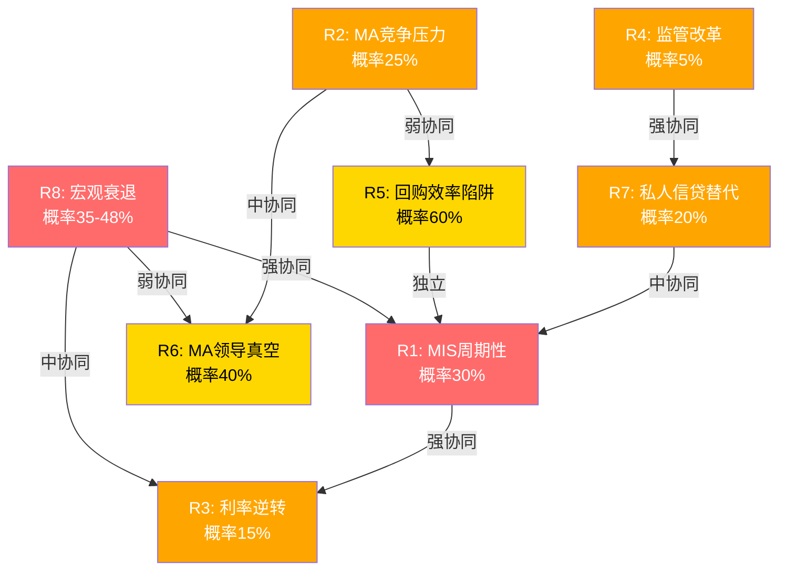
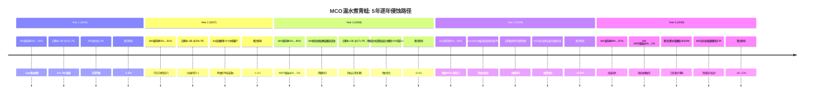

# S08: 风险拓扑图 — 协同/反协同/独立

---

## Ch27: 风险拓扑图

### 27.1 风险全景: 8个核心风险节点

MCO的风险结构不是一张平面清单,而是一张三维网络——8个风险节点之间存在协同放大、反协同对冲、以及逻辑独立三种关系。理解这张网络,比理解单个风险重要10倍。

**风险节点总表**:

| # | 风险 | 概率 | 影响(EPS) | 加权损失 | 时间线 | 可逆性 |
|---|------|:----:|:---------:|:--------:|:------:|:------:|
| R1 | MIS周期性(发行量崩塌) | 30% | -20~25% | -6.0~7.5% | 1-2年 | 高(周期自愈) |
| R2 | MA竞争压力(Bloomberg/AI初创) | 25% | -5~10% MA收入 | -0.6~1.2% EPS | 3-5年 | 中 |
| R3 | 利率环境逆转(Fed再次加息) | 15% | ±双向MIS | -1.5~+3.0% | 1-3年 | 高 |
| R4 | 监管改革(评级机构结构性变化) | 5% | -30~50% MIS | -1.5~2.5% | 5-10年 | 极低 |
| R5 | 回购效率陷阱(高价持续回购) | 60% | -2~3%年化 | -1.2~1.8% | 持续 | 中(需估值回调) |
| R6 | MA领导真空(Tulenko继任) | 40% | -3~5% MA增速 | -0.6~1.0% | 1-2年 | 高(可填补) |
| R7 | 私人信贷替代公开债券 | 20% | -10~15% MIS长期 | -1.0~1.5% | 5-10年 | 低(结构性) |
| R8 | 宏观衰退(GDP -1.5%+) | 35-48% | -15~25% EPS | -5.3~12.0% | 1-3年 | 高(周期自愈) |

**加权期望损失合计**: 单独触发场景下,8个风险的加权EPS影响约为-17.7~28.5%(简单加总,未考虑互斥)。但风险之间存在显著协同和反协同,简单加总会严重失真。

---

### 27.2 逐项风险深度解析

#### R1: MIS周期性 — "市场已经忘了2022"

**机制**: MIS 67%收入来自交易性评级[DM-SEG-004],直接挂钩债券发行量。FY2022全球发行量骤降,MCO收入-12.1%[DM-FIN-011],MIS收入从$3.8B(FY2021)暴跌至$2.7B(-29%)[MIS资产类别拆分表]。EPS从$11.78→$7.44(-37%)。这不是古老历史——仅发生在3年前。

**概率评估(30%)**: Moody's Analytics自身衰退概率42-48%[DM-RSK-003],Polymarket 34.5%[DM-PMK-001]。但并非每次衰退都导致发行量崩塌——温和衰退中,IG再融资需求可能维持。30%反映"严重发行量萎缩(>15%)"的概率,低于衰退概率本身。

**影响量化**:
- FY2025 MIS收入$4.119B[DM-SEG-001],其中交易性67%=$2.76B
- 温和崩塌(-20%交易性): MIS收入降$552M → EPS影响-$2.1~2.5(-15~18%)
- 严重崩塌(-35%交易性,FY2022级别): MIS收入降$966M → EPS影响-$3.5~4.0(-25~30%)
- 基准假设: -20~25% EPS影响

**非线性特征**: MIS经营杠杆极高——收入降20%,利润可能降30%+,因为MIS的固定成本(分析师薪资、基础设施)不随交易量下降。FY2022 MIS Adj. OPM从~60%降至~50%,验证了这一杠杆效应。

#### R2: MA竞争压力 — "93%留存的隐藏脆弱面"

**机制**: MA面对三层竞争——(1)Bloomberg Terminal的数据+分析一体化,(2)LSEG/FactSet的风险分析工具,(3)AI初创公司用大模型重建信用分析。MA留存率93%[DM-SEG-007]看似稳固,但在Tier 1 SaaS世界(95%+留存是门槛)只算"合格"。

**概率评估(25%)**: 不是"MA明天被颠覆"的概率,而是"MA在3-5年内因竞争压力导致留存率降至90%以下"的概率。AI初创公司(如Creditsights被Fitch收购)正在改变定价预期。

**影响量化**:
- MA ARR $3.498B[DM-SEG-006],留存93%=年流失$245M
- 留存降至90%: 年流失增加$105M → 累计3年ARR增速从8%降至4-5%
- 留存降至87%: 年流失增加$210M → ARR增速归零,估值重估
- 基准假设: -5~10% MA收入(留存93%→90%情景)

**关键观察**: GenAI/AgenTix客户97%留存、增速2x[DM-AI-003],说明AI增强型产品反而提高粘性。风险不在于"AI替代MA",而在于"不采用AI的MA传统产品被边缘化"。40% ARR含GenAI功能[DM-AI-001]=已有防护,但60%传统产品仍暴露。

#### R3: 利率环境逆转 — "双向风险,非对称影响"

**机制**: 利率对MIS的影响是双向的且非线性的——(1)加息初期:发行人抢窗口再融资=发行量暴增(利好MIS),(2)加息中期:高利率压制新发行=发行量萎缩(利空MIS),(3)加息末期:利差走扩+高收益债违约=评级需求增加但发行减少(混合)。

**概率评估(15%)**: Fed 2025仅1次降息概率30.5%,通胀>3%概率73%[DM-PMK-002]。"再次加息"概率较低(~15%),但如果发生,影响路径复杂。

**影响量化**:
- 加息25bps×2: MIS短期+5%(窗口效应) → 中期-10%(需求压制),净效应-5~8%
- 加息50bps+: MIS短期+10% → 中期-20%,净效应-15%+
- MA影响较小: 利率环境不直接影响风险分析工具需求,但金融客户预算收紧可能间接影响续约

#### R4: 监管改革 — "低概率高影响的黑天鹅"

**机制**: 评级行业当前的双寡头格局(MCO 40%/SPGI 40%[DM-MKT-001])建立在NRSRO制度之上。10个注册NRSRO,Big Three占84%非政府证券评级[DM-MKT-002]。如果监管从"强制评级"转向"自愿评级"或"公共评级机构",MCO的制度嵌入护城河将被从根基动摇。

**概率评估(5%)**: 2008年危机后监管改革呼声最高时也没能打破寡头格局,反而通过Dodd-Frank强化了合规门槛。但长期(10年+)来看,欧盟已建立ESMA直接监管框架,如果出现第二次系统性信用危机且评级机构再次"失职",结构性改革概率将跳升至15-20%。

**影响量化**: 极端场景下MIS收入-30~50%,但时间线极长(5-10年渐进式)。更现实的风险是"增量监管成本":每次监管升级都增加合规成本(估计+$50-100M/年),但同时也提高进入壁垒。净效应可能中性偏正——这是监管风险的"反直觉"特性。

#### R5: 回购效率陷阱 — "最确定会发生的慢性损耗"

**机制**: FY2025回购$1.706B[DM-CF-004],回购指引FY2026 ~$2.0B[DM-GD-004]。当前P/E 31.5x[DM-VAL-003],隐含盈利收益率3.2%。用$2B回购=购买$64M年化盈利,而同样$2B的MA收购可能创造$160-200M+年化收入(按历史收购倍数)。

**概率评估(60%)**: 这不是"是否发生"的问题,而是"程度"的问题。管理层已明确FY2026 ~$2.0B回购计划。在31x P/E下回购的η(效率)=回购收益率/WACC=3.2%/8.5%=0.38——远低于价值中性的1.0。只有当P/E降至~20x(盈利收益率5%+)时回购才变得高效。

**影响量化**:
- 年化价值摧毁: 回购$2B×(WACC-盈利收益率)=$2B×(8.5%-3.2%)=$106M/年
- 5年累计: ~$530M价值摧毁(假设估值不变)
- 占市值比: $530M/$77.3B=0.7%/年,看似微小但5年累计~3.5%
- 机会成本更大: 放弃的MA收购可能创造$800M-$1B增量年化收入

**缓解因素**: 如果MCO股价跌至$350(-19%),回购效率即刻改善。回购计划不是"承诺",而是"授权"——管理层有灵活性调整节奏。但历史证据显示,大多数管理层在高估值时仍坚持回购(社会证明偏误)。

#### R6: MA领导真空 — "Tulenko离职的二阶效应"

**机制**: MA总裁Stephen Tulenko于2025年8月辞职[DM-MGT-003],Andy Frepp临时接管。Tulenko是MA从"数据产品"转型为"风险平台"的关键架构师。领导真空不仅影响战略执行(一阶),更影响MA内部团队的凝聚力和人才留存(二阶)。

**概率评估(40%)**: 这是"持续影响12个月以上"的概率。如果6个月内任命强力继任者,影响可控;如果拖延或任命不佳,MA的Decision Solutions(ARR增速+10%[MA ARR子分部表])和AI战略(40% ARR含GenAI[DM-AI-001])可能减速。

**影响量化**:
- MA增速从8%降至5-6%: 收入损失$70-105M/年
- EPS影响: -$0.3~0.5(-2~4%),看似微小
- 但MA估值高度依赖增速预期: 增速从8%降至5%可能导致MA部分的估值倍数从20x→16x,影响$3-5B市值(-4~6%)

#### R7: 私人信贷替代公开债券 — CI-MCO-003的风险维度

**机制**: 私人信贷TAM $2T→$4T(2030E)[DM-MKT-004],MCO私人信贷相关收入FY2025 +75%[DM-MKT-005]。表面是增量——但深层逻辑是: 每$1私人信贷替代公开债券,MIS损失~$0.02评级费(高单位经济学),MA获得~$0.005分析工具费(低单位经济学)。净效应可能为负。

**概率评估(20%)**: "私人信贷显著替代公开债券(>10%份额转移)"的概率。当前私人信贷占全球信贷市场<5%,即使翻倍到$4T仍占<10%。但在杠杆贷款领域(MCO HY评级的核心市场),替代已在发生。

**影响量化**:
- 假设私人信贷替代$500B公开债券发行(~7.5%全球发行量)
- MIS收入损失: $500B×0.035%(评级费率)=$175M(-4.3% MIS)
- MA私人信贷收入增量: MSCI-MCO合作[DM-MKT-006]+EDF-X模型 → 估计+$100-150M
- 净效应: -$25~75M,即MIS损失>MA增量
- 长期(10年): 如果替代比例达到15-20%,净损失可能扩大至$200-300M/年

#### R8: 宏观衰退 — "所有风险的放大器"

**机制**: GDP -1.5%+的衰退直接打击MIS交易性收入(发行量萎缩)+MA非核心预算(客户缩减IT支出)+信用质量(违约率升→评级下调需求增但新发行降)。衰退概率42-48%[DM-RSK-003],32%美国上市公司处于信用风险早期预警[DM-RSK-004]。

**概率评估(35-48%)**: 使用Moody's Analytics自身预测42-48%[DM-RSK-003]和Polymarket 34.5%[DM-PMK-001]的中位数。杠杆贷款违约率已达7.5-7.9%(2x历史均值)[DM-RSK-002],信用周期已在转向。

**影响量化**:
- 温和衰退(GDP -0.5~1.5%): MIS收入-10~15%, MA收入-2~3%, EPS -15~20%
- 严重衰退(GDP -2%+): MIS收入-25~30%, MA收入-5%, EPS -25~35%
- FY2022参照: 无衰退但发行量冻结→收入-12%/EPS-37%
- 加权影响: 42%×(-18%)=-7.6% EPS(期望值)

---

### 27.3 风险协同矩阵

**8×8协同矩阵(简化版: 仅标注高/中协同对)**:

| | R1 | R2 | R3 | R4 | R5 | R6 | R7 | R8 |
|---|:---:|:---:|:---:|:---:|:---:|:---:|:---:|:---:|
| **R1** | — | ○ | **●●** | ○ | ○ | ○ | **●** | **●●●** |
| **R2** | ○ | — | ○ | ○ | **●** | **●●** | ○ | ○ |
| **R3** | **●●** | ○ | — | ○ | ○ | ○ | ○ | **●●** |
| **R4** | ○ | ○ | ○ | — | ○ | ○ | **●●** | ○ |
| **R5** | ○ | **●** | ○ | ○ | — | ○ | ○ | ○ |
| **R6** | ○ | **●●** | ○ | ○ | ○ | — | ○ | **●** |
| **R7** | **●** | ○ | ○ | **●●** | ○ | ○ | — | ○ |
| **R8** | **●●●** | ○ | **●●** | ○ | ○ | **●** | ○ | — |

> ●●● = 强协同(联合概率显著高于独立概率) | ●● = 中协同 | ● = 弱协同 | ○ = 独立/反协同

---

### 27.4 三个协同组合: 最可能的糟糕场景

#### 组合A: "完美风暴" — R8+R1+R3

**触发条件**: 宏观衰退(GDP -2%+) → Fed被迫加息抗通胀(滞胀场景) → 发行量崩塌

**联合概率**: 非独立事件。P(R8)×P(R1|R8)×P(R3|R8∩R1) ≈ 42%×70%×25% ≈ 7.4%

**联合影响**:
- MIS收入: -30~40%(发行量崩塌+利率压制双杀)
- MA收入: -3~5%(客户预算收紧)
- 总收入: -18~25%
- EPS: -35~45%(经营杠杆放大)
- P/E压缩: 31x→22-25x(周期股重估)
- **股价影响**: $430→$210-280(-35~51%)

**历史参照**: FY2022接近但未完全触发此组合——无衰退但发行量冻结,结果是EPS-37%、股价从$400降至$240(-40%)。如果叠加真正的衰退+加息,影响可能更深。

**持续时间**: 12-24个月。FY2022到FY2024的恢复用了2年。

#### 组合B: "慢性侵蚀" — R2+R6+R5

**触发条件**: AI初创侵蚀MA边际客户 + Tulenko继任失败导致MA战略混乱 + 管理层在高估值下坚持大规模回购

**联合概率**: P(R2)×P(R6|R2)×P(R5|R2∩R6) ≈ 25%×50%×70% ≈ 8.8%

**联合影响**:
- MA ARR增速: 从8%降至3-4%(留存率降+战略失焦)
- 回购效率: η从0.38进一步恶化(股价未跌足够多)
- EPS增速: 从12.5%降至6-7%
- **估值重估**: 市场从"信息服务高增长"重估为"成熟数据公司",P/E从31x→24-26x
- **股价影响**: $430→$340-380(-11~21%)

**隐蔽性**: 此组合不像"完美风暴"那样剧烈,而是每年损失2-3%价值,但逐年看不出明显恶化。这正是"温水煮青蛙"的前兆。

#### 组合C: "结构性颠覆" — R4+R7

**触发条件**: 监管改革削弱强制评级要求 + 私人信贷永久替代部分公开债券市场

**联合概率**: P(R4)×P(R7|R4) ≈ 5%×40% ≈ 2.0%

**联合影响**:
- MIS核心TAM缩小20-30%(公开债券市场萎缩+评级强制性降低)
- MA获得部分私人信贷增量,但单位经济学远不及MIS
- **净效应**: MCO从"制度基础设施"降级为"数据分析供应商"
- **估值重估**: P/E从31x→18-22x(护城河永久缩窄)
- **股价影响**: $430→$240-320(-26~44%)

**时间线**: 5-10年渐进式。不会一夜发生,但不可逆。

---

### 27.5 反协同发现: 逻辑矛盾的风险对

**反协同1: R8(衰退) vs R4(监管改革)**
衰退期间政府倾向于"维稳"而非"改革",监管改革通常在经济繁荣期推进。因此R8和R4几乎互斥——衰退越深,监管改革概率越低。这意味着"完美风暴"和"结构性颠覆"不太可能同时发生。

**反协同2: R1(MIS周期性↓) vs 违约率↑(评级需求↑)**
衰退导致MIS新发行收入下降,但同时违约率上升→评级下调需求增加→监控收入(MIS经常性部分,33%[DM-SEG-004])反而增加。FY2022 MIS经常性收入仅降3%(vs交易性降35%+),验证了这一对冲机制。这是MCO的"内置减震器"。

**反协同3: R2(AI威胁MA) vs AI增强MA生产力**
如果AI真正强大到替代MA的分析工具,那同样的AI也能被MCO用来增强产品(已在执行: 40% ARR含GenAI[DM-AI-001], CreditLens +67% ARPU[DM-AI-002])。AI同时是攻击者和防守武器,方向矛盾意味着净效应取决于执行速度而非AI本身的能力。

**反协同4: R3(利率上升) vs R7(私人信贷替代)**
利率上升使公开债券成本增加,理论上应推动借款人转向私人信贷(R7↑)。但利率上升同时增加私人信贷的融资成本(LP要求更高回报),可能抑制私人信贷供给。两者的净效应不确定,降低了R3+R7联合冲击的概率。

---

### 27.6 温水煮青蛙场景: "5年慢性价值摧毁"

这是最难被投资者察觉的风险组合——每年的恶化都在"噪音范围"内,但5年累计效应严重。

**逐年展开**:

**Year 1 (2026)**: MA留存率从93%微降至92%。单独看,-1pp完全在季度波动范围内,不会触发任何警报。管理层会解释为"个别客户合同周期调整"。回购$2.0B[DM-GD-004]在P/E 31x下继续低效执行,但FCF充沛($2.8-3.0B[DM-GD-002])使得回购看起来是"负责任的资本回报"。MIS正常运作,定价权+3%。投资者看到的叙事:"一切正常,MCO稳健增长。"实际年化价值损失:-1.5%。

**Year 2 (2027)**: MA留存率降至91%。AI初创公司开始赢得中型银行的信用分析订单(每单$200K-500K)——单独看不构成威胁,但代表定价压力开始。MA总裁继任者(假设Andy Frepp或新人)需要6-12个月建立战略方向,期间Decision Solutions增速从10%降至7%。回购$1.8B,效率略有改善(假设P/E降至29x),但仍<1。投资者看到的叙事:"增速略有放缓,但考虑到宏观环境可以理解。"实际累计价值损失:-4.0%。

**Year 3 (2028)**: 转折年。MA留存率跌至90%——ARR增速从8%降至5%。这个数字足以引发分析师下调MA增速预期,但不足以触发恐慌(5%增速仍为正)。Bloomberg推出"Credit Analytics Pro",定价为MA同类产品的70%——开始蚕食中端市场。与此同时,评级定价权受到政治压力: 国会议员质疑"评级收费过高且存在利益冲突"(这类质疑每隔5-8年出现一次)。MCO被迫将定价增幅从+4%限制在+2%。累计:-8.0%。

**Year 4 (2029)**: MA留存率跌破90%心理关口(89%)。Bloomberg竞品开始引发价格战——MA被迫在部分产品线降价5-10%以保留客户,OPM从33%降至30%。回购终于暂停($0.5B,远低于历史$1.5-2.0B),资本转向"防御性收购"(收购AI初创以补强能力)。MIS定价权争议进入国会听证但无实质立法——噪音而非行动,但足以压制估值倍数。P/E从31x降至26-27x。累计:-13.5%。

**Year 5 (2030)**: MA留存率加速恶化至87%(从90%→87%比从93%→90%更危险,因为"核心客户"开始流失)。MA ARR增速降至2%——增长故事彻底破灭。5年累计回购价值摧毁约$500M(当时回顾才清晰)。MIS定价权增速被限制在CPI水平(~2-3%),制度嵌入虽未被打破但松动迹象明显。MCO总体: 收入从$7.7B增至$8.5B(CAGR 2%,而非共识12.5%EPS CAGR[DM-VAL-007]),EPS从$13.67增至$15-16(而非共识$24.69)。P/E 24x×$15.5=$372(-13%)。加上5年无超额回报,投资者总回报: -18~22%。

**关键洞见**: 温水煮青蛙场景的每一年都不构成"卖出信号"——直到Year 3-4,累计损害才开始在财务数据中显现。这正是它危险的原因: 传统KS(Kill Switch)设计为捕捉"突变",而非"渐变"。

---

## Ch28: Kill Switch注册表

### KS设计原则

每个KS包含: 阈值(硬数字)→ 数据来源 → 检查频率 → 单独行动 → 协同触发 → 评级影响。

KS分为三类:
- **红色KS**(KS-R): 单独触发即需重新评估投资论点
- **黄色KS**(KS-Y): 需与其他指标组合判断
- **渐变KS**(KS-G): 专门设计用于捕捉温水煮青蛙

---

### KS-01: MIS季度发行量 [红色]
- **描述**: 全球评级债务发行量季度同比变化
- **触发阈值**: 单季度YoY < -20%,或连续2季度YoY < -10%
- **参照基线**: FY2025全球评级债务>$6.6T[DM-MKT-003]; FY2022发行量下降导致MCO收入-12%[DM-FIN-011]
- **数据来源**: MCO季报+SIFMA发行量统计
- **检查频率**: 季度
- **单独触发行动**: 下调MIS收入预期10-15%,重新计算EPS情景
- **协同触发**: 与KS-08(违约率)同时恶化→启动"完美风暴"评估(组合A)
- **评级影响**: 单独触发→评级下调1档(如"关注"→"中性关注"); 协同触发→下调2档

### KS-02: MA留存率 [渐变KS]
- **描述**: MA整体客户留存率(年化)
- **触发阈值**: **黄灯** <92% | **红灯** <90% | **渐变警报**: 连续3个季度环比下降(即使绝对值>92%)
- **参照基线**: 当前93%[DM-SEG-007]; Tier 1 SaaS基准95%+
- **数据来源**: MCO季报(Q1/Q3/Q4均披露)
- **检查频率**: 季度
- **单独触发行动**: 黄灯→MA估值倍数下调1-2x; 红灯→MA部分重估(平台→数据堆栈)
- **协同触发**: 与KS-06(MA领导层)同时恶化→"慢性侵蚀"组合B警报
- **评级影响**: <90%且无改善趋势→评级下调1档
- **温水煮青蛙专用**: 渐变警报(连续3Q下降)是唯一能在Year 1-2捕捉慢性恶化的机制

### KS-03: 调整后OPM趋势 [黄色]
- **描述**: MCO整体Adj. OPM季度趋势
- **触发阈值**: **黄灯**: 连续2Q Adj. OPM < 50% | **红灯**: FY Adj. OPM < 48%
- **参照基线**: FY2025 Adj. OPM 51.1%[DM-FIN-004]; FY2026指引52-53%[DM-GD-003]
- **数据来源**: MCO季报
- **检查频率**: 季度
- **单独触发行动**: 分析OPM下降驱动——MIS周期性(可恢复) vs MA竞争(结构性)
- **协同触发**: OPM下降+MA留存率下降→利润率混合陷阱(CI-MCO-001)验证
- **评级影响**: 结构性OPM下降(非周期性)→下调1档

### KS-04: FCF转化率 [黄色]
- **描述**: FCF/Net Income比率
- **触发阈值**: **黄灯**: FCF/NI < 90%连续2年 | **红灯**: FCF/NI < 80%
- **参照基线**: FY2025 FCF/NI 104.7%[DM-CF-006]; 6年范围84-122%
- **数据来源**: MCO年报
- **检查频率**: 年度(季度跟踪OCF趋势)
- **单独触发行动**: 分析驱动——WC恶化 vs CapEx上升 vs 收购整合成本
- **协同触发**: FCF恶化+回购不减→加速价值摧毁
- **评级影响**: <80%持续→下调1档(盈利质量恶化信号)

### KS-05: BRK持仓变动 [红色]
- **描述**: Berkshire Hathaway持股比例季度变化
- **触发阈值**: **黄灯**: 单季度减持>2% | **红灯**: 累计减持>5%(从当前14.54%[DM-SMT-001])
- **数据来源**: 13F季度披露(45天延迟)
- **检查频率**: 季度(13F发布后)
- **单独触发行动**: 分析减持动机——BRK现金管理 vs MCO质量信号; 评估市场恐慌放大效应
- **协同触发**: BRK减持+分析师下调→市场情绪螺旋(CI-MCO-004)
- **评级影响**: 单季度减持>5%→强制重评(Greg Abel确认"永久持仓"[DM-SMT-001]的信用度需重新评估)
- **注意**: BRK 13F有45天延迟,市场可能在披露前已通过价格信号定价

### KS-06: MA高层稳定性 [黄色]
- **描述**: MA C-suite及VP级别人员变动
- **触发阈值**: **黄灯**: MA总裁空缺>6个月 | **红灯**: 12个月内MA C-suite 2人+离职
- **参照基线**: Tulenko 2025年8月辞职[DM-MGT-003],当前临时管理
- **数据来源**: 公司公告+LinkedIn追踪
- **检查频率**: 持续(事件驱动)
- **单独触发行动**: 评估继任者质量+战略连续性
- **协同触发**: 领导真空+留存率下降(KS-02)→"慢性侵蚀"组合B
- **评级影响**: 空缺>12个月→下调1档

### KS-07: 分析师共识方向 [黄色]
- **描述**: 卖方EPS修正方向(上调vs下调比率)
- **触发阈值**: **黄灯**: 净下调比率>60%(过去3个月) | **红灯**: 一致性下调(>80%分析师下调)
- **参照基线**: 近期PT下调: Mizuho $550→$524, Barclays $580→$550, UBS $515→$490, GS $603→$532[DM-CON-004]
- **数据来源**: Bloomberg/FactSet共识追踪
- **检查频率**: 月度
- **单独触发行动**: 分析下调驱动——周期性(暂时) vs 结构性(持续)
- **协同触发**: 一致性下调+BRK减持→市场信心崩塌风险
- **评级影响**: 共识EPS下调>15%→重新运行估值模型

### KS-08: 杠杆贷款违约率 [红色]
- **描述**: 美国杠杆贷款违约率(12个月滚动)
- **触发阈值**: **黄灯**: >9%(当前7.5-7.9%[DM-RSK-002]) | **红灯**: >12%(2008级别)
- **数据来源**: Moody's Credit Strategy自身数据
- **检查频率**: 月度
- **单独触发行动**: 评估对MIS的双向影响——新发行降(负)+评级下调需求增(正)
- **协同触发**: 违约率升+发行量降(KS-01)→"完美风暴"组合A
- **评级影响**: >12%→衰退确认,启动下行情景模型,评级可能下调1-2档

### KS-09: 利率路径 [黄色]
- **描述**: Fed Funds Rate变动方向+速度
- **触发阈值**: **黄灯**: 年内加息>50bps | **红灯**: 年内加息>100bps(滞胀场景)
- **参照基线**: Fed 2025仅1次降息概率30.5%,通胀>3%概率73%[DM-PMK-002]
- **数据来源**: FOMC决议+利率期货
- **检查频率**: FOMC会议后(~6次/年)
- **单独触发行动**: 重新评估MIS发行量影响(短期窗口效应 vs 中期压制)
- **协同触发**: 加息+违约率升→滞胀风暴,MIS双杀
- **评级影响**: 加息>100bps→MIS收入预期下调15-20%

### KS-10: 回购效率η [渐变KS]
- **描述**: 回购收益率(1/PE)与WACC的比值
- **触发阈值**: **渐变警报**: η<0.5连续2年(当前0.38) | **红灯**: 年化回购>$1.5B且η<0.4
- **参照基线**: FY2025回购$1.706B[DM-CF-004] @P/E 31.5x,η=0.38
- **数据来源**: 季报回购金额+当期P/E
- **检查频率**: 季度
- **单独触发行动**: 计算累计价值摧毁(回购×(WACC-盈利收益率))
- **协同触发**: 低η+MA增速放缓→资本配置双失误
- **评级影响**: 5年累计价值摧毁>3% market cap→纳入"管理层质量"减分

### KS-11: AI渗透率(MA产品) [渐变KS]
- **描述**: MA产品中GenAI功能采纳率
- **触发阈值**: **渐变警报**: AI渗透停滞(连续2Q无增长,当前40%[DM-AI-001]) | **红灯**: AI增强客户留存率低于非AI客户
- **参照基线**: 40% ARR含GenAI[DM-AI-001]; GenAI客户97%留存[DM-AI-003]
- **数据来源**: MCO Earnings Call/Investor Day
- **检查频率**: 季度
- **单独触发行动**: 评估AI战略执行——是"真产品升级"还是"PPT工程"
- **协同触发**: AI渗透停滞+外部AI竞品加速→MA竞争力恶化
- **评级影响**: AI增强产品留存<普通产品→AI战略失败信号,重评MA估值

### KS-12: PE估值区间 [黄色]
- **描述**: MCO Forward P/E相对历史区间
- **触发阈值**: **高估警报**: Forward P/E > 35x(历史95th分位) | **低估信号**: Forward P/E < 22x(历史10th分位)
- **参照基线**: 当前Forward P/E 25.7x[DM-VAL-003]; 5年范围20-38x
- **数据来源**: Bloomberg/FactSet
- **检查频率**: 周度
- **单独触发行动**: >35x→评估是否存在"叙事溢价"(如AI概念推升); <22x→评估是否存在"恐慌折价"
- **协同触发**: PE>35x+EPS增速放缓→双杀风险极高; PE<22x+基本面稳健→潜在买入信号
- **评级影响**: PE位置影响行动建议(何时增持/减持),但不影响基本面评级

### KS-13: 私人信贷对MIS TAM侵蚀 [渐变KS]
- **描述**: 私人信贷占全球信贷市场比例
- **触发阈值**: **渐变警报**: 私人信贷占比年增>2pp | **红灯**: 公开债券发行量连续3年零增长且私人信贷增速>15%
- **参照基线**: 私人信贷TAM ~$2T→$4T(2030E)[DM-MKT-004]; 当前占全球信贷<5%
- **数据来源**: Preqin/PitchBook + SIFMA发行量统计
- **检查频率**: 半年度
- **单独触发行动**: 评估MIS TAM损失 vs MA私人信贷收入增量的净效应(CI-MCO-003)
- **协同触发**: 与KS-01(发行量)结合判断"结构性萎缩" vs "周期性波动"
- **评级影响**: 结构性TAM萎缩确认→长期增速预期下调,评级下调1档

### KS-14: 管理层变动(CEO层) [红色]
- **描述**: CEO Rob Fauber离职或重大组织变革
- **触发阈值**: 即时触发
- **参照基线**: Fauber任期自2021年,MCO任职21年+[DM-MGT-001]
- **数据来源**: 公司公告
- **检查频率**: 持续(事件驱动)
- **单独触发行动**: 全面重评管理层质量+战略连续性+BRK态度
- **协同触发**: CEO变动+MA总裁空缺→双头真空,极端风险
- **评级影响**: 暂停评级直至新团队战略明确(3-6个月观察期)

---

### KS汇总矩阵

| KS | 类型 | 当前状态 | 距阈值 | 温水煮青蛙捕获? |
|-----|------|---------|--------|:--:|
| KS-01 发行量 | 红色 | 正常(FY2025+8.9%) | 远 | ✗ |
| KS-02 MA留存率 | 渐变 | 93%(黄灯线92%) | 近(-1pp) | ✓ |
| KS-03 Adj. OPM | 黄色 | 51.1%(黄灯线50%) | 近(-1.1pp) | ✗ |
| KS-04 FCF/NI | 黄色 | 104.7%(黄灯线90%) | 远 | ✗ |
| KS-05 BRK持仓 | 红色 | 14.54%(稳定) | 远 | ✗ |
| KS-06 MA高层 | 黄色 | 空缺~7个月 | **已触发黄灯** | ✗ |
| KS-07 分析师共识 | 黄色 | 净下调中 | 接近黄灯 | ✗ |
| KS-08 违约率 | 红色 | 7.9%(黄灯线9%) | 中(-1.1pp) | ✗ |
| KS-09 利率路径 | 黄色 | 持稳 | 远 | ✗ |
| KS-10 回购η | 渐变 | 0.38(<0.5黄灯) | **已触发渐变** | ✓ |
| KS-11 AI渗透 | 渐变 | 40%(增长中) | 远 | ✓ |
| KS-12 PE区间 | 黄色 | 25.7x(正常范围) | 远 | ✗ |
| KS-13 私人信贷侵蚀 | 渐变 | <5%(增长中) | 远 | ✓ |
| KS-14 CEO变动 | 红色 | 在任(稳定) | 远 | ✗ |

**当前告警状态**: KS-06已黄灯(MA总裁空缺>6个月) + KS-10已渐变触发(η<0.5) + KS-07接近黄灯(分析师一致性下调)。

三个告警共同指向组合B("慢性侵蚀")的早期信号——尽管每个单独看都不构成卖出理由。

---

## Ch29: 协同矩阵 + 反协同发现

### 29.1 协同传导路径详解

**高协同对(●●● / ●●)**:

| 协同对 | 传导机制 | 联合影响增幅 |
|--------|---------|:----------:|
| R8→R1 | 衰退→信贷需求冻结→发行量崩塌 | +50%(非线性放大) |
| R1↔R3 | 加息→发行成本升→发行量降 / 发行量降→Fed可能降息(负反馈) | +30%(双向) |
| R8→R3 | 衰退+通胀→Fed两难→利率波动加剧 | +25% |
| R4↔R7 | 监管弱化评级强制性→替代方案更可行→私人信贷绕过评级 | +40%(结构性共振) |
| R2↔R6 | 领导真空→AI战略执行放缓→竞品窗口扩大 | +35% |

**独立或弱相关对**:

| 独立对 | 为何独立 |
|--------|---------|
| R5 vs R1/R3/R8 | 回购效率是管理层决策,不受宏观周期直接驱动(虽然股价下跌会改善η) |
| R4 vs R8 | 反协同: 衰退期监管改革概率下降 |
| R2 vs R8 | 弱关联: 衰退不显著改变AI竞争时间线 |
| R7 vs R2 | 独立: 私人信贷替代是MIS问题,AI竞争是MA问题,不同分部 |

### 29.2 联合概率估算

**方法**: 对协同对使用条件概率而非独立概率相乘。

| 场景 | 独立概率 | 条件概率(调整后) | 差异来源 |
|------|:-------:|:-------------:|---------|
| R8∩R1 | 42%×30%=12.6% | 42%×70%=29.4% | 衰退几乎必然导致发行量萎缩 |
| R8∩R1∩R3(组合A) | 42%×30%×15%=1.9% | 42%×70%×25%=7.4% | 滞胀场景下联合触发 |
| R2∩R6∩R5(组合B) | 25%×40%×60%=6.0% | 25%×50%×70%=8.8% | 领导真空放大竞争压力 |
| R4∩R7(组合C) | 5%×20%=1.0% | 5%×40%=2.0% | 监管变化推动结构转型 |
| 温水煮青蛙(5年) | 难以点估计 | 15-25% | 渐变场景无明确触发点 |

### 29.3 反协同深度: MCO的"内置减震器"

MCO并非对所有风险都是脆弱的。以下反协同机制构成天然对冲:

**减震器1: MIS交易/监控对冲**

MIS收入中33%是经常性(监控+年费)[DM-SEG-004]。当新发行暴跌(R1)时,存量评级的监控需求不减反增(违约风险上升→客户更依赖评级跟踪)。FY2022验证: MIS交易性收入-35%+,但经常性仅降3%。这给MIS提供了约33%的"底部保护"——即使发行量归零,监控收入仍存在。

**减震器2: MIS↔MA周期对冲**

MIS是周期性的,MA是防御性的(96%经常性[DM-SEG-005])。当MIS因衰退受损时,MA的风险分析需求反而可能增加(银行需要更频繁的压力测试)。FY2022总收入-12%,但MA收入仅-0.4%。MA的存在将MCO的最大下行从-35%(纯MIS)限制在-15~20%(混合)。

**减震器3: 私人信贷的MIS↔MA再平衡**

私人信贷替代公开债券(R7)损害MIS但利好MA(分析工具需求)。虽然单位经济学不等价(R7分析中估算MIS损失>MA增量),但至少不是"全损"——MA的私人信贷收入增长(+75%[DM-MKT-005])在部分对冲MIS的结构性TAM萎缩。

**减震器4: AI的双刃对冲**

AI既威胁MA(R2)又增强MA。40% ARR已含GenAI[DM-AI-001],CreditLens升级带来+67% ARPU[DM-AI-002]——AI是成本中心也是收入引擎。只要MCO的AI投入速度≥竞品,R2的净效应可能为中性甚至正面。

### 29.4 终极风险评估: 概率加权损失

将所有场景(包括协同组合)进行概率加权:

| 场景 | 概率 | EPS影响 | 加权EPS影响 | P/E影响 | 加权股价影响 |
|------|:----:|:------:|:---------:|:------:|:----------:|
| 基准(无重大风险) | 40% | 0% | 0% | 0% | 0% |
| 温和周期下行 | 25% | -10~15% | -2.5~3.8% | -2x | -8~12% |
| 组合A(完美风暴) | 7% | -35~45% | -2.5~3.2% | -6~9x | -3~4.5% |
| 组合B(慢性侵蚀,5年) | 15% | -8~12%/年 | -1.2~1.8% | -3~5x | -1.5~2.5% |
| 组合C(结构性颠覆) | 2% | -30~40% | -0.6~0.8% | -9~13x | -0.6~0.8% |
| 其他(R5/R6单独) | 11% | -3~5% | -0.3~0.6% | -1x | -0.3~0.5% |
| **期望值** | **100%** | | **-7.1~10.2%** | | **-13.4~20.3%** |

**解读**: 考虑所有风险场景的概率加权后,MCO的期望EPS损失约为-7~10%,期望股价损失(含PE压缩)约为-13~20%。这意味着在$430的当前价格上,风险调整后的"合理折价"约为$344-374。

但这是纯风险视角——未包含上行情景(发行量超预期、MA加速、AI催化等)。完整的概率加权估值需要与Ch30+估值章节结合。

---

*S08完成。14个Kill Switch注册(含4个渐变KS专门捕捉温水煮青蛙),3个协同组合+1个5年慢性场景,2张Mermaid图。当前告警: KS-06黄灯+KS-10渐变触发+KS-07接近黄灯,三者共同指向组合B早期信号。*
