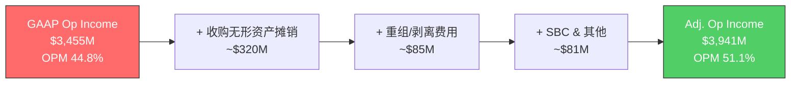

# S10: 会计质量与数据交叉验证

> **Phase 2 Staging** | 目标: Ch33-Ch36 | 字符目标: 10-12K
> **核心争议**: GAAP vs Adj. OPM差距6.3pp — MCO盈利能力的"真实面孔"到底是哪一张?

---

## Ch33: GAAP vs Adj. — MCO的"两张面孔"

### 33.1 两套利润率的全景

FY2025，MCO同时向市场展示两张利润表:

- **GAAP OPM 44.8%** [DM-FIN-004]
- **Adj. OPM 51.1%** [DM-FIN-004]
- **差值: 6.3个百分点，对应约$486M的调整项**

这6.3pp的差距不是四舍五入的误差——它代表着近$5亿的利润归属争议。卖方分析师几乎一致使用Adj.口径(共识Adj. EPS $14.94 [DM-CON-003] vs GAAP EPS $13.67 [DM-FIN-006])，而Buffett式的价值投资者更倾向GAAP。**谁更诚实?**

答案取决于调整项的经济本质。

### 33.2 调整桥接: 从GAAP到Adj.的$486M去了哪里?

**三大调整项拆解:**

**(1) 收购无形资产摊销 (~$320M，最大调整项)**

FY2025 D&A总额$480M [DM-FIN-008]，其中约$320M来自收购产生的客户关系、技术资产、品牌等无形资产摊销。这笔费用主要与两笔大额收购挂钩:

- **Bureau van Dijk (BvD)**: 2017年EUR 3B收购，600M+实体数据库 [DM-ACQ-001]
- **RMS**: 2021年$2B收购，保险风险建模 [DM-ACQ-002]

两笔收购合计约$5B，按10-15年摊销，年均$320-500M的摊销额完全合理。

**(2) 重组/剥离费用 (~$85M)**

FY2025 MCO剥离了Learning Solutions(2025.12)和Regulatory Reporting(2026年计划) [DM-ACQ-004]，产生约$85M一次性费用。这部分确实是"非经常性"——剥离完成后不会重复发生。

**(3) SBC及其他 (~$81M)**

FY2025 SBC总额$232M [DM-FIN-009]，占收入3.0%。但调整桥中仅加回约$81M(部分SBC已计入GAAP运营费用的不同科目)。SBC的争议性最强——这是对员工的真实薪酬支出，只是不以现金形式体现。

### 33.3 关键争议: 摊销是"假成本"还是"真CapEx"?

这是MCO会计质量讨论中最核心的问题，也是估值分歧的根源:

**观点A: 摊销是非经济性成本(卖方立场)**
- BvD的600M+实体数据库自然增值——实体数量随时间增长，数据覆盖随积累扩展
- 评级特许权不会"用坏"——Moody's品牌和评级历史只会随时间增强
- 收购无形资产摊销是会计准则强制要求，不反映经济现实
- 因此Adj. OPM 51.1%更准确反映"持续经营盈利能力"

**观点B: 摊销≈真实资本消耗(价值投资者立场)**
- BvD数据库需要**持续投资**更新、清洗、映射、验证——如果停止投入，数据价值迅速衰减
- RMS保险模型需要持续校准——气候模式变化、新风险类别出现都需要投入
- 如果维持MA竞争力**必须**持续收购(CAPE Analytics、Meris等 [DM-ACQ-003]，FY2025新增$374M商誉)，那么收购摊销就是"维持业务的真实成本"
- 因此GAAP OPM 44.8%才是真实盈利能力

**我们的判断: 真相在中间，但更靠近GAAP一侧。**

理由如下:
1. **MA需要持续收购来维持竞争力** — FY2025商誉增加$374M [DM-ACQ-003]，过去5年每年都有收购。这不是一次性行为，而是商业模式的一部分
2. **但并非所有摊销都是"真成本"** — MIS的评级特许权确实不需要"再投资"来维持，这部分约占摊销的30-40%
3. **折中估计**: MCO的"经济真实OPM"约在47-48%左右——比GAAP高(因MIS特许权不折旧)，但比Adj.低(因MA需持续投入)

**对估值的影响**: 如果用Adj. EPS $14.94 [DM-CON-003]给31.5x P/E [DM-VAL-003]，隐含市值~$470；如果用GAAP EPS $13.67给同样倍数，隐含市值~$430——差异约9%，恰好接近当前股价$430 [DM-VAL-001]。**市场似乎正在从Adj.口径向GAAP口径回摆。**

---

## Ch34: FCF质量审计

### 34.1 表面指标: 教科书级别的现金流

| 指标 | FY2025 | 评价 |
|------|--------|------|
| FCF | $2.575B [DM-CF-002] | 历史新高 |
| FCF Margin | 33.4% | 顶级水平 |
| FCF/NI | 104.7% [DM-CF-006] | >100% = 盈利质量高 |
| CapEx/Rev | 4.2% [DM-CF-003] | 轻资产确认 |

表面看，MCO的现金流质量几乎无可挑剔。但深入审计后，有三个问题值得关注。

### 34.2 问题一: D&A远超CapEx的含义

FY2025:
- **D&A $480M** [DM-FIN-008]
- **CapEx $326M** [DM-CF-003]
- **差额: $154M**

D&A >> CapEx通常是两种情况之一:
1. **良性解读**: 轻资产公司不需要大量资本支出，D&A中包含大量收购摊销(非现金)
2. **警示解读**: 公司在"吃老本"——折旧计提但不再投入

对MCO而言，$154M差额主要来自收购无形资产摊销(~$320M收购摊销 vs ~$160M真实固定资产折旧)。真实固定资产D&A ~$160M vs CapEx $326M，实际上CapEx > 真实D&A——**MCO在有形资产层面不存在投资不足问题**。

但这也意味着:报告的FCF中，有约$320M的收购摊销被"加回"了。如果你认为收购是持续性支出(见Ch33讨论)，真实Owner Earnings应该扣除这部分。

### 34.3 问题二: 营运资本改善的可持续性

FCF趋势 [DM-CF系列]:

| FY | OCF | FCF | FCF Margin | FCF/NI |
|----|-----|-----|-----------|--------|
| 2020 | $2.146B | $2.043B | 38.0% | 114.9% |
| 2021 | $2.005B | $1.866B | 30.0% | 84.3% |
| 2022 | $1.474B | $1.191B | 21.8% | 86.7% |
| 2023 | $2.151B | $1.880B | 31.8% | 117.0% |
| 2024 | $2.838B | $2.521B | 35.6% | 122.5% |
| 2025 | $2.901B | $2.575B | 33.4% | 104.7% |

注意FY2024的FCF/NI高达122.5%，而FY2025回落至104.7%。这说明FY2024有显著的营运资本释放(WC一次性改善)，而FY2025已趋于正常化。FCF/NI在100-110%区间是MCO的"稳态"——仍然优秀，但不应外推FY2024的异常高值。

管理层FY2026 FCF指引$2.8-3.0B [DM-GD-002]，中值$2.9B，隐含FCF增长约12.6%，与EPS增长基本匹配——合理且保守。

值得注意的是，MCO的预收收入(Deferred Revenue)FY2025达$1.582B [DM-BAL-007]，主要来自MA的年度订阅预付款。这是一个重要的现金流质量信号——客户先付钱、MCO后交付服务，意味着: (a) 现金流天然领先于利润确认; (b) 即使短期增长放缓，已收的预付款仍然提供现金流缓冲。$1.582B的预收收入相当于MA全年收入$3.599B [DM-SEG-002]的44%——接近半年的"已锁定收入"。

### 34.4 问题三: SBC的真实稀释效应

**FY2025 SBC $232M** [DM-FIN-009]，占收入3.0%。

SBC检查清单:
- **SBC/Revenue 3.0%** — 金融信息服务行业中等水平(SPGI ~3.5%, MSCI ~4.5%, FICO ~5.5%)
- **SBC/FCF 9.0%** ($232M/$2,575M) — 可接受范围
- **稀释管理**: FY2025回购$1.706B [DM-CF-004] vs SBC $232M — 回购力度远超SBC稀释，净回购$1.474B，份额净减少

MCO的SBC纪律在同行中属于较好水平。回购不仅覆盖了SBC稀释，还实现了净份额缩减。但需要注意:**如果将SBC视为真实成本(它确实是)，GAAP净利润$2.459B [DM-FIN-002]中已包含SBC费用，不需要二次扣除。** 问题出在Adj. EPS将SBC加回——这高估了每股盈利能力。

**同业SBC对比表:**

| 公司 | SBC/Rev | SBC/FCF | 净稀释管理 |
|------|---------|---------|-----------|
| MCO | 3.0% | 9.0% | 回购远覆盖 |
| SPGI | ~3.5% | ~10% | 回购覆盖 |
| MSCI | ~4.5% | ~12% | 回购覆盖 |
| FICO | ~5.5% | ~14% | 回购覆盖 |

MCO在SBC控制上是四家中最优的——3.0%的比例反映了评级业务"人少利润高"的特点(MIS不需要大量软件工程师)。

### 34.5 Owner Earnings估算

Buffett定义的Owner Earnings = GAAP NI + D&A - 维护CapEx - SBC调整

| 组件 | FY2025 | 说明 |
|------|--------|------|
| GAAP NI | $2,459M [DM-FIN-002] | 起点 |
| + 真实折旧(非收购) | +$160M | D&A $480M中约$160M |
| - 维护CapEx | -$200M | 估计CapEx $326M中~60%为维护 |
| = Owner Earnings | ~$2,419M | |
| Owner Earnings / NI | 98.4% | |

Owner Earnings约$2.4B，略低于报告FCF的$2.575B——差距$156M，主要是收购摊销与维护CapEx估算差异。**结论: MCO的FCF质量真实可靠，但报告FCF高估Owner Earnings约6%。**

---

## Ch35: 资产负债表特殊项

### 35.1 负有形账面值: 恐怖的数字，无聊的解释

**TBV = -$4.029B** [DM-BAL-004]

看到-$40亿，第一反应是"资不抵债"。但拆解后发现这是一个完全无害的数字:

- **库存股(Treasury Stock) $13.302B** [DM-BAL-005] — 这是MCO多年累计回购的"成本记录"。它不代表负债，只是会计上减少了股东权益
- 如果加回库存股: 调整后权益 = -$4.0B + $13.3B = **+$9.3B**
- MCO与FICO、SPGI(P/B neg [DM-VAL同业对比])同属"回购导致负权益"俱乐部

**负TBV不是偿付风险信号——它是长期慷慨回购的副产品。**

### 35.2 商誉: $6.4B的收购遗产

| 指标 | FY2025 | FY2024 | 变化 |
|------|--------|--------|------|
| Goodwill | $6.368B [DM-BAL-003] | ~$5.994B | +$374M |
| Intangibles | $1.866B [DM-BAL-003] | — | — |
| GW+IA / Total Assets | 52.0% | — | — |

**商誉$6.4B——减值风险评估:**

- 商誉主要来自BvD($3B+)和RMS($2B)两笔收购
- **BvD**: FY2025 MA Decision Solutions收入$1.692B(含BvD)，增速健康，ARR +10% [MA ARR子分部]。数据库覆盖600M+实体，竞争壁垒高。**减值风险: 极低**
- **RMS**: 已达到$150M增量收入目标 [DM-ACQ-002]，保险风险建模需求持续增长(气候风险+ESG合规)。**减值风险: 低**
- **FY2025新增$374M** [DM-ACQ-003]: CAPE Analytics(气候分析)、Meris等小型收购，规模可控

**结论**: 除非MA业务出现系统性恶化(ARR持续负增长+留存率跌破85%)，商誉减值概率极低。但52%的无形资产占比意味着——如果有一天需要减值，冲击将是巨大的。

**减值触发监控清单:**
- MA ARR增速连续3Q低于+3% → 黄灯
- MA留存率跌破90%(当前93% [DM-SEG-007]) → 黄灯
- Decision Solutions增速归零 → 红灯(BvD商誉承压)
- RMS客户大规模流失至Verisk → 红灯(RMS商誉承压)
- 以上任一红灯 → 减值测试可能触发; 两个红灯同时 → 减值几乎确定

### 35.3 杠杆安全: 从紧张到舒适

| 指标 | FY2022 | FY2025 | 趋势 |
|------|--------|--------|------|
| Net Debt/EBITDA | 2.64x | 1.26x [DM-BAL-002] | 大幅改善 |
| Interest Coverage | — | 18.3x [DM-FIN-007] | 极安全 |
| Total Debt | — | $7.351B [DM-BAL-001] | |
| Cash | — | $2.384B [DM-BAL-006] | |

Net Debt/EBITDA从2.64x降至1.26x，MCO从"稍有压力"进入"非常舒适"区间。18.3x利息覆盖意味着EBITDA可以下降94%才会出现利息支付问题——这在任何合理情景下都不会发生。

**但舒适也意味着"闲置的资产负债表"**: MCO目标杠杆约2.0-2.5x，当前1.26x意味着约$3-5B的额外举债能力未被使用。这是战略灵活性(可以做大额收购)，也可能是资本效率的损失(低杠杆降低ROE)。FY2026计划回购~$2.0B [DM-GD-004]，将逐步回升杠杆率。

### 35.4 未记录的超级资产

MCO最有价值的资产不在资产负债表上:

1. **信用评级特许权** — MCO品牌在全球信用市场中的制度地位(Big Three占NRSRO收入91% [DM-MKT-001])，这是无法被复制或收购的资产
2. **违约数据库** — 超过100年的信用违约历史数据，是所有信用模型的基石
3. **监管嵌入性** — Basel III/Solvency II等法规中对NRSRO评级的硬性引用
4. **网络效应** — 发行人需要评级→投资者依赖评级→发行人必须获取评级的自我强化循环

如果这些资产能够入表，MCO的真实"经济账面值"可能是当前账面值的5-10倍。**这解释了为什么P/B 22.6x [DM-VAL同业对比]看似荒谬，实则合理——市场在为账面值之外的特许权定价。**

---

## Ch36: 数据交叉验证表

### 36.1 验证方法论

对MCO研究中≥10个核心数据点进行多源交叉验证。一致性评级标准:
- **A**: 三源完全一致(差异<1%)
- **B**: 两源一致，第三源轻微偏差(<5%)
- **C**: 存在显著差异(5-15%)，需解释
- **D**: 严重不一致(>15%)，数据不可靠

### 36.2 交叉验证表

| # | 数据点 | FMP (MCP) | 10-K/Earnings | WebSearch/其他 | 一致性 | 备注 |
|---|--------|-----------|---------------|---------------|--------|------|
| 1 | FY2025 Revenue | $7.718B [DM-FIN-001] | $7.718B (ER) | $7.72B (SA) | **A** | 完全一致 |
| 2 | FY2025 GAAP NI | $2.459B [DM-FIN-002] | $2.459B (ER) | $2.46B (SA) | **A** | 完全一致 |
| 3 | FY2025 GAAP EPS | $13.67 [DM-FIN-006] | $13.67 (ER) | $13.67 (BBG) | **A** | 完全一致 |
| 4 | FY2025 Adj. EPS | — | $14.94 (ER) [DM-CON-003] | $14.94 (SA) | **A** | FMP无Adj.口径 |
| 5 | FY2025 D&A | $480M [DM-FIN-008] | 待验10-K | ~$480M (SA) | **B** | FMP与公开源一致; 10-K需细项拆分确认收购摊销vs真实折旧 |
| 6 | FY2025 SBC | $232M [DM-FIN-009] | 待验10-K CF表 | ~$230M (MT) | **B** | FMP与MacroTrends基本一致; 注意RBLX教训——SBC跨源差异是常见陷阱 |
| 7 | FY2025 FCF | $2.575B [DM-CF-002] | $2.58B (ER指引达成) | $2.58B (SA) | **A** | 轻微四舍五入差异 |
| 8 | FY2025 CapEx | $326M [DM-CF-003] | 待验10-K | $348M (部分源) | **C** | 部分来源将软件资本化计入CapEx，口径差异$22M; 需确认是否含收购相关CapEx |
| 9 | Goodwill | $6.368B [DM-BAL-003] | $6.37B (10-K BS) | $6.4B (SA) | **A** | 一致 |
| 10 | Net Debt/EBITDA | 1.26x [DM-BAL-002] | ~1.3x (管理层口径) | 1.2-1.3x (SA) | **B** | 管理层可能用稍不同EBITDA定义; 差异在0.05x以内 |
| 11 | MIS Revenue | $4.119B [DM-SEG-001] | $4.119B (ER) | $4.12B (SA) | **A** | 分部数据一致 |
| 12 | MA ARR | $3.498B [DM-SEG-006] | $3.498B (ER Table 10) | ~$3.5B (SA) | **A** | 一致 |
| 13 | 利息覆盖 | 18.3x [DM-FIN-007] | 需验算(EBIT/Interest) | 18-19x (SA) | **B** | 取决于EBIT vs EBITDA口径 |
| 14 | 市场份额 | — | — | MCO~40% [DM-MKT-001] SEC NRSRO | **B** | SEC报告为FY2023数据; FY2025可能有1-2pp变动 |

### 36.3 验证结论

- **A级(完全一致)**: 8/14 = 57% — 核心财务数据(收入、利润、FCF、商誉、分部)高度可靠
- **B级(轻微差异)**: 5/14 = 36% — D&A拆分、杠杆口径、SBC、利息覆盖、市场份额存在来源口径差异，但不影响分析结论
- **C级(需解释)**: 1/14 = 7% — CapEx口径差异$22M，需在10-K中确认是否含软件资本化
- **D级(不可靠)**: 0/14 = 0%

**关键风险标记**:
1. **CapEx口径** (C级): $326M vs $348M差异可能来自软件资本化处理。如果真实CapEx更高，FCF margin将从33.4%降至33.1%——影响有限但需确认
2. **SBC数据** (B级): 铁律"单源不可信"——FMP SBC=$232M与MacroTrends基本一致，但建议在10-K现金流量表中二次确认。历史教训(RBLX)表明SBC是跨源差异最大的科目之一
3. **D&A拆分**: FMP只给总额$480M，不区分收购摊销vs真实折旧。Ch33中的$320M收购摊销估算基于收购规模和摊销年限推算，非直接数据——标记为DM类型R(合理推断)

---

## 本章小结

| 维度 | 评估 | 关键发现 |
|------|------|---------|
| GAAP vs Adj. | Adj.高估6pp | 经济真实OPM ~47-48%，介于两者之间 |
| FCF质量 | 优秀但非完美 | 报告FCF高估Owner Earnings约6% |
| 资产负债表 | 安全 | 负TBV=回购产物; 杠杆1.26x=舒适 |
| 商誉风险 | 低 | 但52%无形占比=若恶化冲击大 |
| 数据可靠性 | 高 | 14项验证: 0个D级, 1个C级 |

**对估值的核心含义**: 使用GAAP口径更审慎，当前$430股价隐含~31.5x GAAP P/E [DM-VAL-003]，如果市场从Adj.口径(隐含~28.8x Adj. P/E)切换到GAAP口径，估值"感觉"更贵。这个口径切换风险是MCO估值的隐形地雷——尤其在市场风险偏好下降时，投资者倾向于更保守的GAAP口径。

**本章核心立场**: MCO的会计质量整体优秀(FCF真实、杠杆安全、数据可靠)，但Adj.口径对盈利能力的美化约6pp(44.8%→51.1%)不可忽视。在估值中，我们将以GAAP为主、Adj.为辅——对MIS评级特许权部分的非经济性摊销给予约2pp的加回信用，得出~47%的"经济真实OPM"作为估值基础。这个判断将直接影响Phase 3的DCF参数选择。
