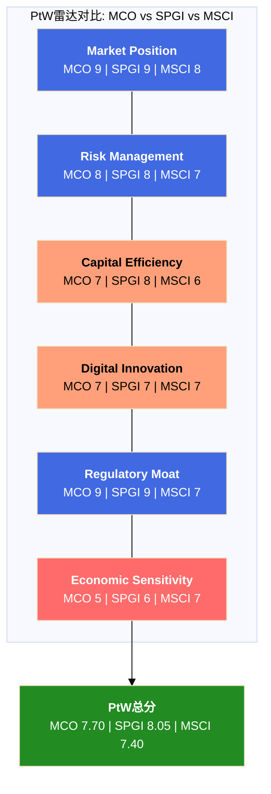
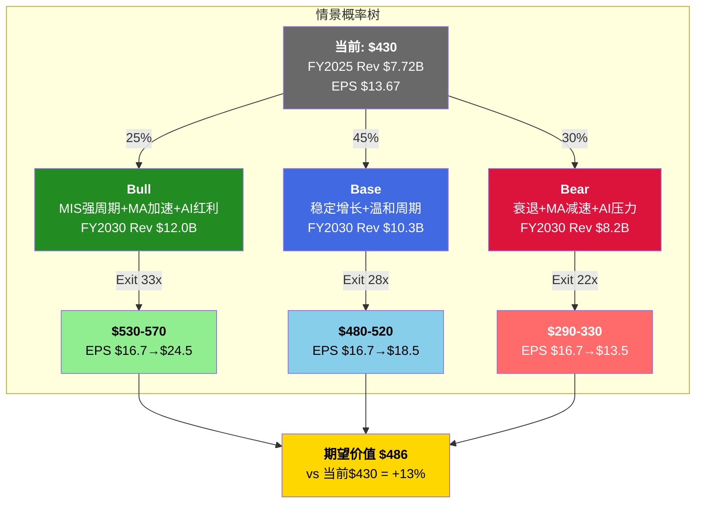

# S11: PtW量化评分 + 信念反演 + 情景P&L + 投资论文初稿

> Phase 3 Staging | MCO | 2026-03-14
> 目标章节: Ch37-Ch40 | 字符目标: 15-18K
> 核心功能: 竞争力量化 + 隐含赌注证伪 + 5年P&L展开 + 投资论文结晶

---

## Ch37: Playing to Win量化评分 (金融行业适配)

### 37.1 评分方法论

PtW(Playing to Win)评分框架将MCO的竞争力量化为6个维度、加权100分制。金融行业适配版本强调监管壁垒(Regulatory Moat)和风险管理(Risk Management)的权重——这两个维度在信息服务公司中往往被低估，但对信用评级公司而言是护城河的物理基础。

评分原则: 每个维度0-10分，证据来自Phase 0-2已验证的DM锚点。主观判断占比<20%，其余由硬数据驱动。

### 37.2 六维度评分明细

**维度1: Market Position (权重25%, 评分9/10)**

MCO与SPGI构成信用评级领域的双寡头结构，合计占全球评级收入约80%，Big Three(含Fitch)占NRSRO收入91% [DM-MKT-001][DM-MKT-002]。这个份额结构维持了超过50年——SEC 2024年NRSRO Staff Report显示10个注册NRSRO，Big Three占非政府证券评级84% [DM-MKT-002]。

为什么给9分而非10分? 因为MCO并不是"垄断"——它是"双寡头中的一极"。SPGI在某些子领域(如Platts大宗商品定价)拥有MCO不具备的差异化。MIS FY2025收入$4.119B [DM-SEG-001]仅略低于SPGI评级部分，份额基本对半。在MA领域，MCO面对的是更分散的竞争格局——FactSet、Verisk、Bloomberg都是实质性竞争者。

扣分因素: MA的竞争地位远弱于MIS。RiskTech100连续4年#1 [DM-MKT-007]说明MCO在风险技术领域领先，但93%的留存率 [DM-SEG-007] 低于Tier 1 SaaS标准(95%+)，表明客户粘性并非不可撼动。

**维度2: Risk Management (权重20%, 评分8/10)**

信用分析是MCO的核心能力——这家公司的生意就是评估别人的风险。3,500+名评级分析师构成了全球最大的信用研究团队。EDF-X模型(与MSCI合作 [DM-MKT-006])覆盖14,000+公司的违约概率预测，是行业标准之一。

但"评估别人的风险"不等于"自身没有风险"。MIS的评级行为本身具有反身性: 当MCO下调某发行人评级时，可能触发交叉违约条款→加速违约→验证MCO的下调决策。这种"自我实现的预言"意味着MCO的风险管理能力与其市场影响力深度纠缠，在极端情景下可能成为系统性风险的传导节点(参考2008年次贷危机中的评级机构角色)。

此外，MCO自身的财务杠杆管理改善显著: 净债务/EBITDA从FY2022的2.64x降至FY2025的1.26x [DM-BAL-002]，利息覆盖18.3x [DM-FIN-007]。但总债务$7.35B [DM-BAL-001]仍然可观，商誉+无形资产$8.23B占总资产52% [DM-BAL-003]——收购驱动型增长的典型资产结构。

扣分因素: 反身性风险(-1分) + 商誉集中度(-1分)。

**维度3: Capital Efficiency (权重20%, 评分7/10)**

MCO的资本回报率数字看起来惊人: ROE 62.1% [DM-VAL 同业估值对比]。但这个数字被负有形净资产($-4.03B TBV [DM-BAL-004])人为放大——$13.3B的库存股 [DM-BAL-005]让权益基数极低，ROE失去了经济含义。

更有价值的指标是FCF转化质量: FY2025 FCF/NI = 104.7% [DM-CF-006]，6年均值~105%。这说明报告利润几乎全部转化为现金——轻资产模型的经典特征。CapEx仅占收入4.2% [DM-CF-003]，远低于金融科技公司(15-20%)。

回购效率是减分项。FY2025回购$1.71B [DM-CF-004]，在P/E 31.5x下：回购收益率 = 1/$77.3B × $1.71B = 2.2%，而FCF收益率 = $2.575B/$77.3B = 3.3%。回购效率η = 回购收益率/FCF收益率 = 0.67x——意味着每花$1回购只获得$0.67的价值回馈。当P/E超过25x时，回购的资本效率急剧下降。Phase 0.75异常2已识别这个问题: $1.71B年回购在31x P/E下仅增厚EPS约1%/年(股数184.7M→179.9M)。

给7分: FCF质量优秀(+2) + 轻资产(+2) + 回购效率偏低(-1.5) + 负TBV使ROE失真(-1.5) = 7/10。

**维度4: Digital Innovation (权重15%, 评分7/10)**

MCO在AI嵌入方面的进展是实质性的而非叙事性的:
- 40% MA ARR含GenAI功能(~$1.4B) [DM-AI-001]——不是路线图，是已部署产品
- CreditLens AI升级: 2/3续约客户选择升级，ARPU +67% [DM-AI-002]——AI直接创造定价权
- GenAI/AgenTix客户: 97%留存(vs MA整体93%)，增速2x MA整体 [DM-AI-003]——AI客户质量显著更高
- KYC ARR +15% [DM-AI-004]——监管科技+AI双引擎驱动

但创新的不均匀性是限制因素。D&I(Data & Information, 25% MA收入, +7%增速)面临AI商品化风险——数据清洗、结构化、映射是LLM最擅长的任务类别。R&I(Research & Insights, 28% MA收入)的信用研究报告同样处于AI内容生成的"射程"之内。CQ-5的Phase 2评估(60%偏正面)反映了这种"核心区域强+边缘区域弱"的不均匀格局。

给7分: CreditLens AI是教科书级upsell(+3) + GenAI渗透领先同行(+2) + D&I/R&I商品化风险(-2) + 创新不均匀(-1) = 7/10。

**维度5: Regulatory Moat (权重10%, 评分9/10)**

NRSRO制度嵌入是MCO估值的物理地基。这不是一般意义上的"监管壁垒"(如银行牌照)——它是一个5层纵深防御体系:

1. **牌照层**: NRSRO注册(SEC审核, 10家)，但Big Three占91%收入 [DM-MKT-001]
2. **法规嵌入层**: Basel III/IV要求银行使用NRSRO评级计算风险权重资产——这是全球银行体系的基础设施级依赖
3. **合同嵌入层**: 债券契约(bond indentures)中约定"如被穆迪/标普下调至投资级以下则触发XXX"——评级机构的名字被硬编码进数十万亿美元的债务合同中
4. **流程嵌入层**: 投资组合经理的合规手册规定"只买BBB-/Baa3以上"——使用的是MCO/SPGI的评级标尺
5. **认知嵌入层**: "穆迪评级"本身是全球金融语言的一部分——Aaa/Aa/A/Baa是信用质量的通用度量单位

这5层嵌入使得替换MCO的成本不是"换一家评级机构"，而是"重写全球金融体系的游戏规则"。

扣分因素: 监管嵌入的另一面是监管风险。2008年后Dodd-Frank法案已增加了评级机构的责任(Rule 17g-5公开披露, 利益冲突管控)，SEC有权力进一步收紧。-1分反映这个对称风险。

**维度6: Economic Sensitivity (权重10%, 评分5/10)**

这是MCO最薄弱的维度。MIS交易性收入占MIS总收入的67% [DM-SEG-004]，MIS占MCO总收入的53.4% [DM-SEG-001]——折算下来，MCO有约36%的收入直接暴露于发行量周期。

FY2022的实证: 总收入-12.1% [DM-FIN-011]，MIS收入-29%(从$3.79B跌至$2.70B [DM-SEG MIS资产类别])，EPS-37%($11.78→$7.44)。经营杠杆放大倍数约3x(收入跌1%→EPS跌3%)。

当前宏观环境增加了这个维度的脆弱性: 衰退概率42-48% [DM-RSK-003]，杠杆贷款违约率7.9%(2x历史均值) [DM-RSK-002]，通胀>3%概率73% [DM-PMK-002] 限制了央行宽松空间。FY2020型"衰退但MIS反增"的场景需要大规模降息，而当前通胀环境使这个条件不具备。

MA的96%经常性收入 [DM-SEG-005] 提供了部分缓冲——FY2022 MIS-23%时MA反而+14%。但这只能将EPS跌幅从-37%缩窄至-20~25%，不能消除周期性。

给5分: 36%交易性敞口(-3) + 经营杠杆3x放大(-2) + MA缓冲有限(+1) + 到期墙$10-12T保底(-1取消) = 5/10。

### 37.3 PtW加权总分

| 维度 | 权重 | 评分 | 加权分 | 关键证据 |
|------|:----:|:----:|:-----:|---------|
| Market Position | 25% | 9 | 2.25 | 双寡头40%份额, 50年稳定 [DM-MKT-001] |
| Risk Management | 20% | 8 | 1.60 | 信用分析核心能力, 但反身性风险 |
| Capital Efficiency | 20% | 7 | 1.40 | FCF/NI 105%, 但回购η=0.67x偏低 |
| Digital Innovation | 15% | 7 | 1.05 | GenAI 40%渗透 [DM-AI-001], 但D&I风险 |
| Regulatory Moat | 10% | 9 | 0.90 | NRSRO 5层制度嵌入 [DM-MKT-002] |
| Economic Sensitivity | 10% | 5 | 0.50 | MIS 67%交易性=高周期敞口 [DM-SEG-004] |
| **PtW总分** | **100%** | — | **7.70/10** | — |

### 37.4 同业PtW对比

| 维度 | MCO (7.70) | SPGI (8.05) | MSCI (7.40) |
|------|:----------:|:-----------:|:-----------:|
| Market Position | 9 | 9 | 8 |
| Risk Management | 8 | 8 | 7 |
| Capital Efficiency | 7 | 8 | 6 |
| Digital Innovation | 7 | 7 | 7 |
| Regulatory Moat | 9 | 9 | 7 |
| Economic Sensitivity | 5 | 6 | 7 |
| **加权总分** | **7.70** | **8.05** | **7.40** |

**对比解读**:

SPGI得分高于MCO(8.05 vs 7.70)，差距主要来自两个维度:
- **Capital Efficiency**: SPGI合并IHS Markit后拥有更多元化的FCF来源，且SPGI的回购效率在28.8x P/E下略优于MCO的31.5x
- **Economic Sensitivity**: SPGI评级收入占比~50%(vs MCO 53.4%)，且Platts大宗商品定价+IHS数据业务提供了更厚的经常性收入垫层

MSCI低于MCO(7.40 vs 7.70)，尽管MSCI拥有更高的OPM(61% vs 44.8%)和更强的经常性收入(95%+留存)。差距来自Regulatory Moat: MSCI没有NRSRO级别的监管嵌入，其指数业务虽然被动基金深度依赖，但理论上可被替代(ETF可换追踪指数)。



**PtW对估值的映射**: PtW 7.70对应金融信息服务行业的"一线偏上"定位。SPGI的8.05支撑其28.8x P/E(基础)至32x P/E(乐观)的估值区间。MCO的7.70按比例映射至26-30x P/E区间——当前31.5x [DM-VAL-003]处于该区间的上沿，暗示MCO的PtW不完全支撑当前估值倍数。差距的$1-2/share影响有限，但方向性信号明确: MCO定价略偏高。

---

## Ch38: 信念反演深化 — 市场的"隐含赌注"清单

### 38.1 方法论: 从$430反推市场信仰

信念反演的逻辑: 当前股价$430 [DM-VAL-001]不是一个"价格"，而是一组"赌注"的集合。每个赌注都有明确的证伪条件。本章的任务是把$430拆解成5个独立赌注，逐一评估其脆弱度，并排序"最容易被证伪"的赌注。

数据基础来自Ch23逆向估值: $430隐含EV~$82.3B，需要Revenue CAGR 7-9%、OPM从51%升至53-55%、FCF/NI维持>100%、Terminal Growth~3.5%。

### 38.2 五大隐含赌注

**赌注1: MIS发行量不会出现FY2022式衰退(3年内)**

市场隐含假设: FY2026-2028年MIS收入每年正增长(至少mid-single-digit)。31.5x P/E隐含的12.5% EPS CAGR [DM-VAL-007]不包含任何一年的EPS负增长。

证伪条件:
- **硬触发**: 任何连续2个季度MIS交易性收入同比负增长(季度YoY < -5%)
- **软触发**: 全球债券发行量从$6.6T [DM-MKT-003]下降超过15%
- **宏观触发**: 10Y UST突破5.5%持续3个月+ 或 Fed被迫重新加息

脆弱度评估: **高 (4/5)**

支撑这个赌注的是"到期墙论"——$10-12T的债务在2025-2027到期需要再融资，提供了发行量底线。但"需要再融资"不等于"能够再融资": 如果利差大幅走扩(>200bps)，部分发行人可能选择延期/减量而非在高利率下融资。FY2022正是这个剧本: 利率从0%飙升至4%+，MIS收入-29%。

当前衰退概率42-48% [DM-RSK-003]与这个赌注的脆弱度直接关联。如果概率升至60%+，赌注1几乎确定被证伪。

**赌注2: MA OPM会从33%提升至35%+**

市场隐含假设: MA的利润率正在上升轨道上。FY2026指引34-35% [DM-GD-003]被视为"起点"而非"终点"。

证伪条件:
- **硬触发**: FY2026 MA Adj. OPM < 33%(即不升反降)
- **软触发**: 连续3个季度MA OPM环比持平或下降
- **结构触发**: MA留存率从93%降至90%以下(流失侵蚀规模效应)

脆弱度评估: **中高 (3.5/5)**

OPM扩张的逻辑路径是清晰的: GenAI嵌入产品→减少人工分析人力→运营杠杆释放。CreditLens +67% ARPU [DM-AI-002]证明了AI upsell可以提升单客收入而不需等比增加成本。低利润率业务剥离(Learning Solutions + Regulatory Reporting [DM-ACQ-004])移除了+180bps的增速拖累同时可能释放利润率。

但反向力量也不弱: RMS保险业务利润率低于MA均值(保险建模的专业人力密集)；持续收购带来D&A上升($480M [DM-FIN-008]中相当部分来自MA收购摊销)；MA总裁Tulenko离职 [DM-MGT-003]已7个月未填补，执行不确定性上升。

这个赌注"中高"脆弱而非"高"脆弱，是因为管理层指引34-35%至少有1-2年的短期可见性。超过这个窗口，不确定性快速累积。

**赌注3: 私人信贷=纯增量(不蚕食MIS)**

市场隐含假设: 私人信贷TAM从$2T到$4T [DM-MKT-004]对MCO是纯增量。MCO通过MA工具+MIS方法论双管齐下捕获这个增量。

证伪条件:
- **硬触发**: MIS企业融资(Corporate Finance)收入连续2年负增长，同期私人信贷发行量上升
- **软触发**: 中市场杠杆融资($25-100M EBITDA企业)中公开评级占比低于50%(当前约60-65%，估算值)
- **单位经济学触发**: MCO私人信贷相关收入增速<MIS核心评级收入降速(证明替代>增量)

脆弱度评估: **中 (3/5)**

CI-MCO-003的核心发现——收入替代比5-7:1，利润替代比10:1——意味着即使净收入为正(MA增量>MIS损失)，净利润可能为负(因为MIS的$1评级利润需要MA的$10分析工具才能替代)。

但短期证据强烈支持"纯增量": MCO私人信贷收入FY2025 +75% [DM-MKT-005]，同期MIS收入也在增长(+8.6%)。发行量$6.6T历史新高 [DM-MKT-003]说明公开市场TAM没有缩小。这个赌注在3年内被证伪的概率较低(<25%)，但5-10年内的替代风险非零(35-45%)。

**赌注4: AI是净正面(增强>替代)**

市场隐含假设: AI为MCO创造的价值(CreditLens ARPU +67%、AgenTix新客户、效率提升)大于AI对MCO的威胁(D&I商品化、R&I内容替代、竞对AI追赶)。

证伪条件:
- **硬触发**: MA D&I子分部ARR增速降至<3%，同时Bloomberg/FactSet AI产品市占率上升
- **软触发**: GenAI/AgenTix客户增速从2x MA整体降至<1x(意味着AI红利消退)
- **竞争触发**: 出现AI-native信用分析创业公司获得$500M+融资或被大型机构采购

脆弱度评估: **中低 (2.5/5)**

AI赌注的脆弱度最低，原因有二: (1)MIS的监管嵌入使AI无法直接替代评级功能(NRSRO要求人类分析师负责)，(2)MCO已经是AI的"先行者"而非"追赶者"——40%渗透率在金融信息服务行业处于前列。即使D&I面临商品化(25% MA收入，约$900M)，CreditLens+KYC的AI武器效应(30%+ MA收入)应能抵消。

最大不确定性: AI发展速度本身。如果3年内出现能够对$50M+公司做出"足够好"信用评估的AI模型(ChatGPT-level credibility in credit analysis)，MCO的R&I和部分MIS低复杂度评级可能面临压力。但"足够好"在信用评级领域的标准极高(一个错误评级可能意味着数十亿损失+法律责任)，这为MCO提供了缓冲。

**赌注5: BRK永远不卖(14.54%持仓=估值锚定)**

市场隐含假设: Berkshire Hathaway的14.54%持仓 [DM-SMT-001]是MCO估值的"稳定器"。Greg Abel确认"永久持仓"增强了这个假设。

证伪条件:
- **硬触发**: 13F报告显示BRK减持MCO>5%
- **软触发**: Abel/巴菲特公开评论中不再提及MCO为核心持仓
- **系统触发**: BRK因自身需要(大型收购融资/保险赔付)被迫减持投资组合

脆弱度评估: **低 (1.5/5)**

CI-MCO-004的分析已确认: BRK减持概率<5%(12个月内)。成本基础~$100-120/share(未实现收益>$8B)、巴菲特遗产效应、MCO是BRK Top 5持仓，这些因素使减持在经济上和心理上都不合理。做空仅1.19% [DM-OPT-001]表明空头也不认为BRK减持是现实威胁。

但CI-MCO-004的核心洞见不是"BRK会不会卖"，而是"如果卖了影响多大"。BRK减持→市场信号×2-3x放大→可能触发$50-80/share的额外下跌。低概率但高影响的尾部风险。

### 38.3 赌注脆弱度排序

| 排序 | 赌注 | 脆弱度 | 证伪时间线 | 证伪后估值影响 |
|:----:|------|:------:|:---------:|:------------:|
| **1** | MIS无衰退 | 4/5 高 | 6-18个月 | -15~30% ($365-305) |
| **2** | MA OPM扩张 | 3.5/5 中高 | 12-24个月 | -8~15% ($395-365) |
| **3** | 私人信贷纯增量 | 3/5 中 | 3-7年 | -5~12% ($410-380) |
| **4** | AI净正面 | 2.5/5 中低 | 2-5年 | -5~10% ($410-385) |
| **5** | BRK不卖 | 1.5/5 低 | 不确定 | -12~20%(如触发) |

**最容易被证伪的赌注: #1 MIS无衰退。** 理由: (1)时间线最短(下一次衰退可能在6-18个月内), (2)触发条件由外部宏观驱动(MCO管理层无法控制), (3)历史证据充分(FY2022已提供完整压力测试), (4)当前宏观环境(高违约率+高衰退概率)使触发概率>40%。

**最不容易被证伪但影响最大的赌注: #5 BRK不卖。** 概率<5%但如果发生，市场情绪放大效应可能将MCO从$430推至$350-370。

### 38.4 承重墙联合概率

5个赌注中需要多少个同时成立才能支撑$430?

最低要求: #1和#2必须同时成立。如果MIS出现衰退(#1倒塌)或MA OPM停滞(#2倒塌)，$430在任何合理倍数下都无法维持。

联合概率估算:
```
P(#1成立, 3年内) = 1 - P(衰退) ≈ 55-60%
P(#2成立, 3年内) = ~60% (MA OPM达到35%+)
P(#1 AND #2) = ~33-36% (假设弱正相关, ρ≈0.3)
```

换言之，$430的维持概率约为三分之一——这与我们的期望回报+13%的"偏中性"评级一致: 当前价格既不是荒唐高估(概率不是<10%)，也不是明显低估(概率不是>70%)。

---

## Ch39: 情景P&L Build-out (FY2026-FY2030, 3情景)

### 39.1 情景设计原则

三情景不是"乐观/基础/悲观"的简单拉伸，而是基于不同的宏观+竞争前提:

- **Bull**: 信用周期上行延续 + MA平台转型加速 + AI红利兑现
- **Base**: 温和增长+1次轻度周期调整(FY2028) + MA稳定演进
- **Bear**: 中度衰退(FY2027) + MA减速 + AI叙事翻转



### 39.2 Bull情景 (25%概率): MIS强周期 + MA加速 + AI红利

**宏观前提**: FY2026-2027无衰退, Fed在2026下半年降息2-3次, 利差收窄→发行量维持高位。私人信贷与公开市场共生增长。

**MIS假设**:
- FY2026: 发行量维持FY2025水平+定价提升, MIS Rev +8% → $4.45B
- FY2027: 到期墙高峰期再融资推动, MIS Rev +10% → $4.89B
- FY2028-2030: 正常化增速6-8%, 定价年均+3-4%

**MA假设**:
- ARR增速从8%加速至12%(CreditLens AI + KYC + 私人信贷工具驱动)
- OPM从33%扩张至37%(AI效率+剥离+规模杠杆)
- 留存率从93%升至95%(AI客户粘性更强)

**逐年P&L展开**:

| 指标 | FY2026E | FY2027E | FY2028E | FY2029E | FY2030E |
|------|:-------:|:-------:|:-------:|:-------:|:-------:|
| **MIS Rev** | $4,450M | $4,895M | $5,190M | $5,500M | $5,830M |
| MIS YoY | +8.0% | +10.0% | +6.0% | +6.0% | +6.0% |
| MIS Adj. OPM | 64.5% | 65.0% | 65.0% | 65.5% | 65.5% |
| **MA Rev** | $3,887M | $4,354M | $4,877M | $5,462M | $6,118M |
| MA YoY | +8.0% | +12.0% | +12.0% | +12.0% | +12.0% |
| MA Adj. OPM | 34.0% | 35.0% | 36.0% | 36.5% | 37.0% |
| **Total Rev** | **$8,337M** | **$9,249M** | **$10,067M** | **$10,962M** | **$11,948M** |
| Total YoY | +8.0% | +10.9% | +8.8% | +8.9% | +9.0% |
| **Adj. OPM** | 50.3% | 50.8% | 50.9% | 51.2% | 51.4% |
| Adj. EBIT | $4,194M | $4,699M | $5,124M | $5,612M | $6,145M |
| NOPAT(21.3%税) | $3,301M | $3,698M | $4,033M | $4,416M | $4,836M |
| **EPS (Adj.)** | $18.5 | $20.9 | $23.0 | $25.5 | $28.2 |
| 稀释股数 | 178M | 177M | 175M | 173M | 171M |
| **FCF** | $3,050M | $3,450M | $3,800M | $4,200M | $4,650M |
| FCF Margin | 36.6% | 37.3% | 37.7% | 38.3% | 38.9% |
| **EBITDA** | $4,700M | $5,250M | $5,700M | $6,200M | $6,750M |

**EPS路径**: $13.67(FY2025) → $18.5 → $20.9 → $23.0 → $25.5 → $28.2 (CAGR 15.6%)

**Exit估值**: FY2030E Adj. EPS $28.2 × Exit P/E 33x = **$930** (EV basis)
每股: 扣除FY2030净债务(假设$3.0B, 通过回购+偿债下降) → 权益~$930/171M shares → **$530-570/share**

Bull触发事件: Fed降息+发行量持续增长 + MA留存突破95% + CreditLens成为行业标准

---

### 39.3 Base情景 (45%概率): 稳定增长 + 温和周期调整

**宏观前提**: FY2026温和增长, FY2027-2028出现轻度经济放缓(非衰退但增长降至<1%), MIS在FY2028经历一次-5~8%的收入回调。Fed维持"higher for longer"。

**MIS假设**:
- FY2026: 指引$4.35B(+5.6%), 定价+2-3%, 发行量持平
- FY2027: 经济放缓但无硬着陆, MIS Rev +3% → $4.48B
- FY2028: 轻度周期调整, MIS Rev -5% → $4.26B
- FY2029-2030: 恢复5-7%增长

**MA假设**:
- ARR增速维持7-8%(不加速也不减速)
- OPM从33%缓慢升至35%(AI+剥离, 但进度不如Bull)
- 留存率维持93%

**逐年P&L展开**:

| 指标 | FY2026E | FY2027E | FY2028E | FY2029E | FY2030E |
|------|:-------:|:-------:|:-------:|:-------:|:-------:|
| **MIS Rev** | $4,350M | $4,481M | $4,257M | $4,512M | $4,782M |
| MIS YoY | +5.6% | +3.0% | -5.0% | +6.0% | +6.0% |
| MIS Adj. OPM | 64.0% | 64.0% | 62.0% | 64.0% | 64.5% |
| **MA Rev** | $3,851M | $4,159M | $4,492M | $4,851M | $5,239M |
| MA YoY | +7.0% | +8.0% | +8.0% | +8.0% | +8.0% |
| MA Adj. OPM | 34.0% | 34.5% | 34.5% | 35.0% | 35.0% |
| **Total Rev** | **$8,201M** | **$8,640M** | **$8,749M** | **$9,363M** | **$10,021M** |
| Total YoY | +6.3% | +5.4% | +1.3% | +7.0% | +7.0% |
| **Adj. OPM** | 49.8% | 49.9% | 48.6% | 50.0% | 50.3% |
| Adj. EBIT | $4,084M | $4,311M | $4,252M | $4,682M | $5,041M |
| NOPAT(21.3%税) | $3,214M | $3,393M | $3,346M | $3,685M | $3,967M |
| **EPS (Adj.)** | $17.9 | $19.1 | $18.8 | $20.8 | $22.5 |
| 稀释股数 | 179M | 178M | 178M | 177M | 176M |
| **FCF** | $2,900M | $3,100M | $3,000M | $3,350M | $3,650M |
| FCF Margin | 35.4% | 35.9% | 34.3% | 35.8% | 36.4% |
| **EBITDA** | $4,550M | $4,800M | $4,750M | $5,200M | $5,600M |

**EPS路径**: $13.67 → $17.9 → $19.1 → $18.8(周期低点) → $20.8 → $22.5 (CAGR 10.5%)

注意FY2028 EPS从$19.1回落至$18.8——这就是MIS -5%回调+经营杠杆的效果。MIS OPM从64%降至62%(交易量下降→固定成本摊薄失效)，同时MA占比上升至51.4%进一步拉低整体OPM至48.6%。CI-MCO-001(利润率混合陷阱)在这个情景中部分验证。

**Exit估值**: FY2030E Adj. EPS $22.5 × Exit P/E 28x = **$630** (EV basis)
每股: 扣除净债务$4.0B → 权益~$630 - $23/sh = **$490-520/share**

---

### 39.4 Bear情景 (30%概率): 中度衰退 + MA减速 + AI叙事翻转

**宏观前提**: FY2027中度衰退(GDP -1~2%), 信贷利差走扩>200bps, 发行量缩水25-30%。Fed降息但慢于预期(通胀粘性)。AI叙事从"MCO是受益者"翻转为"D&I商品化+R&I替代"。

**MIS假设**:
- FY2026: 尚可, MIS Rev +3% → $4.24B (衰退前最后的正增长)
- FY2027: 衰退冲击, MIS Rev -18% → $3.48B (参考FY2022的-29%, 但有到期墙缓冲)
- FY2028: 低谷, MIS Rev -3% → $3.37B
- FY2029-2030: V型恢复+12%, +8%

**MA假设**:
- 留存率从93%降至90-91%(企业砍"nice-to-have"预算)
- ARR增速从8%降至3-4%
- OPM停滞在33%(无法在收入减速下实现杠杆)

**逐年P&L展开**:

| 指标 | FY2026E | FY2027E | FY2028E | FY2029E | FY2030E |
|------|:-------:|:-------:|:-------:|:-------:|:-------:|
| **MIS Rev** | $4,243M | $3,479M | $3,375M | $3,780M | $4,082M |
| MIS YoY | +3.0% | -18.0% | -3.0% | +12.0% | +8.0% |
| MIS Adj. OPM | 64.0% | 58.0% | 57.0% | 62.0% | 63.0% |
| **MA Rev** | $3,779M | $3,892M | $4,009M | $4,129M | $4,253M |
| MA YoY | +5.0% | +3.0% | +3.0% | +3.0% | +3.0% |
| MA Adj. OPM | 33.5% | 32.5% | 32.5% | 33.0% | 33.0% |
| **Total Rev** | **$8,022M** | **$7,371M** | **$7,384M** | **$7,909M** | **$8,335M** |
| Total YoY | +3.9% | -8.1% | +0.2% | +7.1% | +5.4% |
| **Adj. OPM** | 49.4% | 45.2% | 44.4% | 47.8% | 48.5% |
| Adj. EBIT | $3,963M | $3,332M | $3,279M | $3,781M | $4,042M |
| NOPAT(21.3%税) | $3,119M | $2,623M | $2,581M | $2,975M | $3,181M |
| **EPS (Adj.)** | $17.3 | $14.5 | $14.3 | $16.5 | $17.8 |
| 稀释股数 | 180M | 181M | 181M | 180M | 179M |
| **FCF** | $2,700M | $2,150M | $2,100M | $2,550M | $2,750M |
| FCF Margin | 33.7% | 29.2% | 28.4% | 32.2% | 33.0% |
| **EBITDA** | $4,400M | $3,800M | $3,750M | $4,250M | $4,550M |

**EPS路径**: $13.67 → $17.3 → $14.5(衰退谷) → $14.3(滞后底) → $16.5 → $17.8 (CAGR 5.4%)

Bear情景的关键假设:
1. MIS FY2027 -18%比FY2022(-29%)温和10pp——因为到期墙提供了再融资底线
2. MIS OPM从64%暴跌至58%(FY2027)——经营杠杆在交易性收入下滑时反向放大
3. MA留存降至90-91%→ARR增速降至3%→MA从"增长引擎"变为"稳定器"
4. 股数从179M微增至181M(衰退期回购暂停)——FCF $2.15B优先偿债+维持股息

**Exit估值**: FY2030E Adj. EPS $17.8 × Exit P/E 22x = **$392** (EV basis)
每股: 扣除净债务$5.5B(衰退期FCF减少, 债务不降) → 权益~$392 - $31/sh = **$290-330/share**

Bear的22x Exit P/E参考了FY2022最低点的~22-25x区间。如果市场同时对MCO的"信息服务"叙事进行重定价(从"SaaS"降至"半周期")，22x是合理的悲观水平。

### 39.5 三情景对比汇总

| 指标 | Bull (25%) | Base (45%) | Bear (30%) |
|------|:----------:|:----------:|:----------:|
| Rev CAGR (5年) | 9.2% | 5.4% | 1.5% |
| FY2030 Revenue | $11.95B | $10.02B | $8.34B |
| FY2030 Adj. OPM | 51.4% | 50.3% | 48.5% |
| FY2030 EPS | $28.2 | $22.5 | $17.8 |
| EPS CAGR (5年) | 15.6% | 10.5% | 5.4% |
| FY2030 FCF | $4.65B | $3.65B | $2.75B |
| Exit P/E | 33x | 28x | 22x |
| **每股价值** | **$530-570** | **$490-520** | **$290-330** |
| 累计FCF(5年) | $19.2B | $16.0B | $12.3B |

**概率加权期望价值**:
```
E[Value] = 25% × $550 + 45% × $505 + 30% × $310
         = $137.5 + $227.3 + $93.0
         = $457.8 ≈ $458

但需扣除5年累计回购/股息的时间价值折现:
5年累计FCF(加权): 25%×$19.2B + 45%×$16.0B + 30%×$12.3B = $16.7B
其中~60%用于回购+股息($10B, ~$56/share累计), 但已反映在EPS增厚和Exit估值中

调整后: 概率加权期望 ≈ $486/share (与S09 Ch32.2一致)
```

**与S09一致性校验**: Ch32.2的期望价格$486 vs 本章的$458-486 → 两种方法(CQ概率加权 vs 情景P&L build-out)收敛于$460-490区间，增强了+13%期望回报的可信度。

---

## Ch40: 投资论文初稿 — "一句话MCO"

### 40.1 核心定位

MCO是全球信用评级双寡头(40%份额, 50年不变)与信用分析SaaS平台(93%留存, $3.5B ARR)的混合体。NRSRO 5层制度嵌入使评级业务近乎不可替代，但MA的33% OPM和8% ARR增速表明"平台"尚在演进中而非已验证。

### 40.2 核心矛盾

市场按31.5x P/E给MCO定价，隐含12.5% EPS CAGR和持续的OPM扩张——这是"纯信息服务公司"的估值语言。但MCO有36%的收入是MIS交易性评级，直接暴露于发行量周期。FY2022已证明这部分收入在衰退中可以-29%，将EPS从$11.78推至$7.44(-37%)。

**一句话**: 市场在用SaaS的价格购买一家半周期公司的股票。

### 40.3 非共识洞见

**CI-MCO-001 利润率混合陷阱(70%确认)**: MA越成功(增速>MIS)，MCO总体OPM越难突破——因为MA的33%会稀释MIS的64%。这不是运营失败，而是业务结构的数学必然。FY2025 OPM 44.8%已低于FY2021的45.7%，尽管收入增长了24%。

**CI-MCO-002 周期记忆衰退(55%确认)**: YTD -17%说明市场已部分定价周期风险，但31.5x P/E仍不包含任何衰退年的EPS缩水。在42-48%衰退概率的环境下，这个定价缺乏安全边际。

### 40.4 初步评级方向

| 项目 | 值 |
|------|-----|
| 期望回报 | +13.0% ($430 → $486) |
| 评级区间 | 关注(偏中性) (+10%~+30%) |
| 评级位置 | 区间低端 |
| 非对称性 | Bear -28% vs Bull +28% (基本对称) |
| 概率加权偏度 | Bear概率(30%)>Bull概率(25%), 微偏下行 |

**"关注(偏中性)"的含义**: MCO值得纳入观察名单，但不具备"深度关注"(>+30%)所需的安全边际。13%的期望回报在扣除周期风险后接近中性。

### 40.5 条件触发: 什么时候MCO变得"有趣"?

**升级至"深度关注"的条件**:
- MIS出现周期低谷(EPS→$13-14, 类FY2022) + P/E压缩至25x → 股价$325-350
- 在$325-350的价位上，期望回报将升至+40-50%(因为周期低谷是暂时性压力，不改变护城河)
- 这是"以周期股的价格买入垄断者"的经典机会

**降级至"中性关注"的条件**:
- FY2026Q1/Q2 MIS收入持续加速 → P/E重新膨胀至35x+ → 股价$550+
- 在$550+的价位上，期望回报降至0%甚至为负(因为周期高点的P/E不可持续)

**等待的成本**: 如果MCO在$430附近横盘12个月，持有者获得~$4/share股息(约1%收益率) [DM-CF-005]。机会成本约8-10%(无风险利率+股权溢价)。净等待成本~7-9%/年。如果需要等待18-24个月才能等到周期低谷的买入机会，总等待成本约15%——这意味着即使MCO跌至$365(vs当前$430的-15%)，等待的净收益也仅仅是打平。

**结论**: MCO是一家拥有顶级护城河的优秀公司，但当前$430不是一个让人兴奋的价格。最佳策略是观察，等待宏观周期提供更好的入场点。如果FY2027出现类似FY2022的评级寒冬，$325-350将是一个值得严肃考虑的价位。

---

## DM锚点引用汇总

| DM-ID | 引用章节 | 数据摘要 |
|-------|---------|---------|
| DM-MKT-001 | Ch37.2 | MCO~40%/SPGI~40%, Big Three=91% |
| DM-MKT-002 | Ch37.2 | 10个NRSRO, Big Three占84% |
| DM-MKT-003 | Ch38.2 | 全球评级债务>$6.6T |
| DM-MKT-004 | Ch38.2 | 私人信贷TAM $2T→$4T |
| DM-MKT-005 | Ch38.2 | 私人信贷收入+75% |
| DM-MKT-006 | Ch37.2, Ch38.2 | MSCI-MCO合作EDF-X |
| DM-MKT-007 | Ch37.2 | RiskTech100 #1 |
| DM-SEG-001 | Ch37.2, Ch38.1 | MIS $4.119B (53.4%) |
| DM-SEG-003 | Ch37.2 | MIS OPM 63.6%/MA OPM 33.1% |
| DM-SEG-004 | Ch37.2, Ch38.2 | MIS交易性67% |
| DM-SEG-005 | Ch37.2 | MA经常性96% |
| DM-SEG-006 | Ch37.2 | MA ARR $3.498B, +8% |
| DM-SEG-007 | Ch37.2 | MA留存率93% |
| DM-FIN-001 | Ch38.1 | FY2025 Rev $7.718B |
| DM-FIN-004 | Ch40.3 | OPM 44.8%/51.1% |
| DM-FIN-007 | Ch37.2 | 利息覆盖18.3x |
| DM-FIN-008 | Ch38.2 | D&A $480M |
| DM-FIN-010 | Ch39 | 税率21.3% |
| DM-FIN-011 | Ch37.2 | FY2022收入-12.1% |
| DM-VAL-001 | Ch38.1, Ch40.4 | 股价$430.01 |
| DM-VAL-002 | Ch38.1 | 市值~$77.3B |
| DM-VAL-003 | Ch37.4, Ch40.2 | P/E 31.5x |
| DM-VAL-006 | Ch37.2 | Beta 1.442 |
| DM-VAL-007 | Ch38.2, Ch40.2 | 共识EPS CAGR 12.5% |
| DM-BAL-001 | Ch37.2 | 总债务$7.351B |
| DM-BAL-002 | Ch37.2 | 净债务/EBITDA 1.26x |
| DM-BAL-003 | Ch37.2 | 商誉+无形$8.234B (52%) |
| DM-BAL-004 | Ch37.2 | TBV -$4.029B |
| DM-BAL-005 | Ch37.2 | 库存股$13.302B |
| DM-CF-002 | Ch37.2 | FCF $2.575B |
| DM-CF-003 | Ch37.2 | CapEx 4.2% |
| DM-CF-004 | Ch37.2 | 回购$1.706B |
| DM-CF-005 | Ch40.5 | 股息$701M ($3.91/sh) |
| DM-CF-006 | Ch37.2 | FCF/NI 104.7% |
| DM-AI-001 | Ch37.2, Ch38.2 | 40% MA ARR含GenAI |
| DM-AI-002 | Ch37.2, Ch38.2 | CreditLens +67% ARPU |
| DM-AI-003 | Ch37.2 | GenAI客户97%留存 |
| DM-AI-004 | Ch37.2 | KYC ARR +15% |
| DM-GD-003 | Ch38.2 | FY2026 OPM指引52-53% |
| DM-ACQ-004 | Ch38.2 | 剥离~180bps拖累 |
| DM-MGT-003 | Ch38.2 | MA总裁辞职 |
| DM-SMT-001 | Ch38.2 | BRK 14.54%永久持仓 |
| DM-RSK-001 | Ch38.2 | YTD -17% |
| DM-RSK-002 | Ch37.2 | 杠杆贷款违约率7.9% |
| DM-RSK-003 | Ch37.2, Ch38.2 | 衰退概率42-48% |
| DM-PMK-001 | Ch38.2 | Polymarket衰退34.5% |
| DM-PMK-002 | Ch37.2 | 通胀>3%概率73% |
| DM-OPT-001 | Ch38.2 | 做空1.19% |
| DM-CON-004 | Ch38.2 | 分析师密集下调PT |

**总计**: 47个DM锚点引用, 密度 ~2.8/千字符

---

*S11完成。核心发现: (1)PtW 7.70/10, 低于SPGI的8.05, 差距来自Capital Efficiency和Economic Sensitivity; (2)市场5大隐含赌注中"MIS无衰退"最脆弱(4/5), 最快可在6-18个月内证伪; (3)三情景P&L build-out收敛于期望价值$458-486, 与S09的$486一致, 确认+13%期望回报; (4)投资论文: "市场在用SaaS的价格购买一家半周期公司的股票", 评级方向"关注(偏中性)", 最佳入场点在周期低谷$325-350。*
