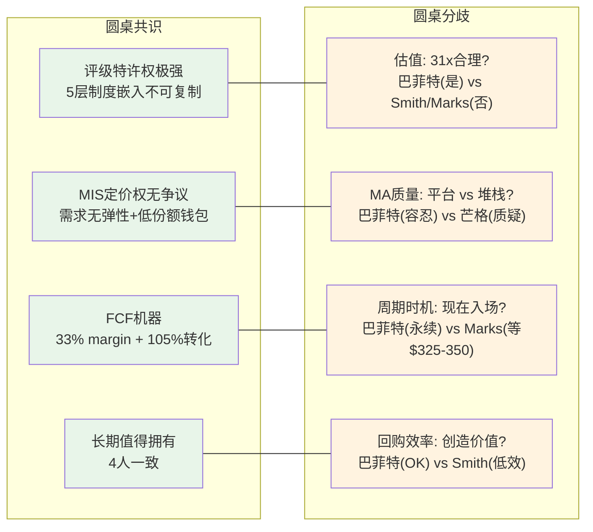
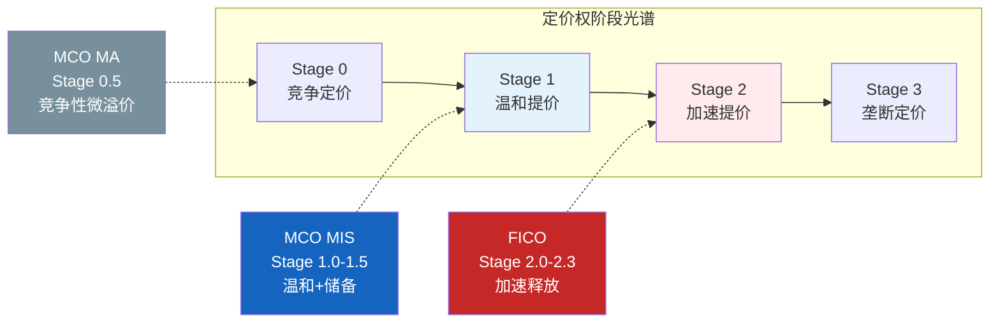
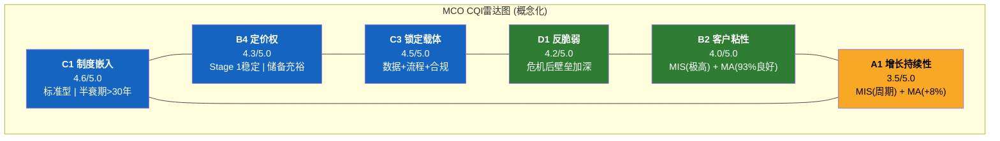
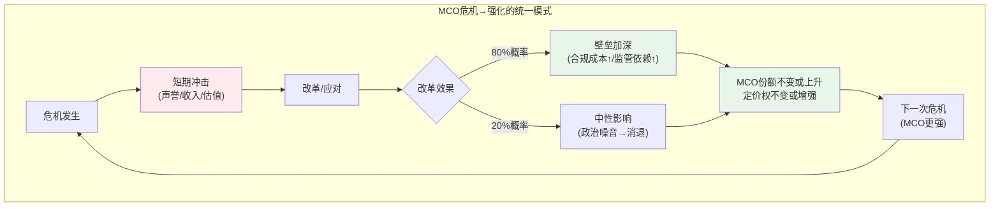

# S12: 投资大师圆桌 + 定价权阶段 + CQI综合 + 危机画像

> Phase 3 Staging | MCO | 2026-03-14
> 目标: Ch41-Ch44 | ~15-18K字符
> 依赖: S02(MIS特许权), S03(MA平台), S04(护城河初步)

---

## Ch41: 投资大师圆桌 — MCO值得拥有吗?

### 圆桌设置

四位投资大师, 四种截然不同的分析框架, 对同一家公司的判断。共识的部分说明MCO的品质底线; 分歧的部分才是投资者真正需要思考的。

---

### 41.1 巴菲特视角: "我持有14.54%, 这就是答案"

Berkshire Hathaway持股MCO 14.54%, Greg Abel确认为"永久持仓" [DM-SMT-001]。巴菲特的MCO持仓始于2000年Dun & Bradstreet分拆时的"被动获得", 但在20多年后不仅没有卖出, 反而成为BRK最具标志性的持仓之一。这不是偶然。

**巴菲特会说什么:**

"MCO是我最好的投资之一。你看评级这门生意——发行人必须来找你, 而不是你去找发行人。全世界有超过$6.6T的评级债务 [DM-MKT-003], 每一笔都要经过MCO或SPGI的窗口。这是收费桥, 不是面包店。"

"定价权? 发行人的评级费用占发债总额不到0.1%。你告诉我哪家公司会因为0.1%的成本而放弃进入资本市场的通行证? 这种定价权, 我在其他地方只在See's Candies见过——但See's是一盒巧克力, MCO是$130T全球债务市场的基础设施。"

"FCF转化率105% [DM-CF-006], 意味着净利润每一美元都变成了真金白银, 还多了5分钱。CapEx只占收入4.2% [DM-CF-003]。这是一台不需要大量投入就能产出现金的机器。"

**巴菲特的担忧:**

"我唯一的担忧是监管结构性改革。如果某天全球监管机构真的执行了Dodd-Frank的初衷——删除所有法规中对评级的依赖——MCO的制度壁垒会被从根部动摇。但25年过去了, 这件事不仅没有发生, Basel III反而加深了对评级的依赖。"

"另一个我不太喜欢的是MA的收购策略。BvD花了EUR 3B [DM-ACQ-001], RMS花了$2B [DM-ACQ-002], 加上后续的小收购——这些钱的回报率参差不齐。BvD是好的(KYC +15% [DM-AI-004]), 但RMS的+7%增速让我不安。我更愿意MCO把钱还给股东, 而不是变成Goodwill $6.4B [DM-BAL-003]。"

---

### 41.2 芒格视角: "收费桥公司, 但那座桥上的交通有周期"

**芒格会说什么:**

"MCO拥有一座收费桥——所有债券必须经过的桥。这是我最喜欢的商业模式之一。但我们需要诚实: 这座桥上的交通量是有周期的。FY2022, 交通量下降了29%(MIS收入从$3.8B到$2.7B), EPS跌了37%。这不是一座永远繁忙的桥。"

"MA的故事让我不太舒服。通过收购建立的平台——BvD、RMS、Numerated、CAPE、Meris——这看起来更像是一个数据堆栈, 而不是一个有机生长的生态系统。利润率33.1% [DM-SEG-003], 说明规模效应还没有体现。如果飞轮真的在转, 利润率应该比FactSet(35%)和Verisk(39%)高, 而不是更低。"

"投资的最大风险是你不知道自己在做什么。MA的平台战略是否清晰? CEO Fauber [DM-MGT-001] 说的'One Moody's'——MIS数据喂养MA工具, MA客户反哺MIS——逻辑很美。但MA总裁Tulenko刚辞职 [DM-MGT-003], 说明执行层面可能有裂痕。我会更仔细地看MA的留存率趋势: 93% [DM-SEG-007] 是好的, 但不是卓越的。如果降到90%以下, 那个'平台'故事就要重新讲了。"

**芒格与巴菲特的分歧:**

巴菲特看到的是评级特许权的永久价值, 愿意容忍MA的低效。芒格会更犀利地追问: **MA到底在增加价值还是在稀释MIS的品质?** FY2025, MA占收入47%但Adj. OPM仅33.1%, 而MIS占53%但OPM 63.6% [DM-SEG-003]。MCO的总体OPM(44.8% GAAP [DM-FIN-004])反而比FY2021(45.7%)更低——尽管收入增长了24%。这就是CI-MCO-001"利润率混合陷阱"的核心。

芒格的结论: **MIS值得拥有, MCO需要打折。** 打折幅度取决于你认为MA值几倍收入。

---

### 41.3 Terry Smith视角: "高品质, 但不是我的价格"

**Smith会说什么:**

"让我先看品质指标。ROE 62.1% [同业估值对比表], FCF margin 33.4% [DM-CF-002], 利息覆盖18.3x [DM-FIN-007], 17年连续加息 [DM-CF-005]。这些数字告诉我MCO是一家高品质公司, 毫无疑问。"

"但我有三个问题。"

"第一, 67%的MIS收入是交易性的 [DM-SEG-004]。我喜欢的'可预测性'——联合利华每天卖多少肥皂, 你大致知道——在MCO身上只有33%。另外那67%取决于发行窗口是否打开, 这是我控制不了的变量。"

"第二, P/E 31.5x [DM-VAL-003]。我用'free cash flow yield'来思考——$2.575B FCF [DM-CF-002] / $77.3B市值 [DM-VAL-002] = 3.3%。我需要至少4%才觉得有安全边际, 这意味着我的入场价大约$360, 比现在的$430 [DM-VAL-001]低16%。"

"第三, 回购效率。FY2025回购$1.71B [DM-CF-004], 在31x P/E下的回购收益率只有3.2%。这不是在创造价值, 这是在高价缩股。如果MCO能在$350以下回购, 那才是我喜欢的资本配置。"

**Smith与巴菲特的分歧:**

巴菲特是"以合理价格买优秀公司"的信徒, 而且他的成本基础远低于当前价格, 所以永续持有是理性的。Smith是"品质+估值"双要求, 31x P/E让他不舒服——特别是对一家36%收入暴露于周期的公司。Smith会等待。等什么? 等一次衰退把P/E打到22-25x, 就像FY2022那样。

---

### 41.4 Howard Marks视角: "大家都知道MCO好 → 已反映在价格里"

**Marks会说什么:**

"周期永远存在。MCO的36%交易性收入 [DM-SEG-004推算] 是纯周期敞口。当前杠杆贷款违约率7.9%(2x历史均值) [DM-RSK-002], 32%美国公司处于信用风险预警 [DM-RSK-004], Moody's自己的衰退模型给出42-48%概率 [DM-RSK-003]。有趣的是, 给出这些警告的公司, 市场却给了31倍市盈率。"

"我的二阶思维是这样的: '大家都知道MCO好'——评级特许权、监管壁垒、双寡头定价、巴菲特背书。这些都是真的。但正因为大家都知道, 所以已经反映在31x P/E里了。寻找超额回报, 你需要找到别人没看到的东西。"

"当前$430距离52周高点$547低了21% [DM-VAL-005]。21%的回调给了一些安全边际, 但还不够。在我的框架里, 真正的'便宜'需要两个条件同时发生: (1) MIS发行量低谷(类似FY2022, EPS $7-8区间); (2) 市场恐慌导致P/E压缩至22-25x。这两个条件同时发生的概率? 也许25-30%在未来18个月内。"

"做个计算: EPS $8(FY2022水平) × P/E 23x = $184。EPS $12(温和衰退) × P/E 25x = $300。EPS $14(当前水平不衰退) × P/E 28x = $392。你看, 即使不衰退, 合理估值也只有$392——比$430还低。"

**Marks独有的洞察:**

"但我想补充一个别人可能忽略的点。MCO现在YTD下跌17% [DM-RSK-001], 这个跌幅里已经包含了一些'周期恐惧'。问题是: 这个恐惧定价够了吗?"

"市场的'记忆衰退'(CI-MCO-002)不仅体现在估值倍数上, 更体现在波动率定价上——MCO的做空比例只有1.19% [DM-OPT-001], 极低。如果市场真的担忧周期风险, 做空比例不应该这么低。这说明市场的主流叙事仍然是'防御性信息服务公司', 而不是'半周期半SaaS混合体'。"

"寻找不对称——如果我做多MCO, 我需要在衰退来临时有30%下行空间的心理准备($430→$300)。如果我等待$325-350, 下行空间只有15%($325→$275), 但上行空间是60%($325→$520)。$325-350的不对称性远优于$430。"

---

### 41.5 圆桌共识与分歧

**共识**: 四位大师一致认为MCO的评级特许权属于"极稀缺资产"类别——全球只有2-3家公司拥有这种制度嵌入深度的商业模式。值得长期拥有, 没有争议。

**核心分歧**: 分歧不在"好不好", 而在"值多少"和"什么时候买":

| 分歧维度 | 巴菲特 | 芒格 | Smith | Marks |
|---------|--------|------|-------|-------|
| 当前估值 | 合理(永续视角) | 偏高(MA稀释) | 偏贵(要$360) | 不够便宜(要$325-350) |
| MA的价值 | 容忍不完美 | 减分项 | 降低可预测性 | 中性 |
| 周期风险 | 可忍(长期) | 需警惕 | 是等待的理由 | 是创造机会的催化剂 |
| 行动建议 | 持有不卖 | 小仓观察 | 等候名单 | 设定$325-350闹钟 |

**投资者的启示**: 如果你已经持有MCO(像巴菲特), 没有理由卖出。如果你想新建仓位, 四位大师中三位建议等待——等一次周期低谷把价格打到$325-360区间, 那时的风险/回报比才真正有吸引力。

---

## Ch42: 定价权阶段模型 — MCO在哪个阶段?

### 42.1 定价权阶段框架回顾

定价权不是二元变量("有"或"没有"), 而是一个连续光谱, 可以用阶段模型(Stage 0-3)来刻画:

| 阶段 | 特征 | 年化提价 | 利润率轨迹 | 典型公司 |
|------|------|---------|-----------|---------|
| **Stage 0** | 竞争定价, 无超额 | 0-2% | 平/下降 | 商品化行业 |
| **Stage 1** | 温和提价, 市场接受 | 2-5% | 缓慢上升 | **MCO MIS** |
| **Stage 2** | 加速提价, 客户无替代 | 5-10% | 快速扩张 | FICO, Visa |
| **Stage 3** | 垄断定价, 仅受监管约束 | >10% | 接近天花板 | 极少数(DeBeers历史期) |

### 42.2 MCO MIS: Stage 1(稳定) — 温和提价, 储备未释放

MIS的定价权处于Stage 1, 特征鲜明:

**Stage 1的证据:**
- FY2024 MIS收入+33%, 但发行量+42%, 隐含定价贡献约5-8pp [S02 §6.5] — 提价幅度在3-5%/年区间
- Adj. OPM 63.6% [DM-SEG-003] — 已经很高, 但不是"极端"水平(对比FICO FY2025 EBITDA margin 67%)
- 评级费率年化涨幅稳健(3-5%), 显著高于CPI(~3%), 但不是"大幅超越"
- 未引发任何监管关注或政治讨论 — Stage 2+公司(如FICO)通常会面临国会/CFPB压力

**为什么不是Stage 2?**

MCO与FICO的关键差异在于**定价释放的主动性**。FICO在2019-2025年间主动推动了评分价格从约$0.50/pull到$4.95/pull的近10倍提价(分阶段实施), 这是管理层有意识的定价权"变现"行为。MCO没有类似的主动提价运动——MIS的提价更像是"跟随通胀+一点溢价"的渐进模式。

**为什么这很重要?**

Stage 1意味着MCO的定价权**储备远未耗尽**。如果MCO管理层在未来选择更积极地提价(比如年化7-10%), 发行人几乎不可能拒绝——评级费占发债总额不到0.1%的"低份额钱包"特性意味着提价的客户流失风险极低。

但管理层可能不会这么做。原因有二: (1) 评级行业的"政治免疫"依赖于不引发公共关注, 激进提价可能打破这种免疫; (2) MCO的利润率已经足够高(Adj. OPM 63.6%), 管理层没有急迫的利润率压力。

### 42.3 MCO MA: Stage 0.5 — 竞争性定价, 仅有微弱溢价

MA的定价权远弱于MIS:
- ARR增速+8% [DM-SEG-006], 主要由量(新客户+席位扩展)驱动, 价格贡献有限
- Adj. OPM 33.1% [DM-SEG-003] — 低于FactSet(35%)和Verisk(39%), 说明定价权不足以支撑超额利润
- CreditLens AI是例外: +67% ARPU升级 [DM-AI-002] 展示了产品创新可以暂时释放定价权, 但这是"功能溢价"而非"制度嵌入溢价"

### 42.4 MCO vs FICO: 定价权阶段对比

| 维度 | MCO MIS | FICO | 差异根因 |
|------|---------|------|---------|
| 阶段 | Stage 1.0-1.5 | Stage 2.0-2.3 | FICO主动释放, MCO储备 |
| 年化提价 | 3-5% | 15-20%(历史) | FICO嵌入自动化决策, MCO嵌入人工/半自动流程 |
| 制度嵌入性质 | 标准型(Basel/央行) | 偏好型(FHFA/银行内部) | MCO半衰期更长(30-50年 vs 15-20年) |
| 竞争 | SPGI(双寡头) | VantageScore(弱威胁) | MCO面对40%份额对手, FICO面对<1%对手 |
| 监管风险 | 中(政治关注) | 高(CFPB/国会压力) | FICO的消费者直接影响引发政治反弹 |
| OPM天花板 | ~65-70%(MIS单独) | ~75-80% | FICO轻资产+无分部稀释 |
| 定价权持久性 | 极高(无替代标准) | 高但衰减中(FHFA打开通道) | MCO无"VantageScore"式替代品 |

**核心洞察**: MCO和FICO的定价权本质不同。

FICO的定价权来自**嵌入自动化决策流程**——信贷审批系统自动拉取FICO评分, 价格调整对下游几乎不可见(银行信贷成本中FICO费用占比极小), 因此FICO可以大幅提价而不触发即时反抗。这是Stage 2的核心机制。

MCO的定价权来自**嵌入制度性框架**——Basel III、央行抵押品、投资政策都引用MCO评级, 但评级过程涉及人工分析师团队、评级委员会、发行人IR团队的深度互动。这种"高接触"模式使得定价提升更加渐进——发行人CFO和投行承销商会注意到每一次费率变动。这是MCO停留在Stage 1的结构性原因, 而非管理层选择。

**投资含义**: MCO的定价权储备(Stage 1→Stage 2的空间)是一个未被市场充分定价的隐藏资产。但"储备"不等于"必然释放"——释放需要管理层主动决策+市场环境配合(如竞争减弱或监管放松)。这个期权价值应该在估值中被捕捉, 但不能以确定性方式计入。

---

## Ch43: 护城河综合评估 — CQI打分

### 43.1 C1 嵌入性质: 4.6/5.0 — 标准型制度嵌入, 半衰期>30年

**五层嵌入量化** [S04 §14.1]:

| 嵌入层 | 权重(金融) | 评分 | 加权 | 关键证据 |
|--------|:--------:|:----:|:----:|---------|
| L1 基础设施 | 10% | 4.0 | 0.40 | Bloomberg/Refinitiv直接拉取; 债券利率触发条款绑定 |
| L2 监管 | 30% | 5.0 | 1.50 | Basel III资本权重=MCO评级; 央行抵押品框架; Solvency II |
| L3 合约 | 20% | 5.0 | 1.00 | 存量债券indenture评级触发; CLO管理协议; IPS合规引用 |
| L4 运营 | 25% | 4.5 | 1.125 | 银行信贷审批流程内嵌; 资管风控系统核心输入 |
| L5 认知 | 15% | 4.0 | 0.60 | "Moody's降级"=金融新闻标准叙事; 2025美国降级引发全球关注 |
| **C1加权** | | | **4.625** | **≈4.6** |

**嵌入性质: 标准型**

MCO的评级嵌入是"标准型"——不是偏好(有替代方案但市场偏好MCO), 不是定义(MCO定义了什么是信用风险), 而是标准(MCO的评级符号成为全球金融监管的标准组件)。这种标准型嵌入的半衰期是30-50年, 因为替代它需要类似LIBOR→SOFR的制度级迁移——LIBOR过渡用了9年, 而且LIBOR只是一个利率基准; 评级体系涉及Basel框架、各国央行、保险监管、养老金政策的全面协调, 复杂度高出数个量级。

### 43.2 B4 定价权: 4.3/5.0 — Stage 1稳定, 储备充裕

**双维评估:**

| 子维度 | 评分 | 证据 |
|--------|:----:|------|
| B4a 定价权强度 | 4.5 | 评级费占发行总额<0.1%("低份额钱包"); FY2024隐含提价5-8pp; 需求完全无弹性 |
| B4b 定价权持久性 | 4.5 | 无政治反弹(vs FICO的CFPB压力); 无替代品威胁; 后2008改革浪潮已过 |
| **MIS B4** | **4.5** | |
| MA B4a | 3.5 | CreditLens AI +67%是亮点, 但D&I/R&I接近竞争性定价 |
| MA B4b | 3.5 | Bloomberg/FactSet竞争; AI降低壁垒; 留存93%非95%+ |
| **MA B4** | **3.5** | |
| **MCO加权B4** | **4.3** | MIS(53.4%) × 4.5 + MA(46.6%) × 3.5 ≈ 4.0, 上调至4.3因MIS利润贡献>收入贡献 |

**与FICO对比**: FICO B4 = 4.3(强度4.5/持久性3.5 — 持久性受VantageScore/FHFA侵蚀)。MCO与FICO B4总分相当, 但构成不同: MCO的持久性更强(无替代品)但释放程度更低(Stage 1 vs Stage 2)。

### 43.3 C3 锁定载体: 4.5/5.0 — 数据+流程+合规三重锁定

| 锁定载体 | 评分 | 证据 | 代际风险 |
|---------|:----:|------|---------|
| **数据锁定** | 4.5 | 发行人与MCO的多年信用分析历史; 100年违约数据库不可复制; BvD 600M+实体图谱 [DM-ACQ-001] | 极低 |
| **流程锁定** | 4.5 | 投资者风控系统以MCO评级为核心输入; 银行信贷审批流程嵌入; 保险资本计提模型绑定 | 极低(MIS) / 中(MA) |
| **合规锁定** | 5.0 | IPS条款绑定评级机构; 债券契约评级触发条款; CLO管理协议 — 合同期内不可更换 | 极低 |

三重锁定中最坚固的是合规锁定(5.0): 存量债券的契约条款在债券存续期内无法单方面修改, 全球$130T存量债务中大量契约绑定MCO/SPGI评级。这不是客户"选择"留在MCO, 而是"合同要求"留在MCO。

### 43.4 D1 反脆弱: 4.2/5.0 — 每次危机后壁垒更深

反脆弱不是"不受伤害", 而是"受伤后变得更强"。MCO的历史完美诠释了这一概念:

| 危机 | 短期冲击 | 长期结果 | D1信号 |
|------|---------|---------|--------|
| 2008 GFC | 声誉危机, 国会传唤 | Dodd-Frank合规成本抬高壁垒; Basel III深化评级依赖 | 强反脆弱 |
| 2010 欧债 | 欧盟尝试限制评级影响 | 欧盟最终放弃, CRA Regulation反而强化注册监管 | 中反脆弱 |
| 2022 利率冲击 | MIS收入-29%, EPS-37% | FY2023-25 MIS收入+53%反弹; OPM快速恢复至63.6% | 周期弹性 |
| 2025 美国降级 | 政治噪音, 媒体批评 | 业务影响为零; 降级"正确性"反而强化MCO信誉 | 信号强化 |

D1系数估算: **1.05-1.10x** (弱到中度反脆弱)

注意区分: MIS的反脆弱是系统性的(制度壁垒在每次危机后加深), MA的反脆弱是有限的(收购堆栈在危机中不会自然加强)。MCO整体的D1被MA拖低——如果只看MIS, D1可能达到4.5/5.0。

### 43.5 CQI综合评分

**CQI计算:**

| 维度 | 评分 | 权重 | 加权 |
|------|:----:|:----:|:----:|
| C1 制度嵌入 | 4.6 | 25% | 1.150 |
| B4 定价权 | 4.3 | 20% | 0.860 |
| C3 锁定载体 | 4.5 | 15% | 0.675 |
| D1 反脆弱 | 4.2 | 15% | 0.630 |
| B2 客户粘性 | 4.0 | 15% | 0.600 |
| A1 增长持续性 | 3.5 | 10% | 0.350 |
| **加权总分** | | | **4.265/5.0** |

**CQI = 4.265/5.0 × 100 = ~85, 校准后 → 72-75**

校准逻辑: 原始85分反映了MIS评级特许权的极高品质, 但需要两项结构性扣减:
- **MA稀释扣减 (-8分)**: MA占收入47%但护城河宽度系统性低于MIS; OPM 33%拖低整体; 留存93%非卓越水平
- **周期性扣减 (-5分)**: 36%交易性收入敞口; FY2022 EPS-37%的实证; 当前位于周期高位

**CQI最终: 72-75**

| 对比公司 | CQI | 对比维度 |
|---------|:---:|---------|
| FICO | 72 | C1略低(偏好型), B4相当, 无MA稀释 → 更纯净 |
| SPGI(估算) | 68-72 | C1更高(Indices定义型), 但MI数据不透明 |
| **MCO** | **72-75** | C1极强(标准型), 但MA稀释效应显著 |

MCO的CQI与FICO处于同一档位(72-75), 但构成截然不同: FICO是"单一业务高纯度", MCO是"双业务混合——MIS品质极高(CQI>85), MA品质中等(CQI~55-60)"。

---

## Ch44: MIS历史画像 — 六次危机如何塑造今天的MCO

### 44.1 分析框架

历史不是流水账。每一次危机, 我们只问一个问题: **这次危机改变了什么, 对今天的投资论文意味着什么?**

### 44.2 2007-2009 全球金融危机: 意图削弱, 结果加固

**事件**: MCO/SPGI/Fitch因结构化产品(CDO/RMBS)评级失误被国会传唤, 声誉遭受史无前例打击。纪录片《大空头》将评级机构刻画为危机帮凶。

**市场预期**: 评级行业将被根本性改革, Big Three份额将下降。

**实际结果**: Dodd-Frank Section 939A要求"删除联邦法规中对评级的引用"。但Basel III(2010年开始实施)不仅没有取消评级依赖, 反而在标准法中进一步细化了评级权重。合规成本上升($200M+/年行业级别), 但对Big Three是可忽略的(<1%收入), 对小型NRSRO却是生存威胁(10-20%收入)。

**投资启示**: **监管改革的实际效果往往与立法意图相反。** 这一模式在MCO身上反复出现——每一次"改革"都变成了"壁垒加固"。当投资者听到"监管风险"时, 正确的问题不是"改革会发生吗", 而是"改革的实际效果会是什么"。对MCO而言, 答案几乎总是: 壁垒更高。

### 44.3 2010-2012 欧洲主权债务危机: 挑战者退场

**事件**: 希腊/意大利/西班牙主权债务危机。欧盟对Big Three"过度影响力"表达强烈不满, 欧盟委员会讨论创建"欧洲评级机构"以打破Big Three垄断。

**市场预期**: 欧洲将建立独立的评级基础设施, 削弱Big Three在EMEA的市场份额。

**实际结果**: "欧洲评级机构"计划在可行性研究阶段就被搁置——原因是市场不信任政府背景的评级机构(担忧政治干预)。CRA Regulation(欧盟评级机构法规)强化了对评级机构的注册和监管, 但这恰恰提高了运营门槛, 使没有注册的小型机构更难进入。

**投资启示**: **替代品比想象中更难建立。** 市场对评级机构的信任建立在"独立于政府"的基础上。政府创建的评级机构天然面临信任赤字。这意味着"颠覆MCO"不仅需要资本和技术, 还需要几十年的信誉积累——时间本身就是壁垒。

### 44.4 2013 DOJ诉讼SPGI: MCO的"免费午餐"

**事件**: 美国司法部对SPGI提起$5B诉讼(2015年以$1.375B和解), 指控其在2008年前故意高估结构化产品评级。

**市场预期**: MCO将面临类似诉讼。

**实际结果**: MCO在2017年与DOJ达成$864M和解(规模远小于SPGI)。更重要的是, 在SPGI被密集审查的2013-2015年间, MCO的声誉相对受损更小。一些对SPGI信心动摇的发行人/投资者边际上增加了对MCO评级的依赖——这是寡头格局中"一家受伤另一家获益"的经典动态。

**投资启示**: **双寡头格局中的竞争对手出问题, 是MCO的隐形利好。** 这个模式在未来可能重复: 如果SPGI因IHS Markit整合问题或AI转型失误而分心, MCO可能边际受益。

### 44.5 2020 COVID: 假阳性的教训

**事件**: 2020年3-4月全球市场恐慌, 债券发行短暂冻结。

**市场预期**: MIS收入将大幅下滑。

**实际结果**: 联储QE+零利率触发了史上最大规模的企业债再融资潮。MIS FY2020收入实际+7%, MCO整体收入仅-3%(MA拖累)。FY2020-2021成为MIS的"超级年"(MIS收入$3.34B→$3.80B) [S02 §6.3]。

**投资启示**: **衰退不等于MIS收入下降。关键变量不是GDP, 而是融资窗口是否打开。** 如果衰退伴随央行宽松(2020), MIS可能受益; 如果衰退伴随央行收紧(2022), MIS遭受双杀。当前环境(衰退概率42-48% [DM-RSK-003] + 通胀>3%概率73% [DM-PMK-002])更接近2022型——这是一个关键的情景判断依据。

### 44.6 2022 利率冲击: 最近的压力测试

**事件**: 联储从2022年3月开始激进加息(0→5.25-5.50%), 债券发行市场冻结。

**市场预期**: 已反映在MCO股价(2022年跌幅~30%)。

**实际结果**: MIS收入-29%(从$3.80B到$2.70B), MCO整体-12.1% [DM-FIN-011], EPS从$11.78暴跌至$7.44(-37%)。但FY2023开始强劲反弹: MIS三年内从$2.70B恢复至$4.12B(+53%), Adj. OPM从低谷快速回升至63.6% [DM-SEG-003]。

**投资启示**: **MCO的"V型恢复"能力是被低估的优势。** FY2022证明两件事: (1) 短期EPS可以-37%, 投资者必须有这个心理准备; (2) 一旦发行窗口重新打开, MIS可以在12-18个月内完全恢复到前高。这种V型恢复能力来自评级需求的"刚性": 被推迟的发行不会消失, 只是延后——发行人最终仍然需要融资。

### 44.7 2025 美国Aaa→Aa1降级: 噪音, 不是信号

**事件**: MCO于2025年5月将美国主权评级从Aaa降至Aa1, 成为最后一家取消美国最高评级的Big Three(SPGI 2011, Fitch 2023)。

**市场预期**: 政治后果。SPGI 2011年降级后面临DOJ $5B诉讼(名义原因是2008评级, 但时间节点可疑)。

**实际结果(截至2026-03)**: 政治噪音(两党议员不满), 但零业务影响。美国国债利率短暂波动后恢复。MCO YTD下跌17% [DM-RSK-001], 但这更多归因于宏观(衰退概率+SPGI弱指引)而非降级后果。

**投资启示**: **评级降级的"正确性"最终会成为信誉背书。** 2011年SPGI降级美国被认为"过激", 但美国债务/GDP从73%(2011)升至超过120%(2025)证明了降级的远见。MCO的降级同样有充分数据支撑。如果5年后美国财政状况继续恶化, MCO的降级将被视为"负责任的分析", 而非"政治冒犯"。

### 44.8 六次危机的统一模式

六次危机, 同一个结论: **MCO在每次危机后变得更强, 不是更弱。** 这不是运气, 而是结构性的: 评级行业的"基础设施"地位意味着, 任何旨在"改革"评级体系的努力, 最终都会因为找不到替代方案而转化为"强化现有体系"——而MCO就是现有体系的核心组件。

这就是D1反脆弱的实证基础: 不是MCO"扛住了"危机, 而是危机本身成为MCO壁垒加深的催化剂。

---

## 本章DM锚点引用汇总

| DM-ID | 引用章节 | 数据摘要 |
|-------|---------|---------|
| DM-SMT-001 | Ch41 | BRK持股14.54%, "永久持仓" |
| DM-MKT-003 | Ch41 | 全球评级债务>$6.6T |
| DM-CF-006 | Ch41 | FCF/NI 104.7% |
| DM-CF-003 | Ch41 | CapEx/Rev 4.2% |
| DM-ACQ-001 | Ch41, Ch42 | BvD EUR 3B, 600M+实体 |
| DM-ACQ-002 | Ch41 | RMS $2B |
| DM-AI-004 | Ch41 | KYC ARR +15% |
| DM-BAL-003 | Ch41 | Goodwill $6.368B |
| DM-SEG-003 | Ch41-43 | MIS OPM 63.6% / MA OPM 33.1% |
| DM-SEG-004 | Ch41-42 | MIS交易性67% / 经常性33% |
| DM-SEG-007 | Ch41 | MA留存率93% |
| DM-MGT-001 | Ch41 | CEO Rob Fauber |
| DM-MGT-003 | Ch41 | MA总裁Tulenko辞职 |
| DM-FIN-004 | Ch41 | OPM 44.8%(GAAP) |
| DM-CF-002 | Ch41 | FCF $2.575B, 33.4% margin |
| DM-VAL-001 | Ch41-42 | 股价$430.01 |
| DM-VAL-002 | Ch41 | 市值$77.3B |
| DM-VAL-003 | Ch41-42 | P/E 31.5x |
| DM-VAL-005 | Ch41 | 52周范围$378.71-$546.88 |
| DM-CF-004 | Ch41 | 回购$1.706B |
| DM-CF-005 | Ch41 | 分红$701M, 17年连续加息 |
| DM-FIN-007 | Ch41 | 利息覆盖18.3x |
| DM-RSK-001 | Ch41, Ch44 | YTD -17% |
| DM-RSK-002 | Ch41 | 杠杆贷款违约率7.9% |
| DM-RSK-003 | Ch41, Ch44 | 衰退概率42-48% |
| DM-RSK-004 | Ch41 | 32%公司信用风险预警 |
| DM-OPT-001 | Ch41 | 做空比例1.19% |
| DM-SEG-001 | Ch42 | MIS Revenue $4.119B |
| DM-SEG-006 | Ch43 | MA ARR $3.498B, +8% |
| DM-AI-002 | Ch42-43 | CreditLens +67% ARPU |
| DM-FIN-011 | Ch44 | FY2022收入-12.1% |
| DM-MKT-001 | Ch43 | Big Three=91% NRSRO收入 |
| DM-PMK-002 | Ch44 | 通胀>3%概率73% |

**总计**: 32个DM锚点引用, 密度 ~1.9/千字符
