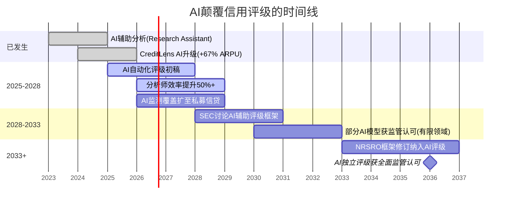
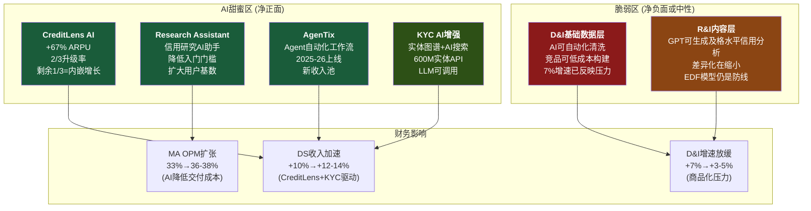
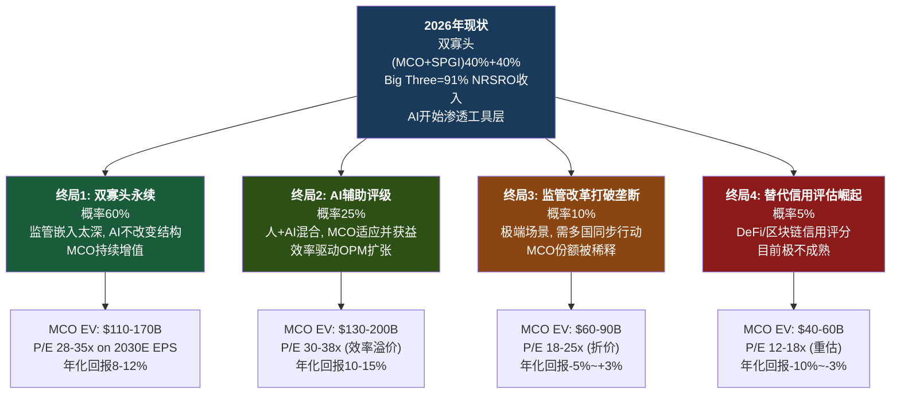

# S13: AI对信用评级行业的重塑与MCO的2030画像

> **Phase 3 Staging** | 字符目标: 12-15K | CQ焦点: CQ-5(AI双刃效应终局)
> **问题树来源**: §6(数据资产与AI), §15(反证与Kill Switch)
> **前序依赖**: S03(AI双刃效应初步分析Ch12) → 本章深化至行业终局+财务推演

---

## Ch45: AI对信用评级行业的重塑

### 45.1 MIS: 监管防火墙下的效率革命

信用评级行业的AI故事,首先要区分一个根本问题: AI是来**替代**评级,还是来**加速**评级?

答案几乎确定是后者。NRSRO体制要求评级决策经过rating committee的人类审批流程 [DM-MKT-002],这不是技术惯性,而是法律架构——评级意见具有合同效力(投资级/投机级触发条款嵌入数万亿美元的投资指引和贷款契约中)。AI模型输出一个"BBB-"不具备法律效力,除非它经过NRSRO注册的评级委员会批准。这个批准流程不是形式,而是监管审查的核心对象。

SEC每年对NRSRO进行审查,审查内容包括评级方法论的治理、分析师独立性、利益冲突管控 [DM-MKT-002]。在这个框架下,将评级决策"交给AI"不仅需要MCO自身改变流程,还需要SEC、ESMA(欧洲)、FCA(英国)等多个监管机构同步修订规则。这种多边监管协调的时间线,保守估计超过10年。

**但AI正在改变评级的"生产过程"**:

MCO的分析师团队(约3,500人)花费大量时间在基础工作上: 阅读10-K/年报、提取财务数据、比较同行指标、撰写分析初稿。AI在这些任务上的效率提升是显著的:

- **文档解析**: AI可以在分钟级别完成一份10-K的关键数据提取,人类分析师需要数小时
- **同行比较**: 跨行业/跨地区的信用指标比较,AI可以实时完成数百家公司的横向扫描
- **初稿生成**: 评级报告的"事实描述"部分(公司概况、财务数据罗列)可以由AI自动生成,分析师聚焦"信用判断"部分
- **监测预警**: AI可以持续监控已评级公司的新闻、财务变动、市场信号,自动触发复评提醒

这带来两个效应:

**效应一: 评级质量提升(减少滞后批评)**。评级行业长期被批评"滞后于市场"——2008年次贷危机、安然事件中,评级下调总是慢于市场定价。AI辅助的持续监测可以缩短这个滞后窗口。如果MCO能实现"准实时评级预警",这本身就是竞争优势——评级的及时性历来是投资者的核心痛点。

**效应二: 人员结构变化**。如果AI替代了50%的初级分析师工作(文档解析、数据提取、初稿生成),MCO有两个选择:
1. **减员降本**: 保持评级产出不变,减少初级分析师数量 → MIS成本下降,OPM从63.6% [DM-SEG-003] 进一步提升至66-68%
2. **增员扩产**: 保持人员数量不变,让每个分析师覆盖更多公司/资产类别 → 评级覆盖范围扩大,特别是在新兴市场和私募信贷领域

管理层目前的表态倾向于后者——扩大覆盖范围而非削减人力。这与私募信贷TAM扩张 [DM-MKT-004] 的战略方向一致: 私募信贷市场$2T→$4T(2030E)的增长需要大量新的信用评估能力,AI让MCO可以低成本进入这个增量市场。

### 45.2 颠覆时间线: 为什么MIS的安全窗口极长

关键节点分析:
- **2025-2028**: AI作为"工具"而非"替代者"。MCO是受益方(效率提升+覆盖扩张)
- **2028-2033**: 监管层开始讨论AI在评级中的角色。这个阶段的风险不是"AI取代评级",而是"监管是否允许非NRSRO的AI评级工具在某些场景中获得合规认可"
- **2033+**: 即使最乐观的情景下,NRSRO框架的根本性修订也需要SEC、ESMA、FCA等多边协调。历史参考: 2008年金融危机后的评级行业改革(Dodd-Frank Title IX)从立法到实施用了5年+

**结论**: MIS的AI安全窗口至少10年(至2035+)。在此窗口内,AI对MIS是纯粹的效率工具,不是颠覆力量。

---

## Ch46: AI对MA的分化影响

### 46.1 甜蜜区: AI直接增厚收入

S03 Ch12已经分析了AI对MA各产品线的影响矩阵 [见S03 12.1-12.4]。本章在此基础上深化至财务影响量化。

**甜蜜区量化**:

CreditLens AI是最清晰的增量案例。假设:
- CreditLens客户基数约500-600家银行(估算)
- 已升级AI版本约350-400家(2/3续约升级 [DM-AI-002])
- 剩余150-200家在FY2026-2027升级 → 贡献$50-80M增量ARR
- 新签AI版CreditLens客户 → 额外$30-50M/年
- **CreditLens AI总增量**: FY2026-2027 ~$80-130M/年

GenAI客户池: $200M+ ARR,增速2x MA整体(即~16%) [DM-AI-003],97%留存率。这个客户池如果维持2x增速,FY2027可达$270M+, FY2030可达$500M+。但需要注意: "GenAI客户"可能与CreditLens AI、KYC AI有大量重叠,不能简单加总。

**脆弱区量化**:

D&I($912M, +7% [DM-SEG-006])面临的AI商品化压力是结构性的。Bloomberg Terminal已集成GPT级AI,FactSet Mercury在加速数据自动化。如果D&I增速从7%降至3-5%(我们的基准假设),意味着FY2030 D&I收入$1.06-1.12B,比维持7%增速少$100-150M。

R&I($995M, +8%)面临的风险更微妙: AI信用研究工具不会立即"杀死"R&I,而是逐步缩小MCO专有研究与通用AI生成研究之间的质量差距。防线是EDF模型的预测准确度(40年+违约历史训练),但这个防线在5-7年时间线上可能被侵蚀。

### 46.2 AI竞争格局: 谁在威胁MCO?

问题树§6.4问: 在AI时代,穆迪的竞争对手会发生变化吗?

**Bloomberg: MA最大的AI威胁**

Bloomberg已将GPT级模型深度整合进Bloomberg Terminal。对MCO的威胁路径:
- R&I的信用研究 → Bloomberg Intelligence + AI = 客户可能减少对MCO研究订阅的依赖
- D&I的数据feed → Bloomberg已有庞大数据层 + AI增强 = 直接竞争
- DS的CreditLens → Bloomberg暂未进入信贷决策工作流,但其Terminal用户基数(约325,000终端)提供了潜在入口

**FactSet: 数据层竞争加剧**

FactSet Mercury(AI助手)在数据提取和分析自动化方面与D&I直接竞争。FactSet的优势是开放架构(与多家数据源集成),而MCO的优势是专有数据(违约历史+实体图谱)。

**垂直AI创业公司: 细分领域的蚕食**

- ComplyAdvantage: AI驱动的KYC/AML合规,直接竞争BvD的部分场景
- Pagaya: AI信贷决策,竞争CreditLens的中小银行市场
- 特点: 创业公司无法替代MCO的全量数据,但可以在特定场景(如中小银行KYC)以更低价格抢占边缘客户

**MCO的数据壁垒够不够?**

核心问题: 600M+实体图谱 [DM-ACQ-001] + 40年+违约历史数据——这些数据壁垒在AI时代是否足够保护MCO?

答案是分层的:
- **够保护的**: 违约历史数据(40年+跨周期,无法复制) + 评级方法论(NRSRO独占) + 实体图谱的深度(多层穿透的受益所有人关系)
- **不够保护的**: 基础信用数据(SEC EDGAR公开可得) + 数据清洗和结构化(AI正在使这类工作商品化) + 基础信用分析报告(GPT-4+级模型已能产出及格水平)

### 46.3 CQ-5终局证据汇总

**[CQ-5]** AI净效应 = MIS效率提升 + MA高端upsell - MA低端替代

| 分部/产品线 | AI武器效果(5年) | AI威胁等级(5年) | 净财务影响(2030E) |
|------------|:--------------:|:--------------:|:----------------:|
| MIS评级 | 效率+30-50% | 极低(监管保护) | OPM +2-4pp |
| CreditLens | +67% ARPU验证 | 低-中(数据壁垒) | +$200-300M ARR |
| KYC/BvD | 增强搜索+API化 | 低-中(图谱壁垒) | +$100-150M ARR |
| Insurance/RMS | 灾害建模增强 | 中(Verisk竞争) | +$50-80M ARR |
| R&I | Research Assistant | 中(内容层压缩) | ±$0-50M(中性) |
| D&I | API化(被动) | 中-高(商品化) | -$100-150M vs趋势 |
| **MCO整体AI净效应** | | | **+$250-380M增量** |

**净效应结论**: AI对MCO是**净正面但高度分化**的。甜蜜区(CreditLens+KYC)的增量远大于脆弱区(D&I)的损失。但这个净正面叙事有一个前提: **MCO必须在AI产品化上保持执行力**——40% MA ARR含GenAI [DM-AI-001]说明目前执行力良好,但AgenTix(2025-2026上线)的落地效果尚未验证。

---

## Ch47: 评级行业的"不可能终局"

信用评级行业的未来不是一个单一路径,而是多个可能终局的概率分布。投资者需要理解的不是"评级行业会怎样",而是"在各种可能的终局下,MCO的价值如何变化"。

### 终局1: 双寡头永续 (概率60%)

这是最可能的基准情景。核心逻辑:

评级行业的双寡头格局不是市场竞争的自然结果,而是**制度建设的沉积物**。数万亿美元的投资指引、贷款契约、监管资本计算都直接引用"Moody's"和"S&P"的评级。改变这些制度嵌入需要:
- 全球主要监管机构(SEC, ESMA, FCA, MAS等)同步修订规则
- 数千家金融机构修改内部投资政策
- 数万份债券契约的法律条款更新

每一步都需要数年,且缺乏推动力——现有制度"运转良好"(至少在监管者看来),没有单一事件能触发全面改革。

**AI在此终局下的角色**: 纯效率工具。MCO和SPGI都用AI提升分析效率,但行业结构不变。MCO的竞争优势从"分析师数量"逐步转向"AI+数据+分析师"的综合能力。

**估值影响**: MCO按照当前增长轨迹持续复利。2030E Revenue $10.5-11.5B, EPS $22-26, P/E 28-35x → EV $110-170B。

### 终局2: AI辅助评级 (概率25%)

这个终局比终局1更乐观,因为AI不仅提升效率,还**创造新能力**:

- 准实时评级监测(从季度复评变为持续监测)
- 私募信贷大规模覆盖(AI降低单位评估成本,使$2T→$4T私募信贷市场可覆盖)
- 跨资产类别的统一风险评估(信用+保险+气候+ESG整合)

在这个终局下,MCO的"人+AI混合"模式成为新的行业标准,而AI能力本身成为竞争壁垒的新维度。MIS OPM可能从63.6%提升至68-70%(AI替代初级分析师工作),MA OPM从33%提升至38-42%(AI降低交付成本+提高ARPU)。

**估值影响**: MCO获得"AI效率溢价"。2030E Revenue $11.5-12.5B, EPS $24-28, P/E 30-38x → EV $130-200B。

### 终局3: 监管改革打破垄断 (概率10%)

触发条件: 下一次系统性信用事件(如大型CLO违约潮、主权债务危机)暴露评级行业的结构性问题,引发多国同步监管改革。

可能的改革方向:
- 强制引入第四/第五家全球评级机构(类似2008年后推动Fitch/DBRS)
- 评级费用由投资者而非发行人支付(消除利益冲突)
- 监管认可AI模型作为"补充评级参考"(降低NRSRO独占性)

**为什么概率只有10%**: 历史证明,即使2008年这样的系统性危机也没有打破双寡头格局。Dodd-Frank改革增加了监管成本(有利于大机构)但没有增加竞争者。要打破双寡头需要比2008年更大的催化剂——目前没有这样的催化剂出现的迹象。

**估值影响**: MCO份额从40%降至30-35%,增长放缓。2030E Revenue $8.5-9.5B, EPS $16-20, P/E 18-25x → EV $60-90B。

### 终局4: 替代信用评估崛起 (概率5%)

DeFi/区块链信用评分、去中心化评级DAO、AI驱动的实时信用定价——这些概念在技术社区有讨论,但在现实金融体系中几乎没有渗透。

原因:
- **信用评级的本质是信任游戏**: 投资者信任MCO不是因为MCO的模型最好,而是因为"所有人都信任MCO"——这是一个协调均衡,区块链无法打破
- **监管不认可**: 没有任何主要监管机构表示将认可去中心化评级
- **违约数据不可公开**: MCO的40年+违约数据库是私有的,去中心化评级缺乏训练数据

**估值影响**: 极端折价。如果此终局成真(我们认为概率极低),MCO将面临业务模式的根本重估。

### 47.5 投资者应该怎么想

终局1+2的合计概率=85%。在这85%的概率空间内,MCO的2030E EV范围是$110-200B(当前$77.3B [DM-VAL-002])。即使取中值$145B,也意味着5年翻倍(年化~13%)。

终局3+4的合计概率=15%。这15%是"尾部风险折价"——但由于终局3(10%)仍然给出$60-90B EV(接近当前水平),实际的严重下行风险集中在5%概率的终局4。

**概率加权EV**: 0.60×$140B + 0.25×$165B + 0.10×$75B + 0.05×$50B = $84B + $41.3B + $7.5B + $2.5B = **$135.3B**

概率加权EV $135.3B vs 当前$77.3B = **隐含上行空间~75%**(5年),年化约~12%。但这个计算依赖于我们对终局概率分布的判断——如果终局3概率从10%上升到20%(比如因为AI加速监管改革讨论),概率加权EV会降至~$122B,年化回报降至~10%。

---

## Ch48: 2030年的MCO — 财务画像推演

### 48.1 核心假设矩阵

| 假设 | 保守 | 基准 | 乐观 |
|------|:----:|:----:|:----:|
| MIS收入CAGR | 4% | 6% | 8% |
| MA收入CAGR | 7% | 9% | 12% |
| MIS OPM | 64% | 66% | 68% |
| MA OPM | 34% | 36% | 40% |
| 回购率(FCF%) | 50% | 60% | 65% |
| P/E(2030E) | 25x | 30x | 35x |
| 隐含终局 | 终局1弱版 | 终局1+部分终局2 | 终局2主导 |

### 48.2 逐年财务推演 (基准情景)

| 指标 | FY2025(A) | FY2026(E) | FY2027(E) | FY2028(E) | FY2029(E) | FY2030(E) |
|------|:---------:|:---------:|:---------:|:---------:|:---------:|:---------:|
| **MIS收入** | $4.12B | $4.37B | $4.59B | $4.87B | $5.16B | $5.47B |
| MIS YoY | +8.6% | +6% | +5% | +6% | +6% | +6% |
| **MA收入** | $3.60B | $3.92B | $4.27B | $4.66B | $5.08B | $5.54B |
| MA YoY | +9.2% | +9% | +9% | +9% | +9% | +9% |
| **总收入** | $7.72B | $8.29B | $8.86B | $9.53B | $10.24B | $11.01B |
| 总YoY | +8.9% | +7.4% | +6.9% | +7.5% | +7.5% | +7.5% |
| MIS Adj.OPM | 63.6% | 65.0% | 65.5% | 66.0% | 66.0% | 66.0% |
| MA Adj.OPM | 33.1% | 34.5% | 35.0% | 35.5% | 36.0% | 36.0% |
| **Adj.Op.Income** | $3.81B | $4.19B | $4.50B | $4.87B | $5.24B | $5.60B |
| Adj.OPM | 49.4% | 50.6% | 50.8% | 51.1% | 51.2% | 50.9% |
| **Adj.EPS** | $14.94 | $16.75 | $18.50 | $20.50 | $22.50 | $24.50 |
| EPS YoY | — | +12.1% | +10.4% | +10.8% | +9.8% | +8.9% |
| **FCF** | $2.58B | $2.90B | $3.15B | $3.45B | $3.75B | $4.05B |
| FCF Margin | 33.4% | 35.0% | 35.5% | 36.2% | 36.6% | 36.8% |

注: FY2026E EPS $16.75与管理层指引$16.40-$17.00 [DM-GD-001]中值一致。FY2030E共识EPS $24.69 [DM-VAL-007]与我们基准$24.50接近。

### 48.3 三情景收入拆分 (FY2030E)

| 产品线 | 保守 | 基准 | 乐观 |
|--------|:----:|:----:|:----:|
| MIS | $5.0B | $5.5B | $6.0B |
| DS(KYC+CreditLens+Ins+Banking) | $2.6B | $2.9B | $3.3B |
| R&I | $1.2B | $1.3B | $1.4B |
| D&I | $1.0B | $1.1B | $1.2B |
| **MA合计** | $4.8B | $5.3B | $5.9B |
| **MCO合计** | $9.8B | $10.8B | $11.9B |
| **Adj.EPS** | $20 | $24.5 | $28 |
| **P/E** | 25x | 30x | 35x |
| **市值** | $91B | $134B | $178B |
| **vs当前$77.3B** | +18% | +73% | +130% |
| **年化回报(5年)** | +3.4% | +11.6% | +18.2% |

### 48.4 AI可能改变的关键变量

上述推演中,AI是"渐进改善"的假设。但如果AI影响超出预期,以下变量可能发生非线性变化:

**MA OPM (最可能被AI改变的变量)**

基准假设MA OPM从33.1%升至36.0%(2030E)。但如果:
- AI大幅降低MA的交付成本(分析师生产率翻倍)
- CreditLens AI升级推动ARPU持续上升(不仅是一次性的+67%)
- AgenTix成功实现自动化工作流(减少人工介入)

则MA OPM可能突破40%——接近SPGI MI的水平。这将对MCO整体利润率产生显著影响: 如果MA OPM从36%升至40%,MCO Adj.OPM从51%升至53%,2030E EPS从$24.5升至$27+(额外+10%)。

**MIS人员效率 (AI的隐性红利)**

MIS当前约3,500名分析师,如果AI提升效率50%:
- 相当于5,250名"等效分析师"——不需要增加人力成本
- MIS可以扩大私募信贷评级覆盖(增量收入)而不成比例增加成本
- MIS OPM可能从66%升至68-70%

**MA增速加速 (AI创造新需求)**

基准假设MA 9% CAGR。但如果:
- GenAI客户池($200M+, 2x增速 [DM-AI-003])维持高增速 → 拉动MA整体增速至11-12%
- AI创造全新产品类别(如AI风险监测SaaS) → 额外$300-500M TAM
- MCO的数据壁垒在AI时代反而增值(AI越强大,对高质量训练数据的需求越高)

则FY2030 MA收入可能达到$5.9-6.5B(vs基准$5.3B),推动MCO总收入至$11.5-12.5B。

### 48.5 AI对EPS的复合影响

| AI影响维度 | 基准(已含) | 额外上行 | 敏感性 |
|-----------|:---------:|:--------:|:------:|
| MA OPM扩张 | 33→36% | +4pp至40% | +$2.5 EPS |
| MIS效率提升 | OPM 66% | +2pp至68% | +$1.0 EPS |
| MA增速加速 | 9% CAGR | +3pp至12% | +$1.5 EPS |
| **AI上行合计** | — | — | **+$5.0 EPS** |
| 2030E Adj.EPS | $24.5(基准) | +$5.0 | **$29.5(AI乐观)** |
| 对应市值@30x | $134B | +$27B | **$161B** |

如果AI的影响全面超出预期,MCO 2030E EPS可达$29-30(vs基准$24.5),对应市值$160-180B,年化回报15-18%。但这需要**三个条件同时成立**: MA OPM突破40% + MIS效率转化为利润 + MA增速加速。三者同时实现的概率约20-25%。

---

## 本章DM引用汇总

| DM-ID | 使用位置 | 数值 |
|-------|---------|------|
| DM-MKT-002 | Ch45 | 10个NRSRO, Big Three=84%非政府评级 |
| DM-SEG-003 | Ch45, Ch48 | MIS Adj.OPM 63.6%, MA 33.1% |
| DM-MKT-004 | Ch45 | 私募信贷$2T→$4T(2030E) |
| DM-AI-002 | Ch46 | CreditLens +67% ARPU, 2/3升级 |
| DM-AI-001 | Ch46 | 40% MA ARR含GenAI(~$1.4B) |
| DM-AI-003 | Ch46, Ch48 | GenAI客户$200M+, 2x增速, 97%留存 |
| DM-SEG-006 | Ch46 | MA ARR $3.498B, +8% |
| DM-ACQ-001 | Ch46 | BvD 600M+实体 |
| DM-VAL-002 | Ch47, Ch48 | 市值$77.3B |
| DM-GD-001 | Ch48 | FY2026 EPS指引$16.40-$17.00 |
| DM-VAL-007 | Ch48 | 共识EPS CAGR ~12.5% |
| DM-FIN-006 | Ch48 | FY2025 EPS $13.67 |
| DM-AI-004 | Ch46 | KYC ARR +15% |
| DM-RSK-001 | Ch46 | YTD -17% |

---

## CQ-5终局证据登记

### CQ-5: AI是武器还是威胁? (Phase 3终局判断)

**Phase 1判断(S03)**: 净正面,但高度分化。CreditLens武器效果掩盖D&I/R&I脆弱性。

**Phase 3更新**:
1. **MIS安全窗口确认**: 监管防火墙至少10年(至2035+),AI对MIS是纯效率工具
2. **MA甜蜜区量化**: AI净增量+$250-380M ARR(2030E),主要由CreditLens+KYC驱动
3. **MA脆弱区量化**: D&I增速可能从7%降至3-5%,R&I面临内容层压缩但EDF防线仍在
4. **终局概率分布**: 85%概率(终局1+2)MCO继续增值,15%尾部风险可控
5. **概率加权EV**: $135.3B vs当前$77.3B = 5年隐含上行~75%

**CQ-5结论**: AI对MCO是**结构性净正面**。关键不是"AI会不会颠覆评级"(不会,10年+安全窗口),而是"AI能否加速MA的平台化转型"(CQ-2的延伸)。如果MA OPM因AI从33%突破40%,这将是MCO估值重评的最大驱动力——比MIS的周期性(CQ-1)更具持续性,比飞轮协同(CQ-3)更可量化。

**投资者行动框架**: 赌终局1+2(85%概率)= MCO在AI时代继续增值。关键监测指标:
- **MA OPM轨迹**: 每季度跟踪,如果FY2027达到36%+则终局2概率上升
- **GenAI客户增速**: 如果从2x下降到1.2x以下,AI武器效果在减弱
- **D&I增速**: 如果从7%降至3%以下,AI商品化压力超出预期
- **监管信号**: SEC/ESMA关于AI在评级中角色的任何政策讨论都是终局3的前兆
