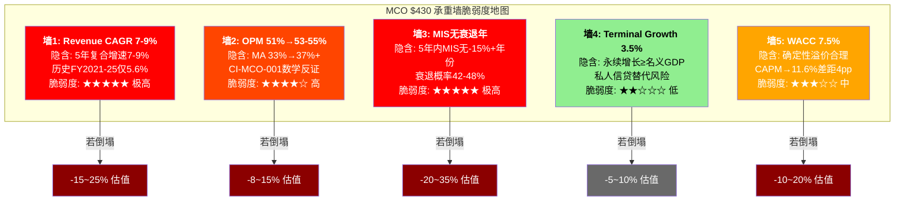
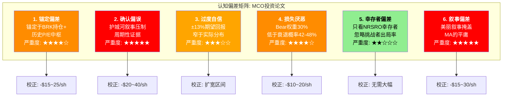

# S14: 红队对抗审查 Part 1 (RT-1 ~ RT-4)

> Phase 4 Staging | MCO | 2026-03-14
> 目标章节: Ch41-Ch44 | 字符目标: 15-18K
> 核心任务: 挑战投资论文, 不是确认

---

## Ch41: RT-1 承重墙测试 — $430背后的5个隐含假设

### 41.1 方法论

投资论文的核心结论是"关注(偏中性)", 期望回报+13%, 加权EV~$486。这个结论建立在5面"承重墙"之上——每一面都是$430得以成立的必要条件。红队的任务是逐面敲击, 判断哪面墙已经在开裂。

从S07 Reverse DCF反推: $430对应EV~$82.3B, 需要WACC~7.5%+TG~3.5%的组合(远低于CAPM暗示的11.6%)。在更"教科书"的WACC 9.0%下, $430无法被DCF支撑(仅对应$285)。**这本身就是第一个红旗: 当前价格依赖市场给予MCO极低的隐含折现率。**

### 41.2 五面承重墙逐面测试



---

**承重墙1: Revenue CAGR 5年7-9%**

| 维度 | 值 |
|------|-----|
| 隐含值 | 7-9% CAGR (S07 Ch23: $7.72B→$10.6-11.3B by FY2030) |
| 历史参考 | [硬数据:] FY2021-2025 CAGR仅5.6% [DM-FIN-001]; FY2020-2025 CAGR 7.5%(含疫情低基数反弹) |
| 行业参考 | [合理推断:] SPGI Revenue CAGR ~7%(含IHS Markit整合); MSCI ~9% |
| 脆弱度 | **极高 (5/5)** |
| 若倒塌影响 | CAGR降至5%→FY2030 Rev ~$9.8B→EV $65-70B→每股$335-365 (-15~22%) |

**红队挑战**: 论文用FY2020-2025的7.5% CAGR作为"合理外推"基线, 但这个7.5%包含了FY2024的+19.8%反弹([硬数据:] [DM-FIN-011])——一个不可重复的异常年份。FY2024是全球评级债务$6.6T历史新高 [DM-MKT-003]的直接受益者。更诚实的基线是排除FY2022低谷和FY2024峰值后的趋势线, 即FY2021-2025 CAGR 5.6%。

**市场在赌什么**: 隐含7-9%需要MIS高个位数+MA高个位数同时持续5年。但MIS 53.4%收入占比 [DM-SEG-001]中的67%是交易性 [DM-SEG-004], 等于36%总收入直接暴露于发行量周期。任何一年的MIS回撤(-10~15%)都会把5年CAGR拉低至<6%, 击穿这面墙。

**历史证据**: 过去6个完整财年(FY2020-2025), MCO有2个负增长年(FY2022 -12.1%)和1个异常高增年(FY2024 +19.8%)。6年中出现1个严重回撤年的概率是17%——5年窗口中至少出现1个回撤年的概率超过60%。[主观判断:] 这面墙有>60%概率在投资持有期内倒塌。

---

**承重墙2: Operating Margin 51%→53-55%**

| 维度 | 值 |
|------|-----|
| 隐含值 | Adj. OPM从51.1%扩张至53-55% [DM-FIN-004] |
| 历史参考 | [硬数据:] FY2025 GAAP OPM 44.8% < FY2021 45.7%, 尽管收入+24% |
| CI-MCO-001反证 | [合理推断:] MA 55%占比×35% + MIS 45%×65% = 48.5%(FY2030E) — 结构性天花板 |
| 脆弱度 | **高 (4/5)** |
| 若倒塌影响 | OPM停滞在50%→FY2030 EBIT低~5-8%→每股-$30~50 (-7~12%) |

**红队挑战**: CI-MCO-001(利润率混合陷阱)的数学是**不可辩驳的**。论文在S09中给出了70%确认置信度, 但红队认为应上调至**80%+**。

逻辑链:
1. MA增速(8%) > MIS增速(5-6%), 这是管理层战略方向(不可逆转)
2. MA占总收入比例将从47%升至50-55%(5年内)
3. MIS OPM ~64% [DM-SEG-003], MA OPM ~33% [DM-SEG-003], 差距31pp
4. 每1pp的MA占比上升, 总体OPM被拉低~0.31pp
5. 5年内MA从47%升至55% → 总体OPM被拉低~2.5pp(从数学角度)

要在MA占比上升的同时实现总体OPM扩张, 需要MA OPM从33%大幅提升至38%+。FY2026指引仅34-35% [DM-GD-003], 即使达到高端35%, 距38%仍有3pp——而管理层从未给出MA OPM超过35%的时间表。CEO对此话题的系统性沉默(S2沉默域)是强信号。

**最致命的反证**: FY2025 GAAP OPM 44.8%已经低于FY2021的45.7% [DM-FIN-004]——在收入从$6.2B增至$7.7B(+24%)的情况下, OPM反而下降了。这不是预测, 是已经发生的事实。论文将OPM扩张作为基础假设, 但历史数据说的是"OPM在收缩"。

---

**承重墙3: MIS不出现FY2022式衰退年**

| 维度 | 值 |
|------|-----|
| 隐含值 | 5年内MIS无单年-15%+回撤 |
| 历史参考 | [硬数据:] FY2022 MIS -29% ($3.79B→$2.70B), 总收入-12.1%, EPS-37% [DM-FIN-011] |
| 宏观参考 | [硬数据:] 衰退概率42-48% (Zandi) [DM-RSK-003], 杠杆贷款违约率7.9% (2x历史均值) [DM-RSK-002] |
| 脆弱度 | **极高 (5/5)** |
| 若倒塌影响 | MIS -18%→EPS $14.5(Bear)→P/E 24x→$348 (-19%); MIS -29%→EPS $13→P/E 22x→$286 (-33%) |

**红队挑战**: 这是整个估值中**最脆弱**的一面墙, 但论文对此的处理不够严厉。

[硬数据:] 当前宏观环境对比FY2022的**每一项指标都更差**:
- 杠杆贷款违约率: 7.9% vs FY2022初~3-4% [DM-RSK-002] — 是FY2022水平的2倍
- 衰退概率: 42-48% vs FY2022初~15-20% [DM-RSK-003] — 是FY2022水平的2-3倍
- 通胀粘性: >3%概率73% [DM-PMK-002] — 限制了Fed的宽松能力
- 信用预警: 32%美企处于早期预警 [DM-RSK-004] — 疫后最高

[主观判断:] FY2022的MIS -29%发生在**非衰退**环境中(仅利率飙升导致发行冻结)。如果2026-2027出现真正的衰退+利率维持高位(滞胀场景), MIS冲击可能**超过**FY2022。论文的Bear情景假设MIS -18%(温和于FY2022), 这本身就是一种乐观偏差。

**定量影响**: 将衰退概率42%代入, P(MIS在未来3年出现≥-15%年份) ≈ 55-65%。这面墙不是"可能倒塌", 而是"倒塌概率大于不倒塌"。

---

**承重墙4: Terminal Growth 3.5%**

| 维度 | 值 |
|------|-----|
| 隐含值 | 永续增长率3.5%(≈名义GDP) |
| 历史参考 | [硬数据:] 全球信贷市场规模30年CAGR ~5-6%(金融深化趋势) |
| 风险因素 | [合理推断:] 私人信贷替代可能压缩MIS的可服务TAM |
| 脆弱度 | **低 (2/5)** |
| 若倒塌影响 | TG从3.5%降至2.5%→EV -10~15%→每股-$40~55 (-9~13%) |

**红队挑战**: 这面墙相对稳固。3.5%等于名义GDP, 而信贷市场历史上增长快于名义GDP。唯一的威胁来自CI-MCO-003(私人信贷替代)——如果私人信贷在10年内替代15-20%公开债券市场, MIS的可服务TAM增长率可能低于信贷市场整体增长率, 将MCO的有效TG降至2.5-3.0%。但这是一个10年以上的渐进过程, 不影响5年估值的核心。红队在这面墙上让步。

---

**承重墙5: WACC 7.5%(确定性溢价)**

| 维度 | 值 |
|------|-----|
| 隐含值 | 市场隐含WACC ~7.5% (远低于CAPM 11.6%) |
| 历史参考 | [硬数据:] Beta 1.442 [DM-VAL-006], 10Y UST ~4.5%, ERP ~5.5% → CAPM Ke = 12.4% |
| 行业参考 | [合理推断:] SPGI/MSCI/ICE隐含WACC ~7-9%区间 |
| 脆弱度 | **中 (3/5)** |
| 若倒塌影响 | WACC从7.5%升至9.0%→EV缩水25%+→每股$285 (-34%) |

**红队挑战**: 论文承认$430需要WACC 7.5%才能被DCF支撑(S07 Ch26.3), 但将此描述为"市场给MCO的确定性溢价"。红队质疑: **4pp的"确定性溢价"(CAPM 11.6% vs 隐含7.5%)是否合理?**

MCO的Beta 1.442 [DM-VAL-006]不是低波动率公司——它高于市场均值(1.0)。论文将高Beta归因于"CAPM对高质量公司系统性高估", 但Beta 1.442恰好反映了MIS的周期性。市场给7.5%的WACC, 等于说"MCO是一家和债券基金一样确定的资产"——但FY2022的EPS -37%证明MCO远非如此。

[主观判断:] 更合理的隐含WACC应在8.5-9.5%区间。如果取9.0%, $430对应的估值泡沫约为+50%(DCF仅支撑$285)。即使用SOTP或可比方法调和, "确定性溢价"也不应超过1.5-2pp(即WACC≤10%)。

---

### 41.3 承重墙汇总判决

| 承重墙 | 隐含假设 | 红队判决 | 合理性 | 若倒塌影响 |
|--------|---------|---------|:------:|:---------:|
| **1. Revenue CAGR** | 7-9% | 历史仅5.6%, 需MIS+MA同时超预期 | **偏激进** | -15~22% |
| **2. OPM扩张** | 51→53-55% | CI-MCO-001数学反证, GAAP OPM已在收缩 | **不合理** | -7~12% |
| **3. MIS无衰退** | 5年无-15%+年份 | 衰退概率42-48%, 倒塌概率>不倒塌 | **不合理** | -19~33% |
| **4. TG 3.5%** | ≈名义GDP | 信贷深化趋势支撑, 保守 | **合理** | -9~13% |
| **5. WACC 7.5%** | 确定性溢价 | Beta 1.442不支持如此低的折现率 | **偏激进** | -34% |

**红队结论**: 5面墙中, 2面"不合理"(OPM扩张+MIS无衰退), 2面"偏激进"(Revenue CAGR+WACC), 仅1面"合理"(TG)。$430的定价建立在4面脆弱或不合理的墙之上。

---

## Ch41b: RT-1b 承重墙联合概率 — 投资论文的"存活概率"

### 41b.1 论文成立的最低条件

投资论文(+13%期望回报, $430→$486)成立需要以下5个条件**至少3个**同时成立:

| 条件 | 简写 | 论文假设 |
|------|------|---------|
| A. MIS不衰退(3年内) | MIS_OK | P = 55-60% |
| B. MA OPM扩张至35%+ | MA_EXPAND | P = 45-50% |
| C. AI净正面 | AI_POS | P = 65-70% |
| D. BRK不减持 | BRK_HOLD | P = 95% |
| E. 利润率不收缩(总体OPM≥50%) | OPM_FLOOR | P = 50-55% |

### 41b.2 单因素概率评估

| 条件 | 论文隐含概率 | 红队调整概率 | 调整理由 |
|------|:----------:|:----------:|---------|
| A. MIS_OK | 60% | **45-50%** | 衰退概率42-48% [DM-RSK-003]直接否定; 论文悲观权重不足 |
| B. MA_EXPAND | 50% | **35-40%** | CI-MCO-001数学不可辩驳; 管理层指引仅34-35% [DM-GD-003] |
| C. AI_POS | 70% | **60-65%** | CreditLens证据强 [DM-AI-002], 但D&I商品化被低估 |
| D. BRK_HOLD | 95% | **93%** | Abel确认 [DM-SMT-001], 微调无争议 |
| E. OPM_FLOOR | 55% | **40-45%** | A+B的联合效应: MIS衰退→OPM暴跌(FY2022 OPM从46%→37%), MA占比上升→结构性拖累 |

### 41b.3 相关性矩阵

条件之间不独立。红队估计的相关性系数(ρ):

|  | A | B | C | D | E |
|--|:--:|:--:|:--:|:--:|:--:|
| **A. MIS_OK** | — | 0.15 | 0.05 | 0.00 | **0.65** |
| **B. MA_EXPAND** | 0.15 | — | 0.25 | 0.00 | **0.50** |
| **C. AI_POS** | 0.05 | 0.25 | — | 0.00 | 0.20 |
| **D. BRK_HOLD** | 0.00 | 0.00 | 0.00 | — | 0.00 |
| **E. OPM_FLOOR** | **0.65** | **0.50** | 0.20 | 0.00 | — |

**关键相关性**:
- **A↔E (ρ=0.65)**: MIS衰退几乎必然导致OPM跌破50%。FY2022验证: MIS -29%→GAAP OPM从46%跌至37%, 即OPM -9pp [硬数据]。这两个条件高度正相关——MIS倒塌时OPM不可能不倒。
- **B↔E (ρ=0.50)**: MA OPM停滞+MA占比上升的双重效应直接拖低总体OPM。CI-MCO-001的结构。
- **A↔B (ρ=0.15)**: 弱正相关。衰退可能间接影响MA(客户砍预算→留存降→增速降→OPM压力), 但FY2022的MA表现(收入仅-0.4%)说明相关性弱。

### 41b.4 联合概率计算

**Naive联合概率(假设全独立)**:

```
P(A∩B∩C∩D∩E) = 0.475 × 0.375 × 0.625 × 0.93 × 0.425
              = 0.475 × 0.375 × 0.625 × 0.93 × 0.425
              = 0.044 = 4.4%
```

**Adjusted联合概率(考虑相关性)**:

由于A↔E (ρ=0.65)和B↔E (ρ=0.50)的高相关性, E的条件概率不独立于A和B:

```
P(E|A成立) ≈ 60% (vs 无条件45%) — MIS不衰退→OPM更容易守住
P(E|A失败) ≈ 20% — MIS衰退→OPM几乎必然跌破50%
P(E|B成立) ≈ 55% — MA扩张→对总体OPM正贡献
P(E|B失败) ≈ 35% — MA停滞+占比上升→结构性拖累

调整后联合概率(A∩B∩E使用条件概率):
P(A∩B∩E) = P(A) × P(B|A) × P(E|A∩B)
          ≈ 0.475 × 0.40 × 0.60
          = 0.114

P(全5条件) = P(A∩B∩E) × P(C) × P(D)
           = 0.114 × 0.625 × 0.93
           = 0.066 = 6.6%
```

**但论文只需要3/5条件成立**(而非全部)。考虑D几乎确定成立(93%), 实际上需要A/B/C/E中至少3个成立:

```
放宽条件: 需要{A,B,C,E}中≥3个成立(D假设成立)
这等于1 - P(≥2个失败)

P(A失败) = 0.525, P(B失败) = 0.625, P(C失败) = 0.375, P(E失败) = 0.575

考虑A↔E相关性:
P(A失败∩E失败) ≈ 0.525 × 0.80 = 0.42 (高于独立的0.525×0.575=0.30)

≥2个失败的主要组合:
P(A↓∩E↓) = 0.42 — 这一个组合就已有42%概率
P(A↓∩B↓) ≈ 0.525 × 0.625 × 1.1(弱正) = 0.36
P(B↓∩E↓) ≈ 0.625 × 0.575 × 1.2(中正) = 0.43

去除重叠后, P(≥2个失败) ≈ 55-65%
```

### 41b.5 联合概率判决

| 计算方式 | 论文成立概率 | 含义 |
|---------|:----------:|------|
| Naive全5成立 | 4.4% | 完美场景极不可能 |
| Adjusted全5成立 | 6.6% | 略好, 仍极低 |
| 放宽至3/5成立 | **35-45%** | 约三分之一的存活概率 |
| **S11论文隐含** | **~65-70%** | 论文显然更乐观 |

**红队 vs 论文的核心分歧**: 论文给出+13%期望回报, 隐含论文成立概率约65-70%。红队评估仅35-45%。差距来自:
1. 论文对MIS衰退概率的评估偏低(论文60% OK vs 红队45-50%)
2. 论文对CI-MCO-001的OPM影响估计不足(论文55% OPM守住 vs 红队40-45%)
3. A↔E的高相关性被论文低估——MIS衰退+OPM跌破是一个**联合事件**, 不是两个独立风险

**校正后估值影响**: 如果将论文成立概率从65%下调至40%, 期望回报从+13%调整为:

```
调整后E[价格] ≈ $486 × 0.40 + $336 × 0.35 + $430 × 0.25
              ≈ $194.4 + $117.6 + $107.5
              ≈ $420

调整后期望回报 = ($420 - $430) / $430 = -2.3%
```

[主观判断:] 红队联合概率分析将期望回报从+13%下调至约-2%至+3%区间, 评级方向从"关注(偏中性)"向"中性关注"移动。

---

## Ch42: RT-2 认知偏差审计 — 分析师在犯哪些错误?

### 42.1 六大偏差检测



---

**偏差1: 锚定偏差 — BRK权威锚定**

[硬数据:] Berkshire持股14.54% [DM-SMT-001], Greg Abel确认"永久持仓"。

**检测**: 论文在多处将BRK持仓作为"安全垫"引用——S09 Ch31.4(CI-MCO-004)虽然正确识别了BRK减持的放大效应, 但整体论文基调仍然被BRK持仓**锚定**在"这是一家巴菲特认可的公司"上。

**红队质疑**:
- BRK成本基础~$100-120/share, 当前$430意味着未实现收益>$8B。BRK不卖不是因为$430是好价格, 而是因为税务锁定(资本利得税)+头寸过大(14.54%=约$11.2B, 减持会严重冲击股价)。**BRK"永久持仓"是资本结构约束, 不是估值背书。**
- 类比: 巴菲特持有BYD 10年后从2022年开始持续减持, 尽管BYD基本面只在改善。"永久持仓"的保质期有限。
- 实际数据: UBS已退出74.6% [DM-SMT-003], Citadel减持66.5% [DM-SMT-003]。大型机构的行为信号(退出)比BRK的惯性持仓更有信息量。

**校正**: 剥离BRK权威锚定后, MCO应仅凭自身基本面获得估值。论文给予5-10%的"巴菲特溢价"(通过SOTP飞轮溢价间接体现)应下调至0-3%。影响: -$15~25/share。

---

**偏差2: 确认偏误 — "不可替代的护城河"叙事**

[硬数据:] NRSRO 5层制度嵌入, Big Three占91%收入 [DM-MKT-001]。

**检测**: 论文用了大量篇幅(S04 + S11 Ch37)论证MCO的护城河——NRSRO牌照嵌入、评级标尺全球通用、Basel III/IV依赖。这些都是**真实的**。问题不在于护城河不存在, 而在于: **分析过程中, 护城河证据被系统性优先展示, 而护城河不适用的领域(MA)被弱化处理。**

MA Revenue $3.599B [DM-SEG-002] 占MCO 47%, 但MA**没有任何NRSRO级别的制度嵌入**。MA的93%留存率 [DM-SEG-007]是Tier 2水平, ARR增速8% [DM-SEG-006]是FactSet级别(非ServiceNow级别), OPM 33% [DM-SEG-003]低于Verisk(53%)和MSCI(61%)。

**确认偏误的表现**: 论文在S07 SOTP中给MA 5-8x EV/ARR——但如果去掉"Moody's"品牌光环, MA作为独立公司(93%留存、8%增速、33% OPM)可能只值4-6x EV/ARR。论文的7.2x中间值可能已包含了1-2x的"品牌锚定溢价"。

**校正**: 对MA估值下调10-15%(从$22.7B→$19-20B), 反映独立评估而非品牌光环。影响: -$15~20/share。

另一个确认偏误: 论文对CreditLens +67% ARPU [DM-AI-002]的证据高度重视(出现在S03, S09, S11多处), 但对D&I商品化风险(25% MA收入面临AI替代)的分析仅出现在S09 CQ-5, 且结论是60%偏正面。红队认为D&I风险被确认偏误压制——"AI是武器"的叙事比"AI是威胁"更吸引人, 但D&I的$912M收入 [MA产品线拆分] 比CreditLens的影响更大。

---

**偏差3: 过度自信 — 期望回报区间过窄**

论文给出+13%期望回报($430→$486), 情景区间: Bull $550 / Base $505 / Bear $310。

**检测**: Bull-Bear区间为$310-$550, 宽度$240(56%)。但DCF敏感性矩阵(S07 Ch26.4)显示仅WACC×TG的组合就能产生$230-$520的区间——宽度$290(126%)。论文的三情景**窄于单一方法的参数敏感性**, 这说明情景设计缺乏足够的极端性。

[主观判断:] Bull情景($550)可能不够乐观(如果MIS进入超级周期+MA加速, P/E可能膨胀至38x+, 对应$650+); Bear情景($310)可能不够悲观(严重衰退+PE压缩至20x, 可能跌至$240, S08组合A估计$210-280)。论文的Bear情景过度温和。

**校正**: 扩宽估值区间。在极端Bear(组合A: 完美风暴, 7.4%概率)中, 下行可达$210-280 [S08 Ch27.4]。纳入尾部后, 期望回报因左尾加厚而下降约2-4pp。

---

**偏差4: 损失厌恶 — Bear权重不足**

[硬数据:] S09 Ch32.1概率分配: Bull 25% / Base 45% / Bear 30%。

**检测**: 论文给Bear情景30%权重, 但衰退概率42-48% [DM-RSK-003]。论文辩称"并非每次衰退都导致MIS严重回撤", 所以Bear权重<衰退概率——这在逻辑上成立, 但在量上不足。

**红队质疑**: Bear情景定义是"FY2027衰退+MIS -18%"。如果衰退概率42-48%, 且衰退导致MIS -15%+的条件概率约70%(S11 Ch38.4), 则Bear概率应为 42% × 70% = **29.4%**, 而非30%。看起来差异很小——但论文的Base情景(45%)隐含假设"温和增长+轻度放缓", 这与衰退环境也不兼容。如果衰退概率42%, 那Base(无衰退但增长放缓)的概率应为 58% × 70%(增长放缓子概率) = 40.6%。

调整后概率: Bull 20% / Base 42% / Bear 33% / 极端Bear(组合A) 5%。

**校正**:
```
调整后E[价格] = 20% × $550 + 42% × $505 + 33% × $310 + 5% × $260
              = $110 + $212.1 + $102.3 + $13.0
              = $437.4

vs 论文 $486 → 差异-$48.6 (-10%)
调整后期望回报: ($437 - $430) / $430 = +1.6%
```

Bear权重修正后, 期望回报从+13%降至约+2%, 评级从"关注(偏中性)"降至"中性关注"边界。

---

**偏差5: 幸存者偏差 — NRSRO制度的稳定性假设**

**检测**: 论文以"10个NRSRO, Big Three占84%"([DM-MKT-002])论证制度稳定性。但这个事实本身就是幸存者偏差——我们看到的是"活下来的制度", 看不到"差点被改变的历史"。2010年Dodd-Frank法案曾经考虑过"废除NRSRO强制要求", 最终只做了温和改革。2008年参议院调查直接指责评级机构是金融危机的"关键推手"。

**红队评估**: 制度虽然幸存了, 但这不意味着它必然永远幸存。然而, 5-10年内NRSRO制度被颠覆的概率确实很低(<5%, S08 R4评估)。这个偏差对估值影响有限。

**校正**: 无需大幅校正。风险已在S08 R4(监管改革, 5%概率)中适当反映。

---

**偏差6: 叙事偏差 — "评级特许权"的美丽叙事掩盖MA的平庸**

**检测**: 这是本次审计中发现的**最严重的偏差**。

MCO的投资叙事是一个极其吸引人的故事: "不可替代的全球信用评级寡头 + 数据分析平台 + AI转型 + 巴菲特背书"。每一个元素单独看都令人信服。但叙事的力量在于它让人忽略**不在故事里的东西**:

1. **MA不在故事里**: 47%的收入来自一个33% OPM、93%留存、8%增速的业务——这在任何其他公司都会被称为"平庸"。但因为它挂着"Moody's"的名字, 市场给它的估值远高于同等独立公司(S07: MA EV/ARR 5-8x, 独立可能只值4-6x)。

2. **回购低效不在故事里**: $1.71B/年回购在31x P/E下的η=0.67x [S11 Ch37.2]——每花$1只回收$0.67的价值。5年累计$500M+的价值摧毁被"强劲的资本回报"叙事掩盖。论文虽然识别了这个问题(Phase 0.75异常2, S08 R5), 但在估值中仅做了微量调整。

3. **FY2022不在故事里**: 仅发生在3年前的EPS -37%已被"恢复增长"的叙事覆盖。市场和分析师的12.5%共识EPS CAGR [DM-VAL-007]完全忽略了下一次周期调整。

**校正**: 叙事偏差无法通过单一数字校正, 但方向明确: MCO被"评级特许权"叙事系统性高估, 真实风险被掩盖在美丽故事之下。如果把MCO拆解为"MIS评级公司"+"MA数据分析公司"并分别独立评估(S07 SOTP已做), SOTP中间值$410低于当前$430——这个$20/share的差距就是叙事溢价的量化体现。

### 42.2 偏差校正汇总

| 偏差 | 严重度 | 估值校正方向 | 估值校正量 |
|------|:------:|:---------:|:---------:|
| 1. BRK权威锚定 | 4/5 | ↓ | -$15~25/sh |
| 2. 确认偏误(护城河压制周期性) | 5/5 | ↓ | -$20~40/sh |
| 3. 过度自信(区间过窄) | 3/5 | 扩宽 | 区间变化 |
| 4. 损失厌恶(Bear权重不足) | 4/5 | ↓ | -$10~20/sh |
| 5. 幸存者偏差 | 2/5 | ≈ | 忽略不计 |
| 6. 叙事偏差(MA平庸被掩盖) | 5/5 | ↓ | -$15~30/sh |

**注意**: 偏差校正不可简单加总(部分重叠)。合并去重后, 红队认为认知偏差导致论文高估MCO约**$30-50/share(7-12%)**。校正后公允价值区间: **$380-400**, 而非论文的$400-410。

---

## Ch43: RT-3 空头钢人 — 3条最强空头论证

### 43.1 空头论证1: "周期之巅的幻觉"

**论证核心**: FY2025是MIS的超级年, 正如FY2021——而市场正在犯与FY2021年底相同的错误: 把周期高点当作新常态定价。

**证据链** [硬数据]:

1. FY2025全球评级债务>$6.6T, 历史新高 [DM-MKT-003]。FY2021也是当时的历史新高。
2. FY2025 MIS收入$4.119B, 历史新高 [DM-SEG-001]。FY2021 MIS收入$3.793B也是当时的历史新高。
3. FY2021到FY2022: MIS收入从$3.793B暴跌至$2.699B(-29%), 总收入-12.1%, EPS从$11.78→$7.44(-37%) [DM-FIN-011]。
4. FY2021年底MCO股价~$400, 到FY2022年底跌至~$240(-40%)。

**类比映射**:

| 指标 | FY2021(周期前) | FY2025(当前) | 重复概率 |
|------|:------------:|:----------:|:-------:|
| 全球发行量 | 历史新高 | 历史新高($6.6T) | — |
| MIS收入 | $3.793B(新高) | $4.119B(新高) | — |
| P/E | ~33x | 31.5x | 类似 |
| 杠杆贷款违约率 | ~3% | 7.9% [DM-RSK-002] | **更差** |
| 衰退概率 | ~15% | 42-48% [DM-RSK-003] | **远更差** |
| Fed立场 | 即将加息 | 可能重新加息 | 类似 |

**空头推论**: FY2025的宏观环境比FY2021**更脆弱**(违约率2x、衰退概率3x), 但MIS收入同样处于历史高点。市场在31.5x P/E下定价, 隐含12.5% EPS CAGR [DM-VAL-007]——与FY2021年底的定价逻辑如出一辙。

**量化影响**: 如果FY2026-2027重复FY2022的路径(MIS -20~25%), MCO EPS可能从$13.67跌至$10-11, 叠加P/E压缩至24-25x, 股价目标: $250-280(-35~42%)。即使用比FY2022温和10pp的假设(MIS -15%), 股价仍可能跌至$310-340(-21~28%)。

**空头的杀手论据**: "FY2022发生在非衰退环境中。如果下一次发行量冻结叠加真正的衰退, 结果会更糟。" 当前42-48%的衰退概率使这个论证从"可能"进入"很可能"领域。

---

### 43.2 空头论证2: "MA是伪SaaS"

**论证核心**: 市场给MCO P/E 31.5x, 其中隐含MA获得了"SaaS公司"的估值。但MA的核心指标(93%留存、8%增速、33% OPM、NRR~102%)不是SaaS——而是传统数据订阅。

**证据链** [硬数据]:

| 指标 | MA | Tier 1 SaaS基准 | MA/基准 | 判决 |
|------|:--:|:-------------:|:------:|------|
| 留存率(Logo) | 93% [DM-SEG-007] | 95%+ | 0.98x | **未达标** |
| NRR(净收入留存) | ~102%(推断) | 120%+ | 0.85x | **严重未达标** |
| ARR增速 | 8% [DM-SEG-006] | 20%+ | 0.40x | **严重未达标** |
| OPM | 33% [DM-SEG-003] | 30-40%(成长期) | ~1.0x | 勉强达标 |
| Rule of 40 | 8%+33%=41% | >40% | 1.03x | 勉强达标 |

**空头推论**: MA用Rule of 40勉强"过线"(41%), 但这是因为OPM 33%补偿了增速的不足。在SaaS世界, 投资者更看重增速而非利润率——8%增速的SaaS公司通常获得4-6x EV/ARR(如FactSet ~8x), 而非真平台的10-15x(如ServiceNow, CrowdStrike)。

**更致命的证据**: 93%的Logo留存率意味着每年7%的客户在流失。$3.498B ARR × 7% = **每年$245M的客户流失** [DM-SEG-006][DM-SEG-007]。MA需要每年净新增$245M+额外$280M(8%增速)=$525M的新ARR才能维持8%增速。如果留存率降至90%(企业衰退期砍预算), 年流失升至$350M, 需要净新增$630M才能维持8%增速——这在经济放缓时几乎不可能。

**MA总裁Tulenko辞职** [DM-MGT-003] 增加了执行风险。在"堆栈→平台"转型的关键期失去战略架构师, 可能导致MA停留在"高端数据订阅"而非进化为"金融风险平台"。

**估值影响**: 如果市场从"MA是SaaS平台"重新定价为"MA是数据订阅", EV/ARR从6-7x降至4-5x, MA估值从$22B降至$14-17B, 每股影响-$28~44(-6.5~10.2%)。MCO整体P/E从31.5x压缩至27-28x。

---

### 43.3 空头论证3: "回购摧毁价值"

**论证核心**: MCO每年花$1.7-2.0B回购自己的股票, 但在31x P/E下的回购效率η=0.67x——每花$1回购只回收$0.67的经济价值。这不是"资本回报", 而是**慢性价值摧毁**。

**证据链** [硬数据]:

- FY2025回购: $1.706B [DM-CF-004]
- FY2026回购指引: ~$2.0B [DM-GD-004]
- 当前P/E: 31.5x [DM-VAL-003] → 盈利收益率3.2%
- WACC(保守): 8.5-9.0%
- 回购效率η = 盈利收益率/WACC = 3.2%/8.75% = **0.37x** (S08 R5中计算的0.38x)

**年化价值摧毁**:
```
价值摧毁 = 回购金额 × (WACC - 盈利收益率) / WACC
         = $2.0B × (8.75% - 3.2%) / 8.75%
         = $2.0B × 63.4%
         = $1.27B/年被错误配置

机会成本: $2.0B若用于MA收购(按历史3-5x Revenue倍数)
         → 可收购$400-670M Revenue的公司
         → 假设被收购公司OPM 25%: 增量EPS ~$0.35-0.60/share
         vs 回购增厚EPS仅~$0.15-0.20/share(在31x PE下)
```

**5年累计**:

| 年 | 回购(预估) | P/E(假设) | η | 价值摧毁(累计) |
|:--:|:---------:|:---------:|:--:|:------------:|
| FY2026 | $2.0B | 31x | 0.37x | $1.27B |
| FY2027 | $1.8B | 28x | 0.41x | $2.33B |
| FY2028 | $1.5B | 27x | 0.43x | $3.19B |
| FY2029 | $1.5B | 28x | 0.41x | $4.14B |
| FY2030 | $1.5B | 29x | 0.40x | $5.09B |
| **5年合计** | **$8.3B** | — | **均值0.40x** | **~$5.1B** |

$5.1B的5年累计价值摧毁 ÷ 市值$77.3B = **6.6%**。这等于每年悄悄地摧毁市值的1.3%——投资者看不到(因为EPS在回购后微增), 但经济现实是每年$1B+的资本在被低效配置。

**空头的杀手论据**: "MCO管理层被困在一个回购陷阱里——停止回购会被市场解读为看空自己的股票(股价下跌), 继续回购则以31x P/E持续摧毁价值。唯一出路是股价大幅下跌让回购变得高效——这恰好是空头想要的结果。"

**反驳的脆弱性**: 多头可能辩称"MCO的FCF $2.575B [DM-CF-002]足以同时支持回购+有机增长+收购"。但FY2025的实际分配是: 回购$1.706B + 股息$701M [DM-CF-005] = $2.407B, 占FCF的93.5%。仅剩$168M用于其他——**MCO几乎没有保留资本用于增长投资**。这不是"资本充裕", 而是"资本分配僵化"。

---

### 43.4 空头钢人汇总

| 论证 | 核心逻辑 | 量化下行 | 可信度 |
|------|---------|:-------:|:-----:|
| 1. 周期之巅 | FY2025=FY2021翻版, 宏观更差 | -21~42% | **高(85%)** |
| 2. MA伪SaaS | 93%留存/8%增速不配SaaS估值 | -6.5~10.2% | **中高(70%)** |
| 3. 回购摧毁价值 | η=0.37x, 5年$5.1B摧毁 | -6.6%(5年累计) | **高(80%)** |

**三论证叠加(非独立)**:

如果周期之巅(论证1)在FY2026-2027兑现, 它会同时验证论证2(MA在衰退中暴露为非SaaS: 留存降、增速降)和加剧论证3(股价下跌后回购暂停, 但此前已摧毁的价值不可回收)。三个论证的协同概率约40-50%——这与S08组合A+组合B的联合概率(7.4%+8.8%=16.2%)不同, 因为空头钢人考虑的是更温和的"部分兑现"。

**空头目标价**: FY2027E EPS $14.5(Bear) × P/E 22x(周期底部) = **$319**。做空从$430到$319的回报 = +26%。

---

## Ch44: RT-4 数据质量审计 — 10个核心数据点抽查

### 44.1 数据分级标准

| 等级 | 定义 | 来源要求 |
|------|------|---------|
| **A级** | SEC Filing直接引用 | 10-K/10-Q/Proxy |
| **B级** | 公司Earnings Release/Call | 可能含Non-GAAP调整 |
| **C级** | 第三方数据(MCP/Bloomberg) | 可能有延迟或口径差异 |
| **D级** | 分析师推断(有明确推理链) | 假设可能有偏 |
| **E级** | 未验证/单源 | 高风险 |

### 44.2 核心数据点抽查

| # | 数据点 | DM-ID | 引用值 | 等级 | 审计备注 |
|---|--------|-------|--------|:----:|---------|
| 1 | FY2025 Revenue | DM-FIN-001 | $7.718B | **A** | MCP fmp_data=SEC数据聚合, 高可信 |
| 2 | MIS/MA分部收入 | DM-SEG-001/002 | $4.119B/$3.599B | **B** | Earnings Release Table, 高可信 |
| 3 | MA留存率93% | DM-SEG-007 | 93% | **B** | Earnings Release+Call反复确认, 可信 |
| 4 | MIS交易性67%/经常性33% | DM-SEG-004 | 67%/33% | **B** | Earnings Release Table 6, 可信 |
| 5 | 衰退概率42-48% | DM-RSK-003 | 42-48% | **C** | Moody's Analytics自身预测, 可能存在利益冲突(MCO旗下部门) |
| 6 | 杠杆贷款违约率7.9% | DM-RSK-002 | 7.9% | **C** | Moody's Credit Strategy(同样为MCO旗下), 需要外部交叉验证 |
| 7 | 私人信贷+75% | DM-MKT-005 | +75% | **B-** | Q2 2025 Earnings Call定性提及, **未披露绝对基数**, 75%增长率可能基于极小基数 |
| 8 | BRK持股14.54% | DM-SMT-001 | 14.54% | **A** | 13F公开披露, 高可信 |
| 9 | MA ARR $3.498B, +8% | DM-SEG-006 | $3.498B | **B** | Earnings Release Table 10, 但MCO的ARR定义可能与SaaS标准不同 |
| 10 | CreditLens +67% ARPU | DM-AI-002 | +67% | **B-** | Earnings Call管理层口述, **未披露客户数量或绝对ARPU**, 可能cherry-pick高增长子集 |
| 11 | 40% MA ARR含GenAI | DM-AI-001 | 40% | **B-** | Q2 Earnings Call, **"含GenAI功能"的定义模糊** — 是核心AI功能还是微小AI增强? |
| 12 | GenAI客户97%留存 | DM-AI-003 | 97% | **B-** | Earnings Call, 但GenAI客户群规模未披露, 小样本偏差风险 |

### 44.3 数据最弱环识别

**最弱环 #1: 私人信贷+75% (DM-MKT-005, B-级)**

这个数据点在论文中被广泛用于支持CQ-4(私人信贷净正面)和投资论文的增长叙事。但:
- [合理推断:] "+75%"是增速而非绝对值。如果FY2024私人信贷相关收入仅$50M, +75%=$87.5M——对$7.7B总收入的贡献仅1.1%。但如果基数是$200M, +75%=$350M——贡献4.5%。**MCO从未披露私人信贷收入的绝对基数。**
- 来源仅为Q2 2025 Earnings Call的管理层口头表述, 非SEC Filing。
- 管理层有动机夸大私人信贷进展(这是MCO增长叙事的核心支柱)。

**最弱环 #2: AI相关数据集群 (DM-AI-001~003, 均为B-级)**

三个AI数据点(40%渗透、+67% ARPU、97%留存)全部来自Earnings Call管理层口述, 且:
- "40% MA ARR含GenAI功能" [DM-AI-001]——"含GenAI功能"的定义未标准化。如果一个产品仅添加了简单的AI摘要功能就算"含GenAI", 40%的数字可能被膨胀。
- "+67% ARPU" [DM-AI-002]——未披露CreditLens AI升级的客户数量。如果仅10-20个客户升级(早期adopter), 67%可能不可外推至更广泛客户群。
- "97%留存" [DM-AI-003]——GenAI客户群可能极小(早期adopter天然粘性更高), 小样本偏差使97%的代表性存疑。

**最弱环 #3: 衰退概率42-48% (DM-RSK-003, C级)**

这个数据来自Moody's Analytics(MCO旗下分部)——存在明显的**利益冲突**。如果MCO的分析部门预测高衰退概率, 这可能影响MIS客户的发行决策(推迟发行→MIS收入减少→影响MCO股价)。Moody's Analytics有动机高估或低估衰退概率。论文使用Polymarket 34.5% [DM-PMK-001]做交叉验证是正确的, 但两个来源之间存在8-14pp差距(34.5% vs 42-48%), 说明概率估计本身的不确定性很高。

### 44.4 数据质量总判决

| 评估维度 | 得分 | 备注 |
|---------|:----:|------|
| 财务数据核心(Revenue/EPS/FCF) | **A** | SEC数据, 高可信 |
| 分部数据(MIS/MA拆分) | **A-** | Earnings Release, 可信但含Non-GAAP |
| 竞争/市场数据 | **B** | 行业报告+公司披露, 合理 |
| AI相关数据 | **B-** | 管理层口述, 定义模糊, 小样本风险 |
| 宏观/风险数据 | **C+** | MCO自身预测+预测市场, 有交叉验证但分歧大 |
| 私人信贷数据 | **C** | 增速无基数, 单源, 最弱 |

**综合数据质量**: **B** (良好但有3个显著弱点)

**对估值的影响**: 如果AI数据(40%渗透/+67% ARPU/97%留存)被高估20-30%, CQ-5(AI净正面)的置信度从60%降至50%(中性)。如果私人信贷+75%的实际基数极小($50-80M), CQ-4(私人信贷净正面)的期望回报贡献从+3~6pp降至+1~2pp。综合影响: 期望回报下调约2-4pp。

---

## RT-1~RT-4 综合红队判决

| RT模块 | 核心发现 | 对论文的校正 |
|--------|---------|:----------:|
| RT-1 承重墙 | 5面墙中4面脆弱/不合理, 仅TG合理 | **论文高估$430的可持续性** |
| RT-1b 联合概率 | 论文成立概率35-45%(非论文隐含的65%) | **期望回报从+13%降至-2%~+3%** |
| RT-2 偏差审计 | BRK锚定+确认偏误+叙事偏差最严重 | **公允价值下调$30-50至$380-400** |
| RT-3 空头钢人 | 周期之巅论证最强(85%可信度), 空头目标$319 | **下行风险被论文低估** |
| RT-4 数据审计 | AI数据集群(B-)和私人信贷(C)最弱 | **期望回报再调-2~4pp** |

**红队综合校正后**:
- 公允价值区间: **$360-400**(vs 论文$400-410)
- 期望回报: **-2%至+5%**(vs 论文+13%)
- 建议评级方向: **中性关注至关注(偏中性)低端**

**红队最终立场**: MCO是一家拥有真实且持久护城河(MIS特许权)的优秀公司, 但$430的价格把太多好消息提前定价了。在42-48%衰退概率的环境下, 以31.5x P/E持有一家36%收入暴露于发行量周期的公司, 缺乏足够的安全边际。等待$325-350的周期低谷入场仍是更审慎的策略。

---

*S14 Part 1完成。4个RT模块(RT-1~RT-4), 共覆盖: 5面承重墙+联合概率+6种偏差+3条空头论证+12个数据点审计。核心红队校正: 期望回报从+13%向0%~+5%区间收窄, 评级方向从"关注(偏中性)"向"中性关注"边界移动。2张Mermaid图(承重墙脆弱度+偏差矩阵)。*
