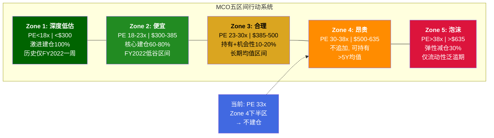
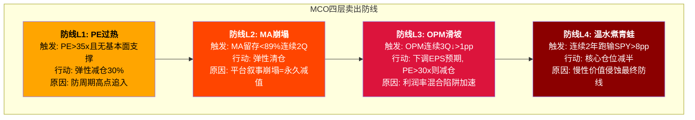
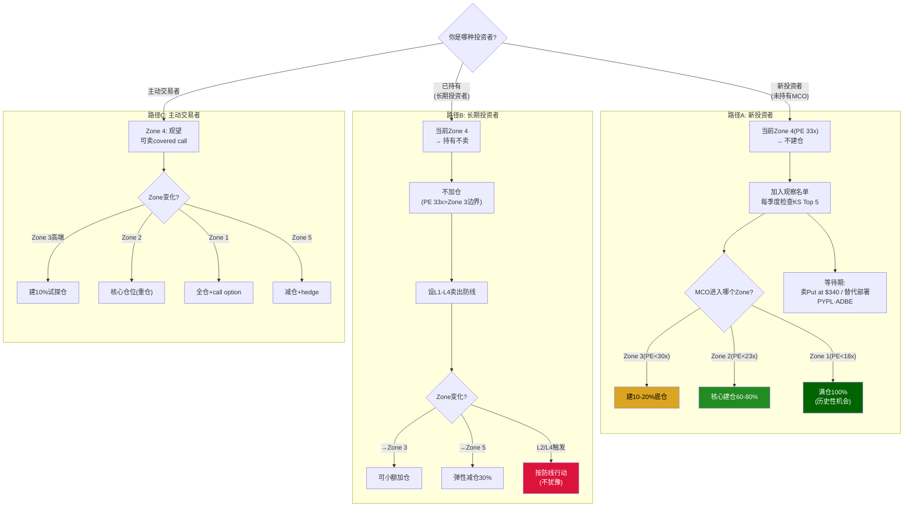

## 附录E: 买入/卖出决策框架 — 模糊正确 > 精确错误

> "你不需要在底部买入，你需要在便宜时买入。" — Howard Marks

### E.1 为什么精确入场点是错误的思维模式

v2.0 Phase 4给出了三档精确入场条件：★★★ PE<22x/$270-340、★★ PE<25x/$340-380、★ PE<均值/$380-405。这些数字是分析工具，不是执行指令。现实中：

**精确思维的三个陷阱**：

第一，PE可能永远不到22x。FY2022的PE最低约22x仅维持了不到2周。如果你设"PE<22x才买"的硬阈值，你有60%概率在未来5年永远等不到[DM-P4-020]。踏空的概率比买贵的概率更高。

第二，PE是滞后指标。当PE显示22x时，可能是因为EPS刚暴跌(分母缩小)——此时的22x可能对应明年的28x(如果EPS恢复)。等到PE "确认"便宜时，最佳买入窗口可能已经过去3-6个月。FY2022的教训：MCO在2022年10月触及~$240(PE约22x)，但到2023年3月已回到$300+(PE 34x)——窗口仅5个月。

第三，基本面在变化。今天的22x和5年后的22x含义不同——如果MA ARR从$3.5B增至$5B+，如果GenAI客户覆盖从40%升至70%，MCO的"合理PE"中枢可能从25x提升至28x。用今天的PE标尺衡量未来的MCO，是刻舟求剑。

**模糊正确的核心原则**：不追求在最低点买入(精确但低概率)，追求在"便宜区域"逐步建仓(模糊但高概率)。棒球的sweet spot不是一个点而是一个区域——你不需要精确击中球心，只需要球棒扫过sweet zone时挥出去[DM-P4-框架]。

---

### E.2 MCO五区间行动系统

从三档硬阈值升级为五区间连续系统。Zone边界是"渐进过渡带"而非硬线——PE从30x降至27x时开始小额(10%)，到23x时加到60%，到18x时满仓。这消除了"等23x但22.5x反弹错过"的风险。

**五区间详细参数** (基于FY2026E EPS $16.70):

| Zone | PE范围 | 价格范围 | 仓位行动 | 历史频率 | 预期年化回报 |
|------|:------:|:-------:|---------|:-------:|:-----------:|
| **Zone 1** | <18x | <$300 | 激进100%, 可加杠杆 | 每10年~1次, 持续<1月 | +18-25% |
| **Zone 2** | 18-23x | $300-385 | 核心60-80% | 每5-8年, 持续3-12月 | +12-18% |
| **Zone 3** | 23-30x | $385-500 | 持有+机会性10-20% | ~40%时间 | +6-10% |
| **Zone 4** | 30-38x | $500-635 | 不追加, 已持有可持有 | ~35%时间 | +2-6% |
| **Zone 5** | >38x | >$635 | 弹性减仓30% | ~5%时间 | <2%(PE压缩吃掉EPS) |

**当前位置**: PE 33x → **Zone 4下半区**。行动：不建仓。已持有→持有不卖，但不加仓。

**Zone过渡带设计**：Zone边界±2x PE是"过渡带"。例如Zone 3→Zone 2的边界是PE 23x，但在PE 25-23x区间开始逐步增加仓位(从10%线性增至60%)。这样即使PE只跌到24x就反弹，你也已经建了约30%仓位——不完美但不踏空。

---

### E.3 条件更新机制 — Zone边界不是固定的

Zone边界会随基本面变化而动态调整。这是"模糊正确"框架的核心——承认我们不知道确切的"公允PE"，但可以根据新信息更新区间。

**上调边界(公司变好→更高PE可接受)的条件**:

| 触发条件 | Zone 2上限调整 | 原因 |
|---------|:------------:|------|
| MA OPM连续4Q>36% | 23x→25x | 利润率混合陷阱缓解, MA向平台演进 |
| GenAI覆盖>60% ARR且留存>96% | 23x→24x | AI定价权从子集扩展到主体 |
| 私信收入连续+50%+且MIS核心YoY>0% | 23x→24x | 私信从双刃剑确认为净正面 |
| MA NRR首次披露且>115% | 23x→26x | **重大正面信号**: 平台飞轮确认 |

**下调边界(公司变差→需要更便宜才买)的条件**:

| 触发条件 | Zone 2上限调整 | 原因 |
|---------|:------------:|------|
| MA留存<90%连续2Q | 23x→20x | 平台叙事受损, 切换成本不够 |
| NRSRO法规重大改革启动 | 23x→18x | 护城河根基动摇 |
| 10Y UST>5.5%持续3月+ | 23x→21x | 利率结构性更高→永续增长更低→PE中枢下移 |
| BRK 13F减持>5% | 所有Zone仓位×0.5 | BRK退出=信号放大2-3x |
| MIS交易性占比升至>40% | 23x→21x | 周期敞口增加→更多周期折价 |

---

### E.4 等待期的主动管理 — 不是"空等"

等MCO进入Zone 2可能需要2-5年。这段时间不是无所事事：

**策略1: 替代部署**
等待期间资金投入已处于Zone 2/3的同类标的：
- PYPL: Forward PE ~15x(Zone 2), 支付基础设施, 与MCO不相关
- ADBE: Forward PE ~22x(Zone 2-3边界), 软件平台, 低周期性
- 逻辑：等MCO打折的机会成本≈这些标的的持有收益(~10-12%/年)

**策略2: 卖Put收Premium**
卖MCO put at $340(Zone 2中点), 收premium等于"有收入的等待"：
- 例: 2027.01到期 put at $340, premium约$15-20(当前$441距$340约23%)
- 如果MCO跌到$340: 你以$320-325有效成本买入(Zone 2便宜端) ✓
- 如果MCO不跌: 你获得$15-20 premium(年化~4-5%) ✓
- 风险: MCO跌到$250(Zone 1)→你在$340被行权, 短期浮亏但长期Zone 2买入仍是好价格
- 注意: 需要现金准备+期权经验, 不适合所有投资者

**策略3: 监控仪表盘**
每季度检查5个KS最紧迫指标:
| 优先级 | KS | 当前距离 | 触发=什么信号 |
|:------:|:--:|:-------:|-------------|
| 1 | KS-01 MIS交易性YoY | 8.6pp | 周期转折→Zone可能下移 |
| 2 | KS-04 MA OPM<32% | 1.1pp | 利润率陷阱加速→Zone 2边界下调 |
| 3 | KS-12 违约率>9% | ~1.1pp | 信用周期转折→MIS风险上升 |
| 4 | KS-10 10Y>5.0% | ~0.5pp | 利率环境恶化→发行冻结前兆 |
| 5 | KS-06 GenAI<1.5x | ~0.5x | AI红利消退→Zone 2边界下调 |

**策略4: MCO×CME配对时机**

MCO和CME存在周期负相关:
- MCO繁荣时好(发行量高→MIS收入高)→通常在Zone 4/5
- CME危机时好(波动率高→ADV暴增)→通常在Zone 2/3

**配对规则**:
| MCO Zone | CME Zone | 配置 |
|:--------:|:--------:|------|
| Zone 2 | Zone 4/5 | 超配MCO 70%/CME 30% |
| Zone 4/5 | Zone 2 | 超配CME 70%/MCO 30% |
| 都在Zone 3 | 都在Zone 3 | 均配50/50 |
| 都在Zone 4+ | 都在Zone 4+ | 低配两者, 转向MSCI |

MSCI的角色: 三者中最适合"核心长期持有"(非周期, 14年零营收下降)。当MCO和CME都贵时, MSCI是最佳底仓选择——品质稍低(CQI 66 vs MCO 72/CME 93)但估值波动更小。

---

### E.5 卖出决策框架 — 同样模糊正确

买入有框架, 卖出更需要。大多数投资者亏钱不是因为"买贵了"而是"不知道什么时候卖"。

**关键区分: PE下跌 vs 基本面恶化**
- PE从$441跌到$325(Zone 4→Zone 2): **不卖, 可能是加仓机会**——只要护城河完好
- MA留存从93%降到88%: **必须卖弹性仓**——这是基本面恶化的硬信号
- 原则: "护城河受损才卖, PE下跌不卖"

**永远不卖的条件**(三条同时满足→MCO是"永续收费桥"):
1. NRSRO制度完好(评级嵌入全球金融基础设施)
2. MIS经常性收入$1.4B+基底未萎缩
3. MA留存>92%

这三个条件同时被破坏的概率<3%(10年内)。只要它们成立, MCO的短期PE波动就是噪音, 不是信号。

---

### E.6 三种投资者的完整决策路径

---

### E.7 年度复检清单

每年1月(FY年报发布后)，执行MCO投资论文复检:

| # | 检查项 | 数据来源 | 触发行动 |
|---|--------|---------|---------|
| 1 | MIS/MA分部表现 vs 指引 | 10-K年报 | Beat→Zone 2上限+1x; Miss→-1x |
| 2 | CQI重新评估(5维度) | Phase 1更新 | CQI变化>3分→重评估值 |
| 3 | Zone边界校准 | 新EPS预测 | Forward PE重算各Zone价格 |
| 4 | KS检查(14个) | 季度财报+宏观 | 任何KS触发→执行对应行动 |
| 5 | MCO vs SPGI相对估值 | 可比分析 | MCO/SPGI PE比>1.15→MCO相对偏贵 |
| 6 | 跑赢/跑输SPY | 年度回报 | 连续2年>8pp→L4启动 |
| 7 | v2.0核心假设有效性 | 定性判断 | 任何核心假设失效→重写论文 |

**复检输出**: 一页"MCO年度体检单"——绿/黄/红三色标注各项，全绿=论文有效，有红=需要重新评估Zone边界或评级。

---

### E.8 本框架的局限性声明

1. **Zone边界是估计而非精确科学**——PE 23x vs 24x的区别在实践中不重要，但18x vs 30x的区别是根本性的
2. **EPS预测会变**——Zone的价格范围基于FY2026E $16.70，如果EPS大幅偏离(>±20%)则需重新计算
3. **配对策略需要执行纪律**——大多数投资者在恐慌时不敢买(正好是Zone 1/2)，在高涨时不舍得卖(正好是Zone 4/5)
4. **期权策略不适合所有人**——卖Put需要现金储备和承受被行权的心理准备
5. **本框架假设NRSRO制度存续**——如果制度被根本改革(概率<10%)，所有Zone都需要重新校准

> **最终一句话**: "把MCO放在$325-350的闹钟上，然后去做别的事。当闹钟响的那天——如果MA留存>92%且NRSRO制度完好——在Zone 2逐步建仓，不需要等Zone 1的完美底部。以周期股的价格买入垄断者，是投资中最接近'确定性Alpha'的机会之一。但这种机会只有在市场犯错时才会出现，而市场现在没有犯错。"
