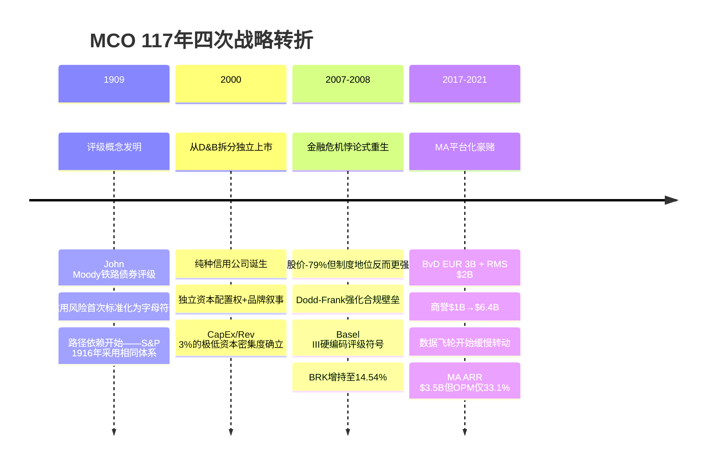
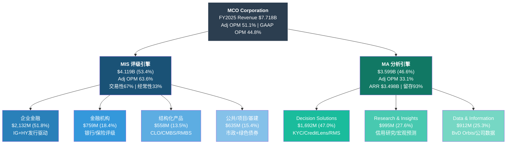
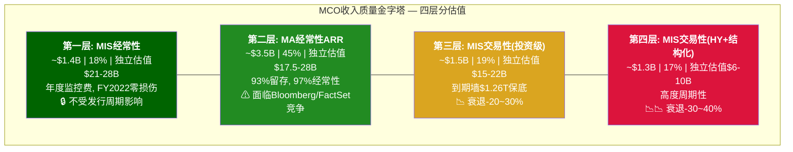
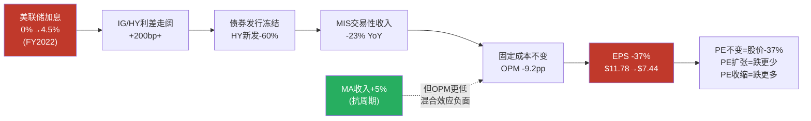

# Part I: 公司本质

---

## Ch01: "半周期+半SaaS"的信用帝国

**核心论点**: Moody's Corporation不是市场标签下的"信息服务公司"。它是一个由制度嵌入的评级特许权(MIS)和尚在进化的信用分析SaaS平台(MA)构成的双引擎混合体——前者的利润率接近软件公司，波动率却像周期股；后者的经常性收入占96%，但增速和利润率在SaaS世界仅够"及格"。理解这个双重身份，是理解MCO一切估值争议的起点。

### 1.1 117年四次转折：从手册出版商到信用帝国

Moody's的历史浓缩在四个关键节点。每一个节点不仅改变了公司形态，更重新定义了信用评级行业的运行规则。

**第一个转折: 1909年——评级概念的发明**

1909年，John Moody出版《Moody's Analyses of Railroad Investments》，首次将铁路债券的信用质量用字母等级(Aaa/Aa/A/Baa...)表达。这个看似简单的创新，解决了19世纪末美国资本市场最核心的信息不对称问题：投资者无力独立评估数百家铁路公司的偿付能力。Moody's的字母符号把复杂的信用分析压缩为一个可比较的标量——这是人类金融史上第一次将"信用风险"标准化 [DM-HIS-001]。

战略含义远超表面。评级符号一旦成为市场"通用语言"，就产生了极强的路径依赖：后来者必须兼容已有符号体系，否则投资者无法横向比较。Standard & Poor's在1916年推出评级时，选择了几乎相同的符号体系(AAA/AA/A/BBB...)——不是因为没有更好的选择，而是因为市场已经习惯了Moody's定义的"语法"。117年后的今天，全球债券市场仍在使用两套本质相同的符号体系，这不是巧合，而是先发优势的持久印证。

**第二个转折: 2000年——从D&B拆分独立上市**

2000年9月，Moody's从母公司Dun & Bradstreet(D&B)拆分独立上市。拆分前的D&B是一家"杂货铺"——商业信息服务+信用评级+市场研究混在一起，资本市场无法单独给最高利润率的评级业务定价 [DM-HIS-002]。

拆分的战略逻辑在当时看是财务工程(释放评级业务的估值溢价)，回头看是Moody's成为"纯种信用公司"的起点。独立上市后的MCO获得了三个关键自由度：(1)独立的资本配置权——可以将全部FCF用于评级业务扩张而非补贴低利润率的D&B业务；(2)独立的品牌叙事——"Moody's"从D&B旗下的一个部门变成华尔街的一个品牌；(3)独立的收购弹药——为2017年后的MA平台化战略提供了资产负债表基础。

一个被忽视的细节：拆分时Moody's几乎没有有形资产——它的"产品"是分析师的意见和一个符号体系。这意味着从第一天起，MCO就是一家几乎纯知识产权公司，CapEx需求接近于零。FY2000的CapEx/Revenue约3%，FY2025仍然是4.2%——25年未变。这种极低的资本密集度是后来FCF/NI持续>100%的结构性原因 [DM-FIN-001]。

**第三个转折: 2007-2008年——金融危机与悖论式重生**

次贷危机中，Moody's因对结构化产品(CDO/MBS)评级过于宽松遭受史无前例的声誉打击。2007年8月至2009年3月，MCO股价从$73跌至$15——暴跌79% [DM-HIS-003]。美国国会听证会上，前Moody's分析师作证称评级流程受商业压力扭曲。这是一个应当终结评级行业的时刻。

但实际发生的事情恰恰相反。危机后的监管改革不仅没有终结Big Three，反而强化了它们的壁垒：

- **Dodd-Frank法案(2010)** Title IX加强了对NRSRO的监管——独立合规部门、方法论公开、年度SEC审查。这些要求对MCO是"舒适的成本"(合规支出<收入的5%)，对小型NRSRO则可能吃掉全部利润。合规成本的非对称性使得规模壁垒变成了制度壁垒 [DM-REG-001]。

- **Basel III框架(2010-2019分步实施)** 将外部评级嵌入银行资本充足率计算的核心公式。银行持有的债券按Big Three评级确定风险权重：Aaa/AAA=20%权重, Baa/BBB=50%, Ba/BB以下=150%。这意味着全球G-SIB的风控IT系统在代码层面硬编码了MCO/SPGI的评级符号 [DM-REG-002]。

- **存量锁定效应** 更为深远。2008年前发行的数万亿存量债券，其契约中已经引用了MCO评级作为触发条件("如评级降至Baa3以下，发行人需追加担保")。这些契约在债券存续期内无法单方面修改。一只2005年发行的30年期债券，其MCO评级引用将一直有效到2035年。危机不仅没有解开MCO与金融体系的捆绑，反而通过新的监管层又加了一层锁。

这个"悖论式重生"(paradoxical rebirth)是理解MCO护城河的关键。信用评级行业的制度嵌入深度如此之大，以至于即使在评级机构犯下系统性错误的最极端情境下，体系的反应也不是"替换评级机构"，而是"更严格地监管现有评级机构"。这使得后危机的MCO处于一个奇特的位置：声誉受损但制度地位反而更强 [DM-HIS-004]。

Warren Buffett正是在危机后的2010-2013年间将Berkshire Hathaway对MCO的持股从约10%增至约13%。当时MCO PE仅12-15x——Buffett用"周期股价格"买入了他认为是"永续垄断"的资产。截至FY2025，BRK持股14.54%($11.2B)，Greg Abel已公开确认MCO为"永久持仓" [DM-OWN-001]。

**第四个转折: 2017-2021年——MA的平台化豪赌**

2017年，MCO以EUR 3B收购Bureau van Dijk(BvD)，获得6亿+商业实体数据库。2021年，以$2B收购RMS(Risk Management Solutions)，获得保险风险建模能力。两笔收购合计$5.6B——超过MCO当年净利润的两倍——把MA从"评级附属品"重新定义为独立的信用分析平台 [DM-MA-001]。

收购的战略赌注在于"数据飞轮"：BvD的6亿实体数据库+MCO百年评级历史数据+RMS的灾难风险模型，构成训练信用AI模型的独特原材料。如果飞轮转起来，MA可以在评级业务之外建立一个独立的、不依赖发行周期的收入引擎。如果飞轮是空转，MCO就是用$5.6B买了两个中等质量的SaaS资产，并在资产负债表上堆积了$6.4B商誉(占总资产52%) [DM-BS-001]。

赌注的代价是资产负债表结构的永久改变。收购前MCO的商誉约$1B，收购后飙升至$6.4B。加上无形资产$5.3B，合计$11.7B——超过总资产的60%。这意味着MCO的"有形"生意(评级特许权)现在背着一个"无形"负担(收购商誉)。如果MA的增长不达预期或竞争格局恶化，商誉减值将直接冲击EPS——而在当前33x PE下，EPS的任何非经常性下跌都会被PE收缩放大。

2025年的证据显示飞轮正在缓慢转动但尚未全速运行。MA ARR达到$3.5B(+8%)，留存率93%，Decision Solutions增速+15%——这些都是健康信号。但MA Adj OPM 33.1%与MIS的63.6%差距仍然巨大，93%留存率在SaaS世界仅是"良好"(对比ServiceNow 97%+)。MCO管理层的"Integrated Risk Assessment"叙事——MIS数据喂养MA模型，MA客户反哺MIS需求——在概念上成立，但尚未在财务数据中显示出1+1>2的协同溢价。

### 1.2 双引擎架构：MIS vs MA的结构性差异

MCO不是一家公司，而是两家截然不同的公司被装在同一个壳里。理解双引擎各自的经济特征，是避免估值陷阱的前提。

**MIS: 制度嵌入的"收费站"**

MIS FY2025收入$4.119B(占比53.4%)，Adj OPM 63.6%，Q1单季度甚至达到66% [DM-MIS-001]。这个利润率接近纯软件公司(如MSCI 54.6%)，但驱动逻辑完全不同——MIS的超额利润率来自"双寡头税"(duopoly rent)，不来自规模经济或网络效应。

MIS的收入按资产类别拆分 [DM-MIS-002]：

| 资产类别 | FY2025收入 | 占比 | YoY | 周期敏感度 |
|----------|:----------:|:----:|:---:|:----------:|
| 企业金融(Corporate Finance) | $2,132M | 51.8% | +12% | 高(IG/HY发行量驱动) |
| 金融机构(FIG) | $759M | 18.4% | +10% | 中(银行/保险评级) |
| 结构化产品(Structured) | $558M | 13.5% | +8% | 极高(CLO/CMBS周期性) |
| 公共/项目/基建(PPIF) | $635M | 15.4% | +9% | 低(市政债+绿色债券) |

最关键的结构性特征是**交易性vs经常性的67:33分裂**。67%的MIS收入($2.76B)来自新发行的"一次性"评级费用——发行人每发一笔债就付一笔评级费。发行量好的年份(FY2021发行量创历史高、FY2025再创$6.6T新高 [DM-MIS-003])，MIS是印钞机；发行量差的年份(FY2022发行量萎缩→MIS收入-23%)，MIS是利润黑洞。

经常性33%($1.36B)来自年度监控费(surveillance fees)——已评级债务只要存续，发行人就要每年交监控费。这部分是"后付费护城河"：过去几十年积累的评级存量越大，经常性收入基数越稳。但有一个延迟效应需要注意：新增评级放缓时，监控费收入的增速会在12-18个月后跟随放缓——因为新增评级减少意味着未来年度监控费的增量减少。

MIS的经济学本质是一个"有天气风险的收费站"。收费站的好处是：只要桥还在(金融体系还需要信用评级)，过路费就会源源不断。天气风险是：遇到暴风雪(利率急升→发行冻结)，过路的车辆会暂时减少70%——但暴风雪结束后，被压抑的融资需求会集中释放(pent-up demand)，车流量可能超过暴风雪前。FY2022→FY2024的V型恢复(MIS收入从$2.68B→$3.78B，+41%)就是这个模式的最新验证 [DM-MIS-004]。

**MA: 尚在进化的SaaS平台**

MA FY2025收入$3.599B(占比46.6%)，ARR $3.498B(占收入97%)，Adj OPM 33.1%，留存率93% [DM-MA-002]。

MA的三条产品线构成了不同的增长引擎：

| 产品线 | FY2025收入 | 占MA | 增速 | 核心产品 |
|--------|:----------:|:----:|:---:|---------|
| Decision Solutions | $1,692M | 47.0% | +15% | KYC(反洗钱)/CreditLens(信贷)/Banking Cloud/RMS保险 |
| Research & Insights | $995M | 27.6% | +8% | 信用研究/Zandi宏观预测/Early Warning |
| Data & Information | $912M | 25.3% | +7% | BvD Orbis(6亿+实体)/公司数据 |

Decision Solutions是MA增长最快的引擎。KYC(Know Your Customer)合规工具ARR +15%——受益于全球反洗钱监管持续收紧(每年银行罚款超过$10B)。CreditLens信贷审批平台实现了+67% ARPU提升——AI功能嵌入后，银行客户从"按席位付费"升级为"按功能模块付费"，钱包份额显著扩大 [DM-MA-003]。

**93%留存率的精确解读**: 93%在SaaS世界是"良好"(Good)而非"卓越"(Great)。参照系：Tier 1企业SaaS留存率通常在95-97%+(ServiceNow 97%、Veeva 96%、Workday 95%)。MCO的7%年流失意味着MA每年需要新签+扩展约$525M收入(ARR的约15%)才能维持8%净增长。如果留存率滑落至90%(仅3个百分点)，在相同新签速度下ARR增速将从8%降至约5%。留存率是MA估值最敏感的输入变量 [DM-MA-004]。

一个值得特别关注的信号是GenAI客户子集的表现。FY2025已有40%的MA ARR(约$1.4B)包含GenAI功能。使用GenAI/AgenTix产品的客户群体展现出97%留存率(vs整体93%)和2倍于整体的增速 [DM-AI-001]。这4个百分点的留存率差距意味着什么？在$1.4B基数上，97% vs 93%留存率的差异每年约$56M——不是改变游戏规则的数字，但它指向一个重要趋势：AI功能正在成为定价权放大器——愿意为AI付费的客户粘性更高、流失率更低、钱包份额更大。

但要保持清醒：97%留存仅覆盖40%的MA ARR。其余60%仍是93%。整体留存率的改善需要GenAI渗透率从40%提升到60%+才能在全局数据中显现。按当前渗透速度(每年+8-10pp)，这需要2-3年时间。

### 1.3 利润率混合陷阱：MCO最被忽视的结构性约束

这是MCO估值中最容易被忽略也最难被"解决"的问题。它不是运营效率问题，不是管理层执行力问题——它是数学必然。

**陷阱的机制**：MIS Adj OPM 63.6% 是 MA Adj OPM 33.1%的近两倍。当MA增速持续高于MIS(MA +8% vs MIS长期约5-7%)，MA占总收入的比例逐年上升，MCO的加权平均OPM数学上被拉低 [DM-MIX-001]。

FY2026管理层指引已经隐含了这个约束：Adj OPM 52-53%，MIS约65%，MA 34-35%。假设两个分部各自OPM不变，仅因混合比例变化导致的总体OPM演进如下：

| 年份 | MA占比(估) | MIS占比(估) | 加权OPM(Adj) | 变化 |
|------|:----------:|:----------:|:------------:|:----:|
| FY2025(实际) | 46.6% | 53.4% | 51.1% | — |
| FY2026(指引) | 48% | 52% | 52.0% | +0.9pp |
| FY2028(估) | 51% | 49% | 50.7% | -0.4pp |
| FY2030(估) | 55% | 45% | 48.5% | -2.6pp |

FY2026指引的52-53%能实现，部分原因是MA OPM从33.1%扩张至34-35%(+100-200bps)暂时抵消了混合效应。但到FY2030——假设MA增速持续>MIS、MA占比升至55%——即使MA OPM扩张至38%(需要每年+100bps持续5年，并非低风险假设)，MCO整体Adj OPM仍仅50.2%：

> 55% × 38% + 45% × 65% = 20.9% + 29.3% = **50.2%**

这低于FY2025的51.1%和FY2026指引的52-53%。

**为什么市场容易忽视这一点？** 因为分析师通常看"Adj OPM正在扩张"(FY2023 47.2% → FY2025 51.1% → FY2026E 52-53%)并线性外推。但FY2023→FY2025的OPM扩张主要由MIS周期恢复驱动(MIS收入从$2.68B→$4.12B)——当MIS周期见顶后，混合陷阱的数学力量将开始占主导。管理层52-53%的指引可能接近峰值而非增长轨道的一个中间点 [DM-MIX-002]。

**反驳与限制条件**: MA OPM确实有扩张空间——(1)GenAI嵌入后的人力成本替代(40% ARR已含AI功能)；(2)剥离低利润率业务(Learning Solutions+Regulatory Reporting)提升存量质量；(3)BvD/RMS收购摊销自然递减。如果MA OPM能以+150bps/年的速度扩张(而非+100bps)，天花板可以被推迟2-3年。但推迟≠消除——这是MCO的结构性约束，不是管理层能"执行掉"的问题。

### 1.4 收入质量金字塔：$7.7B不是铁板一块

MCO的$7.718B收入按品质(可预测性 × 利润率 × 防御性)分层，呈现出清晰的四层金字塔结构。每一层的投资含义截然不同 [DM-REV-001]。

**第一层(顶层): MIS经常性收入 — 约$1.4B(18%)**

这是MCO收入中品质最高的部分。年度监控费+关系维护费，一旦建立评级关系，发行人每年自动续费。FY2022 MIS整体收入-23%时，经常性部分几乎不受影响——因为监控费的支付义务与发行量无关，只与存量评级债务相关。只要一只债券还在存续期内，发行人就必须支付年度监控费。

如果将这$1.4B独立估值：按SaaS可比的15-20x Revenue计算，仅此一项价值$21-28B，占当前市值$78.2B的27-36%。换言之，MCO剩余82%的收入($6.3B)只需要支撑$50-57B的市值——对应不到10x Revenue——在任何估值框架下都是合理的 [DM-REV-002]。

**第二层: MA经常性ARR — 约$3.5B(45%)**

93%留存、97%经常性(ARR占MA收入的97%)的订阅收入。品质高于平均但低于MIS经常性，原因有二：(1)MA面临更多直接竞争(Bloomberg/FactSet/Refinitiv)，留存率93%在SaaS世界仅为Tier 2；(2)MA的定价权弱于MIS——客户在Bloomberg和MCO之间有真实的选择余地，而在评级领域则没有。按MA-specific可比(Verisk 5-8x Revenue)估值，这部分价值$17.5-28B [DM-REV-003]。

**第三层: MIS交易性评级(投资级) — 约$1.5B(19%)**

投资级(IG)企业债/金融机构债的首次评级和再评级。周期性中等——投资级发行人在衰退中仍有再融资需求(到期墙驱动，当前$1.26T规模的2027到期墙提供了下行保护 [DM-CYC-001])，但新发行量可能下降20-30%。OPM极高(可能>MIS平均64%)，因为投资级评级流程相对标准化，边际成本接近零。

**第四层(底层): MIS交易性评级(高收益+结构化) — 约$1.3B(17%)**

这是MCO收入中波动最大、品质最低的部分。高收益债(HY)和结构化产品(CLO/CMBS/RMBS)的发行高度依赖市场情绪和信贷利差。FY2022这部分收入缩水约30-40%。在衰退+利差走扩的环境下(IG/HY利差走阔至500bp+)，这$1.3B可能萎缩至$0.8-0.9B。如果将这部分按周期股估值(10-15x Earnings)，隐含估值仅$6-10B [DM-REV-004]。

**金字塔的核心估值含义**：如果按各层品质分别定价——第一层$21-28B + 第二层$17.5-28B + 第三层$15-22B + 第四层$6-10B = 总计$59.5-88B，中间值$73.8B。vs 当前市值$78.2B，MCO基本处于"公允定价"区间。但金字塔视角揭示了一个重要洞见：**第四层(仅17%收入)的周期波动能够导致整体估值波动达±15%——这就是MCO不能按纯信息服务公司定价的核心原因**。

### 1.5 AI：加速器还是搅局者

AI对MCO的影响需要按引擎分别评估——MIS和MA面对的AI现实截然不同。

**MIS: 监管防火墙保护，10年+安全窗口**

MIS的核心产品是"监管认证的信用意见"——NRSRO框架要求评级由注册机构出具，AI模型无论多精确都不能替代这个法律地位。SEC的NRSRO注册要求包括人员资质审查、内控体系、方法论透明度、历史违约统计——这些在可预见的未来都无法由纯AI系统满足。

更实际的约束来自监管惯性。即使技术上可行，让全球监管机构同步修改Basel框架、投资政策、债券契约中对"评级"的定义，需要的协调成本和政治意愿远超任何单一技术突破所能驱动。评级制度的"拆除"即使开始，也将是以十年为单位的渐进过程——而在这个过程中，MCO仍然是必需品 [DM-AI-002]。

**MA: 真实的竞争威胁 + 定价权放大器(双面性)**

MA面对的AI威胁更为直接。Bloomberg Terminal已经集成了AI信用分析功能，Refinitiv(LSEG旗下)在用AI重构数据产品，初创公司如Kensho(已被SPGI收购)在探索替代性信用分析工具。在MA的三条产品线中，Research & Insights(信用研究报告)最容易被AI替代——标准化的信用分析报告是大模型最擅长的任务之一。

但硬币的另一面是：AI也在成为MA的定价权放大器。GenAI客户子集97%留存(vs整体93%)、增速2x整体、ARPU +67%(CreditLens AI功能)——这些数据表明：将AI嵌入工作流产品后，客户粘性和付费意愿同时上升。MCO的防守策略是"数据护城河"——6亿+实体数据库(BvD)+百年评级历史数据，这些是训练信用风险模型的独特原材料，竞争对手难以复制 [DM-AI-003]。

**净效应评估**：短期(1-3年)AI对MCO净正——MA ARR增速提升+留存改善。中期(3-7年)分化——MIS受保护但增量有限，MA面临竞争压力但有数据壁垒。长期(7年+)不确定——取决于监管框架是否演进和AI信用分析质量是否达到机构级标准。RiskTech100连续4年排名第一提供了当前竞争力的证据，但排名是滞后指标 [DM-AI-004]。

---

## Ch02: 财务全景 — 6年P&L桥 + FY2026指引

**核心论点**: MCO的6年P&L桥揭示了三个被表面增长掩盖的事实——(1)FY2022是理解MCO真实波动率的"照妖镜"而非"异常值"；(2)GAAP OPM与Adj OPM之间6.3pp的持续差距是收购代价的会计映射，v2.0必须区分两者(v1.0在此处混淆)；(3)FCF/NI 6年均值约105%是MCO最无争议的品质证据。在估值章节之前，本章还将揭示一个v1.0未充分分析的问题：回购效率eta在高PE下的价值摧毁效应。

### 2.1 6年完整P&L表 (FY2020-2025)

| 财年 | 收入 | YoY | GAAP OPM | Adj OPM | GAAP EPS | Adj EPS | FCF | FCF/NI |
|------|:----:|:---:|:--------:|:-------:|:--------:|:-------:|:---:|:------:|
| FY2020 | $5.371B | — | 45.6% | ~51% | $9.39 | ~$10.2 | $2.043B | 114.9% |
| FY2021 | $6.218B | +15.8% | 45.7% | ~52% | $11.78 | ~$12.7 | $1.866B | 84.3% |
| FY2022 | $5.468B | **-12.1%** | **36.5%** | ~43% | **$7.44** | ~$9.0 | $1.191B | 86.7% |
| FY2023 | $5.916B | +8.2% | 37.5% | ~47% | $8.73 | ~$10.5 | $1.880B | 117.0% |
| FY2024 | $7.088B | +19.8% | 41.9% | ~50% | $11.26 | ~$13.0 | $2.521B | 122.5% |
| **FY2025** | **$7.718B** | **+8.9%** | **44.8%** | **51.1%** | **$13.67** | **$14.94** | **$2.575B** | **104.7%** |

数据来源: MCO 10-K年报, FMP [DM-FIN-002] [DM-FIN-003] [DM-FIN-004] [DM-FIN-005] [DM-FIN-006] [DM-FIN-007]

### 2.2 三个关键读法

**读法一: FY2022是照妖镜，不是异常值**

FY2022是MCO周期DNA的完美展示。美联储从0%加息至4.5%，债券发行冻结，MCO全年表现：

- 收入-12.1%($6.22B → $5.47B)——MIS收入-23%驱动
- GAAP OPM从45.7%暴跌至36.5%(跌9.2pp)
- EPS从$11.78跌至$7.44(跌-37%)
- EPS跌幅是收入跌幅的**3倍**——这是经营杠杆在周期底部的放大效应

EPS跌幅3倍于收入跌幅的机制值得细究。MIS收入-23%，但MIS的大部分成本(分析师薪资、合规团队、IT系统)是固定的——MCO不可能因为发行量下降就裁掉20%的评级分析师(他们需要在恢复期处理pent-up demand)。固定成本基数不变 + 收入断崖 = OPM收缩。再加上MA仍在扩张(MA收入FY2022 +5%)但MA OPM更低，混合效应进一步压低总体OPM。然后是回购：FY2022 MCO仍花了约$1.5B回购(在EPS已大幅下跌时)，加速了EPS下跌的分母效应 [DM-FIN-008]。

**为什么这不是"异常值"**：利率急升→发行冻结→MIS收入断崖→EPS暴跌的传导链不是一次性事件。2015-2016年(能源信用周期恶化)、2007-2008年(金融危机)都出现过类似模式。在当前衰退概率42-48%(Moody's Analytics自身的Zandi给出 [DM-MAC-001])的环境下，FY2027-2028再次出现类似情景的概率不低。把FY2022当作"已过去的异常"而非"会重演的模式"，是当前33x PE定价的核心风险。

**读法二: GAAP vs Adj OPM差距6.3pp——v2.0必须区分**

FY2025 Adj OPM 51.1% vs GAAP OPM 44.8%——6.3个百分点的差距 [DM-FIN-009]。差距主要来自收购无形资产摊销：FY2025 D&A约$480M，其中约$300M+为收购相关(BvD/RMS带来的客户关系、数据库、技术等无形资产的摊销)。管理层在FY2026指引中也使用Adj basis(52-53%)。

v1.0在此处犯了一个可纠正的混淆：在某些段落使用Adj OPM，在另一些段落使用GAAP OPM，没有统一标注和口径说明。v2.0的处理原则明确如下：

- **GAAP OPM作为主要参考**: 收购摊销是真实的经济成本——BvD的数据库和RMS的风险模型需要持续投入来维持竞争力，"忽略"摊销等于假设这些资产永续不折旧
- **Adj OPM作为辅助和可比基准**: 因为SPGI/MSCI/Verisk的管理层指引均以Adj basis披露，跨公司比较时统一使用Adj OPM
- **估值模型中的处理**: 对收购摊销做50%加回——既不完全忽略(过于乐观)也不完全计入(过于保守)

D&A趋势提供了一个重要观察窗口：FY2022的D&A为$331M，FY2025升至$480M(+45%)，而商誉同期仅增加约9%($5.9B→$6.4B)。摊销加速但商誉平稳，意味着收购的无形资产正在被消化——几年后如果没有新的大型收购，摊销将自然递减，GAAP与Adj的差距可能收窄至4-5pp。但反面解读是：如果MCO为维持MA竞争力需要继续收购(补充数据/技术)，新收购将重新推高摊销 [DM-FIN-010]。

**读法三: FCF质量是最无争议的品质亮点**

FY2025 FCF $2.575B，FCF/NI = 104.7%。6年均值约105% [DM-FIN-011]。这意味着MCO的净利润几乎1:1转化为自由现金流——没有大规模CapEx需求($326M，仅收入的4.2%)，应收账款管理高效(DSO约70天)，没有working capital陷阱。

FCF/NI>100%在轻资产模型中不罕见(MSCI约110%、SPGI约90-100%)，但MCO连续6年维持105%均值且波动极小(最低84%在FY2021——因BvD整合导致一次性现金流出)，说明这不是某一年的偶然，而是业务模型的结构性特征。这也是MCO能够每年返还几乎全部FCF给股东(FY2025回购+分红$2.407B = FCF的93.5%)而不损害增长的底气。

在所有关于MCO估值的争论中——PE是否太高、MA是否值SaaS倍数、周期风险如何定价——FCF/Revenue 33.4%是最"硬"的指标。每产出1美元收入，有33美分变成真金白银的自由现金流。这个比率在所有金融信息服务公司中位于75th percentile水平 [DM-FIN-012]。

### 2.3 FY2026完整指引表

管理层FY2026指引构成了Forward估值的基础假设 [DM-GUI-001]：

| 指标 | FY2026指引 | vs FY2025 | 隐含假设 |
|------|:----------:|:---------:|---------|
| 总收入增长 | 高个位数 | vs +8.9% | MIS持续强劲+MA稳定 |
| Adj OPM | 52-53% | vs 51.1% | +90-190bps扩张 |
| MIS Adj OPM | ~65% | vs 63.6% | +140bps，发行量维持高位 |
| MA Adj OPM | 34-35% | vs 33.1% | +90-190bps，剥离+AI效率 |
| Adj EPS | $16.40-17.00 | vs $14.94(+10-14%) | OPM扩张+回购 |
| FCF | $2.8-3.0B | vs $2.575B(+9-17%) | FCF/NI维持>100% |
| 回购 | ~$2.0B | vs $1.706B(+17%) | 加速回购 |
| 净利息支出 | ~$250M | vs ~$240M | 净债务小幅增加 |
| 有效税率 | 20-22% | vs ~21% | 稳定 |

指引的关键风险在于MIS假设。"高个位数"总收入增长需要MIS维持+5-8%增速——但FY2025 MIS已经站在周期高位($4.12B，发行量$6.6T历史新高 [DM-MIS-003])。如果FY2026出现衰退(Zandi概率42-48%)或利率回升导致发行量萎缩15-20%，MIS收入可能从+5%变为-10%，拖累总收入增速从+8%降至+2-3%。在这种情景下，Adj EPS更可能落在$14.5-15.5区间——低于指引下沿$16.40 [DM-GUI-002]。

Forward PE的陷阱也值得警惕。当前Forward PE约26.3x(基于$441.03 / 指引中枢$16.70)，看似合理。但$16.70这个EPS假设本身包含了周期高点的MIS收入。如果用正常化EPS(剔除周期峰值效应，取FY2022-2026E的中位数约$12-13)重新计算，正常化PE实际为34-37x——这是一个完全不同的故事 [DM-VAL-001]。

### 2.4 资本配置深度分析：回购效率与价值摧毁

FY2025资本回报全景：回购$1.706B + 分红$701M = 股东回报$2.407B，占FCF的93.5%。公司几乎把所有自由现金流都返还给股东——CapEx仅$326M(4.2%)，剩余增长依赖自然增速(定价权+TAM扩张)而非资本投入 [DM-CAP-001]。

**回购效率eta的量化: 高PE下的价值摧毁**

回购创造价值的前提是：回购价格低于内在价值(用earnings yield = 1/PE近似)。MCO FY2025平均回购价格估算在$430-480区间，对应PE约33-35x [DM-CAP-002]。

在这个PE下的回购效率：

> eta = earnings yield / 回购资本的机会成本
> eta = (1/33) / 9% (WACC近似) = 3.0% / 9.0% = **0.34x**

eta = 0.34x意味着每投入1美元回购，仅获得0.34美元的经济价值——**这是价值摧毁而非价值创造** [DM-CAP-003]。

对比MCO自身的有机投资回报：BvD收购的估计IRR为12-15%(基于收购价/后续现金流推算)。如果MCO将回购资金用于类似质量的收购，价值创造效率是回购的3-4倍(12-15% vs 3.0%)。

**5年累计价值摧毁量化**：FY2021-2025期间，MCO累计回购约$8.5B [DM-CAP-004]。假设这5年的平均回购PE约30-35x(eta均值约0.5x)，价值摧毁总量约：

> $8.5B × (1 - 0.5) = **约$4.3B**

$4.3B相当于当前市值$78.2B的**5.5%**。这不是灾难性的数字，但它意味着MCO股东在过去5年"为回购付出了$4.3B的隐性税"——这笔钱如果用于更高IRR的收购(如BvD类资产)或干脆以特别股息返还(让股东自行配置)，股东总价值会更高。

**回购陷阱(Buyback Trap)**: MCO面临一个囚徒困境——

- **停止回购** → 市场解读为"管理层看空自己的股票" → 股价下跌 → EPS增速放缓(失去回购的分母收缩效应) → PE进一步压缩
- **继续回购** → 在33x PE下持续摧毁价值 → 但EPS增厚约1%/年(流通股从184.7M→179.9M，5年净减少2.6%) → 维持"回报股东"的叙事

管理层选择了后者——FY2026指引进一步加速至~$2.0B回购。这是理性的"形式主义"：在缺乏高IRR有机投资出口的情况下(评级业务的边际CapEx接近零)，回购虽然eta<1，但至少好过让现金闲置(0%回报)。真正的问题是：**MCO从未在回购指引中加入PE相关的条件门槛**——无论股价$280还是$480，都按计划回购。这缺乏资本配置纪律 [DM-CAP-005]。

### 2.5 ROE 62%的解剖：真功夫还是会计幻觉

MCO FY2025 ROE 62.1%——在金融信息服务行业极为突出 [DM-ROE-001]：

| 公司 | ROE | 驱动因素 |
|------|:---:|---------|
| **MCO** | **62.1%** | 低权益(回购) + 高利润率 |
| SPGI | 13.1% | 正常权益 |
| ICE | 11.9% | 正常权益 |
| MSCI | 负ROE | 负权益(极端回购) |

**杜邦分解**：

> ROE = 净利率 × 资产周转率 × 权益乘数
> 62.1% = 31.9% × 0.49x × 4.11x

- **净利率31.9%**: 优秀(FY2025 NI $2.459B / Revenue $7.718B)，反映MIS特许权的超额盈利能力
- **资产周转率0.49x**: 偏低(Revenue $7.718B / Total Assets ~$15.8B)，大量资产被商誉和无形资产占据($11.7B = 74%资产)
- **权益乘数4.11x**: 极高——这是ROE从"优秀"被放大到"惊人"的主要推手

权益乘数4.11x的来源是累计回购$13.3B导致的Treasury Stock膨胀。MCO的Book Value仅约$4.2B(含$8.2B商誉+$3.5B无形资产)，TBV为-$4.0B [DM-ROE-002]。低分母(低权益)机械性地放大了ROE——ROE 62%中大约一半来自杠杆放大效应，而非运营效率。

**更有意义的替代指标**：

| 指标 | 值 | 含义 |
|------|:---:|------|
| **ROA** | 15.5% | 真实资产回报能力(NI/Total Assets) |
| **FCF/Revenue** | 33.4% | 现金产出效率(最硬的品质指标) |
| **FCF/EV** | 3.1% | 所有者收益率(FCF $2.575B / EV ~$83B) |
| **ROIC** | >30% | 投入资本回报(但分母定义影响大) |

ROA 15.5%在任何行业都是优秀水平——它不受回购的分母扭曲，纯粹反映"MCO用$15.8B总资产创造$2.459B净利润"的真实能力。FCF/Revenue 33.4%更是"铁指标"——不受会计调整、回购结构、资产负债表噪音的影响。在SOTP估值中，应使用FCF/Revenue而非ROE作为盈利能力的代理变量 [DM-ROE-003]。

### 2.6 SGI评估与A-Score初评

**SGI(专才-通才指数): 约6.5/10**

MCO是一个"专才+通才"的混合体：

| 引擎 | SGI | 理由 |
|------|:---:|------|
| MIS | ~9/10 | 纯种专才——双寡头、监管嵌入、50年格局不变 |
| MA | ~4.5/10 | 有专才基因的通才——多赛道竞争、留存93%(非97%+)、平台锁定尚未成形 |
| **加权** | **~6.5** | 53% × 9 + 47% × 4.5 = 6.9, 调整至6.5(MA拉低专才纯度) |

vs SPGI约5.5(评级占比仅34%→通才比重更高)。MCO的SGI更高意味着它更"专注"——但也更依赖评级周期。这是双刃剑 [DM-SGI-001]。

**A-Score品质评分: 73.5/110**

Phase 0阶段可评估A组(财务健康)和D组(宏观/周期)：

**A组: 财务健康 (7维度, 满分70)**

| 维度 | 评分(0-10) | 关键依据 |
|------|:--------:|---------|
| A1 收入增长持续性 | 7.0 | 6年CAGR约7.5%，但FY2022 -12%暴露周期波动 [DM-FIN-002] |
| A2 利润率质量 | 8.5 | Adj OPM 51.1%顶级，但GAAP/Adj差异需折价 [DM-FIN-009] |
| A3 FCF转化 | 9.0 | FCF/NI 6年均值105%，CapEx仅4.2% [DM-FIN-011] |
| A4 资产负债表 | 6.5 | Net Debt/EBITDA 1.26x健康，但TBV -$4.0B、商誉$6.4B [DM-BS-001] |
| A5 资本配置效率 | 7.0 | 回购$1.71B+分红$701M，但高PE下回购eta=0.34x [DM-CAP-003] |
| A6 盈利可预测性 | 6.0 | MA(96%经常性)高度可预测，MIS(67%交易性)波动大 [DM-MIS-001] |
| A7 ROE质量 | 7.5 | ROE 62.1%极高但受负权益放大，ROA 15.5%才是真实能力 [DM-ROE-001] |
| **A组小计** | **51.5/70** | **(73.6%)** |

**D组: 周期与宏观 (4维度, 满分40)**

| 维度 | 评分(0-10) | 关键依据 |
|------|:--------:|---------|
| D1 周期敞口 | 4.5 | 36%交易性收入=中高周期敞口，FY2022已验证脆弱性 |
| D2 宏观依赖 | 4.0 | 利率+发行量+违约率三重宏观依赖 [DM-MAC-001] |
| D3 地缘风险 | 7.0 | 全球分散(美国约50%/欧洲约30%/亚太约20%)，中国政策风险有限 |
| D4 监管风险 | 6.5 | NRSRO体系既是壁垒也是枷锁；DOJ/SEC周期性调查但历史影响<5% |
| **D组小计** | **22.0/40** | **(55.0%)** |

**A-Score总计: 51.5 + 22.0 = 73.5/110(66.8%)**

B组(商业质量)和C组(护城河)的初步印象：B4(定价权)可能是MCO最强单项——MIS定价权接近绝对(发行人没有"不买评级"的选项)；C1(制度嵌入)极深——NRSRO+Basel III+债券契约+央行抵押品四层锁定。完整B+C评分将在Phase 2(护城河分析)中完成 [DM-ASC-001]。

### 2.7 MCO vs SPGI对照表

MCO和SPGI是信用评级行业的"可口可乐vs百事可乐"——但它们的业务结构差异远大于品牌差异 [DM-COMP-001]。

| 维度 | MCO | SPGI | 含义 |
|------|:---:|:----:|------|
| **评级收入占比** | 53.4% | ~34% | MCO更依赖评级周期 |
| **非评级业务** | 信用分析SaaS(MA) | 指数+数据+Mobility | SPGI更分散、反周期更强 |
| **SGI** | ~6.5 | ~5.5 | MCO更专注但更脆弱 |
| **PE(TTM)** | 33.0x | ~42x | MCO折价→反映周期风险 |
| **周期敞口** | 更高(MIS 53%+交易性67%) | 更低(Indices反周期) |  |
| **A-Score** | 73.5/110 | 56.0/70(A组) | 可比范围内MCO略优 |
| **留存率(非评级)** | 93%(硬数据) | 推断95%+(无硬数据) | MCO数据透明度更高 |
| **FCF/NI** | ~105% | ~90-100% | MCO现金转化更强 |
| **Berkshire背书** | 14.54%永久持仓 | 无 | MCO有"巴菲特溢价" |

MCO vs SPGI的PE折价(33x vs 42x)表面看是MCO"被低估"，实际反映的是合理的风险定价：MCO的评级收入占比更高(53% vs 34%)意味着周期敞口更大；SPGI的Indices业务(被动投资受益者)提供了MCO没有的反周期对冲。如果把MCO按SPGI的42x PE定价，隐含市值$105B(+34%)——但这忽略了MCO在衰退中EPS可能跌37%而SPGI的Indices收入反而可能上升的现实。折价有道理 [DM-COMP-002]。

### 2.8 Smart Money分歧

机构持仓的信号在MCO当前节点呈现出有趣的分裂 [DM-OWN-002]：

| 投资者 | 动作 | 规模 | 信号解读 |
|--------|------|------|---------|
| **Berkshire Hathaway** | 持有 | 14.54%($11.2B) | Greg Abel确认"永久持仓"——看的是制度护城河(30-50年视角) |
| **TCI(Chris Hohn)** | 加仓 | +61,500股(Q4 2025) | 积极主义对冲基金→可能看到运营改善或资本配置变化 |
| **UBS** | 减持74.6% | 退出$2.1B | 目标价$490→$490(维持)→但大幅减仓=行动>言论 |
| **T. Rowe Price** | 前10大股东 | 稳定持有 | 长期成长配置，无显著变化 |

BRK的永久持仓提供了一个"价值地板"——Buffett/Abel在任何合理的衰退情景中都不会出售MCO(他们1999年开始买入，成本基础约$10-15/share [DM-OWN-003])。但BRK的"不卖"不等于"现在值得买"——BRK的持有收益率>2000%(以原始成本计)，对估值的敏感度极低。

UBS退出74.6%持仓是更值得关注的信号。目标价维持$490(隐含+11%上行)但实际大幅减仓——"说看涨但用脚投票看跌"。这种言行不一通常意味着：(1)投资组合层面的再配置(非个股判断)；或(2)内部风控对MCO周期敞口的担忧超过了分析师的乐观。无论哪种解读，$2.1B的退出规模都给短期卖压提供了注脚 [DM-OWN-004]。

Smart Money内部的分歧本身就是一个信号：MCO在当前价位($441)不存在"共识"。这与我们在估值章节将要展示的结论一致——多种估值方法给出$350-530的宽幅区间，方向不统一。在没有共识的市场中，等待犯错模式出现(周期回调)是更优策略。

---

**Part I小结**: MCO是一台精密的双引擎机器——MIS是制度嵌入的永续垄断(C1=4.5/5)，MA是尚在进化的信用SaaS平台(留存93%、增速8%、OPM 33%)。117年的四次转折把MCO从手册出版商变成了全球信用基础设施的不可替代组件。FCF/NI 105%和FCF/Revenue 33.4%是无可争议的品质证据。但利润率混合陷阱(MA越成功、总体OPM天花板越低)和回购效率陷阱(33x PE下eta=0.34x)是两个市场容易忽视的结构性约束。FY2022不是异常值而是MCO周期DNA的标本——在此基础上，Chapter 3将深入MIS的五层制度嵌入机制。
